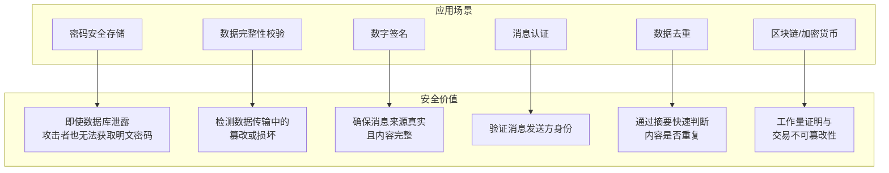
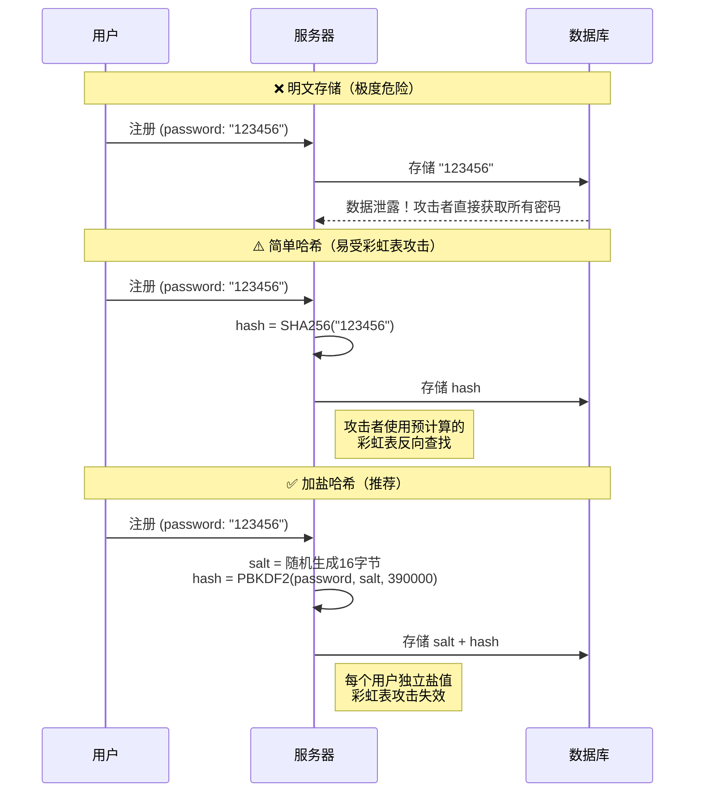
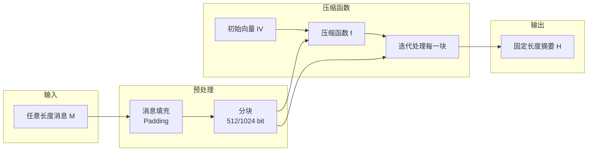
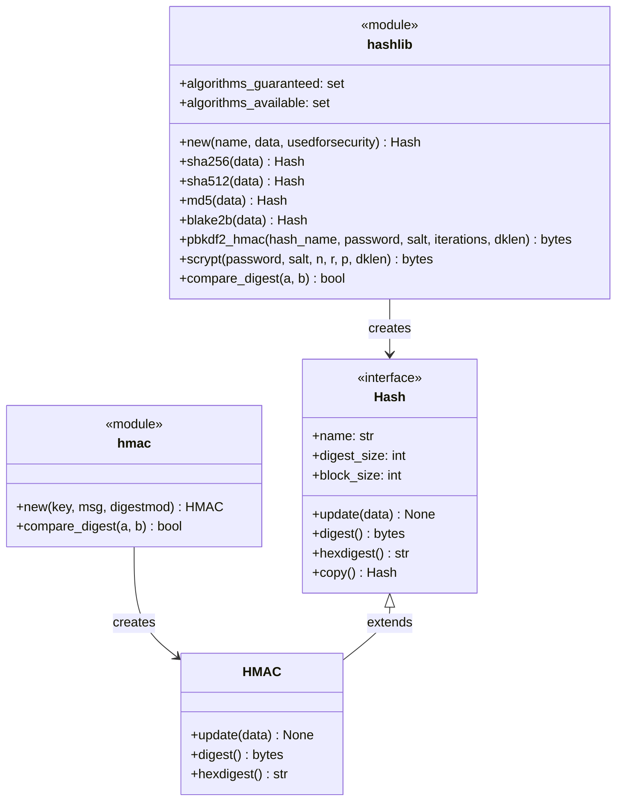
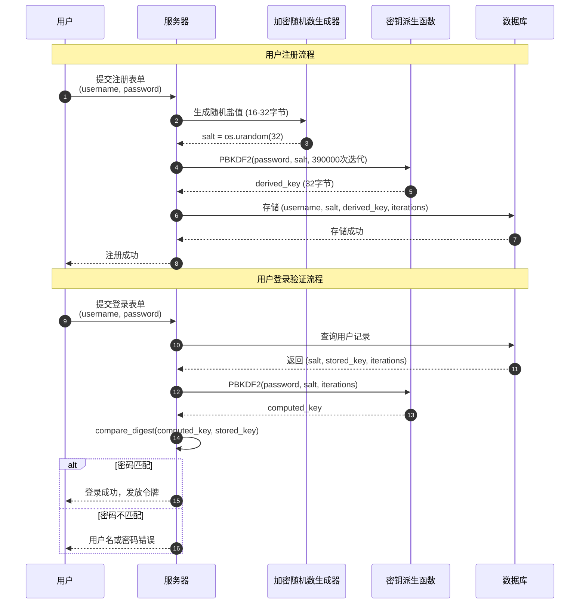

# hashlib — 安全哈希与消息摘要

## 一、什么是哈希函数？

哈希函数是一种将**任意长度**的输入数据转换为**固定长度**输出值的单向数学函数。这个固定长度的输出称为**哈希值**、**摘要**或**指纹**。

哈希函数具有以下核心特性：

| 特性 | 描述 |
|:---|:---|
| **确定性** | 相同输入永远产生相同输出 |
| **高效性** | 计算速度快，正向计算复杂度为 O(n) |
| **单向性** | 从哈希值无法逆向推导原始数据（计算上不可行） |
| **抗碰撞性** | 难以找到两个不同输入产生相同哈希值 |
| **雪崩效应** | 输入微小变化导致输出剧烈变化 |

```python
# 雪崩效应演示：输入仅改变一个字符，输出完全不同
import hashlib

hash1 = hashlib.sha256(b'Hello').hexdigest()
hash2 = hashlib.sha256(b'Hallo').hexdigest()  # 仅改变一个字符

print(f"Hello: {hash1}")
print(f"Hallo: {hash2}")
print(f"差异位数: ~{bin(int(hash1, 16) ^ int(hash2, 16)).count('1')} 位 (理论约128位)")
```

## 二、为什么需要哈希函数？

哈希函数在现代软件系统中扮演着不可替代的角色：



### 2.1 密码存储的演进



## 三、哈希算法原理

### 3.1 哈希算法工作流程



### 3.2 压缩函数详解

压缩函数是哈希算法的核心，以 SHA-256 为例：

```mermaid
flowchart TB
    subgraph 单轮压缩
        A[512位消息块 W<sub>i</sub>] --> B[消息扩展<br/>生成64个32位字]
        B --> C[工作变量<br/>a,b,c,d,e,f,g,h]
        C --> D[64轮循环处理]
        D --> E[更新哈希状态<br/>H<sub>0</sub>~H<sub>7</sub>]
    end

    subgraph 单轮操作
        F[Σ<sub>1</sub>(e)] --> G[Ch(e,f,g)]
        H[Temp1 = h + Σ<sub>1</sub> + Ch + K<sub>i</sub> + W<sub>i</sub>]
        I[Σ<sub>0</sub>(a)] --> J[Maj(a,b,c)]
        K[Temp2 = Σ<sub>0</sub> + Maj]
        L[状态更新]
    end

    D --> F
```

### 3.3 hashlib 模块架构



## 四、哈希算法对比

### 4.1 算法特性对比表

| 算法 | 摘要长度 | 分块大小 | 安全性 | 速度 | 推荐场景 |
|:---|:---:|:---:|:---:|:---:|:---|
| **MD5** | 128 bit (16字节) | 512 bit | ❌ 已破解 | ⚡⚡⚡⚡⚡ | 仅用于非安全场景（文件校验、去重） |
| **SHA-1** | 160 bit (20字节) | 512 bit | ❌ 已破解 | ⚡⚡⚡⚡ | 已弃用，不推荐使用 |
| **SHA-256** | 256 bit (32字节) | 512 bit | ✅ 安全 | ⚡⚡⚡ | 通用安全场景、密码存储、数字签名 |
| **SHA-512** | 512 bit (64字节) | 1024 bit | ✅ 安全 | ⚡⚡⚡⚡ | 64位系统优化、需要更长摘要 |
| **SHA3-256** | 256 bit (32字节) | 1088 bit | ✅ 安全 | ⚡⚡ | 新标准、抗量子计算潜力 |
| **BLAKE2b** | 512 bit (64字节) | 512 bit | ✅ 安全 | ⚡⚡⚡⚡⚡ | 高性能场景、替代SHA-2/3 |
| **BLAKE2s** | 256 bit (32字节) | 256 bit | ✅ 安全 | ⚡⚡⚡⚡⚡ | 移动设备、嵌入式系统 |

### 4.2 性能基准测试

```python
"""
哈希算法性能对比测试
运行环境：Python 3.11, MacBook Pro M1
"""
import hashlib
import time

def benchmark_hash(algorithm: str, data: bytes, iterations: int = 10000) -> float:
    """测试哈希算法性能，返回每秒处理 MB 数"""
    start = time.perf_counter()
    for _ in range(iterations):
        hashlib.new(algorithm, data).digest()
    elapsed = time.perf_counter() - start
    mb_per_sec = (len(data) * iterations) / (elapsed * 1024 * 1024)
    return mb_per_sec

# 测试数据：1MB
test_data = b'x' * (1024 * 1024)

print("=" * 50)
print(f"{'算法':<12} {'摘要长度':<10} {'速度 (MB/s)':<15} {'推荐度'}")
print("=" * 50)

algorithms = [
    ('md5', 16, '❌'),
    ('sha1', 20, '❌'),
    ('sha256', 32, '✅✅✅'),
    ('sha512', 64, '✅✅'),
    ('sha3_256', 32, '✅✅'),
    ('blake2b', 64, '✅✅✅'),
]

for algo, digest_len, recommend in algorithms:
    try:
        speed = benchmark_hash(algo, test_data, 1000)
        print(f"{algo:<12} {digest_len}字节{'':<6} {speed:<15.1f} {recommend}")
    except ValueError:
        print(f"{algo:<12} {'不支持':<10}")

print("=" * 50)
```

## 五、密码存储安全流程

### 5.1 安全密码存储完整流程



### 5.2 为什么不能直接用 SHA-256 存储密码？

```python
"""
演示为什么简单哈希不适合密码存储
"""
import hashlib
import time

# 模拟攻击者使用彩虹表攻击
RAINBOW_TABLE = {
    hashlib.sha256(b'123456').hexdigest(): '123456',
    hashlib.sha256(b'password').hexdigest(): 'password',
    hashlib.sha256(b'qwerty').hexdigest(): 'qwerty',
    hashlib.sha256(b'admin').hexdigest(): 'admin',
    # ... 实际彩虹表包含数十亿条记录
}

def crack_simple_hash(leaked_hash: str) -> str | None:
    """模拟彩虹表攻击"""
    return RAINBOW_TABLE.get(leaked_hash)

# 模拟数据库泄露
leaked_hash = hashlib.sha256(b'123456').hexdigest()
print(f"泄露的哈希值: {leaked_hash}")

# 攻击者瞬间破解
cracked = crack_simple_hash(leaked_hash)
print(f"破解结果: {cracked}")  # 瞬间得到 "123456"

# 而使用 PBKDF2，即使知道盐值，暴力破解也极其缓慢
def crack_pbkdf2(target_hash: bytes, salt: bytes, iterations: int) -> str | None:
    """模拟暴力破解 PBKDF2"""
    common_passwords = ['123456', 'password', 'qwerty', 'admin', 'letmein']
    for pwd in common_passwords:
        computed = hashlib.pbkdf2_hmac('sha256', pwd.encode(), salt, iterations)
        if computed == target_hash:
            return pwd
    return None

salt = b'\x12\x34\x56\x78' * 4  # 16字节盐值
iterations = 390000
secure_hash = hashlib.pbkdf2_hmac('sha256', b'123456', salt, iterations)

start = time.time()
result = crack_pbkdf2(secure_hash, salt, iterations)
elapsed = time.time() - start

print(f"\nPBKDF2 破解耗时: {elapsed:.2f}秒 (仅测试5个常见密码)")
print(f"若测试100万个密码，预计耗时: {elapsed * 200000:.0f}秒 ≈ {elapsed * 200000 / 3600:.1f}小时")
```

## 六、实战代码示例

### 6.1 文件完整性校验

```python
"""
文件完整性校验工具
支持大文件分块读取，避免内存溢出
"""
import hashlib
from pathlib import Path

def calculate_file_hash(
    filepath: str | Path,
    algorithm: str = 'sha256',
    chunk_size: int = 65536  # 64KB 块大小
) -> str:
    """
    计算文件哈希值

    Args:
        filepath: 文件路径
        algorithm: 哈希算法名称
        chunk_size: 分块大小（字节）

    Returns:
        十六进制格式的哈希值

    Raises:
        FileNotFoundError: 文件不存在
        ValueError: 不支持的算法
    """
    filepath = Path(filepath)

    if not filepath.exists():
        raise FileNotFoundError(f"文件不存在: {filepath}")

    # 验证算法是否可用
    if algorithm not in hashlib.algorithms_available:
        raise ValueError(f"不支持的算法: {algorithm}。可用算法: {hashlib.algorithms_available}")

    hash_obj = hashlib.new(algorithm)

    # 分块读取，内存友好
    with filepath.open('rb') as f:
        while chunk := f.read(chunk_size):
            hash_obj.update(chunk)

    return hash_obj.hexdigest()


def verify_file_integrity(
    filepath: str | Path,
    expected_hash: str,
    algorithm: str = 'sha256'
) -> bool:
    """
    验证文件完整性

    Args:
        filepath: 文件路径
        expected_hash: 预期的哈希值
        algorithm: 哈希算法

    Returns:
        True 表示文件完整，False 表示文件已损坏或被篡改
    """
    actual_hash = calculate_file_hash(filepath, algorithm)
    # 使用安全比较，防止时序攻击（虽然此处意义不大，但养成好习惯）
    return hashlib.compare_digest(actual_hash.lower(), expected_hash.lower())


# --- 使用示例 ---
if __name__ == "__main__":
    import os

    # 创建测试文件
    test_file = "test_document.txt"
    with open(test_file, 'w') as f:
        f.write("这是一份重要文档，需要验证完整性。\n" * 1000)

    # 计算哈希值
    file_hash = calculate_file_hash(test_file)
    print(f"文件: {test_file}")
    print(f"SHA-256: {file_hash}")
    print(f"文件大小: {os.path.getsize(test_file):,} 字节")

    # 验证完整性
    is_valid = verify_file_integrity(test_file, file_hash)
    print(f"完整性验证: {'✅ 通过' if is_valid else '❌ 失败'}")

    # 模拟篡改
    with open(test_file, 'a') as f:
        f.write("\n被篡改的内容")

    is_valid_after_tamper = verify_file_integrity(test_file, file_hash)
    print(f"篡改后验证: {'✅ 通过' if is_valid_after_tamper else '❌ 失败（检测到篡改）'}")

    # 清理
    os.remove(test_file)
```

### 6.2 安全密码存储系统

```python
"""
生产级密码存储系统
使用 PBKDF2-HMAC-SHA256 + 随机盐值
"""
import hashlib
import os
import secrets
from dataclasses import dataclass
from typing import Optional


@dataclass
class PasswordHash:
    """密码哈希结果"""
    salt: bytes          # 盐值
    hash: bytes          # 哈希值
    iterations: int      # 迭代次数
    algorithm: str       # 算法名称

    def to_string(self) -> str:
        """转换为存储格式字符串"""
        return f"{self.algorithm}${self.iterations}${self.salt.hex()}${self.hash.hex()}"

    @classmethod
    def from_string(cls, stored: str) -> 'PasswordHash':
        """从存储格式字符串解析"""
        parts = stored.split('$')
        if len(parts) != 4:
            raise ValueError("无效的密码哈希格式")
        return cls(
            algorithm=parts[0],
            iterations=int(parts[1]),
            salt=bytes.fromhex(parts[2]),
            hash=bytes.fromhex(parts[3])
        )


class PasswordManager:
    """
    密码管理器

    安全特性：
    - 使用 PBKDF2-HMAC-SHA256 密钥派生函数
    - 每个密码使用独立的随机盐值
    - 可配置迭代次数（默认 390000，示例值；OWASP 建议为 600000）
    - 使用 secrets 模块生成密码学安全随机数
    - 使用 compare_digest 防止时序攻击
    """

    # 迭代次数：OWASP 对 PBKDF2-HMAC-SHA256 的现行建议为 600000 次，
    # 示例取 390000，生产环境请按 OWASP 最新指引设置
    DEFAULT_ITERATIONS = 390000
    DEFAULT_SALT_LENGTH = 32  # 32字节 = 256位
    DEFAULT_HASH_LENGTH = 32  # 32字节 = 256位

    def __init__(
        self,
        iterations: int = DEFAULT_ITERATIONS,
        salt_length: int = DEFAULT_SALT_LENGTH,
        hash_length: int = DEFAULT_HASH_LENGTH
    ):
        self.iterations = iterations
        self.salt_length = salt_length
        self.hash_length = hash_length

    def hash_password(self, password: str) -> PasswordHash:
        """
        对密码进行安全哈希

        Args:
            password: 用户密码（明文）

        Returns:
            PasswordHash 对象，包含盐值、哈希值和参数
        """
        # 生成密码学安全的随机盐值
        salt = secrets.token_bytes(self.salt_length)

        # 使用 PBKDF2 派生密钥
        derived_key = hashlib.pbkdf2_hmac(
            'sha256',
            password.encode('utf-8'),
            salt,
            self.iterations,
            dklen=self.hash_length
        )

        return PasswordHash(
            salt=salt,
            hash=derived_key,
            iterations=self.iterations,
            algorithm='pbkdf2_sha256'
        )

    def verify_password(
        self,
        password: str,
        stored_hash: PasswordHash
    ) -> bool:
        """
        验证密码是否正确

        Args:
            password: 用户输入的密码
            stored_hash: 存储的密码哈希对象

        Returns:
            True 表示密码正确，False 表示密码错误
        """
        # 使用相同参数重新计算哈希
        computed_key = hashlib.pbkdf2_hmac(
            'sha256',
            password.encode('utf-8'),
            stored_hash.salt,
            stored_hash.iterations,
            dklen=len(stored_hash.hash)
        )

        # 使用恒定时间比较，防止时序攻击
        return hashlib.compare_digest(computed_key, stored_hash.hash)


# --- 使用示例 ---
if __name__ == "__main__":
    pm = PasswordManager()

    print("=" * 60)
    print("密码存储系统演示")
    print("=" * 60)

    # 用户注册
    password = "MySecurePassword123!"
    print(f"\n[注册] 用户密码: {password}")

    hashed = pm.hash_password(password)
    stored_string = hashed.to_string()

    print(f"[存储] 盐值: {hashed.salt.hex()[:32]}...")
    print(f"[存储] 哈希: {hashed.hash.hex()[:32]}...")
    print(f"[存储] 迭代次数: {hashed.iterations:,}")
    print(f"[存储] 完整字符串: {stored_string[:50]}...")

    # 用户登录 - 正确密码
    print("\n[登录] 尝试使用正确密码...")
    parsed_hash = PasswordHash.from_string(stored_string)
    is_valid = pm.verify_password(password, parsed_hash)
    print(f"[结果] {'✅ 登录成功' if is_valid else '❌ 登录失败'}")

    # 用户登录 - 错误密码
    print("\n[登录] 尝试使用错误密码...")
    is_valid_wrong = pm.verify_password("WrongPassword123!", parsed_hash)
    print(f"[结果] {'✅ 登录成功' if is_valid_wrong else '❌ 登录失败'}")
```

### 6.3 HMAC 消息认证

```python
"""
HMAC 消息认证码实现
用于验证消息的完整性和来源真实性
"""
import hmac
import hashlib
import json
from typing import Any


class MessageAuthenticator:
    """
    HMAC 消息认证器

    应用场景：
    - API 请求签名验证
    - Webhook 消息验证
    - 加密通信消息认证
    """

    def __init__(self, secret_key: bytes | str, algorithm: str = 'sha256'):
        """
        初始化认证器

        Args:
            secret_key: 共享密钥（必须保密）
            algorithm: 哈希算法
        """
        if isinstance(secret_key, str):
            secret_key = secret_key.encode('utf-8')
        self.secret_key = secret_key
        self.algorithm = algorithm

    def sign(self, message: bytes | str) -> str:
        """
        生成消息签名

        Args:
            message: 待签名的消息

        Returns:
            十六进制格式的 HMAC 签名
        """
        if isinstance(message, str):
            message = message.encode('utf-8')

        signature = hmac.new(
            self.secret_key,
            message,
            digestmod=self.algorithm
        ).hexdigest()

        return signature

    def verify(self, message: bytes | str, signature: str) -> bool:
        """
        验证消息签名

        Args:
            message: 原始消息
            signature: 待验证的签名

        Returns:
            True 表示签名有效，False 表示签名无效
        """
        expected_signature = self.sign(message)
        # 使用 compare_digest 防止时序攻击
        return hmac.compare_digest(expected_signature, signature)


class APISigner:
    """
    API 请求签名器
    实现类似 AWS Signature V4 的签名流程
    """

    def __init__(self, api_key: str, api_secret: str):
        self.api_key = api_key
        self.api_secret = api_secret
        self.authenticator = MessageAuthenticator(api_secret)

    def sign_request(
        self,
        method: str,
        path: str,
        query_params: dict[str, Any] | None = None,
        body: dict[str, Any] | None = None,
        timestamp: str | None = None
    ) -> dict[str, str]:
        """
        生成 API 请求签名

        Args:
            method: HTTP 方法
            path: 请求路径
            query_params: 查询参数
            body: 请求体
            timestamp: 时间戳（可选）

        Returns:
            包含签名信息的请求头字典
        """
        import time

        if timestamp is None:
            timestamp = str(int(time.time()))

        if query_params is None:
            query_params = {}

        # 构建规范请求字符串
        canonical_query = '&'.join(f"{k}={v}" for k, v in sorted(query_params.items()))
        canonical_body = json.dumps(body, separators=(',', ':')) if body else ''

        string_to_sign = f"{method}\n{path}\n{canonical_query}\n{canonical_body}\n{timestamp}"

        # 生成签名
        signature = self.authenticator.sign(string_to_sign)

        return {
            'X-API-Key': self.api_key,
            'X-API-Timestamp': timestamp,
            'X-API-Signature': signature,
            'Content-Type': 'application/json'
        }

    def verify_request(
        self,
        method: str,
        path: str,
        query_params: dict[str, Any] | None,
        body: dict[str, Any] | None,
        timestamp: str,
        provided_signature: str,
        max_skew_seconds: int = 300
    ) -> bool:
        """
        验证 API 请求签名

        Args:
            method: HTTP 方法
            path: 请求路径
            query_params: 查询参数
            body: 请求体
            timestamp: 请求时间戳
            provided_signature: 客户端提供的签名
            max_skew_seconds: 允许的最大时间偏差（秒）

        Returns:
            True 表示验证通过，False 表示验证失败
        """
        import time

        # 检查时间戳是否在允许范围内（防止重放攻击）
        current_time = int(time.time())
        request_time = int(timestamp)

        if abs(current_time - request_time) > max_skew_seconds:
            print(f"时间戳验证失败: 当前 {current_time}, 请求 {request_time}")
            return False

        # 构建规范请求字符串
        canonical_query = '&'.join(f"{k}={v}" for k, v in sorted((query_params or {}).items()))
        canonical_body = json.dumps(body, separators=(',', ':')) if body else ''

        string_to_sign = f"{method}\n{path}\n{canonical_query}\n{canonical_body}\n{timestamp}"

        # 验证签名
        return self.authenticator.verify(string_to_sign, provided_signature)


# --- 使用示例 ---
if __name__ == "__main__":
    print("=" * 60)
    print("HMAC 消息认证演示")
    print("=" * 60)

    # 1. 基本消息认证
    print("\n[场景1] 基本消息认证")
    authenticator = MessageAuthenticator("super_secret_key_12345")

    message = "这是一条重要消息，需要验证来源"
    signature = authenticator.sign(message)
    print(f"消息: {message}")
    print(f"签名: {signature}")

    # 验证
    is_valid = authenticator.verify(message, signature)
    print(f"验证结果: {'✅ 有效' if is_valid else '❌ 无效'}")

    # 篡改检测
    is_valid_tampered = authenticator.verify(message + "被篡改", signature)
    print(f"篡改后验证: {'✅ 有效' if is_valid_tampered else '❌ 无效（检测到篡改）'}")

    # 2. API 签名
    print("\n[场景2] API 请求签名")
    signer = APISigner(
        api_key="client_app_001",
        api_secret="api_secret_key_xyz"
    )

    headers = signer.sign_request(
        method="POST",
        path="/api/v1/users",
        body={"name": "张三", "email": "zhangsan@example.com"}
    )

    print("请求头:")
    for k, v in headers.items():
        print(f"  {k}: {v[:40]}{'...' if len(v) > 40 else ''}")
```

### 6.4 大文件哈希优化

```python
"""
大文件哈希处理优化
支持进度回调和多算法并行计算
"""
import hashlib
from pathlib import Path
from typing import Callable, Iterator


class FileHasher:
    """
    高效文件哈希计算器

    特性：
    - 内存高效的分块处理
    - 支持进度回调
    - 支持多算法同时计算
    - 支持文件流式处理
    """

    DEFAULT_CHUNK_SIZE = 65536  # 64KB

    def __init__(self, algorithms: list[str] | None = None):
        """
        初始化哈希计算器

        Args:
            algorithms: 要计算的算法列表，默认 ['sha256']
        """
        self.algorithms = algorithms or ['sha256']

    def calculate(
        self,
        filepath: str | Path,
        chunk_size: int = DEFAULT_CHUNK_SIZE,
        progress_callback: Callable[[int, int], None] | None = None
    ) -> dict[str, str]:
        """
        计算文件的多个哈希值

        Args:
            filepath: 文件路径
            chunk_size: 分块大小
            progress_callback: 进度回调函数 (已处理字节数, 总字节数)

        Returns:
            算法名到哈希值的映射字典
        """
        filepath = Path(filepath)
        file_size = filepath.stat().st_size

        # 为每个算法创建哈希对象
        hash_objects = {
            algo: hashlib.new(algo)
            for algo in self.algorithms
        }

        processed = 0

        with filepath.open('rb') as f:
            while chunk := f.read(chunk_size):
                for hash_obj in hash_objects.values():
                    hash_obj.update(chunk)

                processed += len(chunk)

                if progress_callback:
                    progress_callback(processed, file_size)

        return {
            algo: hash_obj.hexdigest()
            for algo, hash_obj in hash_objects.items()
        }

    def calculate_stream(
        self,
        stream: Iterator[bytes],
        algorithms: list[str] | None = None
    ) -> dict[str, str]:
        """
        计算数据流的哈希值

        Args:
            stream: 字节流迭代器
            algorithms: 算法列表

        Returns:
            算法名到哈希值的映射
        """
        algos = algorithms or self.algorithms
        hash_objects = {algo: hashlib.new(algo) for algo in algos}

        for chunk in stream:
            for hash_obj in hash_objects.values():
                hash_obj.update(chunk)

        return {algo: obj.hexdigest() for algo, obj in hash_objects.items()}


def format_size(size_bytes: int) -> str:
    """格式化文件大小"""
    for unit in ['B', 'KB', 'MB', 'GB', 'TB']:
        if size_bytes < 1024:
            return f"{size_bytes:.2f} {unit}"
        size_bytes /= 1024
    return f"{size_bytes:.2f} PB"


# --- 使用示例 ---
if __name__ == "__main__":
    import os
    import time

    # 创建测试大文件 (100MB)
    test_file = "large_test_file.bin"
    file_size = 100 * 1024 * 1024  # 100MB

    print(f"创建测试文件: {test_file} ({format_size(file_size)})")
    with open(test_file, 'wb') as f:
        f.write(os.urandom(file_size))

    # 计算多个哈希值
    hasher = FileHasher(['md5', 'sha256', 'sha512', 'blake2b'])

    def progress_callback(processed: int, total: int):
        percent = (processed / total) * 100
        bar_length = 40
        filled = int(bar_length * processed / total)
        bar = '█' * filled + '░' * (bar_length - filled)
        print(f"\r进度: [{bar}] {percent:.1f}% ({format_size(processed)}/{format_size(total)})", end='')

    print("\n计算哈希值...")
    start = time.time()
    hashes = hasher.calculate(test_file, progress_callback=progress_callback)
    elapsed = time.time() - start

    print(f"\n\n计算完成，耗时: {elapsed:.2f}秒")
    print(f"处理速度: {format_size(file_size / elapsed)}/s")
    print("\n哈希值:")
    for algo, hash_value in hashes.items():
        print(f"  {algo:<10}: {hash_value[:40]}...")

    # 清理
    os.remove(test_file)
```

## 七、第三方密码哈希库推荐

### 7.1 bcrypt

```python
"""
bcrypt 密码哈希库
专为密码存储设计，内置盐值和可调工作因子
"""
# 安装: pip install bcrypt

import bcrypt


def hash_password_bcrypt(password: str, rounds: int = 12) -> str:
    """
    使用 bcrypt 哈希密码

    Args:
        password: 用户密码
        rounds: 工作因子（2^rounds 次迭代），默认12

    Returns:
        包含算法信息、盐值和哈希值的字符串
    """
    # bcrypt 自动生成盐值并包含在结果中
    salt = bcrypt.gensalt(rounds=rounds)
    hashed = bcrypt.hashpw(password.encode('utf-8'), salt)
    return hashed.decode('utf-8')


def verify_password_bcrypt(password: str, hashed: str) -> bool:
    """验证 bcrypt 密码"""
    return bcrypt.checkpw(password.encode('utf-8'), hashed.encode('utf-8'))


# --- 示例 ---
if __name__ == "__main__":
    password = "SecurePassword123!"

    hashed = hash_password_bcrypt(password)
    print(f"bcrypt 哈希: {hashed}")
    # 格式: $2b$12$<22字符盐值><31字符哈希>

    is_valid = verify_password_bcrypt(password, hashed)
    print(f"验证结果: {'✅' if is_valid else '❌'}")
```

### 7.2 argon2（推荐）

```python
"""
argon2 密码哈希库
密码哈希竞赛冠军，抗 GPU/ASIC 攻击
"""
# 安装: pip install argon2-cffi

from argon2 import PasswordHasher
from argon2.exceptions import VerifyMismatchError


# 创建哈希器（使用默认安全参数）
ph = PasswordHasher(
    time_cost=3,        # 迭代次数
    memory_cost=65536,  # 内存使用 (KB)
    parallelism=4,      # 并行线程数
    hash_len=32,        # 哈希长度
    salt_len=16         # 盐值长度
)


def hash_password_argon2(password: str) -> str:
    """
    使用 argon2 哈希密码

    Returns:
        包含所有参数的哈希字符串
    """
    return ph.hash(password)


def verify_password_argon2(password: str, hashed: str) -> bool:
    """验证 argon2 密码"""
    try:
        ph.verify(hashed, password)
        return True
    except VerifyMismatchError:
        return False


# --- 示例 ---
if __name__ == "__main__":
    password = "SuperSecurePassword2024!"

    hashed = hash_password_argon2(password)
    print(f"argon2 哈希: {hashed}")
    # 格式: $argon2id$v=19$m=65536,t=3,p=4$<盐值>$<哈希>

    is_valid = verify_password_argon2(password, hashed)
    print(f"验证结果: {'✅' if is_valid else '❌'}")
```

### 7.3 密码哈希库对比

| 特性 | PBKDF2 | bcrypt | scrypt | argon2 |
|:---|:---:|:---:|:---:|:---:|
| **内置盐值** | ❌ 需手动管理 | ✅ 自动生成 | ✅ 自动生成 | ✅ 自动生成 |
| **抗 GPU 攻击** | ⚠️ 一般 | ✅ 较好 | ✅ 很好 | ✅ 最佳 |
| **抗 ASIC 攻击** | ❌ 弱 | ⚠️ 一般 | ✅ 很好 | ✅ 最佳 |
| **内存硬度** | ❌ 无 | ⚠️ 有限 | ✅ 可配置 | ✅ 可配置 |
| **Python 内置** | ✅ 是 | ❌ 需安装 | ✅ 是 | ❌ 需安装 |
| **推荐指数** | ⭐⭐⭐ | ⭐⭐⭐⭐ | ⭐⭐⭐⭐ | ⭐⭐⭐⭐⭐ |

## 八、常见陷阱与 FAQ

### FAQ 1：MD5 已不安全，为什么 Python 还保留它？

**回答**：MD5 虽然在安全场景已被弃用，但在非安全场景仍有价值：

```python
"""
MD5 的合法使用场景
"""
import hashlib

# ✅ 合法场景1：文件快速校验（非安全目的）
# 用于检测文件是否变化，而非防止恶意篡改
def detect_file_change(filepath: str) -> str:
    return hashlib.md5(open(filepath, 'rb').read()).hexdigest()

# ✅ 合法场景2：数据去重
# 利用哈希碰撞概率极低的特点进行快速比对
def deduplicate_files(files: list[bytes]) -> dict[str, bytes]:
    unique = {}
    for f in files:
        key = hashlib.md5(f).hexdigest()
        if key not in unique:
            unique[key] = f
    return unique

# ✅ 合法场景3：缓存键生成
def get_cache_key(query: str, params: dict) -> str:
    data = query + str(sorted(params.items()))
    return hashlib.md5(data.encode()).hexdigest()

# ❌ 危险场景：密码存储
def insecure_password_hash(password: str) -> str:
    return hashlib.md5(password.encode()).hexdigest()  # 绝对不要这样做！
```

### FAQ 2：盐值应该多长？

**回答**：盐值长度应至少与哈希输出长度相同，推荐 16-32 字节。

```python
"""
盐值长度建议
"""
import os
import hashlib

# ❌ 太短：容易被枚举
salt_too_short = os.urandom(4)  # 仅 32 位，约 40 亿种可能

# ⚠️ 勉强够用
salt_acceptable = os.urandom(8)  # 64 位

# ✅ 推荐：与哈希输出长度匹配
salt_recommended = os.urandom(16)  # 128 位，用于 MD5/SHA-256

# ✅ 最佳实践：使用更长的盐值
salt_best = os.urandom(32)  # 256 位

# 为什么？盐值的作用是确保即使两个用户使用相同密码，
# 他们的哈希值也不同，从而阻止彩虹表攻击。
# 盐值不需要保密，但必须唯一且足够长。
```

### FAQ 3：什么是哈希碰撞？如何应对？

**回答**：哈希碰撞是指两个不同输入产生相同哈希值。

```python
"""
哈希碰撞演示与应对
"""
import hashlib

# MD5 碰撞已被实际演示
# 以下两个不同的文件内容产生相同的 MD5 哈希值
# （这是著名的 MD5 碰撞示例，实际数据略）

def demonstrate_collision_risk():
    """
    演示为什么 MD5 不应用于安全场景
    """
    # 模拟：攻击者创建两个文件
    # 文件A：正常合同
    # 文件B：修改后的合同
    # 如果 MD5 相同，接收方无法检测篡改

    print("MD5 碰撞风险：")
    print("  - 2004年，中国学者王小云团队发现 MD5 碰撞方法")
    print("  - 2008年，实际伪造了 SSL 证书")
    print("  - 结论：MD5 绝不能用于数字签名、证书等安全场景")

# 应对策略
def secure_hash_choice():
    """
    安全的哈希算法选择
    """
    # ✅ 安全选择
    safe_algorithms = ['sha256', 'sha512', 'sha3_256', 'sha3_512', 'blake2b']

    # 对于密码存储，使用专门的 KDF
    # PBKDF2, bcrypt, scrypt, argon2

    # 对于数字签名，使用 SHA-256 或更高
    return hashlib.sha256
```

### FAQ 4：如何处理超大文件哈希？

**回答**：使用分块读取，避免一次性加载到内存。

```python
"""
超大文件哈希处理
"""
import hashlib
from pathlib import Path

def hash_large_file(
    filepath: str | Path,
    algorithm: str = 'sha256',
    chunk_size: int = 1024 * 1024  # 1MB
) -> str:
    """
    内存高效的大文件哈希计算

    Args:
        filepath: 文件路径
        algorithm: 哈希算法
        chunk_size: 每次读取的块大小

    内存使用：仅 chunk_size 大小，与文件大小无关
    """
    hash_obj = hashlib.new(algorithm)

    with open(filepath, 'rb') as f:
        while True:
            chunk = f.read(chunk_size)
            if not chunk:
                break
            hash_obj.update(chunk)

    return hash_obj.hexdigest()

# 对于 TB 级文件，可以考虑：
# 1. 增大 chunk_size（如 64MB）
# 2. 使用多线程并行处理不同文件块（需要特殊算法支持）
# 3. 使用内存映射 (mmap)
```

### FAQ 5：为什么验证密码时要使用 compare_digest？

**回答**：防止时序攻击（Timing Attack）。

```python
"""
时序攻击演示
"""
import hashlib
import time

def insecure_compare(a: str, b: str) -> bool:
    """
    不安全的字符串比较
    逐字符比较，一旦不匹配立即返回
    """
    if len(a) != len(b):
        return False
    for i in range(len(a)):
        if a[i] != b[i]:
            return False  # 提前返回，泄露位置信息
    return True

def secure_compare(a: str, b: str) -> bool:
    """
    安全的字符串比较
    使用 hashlib.compare_digest，恒定时间
    """
    return hashlib.compare_digest(a.encode(), b.encode())

# 时序攻击原理：
# 攻击者可以测量比较操作的耗时
# 如果第一个字符不匹配，函数立即返回（耗时短）
# 如果第一个字符匹配，继续比较第二个（耗时长一点）
# 通过大量测试，攻击者可以逐字符猜测正确的哈希值

# 演示
def timing_attack_demo():
    """
    演示时序攻击风险（简化版）
    """
    target = "abc123"

    # 攻击者尝试不同输入，测量响应时间
    guesses = ["a", "b", "x", "abc", "abx"]

    for guess in guesses:
        start = time.perf_counter_ns()
        insecure_compare(target, guess)
        elapsed = time.perf_counter_ns() - start
        # 实际攻击中，攻击者会进行大量统计
        # 匹配更多字符的输入耗时更长
        print(f"猜测 '{guess}': {elapsed} ns")

# 结论：始终使用 hashlib.compare_digest 或 hmac.compare_digest
```

## 术语表

| 术语 | 英文 | 定义 |
|:---|:---|:---|
| **哈希函数** | Hash Function | 将任意长度输入映射为固定长度输出的单向函数 |
| **摘要** | Digest / Hash | 哈希函数的输出结果 |
| **碰撞** | Collision | 两个不同输入产生相同哈希值的情况 |
| **雪崩效应** | Avalanche Effect | 输入微小变化导致输出剧烈变化的特性 |
| **盐值** | Salt | 哈希计算前添加的随机数据，用于防止彩虹表攻击 |
| **彩虹表** | Rainbow Table | 预计算的哈希值到明文的映射表 |
| **密钥派生函数** | Key Derivation Function (KDF) | 从密码派生密钥的函数，通常包含迭代和盐值 |
| **HMAC** | Hash-based Message Authentication Code | 基于哈希的消息认证码 |
| **PBKDF2** | Password-Based Key Derivation Function 2 | 基于密码的密钥派生函数标准 |
| **时序攻击** | Timing Attack | 通过测量操作耗时推断信息的侧信道攻击 |
| **原像攻击** | Preimage Attack | 给定哈希值，寻找能产生该哈希值的输入 |
| **第二原像攻击** | Second Preimage Attack | 给定输入，寻找另一个产生相同哈希值的输入 |
| **工作因子** | Work Factor | 哈希计算的迭代次数或复杂度参数 |
| **内存硬度** | Memory Hardness | 算法对内存资源的依赖程度，用于抵抗 GPU/ASIC 攻击 |

## 延伸阅读

### 官方文档

- [Python hashlib 文档](https://docs.python.org/3/library/hashlib.html)
- [Python hmac 文档](https://docs.python.org/3/library/hmac.html)
- [OWASP 密码存储指南](https://cheatsheetseries.owasp.org/cheatsheets/Password_Storage_Cheat_Sheet.html)

### 标准规范

- [FIPS 202: SHA-3 标准](https://csrc.nist.gov/publications/detail/fips/202/final)
- [RFC 2104: HMAC 规范](https://tools.ietf.org/html/rfc2104)
- [RFC 7914: scrypt 密钥派生函数](https://tools.ietf.org/html/rfc7914)
- [RFC 9106: Argon2 密码哈希](https://tools.ietf.org/html/rfc9106)

### 安全研究

- [王小云团队 MD5/SHA-1 碰撞研究](https://eprint.iacr.org/2005/297.pdf)
- [Password Hashing Competition (PHC)](https://www.password-hashing.net/)
- [NIST 数字签名标准](https://csrc.nist.gov/publications/detail/fips/186/5/final)

### 推荐书籍

- 《应用密码学》- Bruce Schneier
- 《密码学原理与实践》- Douglas R. Stinson
- 《深入理解计算机安全》- Joseph Migga Kizza

---

## API 速查表

### hashlib 模块

| 函数/属性 | 描述 |
|:---|:---|
| `new(name, data=b'', *, usedforsecurity=True)` | 通用构造函数 |
| `sha256(data=b'')` | SHA-256 构造函数 |
| `sha512(data=b'')` | SHA-512 构造函数 |
| `blake2b(data=b'')` | BLAKE2b 构造函数 |
| `algorithms_guaranteed` | 保证可用的算法集合 |
| `algorithms_available` | 当前环境所有可用算法 |
| `pbkdf2_hmac(hash_name, password, salt, iterations, dklen=None)` | PBKDF2 密钥派生 |
| `scrypt(password, *, salt, n, r, p, maxmem=0, dklen=64)` | scrypt 密钥派生 |
| `compare_digest(a, b)` | 安全比较（防时序攻击） |

### 哈希对象方法

| 方法/属性 | 描述 |
|:---|:---|
| `update(data)` | 更新哈希对象 |
| `digest()` | 返回字节串格式摘要 |
| `hexdigest()` | 返回十六进制字符串格式摘要 |
| `copy()` | 复制哈希对象 |
| `name` | 算法名称 |
| `digest_size` | 摘要字节长度 |
| `block_size` | 内部块字节长度 |

### hmac 模块

| 函数 | 描述 |
|:---|:---|
| `new(key, msg=None, digestmod='')` | 创建 HMAC 对象 |
| `compare_digest(a, b)` | 安全比较 |

## 版本差异（标准库 → Python 3.14）

| 模块/特性 | 本文编写时 | Python 3.14 变化 |
|-----------|-----------|------------------|
| `datetime` | `utcnow()` / `utcfromtimestamp()` | 3.12 起弃用，改用 `datetime.now(tz=datetime.UTC)` / `fromtimestamp(ts, tz=datetime.UTC)`（aware 对象） |
| `asyncio` | 基础 API | 3.14 新增内省能力（`asyncio.Task`/`Future` 状态查询）；3.11 起推荐 `TaskGroup` + `asyncio.timeout()` |
| `typing` | 旧式 `List`/`Dict` | 3.9+ 内置泛型；3.10+ 联合类型 `X \| Y`；3.12 `type` 语句；3.14 PEP 649 延迟注解 |
| `importlib` | `imp` 模块 | `imp` 于 3.12 移除，统一使用 `importlib` |
| 压缩 | zlib/gzip/bz2/lzma | 3.14 新增 `zstandard` 标准库支持（PEP 784） |
| `pathlib` | 基础路径操作 | 3.12+ 持续增强（`Path.walk()` 等）；`is_relative_to()` 自 3.9 起可用 |
| 往事清理 | — | 3.13 移除 `cgi`、`telnetlib`、`crypt`、`audioop` 等已废弃模块 |

> 本文讲解的模块核心 API 与使用模式在 3.14 中保持稳定；注意上述弃用/移除项，升级时优先用标准库推荐的替代方案。
