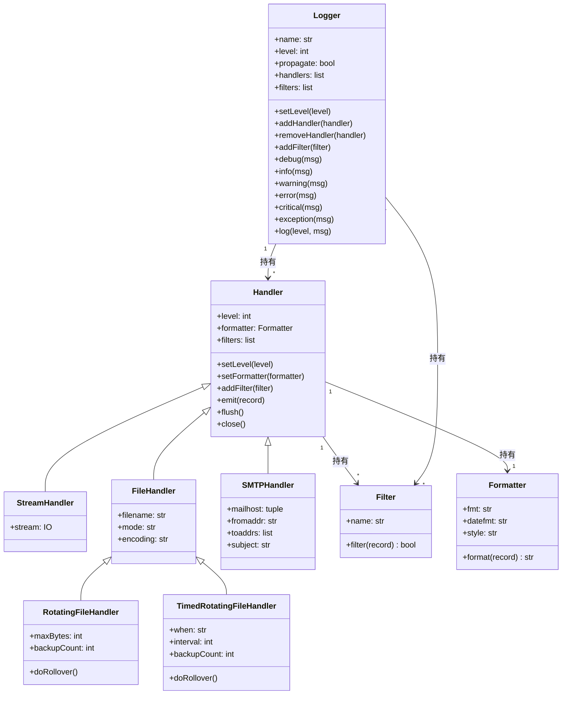
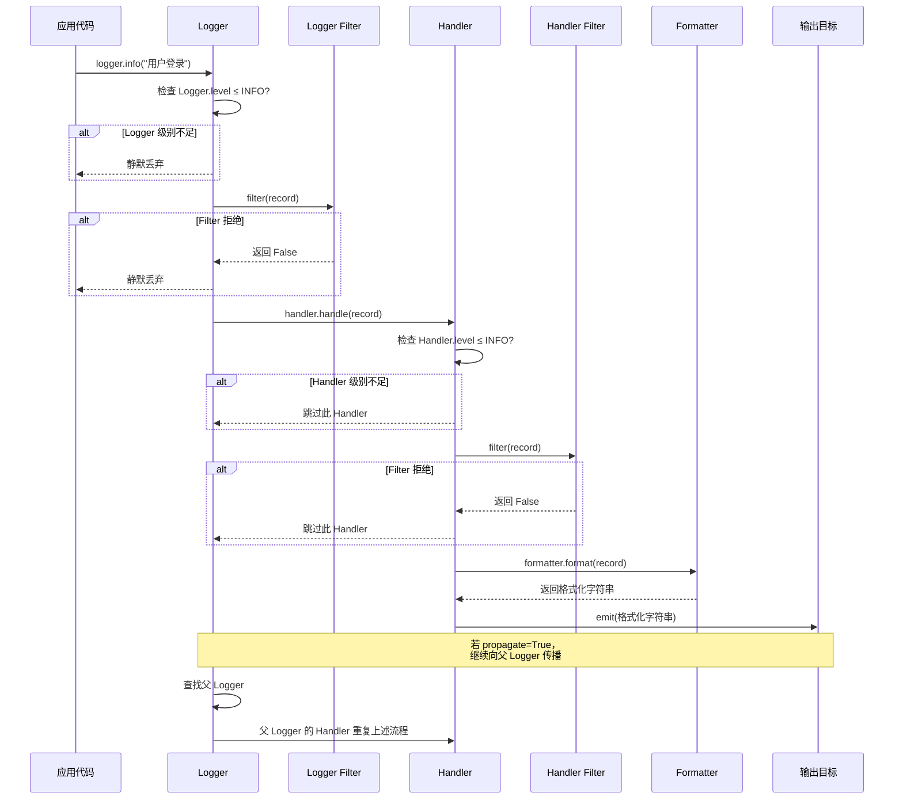
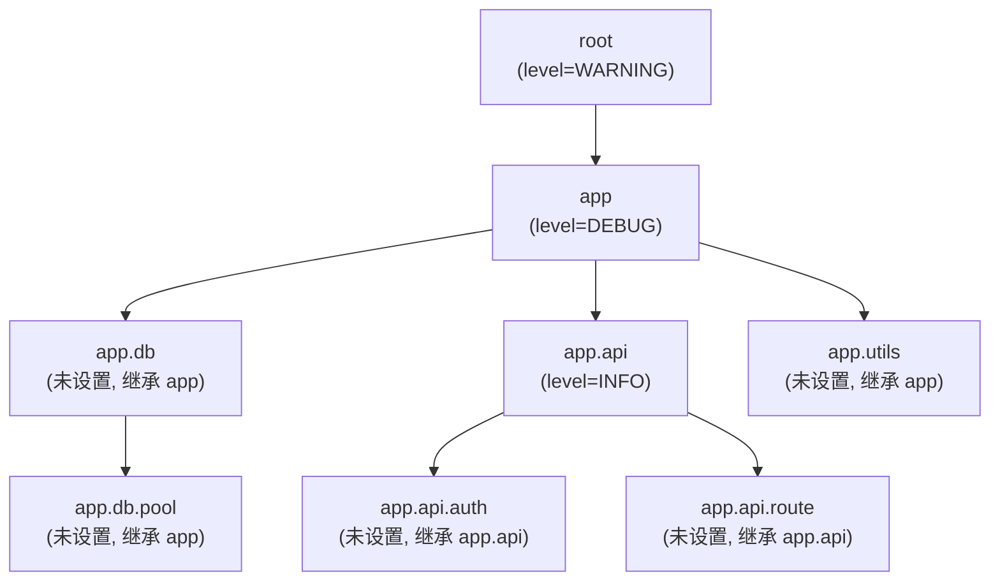
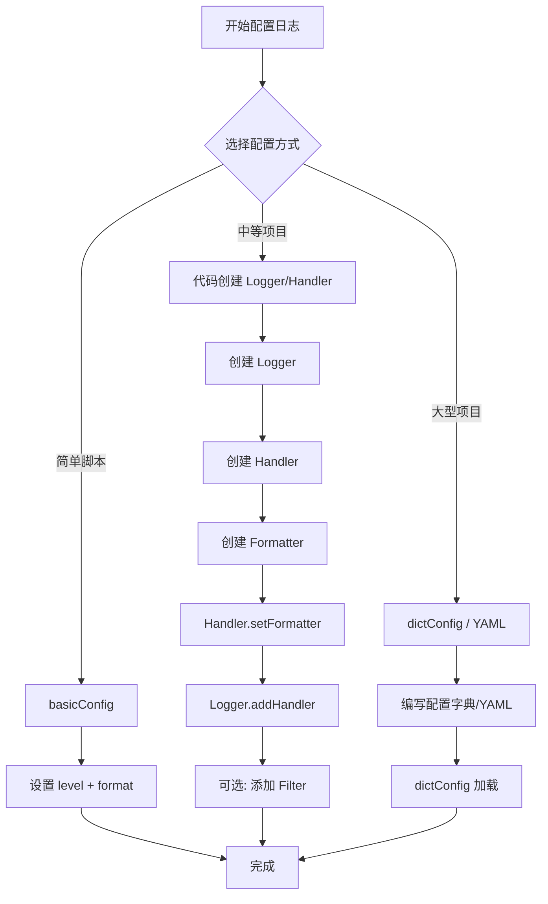

# logging 日志模块

Python 的 `logging` 模块是标准库中功能最强大、设计最灵活的基础设施之一。它采用经典的 **Logger → Handler → Filter → Formatter** 四层架构，支持多目标输出、日志轮转、层级传播、线程安全等生产级特性，是替代 `print()` 调试的终极方案。

## 一、是什么 —— logging 模块全景

### 1.1 为什么需要日志

| 场景 | 用 print？ | 用 logging？ | 说明 |
|------|-----------|-------------|------|
| 开发调试 | 勉强可用 | 推荐 | logging 可按级别开关，print 需手动删除 |
| 生产监控 | 不可用 | 必须 | logging 支持文件轮转、远程发送、结构化输出 |
| 异常追踪 | 丢失堆栈 | 完整保留 | `logger.exception()` 自动记录完整 traceback |
| 多模块协作 | 输出混乱 | 层级可控 | Logger 命名空间与模块结构一一对应 |
| 性能影响 | 同步阻塞 | 可异步 | QueueHandler 实现非阻塞日志写入 |

**核心定位**：logging 是 Python 应用的"黑匣子"，记录程序运行时的所有关键事件，为调试、监控、审计提供可追溯的数据。

### 1.2 日志级别对照表

日志级别按严重程度从低到高排列，每级对应一个整数值：

| 级别 | 数值 | 何时使用 | 典型场景 |
|------|------|---------|---------|
| `DEBUG` | 10 | 开发调试阶段，需要最详细的信息 | 变量值、函数调用链、算法中间结果 |
| `INFO` | 20 | 确认程序按预期运行 | 服务启动/停止、请求处理完成、定时任务执行 |
| `WARNING` | 30 | 潜在问题，程序仍可运行 | 磁盘空间不足、配置项缺失使用默认值、API 即将废弃 |
| `ERROR` | 40 | 严重问题，部分功能失效 | 数据库连接失败、文件读写异常、外部服务超时 |
| `CRITICAL` | 50 | 致命错误，程序可能无法继续 | 内存耗尽、核心服务崩溃、数据损坏 |

> **默认级别是 WARNING**：即只记录 WARNING 及以上级别的事件。开发阶段建议设为 DEBUG，生产环境建议设为 INFO。

### 1.3 logging 架构类图

logging 模块采用四层架构，各组件职责清晰：



**四层职责速览**：

| 组件 | 职责 | 类比 |
|------|------|------|
| **Logger** | 入口，暴露日志记录接口，按级别和过滤器筛选事件 | 邮局的收件窗口 |
| **Handler** | 分发，将日志发送到指定目标（控制台/文件/邮件等） | 邮局的分拣中心 |
| **Filter** | 细粒度过滤，基于任意属性决定是否放行 | 邮局的安检机 |
| **Formatter** | 格式化，将 LogRecord 转为最终输出字符串 | 邮局的信封格式 |

## 二、为什么 —— 日志传播流程

### 2.1 日志传播时序图

一条日志从 `logger.info()` 调用到最终输出，经历完整的传播链：



**关键机制**：

1. **双重级别检查**：Logger 级别是"第一道门"，Handler 级别是"第二道门"。只有同时通过两道门的日志才会被输出。
2. **传播机制**：默认 `propagate=True`，日志会沿 Logger 层级向上传播到所有祖先 Logger 的 Handler。
3. **Filter 双重过滤**：Logger 和 Handler 都可以添加 Filter，任一 Filter 返回 False 即丢弃。

### 2.2 Logger 层级结构图

Logger 通过点号分隔的命名空间形成树形层级：



**层级规则**：

- `root` 是所有 Logger 的祖先，默认级别为 WARNING
- 子 Logger 未设置级别时，**继承**最近设置了级别的祖先的级别
- 日志记录时，事件会**向上传播**到所有祖先 Logger 的 Handler（除非 `propagate=False`）
- 推荐使用 `logging.getLogger(__name__)` 让 Logger 名称与模块路径对应

```python
import logging

# 层级继承演示
root_logger = logging.getLogger()              # root，默认 WARNING
app_logger = logging.getLogger('app')           # app
app_logger.setLevel(logging.DEBUG)              # 显式设置 DEBUG
db_logger = logging.getLogger('app.db')         # 未设置级别，继承 app 的 DEBUG
pool_logger = logging.getLogger('app.db.pool')  # 未设置级别，继承 app 的 DEBUG

# 验证有效级别
print(pool_logger.getEffectiveLevel())  # 10 (DEBUG)，从 app 继承
```

## 三、怎么做 —— 从入门到生产级配置

### 3.1 日志配置流程图



### 3.2 基础用法：basicConfig 快速上手

`basicConfig` 适合简单脚本，一次调用即可完成配置。

```python
import logging

# basicConfig 只在第一次调用时生效，后续调用无效
logging.basicConfig(
    level=logging.DEBUG,                                    # 设置最低级别为 DEBUG
    format='%(asctime)s - %(name)s - %(levelname)s - %(message)s',  # 日志格式
    datefmt='%Y-%m-%d %H:%M:%S',                            # 时间格式
    filename='app.log',                                     # 输出到文件（不指定则输出到控制台）
    filemode='a',                                           # 追加模式（'w' 为覆盖）
    encoding='utf-8',                                       # 文件编码（Python 3.9+）
)

# 记录不同级别的日志
logging.debug('调试信息：变量 x = 42')       # 开发调试用
logging.info('程序启动完成')                  # 确认正常运行
logging.warning('磁盘空间不足 20%')           # 潜在问题
logging.error('数据库连接超时')               # 功能异常
logging.critical('系统内存耗尽，即将退出')     # 致命错误
```

**输出示例**：

```text
2026-06-04 10:30:00 - root - DEBUG - 调试信息：变量 x = 42
2026-06-04 10:30:00 - root - INFO - 程序启动完成
2026-06-04 10:30:00 - root - WARNING - 磁盘空间不足 20%
2026-06-04 10:30:00 - root - ERROR - 数据库连接超时
2026-06-04 10:30:00 - root - CRITICAL - 系统内存耗尽，即将退出
```

> **注意**：`basicConfig` 只在 root Logger 没有 Handler 时才生效。如果之前已经调用过（比如第三方库配置过），再次调用不会产生任何效果。

### 3.3 进阶用法：Logger + Handler + Formatter

当需要不同目标使用不同级别和格式时，必须手动创建 Logger、Handler、Formatter。

```python
import logging

# 1. 创建 Logger（每个模块一个，用 __name__ 命名）
logger = logging.getLogger(__name__)       # Logger 名称 = 模块名
logger.setLevel(logging.DEBUG)             # Logger 级别设为最低，由 Handler 控制

# 2. 创建控制台 Handler —— 开发时看 INFO 及以上
console_handler = logging.StreamHandler()  # 输出到 sys.stderr
console_handler.setLevel(logging.INFO)     # 控制台只显示 INFO 及以上

# 3. 创建文件 Handler —— 记录所有 DEBUG 及以上
file_handler = logging.FileHandler(
    'debug.log',                           # 日志文件路径
    mode='a',                              # 追加模式
    encoding='utf-8',                      # 指定编码，避免中文乱码
)
file_handler.setLevel(logging.DEBUG)       # 文件记录所有级别

# 4. 创建 Formatter —— 定义输出格式
console_fmt = logging.Formatter(
    '%(asctime)s [%(levelname)s] %(message)s',       # 简洁格式
    datefmt='%H:%M:%S',                               # 只显示时分秒
)
file_fmt = logging.Formatter(
    '%(asctime)s - %(name)s - %(levelname)s - '
    '%(filename)s:%(lineno)d - %(message)s',          # 详细格式
    datefmt='%Y-%m-%d %H:%M:%S',
)

# 5. 将 Formatter 绑定到 Handler
console_handler.setFormatter(console_fmt)
file_handler.setFormatter(file_fmt)

# 6. 将 Handler 添加到 Logger
logger.addHandler(console_handler)
logger.addHandler(file_handler)

# 7. 记录日志
logger.debug('这条只在文件中')       # 控制台级别不够，只在文件
logger.info('这条控制台和文件都有')   # 两个 Handler 都满足
logger.error('错误！控制台和文件都有')
```

**输出**：

控制台：
```text
10:30:00 [INFO] 这条控制台和文件都有
10:30:00 [ERROR] 错误！控制台和文件都有
```

debug.log 文件：
```text
2026-06-04 10:30:00 - __main__ - DEBUG - test.py:28 - 这条只在文件中
2026-06-04 10:30:00 - __main__ - INFO - test.py:29 - 这条控制台和文件都有
2026-06-04 10:30:00 - __main__ - ERROR - test.py:30 - 错误！控制台和文件都有
```

### 3.4 Handler 类型对比表

| Handler | 输出目标 | 轮转支持 | 典型场景 | 线程安全 |
|---------|---------|---------|---------|---------|
| `StreamHandler` | 控制台 (sys.stderr) | 无 | 开发调试、实时查看 | 是 |
| `FileHandler` | 磁盘文件 | 无 | 简单日志记录 | 是 |
| `RotatingFileHandler` | 磁盘文件 | 按大小轮转 | 生产环境，控制文件体积 | 是 |
| `TimedRotatingFileHandler` | 磁盘文件 | 按时间轮转 | 按天/小时归档日志 | 是 |
| `SMTPHandler` | 邮件 | 无 | 严重错误即时告警 | 是 |
| `SocketHandler` | TCP/UDP 套接字 | 无 | 集中式日志收集 | 是 |
| `SysLogHandler` | Unix syslog | 无 | 服务器日志统一管理 | 是 |
| `HTTPHandler` | HTTP 服务器 | 无 | 日志上报到 Web 服务 | 是 |
| `QueueHandler` | 队列 | 无 | 异步日志、多进程安全 | 是 |
| `NullHandler` | 无（丢弃） | 无 | 库开发者避免 "No handler" 警告 | 是 |
| `MemoryHandler` | 内存缓冲区 | 无 | 批量刷新、条件触发 | 是 |
| `WatchedFileHandler` | 磁盘文件 | 无 | 日志被外部轮转时自动重开 | 是 |

### 3.5 日志轮转实战

#### 按大小轮转：RotatingFileHandler

当日志文件达到指定大小时，自动创建新文件并轮转旧文件：

```python
import logging
from logging.handlers import RotatingFileHandler

logger = logging.getLogger('app')

# 创建按大小轮转的 Handler
# maxBytes: 单个文件最大字节数（这里 10MB）
# backupCount: 保留的备份文件数量（超出则删除最旧的）
handler = RotatingFileHandler(
    filename='app.log',                    # 主日志文件
    maxBytes=10 * 1024 * 1024,             # 10MB 后轮转
    backupCount=5,                         # 保留 5 个备份
    encoding='utf-8',                      # 编码
)

handler.setFormatter(logging.Formatter(
    '%(asctime)s - %(name)s - %(levelname)s - %(message)s'
))
logger.addHandler(handler)

# 轮转后的文件命名：app.log → app.log.1 → app.log.2 → ... → app.log.5
# app.log 始终是当前日志，app.log.1 是最近的备份
```

#### 按时间轮转：TimedRotatingFileHandler

按固定时间间隔创建新日志文件：

```python
import logging
from logging.handlers import TimedRotatingFileHandler

logger = logging.getLogger('app')

# when 参数取值：
# 'S' - 秒, 'M' - 分钟, 'H' - 小时, 'D' - 天
# 'midnight' - 每天午夜, 'W0'-'W6' - 每周指定日（W0=周一）
handler = TimedRotatingFileHandler(
    filename='app.log',                    # 主日志文件
    when='midnight',                       # 每天午夜轮转
    interval=1,                            # 每 1 个 when 单位轮转一次
    backupCount=30,                        # 保留 30 天的日志
    encoding='utf-8',
)

handler.setFormatter(logging.Formatter(
    '%(asctime)s - %(name)s - %(levelname)s - %(message)s'
))
logger.addHandler(handler)

# 轮转后的文件命名：app.log → app.log.2026-06-03 → app.log.2026-06-02 → ...
```

**when 参数详细说明**：

| when 值 | 轮转时机 | 文件后缀格式 |
|---------|---------|-------------|
| `'S'` | 每隔 N 秒 | `%Y-%m-%d_%H-%M-%S` |
| `'M'` | 每隔 N 分钟 | `%Y-%m-%d_%H-%M` |
| `'H'` | 每隔 N 小时 | `%Y-%m-%d_%H` |
| `'D'` | 每隔 N 天 | `%Y-%m-%d` |
| `'midnight'` | 每天午夜 | `%Y-%m-%d` |
| `'W0'`~`'W6'` | 每周指定日午夜 | `%Y-%m-%d` |

### 3.6 日志格式化符号对照表

Formatter 支持三种风格（`style` 参数）：`%`（默认）、`{`（str.format）、`$`（string.Template）。

#### 常用格式化符号（% 风格）

| 符号 | 含义 | 示例输出 |
|------|------|---------|
| `%(asctime)s` | 日志记录时间 | `2026-06-04 10:30:00,123` |
| `%(name)s` | Logger 名称 | `app.api.auth` |
| `%(levelname)s` | 日志级别名 | `INFO` |
| `%(levelno)d` | 日志级别数值 | `20` |
| `%(message)s` | 日志消息正文 | `用户登录成功` |
| `%(filename)s` | 源文件名（含后缀） | `auth.py` |
| `%(module)s` | 模块名（不含后缀） | `auth` |
| `%(pathname)s` | 源文件完整路径 | `/app/api/auth.py` |
| `%(lineno)d` | 源代码行号 | `42` |
| `%(funcName)s` | 函数名 | `login` |
| `%(process)d` | 进程 ID | `12345` |
| `%(processName)s` | 进程名 | `MainProcess` |
| `%(thread)d` | 线程 ID | `140234567890` |
| `%(threadName)s` | 线程名 | `Thread-1` |
| `%(created)f` | 创建时间戳 | `1747017000.123456` |
| `%(msecs)d` | 毫秒部分 | `123` |
| `%(relativeCreated)d` | 相对 logging 模块加载的毫秒数 | `3456` |

#### 三种风格对比

```python
import logging

# % 风格（默认，最常用）
fmt_percent = logging.Formatter('%(asctime)s - %(levelname)s - %(message)s')

# { 风格（str.format，更现代）
fmt_brace = logging.Formatter('{asctime} - {levelname} - {message}', style='{')

# $ 风格（string.Template，较少用）
fmt_dollar = logging.Formatter('$asctime - $levelname - $message', style='$')
```

### 3.7 配置方式对比表

| 配置方式 | 适用场景 | 优点 | 缺点 | 灵活性 |
|---------|---------|------|------|--------|
| `basicConfig()` | 简单脚本 | 一行搞定 | 只能配 root，无法多 Handler 不同格式 | 低 |
| 代码创建 | 中等项目 | 完全控制，IDE 可补全 | 配置分散在代码中 | 高 |
| `fileConfig()` | INI 风格项目 | 配置与代码分离 | INI 格式表达力弱，不支持嵌套 | 中 |
| `dictConfig()` | 大型项目 | 表达力强，支持 YAML/JSON | 需要额外加载配置文件 | 最高 |

#### dictConfig 完整示例（推荐生产使用）

```python
import logging
import logging.config

LOGGING_CONFIG = {
    'version': 1,                          # 配置版本，必须为 1
    'disable_existing_loggers': False,      # 不禁用已有 Logger

    # ── 格式器 ──
    'formatters': {
        'verbose': {                        # 详细格式（文件用）
            'format': '%(asctime)s - %(name)s - %(levelname)s - '
                      '%(filename)s:%(lineno)d - %(message)s',
            'datefmt': '%Y-%m-%d %H:%M:%S',
        },
        'simple': {                         # 简洁格式（控制台用）
            'format': '%(asctime)s [%(levelname)s] %(message)s',
            'datefmt': '%H:%M:%S',
        },
        'json': {                           # JSON 格式（结构化日志）
            'class': 'pythonjsonlogger.jsonlogger.JsonFormatter',
            'format': '%(asctime)s %(name)s %(levelname)s %(message)s',
        },
    },

    # ── 处理器 ──
    'handlers': {
        'console': {
            'class': 'logging.StreamHandler',       # 控制台输出
            'level': 'INFO',                         # 控制台只看 INFO 及以上
            'formatter': 'simple',                   # 使用简洁格式
            'stream': 'ext://sys.stdout',            # 输出到 stdout
        },
        'file_debug': {
            'class': 'logging.handlers.RotatingFileHandler',
            'level': 'DEBUG',                        # 文件记录所有级别
            'formatter': 'verbose',                  # 使用详细格式
            'filename': 'logs/debug.log',
            'maxBytes': 10485760,                    # 10MB
            'backupCount': 5,
            'encoding': 'utf-8',
        },
        'file_error': {
            'class': 'logging.handlers.TimedRotatingFileHandler',
            'level': 'ERROR',                        # 只记录 ERROR 及以上
            'formatter': 'verbose',
            'filename': 'logs/error.log',
            'when': 'midnight',                      # 每天轮转
            'backupCount': 30,                       # 保留 30 天
            'encoding': 'utf-8',
        },
    },

    # ── 记录器 ──
    'loggers': {
        'app': {                                     # 应用顶层 Logger
            'level': 'DEBUG',
            'handlers': ['console', 'file_debug', 'file_error'],
            'propagate': False,                      # 不向 root 传播，避免重复
        },
        'app.db': {                                  # 数据库模块
            'level': 'INFO',                         # 数据库模块只记 INFO 及以上
            'propagate': True,                       # 传播到 app（app 的 Handler 也会处理）
        },
    },

    # ── 根记录器 ──
    'root': {
        'level': 'WARNING',
        'handlers': ['console'],
    },
}

# 加载配置
logging.config.dictConfig(LOGGING_CONFIG)

# 使用
logger = logging.getLogger('app')
logger.info('应用启动')
```

#### YAML 配置方式（配合 dictConfig）

```yaml
# logging_config.yaml
version: 1
disable_existing_loggers: false

formatters:
  verbose:
    format: "%(asctime)s - %(name)s - %(levelname)s - %(filename)s:%(lineno)d - %(message)s"
    datefmt: "%Y-%m-%d %H:%M:%S"
  simple:
    format: "%(asctime)s [%(levelname)s] %(message)s"
    datefmt: "%H:%M:%S"

handlers:
  console:
    class: logging.StreamHandler
    level: INFO
    formatter: simple
    stream: ext://sys.stdout
  file_debug:
    class: logging.handlers.RotatingFileHandler
    level: DEBUG
    formatter: verbose
    filename: logs/debug.log
    maxBytes: 10485760
    backupCount: 5
    encoding: utf-8

loggers:
  app:
    level: DEBUG
    handlers: [console, file_debug]
    propagate: false

root:
  level: WARNING
  handlers: [console]
```

```python
# 加载 YAML 配置
import logging.config
import yaml

with open('logging_config.yaml', 'r', encoding='utf-8') as f:
    config = yaml.safe_load(f)

logging.config.dictConfig(config)

logger = logging.getLogger('app')
logger.info('YAML 配置加载成功')
```

### 3.8 Filter 过滤实战

Filter 提供比级别更精细的控制，可以基于任意 LogRecord 属性进行过滤。

```python
import logging

# ── 自定义 Filter：只记录包含特定关键字的日志 ──
class KeywordFilter(logging.Filter):
    """只放行消息中包含指定关键字的日志"""
    def __init__(self, keyword):
        super().__init__()
        self.keyword = keyword

    def filter(self, record):
        # 返回 True 放行，False 拦截
        return self.keyword in record.getMessage()

# ── 自定义 Filter：只记录特定模块的日志 ──
class ModuleFilter(logging.Filter):
    """只放行指定 Logger 名称开头的日志"""
    def __init__(self, prefix):
        super().__init__()
        self.prefix = prefix

    def filter(self, record):
        return record.name.startswith(self.prefix)

# ── 使用示例 ──
logger = logging.getLogger('app')
logger.setLevel(logging.DEBUG)

handler = logging.StreamHandler()
handler.setLevel(logging.DEBUG)

# 添加关键字过滤器：只记录包含"重要"的消息
handler.addFilter(KeywordFilter('重要'))

handler.setFormatter(logging.Formatter(
    '%(asctime)s - %(name)s - %(levelname)s - %(message)s'
))
logger.addHandler(handler)

logger.debug('普通调试信息')        # 被过滤，不输出
logger.info('这是一条重要通知')     # 包含"重要"，输出
logger.warning('磁盘空间不足')      # 被过滤，不输出
logger.error('重要：服务不可用')    # 包含"重要"，输出
```

**输出**：

```text
2026-06-04 10:30:00 - app - INFO - 这是一条重要通知
2026-06-04 10:30:00 - app - ERROR - 重要：服务不可用
```

### 3.9 LoggerAdapter 添加上下文信息

在日志中自动注入请求 ID、用户名等上下文，无需每次手动传递：

```python
import logging

class RequestLogger(logging.LoggerAdapter):
    """自动注入 request_id 和 user_id 的日志适配器"""
    def process(self, msg, kwargs):
        # 从 extra 中取出上下文，拼接到消息前
        request_id = self.extra.get('request_id', 'N/A')
        user_id = self.extra.get('user_id', 'anonymous')
        return f'[{request_id}][{user_id}] {msg}', kwargs

# 基础 Logger 配置
logger = logging.getLogger('app')
logger.setLevel(logging.DEBUG)
handler = logging.StreamHandler()
handler.setFormatter(logging.Formatter('%(asctime)s [%(levelname)s] %(message)s'))
logger.addHandler(handler)

# 创建带上下文的适配器
req_logger = RequestLogger(logger, {'request_id': 'REQ-001', 'user_id': 'alice'})

req_logger.info('用户登录')           # [REQ-001][alice] 用户登录
req_logger.warning('密码错误 3 次')   # [REQ-001][alice] 密码错误 3 次
```

**输出**：

```text
2026-06-04 10:30:00 [INFO] [REQ-001][alice] 用户登录
2026-06-04 10:30:00 [WARNING] [REQ-001][alice] 密码错误 3 次
```

### 3.10 异步日志：QueueHandler + QueueListener

在高并发场景下，日志 I/O 可能成为性能瓶颈。使用队列实现异步写入：

```python
import logging
import logging.handlers
import queue
import threading
import time

# 1. 创建日志队列
log_queue = queue.Queue(-1)  # -1 表示无大小限制

# 2. 创建 QueueHandler —— 线程只需把日志放入队列，立即返回
queue_handler = logging.handlers.QueueHandler(log_queue)

# 3. 配置 Logger 使用 QueueHandler
logger = logging.getLogger('app')
logger.setLevel(logging.DEBUG)
logger.addHandler(queue_handler)

# 4. 创建实际写入的 Handler
file_handler = logging.FileHandler('app.log', encoding='utf-8')
file_handler.setFormatter(logging.Formatter(
    '%(asctime)s - %(threadName)s - %(name)s - %(levelname)s - %(message)s'
))

# 5. 创建 QueueListener —— 专门从队列取日志并写入文件
listener = logging.handlers.QueueListener(
    log_queue,                              # 日志队列
    file_handler,                           # 实际 Handler（可多个）
    respect_handler_level=True,             # 尊重 Handler 级别设置
)
listener.start()                            # 启动监听线程

# 6. 多线程写日志 —— 全部异步，不阻塞工作线程
def worker(worker_id):
    for i in range(100):
        logger.info(f'Worker-{worker_id} 处理任务 {i}')
        time.sleep(0.01)

threads = [threading.Thread(target=worker, args=(i,)) for i in range(5)]
for t in threads:
    t.start()
for t in threads:
    t.join()

# 7. 程序退出前停止监听器
listener.stop()
```

### 3.11 生产级日志配置模板

以下是一个可直接用于生产环境的完整配置：

```python
"""
生产级日志配置模板
- 控制台：INFO 及以上，简洁格式
- debug.log：DEBUG 及以上，详细格式，按大小轮转
- error.log：ERROR 及以上，详细格式，按天轮转保留 30 天
- 结构化 JSON 日志：供 ELK/Splunk 等日志平台消费
"""
import logging
import logging.config
import os

def setup_logging(log_dir='logs', app_name='app'):
    """初始化生产级日志配置"""
    os.makedirs(log_dir, exist_ok=True)     # 确保日志目录存在

    config = {
        'version': 1,
        'disable_existing_loggers': False,

        'formatters': {
            'console': {
                'format': '%(asctime)s [%(levelname)s] %(name)s: %(message)s',
                'datefmt': '%H:%M:%S',
            },
            'file': {
                'format': (
                    '%(asctime)s - %(name)s - %(levelname)s - '
                    '%(filename)s:%(lineno)d - %(funcName)s - %(message)s'
                ),
                'datefmt': '%Y-%m-%d %H:%M:%S',
            },
        },

        'handlers': {
            'console': {
                'class': 'logging.StreamHandler',
                'level': 'INFO',
                'formatter': 'console',
                'stream': 'ext://sys.stdout',
            },
            'debug_file': {
                'class': 'logging.handlers.RotatingFileHandler',
                'level': 'DEBUG',
                'formatter': 'file',
                'filename': os.path.join(log_dir, f'{app_name}_debug.log'),
                'maxBytes': 10 * 1024 * 1024,     # 10MB
                'backupCount': 5,
                'encoding': 'utf-8',
            },
            'error_file': {
                'class': 'logging.handlers.TimedRotatingFileHandler',
                'level': 'ERROR',
                'formatter': 'file',
                'filename': os.path.join(log_dir, f'{app_name}_error.log'),
                'when': 'midnight',
                'backupCount': 30,
                'encoding': 'utf-8',
            },
        },

        'loggers': {
            app_name: {
                'level': 'DEBUG',
                'handlers': ['console', 'debug_file', 'error_file'],
                'propagate': False,          # 关键：不向 root 传播，避免重复输出
            },
        },

        'root': {
            'level': 'WARNING',
            'handlers': ['console'],
        },
    }

    logging.config.dictConfig(config)
    return logging.getLogger(app_name)

# 使用
logger = setup_logging(log_dir='logs', app_name='myapp')
logger.info('应用启动')
logger.debug('调试信息')
logger.error('错误信息')
```

### 3.12 结构化日志（JSON 格式）

结构化日志便于 ELK、Splunk、Grafana Loki 等平台自动解析和检索：

```python
import logging
import json
from datetime import datetime

# ── 方法一：自定义 JSON Formatter ──
class JsonFormatter(logging.Formatter):
    """将日志格式化为 JSON，便于日志平台解析"""
    def format(self, record):
        log_obj = {
            'timestamp': datetime.fromtimestamp(record.created).isoformat(),
            'level': record.levelname,
            'logger': record.name,
            'message': record.getMessage(),
            'module': record.module,
            'function': record.funcName,
            'line': record.lineno,
            'process': record.process,
            'thread': record.threadName,
        }
        # 如果有异常信息，添加到 JSON
        if record.exc_info:
            log_obj['exception'] = self.formatException(record.exc_info)
        # 如果有 extra 字段，合并到 JSON
        if hasattr(record, 'extra_data'):
            log_obj['data'] = record.extra_data
        return json.dumps(log_obj, ensure_ascii=False)  # ensure_ascii=False 支持中文

# ── 使用 ──
logger = logging.getLogger('app')
logger.setLevel(logging.DEBUG)

handler = logging.StreamHandler()
handler.setFormatter(JsonFormatter())
logger.addHandler(handler)

# 普通日志
logger.info('用户登录', extra={'extra_data': {'user_id': 'alice', 'ip': '192.168.1.1'}})

# 异常日志
try:
    result = 1 / 0
except ZeroDivisionError:
    logger.exception('计算异常')
```

**输出**：

```json
{"timestamp":"2026-06-04T10:30:00.123456","level":"INFO","logger":"app","message":"用户登录","module":"test","function":"<module>","line":28,"process":12345,"thread":"MainThread","data":{"user_id":"alice","ip":"192.168.1.1"}}
{"timestamp":"2026-06-04T10:30:00.234567","level":"ERROR","logger":"app","message":"计算异常","module":"test","function":"<module>","line":33,"process":12345,"thread":"MainThread","exception":"Traceback (most recent call last):\n  File \"test.py\", line 31, in <module>\n    result = 1 / 0\nZeroDivisionError: division by zero"}
```

> **方法二**：使用第三方库 `python-json-logger`（`pip install python-json-logger`），功能更完善。

### 3.13 异常日志最佳实践

```python
import logging

logger = logging.getLogger('app')

# ── 错误做法：用 error() 记录异常 ──
try:
    result = 1 / 0
except ZeroDivisionError:
    logger.error('除零错误')              # 丢失堆栈信息！

# ── 正确做法一：用 exception() ──
try:
    result = 1 / 0
except ZeroDivisionError:
    logger.exception('除零错误')           # 自动附加完整堆栈

# ── 正确做法二：用 error() + exc_info=True ──
try:
    result = 1 / 0
except ZeroDivisionError:
    logger.error('除零错误', exc_info=True)  # 等价于 exception()

# ── 正确做法三：记录异常但不输出堆栈 ──
try:
    result = 1 / 0
except ZeroDivisionError as e:
    logger.error(f'除零错误: {e}')         # 只记录异常消息，不输出堆栈

# ── 正确做法四：延迟格式化（性能优化） ──
# 使用 % 风格而非 f-string，只在日志真正输出时才格式化
try:
    result = 1 / 0
except ZeroDivisionError as e:
    logger.exception('计算错误: %s', e)    # 延迟格式化，避免无谓的字符串拼接
```

### 3.14 多模块日志规范

```python
# ── myapp/__init__.py ──
import logging

# 包级别 Logger，只做配置入口
logger = logging.getLogger('myapp')

# ── myapp/db.py ──
import logging

# 每个模块用自己的 Logger，名称自动对应 myapp.db
logger = logging.getLogger(__name__)  # 等价于 logging.getLogger('myapp.db')

def connect():
    logger.info('数据库连接成功')     # 会传播到 myapp 的 Handler

# ── myapp/api.py ──
import logging

logger = logging.getLogger(__name__)  # 等价于 logging.getLogger('myapp.api')

def handle_request():
    logger.debug('处理请求')          # 会传播到 myapp 的 Handler

# ── main.py ──
import logging
import logging.config
from myapp import db, api

# 只在入口配置一次
logging.config.dictConfig({...})      # 配置 myapp Logger 的 Handler

# 之后所有模块的日志自动传播到 myapp 的 Handler
# 无需在每个模块重复配置
```

## 四、最佳实践对比表

| 实践项 | 推荐做法 | 不推荐做法 | 原因 |
|--------|---------|-----------|------|
| Logger 命名 | `getLogger(__name__)` | `getLogger('my_custom_name')` | 名称与模块对应，便于定位 |
| 配置位置 | 入口文件配置一次 | 每个模块都配置 | 避免重复配置和冲突 |
| 日志级别 | Logger 设 DEBUG，Handler 分级控制 | Logger 和 Handler 设相同级别 | 灵活性差，无法按目标分级 |
| 传播控制 | 顶层 Logger 设 `propagate=False` | 所有 Logger 都设 `propagate=True` | 避免日志重复输出 |
| 异常记录 | `logger.exception()` 或 `exc_info=True` | `logger.error(str(e))` | 丢失堆栈信息 |
| 消息格式化 | `logger.info('值: %s', val)` | `logger.info(f'值: {val}')` | 延迟格式化，级别不够时不拼接字符串 |
| 文件编码 | 显式指定 `encoding='utf-8'` | 使用默认编码 | Windows 默认 GBK，中文乱码 |
| 日志轮转 | 生产环境必须配置 | 单文件无限增长 | 磁盘写满导致服务崩溃 |
| 敏感信息 | 脱敏或禁止记录 | 直接记录密码/密钥 | 安全风险 |
| print 替代 | 全部用 logging | 混用 print 和 logging | 无法统一控制级别和输出 |

## 五、常见陷阱与 FAQ

### FAQ 1：日志重复输出（最常见问题）

**现象**：一条日志在控制台输出 2 次或更多。

**原因**：Logger 的传播机制导致同一条日志被多个 Handler 处理。

```python
import logging

# ── 错误示例：重复输出 ──
logging.basicConfig(level=logging.INFO)           # root 有一个 StreamHandler
logger = logging.getLogger('app')
logger.setLevel(logging.INFO)
console_handler = logging.StreamHandler()          # app 又加了一个 StreamHandler
logger.addHandler(console_handler)
# 结果：logger.info('test') 输出 2 次！
# 1次：app 自己的 console_handler
# 1次：传播到 root 的 basicConfig Handler

# ── 解决方案一：关闭传播 ──
logger.propagate = False                           # 不向 root 传播

# ── 解决方案二：不给 root 配 Handler ──
# 不使用 basicConfig，只给 app 配 Handler

# ── 解决方案三：检查是否重复添加 Handler ──
# 每次模块被 import 时，addHandler 会重复添加
# 防御性写法：
if not logger.handlers:                            # 只在无 Handler 时添加
    logger.addHandler(console_handler)
```

### FAQ 2：basicConfig 不生效

**原因**：`basicConfig` 只在 root Logger 没有 Handler 时才生效。如果第三方库（如 requests、urllib3）已经配置过 root Logger，后续的 `basicConfig` 调用会被忽略。

```python
import logging

# ── 解决方案：使用 force=True（Python 3.8+）──
logging.basicConfig(
    level=logging.DEBUG,
    format='%(asctime)s - %(levelname)s - %(message)s',
    force=True,                                    # 强制重新配置，移除已有 Handler
)

# ── 或者：直接操作 root Logger ──
root = logging.getLogger()
for h in root.handlers[:]:                         # 先清除所有 Handler
    root.removeHandler(h)
root.addHandler(logging.StreamHandler())
```

### FAQ 3：中文日志乱码

**原因**：Windows 默认文件编码为 GBK，未指定 UTF-8 时中文写入乱码。

```python
import logging

# ── 解决方案：所有文件 Handler 显式指定 encoding ──
handler = logging.FileHandler('app.log', encoding='utf-8')           # FileHandler
handler = logging.handlers.RotatingFileHandler('app.log', encoding='utf-8')  # 轮转（其余参数省略）
handler = logging.handlers.TimedRotatingFileHandler('app.log', encoding='utf-8')  # 定时轮转（其余参数省略）

# ── basicConfig 方式 ──
logging.basicConfig(filename='app.log', encoding='utf-8')            # Python 3.9+（其余参数省略）
```

### FAQ 4：日志性能影响

**问题**：高频日志记录是否影响性能？

**分析**：

| 操作 | 耗时量级 | 说明 |
|------|---------|------|
| 级别检查（不输出） | ~100ns | `logger.isEnabledFor()` 极快 |
| 格式化 + 写入（控制台） | ~10us | 同步 I/O，可能阻塞 |
| 格式化 + 写入（文件） | ~5us | 文件 I/O 通常比终端快 |
| QueueHandler 入队 | ~1us | 几乎无开销 |

**优化建议**：

```python
import logging

# 1. 延迟格式化：只在日志真正输出时才拼接字符串
logger.debug('值: %s', expensive_func())   # 如果 DEBUG 级别未开启，expensive_func() 不会被调用
# 对比：
logger.debug(f'值: {expensive_func()}')    # 即使 DEBUG 未开启，f-string 也会执行

# 2. 级别守卫：避免昂贵的计算
if logger.isEnabledFor(logging.DEBUG):
    logger.debug('详细状态: %s', get_full_state())  # 只在 DEBUG 开启时才调用

# 3. 异步日志：QueueHandler 解耦 I/O
# 参见 3.10 节

# 4. 生产环境设 INFO 或 WARNING
# DEBUG 级别会产生大量日志，只在排查问题时临时开启
```

### FAQ 5：封装 log 函数导致文件名/行号失真

**现象**：封装一个 `log()` 函数后，日志中的 `%(filename)s` 和 `%(lineno)d` 显示的是封装函数的位置，而非实际调用位置。

```python
import logging

logging.basicConfig(
    format='%(asctime)s %(filename)s:%(lineno)d %(message)s',
    level=logging.DEBUG,
)

# ── 不推荐：封装函数导致位置失真 ──
def log(level, content):
    if level == 'info':
        logging.info(content)    # filename 和 lineno 指向这里，而非调用者

log('info', '测试')              # 显示 log 函数的行号，而非此行

# ── 推荐：直接使用 Logger 对象 ──
logger = logging.getLogger(__name__)
logger.info('测试')              # filename 和 lineno 正确指向调用位置

# ── 如果必须封装，使用 stacklevel（Python 3.8+）──
def log(level, content):
    getattr(logging, level)(content, stacklevel=2)  # 向上跳一层，指向真正的调用者
```

### FAQ 6：多进程日志安全

**问题**：多进程同时写同一个日志文件会怎样？

**答案**：logging 模块的 Handler 是线程安全的（通过 `threading.RLock`），但**不是进程安全的**。多进程写同一文件会导致日志丢失或文件损坏。

```python
# ── 解决方案一：每个进程写不同文件 ──
import os
handler = logging.FileHandler(f'app_{os.getpid()}.log', encoding='utf-8')

# ── 解决方案二：使用 QueueHandler + 多进程队列 ──
from multiprocessing import Queue
log_queue = Queue()
queue_handler = logging.handlers.QueueHandler(log_queue)
# 主进程用 QueueListener 消费队列写入文件

# ── 解决方案三：使用 SocketHandler 发送到集中式日志服务 ──
handler = logging.handlers.SocketHandler('log-server', 9020)

# ── 解决方案四：使用 WatchedFileHandler + 外部 logrotate ──
handler = logging.handlers.WatchedFileHandler('app.log')
# 配合系统 logrotate 工具管理轮转
```

## 术语表

| 术语 | 英文 | 含义 |
|------|------|------|
| Logger | Logger / 记录器 | 日志系统的入口，暴露记录接口，按名称形成层级树 |
| Handler | Handler / 处理器 | 决定日志的输出目标（控制台、文件、邮件等） |
| Formatter | Formatter / 格式器 | 将 LogRecord 对象转为最终的输出字符串 |
| Filter | Filter / 过滤器 | 基于任意属性对日志进行细粒度过滤 |
| LogRecord | LogRecord / 日志记录 | 日志事件在内存中的表示，包含时间、级别、消息等所有属性 |
| 传播 | Propagate | 子 Logger 的日志事件向上传递给父 Logger 的 Handler |
| 有效级别 | Effective Level | Logger 自身级别或最近设置了级别的祖先的级别 |
| 轮转 | Rollover / Rotation | 日志文件达到条件（大小/时间）时自动创建新文件 |
| root Logger | Root Logger / 根记录器 | 层级树的根节点，默认级别 WARNING，名称为 'root' |
| basicConfig | basicConfig | 快速配置 root Logger 的便捷函数 |
| dictConfig | dictConfig | 通过字典配置整个日志系统 |
| fileConfig | fileConfig | 通过 INI 配置文件配置日志系统 |
| QueueHandler | QueueHandler | 将日志放入队列的 Handler，用于异步日志 |
| QueueListener | QueueListener | 从队列取出日志并交给实际 Handler 处理的监听器 |
| LoggerAdapter | LoggerAdapter | Logger 的适配器，用于注入额外上下文信息 |
| stacklevel | stacklevel | 控制堆栈帧跳转层数，影响 filename/lineno 的指向 |

## 延伸阅读

| 资源 | 说明 |
|------|------|
| [Python 官方文档 - logging](https://docs.python.org/zh-cn/3/library/logging.html) | 最权威的参考，包含所有 API 细节 |
| [Python 官方文档 - logging.handlers](https://docs.python.org/zh-cn/3/library/logging.handlers.html) | 所有内置 Handler 的详细说明 |
| [Python 官方文档 - logging.config](https://docs.python.org/zh-cn/3/library/logging.config.html) | dictConfig / fileConfig 配置参考 |
| [Logging HOWTO](https://docs.python.org/zh-cn/3/howto/logging.html) | 官方入门教程 |
| [Logging Cookbook](https://docs.python.org/zh-cn/3/howto/logging-cookbook.html) | 官方进阶食谱，包含大量实战模式 |
| [python-json-logger](https://github.com/madzak/python-json-logger) | 结构化 JSON 日志第三方库 |
| [structlog](https://www.structlog.org/) | 更现代的结构化日志库，与 logging 兼容 |
| [Loguru](https://github.com/Delgan/loguru) | 更简洁的日志库，开箱即用，适合中小项目 |
| [ELK Stack](https://www.elastic.co/what-is/elk-stack) | Elasticsearch + Logstash + Kibana 日志平台 |
| [Grafana Loki](https://grafana.com/oss/loki/) | 轻量级日志聚合系统，适合云原生场景 |

## 版本差异（标准库 → Python 3.14）

| 模块/特性 | 本文编写时 | Python 3.14 变化 |
|-----------|-----------|------------------|
| `datetime` | `utcnow()` / `utcfromtimestamp()` | 3.12 起弃用，改用 `datetime.now(tz=datetime.UTC)` / `fromtimestamp(ts, tz=datetime.UTC)`（aware 对象） |
| `asyncio` | 基础 API | 3.14 新增内省能力（`asyncio.Task`/`Future` 状态查询）；3.11 起推荐 `TaskGroup` + `asyncio.timeout()` |
| `typing` | 旧式 `List`/`Dict` | 3.9+ 内置泛型；3.10+ 联合类型 `X \| Y`；3.12 `type` 语句；3.14 PEP 649 延迟注解 |
| `importlib` | `imp` 模块 | `imp` 于 3.12 移除，统一使用 `importlib` |
| 压缩 | zlib/gzip/bz2/lzma | 3.14 新增 `zstandard` 标准库支持（PEP 784） |
| `pathlib` | 基础路径操作 | 3.12+ 持续增强（`Path.walk()` 等）；`is_relative_to()` 自 3.9 起可用 |
| 往事清理 | — | 3.13 移除 `cgi`、`telnetlib`、`crypt`、`audioop` 等已废弃模块 |

> 本文讲解的模块核心 API 与使用模式在 3.14 中保持稳定；注意上述弃用/移除项，升级时优先用标准库推荐的替代方案。
