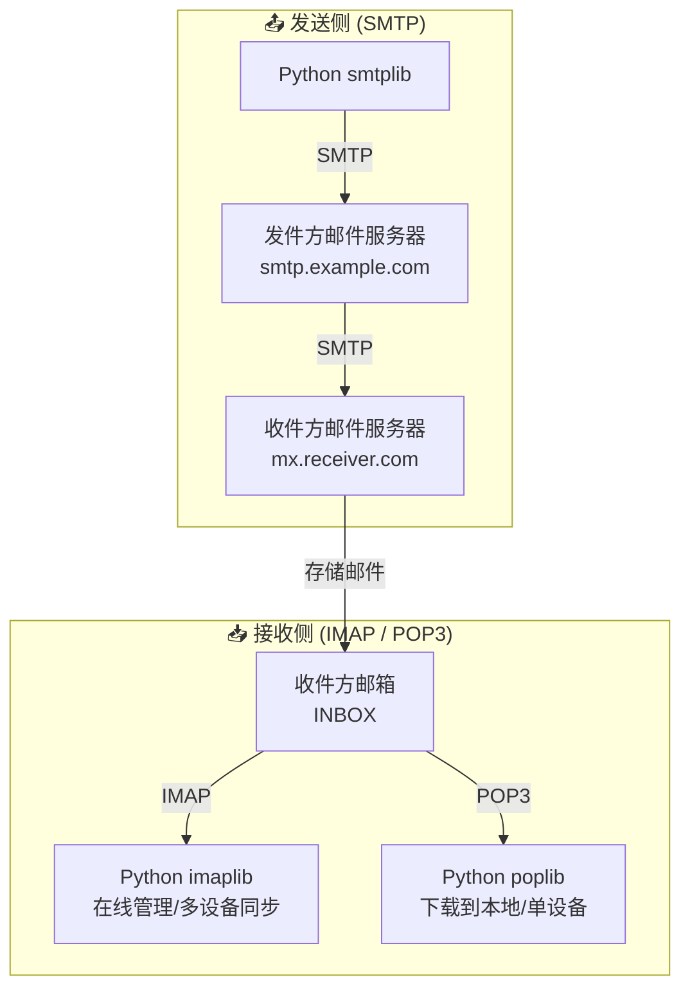
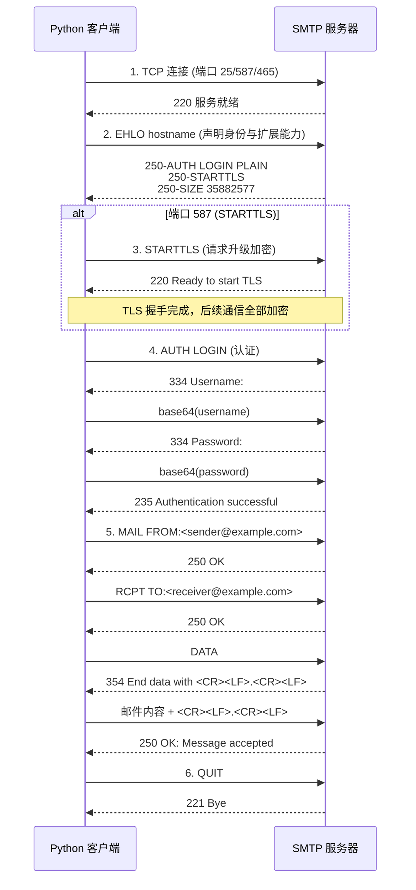
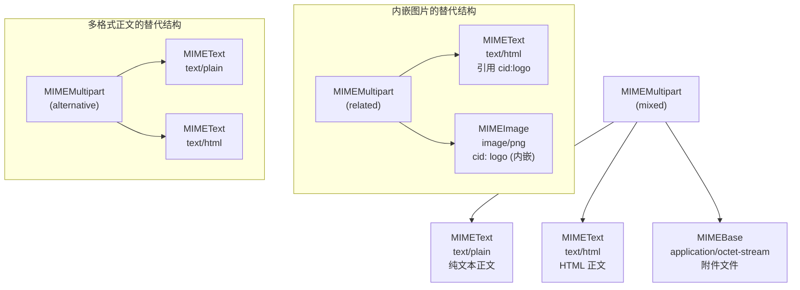

# Python 邮件模块详解

> Python 标准库提供了完整的邮件处理能力——从 SMTP 发送、IMAP/POP3 接收，到 MIME 消息构建与解析，无需安装任何第三方包即可构建生产级邮件系统。

## 1. 是什么：Python 邮件处理全景

### 1.1 邮件协议体系架构

邮件的发送与接收涉及三套独立协议，各司其职：



**核心要点**：
- **SMTP** 只管"发"——把邮件从客户端推送到服务器，再由服务器间接力投递
- **IMAP / POP3** 只管"收"——从服务器拉取邮件到客户端
- 三套协议完全独立，可以单独使用，也可以组合使用

### 1.2 核心模块一览

| 模块 | 协议/标准 | 核心职责 | 典型场景 |
|:-----|:---------|:---------|:---------|
| `smtplib` | SMTP | 发送邮件 | 自动告警、通知推送 |
| `imaplib` | IMAP4 | 在线接收/管理邮件 | 多设备同步、邮件搜索 |
| `poplib` | POP3 | 下载邮件到本地 | 离线归档、单设备访问 |
| `email.message` | MIME | 构建邮件消息对象 | 创建各类邮件 |
| `email.mime.*` | MIME | 创建各类 MIME 部分 | HTML/附件/内嵌图片 |
| `email.parser` | MIME | 解析原始邮件数据 | 读取收件箱内容 |
| `email.header` | RFC 2047 | 编解码邮件头 | 处理中文主题/发件人 |
| `email.generator` | MIME | 序列化邮件对象 | 将 EmailMessage 转为字符串 |

### 1.3 为什么用 Python 标准库处理邮件

| 优势 | 说明 |
|:-----|:-----|
| **零依赖** | 全部内置，无需 pip install，部署无风险 |
| **协议完整** | SMTP / IMAP / POP3 / MIME 全覆盖 |
| **久经考验** | 自 Python 2.x 时代持续维护，兼容性极强 |
| **灵活组合** | 可与 `schedule`、`threading`、`asyncio` 等无缝集成 |

---

## 2. 为什么：理解协议与消息结构

### 2.1 SMTP 发送流程时序图

一封邮件从编写到投递，经历以下严格的交互步骤：



**关键理解**：
- **EHLO** 不是简单的问候，它让服务器声明支持的扩展功能（AUTH 方式、STARTTLS、最大邮件尺寸等）
- **STARTTLS** 只在端口 587 上使用；端口 465 直接建立 SSL 连接，无需 STARTTLS
- **DATA** 阶段发送的是完整的 MIME 消息，以单独一行 `.` 结束

### 2.2 邮件消息结构图

一封复杂邮件的内部是树状 MIME 结构：



**MIME 子类型含义**：

| 子类型 | 含义 | 典型用法 |
|:-------|:-----|:---------|
| `mixed` | 各部分独立，按顺序展示 | 正文 + 附件 |
| `alternative` | 同一内容的不同格式表示 | 纯文本 + HTML（客户端自选） |
| `related` | 主内容引用附属资源 | HTML + 内嵌图片（cid 引用） |

**嵌套规则**：`mixed` > `alternative` > `related`，即最外层是 mixed（包含正文和附件），正文部分可以是 alternative（纯文本/HTML 二选一），HTML 部分可以是 related（HTML 引用内嵌图片）。

### 2.3 IMAP vs POP3 深度对比

| 维度 | IMAP | POP3 |
|:-----|:-----|:-----|
| **协议版本** | IMAP4rev1 (RFC 3501) | POP3 (RFC 1939) |
| **邮件存储位置** | 服务器端 | 下载到本地后可删除服务器副本 |
| **多设备同步** | 天然支持——所有设备看同一份邮件 | 不支持——下载后其他设备看不到 |
| **文件夹管理** | 支持创建/重命名/删除文件夹 | 仅 INBOX，无文件夹概念 |
| **邮件搜索** | 服务端搜索（按日期/发件人/主题等） | 必须全部下载后本地搜索 |
| **标记管理** | 支持 Seen/Flagged/Answered 等标记 | 无标记概念 |
| **部分下载** | 支持只下载邮件头或指定 MIME 部分 | 必须整封下载 |
| **连接模式** | 长连接，持续交互 | 短连接，下载即断 |
| **端口** | 143（明文）/ 993（SSL） | 110（明文）/ 995（SSL） |
| **适用场景** | 日常收件、多设备办公、邮件搜索 | 离线归档、备份、单设备使用 |
| **Python 模块** | `imaplib.IMAP4_SSL` | `poplib.POP3_SSL` |

**选择建议**：90% 的场景选 IMAP；仅在需要离线归档或备份时选 POP3。

---

## 3. 怎么做：实战代码

### 3.1 发送纯文本邮件（最简示例）

```python
import smtplib
from email.message import EmailMessage

# ---------- 1. 构建邮件 ----------
msg = EmailMessage()                          # 创建邮件对象
msg["Subject"] = "测试邮件"                     # 设置主题
msg["From"] = "sender@example.com"             # 设置发件人
msg["To"] = "receiver@example.com"             # 设置收件人（可以是列表）
msg.set_content("你好，这是一封纯文本测试邮件。")   # 设置纯文本正文

# ---------- 2. 发送邮件 ----------
SMTP_SERVER = "smtp.example.com"               # SMTP 服务器地址
SMTP_PORT = 587                                # TLS 端口
USERNAME = "sender@example.com"                # 登录用户名
PASSWORD = "your_app_password"                 # 应用专用密码

with smtplib.SMTP(SMTP_SERVER, SMTP_PORT) as server:  # 建立连接
    server.starttls()                          # 升级为 TLS 加密
    server.login(USERNAME, PASSWORD)           # 登录认证
    server.send_message(msg)                   # 发送邮件（推荐用 send_message）
    # send_message vs sendmail：
    #   send_message 接受 EmailMessage 对象，自动处理编码
    #   sendmail 接受原始字符串，需手动调用 msg.as_string()

print("纯文本邮件发送成功")
```

### 3.2 发送 HTML 邮件

```python
import smtplib
from email.message import EmailMessage

# ---------- 1. 构建 HTML 内容 ----------
html_content = """
<html>
  <body style="font-family: Arial, sans-serif; color: #333;">
    <h2 style="color: #2196F3;">项目周报</h2>
    <table border="1" cellpadding="8" cellspacing="0"
           style="border-collapse: collapse; width: 100%;">
      <tr style="background-color: #2196F3; color: white;">
        <th>任务</th><th>状态</th><th>负责人</th>
      </tr>
      <tr><td>用户模块开发</td><td>已完成</td><td>张三</td></tr>
      <tr><td>API 接口联调</td><td>进行中</td><td>李四</td></tr>
      <tr><td>性能优化</td><td>待开始</td><td>王五</td></tr>
    </table>
    <p>详细内容请查看 <a href="https://example.com">项目看板</a></p>
  </body>
</html>
"""

# ---------- 2. 同时提供纯文本和 HTML（最佳实践） ----------
msg = EmailMessage()
msg["Subject"] = "项目周报 - 第 22 周"
msg["From"] = "sender@example.com"
msg["To"] = "receiver@example.com"

# set_content 设置纯文本（作为 alternative 的第一部分）
msg.set_content("请使用支持 HTML 的邮件客户端查看此邮件。")
# add_alternative 添加 HTML（作为 alternative 的第二部分）
msg.add_alternative(html_content, subtype="html")

# ---------- 3. 发送 ----------
with smtplib.SMTP("smtp.example.com", 587) as server:
    server.starttls()
    server.login("sender@example.com", "your_app_password")
    server.send_message(msg)

print("HTML 邮件发送成功")
```

> **最佳实践**：始终同时提供纯文本和 HTML 两种格式。部分邮件客户端不支持 HTML，且纯文本版本有助于垃圾邮件过滤器判断邮件合法性。

### 3.3 发送带附件的邮件

```python
import smtplib
import os
from email.message import EmailMessage

# ---------- 1. 构建邮件 ----------
msg = EmailMessage()
msg["Subject"] = "月度报告 - 2026年5月"
msg["From"] = "sender@example.com"
msg["To"] = "receiver@example.com"
msg.set_content("附件为本月报告，请查收。")

# ---------- 2. 添加单个附件 ----------
attachment_path = "report_2026_05.pdf"
with open(attachment_path, "rb") as f:                     # 二进制模式打开文件
    file_data = f.read()                                   # 读取全部内容
    file_name = os.path.basename(attachment_path)           # 提取文件名

# add_attachment 自动设置 Content-Type、Content-Disposition、Content-Transfer-Encoding
msg.add_attachment(
    file_data,
    maintype="application",                                # 主类型
    subtype="octet-stream",                                # 子类型（通用二进制）
    filename=file_name                                     # 附件显示名
)

# ---------- 3. 添加多个附件 ----------
for path in ["chart.png", "data.xlsx"]:
    with open(path, "rb") as f:
        # 根据文件扩展名自动推断 maintype/subtype
        maintype, subtype = "application", "octet-stream"
        if path.endswith(".png"):
            maintype, subtype = "image", "png"
        elif path.endswith(".jpg") or path.endswith(".jpeg"):
            maintype, subtype = "image", "jpeg"
        elif path.endswith(".xlsx"):
            maintype, subtype = "application", "vnd.openxmlformats-officedocument.spreadsheetml.sheet"

        msg.add_attachment(
            f.read(),
            maintype=maintype,
            subtype=subtype,
            filename=os.path.basename(path)
        )

# ---------- 4. 发送 ----------
with smtplib.SMTP("smtp.example.com", 587) as server:
    server.starttls()
    server.login("sender@example.com", "your_app_password")
    server.send_message(msg)

print("带附件邮件发送成功")
```

### 3.4 发送内嵌图片的邮件

```python
import smtplib
import os
from email.message import EmailMessage

# ---------- 1. 构建邮件 ----------
msg = EmailMessage()
msg["Subject"] = "产品发布通知"
msg["From"] = "sender@example.com"
msg["To"] = "receiver@example.com"

# HTML 中通过 cid: 引用内嵌图片
html_content = """
<html>
  <body>
    <h1>新产品发布</h1>
    <p>我们的新产品正式上线：</p>
    
    <p>了解更多请访问 <a href="https://example.com">官网</a></p>
  </body>
</html>
"""

# 设置纯文本 + HTML alternative
msg.set_content("请使用支持 HTML 的邮件客户端查看此邮件。")
msg.add_alternative(html_content, subtype="html")

# ---------- 2. 添加内嵌图片 ----------
image_path = "product.png"
with open(image_path, "rb") as f:
    img_data = f.read()

# cid 参数指定内容 ID，与 HTML 中的 cid:product_image 对应
msg.get_payload()[1].add_attachment(          # 获取 HTML alternative 部分
    img_data,
    maintype="image",
    subtype="png",
    cid="<product_image>"                     # 注意：cid 值需用 <> 包裹
)

# ---------- 3. 发送 ----------
with smtplib.SMTP("smtp.example.com", 587) as server:
    server.starttls()
    server.login("sender@example.com", "your_app_password")
    server.send_message(msg)

print("内嵌图片邮件发送成功")
```

### 3.5 发送方式对比表

| 发送方式 | MIME 结构 | 关键 API | 优点 | 缺点 | 适用场景 |
|:---------|:----------|:---------|:-----|:-----|:---------|
| **纯文本** | `MIMEText("...", "plain")` | `msg.set_content(text)` | 兼容性最好，垃圾邮件评分低 | 无法排版、无样式 | 系统告警、验证码 |
| **HTML** | `MIMEText("...", "html")` | `msg.add_alternative(html, subtype="html")` | 丰富排版、表格、链接 | 部分客户端不支持 | 营销邮件、周报 |
| **纯文本+HTML** | `multipart/alternative` | `set_content()` + `add_alternative()` | 兼容性与美观兼顾 | 代码稍复杂 | **推荐默认方式** |
| **带附件** | `multipart/mixed` | `msg.add_attachment(data, ...)` | 可传输任意文件 | 大附件受服务器限制 | 报告、文档传输 |
| **内嵌图片** | `multipart/related` | `add_attachment(..., cid="<id>")` | 图片直接显示在正文中 | 代码最复杂 | 产品图、Logo |

### 3.6 MIME 消息类型对比表

| MIME 类型 | 说明 | 典型文件扩展名 | Python 中使用 |
|:----------|:-----|:-------------|:-------------|
| `text/plain` | 纯文本 | .txt | `MIMEText(text, "plain")` |
| `text/html` | HTML 文档 | .html, .htm | `MIMEText(html, "html")` |
| `image/jpeg` | JPEG 图片 | .jpg, .jpeg | `MIMEImage(data, "jpeg")` |
| `image/png` | PNG 图片 | .png | `MIMEImage(data, "png")` |
| `application/pdf` | PDF 文档 | .pdf | `MIMEBase("application", "pdf")` |
| `application/octet-stream` | 通用二进制 | 任意 | `MIMEBase("application", "octet-stream")` |
| `application/zip` | ZIP 压缩包 | .zip | `MIMEBase("application", "zip")` |
| `multipart/mixed` | 混合内容（正文+附件） | — | `MIMEMultipart("mixed")` |
| `multipart/alternative` | 同义内容（纯文本+HTML） | — | `MIMEMultipart("alternative")` |
| `multipart/related` | 关联内容（HTML+内嵌图片） | — | `MIMEMultipart("related")` |

### 3.7 使用 IMAP 读取收件箱

```python
import imaplib
import email
from email.header import decode_header
from email.utils import parsedate_to_datetime

# ---------- 1. 连接与登录 ----------
IMAP_SERVER = "imap.example.com"
IMAP_PORT = 993
USERNAME = "your_username"
PASSWORD = "your_app_password"

imap = imaplib.IMAP4_SSL(IMAP_SERVER, IMAP_PORT)   # SSL 加密连接
imap.login(USERNAME, PASSWORD)                       # 登录

# ---------- 2. 选择邮箱文件夹 ----------
status, data = imap.select("INBOX")                  # 选择收件箱
mail_count = int(data[0])                            # 邮件总数
print(f"收件箱共有 {mail_count} 封邮件")

# ---------- 3. 搜索邮件 ----------
# IMAP 搜索语法：charset, criterion1, criterion2, ...
# 常用搜索条件：
#   "ALL"           - 所有邮件
#   "UNSEEN"        - 未读邮件
#   "FROM xxx"      - 来自 xxx 的邮件
#   "SUBJECT xxx"   - 主题包含 xxx
#   "SINCE date"    - 指定日期之后的邮件（格式：DD-Mon-YYYY）
#   "BEFORE date"   - 指定日期之前
#   "LARGER n"      - 大于 n 字节
#   "SMALLER n"     - 小于 n 字节

# 示例：搜索最近 7 天的未读邮件
status, messages = imap.search(None, "UNSEEN")
if status != "OK":
    print("搜索失败")
    imap.logout()
    exit()

email_ids = messages[0].split()                      # 邮件 ID 列表（字节串）
print(f"找到 {len(email_ids)} 封未读邮件")

# ---------- 4. 解码邮件头的辅助函数 ----------
def decode_header_value(raw_header):
    """安全解码邮件头字段（Subject、From 等）"""
    if raw_header is None:
        return "(无)"
    decoded_parts = decode_header(raw_header)
    result_parts = []
    for part, charset in decoded_parts:
        if isinstance(part, bytes):                   # 编码过的部分
            result_parts.append(part.decode(charset or "utf-8", errors="replace"))
        else:                                         # 已经是字符串
            result_parts.append(part)
    return "".join(result_parts)

# ---------- 5. 读取邮件 ----------
# 只获取最近 5 封（避免一次性拉取过多）
recent_ids = email_ids[-5:] if len(email_ids) > 5 else email_ids

for eid in recent_ids:
    # fetch 的第二个参数控制获取内容：
    #   "(RFC822)"       - 获取完整邮件
    #   "(RFC822.HEADER)" - 只获取邮件头
    #   "(BODY[1])"      - 只获取第一个 MIME 部分
    status, msg_data = imap.fetch(eid, "(RFC822)")

    for response_part in msg_data:
        if isinstance(response_part, tuple):
            # 解析邮件
            msg = email.message_from_bytes(response_part[1])

            # 提取头部信息
            subject = decode_header_value(msg["Subject"])
            from_addr = decode_header_value(msg["From"])
            date_str = msg["Date"]

            print(f"--- 邮件 ID: {eid.decode()} ---")
            print(f"  主题: {subject}")
            print(f"  发件人: {from_addr}")
            print(f"  日期: {date_str}")

            # 提取正文
            if msg.is_multipart():
                for part in msg.walk():
                    content_type = part.get_content_type()
                    content_disposition = str(part.get("Content-Disposition", ""))

                    # 跳过附件
                    if "attachment" in content_disposition:
                        continue

                    if content_type == "text/plain":
                        try:
                            body = part.get_payload(decode=True).decode(
                                part.get_content_charset() or "utf-8",
                                errors="replace"
                            )
                            print(f"  正文(纯文本): {body[:200]}...")
                        except Exception as e:
                            print(f"  正文解码失败: {e}")
            else:
                try:
                    body = msg.get_payload(decode=True).decode(
                        msg.get_content_charset() or "utf-8",
                        errors="replace"
                    )
                    print(f"  正文: {body[:200]}...")
                except Exception as e:
                    print(f"  正文解码失败: {e}")

# ---------- 6. 标记邮件为已读 ----------
# imap.store(eid, "+FLAGS", "\\Seen")   # 标记为已读
# imap.store(eid, "-FLAGS", "\\Seen")   # 标记为未读
# imap.store(eid, "+FLAGS", "\\Flagged") # 标记为星标

# ---------- 7. 退出 ----------
imap.logout()
print("已断开 IMAP 连接")
```

### 3.8 IMAP 邮件搜索实战

```python
import imaplib
import email
from email.header import decode_header

def search_emails(username, password, criteria, imap_server="imap.example.com", max_results=20):
    """
    通用 IMAP 邮件搜索函数

    参数:
        username:     邮箱用户名
        password:     应用专用密码
        criteria:     IMAP 搜索条件列表，如 ["UNSEEN", "FROM", '"boss@company.com"']
        imap_server:  IMAP 服务器地址
        max_results:  最多返回的邮件数

    返回:
        邮件信息列表，每项包含 subject, from, date
    """
    results = []

    with imaplib.IMAP4_SSL(imap_server, 993) as imap:
        imap.login(username, password)
        imap.select("INBOX")

        # 执行搜索
        status, messages = imap.search(None, *criteria)
        if status != "OK":
            return results

        email_ids = messages[0].split()
        # 取最近的 N 封
        target_ids = email_ids[-max_results:] if len(email_ids) > max_results else email_ids

        for eid in target_ids:
            # 只获取邮件头，节省带宽
            status, msg_data = imap.fetch(eid, "(RFC822.HEADER)")
            if status != "OK":
                continue

            for response_part in msg_data:
                if isinstance(response_part, tuple):
                    msg = email.message_from_bytes(response_part[1])

                    # 解码主题
                    subject_raw = msg["Subject"]
                    if subject_raw:
                        decoded = decode_header(subject_raw)
                        subject = "".join(
                            p.decode(c or "utf-8", errors="replace") if isinstance(p, bytes) else p
                            for p, c in decoded
                        )
                    else:
                        subject = "(无主题)"

                    results.append({
                        "id": eid.decode(),
                        "subject": subject,
                        "from": msg["From"] or "(未知)",
                        "date": msg["Date"] or "(未知)",
                    })

    return results


# ========== 搜索示例 ==========

# 1. 搜索所有未读邮件
unread = search_emails("user@example.com", "password", ["UNSEEN"])

# 2. 搜索来自特定发件人的邮件
from_boss = search_emails("user@example.com", "password",
                          ["FROM", '"boss@company.com"'])

# 3. 搜索主题包含关键词的邮件
about_project = search_emails("user@example.com", "password",
                              ["SUBJECT", '"项目周报"'])

# 4. 搜索指定日期之后的邮件（格式：DD-Mon-YYYY，如 01-May-2026）
recent = search_emails("user@example.com", "password",
                       ["SINCE", "01-May-2026"])

# 5. 组合搜索：未读 + 来自特定域名 + 最近 30 天
combined = search_emails("user@example.com", "password",
                         ["UNSEEN", "FROM", '"@company.com"', "SINCE", "04-May-2026"])

# 6. 搜索大于 1MB 的邮件（可能含大附件）
large_emails = search_emails("user@example.com", "password",
                             ["LARGER", "1048576"])

for item in combined:
    print(f"[{item['date']}] {item['from']}: {item['subject']}")
```

### 3.9 使用 POP3 接收邮件

```python
import poplib
import email
from email.header import decode_header

# ---------- 1. 连接与登录 ----------
POP3_SERVER = "pop.example.com"
POP3_PORT = 995
USERNAME = "your_username"
PASSWORD = "your_app_password"

server = poplib.POP3_SSL(POP3_SERVER, POP3_PORT)     # SSL 加密连接
server.user(USERNAME)                                  # 发送用户名
server.pass_(PASSWORD)                                 # 发送密码（pass_ 是 Python 关键字避让）

# ---------- 2. 查看邮箱状态 ----------
mail_count, mailbox_size = server.stat()               # 返回 (邮件数, 总字节数)
print(f"邮件总数: {mail_count}, 邮箱大小: {mailbox_size} 字节")

# ---------- 3. 获取邮件列表 ----------
resp, mail_list, octets = server.list()                # 返回每封邮件的编号和大小
# mail_list 格式: [b'1 12345', b'2 67890', ...]

# ---------- 4. 读取最新一封邮件 ----------
resp, lines, octets = server.retr(mail_count)          # retr(编号) 获取指定邮件
# lines 是字节串列表，每项是邮件的一行

# 合并为完整邮件
raw_email = b"\r\n".join(lines)                        # 注意：POP3 使用 \r\n 换行
msg = email.message_from_bytes(raw_email)              # 解析邮件

# 解码主题
subject_raw = msg["Subject"]
decoded = decode_header(subject_raw)
subject = "".join(
    p.decode(c or "utf-8", errors="replace") if isinstance(p, bytes) else p
    for p, c in decoded
)
print(f"主题: {subject}")
print(f"发件人: {msg['From']}")
print(f"日期: {msg['Date']}")

# ---------- 5. 提取正文 ----------
if msg.is_multipart():
    for part in msg.walk():
        if part.get_content_type() == "text/plain":
            charset = part.get_content_charset() or "utf-8"
            body = part.get_payload(decode=True).decode(charset, errors="replace")
            print(f"正文: {body[:500]}")
            break                                      # 只取第一个纯文本部分
else:
    charset = msg.get_content_charset() or "utf-8"
    body = msg.get_payload(decode=True).decode(charset, errors="replace")
    print(f"正文: {body[:500]}")

# ---------- 6. 删除邮件（谨慎操作！） ----------
# server.dele(mail_count)                              # 标记删除（退出时生效）
# 注意：dele 只是标记，调用 quit 后才真正删除

# ---------- 7. 退出 ----------
server.quit()                                          # 提交删除标记并断开连接
print("已断开 POP3 连接")
```

### 3.10 SSL/TLS 安全连接封装

```python
import smtplib
import imaplib
import poplib
import ssl

def create_smtp_connection(server, port, username, password):
    """
    创建安全的 SMTP 连接（自动选择 SSL 或 STARTTLS）

    端口 465 → 直接 SSL
    端口 587 → STARTTLS
    端口 25  → 无加密（不推荐，仅用于测试）
    """
    context = ssl.create_default_context()              # 创建 SSL 上下文

    if port == 465:
        # 直接 SSL 连接
        smtp = smtplib.SMTP_SSL(server, port, context=context)
    elif port == 587:
        # 先明文连接，再升级 TLS
        smtp = smtplib.SMTP(server, port)
        smtp.ehlo()                                     # 先发送 EHLO
        smtp.starttls(context=context)                  # 升级为 TLS
        smtp.ehlo()                                     # TLS 后再次 EHLO
    else:
        # 无加密（不推荐）
        smtp = smtplib.SMTP(server, port)

    smtp.login(username, password)                      # 登录
    return smtp


def create_imap_connection(server, port=993, username=None, password=None):
    """创建安全的 IMAP 连接"""
    context = ssl.create_default_context()
    imap = imaplib.IMAP4_SSL(server, port, ssl_context=context)
    if username and password:
        imap.login(username, password)
    return imap


def create_pop3_connection(server, port=995, username=None, password=None):
    """创建安全的 POP3 连接"""
    context = ssl.create_default_context()
    pop = poplib.POP3_SSL(server, port, context=context)
    if username and password:
        pop.user(username)
        pop.pass_(password)
    return pop


# ========== 使用示例 ==========
# SMTP
with create_smtp_connection("smtp.gmail.com", 587, "you@gmail.com", "app_password") as smtp:
    smtp.send_message(msg)

# IMAP
with create_imap_connection("imap.gmail.com", 993, "you@gmail.com", "app_password") as imap:
    imap.select("INBOX")
    status, messages = imap.search(None, "ALL")
    # ...

# POP3
pop = create_pop3_connection("pop.gmail.com", 995, "you@gmail.com", "app_password")
mail_count, size = pop.stat()
pop.quit()
```

### 3.11 常见服务商配置速查表

| 服务商 | SMTP 服务器 | SMTP 端口 | IMAP 服务器 | IMAP 端口 | POP3 服务器 | POP3 端口 | 认证方式 |
|:-------|:-----------|:---------|:-----------|:---------|:-----------|:---------|:---------|
| **Gmail** | smtp.gmail.com | 587/465 | imap.gmail.com | 993 | pop.gmail.com | 995 | 应用专用密码 |
| **Outlook** | smtp-mail.outlook.com | 587 | outlook.office365.com | 993 | outlook.office365.com | 995 | 应用密码 |
| **QQ 邮箱** | smtp.qq.com | 587/465 | imap.qq.com | 993 | pop.qq.com | 995 | 授权码 |
| **163 邮箱** | smtp.163.com | 465/25 | imap.163.com | 993 | pop.163.com | 995 | 授权码 |
| **126 邮箱** | smtp.126.com | 465 | imap.126.com | 993 | pop.126.com | 995 | 授权码 |
| **阿里企业邮** | smtp.mxhichina.com | 465 | imap.mxhichina.com | 993 | pop.mxhichina.com | 995 | 企业邮箱密码 |

> **注意**：Gmail、QQ、163 等服务商均不再支持使用账户原始密码登录，必须在邮箱设置中开启 SMTP/IMAP 服务并生成"应用专用密码"或"授权码"。

### 3.12 高级实战：带重试的邮件发送器

```python
import smtplib
import ssl
import time
from email.message import EmailMessage
from functools import wraps

# ---------- 1. 重试装饰器 ----------
def retry(max_retries=3, delay=5, exceptions=(smtplib.SMTPException, OSError)):
    """
    邮件发送重试装饰器

    参数:
        max_retries: 最大重试次数
        delay:       重试间隔（秒）
        exceptions:  触发重试的异常类型
    """
    def decorator(func):
        @wraps(func)
        def wrapper(*args, **kwargs):
            last_error = None
            for attempt in range(1, max_retries + 1):
                try:
                    return func(*args, **kwargs)
                except exceptions as e:
                    last_error = e
                    if attempt < max_retries:
                        print(f"第 {attempt} 次尝试失败: {e}，{delay}秒后重试...")
                        time.sleep(delay)
                    else:
                        print(f"第 {attempt} 次尝试失败，已达最大重试次数")
            raise last_error                              # 抛出最后一次异常
        return wrapper
    return decorator


# ---------- 2. 邮件发送器类 ----------
class EmailSender:
    """封装 SMTP 邮件发送，支持 SSL/TLS、重试、上下文管理"""

    def __init__(self, server, port, username, password, use_ssl=None):
        """
        参数:
            server:   SMTP 服务器地址
            port:     端口号
            username: 登录用户名
            password: 应用专用密码
            use_ssl:  是否使用 SSL。None=自动判断（465→SSL, 其他→STARTTLS）
        """
        self.server = server
        self.port = port
        self.username = username
        self.password = password
        self.use_ssl = use_ssl if use_ssl is not None else (port == 465)
        self._smtp = None

    def __enter__(self):
        """上下文管理器：建立连接"""
        context = ssl.create_default_context()
        if self.use_ssl:
            self._smtp = smtplib.SMTP_SSL(self.server, self.port, context=context)
        else:
            self._smtp = smtplib.SMTP(self.server, self.port)
            self._smtp.ehlo()
            self._smtp.starttls(context=context)
            self._smtp.ehlo()
        self._smtp.login(self.username, self.password)
        return self

    def __exit__(self, exc_type, exc_val, exc_tb):
        """上下文管理器：关闭连接"""
        if self._smtp:
            try:
                self._smtp.quit()
            except Exception:
                self._smtp.close()

    @retry(max_retries=3, delay=5)
    def send(self, to, subject, text=None, html=None, attachments=None):
        """
        发送邮件

        参数:
            to:           收件人（字符串或列表）
            subject:      邮件主题
            text:         纯文本正文
            html:         HTML 正文
            attachments:  附件路径列表
        """
        msg = EmailMessage()
        msg["From"] = self.username
        msg["To"] = to if isinstance(to, str) else ", ".join(to)
        msg["Subject"] = subject

        # 设置正文
        if text and html:
            msg.set_content(text)                         # 纯文本
            msg.add_alternative(html, subtype="html")     # HTML
        elif html:
            msg.set_content(html, subtype="html")
        elif text:
            msg.set_content(text)
        else:
            msg.set_content("(无正文)")

        # 添加附件
        if attachments:
            import os
            for path in attachments:
                with open(path, "rb") as f:
                    file_data = f.read()
                maintype, subtype = "application", "octet-stream"
                ext = os.path.splitext(path)[1].lower()
                mime_map = {
                    ".pdf": ("application", "pdf"),
                    ".png": ("image", "png"),
                    ".jpg": ("image", "jpeg"),
                    ".jpeg": ("image", "jpeg"),
                    ".zip": ("application", "zip"),
                    ".xlsx": ("application", "vnd.openxmlformats-officedocument.spreadsheetml.sheet"),
                    ".docx": ("application", "vnd.openxmlformats-officedocument.wordprocessingml.document"),
                }
                if ext in mime_map:
                    maintype, subtype = mime_map[ext]

                msg.add_attachment(
                    file_data,
                    maintype=maintype,
                    subtype=subtype,
                    filename=os.path.basename(path)
                )

        self._smtp.send_message(msg)
        print(f"邮件已发送: {msg['To']} - {subject}")


# ========== 使用示例 ==========
with EmailSender("smtp.gmail.com", 587, "you@gmail.com", "app_password") as sender:
    # 发送纯文本
    sender.send("receiver@example.com", "测试邮件", text="Hello World")

    # 发送 HTML + 附件
    sender.send(
        to=["a@example.com", "b@example.com"],
        subject="月度报告",
        text="请查看附件",
        html="<h1>月度报告</h1><p>详见附件</p>",
        attachments=["report.pdf", "chart.png"]
    )
```

---

## 4. 常见陷阱与 FAQ

### 陷阱 1：SMTP 认证失败

| 现象 | 原因 | 解决方案 |
|:-----|:-----|:---------|
| `SMTPAuthenticationError: 535` | 使用了账户原始密码 | 生成"应用专用密码"或"授权码" |
| `SMTPAuthenticationError: 534` | Gmail 安全设置阻止 | 开启"不太安全的应用访问"或使用 OAuth2 |
| `smtplib.SMTPNotSupportedError` | 服务器不支持 STARTTLS | 改用端口 465 + SMTP_SSL |
| 登录后立即断开 | 密码中含特殊字符导致编码问题 | 使用应用专用密码（通常无特殊字符） |

### 陷阱 2：SSL/TLS 连接问题

```python
# 错误：在 SSL 端口上使用 STARTTLS
with smtplib.SMTP("smtp.gmail.com", 465) as server:  # 465 是 SSL 端口
    server.starttls()  # ❌ 错误！SSL 端口不能 starttls

# 正确：465 端口用 SMTP_SSL
with smtplib.SMTP_SSL("smtp.gmail.com", 465) as server:  # ✅
    server.login(username, password)

# 正确：587 端口用 SMTP + starttls
with smtplib.SMTP("smtp.gmail.com", 587) as server:      # ✅
    server.starttls()
    server.login(username, password)
```

**端口速记**：
- **25** — 传统无加密端口（多数云服务商已封禁，仅用于服务器间通信）
- **465** — SSL 直连（SMTP_SSL）
- **587** — STARTTLS（SMTP + starttls）

### 陷阱 3：编码问题

```python
# ❌ 错误：直接设置含中文的头部
msg["Subject"] = "中文主题"  # 部分服务器会拒绝或乱码

# ✅ 正确：使用 Header 对象（旧式 MIME API）
from email.header import Header
msg["Subject"] = Header("中文主题", "utf-8")

# ✅ 更好：使用 EmailMessage（自动处理编码）
from email.message import EmailMessage
msg = EmailMessage()
msg["Subject"] = "中文主题"  # EmailMessage 自动编码，无需 Header 包装

# ❌ 错误：解码邮件正文时硬编码编码
body = part.get_payload(decode=True).decode("utf-8")  # 可能不是 utf-8

# ✅ 正确：使用邮件声明的编码
charset = part.get_content_charset() or "utf-8"
body = part.get_payload(decode=True).decode(charset, errors="replace")
```

### 陷阱 4：附件大小限制

| 服务商 | 单封邮件大小限制 | 单个附件限制 | 说明 |
|:-------|:---------------|:-----------|:-----|
| Gmail | 25 MB | 25 MB | 超出建议使用 Google Drive 链接 |
| Outlook | 20 MB | 20 MB | 超出建议使用 OneDrive 链接 |
| QQ 邮箱 | 50 MB | 50 MB | 较为宽松 |
| 163 邮箱 | 50 MB | 50 MB | 较为宽松 |

**大文件处理策略**：
```python
import os

MAX_ATTACHMENT_SIZE = 25 * 1024 * 1024  # 25 MB

def safe_add_attachment(msg, file_path, max_size=MAX_ATTACHMENT_SIZE):
    """安全添加附件，自动检查大小"""
    file_size = os.path.getsize(file_path)
    if file_size > max_size:
        print(f"警告: {file_path} ({file_size/1024/1024:.1f}MB) 超过大小限制")
        # 替代方案：上传到云存储，在邮件中放链接
        # download_link = upload_to_cloud(file_path)
        # msg.set_content(f"文件过大，请从以下链接下载: {download_link}")
        return False

    with open(file_path, "rb") as f:
        msg.add_attachment(
            f.read(),
            maintype="application",
            subtype="octet-stream",
            filename=os.path.basename(file_path)
        )
    return True
```

### 陷阱 5：邮件被标记为垃圾邮件

| 原因 | 解决方案 |
|:-----|:---------|
| 缺少 `From` / `To` / `Date` 头 | 始终设置这三个必填头 |
| 发件 IP 信誉差 | 使用正规邮件服务商的 SMTP 中继 |
| 缺少 SPF/DKIM/DMARC 记录 | 在域名 DNS 中配置这些记录 |
| HTML 邮件无纯文本版本 | 始终提供 `multipart/alternative` |
| 主题含垃圾关键词（免费、中奖等） | 避免使用营销敏感词 |
| 大量群发、频率过高 | 控制发送频率，添加退订链接 |
| 附件为 .exe / .zip 等高风险类型 | 避免发送可执行文件附件 |

**降低垃圾邮件评分的代码实践**：
```python
from email.message import EmailMessage
import email.utils

msg = EmailMessage()
msg["From"] = "sender@example.com"
msg["To"] = "receiver@example.com"
msg["Subject"] = "项目通知"                            # 避免全大写、感叹号
msg["Date"] = email.utils.formatdate(localtime=True)   # 必须设置 Date
msg["Message-ID"] = email.utils.make_msgid(domain="example.com")  # 必须设置 Message-ID
msg.set_content("这是邮件正文")                          # 必须有纯文本版本
msg.add_alternative("<p>这是邮件正文</p>", subtype="html")
```

### 陷阱 6：POP3 的 dele 陷阱

```python
# POP3 的 dele 是"标记删除"，quit 时才生效
server.dele(1)          # 标记第 1 封为删除
server.dele(2)          # 标记第 2 封为删除
server.quit()           # 此时才真正删除！如果中途异常退出，删除不会生效

# 如果误标记了，可以撤销
server.rset()           # 撤销所有 dele 标记（在 quit 之前调用）
```

### 陷阱 7：IMAP 连接超时

```python
# IMAP 是长连接，长时间无操作会被服务器断开
# 解决方案：定期发送 NOOP 命令保持连接
import imaplib

imap = imaplib.IMAP4_SSL("imap.example.com", 993)
imap.login("user", "password")
imap.select("INBOX")

# 在循环中定期发送 NOOP
import time
while True:
    imap.noop()                 # 发送 NOOP，保持连接活跃
    time.sleep(300)             # 每 5 分钟一次

# 或者设置 socket 超时
import socket
socket.setdefaulttimeout(600)   # 10 分钟超时
```

---

## 术语表

| 术语 | 全称 | 含义 |
|:-----|:-----|:-----|
| **SMTP** | Simple Mail Transfer Protocol | 简单邮件传输协议，用于发送邮件 |
| **IMAP** | Internet Message Access Protocol | 互联网消息访问协议，用于在线管理收件箱 |
| **POP3** | Post Office Protocol version 3 | 邮局协议第3版，用于下载邮件到本地 |
| **MIME** | Multipurpose Internet Mail Extensions | 多用途互联网邮件扩展，定义邮件内容格式 |
| **SSL** | Secure Sockets Layer | 安全套接层，加密通信协议（已由 TLS 取代） |
| **TLS** | Transport Layer Security | 传输层安全协议，SSL 的继任者 |
| **STARTTLS** | — | 将明文连接升级为 TLS 加密的命令 |
| **EHLO** | Extended Hello | SMTP 扩展问候命令，声明客户端身份并查询服务器能力 |
| **CID** | Content-ID | 内容标识符，用于在 HTML 中引用内嵌资源（如图片） |
| **SPF** | Sender Policy Framework | 发件人策略框架，DNS 记录，防止发件人伪造 |
| **DKIM** | DomainKeys Identified Mail | 域名密钥识别邮件，DNS 记录，验证邮件完整性 |
| **DMARC** | Domain-based Message Authentication, Reporting & Conformance | 基于域的消息认证报告与一致性，结合 SPF 和 DKIM |
| **RFC822** | — | 互联网邮件消息格式标准（已被 RFC 5322 取代） |
| **Base64** | Base64 Encoding | 二进制数据到 ASCII 文本的编码方式，用于传输附件 |
| **Quoted-Printable** | — | 可打印引用编码，用于传输含少量非 ASCII 字符的文本 |
| **MTA** | Mail Transfer Agent | 邮件传输代理，即邮件服务器（如 Postfix、Exchange） |
| **MDA** | Mail Delivery Agent | 邮件投递代理，将邮件存入用户邮箱 |
| **MUA** | Mail User Agent | 邮件用户代理，即邮件客户端（如 Outlook、Thunderbird） |

---

## 延伸阅读

| 资源 | 说明 | 链接 |
|:-----|:-----|:-----|
| Python `smtplib` 官方文档 | SMTP 客户端完整 API | https://docs.python.org/3/library/smtplib.html |
| Python `imaplib` 官方文档 | IMAP4 客户端完整 API | https://docs.python.org/3/library/imaplib.html |
| Python `poplib` 官方文档 | POP3 客户端完整 API | https://docs.python.org/3/library/poplib.html |
| Python `email` 包官方文档 | 邮件消息处理完整 API | https://docs.python.org/3/library/email.html |
| RFC 5321 (SMTP) | SMTP 协议规范 | https://www.rfc-editor.org/rfc/rfc5321 |
| RFC 3501 (IMAP4rev1) | IMAP 协议规范 | https://www.rfc-editor.org/rfc/rfc3501 |
| RFC 1939 (POP3) | POP3 协议规范 | https://www.rfc-editor.org/rfc/rfc1939 |
| RFC 2045-2049 (MIME) | MIME 消息格式规范 | https://www.rfc-editor.org/rfc/rfc2045 |
| RFC 6409 (SMTP Submission) | 端口 587 提交规范 | https://www.rfc-editor.org/rfc/rfc6409 |
| Gmail 应用专用密码 | 如何生成 Gmail 应用密码 | https://support.google.com/accounts/answer/185833 |
| yagmail 库 | 简化邮件发送的第三方库 | https://github.com/kootenpv/yagmail |
| flanker 库 | 邮件地址解析与验证库（Mailgun 出品） | https://github.com/mailgun/flanker |

## 版本差异（标准库 → Python 3.14）

| 模块/特性 | 本文编写时 | Python 3.14 变化 |
|-----------|-----------|------------------|
| `datetime` | `utcnow()` / `utcfromtimestamp()` | 3.12 起弃用，改用 `datetime.now(tz=datetime.UTC)` / `fromtimestamp(ts, tz=datetime.UTC)`（aware 对象） |
| `asyncio` | 基础 API | 3.14 新增内省能力（`asyncio.Task`/`Future` 状态查询）；3.11 起推荐 `TaskGroup` + `asyncio.timeout()` |
| `typing` | 旧式 `List`/`Dict` | 3.9+ 内置泛型；3.10+ 联合类型 `X \| Y`；3.12 `type` 语句；3.14 PEP 649 延迟注解 |
| `importlib` | `imp` 模块 | `imp` 于 3.12 移除，统一使用 `importlib` |
| 压缩 | zlib/gzip/bz2/lzma | 3.14 新增 `zstandard` 标准库支持（PEP 784） |
| `pathlib` | 基础路径操作 | 3.12+ 持续增强（`Path.walk()` 等）；`is_relative_to()` 自 3.9 起可用 |
| 往事清理 | — | 3.13 移除 `cgi`、`telnetlib`、`crypt`、`audioop` 等已废弃模块 |

> 本文讲解的模块核心 API 与使用模式在 3.14 中保持稳定；注意上述弃用/移除项，升级时优先用标准库推荐的替代方案。
