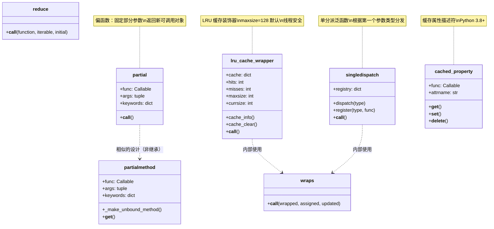
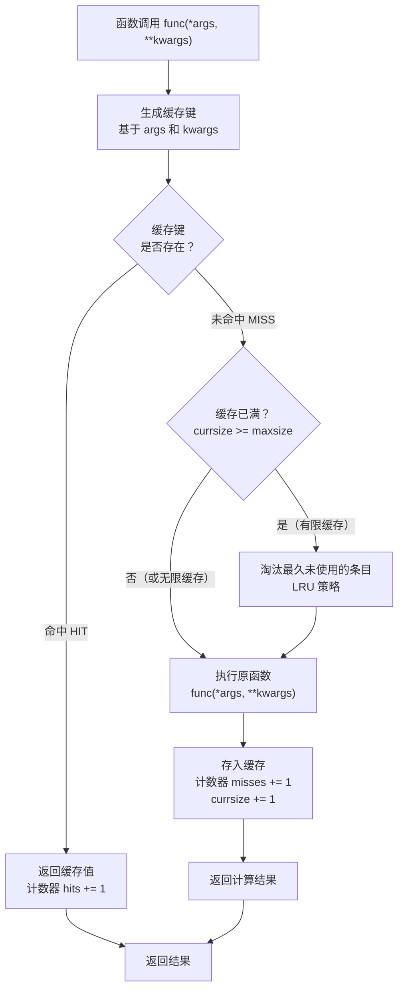
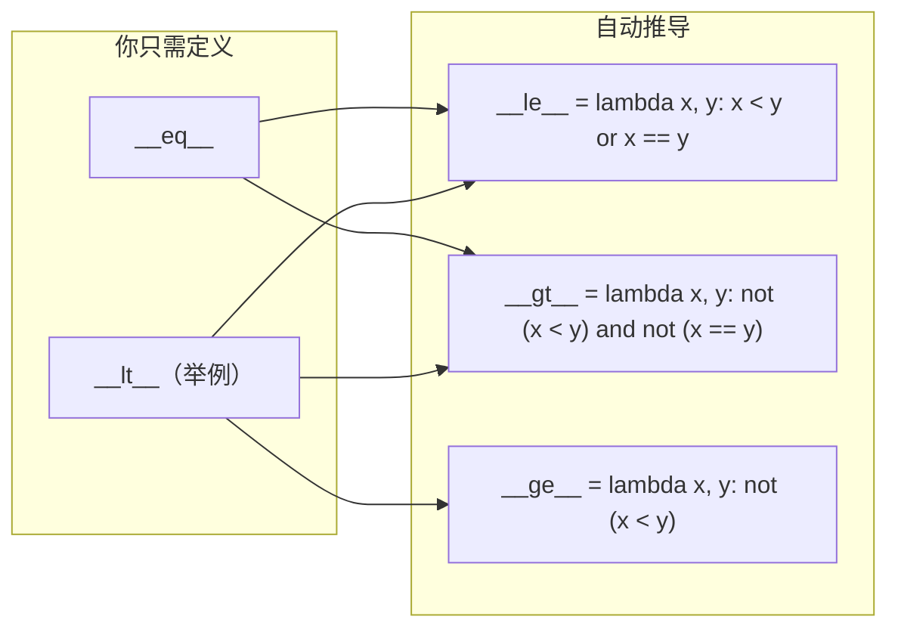
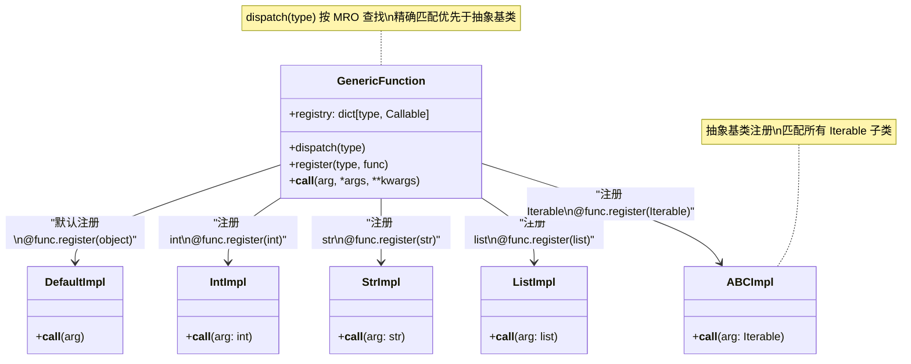
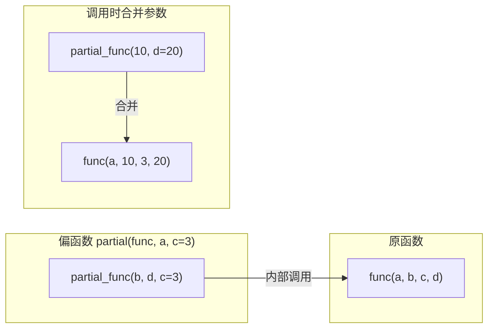

# functools 模块

## 是什么

`functools` 模块是 Python 标准库中专门用于**高阶函数与可调用对象操作**的工具箱。它提供了一系列装饰器和函数，用于创建、修改和组合可调用对象（函数、方法、类），使代码更简洁、更高效、更符合函数式编程范式。

> **高阶函数**（Higher-Order Function）是指接受函数作为参数、或将函数作为返回值的函数。`functools` 中几乎所有工具都围绕这一概念展开。

## 为什么需要 functools

| 痛点 | 没有 functools 的写法 | functools 的解决方案 |
|------|----------------------|---------------------|
| 递归/重复计算性能差 | 手动实现缓存字典，代码冗长易错 | `@lru_cache` / `@cache` 一行装饰器搞定 |
| 装饰器丢失元数据 | `wrapper.__name__` 变成 `'wrapper'`，文档丢失 | `@wraps` 自动复制被装饰函数的元数据 |
| 实现全比较类需写 6 个方法 | 手动写 `__lt__`、`__le__`、`__gt__`、`__ge__`、`__eq__`、`__ne__` | `@total_ordering` 只需 `__eq__` + 一个比较方法 |
| 根据参数类型分发逻辑 | 写 `if isinstance(x, int): ... elif isinstance(x, str): ...` | `@singledispatch` 注册类型对应的实现 |
| 固定函数部分参数 | `lambda x: func(a, b, x)` 或嵌套 `def` | `partial(func, a, b)` 语义清晰 |

## 怎么做

下面按功能分类逐一展开，每个工具都包含：原理说明、参数表格、完整代码示例、最佳实践和常见陷阱。

---

## 模块架构总览



> **关键洞察**：`partial` 和 `partialmethod` 解决"参数预绑定"问题；`lru_cache` 解决"重复计算"问题；`singledispatch` 解决"类型多态"问题；`wraps` 解决"装饰器元数据丢失"问题。它们各自独立但可以组合使用，例如 `@lru_cache` 内部就使用了 `@wraps` 来保留函数签名。

---

## 1. @lru_cache / @cache -- 缓存装饰器

### 是什么

`@lru_cache` 是 Python 内置的 **LRU（Least Recently Used，最近最少使用）缓存装饰器**。它自动缓存函数的返回值，当再次以相同参数调用时，直接从缓存返回结果，无需重新计算。

Python 3.9 新增了 `@cache`，它是 `@lru_cache(maxsize=None)` 的语义化别名——无限缓存，永不淘汰。

### 缓存命中/未命中流程



**关键点**：
- 缓存键由参数 `args` 和 `kwargs` 的哈希值组成，要求所有参数**必须可哈希**（hashable）
- 当 `maxsize` 设为 `None` 时，缓存永不淘汰，等价于 `@cache`
- `typed=True` 时，`f(3)` 和 `f(3.0)` 被视为不同的调用（类型不同）

### API 详解

```python
functools.lru_cache(maxsize=128, typed=False)
functools.cache                    # Python 3.9+，等价于 lru_cache(maxsize=None)
```

| 参数 | 类型 | 默认值 | 说明 |
|------|------|--------|------|
| `maxsize` | `int \| None` | `128` | 最大缓存条目数。`None` 表示无限缓存。设为 2 的幂可获得最佳性能 |
| `typed` | `bool` | `False` | 为 `True` 时，`f(3)` 和 `f(3.0)` 分开缓存 |

**缓存实例方法**：

| 方法 | 说明 |
|------|------|
| `func.cache_info()` | 返回 `CacheInfo(hits, misses, maxsize, currsize)` 命名元组 |
| `func.cache_clear()` | 清空缓存，重置命中/未命中计数 |
| `func.cache_parameters()` | Python 3.9+，返回 `CacheParameters(maxsize, typed)` |

### 完整可运行代码

```python
# Python 3.10+
from functools import lru_cache, cache
import time

# ========== 1. 基本用法：缓存递归（斐波那契数列） ==========
@lru_cache(maxsize=128)
def fib(n: int) -> int:
    """计算第 n 项斐波那契数（带缓存）"""
    if n < 2:
        return n
    return fib(n - 1) + fib(n - 2)

# 无缓存版本（对比）
def fib_no_cache(n: int) -> int:
    if n < 2:
        return n
    return fib_no_cache(n - 1) + fib_no_cache(n - 2)

# 对比性能
start = time.perf_counter()
result = fib(35)
elapsed_cached = time.perf_counter() - start
print(f"fib(35) 带缓存: {result}, 耗时 {elapsed_cached:.6f}s")
print(f"缓存统计: {fib.cache_info()}")

start = time.perf_counter()
result2 = fib_no_cache(35)
elapsed_no_cache = time.perf_counter() - start
print(f"fib(35) 无缓存: {result2}, 耗时 {elapsed_no_cache:.6f}s")
print(f"加速比: {elapsed_no_cache / elapsed_cached:.0f}x")

# ========== 2. typed 参数：区分参数类型 ==========
from functools import lru_cache

@lru_cache(maxsize=128, typed=True)
def double(x):
    return x * 2

print(double(3))      # 6 — 缓存键: (int, 3)
print(double(3.0))    # 6.0 — 缓存键: (float, 3.0)，与上面分开缓存
print(double.cache_info())  # hits=0, misses=2, maxsize=128, currsize=2

# ========== 3. @cache 快捷方式（Python 3.9+） ==========
@cache
def slow_square(n: int) -> int:
    """模拟耗时计算"""
    time.sleep(0.01)
    return n * n

# 首次调用：计算并缓存
slow_square(10)  # 耗时 ~10ms
# 第二次调用：命中缓存
slow_square(10)  # 耗时 < 1μs

# ========== 4. 缓存管理与监控 ==========
@lru_cache(maxsize=4)
def fetch_user(user_id: int) -> str:
    """模拟数据库查询"""
    time.sleep(0.005)
    return f"User_{user_id}"

# 依次查询 5 个用户（第 5 个会淘汰第 1 个）
for uid in [1, 2, 3, 4, 5]:
    fetch_user(uid)
print(f"缓存状态: {fetch_user.cache_info()}")
# hits=0, misses=5, maxsize=4, currsize=4 — 前 4 个被淘汰 1 个

# 再次查询：命中缓存
fetch_user(2)  # 命中
fetch_user(1)  # 未命中！已被淘汰
print(f"缓存状态: {fetch_user.cache_info()}")
# hits=1, misses=6, maxsize=4, currsize=4

# 清空缓存
fetch_user.cache_clear()
print(f"清空后: {fetch_user.cache_info()}")
# hits=0, misses=0, maxsize=4, currsize=0
```

### 缓存容量选择指南

| maxsize 值 | 适用场景 | 内存占用 | 风险 |
|-----------|---------|---------|------|
| `None` / `@cache` | 参数空间有限且固定（如枚举值、状态码） | 持续增长 | 长期运行可能内存泄漏 |
| `128`（默认） | 通用场景，参数空间较大 | 可控 | 可能淘汰常用条目 |
| `256` ~ `1024` | 参数空间中等偏大 | 中等 | 需监控命中率 |
| `2` ~ `64` | 内存敏感、参数空间小 | 极低 | 命中率可能偏低 |

---

## 2. @wraps -- 保留被装饰函数的元数据

### 是什么

`@wraps` 是装饰器编写者的**必备工具**。当你在装饰器内部定义 `wrapper` 函数时，`wrapper` 会覆盖原函数的 `__name__`、`__doc__`、`__module__` 等元数据。`@wraps` 通过 `functools.update_wrapper()` 将这些元数据从原函数复制到 `wrapper` 上。

### 问题演示 -- 不用 @wraps 的后果

```python
# Python 3.10+

def bad_decorator(func):
    """没有使用 @wraps 的装饰器"""
    def wrapper(*args, **kwargs):
        """wrapper 的文档字符串"""
        return func(*args, **kwargs)
    return wrapper

def good_decorator(func):
    """使用了 @wraps 的装饰器"""
    from functools import wraps

    @wraps(func)
    def wrapper(*args, **kwargs):
        """wrapper 的文档字符串"""
        return func(*args, **kwargs)
    return wrapper

@bad_decorator
def greet(name: str) -> str:
    """向用户问好"""
    return f"Hello, {name}!"

@good_decorator
def farewell(name: str) -> str:
    """向用户告别"""
    return f"Goodbye, {name}!"

# 对比：没有 @wraps
print(greet.__name__)   # 'wrapper' — 丢失了原函数名！
print(greet.__doc__)    # "wrapper 的文档字符串" — 丢失了原文档！
print(greet.__wrapped__)  # AttributeError — 无法访问原函数

# 对比：有 @wraps
print(farewell.__name__)  # 'farewell' — 正确保留
print(farewell.__doc__)   # '向用户告别' — 正确保留
print(farewell.__wrapped__)  # <function farewell at ...> — 可访问原函数
```

### API 详解

```python
functools.wraps(wrapped, assigned=WRAPPER_ASSIGNMENTS, updated=WRAPPER_UPDATES)
```

| 参数 | 类型 | 默认值 | 说明 |
|------|------|--------|------|
| `wrapped` | `Callable` | 必需 | 被装饰的原函数 |
| `assigned` | `tuple[str]` | `('__module__', '__name__', '__qualname__', '__annotations__', '__doc__')` | 要直接复制的属性 |
| `updated` | `tuple[str]` | `('__dict__',)` | 要用 `update()` 合并的属性 |

### 实战：带参数的装饰器 + @wraps

```python
# Python 3.10+
from functools import wraps
import time

def retry(max_attempts: int = 3, delay: float = 1.0):
    """带参数的重试装饰器"""
    def decorator(func):
        @wraps(func)  # 保留原函数元数据
        def wrapper(*args, **kwargs):
            import time as _time
            last_exception = None
            for attempt in range(1, max_attempts + 1):
                try:
                    return func(*args, **kwargs)
                except Exception as e:
                    last_exception = e
                    if attempt < max_attempts:
                        print(f"[重试 {attempt}/{max_attempts}] {func.__name__} 失败: {e}")
                        _time.sleep(delay)
            raise last_exception
        return wrapper
    return decorator

@retry(max_attempts=3, delay=0.1)
def unstable_network_call(url: str) -> str:
    """模拟不稳定的网络请求"""
    import random
    if random.random() < 0.7:
        raise ConnectionError("网络超时")
    return f"Response from {url}"

# 测试
print(unstable_network_call.__name__)  # 'unstable_network_call' — 正确保留
print(unstable_network_call.__doc__)   # '模拟不稳定的网络请求' — 正确保留
# result = unstable_network_call("https://api.example.com")
```

---

## 3. @total_ordering -- 全序比较装饰器

### 是什么

`@total_ordering` 是一个**类装饰器**，用于补全缺失的比较方法。只需定义 `__eq__` 和 **一个**比较方法（`__lt__`、`__le__`、`__gt__`、`__ge__` 中的任意一个），装饰器会自动推导出其余三个。

### 原理



### 完整可运行代码

```python
# Python 3.10+
from functools import total_ordering

@total_ordering
class Version:
    """语义化版本号（支持全序比较）"""

    def __init__(self, major: int, minor: int, patch: int):
        self.major = major
        self.minor = minor
        self.patch = patch

    def __eq__(self, other) -> bool:
        if not isinstance(other, Version):
            return NotImplemented
        return (self.major, self.minor, self.patch) == (other.major, other.minor, other.patch)

    def __lt__(self, other) -> bool:
        """只需定义 __lt__，其余自动推导"""
        if not isinstance(other, Version):
            return NotImplemented
        return (self.major, self.minor, self.patch) < (other.major, other.minor, other.patch)

    def __repr__(self):
        return f"v{self.major}.{self.minor}.{self.patch}"


# 测试：所有比较运算符自动可用
v1 = Version(1, 0, 0)
v2 = Version(1, 2, 0)
v3 = Version(2, 0, 0)

print(v1 < v2)       # True — __lt__
print(v1 <= v2)      # True — 自动推导
print(v1 > v2)       # False — 自动推导
print(v1 >= v2)      # False — 自动推导
print(v1 == v2)      # False — __eq__
print(v1 != v2)      # True — 自动推导（基于 __eq__）
print(v2 < v3)       # True

# 排序演示
versions = [v3, v1, v2]
print(sorted(versions))  # [v1.0.0, v1.2.0, v2.0.0]
```

> **注意**：截至 Python 3.14，`@total_ordering` 仍是标准库的正式 API，**并未弃用**（CPython 中存在"弃用并移除 total_ordering"的提案讨论，但尚未落地）。官方文档指出其两个局限：派生的比较方法比显式实现慢；复杂的继承层级中同名方法可能无法正确互调。新代码也可考虑 `@dataclass(order=True)` 或直接实现 `__lt__` 等方法。

---

## 4. @singledispatch / @singledispatchmethod -- 单分派泛函数

### 是什么

`@singledispatch` 将普通函数转换为**单分派泛函数**（single-dispatch generic function）：根据**第一个参数的类型**，自动分发到对应的实现。这是一种优雅的"函数重载"机制，避免了冗长的 `if isinstance(...)` 链。

`@singledispatchmethod` 是 Python 3.8 新增的变体，用于**类方法**的分派，根据第一个非 `self`/`cls` 参数的类型分发。

### singledispatch 分发机制



**分发规则**：
1. 优先查找 `registry` 中**精确类型匹配**
2. 若无精确匹配，按类型的 **MRO（方法解析顺序）** 查找最近父类
3. 若仍无匹配，使用 `object` 注册的默认实现
4. 抽象基类（ABC）注册匹配所有子类，但优先级低于精确类型

### 函数式 singledispatch

```python
# Python 3.10+
from functools import singledispatch
from collections.abc import Iterable
import json

@singledispatch
def serialize(obj) -> str:
    """默认序列化：使用 repr"""
    return repr(obj)

@serialize.register(int)
def _(obj: int) -> str:
    return f"Integer({obj})"

@serialize.register(float)
def _(obj: float) -> str:
    return f"Float({obj:.2f})"

@serialize.register(str)
def _(obj: str) -> str:
    return f'String("{obj}")'

@serialize.register(list)
def _(obj: list) -> str:
    items = ", ".join(serialize(item) for item in obj)
    return f"List([{items}])"

@serialize.register(dict)
def _(obj: dict) -> str:
    items = ", ".join(f"{serialize(k)}: {serialize(v)}" for k, v in obj.items())
    return f"Dict({{{items}}})"

@serialize.register(Iterable)  # 抽象基类：匹配所有可迭代对象
def _(obj: Iterable) -> str:
    items = ", ".join(serialize(item) for item in obj)
    return f"Iterable({items})"

# 测试
print(serialize(42))                    # Integer(42)
print(serialize(3.14159))               # Float(3.14)
print(serialize("hello"))               # String("hello")
print(serialize([1, "two", 3.0]))       # List([Integer(1), String("two"), Float(3.00)])
print(serialize({"a": 1, "b": 2}))      # Dict({String("a"): Integer(1), String("b"): Integer(2)})
print(serialize((1, 2, 3)))             # Iterable(Integer(1), Integer(2), Integer(3))
```

### 方法式 singledispatchmethod

```python
# Python 3.10+
from functools import singledispatchmethod

class DataProcessor:
    """根据输入类型自动选择处理方式"""

    @singledispatchmethod
    def process(self, data):
        raise TypeError(f"不支持的数据类型: {type(data).__name__}")

    @process.register(int)
    def _(self, data: int):
        return f"处理整数: {data ** 2}"

    @process.register(str)
    def _(self, data: str):
        return f"处理字符串: {data.upper()}"

    @process.register(list)
    def _(self, data: list):
        return f"处理列表: 长度={len(data)}, 总和={sum(data)}"

    @process.register(dict)
    def _(self, data: dict):
        return f"处理字典: 键={list(data.keys())}"


# 测试
processor = DataProcessor()
print(processor.process(10))           # 处理整数: 100
print(processor.process("hello"))      # 处理字符串: HELLO
print(processor.process([1, 2, 3]))    # 处理列表: 长度=3, 总和=6
print(processor.process({"a": 1}))     # 处理字典: 键=['a']
# processor.process(3.14)              # TypeError: 不支持的数据类型: float
```

> **`singledispatch` vs `singledispatchmethod`**：前者用于普通函数，根据第一个参数分发；后者用于类方法，根据第一个非 `self`/`cls` 参数分发。两者都支持使用 `register()` 装饰器注册新类型，且都支持抽象基类。

---

## 5. partial() / partialmethod() -- 偏函数与柯里化

### 是什么

`partial()` 创建一个**偏函数**（partial function）：将原函数的**部分参数预先绑定**，返回一个新函数，调用时只需传入剩余参数。

`partialmethod()` 是 `partial()` 的**描述符版本**，专门用于类中方法的参数预绑定，正确处理 `self` 的传递。

### partial 参数绑定模型



**参数合并规则**：
1. `partial` 中绑定的 `args` 排在前面，新传入的 `args` 追加在后面
2. `partial` 中绑定的 `kwargs` 可以被调用时传入的 `kwargs` **覆盖**
3. 最终调用等价于 `func(*partial_args, *new_args, **{**partial_kwargs, **new_kwargs})`

### 完整可运行代码

```python
# Python 3.10+
from functools import partial, partialmethod

# ========== 1. partial 基本用法 ==========
def power(base: float, exponent: float) -> float:
    """计算 base 的 exponent 次方"""
    return base ** exponent

# 固定 exponent 参数，创建平方和立方函数
square = partial(power, exponent=2)
cube = partial(power, exponent=3)

print(square(5))   # 25 — 等价于 power(5, 2)
print(cube(5))     # 125 — 等价于 power(5, 3)

# ========== 2. partial 覆盖已绑定的参数 ==========
greet = partial(print, "Hello", sep=", ")
greet("World")     # Hello, World — 等价于 print("Hello", "World", sep=", ")

# 覆盖 sep 参数
greet("World", sep=" | ")  # Hello | World

# ========== 3. partial 实战：简化回调注册 ==========
import tkinter as tk

def on_button_click(button_id: str, event=None):
    """按钮点击回调"""
    print(f"Button {button_id} clicked!")

# 不使用 partial：需要嵌套 lambda
# btn.config(command=lambda: on_button_click("save"))

# 使用 partial：语义清晰
save_callback = partial(on_button_click, "save")
cancel_callback = partial(on_button_click, "cancel")
# btn.config(command=save_callback)

# ========== 4. partialmethod — 类方法参数预绑定 ==========
class RequestBuilder:
    """HTTP 请求构建器"""

    def send(self, method: str, url: str, **headers):
        return f"{method} {url} | Headers: {headers}"

    # partialmethod 自动处理 self 传递
    get = partialmethod(send, "GET")
    post = partialmethod(send, "POST")
    put = partialmethod(send, "PUT")

    # 可以进一步绑定默认 headers
    json_get = partialmethod(send, "GET", Accept="application/json")


builder = RequestBuilder()
print(builder.get("/api/users"))           # GET /api/users | Headers: {}
print(builder.post("/api/users"))          # POST /api/users | Headers: {}
print(builder.json_get("/api/data"))       # GET /api/data | Headers: {'Accept': 'application/json'}
```

---

## 6. reduce() -- 累积归约

### 是什么

`reduce()` 将一个**二元函数**累积地应用到序列的元素上，将序列**归约**为单个值。

虽然 `reduce()` 曾是 `functools` 的明星函数，但 Guido van Rossum 本人建议**优先使用专用内置函数**（`sum()`、`math.prod()`、`all()`、`any()`、`str.join()` 等），因为它们更易读且通常更高效。

### reduce 执行模型


### reduce vs 内置函数对照表

| 需求 | reduce 写法 | 推荐写法 | 说明 |
|------|------------|---------|------|
| 求和 | `reduce(lambda x, y: x + y, seq)` | `sum(seq)` | `sum` 用 C 实现，更快 |
| 求积 | `reduce(lambda x, y: x * y, seq)` | `math.prod(seq)` | Python 3.8+ |
| 全真判断 | `reduce(lambda x, y: x and y, seq)` | `all(seq)` | 短路求值 |
| 存在判断 | `reduce(lambda x, y: x or y, seq)` | `any(seq)` | 短路求值 |
| 字符串拼接 | `reduce(lambda x, y: x + y, strs)` | `''.join(strs)` | 避免 O(n²) 拷贝 |
| 最大值 | `reduce(lambda x, y: x if x > y else y, seq)` | `max(seq)` | 内置，支持 key 参数 |
| 最小值 | `reduce(lambda x, y: x if x < y else y, seq)` | `min(seq)` | 内置，支持 key 参数 |
| 列表扁平化 | `reduce(lambda x, y: x + y, nested)` | `[item for sub in nested for item in sub]` | 推导式更清晰 |
| 集合操作 | `reduce(lambda x, y: x \| y, sets)` | `set.union(*sets)` | 更直观 |

### 何时仍然使用 reduce

```python
# Python 3.10+
from functools import reduce
import operator

# ========== reduce 仍然适用的场景 ==========

# 1. 深度合并字典（无内置函数可替代）
def deep_merge(d1: dict, d2: dict) -> dict:
    """递归合并两个字典"""
    result = dict(d1)
    for key, value in d2.items():
        if key in result and isinstance(result[key], dict) and isinstance(value, dict):
            result[key] = deep_merge(result[key], value)
        else:
            result[key] = value
    return result

configs = [
    {"db": {"host": "localhost", "port": 5432}},
    {"db": {"port": 5433}, "cache": {"ttl": 300}},
    {"cache": {"ttl": 600}},
]
final = reduce(deep_merge, configs)
print(final)
# {'db': {'host': 'localhost', 'port': 5433}, 'cache': {'ttl': 600}}

# 2. 链式函数组合（compose）
def compose(f, g):
    """返回 f ∘ g"""
    return lambda x: f(g(x))

# 多个函数的流水线
pipeline = reduce(
    compose,
    [
        lambda x: x.strip(),
        lambda x: x.lower(),
        lambda x: x.replace(" ", "-"),
    ],
)
print(pipeline("  Hello World  "))  # hello-world

# 3. 使用 operator 模块避免 lambda
from operator import add, mul

numbers = [1, 2, 3, 4, 5]
print(reduce(add, numbers))   # 15 — 等价于 sum
print(reduce(mul, numbers))   # 120 — 等价于 math.prod
```

---

## 7. cached_property -- 缓存属性（Python 3.8+）

### 是什么

`cached_property` 是一个**描述符**，将方法转换为属性，且**首次访问后缓存结果**。后续访问直接返回缓存值，不再重新计算。适用于计算成本高但结果不变的属性。

### 与 @property 的对比

```python
# Python 3.10+
from functools import cached_property
import time

class Report:
    def __init__(self, data: list[int]):
        self.data = data

    @property
    def average(self) -> float:
        """每次访问都重新计算"""
        print("  [计算中...]")
        return sum(self.data) / len(self.data)

    @cached_property
    def cached_average(self) -> float:
        """首次访问计算，之后缓存"""
        print("  [计算中...]")
        return sum(self.data) / len(self.data)

# 测试
r = Report([1, 2, 3, 4, 5])
print("=== @property ===")
print(r.average)  # [计算中...] 3.0
print(r.average)  # [计算中...] 3.0 — 每次都重新计算！
print(r.average)  # [计算中...] 3.0

print("=== @cached_property ===")
print(r.cached_average)  # [计算中...] 3.0
print(r.cached_average)  # 直接返回 3.0 — 不重新计算！
print(r.cached_average)  # 直接返回 3.0
```

### 关键特性

| 特性 | `@property` | `@cached_property` |
|------|------------|-------------------|
| 计算时机 | 每次访问 | 仅首次访问 |
| 缓存机制 | 无 | 存入实例 `__dict__` |
| 可被覆盖 | 需定义 `@xxx.setter` | 直接赋值 `inst.attr = value` 即可覆盖 |
| 可被删除 | 需定义 `@xxx.deleter` | `del inst.attr` 清除缓存，下次访问重新计算 |
| 线程安全 | N/A | 否（非原子操作，需自行加锁） |

### 线程安全问题与解决方案

```python
# Python 3.10+
from functools import cached_property
import threading
import time

class ThreadSafeReport:
    """线程安全的 cached_property 封装"""

    def __init__(self, data: list[int]):
        self.data = data
        self._lock = threading.Lock()

    @cached_property
    def average(self) -> float:
        """注意：cached_property 本身不是线程安全的"""
        time.sleep(0.1)  # 模拟耗时计算
        return sum(self.data) / len(self.data)

    # 如需线程安全，改用显式锁
    def get_average_safe(self) -> float:
        if "average_safe" not in self.__dict__:
            with self._lock:
                if "average_safe" not in self.__dict__:  # 双重检查
                    time.sleep(0.1)
                    self.__dict__["average_safe"] = sum(self.data) / len(self.data)
        return self.__dict__["average_safe"]
```

---

## 常见陷阱合集

| 陷阱 | 问题描述 | 错误示例 | 正确做法 |
|------|---------|---------|---------|
| **lru_cache 在方法上导致内存泄漏** | 将 `@lru_cache` 用于实例方法时，`self` 作为缓存键的一部分，导致实例无法被 GC 回收 | `class Foo:`<br/>`    @lru_cache`<br/>`    def bar(self, x): ...` | 使用 `@cached_property` 替代，或确保实例生命周期短 |
| **lru_cache 缓存可变对象** | 如果缓存函数返回可变对象（如 list），修改返回值会影响缓存内容 | 缓存返回的 list 被调用方修改 | 返回不可变对象（tuple），或返回 `copy.deepcopy()` |
| **partial 参数顺序陷阱** | 位置参数按顺序拼接，关键字参数可被覆盖，混淆时导致 bug | `partial(func, 1)(2)` 不知道 `func(1, 2)` 还是 `func(2, 1)` | 优先使用关键字参数 `partial(func, x=1)` |
| **singledispatch 类型匹配规则** | 子类实例会匹配到父类的注册，且抽象基类注册优先级低于具体类型 | 注册了 `Number` 但 `int` 实例匹配到 `object` 默认实现 | 了解 MRO 分发顺序，必要时显式注册子类 |
| **singledispatch 只分发第一个参数** | 仅根据第一个参数类型分发，不支持多参数类型组合 | 期望根据 `(int, str)` 和 `(str, int)` 分发 | 需要多分派时使用第三方库 `multipledispatch` |
| **@total_ordering 性能问题** | 自动推导的比较方法比手写版本慢，每次比较可能涉及多次调用 | 在性能关键路径上大量比较 | 性能敏感场景手写全部 6 个比较方法 |
| **reduce 被滥用** | 将 `reduce` 用于求和、求积等场景，代码难读且慢 | `reduce(lambda x, y: x + y, seq)` | 使用 `sum()`、`math.prod()`、`all()`、`any()` 等内置函数 |
| **cached_property 不可设置** | 在 `__slots__` 类中使用 `cached_property` 会失败 | 同时使用 `__slots__` 和 `cached_property` | `__slots__` 中显式包含属性名 |
| **@wraps 不保留类型提示** | `@wraps` 不复制 `__annotations__` 到 wrapper（Python 3.11 前） | 类型检查器无法推断装饰后函数的签名 | 使用 `ParamSpec` 和 `Concatenate`（Python 3.10+），或升级到 3.11+ |

### lru_cache 内存泄漏详解

```python
# Python 3.10+
# 问题演示：方法上的 lru_cache 导致内存泄漏

from functools import lru_cache, cached_property
import gc

class LeakyProcessor:
    def __init__(self, name: str):
        self.name = name

    @lru_cache(maxsize=128)
    def process(self, data: int) -> int:
        """缓存绑定到实例 + 参数，self 被缓存引用"""
        return data * 2


# 模拟频繁创建和销毁实例
for i in range(1000):
    p = LeakyProcessor(f"worker-{i}")
    p.process(i)  # self 进入缓存键，缓存持有实例引用
    # 实例 p 超出作用域，但缓存中的 self 引用阻止 GC！

# 解决方案 1：使用 cached_property 替代（缓存存入实例 __dict__，随实例一起回收）
class FixedProcessor:
    def __init__(self, name: str, data: int):
        self.name = name
        self.data = data

    @cached_property
    def process(self) -> int:
        """cached_property 的结果存在实例 __dict__ 中，实例回收时缓存一并释放"""
        return self.data * 2
```

---

## 最佳实践

1. **优先使用 `@cache` 而非 `@lru_cache(maxsize=None)`**：Python 3.9+ 中 `@cache` 语义更明确，且内部实现更优化。

2. **监控缓存命中率**：定期检查 `func.cache_info()`，命中率低于 50% 说明缓存策略失效，考虑调整 `maxsize` 或放弃缓存。

3. **装饰器必须用 `@wraps`**：任何自定义装饰器内部都应使用 `@wraps(func)`，确保 `help()`、`inspect.signature()` 等工具正常工作。

4. **singledispatch 注册顺序**：先注册具体类型，再注册抽象基类，最后注册 `object` 作为兜底。分发时按目标类型的 MRO 查找最近的具体实现。

5. **偏函数优先用关键字参数**：`partial(func, key=value)` 比 `partial(func, value)` 更可读，且避免参数顺序混淆。

6. **避免在方法上使用 `@lru_cache`**：除非实例生命周期极短或有明确清理机制。使用 `@cached_property` 或模块级缓存函数替代。

7. **`reduce` 保持简洁**：如果 `reduce` 调用需要超过一行的 lambda，考虑拆分为命名函数或使用显式循环。

8. **`cached_property` 不适用于频繁变化的数据**：如果底层数据会变但对象不变，需要手动 `del obj.attr` 清除缓存。

---

## 实战案例

### 实战 1：用 lru_cache 优化递归——编辑距离算法

```python
# Python 3.10+
from functools import lru_cache

@lru_cache(maxsize=None)
def edit_distance(s1: str, s2: str) -> int:
    """
    计算两个字符串的编辑距离（Levenshtein 距离）
    允许插入、删除、替换三种操作
    """
    if not s1:
        return len(s2)
    if not s2:
        return len(s1)

    if s1[-1] == s2[-1]:
        return edit_distance(s1[:-1], s2[:-1])

    return 1 + min(
        edit_distance(s1[:-1], s2),       # 删除
        edit_distance(s1, s2[:-1]),       # 插入
        edit_distance(s1[:-1], s2[:-1]),  # 替换
    )


# 测试
word1 = "kitten"
word2 = "sitting"
print(f"编辑距离('{word1}', '{word2}') = {edit_distance(word1, word2)}")
print(f"缓存统计: {edit_distance.cache_info()}")
# 无缓存时该算法复杂度为 O(3^n)，带缓存后降至 O(n*m)

# 对比：不使用缓存
def edit_distance_slow(s1: str, s2: str) -> int:
    if not s1:
        return len(s2)
    if not s2:
        return len(s1)
    if s1[-1] == s2[-1]:
        return edit_distance_slow(s1[:-1], s2[:-1])
    return 1 + min(
        edit_distance_slow(s1[:-1], s2),
        edit_distance_slow(s1, s2[:-1]),
        edit_distance_slow(s1[:-1], s2[:-1]),
    )

import time
start = time.perf_counter()
result = edit_distance_slow("kitten", "sitting")
elapsed = time.perf_counter() - start
print(f"无缓存耗时: {elapsed:.4f}s")
```

### 实战 2：用 singledispatch 实现多态数据处理管道

```python
# Python 3.10+
from functools import singledispatch
from collections.abc import Iterable, Mapping
import json
from datetime import datetime, date


@singledispatch
def to_json_serializable(obj, **kwargs) -> object:
    """将任意对象转换为 JSON 可序列化的形式"""
    try:
        # 尝试直接序列化
        json.dumps(obj)
        return obj
    except (TypeError, ValueError):
        return str(obj)  # 最终兜底


@to_json_serializable.register(datetime)
def _(obj: datetime, **kwargs) -> str:
    date_format = kwargs.get("date_format", "%Y-%m-%dT%H:%M:%S")
    return obj.strftime(date_format)


@to_json_serializable.register(date)
def _(obj: date, **kwargs) -> str:
    return obj.isoformat()


@to_json_serializable.register(bytes)
def _(obj: bytes, **kwargs) -> str:
    encoding = kwargs.get("encoding", "utf-8")
    return obj.decode(encoding, errors="replace")


@to_json_serializable.register(set)
def _(obj: set, **kwargs) -> list:
    return sorted(obj)  # set 不可序列化，转为排序列表


@to_json_serializable.register(Mapping)
def _(obj: Mapping, **kwargs) -> dict:
    return {
        to_json_serializable(k, **kwargs): to_json_serializable(v, **kwargs)
        for k, v in obj.items()
    }


@to_json_serializable.register(Iterable)
def _(obj: Iterable, **kwargs) -> list:
    # 注意：str 也是 Iterable，但 str 已在上面注册为具体类型
    return [to_json_serializable(item, **kwargs) for item in obj]


# 测试完整的数据管道
complex_data = {
    "name": "Alice",
    "created_at": datetime(2026, 6, 5, 14, 30, 0),
    "birthday": date(1995, 8, 15),
    "avatar": b"binary\xffdata",
    "tags": {"python", "developer", "backend"},
    "scores": [95, 87, 92],
    "metadata": {
        "last_login": datetime(2026, 6, 4, 9, 0, 0),
        "preferences": {"theme", "dark", "compact"},
    },
}

result = to_json_serializable(complex_data)
print(json.dumps(result, indent=2, ensure_ascii=False))
```

### 实战 3：组合 partial + lru_cache 构建通用缓存层

```python
# Python 3.10+
from functools import partial, lru_cache, wraps
import time
import hashlib


def cached_api_call(cache_size: int = 256):
    """
    通用的 API 调用缓存装饰器工厂
    返回一个已配置的装饰器
    """
    def decorator(func):
        @lru_cache(maxsize=cache_size)
        @wraps(func)
        def wrapper(*args, **kwargs):
            return func(*args, **kwargs)
        return wrapper
    return decorator


# 使用 partial 创建不同缓存策略的变体
cache_large = partial(cached_api_call, cache_size=1024)
cache_small = partial(cached_api_call, cache_size=64)


@cache_large()
def fetch_user_profile(user_id: int) -> dict:
    """获取用户资料（大缓存，用户数据相对稳定）"""
    time.sleep(0.01)  # 模拟 API 调用
    return {"id": user_id, "name": f"User_{user_id}"}


@cache_small()
def fetch_stock_price(symbol: str) -> float:
    """获取股票价格（小缓存，价格变化频繁）"""
    time.sleep(0.01)  # 模拟 API 调用
    return hash(symbol) % 1000 / 10.0


# 测试
print(fetch_user_profile(1))
print(fetch_user_profile(1))  # 命中缓存
print(f"用户缓存状态: {fetch_user_profile.cache_info()}")

print(fetch_stock_price("AAPL"))
print(fetch_stock_price("AAPL"))  # 命中缓存
print(f"股票缓存状态: {fetch_stock_price.cache_info()}")
```

---

## 术语表

| 术语 | 英文 | 定义 |
|------|------|------|
| 高阶函数 | Higher-Order Function | 接受函数作为参数或返回函数的函数 |
| 偏函数 | Partial Function | 固定原函数部分参数后得到的新函数 |
| 柯里化 | Currying | 将多参数函数转换为一系列单参数函数的技术 |
| 单分派 | Single Dispatch | 根据第一个参数的类型选择具体实现 |
| 泛函数 | Generic Function | 由一组针对不同参数类型的实现组成的函数 |
| LRU | Least Recently Used | 最近最少使用：一种缓存淘汰策略 |
| 描述符 | Descriptor | 实现了 `__get__`、`__set__`、`__delete__` 中任意方法的对象 |
| 归约 | Reduce / Fold | 将序列通过二元函数累积为单个值 |
| 装饰器 | Decorator | 修改函数或类行为的可调用对象，语法为 `@decorator` |
| 缓存命中率 | Cache Hit Rate | 缓存命中次数 / 总调用次数，衡量缓存有效性 |

---

## 延伸阅读

- [Python 官方文档 - functools](https://docs.python.org/zh-cn/3/library/functools.html)
- [Python 官方文档 - functools 模块源码详解](https://github.com/python/cpython/blob/main/Lib/functools.py)
- [PEP 443 -- Single-dispatch generic functions](https://peps.python.org/pep-0443/)
- [Python Cookbook 第 3 版 - 第 9 章：元编程](https://python3-cookbook.readthedocs.io/zh-cn/latest/)
- [Real Python - Python functools 模块指南](https://realpython.com/lessons/functools-module/)
- [Python 3.14 What's New](https://docs.python.org/zh-cn/3.14/whatsnew/3.14.html)

## 版本差异（标准库 → Python 3.14）

| 模块/特性 | 本文编写时 | Python 3.14 变化 |
|-----------|-----------|------------------|
| `datetime` | `utcnow()` / `utcfromtimestamp()` | 3.12 起弃用，改用 `datetime.now(tz=datetime.UTC)` / `fromtimestamp(ts, tz=datetime.UTC)`（aware 对象） |
| `asyncio` | 基础 API | 3.14 新增内省能力（`asyncio.Task`/`Future` 状态查询）；3.11 起推荐 `TaskGroup` + `asyncio.timeout()` |
| `typing` | 旧式 `List`/`Dict` | 3.9+ 内置泛型；3.10+ 联合类型 `X \| Y`；3.12 `type` 语句；3.14 PEP 649 延迟注解 |
| `importlib` | `imp` 模块 | `imp` 于 3.12 移除，统一使用 `importlib` |
| 压缩 | zlib/gzip/bz2/lzma | 3.14 新增 `zstandard` 标准库支持（PEP 784） |
| `pathlib` | 基础路径操作 | 3.12+ 持续增强（`Path.walk()` 等）；`is_relative_to()` 自 3.9 起可用 |
| 往事清理 | — | 3.13 移除 `cgi`、`telnetlib`、`crypt`、`audioop` 等已废弃模块 |

> 本文讲解的模块核心 API 与使用模式在 3.14 中保持稳定；注意上述弃用/移除项，升级时优先用标准库推荐的替代方案。
