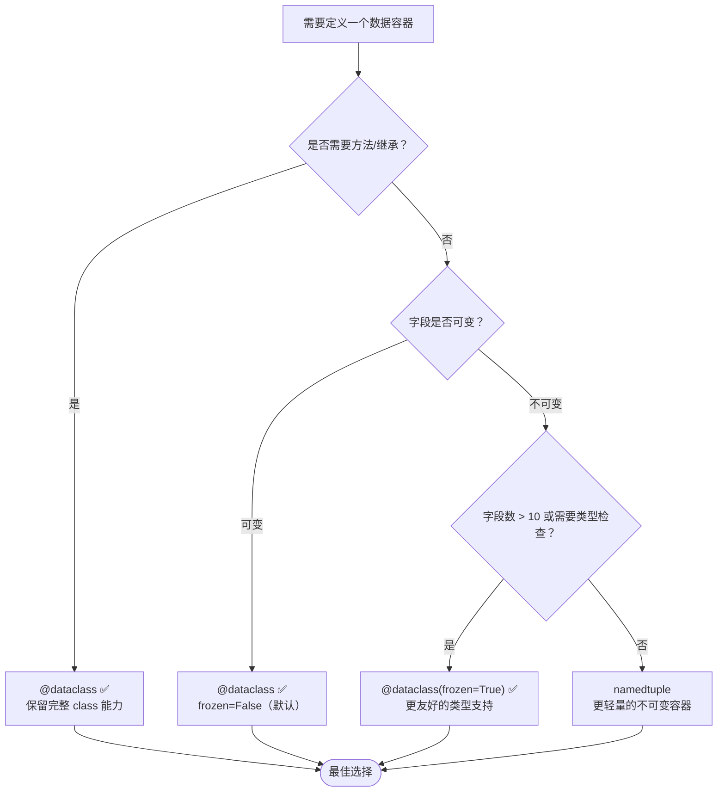
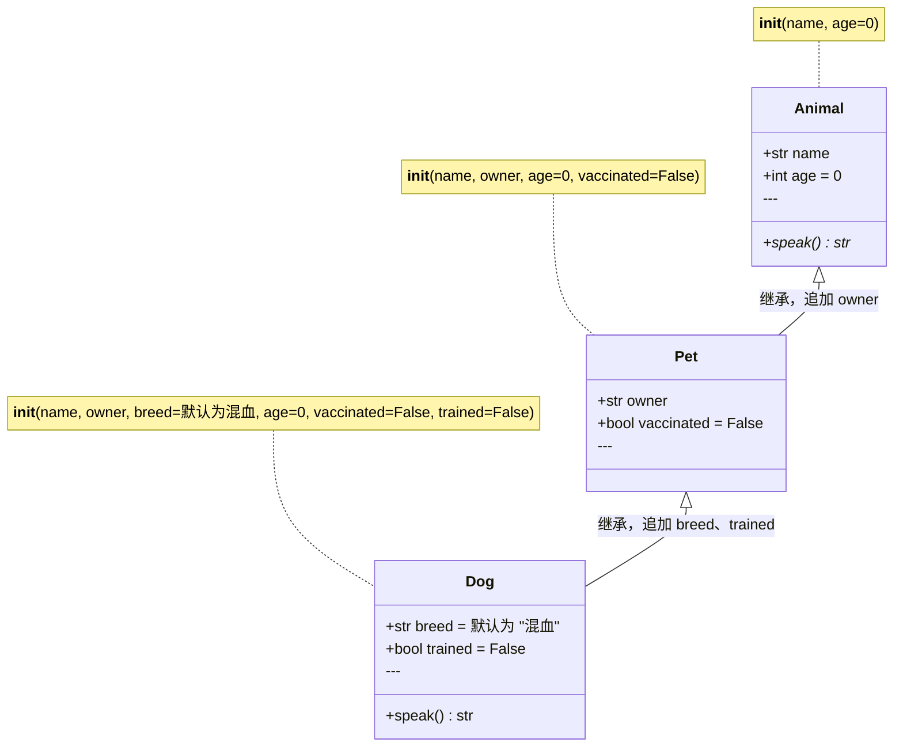
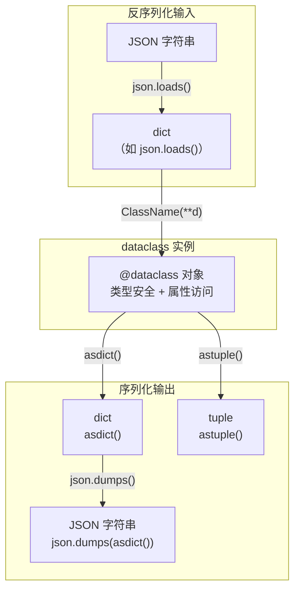

# dataclasses 模块

## 是什么

`dataclasses` 模块（PEP 557，Python 3.7+，功能持续增强至 3.10+）提供 `@dataclass` 装饰器，能够**自动生成** `__init__`、`__repr__`、`__eq__` 等特殊方法的数据容器。它让开发者用最少的样板代码定义"主要用来存数据"的类，同时保留普通类的全部灵活性（方法、继承、类型注解）。

核心思想一句话：**你声明字段和类型，Python 帮你生成剩下的**。

```python
from dataclasses import dataclass, field
from datetime import datetime

@dataclass
class UserProfile:
    """用户资料，80 行样板代码缩减为 6 行。"""
    user_id: int
    username: str
    email: str
    created_at: datetime = field(default_factory=datetime.now)  # 每次实例化取当前时间
    is_active: bool = True
```

## 为什么需要 dataclass

Python 中至少有 5 种方式定义一个"用来存数据"的结构。每种都有各自的权衡：

| 方案 | 代码量 | 类型安全 | 可变性 | 默认值 | 方法 | 内存效率 | 适合场景 |
|------|--------|---------|--------|--------|------|---------|----------|
| 普通 class | 多（手写 `__init__`/`__repr__`） | 一般 | 可变 | 需手写 | 支持 | 低（`__dict__`） | 复杂业务逻辑 |
| `namedtuple` | 少（工厂函数） | 无静态检查 | **不可变** | 支持（3.7+） | 继承得到 | 高（slots） | 简单记录、坐标点 |
| `TypedDict` | 少（类型标注） | 高（mypy 检查） | 可变（dict） | 不支持 | 不支持 | 中 | 反序列化 JSON、API 边界 |
| `SimpleNamespace` | 少 | 弱 | 可变 | 不支持 | 不支持 | 低 | 快速原型、测试替身 |
| **dataclass** | **极少** | **高** | **可选（frozen）** | **灵活（field）** | **支持** | **可选（slots）** | **配置对象、DTO、API 模型** |

关键决策流程如下：



::: tip 核心洞察
`@dataclass` 不是魔法——它只是一个**代码生成器**。你可以在任何 `@dataclass` 类上调用 `help()` 查看它生成的 `__init__` 签名，验证装饰器到底做了什么。
:::

## 快速对比：语法糖到底省了什么

| 特性 | 普通 class | dataclass |
|------|-----------|-----------|
| `__init__` | 手动写 8 行 | 自动生成 |
| `__repr__` | 默认返回 `<__main__.Point object at 0x...>` | 返回 `Point(x=1, y=2)` |
| `__eq__` | 默认比较 `id`（同一对象才相等） | 按字段值比较 |
| `__hash__` | 可哈希 | 需配合 `frozen=True` 或 `unsafe_hash=True` |
| 排序 | 需手写 `__lt__` 等 4 个方法 | `order=True` 一键生成 |

### 代码量直观对比

**普通 class（38 行）**：

```python
class Product_Manual:
    def __init__(self, name: str, price: float, stock: int = 0):
        self.name = name
        self.price = price
        self.stock = stock

    def __repr__(self):
        return f"Product(name={self.name!r}, price={self.price!r}, stock={self.stock!r})"

    def __eq__(self, other):
        if not isinstance(other, Product_Manual):
            return NotImplemented
        return (self.name, self.price, self.stock) == (other.name, other.price, other.stock)

    def __hash__(self):
        return hash((self.name, self.price, self.stock))
```

**dataclass（4 行）**：

```python
from dataclasses import dataclass

@dataclass
class Product:
    name: str
    price: float
    stock: int = 0
```

::: warning 版本要求
本节所有代码示例均基于 **Python 3.10+**。`slots=True`、`match_args`、`KW_ONLY` 等特性在 3.9 及更早版本中不可用。
:::

## field() 函数详解

`field()` 是 `@dataclass` 的灵魂。当你需要的不仅仅是"字段名 + 默认值"时，用它来精确控制每个字段的行为。

### 函数签名

```python
def field(
    *,
    default=MISSING,       # 字段默认值
    default_factory=MISSING, # 无参可调用对象，用于生成默认值
    init=True,             # 是否加入 __init__ 参数
    repr=True,             # 是否出现在 __repr__ 中
    hash=None,             # 是否参与 __hash__ 计算
    compare=True,          # 是否参与 __eq__/__lt__ 等比较
    metadata=None,         # 用户自定义的元数据映射
    kw_only=MISSING,       # Python 3.10+：是否强制关键字参数
):
```

| 参数 | 类型 | 默认值 | 说明 |
|------|------|--------|------|
| `default` | Any | `MISSING` | 字段默认值。**必须是不可变类型**（`int`、`str`、`None` 等），不能用 `[]` 或 `{}` |
| `default_factory` | `Callable[[], Any]` | `MISSING` | 无参可调用对象，每次创建实例时调用。**可变默认值必须用这个** |
| `init` | `bool` | `True` | 设为 `False` 时，该字段不出现在 `__init__` 参数中 |
| `repr` | `bool` | `True` | 设为 `False` 时，该字段不出现在 `__repr__` 中（如密码字段） |
| `hash` | `bool \| None` | `None` | `True` 强制参与哈希；`False` 强制排除；`None` 根据 `compare` 自动推断 |
| `compare` | `bool` | `True` | 设为 `False` 时，该字段不参与 `__eq__`、`__lt__` 等比较 |
| `metadata` | `Mapping \| None` | `None` | 任意键值对，供第三方库（如 JSON Schema 生成器）读取 |
| `kw_only` | `bool` | `MISSING` | Python 3.10+：强制该字段必须通过关键字参数传递 |

### default vs default_factory：最容易踩的坑

```python
from dataclasses import dataclass, field

# ❌ 错误：dataclass 直接拦截（抛 ValueError），防止共享可变默认值
@dataclass
class BrokenDeck:
    cards: list = []  # ValueError: mutable default <class 'list'> ... use default_factory

# ❌ 同样被拦截：field(default=[]) 与裸写等价，并没有"绕过"拦截
@dataclass
class StillBroken:
    cards: list = field(default=[])

# ✅ 正确：每个实例创建时调用 list() 生成新对象
@dataclass
class CorrectDeck:
    cards: list = field(default_factory=list)
```

快速验证差异：

```python
# Python 3.10+
d1 = CorrectDeck()
d2 = CorrectDeck()
d1.cards.append("Ace")
print(d1.cards)  # ['Ace']
print(d2.cards)  # []  ← 互不影响
```

### 常用字段配置组合

```python
from dataclasses import dataclass, field
from datetime import datetime
from typing import List

@dataclass
class User:
    # 基本默认值（不可变类型）
    user_id: int
    username: str
    is_active: bool = True                # 直接写不可变默认值

    # 可变默认值（必须用 default_factory）
    tags: List[str] = field(default_factory=list)
    settings: dict = field(default_factory=dict)

    # 每次都重新生成（如时间戳）
    created_at: datetime = field(default_factory=datetime.now)

    # 不参与 __repr__ —— 敏感数据
    password_hash: str = field(repr=False)

    # 不参与 __init__ —— 运行时计算
    computed_score: float = field(init=False, default=0.0)

    # 不参与比较 —— 比如缓存字段
    _cache: dict = field(default_factory=dict, compare=False, repr=False)

    # 自定义元数据 —— 供第三方工具使用
    email: str = field(
        metadata={"validation": "email", "max_length": 254}
    )

    # Python 3.10+：强制关键字参数
    api_key: str = field(kw_only=True)
```

### metadata 的实际用途

`metadata` 本身不被 `@dataclass` 使用，但它为下游工具提供了结构化锚点。常见用例包括 JSON Schema 生成、ORM 映射、表单验证等。

```python
from dataclasses import dataclass, field, fields
from typing import get_type_hints

@dataclass
class SignupForm:
    username: str = field(metadata={"min_length": 3, "max_length": 32})
    age: int = field(metadata={"min": 0, "max": 150})
    bio: str = field(default="", metadata={"widget": "textarea"})

# 运行时读取元数据
for f in fields(SignupForm):
    print(f"{f.name}: {f.metadata}")
# username: {'min_length': 3, 'max_length': 32}
# age: {'min': 0, 'max': 150}
# bio: {'widget': 'textarea'}
```

## 不可变数据：frozen=True

`frozen=True` 使实例在创建后变为**不可变**。任何对字段的赋值都会抛出 `FrozenInstanceError`。

### 为什么需要不可变

- **哈希**：不可变对象是天然的 `dict` 键和 `set` 成员
- **线程安全**：不可变对象无需加锁
- **可预测性**：传入函数的数据不会被意外修改
- **函数式风格**：与纯函数、不可变数据结构范式契合

### 完整示例

```python
from dataclasses import dataclass
from datetime import date

@dataclass(frozen=True)
class ImmutablePoint:
    x: float
    y: float

    def __add__(self, other: "ImmutablePoint") -> "ImmutablePoint":
        # 不能 self.x += other.x ← 会抛出 FrozenInstanceError
        return ImmutablePoint(self.x + other.x, self.y + other.y)

# 可作为 dict 键
p1 = ImmutablePoint(1.0, 2.0)
p2 = ImmutablePoint(1.0, 2.0)
points = {p1: "origin_offset"}
print(points[p2])  # "origin_offset" ← p1 == p2，哈希值相同

# 尝试修改会报错
try:
    p1.x = 5.0
except Exception as exc:
    print(type(exc).__name__)  # FrozenInstanceError
```

### frozen + 缓存模式

```python
from dataclasses import dataclass, field
from functools import lru_cache

@dataclass(frozen=True)
class Color:
    r: int
    g: int
    b: int

    @property
    @lru_cache(maxsize=1)
    def hex(self) -> str:
        """计算结果只计算一次（利用 frozen 确保输入不变）。"""
        return f"#{self.r:02x}{self.g:02x}{self.b:02x}"

c = Color(255, 128, 0)
print(c.hex)  # '#ff8000'
```

## 初始化后处理：`__post_init__()`

`__post_init__()` 在 `__init__` 完成后立即调用。它用于**验证、派生字段计算、类型转换**等初始化后逻辑。

### 验证与归一化

```python
from dataclasses import dataclass, field
from typing import List

@dataclass
class Order:
    order_id: str
    items: List[str] = field(default_factory=list)
    total_amount: float = field(init=False)

    def __post_init__(self):
        # 1. 验证
        if not self.order_id.strip():
            raise ValueError("order_id 不能为空")
        if len(self.items) == 0:
            raise ValueError("订单至少包含一个商品")

        # 2. 类型归一化
        self.order_id = self.order_id.upper()

        # 3. 派生字段计算
        self.total_amount = len(self.items) * 9.99

# Order(order_id='ord-123', items=['A', 'B'])
# → order_id='ORD-123', total_amount=19.98
```

### frozen 类中的 `__post_init__`

frozen 类中 `__post_init__` 仍可写字段，但直接赋值（`self.x = ...`）会被 frozen 的 `__setattr__` 拦截抛出 `FrozenInstanceError`，**必须用 `object.__setattr__`** 绕过该检查：

```python
from dataclasses import dataclass

@dataclass(frozen=True)
class NormalizedUser:
    username: str
    email: str

    def __post_init__(self):
        # ✅ 使用 object.__setattr__ 绕过冻结
        object.__setattr__(self, "username", self.username.strip().lower())
        object.__setattr__(self, "email", self.email.strip().lower())

user = NormalizedUser(username="  Alice  ", email="  ALICE@EXAMPLE.COM  ")
print(user.username)  # 'alice'
```

## 继承与字段覆盖规则

`@dataclass` 遵循标准的 Python 类继承规则，字段按 MRO（方法解析顺序）**从父类到子类**拼接。子类可以覆盖父类字段的类型提示和默认值。

### 字段拼接的完整规则

1. 子类字段追加到父类字段之后（`__init__` 参数顺序遵循此规则）
2. 子类可以覆盖父类字段的**默认值**和**类型注解**
3. 一旦某个字段有了默认值，其后的所有字段也**必须**有默认值
4. 子类带默认值的字段不能出现在父类无默认值字段之前（会导致 `TypeError`）

### 继承链示例



对应的代码：

```python
from dataclasses import dataclass

@dataclass
class Animal:
    name: str
    age: int = 0

@dataclass
class Pet(Animal):
    owner: str
    vaccinated: bool = False

@dataclass
class Dog(Pet):
    breed: str = "混血"
    trained: bool = False

# __init__ 签名自动变为：
# Dog.__init__(self, name: str, owner: str, breed: str = "混血",
#              age: int = 0, vaccinated: bool = False, trained: bool = False)
```

::: warning 字段顺序陷阱
非默认字段必须在默认字段之前。以下代码会**直接报错**：

```python
@dataclass
class Parent:
    name: str
    age: int = 0

@dataclass
class Child(Parent):
    hobby: str = "reading"  # 带默认值
    school: str             # ❌ TypeError: 无默认值字段跟在有默认值字段之后
```

这是因为 `Parent` 的 `name`（无默认值）在 MRO 中排在 `hobby`（有默认值）之前。子类必须**把所有带默认值的字段放在最后**，正确做法是调整字段顺序或让 `hobby` 也不带默认值。
:::

### 覆盖父类字段的默认值

```python
@dataclass
class BaseConfig:
    timeout: int = 30
    retries: int = 3
    debug: bool = False

@dataclass
class ProductionConfig(BaseConfig):
    timeout: int = 5      # 覆盖为更激进的值
    debug: bool = False   # 显式确认关闭
    log_level: str = "WARNING"  # 新增字段

@dataclass
class DevConfig(BaseConfig):
    timeout: int = 300    # 开发环境宽松
    debug: bool = True    # 开启调试
    hot_reload: bool = True
```

## 高级特性（Python 3.10+）

### KW_ONLY：强制关键字参数

`KW_ONLY` 是一个哨兵值。在字段列表中放在它之后的**所有字段**都必须是关键字参数。这是 Python 3.10 引入的重要改进。

```python
from dataclasses import dataclass, KW_ONLY

@dataclass
class DatabaseConfig:
    host: str
    port: int
    _: KW_ONLY
    username: str = "admin"
    password: str = ""
    max_connections: int = 100

# ✅ 位置参数只能传 host 和 port
cfg = DatabaseConfig("localhost", 5432, username="app", password="secret")

# ❌ 报错：username 必须是关键字参数
# cfg = DatabaseConfig("localhost", 5432, "admin", "secret")
```

也可以对**单个字段**使用 `field(kw_only=True)`：

```python
@dataclass
class APIClient:
    base_url: str
    timeout: int = 30
    api_token: str = field(kw_only=True)  # 单个字段强制关键字
```

### slots=True：极致内存优化

Python 3.10 新增的 `slots=True` 参数，自动将所有字段映射为 `__slots__` 而非 `__dict__`，省去了每个实例的哈希表开销。

```python
from dataclasses import dataclass
from sys import getsizeof

@dataclass
class RegularUser:
    name: str
    age: int
    email: str

@dataclass(slots=True)
class SlimUser:
    name: str
    age: int
    email: str

r = RegularUser("Alice", 30, "alice@example.com")
s = SlimUser("Alice", 30, "alice@example.com")

# slots 实例通常比 dict 实例小 100+ 字节
print(getsizeof(r.__dict__))  # ~200+ bytes（仅 dict 本身）
print(getsizeof(s))           # ~56 bytes
```

::: info slots 的约束
- 不能动态添加属性（`instance.new_attr = 1` 会报错）
- 不能使用 `__weakref__`（除非显式将其加入 `__slots__`）
- 父类若有 `__dict__`，子类的 `slots=True` 效果会打折扣
- 不兼容多重继承（当一个父类已经有非空 `__slots__` 时）
:::

### match_args：支持模式匹配

Python 3.10 引入的结构化模式匹配（`match` 语句）默认支持 `@dataclass`。`match_args` 参数控制哪些字段参与匹配。

```python
from dataclasses import dataclass

@dataclass
class Point:
    x: float
    y: float

@dataclass
class Circle:
    center: Point
    radius: float

def describe(shape):
    match shape:
        case Point(x=0, y=0):
            return "原点"
        case Point(x=x, y=y):
            return f"坐标 ({x}, {y})"
        case Circle(center=Point(x=0, y=0), radius=r):
            return f"圆心在原点的圆，半径 {r}"
        case _:
            return "未知形状"

print(describe(Point(0, 0)))              # "原点"
print(describe(Circle(Point(0, 0), 5.0))) # "圆心在原点的圆，半径 5.0"
```

## 与类型注解的配合

`@dataclass` 与类型注解是**一等公民**关系。字段类型注解不仅用于文档和 IDE 提示，还能结合 `dataclasses.fields()` 和 `typing.get_type_hints()` 在运行时反射。

### DTO（数据传输对象）模式

用 dataclass 替代 dict 作为 API 响应/请求模型，好处是编辑器自动补全、重构安全、类型检查。

```python
from dataclasses import dataclass, field
from typing import Optional, Any, Dict, List
from datetime import datetime

@dataclass
class PaginationMeta:
    """分页元信息。"""
    page: int
    per_page: int
    total: int
    total_pages: int = field(init=False)

    def __post_init__(self):
        object.__setattr__(
            self, "total_pages",
            (self.total + self.per_page - 1) // self.per_page
        )

@dataclass
class ApiError:
    """API 错误响应模型。"""
    code: str
    message: str
    details: Optional[Dict[str, Any]] = None

@dataclass
class UserResponse:
    """用户 API 响应。"""
    id: int
    username: str
    email: str
    avatar_url: Optional[str] = None
    created_at: datetime = field(default_factory=datetime.now)
    metadata: Dict[str, Any] = field(default_factory=dict, repr=False)

    @classmethod
    def from_dict(cls, data: dict) -> "UserResponse":
        """从 API 返回的字典构造实例——类型安全的反序列化。"""
        # 处理可能缺失或类型不匹配的字段
        return cls(
            id=int(data["id"]),
            username=str(data["username"]),
            email=str(data["email"]),
            avatar_url=data.get("avatar_url"),
            created_at=datetime.fromisoformat(data.get("created_at", "")),
        )

@dataclass
class ListResponse:
    """泛型列表响应包装。"""
    data: List[Any]
    meta: PaginationMeta
    errors: List[ApiError] = field(default_factory=list)
```

### 配置文件结构

```python
from dataclasses import dataclass, field
from typing import Dict, Set, Optional
from pathlib import Path

@dataclass
class DatabaseSection:
    """数据库配置段。"""
    engine: str = "postgresql"
    host: str = "localhost"
    port: int = 5432
    name: str = "app_db"
    user: str = "app_user"
    password: str = field(repr=False)
    pool_size: int = 10
    pool_overflow: int = 20

    @property
    def dsn(self) -> str:
        """从各字段自动生成连接字符串。"""
        return f"{self.engine}://{self.user}:{self.password}@{self.host}:{self.port}/{self.name}"

@dataclass
class CacheSection:
    """缓存配置段。"""
    backend: str = "redis"
    host: str = "localhost"
    port: int = 6379
    db: int = 0
    ttl_seconds: int = 3600

@dataclass
class AppConfig:
    """应用配置总类——用组合代替大杂烩 dict。"""
    app_name: str = "MyApp"
    debug: bool = False
    secret_key: str = field(repr=False, kw_only=True)
    db: DatabaseSection = field(default_factory=DatabaseSection)
    cache: CacheSection = field(default_factory=CacheSection)
    allowed_hosts: Set[str] = field(default_factory=lambda: {"localhost"})
    static_dir: Path = field(default_factory=lambda: Path("./static"))

    @classmethod
    def from_env(cls) -> "AppConfig":
        """从环境变量加载（示意）。"""
        import os
        return cls(
            debug=os.getenv("DEBUG", "false").lower() == "true",
            secret_key=os.getenv("SECRET_KEY", "change-me"),
        )
```

## 实战案例

### 案例一：API 响应模型（完整串联）

```python
from dataclasses import dataclass, field, asdict
from typing import Generic, TypeVar, List, Optional
from datetime import datetime
import json

T = TypeVar("T")

@dataclass
class PaginationMeta:
    page: int
    per_page: int
    total: int
    total_pages: int = field(init=False)

    def __post_init__(self):
        object.__setattr__(self, "total_pages", -(-self.total // self.per_page))

@dataclass
class ApiResponse(Generic[T]):
    """通用 API 响应包裹。"""
    success: bool
    data: Optional[T] = None
    error: Optional[str] = None
    meta: Optional[PaginationMeta] = None
    timestamp: datetime = field(default_factory=datetime.now)

    def to_json(self) -> str:
        return json.dumps(asdict(self), default=str, ensure_ascii=False)

# 使用示例：列表响应
resp = ApiResponse(
    success=True,
    data=[{"id": 1}, {"id": 2}],
    meta=PaginationMeta(page=1, per_page=20, total=100),
    error=None,
)
print(resp.to_json())
```

### 案例二：插件注册表

```python
from dataclasses import dataclass, field
from typing import Callable, Dict

@dataclass
class PluginInfo:
    name: str
    version: str
    entry_point: Callable
    dependencies: list = field(default_factory=list)
    config_schema: dict = field(default_factory=dict, compare=False)

@dataclass
class PluginRegistry:
    plugins: Dict[str, PluginInfo] = field(default_factory=dict)

    def register(self, plugin: PluginInfo):
        if plugin.name in self.plugins:
            raise ValueError(f"插件 {plugin.name} 已注册")
        self.plugins[plugin.name] = plugin

    def resolve(self, name: str) -> PluginInfo:
        return self.plugins[name]
```

## 常见陷阱

| 陷阱 | 错误表现 | 根因 | 解决方案 |
|------|---------|------|----------|
| **可变默认值** | 所有实例共享同一个 `list`/`dict` | `field(default=[])` 或裸写 `tags: list = []` | 使用 `field(default_factory=list)` |
| **字段顺序与继承** | `TypeError: non-default argument follows default argument` | 子类带默认值的字段排在父类无默认值字段之后 | 调整字段定义顺序，确保非默认字段在前 |
| **frozen 中的 post_init 赋值** | `FrozenInstanceError` | `self.attr = value` 触发冻结检查 | 使用 `object.__setattr__(self, "attr", value)` |
| **hash 与可变性** | 不可哈希对象用作 dict 键时 `TypeError` | 默认 `hash=None` 行为：`frozen=True` 时生成 `__hash__`，否则设为 `None` | 需要哈希时设置 `frozen=True` 或显式 `unsafe_hash=True` |
| **slots 与多重继承** | `TypeError: multiple bases have instance lay-out conflict` | 多个父类都有非空 `__slots__` | 限制继承层级或放弃 `slots=True` |
| **slots + weakref** | `TypeError: cannot create weak reference` | `__slots__` 中没有 `__weakref__` | 在基类中添加 `__weakref__` 到 `__slots__` |
| **default_factory 带参数** | `TypeError: list() takes no arguments` | `default_factory` 是无参调用 | 用 `lambda: some_func(arg)` 包装 |
| **compare 与性能** | 大对象比较慢 | 比较触发全部字段的 `__eq__` | 将大缓存字段设为 `compare=False` |
| **asdict 深拷贝** | 意外修改原始数据 | `asdict()` 执行深拷贝 | 大数据结构用 `dataclasses.astuple()` 或自定义序列化 |

## 最佳实践

### 1. 优先使用 dataclass 替代"纯数据"普通类

经验法则：如果你的类有超过 2 个字段且主要目的是存数据，就用 `@dataclass`。

### 2. 敏感字段用 `repr=False`

```python
@dataclass
class Credentials:
    username: str
    password: str = field(repr=False)      # 不暴露在日志中
    api_key: str = field(repr=False)
```

### 3. 组合优于巨型 dataclass

不要把所有字段塞进一个类。用字段分组 + 独立 dataclass + 组合。

```python
# ❌ 反模式：一个 dataclass 20+ 个字段
@dataclass
class AppConfig:
    # ... 20 fields mixing DB, cache, auth, email ...

# ✅ 组合模式
@dataclass
class AppConfig:
    db: DatabaseSection
    cache: CacheSection
    auth: AuthSection
```

### 4. frozen dataclass 配合 `replace()`

```python
from dataclasses import dataclass, replace

@dataclass(frozen=True)
class Config:
    host: str
    port: int
    debug: bool = False

base = Config(host="localhost", port=5432)
# ✅ 创建修改后的副本，原对象不变
dev = replace(base, debug=True)
```

### 5. 使用 `asdict()` / `astuple()` 而非手写序列化

```python
from dataclasses import dataclass, asdict, astuple
import json

@dataclass
class Record:
    id: int
    name: str

r = Record(1, "test")
json_str = json.dumps(asdict(r))  # {"id": 1, "name": "test"}
```

### 6. 为 DTO 提供 `from_dict` 类方法

参见上文 API 响应模型示例——这是从不受信任的字典数据（如 JSON 反序列化结果）转换为类型安全对象的标准方法。

---

## 七、dataclass 序列化与转换架构



::: warning 序列化注意事项
1. **`asdict()` 是深拷贝**：嵌套的可变对象（如列表）会被递归复制，修改结果不影响原 dataclass，但大对象时有复制开销
2. **`frozen=True` 的序列化**：`asdict()` 和 `astuple()` 对 frozen dataclass 同样有效
3. **datetime 等类型**：`json.dumps(asdict())` 不会自动处理非 JSON 原生类型，需自定义 `JSONEncoder`
4. **`replace()` vs 修改**：frozen dataclass 只能用 `replace()` 创建修改副本，不能直接赋值
:::

---

## 术语表

| 术语 | 解释 |
|------|------|
| `@dataclass` | 装饰器，由 PEP 557 定义，自动为类生成 `__init__`、`__repr__`、`__eq__` 等特殊方法 |
| `field()` | 用于精确控制单个字段行为的函数 |
| `default_factory` | `field()` 的参数，接受无参可调用对象，每次创建实例时调用来生成默认值 |
| `frozen` | `@dataclass` 参数，设为 `True` 时实例变为不可变，支持哈希 |
| `__post_init__` | 初始化后钩子，在 `__init__` 执行完后立即调用，用于验证和派生字段计算 |
| `KW_ONLY` | Python 3.10+ 哨兵值，标记其后的所有字段必须通过关键字参数传递 |
| `slots` | Python 3.10+ 参数，设为 `True` 时使用 `__slots__` 替代 `__dict__`，优化内存 |
| `match_args` | Python 3.10+ 参数，控制哪些字段参与结构化模式匹配 |
| `asdict()` | 将 dataclass 实例递归转换为 `dict` |
| `astuple()` | 将 dataclass 实例递归转换为 `tuple` |
| `replace()` | 创建 dataclass 实例的浅拷贝并修改指定字段（与 `frozen` 配合尤佳） |
| `fields()` | 返回 dataclass 所有字段的 `Field` 对象列表，可读取 `name`、`type`、`metadata` 等属性 |
| `MISSING` | `dataclasses` 模块内部哨兵值，表示"未设置" |
| DTO | Data Transfer Object，数据传输对象——在系统边界传递数据的纯数据结构 |

## 延伸阅读

- [PEP 557 -- Data Classes](https://peps.python.org/pep-0557/)：官方提案，定义了 `@dataclass` 的核心行为
- [PEP 681 -- Data Class Transforms](https://peps.python.org/pep-0681/)：第三方库如何模拟 `@dataclass` 行为（如 `attrs`、`pydantic`）
- [Python 官方文档 - dataclasses](https://docs.python.org/3/library/dataclasses.html)：标准库 API 参考
- [Python 官方文档 - typing](https://docs.python.org/3/library/typing.html)：类型注解完整参考
- [attrs 库](https://www.attrs.org/)：`@dataclass` 的思想前身，功能更丰富（验证器、转换器、插槽优化）
- [Pydantic](https://docs.pydantic.dev/)：基于类型注解的数据验证库，dataclass 的自然升级路径——当需要运行时类型强制校验时推荐
- [Real Python - Data Classes in Python 3.7+](https://realpython.com/python-data-classes/)：A hands-on guide with more examples

## 版本差异（标准库 → Python 3.14）

| 模块/特性 | 本文编写时 | Python 3.14 变化 |
|-----------|-----------|------------------|
| `datetime` | `utcnow()` / `utcfromtimestamp()` | 3.12 起弃用，改用 `datetime.now(tz=datetime.UTC)` / `fromtimestamp(ts, tz=datetime.UTC)`（aware 对象） |
| `asyncio` | 基础 API | 3.14 新增内省能力（`asyncio.Task`/`Future` 状态查询）；3.11 起推荐 `TaskGroup` + `asyncio.timeout()` |
| `typing` | 旧式 `List`/`Dict` | 3.9+ 内置泛型；3.10+ 联合类型 `X \| Y`；3.12 `type` 语句；3.14 PEP 649 延迟注解 |
| `importlib` | `imp` 模块 | `imp` 于 3.12 移除，统一使用 `importlib` |
| 压缩 | zlib/gzip/bz2/lzma | 3.14 新增 `zstandard` 标准库支持（PEP 784） |
| `pathlib` | 基础路径操作 | 3.12+ 持续增强（`Path.walk()` 等）；`is_relative_to()` 自 3.9 起可用 |
| 往事清理 | — | 3.13 移除 `cgi`、`telnetlib`、`crypt`、`audioop` 等已废弃模块 |

> 本文讲解的模块核心 API 与使用模式在 3.14 中保持稳定；注意上述弃用/移除项，升级时优先用标准库推荐的替代方案。
