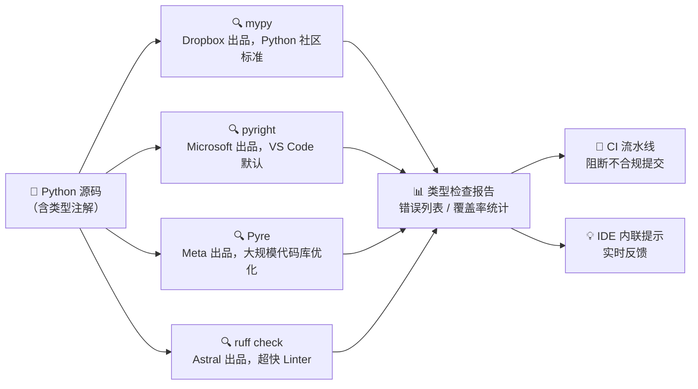
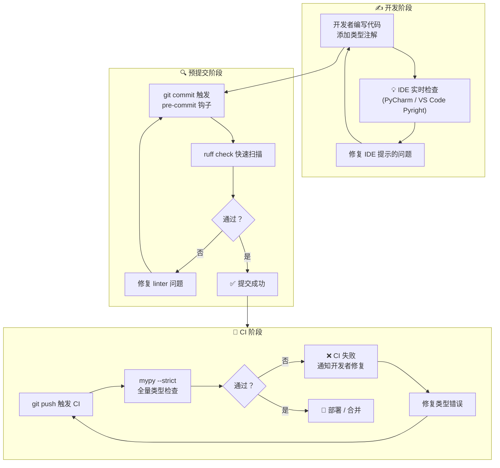

# typing 模块

## 是什么

`typing` 模块是 Python 类型系统的核心基础设施。从 Python 3.0 的 PEP 3107（函数注解语法）起步，历经 PEP 484（类型提示）、PEP 526（变量注解），到 Python 3.12 的 PEP 695（泛型语法简化），类型系统已经从"可选的文档注释"演变为支撑大型 Python 项目的工程基石。

一句话概括：**在代码运行前，用类型描述数据的形状，让工具帮你发现错误**。

```python
from typing import Any

# 没有类型注解：签名模糊，靠文档和记忆
def process_data(data):
    ...

# 有类型注解：签名即文档，IDE 和静态检查器都能理解
def process_data(data: dict[str, Any]) -> list[dict[str, Any]]:
    ...
```

::: tip 核心理念
Python 的类型注解**不影响运行时行为**。`x: int = "hello"` 在运行时完全合法，Python 解释器不会报错。类型检查是一个**独立的、可选的开发阶段**，由 mypy、pyright、PyCharm 等外部工具完成。
:::

## 为什么需要类型注解

类型注解的价值集中在三个层面，且随着项目规模增长而放大：

| 层面 | 价值 | 典型场景 |
|------|------|---------|
| **文档** | 签名即文档，减少"这个参数能传什么"的歧义 | 团队协作、开源库 API |
| **IDE 支持** | 自动补全、跳转定义、重构安全 | 日常编码效率 |
| **静态检查** | 在 CI 中捕获类型错误，避免线上事故 | 重构、大项目维护 |

### 静态检查工具生态



### 投入产出比分析

| 场景 | 推荐策略 | 注解覆盖率目标 |
|------|---------|---------------|
| 个人脚本（<200 行） | 关键函数即可 | 30% |
| 团队小项目（<1 万行） | 公共 API 全注解 | 60% |
| 中型项目（1-10 万行） | 全量注解 + mypy 严格模式 | 90%+ |
| 大型项目 / 开源库 | 全量 + pyright 严格 + `py.typed` | 100% |

## 类型系统层次

下面的 Mermaid 类图展示了 Python typing 模块中核心类型的继承和组合关系：

```mermaid
classDiagram
    class Any {
        <<特殊类型>>
        兼容所有类型，禁用检查
    }
    class Never {
        <<特殊类型>>
        Python 3.11+，表示不可能到达
    }
    class NoReturn {
        <<特殊类型>>
        函数不返回（抛异常/无限循环）
    }
    class NoneType {
        <<内置>>
        None 的类型
    }
    class Union {
        <<联合类型>>
        Python 3.10+: 使用 X | Y 语法
    }
    class Optional {
        <<Union 的语法糖>>
        等价于 X | None
    }
    class Literal {
        <<字面量类型>>
        限定为特定字面值
    }
    class TypeVar {
        <<类型变量>>
        泛型函数/类的基础
    }
    class Generic {
        <<泛型基类>>
        定义参数化容器
    }
    class Protocol {
        <<结构化类型>>
        PEP 544，鸭子类型的形式化
    }

    Any --|> object : "兼容一切"
    NoReturn --|> Never : "3.11+ 底部类型等价"
    Optional ..> Union : "语法糖"
    Optional ..> NoneType : "组合"
    Literal ..> Union : "特殊形式的联合"
    TypeVar --|> Generic : "泛型定义依赖"
    Protocol --|> Generic : "结构化泛型"

    class Container {
        <<容器泛型>>
        list, dict, tuple, set, frozenset
    }
    class CallableType {
        <<可调用对象>>
        函数类型的描述
    }
    class TypedDict {
        <<结构化类型>>
        PEP 589，字典的结构化描述
    }
    class NamedTuple {
        <<命名元组>>
        带字段名的不可变记录
    }

    Container ..|> Generic : "参数化"
    TypedDict ..|> dict : "运行时是 dict"
    NamedTuple ..|> tuple : "运行时是 tuple"
```



## 基础类型

### 内置类型的直接使用

从 Python 3.9 开始，可以直接使用内置类型进行注解，无需从 `typing` 导入：

```python
# Python 3.12+ 推荐写法：直接使用内置类型
name: str = "Alice"
age: int = 30
price: float = 99.99
is_active: bool = True
nothing: None = None

# 函数签名中的类型注解
def create_user(
    username: str,
    age: int,
    email: str | None = None,
) -> int:
    """创建用户并返回用户 ID。"""
    return 1001
```

::: info 兼容性说明
Python 3.9 之前的版本需要使用 `from typing import List, Dict, Tuple` 等大写形式的泛型。如果你支持的 Python 版本 >= 3.10，应该全面使用小写内置类型。
:::

### Any — 有意放弃类型检查

`Any` 是类型系统的"逃生舱"。当一个变量或参数可以接受任何类型，而你暂时无法或不想限定类型时使用：

```python
from typing import Any

# 场景1：处理动态数据（如 JSON 反序列化）
def parse_json_response(data: str) -> Any:
    import json
    return json.loads(data)

# 场景2：与不受控制的外部代码交互
def call_external_api(endpoint: str, **params: Any) -> Any:
    ...

# 场景3：渐进式类型化——后续会替换为具体类型
def legacy_handler(request: Any) -> Any:
    ...
```

::: warning Any 是把双刃剑
滥用 `Any` 等于关闭类型检查。在大型项目中，应对 `Any` 的使用保持警惕——它应该在真正无法静态描述类型时才使用，而非偷懒的捷径。mypy 的 `disallow_any_expr` 等配置可以追踪和控制 `Any` 的传播。
:::

## 容器类型（现代语法）

Python 3.9+ 中容器泛型可以直接用内置类型书写，简洁且直观：

```python
# === 列表 ===
scores: list[int] = [95, 87, 92]
users: list[dict[str, object]] = [
    {"id": 1, "name": "Alice"},
    {"id": 2, "name": "Bob"},
]

# === 字典 ===
config: dict[str, int] = {"timeout": 30, "retries": 3}
# 复杂嵌套：键是字符串，值是字符串或整数
settings: dict[str, str | int] = {"host": "localhost", "port": 5432}

# === 元组 ===
# 固定长度、不同类型
record: tuple[int, str, bool] = (1, "Alice", True)
# 可变长度、同一类型（基本用法）
coordinates: tuple[int, ...] = (1, 2, 3, 4, 5)
# 空元组
empty: tuple[()] = ()

# === 集合 ===
tags: set[str] = {"python", "typing", "tutorial"}
# 不可变集合
constants: frozenset[int] = frozenset({1, 2, 3})

# === 嵌套容器 ===
matrix: list[list[float]] = [
    [1.0, 2.0, 3.0],
    [4.0, 5.0, 6.0],
]
# 现实中的复杂类型：API 响应（类型别名）
ApiResponse = dict[str, list[dict[str, str | int]]]
```

### 容器类型与旧版 typing 对照

| 现代写法（3.9+） | 旧版写法（3.5-3.8） | 说明 |
|-----------------|-------------------|------|
| `list[int]` | `List[int]` | 需 `from typing import List` |
| `dict[str, int]` | `Dict[str, int]` | 需 `from typing import Dict` |
| `tuple[int, str]` | `Tuple[int, str]` | 需 `from typing import Tuple` |
| `set[str]` | `Set[str]` | 需 `from typing import Set` |
| `frozenset[int]` | `FrozenSet[int]` | 需 `from typing import FrozenSet` |

## 联合类型

### X | Y 语法（Python 3.10+）

联合类型表示"可以是 X 或 Y"，这是类型系统中使用最频繁的构造之一：

```python
def parse_value(value: str | int | float) -> float:
    """接受多种输入类型，统一转换为 float。"""
    return float(value)

# 返回值联合
def find_user(user_id: int) -> dict[str, str] | None:
    """找到返回用户字典，未找到返回 None。"""
    return None  # 或 return {"name": "Alice", "role": "admin"}

# 复杂联合
StatusCode = int | str  # 类型别名
def handle_response(code: StatusCode) -> None:
    match code:
        case int():
            print(f"HTTP 状态码: {code}")
        case str():
            print(f"自定义状态: {code}")
```

### Optional 与 X | None

`Optional[X]` 等价于 `X | None`，两者可以互换，但现代风格推荐后者：

```python
# 完全等价的三行写法
def f1(x: int | None = None) -> str: ...
def f2(x: None | int = None) -> str: ...  # 顺序无关
from typing import Optional
def f3(x: Optional[int] = None) -> str: ...

# 推荐：Python 3.10+ 使用 | None 语法
def get_config(key: str) -> str | None:
    return {"host": "localhost"}.get(key)
```

::: tip 最佳实践
团队内统一一种风格即可。如果项目最低支持 Python 3.10，推荐 `X | None`；如果仍需兼容旧版，使用 `Optional[X]`。避免混用。
:::

## 特殊类型

### Literal — 精确控制允许的值

`Literal` 限制参数只能是固定的几个字面量值，非常适合标志位、枚举值替换：

```python
from typing import Literal

# 模式选择
def set_mode(mode: Literal["read", "write", "append"]) -> None:
    match mode:
        case "read":
            print("以只读模式打开")
        case "write":
            print("以写入模式打开")
        case "append":
            print("以追加模式打开")

# 多类型字面量
Alignment = Literal["left", "center", "right", 0, 1, 2]

def align_text(text: str, align: Alignment) -> str:
    match align:
        case "left" | 0:
            return f"{text:<20}"
        case "center" | 1:
            return f"{text:^20}"
        case "right" | 2:
            return f"{text:>20}"

# HTTP 方法限制
HttpMethod = Literal["GET", "POST", "PUT", "DELETE", "PATCH"]
def api_call(url: str, method: HttpMethod) -> dict[str, object]:
    ...
```

::: info Literal vs Enum
`Literal` 轻量、无需导入、适合简单场景；`Enum` 有运行时值、可迭代、有命名空间。当值需要被导入、迭代或有复杂逻辑时，使用 `Enum`。
:::

### Final — 防止覆盖和继承

```python
from typing import Final

# 常量声明：不能被重新赋值
MAX_CONNECTIONS: Final = 100
CONFIG_PATH: Final[str] = "/etc/app/config.toml"

# Final 方法：子类不能覆盖
from typing import final

class BaseHandler:
    @final
    def handle(self) -> None:
        """核心处理逻辑，子类禁止覆盖。"""
        self._pre_process()
        self._execute()
        self._post_process()

    def _pre_process(self) -> None: ...
    def _execute(self) -> None: ...
    def _post_process(self) -> None: ...

# Final 类：不能被继承
@final
class ImmutableConfig:
    """此类的设计不允许子类化。"""
    host: str
    port: int
```

### ClassVar — 类变量区别于实例变量

```python
from typing import ClassVar

class DatabaseConnection:
    # 类变量：所有实例共享
    pool_size: ClassVar[int] = 20
    _connections: ClassVar[list["DatabaseConnection"]] = []

    # 实例变量：每个实例独立
    host: str
    port: int

    def __init__(self, host: str, port: int) -> None:
        self.host = host
        self.port = port

# 静态检查器会将此标记为错误：pool_size 不应通过实例赋值
conn = DatabaseConnection("localhost", 5432)
# conn.pool_size = 30  # mypy 会报错
```

### Never（3.11+）和 NoReturn

```python
from typing import NoReturn, Never

# NoReturn：函数不会正常返回（抛异常或无限循环）
def raise_error(message: str) -> NoReturn:
    raise ValueError(message)

def loop_forever() -> NoReturn:
    while True:
        ...

# Never (Python 3.11+)：底部类型，与 NoReturn 语义等价（同一概念的两个名称）
# NoReturn 惯用于函数返回注解，Never 可用于任何需要"不存在值"的位置
from typing import assert_never

def handle_status(status: Literal["success", "error", "pending"]) -> str:
    if status == "success":
        return "OK"
    elif status == "error":
        return "FAIL"
    elif status == "pending":
        return "WAITING"
    else:
        # assert_never 保证穷尽性检查
        assert_never(status)
```

## 泛型

### TypeVar — 类型变量

类型变量是泛型系统的基础，它定义了一个可以在不同调用中变化的"类型占位符"：

```python
from typing import TypeVar

T = TypeVar("T")  # 无约束：可以是任意类型
K = TypeVar("K")
V = TypeVar("V")

def first(items: list[T]) -> T:
    """返回列表的第一个元素，保持原类型。"""
    return items[0]

# 类型推断：
# first([1, 2, 3])       -> int
# first(["a", "b", "c"])  -> str
# first([1.0, 2.0])       -> float

def get_key_value_pair(d: dict[K, V], key: K) -> tuple[K, V]:
    """从字典取出键值对。"""
    return key, d[key]
```

### 约束泛型

用 `bound` 约束类型变量必须是某类型的子类：

```python
from collections.abc import Sized

# 约束：T 必须支持 len()
S = TypeVar("S", bound=Sized)

def double_length(obj: S) -> int:
    """返回对象长度的两倍。适用于任何 Sized 类型。"""
    return len(obj) * 2

# double_length("hello")     -> 10 ✅
# double_length([1, 2, 3])  -> 6  ✅
# double_length(42)          -> ❌ mypy 报错：int 不支持 len()

# 约束为特定类型的子类
from typing import TypeVar
NumberT = TypeVar("NumberT", bound=int | float)

def add(a: NumberT, b: NumberT) -> NumberT:
    return a + b
```

### Generic 基类

```python
from typing import Generic, TypeVar

T = TypeVar("T")

class Stack(Generic[T]):
    """类型安全的泛型栈。"""
    def __init__(self) -> None:
        self._items: list[T] = []

    def push(self, item: T) -> None:
        self._items.append(item)

    def pop(self) -> T | None:
        if self._items:
            return self._items.pop()
        return None

    def peek(self) -> T | None:
        if self._items:
            return self._items[-1]
        return None

# 使用
int_stack = Stack[int]()
int_stack.push(1)
int_stack.push(2)
top: int | None = int_stack.pop()  # mypy 知道是 int

str_stack = Stack[str]()
str_stack.push("hello")
# str_stack.push(42)  # mypy 报错：int 不能传入 str 的 Stack
```

### Protocol — 结构化子类型

`Protocol` 实现了"鸭子类型的形式化"——只要对象有正确的方法签名，它就满足协议，无需显式继承：

```python
from typing import Protocol

class SupportsClose(Protocol):
    """任何有 close() 方法的对象都满足此协议。"""
    def close(self) -> None: ...

class Flyable(Protocol):
    def fly(self) -> str: ...

class Bird:
    def fly(self) -> str:
        return "翅膀飞行"

class Airplane:
    def fly(self) -> str:
        return "引擎飞行"
    def land(self) -> None: ...

def takeoff(obj: Flyable) -> str:
    return obj.fly()

# 两者都能通过类型检查，无需继承自 Flyable
print(takeoff(Bird()))       # 翅膀飞行
print(takeoff(Airplane()))   # 引擎飞行
```

::: tip Protocol vs ABC
`ABC`（抽象基类）强制运行时检查，子类必须显式继承；`Protocol` 仅做静态检查，任何满足接口的对象自动符合。Protocol 更适合作为函数参数的类型约束，ABC 更适合定义可实例化的类层次结构。
:::

## 结构化类型

### TypedDict — 字典的结构化描述

`TypedDict` 为字典提供精确的键和值类型映射，非常适合 JSON 反序列化：

```python
from typing import TypedDict

class UserProfile(TypedDict):
    """描述用户配置文件的字典结构。"""
    user_id: int
    username: str
    email: str
    is_active: bool

# 类型安全的数据解析
def parse_user(data: dict[str, object]) -> UserProfile | None:
    """从原始字典解析用户信息。"""
    if not isinstance(data.get("user_id"), int):
        return None
    if not isinstance(data.get("username"), str):
        return None
    # 运行时不做类型验证，但 mypy 认为这里类型已正确
    return data  # type: ignore[return-value]

# TypedDict 的可选字段与只读字段
from typing import NotRequired, Required

class ConfigV2(TypedDict, total=False):
    """total=False 表示所有字段默认可选。"""
    host: Required[str]   # 必填
    port: int             # 可选（total=False）
    debug: bool           # 可选

config: ConfigV2 = {"host": "localhost"}  # 合法
```

### NamedTuple — 不可变的命名记录

```python
from typing import NamedTuple

class Point(NamedTuple):
    """二维坐标点，不可变，字段可通过名称访问。"""
    x: float
    y: float

    def distance_to_origin(self) -> float:
        return (self.x ** 2 + self.y ** 2) ** 0.5

    def __str__(self) -> str:
        return f"Point({self.x}, {self.y})"

p = Point(3.0, 4.0)
print(p.x, p.y)            # 3.0 4.0
print(p.distance_to_origin())  # 5.0
# p.x = 5.0  # AttributeError: can't set attribute

# 与 dataclass 的对比
from dataclasses import dataclass

@dataclass(frozen=True)
class PointDC:
    x: float
    y: float

# NamedTuple: 轻量、快速、继承自 tuple（支持解包、索引）
# dataclass(frozen=True): 功能更多（field()、__post_init__ 等）
```

## 可调用对象

### Callable — 函数签名描述

```python
from collections.abc import Callable

# Callable[[参数类型列表], 返回值类型]
Callback = Callable[[str, int], bool]

def register_handler(name: str, handler: Callback) -> None:
    """注册一个事件处理器。"""
    print(f"已注册处理器: {handler.__name__}")

def my_handler(event_type: str, priority: int) -> bool:
    return priority > 5

register_handler("click", my_handler)  # ✅

# 无参数、无返回值的回调
NoArgCallback = Callable[[], None]

# 任意参数
AnyCallback = Callable[..., object]
```

### ParamSpec — 精确捕获参数签名（Python 3.10+）

`ParamSpec` 解决了装饰器中参数签名丢失的问题：

```python
from typing import Callable, TypeVar
from typing import ParamSpec  # Python 3.10+
from collections.abc import Callable

P = ParamSpec("P")
R = TypeVar("R")

def logged(func: Callable[P, R]) -> Callable[P, R]:
    """一个保留原函数签名的装饰器。"""
    from functools import wraps

    @wraps(func)
    def wrapper(*args: P.args, **kwargs: P.kwargs) -> R:
        print(f"调用 {func.__name__}")
        result = func(*args, **kwargs)
        print(f"{func.__name__} 返回 {result}")
        return result
    return wrapper

@logged
def add(a: int, b: int) -> int:
    return a + b

# mypy 知道 result 是 int，且知道参数类型
result = add(3, 5)  # 类型检查通过
# add("x", "y")  # mypy 报错
```

## 类型守卫

### TypeGuard — Python 3.10+

```python
from typing import TypeGuard

def is_str_list(val: list[object]) -> TypeGuard[list[str]]:
    """类型守卫：运行时检查后告诉静态检查器这个 list 里全是 str。"""
    return all(isinstance(x, str) for x in val)

def process(items: list[object]) -> str:
    if is_str_list(items):
        # 在这个分支里，mypy 知道 items 是 list[str]
        return ", ".join(items)  # ✅
    return "非字符串列表"
```

### TypeIs — Python 3.13+（更精确的守卫，PEP 742）

`TypeIs` 比 `TypeGuard` 更严格——它不仅告诉你"如果是 True 则类型是什么"，还告诉你"如果是 False 则类型**不是**什么"：

```python
from typing import TypeIs  # Python 3.13+

def is_int_list(val: list[object]) -> TypeIs[list[int]]:
    """TypeIs 守卫：两种分支都有精确的类型信息。"""
    return all(isinstance(x, int) for x in val)

def process_numbers(items: list[object]) -> int:
    if is_int_list(items):
        # True 分支：items 是 list[int]
        return sum(items)
    else:
        # False 分支：mypy 知道 items 是 `list[object]` 减去 `list[int]`
        # 即"非 list[int]"
        return len(items)

# TypeIs 对 None 检查也很实用
def is_present(val: object | None) -> TypeIs[object]:
    return val is not None
```

::: tip TypeGuard vs TypeIs
简单区分：`TypeGuard` 守卫只给出 True 分支的类型信息；`TypeIs` 守卫同时给出 True 分支和 False 分支的类型信息（通过类型缩窄）。Python 3.13+ 项目中优先使用 `TypeIs`。
:::

## 类型检查工具工作流

下面的流程图展示了类型注解从编写到在 CI 中发挥作用的完整生命周期：



## 常见陷阱与解决方案

| 陷阱 | 问题表现 | 解决方案 |
|------|---------|---------|
| **`list` vs `List`** | Python 3.8 及以下堆栈报 `TypeError` | 3.9+ 使用 `list[int]`，旧项目用 `from typing import List` |
| **`tuple` 泛型混淆** | `tuple[int]` 报错，应写 `tuple[int, ...]` | 单元素变长元组必须加 `...`：`tuple[int, ...]` |
| **`Any` 传染性** | 一个 `Any` 变量传给函数，返回值也变 `Any` | 尽早做类型收窄（`isinstance` / `cast` / `assert`） |
| **`TypeVar` 命名冲突** | 两个模块用同名 `T = TypeVar("T")` 覆盖 | 在模块顶层定义，不要重复定义；或用唯一名称 |
| **`Protocol` 误以为有运行时约束** | 运行时传给 `isinstance` 检查报 `TypeError` | Protocol 只有静态意义；运行时校验用 `ABC` |
| **循环导入导致 `ForwardRef` 问题** | 类之间相互引用时注解失效 | 使用 `from __future__ import annotations`（3.7+）或字符串前向引用 `"ClassName"` |
| **`cast()` 滥用** | 用 `cast()` 屏蔽真实类型错误 | `cast()` 仅用于"我比类型检查器更了解类型"的场景，否则应修复上游类型问题 |
| **`TypedDict` 运行时无校验** | 传入多余键或缺失键不报错 | TypedDict 只是标注，运行时校验需配合 pydantic 或手写验证 |

### 代码示例：陷阱详解

```python
# 陷阱1：tuple 泛型混淆
# ❌ 错误：tuple[int] 表示"恰好 1 个 int 的元组"，长度不匹配是静态检查错误
scores: tuple[int] = (1, 2, 3)  # 静态检查报错（运行时注解本身合法）

# ✅ 正确：可变长度同类型元组
scores: tuple[int, ...] = (1, 2, 3)

# ✅ 正确：固定长度不同类型元组
pair: tuple[int, str] = (1, "hello")


# 陷阱2：Any 的传染性
from typing import Any

def get_data() -> Any:
    return {"name": "Alice"}  # 返回类型被标记为 Any

def process(user: dict[str, str]) -> str:
    return user["name"].upper()

data = get_data()       # data 的类型是 Any
# result = process(data)  # mypy 不报错，因为 Any 兼容一切！
# result 的类型也是 Any！传染了。

# ✅ 解决方案：尽早收窄
data = get_data()
if isinstance(data, dict):
    result = process(data)  # mypy 能正确检查


# 陷阱3：循环导入
# ✅ 解决方案：延迟求值注解
from __future__ import annotations  # 文件第一行

class TreeNode:
    """二叉树节点——类型注解延迟求值避免循环引用。"""
    value: int
    left: TreeNode | None   # 无需字符串包装
    right: TreeNode | None   # 无需字符串包装

    def __init__(self, value: int) -> None:
        self.value = value
        self.left = None
        self.right = None
```

## 最佳实践

### 渐进式类型化策略

```python
# 阶段1：为公共 API 添加注解（最小成本，最大收益）
def calculate_total(items: list[dict[str, float]], tax_rate: float) -> float:
    total = sum(item["price"] * item["quantity"] for item in items)
    return total * (1 + tax_rate)

# 阶段2：为内部关键路径添加注解
def _validate_input(data: str, schema: dict[str, object]) -> bool:
    ...

# 阶段3：逐步启用严格模式
# mypy.ini:
# [mypy]
# strict = True
# disallow_untyped_defs = True
# disallow_incomplete_defs = True
# warn_return_any = True
# warn_unused_ignores = True
```

### checker-config.toml（pyright 严格配置参考）

```ini
[tool.pyright]
typeCheckingMode = "strict"
reportMissingTypeStubs = true
reportUnknownVariableType = false  # 逐步开启
reportUnknownParameterType = true
reportUnknownArgumentType = true
reportUnknownMemberType = true
reportMissingParameterType = true
reportUnnecessaryTypeIgnoreComment = true
```

### 类型别名管理

```python
# ✅ 良好的类型别名组织
# types.py（项目中的类型定义文件）
from collections.abc import Callable, Mapping, Sequence

# 业务类型别名——提高可读性
UserId = int
JsonDict = dict[str, object]
ApiHandler = Callable[[JsonDict], JsonDict]
ConfigMap = dict[str, str | int | bool]

# 使用类型别名
def get_user(user_id: UserId) -> JsonDict | None:
    return {"id": user_id, "name": "Alice"}

# ✅ 公共 API 总是注解（库/大型项目）
__all__ = [
    "UserId",
    "JsonDict",
    "ApiHandler",
    "ConfigMap",
]
```

### 类型注解决策树

- **函数的公开 API**：始终注解参数和返回值
- **私有/内部函数**：关键路径注解，辅助函数可省略
- **复杂泛型**：使用类型别名提高可读性
- **与 JSON/YAML 交互的字典**：使用 TypedDict 精确描述
- **回调和高阶函数**：使用 Callable 或 Protocol
- **类型参数需在多处复用**：定义 TypeVar
- **鸭子类型**：使用 Protocol

## 小结

Python 的类型系统在短短几年内从可选语法糖演进为支撑工程化的关键基础设施。核心要点：

1. **类型注解不影响运行时**，但能极大提升开发体验和代码质量
2. **Python 3.12+ 全面使用现代语法**：`X | Y`、`list[int]`、`TypeIs`、`PEP 695` 泛型
3. **渐进式采用**：从公共 API 开始，逐步提高覆盖率，最终启用 `--strict`
4. **工具链协同**：IDE 实时提示 + pre-commit + CI 检查形成三层防护
5. **类型不是负担**：TypeVar、Protocol、TypedDict 让类型系统灵活而强大

持续关注 [PEP 484](https://peps.python.org/pep-0484/) 和 [Python Typing 官方文档](https://docs.python.org/zh-cn/3/library/typing.html) 对类型系统的最新演进。

## 版本差异（标准库 → Python 3.14）

| 模块/特性 | 本文编写时 | Python 3.14 变化 |
|-----------|-----------|------------------|
| `datetime` | `utcnow()` / `utcfromtimestamp()` | 3.12 起弃用，改用 `datetime.now(tz=datetime.UTC)` / `fromtimestamp(ts, tz=datetime.UTC)`（aware 对象） |
| `asyncio` | 基础 API | 3.14 新增内省能力（`asyncio.Task`/`Future` 状态查询）；3.11 起推荐 `TaskGroup` + `asyncio.timeout()` |
| `typing` | 旧式 `List`/`Dict` | 3.9+ 内置泛型；3.10+ 联合类型 `X \| Y`；3.12 `type` 语句；3.14 PEP 649 延迟注解 |
| `importlib` | `imp` 模块 | `imp` 于 3.12 移除，统一使用 `importlib` |
| 压缩 | zlib/gzip/bz2/lzma | 3.14 新增 `zstandard` 标准库支持（PEP 784） |
| `pathlib` | 基础路径操作 | 3.12+ 持续增强（`Path.walk()` 等）；`is_relative_to()` 自 3.9 起可用 |
| 往事清理 | — | 3.13 移除 `cgi`、`telnetlib`、`crypt`、`audioop` 等已废弃模块 |

> 本文讲解的模块核心 API 与使用模式在 3.14 中保持稳定；注意上述弃用/移除项，升级时优先用标准库推荐的替代方案。
