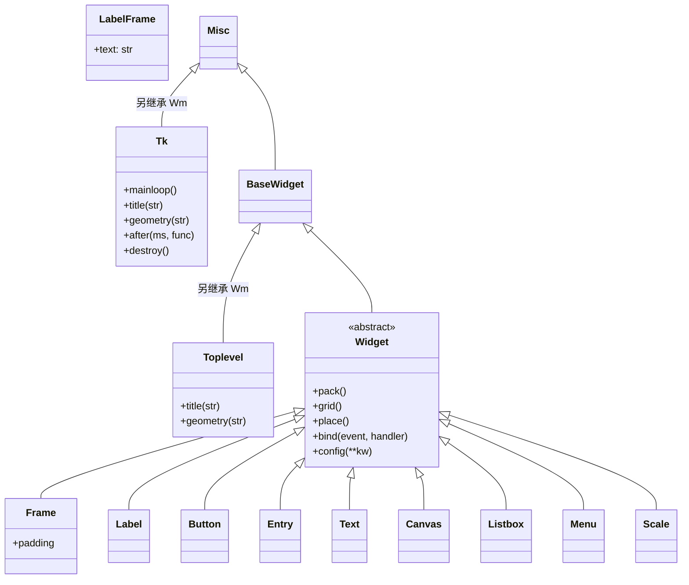
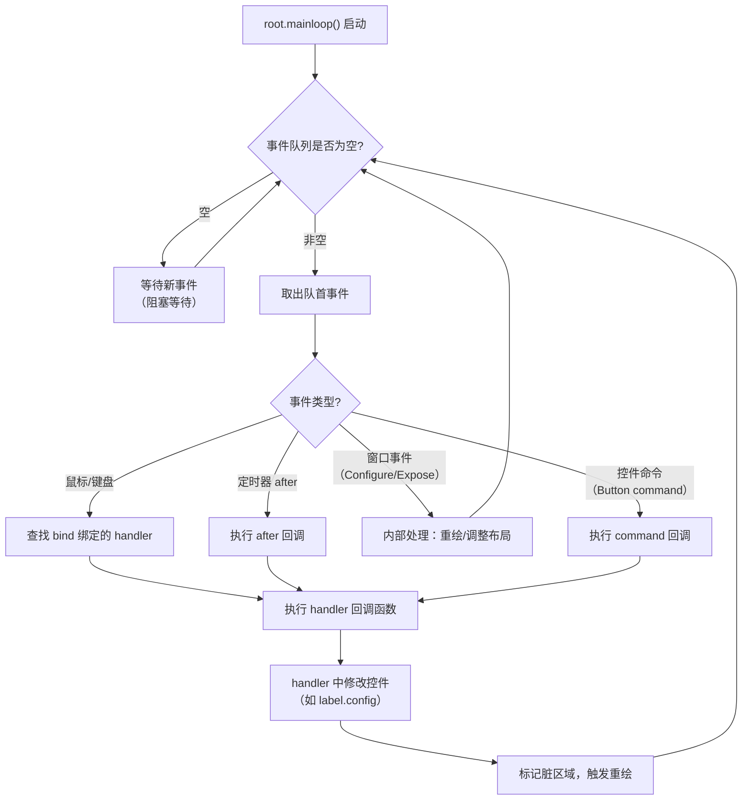
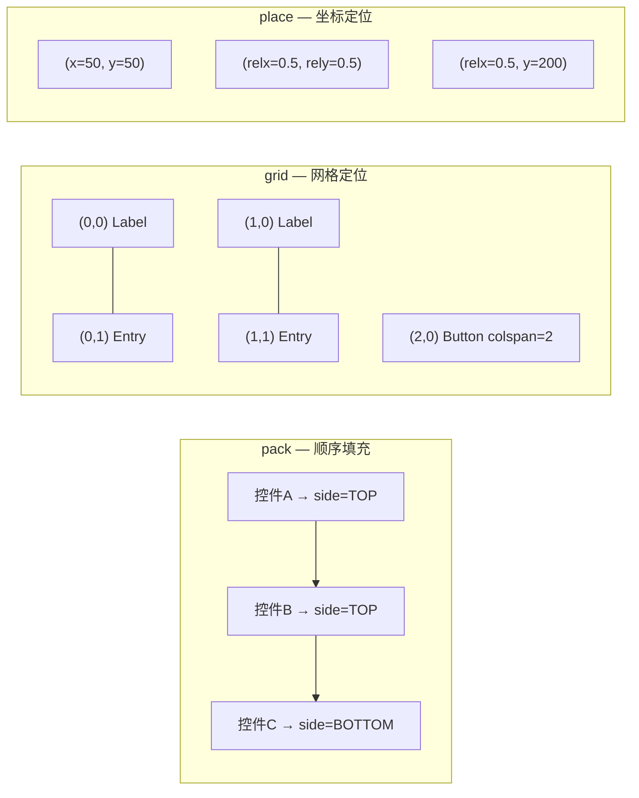

# tkinter 模块详解

tkinter 是 Python 的标准 GUI（图形用户界面）库，提供了创建桌面应用程序的各种控件和工具。它是基于 Tk GUI 工具包的 Python 接口，是 Python 最常用的 GUI 库之一。

## 是什么：tkinter 的定位与本质

tkinter（Tk Interface）是 Python 对 Tcl/Tk 图形工具包的官方封装。Tk 最初为 Tcl 语言设计，Python 通过 tkinter 模块将其桥接到 Python 生态中。由于 tkinter 是 Python 标准库的一部分，**无需额外安装**即可使用，这使得它成为 Python 开发者学习 GUI 编程的天然入口。

## 为什么：选择 tkinter 的理由

| 优势 | 说明 |
|------|------|
| 零安装成本 | Python 标准库自带，`import tkinter` 即可用 |
| 跨平台 | Windows / macOS / Linux 一套代码运行 |
| 学习曲线平缓 | API 直观，适合 GUI 编程入门 |
| 文档丰富 | 官方文档 + 社区教程 + 大量示例 |
| Tcl/Tk 成熟 | 底层 Tk 工具包自 1991 年发展至今，稳定可靠 |

| 局限 | 说明 |
|------|------|
| 原生控件外观偏旧 | 经典 tk 控件风格不够现代（ttk 部分缓解） |
| 复杂 UI 能力有限 | 无内建 MVVM、数据绑定、样式表等现代框架特性 |
| 自定义渲染弱 | 无法像 Qt 那样深度自定义绘制 |
| 社区生态较小 | 第三方组件和主题远少于 PyQt / Electron |

## 怎么做：tkinter 开发全景路线

本文按照以下路线逐步深入：

1. **架构理解** — 了解 tkinter 的类层次与事件循环
2. **基础入门** — 创建窗口、使用 ttk 控件
3. **控件大全** — 常用控件的用法与对比
4. **布局管理** — pack / grid / place 的选择
5. **事件处理** — 绑定机制与事件流
6. **高级功能** — Canvas、对话框、主题、图像、异步
7. **实战项目** — 计算器、文本编辑器
8. **避坑指南** — FAQ 与最佳实践

---

## 1. tkinter 架构总览

### 1.1 类层次 Mermaid 图

tkinter 的控件体系是一个严格的层级结构，所有可见元素最终都继承自 `tk.Misc`，并挂载在 `Tk` 根窗口之下：



**关键理解**：

- **Tk** 是整个应用的根窗口，一个程序只有一个 `Tk()` 实例
- **Toplevel** 是独立顶层窗口，用于弹出窗口、对话框等
- **Frame / LabelFrame** 是容器控件，用于组织和分组其他控件
- 所有具体控件（Label、Button、Entry 等）都挂在容器内

### 1.2 事件循环 Mermaid 流程图

tkinter 的核心是 **事件驱动** 模型。`mainloop()` 启动后，程序进入一个不断循环的事件处理过程：



**核心要点**：

- `mainloop()` 是一个无限循环，**任何阻塞操作都会冻结整个界面**
- 事件按入队顺序依次处理，单线程串行执行
- `root.after(ms, func)` 本质是将 func 注册为未来的定时器事件
- handler 执行完毕后，tkinter 才会处理下一个事件

### 1.3 导入 tkinter

```python
import tkinter as tk
from tkinter import ttk  # 导入ttk主题化控件
from tkinter import messagebox, filedialog  # 导入对话框模块
```

## 2. tkinter 基础

### 2.1 创建主窗口

```python
import tkinter as tk

# 创建主窗口
root = tk.Tk()
root.title("我的第一个GUI应用")  # 设置窗口标题
root.geometry("400x300")  # 设置窗口大小
root.resizable(False, False)  # 禁止调整窗口大小

# 运行主循环
root.mainloop()
```

### 2.2 窗口属性设置

```python
import tkinter as tk

root = tk.Tk()
root.title("窗口属性示例")
root.geometry("500x400")
root.minsize(300, 200)  # 最小窗口大小
root.maxsize(800, 600)  # 最大窗口大小

# 设置背景色
root.configure(bg="#f0f0f0")

# 设置窗口图标（需要图标文件路径）
# root.iconbitmap("icon.ico")

# 窗口居中显示
window_width = 500
window_height = 400
screen_width = root.winfo_screenwidth()
screen_height = root.winfo_screenheight()
x = (screen_width - window_width) // 2
y = (screen_height - window_height) // 2
root.geometry(f"{window_width}x{window_height}+{x}+{y}")

root.mainloop()
```

### 2.3 ttk 主题化控件

`tkinter.ttk` 是 tkinter 的一个扩展模块，它提供了一套主题化的控件集。与传统的 tkinter 控件相比，`ttk` 控件具有以下优势：

- **外观更现代**：`ttk` 控件的外观可以随着操作系统的不同而变化，从而更好地融入原生桌面环境。
- **跨平台一致性**：`ttk` 控件在不同平台上的表现更加一致。
- **可扩展性**：`ttk` 允许你通过主题和样式来定制控件的外观。

建议在新的 tkinter 应用中优先使用 `ttk` 控件。

```python
import tkinter as tk
from tkinter import ttk

root = tk.Tk()
root.title("ttk 控件示例")
root.geometry("400x300")

# 使用 ttk 控件
label = ttk.Label(root, text="这是一个 ttk 标签")
label.pack(pady=10)

button = ttk.Button(root, text="这是一个 ttk 按钮")
button.pack(pady=10)

root.mainloop()
```

## 3. 常用控件

### Widget 类型速查对比表

| 控件 | 经典 tk | ttk 替代 | 用途 | 输入类型 | 典型场景 |
|------|---------|----------|------|----------|----------|
| **Label** | `tk.Label` | `ttk.Label` | 显示只读文本或图片 | 无 | 表单标签、状态提示 |
| **Button** | `tk.Button` | `ttk.Button` | 触发操作的按钮 | 点击 | 提交、确认、取消 |
| **Entry** | `tk.Entry` | `ttk.Entry` | 单行文本输入 | 单行文本 | 用户名、搜索框 |
| **Text** | `tk.Text` | 无（无ttk替代） | 多行富文本输入 | 多行文本 | 编辑器、日志显示 |
| **Radiobutton** | `tk.Radiobutton` | `ttk.Radiobutton` | 单选按钮（多选一） | 单选 | 性别、等级选择 |
| **Checkbutton** | `tk.Checkbutton` | `ttk.Checkbutton` | 复选框（多选多） | 多选 | 兴趣爱好、权限勾选 |
| **Listbox** | `tk.Listbox` | 无（用ttk.Treeview替代） | 列表选择 | 选择列表 | 文件列表、选项列表 |
| **Combobox** | 无 | `ttk.Combobox` | 下拉选择+可输入 | 下拉+输入 | 国家/城市选择 |
| **Scale** | `tk.Scale` | `ttk.Scale` | 滑块选值 | 数值范围 | 音量、亮度调节 |
| **Spinbox** | `tk.Spinbox` | `ttk.Spinbox` | 数值微调框 | 数值 | 数量、年龄输入 |
| **Progressbar** | 无 | `ttk.Progressbar` | 进度条 | 无 | 文件下载、任务进度 |
| **Notebook** | 无 | `ttk.Notebook` | 选项卡容器 | 选项卡切换 | 设置面板、多页表单 |
| **Treeview** | 无 | `ttk.Treeview` | 树形/表格视图 | 行选择 | 文件浏览器、数据表格 |
| **Canvas** | `tk.Canvas` | 无 | 自由绘图区域 | 坐标绘制 | 图表、游戏、白板 |
| **Menu** | `tk.Menu` | 无 | 菜单栏/上下文菜单 | 菜单选择 | 文件/编辑/帮助菜单 |
| **Separator** | 无 | `ttk.Separator` | 分隔线 | 无 | 视觉分组 |
| **Scrollbar** | `tk.Scrollbar` | `ttk.Scrollbar` | 滚动条 | 滚动 | Text/Listbox 附属 |
| **LabelFrame** | `tk.LabelFrame` | `ttk.LabelFrame` | 带标题的分组框 | 无 | 表单分组 |

> **选择建议**：新项目优先使用 `ttk` 控件（外观现代、跨平台一致）。`Text`、`Canvas`、`Menu` 无 ttk 替代，直接使用经典 tk 版本。

### 3.1 标签（ttk.Label）

`ttk.Label` 用于显示文本或图像，是 `tk.Label` 的现代化替代品。

```python
import tkinter as tk
from tkinter import ttk

root = tk.Tk()
root.title("标签示例")
root.geometry("400x300")

# 创建一个样式对象
style = ttk.Style()
style.configure("Custom.TLabel",
                font=("Arial", 14, "bold"),
                foreground="white",
                background="#4285F4",
                padding=10)

# 普通 ttk 标签
label1 = ttk.Label(root, text="这是一个 ttk 标签")
label1.pack(pady=10)

# 应用自定义样式的标签
label2 = ttk.Label(root, text="带样式的 ttk 标签", style="Custom.TLabel")
label2.pack(pady=10)

# 显示图片的标签
try:
    # 需要有效的图片路径
    photo = tk.PhotoImage(file="example.png")
    image_label = ttk.Label(root, image=photo)
    image_label.pack(pady=10)
    # 保持引用，防止图片被垃圾回收
    root.image = photo
except tk.TclError:
    image_label = ttk.Label(root, text="图片 'example.png' 未找到或加载失败")
    image_label.pack(pady=10)

root.mainloop()
```

### 3.2 按钮（ttk.Button）

`ttk.Button` 用于创建可点击的按钮，是用户与应用交互的核心控件。

```python
import tkinter as tk
from tkinter import ttk
from tkinter import messagebox

def on_button_click():
    messagebox.showinfo("消息", "你点击了按钮!")

root = tk.Tk()
root.title("按钮示例")
root.geometry("400x300")

# 配置样式
style = ttk.Style()
# 创建一个绿色的 "Success" 风格按钮
style.configure("Success.TButton",
                font=("Arial", 12),
                foreground="white",
                background="#34A853")
# 映射不同状态下的样式变化（例如，当按钮被按下时）
style.map("Success.TButton",
          background=[('active', '#2b8a44')])

# 普通 ttk 按钮
button1 = ttk.Button(root, text="点击我", command=on_button_click)
button1.pack(pady=10)

# 应用了自定义样式的按钮
button2 = ttk.Button(root, text="成功按钮", style="Success.TButton", command=on_button_click)
button2.pack(pady=10)

# 禁用的按钮
disabled_button = ttk.Button(root, text="禁用状态", state="disabled")
disabled_button.pack(pady=10)

root.mainloop()
```

### 3.3 输入框（ttk.Entry）

`ttk.Entry` 允许用户输入单行文本。

```python
import tkinter as tk
from tkinter import ttk
from tkinter import messagebox

def get_input():
    input_text = entry.get()
    messagebox.showinfo("输入内容", f"你输入了: {input_text}")
    password_text = password_entry.get()
    if password_text:
        messagebox.showinfo("密码", "获取到密码，但为了安全不显示。")

def clear_input():
    entry.delete(0, tk.END)
    password_entry.delete(0, tk.END)

root = tk.Tk()
root.title("输入框示例")
root.geometry("400x300")

# 使用 Frame 组织控件
main_frame = ttk.Frame(root, padding="10 10 10 10")
main_frame.pack(fill=tk.BOTH, expand=True)

# 标签和输入框
name_label = ttk.Label(main_frame, text="请输入你的名字:")
name_label.pack(pady=5)

entry = ttk.Entry(main_frame, font=("Arial", 12), width=30)
entry.pack(pady=5)
entry.focus()  # 设置焦点

# 密码输入框
password_label = ttk.Label(main_frame, text="请输入密码:")
password_label.pack(pady=5)

password_entry = ttk.Entry(main_frame, show="*", font=("Arial", 12), width=30)
password_entry.pack(pady=5)

# 按钮框架
button_frame = ttk.Frame(main_frame)
button_frame.pack(pady=20)

# 按钮
get_button = ttk.Button(button_frame, text="获取输入", command=get_input)
get_button.pack(side=tk.LEFT, padx=10)

clear_button = ttk.Button(button_frame, text="清除", command=clear_input)
clear_button.pack(side=tk.LEFT, padx=5)

root.mainloop()
```

### 3.4 文本框（Text with ttk.Scrollbar）

`tk.Text` 控件用于处理多行文本，它没有直接的 `ttk` 替代品。但我们可以将它与 `ttk.Scrollbar` 结合，以实现现代外观的滚动文本框。

```python
import tkinter as tk
from tkinter import ttk
from tkinter import messagebox

def get_text():
    content = text.get("1.0", tk.END)  # 从第1行第0列到结尾
    messagebox.showinfo("文本内容", f"文本内容:\n{content}")

def clear_text():
    text.delete("1.0", tk.END)

def insert_text():
    text.insert(tk.END, "这是插入的文本\n")

root = tk.Tk()
root.title("文本框示例")
root.geometry("500x400")

# 创建一个主框架
main_frame = ttk.Frame(root, padding=10)
main_frame.pack(fill=tk.BOTH, expand=True)

# 创建一个包含 Text 和 Scrollbar 的框架
text_frame = ttk.Frame(main_frame)
text_frame.pack(fill=tk.BOTH, expand=True)

# 创建滚动条
scrollbar = ttk.Scrollbar(text_frame)
scrollbar.pack(side=tk.RIGHT, fill=tk.Y)

# 创建 Text 控件
text = tk.Text(text_frame, width=40, height=10, font=("Arial", 10), yscrollcommand=scrollbar.set)
text.pack(side=tk.LEFT, fill=tk.BOTH, expand=True)

# 关联滚动条和文本框
scrollbar.config(command=text.yview)

# 插入初始内容
text.insert(tk.END, "这是一个文本框示例\n")
text.insert(tk.END, "你可以在这里输入多行文本\n")

# 按钮框架
button_frame = ttk.Frame(main_frame)
button_frame.pack(pady=10)

get_button = ttk.Button(button_frame, text="获取文本", command=get_text)
get_button.pack(side=tk.LEFT, padx=5)

clear_button = ttk.Button(button_frame, text="清除", command=clear_text)
clear_button.pack(side=tk.LEFT, padx=5)

insert_button = ttk.Button(button_frame, text="插入文本", command=insert_text)
insert_button.pack(side=tk.LEFT, padx=5)

root.mainloop()

```

### 3.5 单选按钮（ttk.Radiobutton）

`ttk.Radiobutton` 允许用户从多个选项中选择一个。

```python
import tkinter as tk
from tkinter import ttk
from tkinter import messagebox

def show_selection():
    selection = var.get()
    messagebox.showinfo("选择", f"你选择了: {selection}")

root = tk.Tk()
root.title("单选按钮示例")
root.geometry("400x300")

# 使用 LabelFrame 将相关的 Radiobutton 组合在一起
option_frame = ttk.LabelFrame(root, text="选择一个编程语言", padding="10 10 10 10")
option_frame.pack(pady=10, padx=20, fill="x")

# 变量用于存储选项
var = tk.StringVar()
var.set("Python")  # 默认值

# 选项列表
options = ["Python", "Java", "JavaScript", "C++"]

# 创建单选按钮
for option in options:
    r = ttk.Radiobutton(option_frame,
                        text=option,
                        variable=var,
                        value=option)
    r.pack(anchor=tk.W, pady=5)

# 按钮
show_button = ttk.Button(root, text="显示选择", command=show_selection)
show_button.pack(pady=10)

root.mainloop()
```

### 3.6 复选框（ttk.Checkbutton）

`ttk.Checkbutton` 允许用户选择一个或多个选项。

```python
import tkinter as tk
from tkinter import ttk
from tkinter import messagebox

def show_selections():
    selections = []
    for lang, var in languages.items():
        if var.get():
            selections.append(lang)

    if selections:
        messagebox.showinfo("选择", f"你选择了: {', '.join(selections)}")
    else:
        messagebox.showinfo("选择", "你没有选择任何选项")

root = tk.Tk()
root.title("复选框示例")
root.geometry("400x300")

# 使用 LabelFrame 组织复选框
option_frame = ttk.LabelFrame(root, text="你掌握哪些编程语言?", padding="10 10 10 10")
option_frame.pack(pady=10, padx=20, fill="x")

# 语言和对应的 BooleanVar
languages = {
    "Python": tk.BooleanVar(),
    "Java": tk.BooleanVar(),
    "JavaScript": tk.BooleanVar(),
    "C++": tk.BooleanVar()
}

# 创建复选框
for lang, var in languages.items():
    cb = ttk.Checkbutton(option_frame, text=lang, variable=var)
    cb.pack(anchor=tk.W, pady=5)

# 按钮
show_button = ttk.Button(root, text="显示选择", command=show_selections)
show_button.pack(pady=20)

root.mainloop()
```

### 3.7 列表框（Listbox with ttk.Scrollbar）

`tk.Listbox` 用于显示一个项目列表，用户可以从中选择一个或多个。我们同样可以将其与 `ttk.Scrollbar` 结合使用。

```python
import tkinter as tk
from tkinter import ttk
from tkinter import messagebox

def on_select(event):
    # curselection() 返回一个包含选中项索引的元组
    selection_indices = listbox.curselection()
    if selection_indices:
        index = selection_indices[0]
        item = listbox.get(index)
        messagebox.showinfo("选择", f"你选择了: {item} (索引: {index})")

def add_item():
    item = entry.get()
    if item:
        listbox.insert(tk.END, item)
        entry.delete(0, tk.END)

def delete_item():
    selection_indices = listbox.curselection()
    if selection_indices:
        # 从后往前删除，避免因索引变化导致删错
        for index in reversed(selection_indices):
            listbox.delete(index)

root = tk.Tk()
root.title("列表框示例")
root.geometry("400x400")

main_frame = ttk.Frame(root, padding=10)
main_frame.pack(fill=tk.BOTH, expand=True)

# 列表框和滚动条的框架
list_frame = ttk.Frame(main_frame)
list_frame.pack(fill=tk.BOTH, expand=True)

scrollbar = ttk.Scrollbar(list_frame)
scrollbar.pack(side=tk.RIGHT, fill=tk.Y)

# selectmode 可以是 SINGLE, BROWSE, EXTENDED, MULTIPLE
listbox = tk.Listbox(list_frame, selectmode=tk.EXTENDED, height=8, yscrollcommand=scrollbar.set)
listbox.pack(side=tk.LEFT, fill=tk.BOTH, expand=True)

scrollbar.config(command=listbox.yview)

listbox.bind("<<ListboxSelect>>", on_select)

# 添加初始项目
items = ["苹果", "香蕉", "橙子", "葡萄", "草莓", "蓝莓", "西瓜", "樱桃"]
for item in items:
    listbox.insert(tk.END, item)

# 输入和操作按钮的框架
input_frame = ttk.Frame(main_frame)
input_frame.pack(pady=10, fill=tk.X)

entry = ttk.Entry(input_frame)
entry.pack(side=tk.LEFT, fill=tk.X, expand=True)

add_button = ttk.Button(input_frame, text="添加", command=add_item)
add_button.pack(side=tk.LEFT, padx=5)

delete_button = ttk.Button(input_frame, text="删除", command=delete_item)
delete_button.pack(side=tk.LEFT)

root.mainloop()
```

### 3.8 组合框（ttk.Combobox）

`ttk.Combobox` 是一个结合了输入框和下拉列表的控件，用户可以从列表中选择一个值，也可以直接输入。

```python
import tkinter as tk
from tkinter import ttk
from tkinter import messagebox

def on_select(event):
    selection = combobox.get()
    messagebox.showinfo("选择", f"你选择了: {selection}")

def add_item():
    item = entry.get()
    if item and item not in combobox['values']:
        # 更新 Combobox 的值列表
        combobox['values'] = (*combobox['values'], item)
        entry.delete(0, tk.END)

root = tk.Tk()
root.title("组合框示例")
root.geometry("400x300")

main_frame = ttk.Frame(root, padding=10)
main_frame.pack(fill=tk.BOTH, expand=True)

# 创建组合框
label = ttk.Label(main_frame, text="选择或输入一个编程语言:")
label.pack(pady=5)

combobox = ttk.Combobox(main_frame, values=["Python", "Java", "JavaScript", "C++"])
combobox.pack(pady=5, fill=tk.X)
combobox.current(0)  # 默认选择第一项
combobox.bind("<<ComboboxSelected>>", on_select)

# 添加新项目的框架
input_frame = ttk.Frame(main_frame)
input_frame.pack(pady=20, fill=tk.X)

entry = ttk.Entry(input_frame)
entry.pack(side=tk.LEFT, fill=tk.X, expand=True)

add_button = ttk.Button(input_frame, text="添加到列表", command=add_item)
add_button.pack(side=tk.LEFT, padx=5)

root.mainloop()
```

### 3.9 滑块（ttk.Scale）

`ttk.Scale` 允许用户通过拖动滑块来选择一个范围内的数值。

```python
import tkinter as tk
from tkinter import ttk

def on_scale_change(value):
    # command 回调函数接收到的值是字符串，需要手动转换为数值类型
    label.config(text=f"当前值: {float(value):.2f}")

root = tk.Tk()
root.title("滑块示例")
root.geometry("400x200")

main_frame = ttk.Frame(root, padding=20)
main_frame.pack(fill=tk.BOTH, expand=True)

# 创建一个 DoubleVar 来存储滑块的值
scale_var = tk.DoubleVar(value=50)

# 创建滑块
scale = ttk.Scale(
    main_frame,
    from_=0,  # 起始值
    to=100,  # 结束值
    orient=tk.HORIZONTAL,  # 水平方向
    variable=scale_var,
    command=on_scale_change
)
scale.pack(fill=tk.X, expand=True)

# 显示当前值的标签
label = ttk.Label(main_frame, text=f"当前值: {scale_var.get():.2f}", font=("Arial", 12))
label.pack(pady=10)

root.mainloop()
```

### 3.10 菜单（Menu）

```python
import tkinter as tk
from tkinter import messagebox, filedialog

def show_info():
    messagebox.showinfo("信息", "这是一个信息对话框")

def show_warning():
    messagebox.showwarning("警告", "这是一个警告对话框")

def show_error():
    messagebox.showerror("错误", "这是一个错误对话框")

def ask_question():
    result = messagebox.askyesno("确认", "你确定要执行此操作吗?")
    if result:
        messagebox.showinfo("结果", "你点击了是")
    else:
        messagebox.showinfo("结果", "你点击了否")

def open_file():
    file_path = filedialog.askopenfilename(
        title="选择文件",
        filetypes=[("文本文件", "*.txt"), ("所有文件", "*.*")]
    )
    if file_path:
        messagebox.showinfo("文件", f"你选择了: {file_path}")

def save_file():
    file_path = filedialog.asksaveasfilename(
        title="保存文件",
        defaultextension=".txt",
        filetypes=[("文本文件", "*.txt"), ("所有文件", "*.*")]
    )
    if file_path:
        messagebox.showinfo("文件", f"文件将保存到: {file_path}")

def about():
    messagebox.showinfo("关于", "这是一个tkinter菜单示例应用")

def quit_app():
    if messagebox.askyesno("退出", "确定要退出应用吗?"):
        root.destroy()

root = tk.Tk()
root.title("菜单示例")
root.geometry("400x300")

# 创建菜单栏
menubar = tk.Menu(root)
root.config(menu=menubar)

# 创建文件菜单
file_menu = tk.Menu(menubar, tearoff=0)
menubar.add_cascade(label="文件", menu=file_menu)
file_menu.add_command(label="打开", command=open_file)
file_menu.add_command(label="保存", command=save_file)
file_menu.add_separator()
file_menu.add_command(label="退出", command=quit_app)

# 创建编辑菜单
edit_menu = tk.Menu(menubar, tearoff=0)
menubar.add_cascade(label="编辑", menu=edit_menu)
edit_menu.add_command(label="撤销", command=lambda: messagebox.showinfo("编辑", "撤销"))
edit_menu.add_command(label="重做", command=lambda: messagebox.showinfo("编辑", "重做"))
edit_menu.add_separator()
edit_menu.add_command(label="剪切", command=lambda: messagebox.showinfo("编辑", "剪切"))
edit_menu.add_command(label="复制", command=lambda: messagebox.showinfo("编辑", "复制"))
edit_menu.add_command(label="粘贴", command=lambda: messagebox.showinfo("编辑", "粘贴"))

# 创建帮助菜单
help_menu = tk.Menu(menubar, tearoff=0)
menubar.add_cascade(label="帮助", menu=help_menu)
help_menu.add_command(label="关于", command=about)

# 创建上下文菜单（右键菜单）
context_menu = tk.Menu(root, tearoff=0)
context_menu.add_command(label="信息", command=show_info)
context_menu.add_command(label="警告", command=show_warning)
context_menu.add_command(label="错误", command=show_error)

def show_context_menu(event):
    context_menu.post(event.x_root, event.y_root)

root.bind("<Button-3>", show_context_menu)

# 创建一个标签用于显示右键菜单
label = tk.Label(root, text="右键点击显示上下文菜单", width=40, height=10, bg="lightgray")
label.pack(pady=20)

root.mainloop()
```

### 3.11 进度条（ttk.Progressbar）

`ttk.Progressbar` 用于向用户显示耗时操作的进度。

```python
import tkinter as tk
from tkinter import ttk

root = tk.Tk()
root.title("进度条示例")
root.geometry("400x300")

main_frame = ttk.Frame(root, padding=20)
main_frame.pack(fill=tk.BOTH, expand=True)

# 确定模式的进度条
determinate_label = ttk.Label(main_frame, text="确定模式")
determinate_label.pack(pady=5)

d_progress = ttk.Progressbar(main_frame, orient=tk.HORIZONTAL, length=200, mode='determinate')
d_progress.pack(pady=5)

# 不确定模式的进度条
indeterminate_label = ttk.Label(main_frame, text="不确定模式")
indeterminate_label.pack(pady=5)

i_progress = ttk.Progressbar(main_frame, orient=tk.HORIZONTAL, length=200, mode='indeterminate')
i_progress.pack(pady=5)

# 控制按钮
control_frame = ttk.Frame(main_frame)
control_frame.pack(pady=20)

def start_indeterminate():
    i_progress.start(10)  # 每 10ms 移动一次

def stop_indeterminate():
    i_progress.stop()

def step_determinate():
    d_progress.step(10) # 步进 10

start_btn = ttk.Button(control_frame, text="开始 (不确定)", command=start_indeterminate)
start_btn.pack(side=tk.LEFT, padx=5)

stop_btn = ttk.Button(control_frame, text="停止 (不确定)", command=stop_indeterminate)
stop_btn.pack(side=tk.LEFT, padx=5)

step_btn = ttk.Button(control_frame, text="步进 (确定)", command=step_determinate)
step_btn.pack(side=tk.LEFT, padx=5)

root.mainloop()
```

### 3.12 选项卡（ttk.Notebook）

`ttk.Notebook` 是一个容器控件，可以让你创建带选项卡的用户界面，从而在有限的空间内组织和展示大量信息。

```python
import tkinter as tk
from tkinter import ttk

root = tk.Tk()
root.title("选项卡示例")
root.geometry("500x400")

main_frame = ttk.Frame(root, padding=10)
main_frame.pack(fill=tk.BOTH, expand=True)

# 创建 Notebook
notebook = ttk.Notebook(main_frame)
notebook.pack(fill=tk.BOTH, expand=True)

# 创建选项卡1
tab1 = ttk.Frame(notebook, padding=10)
notebook.add(tab1, text="个人信息")

l1 = ttk.Label(tab1, text="姓名:")
l1.grid(row=0, column=0, padx=5, pady=5, sticky=tk.W)
e1 = ttk.Entry(tab1)
e1.grid(row=0, column=1, padx=5, pady=5)

l2 = ttk.Label(tab1, text="邮箱:")
l2.grid(row=1, column=0, padx=5, pady=5, sticky=tk.W)
e2 = ttk.Entry(tab1)
e2.grid(row=1, column=1, padx=5, pady=5)

# 创建选项卡2
tab2 = ttk.Frame(notebook, padding=10)
notebook.add(tab2, text="设置")

check_var = tk.BooleanVar(value=True)
cb = ttk.Checkbutton(tab2, text="启用通知", variable=check_var)
cb.pack(pady=10, anchor=tk.W)

scale_var = tk.DoubleVar(value=75)
scale = ttk.Scale(tab2, from_=0, to=100, orient=tk.HORIZONTAL, variable=scale_var)
scale.pack(pady=10, fill=tk.X, expand=True)

# 创建选项卡3
tab3 = ttk.Frame(notebook, padding=10)
notebook.add(tab3, text="关于")

about_text = "这是一个使用 ttk.Notebook 创建的选项卡界面示例。"
about_label = ttk.Label(tab3, text=about_text, wraplength=300)
about_label.pack(pady=20)

root.mainloop()
```

## 4. 布局管理

### 布局管理器 Mermaid 图

三种布局管理器的工作方式截然不同，下图直观展示了它们各自的排列逻辑：



### 布局方式对比表

| 特性 | pack | grid | place |
|------|------|------|-------|
| **定位方式** | 按边依次填充（上下左右） | 行列网格 | 绝对/相对坐标 |
| **适用场景** | 简单线性布局（工具栏、状态栏） | 表单、表格、二维布局 | 叠加覆盖、精确定位 |
| **响应式** | 支持（fill + expand） | 支持（weight 配置） | 不支持（固定坐标） |
| **复杂度** | 低 | 中 | 低（但维护难） |
| **同父混用** | 禁止与 grid 混用 | 禁止与 pack 混用 | 可与 pack/grid 混用 |
| **学习成本** | 低 | 中 | 低 |
| **维护成本** | 中（控件顺序敏感） | 低（行列独立） | 高（硬编码坐标） |
| **典型错误** | 顺序错乱 | 忘记 columnconfigure | 窗口缩放后错位 |

> **核心原则**：
> 1. **优先 grid** — 适合 90% 的场景
> 2. **pack 用于简单场景** — 顶部工具栏 + 底部状态栏
> 3. **避免 place** — 除非需要控件叠加或自定义定位
> 4. **绝不混用** — 同一父容器内 pack 和 grid 绝不能混用，否则程序挂起

### 4.1 pack 布局

```python
import tkinter as tk

root = tk.Tk()
root.title("pack布局示例")
root.geometry("400x300")

# 创建框架
top_frame = tk.Frame(root, bg="lightblue", height=100)
top_frame.pack(fill=tk.X, padx=10, pady=10)

middle_frame = tk.Frame(root, bg="lightgreen", height=100)
middle_frame.pack(fill=tk.BOTH, expand=True, padx=10, pady=5)

bottom_frame = tk.Frame(root, bg="lightyellow", height=100)
bottom_frame.pack(fill=tk.X, padx=10, pady=10)

# 在框架中添加控件
tk.Label(top_frame, text="顶部框架", bg="lightblue").pack()

tk.Button(middle_frame, text="左").pack(side=tk.LEFT, padx=10)
tk.Button(middle_frame, text="中").pack(side=tk.LEFT, padx=10)
tk.Button(middle_frame, text="右").pack(side=tk.LEFT, padx=10)

tk.Button(bottom_frame, text="底部按钮").pack(side=tk.BOTTOM, pady=10)

root.mainloop()
```

### 4.2 grid 布局

```python
import tkinter as tk

root = tk.Tk()
root.title("grid布局示例")
root.geometry("400x300")

# 创建表单
tk.Label(root, text="姓名:").grid(row=0, column=0, padx=10, pady=10, sticky=tk.W)
tk.Entry(root).grid(row=0, column=1, padx=10, pady=10)

tk.Label(root, text="邮箱:").grid(row=1, column=0, padx=10, pady=10, sticky=tk.W)
tk.Entry(root).grid(row=1, column=1, padx=10, pady=10)

tk.Label(root, text="密码:").grid(row=2, column=0, padx=10, pady=10, sticky=tk.W)
tk.Entry(root, show="*").grid(row=2, column=1, padx=10, pady=10)

# 跨列的按钮
tk.Button(root, text="注册").grid(row=3, column=0, columnspan=2, pady=10)

# 配置网格权重
root.columnconfigure(1, weight=1)

root.mainloop()
```

### 4.3 place 布局

```python
import tkinter as tk

root = tk.Tk()
root.title("place布局示例")
root.geometry("400x300")

# 使用绝对位置
tk.Label(root, text="绝对位置 (50, 50)", bg="red").place(x=50, y=50)

# 使用相对位置
tk.Label(root, text="相对位置 (0.5, 0.5)", bg="blue").place(relx=0.5, rely=0.5, anchor=tk.CENTER)

# 使用绝对和相对位置结合
tk.Label(root, text="绝对和相对结合", bg="green").place(relx=0.5, rely=0.2, anchor=tk.CENTER, width=200)

# 使用in参数指定相对于某个控件
frame = tk.Frame(root, bg="yellow", width=200, height=100)
frame.place(x=100, y=150)

tk.Label(frame, text="在框架内部", bg="lightgray").place(relx=0.5, rely=0.5, anchor=tk.CENTER)

root.mainloop()
```

## 5. 应用结构与最佳实践

### 5.1 使用面向对象（OOP）构建应用

当应用变得复杂时，使用面向对象（OOP）的方式来组织代码是一种更佳的实践。将应用封装在一个类中，可以更好地管理状态和逻辑，使代码更清晰、更易于维护。

下面是一个使用类来重构的计数器应用示例：

```python
import tkinter as tk
from tkinter import ttk

class CounterApp(tk.Tk):
    def __init__(self):
        super().__init__()

        self.title("OOP 计数器应用")
        self.geometry("300x200")

        self.counter = 0
        self.counter_var = tk.StringVar(value=f"点击次数: {self.counter}")

        self.create_widgets()

    def create_widgets(self):
        main_frame = ttk.Frame(self, padding=20)
        main_frame.pack(expand=True)

        self.label = ttk.Label(main_frame, textvariable=self.counter_var, font=("Arial", 14))
        self.label.pack(pady=10)

        self.button = ttk.Button(main_frame, text="点击我", command=self.increment_counter)
        self.button.pack(pady=10)

    def increment_counter(self):
        self.counter += 1
        self.counter_var.set(f"点击次数: {self.counter}")

if __name__ == "__main__":
    app = CounterApp()
    app.mainloop()
```

这种结构将应用的组件、状态和行为都封装在 `CounterApp` 类中，使得代码逻辑更加内聚和清晰。

### 5.2 布局管理最佳实践

tkinter 提供了三种布局管理器：`pack`、`grid` 和 `place`。选择合适的布局管理器是构建高质量 GUI 的关键。

- **`pack()`**：

  - **特点**：将控件“打包”到父控件中，可以指定停靠的边（`side=tk.TOP/BOTTOM/LEFT/RIGHT`）。
  - **适用场景**：简单的、线性的布局，例如将一系列按钮放在窗口底部。
  - **优点**：简单易用。
  - **缺点**：对于复杂的网格布局，控制起来非常困难。

- **`grid()`**：

  - **特点**：将控件放置在不可见的网格中，通过行（`row`）和列（`column`）来定位。
  - **适用场景**：几乎所有非简单的布局，特别是表单、棋盘等二维布局。
  - **优点**：非常强大和灵活，可以通过 `columnconfigure` 和 `rowconfigure` 来控制行和列的缩放行为，实现响应式布局。
  - **缺点**：比 `pack` 稍微复杂一些。

- **`place()`**：
  - **特点**：允许你通过指定精确的坐标（`x`, `y`）或相对坐标（`relx`, `rely`）来放置控件。
  - **适用场景**：需要将控件覆盖在其他控件之上，或者在非常规的位置进行布局。
  - **优点**：定位精确。
  - **缺点**：通常会导致界面在不同窗口大小或分辨率下表现糟糕，缺乏响应性。应谨慎使用。

**核心建议**：

1.  **优先使用 `grid`**：对于大多数应用来说，`grid` 是最推荐的布局管理器。
2.  **`pack` 用于简单场景**：当你的布局非常简单时，`pack` 是一个不错的选择。
3.  **避免 `place`**：除非你明确知道为什么需要它，否则尽量避免使用 `place`。
4.  **不要混合使用**：**绝对不要在同一个父控件（如一个 `Frame`）中混合使用 `pack` 和 `grid`**。这会导致布局冲突和不可预测的结果。

## 6. 事件处理

### 事件绑定机制对比表

tkinter 提供了多种事件绑定方式，它们的触发范围和优先级各不相同：

| 绑定方式 | 语法 | 作用范围 | 优先级 | 典型用途 |
|----------|------|----------|--------|----------|
| **command** | `Button(command=func)` | 单个控件的特定动作 | 最高（控件内建） | 按钮点击、菜单项 |
| **bind** | `widget.bind("<Event>", func)` | 单个控件 | 中 | 鼠标/键盘/窗口事件 |
| **bind_class** | `widget.bind_class("Button", "<Event>", func)` | 同类所有控件 | 中 | 全局按钮样式/行为 |
| **bind_all** | `widget.bind_all("<Event>", func)` | 整个应用所有控件 | 最低 | 全局快捷键（F1帮助） |

| 常用事件 | 事件描述符 | 说明 |
|----------|-----------|------|
| 左键点击 | `<Button-1>` | 鼠标左键按下 |
| 右键点击 | `<Button-3>` | 鼠标右键按下（macOS 也可用） |
| 双击 | `<Double-Button-1>` | 左键双击 |
| 鼠标移动 | `<Motion>` | 鼠标在控件上移动 |
| 鼠标进入 | `<Enter>` | 鼠标移入控件区域 |
| 鼠标离开 | `<Leave>` | 鼠标移出控件区域 |
| 按键 | `<Key>` | 任意键按下 |
| 回车键 | `<Return>` | Enter 键 |
| 快捷键 Ctrl+S | `<Control-s>` | Ctrl+S 组合键 |
| 窗口大小变化 | `<Configure>` | 窗口/控件尺寸改变 |
| 键释放 | `<KeyRelease>` | 按键释放 |
| 鼠标滚轮 | `<MouseWheel>` | 滚轮滚动 |

> **command vs bind**：`command` 是控件自带的回调属性，只能绑定一个函数；`bind` 可以对同一事件绑定多个 handler，且支持所有事件类型。优先使用 `command`（语义更清晰），需要精细事件控制时使用 `bind`。

### 6.1 绑定事件

```python
import tkinter as tk
from tkinter import messagebox

def on_click(event):
    messagebox.showinfo("鼠标点击", f"你点击了位置: ({event.x}, {event.y})")

def on_key(event):
    messagebox.showinfo("键盘", f"你按下了: {event.keysym}")

def on_motion(event):
    x, y = event.x, event.y
    root.title(f"鼠标位置: ({x}, {y})")

root = tk.Tk()
root.title("事件处理示例")
root.geometry("400x300")

# 创建画布用于捕获鼠标事件
canvas = tk.Canvas(root, width=300, height=200, bg="lightgray")
canvas.pack(pady=10)

# 绑定鼠标事件
canvas.bind("<Button-1>", on_click)  # 左键点击
canvas.bind("<Button-3>", lambda e: messagebox.showinfo("右键", "你右键点击了画布"))  # 右键点击
canvas.bind("<Motion>", on_motion)  # 鼠标移动

# 创建文本框用于捕获键盘事件
entry = tk.Entry(root, font=("Arial", 14))
entry.pack(pady=10)
entry.bind("<Key>", on_key)

# 说明标签
info_label = tk.Label(root,
                     text="点击画布或输入框以测试事件处理\n点击画布可以查看鼠标位置\n输入框可以捕获键盘事件",
                     justify=tk.LEFT)
info_label.pack(pady=10)

root.mainloop()
```

### 6.2 事件类型

```python
import tkinter as tk
from tkinter import messagebox

def show_event(event):
    event_info = f"事件类型: {event.type}\n"
    event_info += f"时间: {event.time}\n"
    event_info += f"坐标: ({event.x}, {event.y})\n"
    event_info += f"坐标: ({event.x_root}, {event.y_root})\n"
    if hasattr(event, 'keysym'):
        event_info += f"按键: {event.keysym}\n"
        event_info += f"按键码: {event.keycode}"

    messagebox.showinfo("事件信息", event_info)

root = tk.Tk()
root.title("事件类型示例")
root.geometry("400x300")

# 创建画布
canvas = tk.Canvas(root, width=300, height=150, bg="lightblue")
canvas.pack(pady=10)

# 绑定各种事件
canvas.bind("<Button-1>", show_event)  # 左键按下
canvas.bind("<ButtonRelease-1>", lambda e: messagebox.showinfo("事件", "左键释放"))  # 左键释放
canvas.bind("<Double-Button-1>", lambda e: messagebox.showinfo("事件", "左键双击"))  # 左键双击
canvas.bind("<Enter>", lambda e: messagebox.showinfo("事件", "鼠标进入"))  # 鼠标进入
canvas.bind("<Leave>", lambda e: messagebox.showinfo("事件", "鼠标离开"))  # 鼠标离开

# 创建文本框
entry = tk.Entry(root, font=("Arial", 14))
entry.pack(pady=10)
entry.bind("<Key>", show_event)  # 按键
entry.bind("<KeyRelease>", lambda e: messagebox.showinfo("事件", "按键释放"))  # 按键释放

# 说明标签
info_label = tk.Label(root,
                     text="测试不同类型的鼠标和键盘事件\n点击画布或输入框",
                     justify=tk.LEFT)
info_label.pack(pady=10)

root.mainloop()
```

## 7. 高级功能

### 7.1 画布（Canvas）

```python
import tkinter as tk
from tkinter import messagebox

def on_canvas_click(event):
    # 在点击位置绘制一个圆
    x, y = event.x, event.y
    canvas.create_oval(x-10, y-10, x+10, y+10, fill="red")
    messagebox.showinfo("绘图", f"在({x}, {y})处绘制了一个圆")

def clear_canvas():
    canvas.delete("all")

root = tk.Tk()
root.title("画布示例")
root.geometry("600x400")

# 创建画布
canvas = tk.Canvas(root, bg="white", width=500, height=300)
canvas.pack(pady=10)
canvas.bind("<Button-1>", on_canvas_click)

# 绘制初始图形
canvas.create_line(0, 0, 500, 300, fill="blue", width=2)  # 直线
canvas.create_rectangle(50, 50, 150, 100, fill="lightblue", outline="blue")  # 矩形
canvas.create_oval(200, 50, 300, 150, fill="lightgreen", outline="green")  # 椭圆
canvas.create_text(400, 100, text="文本", font=("Arial", 16), fill="purple")  # 文本
canvas.create_polygon(350, 200, 400, 200, 375, 250, fill="lightyellow", outline="orange")  # 多边形

# 按钮框架
button_frame = tk.Frame(root)
button_frame.pack(pady=10)

clear_button = tk.Button(button_frame, text="清除画布", command=clear_canvas)
clear_button.pack(side=tk.LEFT, padx=5)

# 说明标签
info_label = tk.Label(root, text="点击画布可以在点击位置绘制圆形")
info_label.pack(pady=5)

root.mainloop()
```

### 7.2 对话框

```python
import tkinter as tk
from tkinter import messagebox, filedialog, colorchooser, simpledialog

def show_message_dialogs():
    messagebox.showinfo("信息", "这是一个信息对话框")
    messagebox.showwarning("警告", "这是一个警告对话框")
    messagebox.showerror("错误", "这是一个错误对话框")

def show_question_dialogs():
    result = messagebox.askyesno("确认", "是或否?")
    messagebox.showinfo("结果", f"你选择了: {'是' if result else '否'}")

    result = messagebox.askokcancel("确认", "确定或取消?")
    messagebox.showinfo("结果", f"你选择了: {'确定' if result else '取消'}")

    result = messagebox.askretrycancel("重试", "是否重试?")
    messagebox.showinfo("结果", f"你选择了: {'重试' if result else '取消'}")

def show_file_dialogs():
    # 文件打开对话框
    file_path = filedialog.askopenfilename(
        title="选择文件",
        filetypes=[("文本文件", "*.txt"), ("图像文件", "*.jpg *.png"), ("所有文件", "*.*")]
    )
    if file_path:
        messagebox.showinfo("文件", f"你选择的文件: {file_path}")

    # 文件保存对话框
    save_path = filedialog.asksaveasfilename(
        title="保存文件",
        defaultextension=".txt",
        filetypes=[("文本文件", "*.txt"), ("所有文件", "*.*")]
    )
    if save_path:
        messagebox.showinfo("文件", f"文件将保存到: {save_path}")

    # 目录选择对话框
    dir_path = filedialog.askdirectory(title="选择目录")
    if dir_path:
        messagebox.showinfo("目录", f"你选择的目录: {dir_path}")

def show_color_dialog():
    color = colorchooser.askcolor(title="选择颜色")
    if color[1]:  # color[1]是十六进制颜色值
        root.configure(bg=color[1])
        messagebox.showinfo("颜色", f"你选择的颜色: {color[1]}")

def show_simple_dialog():
    name = simpledialog.askstring("输入", "请输入你的名字:")
    if name:
        messagebox.showinfo("你好", f"你好, {name}!")

    age = simpledialog.askinteger("输入", "请输入你的年龄:", minvalue=1, maxvalue=120)
    if age:
        messagebox.showinfo("年龄", f"你的年龄是: {age}")

    height = simpledialog.askfloat("输入", "请输入你的身高(米):", minvalue=0.5, maxvalue=2.5)
    if height:
        messagebox.showinfo("身高", f"你的身高是: {height:.2f}米")

root = tk.Tk()
root.title("对话框示例")
root.geometry("400x300")

# 创建按钮
msg_button = tk.Button(root, text="消息对话框", command=show_message_dialogs)
msg_button.pack(pady=10, fill=tk.X, padx=20)

question_button = tk.Button(root, text="问题对话框", command=show_question_dialogs)
question_button.pack(pady=10, fill=tk.X, padx=20)

file_button = tk.Button(root, text="文件对话框", command=show_file_dialogs)
file_button.pack(pady=10, fill=tk.X, padx=20)

color_button = tk.Button(root, text="颜色对话框", command=show_color_dialog)
color_button.pack(pady=10, fill=tk.X, padx=20)

input_button = tk.Button(root, text="简单输入对话框", command=show_simple_dialog)
input_button.pack(pady=10, fill=tk.X, padx=20)

root.mainloop()
```

### 7.3 ttk 主题化控件

```python
import tkinter as tk
from tkinter import ttk
from tkinter import messagebox

def on_combobox_select(event):
    selection = combo.get()
    messagebox.showinfo("选择", f"你选择了: {selection}")

def change_theme():
    selected_theme = theme_combo.get()
    style.theme_use(selected_theme)

root = tk.Tk()
root.title("ttk主题化控件示例")
root.geometry("400x400")

style = ttk.Style()

# 获取可用主题
available_themes = style.theme_names()
print("可用主题:", available_themes)

# 创建控件
frame = ttk.Frame(root, padding="10")
frame.pack(fill=tk.BOTH, expand=True)

# 标签
label = ttk.Label(frame, text="这是一个ttk标签", font=("Arial", 12))
label.pack(pady=10)

# 按钮
button = ttk.Button(frame, text="这是一个ttk按钮")
button.pack(pady=5)

# 进度条
progress = ttk.Progressbar(frame, length=200, mode="determinate")
progress.pack(pady=10)
progress['value'] = 50

# 滑块
scale = ttk.Scale(frame, from_=0, to=100, orient=tk.HORIZONTAL, length=200)
scale.pack(pady=10)

# 分隔符
separator = ttk.Separator(frame, orient=tk.HORIZONTAL)
separator.pack(fill=tk.X, pady=10, padx=20)

# 组合框
values = ["Python", "Java", "JavaScript", "C++", "Go"]
combo = ttk.Combobox(frame, values=values, state="readonly")
combo.pack(pady=10)
combo.current(0)
combo.bind("<<ComboboxSelected>>", on_combobox_select)

# 树形视图
tree = ttk.Treeview(frame, columns=("Name", "Age"), show="headings", height=5)
tree.heading("Name", text="姓名")
tree.heading("Age", text="年龄")
tree.pack(pady=10)

# 添加数据到树形视图
tree.insert("", "end", values=("张三", "25"))
tree.insert("", "end", values=("李四", "30"))
tree.insert("", "end", values=("王五", "28"))

# 主题选择
theme_frame = ttk.Frame(frame)
theme_frame.pack(pady=10)

theme_label = ttk.Label(theme_frame, text="选择主题:")
theme_label.pack(side=tk.LEFT, padx=5)

theme_combo = ttk.Combobox(theme_frame, values=available_themes, state="readonly", width=15)
theme_combo.pack(side=tk.LEFT)
theme_combo.current(0)

change_button = ttk.Button(theme_frame, text="更改主题", command=change_theme)
change_button.pack(side=tk.LEFT, padx=5)

root.mainloop()
```

### 7.4 使用 Pillow 显示图像

Tkinter 默认只支持 GIF、PGM/PPM 等少数几种格式的图片。要显示更常见的格式，如 PNG 或 JPEG，我们需要借助 `Pillow` 库（PIL 的一个现代分支）。

首先，请确保你已经安装了 `Pillow`：

```bash
pip install Pillow
```

下面的示例演示了如何使用 `Pillow` 来加载并显示一张图片：

```python
import tkinter as tk
from tkinter import ttk
from PIL import Image, ImageTk

root = tk.Tk()
root.title("使用 Pillow 显示图像")
root.geometry("500x400")

main_frame = ttk.Frame(root, padding=10)
main_frame.pack(fill=tk.BOTH, expand=True)

try:
    # 1. 使用 Pillow 打开图片
    # 请将 'path/to/your/image.png' 替换为你的图片路径
    image = Image.open('path/to/your/image.png')
    image = image.resize((400, 300), Image.Resampling.LANCZOS) # 调整图片大小

    # 2. 将 Pillow 图片对象转换为 Tkinter PhotoImage 对象
    photo_image = ImageTk.PhotoImage(image)

    # 3. 创建一个标签来显示图片
    image_label = ttk.Label(main_frame, image=photo_image)

    # 重要：必须保留对 PhotoImage 对象的引用，否则它会被垃圾回收，导致图片不显示
    image_label.image = photo_image

    image_label.pack(pady=10)

except FileNotFoundError:
    error_label = ttk.Label(main_frame, text="图片未找到！\n请确认 'path/to/your/image.png' 是一个有效的路径。")
    error_label.pack(pady=10)
except Exception as e:
    error_label = ttk.Label(main_frame, text=f"加载图片时出错: {e}")
    error_label.pack(pady=10)


root.mainloop()
```

在这个例子中，我们：

1.  使用 `Image.open()` 加载图片。
2.  使用 `ImageTk.PhotoImage()` 将其转换为 tkinter 兼容的格式。
3.  将 `PhotoImage` 赋值给一个 `ttk.Label` 的 `image` 属性。
4.  **特别注意**：`image_label.image = photo_image` 这一行至关重要。它将 `PhotoImage` 对象的引用附加到标签控件上，防止其被 Python 的垃圾回收机制清除。如果缺少这一步，图片可能无法正常显示。

### 7.5 使用 root.after 实现异步任务

在 GUI 应用中，任何长时间运行的任务（如网络请求、文件读写或复杂的计算）都会阻塞主事件循环（`mainloop`），导致界面冻结、无响应。一个常见的错误是使用 `time.sleep()` 来暂停或延迟任务，这会完全卡住界面。

tkinter 提供了 `root.after()` 方法来解决这个问题。它允许你安排一个函数在指定的毫秒数之后被调用，而不会阻塞事件循环。

#### 一次性延迟任务

`after(ms, func, *args)` 方法会安排 `func` 函数在 `ms` 毫秒后执行一次。

```python
import tkinter as tk
from tkinter import ttk

root = tk.Tk()
root.title("root.after 示例")
root.geometry("300x200")

main_frame = ttk.Frame(root, padding=20)
main_frame.pack(expand=True)

label = ttk.Label(main_frame, text="等待 3 秒后更新...")
label.pack(pady=20)

def update_label():
    label.config(text="标签已更新！")

# 安排 update_label 函数在 3000 毫秒（3秒）后执行
root.after(3000, update_label)

root.mainloop()
```

#### 周期性重复任务

要实现周期性任务（例如，每秒更新一次时钟），可以在被调用的函数内部再次调用 `root.after()`。

```python
import tkinter as tk
from tkinter import ttk
import time

root = tk.Tk()
root.title("数字时钟")
root.geometry("400x150")

main_frame = ttk.Frame(root, padding=20)
main_frame.pack(expand=True)

clock_label = ttk.Label(main_frame, font=("Arial", 40, "bold"), foreground="blue")
clock_label.pack(pady=20)

def update_clock():
    # 获取当前时间并格式化
    current_time = time.strftime("%H:%M:%S")
    clock_label.config(text=current_time)

    # 安排下一次更新（1000毫秒后）
    root.after(1000, update_clock)

# 首次启动时钟更新
update_clock()

root.mainloop()
```

在这个数字时钟的例子中，`update_clock` 函数在更新标签后，会再次调用 `root.after(1000, update_clock)`，从而形成一个每秒执行一次的循环，但整个过程完全不会阻塞 GUI。

**核心思想**：`root.after` 将任务注册到 tkinter 的事件队列中，而不是立即执行。这使得 `mainloop` 可以在等待期间继续处理其他事件（如用户输入、窗口重绘等），从而保持应用的响应性。

## 8. 实际应用示例

### 8.1 简单计算器

```python
import tkinter as tk
from tkinter import ttk
from tkinter import messagebox

class CalculatorApp(tk.Tk):
    def __init__(self):
        super().__init__()
        self.title("简单计算器 (ttk 版本)")
        self.geometry("350x300")
        self.resizable(False, False)

        # 设置样式
        style = ttk.Style()
        style.configure("TFrame", background="#f0f0f0")
        style.configure("TLabel", background="#f0f0f0", font=("Arial", 10))
        style.configure("TButton", font=("Arial", 10), padding=5)
        style.configure("TRadiobutton", background="#f0f0f0", font=("Arial", 10))

        main_frame = ttk.Frame(self, padding="15")
        main_frame.pack(fill=tk.BOTH, expand=True)

        # 输入框
        input_frame = ttk.Frame(main_frame)
        input_frame.pack(fill=tk.X, pady=5)

        ttk.Label(input_frame, text="第一个数:").grid(row=0, column=0, padx=5, pady=5, sticky="w")
        self.num1_var = tk.StringVar()
        self.entry_num1 = ttk.Entry(input_frame, textvariable=self.num1_var, width=20)
        self.entry_num1.grid(row=0, column=1, padx=5, pady=5)

        ttk.Label(input_frame, text="第二个数:").grid(row=1, column=0, padx=5, pady=5, sticky="w")
        self.num2_var = tk.StringVar()
        self.entry_num2 = ttk.Entry(input_frame, textvariable=self.num2_var, width=20)
        self.entry_num2.grid(row=1, column=1, padx=5, pady=5)

        # 运算符
        op_frame = ttk.LabelFrame(main_frame, text="运算符", padding="10")
        op_frame.pack(fill=tk.X, pady=10)

        self.operation_var = tk.StringVar(value="+")
        operators = ["+", "-", "*", "/"]
        for op in operators:
            ttk.Radiobutton(op_frame, text=op, variable=self.operation_var, value=op).pack(side=tk.LEFT, padx=10)

        # 按钮
        button_frame = ttk.Frame(main_frame)
        button_frame.pack(fill=tk.X, pady=10)

        self.calc_button = ttk.Button(button_frame, text="计算", command=self.calculate, style="Accent.TButton")
        self.calc_button.pack(side=tk.LEFT, expand=True, fill=tk.X, padx=5)

        self.clear_button = ttk.Button(button_frame, text="清除", command=self.clear)
        self.clear_button.pack(side=tk.LEFT, expand=True, fill=tk.X, padx=5)

        # 结果
        self.result_var = tk.StringVar(value="结果: ")
        result_label = ttk.Label(main_frame, textvariable=self.result_var, font=("Arial", 12, "bold"))
        result_label.pack(pady=10)

        # 为 Accent.TButton 定义特定样式
        style.configure("Accent.TButton", foreground="white", background="#0078D7")

    def calculate(self):
        try:
            num1 = float(self.num1_var.get())
            num2 = float(self.num2_var.get())
            op = self.operation_var.get()

            if op == "+":
                result = num1 + num2
            elif op == "-":
                result = num1 - num2
            elif op == "*":
                result = num1 * num2
            elif op == "/":
                if num2 == 0:
                    raise ValueError("除数不能为零")
                result = num1 / num2
            else:
                raise ValueError("无效的运算符")

            self.result_var.set(f"结果: {result:.2f}")
        except ValueError as e:
            messagebox.showerror("输入错误", f"无效的输入: {e}")
        except Exception as e:
            messagebox.showerror("计算错误", str(e))

    def clear(self):
        self.num1_var.set("")
        self.num2_var.set("")
        self.operation_var.set("+")
        self.result_var.set("结果: ")
        self.entry_num1.focus()

if __name__ == "__main__":
    app = CalculatorApp()
    app.mainloop()
```

### 8.2 文本编辑器

```python
import tkinter as tk
from tkinter import ttk
from tkinter import messagebox, filedialog, scrolledtext

class TextEditorApp(tk.Tk):
    def __init__(self):
        super().__init__()
        self.title("简单文本编辑器 (ttk 版本)")
        self.geometry("800x600")

        self.current_file = None

        # 设置样式
        style = ttk.Style()
        style.theme_use('clam') # 使用一个现代主题

        self.create_menu()
        self.create_toolbar()
        self.create_text_widget()
        self.create_statusbar()

    def create_menu(self):
        menubar = tk.Menu(self)
        self.config(menu=menubar)

        # 文件菜单
        file_menu = tk.Menu(menubar, tearoff=0)
        menubar.add_cascade(label="文件", menu=file_menu)
        file_menu.add_command(label="新建", command=self.new_file, accelerator="Cmd+N")
        file_menu.add_command(label="打开", command=self.open_file, accelerator="Cmd+O")
        file_menu.add_command(label="保存", command=self.save_file, accelerator="Cmd+S")
        file_menu.add_command(label="另存为...", command=self.save_as_file)
        file_menu.add_separator()
        file_menu.add_command(label="退出", command=self.quit)

        # 编辑菜单
        edit_menu = tk.Menu(menubar, tearoff=0)
        menubar.add_cascade(label="编辑", menu=edit_menu)
        edit_menu.add_command(label="撤销", command=lambda: self.text.edit_undo(), accelerator="Cmd+Z")
        edit_menu.add_command(label="重做", command=lambda: self.text.edit_redo(), accelerator="Cmd+Y")
        edit_menu.add_separator()
        edit_menu.add_command(label="剪切", command=self.cut_text, accelerator="Cmd+X")
        edit_menu.add_command(label="复制", command=self.copy_text, accelerator="Cmd+C")
        edit_menu.add_command(label="粘贴", command=self.paste_text, accelerator="Cmd+V")
        edit_menu.add_separator()
        edit_menu.add_command(label="全选", command=self.select_all, accelerator="Cmd+A")

        # 帮助菜单
        help_menu = tk.Menu(menubar, tearoff=0)
        menubar.add_cascade(label="帮助", menu=help_menu)
        help_menu.add_command(label="关于", command=self.show_about)

        # 绑定快捷键
        self.bind("<Command-n>", lambda event: self.new_file())
        self.bind("<Command-o>", lambda event: self.open_file())
        self.bind("<Command-s>", lambda event: self.save_file())
        self.bind("<Command-a>", lambda event: self.select_all())

    def create_toolbar(self):
        toolbar = ttk.Frame(self, padding=5)
        toolbar.pack(side=tk.TOP, fill=tk.X)

        ttk.Button(toolbar, text="新建", command=self.new_file).pack(side=tk.LEFT, padx=2)
        ttk.Button(toolbar, text="打开", command=self.open_file).pack(side=tk.LEFT, padx=2)
        ttk.Button(toolbar, text="保存", command=self.save_file).pack(side=tk.LEFT, padx=2)

    def create_text_widget(self):
        # scrolledtext 模块提供了一个带有滚动条的文本框，非常方便
        self.text = scrolledtext.ScrolledText(self, wrap=tk.WORD, font=("Arial", 12), undo=True)
        self.text.pack(fill=tk.BOTH, expand=True, padx=5, pady=5)

    def create_statusbar(self):
        self.status_var = tk.StringVar(value="就绪")
        statusbar = ttk.Label(self, textvariable=self.status_var, relief=tk.SUNKEN, anchor=tk.W, padding=5)
        statusbar.pack(side=tk.BOTTOM, fill=tk.X)

    def new_file(self):
        self.text.delete(1.0, tk.END)
        self.current_file = None
        self.status_var.set("新文件")

    def open_file(self):
        file_path = filedialog.askopenfilename(filetypes=[("文本文件", "*.txt"), ("所有文件", "*.*")])
        if file_path:
            try:
                with open(file_path, "r", encoding="utf-8") as f:
                    self.text.delete(1.0, tk.END)
                    self.text.insert(tk.END, f.read())
                self.current_file = file_path
                self.status_var.set(f"已打开: {file_path}")
            except Exception as e:
                messagebox.showerror("错误", f"无法打开文件: {e}")

    def save_file(self):
        if self.current_file:
            try:
                with open(self.current_file, "w", encoding="utf-8") as f:
                    f.write(self.text.get(1.0, tk.END))
                self.status_var.set(f"已保存: {self.current_file}")
            except Exception as e:
                messagebox.showerror("错误", f"无法保存文件: {e}")
        else:
            self.save_as_file()

    def save_as_file(self):
        file_path = filedialog.asksaveasfilename(defaultextension=".txt", filetypes=[("文本文件", "*.txt"), ("所有文件", "*.*")])
        if file_path:
            self.current_file = file_path
            self.save_file()

    def cut_text(self):
        self.text.event_generate("<<Cut>>")

    def copy_text(self):
        self.text.event_generate("<<Copy>>")

    def paste_text(self):
        self.text.event_generate("<<Paste>>")

    def select_all(self):
        self.text.tag_add(tk.SEL, "1.0", tk.END)
        self.text.mark_set(tk.INSERT, "1.0")
        self.text.see(tk.INSERT)
        return 'break' # 阻止默认行为

    def show_about(self):
        messagebox.showinfo("关于", "一个使用 tkinter 和 ttk 构建的简单文本编辑器。")

if __name__ == "__main__":
    app = TextEditorApp()
    app.mainloop()
```

## 9. GUI 框架横向对比

### tkinter vs PyQt vs wxPython 对比表

| 维度 | tkinter | PyQt5/6 | wxPython |
|------|---------|---------|----------|
| **安装** | 标准库自带，零安装 | `pip install PyQt6`（~80MB） | `pip install wxPython`（需编译） |
| **许可证** | Python PSF（自由） | GPL / 商业双授权 | wxWindows License（自由） |
| **控件外观** | 经典 tk 偏旧；ttk 较现代 | 原生外观，非常现代 | 原生外观，各平台一致 |
| **控件数量** | ~20 个基础控件 | 200+ 控件 + 自定义绘制 | 50+ 控件 |
| **布局系统** | pack / grid / place | QHBoxLayout / QVBoxLayout / QGridLayout / QFormLayout | Sizer 体系（BoxSizer / GridSizer） |
| **信号/事件** | bind + command | 信号-槽机制（类型安全） | 事件表 + EVT_ 宏 |
| **样式定制** | ttk.Style（有限） | QSS 样式表（类CSS，强大） | 有限 |
| **MVC 支持** | 无内建 | QAbstractItemModel / QDataWidgetMapper | 无内建 |
| **国际化** | 手动管理 | Qt Linguist 工具链 | 手动管理 |
| **文档** | 官方 + effbot.org | Qt 官方文档（极完善） | 官方 + wiki |
| **社区规模** | 中等 | 大（Qt 生态） | 小 |
| **打包体积** | 小（随 Python） | 大（需打包 Qt 库） | 中 |
| **学习曲线** | 低 | 中高 | 中 |
| **适用场景** | 小工具、学习、快速原型 | 专业桌面应用、商业软件 | 需要原生外观的中型应用 |
| **知名项目** | IDLE、Mercurial | Spyder、Anki、VLC-Qt | BitTorrent、GRASS GIS |

> **选型建议**：
> - **学习/小工具** → tkinter（零成本、快速上手）
> - **专业应用/商业项目** → PyQt（功能最全、生态最成熟）
> - **需要原生外观 + 自由许可** → wxPython（折中选择）

## 10. 总结

tkinter 是 Python 的标准 GUI 库，具有以下优点：

1. **易于学习**：简单直观的 API，适合初学者入门 GUI 编程
2. **跨平台**：可以在 Windows、macOS 和 Linux 上运行
3. **轻量级**：作为标准库的一部分，无需额外安装
4. **功能丰富**：提供各种标准控件和对话框

但同时也有一些局限性：

1. **外观较旧**：默认控件外观可能不如现代框架美观
2. **功能有限**：对于复杂的应用，可能需要使用其他框架如 PyQt 或 wxPython

总的来说，tkinter 非常适合开发简单的桌面工具和学习 GUI 编程的基本概念，对于更复杂的应用程序，可以考虑使用更强大的 GUI 框架。

## 11. 常见问题解答 (FAQ)

### 11.1 为什么我的 tkinter 界面在执行耗时操作时会卡死？

**问题描述**：当我在一个函数里执行一个需要几秒钟才能完成的任务（比如下载文件、复杂计算或仅仅是 `time.sleep()`）时，整个 GUI 界面都无法响应，窗口甚至会显示“未响应”。

**原因**：这是因为 tkinter 的 GUI 更新和事件处理都运行在一个名为“主事件循环”的单线程中。当你直接在事件处理函数（如按钮的回调函数）中执行一个长时间运行的阻塞操作时，你就阻塞了这个主循环。主循环被阻塞，就无法处理任何新的事件（如按钮点击、窗口重绘），导致界面冻结。

**解决方案**：

1.  **使用 `root.after`**：对于需要延迟或周期性执行的非阻塞任务，`root.after` 是最简单直接的解决方案。它将任务安排在未来执行，而不会阻塞当前的主循环。详情请参考 **7.5 使用 root.after 实现异步任务** 章节。

### 11.2 如何将窗口居中显示？

**问题描述**：如何让我的 tkinter 应用窗口在启动时自动显示在屏幕中央？

**原因**：默认情况下，窗口的位置由操作系统决定。要实现居中，你需要获取屏幕的尺寸和窗口的尺寸，然后通过计算来设置窗口的初始位置。

**解决方案**：你可以使用 `winfo_screenwidth()` 和 `winfo_screenheight()` 来获取屏幕的宽高，使用 `winfo_width()` 和 `winfo_height()` （或预设的窗口宽高）来获取窗口的尺寸，然后通过 `geometry()` 方法来设置窗口位置。

```python
import tkinter as tk

root = tk.Tk()
root.title("居中窗口")

window_width = 600
window_height = 400

# 获取屏幕宽度和高度
screen_width = root.winfo_screenwidth()
screen_height = root.winfo_screenheight()

# 计算 x 和 y 坐标
x = (screen_width - window_width) // 2
y = (screen_height - window_height) // 2

root.geometry(f"{window_width}x{window_height}+{x}+{y}")

root.mainloop()
```

### 11.3 如何绑定键盘事件？

**问题描述**：我希望用户按下某个键（比如回车键）时，能够触发一个特定的函数。

**原因**：tkinter 的事件机制允许你将函数绑定到特定的键盘事件上。

**解决方案**：使用控件的 `bind()` 方法。第一个参数是事件描述符（例如 `<Return>` 代表回车键，`<KeyPress-A>` 代表按下 A 键），第二个参数是当事件发生时要调用的函数。

```python
import tkinter as tk
from tkinter import messagebox

def on_enter_key(event):
    messagebox.showinfo("回车", "你按下了回车键！")

def on_key_press(event):
    label.config(text=f"你按下了: {event.char}")

root = tk.Tk()
root.title("键盘事件绑定")
root.geometry("300x200")

# 绑定全局的回车键事件
root.bind("<Return>", on_enter_key)

label = tk.Label(root, text="在下方输入框中输入...", font=("Arial", 12))
label.pack(pady=10)

entry = tk.Entry(root)
entry.pack(pady=5)
# 绑定到输入框的按键事件
entry.bind("<Key>", on_key_press)

root.mainloop()
```

2.  **使用多线程 (`threading`)**：对于真正耗时的阻塞操作（如网络请求、大量文件 I/O），最好的方法是将其放在一个单独的线程中执行，以避免阻塞主线程。

下面是一个使用 `threading` 模块来执行耗时任务的示例：

```python
import tkinter as tk
from tkinter import ttk
import threading
import time

class ThreadingApp(tk.Tk):
    def __init__(self):
        super().__init__()
        self.title("多线程解决界面卡死")
        self.geometry("400x200")

        self.main_frame = ttk.Frame(self, padding=20)
        self.main_frame.pack(expand=True)

        self.start_button = ttk.Button(self.main_frame, text="开始耗时任务", command=self.start_long_task)
        self.start_button.pack(pady=10)

        self.status_label = ttk.Label(self.main_frame, text="状态: 空闲")
        self.status_label.pack(pady=10)

    def start_long_task(self):
        # 创建并启动一个新线程来执行耗时任务
        task_thread = threading.Thread(target=self.long_running_task)
        task_thread.start()
        self.status_label.config(text="状态: 任务已开始...")

    def long_running_task(self):
        # 模拟一个耗时5秒的任务
        print("耗时任务开始...")
        time.sleep(5)
        print("耗时任务结束.")

        # 注意：不能直接在子线程中更新 tkinter 控件
        # 需要使用 root.after 将更新操作调度回主线程
        self.after(0, self.update_status)

    def update_status(self):
        self.status_label.config(text="状态: 任务已完成！")

if __name__ == "__main__":
    app = ThreadingApp()
    app.mainloop()
```

**关键点**：

- 点击按钮时，我们创建了一个新的 `threading.Thread` 来运行 `long_running_task` 函数，主界面不会被阻塞。
- **绝对不能在子线程中直接修改 tkinter 控件**。GUI 库通常不是线程安全的。所有的 UI 更新都必须在主线程中进行。
- 我们使用 `self.after(0, self.update_status)` 将 UI 更新函数 `update_status` “发送”回主线程的事件队列中，让主线程来安全地执行它。

### 11.4 为什么不能在同一个父控件中混合使用 pack 和 grid？

**问题描述**：当我尝试在同一个父控件（例如主窗口 `root` 或同一个 `Frame`）里的不同子控件上分别使用 `.pack()` 和 `.grid()` 时，我的程序就卡住了，没有任何反应。

**原因**：`pack` 和 `grid` 是两种完全不同的几何布局算法。它们各自维护一套独立的内部状态来计算和管理其子控件的位置和大小。当你在同一个父控件中同时使用它们时，它们的布局逻辑会产生冲突。Tkinter 的底层 Tcl/Tk 解释器无法解决这种冲突，导致无限循环或程序挂起。

**解决方案**：

- **核心原则**：**永远不要**在同一个父控件中混合使用 `pack` 和 `grid`。
- **正确方法**：使用 `Frame` 控件作为“布局容器”，将窗口划分为不同的区域。你可以在外部使用一种布局管理器（如 `pack`）来组织这些 `Frame`，然后在每个 `Frame` 内部，可以自由使用另一种布局管理器（如 `grid`）来排列具体的控件。这种分层、嵌套的布局方式是构建复杂界面的关键。

**示例**：

假设我们想创建一个上面是标签、下面是网格状按钮的布局。

**错误的做法（混合使用）**：

```python
# 错误示例：不要运行，会导致程序挂起
import tkinter as tk
from tkinter import ttk

root = tk.Tk()
root.title("错误的布局")

# 在 root 上使用 pack
ttk.Label(root, text="这是一个标题").pack(pady=10)

# 又在 root 上使用 grid
ttk.Button(root, text="按钮1").grid(row=1, column=0)
ttk.Button(root, text="按钮2").grid(row=1, column=1)

root.mainloop()
```

**正确的做法（使用 Frame 隔离）**：

```python
import tkinter as tk
from tkinter import ttk

root = tk.Tk()
root.title("正确的布局")
root.geometry("300x200")

# 1. 在 root 上使用 pack 管理顶部的 Label 和底部的 Frame
top_label = ttk.Label(root, text="这是一个标题", font=("Arial", 14))
top_label.pack(pady=10)

# 2. 创建一个 Frame 来容纳 grid 布局
button_frame = ttk.Frame(root)
button_frame.pack(pady=10, padx=10, fill="both", expand=True)

# 3. 在 button_frame 内部自由地使用 grid
ttk.Button(button_frame, text="按钮 A").grid(row=0, column=0, padx=5, pady=5, sticky="nsew")
ttk.Button(button_frame, text="按钮 B").grid(row=0, column=1, padx=5, pady=5, sticky="nsew")
ttk.Button(button_frame, text="按钮 C").grid(row=1, column=0, padx=5, pady=5, sticky="nsew")
ttk.Button(button_frame, text="按钮 D").grid(row=1, column=1, padx=5, pady=5, sticky="nsew")

# 配置 button_frame 内部的网格权重，使其能够响应式缩放
button_frame.grid_columnconfigure(0, weight=1)
button_frame.grid_columnconfigure(1, weight=1)
button_frame.grid_rowconfigure(0, weight=1)
button_frame.grid_rowconfigure(1, weight=1)

root.mainloop()
```

通过使用 `button_frame` 作为中间层，我们成功地将 `pack` 和 `grid` 的作用域分离开，从而实现了复杂的布局需求。

### 11.5 如何将变量绑定到控件并自动更新？

**问题描述**：我如何获取 `Entry` 控件中的文本，或者 `Checkbutton` 是否被选中？我希望在代码中能方便地读取和修改这些控件的状态。

**原因**：直接从控件本身获取状态（例如，使用 `entry.get()`）是可行的，但这种方式是被动的。为了实现更灵活、响应式的数据绑定（即变量和控件状态自动同步），tkinter 提供了专门的变量类。

**解决方案**：

使用 tkinter 的控制变量类：`StringVar`、`IntVar`、`BooleanVar` 和 `DoubleVar`。这些变量对象可以与大多数支持 `textvariable` 或 `variable` 选项的控件进行绑定。

- `StringVar()`: 用于存储字符串。
- `IntVar()`: 用于存储整数。
- `BooleanVar()`: 用于存储布尔值 (True/False)。
- `DoubleVar()`: 用于存储浮点数。

**核心方法**：

- `.set(value)`: 设置变量的值，绑定的控件会自动更新其显示。
- `.get()`: 获取变量的当前值。

**示例**：

下面的例子演示了如何将 `StringVar` 绑定到 `Entry` 和 `Label`，以及将 `BooleanVar` 绑定到 `Checkbutton`。

```python
import tkinter as tk
from tkinter import ttk

root = tk.Tk()
root.title("控件变量绑定示例")
root.geometry("400x300")

main_frame = ttk.Frame(root, padding=20)
main_frame.pack(expand=True, fill="both")

# --- StringVar 示例 --- #

# 1. 创建一个 StringVar
name_var = tk.StringVar(value="默认值")

# 2. 将 StringVar 绑定到 Entry 和 Label
name_label = ttk.Label(main_frame, text="姓名:")
name_label.grid(row=0, column=0, padx=5, pady=10, sticky="w")

name_entry = ttk.Entry(main_frame, textvariable=name_var, width=30)
name_entry.grid(row=0, column=1, padx=5, pady=10)

# 这个标签的文本会随着 name_var 的变化而自动更新
output_label = ttk.Label(main_frame, textvariable=name_var, font=("Arial", 12, "italic"))
output_label.grid(row=1, column=0, columnspan=2, pady=10)

# --- BooleanVar 示例 --- #

# 1. 创建一个 BooleanVar
agree_var = tk.BooleanVar(value=True)

# 2. 将 BooleanVar 绑定到 Checkbutton
agree_check = ttk.Checkbutton(main_frame, text="我同意用户协议", variable=agree_var)
agree_check.grid(row=2, column=0, columnspan=2, pady=10)

# --- 交互 --- #

def show_status():
    # 3. 使用 .get() 获取变量的值
    user_name = name_var.get()
    is_agreed = agree_var.get()

    status_text = f"用户名: {user_name}, 是否同意: {is_agreed}"
    status_label.config(text=status_text)

status_button = ttk.Button(main_frame, text="显示当前状态", command=show_status)
status_button.grid(row=3, column=0, columnspan=2, pady=10)

status_label = ttk.Label(main_frame, text="")
status_label.grid(row=4, column=0, columnspan=2, pady=10)

def reset_name():
    # 4. 使用 .set() 修改变量的值，Entry 和 Label 会自动更新
    name_var.set("已重置")

reset_button = ttk.Button(main_frame, text="重置名称", command=reset_name)
reset_button.grid(row=5, column=0, columnspan=2, pady=10)

root.mainloop()
```

在这个例子中，当你在输入框中键入文字时，下方的斜体标签会实时更新。当你点击或取消勾选复选框时，`agree_var` 的值会自动在 `True` 和 `False` 之间切换。通过 `show_status` 函数，我们可以随时获取这些变量的最新值。

### 11.6 如何自定义 ttk 控件的样式（例如颜色、字体）？

**问题描述**：我尝试在 `ttk.Button` 上使用 `bg="red"` 或 `fg="white"`，但它完全不起作用。如何才能改变 `ttk` 控件的外观？

**原因**：`ttk` (themed tk) 控件的设计核心是**主题（Themes）**。它们的外观由当前操作系统的主题（如 Windows 的 "vista"、macOS 的 "aqua" 或 Linux 的 "clam"）决定，以保证应用具有原生感。因此，它们忽略了像 `bg`, `fg`, `activebackground` 等直接的样式配置属性。

**解决方案**：

使用 `ttk.Style` 对象来创建和修改样式。`ttk.Style` 是一个功能强大的工具，允许你定义新的控件样式，或者修改现有样式。

**核心步骤**：

1.  创建一个 `ttk.Style` 实例。
2.  使用 `style.configure(style_name, option=value, ...)` 来定义一个新样式或修改现有样式。样式名称的格式通常是 `NewName.WidgetType`（例如 `Danger.TButton`）。
3.  使用 `style.map(style_name, option=[(state1, value1), (state2, value2), ...])` 来定义控件在不同状态（如 `active`, `pressed`, `disabled`）下的样式。
4.  在创建控件时，通过 `style` 选项应用你定义的新样式。

**示例**：

下面的例子演示了如何创建一个自定义的“危险”按钮和一个“成功”标签。

```python
import tkinter as tk
from tkinter import ttk

root = tk.Tk()
root.title("自定义 ttk 样式")
root.geometry("400x300")

# 1. 创建 Style 对象
style = ttk.Style()

# --- 自定义按钮样式 --- #

# 2. 配置一个新的按钮样式 'Danger.TButton'
style.configure(
    "Danger.TButton",
    font=("Arial", 12, "bold"),
    foreground="white",
    background="red",
    padding=10
)

# 3. 使用 map 来定义不同状态下的样式
style.map(
    "Danger.TButton",
    background=[("active", "darkred"), ("pressed", "black")],
    foreground=[("pressed", "white")]
)

# 4. 应用自定义样式
danger_button = ttk.Button(
    root,
    text="危险操作",
    style="Danger.TButton",
    command=lambda: print("危险操作被执行！")
)
danger_button.pack(pady=20)


# --- 自定义标签样式 --- #

# 2. 配置一个新的标签样式 'Success.TLabel'
style.configure(
    "Success.TLabel",
    font=("Arial", 14, "italic"),
    foreground="green",
    background="lightyellow",
    padding=10,
    borderwidth=2,
    relief="solid" # solid, groove, ridge, etc.
)

# 4. 应用自定义样式
success_label = ttk.Label(
    root,
    text="操作成功！",
    style="Success.TLabel"
)
success_label.pack(pady=20)

# --- 默认样式的 ttk 控件作为对比 --- #
default_button = ttk.Button(root, text="默认按钮")
default_button.pack(pady=10)


root.mainloop()
```

通过这种方式，你可以创建一套完整的、可复用的自定义控件样式，使你的应用在保持主题一致性的同时，也能拥有独特的视觉风格。

### 11.7 如何处理中文字体和跨平台字体问题？

**问题描述**：在 Windows 上设置的字体在 macOS 或 Linux 上显示不正常，或者中文字符显示为方块/乱码。

**原因**：不同操作系统预装的字体不同。Windows 常见"微软雅黑"、"宋体"，macOS 常见"PingFang SC"、"Heiti SC"，Linux 则依赖发行版（Ubuntu 默认"Ubuntu"字体）。

**解决方案**：

1. **使用字体族名称而非具体字体名**：优先使用通用字体族，让系统自动选择最佳匹配。

2. **提供字体回退列表**：按优先级列出多个候选字体。

```python
import tkinter as tk
from tkinter import ttk
import platform

def get_system_font():
    """根据操作系统返回合适的字体配置"""
    system = platform.system()
    if system == "Windows":
        return ("Microsoft YaHei", 12)  # 微软雅黑
    elif system == "Darwin":  # macOS
        return ("PingFang SC", 13)  # 苹方
    else:  # Linux
        return ("Noto Sans CJK SC", 12)  # 思源黑体

root = tk.Tk()
root.title("跨平台字体示例")

font_family, font_size = get_system_font()

# 使用系统适配的字体
label = ttk.Label(
    root,
    text="这是一段中文测试文本\nHello, World!",
    font=(font_family, font_size)
)
label.pack(pady=20, padx=20)

root.mainloop()
```

3. **使用 tkinter.font 模块检测可用字体**：

```python
import tkinter as tk
from tkinter import font

root = tk.Tk()
root.withdraw()  # 隐藏主窗口

# 获取所有可用字体
available_fonts = font.families()
print("可用字体数量:", len(available_fonts))

# 查找包含"中文"或"Chinese"或常见中文字体
chinese_fonts = [f for f in available_fonts if any(
    keyword in f.lower() for keyword in ["hei", "song", "kai", "fang", "noto", "cjk", "chinese"]
)]
print("可能的中文字体:", chinese_fonts[:10])

root.destroy()
```

### 11.8 如何让窗口关闭时执行清理操作？

**问题描述**：用户点击窗口关闭按钮（X）时，我需要执行一些清理操作（如保存数据、关闭连接），但默认行为是直接销毁窗口。

**解决方案**：使用 `protocol("WM_DELETE_WINDOW", callback)` 方法拦截窗口关闭事件。

```python
import tkinter as tk
from tkinter import messagebox

def on_closing():
    """窗口关闭时的回调函数"""
    if messagebox.askokcancel("退出确认", "确定要退出吗？\n未保存的数据将丢失。"):
        print("执行清理操作...")
        # 在这里执行清理操作
        # save_data()
        # close_connections()
        root.destroy()  # 真正关闭窗口

root = tk.Tk()
root.title("窗口关闭处理")

# 注册窗口关闭事件处理
root.protocol("WM_DELETE_WINDOW", on_closing)

label = tk.Label(root, text="点击窗口关闭按钮试试", font=("Arial", 14))
label.pack(pady=50)

root.mainloop()
```

### 11.9 如何在子线程中安全更新 UI？

**问题描述**：我在后台线程中执行任务，需要更新进度条或状态标签，但程序崩溃或界面不更新。

**原因**：tkinter 不是线程安全的。所有 UI 操作必须在主线程（运行 mainloop 的线程）中执行。

**解决方案**：使用 `root.after(0, callback)` 将 UI 更新调度到主线程。

```python
import tkinter as tk
from tkinter import ttk
import threading
import time
import random

class ThreadSafeApp(tk.Tk):
    def __init__(self):
        super().__init__()
        self.title("线程安全 UI 更新")
        self.geometry("400x200")

        main_frame = ttk.Frame(self, padding=20)
        main_frame.pack(expand=True, fill="both")

        # 进度条
        self.progress = ttk.Progressbar(main_frame, mode="determinate", length=300)
        self.progress.pack(pady=10)

        # 状态标签
        self.status_var = tk.StringVar(value="就绪")
        self.status_label = ttk.Label(main_frame, textvariable=self.status_var)
        self.status_label.pack(pady=10)

        # 启动按钮
        self.start_btn = ttk.Button(main_frame, text="开始后台任务", command=self.start_task)
        self.start_btn.pack(pady=10)

    def start_task(self):
        """启动后台任务"""
        self.start_btn.config(state="disabled")
        self.status_var.set("任务进行中...")
        self.progress["value"] = 0

        # 创建并启动后台线程
        thread = threading.Thread(target=self.background_task, daemon=True)
        thread.start()

    def background_task(self):
        """后台线程中执行的任务（模拟耗时操作）"""
        for i in range(1, 101):
            time.sleep(0.05)  # 模拟耗时操作
            # 关键：使用 after(0, ...) 将 UI 更新调度到主线程
            self.after(0, self.update_progress, i)

        # 任务完成
        self.after(0, self.task_complete)

    def update_progress(self, value):
        """在主线程中更新进度条（由 after 调用）"""
        self.progress["value"] = value

    def task_complete(self):
        """任务完成后的清理（在主线程中执行）"""
        self.status_var.set("任务完成！")
        self.start_btn.config(state="normal")

if __name__ == "__main__":
    app = ThreadSafeApp()
    app.mainloop()
```

**关键点**：
- 后台线程中**绝不直接调用**任何 tkinter 控件方法
- 使用 `root.after(0, callback)` 将 UI 更新"发送"到主线程
- `daemon=True` 确保主窗口关闭时后台线程也会终止

### 11.10 如何实现拖拽功能？

**问题描述**：我想让用户能够拖拽控件或文件到窗口中。

**解决方案**：使用 tkinter 的拖拽事件绑定（`<B1-Motion>`、`<ButtonRelease-1>`）或使用 `tkinterdnd2` 第三方库实现文件拖拽。

**控件拖拽示例**：

```python
import tkinter as tk

def on_drag_start(event):
    """记录拖拽起始位置"""
    event.widget.start_x = event.x
    event.widget.start_y = event.y

def on_drag_motion(event):
    """拖拽过程中更新控件位置"""
    # 计算偏移量
    dx = event.x - event.widget.start_x
    dy = event.y - event.widget.start_y
    # 获取当前位置
    x = event.widget.winfo_x() + dx
    y = event.widget.winfo_y() + dy
    # 更新位置
    event.widget.place(x=x, y=y)

root = tk.Tk()
root.title("拖拽示例")
root.geometry("400x300")

# 创建可拖拽的标签
draggable = tk.Label(
    root,
    text="拖拽我！",
    bg="lightblue",
    width=15,
    height=3,
    cursor="fleur"  # 拖拽光标
)
draggable.place(x=150, y=100)

# 绑定拖拽事件
draggable.bind("<Button-1>", on_drag_start)
draggable.bind("<B1-Motion>", on_drag_motion)

root.mainloop()
```

---

## 术语表

| 术语 | 英文 | 解释 |
|------|------|------|
| **Tk** | Tk | Tcl/Tk 图形工具包的核心，提供窗口系统和基础控件 |
| **tkinter** | Tk Interface | Python 对 Tk 的标准封装模块 |
| **ttk** | Themed Tk | tkinter 的主题化控件扩展，提供现代外观 |
| **Widget** | Widget | 控件/组件，GUI 中的可视元素（按钮、标签等） |
| **主窗口** | Root Window / Main Window | `Tk()` 创建的根窗口，整个应用的容器 |
| **顶层窗口** | Toplevel Window | 独立于主窗口的弹出窗口（对话框、子窗口） |
| **事件循环** | Event Loop | `mainloop()` 启动的无限循环，处理所有事件 |
| **事件** | Event | 用户操作或系统通知（点击、按键、窗口大小变化） |
| **事件绑定** | Event Binding | 将事件与回调函数关联（`bind()` 方法） |
| **回调函数** | Callback | 事件触发时执行的函数 |
| **布局管理器** | Geometry Manager | 控制控件位置和大小的机制（pack/grid/place） |
| **Frame** | Frame | 容器控件，用于组织其他控件 |
| **LabelFrame** | LabelFrame | 带标题的容器控件 |
| **Canvas** | Canvas | 画布控件，支持自由绘制图形 |
| **mainloop** | Main Loop | 主事件循环方法，阻塞直到窗口关闭 |
| **after** | After | 定时器方法，延迟执行函数 |
| **StringVar/IntVar** | Variable Classes | tkinter 的控制变量类，实现数据绑定 |
| **Style** | ttk.Style | ttk 样式配置对象 |
| **主题** | Theme | ttk 控件的外观主题（clam、alt、default 等） |
| **Tcl** | Tcl | Tool Command Language，Tk 的原生脚本语言 |

---

## 延伸阅读

### 官方文档

- [Python tkinter 官方文档](https://docs.python.org/zh-cn/3/library/tkinter.html) — Python 标准库参考
- [Tkinter 8.5 参考：Python GUI](https://docs.python.org/zh-cn/3/library/tkinter.html) — 官方教程
- [Tcl/Tk 官方文档](https://www.tcl.tk/man/) — 底层 Tk 的完整参考

### 优质教程

- [Real Python: Python GUI Programming With Tkinter](https://realpython.com/python-gui-tkinter/) — 英文入门教程
- [TkDocs](https://tkdocs.com/) — 现代 tkinter 教程，覆盖多种语言
- [Effbot.org Tkinterbook](http://effbot.org/tkinterbook/) — 经典参考手册

### 第三方扩展

- [ttkbootstrap](https://github.com/israel-dryer/ttkbootstrap) — 基于 Bootstrap 风格的 ttk 主题库
- [CustomTkinter](https://github.com/TomSchimansky/CustomTkinter) — 现代化的 tkinter 外观库
- [tkinterdnd2](https://github.com/pmgagne/tkinterdnd2) — 拖拽功能扩展
- [PySimpleGUI](https://www.pysimplegui.org/) — 基于 tkinter 的高级封装（简化 API）

### 进阶主题

- **多线程 GUI**：`threading` + `root.after` 模式
- **MVC/MVP 架构**：将业务逻辑与 UI 分离
- **自定义控件**：继承 `tk.Canvas` 或 `ttk.Frame` 创建复合控件
- **国际化 (i18n)**：使用 `gettext` 模块实现多语言支持
- **打包发布**：使用 `PyInstaller`、`cx_Freeze` 或 `py2app` 打包为可执行文件

### 相关 GUI 框架

当 tkinter 无法满足需求时，可考虑：

- **PyQt6 / PySide6** — Qt 框架的 Python 绑定，功能最强大
- **wxPython** — 原生外观，跨平台
- **Kivy** — 适合多点触控和移动端
- **Dear PyGui** — 现代 GPU 加速 GUI
- **PyGObject (GTK)** — Linux 原生 GNOME 应用

## 版本差异（标准库 → Python 3.14）

| 模块/特性 | 本文编写时 | Python 3.14 变化 |
|-----------|-----------|------------------|
| `datetime` | `utcnow()` / `utcfromtimestamp()` | 3.12 起弃用，改用 `datetime.now(tz=datetime.UTC)` / `fromtimestamp(ts, tz=datetime.UTC)`（aware 对象） |
| `asyncio` | 基础 API | 3.14 新增内省能力（`asyncio.Task`/`Future` 状态查询）；3.11 起推荐 `TaskGroup` + `asyncio.timeout()` |
| `typing` | 旧式 `List`/`Dict` | 3.9+ 内置泛型；3.10+ 联合类型 `X \| Y`；3.12 `type` 语句；3.14 PEP 649 延迟注解 |
| `importlib` | `imp` 模块 | `imp` 于 3.12 移除，统一使用 `importlib` |
| 压缩 | zlib/gzip/bz2/lzma | 3.14 新增 `zstandard` 标准库支持（PEP 784） |
| `pathlib` | 基础路径操作 | 3.12+ 持续增强（`Path.walk()` 等）；`is_relative_to()` 自 3.9 起可用 |
| 往事清理 | — | 3.13 移除 `cgi`、`telnetlib`、`crypt`、`audioop` 等已废弃模块 |

> 本文讲解的模块核心 API 与使用模式在 3.14 中保持稳定；注意上述弃用/移除项，升级时优先用标准库推荐的替代方案。
