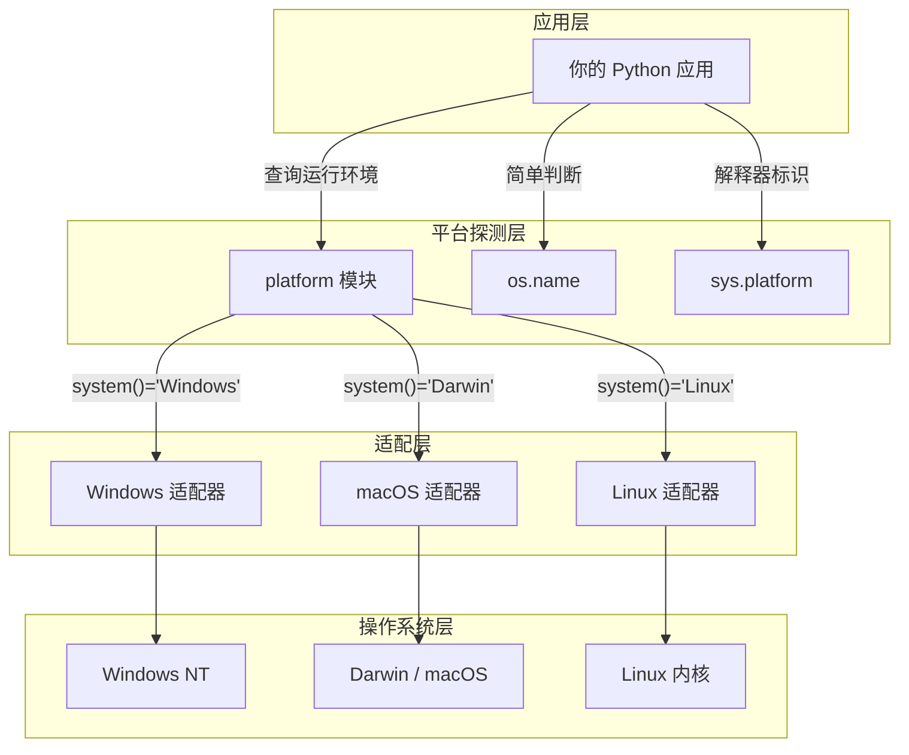
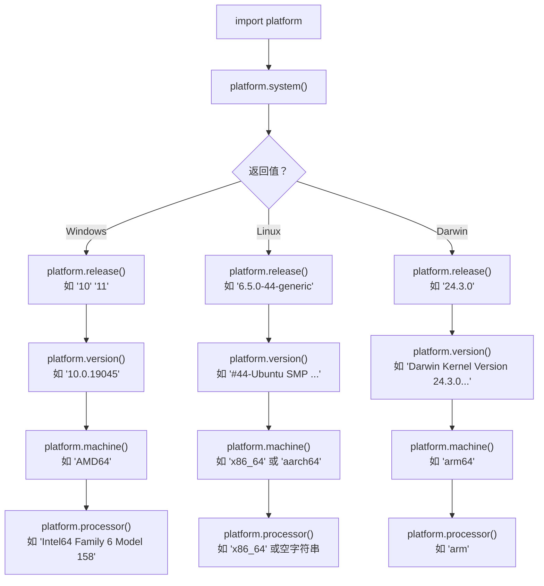
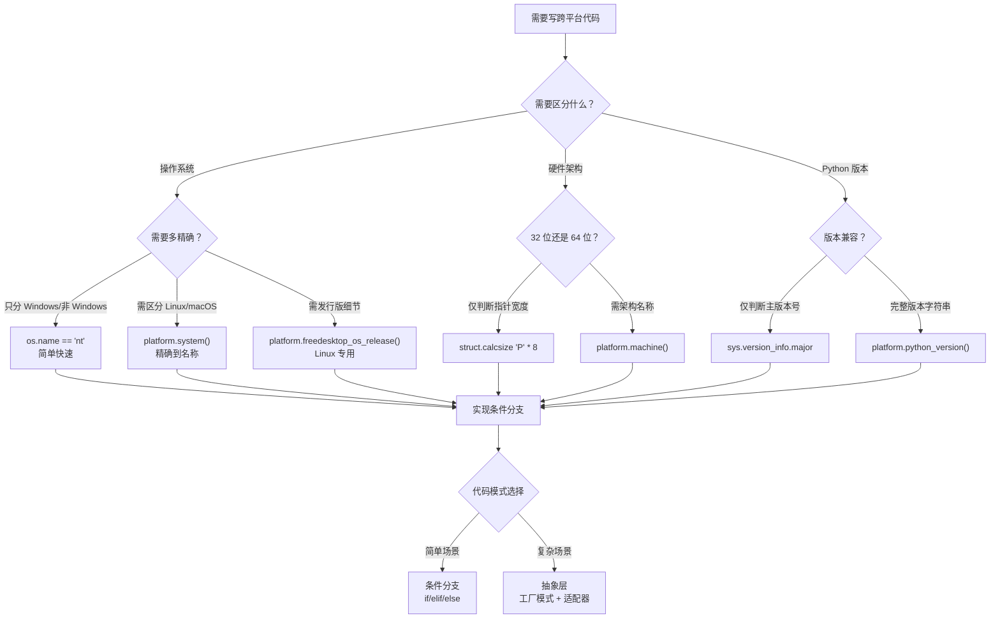

# platform — 跨平台系统信息探测的瑞士军刀

## 是什么：platform 模块的角色定位

`platform` 是 Python 标准库中专门用于**获取底层操作系统与运行时环境信息**的模块。当你需要编写"在 Windows 上走 A 路径、在 Linux 上走 B 路径"的跨平台代码时，`platform` 就是你的第一道防线——它告诉你"当前到底跑在什么环境上"。

```python
import platform

# 一行代码，回答"我在哪？"
print(platform.system())   # Windows / Linux / Darwin
print(platform.machine())  # x86_64 / arm64 / aarch64
```

### 为什么需要 platform？

| 没有 platform 的世界 | 有 platform 的世界 |
|---|---|
| 硬编码路径分隔符 `\\`，Linux 全部报错 | 用 `platform.system()` 判断后走不同分支 |
| 依赖 `os.name`，只能区分 `nt`/`posix`，粒度太粗 | 精确到系统名称、版本、架构、处理器 |
| 手动解析 `/etc/os-release`，代码又臭又长 | `platform.freedesktop_os_release()` 一行搞定 |
| 虚拟化/容器环境伪装成宿主，踩坑不自知 | `platform` 暴露真实内核信息，辅助识别 |

### platform 在跨平台架构中的位置



> **核心洞察**：`platform` 是应用层与操作系统层之间的"翻译官"——它把操作系统底层的异构信息，翻译成 Python 程序可以统一处理的字符串和字典。

---

## 怎么做：系统信息获取全流程

### 系统信息获取流程图

当你调用 `platform` 的核心函数时，信息按照从宏观到微观的层级逐级深入：



### 核心函数一览

| 函数 | 返回内容 | Windows 示例 | Linux 示例 | macOS 示例 |
|---|---|---|---|---|
| `platform.system()` | 操作系统名称 | `'Windows'` | `'Linux'` | `'Darwin'` |
| `platform.release()` | 操作系统发行版本 | `'10'` | `'6.5.0-44-generic'` | `'24.3.0'` |
| `platform.version()` | 操作系统详细版本 | `'10.0.19045'` | `'#44-Ubuntu SMP...'` | `'Darwin Kernel Version 24.3.0...'` |
| `platform.machine()` | 硬件架构 | `'AMD64'` | `'x86_64'` / `'aarch64'` | `'arm64'` |
| `platform.processor()` | 处理器标识 | `'Intel64 Family 6...'` | `''` 或 `'x86_64'` | `'arm'` |
| `platform.node()` | 网络主机名 | `'DESKTOP-ABC'` | `'ubuntu-server'` | `'MacBook-Pro'` |
| `platform.python_version()` | Python 版本 | `'3.12.4'` | `'3.12.4'` | `'3.12.4'` |
| `platform.python_implementation()` | Python 实现 | `'CPython'` | `'CPython'` | `'CPython'` |

> **注意**：`platform.processor()` 在 Linux 上经常返回空字符串 `''`，这是已知行为。Linux 上获取 CPU 信息应读取 `/proc/cpuinfo` 或使用 `platform.machine()` 替代。

### 完整可运行代码：系统信息全景扫描

```python
"""
platform_info_scanner.py — 跨平台系统信息全景扫描

运行方式：python platform_info_scanner.py
兼容性：Python 3.8+，Windows / Linux / macOS
"""

import platform
import struct
import sys


def scan_system_info() -> dict:
    """扫描并返回当前系统的完整平台信息"""

    info = {}

    # ---- 1. 操作系统信息 ----
    # system() 返回操作系统的通用名称：Windows / Linux / Darwin
    info["os_name"] = platform.system()

    # release() 返回操作系统的发行版本号
    # Windows: '10' 或 '11'
    # Linux: 内核版本如 '6.5.0-44-generic'
    # macOS: Darwin 内核版本如 '24.3.0'
    info["os_release"] = platform.release()

    # version() 返回更详细的版本信息
    # 比 release() 更长，包含补丁号和构建信息
    info["os_version"] = platform.version()

    # ---- 2. 硬件架构信息 ----
    # machine() 返回硬件架构标识
    # 常见值：x86_64, AMD64, arm64, aarch64, i386
    info["arch"] = platform.machine()

    # processor() 返回处理器标识字符串
    # ⚠️ Linux 上可能返回空字符串！
    info["processor"] = platform.processor()

    # struct.calcsize("P") 可以间接判断指针宽度
    # 返回 4 表示 32 位，8 表示 64 位
    info["pointer_width"] = struct.calcsize("P") * 8  # 32 或 64

    # ---- 3. 网络信息 ----
    # node() 返回计算机的网络主机名
    # 等价于 os.uname().nodename（POSIX）或环境变量 COMPUTERNAME（Windows）
    info["hostname"] = platform.node()

    # ---- 4. Python 运行时信息 ----
    # python_version() 返回 Python 版本号，如 '3.12.4'
    info["python_version"] = platform.python_version()

    # python_branch() 返回 Python 的 Git 分支（仅从源码构建时有意义）
    info["python_branch"] = platform.python_branch()

    # python_build() 返回 Python 的构建编号和日期
    info["python_build"] = platform.python_build()

    # python_compiler() 返回编译 Python 的 C 编译器信息
    info["python_compiler"] = platform.python_compiler()

    # python_implementation() 返回 Python 实现
    # CPython / PyPy / Jython / IronPython
    info["python_implementation"] = platform.python_implementation()

    # ---- 5. 综合信息 ----
    # platform() 返回一个可读的单行平台标识字符串
    # 如 'Windows-10-10.0.19045-SP0' 或 'macOS-14.4-arm64-arm-64bit'
    info["platform_string"] = platform.platform()

    # uname() 返回类似 os.uname() 的命名元组（跨平台可用）
    # 包含 system, node, release, version, machine, processor 六个字段
    info["uname"] = platform.uname()

    return info


def print_report(info: dict) -> None:
    """格式化打印系统信息报告"""

    print("=" * 60)
    print("  系统信息扫描报告")
    print("=" * 60)

    print(f"\n[操作系统]")
    print(f"  名称:     {info['os_name']}")
    print(f"  发行版本: {info['os_release']}")
    print(f"  详细版本: {info['os_version']}")

    print(f"\n[硬件架构]")
    print(f"  架构:     {info['arch']}")
    print(f"  处理器:   {info['processor'] or '(未获取到)'}")
    print(f"  指针宽度: {info['pointer_width']} 位")

    print(f"\n[网络]")
    print(f"  主机名:   {info['hostname']}")

    print(f"\n[Python 运行时]")
    print(f"  版本:     {info['python_version']}")
    print(f"  实现:     {info['python_implementation']}")
    print(f"  编译器:   {info['python_compiler']}")
    print(f"  构建:     {info['python_build']}")

    print(f"\n[综合标识]")
    print(f"  平台字符串: {info['platform_string']}")
    print(f"  uname:       {info['uname']}")

    print("=" * 60)


if __name__ == "__main__":
    system_info = scan_system_info()
    print_report(system_info)
```

运行示例输出（macOS arm64）：

```
============================================================
  系统信息扫描报告
============================================================

[操作系统]
  名称:     Darwin
  发行版本: 24.3.0
  详细版本: Darwin Kernel Version 24.3.0: Thu Jan  2 20:24:16 PST 2025; ...

[硬件架构]
  架构:     arm64
  处理器:   arm
  指针宽度: 64 位

[网络]
  主机名:   MacBook-Pro

[Python 运行时]
  版本:     3.12.4
  实现:     CPython
  编译器:   Clang 15.0.0 (clang-1500.3.9.4)
  构建:     ('main', 'Jun  6 2024 18:15:32')

[综合标识]
  平台字符串: macOS-14.4-arm64-arm-64bit
  uname:       uname_result(system='Darwin', node='MacBook-Pro', ...)
============================================================
```

---

## 跨平台兼容性检查决策树

当你编写跨平台代码时，需要根据不同环境走不同路径。以下决策树展示了典型的判断逻辑：



---

## 三种平台检测方式对比：platform vs os.name vs sys.platform

这是最常见的困惑点——三种方式各有所长，选择错误会导致代码在特定平台踩坑。

| 特性 | `platform.system()` | `os.name` | `sys.platform` |
|---|---|---|---|
| **返回值类型** | 字符串 | 字符串 | 字符串 |
| **Windows** | `'Windows'` | `'nt'` | `'win32'` |
| **Linux** | `'Linux'` | `'posix'` | `'linux'` |
| **macOS** | `'Darwin'` | `'posix'` | `'darwin'` |
| **区分 Linux 与 macOS** | 能 | 不能 | 能 |
| **粒度** | 精确到 OS 名称 | 仅 nt/posix 两类 | 精确到 OS 名称 |
| **调用开销** | 较高（需调用系统命令） | 极低（常量） | 极低（常量） |
| **适用场景** | 需要精确区分操作系统 | 仅需区分 Windows/非 Windows | 需要精确区分 + 追求性能 |
| **是否标准库** | 是 | 是 | 是 |
| **需额外 import** | `import platform` | `import os` | `import sys` |

### 选择建议

```python
# 场景 1：只需判断是否 Windows（最快，推荐 os.name）
import os
if os.name == "nt":
    # Windows 专用逻辑
    ...

# 场景 2：需要区分三大平台（推荐 sys.platform，性能好）
import sys
if sys.platform == "win32":
    ...
elif sys.platform == "darwin":
    ...
elif sys.platform == "linux":
    ...

# 场景 3：需要获取版本号、架构等详细信息（必须用 platform）
import platform
if platform.system() == "Darwin" and platform.machine() == "arm64":
    # Apple Silicon 专用逻辑
    ...
```

> **经验法则**：高频调用的热路径用 `sys.platform`（常量级开销），启动时的一次性检测用 `platform`（信息最丰富）。

---

## 跨平台代码模式

### 模式一：条件分支（适合简单场景）

```python
"""
cross_platform_path.py — 跨平台路径处理

演示如何使用 platform 判断操作系统，选择不同的路径处理策略
"""

import platform
from pathlib import Path


def get_app_config_dir() -> Path:
    """
    获取应用配置目录路径（跨平台）

    Windows: C:\\Users\\<user>\\AppData\\Roaming\\MyApp
    Linux:   /home/<user>/.config/MyApp
    macOS:   /Users/<user>/Library/Application Support/MyApp
    """
    system = platform.system()
    app_name = "MyApp"

    if system == "Windows":
        # Windows 使用 APPDATA 环境变量
        # 典型路径：C:\\Users\\zhangsan\\AppData\\Roaming
        import os
        base = Path(os.environ.get("APPDATA", Path.home() / "AppData" / "Roaming"))
        return base / app_name

    elif system == "Darwin":
        # macOS 使用 ~/Library/Application Support/
        return Path.home() / "Library" / "Application Support" / app_name

    elif system == "Linux":
        # Linux 遵循 XDG Base Directory 规范
        # 优先使用 XDG_CONFIG_HOME 环境变量
        import os
        xdg_config = os.environ.get("XDG_CONFIG_HOME", Path.home() / ".config")
        return Path(xdg_config) / app_name

    else:
        # 未知系统，回退到用户主目录
        return Path.home() / f".{app_name.lower()}"


def get_line_ending() -> str:
    """
    获取平台对应的换行符

    Windows 使用 CRLF (\\r\\n)
    Linux/macOS 使用 LF (\\n)
    """
    # 实际上 Python 的 os.linesep 已经封装了这一点
    # 但有时需要显式指定（如网络协议要求 LF）
    import os
    return os.linesep


if __name__ == "__main__":
    config_dir = get_app_config_dir()
    print(f"配置目录: {config_dir}")
    print(f"换行符: {repr(get_line_ending())}")
```

### 模式二：抽象层 + 适配器（适合复杂场景）

```python
"""
platform_adapter.py — 跨平台抽象层

使用工厂模式 + 适配器模式，将平台差异封装到独立类中，
避免业务代码中出现大量 if/elif。
"""

import platform
from abc import ABC, abstractmethod
from pathlib import Path
from typing import List


class PlatformAdapter(ABC):
    """平台适配器基类，定义跨平台统一接口"""

    @abstractmethod
    def get_config_dir(self, app_name: str) -> Path:
        """获取配置目录"""
        ...

    @abstractmethod
    def get_temp_dir(self) -> Path:
        """获取临时目录"""
        ...

    @abstractmethod
    def get_open_command(self) -> str:
        """获取"打开文件/URL"的命令"""
        ...

    @abstractmethod
    def get_shell_config(self) -> dict:
        """获取 Shell 配置"""
        ...


class WindowsAdapter(PlatformAdapter):
    """Windows 平台适配器"""

    def get_config_dir(self, app_name: str) -> Path:
        import os
        base = Path(os.environ.get("APPDATA", Path.home() / "AppData" / "Roaming"))
        return base / app_name

    def get_temp_dir(self) -> Path:
        import tempfile
        return Path(tempfile.gettempdir())

    def get_open_command(self) -> str:
        # Windows 使用 start 命令
        return "start"

    def get_shell_config(self) -> dict:
        return {
            "shell": "cmd.exe",
            "pipe_stderr": "2>&1",   # Windows cmd 的 stderr 重定向语法
            "path_sep": ";",          # Windows 路径分隔符
        }


class DarwinAdapter(PlatformAdapter):
    """macOS 平台适配器"""

    def get_config_dir(self, app_name: str) -> Path:
        return Path.home() / "Library" / "Application Support" / app_name

    def get_temp_dir(self) -> Path:
        return Path("/tmp")

    def get_open_command(self) -> str:
        # macOS 使用 open 命令
        return "open"

    def get_shell_config(self) -> dict:
        return {
            "shell": "/bin/zsh",     # macOS 默认 Shell
            "pipe_stderr": "2>&1",
            "path_sep": ":",
        }


class LinuxAdapter(PlatformAdapter):
    """Linux 平台适配器"""

    def get_config_dir(self, app_name: str) -> Path:
        import os
        xdg_config = os.environ.get("XDG_CONFIG_HOME", Path.home() / ".config")
        return Path(xdg_config) / app_name

    def get_temp_dir(self) -> Path:
        return Path("/tmp")

    def get_open_command(self) -> str:
        # Linux 使用 xdg-open
        return "xdg-open"

    def get_shell_config(self) -> dict:
        return {
            "shell": "/bin/bash",    # Linux 常用 Shell
            "pipe_stderr": "2>&1",
            "path_sep": ":",
        }


def create_adapter() -> PlatformAdapter:
    """
    工厂函数：根据当前平台创建对应的适配器

    这是唯一需要 platform 判断的地方，
    业务代码只需调用 adapter 的方法，无需关心平台差异。
    """
    system = platform.system()

    adapters = {
        "Windows": WindowsAdapter,
        "Darwin": DarwinAdapter,
        "Linux": LinuxAdapter,
    }

    adapter_cls = adapters.get(system)
    if adapter_cls is None:
        # 未知平台，回退到 Linux 适配器（POSIX 兼容性最好）
        import warnings
        warnings.warn(f"未知平台 '{system}'，回退到 Linux 适配器", RuntimeWarning)
        adapter_cls = LinuxAdapter

    return adapter_cls()


# ---- 使用示例 ----
if __name__ == "__main__":
    adapter = create_adapter()

    print(f"配置目录:   {adapter.get_config_dir('MyApp')}")
    print(f"临时目录:   {adapter.get_temp_dir()}")
    print(f"打开命令:   {adapter.get_open_command()}")
    print(f"Shell 配置: {adapter.get_shell_config()}")
```

### 模式对比

| 维度 | 条件分支模式 | 抽象层模式 |
|---|---|---|
| **代码量** | 少（10-30 行） | 多（80-150 行） |
| **可维护性** | 分支散落各处，易遗漏 | 平台逻辑集中，改一处生效全局 |
| **可测试性** | 需 mock platform 函数 | 可直接替换 adapter 实例 |
| **扩展性** | 新增平台需改所有 if/elif | 新增一个 Adapter 子类即可 |
| **适用场景** | 1-2 处平台判断 | 3 处以上平台判断 |

> **经验法则**：当你的项目中出现第 3 处 `if platform.system() == ...` 时，就该考虑抽象层模式了。

---

## 实战案例

### 案例 1：条件安装依赖

不同平台需要安装不同的依赖包（如 GPU 加速库）：

```python
"""
conditional_install.py — 根据平台条件安装依赖

在 setup.py 或 pyproject.toml 的构建脚本中使用 platform 判断，
安装平台特定的依赖。
"""

import platform
import subprocess
import sys


def install_platform_deps():
    """根据当前平台安装特定依赖"""

    system = platform.system()
    machine = platform.machine()

    # 公共依赖（所有平台都需要）
    common_deps = [
        "requests>=2.31.0",
        "click>=8.1.0",
        "rich>=13.0.0",
    ]

    # 平台特定依赖
    platform_deps = []

    if system == "Windows":
        # Windows: 安装 pywin32 用于 Windows API 访问
        platform_deps.append("pywin32>=306")

    elif system == "Darwin":
        # macOS: 安装 pyobjc 用于 macOS 原生 API
        platform_deps.append("pyobjc-core>=10.0")

        if machine == "arm64":
            # Apple Silicon: 安装 Metal 加速库
            platform_deps.append("metalcompute>=0.3.0")

    elif system == "Linux":
        # Linux: 安装 systemd 集成库
        platform_deps.append("systemd-python>=235")

        if machine == "aarch64":
            # ARM Linux: 安装 ARM 优化库
            platform_deps.append("numpy>=1.26.0")  # ARM 优化的 NumPy

    # 架构特定依赖
    if machine in ("x86_64", "AMD64"):
        # x86_64: 可用 Intel MKL 加速
        platform_deps.append("mkl>=2024.0")

    # 执行安装
    all_deps = common_deps + platform_deps
    cmd = [sys.executable, "-m", "pip", "install"] + all_deps
    print(f"安装依赖: {all_deps}")
    subprocess.check_call(cmd)


if __name__ == "__main__":
    install_platform_deps()
```

### 案例 2：跨平台系统适配代码

```python
"""
system_adapter.py — 跨平台系统操作适配

封装常见的系统操作，让业务代码无需关心平台差异。
"""

import platform
import subprocess
import sys
import os
from pathlib import Path
from typing import Optional, List


class SystemOps:
    """跨平台系统操作封装"""

    def __init__(self):
        self._system = platform.system()
        self._machine = platform.machine()

    # ---- 1. 打开文件/URL ----

    def open_file(self, path: Path) -> None:
        """
        用系统默认程序打开文件或 URL

        Windows: start
        macOS:   open
        Linux:   xdg-open
        """
        commands = {
            "Windows": ["start", "", str(path)],   # start 的第二个参数是标题
            "Darwin":  ["open", str(path)],
            "Linux":   ["xdg-open", str(path)],
        }
        cmd = commands.get(self._system, ["xdg-open", str(path)])
        subprocess.Popen(cmd, stdout=subprocess.DEVNULL, stderr=subprocess.DEVNULL)

    # ---- 2. 剪贴板操作 ----

    def copy_to_clipboard(self, text: str) -> None:
        """将文本复制到系统剪贴板"""
        if self._system == "Darwin":
            # macOS 使用 pbcopy
            process = subprocess.Popen(["pbcopy"], stdin=subprocess.PIPE)
            process.communicate(text.encode("utf-8"))

        elif self._system == "Linux":
            # Linux 优先使用 xclip，回退到 xsel
            for cmd in [["xclip", "-selection", "clipboard"], ["xsel", "--clipboard", "--input"]]:
                try:
                    process = subprocess.Popen(cmd, stdin=subprocess.PIPE)
                    process.communicate(text.encode("utf-8"))
                    return
                except FileNotFoundError:
                    continue
            raise RuntimeError("未找到 xclip 或 xsel，请安装其中之一")

        elif self._system == "Windows":
            # Windows 使用 clip 命令
            process = subprocess.Popen(["clip"], stdin=subprocess.PIPE)
            process.communicate(text.encode("utf-8"))

    # ---- 3. 获取 CPU 核心数（跨平台） ----

    def get_cpu_count(self) -> int:
        """
        获取逻辑 CPU 核心数

        不使用 platform，而用 os.cpu_count()，
        因为这是获取核心数的标准跨平台方式。
        """
        count = os.cpu_count()
        if count is None:
            return 1  # 无法检测时回退到 1
        return count

    # ---- 4. 获取内存信息 ----

    def get_memory_info(self) -> dict:
        """获取系统内存信息（跨平台）"""
        if self._system == "Linux":
            # Linux: 读取 /proc/meminfo
            info = {}
            with open("/proc/meminfo", "r") as f:
                for line in f:
                    parts = line.split()
                    key = parts[0].rstrip(":")
                    value = int(parts[1])  # 单位：KB
                    info[key] = value
            return {
                "total_gb": round(info["MemTotal"] / 1024 / 1024, 2),
                "available_gb": round(info["MemAvailable"] / 1024 / 1024, 2),
            }

        elif self._system == "Darwin":
            # macOS: 使用 vm_stat 命令
            result = subprocess.run(["vm_stat"], capture_output=True, text=True)
            page_size = 4096  # macOS 默认页大小
            lines = result.stdout.strip().split("\n")
            stats = {}
            for line in lines:
                if ":" in line:
                    key, val = line.split(":")
                    stats[key.strip()] = int(val.strip().rstrip("."))

            free_pages = stats.get("Pages free", 0)
            total_gb = round(os.sysconf("SC_PAGE_SIZE") * os.sysconf("SC_PHYS_PAGES") / 1024**3, 2)
            free_gb = round(free_pages * page_size / 1024**3, 2)
            return {"total_gb": total_gb, "available_gb": free_gb}

        elif self._system == "Windows":
            # Windows: 使用 ctypes 调用 GlobalMemoryStatusEx
            import ctypes
            class MEMORYSTATUSEX(ctypes.Structure):
                _fields_ = [
                    ("dwLength", ctypes.c_ulong),
                    ("dwMemoryLoad", ctypes.c_ulong),
                    ("ullTotalPhys", ctypes.c_ulonglong),
                    ("ullAvailPhys", ctypes.c_ulonglong),
                ]

            stat = MEMORYSTATUSEX()
            stat.dwLength = ctypes.sizeof(stat)
            ctypes.windll.kernel32.GlobalMemoryStatusEx(ctypes.byref(stat))  # type: ignore[attr-defined]
            return {
                "total_gb": round(stat.ullTotalPhys / 1024**3, 2),
                "available_gb": round(stat.ullAvailPhys / 1024**3, 2),
            }

        return {"total_gb": 0, "available_gb": 0}

    # ---- 5. 判断是否为 Apple Silicon ----

    def is_apple_silicon(self) -> bool:
        """判断当前是否运行在 Apple Silicon (M1/M2/M3/M4) 上"""
        return self._system == "Darwin" and self._machine == "arm64"

    # ---- 6. 判断是否为 WSL 环境 ----

    def is_wsl(self) -> bool:
        """
        判断是否运行在 Windows Subsystem for Linux 中

        WSL 的 platform.system() 返回 'Linux'，
        但 /proc/version 中包含 'microsoft' 标识。
        """
        if self._system != "Linux":
            return False
        try:
            with open("/proc/version", "r") as f:
                return "microsoft" in f.read().lower()
        except FileNotFoundError:
            return False


if __name__ == "__main__":
    ops = SystemOps()

    print(f"操作系统:     {platform.system()}")
    print(f"硬件架构:     {platform.machine()}")
    print(f"CPU 核心数:   {ops.get_cpu_count()}")
    print(f"内存信息:     {ops.get_memory_info()}")
    print(f"Apple Silicon: {ops.is_apple_silicon()}")
    print(f"WSL 环境:     {ops.is_wsl()}")
```

### 案例 3：Linux 发行版检测

```python
"""
distro_detect.py — Linux 发行版精确检测

platform.freedesktop_os_release() 是 Python 3.10+ 新增的功能，
可以精确获取 Linux 发行版信息（替代已废弃的 platform.linux_distribution()）。
"""

import platform


def get_linux_distro() -> dict:
    """
    获取 Linux 发行版详细信息

    仅在 Linux 上有效，其他平台返回空字典。
    需要 Python 3.10+。
    """
    if platform.system() != "Linux":
        print("当前不是 Linux 系统")
        return {}

    try:
        # freedesktop_os_release() 读取 /etc/os-release
        # 返回字典，包含 NAME, VERSION, ID, ID_LIKE 等字段
        os_release = platform.freedesktop_os_release()

        return {
            "id": os_release.get("ID", "unknown"),
            # ID_LIKE 表示此发行版基于哪个家族（如 ubuntu 基于 debian）
            "id_like": os_release.get("ID_LIKE", ""),
            "name": os_release.get("NAME", "Unknown"),
            "version": os_release.get("VERSION", ""),
            "version_id": os_release.get("VERSION_ID", ""),
            # VERSION_CODENAME 是发行版代号（如 Ubuntu 的 jammy, focal）
            "codename": os_release.get("VERSION_CODENAME", ""),
        }
    except OSError:
        # /etc/os-release 不存在（极简 Linux 环境）
        print("无法读取 /etc/os-release")
        return {}


if __name__ == "__main__":
    distro = get_linux_distro()
    if distro:
        print(f"发行版 ID:    {distro['id']}")
        print(f"发行版名称:   {distro['name']}")
        print(f"版本号:       {distro['version_id']}")
        print(f"版本代号:     {distro['codename']}")
        print(f"基于:         {distro['id_like']}")
```

> **Python 3.10 以下**的替代方案：安装第三方库 `distro`（`pip install distro`），API 为 `distro.id()`, `distro.name()`, `distro.version()`。

---

## 最佳实践对比表

| 最佳实践 | 推荐做法 | 反模式 | 原因 |
|---|---|---|---|
| 判断操作系统 | `sys.platform` 或 `platform.system()` | `os.name` 区分 Linux/macOS | `os.name` 在 Linux 和 macOS 都返回 `'posix'` |
| 判断 Windows | `os.name == 'nt'` 或 `sys.platform == 'win32'` | `platform.system() == 'Windows'`（热路径） | 后者调用开销更大 |
| 判断 32/64 位 | `struct.calcsize("P") * 8` | `platform.machine()` 再解析 | 后者返回 `'AMD64'` 等需额外处理 |
| 获取 Linux 发行版 | `platform.freedesktop_os_release()` | 手动解析 `/etc/os-release` | 前者已封装错误处理和编码 |
| 获取 CPU 信息 | `os.cpu_count()` + 读取 `/proc/cpuinfo` | `platform.processor()`（Linux） | `processor()` 在 Linux 常返回空串 |
| 跨平台路径 | `pathlib.Path` | 拼接 `\\` 或 `/` | `Path` 自动处理路径分隔符 |
| 跨平台代码组织 | 抽象层/适配器模式 | 到处散落 if/elif | 集中管理更易维护和测试 |
| WSL 检测 | 读取 `/proc/version` 检查 `microsoft` | `platform.system()` | WSL 中 `system()` 返回 `'Linux'` |
| 虚拟环境检测 | `sys.prefix != sys.base_prefix` 或检查 `VIRTUAL_ENV` 环境变量 | `platform.node()` | 主机名不能区分虚拟/物理 |

---

## 常见陷阱

### 陷阱 1：WSL 中 platform.system() 返回 'Linux'

```python
# ❌ 错误：无法区分 WSL 和原生 Linux
if platform.system() == "Linux":
    # 这在 WSL 中也会进入！
    install_native_linux_packages()

# ✅ 正确：显式检测 WSL
def is_wsl() -> bool:
    if platform.system() != "Linux":
        return False
    try:
        with open("/proc/version", "r") as f:
            return "microsoft" in f.read().lower()
    except FileNotFoundError:
        return False

if is_wsl():
    install_wsl_packages()
elif platform.system() == "Linux":
    install_native_linux_packages()
```

### 陷阱 2：platform.processor() 在 Linux 返回空字符串

```python
# ❌ 错误：processor() 在 Linux 上经常返回 ''
cpu = platform.processor()
if cpu.startswith("Intel"):
    optimize_for_intel()

# ✅ 正确：优先使用 machine()，回退到 /proc/cpuinfo
def get_cpu_info() -> str:
    """跨平台获取 CPU 标识"""
    cpu = platform.processor()
    if cpu:
        return cpu

    # Linux 回退：读取 /proc/cpuinfo 的 model name
    if platform.system() == "Linux":
        try:
            with open("/proc/cpuinfo", "r") as f:
                for line in f:
                    if line.startswith("model name"):
                        return line.split(":")[1].strip()
        except FileNotFoundError:
            pass

    # 最终回退：使用 machine() 架构标识
    return platform.machine()  # 如 'x86_64', 'aarch64'
```

### 陷阱 3：热路径中频繁调用 platform 函数

```python
# ❌ 错误：每次循环都调用 platform.system()，开销大
for file in large_file_list:
    if platform.system() == "Windows":  # 每次都执行系统调用！
        process_windows(file)
    else:
        process_unix(file)

# ✅ 正确：启动时检测一次，缓存结果
import sys

# sys.platform 是常量，零开销
IS_WINDOWS = sys.platform == "win32"

for file in large_file_list:
    if IS_WINDOWS:
        process_windows(file)
    else:
        process_unix(file)
```

### 陷阱 4：platform.linux_distribution() 已废弃

```python
# ❌ 错误：此函数在 Python 3.8 中已移除
distro_name = platform.linux_distribution()  # AttributeError!

# ✅ 正确：Python 3.10+ 使用 freedesktop_os_release()
os_release = platform.freedesktop_os_release()

# ✅ 正确：Python 3.8-3.9 使用第三方库 distro
import distro  # pip install distro
distro_name = distro.name()
```

### 陷阱 5：macOS 的 system() 返回 'Darwin' 而非 'macOS'

```python
# ❌ 错误：永远匹配不到
if platform.system() == "macOS":
    setup_mac_specific()

# ✅ 正确：macOS 的系统名称是 Darwin（内核名）
if platform.system() == "Darwin":
    setup_mac_specific()

# 💡 提示：platform.platform() 的输出中包含 "macOS" 字样
# 如 'macOS-14.4-arm64-arm-64bit'
# 如果需要用户友好的名称，可以解析 platform.platform()
```

---

## FAQ

### Q1：platform vs os.name vs sys.platform，到底用哪个？

| 你的需求 | 推荐 | 理由 |
|---|---|---|
| 只需区分 Windows / 非 Windows | `os.name` | 最简单，两个值：`'nt'` / `'posix'` |
| 需要精确区分三大平台（热路径） | `sys.platform` | 常量级开销，值：`'win32'` / `'darwin'` / `'linux'` |
| 需要版本号、架构等详细信息 | `platform.system()` + 其他函数 | 信息最全，但调用开销较大 |
| 启动时一次性检测 + 缓存 | 三者均可 | 启动时开销无关紧要，选可读性最好的 |

### Q2：在 Docker/虚拟机中，platform 返回的是宿主还是客户机信息？

**返回的是客户机（容器/虚拟机）信息**。`platform` 检测的是当前 Python 进程运行所在的操作系统的信息。在 Docker 容器中，它返回容器的内核信息（通常与宿主共享内核，但 `system()` 返回 `'Linux'`，`release()` 返回容器看到的内核版本）。

特殊场景：
- **Docker Desktop (macOS/Windows)**：容器内 `platform.system()` 返回 `'Linux'`（因为容器运行在 Linux VM 中）
- **WSL**：`platform.system()` 返回 `'Linux'`，但内核版本包含 `microsoft` 标识
- **QEMU 用户态模拟**：`platform.machine()` 返回模拟的架构（如 `aarch64` 上运行 x86 程序时可能返回 `x86_64`）

### Q3：如何检测是否运行在 CI/CD 环境中？

`platform` 模块本身不提供 CI/CD 检测功能，但可以结合环境变量：

```python
import os

def is_ci_environment() -> bool:
    """检测是否在 CI/CD 环境中运行"""
    ci_env_vars = [
        "CI",              # 通用 CI 标识
        "GITHUB_ACTIONS",  # GitHub Actions
        "GITLAB_CI",       # GitLab CI
        "JENKINS_URL",     # Jenkins
        "TRAVIS",          # Travis CI
        "CIRCLECI",        # CircleCI
        "BUILDKITE",       # Buildkite
    ]
    return any(os.environ.get(var) for var in ci_env_vars)
```

### Q4：platform 模块是线程安全的吗？

是的。`platform` 模块的所有函数都是无状态的查询函数，不涉及全局可变状态，可以在多线程环境中安全调用。唯一的例外是你自己的缓存变量——如果缓存了 `platform.system()` 的结果，确保在主线程中完成初始化。

### Q5：如何在不导入 platform 的情况下获取类似信息？

```python
import sys
import os

# 等价于 platform.system() 的逻辑
def system_name() -> str:
    """不使用 platform 获取操作系统名称"""
    return sys.platform.replace("win32", "Windows").replace("darwin", "Darwin").replace("linux", "Linux")

# 等价于 os.name 的逻辑
def is_windows() -> bool:
    return os.name == "nt"

# 但这些方法获取不到 machine(), processor(), release() 等信息
# 需要详细信息时，platform 仍是唯一选择
```

---

## 术语表

| 术语 | 英文 | 含义 |
|---|---|---|
| 跨平台 | Cross-platform | 同一份代码在多个操作系统上运行的能力 |
| 平台检测 | Platform detection | 运行时识别当前操作系统和硬件环境的过程 |
| 适配器模式 | Adapter pattern | 将不同接口转换为统一接口的设计模式 |
| 工厂模式 | Factory pattern | 根据条件创建不同对象的创建型设计模式 |
| Darwin | Darwin | macOS 的底层操作系统内核名称 |
| WSL | Windows Subsystem for Linux | 在 Windows 上运行 Linux 环境的兼容层 |
| POSIX | Portable Operating System Interface | IEEE 定义的操作系统接口标准 |
| XDG | X Desktop Group | Linux 桌面标准组织，定义了基础目录规范 |
| Apple Silicon | Apple Silicon | Apple 自研的 ARM 架构处理器（M1/M2/M3/M4 系列） |
| CPython | CPython | 用 C 语言实现的 Python 解释器（官方默认实现） |
| uname | Unix Name | Unix 系统调用，返回系统标识信息 |
| freedesktop.org | freedesktop.org | Linux 桌面标准化组织，定义了 os-release 规范 |
| ABI | Application Binary Interface | 应用程序二进制接口，决定编译后代码的兼容性 |

---

## 延伸阅读

| 资源 | 说明 |
|---|---|
| [Python 官方文档 - platform](https://docs.python.org/3/library/platform.html) | 官方参考手册，所有函数的权威定义 |
| [PEP 11 — CPython 平台支持策略](https://peps.python.org/pep-0011/) | Python 官方对各平台的支持级别定义 |
| [sys.platform 文档](https://docs.python.org/3/library/sys.html#sys.platform) | `sys.platform` 的取值说明和平台映射 |
| [os.name 文档](https://docs.python.org/3/library/os.html#os.name) | `os.name` 的取值说明 |
| [XDG Base Directory Specification](https://specifications.freedesktop.org/basedir-spec/basedir-spec-latest.html) | Linux 配置目录的标准规范 |
| [os-release 规范](https://www.freedesktop.org/software/systemd/man/os-release.html) | Linux 发行版标识文件的标准格式 |
| [distro 第三方库](https://github.com/python-distro/distro) | `platform.linux_distribution()` 的替代方案 |
| [pathlib 文档](https://docs.python.org/3/library/pathlib.html) | 跨平台路径处理的推荐模块 |

## 版本差异（标准库 → Python 3.14）

| 模块/特性 | 本文编写时 | Python 3.14 变化 |
|-----------|-----------|------------------|
| `datetime` | `utcnow()` / `utcfromtimestamp()` | 3.12 起弃用，改用 `datetime.now(tz=datetime.UTC)` / `fromtimestamp(ts, tz=datetime.UTC)`（aware 对象） |
| `asyncio` | 基础 API | 3.14 新增内省能力（`asyncio.Task`/`Future` 状态查询）；3.11 起推荐 `TaskGroup` + `asyncio.timeout()` |
| `typing` | 旧式 `List`/`Dict` | 3.9+ 内置泛型；3.10+ 联合类型 `X \| Y`；3.12 `type` 语句；3.14 PEP 649 延迟注解 |
| `importlib` | `imp` 模块 | `imp` 于 3.12 移除，统一使用 `importlib` |
| 压缩 | zlib/gzip/bz2/lzma | 3.14 新增 `zstandard` 标准库支持（PEP 784） |
| `pathlib` | 基础路径操作 | 3.12+ 持续增强（`Path.walk()` 等）；`is_relative_to()` 自 3.9 起可用 |
| 往事清理 | — | 3.13 移除 `cgi`、`telnetlib`、`crypt`、`audioop` 等已废弃模块 |

> 本文讲解的模块核心 API 与使用模式在 3.14 中保持稳定；注意上述弃用/移除项，升级时优先用标准库推荐的替代方案。
