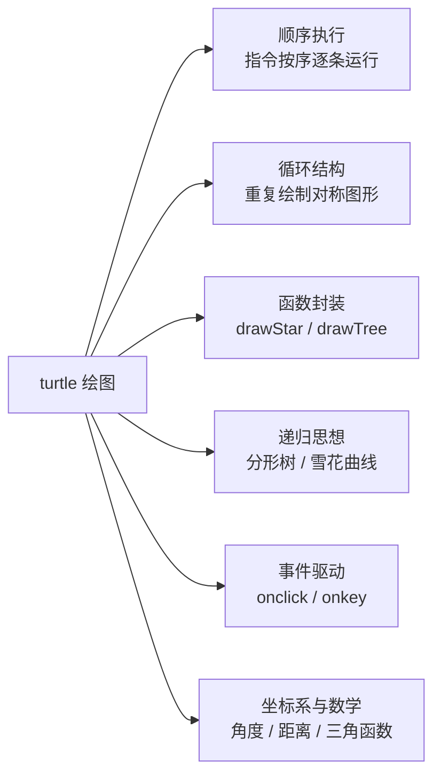
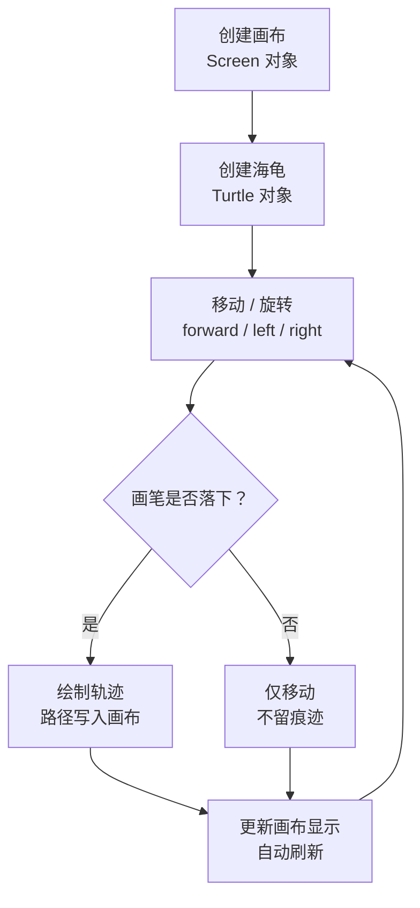
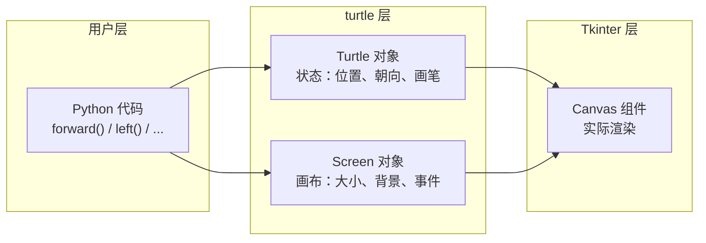
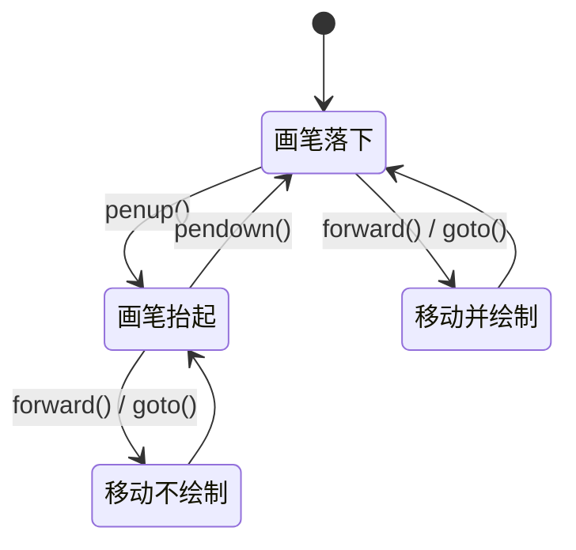
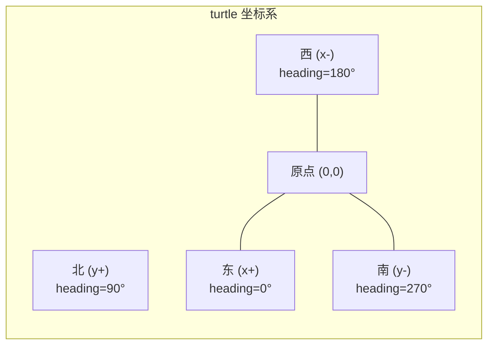
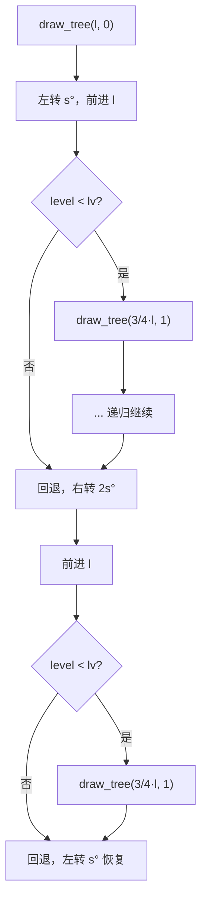
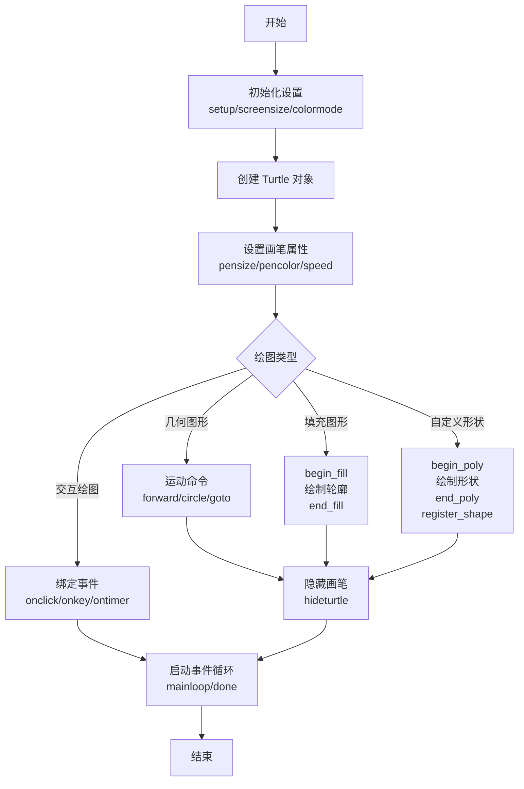
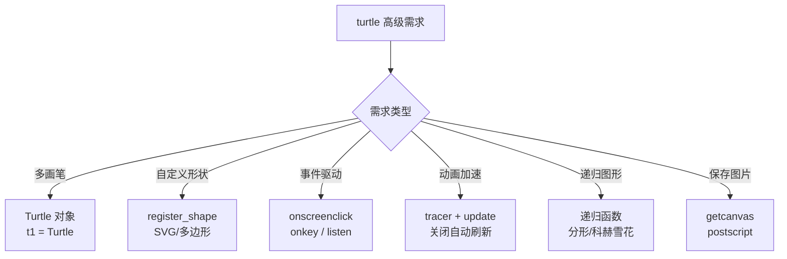

# turtle 海龟绘图

## 是什么：turtle 是什么？

在1966年，Seymour Papert 和 Wally Feurzig 发明了一种专门给儿童学习编程的语言——[LOGO语言](https://baike.baidu.com/item/LOGO语言/5881905)，它的特色就是通过编程指挥一个小海龟（turtle）在屏幕上绘图。海龟绘图（Turtle Graphics）后来被移植到各种高级语言中，Python 内置 `turtle` 库，基本上 100% 复制了原始的 Turtle Graphics 的所有功能。

**一句话定义**：`turtle` 是 Python 标准库中基于 Tkinter 的绘图模块，通过控制一只"海龟"的移动轨迹来绘制图形。

**核心特征**：

| 特征 | 说明 |
|------|------|
| 标准库 | 无需 `pip install`，Python 自带 |
| 可视化 | 所见即所得，绘图过程实时可见 |
| 面向对象 + 函数式 | 两种风格自由选择 |
| 教学友好 | 命令语义直观，适合编程入门 |
| 事件驱动 | 支持鼠标/键盘交互 |

## 为什么：为什么要学 turtle？

### 学习价值

turtle 不仅仅是一个画图工具，它是理解编程核心概念的桥梁：



### 适用场景

| 场景 | 是否适合 | 原因 |
|------|----------|------|
| 编程入门教学 | 非常适合 | 即时视觉反馈，降低抽象门槛 |
| 算法可视化 | 适合 | 排序、递归、分形等过程直观展示 |
| 数学概念演示 | 适合 | 坐标系、角度、几何变换可视化 |
| 生产级 GUI 应用 | 不适合 | Tkinter 性能有限，复杂 UI 用 PyQt/PySide |
| 高性能动画/游戏 | 不适合 | 帧率低，用 pygame / pyglet 替代 |

## 怎么做：turtle 绘图原理与实战

### 绘图原理

turtle 的核心思想极其简洁：**一只海龟站在画布上，你指挥它前进、转向，它走过的路径就是绘制的图形**。整个过程可以拆解为以下五个阶段：



### 三层架构

turtle 模块在底层依赖三个层次协同工作：



| 层次 | 职责 | 关键对象 |
|------|------|----------|
| 用户层 | 编写绘图指令 | Python 脚本 |
| turtle 层 | 管理海龟状态与画布 | `Turtle`、`Screen` |
| Tkinter 层 | 底层图形渲染 | `Canvas`、`Tk` |

### 海龟状态模型

每只海龟同时维护两个核心状态——**位置** `(x, y)` 和 **朝向** `heading`，再加上画笔的落下/抬起状态：



### 坐标系统

turtle 使用数学坐标系（与屏幕坐标系不同），原点在画布中心：



**关键规则**：

- 原点 `(0, 0)` 在画布**中心**（不是左上角！）
- x 轴向右为正，y 轴向上为正（与数学一致，与屏幕坐标相反）
- 朝向角度：0 度 = 东（右），90 度 = 北（上），180 度 = 西（左），270 度 = 南（下）
- `left(angle)` 逆时针旋转（角度增大），`right(angle)` 顺时针旋转（角度减小）
- 默认画布逻辑大小 400 x 300 像素

> **易混淆点**：屏幕坐标系的原点在左上角，y 轴向下为正；turtle 坐标系的原点在中心，y 轴向上为正。turtle 内部自动处理了两者之间的转换。

## 环境准备

turtle 依赖 Tkinter，部分 Python 安装可能缺少 Tkinter 支持。

### 检查与安装

```bash
# macOS (Homebrew)
brew install python-tk@3.13   # 版本号需与 Python 版本一致

# Ubuntu / Debian
sudo apt-get install python3-tk

# Windows
# Tkinter 通常随 Python 官方安装包自带，无需额外安装
```

### 快速验证

```python
import turtle          # 如果报错 No module named '_tkinter'，需安装 Tkinter
turtle.forward(100)    # 海龟前进 100 像素
turtle.done()          # 保持窗口打开
```

## 命令分类总览

turtle 的命令可按功能分为五大类：

| 类别 | 核心命令 | 说明 |
|------|----------|------|
| **运动命令** | `forward`、`backward`、`right`、`left`、`goto`、`setx`、`sety`、`setheading`、`home`、`circle`、`dot` | 控制海龟移动与转向 |
| **画笔命令** | `pendown`、`penup`、`pensize`、`pencolor`、`fillcolor`、`begin_fill`、`end_fill`、`hideturtle`、`showturtle` | 控制画笔属性与填充 |
| **状态命令** | `position`、`xcor`、`ycor`、`heading`、`isdown`、`distance`、`towards` | 查询海龟当前状态 |
| **事件命令** | `onclick`、`onrelease`、`ondrag`、`onkey`、`ontimer`、`listen` | 鼠标/键盘事件绑定 |
| **窗口命令** | `setup`、`screensize`、`bgcolor`、`title`、`tracer`、`update`、`done`、`bye` | 画布与窗口控制 |

### 运动命令详解

| 命令 | 缩写 | 说明 | 示例 |
|------|------|------|------|
| `forward(d)` | `fd(d)` | 向当前朝向前进 d 像素 | `fd(100)` |
| `backward(d)` | `bk(d)` / `back(d)` | 向当前朝向后退 d 像素 | `bk(50)` |
| `right(angle)` | `rt(angle)` | 顺时针旋转 angle 度 | `rt(90)` |
| `left(angle)` | `lt(angle)` | 逆时针旋转 angle 度 | `lt(90)` |
| `goto(x, y)` | — | 移动到坐标 (x, y) | `goto(0, 0)` |
| `setx(x)` | — | 仅改变 x 坐标 | `setx(100)` |
| `sety(y)` | — | 仅改变 y 坐标 | `sety(50)` |
| `setheading(a)` | `seth(a)` | 设置朝向角度（0=东，90=北） | `seth(90)` |
| `home()` | — | 回到原点，朝向东 | `home()` |
| `circle(r)` | — | 画圆，r>0 左侧画，r<0 右侧画 | `circle(50)` |
| `circle(r, e)` | — | 画弧，e 为弧度角度 | `circle(50, 180)` |
| `dot(size)` | — | 在当前位置画圆点 | `dot(10)` |

### 画笔命令详解

| 命令 | 缩写 | 说明 | 示例 |
|------|------|------|------|
| `pendown()` | `pd()` | 落笔，移动时绘制 | `pd()` |
| `penup()` | `pu()` | 抬笔，移动时不绘制 | `pu()` |
| `pensize(w)` | `width(w)` | 设置画笔宽度 | `pensize(3)` |
| `pencolor(c)` | — | 设置画笔颜色 | `pencolor('red')` |
| `fillcolor(c)` | — | 设置填充颜色 | `fillcolor('blue')` |
| `color(c1, c2)` | — | 同时设置画笔色和填充色 | `color('red', 'yellow')` |
| `begin_fill()` | — | 开始填充区域 | `begin_fill()` |
| `end_fill()` | — | 结束填充区域 | `end_fill()` |
| `hideturtle()` | `ht()` | 隐藏海龟图标 | `ht()` |
| `showturtle()` | `st()` | 显示海龟图标 | `st()` |

### 状态查询命令

| 命令 | 说明 | 返回值示例 |
|------|------|-----------|
| `position()` / `pos()` | 当前坐标 | `(100.0, 0.0)` |
| `xcor()` | 当前 x 坐标 | `100.0` |
| `ycor()` | 当前 y 坐标 | `0.0` |
| `heading()` | 当前朝向角度 | `90.0` |
| `isdown()` | 画笔是否落下 | `True` / `False` |
| `distance(x, y)` | 到 (x,y) 的距离 | `141.42` |
| `towards(x, y)` | 朝向 (x,y) 的角度 | `45.0` |

### 事件命令详解

| 命令 | 说明 | 示例 |
|------|------|------|
| `onclick(func)` | 鼠标点击海龟时触发 | `t.onclick(lambda x, y: t.goto(x, y))` |
| `onrelease(func)` | 鼠标释放时触发 | `t.onrelease(handler)` |
| `ondrag(func)` | 拖拽海龟时触发 | `t.ondrag(lambda x, y: t.goto(x, y))` |
| `onkey(func, key)` | 按下指定键时触发 | `screen.onkey(move_up, 'Up')` |
| `ontimer(func, ms)` | 定时器，ms 毫秒后触发 | `screen.ontimer(step, 100)` |
| `listen()` | 开始监听键盘事件 | `screen.listen()` |

> **注意**：事件命令需要事件循环（`done()` / `mainloop()`）运行才能生效。

### 窗口命令详解

| 命令 | 说明 | 示例 |
|------|------|------|
| `setup(w, h)` | 设置窗口大小和位置 | `setup(800, 600)` |
| `screensize(w, h, bg)` | 设置画布逻辑大小 | `screensize(2000, 2000, 'white')` |
| `bgcolor(c)` | 设置背景颜色 | `bgcolor('black')` |
| `title(s)` | 设置窗口标题 | `title('My Drawing')` |
| `tracer(n)` | 控制动画刷新频率 | `tracer(0)` 关闭自动刷新 |
| `update()` | 手动刷新画布 | `update()` |
| `done()` | 启动事件循环 | `done()` |
| `bye()` | 关闭窗口 | `bye()` |

## 基础绘图实战

### 正方形

最基础的图形——四条等长边、四次 90 度右转：

```python
from turtle import *

pensize(3)           # 画笔宽度 3 像素
pencolor('blue')     # 蓝色画笔

for i in range(4):   # 循环 4 次
    forward(100)     # 前进 100 像素
    right(90)        # 右转 90 度

done()               # 保持窗口
```

**绘制过程解析**：

| 步骤 | 位置 | 朝向 | 动作 |
|------|------|------|------|
| 初始 | (0, 0) | 0° (东) | — |
| 第1次循环后 | (100, 0) | 90° (北) | 前进100，右转90 |
| 第2次循环后 | (100, 100) | 180° (西) | 前进100，右转90 |
| 第3次循环后 | (0, 100) | 270° (南) | 前进100，右转90 |
| 第4次循环后 | (0, 0) | 0° (东) | 前进100，右转90，回到起点 |

### 圆形

使用 `circle()` 命令直接绘制：

```python
from turtle import *

pensize(2)
pencolor('red')

circle(80)           # 半径 80 像素的圆（圆心在海龟左侧）

done()
```

> **circle(r) 的方向规则**：r > 0 时圆心在海龟左侧（逆时针画圆），r < 0 时圆心在海龟右侧（顺时针画圆）。

**circle() 的三种用法**：

```python
circle(50)           # 完整圆，半径 50
circle(50, 180)      # 半圆（180度弧），半径 50
circle(50, 360, 6)   # 六边形（360度弧，6步），半径 50
```

### 五角星

五角星的关键角度是 144 度——每次前进后右转 144 度，5 次即可闭合：

```python
from turtle import *

def drawStar(x, y):
    """在 (x, y) 位置绘制五角星"""
    pu()              # 抬笔，移动不留痕迹
    goto(x, y)        # 移动到目标位置
    pd()              # 落笔，开始绘制
    seth(0)           # 朝向右方（0 度）
    for i in range(5):
        fd(40)        # 前进 40 像素
        rt(144)       # 右转 144 度（五角星内角）

# 绘制一排五角星
for x in range(0, 250, 50):
    drawStar(x, 0)

done()
```


**为什么是 144 度？** 五角星的外角 = 180° - 36° = 144°，其中 36° 是五角星尖角的内角。5 次转 144° = 720° = 2 × 360°，恰好闭合。

### 填充五角星

结合 `begin_fill()` / `end_fill()` 绘制实心图形：

```python
from turtle import *

def draw_filled_star(size):
    """绘制填充五角星"""
    fillcolor('yellow')      # 填充色：黄色
    pencolor('red')          # 边框色：红色
    pensize(2)

    begin_fill()             # 开始填充
    for i in range(5):
        fd(size)             # 前进
        rt(144)              # 右转 144 度
    end_fill()               # 结束填充

draw_filled_star(100)
done()
```

### 螺旋

通过逐渐增加步长，可以绘制出优美的螺旋图案：

```python
from turtle import *

speed(0)             # 最快速度
bgcolor('black')     # 黑色背景
pencolor('cyan')     # 青色画笔

for i in range(150):
    forward(i * 2)   # 步长逐渐增大
    right(91)        # 每次转 91 度（略大于直角，产生螺旋效果）

done()
```

**螺旋原理**：每次转向角度略大于 90°，导致路径无法闭合，而是逐渐向外扩展，形成螺旋。改变转向角度可以产生不同形态：

| 转向角度 | 效果 |
|----------|------|
| 90° | 正方形（闭合） |
| 91° | 紧密螺旋 |
| 120° | 三角形（闭合） |
| 121° | 三角螺旋 |
| 144° | 五角星（闭合） |
| 59° | 六角螺旋 |

### 彩色螺旋

结合颜色循环，让螺旋更加绚丽：

```python
from turtle import *

speed(0)
pensize(2)
bgcolor('black')

colors = ['red', 'yellow', 'green', 'cyan', 'blue', 'magenta']

for i in range(360):
    pencolor(colors[i % 6])   # 颜色循环：6 色轮流
    forward(i)                # 步长递增
    right(59)                 # 转向角度

done()
```

### 绘制长方形

```python
from turtle import *

width(4)             # 设置笔刷宽度
forward(200)         # 前进 200 像素
right(90)            # 右转 90 度

pencolor('red')
forward(100)
right(90)

pencolor('green')
forward(200)
right(90)

pencolor('blue')
forward(100)
right(90)

done()               # 保持窗口
```


### 绘制正多边形（通用函数）

利用正多边形的外角公式，编写通用绘制函数：

```python
from turtle import *

def draw_polygon(sides, length, color='black'):
    """
    绘制正多边形

    参数:
        sides   - 边数（3=三角形, 4=正方形, 6=六边形...）
        length  - 每条边长度
        color   - 画笔颜色
    """
    pencolor(color)
    angle = 360 / sides          # 外角 = 360° / 边数
    for _ in range(sides):
        fd(length)               # 前进
        rt(angle)                # 右转外角

# 绘制不同边数的正多边形
shapes = [
    (3, 80, 'red'),              # 三角形
    (4, 70, 'blue'),             # 正方形
    (5, 60, 'green'),            # 五边形
    (6, 50, 'purple'),           # 六边形
    (8, 40, 'orange'),           # 八边形
]

pu()                             # 抬笔
goto(-300, 0)                    # 移动到起始位置
pd()                             # 落笔

for sides, length, color in shapes:
    draw_polygon(sides, length, color)
    pu()
    fd(length + 30)              # 移动到下一个图形的起始位置
    pd()

done()
```

**正多边形角度公式**：

| 图形 | 边数 | 外角 | 内角 |
|------|------|------|------|
| 三角形 | 3 | 120° | 60° |
| 正方形 | 4 | 90° | 90° |
| 五边形 | 5 | 72° | 108° |
| 六边形 | 6 | 60° | 120° |
| 八边形 | 8 | 45° | 135° |
| n 边形 | n | 360°/n | 180° - 360°/n |

### 绘制同心圆

```python
from turtle import *

speed(0)
pensize(2)

colors = ['red', 'orange', 'yellow', 'green', 'cyan', 'blue', 'purple']

for i, color in enumerate(colors):
    pencolor(color)
    radius = 30 + i * 25        # 半径逐渐增大：30, 55, 80, ...
    circle(radius)              # 画圆
    pu()
    sety(ycor() - 25)           # 向下移动，使下一个圆的圆心对齐
    pd()

done()
```

### 绘制分形树

分形树是递归绘图的经典案例——每个枝干分裂为两个更短的枝干：

```python
from turtle import *

colormode(255)       # 设置 RGB 色彩模式（0-255）

lt(90)               # 海龟朝上（北）

lv = 14              # 最大递归深度
l = 120              # 初始枝干长度
s = 45               # 分叉角度

width(lv)

# 初始化 RGB 颜色
r, g, b = 0, 0, 0
pencolor(r, g, b)

penup()
bk(l)                # 后退到树根位置
pendown()
fd(l)                # 画主干


def draw_tree(l, level):
    """递归绘制分形树"""
    global r, g, b
    w = width()

    width(w * 3.0 / 4.0)          # 枝干逐渐变细
    r = r + 1
    g = g + 2
    b = b + 3
    pencolor(r % 200, g % 200, b % 200)  # 颜色渐变

    l = 3.0 / 4.0 * l             # 枝干逐渐变短

    lt(s)                          # 左转分叉
    fd(l)

    if level < lv:                 # 递归条件
        draw_tree(l, level + 1)
    bk(l)                          # 回退
    rt(2 * s)                      # 右转分叉
    fd(l)

    if level < lv:
        draw_tree(l, level + 1)
    bk(l)
    lt(s)                          # 恢复朝向

    width(w)                       # 恢复画笔宽度


speed("fastest")

draw_tree(l, 4)

done()
```

**递归过程解析**：



### 绘制科赫雪花

科赫雪花是另一种经典分形——将每条边三等分，中间部分替换为等边三角形的两条边：

```python
from turtle import *

def koch(size, n):
    """
    绘制科赫曲线

    参数:
        size - 当前线段长度
        n    - 递归深度
    """
    if n == 0:                # 递归终止：画直线
        fd(size)
    else:
        for angle in [60, -120, 60, 0]:  # 科赫曲线的四段转向
            koch(size / 3, n - 1)        # 递归绘制子线段
            lt(angle)                    # 转向

def snowflake(size, n):
    """绘制科赫雪花（三条科赫曲线组成）"""
    for _ in range(3):
        koch(size, n)
        rt(120)               # 右转 120°，画下一条边

speed(0)
pensize(2)
pencolor('blue')

pu()
goto(-150, 90)               # 移动到合适位置
pd()

snowflake(300, 3)            # 边长 300，递归深度 3

done()
```

### 绘制曼德博集合

曼德博集合是分形几何的经典——用 turtle 逐像素绘制：

```python
import turtle

def mandelbrot(c, max_iter=100):
    """计算曼德博集合迭代次数"""
    z = 0
    for i in range(max_iter):
        if abs(z) > 2:
            return i
        z = z * z + c
    return max_iter

def draw_mandelbrot():
    screen = turtle.Screen()
    screen.setup(600, 600)
    screen.bgcolor("black")
    screen.title("曼德博集合")

    t = turtle.Turtle()
    t.speed(0)
    t.penup()
    t.hideturtle()

    width, height = 600, 600
    x_min, x_max = -2.5, 1.0
    y_min, y_max = -1.5, 1.5
    max_iter = 50

    turtle.tracer(0)

    for px in range(width):
        for py in range(height):
            x = x_min + (px / width) * (x_max - x_min)
            y = y_min + (py / height) * (y_max - y_min)
            c = complex(x, y)
            m = mandelbrot(c, max_iter)

            if m == max_iter:
                color = "black"
            else:
                hue = int(255 * m / max_iter)
                color = f"#{hue:02x}{hue:02x}{255:02x}"

            t.goto(px - width // 2, py - height // 2)
            t.dot(1, color)

        if px % 10 == 0:
            turtle.update()

    turtle.update()
    turtle.done()

if __name__ == "__main__":
    draw_mandelbrot()
```

> **注意**：曼德博集合的逐像素绘制非常耗时（600×600 = 36 万像素），使用 `tracer(0)` + 每 10 行 `update()` 是性能关键。

## 动画速度控制

turtle 提供两种控制动画速度的方式，适用于不同场景：

### speed() 方法

`speed()` 控制海龟移动的动画速度，参数为 0~10 的整数或字符串：

| 参数值 | 字符串 | 效果 |
|--------|--------|------|
| 0 | `"fastest"` | 最快，无动画（直接跳到目标位置） |
| 1 | `"slowest"` | 最慢，逐步移动 |
| 3 | `"slow"` | 慢速 |
| 6 | `"normal"` | 正常速度（默认） |
| 10 | `"fast"` | 快速 |

```python
from turtle import *

speed(1)             # 最慢，适合观察绘制过程
for i in range(4):
    fd(100)
    rt(90)

done()
```

### tracer() + update() 方法

对于复杂图形（如分形树、大量线条），`speed(0)` 仍然不够快。此时应使用 `tracer()` 关闭自动刷新，绘制完成后一次性更新：

```python
from turtle import *

tracer(0)            # 关闭自动刷新（0 = 关闭，1 = 每帧刷新，n = 每 n 个动作刷新一次）

# ... 执行大量绘图命令 ...
for i in range(500):
    fd(i)
    rt(91)

update()             # 手动刷新一次，显示最终结果
done()
```

### 两种方式对比

| 对比项 | `speed()` | `tracer()` + `update()` |
|--------|-----------|--------------------------|
| 控制粒度 | 单个动作的速度 | 整体刷新策略 |
| 是否显示过程 | 是（可以看到绘制过程） | 否（只显示最终结果） |
| 性能 | 较慢（每步都渲染） | 极快（批量渲染） |
| 适用场景 | 教学、演示 | 复杂图形、性能优化 |
| 推荐值 | `speed(6)` 正常 / `speed(0)` 快 | `tracer(0)` + `update()` |

> **最佳实践**：开发调试时用 `speed(6)` 观察过程，确认无误后切换为 `tracer(0)` + `update()` 提升性能。

## 两种编程风格

turtle 支持两种编程风格，效果完全相同：

| 风格 | 写法 | 特点 |
|------|------|------|
| **函数式** | `from turtle import *` → `forward(100)` | 简洁，适合教学和小脚本 |
| **面向对象** | `t = turtle.Turtle()` → `t.forward(100)` | 可创建多只海龟，适合复杂项目 |

```python
# 函数式风格
from turtle import *
forward(100)
done()

# 面向对象风格
import turtle
t = turtle.Turtle()
t.forward(100)
turtle.done()
```

> **推荐**：当需要同时操控多只海龟时，必须使用面向对象风格，每只海龟是独立的 `Turtle` 对象。

### 多海龟协作示例

```python
import turtle

# 创建画布
screen = turtle.Screen()
screen.setup(600, 600)
screen.bgcolor('black')
screen.title('双海龟赛跑')

# 创建两只海龟
t1 = turtle.Turtle()       # 第一只海龟
t1.shape('turtle')
t1.color('red')
t1.pensize(2)

t2 = turtle.Turtle()       # 第二只海龟
t2.shape('turtle')
t2.color('cyan')
t2.pensize(2)

# t1 画正方形
t1.penup()
t1.goto(-200, 100)
t1.pendown()
for _ in range(4):
    t1.fd(80)
    t1.rt(90)

# t2 画三角形
t2.penup()
t2.goto(100, 100)
t2.pendown()
for _ in range(3):
    t2.fd(80)
    t2.rt(120)

screen.mainloop()
```

## 高级特性

### 高级绘图架构

Turtle 库基于 Tkinter 构建，四大子系统协同工作：

```mermaid
graph TB
    A[Turtle 库] --> B[画布 Screen]
    A --> C[画笔 Turtle]
    A --> D[事件系统]
    A --> E[形状系统]

    B --> B1[screensize 画布大小]
    B --> B2[setup 窗口设置]
    B --> B3[bgcolor 背景色]
    B --> B4[tracer 动画控制]
    B --> B5[mainloop 事件循环]

    C --> C1[运动控制<br/>forward/backward/goto]
    C --> C2[方向控制<br/>left/right/setheading]
    C --> C3[画笔属性<br/>pensize/pencolor/speed]
    C --> C4[填充控制<br/>begin_fill/end_fill]
    C --> C5[状态获取<br/>pos/heading/isdown]

    D --> D1[onclick 点击事件]
    D --> D2[onkey 按键事件]
    D --> D3[ontimer 定时器]
    D --> D4[listen 监听模式]

    E --> E1[register_shape 注册形状]
    E --> E2[shape 设置形状]
    E --> E3[shapesize 形状缩放]
    E --> E4[stamp 印章]
    E --> E5[begin_poly/end_poly<br/>自定义形状]

```



### 复杂图形绘制流程



### 高级绘图功能选择决策



### 基础 vs 高级命令对比表

| 类别 | 基础命令 | 高级命令 | 说明 |
|------|---------|---------|------|
| 画布设置 | `screensize()` | `setup(width, height, startx, starty)` | setup 可控制窗口位置 |
| 动画控制 | `speed(n)` | `tracer(n)`, `update()` | tracer 可关闭动画加速绘制 |
| 位置移动 | `forward(d)`, `backward(d)` | `goto(x, y)`, `setx(x)`, `sety(y)` | goto 直接定位到坐标 |
| 方向控制 | `left(a)`, `right(a)` | `setheading(a)`, `towards(x, y)` | setheading 设置绝对角度 |
| 画笔状态 | `pendown()`, `penup()` | `isdown()`, `pen()` | pen() 可获取/设置所有属性 |
| 填充 | `begin_fill()`, `end_fill()` | `filling()`, `color(pen, fill)` | filling() 检查填充状态 |
| 形状 | `shape('turtle')` | `register_shape()`, `begin_poly()/end_poly()` | 自定义形状 |
| 事件 | — | `onclick()`, `onkey()`, `ontimer()` | 交互式绘图 |
| 多画笔 | — | `Turtle()`, `list[Turtle]` | 创建多个画笔对象 |
| 状态保存 | — | `getscreen()`, `getcanvas()` | 获取底层对象 |

### 多画笔协作

```python
import turtle

screen = turtle.Screen()
screen.setup(800, 600)
screen.bgcolor("black")

colors = ["red", "blue", "green", "yellow", "purple"]
turtles = []

for i, color in enumerate(colors):
    t = turtle.Turtle()
    t.shape("turtle")
    t.color(color)
    t.speed(0)
    t.penup()
    t.goto(0, 0)
    t.pendown()
    turtles.append(t)

# 协作绘制螺旋图案
for i in range(100):
    for t in turtles:
        t.forward(i * 2)
        t.right(60)

screen.mainloop()
```

### 自定义形状

使用 `begin_poly()` 和 `end_poly()` 创建自定义形状：

```python
import turtle

t = turtle.Turtle()
t.speed(0)

# 开始记录多边形顶点（绘制五角星路径）
t.begin_poly()
for _ in range(5):
    t.forward(50)
    t.right(144)
t.end_poly()

# 注册为自定义形状
star_shape = t.get_poly()
turtle.register_shape("star", star_shape)

# 清除画布后使用新形状
t.reset()
t.shape("star")
t.color("gold")
t.shapesize(3)

# 印章效果：旋转并盖章
for i in range(12):
    t.stamp()
    t.right(30)

turtle.done()
```

### 事件驱动绘图

实现完整的交互式绘图程序：

```python
import turtle

screen = turtle.Screen()
screen.setup(800, 600)
screen.title("交互式绘图 — 点击绘制，方向键移动")

t = turtle.Turtle()
t.speed(0)
t.pensize(3)

def draw_dot(x, y):
    """鼠标点击处绘制圆点"""
    t.penup()
    t.goto(x, y)
    t.pendown()
    t.dot(20, "red")

def move_up():    t.setheading(90);  t.forward(20)
def move_down():  t.setheading(270); t.forward(20)
def move_left():  t.setheading(180); t.forward(20)
def move_right(): t.setheading(0);   t.forward(20)

screen.onclick(draw_dot)
screen.onkey(move_up, "Up")
screen.onkey(move_down, "Down")
screen.onkey(move_left, "Left")
screen.onkey(move_right, "Right")
screen.onkey(screen.bye, "q")  # 按 q 退出

screen.listen()
screen.mainloop()
```

## 高级实战案例

### 案例一：模拟时钟

结合 `datetime` 模块和 turtle 事件系统，实现一个实时走动的模拟时钟：

```python
import turtle
from datetime import *

def Skip(step):
    """抬起画笔，前进一段距离后放下"""
    turtle.penup()
    turtle.forward(step)
    turtle.pendown()

def mkHand(name, length):
    """创建表针形状"""
    turtle.reset()
    Skip(-length * 0.1)
    turtle.begin_poly()
    turtle.forward(length * 1.1)
    turtle.end_poly()
    handForm = turtle.get_poly()
    turtle.register_shape(name, handForm)

def Init():
    global secHand, minHand, hurHand, printer
    turtle.mode("logo")
    mkHand("secHand", 135)
    mkHand("minHand", 125)
    mkHand("hurHand", 90)
    secHand = turtle.Turtle()
    secHand.shape("secHand")
    minHand = turtle.Turtle()
    minHand.shape("minHand")
    hurHand = turtle.Turtle()
    hurHand.shape("hurHand")
    for hand in secHand, minHand, hurHand:
        hand.shapesize(1, 1, 3)
        hand.speed(0)
    printer = turtle.Turtle()
    printer.hideturtle()
    printer.penup()

def SetupClock(radius):
    """绘制表盘"""
    turtle.reset()
    turtle.pensize(7)
    for i in range(60):
        Skip(radius)
        if i % 5 == 0:
            turtle.forward(20)
            Skip(-radius - 20)
            Skip(radius + 20)
            if i == 0:
                turtle.write(int(12), align="center", font=("Courier", 14, "bold"))
            elif i == 30:
                Skip(25)
                turtle.write(int(i / 5), align="center", font=("Courier", 14, "bold"))
                Skip(-25)
            elif (i == 25 or i == 35):
                Skip(20)
                turtle.write(int(i / 5), align="center", font=("Courier", 14, "bold"))
                Skip(-20)
            else:
                turtle.write(int(i / 5), align="center", font=("Courier", 14, "bold"))
            Skip(-radius - 20)
        else:
            turtle.dot(5)
            Skip(-radius)
        turtle.right(6)

def Week(t):
    week = ["星期一", "星期二", "星期三", "星期四", "星期五", "星期六", "星期日"]
    return week[t.weekday()]

def Date(t):
    return "%s 年 %d 月 %d 日" % (t.year, t.month, t.day)

def Tick():
    """表针动态更新"""
    t = datetime.today()
    second = t.second + t.microsecond * 0.000001
    minute = t.minute + second / 60.0
    hour = t.hour + minute / 60.0
    secHand.setheading(6 * second)
    minHand.setheading(6 * minute)
    hurHand.setheading(30 * hour)

    turtle.tracer(False)
    printer.forward(65)
    printer.write(Week(t), align="center", font=("Courier", 14, "bold"))
    printer.back(130)
    printer.write(Date(t), align="center", font=("Courier", 14, "bold"))
    printer.home()
    turtle.tracer(True)

    turtle.ontimer(Tick, 100)  # 每 100ms 刷新一次

def main():
    turtle.tracer(False)
    Init()
    SetupClock(160)
    turtle.tracer(True)
    Tick()
    turtle.mainloop()

if __name__ == "__main__":
    main()
```

### 案例二：数字时钟

用七段数码管风格绘制当前时间：

```python
import turtle, time

def drawLine(draw):
    turtle.pendown() if draw else turtle.penup()
    turtle.fd(40)
    turtle.right(90)

def drawDight(dight):
    """绘制单个数字（七段数码管）"""
    drawLine(True) if dight in [2, 3, 4, 5, 6, 8, 9] else drawLine(False)
    drawLine(True) if dight in [0, 1, 3, 4, 5, 6, 7, 8, 9] else drawLine(False)
    drawLine(True) if dight in [0, 2, 3, 5, 6, 8, 9] else drawLine(False)
    drawLine(True) if dight in [0, 2, 6, 8] else drawLine(False)
    turtle.left(90)
    drawLine(True) if dight in [0, 4, 5, 6, 8, 9] else drawLine(False)
    drawLine(True) if dight in [0, 2, 3, 5, 6, 7, 8, 9] else drawLine(False)
    drawLine(True) if dight in [0, 1, 2, 3, 4, 7, 8, 9] else drawLine(False)
    turtle.right(180)
    turtle.penup()
    turtle.fd(20)

def drawDate(date):
    """绘制日期/时间字符串"""
    turtle.pencolor("red")
    for ch in date:
        if ch == '-':
            turtle.write('年', font=("微软雅黑", 32, "normal"))
            turtle.pencolor("green")
            turtle.fd(80)
        elif ch == '=':
            turtle.write('月', font=("微软雅黑", 32, "normal"))
            turtle.pencolor("blue")
            turtle.fd(80)
        elif ch == '+':
            turtle.write('日', font=("微软雅黑", 32, "normal"))
            turtle.pencolor("red")
            turtle.fd(80)
        elif ch == '/':
            turtle.write('时', font=("微软雅黑", 32, "normal"))
            turtle.pencolor("green")
            turtle.fd(80)
        elif ch == '*':
            turtle.write('分', font=("微软雅黑", 32, "normal"))
            turtle.pencolor("blue")
            turtle.fd(80)
        elif ch == '.':
            turtle.write('秒', font=("微软雅黑", 32, "normal"))
            turtle.fd(80)
        else:
            drawDight(eval(ch))

if __name__ == '__main__':
    turtle.penup()
    turtle.fd(-350)
    turtle.pensize(5)
    turtle.speed(1000)
    drawDate(time.strftime('%Y-%m=%d+', time.localtime()))
    turtle.right(90)
    turtle.fd(120)
    turtle.right(90)
    turtle.fd(660)
    turtle.right(180)
    drawDate(time.strftime('%H/%M*%S.', time.localtime()))
    turtle.hideturtle()
    turtle.done()
```

### 案例三：绘制小猪佩奇

用 turtle 绘制复杂卡通形象，展示组合图形的绘制技巧：

```python
from turtle import *

def nose(x, y):
    """画鼻子"""
    penup(); goto(x, y); pendown()
    setheading(-30)
    begin_fill()
    a = 0.4
    for i in range(120):
        if 0 <= i < 30 or 60 <= i < 90:
            a = a + 0.08; left(3); forward(a)
        else:
            a = a - 0.08; left(3); forward(a)
    end_fill()
    penup(); setheading(90); forward(25); setheading(0); forward(10); pendown()
    pencolor(255, 155, 192); setheading(10)
    begin_fill(); circle(5); color(160, 82, 45); end_fill()
    penup(); setheading(0); forward(20); pendown()
    pencolor(255, 155, 192); setheading(10)
    begin_fill(); circle(5); color(160, 82, 45); end_fill()

def head(x, y):
    """画头"""
    color((255, 155, 192), "pink")
    penup(); goto(x, y); setheading(0); pendown()
    begin_fill()
    setheading(180)
    circle(300, -30); circle(100, -60); circle(80, -100)
    circle(150, -20); circle(60, -95)
    setheading(161); circle(-300, 15)
    penup(); goto(-100, 100); pendown()
    setheading(-30); a = 0.4
    for i in range(60):
        if 0 <= i < 30 or 60 <= i < 90:
            a = a + 0.08; lt(3); fd(a)
        else:
            a = a - 0.08; lt(3); fd(a)
    end_fill()

def ears(x, y):
    """画耳朵"""
    color((255, 155, 192), "pink")
    penup(); goto(x, y); pendown()
    begin_fill(); setheading(100)
    circle(-50, 50); circle(-10, 120); circle(-50, 54)
    end_fill()
    penup(); setheading(90); forward(-12); setheading(0); forward(30); pendown()
    begin_fill(); setheading(100)
    circle(-50, 50); circle(-10, 120); circle(-50, 56)
    end_fill()

def eyes(x, y):
    """画眼睛"""
    color((255, 155, 192), "white")
    penup(); setheading(90); forward(-20); setheading(0); forward(-95); pendown()
    begin_fill(); circle(15); end_fill()
    color("black")
    penup(); setheading(90); forward(12); setheading(0); forward(-3); pendown()
    begin_fill(); circle(3); end_fill()
    color((255, 155, 192), "white")
    penup(); seth(90); forward(-25); seth(0); forward(40); pendown()
    begin_fill(); circle(15); end_fill()
    color("black")
    penup(); setheading(90); forward(12); setheading(0); forward(-3); pendown()
    begin_fill(); circle(3); end_fill()

def cheek(x, y):
    """画脸颊"""
    color((255, 155, 192))
    penup(); goto(x, y); pendown()
    setheading(0); begin_fill(); circle(30); end_fill()

def mouth(x, y):
    """画嘴巴"""
    color(239, 69, 19)
    penup(); goto(x, y); pendown()
    setheading(-80); circle(30, 40); circle(40, 80)

def main():
    pensize(4); hideturtle(); colormode(255)
    color((255, 155, 192), "pink")
    setup(840, 500); speed(10)
    nose(-100, 100)
    head(-69, 167)
    ears(0, 160)
    eyes(0, 140)
    cheek(80, 10)
    mouth(-20, 30)
    done()

if __name__ == '__main__':
    main()
```

> 这个案例展示了如何将复杂图形拆解为多个独立函数（鼻子、头、耳朵、眼睛、脸颊、嘴巴），每个函数负责一个部件，最终组合成完整图案。这正是"分而治之"编程思想在 turtle 中的体现。

## 最佳实践对比表

| 场景 | 推荐做法 | 不推荐做法 | 原因 |
|------|----------|------------|------|
| 编程风格 | 面向对象 `t = turtle.Turtle()` | 函数式 `from turtle import *` | 避免命名冲突，支持多海龟 |
| 复杂图形性能 | `tracer(0)` + `update()` | `speed(0)` | `tracer` 完全跳过渲染，性能高数倍 |
| 画笔状态切换 | `penup()` / `pendown()` 配对使用 | 忘记 `pendown()` | 忘记落笔导致后续图形不显示 |
| 填充图形 | `begin_fill()` 和 `end_fill()` 严格配对 | 只写 `begin_fill()` 不写 `end_fill()` | 填充不会生效 |
| 窗口保持 | 脚本末尾调用 `done()` | 不调用 `done()` | 窗口一闪而过 |
| 颜色设置 | 先 `colormode(255)` 再用 RGB | 混用 0-1 和 0-255 范围 | 导致颜色错误或报错 |
| 海龟形状 | `shape('turtle')` 使用海龟图标 | 默认箭头 | 更直观，尤其对初学者 |
| 画布大小 | `setup()` 设窗口 + `screensize()` 设画布 | 只用 `screensize()` | 窗口可能太小看不到画布 |
| 递归绘图 | 设置递归终止条件 | 无终止条件 | 无限递归导致 RecursionError |

## 常见陷阱

### 陷阱 1：忘记调用 done()

```python
# 错误：窗口一闪而过
import turtle
turtle.forward(100)
# 缺少 turtle.done()

# 正确：窗口保持打开
import turtle
turtle.forward(100)
turtle.done()              # 启动事件循环，保持窗口
```

### 陷阱 2：colormode 与颜色值不匹配

```python
# 错误：colormode=1.0（默认）时使用 0-255 范围
import turtle
turtle.pencolor(128, 0, 255)   # ValueError: invalid color arguments

# 正确方式一：切换到 255 模式
turtle.colormode(255)
turtle.pencolor(128, 0, 255)   # OK

# 正确方式二：使用 0-1 范围
turtle.colormode(1.0)
turtle.pencolor(0.5, 0.0, 1.0) # OK
```

### 陷阱 3：circle() 的圆心位置

```python
# 常见误解：以为 circle(50) 的圆心在海龟当前位置
# 实际：圆心在海龟左侧 50 像素处

# 如果想让圆心在 (0, 0)，需要先调整海龟位置
import turtle
turtle.penup()
turtle.goto(0, -50)        # 海龟移到圆心下方 50 像素处
turtle.pendown()
turtle.circle(50)           # 此时圆心在 (0, 0)
turtle.done()
```

### 陷阱 4：函数式风格的命名冲突

```python
# 错误：from turtle import * 可能覆盖内置名称
from turtle import *
distance = 100              # 覆盖了 turtle.distance 函数！
forward(distance)

# 正确：使用面向对象风格避免冲突
import turtle
t = turtle.Turtle()
my_distance = 100
t.forward(my_distance)
```

### 陷阱 5：事件绑定不生效

```python
# 错误：忘记 listen()，键盘事件不响应
import turtle
t = turtle.Turtle()
turtle.onkey(lambda: t.forward(50), 'Up')   # 绑定了但没监听
turtle.done()

# 正确：绑定后调用 listen()
import turtle
t = turtle.Turtle()
turtle.onkey(lambda: t.forward(50), 'Up')
turtle.listen()              # 开始监听键盘事件
turtle.done()
```

### 陷阱 6：在 IDLE 中运行 turtle 卡死

turtle 依赖 Tkinter 事件循环，而 IDLE 本身也使用 Tkinter，两者冲突会导致卡死。

**解决方案**：

```python
# 在脚本开头添加，解决 IDLE 冲突
import turtle
turtle.Screen().tracer(0)    # 在 IDLE 中关闭自动刷新

# 或者：使用命令行运行脚本
# python my_turtle_script.py
```

## FAQ

### Q1：如何设置画布大小？

```python
# 方法一：screensize —— 设置画布（可滚动区域）大小
turtle.screensize(800, 600, "white")   # 宽 800、高 600、白色背景

# 方法二：setup —— 设置窗口大小和位置
turtle.setup(width=800, height=600)                    # 800x600 像素
turtle.setup(width=0.6, height=0.6)                    # 占屏幕 60%
turtle.setup(width=800, height=600, startx=100, starty=100)  # 指定窗口位置
```

> `screensize` 控制的是画布的逻辑大小（超出窗口可滚动），`setup` 控制的是窗口的物理大小。

### Q2：如何控制动画速度？

```python
turtle.speed(0)      # 最快，无动画
turtle.speed(1)      # 最慢
turtle.speed(6)      # 正常
turtle.speed(10)     # 快

# 或者关闭动画，手动刷新（适合复杂图形）
turtle.tracer(False) # 关闭自动刷新
# ... 执行大量绘图命令 ...
turtle.tracer(True)  # 开启自动刷新，一次性显示结果
turtle.update()      # 手动刷新一次
```

### Q3：turtle 的坐标系统是怎样的？

- 原点 `(0, 0)` 在画布**中心**
- x 轴向右为正，y 轴向上为正
- 朝向角度：0 度 = 东（右），90 度 = 北（上），180 度 = 西（左），270 度 = 南（下）
- 默认画布大小 400 x 300 像素

### Q4：如何设置颜色模式？

```python
turtle.colormode(1.0)    # RGB 值范围 0.0 ~ 1.0（默认）
turtle.colormode(255)    # RGB 值范围 0 ~ 255

# colormode=1.0 时
pencolor(0.5, 0.0, 1.0)  # 紫色

# colormode=255 时
pencolor(128, 0, 255)    # 同样的紫色
```

### Q5：窗口一闪而过怎么办？

确保在脚本最后调用 `done()` 或 `mainloop()`，这会启动事件循环，保持窗口不关闭：

```python
turtle.done()          # 等价于 turtle.mainloop()
```

### Q6：如何让海龟瞬间移动到某个位置而不画线？

```python
turtle.penup()         # 抬笔
turtle.goto(x, y)      # 移动到目标位置
turtle.pendown()       # 落笔
```

### Q7：如何保存绘图结果为图片？

turtle 本身不直接支持导出图片，但可以通过以下方式实现：

```python
# 方法一：使用 PostScript 导出（矢量图）
import turtle
# ... 绘图代码 ...
ts = turtle.getscreen()
ts.getcanvas().postscript(file="drawing.eps")   # 保存为 EPS 文件

# 方法二：借助 Pillow 转为 PNG
# pip install Pillow
from PIL import Image
img = Image.open("drawing.eps")
img.save("drawing.png")

# 方法三：截图（最简单但不精确）
# 手动截图或使用系统截图工具
```

### Q8：如何让海龟的形状变成真正的海龟？

```python
import turtle
t = turtle.Turtle()
t.shape('turtle')      # 可选：'arrow', 'turtle', 'circle', 'square', 'triangle', 'classic'
t.shapesize(2)         # 放大 2 倍
```

### Q9：如何绘制文字？

```python
import turtle
t = turtle.Turtle()
t.write("Hello, Turtle!", align="center", font=("Arial", 24, "bold"))
# align: "left" / "center" / "right"
# font: (字体名, 大小, 样式)  样式可选 "normal" / "bold" / "italic"
```

### Q10：如何在无头服务器（无显示器）上运行？

```python
# 方法：使用虚拟帧缓冲
# 1. 安装 Xvfb
#    Ubuntu: sudo apt-get install xvfb
#    macOS:  brew install xvfb
# 2. 运行脚本
#    xvfb-run python my_turtle_script.py

# 或者在代码中设置
import os
os.environ['DISPLAY'] = ':99'   # 指向虚拟显示器
```

## 术语表

| 术语 | 英文 | 说明 |
|------|------|------|
| 画布 | Canvas / Screen | turtle 绘图的区域，由 Tkinter Canvas 实现 |
| 海龟 | Turtle | 画笔的可视化表示，拥有位置和朝向 |
| 画笔 | Pen | 海龟的绘图工具，有落下/抬起两种状态 |
| 朝向 | Heading | 海龟面朝的方向，0 度 = 东，90 度 = 北 |
| 轨迹 | Trace | 画笔落下时海龟移动留下的线条 |
| 填充 | Fill | 用颜色填充闭合图形内部 |
| 事件循环 | Mainloop | 保持窗口响应的 Tkinter 消息循环 |
| 分形 | Fractal | 具有自相似性的图形，常通过递归绘制 |
| 外角 | Exterior Angle | 多边形顶点处，延长边与下一条边的夹角，正 n 边形外角 = 360°/n |
| 内角 | Interior Angle | 多边形顶点处，两条边之间的夹角，正 n 边形内角 = 180° - 360°/n |
| 坐标系 | Coordinate System | turtle 使用数学坐标系，原点在中心，y 轴向上为正 |
| 颜色模式 | Color Mode | RGB 值的取值范围，1.0 模式（0.0~1.0）或 255 模式（0~255） |
| 刷新率 | Tracer | 控制画布更新频率，tracer(0) 关闭自动刷新，tracer(1) 每帧刷新 |
| 递归 | Recursion | 函数调用自身，turtle 中常用于绘制分形图形 |
| 科赫曲线 | Koch Curve | 将线段三等分并在中间替换为等边三角形的分形曲线 |
| LOGO 语言 | LOGO Language | 1966 年发明的教育编程语言，turtle 绘图的起源 |

## 延伸阅读

- [Python 官方文档 - turtle](https://docs.python.org/3/library/turtle.html) —— 最权威的 API 参考
- [LOGO 语言维基百科](https://en.wikipedia.org/wiki/Logo_(programming_language)) —— turtle 的历史起源
- [Turtle Graphics 教程 - Real Python](https://realpython.com/beginners-guide-python-turtle/) —— 英文入门教程
- [Python123 turtle 作品集](https://python123.io/index/turtles/latest) —— 大量 turtle 绘图案例
- [Seymour Papert - Mindstorms](https://en.wikipedia.org/wiki/Mindstorms_(book)) —— 构造主义教育经典，turtle 的哲学基础

## 版本差异（第三方库 → 当前稳定版）

| 库 | 本文编写时 | 当前稳定版 |
|----|-----------|-----------|
| `pydantic` | 1.x | 2.x（V2 核心重写，API 兼容层 `v1` 可选） |
| `pytest` | 7.x | 8.x（`pytest 8` 移除部分旧插件兼容） |
| `Pillow` | 9.x/10.x | 11.x |
| `psutil` | 5.x | 6.x/7.x |
| `chardet` | 4.x | 5.x（纯 Python；如需更高性能可选用 `charset-normalizer` 或维护中的 `faust-cchardet`） |

> 本文示例多为概念讲解，API 基本稳定；升级第三方库时以官方 changelog 为准。
