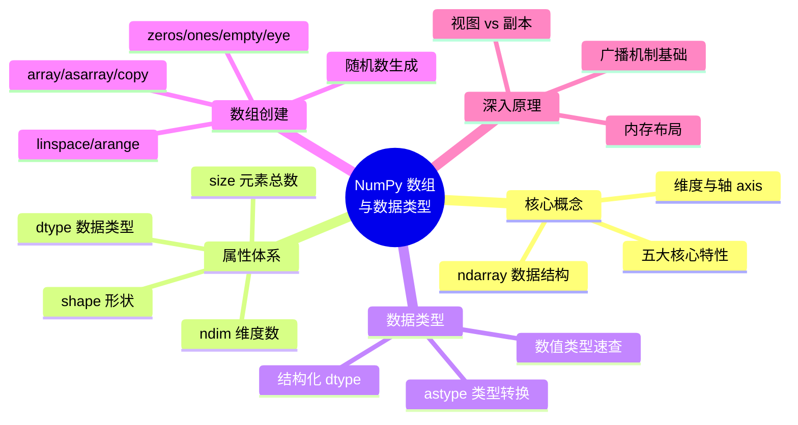
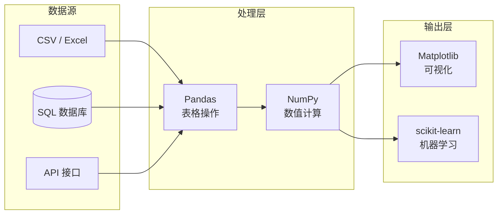
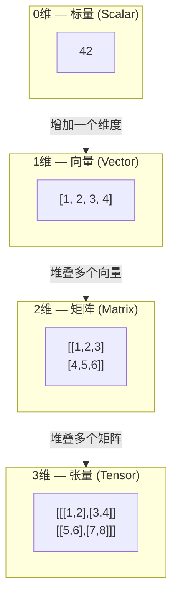
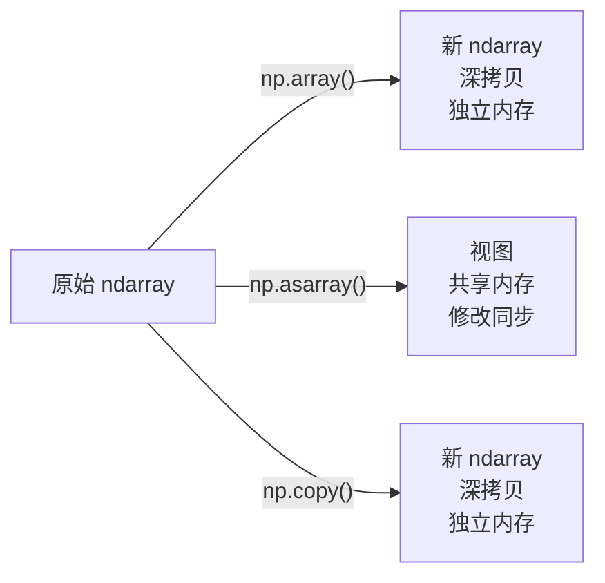
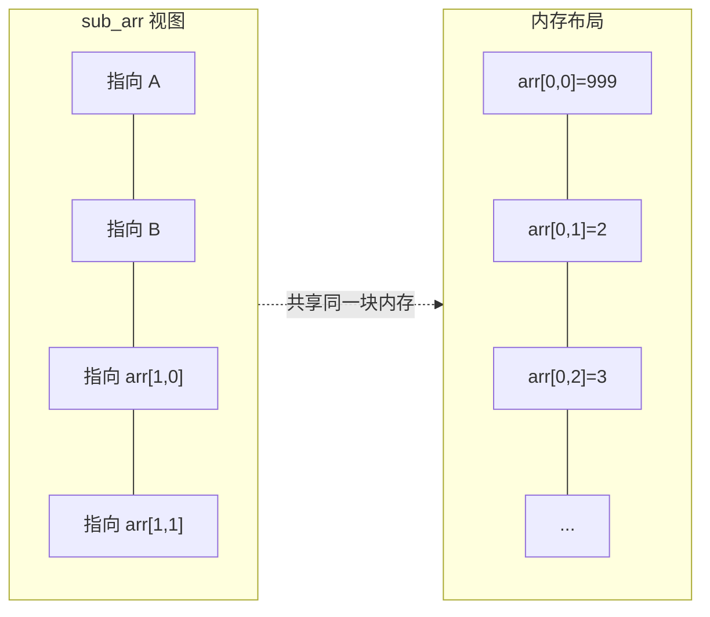

# NumPy 数组与数据类型

NumPy（Numerical Python）是 Python 科学计算生态的基石，其核心数据结构 `ndarray`（N-dimensional Array）为多维数值数据提供了高效、统一的抽象层。本文从底层原理出发，系统讲解 ndarray 的维度体系、属性机制、数据类型管理以及数组创建的完整方法论。

> 阅读提示

- 如果你想理解 NumPy 的设计哲学，从 [为什么需要 NumPy](#为什么需要-numpy) 开始
- 如果你想掌握 ndarray 的核心概念，跳到 [ndarray 核心数据结构](#ndarray-核心数据结构)
- 如果你想快速查阅数组创建方式，直接看 [数组创建方式全景](#数组创建方式全景)
- 如果你想了解内存模型和视图机制，重点看 [内存模型与视图机制](#内存模型与视图机制)
- 本文基于 **Python 3.12+**，**NumPy 2.x**

## 开篇概述



## 为什么需要 NumPy

### Python 原生数据结构的局限性

Python 内置的 `list` 和 `dict` 在处理数值数据时存在三个根本性缺陷：

| 局限性 | 具体表现 | 影响 |
|--------|---------|------|
| **类型异构** | 列表元素可以是任意类型的混合 | 无法利用连续内存，寻址效率低 |
| **存储分散** | 每个元素独立分配内存，存储指针而非数据 | 缓存命中率低，CPU 向量化指令无法启用 |
| **运算冗余** | 对列表做数学运算必须显式循环 | Python 解释器开销大，无法调用底层优化 |

### 性能对比：直观感受差距

```python
import numpy as np
import time

# 准备测试数据：100 万元素
data = list(range(1_000_000))
arr = np.array(data)

# ====== 方式一：Python 原生循环 ======
start = time.time()
squared = [x ** 2 for x in data]
python_time = time.time() - start
print(f"Python 循环耗时: {python_time:.4f} 秒")

# ====== 方式二：NumPy 向量化 ======
start = time.time()
squared_arr = arr ** 2
numpy_time = time.time() - start
print(f"NumPy 向量化耗时: {numpy_time:.4f} 秒")
print(f"性能提升倍数: {python_time / numpy_time:.0f}x")
```

典型输出（硬件不同会有差异）：

```
Python 循环耗时: 0.0850 秒
NumPy 向量化耗时: 0.0012 秒
性能提升倍数: 71x
```

::: tip 性能差异的本质原因
NumPy 的速度优势来自三层优化：
1. **C 语言实现**：核心运算用编译型语言编写，绕过 Python 解释器
2. **连续内存布局**：同质数据紧凑排列，CPU 缓存命中率高
3. **SIMD 指令**：单条 CPU 指令同时处理多个数据（向量化）
:::

### NumPy 在生态中的位置



**NumPy 是承上启下的计算引擎**：Pandas 的列底层数据就是 ndarray，Matplotlib 直接接收 ndarray 绘图，scikit-learn 的模型输入输出均为 ndarray。掌握 ndarray 是进入整个数据科学生态的必经之路。

## ndarray 核心数据结构

### 维度与轴（axis）的概念

在 NumPy 中，**维度（Dimension）** 描述数据的嵌套层次，**轴（Axis）** 是沿某个维度方向的操作索引。理解轴的概念是掌握 NumPy 操作（如 `sum(axis=0)`、`concatenate`）的关键。



| 维度 | 数学类比 | 轴数量 | 典型 shape 示例 | 业务场景 |
|------|---------|--------|----------------|---------|
| **0D** | 标量（点） | 0 | `()` | 单个数值常量 |
| **1D** | 向量（线） | 1 | `(5,)` | 时间序列、特征向量 |
| **2D** | 矩阵（面） | 2 | `(3, 4)` | 表格数据、灰度图像 |
| **3D** | 张量（体） | 3 | `(2, 3, 4)` | RGB 图像、多通道信号 |
| **ND** | 高阶张量 | N | `(2, 3, 4, 5)` | 批量数据、视频帧序列 |

::: info 轴的方向约定
- **axis=0**：沿着「行」方向操作（垂直方向），即跨行聚合
- **axis=1**：沿着「列」方向操作（水平方向），即跨列聚合
- 对于三维数组 `shape=(a, b, c)`：axis=0 沿深度方向，axis=1 沿行方向，axis=2 沿列方向
:::

```python
import numpy as np

# 二维数组演示轴的含义
matrix = np.array([
    [1, 2, 3],
    [4, 5, 6],
])

print("原始数组:\n", matrix)
print("沿 axis=0 求和（每列求和）:", matrix.sum(axis=0))  # [5 7 9]
print("沿 axis=1 求和（每行求和）:", matrix.sum(axis=1))  # [6 15]
```

### ndarray 五大核心特性

| 特性 | 说明 | 带来的好处 |
|------|------|-----------|
| **多维数组** | 支持 0 维到 N 维的数据组织 | 统一表达标量、向量、矩阵、高阶张量 |
| **同质类型** | 所有元素必须是相同的数据类型 | 连续内存存储，消除类型检查开销 |
| **0-based 索引** | 索引从 0 开始，与 C/Python 一致 | 降低认知负担，便于与其他库交互 |
| **向量化运算** | 对整个数组执行操作，无需显式循环 | 代码简洁，底层自动并行化 |
| **存储高效** | 数据在内存中连续排布 | CPU 缓存友好，支持内存映射文件 |

### ndarray 属性详解

```python
import numpy as np

# 创建一个示例数组：3 行 4 列的矩阵
arr = np.array([
    [1, 2, 3, 4],
    [5, 6, 7, 8],
    [9, 10, 11, 12],
])

print("数组内容:\n", arr)
print("shape （形状）:", arr.shape)     # (3, 4) — 3 行 4 列
print("ndim  （维度数）:", arr.ndim)     # 2 — 二维数组
print("size  （元素总数）:", arr.size)   # 12 — 3 × 4 = 12
print("dtype （数据类型）:", arr.dtype)   # int32 或 int64（取决于系统）
print("itemsize（每个元素字节数）:", arr.itemsize)  # 4 或 8
print("nbytes （总字节数）:", arr.nbytes)          # 48 或 96
```

#### 属性速查表

| 属性 | 类型 | 含义 | 示例值（3×4 整数矩阵） |
|------|------|------|---------------------|
| `shape` | tuple | 各维度的大小 | `(3, 4)` |
| `ndim` | int | 维度数（轴的数量） | `2` |
| `size` | int | 元素总数 | `12` |
| `dtype` | dtype 对象 | 元素数据类型 | `int64` |
| `itemsize` | int | 单个元素占用的字节数 | `8` |
| `nbytes` | int | 数组总占用字节数 | `96` |

::: tip 三者的关系
`size == shape 各元素的乘积`，`ndim == len(shape)`，`nbytes == size × itemsize`
:::

## 数据类型体系

### 常用数据类型速查表

NumPy 的数据类型比 Python 原生类型更丰富，且支持指定位宽，这对内存敏感场景至关重要。

| 类别 | 类型 | 位宽 | 字节数 | 取值范围说明 | 典型用途 |
|------|------|------|--------|-------------|---------|
| **整数（有符号）** | `int8` | 8 | 1 | -128 ~ 127 | 小范围计数、压缩存储 |
| | `int16` | 16 | 2 | -32,768 ~ 32,767 | 音频采样 |
| | `int32` | 32 | 4 | ±21 亿 | 默认整数类型 |
| | `int64` | 64 | 8 | ±9.2×10¹⁸ | 大数索引、时间戳 |
| **整数（无符号）** | `uint8` | 8 | 1 | 0 ~ 255 | 图像像素（0-255） |
| | `uint16` | 16 | 2 | 0 ~ 65,535 | 端口号、ID |
| | `uint32` | 32 | 4 | 0 ~ 4.29×10⁹ | 大规模索引 |
| **浮点数** | `float16` | 16 | 2 | 半精度 | GPU 计算、模型压缩 |
| | `float32` | 32 | 4 | 单精度（~7 位有效数字） | 深度学习默认类型 |
| | `float64` | 64 | 8 | 双精度（~15 位有效数字） | 科学计算默认类型 |
| **复数** | `complex64` | 64 | 8 | 两个 float32 | 信号处理、FFT |
| | `complex128` | 128 | 16 | 两个 float64 | 高精度复数运算 |
| **其他** | `bool_` | 8 | 1 | True / False | 逻辑掩码、条件筛选 |
| | `str_` | 可变 | — | Unicode 字符串 | 文本数据（较少使用） |

::: warning 选择合适类型的实际意义
一张 4000×3000 的 RGB 图像：
- 用 `uint8` 存储：36 MB
- 用 `float64` 存储：288 MB（**8 倍差距！**）
- 在深度学习中，将权重从 float64 降到 float16 可以节省 **75% 显存**
:::

### 类型转换：astype 方法

`astype()` 返回一个**新数组**，原数组不会被修改。这是 NumPy 中最常用的类型转换方式。

```python
import numpy as np

# 场景：模型输入要求浮点型，但原始数据是整数
raw_data = np.array([[1, 2, 3], [4, 5, 6]])
print("原始类型:", raw_data.dtype)   # int32 或 int64

# 转换为 float64
float_data = raw_data.astype(np.float64)
print("转换后类型:", float_data.dtype)  # float64

# 原数组未受影响
print("原数组仍为:", raw_data.dtype)    # 不变

# 实际业务场景：图像归一化（uint8 → float32，再归一化到 [0, 1]）
image_uint8 = np.random.randint(0, 256, (100, 100, 3), dtype=np.uint8)
image_float = image_uint8.astype(np.float32) / 255.0
print("归一化后范围:", image_float.min(), "~", image_float.max())  # 0.0 ~ 1.0
```

#### 类型推断规则

当创建数组时，NumPy 会根据输入数据自动推断 dtype：

```python
import numpy as np

# 全整数 → int32 或 int64（取决于平台）
print(np.array([1, 2, 3]).dtype)           # int32 或 int64

# 包含浮点数 → 自动提升为 float64
print(np.array([1, 2.5, 3]).dtype)         # float64

# 混合整数和布尔值 → 整数
print(np.array([True, False, 3]).dtype)    # int32 或 int64

# 显式指定 dtype（推荐）
arr = np.array([1, 2, 3], dtype=np.float32)
print(arr.dtype)                            # float32
```

::: info 类型提升规则
当不同类型的数组进行运算时，NumPy 会按照以下层级**自动提升**到更宽的类型：

`bool_ → int8 → int16 → int32 → int64 → float32 → float64 → complex64 → complex128`

这是为了避免精度丢失，但有时会导致意外的内存膨胀。
:::

### 结构化数据与自定义 dtype

对于类似数据库记录的结构化数据（如成绩单、员工信息），NumPy 支持通过自定义 dtype 创建**结构化数组**。

#### 字符码速查表

| 字符码 | 对应类型 | 说明 |
|--------|---------|------|
| `?` | bool_ | 布尔型（注意：`b` 是 int8 单字节整数，不是布尔） |
| `i` | 有符号整型 | int8/int16/int32/int64（`i1` 等价 `b`） |
| `u` | 无符号整型 | uint8/uint16/uint32/uint64 |
| `f` | 浮点型 | float16/float32/float64 |
| `c` | 复数型 | complex64/complex128 |
| `m` | timedelta64 | 时间差 |
| `M` | datetime64 | 日期时间 |
| `O` (字母O) | object | Python 对象 |
| `S` / `a` | bytes_ | 字节字符串 |
| `U` | str_ | Unicode 字符串 |
| `V` | void | 原始字节块 |

```python
import numpy as np

# 定义结构化 dtype：模拟成绩单
grade_dtype = np.dtype([
    ('name', 'U20'),    # 姓名：最长 20 字符的 Unicode 字符串
    ('age', 'i4'),      # 年龄：4 字节有符号整数（int32）
    ('chinese', 'f4'),  # 语文：4 字节浮点（float32）
    ('math', 'f4'),     # 数学：4 字节浮点
    ('english', 'f4'),  # 英语：4 字节浮点
])

# 创建结构化数组
grades = np.array([
    ("张三", 15, 86.0, 90.0, 85.0),
    ("李四", 16, 92.0, 78.0, 88.0),
    ("王五", 15, 75.0, 95.0, 82.0),
], dtype=grade_dtype)

print(grades)
# [('张三', 15, 86., 90., 85.) ('李四', 16, 92., 78., 88.) ('王五', 15, 75., 95., 82.)]

# 按字段名访问（类似 Pandas 的列名）
print("所有姓名:", grades['name'])            # ['张三' '李四' '王五']
print("数学平均分:", grades['math'].mean())   # 87.666...

# 按条件筛选
high_math = grades[grades['math'] >= 85]
print("数学 >= 85 分的同学:\n", high_math)
```

::: tip 结构化数组的适用场景
- 需要读取固定格式的二进制文件或 C 结构体
- 内存极其受限的嵌入式环境（比 Pandas DataFrame 更轻量）
- 与 C/Fortran 代码通过 ctypes 交互

日常数据分析中更常用 **Pandas DataFrame**，API 更友好。
:::

## 数组创建方式全景

### 基础创建函数

| 函数 | 功能 | 默认 dtype | 典型用途 |
|------|------|-----------|---------|
| `zeros(shape)` | 全零数组 | float64 | 初始化占位、掩码初始化 |
| `ones(shape)` | 全一数组 | float64 | 权重初始化、偏置项 |
| `empty(shape)` | 未初始化数组（随机值） | float64 | 预分配内存后手动填充 |
| `eye(N)` / `identity(N)` | N×N 单位矩阵 | float64 | 线性代数、图论算法 |

```python
import numpy as np

# 场景：神经网络中的参数初始化
batch_size, features = 128, 512

# 全零初始化（如梯度累加器）
grad_accumulator = np.zeros((features,))
print("梯度累加器 shape:", grad_accumulator.shape)  # (512,)

# 全一初始化（如偏置项）
bias = np.ones((features,))
print("偏置项 shape:", bias.shape)                  # (512,)

# 预分配内存（稍后填入数据）
buffer = np.empty((batch_size, features), dtype=np.float32)
print("预分配 buffer shape:", buffer.shape)         # (128, 512)

# 单位矩阵（线性变换的初始状态）
identity_matrix = np.eye(3)
print("单位矩阵:\n", identity_matrix)
```

::: warning empty() 的陷阱
`np.empty()` **不会将内存清零**！它返回的是当前内存位置的残留值。如果你看到很小的科学计数法数字（如 `6.23e-307`），那就是未初始化的表现。**只有当你确定会立即覆盖所有元素时才使用 `empty()`**。
:::

### 从序列创建：array vs asarray vs copy

这是面试高频考点，也是生产环境中最容易踩坑的地方之一。

| 方法 | 输入为 ndarray 时 | 输入为 list/tuple 时 | 是否复制数据 | 适用场景 |
|------|------------------|---------------------|------------|---------|
| `np.array()` | **总是拷贝**（深拷贝） | 总是拷贝 | ✅ 总是复制 | 需要完全独立的副本 |
| `np.asarray()` | **不拷贝**（返回视图） | 拷贝 | ⚠️ 视输入而定 | 确保结果是 ndarray，但不强制复制 |
| `np.copy()` | 拷贝（深拷贝） | 拷贝 | ✅ 总是复制 | 明确需要副本时的语义化写法 |

```python
import numpy as np

# ========== 演示三种方式的差异 ==========
original = np.array([1, 2, 3, 4, 5])

# 方式一：np.array —— 深拷贝
arr_from_array = np.array(original)

# 方式二：np.asarray —— 视图（不复制）
arr_from_asarray = np.asarray(original)

# 方式三：np.copy —— 深拷贝
arr_from_copy = np.copy(original)

# 修改原数组
original[0] = 999

print("修改原数组后:")
print("np.array 结果:  ", arr_from_array)    # [1 2 3 4 5] — 不受影响
print("np.asarray 结果:", arr_from_asarray)   # [999  2  3  4  5] — 被影响了！
print("np.copy 结果:   ", arr_from_copy)      # [1 2 3 4 5] — 不受影响
```



::: tip 生产建议
- **需要修改数据但不想影响原数组** → 使用 `np.array(x, copy=True)` 或 `np.copy(x)`
- **只是确保输入是 ndarray 格式** → 使用 `np.asarray(x)`（性能更好，避免不必要的复制）
- **不确定时** → 使用 `np.array()` 更安全
:::

### 序列生成：linspace vs arange

两者都用于生成等差数列，但**端点行为完全不同**——这是最常见的陷阱之一。

| 特性 | `np.linspace()` | `np.arange()` |
|------|-----------------|---------------|
| 参数 | `(start, stop, num)` | `(start, stop, step)` |
| stop 是否包含 | ✅ **包含**（左闭右闭） | ❌ **不包含**（左闭右开） |
| 控制方式 | 指定元素个数 | 指定步长 |
| 默认 dtype | float64 | 推断（整数输入得 int） |
| 典型场景 | 固定数量的采样点 | 固定步长的等差序列 |

```python
import numpy as np

# ====== linspace：指定元素个数，包含终点 ======
# 场景：在 [0, 2π] 之间取 100 个点画正弦曲线
x = np.linspace(0, 2 * np.pi, 100)
print("linspace 首尾:", x[0], "...", x[-1])  # 0.0 ... 6.283185307179586（≈2π）

# ====== arange：指定步长，不含终点 ======
# 场景：生成 0 到 99 的整数序列
y = np.arange(0, 100, 5)
print("arange 结果:", y)  # [ 0  5 10 ... 95]（注意：没有 100）

# ====== 经典陷阱演示 ======
# 目标：生成 [0.0, 0.1, 0.2, ..., 1.0]
trap_arange = np.arange(0, 1.1, 0.1)
print("\narange 尝试:", trap_arange)
# 可能输出：[0.  0.1 0.2 0.3 0.4 0.5 0.6 0.7 0.8 0.9 1. ]
# 但由于浮点精度问题，最后一个值可能不是 1.0！

# 正确做法：用 linspace
correct = np.linspace(0, 1, 11)
print("linspace 正确:", correct)
# [0.  0.1 0.2 0.3 0.4 0.5 0.6 0.7 0.8 0.9 1. ] — 精确可控
```

::: warning 浮点陷阱
`np.arange()` 在涉及浮点步长时可能因精度问题导致元素个数不可预测。**如果需要精确控制元素个数，永远优先使用 `linspace()`**。
:::

### 随机数生成

NumPy 的 `random` 模块提供了多种概率分布的随机数生成器。**注意：NumPy 2.x 推荐使用新的 `Generator` API**（`np.random.default_rng()`），旧 API 仍可用但已标记为遗留。

| 函数 | 分布 | 关键参数 | 典型场景 |
|------|------|---------|---------|
| `rng.random(size)` | 均匀分布 U(0, 1) | shape | 概率抽样、随机初始化 |
| `rng.uniform(low, high, size)` | 均匀分布 U(low, high) | 区间、shape | 指定范围的随机值 |
| `rng.normal(loc, scale, size)` | 正态分布 N(μ, σ²) | 均值、标准差、shape | 模拟自然现象（身高、误差） |
| `rng.standard_normal(size)` | 标准正态分布 N(0, 1) | shape | 神经网络权重初始化 |
| `rng.integers(low, high, size)` | 均匀整数 | 区间、shape | 随机索引、类别标签 |

```python
import numpy as np

# 推荐：使用新版 Generator API（NumPy 1.17+）
rng = np.random.default_rng(seed=42)  # 设置种子保证可复现

# 场景一：模拟班级期末考试成绩（正态分布）
# 假设均分 75 分，标准差 12 分，50 名学生
scores = rng.normal(loc=75, scale=12, size=50)
scores = np.clip(scores, 0, 100)  # 截断到 0-100 分
print(f"成绩统计: 均值={scores.mean():.1f}, 标准差={scores.std():.1f}")
# 成绩统计: 均值=74.x, 标准差=11.x

# 场景二：图像像素噪声（均匀分布）
# 给图像添加 [-10, 10] 范围内的随机噪声
image = np.ones((100, 100), dtype=np.float32) * 128
noise = rng.uniform(-10, 10, image.shape).astype(np.float32)
noisy_image = image + noise
print(f"加噪后范围: [{noisy_image.min():.1f}, {noisy_image.max():.1f}]")

# 场景三：神经网络权重初始化（标准正态分布）
weights = rng.standard_normal((256, 128)) * np.sqrt(2.0 / 256)  # He 初始化
print(f"权重形状: {weights.shape}, 权重均值: {weights.mean():.6f}")

# 场景四：随机打乱数据集索引
indices = rng.permutation(1000)  # 0-999 的随机排列
train_idx, val_idx = indices[:800], indices[800:]
print(f"训练集: {len(train_idx)} 条, 验证集: {len(val_idx)} 条")
```

::: info 关于随机种子的最佳实践
- **调试阶段**：固定 `seed` 保证结果可复现：`rng = np.random.default_rng(seed=42)`
- **生产阶段**：通常不设 seed，让每次运行获得不同的随机结果
- **避免使用旧的 `np.random.seed()`**：它是全局状态，多线程下不安全
:::

## 内存模型与视图机制

### 为什么切片是视图而非副本

这是 NumPy 最重要也最容易被误解的设计决策之一。

```python
import numpy as np

arr = np.array([[1, 2, 3, 4],
                [5, 6, 7, 8],
                [9, 10, 11, 12]])

# 切片操作返回的是【视图】，不是副本
sub_arr = arr[:2, :2]  # 取前两行前两列

print("子数组:\n", sub_arr)
# [[1 2]
#  [5 6]]

# 修改视图会影响原数组！
sub_arr[0, 0] = 999
print("修改视图后的原数组:\n", arr)
# [[999   2   3   4]
#  [  5   6   7   8]
#  [  9  10  11  12]]
```



**NumPy 切片返回视图的设计理由**：

| 理由 | 说明 |
|------|------|
| **性能** | 大数组（如 4K 图像）的切片不需要复制数据，操作是 O(1) |
| **内存效率** | 多个视图共享同一份数据，不会成倍增长内存占用 |
| **语义一致性** | 修改切片就是修改原数组的对应部分，符合直觉 |

### 如何判断是视图还是副本

```python
import numpy as np

arr = np.array([1, 2, 3, 4, 5])

# 切片 → 视图
view = arr[1:4]
print("切片是否拥有自己的数据:", view.base is not None)  # True（是视图）

# fancy indexing → 副本
copy = arr[[0, 2, 4]]
print("花式索引是否拥有自己的数据:", copy.base is None)  # True（是副本）

# 布尔索引 → 副本
mask = arr > 2
bool_copy = arr[mask]
print("布尔索引是否拥有自己的数据:", bool_copy.base is None)  # True（是副本）

# 显式复制
explicit_copy = arr[[1, 2, 3]].copy()
print("显式复制是否拥有自己的数据:", explicit_copy.base is None)  # True
```

#### 操作类型速查表

| 操作类型 | 返回视图还是副本？ | 示例 |
|---------|-------------------|------|
| **基本切片** `arr[:]` | 🟢 视图 | `arr[1:3]`, `arr[:, :2]` |
| **花式索引** `arr[[...]]` | 🔴 副本 | `arr[[0, 2, 4]]`, `arr[[1, 3], [0, 2]]` |
| **布尔索引** `arr[bool_arr]` | 🔴 副本 | `arr[arr > 0]` |
| **`.reshape()`** | 🟢 视图（可能） | 当内存允许连续视图时 |
| **`.ravel()`** | 🟢 视图 | 展平为一维（尽量返回视图） |
| **`.flatten()`** | 🔴 副本 | 总是返回展平的副本 |
| **`.copy()`** | 🔴 副本 | 显式深拷贝 |

::: warning 何时需要显式 .copy()
当你对切片进行修改，并且**不希望影响原数组**时，必须调用 `.copy()`：

```python
# 危险：直接修改切片会污染原数据
data = np.arange(200)
processed = data[:100]
processed /= processed.max()  # 这会修改 data 的前 100 个元素！

# 安全：先复制再修改
processed = data[:100].copy()
processed /= processed.max()  # 只影响 processed
```
:::

## 常见陷阱与避坑指南

| 陷阱编号 | 陷阱描述 | 错误示例 | 正确做法 | 严重程度 |
|---------|---------|---------|---------|---------|
| T-01 | **asarray 修改了原数组** | `b = np.asarray(a); b[0] = 99` 导致 a 也变了 | 需要独立副本时用 `np.array(a)` 或 `a.copy()` | ⚠️⚠️⚠️ |
| T-02 | **arange 浮点精度丢失** | `np.arange(0, 1.1, 0.1)` 最后一个值可能不是 1.0 | 用 `np.linspace(0, 1, 11)` 替代 | ⚠️⚠️ |
| T-03 | **empty() 当 zeros() 用** | 以为 `np.empty()` 返回全零 | 只在确定立即覆写时使用，否则用 `np.zeros()` | ⚠️⚠️⚠️ |
| T-04 | **切片修改污染原数据** | `subset = arr[:10]; subset *= 2` | 需要 `arr[:10].copy()` 再修改 | ⚠️⚠️⚠️ |
| T-05 | **dtype 不匹配导致溢出** | `np.array([255, 255], dtype=np.uint8) + 1` 得到 `[0, 0]` | 运算前检查范围或用更大类型 | ⚠️⚠️ |
| T-06 | **shape 元组漏写逗号** | `np.zeros(3, 4)` 报错 | `np.zeros((3, 4))` 注意双层括号 | ⚠️ |
| T-07 | **astype 忘记赋值** | `arr.astype(float); print(arr.dtype)` 仍是 int | `arr = arr.astype(float)` 记得赋值回去 | ⚠️⚠️ |
| T-08 | **random 旧 API 全局状态** | `np.random.seed(42)` 影响全局 | 用 `rng = np.random.default_rng(42)` | ⚠️ |

### 陷阱详解 T-01：asarray 的隐式共享

```python
import numpy as np

def normalize(data):
    """❌ 危险：函数内部修改了传入的数组"""
    data = np.asarray(data)       # 如果 data 已经是 ndarray，这里不复制
    data -= data.mean()           # 这一步修改了调用者的原数组！
    data /= data.std()
    return data

# 调用
original = np.array([1.0, 2.0, 3.0, 4.0, 5.0])
result = normalize(original)
print("原数组被破坏了:", original)
# 原数组被破坏了: [-1.26 ...  0.63 ...] — 不再是 [1. 2. 3. 4. 5.]

# ✅ 安全版本
def normalize_safe(data):
    data = np.array(data, dtype=float, copy=True)  # 强制复制
    data -= data.mean()
    data /= data.std()
    return data
```

### 陷阱详解 T-05：整数溢出

```python
import numpy as np

# uint8 范围是 0-255，溢出后回绕
arr = np.array([250, 255], dtype=np.uint8)
result = arr + 10
print(result)  # [4 9] — 不是 [260 265]！

# 安全做法：先提升类型
result_safe = arr.astype(np.uint16) + 10
print(result_safe)  # [260 265] ✓
```

## 术语表

| 术语 | 英文 | 定义 |
|------|------|------|
| ndarray | N-dimensional Array | NumPy 的核心数据结构：N 维同质数组 |
| axis | Axis | 数组的轴/维度方向，axis=0 为行方向，axis=1 为列方向 |
| dtype | Data Type | 数组元素的数据类型对象，决定每个元素的内存布局 |
| shape | Shape | 描述数组各维度大小的元组，如 `(3, 4)` 表示 3 行 4 列 |
| 向量化 | Vectorization | 用数组级运算替代逐元素循环，充分利用 SIMD 和并行计算 |
| 广播 | Broadcasting | NumPy 自动将不同形状的数组扩展为兼容形状进行运算的机制 |
| 视图 | View | 共享原始数组内存的引用，修改视图会影响原数组 |
| 副本 / 深拷贝 | Copy | 完全独立的新数组，与原数组不共享内存 |
| 结构化数组 | Structured Array | 包含命名字段的复合 dtype 数组，类似 C 语言的结构体 |
| 连续内存 | Contiguous Memory | 数组元素在物理内存中按顺序紧密排列，无间隔 |
| 花式索引 | Fancy Indexing | 用整数数组作为索引来选取任意位置的元素，返回副本 |
| 布尔索引 | Boolean Indexing | 用布尔数组作为掩码来筛选元素，返回副本 |
| Generator API | Generator API | NumPy 1.17+ 引入的新一代随机数生成接口，替代旧的全局状态 API |

## 延伸阅读

### 官方文档

- [NumPy 官方文档 — Array objects](https://numpy.org/doc/stable/reference/arrays.html)
- [NumPy 官方文档 — Data types](https://numpy.org/doc/stable/reference/arrays.dtypes.html)
- [NumPy 官方文档 — Array creation routines](https://numpy.org/doc/stable/reference/routines.array-creation.html)
- [NumPy Random Generator 文档](https://numpy.org/doc/stable/reference/random/generator.html)

### 推荐资源

- 《Python 数据科学手册》（Jake VanderPlas）— 第 2 章 NumPy 入门
- [NumPy 100 练习题](https://github.com/rougier/numpy-100) — 动手练习巩固理解
- [From Python to NumPy](https://www.labri.fr/perso/nrougier/from-python-to-numpy/) — NumPy 设计理念深度解读

### 本站相关文档

- [数据分析全流程](../../05-数据科学/02-数据处理与分析/01-数据分析全流程) — 数据分析全流程与工具链选择
- [Pandas 与 NumPy 策略回测](../../05-数据科学/07-量化金融/02-Pandas与NumPy策略回测) — NumPy 在金融回测中的应用
- 后续章节：NumPy 数组运算、索引切片、矩阵运算、统计分析

## 版本差异（NumPy 1.x/2.0 → 2.5.x）

| 特性 | 本文编写时 | 当前（NumPy 2.5.x，截至 2026-09） |
|------|-----------|---------------------|
| 版本基线 | 1.x | 2.x 系列（2.5 为最新稳定版）；2.0 起要求 Python 3.10+，现行版本要求 3.12+ |
| 标量类型 | `np.float_`/`np.complex_` 等 | 2.0 起 `np.float_`、`np.complex_`、`np.unicode_`、`np.string_` 已移除，改用 `np.float64`/`np.complex128`/`np.str_`/`np.bytes_`；`np.int_`、`np.bool_` 保留 |
| 字符串类型 | `np.str_` / `np.bytes_` | 仍有效未弃用（被移除的是旧别名 `np.unicode_`/`np.string_`） |
| 复制行为 | 各处行为不一 | 2.x 起更严格：`np.array(..., copy=False)` 在需要复制时直接报错，`copy=` 语义统一 |
| 数值精度 | 默认 float64 | 不变；2.0 引入 NEP 50 类型提升规则，`int32 + float32` 结果更符合直觉 |
| Python 版本 | 3.8+ | 现行 2.5 要求 Python 3.12+，建议 3.13/3.14 |

> 本文讲解的 ndarray 核心概念（广播、索引、ufunc）在 NumPy 2.x 中完全成立；升级时主要关注类型别名移除（`np.float_`→`float64`）与 NEP 50 提升规则。
