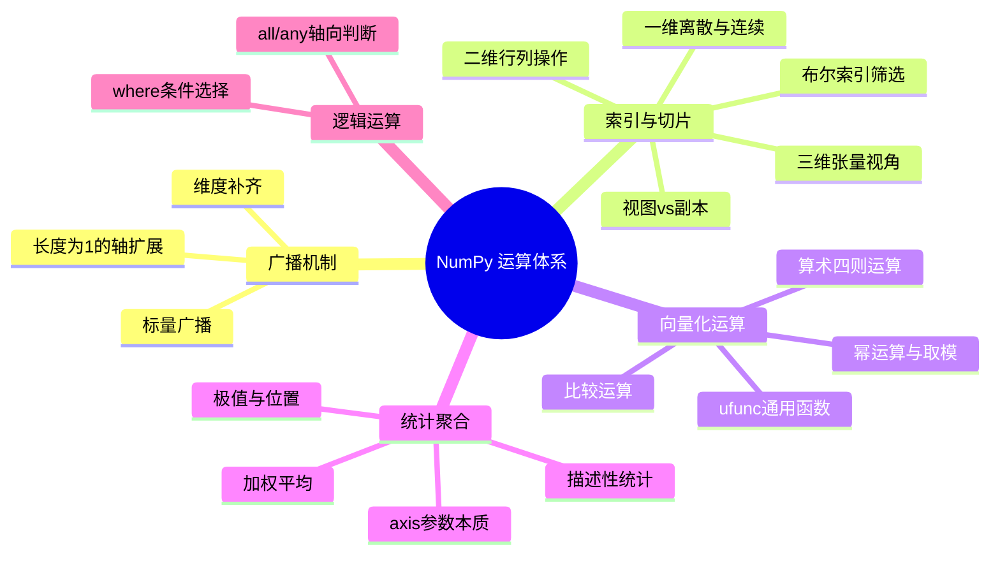
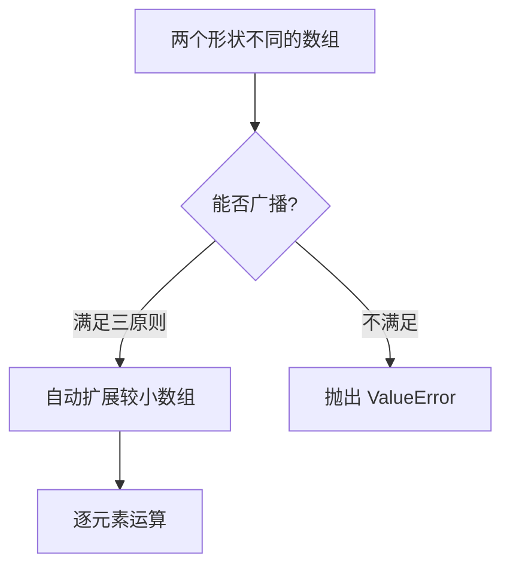
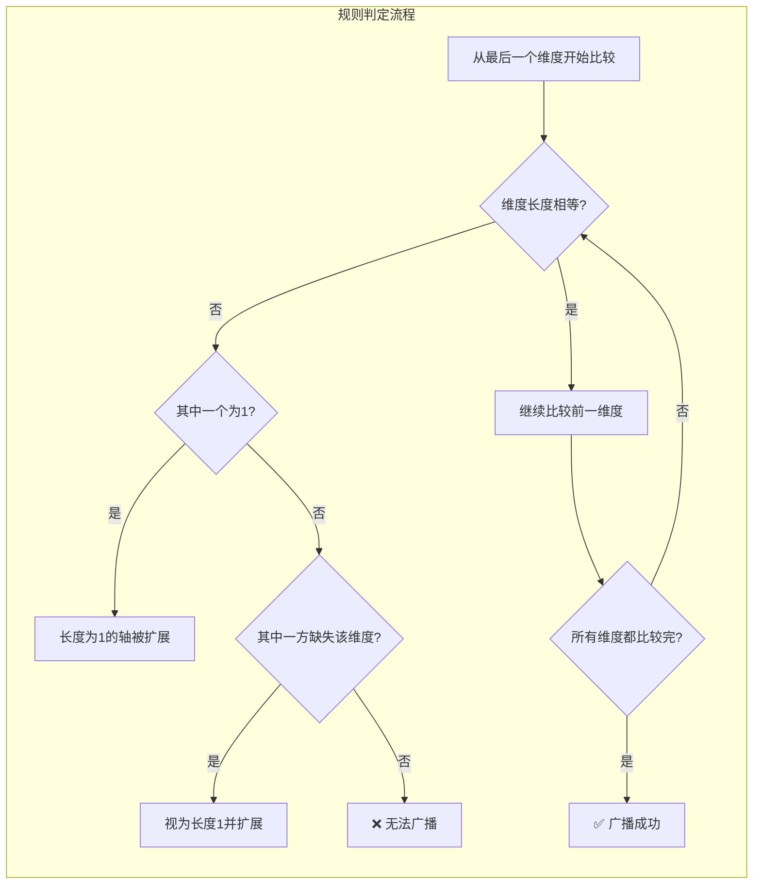
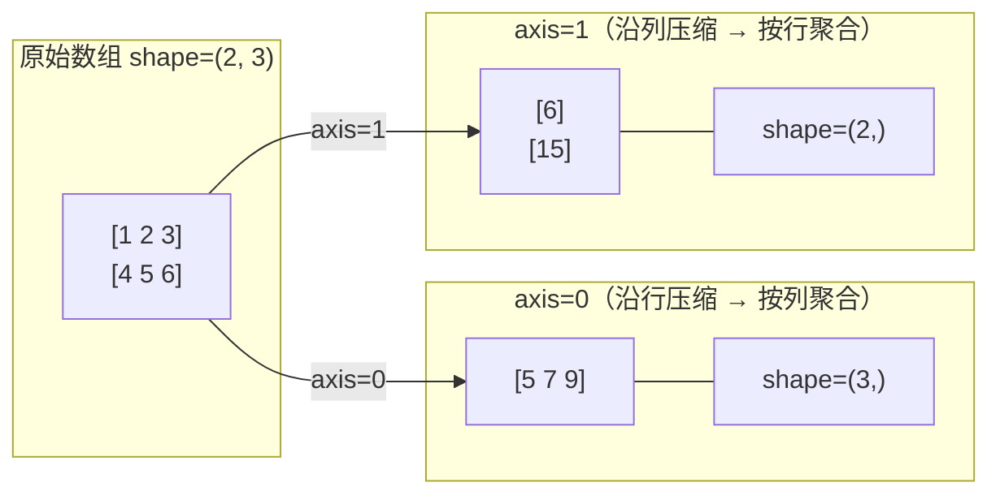

# NumPy 运算与广播机制

NumPy 的核心价值不仅在于高效的多维数组存储，更在于其**向量化运算体系**和**广播机制（Broadcasting）**。这两者使得我们能够用简洁的数组表达式替代繁琐的 Python 循环，在底层 C/Fortran 实现的驱动下获得数量级的性能提升。

> 阅读提示

- 如果你想理解"为什么形状不同的数组能直接相加"，从 [广播机制原理](#广播机制broadcasting原理) 开始
- 如果你想掌握多维数组的索引技巧，跳到 [多维数组索引与切片](#多维数组索引与切片)
- 如果你想了解统计聚合的 axis 参数本质，直奔 [统计聚合操作](#统计聚合操作)
- 如果你想查常见陷阱，跳到 [常见陷阱](#常见陷阱)
- 本文基于 **Python 3.10+**，NumPy **2.x**

## 知识体系总览



::: info 前置知识
本文假设你已经熟悉 NumPy 数组的基本创建（`np.array`、`np.zeros`、`np.arange` 等）和 `ndarray` 的基础属性（`shape`、`dtype`、`ndim`）。如果需要回顾，请参阅 [数据分析全流程](../../05-数据科学/02-数据处理与分析/01-数据分析全流程) 中的 NumPy 核心速查部分。
:::

---

## 广播机制（Broadcasting）原理

### 什么是广播

**广播（Broadcasting）** 是 NumPy 中的一种隐式机制：当两个数组的形状（shape）不同时，NumPy 会自动将较小的数组"扩展"到与较大数组兼容的形状，然后执行逐元素运算。这使得我们无需手动复制数据就能完成形状不匹配的运算。



### 广播的三种典型场景

| 场景 | 数组 A 形状 | 数组 B 形状 | 广播后结果形状 | 示例 |
|------|-----------|-----------|--------------|------|
| **标量与数组** | `(3, 4)` | 标量 `()` | `(3, 4)` | `arr + 5` |
| **维度不同，末尾对齐** | `(3, 4)` | `(4,)` | `(3, 4)` | `matrix + row_vec` |
| **某轴长度为 1** | `(3, 1)` | `(1, 4)` | `(3, 4)` | `col_vec + row_vec` |

```python
import numpy as np

# ========== 场景一：标量与数组 ==========
arr = np.array([[1, 2, 3],
                [4, 5, 6]])
result = arr + 10
print(result)
# [[11 12 13]
#  [14 15 16]]
# 标量 10 被广播为 (2, 3) 的数组

# ========== 场景二：维度不同，末尾轴长相同 ==========
matrix = np.array([[1, 2, 3],    # (2, 3)
                   [4, 5, 6]])
row_vec = np.array([10, 20, 30]) # (3,)
result = matrix + row_vec
print(result)
# [[11 22 33]
#  [14 25 36]]
# row_vec 从 (3,) 扩展为 (2, 3)

# ========== 场景三：某轴长度为 1 ==========
col_vec = np.array([[10],     # (2, 1)
                   [20]])
row_vec = np.array([1, 2, 3])  # (3,) → 广播为 (1, 3)
result = col_vec + row_vec
print(result)
# [[11 12 13]
#  [21 22 23]]
# col_vec (2,1) → (2,3), row_vec (3,) → (1,3) → (2,3)
```

### 广播规则：从后向前逐维度匹配

NumPy 的广播遵循严格的**从右向左（从后向前）**逐维度匹配规则：



**规则总结（按优先级判断）**：

1. **维度长度相等** → 直接匹配，无需扩展
2. **其中一个为 1** → 将长度为 1 的轴重复扩展至另一方的长度
3. **其中一方缺少该维度**（维度数较少）→ 在前面补 1 维度后再按规则 2 处理
4. **以上都不满足** → 抛出 `ValueError: operands could not be broadcast together`

```python
import numpy as np

# ✅ 可广播：(3, 4) 和 (4,) —— 末尾 4==4，前者多出一维
a = np.ones((3, 4))
b = np.arange(4)
print((a + b).shape)  # (3, 4)

# ✅ 可广播：(3, 1) 和 (1, 4) —— 各有一个轴为1
c = np.ones((3, 1))
d = np.ones((1, 4))
print((c + d).shape)  # (3, 4)

# ❌ 不可广播：(3, 4) 和 (3,) —— 末尾 4≠3
e = np.ones((3, 4))
f = np.arange(3)
try:
    print(e + f)
except ValueError as ex:
    print(f"错误: {ex}")
    # 错误: operands could not be broadcast together with shapes (3,4) (3,)

# ❌ 不可广播：(3, 4) 和 (2, 3) —— 末尾 4≠3，且都不为1
g = np.ones((3, 4))
h = np.ones((2, 3))
try:
    print(g + h)
except ValueError as ex:
    print(f"错误: {ex}")
```

### 广播的性能意义

::: tip 为什么广播比手动复制快？
广播并非真正地复制数据来扩展数组。NumPy 只是在内部使用**虚拟迭代器（strided iterator）**，让较小数组的指针在对应维度上重复遍历。这意味着：
- **零内存开销**：不需要创建临时的大数组
- **缓存友好**：数据局部性好，CPU 缓存命中率高
- **C 级速度**：循环在 C 层面执行，无 Python 解释器开销
:::

```python
import numpy as np

# 方法一：手动复制（慢且浪费内存）
arr = np.random.randn(10000, 10000)
row_mean = arr.mean(axis=0)           # (10000,)
row_mean_tiled = np.tile(row_mean, (10000, 1))  # 显式复制！
centered_slow = arr - row_mean_tiled   # 占用额外 ~800MB 内存

# 方法二：利用广播（快且省内存）
centered_fast = arr - row_mean         # 自动广播，几乎无额外内存
```

---

## 多维数组索引与切片

### 一维数组索引切片

一维数组的索引语法与 Python 列表高度相似，但返回的是 **ndarray 视图**而非副本。

```python
import numpy as np

arr = np.array([10, 20, 30, 40, 50, 60, 70, 80])

# ====== 离散访问（单个或多个元素）======
print(arr[0])          # 10 — 第一个元素
print(arr[-1])         # 80 — 最后一个（负索引）
print(arr[[0, 2, 5]])  # [10 30 60] — 花式索引（返回副本）

# ====== 连续切片（start:end:step）======
print(arr[1:4])        # [20 30 40] — 左闭右开
print(arr[::2])        # [10 30 50 70] — 步长为2，取偶数位
print(arr[::-1])       # [80 70 ... 10] — 反转数组
print(arr[-3:])        # [60 70 80] — 最后三个元素
print(arr[:3])         # [10 20 30] — 前三个元素

# ====== 切片赋值（修改原数组！）======
arr_slice = arr[2:5]   # 这是一个视图，不是副本
arr_slice[:] = 99
print(arr)
# [10 20 99 99 99 60 70 80] — 原数组已被修改！
```

::: warning 一维切片的边界细节
- `arr[start:end]`：包含 `start`，**不包含** `end`
- `arr[:n]` 等价于 `arr[0:n]`，取前 n 个
- `arr[-n:]` 取最后 n 个元素
- `step` 为负数时表示反向遍历，此时 `start` 应大于 `end`
:::

### 二维数组索引切片

二维数组是最常用的矩阵形式。NumPy 使用 **逗号分隔的 `[row, col]`** 语法同时指定行和列。

```python
import numpy as np

matrix = np.array([
    [1,  2,  3,  4],
    [5,  6,  7,  8],
    [9, 10, 11, 12]
])
# shape: (3, 4)

# ====== 单个元素 ======
print(matrix[1, 2])    # 7 — 第2行第3列（从0开始）

# ====== 散列访问多个元素 ======
print(matrix[[0, 2], [1, 3]])  # [2 12] — (0,1) 和 (2,3) 位置的元素

# ====== 行操作 ======
print(matrix[0, :])    # [1 2 3 4] — 第1行（等价于 matrix[0]）
print(matrix[1:3, :])  # 第2~3行

# ====== 列操作 ======
print(matrix[:, 0])    # [1 5 9] — 第1列
print(matrix[:, 1:3])  # 所有行的第2~3列
# [[ 2  3]
#  [ 6  7]
#  [10 11]]

# ====== 省略号 ... 的妙用 ======
# ... 表示"占位所有前面的维度"，自动补全
print(matrix[..., 2])  # [3 7 11] — 最后一维的第3列（等价于 matrix[:, 2]）
# 对于更高维数组，... 特别有用：
tensor = np.arange(24).reshape(2, 3, 4)  # shape (2, 3, 4)
print(tensor[..., 1])  # shape (2, 3) — 取每个 3×4 子矩阵的第2列
print(tensor[0, ..., :])  # shape (3, 4) — 第一个 3×4 子矩阵
```

### 三维及高维索引（图像/张量视角）

在图像处理和深度学习中，三维及以上数组非常常见。以 RGB 图像为例，通常表示为 `(高, 宽, 通道)` 的三维数组。

```python
import numpy as np

# 模拟一张 4×4 像素的 RGB 图像
image = np.arange(48).reshape(4, 4, 3)  # shape: (高4, 宽4, 通道3)
# 通道顺序: [R, G, B]

# 提取红色通道（第0通道）
red_channel = image[:, :, 0]  # shape: (4, 4)

# 提取左上角 2×2 区域的所有通道
top_left = image[:2, :2, :]   # shape: (2, 2, 3)

# 提取特定像素的 RGB 值
pixel_rgb = image[1, 1, :]    # [15 16 17] — 第(1,1)像素的颜色值

# 用 ... 简化高维索引
print(image[0, ...].shape)    # (4, 3) — 第0行，保留宽度和通道
print(image[..., 0].shape)    # (4, 4) — 保留高和宽，取红色通道

# 四维数组示例：一批图像 (批次, 高, 宽, 通道)
batch = np.arange(96).reshape(2, 4, 4, 3)  # 2张 4×4 RGB 图像
first_image = batch[0]       # 第1张图: (4, 4, 3)
all_reds = batch[..., 0]     # 所有图的红色通道: (2, 4, 4)
```

### 布尔索引与条件筛选

布尔索引是 NumPy 最强大的数据筛选工具之一：传入一个与数组形状相同的布尔数组，只返回 `True` 对应位置的元素。

```python
import numpy as np

scores = np.array([85, 92, 78, 95, 60, 88, 72, 98])

# ====== 基础布尔索引 ======
mask = scores >= 80              # [ True  True False  True False  True False  True]
high_scores = scores[mask]       # [85 92 95 88 98]
low_scores = scores[scores < 80] # [78 60 72]

# ====== 多条件组合（& 和 |，注意括号！）=====
good = scores[(scores >= 80) & (scores <= 90)]  # [85 88] — 且（and）
extreme = scores[(scores < 70) | (scores > 95)] # [60 98] — 或（or）
# ⚠️ 必须用 & / |，不能用 and / or；必须加括号！

# ====== np.where 条件选择 ======
# 用法1：返回满足条件的索引
indices = np.where(scores >= 80)
print(indices)  # (array([0, 1, 3, 5, 7]),) — 元组形式

# 用法2：三元表达式风格——条件选 x 否则选 y
result = np.where(scores >= 80, "通过", "不通过")
print(result)
# ['通过' '通过' '不通过' '通过' '不通过' '通过' '不通过' '通过']

# 用法3：数值替换——将异常值替换为边界值
data = np.array([1, 5, 3, 100, 2, -50, 4, 7])
cleaned = np.where(data > 10, 10, data)   # 上限截断: 100 → 10
cleaned = np.where(cleaned < 0, 0, cleaned)  # 下限截断: -50 → 0
print(cleaned)  # [1 5 3 10 2 0 4 7]

# ====== 二维数组的布尔索引 ======
matrix = np.array([
    [1, 2, 3],
    [4, 5, 6],
    [7, 8, 9]
])
mask_2d = matrix > 5
print(matrix[mask_2d])  # [6 7 8 9] — 返回一维数组（展平后的结果）
# 若要保留二维结构，可用 np.where 或掩码赋值
matrix_copied = matrix.copy()
matrix_copied[matrix_copied <= 5] = 0  # ≤5的位置全部置0
print(matrix_copied)
# [[0 0 0]
#  [0 0 0]
#  [7 8 9]]
```

### 视图与副本的底层原理

这是 NumPy 中最容易踩坑的概念之一。理解**视图（View）**和**副本（Copy）**的区别对于避免隐蔽的 Bug 至关重要。

```mermaid
flowchart TD
    subgraph 切片操作
        A[原始数组 arr] -->|切片 arr_slice = arr_:2_| B[视图 View]
        B -->|共享同一块内存| A
        B -->|修改会影响原数组| A
    end

    subgraph 显式复制
        C[原始数组 arr] -->|arr.copy_| D[副本 Copy]
        D -->|独立内存空间|
        D -->|修改互不影响|
    end

```

```python
import numpy as np

# ========== 视图：切片默认返回视图 ==========
arr = np.array([1, 2, 3, 4, 5])
view = arr[1:4]        # 视图，共享内存
view[0] = 99
print(arr)             # [ 1 99  3  4  5] ← 原数组被修改了！

# ========== 副本：显式 copy() ==========
arr2 = np.array([1, 2, 3, 4, 5])
copy = arr2[1:4].copy()  # 副本，独立内存
copy[0] = 99
print(arr2)            # [1 2 3 4 5] ← 原数组不受影响

# ========== 花式索引始终返回副本 ==========
arr3 = np.array([10, 20, 30, 40, 50])
fancy = arr3[[0, 2, 4]]  # 花式索引，返回副本
fancy[0] = 999
print(arr3)            # [10 20 30 40 50] ← 不受影响

# ========== 布尔索引始终返回副本 ==========
arr4 = np.array([1, 2, 3, 4, 5])
bool_idx = arr4[arr4 > 2]  # 布尔索引，返回副本
bool_idx[0] = 999
print(arr4)            # [1 2 3 4 5] ← 不受影响

# ========== 如何判断？==========
print(view.base is arr)        # True  — view 是 arr 的视图
print(copy.base is arr2)       # False — copy 是独立副本
print(fancy.base is arr3)      # False — 花式索引返回副本
print(bool_idx.base is arr4)   # False — 布尔索引返回副本
# .base 属性指向原始数组（如果是视图的话），否则为 None
```

::: tip 快速记忆法则
| 操作类型 | 返回结果 | 修改是否影响原数组 |
|---------|---------|------------------|
| **基本切片** `arr[start:end:step]` | 视图（View） | ✅ 影响 |
| **花式索引** `arr[[0,2,4]]` | 副本（Copy） | ❌ 不影响 |
| **布尔索引** `arr[arr > 3]` | 副本（Copy） | ❌ 不影响 |
| **显式复制** `arr.copy()` | 副本（Copy） | ❌ 不影响 |
| **Python 列表切片** `lst[1:4]` | 副本（Copy） | ❌ 不影响 |

> 注意：Python 原生列表的切片**始终返回副本**，这是 NumPy 与 Python 切片行为的重要差异。
:::

---

## 向量化运算体系

### 算术运算

NumPy 的算术运算是**逐元素（element-wise）**进行的，支持运算符重载和对应的 ufunc 函数两种调用方式。

```python
import numpy as np

a = np.array([1, 2, 3, 4])
b = np.array([10, 20, 30, 40])

# ====== 四则运算 ======
print(a + b)   # [11 22 33 44] — 加法
print(a - b)   # [-9 -18 -27 -36] — 减法
print(a * b)   # [10  40  90 160] — 乘法（⚠️ 不是矩阵乘法！）
print(b / a)   # [10. 10. 10. 10.] — 除法
print(b % a)   # [0 0 0 0] — 取模（余数）
print(b // a)  # [10 10 10 10] — 地板除

# ====== 幂运算与开方 ======
print(a ** 2)           # [ 1  4  9 16] — 平方
print(np.power(a, 3))   # [ 1  8 27 64] — 立方（ufunc 方式）
print(np.sqrt(a))       # [1.         1.414... 1.732... 2.        ] — 开方
print(np.square(a))     # [ 1  4  9 16] — 平方（ufunc 方式）
print(np.abs(-a))       # [1 2 3 4] — 绝对值

# ====== 运算符 vs ufunc 对应关系 ======
```

| 运算符 | ufunc 函数 | 说明 |
|-------|----------|------|
| `+` | `np.add` | 逐元素加法 |
| `-` | `np.subtract` | 逐元素减法 |
| `*` | `np.multiply` | 逐元素乘法（非矩阵乘法） |
| `/` | `np.true_divide` | 真除法（浮点结果） |
| `//` | `np.floor_divide` | 地板除 |
| `%` | `np.mod` | 取模 |
| `**` | `np.power` | 幂运算 |
| — | `np.abs` / `np.absolute` | 绝对值 |
| — | `np.sqrt` | 平方根 |
| — | `np.square` | 平方 |
| — | `np.negative` | 取负 |

::: warning ⚠️ * 是逐元素乘法，不是矩阵乘法
初学者最容易混淆的两个操作：
- `a * b` → **逐元素乘法**（Hadamard 积）
- `a @ b` 或 `np.dot(a, b)` → **矩阵乘法**（线性代数中的标准定义）
:::

### 比较运算与布尔数组

比较运算返回的是**布尔数组**，可与布尔索引无缝配合使用。

```python
import numpy as np

arr = np.array([3, 1, 4, 1, 5, 9, 2, 6])

# ====== 六种比较运算 ======
print(arr > 3)   # [False False  True False  True  True False  True]
print(arr < 5)   # [ True  True  True  True False False  True False]
print(arr == 1)  # [False  True False  True False False False False]
print(arr != 1)  # [ True False  True  True  True  True  True  True]
print(arr >= 4)  # [False False  True False  True  True False  True]
print(arr <= 2)  # [False  True False False False False  True False]

# ====== 全元素比较 ======
a = np.array([1, 2, 3])
b = np.array([1, 2, 3])
print(a == b)  # [True True True] — 逐元素比较
print(np.array_equal(a, b))  # True — 整个数组是否相等（推荐）

# ====== 布尔数组的逻辑运算 ======
mask1 = arr > 2
mask2 = arr < 7
print(mask1 & mask2)  # [False False  True False  True False False  True] — 且
print(mask1 | mask2)  # [ True  True  True  True  True  True  True  True] — 或
print(~mask1)         # [ True  True False  True False False  True False] — 非
```

### ufunc 通用函数概念

**ufunc（Universal Function，通用函数）** 是 NumPy 中对数组进行逐元素操作的函数的统称。它们具有以下特征：

- 接受标量或数组作为输入
- 支持**向量化广播**
- 支持可选的 `out` 参数（就地写入，避免创建临时数组）
- 支持 `where` 参数（条件化计算）
- 支持 `accumulate`、`reduce`、`reduceat` 等聚合模式

```python
import numpy as np

a = np.array([1, 2, 3, 4, 5])
b = np.array([10, 20, 30, 40, 50])

# out 参数：避免创建临时数组（大数组时节省大量内存）
out_arr = np.empty(5, dtype=np.int64)
np.add(a, b, out=out_arr)
print(out_arr)  # [11 22 33 44 55]

# where 参数：只在满足条件的位置进行计算
result = np.where(a > 2, a * 10, a)
print(result)  # [ 1  2 30 40 50] — 大于2的×10，其余不变

# reduce：沿指定轴向聚合
print(np.add.reduce([1, 2, 3, 4, 5]))  # 15 — 等价于 sum()
print(np.multiply.reduce([1, 2, 3, 4, 5]))  # 120 — 等价于 prod()

# accumulate：累积结果
print(np.add.accumulate([1, 2, 3, 4, 5]))  # [ 1  3  6 10 15] — 累积和
```

---

## 统计聚合操作

### axis 参数的本质理解

`axis` 参数是 NumPy 统计函数中最重要也最容易被误解的参数。它的本质含义是：**沿着哪个维度进行"压缩"（折叠/归约）**。



**直观记忆法**：

| axis 值 | 含义 | 结果变化 | 直觉类比 |
|--------|------|---------|---------|
| `axis=0` | 沿第 0 轴（纵向）压缩 | 行被消去，shape 减少 1 维 | "按列求"（每列内跨行聚合） |
| `axis=1` | 沿第 1 轴（横向）压缩 | 列被消去 | "按行求"（每行内跨列聚合） |
| `axis=None`（默认） | 全部压平为一维 | 变成标量 | "全局求" |

```python
import numpy as np

matrix = np.array([
    [1, 2, 3, 4],
    [5, 6, 7, 8],
    [9, 10, 11, 12]
])  # shape: (3, 4)

# ====== axis=0：按列聚合（跨行） ======
print(matrix.sum(axis=0))   # [15 18 21 24] — 每列的和
print(matrix.mean(axis=0))  # [5. 6. 7. 8.] — 每列的平均
print(matrix.max(axis=0))   # [9 10 11 12] — 每列的最大值

# ====== axis=1：按行聚合（跨列） ======
print(matrix.sum(axis=1))   # [10 26 42] — 每行的和
print(matrix.mean(axis=1))  # [ 2.5  6.5 10.5] — 每行的平均
print(matrix.max(axis=1))   # [ 4  8 12] — 每行的最大值

# ====== axis=None：全局聚合 ======
print(matrix.sum())         # 78 — 所有元素的总和
print(matrix.mean())        # 6.5 — 所有元素的均值

# ====== 多维数组的 axis ======
tensor = np.arange(24).reshape(2, 3, 4)  # shape: (2, 3, 4)
print(tensor.sum(axis=0).shape)   # (3, 4) — 沿第0轴压缩（跨批次）
print(tensor.sum(axis=1).shape)   # (2, 4) — 沿第1轴压缩
print(tensor.sum(axis=2).shape)   # (2, 3) — 沿第2轴压缩
print(tensor.sum(axis=(0, 1)).shape)  # (4,) — 同时压缩前两维
```

### 描述性统计

```python
import numpy as np

data = np.array([23, 45, 12, 67, 34, 89, 56, 78, 41, 29])

# ====== 集中趋势 ======
print(np.mean(data))    # 47.4 — 算术均值
print(np.median(data))  # 43.0 — 中位数（抗异常值更强）

# ====== 离散程度 ======
print(np.std(data))     # 23.53... — 标准差（总体，ddof=0）
print(np.std(data, ddof=1))  # 24.80... — 样本标准差（ddof=1，除以 n-1）
print(np.var(data))     # 553.84 — 方差
print(np.ptp(data))     # 77 — 极差（peak-to-peak: max - min）

# ====== 分位数 ======
print(np.percentile(data, 25))  # 30.25 — Q1（第25百分位，NumPy 默认线性插值）
print(np.percentile(data, 50))  # 43.0 — Q2（中位数）
print(np.percentile(data, 75))  # 64.25 — Q3（第75百分位）
print(np.quantile(data, 0.9))   # 79.1 — 第90分位数（quantile 接收 0~1 的比例）

# ====== 二维矩阵的描述性统计 ======
matrix = np.arange(1, 13).reshape(3, 4)
print("全局:", matrix.mean(), matrix.std())
print("按列:", matrix.mean(axis=0), matrix.std(axis=0))
print("按行:", matrix.mean(axis=1), matrix.std(axis=1))
```

::: info ddof 参数说明
`ddof`（Delta Degrees of Freedom，自由度修正量）控制标准差/方差的计算方式：
- `ddof=0`（默认）：总体标准差，除以 N
- `ddof=1`：样本标准差，除以 N-1（Bessel 校正，用于估计总体参数时更准确）

在数据分析中，如果你处理的是**样本数据**（而非整个总体），建议使用 `ddof=1`。
:::

### 极值与位置

`argmax` 和 `argmin` 返回极值出现的**索引位置**，在实际数据处理中非常有用。

```python
import numpy as np

scores = np.array([85, 92, 78, 95, 88, 76, 98, 82])

# ====== 极值及其位置 ======
print(scores.max())       # 98 — 最大值
print(scores.argmax())    # 6 — 最大值的索引位置
print(scores.min())       # 76 — 最小值
print(scores.argmin())    # 5 — 最小值的索引位置

# ====== 实战：去掉最大最小后求平均（评委打分场景）=====
def trimmed_mean(arr: np.ndarray, trim: int = 1) -> float:
    """去掉 trim 个最大值和 trim 个最小值后求平均"""
    sorted_indices = np.argsort(arr)  # 返回排序后的索引
    if trim * 2 >= len(arr):
        return np.nan
    trimmed = sorted_indices[trim:-trim]  # 去掉首尾各 trim 个
    return arr[trimmed].mean()

judge_scores = np.array([9.2, 8.5, 9.8, 7.0, 9.0, 8.8, 9.5, 8.2])
print(trimmed_mean(judge_scores, trim=1))
# 去掉最高 9.8 和最低 7.0 后，剩余 6 个分数的平均值

# ====== 二维数组的 argmax/argmin ======
matrix = np.array([
    [3, 1, 4],
    [1, 5, 9],
    [2, 6, 5]
])
print(matrix.argmax())     # 5 — 展平后的全局最大值索引
print(matrix.argmax(axis=0))  # [0 2 1] — 每列最大值的行索引
print(matrix.argmax(axis=1))  # [2 2 1] — 每行最大值的列索引

# 配合 unravel_index 还原多维坐标
flat_idx = matrix.argmax()
row, col = np.unravel_index(flat_idx, matrix.shape)
print(f"全局最大值 {matrix[row,col]} 位于 ({row}, {col})")
# 全局最大值 9 位于 (1, 2)
```

### 加权平均

`np.average` 支持通过 `weights` 参数计算加权平均，适用于需要考虑不同数据点重要性差异的场景。

```python
import numpy as np

# ====== 基础加权平均 ======
values = np.array([80, 90, 85])
weights = np.array([0.2, 0.5, 0.3])  # 权重之和应为 1
weighted_avg = np.average(values, weights=weights)
print(weighted_avg)  # 86.5 — 80×0.2 + 90×0.5 + 85×0.3

# ====== 实战：课程加权成绩 ======
courses = np.array(["数学", "英语", "物理", "化学", "体育"])
scores = np.array([92, 85, 88, 90, 95])
credits = np.array([4, 3, 4, 3, 1])  # 学分作为权重
gpa = np.average(scores, weights=credits)
print(f"加权平均绩点: {gpa:.2f}")

# ====== 返回加权总和（用于验证权重）=====
avg, sum_weights = np.average(scores, weights=credits, returned=True)
print(f"权重总和: {sum_weights}")  # 15 — 可用于检查
```

---

## 逻辑运算与条件处理

### all / any 的轴向判断

`np.all()` 和 `np.any()` 用于判断数组中是否全部/任意元素满足条件，同样支持 `axis` 参数。

```python
import numpy as np

arr = np.array([
    [True, True, False],
    [True, True, True],
    [False, False, False]
])

# ====== 全局判断 ======
print(np.all(arr))   # False — 不是所有元素都为 True
print(np.any(arr))   # True — 存在至少一个 True

# ====== 轴向判断 ======
print(np.all(arr, axis=0))  # [False False False] — 每列是否全为 True
print(np.all(arr, axis=1))  # [False True False] — 每行是否全为 True
print(np.any(arr, axis=0))  # [ True True True] — 每列是否有 True
print(np.any(arr, axis=1))  # [ True True False] — 每行是否有 True

# ====== 实际应用：数据校验 ======
data = np.array([
    [1.0, 2.5, 3.0],
    [4.0, np.nan, 6.0],  # 包含 NaN
    [7.0, 8.0, 9.0]
])
print(np.all(np.isfinite(data)))           # False — 存在 NaN 或 Inf
print(np.all(np.isfinite(data), axis=1))   # [True False True] — 每行是否有效
valid_rows = data[np.all(np.isfinite(data), axis=1)]
print(valid_rows.shape)  # (2, 3) — 只保留没有缺失值的行
```

### where 条件选择与替换

`np.where` 是 NumPy 中最灵活的条件处理函数，支持两种核心用法：

```python
import numpy as np

# ========== 用法一：获取满足条件的索引 ==========
arr = np.array([3, 1, 4, 1, 5, 9, 2, 6])
(indices,) = np.where(arr > 3)  # 一维时只返回一个数组（元组内 1 个元素）
print(indices)  # [2 4 5 7] — 值大于3的元素索引

# 二维数组返回行列索引元组
matrix = np.array([
    [1, 5, 3],
    [7, 2, 9],
    [4, 8, 6]
])
row_idx, col_idx = np.where(matrix > 5)
print(row_idx, col_idx)
# row_idx: [1 1 2 2] — 行坐标
# col_idx: [0 2 1 2] — 列坐标
# 即位置 (1,0)=7, (1,2)=9, (2,1)=8, (2,2)=6 都大于 5

# ========== 用法二：条件选择（三元表达式的向量化版本）==========
prices = np.array([100, 200, 150, 300, 80])
discounted = np.where(prices > 200, prices * 0.8, prices)
print(discounted)
# [100. 200. 150. 240.  80.] — 超过200的打8折（80 不超过 200，原价保留）

# ========== 用法三：高级场景 — 分段函数 ==========
def piecewise_transform(x: np.ndarray) -> np.ndarray:
    """分段处理：负数→0，0~100保持，>100→100"""
    return np.clip(x, 0, 100)  # 更简洁的方式

# 或者用嵌套 where 实现
x = np.array([-10, 0, 50, 120, 200])
result = np.where(
    x < 0,
    0,
    np.where(x > 100, 100, x)
)
print(result)  # [  0   0  50 100 100]

# ========== 用法四：两数组间的条件选择 ==========
arr_a = np.array([1, 2, 3, 4, 5])
arr_b = np.array([10, 20, 30, 40, 50])
condition = np.array([True, False, True, False, True])
selected = np.where(condition, arr_a, arr_b)
print(selected)  # [ 1 20  3 40  5] — True 选 arr_a，False 选 arr_b
```

### select 多条件分支

当有多个条件分支时，`np.select` 比 `np.where` 嵌套更清晰：

```python
import numpy as np

scores = np.array([45, 72, 88, 95, 63, 55, 81, 30])

conditions = [
    scores >= 90,   # 优秀
    scores >= 80,   # 良好
    scores >= 60,   # 及格
    scores >= 0,    # 不及格
]
choices = ["A", "B", "C", "D"]

grades = np.select(conditions, choices, default="F")
print(grades)
# ['D' 'C' 'B' 'A' 'C' 'D' 'B' 'D']
```

---

## 常见陷阱

| 陷阱 | 错误代码 | 问题 | 正确做法 |
|------|---------|------|---------|
| **切片修改污染原数组** | `v = arr[1:3]; v[0]=99` | 以为 `v` 是独立副本 | 需要 `.copy()` 时显式调用 |
| **用 `and`/`or` 替代 `&`/`\|`** | `arr[(a>0) and (b<10)]` | Python 关键字无法对数组做逐元素逻辑运算 | 使用 `&` 和 `\|`，并给子表达式加括号 |
| **混淆 `*` 和 `@`** | `result = A * B` | 把逐元素乘法当成矩阵乘法 | 矩阵乘法用 `A @ B` 或 `np.dot(A, B)` |
| **axis 方向搞反** | `matrix.mean(axis=0)` 以为得到行均值 | `axis=0` 是按列聚合（消去行维度），返回的是每列的结果 | 记忆口诀："axis=N 表示把第 N 维压扁" |
| **忽略 ddof 参数** | `np.std(samples)` | 默认 `ddof=0`（总体标准差），对样本数据会低估离散程度 | 样本数据用 `ddof=1` |
| **广播形状不匹配** | `(3,4) + (3,)` | 末尾维度 4≠3，无法广播 | 确保末尾维度对齐，或 reshape |
| **NaN 污染统计结果** | `np.mean([1, 2, np.nan])` | 返回 `nan`，整组数据失效 | 先用 `np.isnan()` 过滤或用 `np.nanmean()` |
| **整数除法截断** | `np.array([1,2,3]) / 2` 在 Python 2 中 | 整数除法结果仍为整数 | 使用 Python 3+ 或确保操作数为 float 类型 |
| **in-place 操作链失败** | `arr += arr2; arr *= 3` | 某些情况下 in-place 可能创建临时对象 | 分步执行或使用 `np.multiply(out=arr, ...)` |
| **花式索引返回副本** | `arr[[0,1,2]][0] = 99` | 以为能通过花式索引修改原数组 | 花式索引返回副本，需直接索引赋值 |

### 陷阱详解：切片视图导致的数据污染

```python
import numpy as np

# ❌ 反面案例：无意中修改了原数据
def normalize_bad(arr: np.ndarray) -> np.ndarray:
    """错误：切片是视图，修改会影响原数组"""
    subset = arr[arr > 0]  # 布尔索引返回副本（这里恰好安全）
    subset = subset / subset.max()  # 但如果这里用的是普通切片...
    return subset

# 更危险的场景：
data = np.array([1, 2, 3, 4, 5, 6, 7, 8, 9, 10])
chunk = data[2:7]  # 视图！
chunk[:] = 0       # 修改 chunk 就是修改 data
print(data)        # [1 2 0 0 0 0 0 8 9 10] — 原数据被破坏！

# ✅ 正确做法
def normalize_good(arr: np.ndarray) -> np.ndarray:
    """正确：先复制再操作"""
    result = arr.copy()  # 显式复制
    mask = result > 0
    result[mask] = result[mask] / result[mask].max()
    return result

data2 = np.array([1, 2, 3, 4, 5, 6, 7, 8, 9, 10])
normalized = normalize_good(data2)
print(data2)        # [1 2 3 4 5 6 7 8 9 10] — 原数据完好
```

### 陷阱详解：布尔运算必须用 `&` / `|`

```python
import numpy as np

arr = np.array([1, 5, 3, 8, 2, 9, 4, 7])

# ❌ 错误：使用 and/or（触发 ValueError）
try:
    result = arr[(arr > 2) and (arr < 8)]
except ValueError as e:
    print(f"错误: {e}")
    # 错误: The truth value of an array with more than one element is ambiguous

# ✅ 正确：使用 & 和 |，并加括号
result = arr[(arr > 2) & (arr < 8)]  # [5 3 4 7]
result = arr[(arr < 3) | (arr > 8)]  # [1 2 9]

# 原因解析：
# - and/or 是 Python 关键字，要求操作数为单个布尔值
# - 数组的布尔值有多个元素，Python 不知道该取哪一个
# - &/| 是位运算符（被 NumPy 重载为逐元素逻辑运算符）
# - 括号是必须的，因为 &/| 的优先级高于比较运算符
```

---

## 最佳实践速查表

| 场景 | 推荐做法 | 避免 |
|------|---------|------|
| 修改数组前不确定是否为视图 | 显式 `.copy()` | 盲目依赖默认行为 |
| 多条件布尔筛选 | `(cond1) & (cond2)` 并加括号 | `cond1 and cond2` |
| 矩阵乘法 | `A @ B` | `A * B`（这是逐元素乘法） |
| 样本标准差 | `np.std(arr, ddof=1)` | 忘记设置 `ddof` |
| 含 NaN 的统计 | `np.nanmean()` / `np.nanstd()` | 直接用 `np.mean()` 得到 nan |
| 大数组运算 | 利用广播 + `out` 参数 | 手动 `np.tile` 复制数据 |
| 条件替换 | `np.where(cond, x, y)` | Python 循环 + if-else |
| 多级分类 | `np.select(conditions, choices)` | 嵌套多层 `np.where` |
| 去极值平均 | `np.argsort()` + 切片 | 手动排序再删除 |
| 数据校验 | `np.all(np.isfinite(arr), axis=1)` | 逐元素检查 |

---

## 术语表

| 术语 | 英文 | 定义 |
|------|------|------|
| **广播** | Broadcasting | NumPy 自动扩展较小数组的形状以匹配较大数组，使逐元素运算成为可能的隐式机制 |
| **视图** | View | 共享原数组内存数据的数组引用，修改视图会影响原数组 |
| **副本** | Copy | 独立于原数组的全新数据拷贝，修改副本不影响原数组 |
| **花式索引** | Fancy Indexing | 使用整数数组作为索引访问多个离散位置的操作，始终返回副本 |
| **布尔索引** | Boolean Indexing | 使用布尔数组作为掩码筛选数据的操作，始终返回副本 |
| **ufunc** | Universal Function | NumPy 的通用函数，支持逐元素运算、广播、累积等多种模式的向量化函数 |
| **逐元素** | Element-wise | 运算在数组的每个对应位置上独立进行，而非矩阵代数意义下的运算 |
| **axis** | Axis | 指定沿哪个维度进行聚合操作的参数，表示"压缩/消除"哪个维度 |
| **ddof** | Delta Degrees of Freedom | 自由度修正量，用于区分总体方差（ddof=0）和样本方差（ddof=1） |
| **向量化** | Vectorization | 用数组级别的批量运算替代 Python 逐元素循环，由底层 C/Fortran 实现驱动的高效计算方式 |
| **strides** | Strides | NumPy 内部用于描述数组各维度在内存中间隔的字节数，广播机制依赖 strides 实现"虚拟扩展" |
| **归约** | Reduction | 将数组的某个维度"压缩"为单一值的操作（如 sum、mean、max） |

---

## 延伸阅读

### 站内相关

- [数据分析全流程](../../05-数据科学/02-数据处理与分析/01-数据分析全流程) — NumPy/Pandas/Matplotlib 工具链全景介绍
- [Pandas 与 NumPy 策略回测](../../05-数据科学/07-量化金融/02-Pandas与NumPy策略回测) — NumPy 在量化交易中的实战应用
- [数学与数值计算](../03-内置模块/08-数学与数值计算) — Python 标准库中的数学工具

### 外部权威资源

- [NumPy 官方文档 — Broadcasting](https://numpy.org/doc/stable/user/basics.broadcasting.html) — 广播机制的权威说明
- [NumPy 官方文档 — Indexing](https://numpy.org/doc/stable/reference/arrays.indexing.html) — 索引机制的完整参考
- [NumPy 官方文档 — ufunc](https://numpy.org/doc/stable/reference/ufuncs.html) — 通用函数 API 参考
- [100 NumPy Exercises](https://github.com/rougier/numpy-100) — 100 道 NumPy 练习题
- 《Python Data Science Handbook》（Jake VanderPlas）— 第四章 NumPy 基础

## 版本差异（NumPy 1.x/2.0 → 2.5.x）

| 特性 | 本文编写时 | 当前（NumPy 2.5.x，截至 2026-09） |
|------|-----------|---------------------|
| 版本基线 | 1.x | 2.x 系列（2.5 为最新稳定版）；2.0 起要求 Python 3.10+，现行版本要求 3.12+ |
| 标量类型 | `np.float_`/`np.complex_` 等 | 2.0 起 `np.float_`、`np.complex_`、`np.unicode_`、`np.string_` 已移除，改用 `np.float64`/`np.complex128`/`np.str_`/`np.bytes_`；`np.int_`、`np.bool_` 保留 |
| 字符串类型 | `np.str_` / `np.bytes_` | 仍有效未弃用（被移除的是旧别名 `np.unicode_`/`np.string_`） |
| 复制行为 | 各处行为不一 | 2.x 起更严格：`np.array(..., copy=False)` 在需要复制时直接报错，`copy=` 语义统一 |
| 数值精度 | 默认 float64 | 不变；2.0 引入 NEP 50 类型提升规则，`int32 + float32` 结果更符合直觉 |
| Python 版本 | 3.8+ | 现行 2.5 要求 Python 3.12+，建议 3.13/3.14 |

> 本文讲解的 ndarray 核心概念（广播、索引、ufunc）在 NumPy 2.x 中完全成立；升级时主要关注类型别名移除（`np.float_`→`float64`）与 NEP 50 提升规则。
