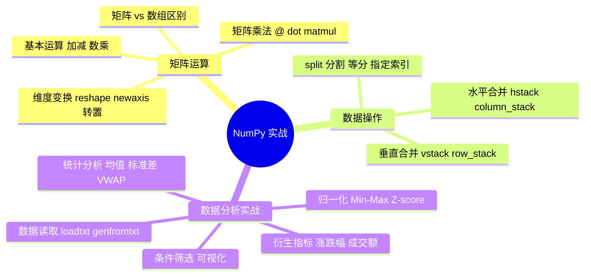
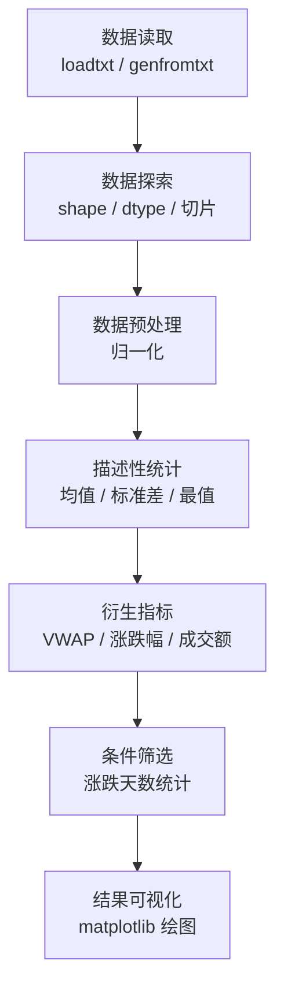

# NumPy 矩阵计算与数据实战

本文是 NumPy 的**实战进阶篇**，从矩阵运算基础出发，系统讲解数据合并与分割策略，最终通过一个完整的**股票数据分析案例**，打通 NumPy 从数据读取、预处理、统计分析到可视化的完整工作流。

> 阅读提示
>
> - 如果你想快速了解矩阵运算，直接看 [矩阵运算基础](#矩阵运算基础)
> - 如果你想对比各种合并方法，跳到 [合并策略对比表](#合并策略对比表)
> - 如果你想动手做股票分析实战，从 [实战：股票数据完整分析流程](#实战股票数据完整分析流程) 开始
> - 本文代码依赖 `numpy` 和 `matplotlib`，建议在 Jupyter Notebook 中同步实验
> - 基于 **Python 3.12+**，NumPy 2.x

## 开篇概述

### 知识体系图



### 学习路线


::: tip 前置知识
阅读本文前，建议先掌握：
- [数据分析全流程](../../05-数据科学/02-数据处理与分析/01-数据分析全流程) — NumPy/Pandas/Matplotlib 基础速查
- Python 列表推导式和基本语法
:::

---

## 矩阵运算基础

### 矩阵与数组的区别

NumPy 中存在两种表示二维数据的结构：`ndarray`（多维数组）和 `matrix`（矩阵）。理解它们的差异是正确使用矩阵运算的前提。

| 对比维度 | ndarray | matrix |
|---------|---------|--------|
| **维度** | 支持 N 维（1D, 2D, 3D...） | 仅支持 2D |
| **数据类型** | 任意类型（数值、字符串、对象等） | 仅数值型 |
| **乘法行为** | `*` 是逐元素乘法 | `*` 是矩阵乘法 |
| **灵活性** | 高（通用数据容器） | 低（专用线性代数） |
| **推荐度** | ✅ **推荐使用** | ⚠️ 不再推荐使用（官方明确不推荐，未来可能移除） |

```python
import numpy as np

# 创建数组
arr = np.array([[1, 2], [3, 4]])
print(f"数组类型: {type(arr)}")       # <class 'numpy.ndarray'>
print(f"数组 * 数组 (逐元素):\n{arr * arr}")
# 输出:
# [[ 1  4]
#  [ 9 16]]

# 创建矩阵
mat = np.asmatrix([[1, 2], [3, 4]])
print(f"\n矩阵类型: {type(mat)}")       # <class 'numpy.matrix'>
print(f"矩阵 * 矩阵 (矩阵乘法):\n{mat * mat}")
# 输出:
# [[ 7 10]
#  [15 22]]
```

::: warning 重要提示
`np.matrix` 官方已明确**不再推荐使用**（仅维护、未来可能移除），应始终使用 `ndarray`。矩阵乘法请用 `@` 运算符或 `np.dot()` 函数。注意：NumPy 2.0 起便捷函数 `np.mat()` 已被**移除**，转换需改用 `np.asmatrix()`。
:::

### np.asmatrix() 转换方法

虽然不推荐新建 `matrix`，但了解转换方法有助于维护旧代码：

```python
import numpy as np

# 从数组转换为矩阵
arr = np.array([[1, 2], [3, 4]])
mat = np.asmatrix(arr)

# 从矩阵转回数组
arr_back = np.asarray(mat)
print(f"转换后类型: {type(arr_back)}")  # <class 'numpy.ndarray'>
```

### 矩阵基本运算

#### 加减法

矩阵加减法要求**形状相同**，或满足广播规则：

```python
import numpy as np

A = np.array([[1, 2], [3, 4]])
B = np.array([[5, 6], [7, 8]])

# 形状相同的加减法
print("A + B:")
print(A + B)   # [[ 6  8]
               # [10 12]]

# 广播：标量加矩阵
print("\nA + 10:")
print(A + 10)  # [[11 12]
               # [13 14]]
```

#### 数乘运算

数乘是标量与矩阵的逐元素相乘：

```python
import numpy as np

A = np.array([[1, 2], [3, 4]])

# 数乘：每个元素乘以标量
print("3 * A:")
print(3 * A)   # [[ 3  6]
               # [ 9 12]]

print("\nA * 3:")
print(A * 3)   # 结果相同
```

### 升维操作

在矩阵运算中，经常需要改变数组维度。NumPy 提供了多种升维方式：

#### reshape 改变形状

```python
import numpy as np

# 一维数组 → 二维矩阵
arr_1d = np.array([1, 2, 3, 4, 5, 6])

# reshape 为 2×3 矩阵
mat_2d = arr_1d.reshape(2, 3)
print(f"reshape(2, 3):\n{mat_2d}")
# [[1 2 3]
#  [4 5 6]]

# reshape 为 3×2 矩阵
mat_2x3 = arr_1d.reshape(3, 2)
print(f"\nreshape(3, 2):\n{mat_2x3}")
# [[1 2]
#  [3 4]
#  [5 6]]

# 使用 -1 自动推断维度
auto_shape = arr_1d.reshape(2, -1)  # -1 表示自动计算
print(f"\nreshape(2, -1):\n{auto_shape}")  # 同 reshape(2, 3)
```

#### newaxis 增加新轴

`np.newaxis`（或 `None`）用于在不改变数据的情况下增加维度：

```python
import numpy as np

arr = np.array([1, 2, 3, 4])  # shape: (4,)

# 增加行维度 → 变成列向量 (4, 1)
col_vec = arr[:, np.newaxis]
print(f"列向量 shape: {col_vec.shape}")  # (4, 1)
print(col_vec)
# [[1]
#  [2]
#  [3]
#  [4]]

# 增加列维度 → 变成行向量 (1, 4)
row_vec = arr[np.newaxis, :]
print(f"\n行向量 shape: {row_vec.shape}")  # (1, 4)
print(row_vec)  # [[1 2 3 4]]
```

::: tip newaxis 的典型用途
`newaxis` 最常用于**广播机制**中，让一维数组能参与二维运算。例如计算外积时：
```python
import numpy as np

a = np.array([1, 2, 3])
b = np.array([4, 5])
outer = a[:, np.newaxis] * b[np.newaxis, :]  # shape: (3, 2)
# 结果:
# [[ 4  5]
#  [ 8 10]
#  [12 15]]
```
:::

### 矩阵乘法

矩阵乘法是线性代数的核心运算，NumPy 提供了三种等价方式：

#### 三种方式对比

| 方法 | 语法 | 特点 |
|------|------|------|
| **@ 运算符** | `A @ B` | Python 3.5+ 推荐，最简洁 |
| **np.dot()** | `np.dot(A, B)` | 传统方式，兼容性好 |
| **np.matmul()** | `np.matmul(A, B)` | 显式语义，自动处理一维数组升维 |

```python
import numpy as np

A = np.array([[1, 2], [3, 4]])   # 2×2 矩阵
B = np.array([[5, 6], [7, 8]])   # 2×2 矩阵

# 方式一：@ 运算符（推荐）
result1 = A @ B
print("@ 运算符:\n", result1)
# [[19 22]
#  [43 50]]

# 方式二：np.dot()
result2 = np.dot(A, B)
print("\nnp.dot():\n", result2)  # 结果相同

# 方式三：np.matmul()
result3 = np.matmul(A, B)
print("\nnp.matmul():\n", result3)  # 结果相同
```

#### 矩阵乘法的形状要求

$$C_{m \times p} = A_{m \times n} \times B_{n \times p}$$

- 左矩阵的**列数** = 右矩阵的**行数**
- 结果矩阵形状：(左行数 × 右列数)

```python
import numpy as np

# 验证形状规则
A = np.random.randn(3, 4)   # 3×4
B = np.random.randn(4, 5)   # 4×5
C = A @ B                    # 结果: 3×5
print(f"A: {A.shape}, B: {B.shape}, A@B: {C.shape}")
# A: (3, 4), B: (4, 5), A@B: (3, 5)
```

#### dot 的双功能

`np.dot()` 具有两种行为，取决于输入的维度：

```python
import numpy as np

# 功能一：向量点积（一维输入）
v1 = np.array([1, 2, 3])
v2 = np.array([4, 5, 6])
dot_product = np.dot(v1, v2)
print(f"向量点积: {dot_product}")  # 32 (= 1×4 + 2×5 + 3×6)

# 功能二：矩阵乘法（二维输入）
A = np.array([[1, 2], [3, 4]])
B = np.array([[5, 6], [7, 8]])
matrix_product = np.dot(A, B)
print(f"矩阵乘法:\n{matrix_product}")
# [[19 22]
#  [43 50]]
```

### 维度变换汇总

| 操作 | 方法 | 示例 | 效果 |
|------|------|------|------|
| **重塑** | `.reshape(m, n)` | `arr.reshape(2, 3)` | 改变形状，元素总数不变 |
| **转置** | `.T` 或 `.transpose()` | `mat.T` | 行列互换 |
| **展平** | `.flatten()` 或 `.ravel()` | `arr.flatten()` | 多维 → 一维 |
| **增加轴** | `[:, np.newaxis]` | `arr[:, None]` | 一维 → 二维列向量 |
| **squeeze** | `np.squeeze()` | `np.squeeze(arr)` | 去除长度为1的维度 |

```python
import numpy as np

A = np.array([[1, 2, 3], [4, 5, 6]])

# 转置
print("转置 A.T:")
print(A.T)
# [[1 4]
#  [2 5]
#  [3 6]]

# 展平
print(f"\n展平: {A.flatten()}")  # [1 2 3 4 5 6]

# squeeze 示例
arr = np.array([[[1, 2, 3]]])  # shape: (1, 1, 3)
squeezed = np.squeeze(arr)
print(f"squeeze 前: {arr.shape}, 后: {squeezed.shape}")
# squeeze 前: (1, 1, 3), 后: (3,)
```

---

## 数据合并与分割

在实际数据处理中，经常需要将多个数组合并或将大数组拆分。NumPy 提供了丰富的合并与分割函数。

### 合并策略对比表

#### 水平合并（沿 axis=1）

将多个数组**左右拼接**，增加列数。

| 函数 | 语法 | 特点 | 适用场景 |
|------|------|------|---------|
| **concatenate** | `np.concatenate([a, b], axis=1)` | 通用接口，需指定轴 | 任意维度的水平拼接 |
| **hstack** | `np.hstack([a, b])` | 水平堆栈的简写 | 二维数组的列拼接 |
| **column_stack** | `np.column_stack([a, b])` | 自动将一维数组转为列 | 混合一维/二维数据 |

```python
import numpy as np

# 准备数据
a = np.array([[1, 2], [3, 4]])     # 2×2
b = np.array([[5, 6], [7, 8]])     # 2×2

# 方式一：concatenate(axis=1)
result1 = np.concatenate([a, b], axis=1)
print("concatenate(axis=1):\n", result1)
# [[1 2 5 6]
#  [3 4 7 8]]

# 方式二：hstack
result2 = np.hstack([a, b])
print("\nhstack:\n", result2)  # 结果相同

# 方式三：column_stack（自动处理一维数组）
c = np.array([9, 10])          # 一维数组
result3 = np.column_stack([a, c])
print("\ncolumn_stack (含一维):\n", result3)
# [[ 1  2  9]
#  [ 3  4 10]]
```

#### 垂直合并（沿 axis=0）

将多个数组**上下拼接**，增加行数。

| 函数 | 语法 | 特点 | 适用场景 |
|------|------|------|---------|
| **concatenate** | `np.concatenate([a, b], axis=0)` | 通用接口 | 任意维度的垂直拼接 |
| **vstack** | `np.vstack([a, b])` | 垂直堆栈的简写 | 二维数组的行拼接 |
| **row_stack** | ~~`np.row_stack([a, b])`~~ | 曾是 vstack 的别名，**NumPy 2.0 起已移除** | 统一使用 `np.vstack` |

```python
import numpy as np

a = np.array([[1, 2], [3, 4]])     # 2×2
b = np.array([[5, 6], [7, 8]])     # 2×2

# 垂直合并
result = np.vstack([a, b])
print("vstack:\n", result)
# [[1 2]
#  [3 4]
#  [5 6]
#  [7 8]]

# row_stack 在 1.x 时代是 vstack 的别名，NumPy 2.0 起已移除，统一使用 vstack
result2 = np.vstack([a, b])
print("\n两次 vstack 结果一致:", np.array_equal(result, result2))  # True
```

### 合并注意事项

::: warning 关键约束
合并时必须满足**维度匹配**规则：
- **水平合并**：所有数组的**行数**必须相同
- **垂直合并**：所有数组的**列数**必须相同
:::

```python
import numpy as np

# ❌ 错误示例：行数不同无法水平合并
a = np.array([[1, 2], [3, 4]])        # 2 行
b = np.array([[5, 6], [7, 8], [9, 10]])  # 3 行
try:
    result = np.hstack([a, b])         # 报错！
except ValueError as e:
    print(f"错误: {e}")
    # all input arrays must have the same shape...
```

### split 分割

#### 等分分割

将数组均匀分成 N 份：

```python
import numpy as np

arr = np.arange(12).reshape(4, 3)
print("原始数组:\n", arr)
# [[ 0  1  2]
#  [ 3  4  5]
#  [ 6  7  8]
#  [ 9 10 11]]

# 垂直等分为 2 份
parts = np.split(arr, 2, axis=0)
print(f"\n垂直等分 2 份: {len(parts)} 个数组")
for i, part in enumerate(parts):
    print(f"  第 {i} 份:\n{part}")

# 水平等分为 3 份
parts_h = np.split(arr, 3, axis=1)
print(f"\n水平等分 3 份: {len(parts_h)} 个数组")
for i, part in enumerate(parts_h):
    print(f"  第 {i} 份:\n{part}")
```

#### 按指定索引分割

根据自定义的切分位置进行分割：

```python
import numpy as np

arr = np.arange(10)
print(f"原始数组: {arr}")  # [0 1 2 3 4 5 6 7 8 9]

# 在索引 3 和 7 处分割 → 得到 3 份数组
parts = np.split(arr, [3, 7])
print(f"\n按 [3, 7] 分割: {len(parts)} 份")
for i, part in enumerate(parts):
    print(f"  第 {i} 份: {part}")
# 第 0 份: [0 1 2]       （索引 0-2）
# 第 1 份: [3 4 5 6]     （索引 3-6）
# 第 2 份: [7 8 9]       （索引 7-9）

# 相关函数速查
# np.array_split()  — 不等分也允许（当不能整除时）
# np.vsplit()      — 垂直分割的简写（axis=0）
# np.hsplit()      — 水平分割的简写（axis=1）
```

### 实战：拼接多个数据源

模拟从多个文件读取数据后合并的场景：

```python
import numpy as np

# 模拟：从三个数据源读取的数据
data_jan = np.array([
    [100, 1500],
    [102, 1600],
    [98, 1400],
])  # 1 月数据: [价格, 成交量]

data_feb = np.array([
    [105, 1700],
    [108, 1800],
    [103, 1550],
    [110, 1900],
])  # 2 月数据

data_mar = np.array([
    [112, 2000],
    [109, 1850],
])  # 3 月数据

# 步骤 1：垂直合并（按时间顺序堆叠）
all_data = np.vstack([data_jan, data_feb, data_mar])
print(f"合并后 shape: {all_data.shape}")  # (9, 2)

# 步骤 2：添加日期标签列
dates = np.array([
    ['2026-01-01'], ['2026-01-02'], ['2026-01-03'],
    ['2026-02-01'], ['2026-02-02'], ['2026-02-03'], ['2026-02-04'],
    ['2026-03-01'], ['2026-03-02'],
])

# 水平拼接日期列
final_data = np.column_stack([dates, all_data])
print(f"\n最终数据 ({final_data.shape}):")
print(final_data[:5])  # 显示前 5 行
```

---

## 实战：股票数据完整分析流程

本节通过一个真实的股票数据分析案例，串联 NumPy 从数据读取到可视化输出的完整工作流。

### 分析流程概览



### 数据读取

#### loadtxt vs genfromtxt 对比

| 函数 | 优点 | 缺点 | 适用场景 |
|------|------|------|---------|
| **loadtxt** | 速度快，简单易用 | 无法处理缺失值 | 干净的数值数据 |
| **genfromtxt** | 处理缺失值灵活 | 速度稍慢 | 含缺失值的真实数据 |

```python
import numpy as np

# ====== loadtxt: 快速读取干净数据 ======
# 假设 stock.csv 格式：
# date,open,high,low,close,volume
# 2026-01-02,100.5,102.0,99.0,101.0,1500000
# ...

# 只读取数值列（跳过首行 header，指定列）
data_loadtxt = np.loadtxt(
    'stock.csv',
    delimiter=',',
    skiprows=1,
    usecols=(1, 2, 3, 4, 5),  # 读取 open, high, low, close, volume
)
print(f"loadtxt 读取: shape={data_loadtxt.shape}, dtype={data_loadtxt.dtype}")

# ====== genfromtxt: 处理含缺失值数据 ======
# genfromtxt 会将缺失值填充为 nan
data_gen = np.genfromtxt(
    'stock_dirty.csv',
    delimiter=',',
    skiprows=1,
    usecols=(1, 2, 3, 4, 5),
    missing_values='',           # 指定什么算缺失值
    filling_values=np.nan,       # 缺失值用什么填充
)
print(f"\ngenfromtxt 读取: shape={data_gen.shape}")
print(f"缺失值数量: {np.isnan(data_gen).sum()}")
```

#### genfromtxt 参数详解

| 参数 | 说明 | 示例 |
|------|------|------|
| `delimiter` | 分隔符 | `','` 或 `'\t'` |
| `skiprows` | 跳过前 N 行 | `skiprows=1` 跳过表头 |
| `usecols` | 读取指定列 | `usecols=(1, 3, 5)` |
| `missing_values` | 缺失值标记 | `missing_values=['NA', '']` |
| `filling_values` | 替代值 | `filling_values=np.nan` |
| `dtype` | 指定数据类型 | `dtype=float` |
| `names` | 是否读取列名 | `names=True` |

### 数据探索

读取数据后的第一步是了解数据的基本特征：

```python
import numpy as np

# 假设已读取数据: 每行 [open, high, low, close, volume]
# 这里用模拟数据演示
np.random.seed(42)
n_days = 60
base_price = 100

open_prices = base_price + np.cumsum(np.random.randn(n_days) * 0.5)
high_prices = open_prices + np.abs(np.random.randn(n_days) * 1.5)
low_prices = open_prices - np.abs(np.random.randn(n_days) * 1.5)
close_prices = open_prices + np.random.randn(n_days) * 1.0
volumes = np.random.randint(1000000, 5000000, size=n_days).astype(float)

# 组装为数据矩阵: (60, 5)
stock_data = np.column_stack([open_prices, high_prices, low_prices, close_prices, volumes])

# ---- 基本信息探索 ----
print("=" * 50)
print("数据探索报告")
print("=" * 50)
print(f"数据形状: {stock_data.shape}")              # (60, 5) → 60 天, 5 个字段
print(f"数据类型: {stock_data.dtype}")              # float64
print(f"内存占用: {stock_data.nbytes / 1024:.1f} KB")

# 各列含义
columns = ['开盘价', '最高价', '最低价', '收盘价', '成交量']
print(f"\n各列: {columns}")

# ---- 切片获取子集 ----
# 获取前 5 天的数据
first_5_days = stock_data[:5, :]
print(f"\n前 5 天数据:\n{first_5_days}")

# 只获取收盘价（第 4 列，索引 3）
close = stock_data[:, 3]
print(f"\n收盘价序列 (前 10 个): {close[:10].round(2)}")

# 获取最后 10 天的开盘价和收盘价
recent_oc = stock_data[-10:, [0, 3]]  # 第 0 列和第 3 列
print(f"\n最近 10 天开盘价和收盘价:\n{recent_oc.round(2)}")
```

### 数据预处理：归一化

不同字段的量纲差异很大（价格 ~100，成交量 ~百万），归一化可以消除量纲影响，便于比较和分析。

#### Min-Max 标准化

将数据缩放到 **[0, 1]** 区间：

$$X_{norm} = \frac{X - X_{min}}{X_{max} - X_{min}}$$

```python
def min_max_normalize(data):
    """Min-Max 标准化"""
    min_val = data.min(axis=0)
    max_val = data.max(axis=0)
    return (data - min_val) / (max_val - min_val)

# 对除成交量外的价格数据进行归一化
price_data = stock_data[:, :4]  # 取前 4 列（价格相关）
normalized_prices = min_max_normalize(price_data)

print("Min-Max 归一化结果 (前 5 行):")
print(normalized_prices[:5].round(3))
# 每列都在 [0, 1] 区间内
```

#### Z-score 标准化

将数据转换为**均值为 0、标准差为 1** 的分布：

$$X_{std} = \frac{X - \mu}{\sigma}$$

```python
def z_score_normalize(data):
    """Z-score 标准化"""
    mean = data.mean(axis=0)
    std = data.std(axis=0)
    return (data - mean) / std

normalized_z = z_score_normalize(price_data)

print("\nZ-score 归一化结果验证:")
print(f"每列均值:\n{normalized_z.mean(axis=0).round(6)}")  # ≈ 0
print(f"每列标准差:\n{normalized_z.std(axis=0).round(6)}")  # ≈ 1
```

#### 归一化选型指南

| 场景 | 推荐方法 | 原因 |
|------|---------|------|
| **神经网络输入** | Min-Max | 激活函数通常需要 [0,1] 或 [-1,1] |
| **距离度量算法**（KNN、K-Means） | Z-score | 消除量纲对距离的影响 |
| **有异常值的数据** | Z-score（鲁棒版） | Min-Max 对异常值敏感 |
| **图像像素值** | Min-Max (/255) | 像素天然在 [0,255] |
| **金融时间序列** | 收益率（对数差分） | 价格本身非平稳，差分后才平稳 |

::: tip 金融数据特殊处理
金融价格序列通常**不做简单的 Min-Max 或 Z-score 归一化**，而是计算**收益率**（后续会讲），因为收益率具有更好的统计特性（平稳性）。
:::

### 描述性统计分析

```python
import numpy as np

close = stock_data[:, 3]  # 收盘价
volume = stock_data[:, 4]  # 成交量

print("=" * 50)
print("描述性统计分析")
print("=" * 50)

# ---- 基本统计量 ----
print(f"\n【收盘价统计】")
print(f"  均值:     {close.mean():.2f}")
print(f"  中位数:   {np.median(close):.2f}")
print(f"  标准差:   {close.std():.2f}")
print(f"  最大值:   {close.max():.2f}")
print(f"  最小值:   {close.min():.2f}")
print(f"  极差:     {close.max() - close.min():.2f}")

print(f"\n【成交量统计】")
print(f"  均值:     {volume.mean():,.0f}")
print(f"  标准差:   {volume.std():,.0f}")
print(f"  总成交量: {volume.sum():,.0f}")

# ---- 稳定性判断 ----
cv = close.std() / close.mean()  # 变异系数 Coefficient of Variation
print(f"\n【稳定性评估】")
print(f"  变异系数 CV: {cv:.4f}")
if cv < 0.05:
    print("  → 波动较小，相对稳定")
elif cv < 0.15:
    print("  → 波动适中")
else:
    print("  → 波动较大，风险较高")

# ---- 各价格列统计摘要 ----
price_columns = ['开盘', '最高', '最低', '收盘']
print(f"\n【各价格列统计】")
print(f"{'字段':<8} {'均值':>10} {'标准差':>10} {'最小':>10} {'最大':>10}")
print("-" * 52)
for i, name in enumerate(price_columns):
    col = stock_data[:, i]
    print(f"{name:<8} {col.mean():>10.2f} {col.std():>10.2f} "
          f"{col.min():>10.2f} {col.max():>10.2f}")
```

### 衍生指标计算

#### 成交量加权平均价格（VWAP）

VWAP 是机构投资者常用的基准价格，反映当天成交的"平均成本"：

$$VWAP = \frac{\sum(Close_i \times Volume_i)}{\sum Volume_i}$$

```python
import numpy as np

close = stock_data[:, 3]
volume = stock_data[:, 4]

# 计算 VWAP
vwap = np.average(close, weights=volume)
print(f"VWAP (成交量加权均价): {vwap:.2f}")

# 对比简单均价
simple_avg = close.mean()
print(f"简单算术均价: {simple_avg:.2f}")
print(f"差异: {vwap - simple_avg:+.2f} "
      f"({((vwap / simple_avg - 1) * 100):+.2f}%)")

# 解释：如果 VWAP > 简单均价，
# 说明高价位成交更多（资金追涨倾向）
```

#### 涨跌幅计算

$$涨跌幅 = \frac{Close - Open}{Open} \times 100\%$$

```python
open_p = stock_data[:, 0]
close_p = stock_data[:, 3]

# 日涨跌幅 (%)
daily_return = (close_p - open_p) / open_p * 100

print("日涨跌幅统计:")
print(f"  平均涨跌: {daily_return.mean():+.3f}%")
print(f"  最大涨幅: {daily_return.max():+.3f}%")
print(f"  最大跌幅: {daily_return.min():+.3f}%")

# 找出涨幅最大的一天
best_day = np.argmax(daily_return)
print(f"\n最佳交易日: 第 {best_day + 1} 天, 涨幅 {daily_return[best_day]:+.3f}%")

# 找出跌幅最大的一天
worst_day = np.argmin(daily_return)
print(f"最差交易日: 第 {worst_day + 1} 天, 跌幅 {daily_return[worst_day]:+.3f}%")
```

#### 成交额计算

$$成交额 = 成交量 \times \frac{最高 + 最低}{2}$$

（用高低价的平均值作为近似成交价格）

```python
high = stock_data[:, 1]
low = stock_data[:, 2]
volume = stock_data[:, 4]

# 计算每日成交额
avg_price = (high + low) / 2
turnover = volume * avg_price

print(f"每日成交额 (万元):")
print(f"  总成交额: {turnover.sum() / 10000:,.1f} 万元")
print(f"  日均成交额: {turnover.mean() / 10000:,.1f} 万元")
print(f"  单日最高: {turnover.max() / 10000:,.1f} 万元 (第 {np.argmax(turnover)+1} 天)")
print(f"  单日最低: {turnover.min() / 10000:,.1f} 万元 (第 {np.argmin(turnover)+1} 天)")
```

### 条件筛选与分组统计

利用 NumPy 的布尔索引进行条件筛选：

```python
import numpy as np

daily_return = (stock_data[:, 3] - stock_data[:, 0]) / stock_data[:, 0] * 100

# ---- 涨跌天数统计 ----
up_days = daily_return > 0
down_days = daily_return < 0
flat_days = daily_return == 0

print("涨跌天数统计:")
print(f"  上涨天数: {up_days.sum()} 天 ({up_days.mean()*100:.1f}%)")
print(f"  下跌天数: {down_days.sum()} 天 ({down_days.mean()*100:.1f}%)")
print(f"  平盘天数: {flat_days.sum()} 天")

# ---- 上涨日的平均涨幅 ----
up_returns = daily_return[up_days]
down_returns = daily_return[down_days]

print(f"\n上涨日分析:")
print(f"  平均涨幅: {up_returns.mean():+.3f}%")
print(f"  最大单日涨幅: {up_returns.max():+.3f}%")

print(f"\n下跌日分析:")
print(f"  平均跌幅: {down_returns.mean():+.3f}%")
print(f"  最大单日跌幅: {down_returns.min():+.3f}%")

# ---- 大幅波动筛选 ----
# 定义大幅波动为 |涨跌幅| > 2%
threshold = 2.0
volatile = np.abs(daily_return) > threshold

print(f"\n大幅波动 (|涨跌幅| > {threshold}%):")
print(f"  天数: {volatile.sum()} 天")
if volatile.sum() > 0:
    volatile_returns = daily_return[volatile]
    volatile_indices = np.where(volatile)[0]
    print(f"  详情:")
    for idx in volatile_indices:
        direction = "📈 涨" if daily_return[idx] > 0 else "📉 跌"
        print(f"    第 {idx+1} 天: {direction} {daily_return[idx]:+.3f}%")

# ---- 连续涨跌统计 ----
# 用 diff 找到符号变化的位置
sign = np.sign(daily_return)
sign[sign == 0] = 1  # 平盘视为正向
changes = np.diff(sign) != 0
change_points = np.where(changes)[0]

segments = np.split(daily_return, change_points + 1)
print(f"\n连续走势段数: {len(segments)}")
for i, seg in enumerate(segments[:5]):  # 只显示前 5 段
    trend = "连续上涨" if seg[0] > 0 else "连续下跌"
    print(f"  第{i+1}段: {trend} {len(seg)}天")
```

### 结果可视化

使用 matplotlib 将分析结果可视化：

```python
import numpy as np
import matplotlib.pyplot as plt

# 设置中文字体（macOS）
plt.rcParams['font.sans-serif'] = ['Arial Unicode MS', 'SimHei']
plt.rcParams['axes.unicode_minus'] = False

# 准备数据
days = np.arange(1, len(stock_data) + 1)
close = stock_data[:, 3]
open_p = stock_data[:, 0]
daily_return = (close - open_p) / open_p * 100

# 创建图表布局
fig, axes = plt.subplots(2, 2, figsize=(14, 10))
fig.suptitle('股票数据分析报告', fontsize=16, fontweight='bold')

# ---- 图 1：收盘价走势 ----
ax1 = axes[0, 0]
ax1.plot(days, close, 'b-', linewidth=1.5, label='收盘价')
ax1.plot(days, open_p, 'g--', linewidth=0.8, alpha=0.7, label='开盘价')
ax1.fill_between(days, close, open_p,
                  where=(close >= open_p), color='red', alpha=0.3, label='阳线')
ax1.fill_between(days, close, open_p,
                  where=(close < open_p), color='green', alpha=0.3, label='阴线')
ax1.set_xlabel('交易日')
ax1.set_ylabel('价格')
ax1.set_title('价格走势图')
ax1.legend(loc='upper left', fontsize=8)
ax1.grid(True, alpha=0.3)

# ---- 图 2：日涨跌幅柱状图 ----
ax2 = axes[0, 1]
colors = ['#ef5350' if r > 0 else '#26a69a' for r in daily_return]
ax2.bar(days, daily_return, color=colors, width=0.8, edgecolor='none', alpha=0.8)
ax2.axhline(y=0, color='black', linewidth=0.5)
ax2.axhline(y=daily_return.mean(), color='blue', linewidth=1,
            linestyle='--', label=f'均值: {daily_return.mean():+.2f}%')
ax2.set_xlabel('交易日')
ax2.set_ylabel('涨跌幅 (%)')
ax2.set_title('日涨跌幅分布')
ax2.legend(fontsize=8)
ax2.grid(True, alpha=0.3, axis='y')

# ---- 图 3：成交量 ----
ax3 = axes[1, 0]
volume = stock_data[:, 4]
vol_colors = ['#ef5350' if close[i] >= open_p[i] else '#26a69a'
              for i in range(len(close))]
ax3.bar(days, volume / 10000, color=vol_colors, width=0.8, alpha=0.7)
ax3.set_xlabel('交易日')
ax3.set_ylabel('成交量 (万手)')
ax3.set_title('成交量分布')
ax3.grid(True, alpha=0.3, axis='y')

# ---- 图 4：涨跌幅分布直方图 ----
ax4 = axes[1, 1]
ax4.hist(daily_return, bins=20, color='steelblue', edgecolor='white', alpha=0.8)
ax4.axvline(x=0, color='red', linewidth=1.5, linestyle='-')
ax4.axvline(x=daily_return.mean(), color='orange', linewidth=1.5,
            linestyle='--', label=f'均值: {daily_return.mean():+.2f}%')
ax4.axvline(x=daily_return.std(), color='green', linewidth=1,
            linestyle=':', label=f'+1σ: {daily_return.std():+.2f}%')
ax4.axvline(x=-daily_return.std(), color='green', linewidth=1,
            linestyle=':', label=f'-1σ: {-daily_return.std():+.2f}%')
ax4.set_xlabel('涨跌幅 (%)')
ax4.set_ylabel('频次')
ax4.set_title('涨跌幅分布直方图')
ax4.legend(fontsize=8)
ax4.grid(True, alpha=0.3)

plt.tight_layout()
plt.savefig('stock_analysis_report.png', dpi=150, bbox_inches='tight')
plt.show()

print("✅ 图表已保存: stock_analysis_report.png")
```

---

## 性能优化 Tips

| 优化技巧 | 说明 | 性能提升 |
|---------|------|---------|
| **优先向量化** | 用数组运算替代循环 | 10-100× |
| **预分配内存** | 先 `np.zeros()` 再赋值 | 避免重复分配 |
| **指定 dtype** | 如 `dtype=np.float32` | 内存减半 |
| **就地操作** | 用 `+=` 代替 `a = a + b` | 避免临时数组 |
| **避免 Python 循环** | 用 ufunc/广播等真正的向量化操作（`np.vectorize` 只是循环封装，不提速） | 显著加速 |
| **使用连续内存** | `np.ascontiguousarray()` | 缓存友好 |

```python
import numpy as np

# ❌ 慢：Python 循环
data = np.random.randn(1000000)
result = np.zeros_like(data)
for i in range(len(data)):
    result[i] = data[i] ** 2 + 2 * data[i]

# ✅ 快：向量化
result_fast = data ** 2 + 2 * data

# ✅ 更快：就地操作
result_inplace = np.empty_like(data)
np.multiply(data, data, out=result_inplace)   # out 参数避免临时数组
result_inplace += 2 * data
```

---

## 常见陷阱

| 陷阱 | 现象 | 原因 | 解决方案 |
|------|------|------|----------|
| **混淆 * 和 @** | 结果完全不对 | ndarray 的 `*` 是逐元素乘，不是矩阵乘 | 矩阵乘法用 `@` 或 `np.dot()` |
| **形状不匹配报错** | `ValueError: shapes not aligned` | 矩阵乘法的维度规则未满足 | 检查 `(m,n) @ (n,p)` 规则 |
| **broadcast 意外** | 结果形状出乎意料 | NumPy 自动广播可能导致错误扩展 | 显式 `reshape` 到目标形状 |
| **视图 vs 副本** | 修改一个数组影响另一个 | 切片返回的是视图而非副本 | 需要副本时用 `.copy()` |
| **genfromtxt 读空值** | 全变成 NaN | 默认空字符串视为缺失值 | 设置 `missing_values` 和 `filling_values` |
| **float 精度问题** | `0.1 + 0.2 != 0.3` | 浮点数二进制表示的固有缺陷 | 用 `np.isclose()` 比较 |
| **split 不能整除** | `ValueError` | 数组长度不能被分割数整除 | 用 `np.array_split()` 代替 |

### 陷阱详解：视图 vs 副本

```python
import numpy as np

# ❌ 陷阱：切片是视图，修改会影响原数组
original = np.array([1, 2, 3, 4, 5])
subset = original[2:4]       # 这是视图，不是副本！
subset[0] = 999
print(original)              # [  1   2 999   4   5] ← 原数组被改了！

# ✅ 解决：显式复制
original = np.array([1, 2, 3, 4, 5])
subset = original[2:4].copy()  # 创建真正的副本
subset[0] = 999
print(original)              # [1 2 3 4 5] ← 原数组不受影响
```

### 陷阱详解：浮点数比较

```python
import numpy as np

# ❌ 错误：直接比较浮点数
result = 0.1 + 0.2
print(f"0.1 + 0.2 = {result}")        # 0.30000000000000004
print(f"== 0.3? {result == 0.3}")     # False！

# ✅ 正确：使用 isclose
print(f"isclose? {np.isclose(result, 0.3)}")  # True

# 批量比较
arr = np.array([0.1 + 0.2, 0.5 + 0.5, 1.0 / 3.0 * 3])
targets = np.array([0.3, 1.0, 1.0])
matches = np.isclose(arr, targets)
print(f"批量比较: {matches}")  # [ True  True  True]
```

---

## 术语表

| 术语 | 英文 | 定义 |
|------|------|------|
| **矩阵** | Matrix | 二维数值数组，支持线性代数运算 |
| **ndarray** | N-dimensional Array | NumPy 的核心数据结构，N 维同类型数组 |
| **广播** | Broadcasting | NumPy 自动扩展不同形状数组以进行运算的机制 |
| **向量点积** | Dot Product | 两个向量对应位置相乘后求和，衡量方向相似性 |
| **矩阵乘法** | Matrix Multiplication | 按行列规则进行的乘法运算（非逐元素） |
| **VWAP** | Volume Weighted Average Price | 成交量加权平均价格，反映真实成交均价 |
| **归一化** | Normalization | 将数据缩放到特定范围（如 [0,1]）的过程 |
| **标准化** | Standardization | 将数据转换为均值为 0、标准差为 1 的过程 |
| **变异系数** | Coefficient of Variation | 标准差与均值的比值，衡量相对波动程度 |
| **布尔索引** | Boolean Indexing | 用布尔数组作为掩码来筛选数组元素 |
| **视图** | View | 共享原数组内存的引用，修改会影响原数组 |
| **轴向** | Axis | 指定沿哪个维度进行操作的参数（0=行/垂直，1=列/水平） |
| **涨跌幅** | Daily Return | 当天收盘价相对于开盘价的变化百分比 |
| **OHLCV** | Open-High-Low-Close-Volume | 金融数据的标准格式：开高低收量 |
| **genfromtxt** | Generate from Text | NumPy 的文本加载函数，可处理缺失值 |

---

## 延伸阅读

### 本站相关

- [数据分析全流程](../../05-数据科学/02-数据处理与分析/01-数据分析全流程) — NumPy/Pandas/Matplotlib 基础工具链
- [量化交易入门](../../05-数据科学/07-量化金融/01-量化交易入门) — 交易系统架构与基本概念
- [Pandas 与 NumPy 策略回测](../../05-数据科学/07-量化金融/02-Pandas与NumPy策略回测) — 向量化回测框架设计

### 官方资源

- [NumPy 官方文档 — 矩阵运算](https://numpy.org/doc/stable/reference/routines.linalg.html)
- [NumPy 官方文档 — 数组操作](https://numpy.org/doc/stable/reference/routines.array-manipulation.html)
- [NumPy 官方文档 — IO 操作](https://numpy.org/doc/stable/reference/routines.io.html)

### 推荐书籍

- 《Python 数据科学手册》— VanderPlas 著，NumPy 入门经典
- 《利用 Python 进行数据分析》— Wes McKinney 著，Pandas 作者亲著

## 版本差异（NumPy 1.x/2.0 → 2.5.x）

| 特性 | 本文编写时 | 当前（NumPy 2.5.x，截至 2026-09） |
|------|-----------|---------------------|
| 版本基线 | 1.x | 2.x 系列（2.5 为最新稳定版）；2.0 起要求 Python 3.10+，现行版本要求 3.12+ |
| 标量类型 | `np.float_`/`np.complex_` 等 | 2.0 起 `np.float_`、`np.complex_`、`np.unicode_`、`np.string_` 已移除，改用 `np.float64`/`np.complex128`/`np.str_`/`np.bytes_`；`np.int_`、`np.bool_` 保留 |
| 字符串类型 | `np.str_` / `np.bytes_` | 仍有效未弃用（被移除的是旧别名 `np.unicode_`/`np.string_`） |
| 复制行为 | 各处行为不一 | 2.x 起更严格：`np.array(..., copy=False)` 在需要复制时直接报错，`copy=` 语义统一 |
| 数值精度 | 默认 float64 | 不变；2.0 引入 NEP 50 类型提升规则，`int32 + float32` 结果更符合直觉 |
| Python 版本 | 3.8+ | 现行 2.5 要求 Python 3.12+，建议 3.13/3.14 |

> 本文讲解的 ndarray 核心概念（广播、索引、ufunc）在 NumPy 2.x 中完全成立；升级时除类型别名移除外，还需注意 `np.mat()`、`np.row_stack` 等 1.x 便捷函数在 2.0 已移除（分别改用 `np.asmatrix()`、`np.vstack`）。

> 本文讲解的 ndarray 核心概念（广播、索引、ufunc）在 NumPy 2.x 中完全成立；升级时主要关注类型别名移除（`np.float_`→`float64`）与 NEP 50 提升规则。
