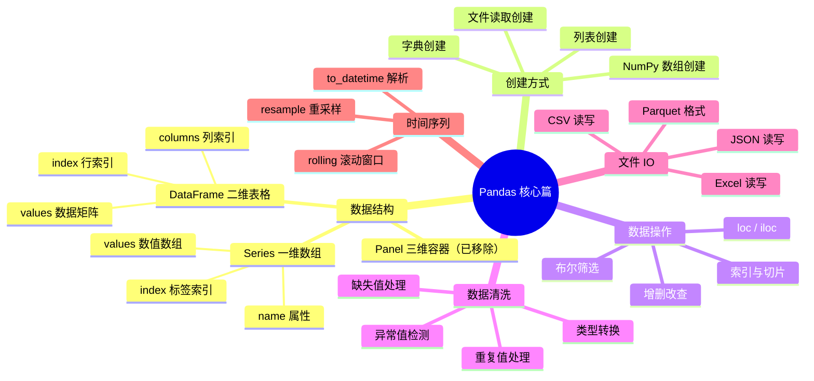
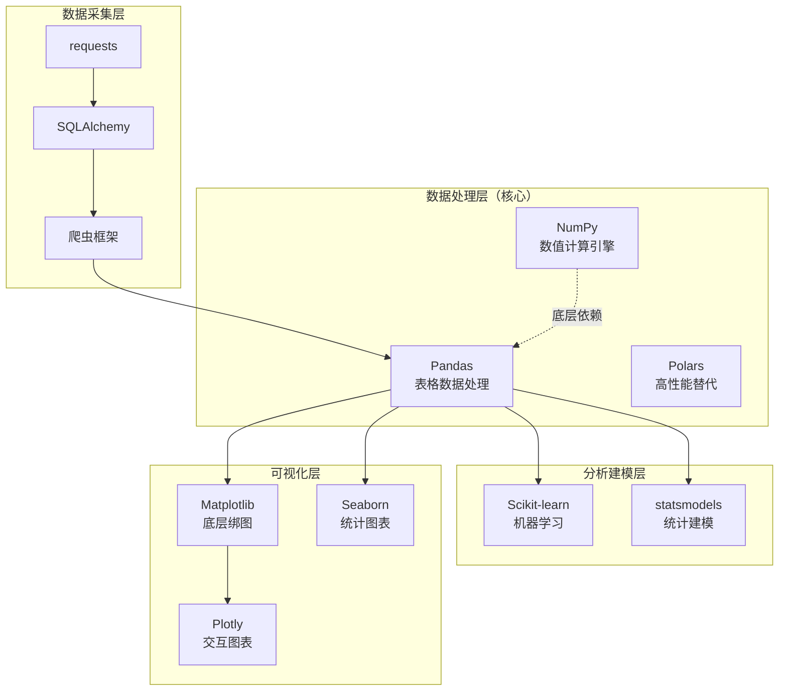
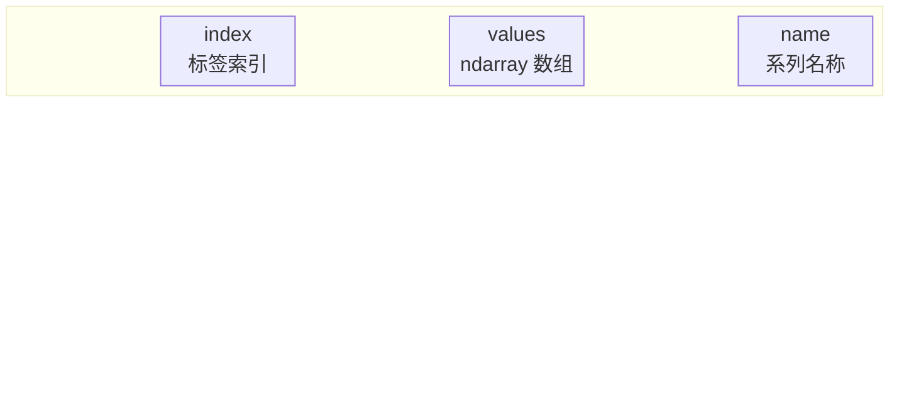
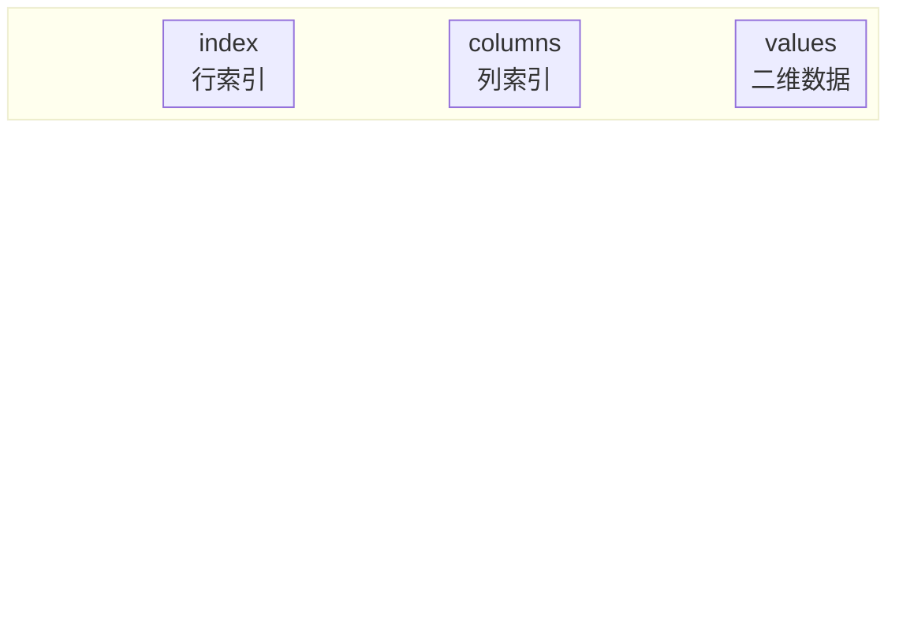
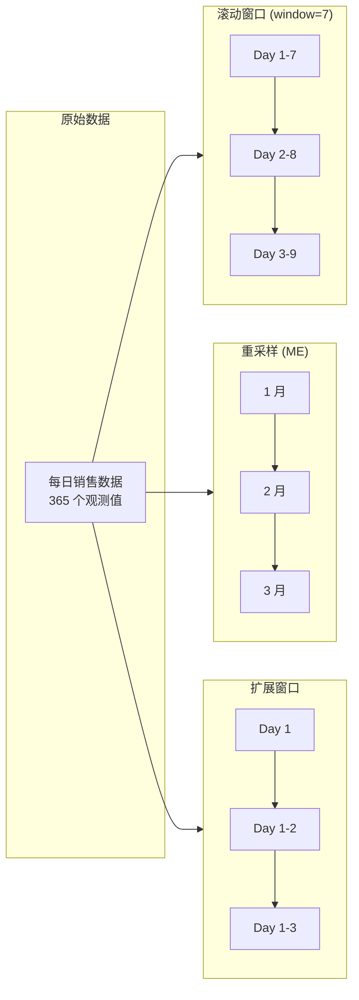

# Pandas 数据结构与数据处理

Pandas 是 Python 数据分析生态的核心工具——它基于 NumPy 构建，名称源自 **Panel Data**（面板数据，计量经济学术语）与 **Data Analysis**（数据分析）的组合。如果说 NumPy 是"计算引擎"，那 Pandas 就是"数据操作台"：提供带标签的数据结构、丰富的文件 I/O、强大的数据清洗能力，以及便捷的时间序列处理。

> 阅读提示

- 如果你想快速了解 Pandas 的定位和优势，从 [Pandas 在数据科学生态中的定位](#pandas-在数据科学生态中的定位) 开始
- 如果你想系统学习 Series，跳到 [Series 一维数据结构](#series-一维数据结构)
- 如果你想掌握 DataFrame 实战，直接看 [DataFrame 二维数据结构](#dataframe-二维数据结构)
- 如果你有数据清洗需求，重点看 [数据清洗核心操作](#数据清洗核心操作)
- 本文基于 **Python 3.12+**，**Pandas 2.x/3.x**（3.0 已为当前稳定版，差异见文末）

## 知识体系总览



## Pandas 在数据科学生态中的定位

### 与其他库的关系



### Pandas vs NumPy 对比

| 对比维度 | **NumPy** | **Pandas** |
|---------|-----------|------------|
| **数据类型** | 同构（所有元素类型相同） | 异构（每列可不同类型） |
| **核心功能** | 数值计算、线性代数、FFT | 数据整理、清洗、分析 |
| **数据结构** | ndarray（n 维数组） | Series（1D）、DataFrame（2D） |
| **速度** | 极快（纯 C 实现） | 较快（基于 NumPy，有 Python 开销） |
| **可读性** | 需要记住轴编号（axis 0/1） | 列名/标签直观易懂 |
| **缺失值处理** | 无原生支持（用 NaN 占位） | 原生支持（NaN/None/NA 统一处理） |
| **典型场景** | 矩阵运算、信号处理、图像处理 | 表格数据分析、CSV/Excel 处理 |

::: tip 选择原则
- **纯数值计算**（矩阵乘法、傅里叶变换）→ 用 **NumPy**
- **表格数据清洗与分析**（读取 CSV、处理缺失值、分组聚合）→ 用 **Pandas**
- **大数据集 + 性能敏感**（>5GB 内存）→ 考虑 **Polars**
:::

### Pandas 五大核心特点

| 特点 | 说明 | 典型场景 |
|------|------|---------|
| **数据可读性强** | 带行列标签，类似 Excel 表格 | 查看数据一目了然 |
| **存储多种类型** | 每列可独立设置数据类型 | 姓名(str)、年龄(int)、薪资(float) 共存 |
| **快捷数据处理** | 内置大量向量化操作 | 一行代码完成过滤/排序/聚合 |
| **读取文件方便** | 支持 CSV/Excel/JSON/SQL/Parquet 等 | 几乎覆盖所有常见格式 |
| **便捷时间序列处理** | `to_datetime`、`resample`、`rolling` | 金融数据分析、传感器数据处理 |
| **封装画图功能** | 直接调用 `df.plot()` | 快速探索性可视化 |

## Series 一维数据结构

Series 是 Pandas 最基础的数据结构——一个**带标签的一维数组**。你可以把它理解为"带索引的字典"或"增强版的 NumPy 一维数组"。

### 核心组成



**三大核心组件：**

| 组件 | 类型 | 说明 | 示例 |
|------|------|------|------|
| **index** | Index 对象 | 标签索引，默认为 0, 1, 2... | `['a', 'b', 'c']` 或 `[0, 1, 2]` |
| **values** | ndarray | 实际存储数据的 NumPy 数组 | `[10, 20, 30]` |
| **name** | str | Series 的名称（可选） | `'score'` |

### 创建方式对比

```python
import pandas as pd
import numpy as np

# ===== 方式一：从列表创建（产生副本） =====
s1 = pd.Series([10, 20, 30, 40])
print(s1)
# 0    10
# 1    20
# 2    30
# 3    40
# dtype: int64

# 自定义 index
s1_named = pd.Series(
    [10, 20, 30],
    index=['Alice', 'Bob', 'Charlie'],
    name='score'
)

# ===== 方式二：从 NumPy 数组创建（引用/视图） =====
arr = np.array([100, 200, 300])
s2 = pd.Series(arr, index=['x', 'y', 'z'])
# 注意：修改 arr 可能影响 s2（共享内存）

# ===== 方式三：从字典创建（key → index，产生副本） =====
data = {'北京': 2154, '上海': 2424, '广州': 1867}
s3 = pd.Series(data)
# 北京    2154
# 上海    2424
# 广州    1867
# dtype: int64

# 字典 + 自定义 index：不匹配的 key 产生 NaN
cities = pd.Series(
    data,
    index=['北京', '上海', '深圳']  # '深圳' 不在原字典中
)
# 北京    2154.0
# 上海    2424.0
# 深圳       NaN  ← 不匹配则填充 NaN
# dtype: float64
```

| 创建方式 | 数据来源 | 是否产生副本 | index 来源 | 特殊行为 |
|---------|---------|-------------|-----------|---------|
| **列表** | Python list | ✅ 是（副本） | 默认 0,1,2... 或自定义 | - |
| **NumPy 数组** | ndarray | ❌ 否（视图/引用） | 默认或自定义 | 修改原数组会影响 Series |
| **字典** | dict | ✅ 是（副本） | 字典的 key | 自定义 index 时，不匹配的 key → NaN |

::: warning 视图 vs 副本
从 NumPy 数组创建 Series 时得到的是**视图**（view），修改原数组会同步影响 Series。如果需要独立副本，显式调用 `.copy()`：

```python
arr = np.array([1, 2, 3])
s = pd.Series(arr).copy()  # 显式复制，安全隔离
arr[0] = 999  # 不会影响 s
```
:::

### 四大属性速查

```python
s = pd.Series([85, 92, 78, 95, 88], name='math_score')

print(s.size)       # 5 — 元素个数
print(s.index)      # RangeIndex(start=0, stop=5, step=1)
print(s.dtype)      # int64 — 数据类型
print(s.values)     # [85 92 78 95 88] — 底层 ndarray
```

| 属性 | 返回类型 | 说明 | 示例输出 |
|------|---------|------|---------|
| `size` | int | 元素个数 | `5` |
| `index` | Index | 标签索引对象 | `RangeIndex(0, 5)` |
| `dtype` | dtype | 数据类型 | `int64`, `float64`, `object` |
| `values` | ndarray | 底层数据的 NumPy 数组 | `[85 92 78 95 88]` |

### 运算特性

标量运算**不影响 index**，只作用于 values，且自动对齐 index：

```python
s1 = pd.Series([1, 2, 3], index=['a', 'b', 'c'])
s2 = pd.Series([10, 20], index=['a', 'b'])

# 标量运算
s1 * 2
# a    2
# b    4
# c    6

# Series 间运算（按 index 自动对齐）
s1 + s2
# a    11.0
# b    22.0
# c     NaN   ← s2 中没有 'c'，结果为 NaN
```

### 索引与切片

#### 四种访问方式

```python
s = pd.Series([10, 20, 30, 40, 50],
              index=['a', 'b', 'c', 'd', 'e'])

# 1️⃣ 位置下标（整数索引）
s[0]      # 10 — 第 1 个元素
s[-1]     # 50 — 最后 1 个元素

# 2️⃣ 标签索引（使用自定义 index）
s['a']    # 10
s['c']    # 30

# 3️⃣ 布尔索引（条件筛选）
s[s > 25]
# c    30
# d    40
# e    50

# 4️⃣ loc / iloc（推荐）
s.loc['a':'c']    # 按标签切片
s.iloc[0:3]       # 按位置切片
```

#### 位置切片 vs 标签切片（重要区别！）

```python
s = pd.Series([10, 20, 30, 40, 50],
              index=['a', 'b', 'c', 'd', 'e'])

# ⚠️ 位置切片：左闭右开（和 Python list 一致）
s.iloc[1:4]
# b    20
# c    30
# d    40  （不包含位置 4 的 'e'）

# ✅ 标签切片：左闭右闭！（Pandas 特色）
s.loc['b':'d']
# b    20
# c    30
# d    40  （包含 'd'！）
```

| 切片方式 | 语法 | 包含右端点 | 适用场景 |
|---------|------|-----------|---------|
| **位置切片** | `s.iloc[1:4]` | ❌ 不包含 | 按位置选取连续元素 |
| **标签切片** | `s.loc['b':'d']` | ✅ 包含 | 按标签选取连续元素 |

::: tip 为什么标签切片是闭区间？
因为标签通常没有天然的"顺序感"，闭区间更符合直觉——你说"从 b 到 d"，自然期望包含 d。
:::

#### loc vs iloc 在 Series 中的差异

| 访问器 | 含义 | 输入类型 | 示例 |
|--------|------|---------|------|
| **loc** | location（基于标签） | 标签名 | `s.loc['a']`, `s.loc['a':'c']` |
| **iloc** | integer location（基于位置） | 整数位置 | `s.iloc[0]`, `s.iloc[0:3]` |

> 在 Series 中两者差异不大，但在 **DataFrame** 中差异显著（见下文）。

### 增删改查操作汇总

```python
s = pd.Series([10, 20, 30], index=['a', 'b', 'c'])

# ✅ 增加：直接赋值新索引
s['d'] = 40
# a    10
# b    20
# c    30
# d    40

# ✅ 增加：concat（Series.append 已在 Pandas 2.0 移除）
s_new = pd.concat([s, pd.Series([50], index=['e'])])

# 🔍 查询：布尔索引
s[s > 15]          # b    20, c    30, d    40
'a' in s           # True — 判断标签是否存在

# ✏️ 修改：直接赋值
s['a'] = 999
s.loc['b':'c'] = [200, 300]

# 🗑️ 删除：drop（返回新 Series）
s_dropped = s.drop(['a', 'c'])  # 删除指定标签

# 🏷️ 重命名
s_renamed = s.rename('new_name')         # 修改 name 属性
s_renamed_idx = s.rename({'a': 'alpha'})  # 修改 index 标签
```

| 操作 | 方法 | 是否原地修改 | 说明 |
|------|------|-------------|------|
| **增加** | `s['new'] = value` | ✅ 原地 | 直接赋值新标签 |
| **增加** | `pd.concat([s, other])` | ❌ 返回新 Series | 拼接另一个 Series（`s.append` 已在 2.0 移除） |
| **查询** | `s[condition]` | ❌ 返回新 Series | 布尔索引筛选 |
| **修改** | `s[label] = new_value` | ✅ 原地 | 直接赋值 |
| **删除** | `s.drop(labels)` | ❌ 返回新 Series | 删除指定标签 |
| **重命名** | `s.rename()` | ❌ 返回新 Series | 修改 name 或 index |

### 聚合函数

```python
s = pd.Series([85, 92, 78, 95, 88, 76, 90])

print(s.max())      # 95  — 最大值
print(s.min())      # 76  — 最小值
print(s.mean())     # 86.285... — 均值
print(s.median())   # 88.0 — 中位数
print(s.var())      # 50.23... — 方差（ddof=1）
print(s.std())      # 7.087... — 标准差
print(s.sum())      # 604 — 总和
print(s.count())    # 7  — 非空值计数
```

| 函数 | 说明 | 适用场景 |
|------|------|---------|
| `max()` / `min()` | 最大/最小值 | 找极值 |
| `mean()` | 算术平均值 | 中心趋势 |
| `median()` | 中位数 | 抗异常值的中心趋势 |
| `var()` / `std()` | 方差/标准差 | 离散程度 |
| `sum()` | 求和 | 总量统计 |
| `count()` | 非空值计数 | 数据完整性检查 |
| `value_counts()` | 频次统计 | 分类变量分布 |
| `describe()` | 描述性统计摘要 | 快速概览 |

## DataFrame 二维数据结构

DataFrame 是 Pandas 的核心——一个**带行索引和列索引的二维异构数据表**。你可以把它想象成 Excel 电子表格、SQL 表格，或者多个 Series 共享同一 index 的集合。

### 核心组成



| 组件 | 类型 | 说明 |
|------|------|------|
| **index** | Index | 行标签（默认 0, 1, 2...） |
| **columns** | Index | 列标签（列名） |
| **values** | ndarray | 二维数据矩阵（每列同类型，列间可异构） |

### 创建方式

```python
import pandas as pd
import numpy as np

# ===== 方式一：从字典创建（最常用） =====
data = {
    'name': ['Alice', 'Bob', 'Charlie', 'David'],
    'age': [25, 30, 35, 28],
    'city': ['Beijing', 'Shanghai', 'Guangzhou', 'Shenzhen'],
    'salary': [15000.0, 25000.0, 18000.0, 22000.0]
}
df = pd.DataFrame(data)
print(df)
#       name  age       city   salary
# 0    Alice   25    Beijing  15000.0
# 1      Bob   30   Shanghai  25000.0
# 2  Charlie   35  Guangzhou  18000.0
# 3    David   28   Shenzhen  22000.0

# ===== 方式二：从列表的列表创建 =====
df2 = pd.DataFrame([
    ['Alice', 25, 15000],
    ['Bob', 30, 25000]
], columns=['name', 'age', 'salary'])

# ===== 方式三：从 NumPy 数组创建 =====
arr = np.random.randn(4, 3)
df3 = pd.DataFrame(
    arr,
    columns=['A', 'B', 'C'],
    index=['row1', 'row2', 'row3', 'row4']
)

# ===== 方式四：从文件读取 =====
# df = pd.read_csv('data.csv')
# df = pd.read_excel('data.xlsx')
```

### 数据查看方法

```python
# 假设 df 已加载
df = pd.DataFrame({
    'name': ['Alice', 'Bob', 'Charlie', 'David', 'Eve'],
    'age': [25, 30, 35, None, 28],
    'salary': [15000.0, 25000.0, 18000.0, 22000.0, None],
    'department': ['Tech', 'Tech', 'Sales', 'Tech', 'Sales']
})

df.head(3)            # 前 3 行
df.tail(2)            # 后 2 行
df.shape              # (5, 4) — (行数, 列数)
df.columns.tolist()   # ['name', 'age', 'salary', 'department']
df.dtypes             # 每列数据类型
df.info()             # 完整信息：列名、非空数、类型、内存占用
df.describe()         # 数值列统计摘要（均值、标准差、分位数等）
```

| 方法 | 输出 | 使用时机 |
|------|------|---------|
| `head(n)` | 前 n 行（默认 5） | 快速查看数据样貌 |
| `tail(n)` | 后 n 行（默认 5） | 检查数据末尾 |
| `shape` | `(行数, 列数)` 元组 | 了解数据规模 |
| `info()` | 列信息摘要 | 全面检查数据质量 |
| `describe()` | 数值列统计量 | 快速统计分析 |
| `dtypes` | 各列数据类型 | 检查类型是否正确 |

### 数据筛选与过滤

```python
# 1️⃣ 选择单列（返回 Series）
df['name']                    # 推荐
df.name                      # 等效（但列名不能有空格或与属性冲突）

# 2️⃣ 选择多列（返回 DataFrame）
df[['name', 'salary']]

# 3️⃣ 行筛选：布尔索引
df[df['age'] > 28]                        # age > 28 的行
df[df['department'] == 'Tech']            # 部门为 Tech 的行
df[(df['age'] > 25) & (df['salary'] > 20000)]  # 多条件（注意用 &）

# 4️⃣ loc：基于标签选择
df.loc[0, 'name']                         # 第 0 行，name 列
df.loc[:, ['name', 'age']]               # 所有行，指定列
df.loc[df['age'] > 30, 'salary']         # 条件行 + 指定列

# 5️⃣ iloc：基于位置选择
df.iloc[0, 0]                             # 第 0 行第 0 列
df.iloc[0:3, 1:3]                         # 前 3 行，第 2-3 列
df.iloc[[0, 2, 4], :]                     # 选定行，所有列
```

::: warning loc vs iloc 在 DataFrame 中的关键区别

这是 Pandas 新手最容易混淆的地方：

| 访问器 | 行选择依据 | 列选择依据 | 示例 |
|--------|-----------|-----------|------|
| **loc** | 行标签（index 值） | 列标签（列名） | `df.loc[0, 'name']` |
| **iloc** | 行位置（整数序号） | 列位置（整数序号） | `df.iloc[0, 0]` |

当 index 不是默认的 0,1,2... 时（比如日期索引），两者的差异尤为明显：
```python
df_date = df.set_index(pd.date_range('2024-01-01', periods=5))
df_date.loc['2024-01-03', 'name']   # ✅ 用日期标签
df_date.iloc[2, 0]                  # ✅ 用位置（第 3 行第 1 列）
```
:::

### 排序与排名

```python
# 按值排序
df.sort_values('salary', ascending=False)    # 按薪资降序
df.sort_values(['department', 'age'])         # 多列排序

# 按索引排序
df.sort_index()

# 排名（处理并列情况）
df['salary_rank'] = df['salary'].rank(method='dense', ascending=False)
# method: 'average'(默认), 'min', 'max', 'dense', 'first'
```

## 数据清洗核心操作

数据清洗是分析工作中耗时最多的环节（通常占 60% 以上）。Pandas 提供了一套完整的工具链来处理各种数据质量问题。

### 缺失值处理

```python
import pandas as pd
import numpy as np

# 构造含缺失值的示例数据
df = pd.DataFrame({
    'name': ['Alice', 'Bob', 'Charlie', 'David', 'Eve', 'Frank'],
    'age': [25, 30, None, 28, 35, None],
    'salary': [15000.0, None, 18000.0, 22000.0, None, 19000.0],
    'email': ['alice@mail.com', None, 'charlie@mail.com',
              'david@mail.com', 'eve@mail.com', None]
})

# 1️⃣ 检测缺失值
df.isnull()                  # 返回布尔 DataFrame
df.isnull().sum()            # 每列缺失值数量
df.notnull().all(axis=1)     # 每行是否完整（无缺失）

# 2️⃣ 删除缺失值
df_drop_rows = df.dropna()                     # 删除含任意缺失值的行
df_drop_cols = df.dropna(axis=1)               # 删除含任意缺失值的列
df_subset = df.dropna(subset=['email'])        # 仅删除 email 缺失的行
df_thresh = df.dropna(thresh=3)                # 至少 3 个非空值才保留

# 3️⃣ 填充缺失值
df_fill_const = df.fillna(0)                   # 固定值填充
df_fill_ffill = df.ffill()                     # 前向填充（用前一个有效值；fillna(method=) 已在 3.0 移除）
df_fill_bfill = df.bfill()                     # 后向填充

# 智能填充：数值列用中位数，字符串列用 "未知"
df_cleaned = df.copy()
for col in df_cleaned.columns:
    if pd.api.types.is_numeric_dtype(df_cleaned[col]):
        df_cleaned[col] = df_cleaned[col].fillna(df_cleaned[col].median())
    else:
        df_cleaned[col] = df_cleaned[col].fillna('未知')
```

#### 缺失值处理策略选择

| 策略 | 方法 | 适用场景 | 注意事项 |
|------|------|---------|---------|
| **删除行** | `dropna()` | 缺失比例 < 5%，且样本充足 | 会丢失数据 |
| **删除列** | `dropna(axis=1)` | 某列缺失率 > 50% | 信息损失大 |
| **固定值填充** | `fillna(0)` | 数值型缺省值为 0 | 可能引入偏差 |
| **统计量填充** | `fillna(mean/median)` | 数值列随机缺失 | 中位数抗异常值 |
| **前后向填充** | `ffill()` / `bfill()` | 时间序列数据 | 要求数据有序（`fillna(method=...)` 已在 3.0 移除） |
| **插值填充** | `interpolate()` | 连续数值序列 | 假设变化平滑 |

::: tip 填充策略决策树
1. 缺失比例 < 5%？→ 考虑删除或简单填充
2. 是时间序列？→ 前向/后向填充或插值
3. 是分类变量？→ 用众数或 "未知"
4. 是数值变量？→ 用中位数（抗异常值）
5. 缺失比例 > 30%？→ 考虑删除该列或单独建模
:::

### 重复值处理

```python
df_dup = pd.DataFrame({
    'id': [1, 2, 2, 3, 4, 4, 4],
    'name': ['A', 'B', 'B', 'C', 'D', 'D', 'D'],
    'value': [10, 20, 20, 30, 40, 40, 40]
})

# 1️⃣ 检测重复
df_dup.duplicated()              # 标记重复行（首次出现标记 False）
df_dup.duplicated(keep='last')   # 最后一次出现标记 False
df_dup.duplicated(keep=False)    # 所有重复都标记 True
df_dup.duplicated(subset=['id'])  # 按指定列判断重复

# 2️⃣ 查看重复项
df_dup[df_dup.duplicated()]

# 3️⃣ 删除重复
df_unique = df_dup.drop_duplicates()               # 保留第一个
df_unique_last = df_dup.drop_duplicates(keep='last')  # 保留最后一个
df_no_dup_all = df_dup.drop_duplicates(keep=False)    # 全部删除（保留无重复的）
```

### 数据类型转换

```python
df = pd.DataFrame({
    'id': ['001', '002', '003', '004'],
    'price': ['100.5', '200.3', '150.8', '99.9'],
    'category': ['A', 'B', 'A', 'C'],
    'is_active': ['True', 'False', 'True', 'True']
})

# 基础类型转换
df['id'] = df['id'].astype(int)              # str → int
df['price'] = df['price'].astype(float)      # str → float
# ⚠️ 字符串列不能直接 astype(bool)：非空字符串（包括 'False'）都会变成 True
df['is_active'] = df['is_active'].map({'True': True, 'False': False})  # str → bool 正确写法

# 分类类型（节省内存！）
df['category'] = df['category'].astype('category')

# 智能转换
df_converted = pd.to_numeric(df['price'], errors='coerce')  # 无法转换的变为 NaN

# 内存优化示例
def optimize_memory(df):
    """自动优化 DataFrame 内存占用"""
    start_mem = df.memory_usage(deep=True).sum() / 1024**2

    for col in df.columns:
        col_type = df[col].dtype

        if col_type != 'object':
            if str(col_type)[:3] == 'int':
                df[col] = pd.to_numeric(df[col], downcast='integer')
            elif str(col_type)[:5] == 'float':
                df[col] = pd.to_numeric(df[col], downcast='float')
        else:
            # 字符串列尝试转为 category
            unique_ratio = df[col].nunique() / len(df[col])
            if unique_ratio < 0.5:  # 唯一值少于 50%
                df[col] = df[col].astype('category')

    end_mem = df.memory_usage(deep=True).sum() / 1024**2
    print(f'内存优化: {start_mem:.2f} MB → {end_mem:.2f} MB ({end_mem/start_mem*100:.1f}%)')
    return df
```

| 原始类型 | 目标类型 | 方法 | 节省效果 |
|---------|---------|------|---------|
| `int64` | `int8/int16/int32` | `pd.to_numeric(downcast='integer')` | 50%-87.5% |
| `float64` | `float32` | `pd.to_numeric(downcast='float')` | 50% |
| `object`（低基数） | `category` | `.astype('category')` | 70%-95% |
| `object`（高基数） | 保持不变 | - | - |

### 异常值检测

```python
np.random.seed(42)
data = np.random.normal(100, 15, 1000)
data[0] = 500   # 人为注入异常值
df = pd.DataFrame({'value': data})

# 方法一：IQR 法（箱线图原理）
Q1 = df['value'].quantile(0.25)
Q3 = df['value'].quantile(0.75)
IQR = Q3 - Q1
lower_bound = Q1 - 1.5 * IQR
upper_bound = Q3 + 1.5 * IQR
outliers_iqr = df[(df['value'] < lower_bound) | (df['value'] > upper_bound)]
print(f"IQR 法检测到 {len(outliers_iqr)} 个异常值")

# 方法二：Z-score 法（标准差原理）
mean = df['value'].mean()
std = df['value'].std()
z_scores = np.abs((df['value'] - mean) / std)
outliers_zscore = df[z_scores > 3]  # |z| > 3 视为异常
print(f"Z-score 法检测到 {len(outliers_zscore)} 个异常值")

# 处理策略
# 1. 截断（Winsorization）
df['value_clipped'] = df['value'].clip(lower_bound, upper_bound)

# 2. 替换为 NaN（后续填充）
df.loc[z_scores > 3, 'value'] = np.nan

# 3. 删除
df_clean = df[z_scores <= 3]
```

| 方法 | 原理 | 优点 | 缺点 | 适用场景 |
|------|------|------|------|---------|
| **IQR 法** | Q1-1.5×IQR ~ Q3+1.5×IQR | 不假设分布形态，鲁棒性强 | 对偏态分布可能过于严格 | 通用场景 |
| **Z-score 法** | \|x - μ\| / σ > 3 | 直观，适合正态分布 | 对偏态分布效果差 | 近似正态分布 |
| **修正 Z-score** | \|x - 中位数\| / MAD | 抗异常值 | 计算稍复杂 | 有极端异常值时 |
| **可视化法** | 箱线图/散点图 | 直观发现模式 | 主观性强 | 探索性分析阶段 |

## 文件读写

Pandas 的文件 I/O 能力是其最受欢迎的特性之一——几乎一行代码就能读取常见格式。

### CSV 读取参数详解

```python
# 基础读取
df = pd.read_csv('data.csv')

# 完整参数示例
df = pd.read_csv(
    'data.csv',
    sep=',',                    # 分隔符（默认逗号）
    header=0,                   # 表头所在行（0 表示第一行）
    names=['col1', 'col2'],    # 自定义列名
    index_col=0,               # 指定索引列
    usecols=['name', 'age'],   # 只读取指定列
    dtype={'age': 'int32'},    # 指定列类型
    parse_dates=['date_col'],  # 解析日期列
    na_values=['N/A', '-'],    # 自定义缺失值标记
    skiprows=[0, 2],           # 跳过指定行
    nrows=1000,                # 只读前 N 行
    encoding='utf-8',          # 编码
    thousands=',',             # 千位分隔符
    comment='#',               # 注释符
)
```

### Excel 读取

```python
# 读取单个 Sheet
df = pd.read_excel('data.xlsx', sheet_name='Sheet1')

# 读取多个 Sheet
sheets = pd.read_excel('workbook.xlsx', sheet_name=None)  # 返回 Dict[str, DataFrame]
for sheet_name, sheet_df in sheets.items():
    print(f"{sheet_name}: {sheet_df.shape}")

# 写入 Excel（多 Sheet）
with pd.ExcelWriter('output.xlsx') as writer:
    df1.to_excel(writer, sheet_name='Sheet1', index=False)
    df2.to_excel(writer, sheet_name='Sheet2', index=False)
```

### 大文件处理策略

::: warning 内存陷阱
直接 `read_csv` 加载大文件可能导致内存溢出。以下策略可有效应对：
:::

```python
# 策略一：分块读取（chunksize）
chunk_iter = pd.read_csv('large_file.csv', chunksize=10000)
results = []
for chunk in chunk_iter:
    # 对每个分块进行处理
    processed = chunk.groupby('category')['amount'].sum()
    results.append(processed)

final_result = pd.concat(results).groupby(level=0).sum()

# 策略二：指定 dtype（减少内存）
dtypes = {
    'id': 'int32',
    'user_id': 'int32',
    'category': 'category',
    'status': 'category'
}
df = pd.read_csv('large_file.csv', dtype=dtypes)

# 策略三：只读需要的列
df = pd.read_csv('large_file.csv', usecols=['date', 'amount', 'category'])

# 策略四：使用高效格式（Parquet）
# 先将 CSV 转为 Parquet（一次性操作）
# df = pd.read_csv('large_file.csv')
# df.to_parquet('large_file.parquet')
# 之后每次读取：
# df = pd.read_parquet('large_file.parquet')  # 更快、更小
```

### 导出格式选择

| 格式 | 读取方法 | 写入方法 | 优点 | 缺点 | 适用场景 |
|------|---------|---------|------|------|---------|
| **CSV** | `read_csv` | `to_csv` | 通用性强、人类可读 | 大、慢、无类型信息 | 数据交换、小型数据集 |
| **Excel** | `read_excel` | `to_excel` | 用户友好、多 Sheet | 大文件慢、依赖 openpyxl | 业务报表、非技术人员 |
| **JSON** | `read_json` | `to_json` | Web 友好、嵌套结构 | 冗余、浮点精度 | API 数据交换 |
| **Parquet** | `read_parquet` | `to_parquet` | 快、小、保留类型 | 需额外依赖 | **生产环境首选** |
| **Feather** | `read_feather` | `to_feather` | 极快（IPC 格式） | 生态不如 Parquet | 进程间高速传输 |
| **SQL** | `read_sql` | `to_sql` | 直接对接数据库 | 需要 DB 连接 | 数据库交互 |

::: tip 生产环境建议
对于持久化存储和后续处理，**优先使用 Parquet 格式**：
- 比 CSV 小 60%-80%
- 读取速度快 5-10 倍
- 保留数据类型信息
- 支持列式读取（只需读取部分列时更快）
:::

## 时间序列处理

Pandas 在金融、物联网、日志分析等领域广泛应用的核心原因之一就是其强大的时间序列处理能力。

### to_datetime 解析

```python
import pandas as pd

# 基础解析
dates = pd.to_datetime(['2024-01-15', '2024-02-20', '2024-03-10'])
print(dates)
# DatetimeIndex(['2024-01-15', '2024-02-20', '2024-03-10'], dtype='datetime64[ns]', freq=None)

# 从 DataFrame 列解析
df = pd.DataFrame({
    'date_str': ['2024/01/15', '2024-02-20', '15-Mar-2024'],
    'value': [100, 200, 150]
})
df['date'] = pd.to_datetime(df['date_str'], format='mixed')  # 自动推断格式

# 指定格式（更快）
df['date_fast'] = pd.to_datetime(df['date_str'], format='%Y/%m/%d')

# 提取时间组件
df['year'] = df['date'].dt.year
df['month'] = df['date'].dt.month
df['day'] = df['date'].dt.day
df['weekday'] = df['date'].dt.weekday      # 0=周一, 6=周日
df['hour'] = df['date'].dt.hour
df['is_weekend'] = df['date'].dt.weekday >= 5
```

### 时间索引与重采样

```python
# 构造时间序列数据
date_rng = pd.date_range(start='2024-01-01', end='2024-12-31', freq='D')
ts = pd.DataFrame({
    'date': date_rng,
    'sales': np.random.randint(100, 1000, size=len(date_rng)),
    'visitors': np.random.randint(50, 500, size=len(date_rng))
})
ts = ts.set_index('date')  # 推荐写法：避免 inplace=True（Pandas 已弃用该参数）

# 按月重采样（求和）
monthly_sales = ts.resample('ME')['sales'].sum()  # ME = Month End
print(monthly_sales.head())

# 按周重采样（求均值）
weekly_avg = ts.resample('W')['visitors'].mean()

# 重采样聚合选项
resampled = ts.resample('ME').agg({
    'sales': ['sum', 'mean', 'max'],
    'visitors': ['sum', 'mean']
})
```

常用重采样频率别名（Pandas 2.2 起推荐小写形式，3.0 移除了 `H`/`T`/`S`/`L`/`U` 等大写别名）：

| 别名 | 说明 | 别名 | 说明 |
|------|------|------|------|
| `D` | 日历日 | `h` | 小时 |
| `W` | 周 | `min` | 分钟（旧写法 `T` 已移除） |
| `ME` | 月末 | `s` | 秒 |
| `QE` | 季末 | `ms` | 毫秒（旧写法 `L` 已移除） |
| `YE` | 年末 | `us` | 微秒（旧写法 `U` 已移除） |
| `MS` | 月初 | `ns` | 纳秒 |

### 时间窗口滚动计算

```python
# 7 日滚动平均（平滑短期波动）
ts['sales_7d_ma'] = ts['sales'].rolling(window=7).mean()

# 30 日滚动求和
ts['sales_30d_sum'] = ts['sales'].rolling(window=30).sum()

# 滚动标准差（波动率指标）
ts['sales_volatility'] = ts['sales'].rolling(window=14).std()

# 扩展窗口（累计统计）
ts['cumulative_sum'] = ts['sales'].expanding().sum()
ts['cumulative_mean'] = ts['sales'].expanding().mean()

# 滚动 + 自定义函数
def annualized_return(series):
    """年化收益率"""
    return (series.iloc[-1] / series.iloc[0]) ** (252 / len(series)) - 1

ts['rolling_return'] = ts['sales'].rolling(window=30).apply(annualized_return)
```



| 方法 | 窗口特征 | 输出长度 | 典型用途 |
|------|---------|---------|---------|
| `rolling(n)` | 固定大小滑动窗口 | 与原始相同 | 移动平均、平滑噪声 |
| `resample(freq)` | 按时间频率分组 | 取决于频率 | 降采样（日→月）、升采样 |
| `expanding()` | 从起点到当前位置 | 与原始相同 | 累计统计、增长趋势 |

## Pandas vs NumPy 速查对照表

| 操作 | NumPy | Pandas (Series/DataFrame) |
|------|-------|--------------------------|
| **创建** | `np.array([1, 2, 3])` | `pd.Series([1, 2, 3])` / `pd.DataFrame(...)` |
| **形状** | `arr.shape` | `df.shape` / `s.size` |
| **类型** | `arr.dtype` | `df.dtypes` / `s.dtype` |
| **索引** | `arr[0]`, `arr[1:3]` | `s.loc[]`, `s.iloc[]`, `df.loc[]`, `df.iloc[]` |
| **布尔筛选** | `arr[arr > 0]` | `df[df['col'] > 0]` |
| **统计** | `arr.mean()`, `arr.sum()` | `df.mean()`, `df.sum()` |
| **缺失值** | `np.nan`（需手动处理） | `df.isnull()`, `df.fillna()`, `df.dropna()` |
| **去重** | `np.unique(arr)` | `df.drop_duplicates()` |
| **排序** | `np.sort(arr)` | `df.sort_values()`, `df.sort_index()` |
| **合并** | `np.concatenate()` | `pd.concat()`, `pd.merge()` |
| **分组** | 无原生支持 | `df.groupby()` |
| **读文件** | `np.loadtxt()` | `pd.read_csv()`, `pd.read_excel()` |
| **写文件** | `np.savetxt()` | `df.to_csv()`, `df.to_parquet()` |

## 常见陷阱

### SettingWithCopyWarning

这是 Pandas 最著名的警告，也是新手最容易踩的坑：

```python
df = pd.DataFrame({
    'name': ['Alice', 'Bob', 'Charlie', 'David'],
    'age': [25, 30, 35, 28],
    'city': ['Beijing', 'Shanghai', 'Guangzhou', 'Shenzhen']
})

# ❌ 反面示例：链式赋值触发警告
subset = df[df['city'] == 'Beijing']  # subset 可能是视图
subset['age'] = 26  # SettingWithCopyWarning!
# 问题：不确定修改的是原始 df 还是副本

# ✅ 正确做法一：显式复制
subset = df[df['city'] == 'Beijing'].copy()
subset['age'] = 26  # 安全

# ✅ 正确做法二：用 .loc[] 直接修改
df.loc[df['city'] == 'Beijing', 'age'] = 26  # 明确修改原 DataFrame
```

::: tip Copy-on-Write（Pandas 2.x 新特性）
Pandas 2.x 引入了 Copy-on-Write（CoW）模式，可通过以下方式开启：

```python
pd.options.mode.copy_on_write = True
```

开启后，SettingWithCopyWarning 将成为历史——所有链式赋值都是安全的。**强烈建议新项目开启此模式。**
:::

### 其他高频陷阱

| 陷阱 | 错误代码 | 问题 | 解决方案 |
|------|---------|------|---------|
| **链式索引** | `df['col'][condition]` | 可能返回视图或副本，行为不确定 | 使用 `df.loc[condition, 'col']` |
| **忽略数据类型** | `df['id']` 显示为 float | 包含 NaN 的整数列会变成 float | 读取时指定 `dtype`，或用 `Int64Dtype()` |
| **Python 循环** | `for i in range(len(df)):` | 速度慢 100 倍以上 | 使用向量化操作 |
| **忘记重新赋值** | `df.drop('col')` 以为已删除 | 大多数方法默认返回副本 | 显式 `df = df.drop(...)`（不建议 `inplace=True`，已弃用） |
| **多条件未用括号** | `df[a>1 & b<2]` | 语法错误：`&` 优先级高于比较运算符 | `df[(a>1) & (b<2)]` |
| **修改迭代器** | `for idx, row in df.iterrows(): row['x']=1` | 不修改原 DataFrame | 使用 `df.at[idx, 'x'] = 1` |
| **合并笛卡尔积** | `pd.merge(df1, df2)` 忘记指定 on | 多对多合并导致行数爆炸 | 始终指定 `on` 和 `validate` 参数 |

## 实战案例：股票数据完整工作流

下面用一个完整的股票数据分析流程串联上述知识点：

```python
import pandas as pd
import numpy as np
import matplotlib.pyplot as plt

# ===== 1. 数据读取 =====
# 假设有一个包含股票 OHLCV 数据的 Excel 文件
df = pd.read_excel(
    'stock_data.xlsx',
    sheet_name='Daily',
    parse_dates=['Date'],  # 自动解析日期列
    index_col='Date'       # 将日期设为索引
)
print(f"原始数据: {df.shape[0]} 行, {df.shape[1]} 列")

# ===== 2. 数据清洗 =====
# 2.1 去除完全重复的记录
before_dedup = len(df)
df = df.drop_duplicates()
if before_dedup - len(df) > 0:
    print(f"去除重复: {before_dedup - len(df)} 行")

# 2.2 缺失值处理
missing_info = df.isnull().sum()
if missing_info.any():
    print("\n缺失值情况:")
    print(missing_info[missing_info > 0])

    # 数值列用前向填充（股价数据适合用前一天的价格）
    numeric_cols = ['Open', 'High', 'Low', 'Close', 'Volume']
    for col in numeric_cols:
        if col in df.columns and df[col].isnull().any():
            df[col] = df[col].ffill()
            print(f"  {col}: 已用前向填充")

# 2.3 确保日期索引有序且唯一
if not df.index.is_monotonic_increasing:
    df = df.sort_index()

# ===== 3. 探索性分析 =====
print("\n=== 数据描述 ===")
print(df.describe())

# ===== 4. 特征工程 =====
# 计算移动平均线
df['MA5'] = df['Close'].rolling(window=5).mean()
df['MA20'] = df['Close'].rolling(window=20).mean()
df['MA60'] = df['Close'].rolling(window=60).mean()

# 计算日收益率
df['Return'] = df['Close'].pct_change()

# 计算波动率（20 日滚动标准差）
df['Volatility'] = df['Return'].rolling(window=20).std() * np.sqrt(252)  # 年化

# ===== 5. 数据筛选示例 =====
# 找出涨幅超过 5% 的日子
big_up_days = df[df['Return'] > 0.05]
print(f"\n涨幅超 5% 的交易日: {len(big_up_days)} 天")

# 找出金叉信号（MA5 上穿 MA20）
df['Signal'] = 0
df.loc[(df['MA5'] > df['MA20']) &
       (df['MA5'].shift(1) <= df['MA20'].shift(1)), 'Signal'] = 1  # 金叉

# ===== 6. 可视化 =====
fig, axes = plt.subplots(3, 1, figsize=(12, 10), sharex=True)

# 收盘价与均线
axes[0].plot(df.index, df['Close'], label='收盘价', linewidth=1)
axes[0].plot(df.index, df['MA5'], label='MA5', alpha=0.7)
axes[0].plot(df.index, df['MA20'], label='MA20', alpha=0.7)
axes[0].set_title('股价走势与移动均线')
axes[0].legend()
axes[0].grid(True, alpha=0.3)

# 日收益率
axes[1].bar(df.index, df['Return'], color=np.where(df['Return'] >= 0, 'red', 'green'), alpha=0.7)
axes[1].set_title('日收益率')
axes[1].grid(True, alpha=0.3)

# 波动率
axes[2].fill_between(df.index, df['Volatility'], alpha=0.3, color='orange')
axes[2].set_title('20 日滚动年化波动率')
axes[2].grid(True, alpha=0.3)

plt.tight_layout()
plt.savefig('stock_analysis.png', dpi=150, bbox_inches='tight')
plt.show()

# ===== 7. 导出清洗后的数据 =====
df.to_parquet('clean_stock_data.parquet')
print(f"\n✅ 分析完成，数据已保存至 clean_stock_data.parquet")
```

## 术语表

| 术语 | 英文 | 定义 |
|------|------|------|
| **Series** | Series | Pandas 一维数据结构，由 index + values 组成 |
| **DataFrame** | DataFrame | Pandas 二维表格数据结构，由 index + columns + values 组成 |
| **Panel** | Panel | Pandas 三维数据容器（已在 0.25.0 移除，官方建议改用 MultiIndex 等结构） |
| **Index** | Index | 轴标签对象，用于标识行或列 |
| **loc** | label-based indexer | 基于标签的索引器（`df.loc[row_label, col_label]`） |
| **iloc** | integer-location-based indexer | 基于位置的索引器（`df.iloc[row_pos, col_pos]`） |
| **NaN** | Not a Number | 缺失值标记（IEEE 754 浮点标准） |
| **NA** | Not Available | Pandas 缺失值的统称（包括 NaN、None 等） |
| **dtype** | data type | 数据类型（如 `int64`, `float64`, `object`, `category`） |
| **Category** | Category dtype | 分类数据类型，用于低基数字符串列的内存优化 |
| **Resample** | Resampling | 时间序列重采样：改变数据的时间频率（如日→月） |
| **Rolling** | Rolling Window | 滑动窗口计算：对固定大小的窗口进行统计运算 |
| **IQR** | Interquartile Range | 四分位距：Q3 - Q1，用于异常值检测 |
| **Z-score** | Standard Score | 标准分数：(x - μ) / σ，衡量数据偏离均值的程度 |
| **CoW** | Copy-on-Write | 写入时复制：Pandas 2.x 的优化机制，解决 SettingWithCopyWarning |
| **View vs Copy** | View vs Copy | 视图共享内存，副本独立；修改视图会影响原数据 |
| **Chain Indexing** | Chain Indexing | 链式索引：如 `df['col'][row]`，可能触发不可预测的行为 |
| **Parquet** | Apache Parquet | 列式存储格式，高效的二进制数据格式 |
| **OHLCV** | Open-High-Low-Close-Volume | 开盘-最高-最低-收盘-成交量，金融数据标准格式 |
| **Vectorization** | Vectorization | 向量化运算：用数组级操作替代逐元素循环 |

## 延伸阅读

### 本站相关文档

- [数据分析全流程](../../05-数据科学/02-数据处理与分析/01-数据分析全流程) — 数据分析全流程与工具选型
- [量化交易入门](../../05-数据科学/07-量化金融/01-量化交易入门) — 金融数据分析入门
- [Pandas 与 NumPy 策略回测](../../05-数据科学/07-量化金融/02-Pandas与NumPy策略回测) — 向量化回测实战

### 官方资源

- [Pandas 官方文档](https://pandas.pydata.org/docs/) — 最权威的 API 参考
- [Pandas Cookbook](https://pandas.pydata.org/pandas-docs/stable/user_guide/cookbook.html) — 常见问题配方
- [10 Minutes to Pandas](https://pandas.pydata.org/pandas-docs/stable/user_guide/10min.html) — 快速上手指南

### 推荐书籍

- 《利用 Python 进行数据分析》（Wes McKinney）— Pandas 作者亲著，必读经典
- 《Python 数据科学手册》（Jake VanderPlas）— 系统全面的入门教材
- 《Pandas Cookbook》（Matt Harrison）— 实战导向的中级教程

## 版本差异（Pandas 1.x/2.x → 3.0.x）

| 特性 | 本文编写时 | 当前（Pandas 3.0.x） |
|------|-----------|----------------------|
| 版本基线 | 1.x / 2.x | 3.0 为最新稳定版（重大版本） |
| Copy-on-Write | 需手动开启 | 3.0 起 **默认开启**：视图/副本语义更安全，链式赋值不再静默修改 |
| 字符串类型 | object 存储 | 3.0 起 `str` dtype 默认使用 `StringDtype`，性能与语义更好 |
| `inplace` 参数 | 普遍可用 | 2.x 起逐步弃用，3.0 起大范围弃用（触发 FutureWarning）；改用 `df = df.method()` |
| 时间序列 | `pd.date_range` 等 | 不变；`Timestamp` 默认纳秒精度 |
| 依赖 | numpy 1.x | 要求 numpy 1.26+/2.x |

> 本文讲解的 DataFrame 核心 API（索引、筛选、清洗、聚合）在 3.0 中兼容；升级重点：Copy-on-Write 默认开启、`inplace`/`fillna(method=...)` 等弃用 API 清理、字符串 dtype 变化。
