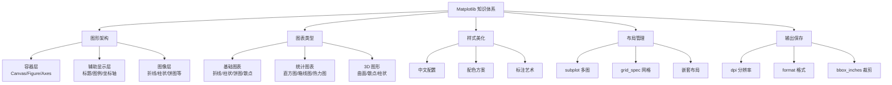
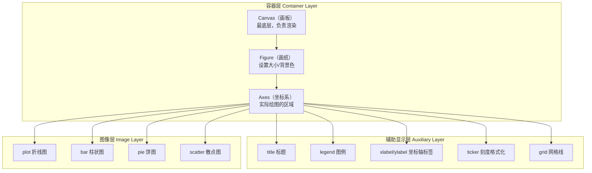
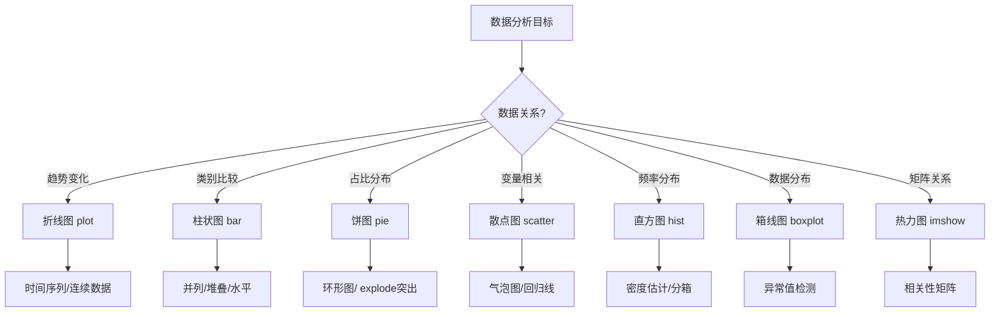

# Matplotlib 数据可视化实战

## 开篇概述

Matplotlib 是 Python 生态系统中**最基础、最核心**的 2D 可视化库。它诞生于 2003 年，旨在为 Python 提供 MATLAB 风格的绘图接口，经过二十余年的发展，已成为数据科学领域不可或缺的工具。

### 核心优势

| 特性 | 说明 |
|------|------|
| **开源免费** | BSD 许可证，可自由用于商业项目 |
| **接口简单** | `pyplot` 模块提供类似 MATLAB 的函数式 API |
| **高度集成** | 与 NumPy、Pandas 无缝配合，支持直接传入 DataFrame/Series |
| **输出丰富** | 支持 PNG/PDF/SVG/EPS 等多种格式，适配论文/报告/Web |
| **高度可控** | 从字体到像素级别的精细调整能力 |

### 知识体系总览



::: tip 快速入门示例
以下代码展示 Matplotlib 最基本的使用方式——用 5 行代码生成一张折线图：

```python
import matplotlib.pyplot as plt
import numpy as np

x = np.linspace(0, 10, 100)
y = np.sin(x)
plt.plot(x, y)
plt.xlabel('X 轴')
plt.ylabel('sin(x)')
plt.title('正弦函数图像')
plt.show()
```
:::

---

## 图形架构深入解析

理解 Matplotlib 的**三层架构模型**是掌握该库的关键。每一层都有明确的职责，清晰分层能帮助你写出更规范、更易维护的可视化代码。

### 架构层次图



### 容器层：Figure 与 Axes 的生命周期

#### 1. Canvas（画布）

Canvas 是 Matplotlib 渲染引擎的最底层，负责将图形绘制到不同的后端（屏幕、PDF、PNG 等）。**用户通常不直接操作 Canvas**，它由框架自动管理。

#### 2. Figure（画纸）

Figure 是整个图形的顶层容器，可以理解为一张"画纸"。你可以设置其大小、背景色、分辨率等属性。

```python
import matplotlib.pyplot as plt

# 创建一个 10x6 英寸的 Figure
fig = plt.figure(figsize=(10, 6), facecolor='lightgray')
fig.suptitle('这是一个 Figure 对象', fontsize=16)

plt.show()
```

**关键参数说明：**

| 参数 | 默认值 | 说明 |
|------|--------|------|
| `figsize` | `(6.4, 4.8)` | 宽高，单位英寸 |
| `dpi` | `100` | 每英寸像素数 |
| `facecolor` | `'white'` | 背景色 |
| `edgecolor` | `'white'` | 边框颜色 |

#### 3. Axes（坐标系）

Axes 是 Figure 上用于绘图的矩形区域，包含坐标轴和实际的图形元素。**一个 Figure 可以包含多个 Axes（子图）**。

```python
import matplotlib.pyplot as plt
import numpy as np

fig = plt.figure(figsize=(12, 4))

# 方式一：add_subplot() - 按行列位置添加
ax1 = fig.add_subplot(131)  # 1行3列，第1个
ax1.plot([1, 2, 3], [1, 4, 9])
ax1.set_title('add_subplot(131)')

# 方式二：axes() - 精确定位 [left, bottom, width, height]
ax2 = fig.add_axes([0.35, 0.1, 0.25, 0.8])  # 相对坐标
ax2.bar(['A', 'B', 'C'], [3, 7, 5], color='orange')
ax2.set_title('add_axes() 精确定位')

# 方式三：subplots() - 批量创建（推荐）
ax3 = fig.add_subplot(133)
x = np.linspace(0, 2*np.pi, 100)
ax3.scatter(np.sin(x), np.cos(x), c=x, cmap='viridis')
ax3.set_title('scatter plot')

plt.tight_layout()
plt.show()
```

::: info 三种多图方式对比

| 方法 | 适用场景 | 灵活度 | 推荐度 |
|------|----------|--------|--------|
| `plt.subplots(nrows, ncols)` | 规整网格布局 | ⭐⭐⭐ | ⭐⭐⭐⭐⭐ |
| `fig.add_subplot(pos)` | 混合布局，逐步添加 | ⭐⭐⭐⭐ | ⭐⭐⭐⭐ |
| `fig.add_axes([l,b,w,h])` | 嵌套图形、精确定位 | ⭐⭐⭐⭐⭐ | ⭐⭐⭐ |

:::

### 辅助显示层：标题/图例/坐标轴/刻度

辅助显示层决定了图形的**可读性和专业度**。以下是常用元素的完整配置指南：

```python
import matplotlib.pyplot as plt
import numpy as np
from matplotlib import ticker

# 准备数据
x = np.linspace(0, 10, 50)
y1 = np.sin(x) * np.exp(-x/10)
y2 = np.cos(x) * np.exp(-x/10)

fig, ax = plt.subplots(figsize=(10, 6))

# 绘制双系列折线
line1, = ax.plot(x, y1, 'b-o', label='衰减正弦波', linewidth=2)
line2, = ax.plot(x, y2, 'r--s', label='衰减余弦波', linewidth=2)

# === 标题 ===
ax.set_title('阻尼振荡信号分析', fontsize=16, fontweight='bold', pad=20)

# === 坐标轴标签 ===
ax.set_xlabel('时间 (s)', fontsize=12)
ax.set_ylabel('振幅', fontsize=12)

# === 图例（支持多位置和样式）===
ax.legend(loc='upper right', frameon=True, shadow=True, fontsize=10)

# === 刻度格式化 ===
ax.xaxis.set_major_formatter(ticker.FormatStrFormatter('%.1f s'))
ax.yaxis.set_major_formatter(ticker.FormatStrFormatter('%.2f'))

# === 网格线 ===
ax.grid(True, linestyle='--', alpha=0.6)

# === 设置坐标轴范围 ===
ax.set_xlim(0, 10)
ax.set_ylim(-1.2, 1.2)

plt.tight_layout()
plt.show()
```

**辅助显示层参数速查表：**

| 元素 | 方法 | 常用参数 |
|------|------|----------|
| 标题 | `set_title()` | `fontsize`, `fontweight`, `loc`, `pad` |
| X轴标签 | `set_xlabel()` | `fontsize`, `labelpad`, `color` |
| Y轴标签 | `set_ylabel()` | 同上 |
| 图例 | `legend()` | `loc`, `ncol`, `frameon`, `fontsize` |
| 刻度 | `set_xticks()` / `set_yticks()` | 刻度值列表 |
| 刻度标签 | `set_xticklabels()` / `set_yticklabels()` | 标签列表 + rotation |
| 网格 | `grid()` | `linestyle`, `alpha`, `color` |
| 范围 | `set_xlim()` / `set_ylim()` | (min, max) 元组 |

### 图像层：图表类型选择

图像层是真正决定"画什么"的地方。Matplotlib 提供了数十种图表类型，选择合适的类型是有效可视化的第一步。



---

## 图表绘制详解

### 折线图与趋势分析

折线图是最基础的图表类型，适用于展示**时间序列趋势**或**连续变量**的变化规律。

#### 基础折线图

```python
import matplotlib.pyplot as plt
import numpy as np

# 生成时间序列数据
dates = np.arange('2025-01', '2026-01', dtype='datetime64[M]')
sales_q1 = [120, 135, 150, 145, 160, 175, 190, 210, 195, 220, 240, 260]
sales_q2 = [80, 95, 110, 105, 120, 135, 150, 165, 155, 180, 200, 220]

fig, ax = plt.subplots(figsize=(12, 6))

# marker 和 linestyle 组合使用
ax.plot(dates, sales_q1,
        marker='o',           # 圆点标记
        markersize=8,
        markerfacecolor='white',
        markeredgewidth=2,
        linestyle='-',         # 实线
        linewidth=2.5,
        color='#3498db',
        label='产品A 销量')

ax.plot(dates, sales_q2,
        marker='s',           # 方形标记
        markersize=7,
        linestyle='--',       # 虚线
        linewidth=2,
        color='#e74c3c',
        label='产品B 销量')

ax.set_title('2025年度产品销量趋势对比', fontsize=14, fontweight='bold')
ax.set_xlabel('月份', fontsize=12)
ax.set_ylabel('销量（万件）', fontsize=12)
ax.legend(loc='upper left')
ax.grid(True, alpha=0.3)

# 自动旋转日期标签
fig.autofmt_xdate()

plt.tight_layout()
plt.show()
```

**Marker 标记符号参考表：**

| 符号 | 名称 | 符号 | 名称 | 符号 | 名称 |
|------|------|------|------|------|------|
| `.` | 点 | `o` | 圆 | `v` | 下三角 |
| `^` | 上三角 | `<` | 左三角 | `>` | 右三角 |
| `s` | 方形 | `p` | 五边形 | `*` | 星形 |
| `h` | 六边形1 | `H` | 六边形2 | `+` | 加号 |
| `x` | 叉号 | `D` | 菱形 | `d` | 小菱形 |

**Line Style 线型参考表：**

| 符号 | 名称 | 效果 |
|------|------|------|
| `-` | 实线 | ────────── |
| `--` | 虚线 | - - - - - - |
| `-.` | 点划线 | ─ · ─ · ─ · |
| `:` | 点线 | ··········· |
| `''` 或 `' '` | 无线 | （仅显示标记） |

::: tip 折线图最佳实践
- **数据点数量**：建议 20-100 个点，过多会导致线条拥挤
- **标记密度**：数据量大时省略 `marker`，或每隔 N 个点显示
- **颜色选择**：避免红绿搭配（色盲友好），推荐使用 `tab10`/`Set2` 配色
:::

### 柱状图与数据对比

柱状图是**类别间数值比较**的首选图表，支持并列、堆叠、水平等多种变体。

#### 基础柱状图 + 数值标注

```python
import matplotlib.pyplot as plt
import numpy as np

categories = ['Q1', 'Q2', 'Q3', 'Q4']
sales_2024 = [150, 180, 165, 210]
sales_2025 = [170, 205, 195, 245]

x = np.arange(len(categories))
width = 0.35  # 柱子宽度

fig, ax = plt.subplots(figsize=(10, 6))

# 并列柱状图：通过 x 偏移实现
bars1 = ax.bar(x - width/2, sales_2024, width,
               label='2024年', color='#3498db', edgecolor='white')
bars2 = ax.bar(x + width/2, sales_2025, width,
               label='2025年', color='#e74c3c', edgecolor='white')

# 数值标注函数
def add_labels(bars):
    for bar in bars:
        height = bar.get_height()
        ax.annotate(f'{height}',
                    xy=(bar.get_x() + bar.get_width()/2, height),
                    xytext=(0, 3),
                    textcoords="offset points",
                    ha='center', va='bottom',
                    fontsize=11, fontweight='bold')

add_labels(bars1)
add_labels(bars2)

ax.set_title('季度销售额对比（万元）', fontsize=14, fontweight='bold')
ax.set_xlabel('季度', fontsize=12)
ax.set_ylabel('销售额（万元）', fontsize=12)
ax.set_xticks(x)
ax.set_xticklabels(categories)
ax.legend()
ax.set_ylim(0, max(max(sales_2024), max(sales_2025)) * 1.15)  # 留出标注空间
ax.grid(axis='y', alpha=0.3)

plt.tight_layout()
plt.show()
```

#### 堆叠柱状图

```python
import matplotlib.pyplot as plt

categories = ['一月', '二月', '三月', '四月', '五月']
online_sales = [45, 52, 48, 61, 55]
offline_sales = [30, 28, 35, 32, 40]
third_party = [15, 18, 22, 19, 25]

x = range(len(categories))
width = 0.6

fig, ax = plt.subplots(figsize=(10, 6))

# 使用 bottom 参数实现堆叠
p1 = ax.bar(x, online_sales, width, label='线上渠道', color='#2ecc71')
p2 = ax.bar(x, offline_sales, width, bottom=online_sales,
            label='线下门店', color='#3498db')
p3 = ax.bar(x, third_party, width,
            bottom=[i+j for i,j in zip(online_sales, offline_sales)],
            label='第三方平台', color='#e74c3c')

ax.set_title('各渠道销售构成（堆叠柱状图）', fontsize=14, fontweight='bold')
ax.set_ylabel('销售额（万元）', fontsize=12)
ax.set_xticks(x)
ax.set_xticklabels(categories)
ax.legend(loc='upper right')

# 在每个堆叠块上标注数值
for i, (o, off, t) in enumerate(zip(online_sales, offline_sales, third_party)):
    total = o + off + t
    ax.text(i, o/2, str(o), ha='center', va='center', color='white', fontweight='bold')
    ax.text(i, o+off/2, str(off), ha='center', va='center', color='white', fontweight='bold')
    ax.text(i, o+off+t/2, str(t), ha='center', va='center', color='white', fontweight='bold')
    ax.text(i, total+2, f'总计:{total}', ha='center', va='bottom', fontsize=10)

ax.set_ylim(0, 130)
plt.tight_layout()
plt.show()
```

### 饼图与占比分析

饼图适合展示**各部分占整体的比例关系**，但类别不宜超过 7 个，否则难以辨识。

```python
import matplotlib.pyplot as plt

labels = ['研发投入', '市场营销', '运营成本', '人力资源', '其他']
sizes = [35, 25, 20, 15, 5]
colors = ['#3498db', '#e74c3c', '#2ecc71', '#f39c12', '#9b59b6']
explode = (0.05, 0, 0, 0, 0)  # 突出显示第一个扇区

fig, (ax1, ax2) = plt.subplots(1, 2, figsize=(14, 6))

# 左侧：标准饼图
wedges1, texts1, autotexts1 = ax1.pie(
    sizes,
    explode=explode,
    labels=labels,
    colors=colors,
    autopct='%1.1f%%',      # 显示百分比，保留1位小数
    pctdistance=0.75,       # 百分比距圆心的距离
    startangle=90,          # 起始角度
    shadow=True,
    wedgeprops={'edgecolor': 'white', 'linewidth': 2}
)
ax1.set_title('标准饼图（带 explode）', fontsize=13, fontweight='bold')

# 设置百分比文字样式
for autotext in autotexts1:
    autotext.set_color('white')
    autotext.set_fontweight('bold')
    autotext.set_fontsize(11)

# 右侧：环形图（Donut Chart）
wedges2, texts2, autotexts2 = ax2.pie(
    sizes,
    labels=labels,
    colors=colors,
    autopct='%1.1f%%',
    pctdistance=0.8,
    startangle=90,
    wedgeprops=dict(width=0.5, edgecolor='white', linewidth=2)  # 设置宽度实现环形
)

# 中心添加文字
centre_circle = plt.Circle((0, 0), 0.35, fc='white')
ax2.add_artist(centre_circle)
ax2.text(0, 0, '总预算\n100%', ha='center', va='center', fontsize=14, fontweight='bold')
ax2.set_title('环形图（Donut Chart）', fontsize=13, fontweight='bold')

for autotext in autotexts2:
    autotext.set_fontsize(10)
    autotext.set_fontweight('bold')

plt.tight_layout()
plt.show()
```

::: warning 饼图使用注意事项
- **类别数量**：超过 7 个时建议改用柱状图或条形图
- **排序**：按数值从大到小排列，便于比较
- **色彩**：避免使用相似颜色，确保区分度
- **替代方案**：考虑使用环形图（Donut）或华夫饼图（Waffle）
:::

### 散点图与关系探索

散点图用于探究**两个变量之间的相关性**，通过点的分布形态判断线性/非线性关系。

```python
import matplotlib.pyplot as plt
import numpy as np

# 生成模拟数据：广告投入 vs 销售额
np.random.seed(42)
ad_spend = np.random.uniform(10, 100, 50)
base_sales = 20 + 0.8 * ad_spend
noise = np.random.normal(0, 15, 50)
sales = base_sales + noise

# 第三维：利润率（用于气泡大小）
profit_margin = np.random.uniform(5, 25, 50)

fig, ax = plt.subplots(figsize=(10, 7))

# 散点图 + 气泡效果
scatter = ax.scatter(
    ad_spend, sales,
    s=profit_margin * 10,     # s 参数控制点大小（气泡图）
    c=profit_margin,          # 颜色映射到第三变量
    cmap='RdYlGn',            # 红-黄-绿渐变色
    alpha=0.7,                # 透明度
    edgecolors='white',
    linewidth=1.5
)

# 添加颜色条
cbar = fig.colorbar(scatter, ax=ax)
cbar.set_label('利润率 (%)', fontsize=11)

# 添加趋势线
z = np.polyfit(ad_spend, sales, 1)
p = np.poly1d(z)
x_line = np.linspace(ad_spend.min(), ad_spend.max(), 100)
ax.plot(x_line, p(x_line), 'r--', linewidth=2, label=f'趋势线 (斜率={z[0]:.2f})')

ax.set_title('广告投入 vs 销售额（气泡图）\n气泡大小表示利润率', fontsize=14, fontweight='bold')
ax.set_xlabel('广告投入（万元）', fontsize=12)
ax.set_ylabel('销售额（万元）', fontsize=12)
ax.legend(loc='lower right')
ax.grid(True, alpha=0.3)

plt.tight_layout()
plt.show()
```

**Scatter 关键参数说明：**

| 参数 | 类型 | 说明 | 示例值 |
|------|------|------|--------|
| `s` | scalar/array-like | 点大小（平方磅） | `50`, `[20, 50, 80, ...]` |
| `c` | color/array-like | 点颜色 | `'red'`, `[0.1, 0.5, ...]` |
| `cmap` | Colormap | 颜色映射（当 c 为数组时） | `'viridis'`, `'plasma'` |
| `alpha` | float | 透明度（0-1） | `0.5` |
| `marker` | str | 标记形状 | `'o'`, `'s'`, `'^'` |
| `edgecolors` | color | 边框颜色 | `'white'`, `'black'` |
| `linewidths` | float | 边框宽度 | `1.0`, `2.0` |

### 3D 可视化

Matplotlib 通过 `mpl_toolkits.mplot3d` 模块提供基础的 3D 绘图功能，适合快速预览三维数据关系。

::: warning 性能提示
3D 渲染比 2D 慢很多，且交互性有限。对于复杂 3D 可视化，建议使用 **Plotly** 或 **Mayavi**。
:::

```python
import matplotlib.pyplot as plt
import numpy as np
from mpl_toolkits.mplot3d import Axes3D  # 虽然 Py3 不显式需要，但保持导入习惯

# 创建 3D 图形
fig = plt.figure(figsize=(14, 5))

# === 子图1：3D 折线图 ===
ax1 = fig.add_subplot(131, projection='3d')

t = np.linspace(0, 4*np.pi, 100)
x = np.sin(t)
y = np.cos(t)
z = t / (4*np.pi) * 5  # 高度随时间增加

ax1.plot(x, y, z, 'b-', linewidth=2)
ax1.scatter([x[0]], [y[0]], [z[0]], color='green', s=100, label='起点')
ax1.scatter([x[-1]], [y[-1]], [z[-1]], color='red', s=100, label='终点')
ax1.set_title('3D 螺旋线', fontsize=12)
ax1.legend()

# === 子图2：3D 散点图 ===
ax2 = fig.add_subplot(132, projection='3d')

np.random.seed(42)
n = 100
xs = np.random.randn(n)
ys = np.random.randn(n)
zs = np.random.randn(n)
colors = xs + ys + zs

scatter = ax2.scatter(xs, ys, zs, c=colors, cmap='coolwarm', s=50, alpha=0.7)
ax2.set_title('3D 散点图', fontsize=12)
ax2.set_xlabel('X 轴')
ax2.set_ylabel('Y 轴')
ax2.set_zlabel('Z 轴')

# === 子图3：3D 柱状图 ===
ax3 = fig.add_subplot(133, projection='3d')

categories = ['A', 'B', 'C', 'D']
years = ['2023', '2024', '2025']
data = np.array([
    [23, 35, 48],
    [15, 28, 38],
    [31, 42, 55],
    [18, 25, 33]
])

_x = np.arange(len(years))
_y = np.arange(len(categories))
_xx, _yy = np.meshgrid(_x, _y)
x_pos, y_pos = _xx.ravel(), _yy.ravel()
z_pos = np.zeros_like(x_pos)
dx = dy = 0.5
dz = data.ravel()

ax3.bar3d(x_pos, y_pos, z_pos, dx, dy, dz,
          color=plt.cm.Set3(dz / dz.max()), alpha=0.8)
ax3.set_xticks(_x + dx/2)
ax3.set_xticklabels(years)
ax3.set_yticks(_y + dy/2)
ax3.set_yticklabels(categories)
ax3.set_zlabel('数值')
ax3.set_title('3D 柱状图', fontsize=12)

plt.tight_layout()
plt.show()
```

### 多图布局

#### subplots() 批量创建（推荐方式）

```python
import matplotlib.pyplot as plt
import numpy as np

fig, axes = plt.subplots(2, 3, figsize=(15, 10))
fig.suptitle('六种常用图表类型展示', fontsize=16, fontweight='bold', y=1.02)

x = np.linspace(0, 10, 50)

# 折线图
axes[0, 0].plot(x, np.sin(x), 'b-', linewidth=2)
axes[0, 0].set_title('折线图', fontweight='bold')
axes[0, 0].grid(alpha=0.3)

# 散点图
axes[0, 1].scatter(x, np.cos(x)+np.random.randn(50)*0.2, c=np.sin(x), cmap='viridis')
axes[0, 1].set_title('散点图', fontweight='bold')

# 柱状图
axes[0, 2].bar(['A','B','C','D'], [23, 45, 56, 32], color=['#e74c3c','#3498db','#2ecc71','#f39c12'])
axes[0, 2].set_title('柱状图', fontweight='bold')

# 直方图
axes[1, 0].hist(np.random.randn(1000), bins=30, color='#9b59b6', edgecolor='white', alpha=0.8)
axes[1, 0].set_title('直方图', fontweight='bold')
axes[1, 0].grid(alpha=0.3)

# 饼图
axes[1, 1].pie([30, 25, 20, 15, 10], labels=['A','B','C','D','E'],
               colors=['#e74c3c','#3498db','#2ecc71','#f39c12','#9b59b6'],
               autopct='%1.0f%%', startangle=90)
axes[1, 1].set_title('饼图', fontweight='bold')

# 箱线图（注意：boxplot 的 labels 参数已更名为 tick_labels，3.11 起旧参数报错）
data_box = [np.random.normal(0, std, 100) for std in (1.0, 2.0, 3.0)]
axes[1, 2].boxplot(data_box, tick_labels=['组1','组2','组3'], patch_artist=True,
                   boxprops=dict(facecolor='#3498db', alpha=0.6))
axes[1, 2].set_title('箱线图', fontweight='bold')
axes[1, 2].grid(alpha=0.3)

plt.tight_layout()
plt.show()
```

#### GridSpec 复杂布局

```python
import matplotlib.pyplot as plt
from matplotlib.gridspec import GridSpec
import numpy as np

fig = plt.figure(figsize=(14, 8))
gs = GridSpec(3, 3, figure=fig, hspace=0.4, wspace=0.3)

# 主图：占据左侧两行两列
ax_main = fig.add_subplot(gs[0:2, 0:2])
x = np.linspace(0, 10, 100)
ax_main.plot(x, np.sin(x), 'b-', linewidth=2, label='sin(x)')
ax_main.fill_between(x, np.sin(x)-0.1, np.sin(x)+0.1, alpha=0.2)
ax_main.set_title('主图区域（大尺寸）', fontweight='bold')
ax_main.legend()
ax_main.grid(alpha=0.3)

# 右上角小图
ax_topright = fig.add_subplot(gs[0, 2])
ax_topright.scatter(np.random.rand(50), np.random.rand(50), c='red', alpha=0.6)
ax_topright.set_title('右上角')

# 右中图
ax_midright = fig.add_subplot(gs[1, 2])
ax_midright.bar(['X','Y','Z'], [4, 7, 3], color='green', alpha=0.7)
ax_midright.set_title('右中')

# 底部横跨三列的大图
ax_bottom = fig.add_subplot(gs[2, :])
ax_bottom.hist(np.random.randn(500), bins=40, color='purple', alpha=0.7, edgecolor='white')
ax_bottom.set_title('底部宽幅图（跨列）', fontweight='bold')
ax_bottom.grid(alpha=0.3)

plt.suptitle('GridSpec 复杂布局示例', fontsize=16, fontweight='bold', y=1.02)
plt.show()
```

### 图形嵌套与高级布局

```python
import matplotlib.pyplot as plt
import numpy as np

fig, ax = plt.subplots(figsize=(10, 7))

# 主图：散点图
np.random.seed(42)
x = np.random.randn(100)
y = x * 0.8 + np.random.randn(100) * 0.5

ax.scatter(x, y, alpha=0.6, c='#3498db', edgecolors='white', s=60)
ax.set_xlabel('特征 X', fontsize=12)
ax.set_ylabel('特征 Y', fontsize=12)
ax.set_title('主图 + 内嵌放大区域', fontsize=14, fontweight='bold')
ax.grid(alpha=0.3)

# ===== 嵌套方法：inset_axes 精确定位 =====
from mpl_toolkits.axes_grid1.inset_locator import inset_axes

# 创建内嵌坐标系
ax_inset = inset_axes(ax,
                      width="35%",   # 相对主图的宽度
                      height="35%",  # 相对主图的高度
                      loc='upper left')  # 定位在左上角

# 在内嵌图中绘制放大区域
mask = (x > -0.5) & (x < 1.5) & (y > -1) & (y < 1.5)
ax_inset.scatter(x[mask], y[mask], c='#e74c3c', s=80, edgecolors='white')
ax_inset.set_xlim(-0.5, 1.5)
ax_inset.set_ylim(-1, 1.5)
ax_inset.set_title('放大视图', fontsize=10)
ax_inset.grid(alpha=0.3)

# 添加连接线（可选）
from mpl_toolkits.axes_grid1.inset_locator import mark_inset
mark_inset(ax, ax_inset, loc1=2, loc2=4, fc="none", ec="gray", lw=1)

plt.tight_layout()
plt.show()
```

---

## 样式与美化

### 中文显示方案

Matplotlib 默认不支持中文显示，需要进行配置：

```python
import matplotlib.pyplot as plt

# 方案一：全局配置（推荐）
plt.rcParams['font.sans-serif'] = ['SimHei', 'Arial Unicode MS', 'Heiti TC']  # 中文字体
plt.rcParams['axes.unicode_minus'] = False  # 解决负号显示问题

# 方案二：临时指定（局部生效）
plt.rcParams['font.family'] = ['Arial Unicode MS']

# 测试中文显示
fig, ax = plt.subplots(figsize=(8, 5))
ax.plot([1, 2, 3, 4], [10, 25, 18, 30], 'ro-', markersize=8)
ax.set_title('中文标题测试：月度销售额', fontsize=14)
ax.set_xlabel('月份', fontsize=12)
ax.set_ylabel('金额（万元）', fontsize=12)
ax.grid(alpha=0.3)
plt.show()
```

::: tip 各平台中文字体推荐
| 操作系统 | 字体名称 | 安装路径 |
|----------|----------|----------|
| Windows | SimHei（黑体） | 系统自带 |
| macOS | Arial Unicode MS / Heiti TC | 系统自带 |
| Linux | WenQuanYi Micro Hei | 需安装 `fonts-wqy-microhei` |
:::

### 配色方案

Matplotlib 提供了丰富的内置配色循环和 colormap：

```python
import matplotlib.pyplot as plt
import numpy as np

fig, axes = plt.subplots(2, 2, figsize=(14, 10))

# 1. 颜色循环演示
ax1 = axes[0, 0]
for i, style in enumerate(['default', 'seaborn-v0_8', 'ggplot', 'classic']):
    with plt.style.context(style):
        ax1.plot([1, 2, 3], [i+1, i+2, i+3], label=style, linewidth=3)
ax1.set_title('不同样式的颜色循环', fontweight='bold')
ax1.legend()
ax1.grid(alpha=0.3)

# 2. 常用 Colormap 展示
ax2 = axes[0, 1]
gradient = np.linspace(0, 1, 256).reshape(1, -1)
colormaps = ['viridis', 'plasma', 'inferno', 'magma', 'cividis']
for i, cm in enumerate(colormaps):
    pos = [0, i/len(colormaps), 0.18, 1/len(colormaps)*0.9]
    cax = ax2.inset_axes(pos)
    cax.imshow(gradient, aspect='auto', cmap=cm)
    cax.set_xticks([])
    cax.set_yticks([])
    cax.text(0.5, -0.1, cm, ha='center', va='top', transform=cax.transAxes, fontsize=9)
ax2.set_title('顺序型 Colormap', fontweight='bold')
ax2.axis('off')

# 3. 分类配色
ax3 = axes[1, 0]
categories = ['tab10', 'Set2', 'Paired', 'Dark2']
n_colors = 10
for idx, cmap_name in enumerate(categories):
    cmap = plt.get_cmap(cmap_name)
    colors = [cmap(i/n_colors) for i in range(n_colors)]
    for j, color in enumerate(colors):
        ax3.bar(j + idx*0.2, 1, 0.18, color=color, edgecolor='white')
ax3.set_xticks(range(n_colors))
ax3.set_title('分类调色板对比', fontweight='bold')
ax3.set_yticks([])

# 4. 自定义颜色映射
ax4 = axes[1, 1]
from matplotlib.colors import LinearSegmentedColormap
custom_cmap = LinearSegmentedColormap.from_list('custom',
    ['#2ecc71', '#f1c40f', '#e74c3c'])  # 绿 -> 黄 -> 红
data = np.random.rand(10, 10)
im = ax4.imshow(data, cmap=custom_cmap)
ax4.set_title('自定义 Colormap', fontweight='bold')
fig.colorbar(im, ax=ax4)

plt.suptitle('Matplotlib 配色系统详解', fontsize=16, fontweight='bold', y=1.02)
plt.tight_layout()
plt.show()
```

**Colormap 选择指南：**

| 数据类型 | 推荐 Colormap | 示例场景 |
|----------|---------------|----------|
| 顺序数据 | viridis, Blues, Greens | 温度、海拔、密度 |
| 发散数据 | RdBu_r, coolwarm, seismic | 相关性、偏差、盈亏 |
| 分类数据 | tab10, Set2, Paired | 类别区分 |
| 循环数据 | hsv, twilight | 角度、周期性数据 |

### 图例与标注艺术

专业的可视化离不开精准的标注和优雅的图例设计：

```python
import matplotlib.pyplot as plt
import numpy as np

fig, ax = plt.subplots(figsize=(12, 7))

# 模拟多系列数据
years = np.arange(2018, 2026)
product_a = np.array([100, 115, 132, 148, 165, 182, 201, 225])
product_b = np.array([80, 92, 108, 125, 140, 158, 178, 198])

# 绘制带填充区域的折线
line_a, = ax.plot(years, product_a, 'o-', color='#3498db', linewidth=2.5,
                  markersize=8, label='产品A', zorder=3)
line_b, = ax.plot(years, product_b, 's--', color='#e74c3c', linewidth=2.5,
                  markersize=7, label='产品B', zorder=3)

# 填充区域
ax.fill_between(years, product_a, product_b, alpha=0.15, color='#3498db',
                label='差距区域')

# === 高级图例配置 ===
legend = ax.legend(
    loc='upper left',
    ncol=2,              # 两列排列
    frameon=True,
    fancybox=True,       # 圆角边框
    shadow=True,
    borderpad=1,
    fontsize=11,
    title='图例标题',
    title_fontsize=12
)
legend.get_frame().set_facecolor('#fafafa')
legend.get_frame().set_edgecolor('#cccccc')

# === 注释箭头 ===
ax.annotate(
    '突破200里程碑！\n增长率达12%',
    xy=(2025, 225),      # 箭头指向的位置
    xytext=(2023.5, 240),  # 文本位置
    fontsize=11,
    fontweight='bold',
    color='#2c3e50',
    arrowprops=dict(
        arrowstyle='->',
        connectionstyle='arc3,rad=0.2',
        color='#e74c3c',
        lw=2
    ),
    bbox=dict(boxstyle='round,pad=0.5', facecolor='#fff3cd', edgecolor='#ffc107', alpha=0.9)
)

# === 文本框注释 ===
ax.text(0.02, 0.98, '数据来源：内部销售系统\n更新时间：2026-06',
        transform=ax.transAxes,
        fontsize=9,
        verticalalignment='top',
        bbox=dict(boxstyle='round', facecolor='white', alpha=0.8, edgecolor='gray'))

ax.set_title('产品销量趋势分析（带高级标注）', fontsize=14, fontweight='bold', pad=20)
ax.set_xlabel('年份', fontsize=12)
ax.set_ylabel('销量（万件）', fontsize=12)
ax.set_xlim(2017.5, 2025.5)
ax.set_ylim(50, 260)
ax.grid(True, which='major', axis='y', linestyle='--', alpha=0.4)
ax.set_axisbelow(True)  # 网格线置于底层

plt.tight_layout()
plt.show()
```

---

## 保存与输出

完成图形绘制后，通常需要将其保存为文件用于报告、论文或 Web 发布。

```python
import matplotlib.pyplot as plt
import numpy as np

fig, ax = plt.subplots(figsize=(10, 6))
x = np.linspace(0, 10, 100)
ax.plot(x, np.sin(x) * np.exp(-x/10), 'b-', linewidth=2)
ax.set_title('高质量导出示例', fontsize=14)
ax.grid(alpha=0.3)

# === 保存参数详解 ===
save_params = {
    'fname': 'output_figure.png',  # 文件名
    'dpi': 300,                     # 分辨率（300 用于印刷，72/96 用于屏幕）
    'bbox_inches': 'tight',         # 自动裁剪空白边缘
    'facecolor': 'white',           # 背景色
    'edgecolor': 'none',            # 边框色
    'pad_inches': 0.1,             # 裁剪时的内边距
    'metadata': {                   # 元数据（仅部分格式支持）
        'Author': 'DataViz Team',
        'Title': 'Sales Analysis'
    }
}

fig.savefig(**save_params)
print("✓ 图形已保存")

# 同时保存多格式
formats = {
    'figure_screen.png': {'dpi': 96},      # 屏幕/Web 用
    'figure_print.pdf': {'dpi': 300},      # 印刷/论文用
    'figure_vector.svg': {},               # 矢量图（无损缩放）
}

for fname, params in formats.items():
    fig.savefig(fname, **params, bbox_inches='tight')
    print(f"✓ 已保存: {fname}")

plt.close()  # 显式关闭释放内存
```

**输出格式选择指南：**

| 格式 | 优点 | 缺点 | 适用场景 |
|------|------|------|----------|
| **PNG** | 广泛兼容、透明背景 | 放大会模糊 | Web、PPT、一般用途 |
| **PDF** | 矢量质量、文件较小 | 非矢量元素可能失真 | 论文投稿、印刷品 |
| **SVG** | 真正矢量、可编辑 | 文件较大、兼容性问题 | Web 矢量图、进一步编辑 |
| **EPS** | 学术期刊标准 | 趋于淘汰 | 传统学术出版 |
| **JPG** | 文件极小 | 有损压缩、无透明 | 仅限照片类内容 |

::: tip 保存最佳实践
- **Web 用途**：PNG @ 96-150 dpi，`bbox_inches='tight'`
- **论文投稿**：PDF/EPS @ 300-600 dpi，确认期刊要求
- **批量导出**：使用循环遍历格式字典，一次绘制多次保存
- **内存管理**：大量绘图时及时调用 `plt.close(fig)` 释放资源
:::

---

## 常见陷阱

在实际使用 Matplotlib 过程中，开发者经常遇到以下问题。提前了解这些坑可以节省大量调试时间。

### 1. 中文显示乱码

**现象**：中文标题或标签显示为方块 □□□

**原因**：Matplotlib 默认字体不含中文字符

**解决方案**：
```python
plt.rcParams['font.sans-serif'] = ['SimHei', 'Arial Unicode MS']
plt.rcParams['axes.unicode_minus'] = False
```

### 2. 图形不显示（Jupyter 环境）

**现象**：代码执行完毕但无图形输出

**解决方案**：
```python
# Jupyter Notebook 中添加魔法命令
%matplotlib inline

# 或在脚本末尾显式调用
plt.show()
```

### 3. 图形重叠/遮挡

**现象**：多个 `plot()` 调用后图形叠加在同一张图上

**原因**：Matplotlib 维护当前状态机，未创建新 Figure/Axes

**解决方案**：
```python
# 方法一：每次绘图前清空
plt.clf()   # 清空当前 figure
plt.cla()   # 清空当前 axes

# 方法二：显式创建新对象（推荐）
fig, ax = plt.subplots()  # 每次都新建
```

### 4. savefig 截断内容

**现象**：保存的图片被裁剪，缺少标题或标签

**解决方案**：
```python
plt.tight_layout()  # 调整前调用
fig.savefig('out.png', bbox_inches='tight')  # 保存时自动裁剪
```

### 5. 颜色循环耗尽

**现象**：超过 10 条曲线后颜色开始重复

**解决方案**：
```python
n_lines = 5
all_data = np.random.randn(n_lines, 50)
x = np.arange(50)

# 手动指定颜色列表
colors = plt.cm.tab20(np.linspace(0, 1, n_lines))
for i, data in enumerate(all_data):
    ax.plot(x, data, color=colors[i])
```

### 6. 内存泄漏

**现象**：长时间运行绘图脚本后内存持续增长

**原因**：未关闭的 Figure 对象占用内存

**解决方案**：
```python
# 显式关闭
plt.close('all')  # 关闭所有 figure

# 或使用上下文管理器
with plt.rc_context({'figure.max_open_warning': 0}):
    fig, ax = plt.subplots()
    # ... 绘图代码 ...
    plt.savefig(...)
    plt.close(fig)
```

### 7. 3D 图视角固定

**现象**：保存的 3D 图视角不是想要的

**解决方案**：
```python
ax.view_init(elev=20, azim=45)  # elev=仰角, azim=方位角
fig.savefig('3d_plot.png')
```

---

## 术语表

| 术语 | 英文 | 解释 |
|------|------|------|
| **画布** | Canvas | Matplotlib 底层渲染后端，负责将图形绘制到具体设备 |
| **图形** | Figure | 顶层容器，相当于一张"画纸"，可包含多个子图 |
| **坐标轴** | Axes | 实际绘图的区域，包含 2D/3D 坐标系统和图形元素 |
| **坐标轴** | Axis | X/Y/Z 轴对象，控制刻度、标签、范围 |
| **刻度** | Tick | 坐标轴上的标记线和数字标签 |
| **艺术家** | Artist | 所有可见元素的基类（线、文本、补丁等） |
| **后端** | Backend | 渲染引擎（Agg/PDF/SVG/Interactive 等） |
| **子图** | Subplot | Figure 中规则网格排列的 Axes |
| **颜色映射** | Colormap | 将标量值映射到颜色的函数 |
| **标记** | Marker | 数据点上的几何形状（圆点、方形、三角形等） |
| **线型** | Linestyle | 连线的样式（实线、虚线、点划线等） |
| **图例** | Legend | 图表中标识不同数据系列的说明框 |
| **注释** | Annotation | 带箭头指向特定位置的文本说明 |
| **紧密布局** | Tight Layout | 自动调整子图间距以避免重叠 |
| **DPI** | Dots Per Inch | 每英寸点数，衡量图像分辨率 |
| **矢量图** | Vector Graphics | 数学公式描述的图形，缩放不失真（PDF/SVG/EPS） |
| **位图** | Raster Graphics | 像素组成的图形（PNG/JPG），缩放会模糊 |

---

## 总结

本文从 Matplotlib 的**三层架构模型**出发，系统地讲解了容器层、辅助显示层和图像层的职责与协作机制。通过丰富的代码示例，覆盖了：

- ✅ **6 种核心图表类型**：折线图、柱状图、饼图、散点图、3D 图、多图布局
- ✅ **3 种进阶技巧**：数值标注、堆叠/并列变体、图形嵌套
- ✅ **样式美化体系**：中文配置、配色方案、图例标注艺术
- ✅ **生产级输出**：多格式保存、分辨率控制、元数据嵌入
- ✅ **常见陷阱规避**：7 个高频问题的成因与解决方案

掌握这些知识后，你已经具备了独立完成**专业级数据可视化**的能力。下一步建议探索：
- **Seaborn**：基于 Matplotlib 的统计可视化库，接口更简洁
- **Plotly**：交互式可视化，支持鼠标悬停/缩放/动态筛选
- **Bokeh**：面向 Web 的大规模流式数据可视化

> **记住**：最好的可视化不是最炫酷的，而是**最能准确传达数据洞察**的那一个。

## 版本差异（Matplotlib → 当前稳定版）

| 特性 | 本文编写时 | 当前 |
|------|-----------|------|
| 版本基线 | 3.x | 3.11.x（截至 2026-09，API 高度向后兼容） |
| 样式 | 默认样式 | 3.6+ 默认样式更现代；`plt.style.use()` 仍然可用 |
| 颜色映射 | 默认 viridis | 不变；新增部分 colormap |
| 字体 | 中文需手动配置 | 不变；建议 `plt.rcParams['font.sans-serif']` |
| 后端 | — | 3.8+ 推荐 `matplotlib.backends` 显式选择；GUI 后端持续更新 |

> Matplotlib 属于稳定 API 的库，本文绘图 API（pyplot 基础、Figure/Axes、Seaborn 集成）在最新版中完全适用。
