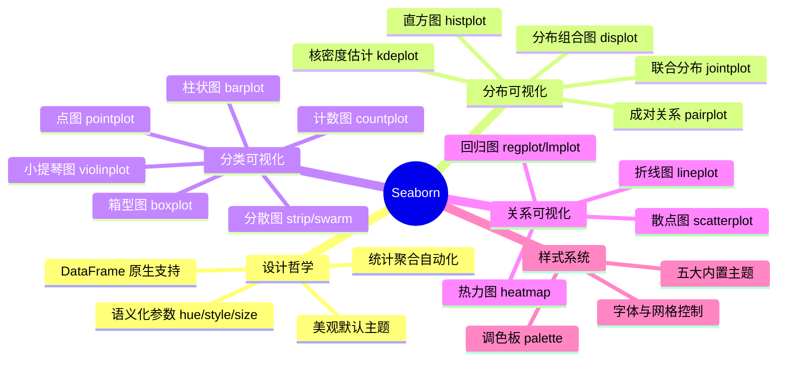

# Seaborn 统计图表

Seaborn 是基于 Matplotlib 的高级统计可视化库，它将常见统计图表封装为**一行代码即可调用**的 API，同时提供美观的默认样式和 DataFrame 原生支持。在探索性数据分析（EDA）阶段，Seaborn 能显著提升你的工作效率——从"调参两小时"到"出图五秒钟"。

> 阅读提示
>
> - 如果你想了解 Seaborn 的设计哲学和适用场景，从 [Seaborn vs Matplotlib](#seaborn-vs-matplotlib) 开始
> - 如果你想快速画分布图，跳到 [分布可视化](#分布可视化)
> - 如果你想做分类数据对比，直接看 [分类可视化](#分类可视化)
> - 如果你想分析变量关系，看 [关系可视化](#关系可视化)
> - 如果你遇到样式问题，参考 [样式与主题](#样式与主题)
> - 本文基于 **Python 3.12+**，Seaborn 0.13.x，Matplotlib 3.8+
> - 前置知识：[Matplotlib 数据可视化实战](05-Matplotlib数据可视化实战)（理解 Figure/Axes 概念）

## 开篇概述 + 知识体系图



### 为什么选择 Seaborn？

| 特性 | Matplotlib | Seaborn | 优势场景 |
|------|-----------|---------|---------|
| **API 复杂度** | 需手动配置 Axes/Artist | 一行函数调用 | 快速原型开发 |
| **默认样式** | 基础（需大量调参） | 出版级美学 | 直接用于报告 |
| **DataFrame 支持** | 需提取列再传入 | 直接传 `data=` 参数 | Pandas 工作流 |
| **统计功能** | 仅绘图，无统计计算 | 自动聚合/置信区间 | EDA 探索分析 |
| **多维度编码** | 手动循环绘制 | `hue`/`style`/`size` 参数 | 多变量可视化 |
| **定制灵活性** | 极高（底层 API） | 中等（高级封装） | 高度定制需求 |

::: tip 核心定位
Seaborn 不是 Matplotlib 的替代品，而是**互补工具**：用 Seaborn 快速探索数据、发现模式，再用 Matplotlib 精细调整细节用于最终交付。
:::

## Seaborn vs Matplotlib（何时用哪个？）

```mermaid
flowchart TD
    A[开始绘图任务] --> B{目标是什么?}
    B -- 快速探索/EDA --> C[✅ 选择 Seaborn]
    B -- 生产级报告/论文 --> D{是否需要高度定制?}
    D -- 是 --> E[⚠️ 用 Seaborn 出原型<br/>再用 Matplotlib 微调]
    D -- 否 --> F[✅ 选择 Seaborn]
    B -- 底层图形/动画 --> G[✅ 必须用 Matplotlib]

    C --> H[优势: 一行代码<br/>自动统计聚合<br/>美观默认样式]
    E --> I[工作流: sns.plot() →<br/>获取 Axes 对象 →<br/>plt.xxx() 微调]
    G --> J[场景: 自定义动画<br/>复杂子图布局<br/>非标准图表]

```

### 实际对比示例

**同一需求：按类别绘制分组散点图**

```python
# ❌ Matplotlib 方式：需要手动循环 + 图例管理
import matplotlib.pyplot as plt
import pandas as pd
import numpy as np

# 生成示例数据
np.random.seed(42)
df = pd.DataFrame({
    'x': np.random.randn(100),
    'y': np.random.randn(100),
    'category': np.random.choice(['A', 'B', 'C'], 100)
})

fig, ax = plt.subplots()
for cat in df['category'].unique():
    subset = df[df['category'] == cat]
    ax.scatter(subset['x'], subset['y'], label=cat, alpha=0.7)
ax.legend()
ax.set_xlabel('X 轴')
ax.set_ylabel('Y 轴')
plt.tight_layout()
plt.show()
```

```python
# ✅ Seaborn 方式：一行代码搞定
import seaborn as sns

sns.scatterplot(data=df, x='x', y='y', hue='category', alpha=0.7)
plt.title('分组散点图对比')  # 仍需借助 matplotlib 设置标题
plt.show()
```

::: warning 重要提醒
Seaborn **不会替代** Matplotlib 的以下操作：
- `plt.show()` / `plt.savefig()` 显示或保存图片
- `plt.title()` / `plt.xlabel()` / `plt.ylabel()` 标题和轴标签
- `plt.subplot()` / `fig.add_subplot()` 多子图布局
- `plt.legend()` 图例精细调整（虽然 Seaborn 会自动添加基础图例）

**最佳实践**：始终 `import matplotlib.pyplot as plt` 并配合使用。
:::

## Seaborn 设计哲学

### 1. DataFrame 原生支持

Seaborn 的函数签名统一接受 `data` 参数，直接接收 Pandas DataFrame，通过字符串引用列名：

```python
import seaborn as sns
import matplotlib.pyplot as plt

# 加载内置数据集
tips = sns.load_dataset('tips')

# ✅ 推荐：DataFrame + 列名字符串
sns.scatterplot(data=tips, x='total_bill', y='tip', hue='sex')

# ⚠️ 不推荐：手动提取数组（丢失元数据）
sns.scatterplot(x=tips['total_bill'], y=tips['tip'], hue=tips['sex'])
```

**优势**：
- 自动使用列名作为轴标签和图例标题
- 支持链式调用和管道操作
- 代码可读性更强，接近自然语言

### 2. 语义化参数系统

Seaborn 通过三个核心参数实现**多维数据编码**：

| 参数 | 作用 | 适用图表类型 | 示例值 |
|------|------|------------|--------|
| `hue` | 颜色编码（分类变量） | 几乎所有图表 | `'sex'`, `'day'` |
| `style` | 形状/线型编码（分类变量） | scatterplot, lineplot | `'smoker'`, `'time'` |
| `size` | 大小编码（数值/有序变量） | scatterplot, lineplot | `'size'`, `'total_bill'` |

```python
# 三维编码示例：颜色+形状+大小同时表达不同信息
sns.scatterplot(
    data=tips,
    x='total_bill',
    y='tip',
    hue='sex',        # 颜色区分性别
    style='smoker',   # 形状区分吸烟状态
    size='size',      # 大小编码用餐人数
    sizes=(20, 200),  # 控制大小范围
    palette='deep'   # 使用 deep 调色板
)
plt.title('消费金额与小费的多维关系')
plt.show()
```

### 3. 统计聚合自动化

许多 Seaborn 函数会自动执行统计计算，无需手动预处理：

- `barplot()` 默认计算均值并添加置信区间
- `lineplot()` 默认聚合重复 x 值并显示置信带
- `histplot()` 自动计算频数或密度

```python
# barplot 自动计算每组的平均小费 + 95% 置信区间
sns.barplot(data=tips, x='day', y='tip', hue='day', legend=False, palette='Blues')
plt.title('各日期的平均小费（含置信区间）')
plt.show()
```

::: info 细节说明
默认置信区间为 95%，可通过 `ci` 参数调整（如 `ci=68` 表示 1 个标准差，`ci=None` 关闭）。从 Seaborn 0.12 起，`errorbar` 参数替代了 `ci`。
:::

## 分布可视化

分布可视化用于理解单个或多个变量的数据分布特征，是 EDA 的第一步。

### 直方图与核密度估计（histplot + kde）

#### 基础直方图

```python
import seaborn as sns
import matplotlib.pyplot as plt
import numpy as np

# 生成正态分布数据
data = np.random.normal(loc=0, scale=1, size=1000)

# 基础直方图
sns.histplot(data=data, bins=30, kde=False, color='skyblue', edgecolor='black')
plt.title('正态分布直方图')
plt.xlabel('数值')
plt.ylabel('频数')
plt.show()
```

**关键参数说明**：

| 参数 | 类型 | 说明 | 示例值 |
|------|------|------|--------|
| `data` | array/DataFrame | 输入数据 | 数组或 DataFrame |
| `bins` | int/array | 分箱数量或边界 | `30`, `np.arange(0, 10, 0.5)` |
| `kde` | bool | 是否叠加核密度曲线 | `True`/`False` |
| `stat` | str | y 轴统计量 | `'count'`, `'frequency'`, `'density'`, `'probability'` |
| `color` | str | 填充颜色 | `'steelblue'`, `'#FF5733'` |
| `alpha` | float | 透明度 | `0.7` |

#### 直方图 + KDE 组合

```python
# 同时展示直方图和核密度估计
sns.histplot(
    data=data,
    bins=30,
    kde=True,
    color='purple',
    edgecolor='white',
    stat='density',  # y 轴显示概率密度
    alpha=0.6
)
plt.title('直方图 + 核密度估计 (KDE)')
plt.xlabel('数值')
plt.ylabel('密度')
plt.show()
```

::: tip 应用场景
- **数据离散化配合**：先用 `pd.cut()` 将连续变量分段，再用 `histplot` 展示各段分布
- **异常值检测**：观察分布尾部是否有离群点
- **分布类型判断**：判断数据是否符合正态分布、偏态分布等假设
:::

#### 多组分布对比

```python
# 按类别分组的直方图
tips = sns.load_dataset('tips')
sns.histplot(
    data=tips,
    x='total_bill',
    hue='sex',           # 按性别分组
    kde=True,
    element='step',      # 阶梯状填充
    stat='density',
    common_norm=False    # 各组独立归一化
)
plt.title('男女消费金额分布对比')
plt.xlabel('总账单 ($)')
plt.ylabel('密度')
plt.show()
```

### 分布组合图（displot/jointplot/kdeplot/pairplot）

#### displot：灵活的分布图接口

`displot` 是 Seaborn 的 figure-level 函数，可绘制多种分布图：

```python
# 直方图版本
sns.displot(data=tips, x='total_bill', col='sex', kde=True, height=4)

# 或核密度图版本
sns.displot(data=tips, x='total_bill', kind='kde', hue='sex', fill=True)

plt.show()
```

#### jointplot：联合分布 + 边缘分布

```python
# 展示两个变量的联合分布及各自的边缘分布
sns.jointplot(
    data=tips,
    x='total_bill',
    y='tip',
    kind='scatter',     # 可选: 'scatter', 'hex', 'kde', 'reg', 'hist'
    hue='sex',
    marginal_kws=dict(bins=25, fill=True, kde=True),
    height=6
)
plt.suptitle('账单与小费的联合分布', y=1.02)
plt.show()
```

**`kind` 参数选项**：

| 类型 | 说明 | 适用场景 |
|------|------|---------|
| `'scatter'` | 散点图 + 边缘直方图 | 通用场景 |
| `'hex'` | 六边形分箱热力图 | 大数据集（避免过密） |
| `'kde'` | 核密度等高线图 | 平滑分布展示 |
| `'reg'` | 散点图 + 回归线 | 线性关系探索 |
| `'hist'` | 二维直方图 | 离散化分布 |

#### pairplot：成对关系矩阵

```python
# 选取数值型列绘制成对关系图
iris = sns.load_dataset('iris')
sns.pairplot(
    data=iris,
    hue='species',          # 按物种着色
    diag_kind='kde',        # 对角线用 KDE
    corner=True,            # 只绘制下三角（节省空间）
    plot_kws={'alpha': 0.6},
    height=2.5
)
plt.suptitle('鸢尾花数据集成对关系', y=1.02)
plt.show()
```

::: warning 性能注意
`pairplot` 会绘制 n×n 个子图（n 为变量数）。当变量超过 6-8 个时，建议：
1. 先筛选重要变量
2. 使用 `corner=True` 减半绘图数量
3. 或改用手动组合 `PairGrid` 进行选择性绘制
:::

### 箱型图与小提琴图（boxplot/violinplot）

#### 箱型图：五数概括 + 异常值

```python
# 基础箱型图
sns.boxplot(
    data=tips,
    x='day',
    y='total_bill',
    hue='sex',
    palette='Set2',
    width=0.6,
    fliersize=3       # 异常值点大小
)
plt.title('各日期消费金额的箱型图')
plt.xlabel('星期')
plt.ylabel('总账单 ($)')
plt.legend(title='性别')
plt.show()
```

**箱型图解读**：

```
        ┌─────────────┐
        │     ════     │  ← 中位数 (median)
   ─────┤             ├── Q1 (25% 分位)
        │             │
        │             ├── Q3 (75% 分位)
        └─────────────┘
              │ │            ← 异常值 (outliers)
```

| 元素 | 定义 | 统计意义 |
|------|------|---------|
| 盒体 | Q1 到 Q3 的范围 (IQR) | 数据的中间 50% |
| 中位数线 | 第 50% 分位数 | 数据中心趋势 |
| 须线 | Q1-1.5×IQR 到 Q3+1.5×IQR | 合理范围边界 |
| 离群点 | 超出须线的点 | 可能的异常值 |

#### 小提琴图：分布形状 + 箱型结构

```python
# 小提琴图结合箱型图
sns.violinplot(
    data=tips,
    x='day',
    y='total_bill',
    hue='sex',
    split=True,         # 左右拆分（节省空间）
    inner='quart',      # 内部显示四分位数（合法值：box/quart/point/stick）
    palette='muted'
)
plt.title('各日期消费金额的小提琴图')
plt.show()
```

::: tip 如何选择？
- **箱型图**：关注中位数、四分位数和异常值，适合正式报告
- **小提琴图**：关注整体分布形状（双峰、偏态），适合 EDA 探索
- 可两者结合：先 violinplot 发现分布特征，再用 boxplot 精确展示统计量
:::

## 分类可视化

分类可视化用于比较不同类别的统计指标，是 A/B 测试、实验分析的核心工具。

### 柱状图（barplot —— 均值/求和/计数）

#### 均值柱状图（默认行为）

```python
import numpy as np

# barplot 默认计算均值 + 95% 置信区间
sns.barplot(
    data=tips,
    x='day',
    y='total_bill',
    hue='sex',
    estimator=np.mean,  # 聚合函数（默认均值）
    errorbar=('ci', 95),  # 置信区间设置
    capsize=0.1,        # 误差棒端点大小
    palette='viridis',
    width=0.8
)
plt.title('各日期平均消费金额（按性别）')
plt.ylabel('平均账单 ($)')
plt.show()
```

**常用聚合函数**：

| 场景 | `estimator` 参数 | 说明 |
|------|-----------------|------|
| 平均值 | `np.mean`（默认） | 典型值趋势 |
| 中位数 | `np.median` | 抗异常值 |
| 求和 | `np.sum` | 总量对比 |
| 计数 | `len` 或自定义 | 频次统计 |
| 标准差 | `np.std` | 波动性分析 |

#### 计数柱状图

```python
# 方法一：使用 countplot（更简洁）
sns.countplot(data=tips, x='day', hue='sex', palette='pastel')

# 方法二：barplot + estimator=len
# sns.barplot(data=tips, x='day', y='total_bill', hue='sex', estimator=len)

plt.title('各日期顾客数量（按性别）')
plt.ylabel('计数')
plt.show()
```

#### 水平柱状图

```python
# orient='h' 切换为水平方向
sns.barplot(
    data=tips.sort_values('total_bill'),
    y='day',           # y 轴放分类变量
    x='total_bill',    # x 轴放数值变量
    orient='h',
    hue='day', legend=False,  # 0.13 起 palette 需配合 hue
    palette='Blues_r',
    errorbar=None      # 关闭误差棒
)
plt.title('各日期消费总额排名')
plt.xlabel('总金额 ($)')
plt.show()
```

::: warning 常见误区
`barplot` 的 **y 轴不是原始值的总和**，而是**聚合后的统计量**（默认为均值）。如果你期望看到总和，必须显式设置 `estimator=np.sum`。
:::

### 分类散点图（stripplot/swarmplot）

#### stripplot：带抖动的分类散点

```python
# 基础 stripplot（点可能重叠）
sns.stripplot(
    data=tips,
    x='day',
    y='total_bill',
    hue='sex',
    jitter=True,       # 添加随机抖动避免完全重叠
    dodge=True,        # 按 hue 分组错开
    size=5,
    alpha=0.6,
    palette='dark'
)
plt.title('消费金额分布（抖动散点图）')
plt.show()
```

#### swarmplot：避免重叠的蜂群图

```python
# swarmplot 自动排列点避免重叠（大数据集较慢）
sns.swarmplot(
    data=tips,
    x='day',
    y='total_bill',
    hue='sex',
    dodge=True,
    size=5,
    palette='Set1'
)
plt.title('消费金额分布（蜂群图）')
plt.show()
```

::: tip 选择建议
- **stripplot**：数据量大（>500 点）或只需要快速预览
- **swarmplot**：数据量适中（<200 点/组）且需要精确观察每个点的分布
- 两者常叠加在 boxplot/violinplot 上方，提供原始数据分布信息
:::

### 点图（pointplot）

点图通过点和连线展示统计量的变化趋势，特别适合**时间序列或多层级分类**：

```python
sns.pointplot(
    data=tips,
    x='day',
    y='total_bill',
    hue='sex',
    dodge=0.3,          # 分组间距
    markers=['o', 's'],  # 标记形状
    linestyles=['-', '--'],
    errorbar=('ci', 95), # 置信区间（ci 参数自 0.12 起由 errorbar 取代）
    palette='coolwarm'
)
plt.title('平均消费金额变化趋势')
plt.ylabel('平均账单 ($)')
plt.show()
```

**点图 vs 柱状图**：

| 维度 | 点图 (pointplot) | 柱状图 (barplot) |
|------|-----------------|-----------------|
| **重点** | 变化趋势和差异显著性 | 绝对值大小对比 |
| **视觉权重** | 低（只显示统计量） | 高（填充面积大） |
| **适用场景** | 多组对比、交互作用分析 | 单层分类汇总 |
| **误导风险** | 低（y 轴从 0 开始不影响解读） | 高（截断 y 轴会夸大差异） |

## 关系可视化

关系可视化用于探索变量之间的相关性、因果关系和数据模式，是统计分析的核心。

### 散点图（scatterplot —— 多维编码）

#### 基础散点图

```python
sns.scatterplot(
    data=tips,
    x='total_bill',
    y='tip',
    alpha=0.7,
    s=100              # 统一大小
)
plt.title('消费金额与小费的关系')
plt.xlabel('总账单 ($)')
plt.ylabel('小费 ($)')
plt.grid(True, alpha=0.3)
plt.show()
```

#### 多维编码散点图

```python
# 颜色 + 形状 + 大小三维度编码
sns.scatterplot(
    data=tips,
    x='total_bill',
    y='tip',
    hue='sex',           # 颜色 → 性别
    style='smoker',      # 形状 → 吸烟状态
    size='size',         # 大小 → 用餐人数
    sizes=(50, 300),     # 大小映射范围
    palette='deep',      # 配色方案
    edgecolor='black',   # 点边缘色
    linewidth=0.5        # 边缘宽度
)
plt.title('消费行为的多维可视化')
plt.legend(bbox_to_anchor=(1.05, 1), loc='upper left')  # 图例放到外部
plt.tight_layout()
plt.show()
```

**应用场景**：

| 场景 | 编码策略 | 示例 |
|------|---------|------|
| 相关性分析 | x/y 两轴 | 账单 vs 小费 |
| 聚类发现 | hue 颜色分组 | 按性别/时段分组 |
| 异常值检测 | 观察离群点 | 识别高额低小费客户 |
| 四维关系 | hue + style + size | 账单/小费/性别/人数 |

### 折线图（lineplot —— 聚合与置信区间）

#### 时间序列折线图

```python
# 加载航班数据
flights = sns.load_dataset('flights')

# 按月份绘制乘客数量趋势
sns.lineplot(
    data=flights,
    x='month',
    y='passengers',
    hue='year',           # 按年份分组
    style='year',         # 不同线型
    markers=True,         # 显示标记点
    dashes=False,         # 使用实线
    err_style='band',     # 置信区间显示方式（'band' 或 'bars'）
    errorbar=('ci', 95)
)
plt.title('每月乘客数量变化趋势（1949-1960）')
plt.xticks(rotation=45)
plt.ylabel('乘客数 (千人)')
plt.show()
```

#### 聚合与置信区间

```python
# 当 x 有重复值时，lineplot 自动聚合
sns.lineplot(
    data=tips,
    x='size',             # 用餐人数（有重复）
    y='total_bill',
    err_style='band',     # 置信带
    errorbar=('sd'),      # 显示标准差而非 CI
    marker='o'
)
plt.title('用餐人数 vs 平均消费（含标准差）')
plt.xlabel('用餐人数')
plt.ylabel('平均账单 ($)')
plt.show()
```

::: info 聚合机制
当 x 轴存在重复值时，`lineplot` 默认对每个 x 值对应的多个 y 值取**均值**，并绘制置信区间。这使其天然适合**聚合时间序列**或**实验结果展示**。
:::

### 热力图（heatmap —— 相关性/混淆矩阵）

#### 相关系数矩阵

```python
import pandas as pd

# 计算数值列的相关系数矩阵
numeric_cols = tips.select_dtypes(include=[np.number])
corr_matrix = numeric_cols.corr()

# 绘制热力图
sns.heatmap(
    corr_matrix,
    annot=True,           # 显示数值标注
    fmt='.2f',            # 数值格式（保留2位小数）
    cmap='RdYlBu_r',      # 红-黄-蓝配色（_r 反转）
    center=0,             # 颜色中心点
    square=True,          # 正方形单元格
    linewidths=0.5,       # 格线宽度
    cbar_kws={'shrink': 0.8}  # 颜色条缩放
)
plt.title('数值变量相关系数热力图')
plt.show()
```

**输出示例解释**：

```
            total_bill    tip      size
total_bill    1.00      0.68     0.59
tip           0.68      1.00     0.49
size          0.59      0.49     1.00
```

- total_bill 与 tip 相关系数 0.68：**强正相关**（消费越高，小费越多）
- size 与 tip 相关系数 0.49：**中等正相关**（人越多，总小费可能更高）

#### 混淆矩阵（分类模型评估）

```python
# 模拟混淆矩阵数据
confusion_mat = np.array([
    [50, 5, 2],   # 真实A: 预测A=50, B=5, C=2
    [3, 45, 7],   # 真实B: 预测A=3, B=45, C=7
    [1, 4, 43]    # 真实C: 预测A=1, B=4, C=43
])

labels = ['Class A', 'Class B', 'Class C']

plt.figure(figsize=(8, 6))
sns.heatmap(
    confusion_mat,
    annot=True,
    fmt='d',              # 整数格式
    cmap='Blues',
    xticklabels=labels,
    yticklabels=labels,
    cbar_kws={'label': '样本数'}
)
plt.title('分类模型混淆矩阵')
plt.xlabel('预测标签')
plt.ylabel('真实标签')
plt.show()
```

#### 自定义矩阵热力图

```python
# 创建透视表并可视化
pivot_table = tips.pivot_table(
    values='total_bill',
    index='day',
    columns='time',
    aggfunc='mean'
)

sns.heatmap(
    pivot_table,
    annot=True,
    fmt='.1f',
    cmap='YlOrRd',
    linewidths=1,
    annot_kws={'size': 14, 'weight': 'bold'}
)
plt.title('各日期各时段平均消费热力图')
plt.show()
```

**热力图应用场景总结**：

| 场景 | 数据形式 | 关键参数 | 解读要点 |
|------|---------|---------|---------|
| 相关性分析 | 相关系数矩阵 | `center=0`, `square=True` | 颜色深浅表示相关强度 |
| 模型评估 | 混淆矩阵 | `fmt='d'`, `cmap='Blues'` | 对角线越亮越好 |
| 参数调优 | 超参数网格结果 | `annot=True` | 寻找最优区域 |
| 缺失值分析 | 缺失值布尔矩阵 | `cmap='binary'` | 识别缺失模式 |
| 地理数据 | 经纬度网格 | `cmap='terrain'` | 空间热点识别 |

### 联合分布图（jointplot/pairplot）

已在 [分布组合图](#分布组合图displotjointplotkdeplotpairplot) 详细介绍，此处补充回归变体：

```python
# 带回归线的联合分布图
sns.jointplot(
    data=tips,
    x='total_bill',
    y='tip',
    kind='reg',          # 添加回归线 + 置信带
    hue='sex',
    scatter_kws={'alpha': 0.6},
    height=6
)
plt.suptitle('线性回归拟合', y=1.02)
plt.show()
```

## 样式与主题

### 五大内置主题

Seaborn 提供 5 种预设主题，通过 `sns.set_theme()` 或 `sns.set_style()` 切换：

```python
import seaborn as sns
import matplotlib.pyplot as plt
import numpy as np

# 生成测试数据
data = np.random.randn(100, 5)

# 主题 1: darkgrid（默认） - 深灰背景 + 白色网格
sns.set_style("darkgrid")
plt.figure(figsize=(10, 6))
sns.histplot(data[:, 0], kde=True)
plt.title('主题: darkgrid（默认）')
plt.show()

# 主题 2: whitegrid - 白色背景 + 灰色网格
sns.set_style("whitegrid")
# ... 同样绘图代码

# 主题 3: dark - 深灰背景，无网格
sns.set_style("dark")

# 主题 4: white - 白色背景，无网格（简洁风格）
sns.set_style("white")

# 主题 5: ticks - 白色背景 + 坐标轴刻度线
sns.set_style("ticks")

# 重置为默认
sns.set_theme()  # 恢复 darkgrid
```

**主题视觉效果对比**：

| 主题 | 背景 | 网格 | 适用场景 |
|------|------|------|---------|
| `darkgrid` | 深灰色 (#eaeaf2) | 白色线条 | **默认推荐**，通用场景 |
| `whitegrid` | 白色 | 灰色线条 | 学术论文、正式报告 |
| `dark` | 深灰色 | 无 | 演示文稿、暗色背景 |
| `white` | 白色 | 无 | 极简风格、印刷品 |
| `ticks` | 白色 | 无，有刻度线 | 精确读数需求 |

::: tip 全局设置技巧
```python
# 方法一：一次性设置全局主题（推荐）
sns.set_theme(
    style="whitegrid",
    palette="deep",
    font="sans-serif",
    font_scale=1.2,
    rc={"figure.figsize": (10, 6)}
)

# 方法二：临时上下文管理器（不影响全局）
with sns.axes_style("white"):
    sns.barplot(...)  # 仅此图使用 white 风格

# 方法三：重置所有自定义
sns.reset_defaults()
sns.set_theme()
```
:::

### 调色板（palette）

Seaborn 提供三类调色板，覆盖不同数据类型：

#### 1. 分类调色板（Categorical）

适用于**无序分类变量**（性别、城市、产品类别等）：

```python
# 内置分类调色板
palettes_categorical = ['deep', 'muted', 'bright', 'pastel', 'dark', 'colorblind']

# 使用示例
sns.barplot(data=tips, x='day', y='total_bill', hue='sex', palette='colorblind')
plt.title('分类调色板: colorblind（色盲友好）')
plt.show()
```

**分类调色板特点**：
- 颜色之间**视觉距离均匀**
- `colorblind` 经过色盲友好优化
- 通常包含 6-10 种不同颜色

#### 2. 顺序调色板（Sequential）

适用于**有序数值**（从低到高的渐变）：

```python
# 顺序调色板（浅→深）
palettes_sequential = [
    'rocket', 'mako', 'flare', 'crest', 'viridis', 'Blues', 'Reds', 'Greens'
]

# 使用示例
sns.heatmap(corr_matrix, cmap='rocket', annot=True)
plt.title('顺序调色板: rocket（浅粉→深紫）')
plt.show()
```

#### 3. 发散调色板（Diverging）

适用于**有中心点的双向数据**（相关系数、偏差等）：

```python
# 发散调色板（低-中-高，中间为中性色）
palettes_diverging = [
    'vlag', 'icefire', 'RdBu_r', 'PRGn', 'BrBG', 'coolwarm'
]

# 使用示例（相关性热力图首选）
sns.heatmap(corr_matrix, cmap='coolwarm', center=0, annot=True, fmt='.2f')
plt.title('发散调色板: coolwarm（红-白-蓝）')
plt.show()
```

#### 自定义调色板

```python
# 从列表创建
custom_palette = ['#FF6B6B', '#4ECDC4', '#45B7D1', '#96CEB4']
sns.barplot(..., palette=custom_palette)

# 从 Colormap 创建
sns.heatmap(..., cmap=sns.color_palette("light:b", as_cmap=True))

# 使用 husl 色彩空间生成 N 种可区分颜色
palette = sns.color_palette("husl", 8)  # 生成 8 种颜色
```

**调色板速查表**：

| 数据类型 | 推荐调色板 | 示例 |
|---------|-----------|------|
| 分类（≤6 类） | `deep`, `pastel` | 性别、部门 |
| 分类（>6 类） | `husl`, `tab10` | 产品线、地区 |
| 顺序（低→高） | `Blues`, `viridis` | 温度、销售额 |
| 发散（负-零-正） | `RdBu_r`, `coolwarm` | 相关系数、涨跌幅 |
| 循环（周期性） | `twilight`, `hsv` | 时段、方向 |

## 常见陷阱

### 陷阱 1：混淆 countplot 和 barplot

```python
# ❌ 错误：想显示计数但用了 barplot（默认显示均值）
sns.barplot(data=df, x='category', y='value')  # y 轴是均值！

# ✅ 正确：显示频次计数
sns.countplot(data=df, x='category')  # 自动计数

# 或者明确指定
sns.barplot(data=df, x='category', y='value', estimator=len)
```

**问题根源**：`barplot` 默认 `estimator=np.mean`，而初学者常误以为它像 Excel 一样自动求和或计数。

### 陷阱 2：忘记导入 matplotlib.pyplot

```python
import seaborn as sns  # ✅ 导入了 seaborn
# ❌ 但没有 import matplotlib.pyplot as plt

sns.scatterplot(data=df, x='x', y='y', hue='group')
plt.show()  # NameError: name 'plt' is not defined!
plt.title('我的图表')  # 同样报错
```

**解决方案**：养成习惯，每次使用 Seaborn 都配套导入：

```python
import seaborn as sns
import matplotlib.pyplot as plt  # ✅ 必须导入
```

### 陷阱 3：figure-level 和 axes-level 函数混用

```python
# ❌ 问题：displot 是 figure-level 函数，返回 FacetGrid 对象
g = sns.displot(data=df, x='value', col='category')
plt.title('这个标题不会生效！')  # ❌ 因为 displot 自己创建了 Figure

# ✅ 解决方案一：使用 g 对象的方法
g.set_titles('{col_name}')
g.set_axis_labels('数值', '频数')

# ✅ 解决方案二：改用 axes-level 函数（如 histplot）
fig, axes = plt.subplots(1, 3, figsize=(15, 4))
for idx, cat in enumerate(df['category'].unique()):
    sns.histplot(data=df[df['category']==cat], x='value', ax=axes[idx])
    axes[idx].set_title(f'类别 {cat}')  # ✅ 可以正常设置
plt.tight_layout()
plt.show()
```

**函数级别对照表**：

| 图表类型 | figure-level | axes-level |
|---------|-------------|------------|
| 分布图 | `displot()` | `histplot()`, `kdeplot()`, `ecdfplot()` |
| 联合分布 | `jointplot()` | - |
| 成对关系 | `pairplot()` | - |
| 分类图 | `catplot()` | `barplot()`, `boxplot()`, `violinplot()`, `stripplot()` |
| 关系图 | `relplot()` | `scatterplot()`, `lineplot()` |
| 热力图 | - | `heatmap()` |
| 回归图 | `lmplot()` | `regplot()` |

::: warning 选择原则
- **需要子图分面（col/row 参数）** → 用 figure-level 函数
- **需要嵌入现有 Axes 或精细控制** → 用 axes-level 函数
- **不确定时** → 优先用 axes-level（灵活性更高）
:::

### 陷阱 4：大数据集性能问题

```python
# ❌ 问题：100万行数据的 swarmplot 可能卡死
sns.swarmplot(data=huge_df, x='category', y='value')  # O(n²) 复杂度！

# ✅ 替代方案
# 方案一：采样
sample_df = huge_df.sample(n=1000, random_state=42)
sns.stripplot(data=sample_df, x='category', y='value', jitter=True)

# 方案二：改用箱型图/小提琴图（不绘制每个点）
sns.boxplot(data=huge_df, x='category', y='value')

# 方案三：使用 hexbin 或 KDE
sns.jointplot(data=huge_df, x='x_var', y='y_var', kind='hex')
```

### 陷阱 5：调色板与数据类型不匹配

```python
# ❌ 问题：有序数据用了分类调色板（无法体现高低顺序）
sns.heatmap(correlation_matrix, cmap=sns.color_palette('deep'))  # 分类调色板无法体现高低顺序！

# ✅ 正确：相关性用发散调色板
sns.heatmap(correlation_matrix, cmap='coolwarm', center=0)

# ❌ 问题：分类数据用了顺序调色板（暗示不存在的大小关系）
sns.barplot(data=df, x='category', y='value', hue='group', palette='Blues')

# ✅ 正确：分类变量用分类调色板
sns.barplot(data=df, x='category', y='value', hue='group', palette='Set2')
```

### 陷阱 6：中文显示乱码

```python
# ❌ 问题：中文显示为方块 □□□
sns.barplot(x=['北京', '上海', '广州'], y=[100, 150, 120])

# ✅ 解决方案：配置中文字体
import matplotlib.pyplot as plt

plt.rcParams['font.sans-serif'] = ['SimHei', 'Arial Unicode MS', 'PingFang SC']
plt.rcParams['axes.unicode_minus'] = False  # 解决负号显示问题

# 然后再绘图
sns.barplot(x=['北京', '上海', '广州'], y=[100, 150, 120])
plt.xlabel('城市')
plt.show()
```

## 术语表

| 术语 | 英文 | 定义 |
|------|------|------|
| **Seaborn** | Statistical Data Visualization Library | 基于 Matplotlib 的高级统计可视化 Python 库 |
| **核密度估计** | Kernel Density Estimation (KDE) | 用平滑曲线估计数据概率密度分布的非参数方法 |
| **箱型图** | Box Plot | 通过五数概括（最小值、Q1、中位数、Q3、最大值）展示数据分布的图表 |
| **小提琴图** | Violin Plot | 结合箱型图和核密度估计的分布可视化方法 |
| **热力图** | Heatmap | 用颜色深浅表示矩阵数值大小的二维图表 |
| **置信区间** | Confidence Interval (CI) | 统计量可能落入的区间范围，通常用 95% CI |
| **调色板** | Palette | 预定义的颜色集合，用于图表元素着色 |
| **分面** | Faceting | 将数据按类别拆分为多个子图的绘图技术 |
| **聚合** | Aggregation | 将多值汇总为单一统计量（如均值、求和）的操作 |
| **抖动** | Jitter | 给散点添加微小随机偏移以减少重叠的技术 |
| **蜂群图** | Swarm Plot | 自动排列散点避免重叠的分类散点图 |
| **边缘分布** | Marginal Distribution | 在联合分布图中沿坐标轴显示的单变量分布 |
| **成对图** | Pair Plot | 展示数据集中所有变量两两关系的矩阵图 |
| **发散配色** | Diverging Colormap | 以中性色为中心向两端渐变的颜色方案 |
| **顺序配色** | Sequential Colormap | 从浅到深单向渐变的颜色方案 |
| **Figure-Level 函数** | Figure-Level Function | Seaborn 中自行创建 Figure 的函数（如 displot, pairplot） |
| **Axes-Level 函数** | Axes-Level Function | Seaborn 中需要在已有 Axes 上绘图的函数（如 histplot, scatterplot） |
| **语义映射** | Semantic Mapping | 通过 hue/style/size 参数将数据变量映射到图形属性的过程 |
| **EDA** | Exploratory Data Analysis | 通过统计分析和可视化初步理解数据特征的探索过程 |
| **IQR** | Interquartile Range | 四分位距，Q3-Q1，衡量数据分散程度 |

## FAQ

**Q1: Seaborn 和 Plotly 应该选哪个？**

- **静态报告/论文** → 选 Seaborn（矢量输出质量高，易于嵌入 LaTeX/PDF）
- **交互式仪表盘/Web 应用** → 选 Plotly（支持缩放、悬停、筛选）
- **Jupyter Notebook 探索** → 两者都可，Plotly 更直观但导出稍复杂

**Q2: 如何保存 Seaborn 图表为高清图片？**

```python
# 保存为 PNG（300 DPI 用于打印）
plt.savefig('figure.png', dpi=300, bbox_inches='tight')

# 保存为 PDF（矢量格式，无损缩放）
plt.savefig('figure.pdf', format='pdf', bbox_inches='tight')

# 保存为 SVG（网页嵌套）
plt.savefig('figure.svg', format='svg', bbox_inches='tight')
```

**Q3: 如何在同一图中组合多种 Seaborn 图表？**

```python
# 利用 axes-level 函数的 ax 参数
fig, ax = plt.subplots(figsize=(10, 6))

# 先绘制箱型图
sns.boxplot(data=tips, x='day', y='total_bill', ax=ax, color='lightgray')

# 再叠加散点图
sns.stripplot(data=tips, x='day', y='total_bill', ax=ax, color='darkred', alpha=0.3)

plt.title('箱型图 + 散点图组合')
plt.show()
```

**Q4: Seaborn 支持哪些内置数据集？**

Seaborn 提供多个经典数据集用于学习和测试：

| 数据集 | 内容 | 变量数 | 适用场景 |
|-------|------|--------|---------|
| `tips` | 餐厅小费记录 | 7 | 分类/关系可视化 |
| `iris` | 鸢尾花测量数据 | 5 | 分类/分布/聚类 |
| `titanic` | 泰坦尼克号乘客名单 | 15 | 缺失值处理/生存分析 |
| `flights` | 1949-1960 航班数据 | 3 | 时间序列折线图 |
| `diamonds` | 钻石价格与属性 | 10 | 回归/多变量分析 |
| `anscombe` | Anscombe 四重奏 | 3 | 统计陷阱演示 |

加载方式：`data = sns.load_dataset('dataset_name')`

**Q5: 如何自定义 Seaborn 图表的字体大小？**

```python
# 全局设置
sns.set_theme(font_scale=1.5)  # 所有文字放大 1.5 倍

# 或针对特定元素
context_settings = {
    'paper': {'font.size': 12, 'axes.labelsize': 14},
    'notebook': {'font.size': 10, 'axes.labelsize': 12},
    'talk': {'font.size': 18, 'axes.labelsize': 20},
    'poster': {'font.size': 24, 'axes.labelsize': 28}
}

sns.set_context('talk', rc=context_settings['talk'])
```

**Q6: Seaborn 图表如何嵌入到 Pandas Pipeline 中？**

```python
# 结合 pipe 进行链式操作
(tips
 .groupby('day')['total_bill']
 .mean()
 .reset_index()
 .pipe(lambda df: sns.barplot(data=df, x='day', y='total_bill', palette='viridis'))
)
plt.title('Pipeline 中的可视化')
plt.show()
```

## 总结

Seaborn 作为 Matplotlib 的高层封装，其核心价值在于：

1. **效率提升**：一行代码完成统计聚合 + 置信区间 + 多维编码
2. **美学保证**：出厂即用的出版级样式，告别"Matplotlib 默认丑"
3. **数据友好**：原生 DataFrame 支持，符合数据分析工作流思维
4. **统计导向**：自动计算统计量，降低 EDA 门槛

**学习路径建议**：


**下一步行动**：
- 动手实践：用 `tips` 数据集复现本文所有代码示例
- 进阶学习：探索 [Seaborn 官方画廊](https://seaborn.pydata.org/examples/index.html) 获取更多灵感
- 项目实战：将 Seaborn 应用于你的真实数据分析项目，体验效率提升

---

> 📖 **延伸阅读**：
> - [Matplotlib 数据可视化实战](05-Matplotlib数据可视化实战) — 理解底层图形对象
> - [Pandas 与 NumPy 策略回测](../../05-数据科学/07-量化金融/02-Pandas与NumPy策略回测) — 数据处理实战
> - [Seaborn 官方文档](https://seaborn.pydata.org/) — API 完整参考
> - [Python 可视化最佳实践](https://matplotlib.org/stable/tutorials/introductory/customizing.html) — 样式定制指南

## 版本差异（Seaborn 0.12/0.13 → 当前）

| 特性 | 本文编写时 | 当前 |
|------|-----------|------|
| 版本基线 | 0.12.x / 0.13.x | 0.13.x 为最新稳定版 |
| 对象接口 | `sns.displot()` 等 | 0.13 支持 `objects` 接口（`sns.Plot`）；经典 API 不变 |
| 调色板 | `hls`/`husl` | 0.13 默认调色板微调；`color_palette()` 参数不变 |
| 依赖 | matplotlib 3.x | 0.13 要求 matplotlib 3.4+，Python 3.8+ |

> Seaborn 的统计绘图 API（relplot/catplot/distplot 系列）保持稳定，本文示例在 0.13.x 中直接可用。
