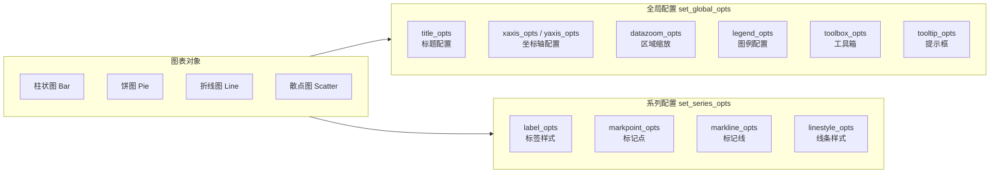
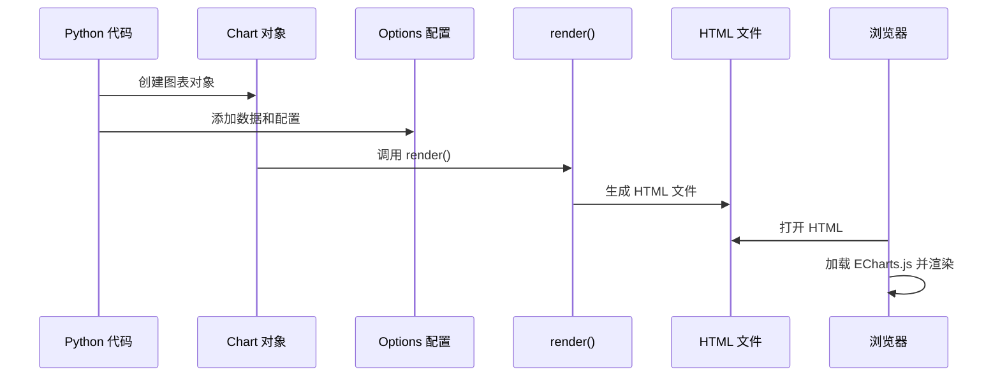
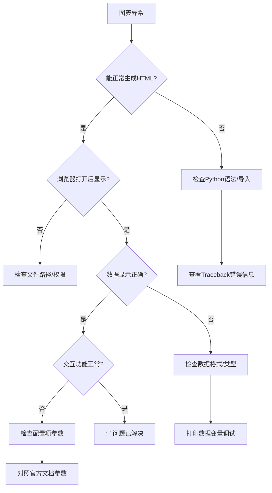

# PyEcharts 交互式图表

## 开篇概述

::: tip 为什么选择 PyEcharts？

PyEcharts 是 Python 对 **ECharts**（由百度开源、现属 Apache 基金会）的封装，能够生成**交互式 Web 图表（HTML）**。与 Matplotlib 的静态图片输出不同，PyEcharts 生成的图表支持鼠标悬停提示、图例筛选、区域缩放等丰富的交互功能，特别适合构建数据看板和交互式报告。

:::

### PyEcharts 核心优势

| 特性 | Matplotlib | PyEcharts | Plotly |
|------|-----------|-----------|--------|
| **输出格式** | 静态图片 (PNG/PDF/SVG) | 交互式 HTML | 交互式 HTML |
| **交互能力** | 几乎无 | 强大（缩放/筛选/提示） | 较强 |
| **修改成本** | 高（需重新渲染） | 低（即时变化） | 中 |
| **官方案例库** | 丰富 | 极其丰富 | 丰富 |
| **学习曲线** | 平缓 | 中等 | 中等 |
| **适用场景** | 论文/出版 | 数据看板/Web展示 | 科学计算/Jupyter |
| **中文支持** | 需配置 | 原生支持 | 良好 |
| **性能（大数据量）** | 一般 | 优秀（WebGL加速） | 优秀 |

### PyEcharts 架构体系

```mermaid
graph TB
    A[Python 代码] --> B[PyEcharts API]
    B --> C[配置项 Options]
    C --> D[全局配置 GlobalOpts]
    C --> E[系列配置 SeriesOpts]
    D --> D1[标题 Title]
    D --> D2[坐标轴 Axis]
    D --> D3[图例 Legend]
    D --> D4[工具箱 Toolbox]
    D --> D5[区域缩放 DataZoom]
    E --> E1[标签 Label]
    E --> E2[标记点 MarkPoint]
    E --> E3[线条样式 LineStyle]
    E --> E4[面积样式 AreaStyle]
    B --> F[render() 方法]
    F --> G[HTML 文件]
    G --> H[ECharts.js 引擎渲染]
    H --> I[交互式 Web 图表]
```

### 配置层次结构



---

## 快速上手

### 安装与环境准备

```bash
# 安装 PyEcharts
pip install pyecharts

# 验证安装
python -c "import pyecharts; print(pyecharts.__version__)"
```

::: warning 版本兼容性
PyEcharts v1.x 与 v0.x 版本 API 完全不同。本文档基于 **v1.9+ / 2.x** 版本编写，请确保安装最新版本（当前稳定版为 2.x）。
:::

### 渲染机制：HTML 输出

PyEcharts 的核心工作流程：



**基本操作模式：**

```python
from pyecharts.charts import Bar
from pyecharts import options as opts

# 第一步：创建图表对象
bar = Bar()

# 第二步：添加数据
bar.add_xaxis(["衬衫", "羊毛衫", "雪纺衫", "裤子", "高跟鞋", "袜子"])
bar.add_yaxis("销量", [5, 20, 36, 10, 75, 90])

# 第三步：设置全局配置并渲染
bar.set_global_opts(
    title_opts=opts.TitleOpts(title="主标题", subtitle="副标题")
)
bar.render("my_chart.html")  # 生成 HTML 文件
```

### 链式调用风格

PyEcharts 支持链式调用，代码更简洁优雅：

```python
from pyecharts.charts import Bar
from pyecharts import options as opts

# 链式写法：一气呵成
(
    Bar()
    .add_xaxis(["衬衫", "羊毛衫", "雪纺衫", "裤子", "高跟鞋", "袜子"])
    .add_yaxis("销量A", [5, 20, 36, 10, 75, 90])
    .add_yaxis("销量B", [15, 25, 16, 20, 35, 40])
    .set_global_opts(
        title_opts=opts.TitleOpts(title="销售数据"),
        xaxis_opts=opts.AxisOpts(name="产品"),
        yaxis_opts=opts.AxisOpts(name="销量"),
    )
    .render("chain_chart.html")
)
```

::: info 设计理念
链式调用的好处：
- **代码紧凑**：减少中间变量
- **逻辑清晰**：从上到下阅读即执行顺序
- **易于复制粘贴**：适合快速原型开发
:::

### 基础图表模板

以下是一个可直接复用的标准模板：

```python
from pyecharts import options as opts
from pyecharts.charts import Bar
import os

def create_bar_chart():
    """生成基础柱状图"""
    # 数据准备
    categories = ["一月", "二月", "三月", "四月", "五月", "六月"]
    values_1 = [120, 200, 150, 80, 70, 110]
    values_2 = [60, 140, 100, 60, 50, 90]

    # 创建图表
    bar = (
        Bar()
        .add_xaxis(categories)
        .add_yaxis("系列A", values_1)
        .add_yaxis("系列B", values_2)
        .set_global_opts(
            title_opts=opts.TitleOpts(
                title="月度销售对比",
                subtitle="2026年上半年",
                pos_left="center"
            ),
            tooltip_opts=opts.TooltipOpts(trigger="axis", axis_pointer_type="shadow"),
            legend_opts=opts.LegendOpts(pos_top="8%"),
            toolbox_opts=opts.ToolboxOpts(is_show=True),
            datazoom_opts=opts.DataZoomOpts(is_show=True),
        )
        .set_series_opts(label_opts=opts.LabelOpts(is_show=False))
    )

    # 渲染输出
    output_path = "basic_bar.html"
    bar.render(output_path)
    print(f"✅ 图表已生成: {os.path.abspath(output_path)}")
    return output_path

if __name__ == "__main__":
    create_bar_chart()
```

---

## 配置体系

PyEcharts 的配置系统分为两大类：**全局配置** 和 **系列配置**。

### 全局配置 set_global_opts

全局配置作用于整个图表，影响所有数据系列。

#### 1. 标题配置 title_opts

```python
title_opts=opts.TitleOpts(
    title="主标题",                    # 主标题文本
    subtitle="副标题",                 # 副标题文本
    title_link="https://example.com",  # 主标题点击跳转链接
    subtitle_link="...",               # 副标题链接
    pos_left="center",                 # 标题位置 left/center/right 或像素值
    pos_top="top",
    title_textstyle_opts=opts.TextStyleOpts(  # 标题文字样式
        color="#333",
        font_size=18,
        font_weight="bold"
    )
)
```

#### 2. 区域缩放 datazoom_opts

```python
datazoom_opts=opts.DataZoomOpts(
    is_show=True,                      # 是否显示滑动条
    type_="slider",                    # 类型：slider(滑块) / inside(内置)
    range_start=0,                     # 起始百分比
    range_end=100,                     # 结束百分比
)
```

#### 3. 坐标轴配置 xaxis_opts / yaxis_opts

```python
xaxis_opts=opts.AxisOpts(
    name="X轴名称",                    # 轴名称
    name_location="end",               # 名称位置
    name_gap=20,                       # 名称与轴距离
    type_="category",                  # 轴类型：category/value/time
    axislabel_opts=opts.LabelOpts(
        formatter="{value} 单位",       # 标签格式化
        rotate=30,                      # 标签旋转角度
        font_size=12,
    ),
)

yaxis_opts=opts.AxisOpts(
    name="Y轴名称",
    type_="value",                     # 数值型坐标轴
    splitline_opts=opts.SplitLineOpts(  # 分割线
        is_show=True,
        linestyle_opts=opts.LineStyleOpts(type_="dashed")
    ),
)
```

::: danger 关键提醒：散点图的坐标轴类型
散点图（Scatter）的 **x轴必须设置为 `type_='value'`**，否则无法正确显示散点分布！这是新手最常见的错误之一。
:::

#### 4. 其他常用全局配置

| 配置项 | 说明 | 常用参数 |
|--------|------|----------|
| `legend_opts` | 图例控制 | `pos_top`, `is_show`, `selected_mode` |
| `tooltip_opts` | 提示框 | `trigger`, `trigger_on`, `formatter` |
| `toolbox_opts` | 工具箱 | `is_show`, `feature` |
| `visualmap_opts` | 视觉映射 | `min_`, `max_`, `type_` |

### 系列配置 set_series_opts

系列配置针对具体的数据系列，可覆盖全局默认值。

```python
set_series_opts(
    label_opts=opts.LabelOpts(
        is_show=True,
        position="top",                # 标签位置：top/inside/left/right
        formatter="{c}",              # 格式化内容 {a}名{b}类{c}值{d}%
        font_size=12,
        color="#333",
    ),
    markpoint_opts=opts.MarkPointOpts(
        data=[
            opts.MarkPointItem(type_="max", name="最大值"),
            opts.MarkPointItem(type_="min", name="最小值"),
            opts.MarkPointItem(type_="average", name="平均值"),
        ]
    ),
    markline_opts=opts.MarkLineOpts(
        data=[opts.MarkLineItem(type_="average", name="均值线")]
    ),
)
```

### 常用配置项速查表

#### 标签格式化占位符

| 占位符 | 含义 | 适用场景 |
|--------|------|----------|
| `{a}` | 系列名称 | 多系列图表 |
| `{b}` | 类目名称 | X轴标签 |
| `{c}` | 数值 | 数据值 |
| `{d}` | 百分比 | 饼图/环形图 |
| `{@xxx}` | 维度字段名 | 自定义数据集 |

**示例：**

```python
# 饼图显示：名称 + 百分比
label_opts=opts.LabelOpts(formatter="{b}: {d}%")

# 柱状图显示数值
label_opts=opts.LabelOpts(formatter="{c}")

# 自定义多维度显示
label_opts=opts.LabelOpts(formatter="{a}<br/>{b}: {c}")
```

---

## 核心图表类型

### 柱状图 Bar

柱状图是最常用的统计图表之一，适用于分类数据的比较。

#### 基础柱状图

```python
from pyecharts.charts import Bar
from pyecharts import options as opts

bar = (
    Bar()
    .add_xaxis(["苹果", "香蕉", "橙子", "葡萄", "西瓜"])
    .add_yaxis("2025年销量", [120, 200, 80, 150, 300])
    .add_yaxis("2026年销量", [150, 180, 110, 170, 280])
    .set_global_opts(
        title_opts=opts.TitleOpts(title="水果销量对比"),
        yaxis_opts=opts.AxisOpts(name="销量（吨）"),
        toolbox_opts=opts.ToolboxOpts(is_show=True),
    )
    .render("bar_basic.html")
)
```

#### 堆叠柱状图

通过设置相同的 `stack` 参数实现数据堆叠：

```python
from pyecharts.charts import Bar
from pyecharts import options as opts

bar = (
    Bar()
    .add_xaxis(["Q1", "Q2", "Q3", "Q4"])
    .add_yaxis("线上渠道", [120, 200, 80, 150], stack="stack1")
    .add_yaxis("线下渠道", [60, 100, 50, 80], stack="stack1")  # 相同 stack 值
    .set_global_opts(
        title_opts=opts.TitleOpts(title="季度销售额（堆叠）"),
        yaxis_opts=opts.AxisOpts(name="金额（万元）"),
    )
    .set_series_opts(
        label_opts=opts.LabelOpts(is_show=True, position="inside")
    )
    .render("bar_stack.html")
)
```

::: tip 交互特性
点击图例可以控制对应系列的显隐——这就是 PyEcharts 交互性的直接体现！
:::

### 折线图 Line

折线图用于展示数据随时间的变化趋势。

```python
from pyecharts.charts import Line
from pyecharts import options as opts

line = (
    Line()
    .add_xaxis(["周一", "周二", "周三", "周四", "周五", "周六", "周日"])
    .add_yaxis(
        "访问量",
        [120, 200, 150, 80, 70, 110, 130],
        symbol="circle",           # 标记点形状：circle/rect/diamond/triangle
        symbol_size=10,            # 标记点大小
        linestyle_opts=opts.LineStyleOpts(
            width=3,               # 线宽
            color="#5470C6",       # 线条颜色
            type_="dashed",        # 线型：solid/dashed/dotted
        ),
        areastyle_opts=opts.AreaStyleOpts(opacity=0.3),  # 面积填充
    )
    .set_global_opts(
        title_opts=opts.TitleOpts(title="周访问量趋势"),
        tooltip_opts=opts.TooltipOpts(trigger="axis"),
    )
    .render("line_basic.html")
)
```

**标记点形状选项：**

| symbol 值 | 形状描述 |
|-----------|----------|
| `'circle'` | 圆形（默认） |
| `'rect'` | 矩形 |
| `'roundRect'` | 圆角矩形 |
| `'triangle'` | 三角形 |
| `'diamond'` | 菱形 |
| `'pin'` | 定位标记 |
| `'arrow'` | 箭头 |
| `'none'` | 无标记 |

### 饼图 Pie

饼图用于展示各部分占总体的比例关系。

```python
from pyecharts.charts import Pie
from pyecharts import options as opts

# 数据以元组列表传入 [(name, value), ...]
data = [
    ("直接访问", 335),
    ("邮件营销", 310),
    ("联盟广告", 234),
    ("视频广告", 135),
    ("搜索引擎", 1548),
]

pie = (
    Pie()
    .add(
        series_name="访问来源",
        data_pair=data,
        radius=["30%", "60%"],       # 内外半径 → 环形图效果
        center=["50%", "55%"],        # 圆心位置
        rosetype="radius",            # 南丁格尔玫瑰图模式
    )
    .set_global_opts(
        title_opts=opts.TitleOpts(title="流量来源分析"),
        legend_opts=opts.LegendOpts(
            orient="vertical",
            pos_left="left",
        ),
    )
    .set_series_opts(
        label_opts=opts.LabelOpts(
            formatter="{b}: {d}%",     # 显示名称和百分比
            font_size=12,
        )
    )
    .render("pie_basic.html")
)
```

**饼图占位符说明：**

| 占位符 | 含义 | 示例输出 |
|--------|------|----------|
| `{b}` | 数据项名称 | `"搜索引擎"` |
| `{c}` | 数值 | `1548` |
| `{d}` | 百分比 | `"60.4%"` |

### 散点图 Scatter

散点图用于观察两个变量之间的关系或分布情况。

```python
from pyecharts.charts import Scatter
from pyecharts import options as opts
import random

# 生成随机数据
x_data = [random.randint(0, 100) for _ in range(50)]
y_data = [random.randint(0, 100) for _ in range(50)]

scatter = (
    Scatter()
    .add_xaxis(x_data)
    .add_yaxis("数据点", y_data)
    .set_global_opts(
        title_opts=opts.TitleOpts(title="随机散点分布"),
        xaxis_opts=opts.AxisOpts(
            name="X轴",
            type_="value",             # ⚠️ 散点图必须设为 value！
        ),
        yaxis_opts=opts.AxisOpts(
            name="Y轴",
            type_="value",
        ),
        visualmap_opts=opts.VisualMapOpts(
            type_="color",             # 颜色映射
            max_=100,
            is_show=True,
        ),
    )
    .render("scatter_basic.html")
)
```

::: warning 散点图陷阱
如果散点图的 X 轴没有设置 `type_='value'`，所有点会挤在第一个位置上，看起来像一条竖线。这是 PyEcharts 新手最常遇到的问题。
:::

### 箱型图 Boxplot

箱型图用于展示数据的分布特征（四分位数、异常值等）。

```python
from pyecharts.charts import Boxplot
from pyecharts import options as opts

# ⚠️ 必须使用 prepare_data() 预处理数据
data = [
    [850, 740, 900, 1070, 930, 850, 950, 980, 980, 880],
    [960, 940, 960, 840, 880, 800, 850, 880, 900, 840],
    [880, 880, 880, 880, 880, 880, 880, 880, 880, 880],
]

boxplot = Boxplot()

# 预处理数据为五数摘要格式
prepared_data = boxplot.prepare_data(data)

boxplot.add_xaxis(["实验1", "实验2", "实验3"])
boxplot.add_yaxis("结果", prepared_data)
boxplot.set_global_opts(
    title_opts=opts.TitleOpts(title="实验数据分布"),
    tooltip_opts=opts.TooltipOpts(trigger="item", axis_pointer_type="shadow"),
).render("boxplot_basic.html")
```

### 更多图表类型速览

| 图表类 | 导入路径 | 典型用途 |
|--------|----------|----------|
| **热力图 HeatMap** | `pyecharts.charts.HeatMap` | 二维数据密度展示 |
| **K线图 Candlestick** | `pyecharts.charts.Candlestick` | 金融股票走势 |
| **雷达图 Radar** | `pyecharts.charts.Radar` | 多维度指标对比 |
| **词云 WordCloud** | `pyecharts.charts.WordCloud` | 文本关键词频率 |
| **地图 Map** | `pyecharts.charts.Map` | 地理数据可视化 |
| **仪表盘 Gauge** | `pyecharts.charts.Gauge` | KPI指标展示 |
| **漏斗图 Funnel** | `pyecharts.charts.Funnel` | 转化率分析 |
| **树图 Tree** | `pyecharts.charts.Tree` | 层级结构展示 |
| **桑基图 Sankey** | `pyecharts.charts.Sankey` | 流量流向分析 |
| **关系图 Graph** | `pyecharts.charts.Graph` | 网络关系可视化 |

---

## 交互特性

PyEcharts 的核心价值在于其丰富的交互功能，让静态数据"活"起来。

### DataZoom 区域缩放

当数据量较大时，区域缩放组件允许用户聚焦感兴趣的区域：

```python
from pyecharts.charts import Bar
from pyecharts import options as opts
import random

# 生成大量数据模拟场景
categories = [f"第{i}天" for i in range(1, 101)]
values = [i * 2 + random.randint(-10, 10) for i in range(100)]

bar = (
    Bar()
    .add_xaxis(categories)
    .add_yaxis("日活用户", values)
    .set_global_opts(
        title_opts=opts.TitleOpts(title="100天日活趋势（支持缩放）"),
        datazoom_opts=[
            opts.DataZoomOpts(type_="slider", is_show=True),      # 滑块式
            opts.DataZoomOpts(type_="inside", is_show=True),      # 内置滚轮缩放
        ],
        tooltip_opts=opts.TooltipOpts(trigger="axis"),
    )
    .render("bar_datazoom.html")
)
```

**DataZoom 类型对比：**

| 类型 | 外观 | 操作方式 | 适用场景 |
|------|------|----------|----------|
| `slider` | 底部滑动条 | 拖动滑块 | 明确告知用户可缩放 |
| `inside` | 无可见控件 | 鼠标滚轮/触摸板 | 大屏展示/简洁风格 |

### Tooltip 提示框

鼠标悬停时显示详细数据信息：

```python
tooltip_opts=opts.TooltipOpts(
    trigger="axis",                    # 触发方式：axis/item/none
    axis_pointer_type="cross",         # 指示器：line/shadow/cross/none
    trigger_on="mousemove",            # 触发时机：mousemove/click
    background_color="rgba(255,255,255,0.95)",
    border_color="#ccc",
    border_width=1,
    textstyle_opts=opts.TextStyleOpts(color="#333"),
    formatter="{b}<br/>{a}: {c}",     # 自定义内容格式
)
```

### Legend 图例筛选

点击图例可切换数据系列的显示/隐藏：

```python
legend_opts=opts.LegendOpts(
    is_show=True,
    pos_top="8%",
    selected_mode="multiple",          # 选择模式：single/multiple/false
    orient="horizontal",              # 方向：horizontal/vertical
    item_width=25,
    item_height=14,
    textstyle_opts=opts.TextStyleOpts(font_size=12),
)
```

### Toolbox 工具箱

提供一系列快捷操作按钮：

```python
toolbox_opts=opts.ToolboxOpts(
    is_show=True,
    orient="horizontal",
    feature={
        "save_as_image": opts.ToolBoxFeatureSaveAsImageOpts(),       # 保存为图片
        "restore": opts.ToolBoxFeatureRestoreOpts(),                  # 还原
        "data_view": opts.ToolBoxFeatureDataViewOpts(is_show=True),   # 数据视图
        "magic_type": opts.ToolBoxFeatureMagicTypeOpts(               # 图表切换
            type_=["line", "bar", "stack"]
        ),
        "brush": opts.ToolBoxFeatureBrushOpts(),                      # 区域选择
    },
)
```

---

## 布局组合

当需要在单个页面中展示多个图表时，PyEcharts 提供了多种布局方案。

### Grid 多图并排

使用 Grid 组件将多个图表排列在同一画布中：

```python
from pyecharts.charts import Bar, Line, Grid
from pyecharts import options as opts

# 创建子图1：柱状图
bar = (
    Bar()
    .add_xaxis(["周一", "周二", "周三", "周四", "周五", "周六", "周日"])
    .add_yaxis("销量", [120, 200, 150, 80, 70, 110, 130])
    .set_global_opts(
        title_opts=opts.TitleOpts(title="Grid布局示例"),
        yaxis_opts=opts.AxisOpts(name="销量", position="right"),
        legend_opts=opts.LegendOpts(pos_left="70%"),
    )
)

# 创建子图2：折线图
line = (
    Line()
    .add_xaxis(["周一", "周二", "周三", "周四", "周五", "周六", "周日"])
    .add_yaxis("趋势", [50, 80, 60, 40, 35, 55, 65])
    .set_global_opts(
        yaxis_opts=opts.AxisOpts(name="趋势", position="left"),
        legend_opts=opts.LegendOpts(pos_right="30%"),
    )
)

# 组合布局
grid = (
    Grid(init_opts=opts.InitOpts(width="1200px", height="600px"))
    .add(bar, grid_opts=opts.GridOpts(pos_left="5%", pos_right="55%"))
    .add(line, grid_opts=opts.GridOpts(pos_left="55%", pos_right="5%"))
    .render("grid_layout.html")
)
```

**Grid 常用定位参数：**

| 参数 | 说明 | 示例值 |
|------|------|--------|
| `pos_left` | 左边距 | `"5%"` / `100` |
| `pos_right` | 右边距 | `"5%"` / `100` |
| `pos_top` | 上边距 | `"10%"` |
| `pos_bottom` | 下边距 | `"10%"` |
| `width` | 宽度 | `"40%"` / `400` |
| `height` | 高度 | `"80%"` / `500` |

### Overlap 图层重叠

在同一个坐标系中叠加不同类型的图表：

```python
from pyecharts.charts import Bar, Line, Overlap

# 柱状图作为底层
bar = (
    Bar()
    .add_xaxis(["A", "B", "C", "D", "E"])
    .add_yaxis("销售额", [120, 200, 150, 80, 70])
)

# 折线图叠加在上层
line = (
    Line()
    .add_xaxis(["A", "B", "C", "D", "E"])
    .add_yaxis("利润率", [30, 45, 28, 15, 22])
    .set_global_opts(yaxis_opts=opts.AxisOpts(name="利润率(%)"))
)

# 叠加组合
overlap = (
    Overlap()
    .add(bar)
    .add(line, yaxis_index=1)  # 使用第二个 Y 轴
    .set_global_opts(
        title_opts=opts.TitleOpts(title="销售额与利润率叠加图"),
        tooltip_opts=opts.TooltipOpts(trigger="axis", axis_pointer_type="cross"),
    )
    .render("overlap_example.html")
)
```

### Page 顺序多页

将多个独立图表垂直排列在一个 HTML 页面中：

```python
from pyecharts.charts import Page, Bar, Line, Pie

page = Page(layout=Page.SimplePageLayout)  # 或 DraggablePageLayout（可拖拽）

page.add(
    Bar().add_xaxis([...]).add_yaxis(...).set_global_opts(...),
    Line().add_xaxis([...]).add_yaxis(...).set_global_opts(...),
    Pie().add(...).set_global_opts(...),
)

page.render("multi_charts_page.html")
```

### Tab 页签切换

使用 Tab 组件实现图表间的页签切换（需配合 JavaScript）：

```python
from pyecharts.charts import Tab

tab = Tab()
tab.add(bar, "柱状图视图")
tab.add(line, "折线图视图")
tab.add(pie, "饼图视图")

tab.render("tab_switch.html")
```

---

## 常见陷阱与问题排查

### 陷阱清单

::: danger ❌ 坑位 1：散点图 X 轴未设 value 类型

**现象**：所有散点挤成一团竖线

**原因**：X 轴默认是 `category` 类型，会将数值当作分类标签

**解决**：
```python
xaxis_opts=opts.AxisOpts(type_="value")  # ✅ 正确
```
:::

::: danger ❌ 坑位 2：中文显示乱码

**现象**：图表中的中文显示为方框或乱码

**原因**：字体缺失或编码问题

**解决**：
```python
# 方法1：指定中文字体
textstyle_opts=opts.TextStyleOpts(font_family="Microsoft YaHei")

# 方法2：使用 init_opts 设置全局字体
init_opts=opts.InitOpts(font_family="Microsoft YaHei, sans-serif")
```
:::

::: danger ❌ 坑位 3：箱型图未预处理数据

**现象**：图表空白或报错

**原因**：直接传入原始数据而非五数摘要格式

**解决**：
```python
boxplot = Boxplot()
prepared = boxplot.prepare_data(raw_data)  # ✅ 先预处理
boxplot.add_yaxis("数据", prepared)
```
:::

::: warning ⚠️ 坑位 4：render() 未指定路径导致文件找不到

**现象**：运行成功但找不到生成的文件

**原因**：`render()` 默认在当前工作目录生成 `render.html`

**解决**：
```python
render("output/my_chart.html")  # ✅ 指定完整相对/绝对路径
```
:::

::: warning ⚠️ 坑位 5：链式调用忘记括号闭合

**现象**：语法错误或对象属性丢失

**原因**：链式调用最后少了一个括号

**正确写法**：
```python
(
    Bar()
    .add_xaxis([...])
    .add_yaxis([...])  # 注意这里的层级
    .set_global_opts(...)
    .render(...)       # ✅ 所有括号正确闭合
)
```
:::

### 问题排查流程



---

## 术语表

| 术语 | 英文 | 解释 |
|------|------|------|
| **ECharts** | Enterprise Charts | 由百度开源、现属 Apache 基金会的可视化库，PyEcharts 的底层引擎 |
| **Options** | 配置项 | 控制 图表外观和行为的参数集合 |
| **GlobalOpts** | 全局配置 | 作用于整个图表的配置（标题、坐标轴、图例等） |
| **SeriesOpts** | 系列配置 | 作用于单个数据系列的配置（标签、标记、样式） |
| **Render** | 渲染 | 将图表对象转换为 HTML 文件的过程 |
| **Chain Call** | 链式调用 | 连续调用方法返回同一对象的编程风格 |
| **DataZoom** | 数据缩放 | 支持用户拖动选择数据区间的交互组件 |
| **Tooltip** | 工具提示 | 鼠标悬停时显示的数据详情浮层 |
| **Legend** | 图例 | 展示数据系列名称及控制显隐的组件 |
| **Toolbox** | 工具箱 | 提供保存、还原、数据视图等快捷操作的组件 |
| **Stack** | 堆叠 | 多个数据系列在同一点上累加显示的效果 |
| **Overlap** | 重叠 | 在同一坐标系内叠加不同类型图表的技术 |
| **Grid** | 网格布局 | 在一个画布中排列多个子图表的容器 |
| **VisualMap** | 视觉映射 | 将数据值映射到颜色/大小的组件 |
| **Formatter** | 格式化器 | 控制文本显示格式的函数或模板字符串 |
| **AxisPointer** | 轴指示器 | 跨图表联动时指示当前数据位置的辅助线 |
| **MarkPoint** | 标记点 | 在图表上标注特殊值的点（最大/最小/平均） |
| **MarkLine** | 标记线 | 在图表上绘制特殊参考线（均值线/警戒线） |
| **Sankey** | 桑基图 | 展示能量/资金/信息流动方向的图表 |
| **RoseType** | 南丁格尔玫瑰 | 通过半径差异强调比例的饼图变体 |
| **Five-number Summary** | 五数摘要 | 最小值、第一四分位数、中位数、第三四分位数、最大值 |

---

## 总结与实践建议

### 最佳实践清单

- [ ] **始终使用链式调用**：代码更清晰，便于维护
- [ ] **自定义 render() 路径**：避免文件混乱
- [ ] **善用 DataZoom**：大数据量场景必备
- [ ] **配置 Toolbox**：提升用户体验
- [ ] **注意散点图坐标轴类型**：`type_='value'` 是必须的
- [ ] **箱型图先预处理**：记得调用 `prepare_data()`
- [ ] **合理使用 Grid/Overlap**：复杂布局的首选方案
- [ ] **利用官方画廊找灵感**：<https://gallery.pyecharts.org>

### 学习资源

| 资源 | 地址 | 说明 |
|------|------|------|
| 官方文档 | <https://pyecharts.org> | 完整 API 参考 |
| 示例画廊 | <https://gallery.pyecharts.org> | 丰富的案例集合 |
| GitHub | <https://github.com/pyecharts/pyecharts> | 源码与 Issue |
| ECharts 文档 | <https://echarts.apache.org> | 底层引擎文档 |

---

## 附录：完整代码示例

以下是一个综合运用多种特性的完整示例：

```python
"""
PyEcharts 综合示例：多维度销售数据分析看板
包含：柱状图、折线图、饼图、散点图、布局组合
"""

from pyecharts import options as opts
from pyecharts.charts import Bar, Line, Pie, Scatter, Grid, Page
import random
import os


def create_dashboard():
    """生成综合数据看板"""

    # ========== 1. 销售额柱状图（带堆叠和区域缩放）==========
    sales_bar = (
        Bar(init_opts=opts.InitOpts(width="600px", height="400px"))
        .add_xaxis(["Q1", "Q2", "Q3", "Q4"])
        .add_yaxis("线上", [420, 532, 601, 634], stack="total")
        .add_yaxis("线下", [320, 332, 401, 434], stack="total")
        .set_global_opts(
            title_opts=opts.TitleOpts(
                title="季度销售额",
                subtitle="单位：万元",
                pos_left="center"
            ),
            tooltip_opts=opts.TooltipOpts(
                trigger="axis",
                axis_pointer_type="shadow"
            ),
            legend_opts=opts.LegendOpts(pos_bottom="5%"),
            datazoom_opts=opts.DataZoomOpts(is_show=True),
            toolbox_opts=opts.ToolboxOpts(is_show=True),
        )
        .set_series_opts(label_opts=opts.LabelOpts(
            is_show=True,
            position="inside",
            formatter="{c}万"
        ))
    )

    # ========== 2. 访问趋势折线图（带标记点和面积填充）==========
    trend_line = (
        Line(init_opts=opts.InitOpts(width="600px", height="400px"))
        .add_xaxis([f"{i}月" for i in range(1, 13)])
        .add_yaxis(
            "PV",
            [random.randint(1000, 5000) for _ in range(12)],
            symbol="circle",
            symbol_size=8,
            linestyle_opts=opts.LineStyleOpts(width=3),
            areastyle_opts=opts.AreaStyleOpts(opacity=0.3),
        )
        .add_yaxis(
            "UV",
            [random.randint(500, 2000) for _ in range(12)],
            symbol="diamond",
            symbol_size=8,
            linestyle_opts=opts.LineStyleOpts(width=3, type_="dashed"),
        )
        .set_global_opts(
            title_opts=opts.TitleOpts(title="年度访问趋势", pos_left="center"),
            tooltip_opts=opts.TooltipOpts(trigger="axis"),
            datazoom_opts=[
                opts.DataZoomOpts(type_="slider", is_show=True),
                opts.DataZoomOpts(type_="inside"),
            ],
        )
        .set_series_opts(
            markpoint_opts=opts.MarkPointOpts(data=[
                opts.MarkPointItem(type_="max", name="最大值"),
                opts.MarkPointItem(type_="min", name="最小值"),
            ])
        )
    )

    # ========== 3. 流量来源饼图（环形图+南丁格尔）==========
    source_pie = (
        Pie(init_opts=opts.InitOpts(width="600px", height="450px"))
        .add(
            series_name="流量来源",
            data_pair=[
                ("直接访问", 335),
                ("邮件营销", 310),
                ("联盟广告", 234),
                ("视频广告", 135),
                ("搜索引擎", 1548),
            ],
            radius=["35%", "65%"],
            center=["50%", "52%"],
        )
        .set_global_opts(
            title_opts=opts.TitleOpts(title="流量构成", pos_left="center"),
            legend_opts=opts.LegendOpts(
                orient="vertical",
                pos_left="2%",
                pos_top="middle",
            ),
            tooltip_opts=opts.TooltipOpts(
                trigger="item",
                formatter="{a} <br/>{b}: {c} ({d}%)"
            ),
        )
        .set_series_opts(
            label_opts=opts.LabelOpts(formatter="{b}: {d}%")
        )
    )

    # ========== 4. 用户行为散点图 ==========
    behavior_scatter = (
        Scatter(init_opts=opts.InitOpts(width="600px", height="400px"))
        .add_xaxis([random.randint(0, 100) for _ in range(80)])
        .add_yaxis(
            "用户行为",
            [random.randint(0, 100) for _ in range(80)],
            symbol_size=12,
        )
        .set_global_opts(
            title_opts=opts.TitleOpts(title="用户行为分布", pos_left="center"),
            xaxis_opts=opts.AxisOpts(
                name="浏览时长(min)",
                type_="value",  # ⚠️ 散点图必须设为 value
                min_=0,
                max_=100,
            ),
            yaxis_opts=opts.AxisOpts(
                name="互动次数",
                type_="value",
                min_=0,
                max_=100,
            ),
            visualmap_opts=opts.VisualMapOpts(
                type_="color",
                pos_right="5%",
                min_=0,
                max_=100,
            ),
            tooltip_opts=opts.TooltipOpts(
                formatter="时长: {c0}min<br/>次数: {c1}"
            ),
        )
    )

    # ========== 5. 组合到页面 ==========
    page = Page(layout=Page.SimplePageLayout)
    page.add(sales_bar, trend_line, source_pie, behavior_scatter)

    # 输出
    output_file = "dashboard_complete.html"
    page.render(output_file)

    print(f"\n{'='*50}")
    print(f"✅ 综合数据看板已生成!")
    print(f"📄 文件位置: {os.path.abspath(output_file)}")
    print(f"📊 包含图表:")
    print(f"   ① 季度销售额（堆叠柱状图 + 区域缩放）")
    print(f"   ② 年度访问趋势（双折线 + 标记点 + 面积填充）")
    print(f"   ③ 流量来源（环形饼图 + 南丁格尔）")
    print(f"   ④ 用户行为（散点图 + 颜色映射）")
    print(f"{'='*50}\n")

    return output_file


if __name__ == "__main__":
    create_dashboard()
```

运行上述代码将生成一个包含 4 种图表的综合数据看板，展示了 PyEcharts 的主要特性和最佳实践。

## 版本差异（PyEcharts → 当前）

| 特性 | 本文编写时 | 当前 |
|------|-----------|------|
| 版本基线 | 1.x / 2.x | 2.x 系列（当前最新 2.1.0，2026-02 发布） |
| 图表 API | `Bar()`/`Line()` 链式 | 不变，核心 API 稳定 |
| 渲染 | Notebook / HTML | 支持 Jupyter、HTML、Flask/Django 集成 |
| 依赖 | echarts CDN | 默认引用官方静态资源 CDN（assets.pyecharts.org），可通过 `CurrentConfig.ONLINE_HOST` 改为本地资源 |

> PyEcharts 的链式 API（`add_xxx()` + `render()`）保持稳定，本文示例在 2.x 中直接可用。
