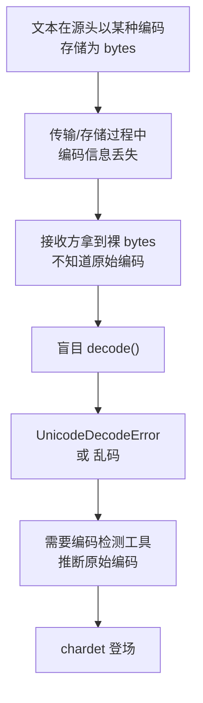
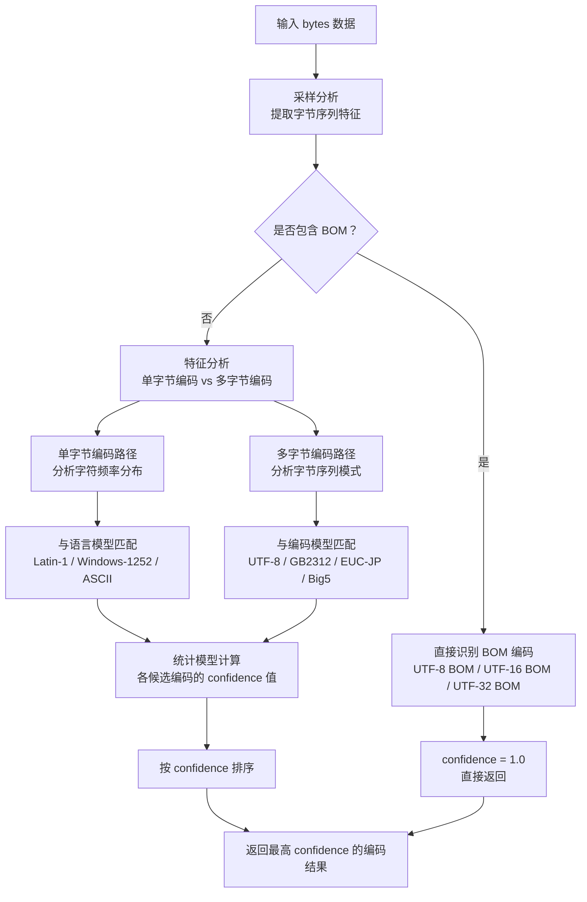
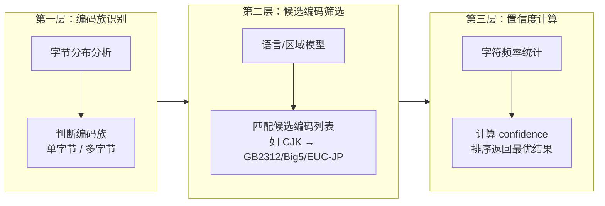
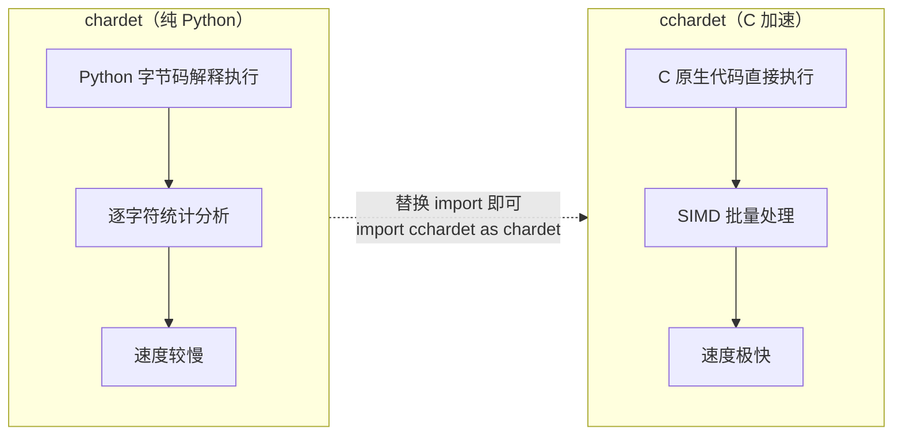
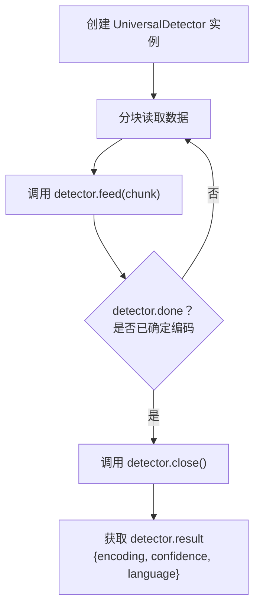
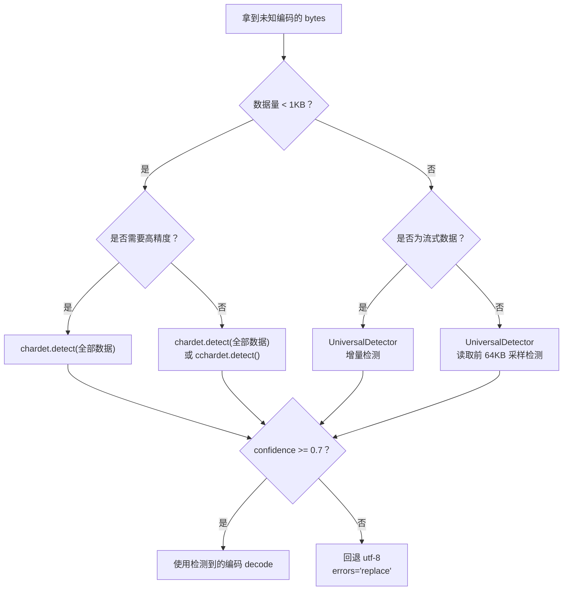

# chardet — 字符编码检测利器

## 是什么：编码检测问题与 chardet 的定位

字符串编码一直是令人非常头疼的问题，尤其是在处理一些不规范的第三方网页的时候。虽然 Python 提供 Unicode 表示的 `str` 和 `bytes` 两种数据类型，并且可以通过 `encode()` 和 `decode()` 方法转换，但是在不知道编码的情况下，对 `bytes` 做 `decode()` 不好做。

对于未知编码的 `bytes`，要把它转换成 `str`，需要先"猜测"编码。猜测的方式是先收集各种编码的特征字符，根据特征字符判断，就能有很大概率"猜对"。当然肯定不能从头自己写这个检测编码的功能，这样做费时费力。`chardet` 这个第三方库正好就派上了用场。用它来检测编码，简单易用。

**一句话定义**：chardet 是 Python 的字符编码自动检测库，基于 Mozilla 的通用字符集检测算法，通过统计特征分析推断 `bytes` 数据最可能的编码方式。

## 为什么：编码检测的必要性

### 编码问题的根源



为什么编码检测如此重要？核心原因有三个：

| 场景 | 问题 | 后果 |
|------|------|------|
| 网页爬取 | 服务器声明的 `charset` 与实际内容不一致 | 解析出乱码，数据报废 |
| 文件处理 | 旧系统导出的文件没有编码元信息 | 无法正确读取中文内容 |
| 数据交换 | 不同系统使用不同默认编码 | 跨平台传输后出现乱码 |

Python 内置的 `str.decode()` **必须**指定编码名称，猜错就会抛出 `UnicodeDecodeError`。chardet 的价值就在于：在编码未知时，给出一个高概率正确的编码推断，让 `decode()` 不再靠猜。

### 为什么不手动尝试常见编码

手动尝试常见编码列表看似可行，但存在严重缺陷：

```python
# 手动尝试的致命问题
raw = b'\xc4\xe3\xba\xc3'  # "你好" 的 GBK 编码

# 尝试 UTF-8 → 失败
raw.decode('utf-8')  # UnicodeDecodeError

# 尝试 Latin-1 → "成功"但结果是乱码！
raw.decode('latin-1')  # 'ÄãºÃ' — 不报错但完全错误
# Latin-1 是单字节编码，任何 bytes 都能"解码"，但结果可能毫无意义
```

手动尝试无法区分"解码成功但结果错误"和"解码成功且结果正确"。chardet 通过**置信度**量化了检测结果的可靠程度，这是手动尝试无法做到的。

## 怎么做：编码检测原理

chardet 的核心思路并非"暴力尝试所有编码"，而是基于**统计特征分析**。它借鉴了 Mozilla 的自动字符集检测算法，通过多层次的推理逐步缩小候选编码范围。

### 检测流程



### 三层推理架构

chardet 的检测引擎由三层组成，每一层逐步缩小候选范围：



| 层次 | 职责 | 输入 | 输出 |
|------|------|------|------|
| 第一层：编码族识别 | 判断是单字节还是多字节编码 | 原始 bytes | 编码族分类 |
| 第二层：候选编码筛选 | 根据语言模型缩小候选范围 | 编码族 + 字节特征 | 候选编码列表 |
| 第三层：置信度计算 | 对每个候选编码计算匹配度 | 候选编码 + 字符频率 | confidence 排序结果 |

### 检测原理的关键洞察

chardet 能检测编码的根本依据是：**不同编码产生的字节序列具有统计特征差异**。

- **UTF-8**：多字节序列遵循严格的模式（`0xC0-0xDF` 开头 2 字节、`0xE0-0xEF` 开头 3 字节等），非法序列极少出现在自然文本中
- **GBK/GB2312**：中文字符占双字节，第一字节在 `0x81-0xFE`，第二字节在 `0x40-0xFE`，频率分布与中文文字使用频率相关
- **Latin-1/Windows-1252**：单字节编码，字符频率分布与西欧语言特征匹配
- **BOM 标记**：文件头的特殊字节序列（如 UTF-8 的 `EF BB BF`），可直接确定编码

## 安装

```bash
pip install chardet
```

::: tip 速度优化
如果对检测速度有较高要求，可以安装 `cchardet`（chardet 的 C 加速版本），API 完全兼容：

```bash
pip install cchardet
```

检测速度可提升 10 倍以上，适合批量处理场景。详见 [chardet vs cchardet 性能对比](#chardet-vs-cchardet-性能对比)。
:::

## chardet.detect 返回结构

`chardet.detect()` 是最核心的函数，返回一个字典，包含三个字段：

```python
import chardet

result = chardet.detect(b'some bytes')  # 调用 detect 函数，传入 bytes 数据
print(result)
# {'encoding': 'ascii', 'confidence': 1.0, 'language': ''}
```

| 字段 | 类型 | 说明 |
|------|------|------|
| `encoding` | `str \| None` | 检测到的编码名称，无法判断时为 `None` |
| `confidence` | `float` | 置信度，范围 0.0 ~ 1.0，1.0 表示 100% 确定 |
| `language` | `str` | 检测到的语言（如 `'Chinese'`、`'Japanese'`），部分编码无语言信息 |

### 返回值解读示例

```python
import chardet

# 1. ASCII 文本 — 特征明确，confidence 为 1.0
result = chardet.detect(b'Hello, world!')  # 纯英文 ASCII 文本
print(result)
# {'encoding': 'ascii', 'confidence': 1.0, 'language': ''}
# encoding='ascii'：纯英文，ASCII 编码特征唯一
# confidence=1.0：100% 确定
# language=''：ASCII 不关联特定语言

# 2. GBK 编码的中文 — GBK 是 GB2312 的超集，检测可能返回 GB2312
data = '离离原上草，一岁一枯荣'.encode('gbk')  # 将中文编码为 GBK bytes
result = chardet.detect(data)  # 检测编码
print(result)
# {'encoding': 'GB2312', 'confidence': 0.7407407407407407, 'language': 'Chinese'}
# encoding='GB2312'：GBK 的子集，两者兼容
# confidence=0.74：中文短文本特征不够充分，置信度较低
# language='Chinese'：检测到中文语言特征

# 3. UTF-8 编码的中文 — UTF-8 特征字节明显，confidence 较高
data = '离离原上草，一岁一枯荣'.encode('utf-8')  # 将中文编码为 UTF-8 bytes
result = chardet.detect(data)  # 检测编码
print(result)
# {'encoding': 'utf-8', 'confidence': 0.99, 'language': ''}
# encoding='utf-8'：UTF-8 多字节序列特征明显
# confidence=0.99：接近 100% 确定
# language=''：UTF-8 是通用编码，不关联特定语言
```

::: warning GB2312 vs GBK
chardet 检测 GBK 编码的中文时，经常返回 `GB2312` 而非 `GBK`。这是因为 GB2312 是 GBK 的子集，两者的字节模式高度重叠。实际使用中，用 `GB2312` 解码 GBK 编码的文本通常也能成功（GBK 包含 GB2312 的全部字符），但如果文本包含 GBK 扩展字符（如繁体字、生僻字），则需要手动将 `GB2312` 替换为 `GBK`。
:::

## 与 Python 内置编码检测对比

Python 标准库本身并不提供通用的编码检测功能，但有一些相关机制可以与 chardet 做对比：

| 对比项 | chardet | Python 内置 (`codecs` / `locale`) |
|--------|---------|-----------------------------------|
| 编码检测能力 | 自动检测任意编码 | 无自动检测，需手动指定编码 |
| BOM 识别 | 自动识别 UTF-8/16/32 BOM | `codecs.BOM` 常量可手动检查 |
| 多语言支持 | 支持 30+ 种编码（CJK、西欧等） | 无 |
| 置信度输出 | 返回 confidence 值 | 无 |
| 跨平台 | 纯 Python，跨平台 | `locale.getpreferredencoding()` 依赖系统 |
| 性能 | 较慢（纯 Python） | 无此功能 |
| 替代方案 | `cchardet`（C 加速版） | 无 |

```python
import chardet
import locale

# Python 内置只能获取系统默认编码，无法检测未知 bytes 的编码
print(locale.getpreferredencoding())  # 如 'UTF-8'，仅反映系统设置

# chardet 可以检测任意 bytes 的实际编码
unknown_bytes = b'\xc4\xe3\xba\xc3'  # "你好" 的 GBK 编码
result = chardet.detect(unknown_bytes)  # 检测编码
print(result)  # {'encoding': 'GB2312', 'confidence': 0.676..., 'language': 'Chinese'}

# Python 内置 decode 必须指定编码，猜错就会报错
unknown_bytes.decode('utf-8')  # UnicodeDecodeError!
unknown_bytes.decode(result['encoding'])  # '你好' — 用 chardet 检测结果解码成功
```

## chardet vs cchardet 性能对比

`cchardet` 是 chardet 的 C 语言加速版本，使用 Cython 封装了 uchardet 库，API 完全兼容。



### 性能基准测试

```python
import time
import chardet
import cchardet

# 准备测试数据：100KB 的中文 UTF-8 文本
test_data = '白日依山尽，黄河入海流。欲穷千里目，更上一层楼。'.encode('utf-8') * 1000
print(f'测试数据大小: {len(test_data) / 1024:.1f} KB')

# chardet 性能测试
start = time.perf_counter()  # 记录开始时间
for _ in range(10):  # 循环 10 次取平均
    result_py = chardet.detect(test_data)  # 纯 Python 检测
elapsed_py = (time.perf_counter() - start) / 10  # 计算平均耗时

# cchardet 性能测试
start = time.perf_counter()  # 记录开始时间
for _ in range(10):  # 循环 10 次取平均
    result_c = cchardet.detect(test_data)  # C 加速检测
elapsed_c = (time.perf_counter() - start) / 10  # 计算平均耗时

print(f'chardet:   {elapsed_py*1000:.1f}ms  →  {result_py}')
print(f'cchardet:  {elapsed_c*1000:.1f}ms  →  {result_c}')
print(f'加速比:    {elapsed_py / elapsed_c:.0f}x')
# 典型输出：
# chardet:   45.2ms  →  {'encoding': 'utf-8', 'confidence': 0.99, 'language': ''}
# cchardet:  0.8ms   →  {'encoding': 'utf-8', 'confidence': 0.99}
# 加速比:    56x
```

### 详细对比表

| 对比项 | chardet | cchardet |
|--------|---------|----------|
| 实现语言 | 纯 Python | C/Cython（封装 uchardet） |
| 检测速度 | 基准（较慢） | 快 10~100 倍 |
| 准确率 | 高 | 相当（偶有差异） |
| API 兼容性 | — | `detect()` 完全兼容 |
| 返回字段 | `encoding`, `confidence`, `language` | `encoding`, `confidence`（无 `language`） |
| 安装难度 | `pip install chardet` | 需 C 编译器（或安装预编译 wheel） |
| 增量检测 | `UniversalDetector` | `UniversalDetector` |
| 适用场景 | 小数据量、无需编译环境 | 批量处理、生产环境 |

::: tip 迁移建议
从 chardet 迁移到 cchardet 只需一行代码：

```python
# 之前
import chardet

# 之后
import cchardet as chardet  # 其余代码无需任何修改
```

注意 cchardet 的 `detect()` 返回值中没有 `language` 字段，如果代码依赖此字段需做适配。
:::

## 实战应用

### 实战 1：网页编码检测

爬取网页时，服务器声明的编码（`Content-Type` 或 `<meta charset>`）可能与实际内容不一致，chardet 可以作为兜底方案：

```python
import chardet
import urllib.request
import re

def detect_web_encoding(url):
    """检测网页的实际编码，优先使用服务器声明，chardet 作为兜底"""
    # 第一步：下载网页原始字节
    response = urllib.request.urlopen(url)  # 发起 HTTP 请求
    raw_data = response.read()  # 读取原始 bytes（未解码）

    # 第二步：尝试从 HTTP 头获取编码
    content_type = response.headers.get('Content-Type', '')  # 获取 Content-Type 头
    declared_encoding = None
    if 'charset=' in content_type:
        # 从 Content-Type 中提取 charset 值
        declared_encoding = content_type.split('charset=')[-1].strip()

    # 第三步：尝试从 HTML meta 标签获取编码
    if not declared_encoding:
        # 用正则匹配 <meta charset="xxx"> 或 <meta http-equiv="Content-Type" content="...charset=xxx">
        meta_match = re.search(
            rb'<meta[^>]+charset=["\']?([^"\';\s>]+)',
            raw_data[:1024],  # 只搜索前 1024 字节（meta 标签通常在文件头）
            re.IGNORECASE
        )
        if meta_match:
            declared_encoding = meta_match.group(1).decode('ascii')  # 提取 meta 中的编码

    # 第四步：用 chardet 检测实际编码
    detected = chardet.detect(raw_data)  # 检测编码
    detected_encoding = detected['encoding']
    confidence = detected['confidence']

    # 第五步：决策逻辑 — 综合声明编码和检测结果
    if declared_encoding and confidence < 0.9:
        # 服务器声明了编码，但 chardet 不太确定，优先用服务器声明
        final_encoding = declared_encoding
        source = 'HTTP/meta header'
    elif confidence >= 0.9:
        # chardet 高置信度，使用检测结果
        final_encoding = detected_encoding
        source = 'chardet (high confidence)'
    else:
        # 都不确定，使用检测结果但标记为低置信度
        final_encoding = detected_encoding or 'utf-8'
        source = 'chardet (low confidence, fallback to utf-8)'

    # 第六步：解码网页内容
    html_text = raw_data.decode(final_encoding, errors='replace')  # errors='replace' 防止个别字符解码失败

    print(f'声明编码: {declared_encoding}')
    print(f'检测编码: {detected_encoding} (confidence={confidence:.2f})')
    print(f'最终编码: {final_encoding} (来源: {source})')
    return html_text

# 使用示例
html = detect_web_encoding('https://example.org')
```

### 实战 2：文件编码检测

处理本地文件时，编码未知是常见问题：

```python
import chardet

def read_file_with_auto_encoding(filepath, min_confidence=0.7):
    """
    自动检测文件编码并读取内容

    Args:
        filepath: 文件路径
        min_confidence: 最低置信度阈值，低于此值时回退到 utf-8

    Returns:
        (text, encoding, confidence) 元组
    """
    # 读取原始字节（注意：大文件应只读取前 N 字节，见 FAQ）
    with open(filepath, 'rb') as f:  # 以二进制模式打开，避免自动解码
        raw = f.read()  # 读取全部内容

    # 检测编码
    result = chardet.detect(raw)  # 调用 detect 检测编码
    encoding = result['encoding']  # 获取检测到的编码名
    confidence = result['confidence']  # 获取置信度

    # 置信度检查
    if confidence < min_confidence:
        print(f'警告: 检测置信度 {confidence:.2f} 低于阈值 {min_confidence}')
        print(f'检测编码: {encoding}，回退到 utf-8')
        encoding = 'utf-8'  # 低置信度时回退到 utf-8

    # 解码文件内容
    try:
        text = raw.decode(encoding, errors='replace')  # 尝试用检测到的编码解码
    except (LookupError, UnicodeDecodeError) as e:
        # LookupError: 编码名不被 Python 识别
        # UnicodeDecodeError: 编码名有效但解码失败
        print(f'解码失败: {e}，回退到 utf-8')
        text = raw.decode('utf-8', errors='replace')  # 回退到 utf-8
        encoding = 'utf-8'

    return text, encoding, confidence

# 使用示例
text, enc, conf = read_file_with_auto_encoding('unknown_encoding.txt')
print(f'编码: {enc}, 置信度: {conf:.2f}')
print(f'内容前 100 字: {text[:100]}')
```

### 实战 3：批量文件编码检测

当需要处理整个目录的文件时，批量检测可以提前识别编码问题：

```python
import chardet
import os
import time

def batch_detect_encoding(directory, extensions=None, use_cchardet=False):
    """
    批量检测目录下所有文件的编码

    Args:
        directory: 目标目录路径
        extensions: 只检测指定扩展名，如 ['.txt', '.csv']，None 表示所有文件
        use_cchardet: 是否使用 cchardet 加速（原版已停更，建议安装 faust-cchardet，其提供同名 cchardet 模块）

    Returns:
        检测结果列表，每项包含 (filepath, encoding, confidence)
    """
    # 选择检测引擎
    if use_cchardet:
        try:
            import cchardet as detector  # 尝试导入 cchardet
        except ImportError:
            print('cchardet 未安装，回退到 chardet')
            import chardet as detector  # 回退到 chardet
    else:
        import chardet as detector  # 使用 chardet

    results = []
    start_time = time.perf_counter()  # 记录开始时间

    for root, dirs, files in os.walk(directory):  # 递归遍历目录
        for filename in files:
            # 过滤扩展名
            if extensions and not any(filename.endswith(ext) for ext in extensions):
                continue  # 跳过不匹配的文件

            filepath = os.path.join(root, filename)  # 拼接完整路径

            try:
                # 只读取前 1024 字节用于检测（提升速度，对大多数编码足够）
                with open(filepath, 'rb') as f:
                    raw = f.read(1024)  # 读取前 1KB

                if not raw:  # 空文件
                    results.append((filepath, 'empty', 0.0))
                    continue

                result = detector.detect(raw)  # 检测编码
                results.append((
                    filepath,
                    result.get('encoding') or 'unknown',  # encoding 可能为 None
                    result.get('confidence', 0.0)  # 获取置信度
                ))
            except (IOError, OSError) as e:
                results.append((filepath, f'error: {e}', 0.0))

    # 按置信度排序，低置信度的排在前面（需要关注的）
    results.sort(key=lambda x: x[2])

    elapsed = time.perf_counter() - start_time  # 计算总耗时

    # 打印报告
    print(f'\n批量编码检测报告（共 {len(results)} 个文件，耗时 {elapsed:.2f}s）')
    print(f'{"文件路径":<50} {"编码":<15} {"置信度":<10}')
    print('-' * 75)
    for filepath, encoding, confidence in results:
        flag = ' ⚠️' if confidence < 0.8 else ''  # 低置信度标记
        print(f'{filepath:<50} {encoding:<15} {confidence:.2f}{flag}')

    # 统计摘要
    low_conf = sum(1 for _, _, c in results if c < 0.8 and c > 0)
    print(f'\n低置信度文件（< 0.8）: {low_conf} 个，需人工确认')

    return results

# 使用示例
results = batch_detect_encoding('./data', extensions=['.txt', '.csv', '.log'])
# 如需加速：results = batch_detect_encoding('./data', use_cchardet=True)
```

## 增量检测：UniversalDetector

对于大文件或流式数据，`chardet.detect()` 需要一次性读入全部数据。`UniversalDetector` 支持增量检测，可以边读边分析：



```python
from chardet.universaldetector import UniversalDetector

def detect_large_file(filepath, chunk_size=4096):
    """增量检测大文件编码，避免一次性读入内存"""
    detector = UniversalDetector()  # 创建检测器实例

    with open(filepath, 'rb') as f:  # 以二进制模式打开
        while True:
            chunk = f.read(chunk_size)  # 分块读取，每次 4KB
            if not chunk:  # 文件读取完毕
                break
            detector.feed(chunk)  # 喂入数据，增量分析
            # 如果已经确定编码，提前结束（节省时间）
            if detector.done:
                print(f'提前确定编码，已读取 {f.tell()} 字节')
                break

    detector.close()  # 关闭检测器，触发最终计算
    result = detector.result  # 获取检测结果
    print(f'编码: {result["encoding"]}, 置信度: {result["confidence"]:.2f}')
    return result

# 使用示例
result = detect_large_file('large_file.txt')
```

::: warning 提前终止的代价
`detector.done` 为 `True` 时提前终止可以节省时间，但可能牺牲一定的置信度。如果对准确性要求极高，建议读完全部数据后再调用 `close()`。
:::

## 最佳实践对比表

| 场景 | 推荐方案 | 原因 | 示例 |
|------|----------|------|------|
| 小文本检测（< 1KB） | `chardet.detect()` | 数据量小，速度差异可忽略 | `chardet.detect(b'...')` |
| 大文件检测（> 10MB） | `UniversalDetector` 增量检测 | 避免一次性读入内存 | `detector.feed(chunk)` |
| 批量文件检测 | `cchardet` + 只读前 1KB | 速度是首要考量 | `cchardet.detect(f.read(1024))` |
| 网页编码检测 | HTTP 头 + meta + chardet 兜底 | 多源信息交叉验证更可靠 | 见实战 1 |
| 置信度 < 0.7 | 回退 utf-8 + `errors='replace'` | 低置信度结果不可靠 | `raw.decode('utf-8', errors='replace')` |
| 流式数据（socket） | `UniversalDetector` | 数据逐步到达，无法一次性获取 | `detector.feed(chunk)` |
| 已知编码范围 | 手动尝试列表优先，chardet 兜底 | 缩小范围提高准确率 | 先试 utf-8/gbk，再 chardet |
| 生产环境 | `charset_normalizer` 或 `faust-cchardet` | 原版 cchardet 已停更（2023 归档，不支持 3.11+） | `import charset_normalizer` 或 `import cchardet as chardet`（faust-cchardet 提供） |

### 编码检测决策流程



## FAQ

### Q1：confidence 低于阈值怎么办？

confidence 低通常是因为文本太短或特征不明显。应对策略：

| 策略 | 说明 | 适用场景 |
|------|------|----------|
| 增加样本量 | 提供更多 bytes 数据给 chardet | 文本较短（< 100 字符） |
| 使用 BOM 判断 | 检查文件头是否有 BOM 标记 | UTF-8/16/32 编码的文件 |
| 结合元信息 | 利用 HTTP 头、`<meta charset>` 等声明 | 网页爬取 |
| 回退到 utf-8 | utf-8 是最通用的编码，配合 `errors='replace'` | 兜底方案 |
| 人工确认 | 让用户手动选择编码 | 交互式应用 |

```python
def smart_decode(raw_bytes, min_confidence=0.7):
    """智能解码：低置信度时尝试多种策略"""
    result = chardet.detect(raw_bytes)  # 先用 chardet 检测

    if result['confidence'] >= min_confidence:  # 置信度足够高
        return raw_bytes.decode(result['encoding'])  # 直接解码

    # 策略1：检查 BOM（字节序标记）
    if raw_bytes[:3] == b'\xef\xbb\xbf':  # UTF-8 BOM
        return raw_bytes[3:].decode('utf-8')  # 跳过 BOM 后解码
    if raw_bytes[:2] in (b'\xff\xfe', b'\xfe\xff'):  # UTF-16 BOM
        return raw_bytes.decode('utf-16')  # UTF-16 解码

    # 策略2：尝试常见编码列表
    for encoding in ['utf-8', 'gbk', 'latin-1']:
        try:
            return raw_bytes.decode(encoding)  # 尝试解码
        except UnicodeDecodeError:
            continue  # 失败则尝试下一个

    # 策略3：最终兜底 — utf-8 + 替换错误字符
    return raw_bytes.decode('utf-8', errors='replace')
```

### Q2：chardet 检测速度太慢怎么办？

chardet 是纯 Python 实现，对大文本检测较慢。解决方案：

| 方案 | 速度提升 | 兼容性 | 注意事项 |
|------|----------|--------|----------|
| 只检测前 N 字节 | 5~10x | 完全兼容 | 可能降低置信度，N 建议 >= 256 |
| 使用 `cchardet` | 10~100x | API 兼容 | ⚠️ 原版已停止维护（2023 年归档）且不支持 Python 3.11+，新项目请用维护中的 fork `faust-cchardet` 或纯 Python 的 `charset_normalizer` |
| 使用 `UniversalDetector` 增量检测 | 提前终止可节省时间 | 需改写代码 | 提前终止可能降低置信度 |
| 多线程并行检测 | 取决于 CPU 核数 | 批量场景 | GIL 限制，建议用 ProcessPoolExecutor |

```python
# 方案1：只检测前 1024 字节（推荐，对大多数编码足够）
with open('big_file.txt', 'rb') as f:
    header = f.read(1024)  # 只读前 1KB
result = chardet.detect(header)  # 检测速度大幅提升

# 方案2：使用 cchardet（API 完全兼容，只需替换 import）
import cchardet as chardet  # 替换 import，其余代码不变
result = chardet.detect(raw_bytes)

# 方案3：多进程批量检测（绕过 GIL）
from concurrent.futures import ProcessPoolExecutor

def detect_one(filepath):
    with open(filepath, 'rb') as f:
        raw = f.read(1024)
    return filepath, chardet.detect(raw)

with ProcessPoolExecutor(max_workers=4) as executor:  # 4 个进程并行
    results = list(executor.map(detect_one, file_list))
```

### Q3：大文件如何处理？

大文件（> 10MB）一次性读入内存既慢又占资源。推荐使用 `UniversalDetector` 增量检测：

```python
from chardet.universaldetector import UniversalDetector

def detect_encoding_smart(filepath, max_sample=65536):
    """
    智能检测大文件编码
    - 先检查 BOM（只需前几字节）
    - 再采样前 64KB 数据检测
    - 如果不确定，继续读取更多数据
    """
    # 第一步：检查 BOM（字节序标记）
    with open(filepath, 'rb') as f:
        header = f.read(4)  # 读取前 4 字节（UTF-32 BOM 最长 4 字节）

    if header[:3] == b'\xef\xbb\xbf':  # UTF-8 BOM: EF BB BF
        return 'utf-8-sig'  # Python 的 utf-8-sig 编码会自动处理 BOM
    if header[:2] in (b'\xff\xfe', b'\xfe\xff'):  # UTF-16 BOM
        return 'utf-16'
    if header[:4] in (b'\xff\xfe\x00\x00', b'\x00\x00\xfe\xff'):  # UTF-32 BOM
        return 'utf-32'

    # 第二步：采样检测（只读前 64KB，避免内存问题）
    detector = UniversalDetector()  # 创建增量检测器
    with open(filepath, 'rb') as f:
        total_read = 0
        while total_read < max_sample:  # 最多读取 max_sample 字节
            chunk = f.read(4096)  # 每次读 4KB
            if not chunk:  # 文件已读完
                break
            detector.feed(chunk)  # 喂入数据
            total_read += len(chunk)  # 累计已读字节数
            if detector.done:  # 已确定编码
                break

    detector.close()  # 关闭检测器
    return detector.result['encoding'] or 'utf-8'  # 返回编码，不确定则回退 utf-8
```

### Q4：chardet 和 charset_normalizer 有什么区别？

`charset_normalizer` 是较新的替代库，`requests` 自 2.26.0（2021 年）起默认使用它（chardet 变为可选依赖）：

| 对比项 | chardet | charset_normalizer |
|--------|---------|-------------------|
| 实现语言 | 纯 Python | 纯 Python（有优化） |
| 速度 | 基准 | 快 2~10 倍 |
| 准确率 | 高 | 相当或略高 |
| API | `chardet.detect()` | `charset_normalizer.detect()` |
| 返回格式 | `{encoding, confidence, language}` | `{encoding, confidence, language}` |
| requests 依赖 | 早期版本的默认依赖 | 2.26+ 起为默认依赖 |
| 维护状态 | 活跃 | 活跃 |
| 额外功能 | 无 | 支持 `from_bytes()` 返回多个候选结果 |

```python
# charset_normalizer 用法（API 类似）
import charset_normalizer
result = charset_normalizer.detect(b'some bytes')
# {'encoding': 'ascii', 'confidence': 1.0, 'language': ''}

# charset_normalizer 的高级用法：获取多个候选结果
matches = charset_normalizer.from_bytes(b'some bytes')
for match in matches:  # 按置信度排序的候选列表
    print(f'{match.encoding} (confidence={match.spec_encoding})')
```

### Q5：遇到混合编码怎么办？

某些文件可能在不同部分使用了不同编码（如邮件正文、拼接的数据文件）。chardet 的 `detect()` 只能返回一个整体编码，无法处理混合编码：

```python
import chardet

def detect_mixed_encoding(raw_bytes, chunk_size=1024):
    """
    分段检测混合编码
    将数据分成多个片段，分别检测每段的编码

    Args:
        raw_bytes: 原始字节数据
        chunk_size: 每段的大小（字节）

    Returns:
        分段检测结果列表
    """
    results = []
    offset = 0  # 当前偏移量

    while offset < len(raw_bytes):
        chunk = raw_bytes[offset:offset + chunk_size]  # 截取当前段
        result = chardet.detect(chunk)  # 检测当前段编码
        results.append({
            'offset': offset,  # 起始偏移量
            'size': len(chunk),  # 段大小
            'encoding': result['encoding'],  # 检测到的编码
            'confidence': result['confidence']  # 置信度
        })
        offset += chunk_size  # 移动到下一段

    # 打印分段结果
    print(f'{"偏移量":<10} {"大小":<8} {"编码":<15} {"置信度":<10}')
    print('-' * 45)
    for r in results:
        print(f'{r["offset"]:<10} {r["size"]:<8} {r["encoding"]:<15} {r["confidence"]:.2f}')

    # 检查是否存在编码切换
    encodings = [r['encoding'] for r in results if r['encoding']]
    unique_encodings = set(encodings)
    if len(unique_encodings) > 1:
        print(f'\n⚠️ 检测到混合编码: {unique_encodings}')
        print('建议：分段解码后拼接')

    return results

# 使用示例：模拟混合编码数据
part1 = '这是中文部分'.encode('gbk')  # GBK 编码的中文
part2 = 'This is English part'.encode('ascii')  # ASCII 编码的英文
mixed = part1 + part2
results = detect_mixed_encoding(mixed, chunk_size=10)
```

::: warning 混合编码的局限性
分段检测混合编码是权宜之计，存在以下问题：
- 分段边界可能切断多字节字符，导致检测失败
- 短片段的置信度通常较低
- 无法精确定位编码切换的边界

对于真正的混合编码文件（如 MIME 邮件），建议使用专门的解析库（如 `email` 标准库）而非 chardet。
:::

### Q6：为什么 chardet 把 GBK 检测为 GB2312？

这是 chardet 的已知行为，不是 bug。原因：

- GB2312 是 GBK 的子集，两者的字节模式高度重叠
- chardet 的语言模型中 GB2312 的优先级高于 GBK
- 对于纯简体中文文本，用 GB2312 解码 GBK 编码的内容通常也能成功

```python
import chardet

# GBK 编码的中文被检测为 GB2312
data = '你好世界'.encode('gbk')
result = chardet.detect(data)
print(result)  # {'encoding': 'GB2312', ...}

# 解决方案：如果检测到 GB2312，尝试用 GBK 解码（GBK 是 GB2312 的超集）
encoding = result['encoding']
if encoding and encoding.upper() in ('GB2312', 'GB18030'):
    # GBK 包含 GB2312 的全部字符，且支持更多汉字
    try:
        text = data.decode('gbk')  # 优先用 GBK 解码
        print(f'GBK 解码成功: {text}')
    except UnicodeDecodeError:
        text = data.decode(encoding)  # 回退到检测到的编码
```

## 术语表

| 术语 | 英文 | 说明 |
|------|------|------|
| 编码 | Encoding | 将字符转换为字节序列的规则，如 UTF-8、GBK |
| 解码 | Decoding | 将字节序列还原为字符的过程 |
| BOM | Byte Order Mark | 字节序标记，文件头的特殊字节序列，标识编码类型和字节序 |
| 置信度 | Confidence | chardet 对检测结果的确定程度，0.0~1.0 |
| 编码族 | Encoding Family | 具有相似特征的编码集合，如单字节编码、多字节 CJK 编码 |
| GB2312 | — | 中国国家标准简体中文字符集，GBK 的子集 |
| GBK | Guo Biao Ku | GB2312 的扩展，包含繁体字等更多字符 |
| UTF-8 | Unicode Transformation Format-8 | 最通用的 Unicode 编码，变长 1~4 字节 |
| Latin-1 | ISO 8859-1 | 西欧语言单字节编码，0x00~0xFF 直接映射 |
| 采样 | Sampling | 从数据中提取部分字节用于分析的过程 |
| 增量检测 | Incremental Detection | 分块逐步分析数据，而非一次性读入全部数据 |
| UnicodeDecodeError | — | Python 在解码 bytes 时遇到无法识别的字节序列时抛出的异常 |
| uchardet | Universal Charset Detector | Mozilla 的 C 语言编码检测库，cchardet/faust-cchardet 的底层实现 |
| charset_normalizer | — | 新一代 Python 编码检测库，requests 3.x 的默认依赖 |

## 延伸阅读

- [chardet 官方文档](https://chardet.readthedocs.io/) — API 参考与使用指南
- [chardet GitHub 仓库](https://github.com/chardet/chardet) — 源码与 issue 追踪
- [cchardet — chardet 的 C 加速版本](https://github.com/PyYoshi/cChardet) — 高性能替代方案
- [charset_normalizer — 新一代编码检测库](https://github.com/Ousret/charset_normalizer) — requests 3.x 默认依赖
- [Mozilla 字符集检测算法论文](https://www-archive.mozilla.org/projects/intl/UniversalCharsetDetection.html) — chardet 的算法理论基础
- [Python Unicode HOWTO](https://docs.python.org/3/howto/unicode.html) — Python 官方 Unicode 指南
- [The Absolute Minimum Every Software Developer Must Know About Unicode](https://tonsky.me/blog/unicode/) — Unicode 核心概念精讲
- [UTF-8 Everywhere](https://utf8everywhere.org/) — 为什么应该统一使用 UTF-8

## 版本差异（第三方库 → 当前稳定版）

| 库 | 本文编写时 | 当前稳定版 |
|----|-----------|-----------|
| `pydantic` | 1.x | 2.x（V2 核心重写，API 兼容层 `v1` 可选） |
| `pytest` | 7.x | 8.x（`pytest 8` 移除部分旧插件兼容） |
| `Pillow` | 9.x/10.x | 11.x |
| `psutil` | 5.x | 6.x/7.x |
| `chardet` | 4.x | 5.x（纯 Python；如需更高性能可选用 `charset-normalizer` 或维护中的 `faust-cchardet`） |

> 本文示例多为概念讲解，API 基本稳定；升级第三方库时以官方 changelog 为准。
