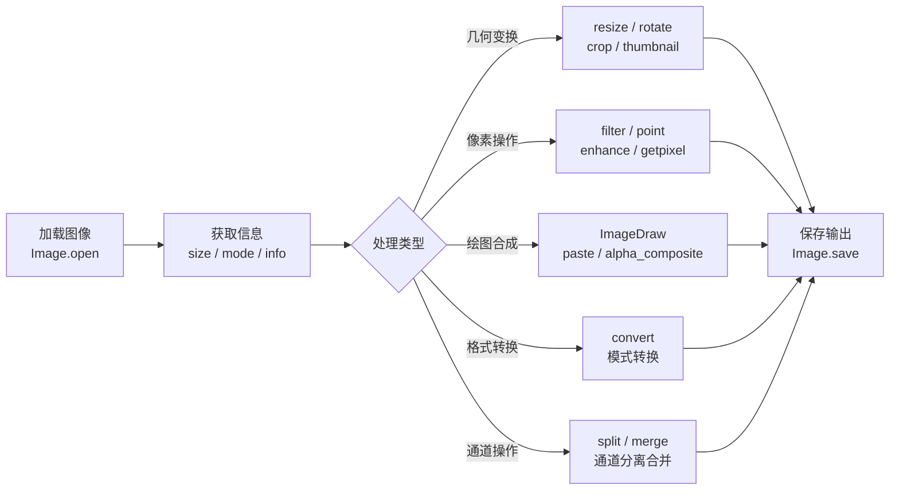
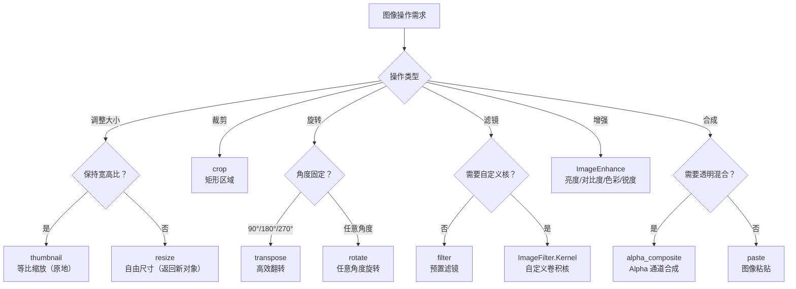
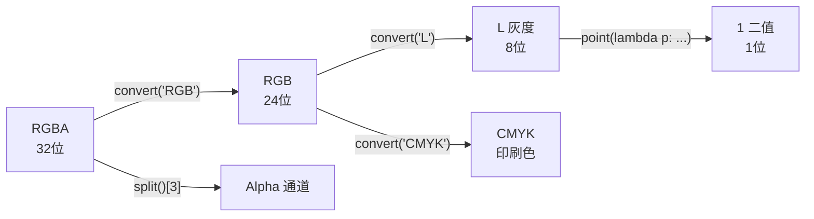
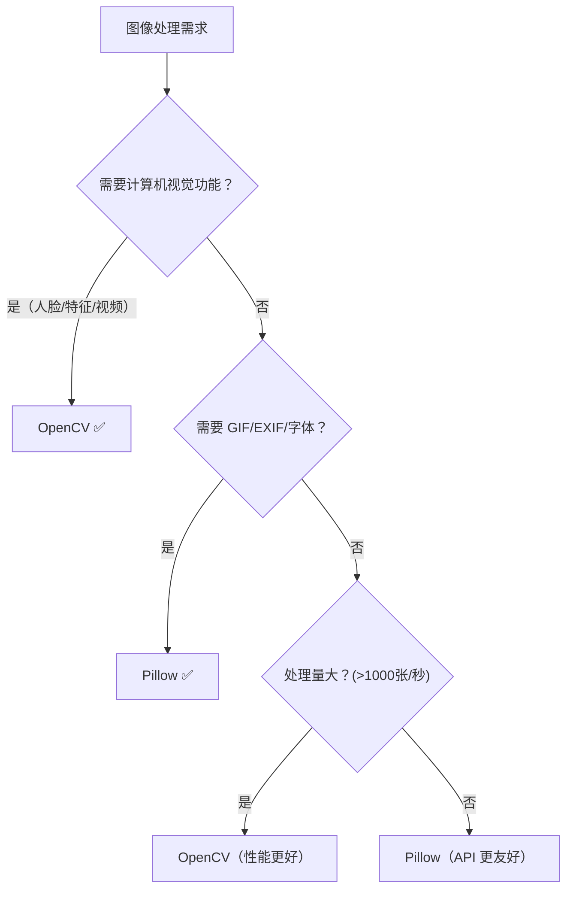

# Pillow 图像处理

> **一句话概括**：Pillow 是 Python 事实上的图像处理标准库，从 PIL 继承而来，支持 100+ 种图像格式的打开、处理和保存，覆盖缩放/裁剪/滤镜/绘图/合成/格式转换等日常需求。

PIL（Python Imaging Library）曾是 Python 平台的图像处理标准库，但仅支持到 Python 2.7 且年久失修。社区志愿者在 PIL 基础上创建了兼容版本 [Pillow](https://github.com/python-pillow/Pillow)，支持最新 Python 3.x 并持续添加新特性。

```bash
pip install pillow
```

---

## 一、Pillow 架构总览

```mermaid
graph TB
    A[Pillow 库] --> B[Image<br/>图像核心]
    A --> C[ImageDraw<br/>绘图模块]
    A --> D[ImageFilter<br/>滤镜模块]
    A --> E[ImageFont<br/>字体模块]
    A --> F[ImageEnhance<br/>增强模块]
    A --> G[ImageTransform<br/>变换模块]
    A --> H[ImageOps<br/>便捷操作]
    A --> I[ImageChops<br/>通道运算]
    A --> J[ImageStat<br/>图像统计]

    B --> B1[open 加载图像]
    B --> B2[new 创建图像]
    B --> B3[save 保存图像]
    B --> B4[thumbnail 缩放]
    B --> B5[resize 调整尺寸]
    B --> B6[rotate 旋转]
    B --> B7[crop 裁剪]
    B --> B8[paste 粘贴]
    B --> B9[split 通道分离]
    B --> B10[getpixel 像素访问]

    C --> C1[line 画线]
    C --> C2[rectangle 矩形]
    C --> C3[ellipse 椭圆]
    C --> C4[text 文字]
    C --> C5[arc 弧线]
    C --> C6[polygon 多边形]

    D --> D1[BLUR 模糊]
    D --> D2[CONTOUR 轮廓]
    D --> D3[SHARPEN 锐化]
    D --> D4[EMBOSS 浮雕]
    D --> D5[FIND_EDGES 边缘检测]
    D --> D6[GaussianBlur 高斯模糊]
    D --> D7[UnsharpMask 反锐化掩模]

    E --> E1[truetype TrueType字体]
    E --> E2[load_default 默认字体]

    F --> F1[Brightness 亮度]
    F --> F2[Contrast 对比度]
    F --> F3[Color 色彩]
    F --> F4[Sharpness 锐度]

    G --> G1[AFFINE 仿射变换]
    G --> G2[PERSPECTIVE 透视变换]
    G --> G3[EXTENT 裁切变换]
    G --> G4[QUAD 四边形映射]

```



## 二、图像处理流程



## 三、图像操作选择决策



## 四、常用操作速查表

| 操作 | 方法 | 参数说明 | 示例 |
|:-----|:-----|:---------|:-----|
| 打开图像 | `Image.open(path)` | 文件路径或文件对象 | `Image.open('photo.jpg')` |
| 创建图像 | `Image.new(mode, size, color)` | 模式、尺寸、背景色 | `Image.new('RGB', (800, 600), 'white')` |
| 保存图像 | `im.save(path, format)` | 路径、格式（可选） | `im.save('out.png', 'PNG')` |
| 缩略图 | `im.thumbnail(size)` | 目标尺寸（原地修改） | `im.thumbnail((400, 300))` |
| 调整尺寸 | `im.resize(size, resample)` | 目标尺寸、重采样方法 | `im.resize((800, 600), Image.LANCZOS)` |
| 旋转 | `im.rotate(angle, expand)` | 角度、是否扩展画布 | `im.rotate(90, expand=True)` |
| 裁剪 | `im.crop(box)` | (left, upper, right, lower) | `im.crop((100, 100, 500, 400))` |
| 粘贴 | `im.paste(im2, box, mask)` | 源图像、位置、遮罩 | `im.paste(logo, (10, 10), logo)` |
| 模糊 | `im.filter(ImageFilter.BLUR)` | 模糊滤镜 | — |
| 高斯模糊 | `im.filter(ImageFilter.GaussianBlur(r))` | 模糊半径 | `GaussianBlur(5)` |
| 锐化 | `im.filter(ImageFilter.SHARPEN)` | 锐化滤镜 | — |
| 轮廓 | `im.filter(ImageFilter.CONTOUR)` | 轮廓提取 | — |
| 浮雕 | `im.filter(ImageFilter.EMBOSS)` | 浮雕效果 | — |
| 边缘检测 | `im.filter(ImageFilter.FIND_EDGES)` | 边缘检测 | — |
| 亮度调整 | `ImageEnhance.Brightness(im)` | 0=暗, 1=原, 2=亮 | `enhancer.enhance(1.5)` |
| 对比度调整 | `ImageEnhance.Contrast(im)` | 0=灰, 1=原, 2=高对比 | `enhancer.enhance(2.0)` |
| 模式转换 | `im.convert(mode)` | 'L'灰度, 'RGB', 'RGBA' | `im.convert('L')` |
| 通道分离 | `im.split()` | 返回各通道图像元组 | `r, g, b = im.split()` |
| 通道合并 | `Image.merge(mode, bands)` | 合并通道 | `Image.merge('RGB', (r, g, b))` |

---

## 五、核心操作详解

### 5.1 缩放图像

```python
from PIL import Image

im = Image.open('photo.jpg')
w, h = im.size
print(f'原始尺寸: {w}x{h}')

# ── thumbnail：等比缩放（原地修改，不返回新对象）─────────
im_thumb = im.copy()
im_thumb.thumbnail((w // 2, h // 2))
print(f'缩略图尺寸: {im_thumb.size}')
im_thumb.save('thumbnail.jpg', 'JPEG', quality=85)

# ── resize：自由调整尺寸（返回新对象）────────────────────
im_resized = im.resize((800, 600), Image.LANCZOS)  # LANCZOS 高质量重采样
im_resized.save('resized.jpg', 'JPEG', quality=85)
```

::: tip thumbnail vs resize
| 特性 | `thumbnail()` | `resize()` |
|:-----|:-------------|:-----------|
| 是否修改原图 | 是（原地修改） | 否（返回新对象） |
| 是否保持宽高比 | 是 | 否（按指定尺寸拉伸） |
| 是否放大 | 否（只缩小） | 是（可放大可缩小） |
| 返回值 | `None` | `Image` 对象 |
:::

### 5.2 裁剪与旋转

```python
from PIL import Image

im = Image.open('photo.jpg')

# ── 裁剪：(left, upper, right, lower) 坐标系 ──────────
# 左上角为 (0, 0)，向右向下递增
im_crop = im.crop((100, 100, 400, 400))
im_crop.save('crop.jpg', 'JPEG')

# ── 旋转 ──────────────────────────────────────────────
# 逆时针旋转 90°，expand=True 自动扩展画布
im_rotate = im.rotate(90, expand=True)
im_rotate.save('rotate90.jpg', 'JPEG')

# ── 翻转（比 rotate 更高效）────────────────────────────
im_flip_h = im.transpose(Image.FLIP_LEFT_RIGHT)   # 水平翻转
im_flip_v = im.transpose(Image.FLIP_TOP_BOTTOM)    # 垂直翻转
im_rot_90 = im.transpose(Image.ROTATE_90)          # 逆时针 90°
im_rot_180 = im.transpose(Image.ROTATE_180)        # 180°
im_rot_270 = im.transpose(Image.ROTATE_270)        # 逆时针 270°（等价顺时针 90°）
```

### 5.3 滤镜与增强

```python
from PIL import Image, ImageFilter, ImageEnhance

im = Image.open('photo.jpg')

# ── 预置滤镜 ──────────────────────────────────────────
im_blur = im.filter(ImageFilter.BLUR)                    # 均值模糊
im_gauss = im.filter(ImageFilter.GaussianBlur(radius=5)) # 高斯模糊（更自然）
im_sharp = im.filter(ImageFilter.SHARPEN)                # 锐化
im_contour = im.filter(ImageFilter.CONTOUR)              # 轮廓提取
im_emboss = im.filter(ImageFilter.EMBOSS)                # 浮雕
im_edges = im.filter(ImageFilter.FIND_EDGES)             # 边缘检测

# ── 自定义卷积核 ──────────────────────────────────────
# 3x3 锐化核
kernel = ImageFilter.Kernel(
    (3, 3),                    # 核尺寸
    [0, -1, 0,                # 核数据（行优先）
     -1, 5, -1,
     0, -1, 0],
    1,                         # 缩放因子
    0                          # 偏移量
)
im_custom = im.filter(kernel)

# ── 图像增强 ──────────────────────────────────────────
# 亮度：0=全黑, 1=原图, 2=两倍亮度
im_bright = ImageEnhance.Brightness(im).enhance(1.5)

# 对比度：0=全灰, 1=原图, 2=两倍对比度
im_contrast = ImageEnhance.Contrast(im).enhance(2.0)

# 色彩饱和度：0=黑白, 1=原图, 2=两倍饱和度
im_color = ImageEnhance.Color(im).enhance(1.5)

# 锐度：0=模糊, 1=原图, 2=两倍锐度
im_sharpness = ImageEnhance.Sharpness(im).enhance(2.0)
```

### 5.4 通道操作

```python
from PIL import Image

im = Image.open('photo.jpg').convert('RGB')

# ── 通道分离 ──────────────────────────────────────────
r, g, b = im.split()  # 返回三个灰度图像（'L' 模式）

# 单独处理某个通道（如增强红色通道）
from PIL import ImageEnhance
r_enhanced = ImageEnhance.Brightness(r).enhance(1.5)

# ── 通道合并 ──────────────────────────────────────────
im_new = Image.merge('RGB', (r_enhanced, g, b))
im_new.save('red_enhanced.jpg', 'JPEG')

# ── 提取 Alpha 通道 ──────────────────────────────────
im_rgba = Image.open('logo.png')  # 带 Alpha 通道的 PNG
r, g, b, a = im_rgba.split()
# a 是透明度通道，可用于遮罩操作

# ── 通道运算（ImageChops）─────────────────────────────
from PIL import ImageChops

im1 = Image.open('image1.jpg')
im2 = Image.open('image2.jpg')

# 加法（两图叠加，超过 255 截断）
added = ImageChops.add(im1, im2)

# 差值（检测两图差异，用于图像对比/变化检测）
diff = ImageChops.difference(im1, im2)

# 乘法（暗化效果）
multiplied = ImageChops.multiply(im1, im2)

# 反相
inverted = ImageChops.invert(im1)
```

### 5.5 像素级操作

```python
from PIL import Image

im = Image.open('photo.jpg')

# ── 访问单个像素 ──────────────────────────────────────
pixel = im.getpixel((100, 100))  # 返回 (R, G, B) 或 (R, G, B, A)

# ── 修改单个像素 ──────────────────────────────────────
im.putpixel((100, 100), (255, 0, 0))  # 设为红色

# ── point()：批量像素变换（比逐像素快 100 倍）─────────
# 灰度反转
im_inverted = im.point(lambda p: 255 - p)

# 阈值化（二值图像）
im_bw = im.convert('L').point(lambda p: 255 if p > 128 else 0, '1')

# 亮度映射（gamma 校正）
import math
gamma = 1.5
im_gamma = im.point(lambda p: int(255 * (p / 255) ** (1 / gamma)))

# ── 使用 numpy 进行高级像素操作 ──────────────────────
import numpy as np

arr = np.array(im)                    # Image → numpy 数组 (H, W, C)
arr = arr[:, :, ::-1]                 # RGB → BGR（OpenCV 格式）
im_from_arr = Image.fromarray(arr)    # numpy 数组 → Image
```

---

## 六、ImageDraw 绘图详解

```python
from PIL import Image, ImageDraw, ImageFont

# 创建画布
im = Image.new('RGB', (800, 600), 'white')
draw = ImageDraw.Draw(im)

# ── 基础图形 ──────────────────────────────────────────
# 线段
draw.line([(0, 0), (800, 600)], fill='red', width=3)

# 矩形（outline=描边, fill=填充）
draw.rectangle([50, 50, 200, 150], outline='blue', fill='lightblue', width=2)

# 圆角矩形（Pillow 8.2+）
draw.rounded_rectangle([250, 50, 400, 150], radius=15, fill='green')

# 椭圆/圆
draw.ellipse([450, 50, 600, 200], outline='purple', fill='lavender', width=2)

# 多边形
draw.polygon([(100, 300), (200, 250), (300, 300), (250, 400), (150, 400)],
             fill='orange', outline='darkorange')

# 弧线
draw.arc([50, 300, 200, 450], start=0, end=180, fill='red', width=3)

# ── 文字绘制 ──────────────────────────────────────────
try:
    font = ImageFont.truetype('/System/Library/Fonts/PingFang.ttc', 36)
except IOError:
    font = ImageFont.load_default()

draw.text((300, 400), 'Hello Pillow', fill='black', font=font)

# 获取文字尺寸（用于精确定位）
bbox = draw.textbbox((0, 0), 'Hello Pillow', font=font)
text_width = bbox[2] - bbox[0]
text_height = bbox[3] - bbox[1]

# 居中绘制
x = (800 - text_width) // 2
y = (600 - text_height) // 2
draw.text((x, y), 'Centered Text', fill='navy', font=font)

im.save('drawing.png', 'PNG')
```

---

## 七、EXIF 信息处理

```python
from PIL import Image
from PIL.ExifTags import TAGS, GPSTAGS

im = Image.open('photo.jpg')

# ── 读取 EXIF 数据 ────────────────────────────────────
exif_data = im.getexif()

# 解码 EXIF 标签
for tag_id, value in exif_data.items():
    tag_name = TAGS.get(tag_id, tag_id)
    print(f"{tag_name}: {value}")

# 常用 EXIF 字段
print(f"相机品牌: {exif_data.get(271, 'N/A')}")       # 271 = Make
print(f"相机型号: {exif_data.get(272, 'N/A')}")       # 272 = Model
print(f"拍摄时间: {exif_data.get(36867, 'N/A')}")      # 36867 = DateTimeOriginal
print(f"曝光时间: {exif_data.get(33434, 'N/A')}")      # 33434 = ExposureTime
print(f"ISO 感光度: {exif_data.get(34855, 'N/A')}")    # 34855 = ISOSpeedRatings
print(f"焦距: {exif_data.get(37386, 'N/A')}")          # 37386 = FocalLength

# ── 根据 EXIF 方向自动旋转 ────────────────────────────
# 手机拍摄的照片经常方向信息在 EXIF 中，需要根据 Orientation 旋转
from PIL import ImageOps
im_auto = ImageOps.exif_transpose(im)  # 自动根据 EXIF Orientation 旋转

# ── 删除 EXIF（隐私保护）───────────────────────────────
im_no_exif = im.copy()
im_no_exif.info.pop('exif', None)
im_no_exif.save('no_exif.jpg', 'JPEG', quality=95)
```

---

## 八、GIF 动画处理

```python
from PIL import Image

# ── 读取 GIF 信息 ─────────────────────────────────────
im = Image.open('animation.gif')
print(f"帧数: {im.n_frames}")
print(f"是否动画: {im.is_animated}")

# ── 逐帧处理 GIF ──────────────────────────────────────
frames = []
for i in range(im.n_frames):
    im.seek(i)  # 跳转到第 i 帧
    # 对每一帧进行处理（如缩放）
    frame = im.copy().resize((200, 200), Image.LANCZOS)
    frames.append(frame)

# ── 保存为 GIF 动画 ──────────────────────────────────
frames[0].save(
    'resized_animation.gif',
    save_all=True,           # 保存所有帧
    append_images=frames[1:], # 追加剩余帧
    duration=100,            # 每帧持续时间（ms）
    loop=0,                  # 循环次数（0=无限循环）
    optimize=True,           # 优化文件大小
)

# ── 从多张静态图创建 GIF ──────────────────────────────
images = [Image.open(f'frame_{i}.png') for i in range(10)]
images[0].save(
    'output.gif',
    save_all=True,
    append_images=images[1:],
    duration=200,
    loop=0,
)
```

---

## 九、实战案例

### 9.1 批量缩放

```python
from pathlib import Path
from PIL import Image

def batch_resize(input_dir: str, output_dir: str,
                 size: tuple = (800, 600), quality: int = 85) -> None:
    """批量缩放图片"""
    out_path = Path(output_dir)
    out_path.mkdir(parents=True, exist_ok=True)
    supported = {'.jpg', '.jpeg', '.png', '.bmp', '.gif', '.webp'}

    for img_file in Path(input_dir).iterdir():
        if img_file.suffix.lower() not in supported:
            continue
        try:
            im = Image.open(img_file)
            im.thumbnail(size, Image.LANCZOS)

            # RGBA → RGB（JPEG 不支持透明通道）
            if im.mode == 'RGBA':
                bg = Image.new('RGB', im.size, (255, 255, 255))
                bg.paste(im, mask=im.split()[3])
                im = bg

            im.save(out_path / img_file.name, quality=quality)
            print(f"✅ {img_file.name} → {im.size}")
        except Exception as e:
            print(f"❌ {img_file.name}: {e}")

batch_resize('./images', './images/resized', size=(800, 600))
```

### 9.2 添加水印

```python
from PIL import Image, ImageDraw, ImageFont

def add_text_watermark(input_path: str, output_path: str,
                       text: str = "Sample", font_size: int = 36,
                       opacity: int = 128) -> None:
    """添加文字水印"""
    im = Image.open(input_path).convert('RGBA')

    watermark = Image.new('RGBA', im.size, (0, 0, 0, 0))
    draw = ImageDraw.Draw(watermark)

    try:
        font = ImageFont.truetype('/System/Library/Fonts/PingFang.ttc', font_size)
    except IOError:
        font = ImageFont.load_default()

    # 右下角定位
    bbox = draw.textbbox((0, 0), text, font=font)
    text_w, text_h = bbox[2] - bbox[0], bbox[3] - bbox[1]
    x, y = im.width - text_w - 20, im.height - text_h - 20
    draw.text((x, y), text, font=font, fill=(255, 255, 255, opacity))

    result = Image.alpha_composite(im, watermark)
    result.convert('RGB').save(output_path, 'JPEG', quality=90)

def add_image_watermark(input_path: str, watermark_path: str,
                        output_path: str, position: str = 'bottom-right',
                        margin: int = 10, opacity: int = 128) -> None:
    """添加图片水印"""
    im = Image.open(input_path).convert('RGBA')
    logo = Image.open(watermark_path).convert('RGBA')
    logo.thumbnail((im.width // 4, im.height // 4), Image.LANCZOS)

    # 调整透明度
    alpha = logo.split()[3].point(lambda p: p * opacity // 255)
    logo.putalpha(alpha)

    positions = {
        'top-left': (margin, margin),
        'top-right': (im.width - logo.width - margin, margin),
        'bottom-left': (margin, im.height - logo.height - margin),
        'bottom-right': (im.width - logo.width - margin, im.height - logo.height - margin),
        'center': ((im.width - logo.width) // 2, (im.height - logo.height) // 2),
    }
    im.paste(logo, positions.get(position, positions['bottom-right']), logo)
    im.convert('RGB').save(output_path, 'JPEG', quality=90)
```

### 9.3 批量格式转换

```python
from pathlib import Path
from PIL import Image

def batch_convert(input_dir: str, output_dir: str,
                  target_format: str = 'WEBP', quality: int = 85) -> None:
    """批量转换图片格式（推荐转 WEBP，体积减少 30-50%）"""
    out_path = Path(output_dir)
    out_path.mkdir(parents=True, exist_ok=True)
    supported = {'.jpg', '.jpeg', '.png', '.bmp', '.gif', '.webp', '.tiff'}

    for img_file in Path(input_dir).iterdir():
        if img_file.suffix.lower() not in supported:
            continue
        try:
            im = Image.open(img_file)
            if target_format.upper() in ('JPEG', 'JPG') and im.mode in ('RGBA', 'P'):
                im = im.convert('RGB')

            out_file = out_path / f"{img_file.stem}.{target_format.lower()}"
            save_kwargs = {}
            if target_format.upper() in ('JPEG', 'JPG', 'WEBP'):
                save_kwargs['quality'] = quality
            im.save(out_file, target_format, **save_kwargs)
            print(f"✅ {img_file.name} → {out_file.name}")
        except Exception as e:
            print(f"❌ {img_file.name}: {e}")

# WebP 格式：同等质量下比 JPEG 小 25-35%，比 PNG 小 80%+
batch_convert('./images', './images/webp', target_format='WEBP', quality=80)
```

### 9.4 生成验证码

```python
from PIL import Image, ImageDraw, ImageFont, ImageFilter
import random
import string

def generate_captcha(width: int = 240, height: int = 60,
                     length: int = 4, font_size: int = 36) -> tuple[str, Image.Image]:
    """生成字母验证码图片，返回 (验证码文字, 图像对象)"""
    # 随机验证码文字
    chars = ''.join(random.choices(string.ascii_uppercase + string.digits, k=length))

    image = Image.new('RGB', (width, height), (255, 255, 255))
    draw = ImageDraw.Draw(image)

    try:
        font = ImageFont.truetype('/System/Library/Fonts/Menlo.ttc', font_size)
    except IOError:
        font = ImageFont.load_default()

    # 填充背景噪点
    for x in range(width):
        for y in range(height):
            if random.random() < 0.3:
                draw.point((x, y), fill=(
                    random.randint(64, 255),
                    random.randint(64, 255),
                    random.randint(64, 255),
                ))

    # 绘制文字（每个字符随机偏移和旋转）
    char_width = width // length
    for i, ch in enumerate(chars):
        x = char_width * i + random.randint(5, 15)
        y = random.randint(5, 15)
        color = (random.randint(32, 127), random.randint(32, 127), random.randint(32, 127))
        draw.text((x, y), ch, font=font, fill=color)

    # 添加干扰线
    for _ in range(3):
        x1, y1 = random.randint(0, width), random.randint(0, height)
        x2, y2 = random.randint(0, width), random.randint(0, height)
        draw.line([(x1, y1), (x2, y2)], fill=(
            random.randint(32, 127), random.randint(32, 127), random.randint(32, 127)
        ), width=1)

    # 轻微模糊增加识别难度
    image = image.filter(ImageFilter.GaussianBlur(0.5))

    return chars, image

# 使用
code, img = generate_captcha()
img.save('captcha.jpg', 'JPEG')
print(f"验证码: {code}")
```

### 9.5 图片拼接（长图合成）

```python
from PIL import Image
from pathlib import Path

def create_long_image(image_paths: list[str], direction: str = 'vertical',
                      gap: int = 0, bg_color: str = 'white') -> Image.Image:
    """
    将多张图片拼接为长图。

    Args:
        image_paths: 图片路径列表
        direction: 'vertical'（竖向拼接）或 'horizontal'（横向拼接）
        gap: 图片间距（像素）
        bg_color: 背景色
    """
    images = [Image.open(p) for p in image_paths]

    if direction == 'vertical':
        max_width = max(im.width for im in images)
        total_height = sum(im.height for im in images) + gap * (len(images) - 1)
        result = Image.new('RGB', (max_width, total_height), bg_color)

        y_offset = 0
        for im in images:
            # 居中对齐
            x = (max_width - im.width) // 2
            result.paste(im, (x, y_offset))
            y_offset += im.height + gap
    else:
        max_height = max(im.height for im in images)
        total_width = sum(im.width for im in images) + gap * (len(images) - 1)
        result = Image.new('RGB', (total_width, max_height), bg_color)

        x_offset = 0
        for im in images:
            y = (max_height - im.height) // 2
            result.paste(im, (x_offset, y))
            x_offset += im.width + gap

    return result

# 使用：竖向拼接聊天截图
paths = sorted(Path('./screenshots').glob('screen_*.png'))
long_img = create_long_image([str(p) for p in paths], direction='vertical', gap=10)
long_img.save('long_screenshot.png', 'PNG')
```

---

## 十、图像模式详解

| 模式 | 说明 | 每像素字节数 | 典型用途 |
|:-----|:-----|:------------|:---------|
| `1` | 1位黑白 | 1/8 | 二值图像、传真 |
| `L` | 8位灰度 | 1 | 灰度照片 |
| `P` | 8位调色板 | 1 | GIF、图标 |
| `RGB` | 24位真彩色 | 3 | JPEG、PNG |
| `RGBA` | 32位带透明 | 4 | PNG 透明图 |
| `CMYK` | 32位印刷色 | 4 | 印刷输出 |
| `YCbCr` | 色度亮度 | 3 | JPEG 内部 |
| `I` | 32位整数灰度 | 4 | 科学图像 |
| `F` | 32位浮点灰度 | 4 | 图像处理中间结果 |
| `LA` | 灰度+透明 | 2 | 灰度透明图 |
| `PA` | 调色板+透明 | 1 | GIF 透明图 |



---

## 十一、Pillow vs OpenCV 选型

| 维度 | Pillow | OpenCV (cv2) |
|:-----|:-------|:-------------|
| **定位** | 通用图像 I/O + 基础处理 | 计算机视觉 + 高级处理 |
| **安装** | `pip install pillow`（轻量） | `pip install opencv-python`（较重） |
| **API 风格** | 面向对象（`im.resize()`） | 函数式（`cv2.resize(im, ...)`） |
| **格式支持** | 100+ 种（含 PSD、ICO、WEBP） | 有限（主要 JPEG/PNG/BMP/TIFF） |
| **图像表示** | `Image` 对象 | numpy 数组 (H, W, C)，BGR 顺序 |
| **性能** | 中等（核心操作为 C 实现） | 快（C++ 后端 + SIMD 优化） |
| **特色功能** | EXIF、GIF 动画、字体渲染、滤镜 | 人脸检测、特征匹配、光流、深度学习 |
| **适用场景** | Web 图片处理、缩略图、水印 | 目标检测、图像分割、视频处理 |

**选择决策**：



---

## 十二、常见陷阱

| 陷阱 | 错误示例 | 正确做法 | 原因 |
|:-----|:---------|:---------|:-----|
| **RGBA 保存 JPEG** | `im.save('out.jpg')` | `im.convert('RGB').save('out.jpg')` | JPEG 不支持透明通道 |
| **thumbnail 返回 None** | `new = im.thumbnail(size)` | `im.thumbnail(size); new = im` | thumbnail 原地修改，返回 None |
| **忘记 copy** | `im.thumbnail(size)` 后原图丢失 | `im2 = im.copy(); im2.thumbnail(size)` | thumbnail 不可逆地修改原图 |
| **LBYL 竞态** | `if im.exists(): im = Image.open(p)` | `try: im = Image.open(p) except: ...` | 检查与打开之间文件可能被删除 |
| **大图内存** | `im = Image.open('huge.tiff')` 不释放 | `with Image.open(p) as im: ...` 或 `del im` | PIL 惰性加载但修改后数据驻留内存 |
| **字体缺失** | `ImageFont.truetype('Arial.ttf', 36)` | `try/except` 回退到 `load_default()` | Linux 上可能没有 Arial 字体 |
| **模式不匹配** | `im1.paste(im2)` 但模式不同 | 先 `convert()` 统一模式 | 不同模式粘贴可能导致颜色异常 |
| **坐标混淆** | `crop((x1, y1, x2, y2))` 当作 (w, h) | crop 参数是两个对角点坐标 | crop 用 (left, upper, right, lower)，不是 (x, y, w, h) |

---

## 术语表

| 术语 | 全称 | 含义 |
|:-----|:-----|:-----|
| PIL | Python Imaging Library | Python 图像处理库（已停止维护） |
| Pillow | — | PIL 的社区维护分支 |
| RGB | Red Green Blue | 红绿蓝三原色色彩模式 |
| RGBA | Red Green Blue Alpha | 带透明通道的 RGB 模式 |
| CMYK | Cyan Magenta Yellow Key | 印刷四色模式 |
| DPI | Dots Per Inch | 每英寸点数，图像分辨率 |
| EXIF | Exchangeable Image File Format | 图像元数据标准（相机信息、GPS 等） |
| LANCZOS | — | 高质量重采样算法（Lanczos 重采样） |
| thumbnail | — | 缩略图，保持宽高比的缩小版本 |
| alpha channel | — | 透明度通道，控制像素的不透明度 |
| resample | — | 重采样，改变图像尺寸时的像素插值方法 |
| 卷积核 | Convolution Kernel | 滤镜使用的权重矩阵，定义像素邻域的加权方式 |
| 仿射变换 | Affine Transform | 平移+旋转+缩放的线性变换组合 |
| 透视变换 | Perspective Transform | 模拟透视效果的 8 参数非线性变换 |

## 延伸阅读

- [Pillow 官方文档](https://pillow.readthedocs.io/) — 最权威的 API 参考
- [Pillow GitHub 仓库](https://github.com/python-pillow/Pillow) — 源码与 Issue 追踪
- [Pillow 教程](https://pillow.readthedocs.io/en/stable/handbook/tutorial.html) — 官方入门教程
- [OpenCV-Python](https://docs.opencv.org/master/d6/d00/tutorial_py_root.html) — 更强大的计算机视觉库
- [imageio](https://github.com/imageio/imageio) — 支持更多格式的图像 IO 库
- [scikit-image](https://scikit-image.org/) — 科学计算图像处理库

## 版本差异（第三方库 → 当前稳定版）

| 库 | 本文编写时 | 当前稳定版 |
|----|-----------|-----------|
| `pydantic` | 1.x | 2.x（V2 核心重写，API 兼容层 `v1` 可选） |
| `pytest` | 7.x | 8.x（`pytest 8` 移除部分旧插件兼容） |
| `Pillow` | 9.x/10.x | 11.x |
| `psutil` | 5.x | 6.x/7.x |
| `chardet` | 4.x | 5.x（纯 Python；如需更高性能可选用 `charset-normalizer` 或维护中的 `faust-cchardet`） |

> 本文示例多为概念讲解，API 基本稳定；升级第三方库时以官方 changelog 为准。
