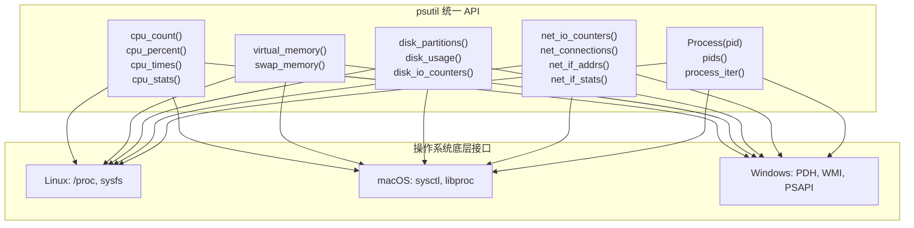
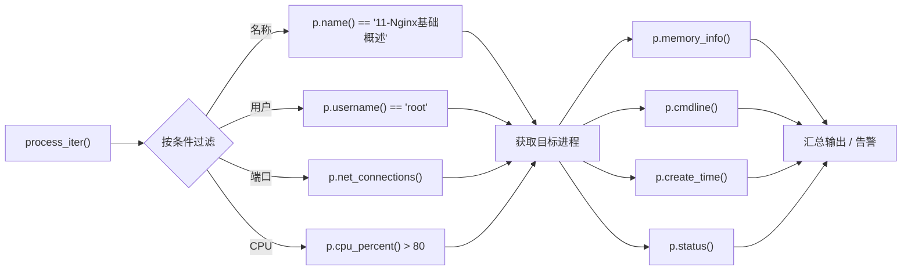
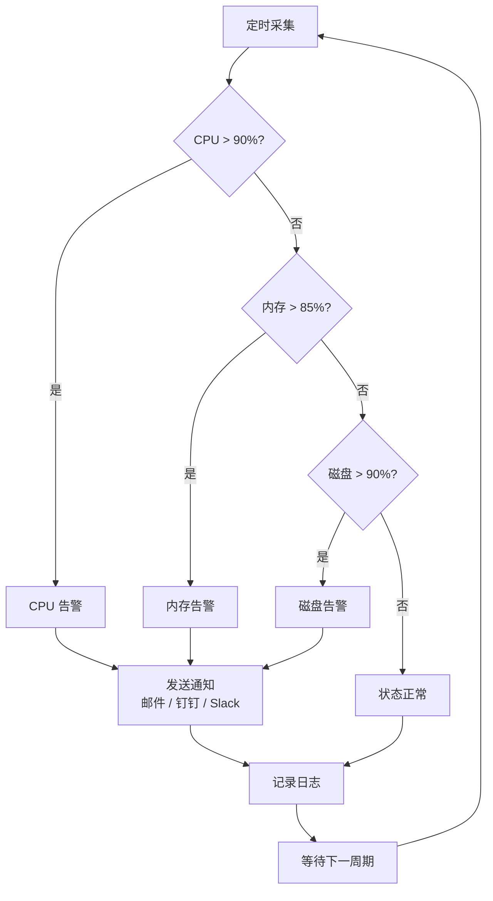

# psutil — 系统与进程监控

> **一句话概括**：psutil（process and system utilities）是 Python 跨平台系统监控的瑞士军刀，用一两行代码即可获取 CPU、内存、磁盘、网络、进程五大维度的实时数据，替代 `subprocess` 调用 `ps`/`top`/`free` 等系统命令的繁琐方式。

---

## 是什么 → 为什么 → 怎么做

| 层次 | 内容 |
|------|------|
| **是什么** | 一个跨平台（Linux / macOS / Windows / FreeBSD / SunOS）的 Python 第三方库，提供系统级监控与进程管理的统一 API |
| **为什么** | 传统方式用 `subprocess` 调系统命令 → 解析输出 → 跨平台适配，代码量大、脆弱、慢；psutil 直接封装 OS 底层接口（Linux 的 `/proc`、macOS 的 `sysctl`、Windows 的 PDH/WMI），一行代码拿到结构化数据 |
| **怎么做** | `pip install psutil`，然后按需调用 `cpu_*` / `virtual_memory` / `disk_*` / `net_*` / `Process()` 五大模块 |

---

## 系统监控架构总览



psutil 在上层提供统一的 Python API，底层根据不同操作系统自动选择对应的系统接口，开发者无需关心平台差异。

---

## 进程信息获取流程



`process_iter()` 遍历所有进程，通过属性过滤定位目标进程，再深入获取其内存、命令行、启动时间、状态等详细信息。

---

## 资源告警决策流程



---

## 安装

```bash
# 基础安装
pip install psutil

# 指定版本（推荐锁定版本）
pip install psutil==6.1.0

# 验证安装
python -c "import psutil; print(psutil.__version__)"
```

---

## 核心模块对比表

| 模块 | 主要函数 | 返回类型 | 典型用途 | 单位 |
|------|---------|---------|---------|------|
| **CPU** | `cpu_count()`, `cpu_percent()`, `cpu_times()`, `cpu_stats()`, `cpu_freq()` | `int` / `float` / `namedtuple` | 负载监控、容量规划 | %、MHz、秒 |
| **内存** | `virtual_memory()`, `swap_memory()` | `namedtuple` | 内存泄漏检测、OOM 预警 | 字节 |
| **磁盘** | `disk_partitions()`, `disk_usage()`, `disk_io_counters()` | `namedtuple` / `list` | 磁盘空间告警、IO 瓶颈分析 | 字节、次、毫秒 |
| **网络** | `net_io_counters()`, `net_connections()`, `net_if_addrs()`, `net_if_stats()` | `namedtuple` / `list` / `dict` | 流量统计、连接审计 | 字节、次 |
| **进程** | `Process(pid)`, `pids()`, `process_iter()` | `Process` 对象 / `list` | 进程管理、僵尸检测 | PID、字节、% |

---

## 系统监控方案对比表

| 维度 | psutil | /proc 文件系统 | os 模块 | subprocess + 系统命令 |
|------|--------|---------------|---------|---------------------|
| **跨平台** | Linux / macOS / Windows / FreeBSD | 仅 Linux | 部分跨平台 | 依赖系统命令，需逐平台适配 |
| **返回格式** | 结构化 namedtuple / 对象 | 纯文本需手动解析 | 简单数值 | 纯文本需正则解析 |
| **性能** | 直接系统调用，快 | 文件读取，较快 | 快 | 启动子进程，慢 |
| **代码量** | 1-2 行 | 5-10 行 + 解析 | 1-3 行（功能有限） | 5-15 行 + 解析 |
| **进程信息** | 丰富（内存/CPU/线程/文件描述符/连接） | 丰富但需逐文件读取 | 仅基础信号 | 依赖 ps/top 输出格式 |
| **维护成本** | 低，社区活跃 | 中，需处理格式变化 | 低，但功能少 | 高，输出格式随版本变 |
| **权限要求** | 部分功能需 root | 部分需 root | 无特殊要求 | 部分需 root |
| **适用场景** | 生产监控、运维脚本 | Linux 深度调试 | 简单系统信息 | 一次性脚本、已有命令行工具 |

> **选型建议**：生产环境首选 psutil；Linux 专属深度调试可直读 `/proc`；仅需 `os.cpu_count()` 级别的简单信息用 os 模块即可。

---

## CPU 监控

### 基础信息

```python
import psutil

# ========== CPU 核心数 ==========
# 逻辑核心数（含超线程）
logical = psutil.cpu_count()           # 例: 12
# 物理核心数（真实核心）
physical = psutil.cpu_count(logical=False)  # 例: 6
print(f"逻辑核心: {logical}, 物理核心: {physical}")

# ========== CPU 时间分布 ==========
# 返回自开机以来各状态累计时间（秒）
times = psutil.cpu_times()
print(f"用户态: {times.user:.1f}s")     # 用户进程
print(f"系统态: {times.system:.1f}s")   # 内核进程
print(f"空闲: {times.idle:.1f}s")       # 空闲
# Linux 特有字段
if hasattr(times, 'iowait'):
    print(f"IO等待: {times.iowait:.1f}s")  # 等待IO完成

# ========== CPU 频率 ==========
freq = psutil.cpu_freq()
if freq:
    print(f"当前: {freq.current:.0f}MHz, 最小: {freq.min:.0f}MHz, 最大: {freq.max:.0f}MHz")

# ========== CPU 统计信息 ==========
stats = psutil.cpu_stats()
print(f"上下文切换: {stats.ctx_switches}")
print(f"中断: {stats.interrupts}")
print(f"软中断: {stats.soft_interrupts}")
```

### CPU 使用率监控

```python
import psutil

# ========== 总体使用率 ==========
# interval=1 表示阻塞1秒采样计算
total_percent = psutil.cpu_percent(interval=1)
print(f"总体CPU使用率: {total_percent}%")

# ========== 每核使用率 ==========
# percpu=True 返回每个逻辑核心的使用率列表
per_cpu = psutil.cpu_percent(interval=1, percpu=True)
for i, pct in enumerate(per_cpu):
    print(f"  核心{i}: {pct}%")

# ========== 持续监控（类 top 命令）==========
# 注意：首次调用 cpu_percent 返回 0.0，需先调用一次丢弃
psutil.cpu_percent(interval=None)  # 丢弃首次

for i in range(10):
    usage = psutil.cpu_percent(interval=1, percpu=True)
    avg = sum(usage) / len(usage)
    # 用进度条可视化
    bar = "|" + "█" * int(avg / 5) + "░" * (20 - int(avg / 5)) + "|"
    print(f"[{i+1:2d}/10] {bar} {avg:.1f}%")
```

输出示例：

```
[ 1/10] |████████░░░░░░░░░░░░| 40.2%
[ 2/10] |███████████░░░░░░░░░| 55.8%
[ 3/10] |████░░░░░░░░░░░░░░░░| 22.1%
```

---

## 内存监控

```python
import psutil

# ========== 物理内存 ==========
mem = psutil.virtual_memory()
print(f"总内存:     {mem.total / (1024**3):.1f} GB")      # 总物理内存
print(f"可用内存:   {mem.available / (1024**3):.1f} GB")   # 可立即使用的内存
print(f"已用内存:   {mem.used / (1024**3):.1f} GB")       # 已使用
print(f"空闲内存:   {mem.free / (1024**3):.1f} GB")       # 完全未使用
print(f"使用率:     {mem.percent}%")                       # used/total * 100
print(f"缓存/缓冲:  {(mem.buffers + mem.cached) / (1024**3):.1f} GB")  # Linux 特有

# ========== 交换内存（Swap）==========
swap = psutil.swap_memory()
print(f"Swap总量:   {swap.total / (1024**3):.1f} GB")
print(f"Swap已用:   {swap.used / (1024**3):.1f} GB")
print(f"Swap使用率: {swap.percent}%")
print(f"Swap换入:   {swap.sin / (1024**2):.1f} MB")       # 从磁盘换入
print(f"Swap换出:   {swap.sout / (1024**2):.1f} MB")      # 换出到磁盘
```

> **关键区别**：`available` 包含可回收的缓存内存，比 `free` 更能反映实际可用量。Linux 下 `available` = `free` + `buffers` + `cached`（可回收部分），监控告警应基于 `available` 而非 `free`。

---

## 磁盘监控

```python
import psutil

# ========== 磁盘分区 ==========
partitions = psutil.disk_partitions()
for p in partitions:
    print(f"设备: {p.device:20s}  挂载点: {p.mountpoint:30s}  类型: {p.fstype}")

# ========== 磁盘使用率 ==========
# 需要指定挂载点路径
usage = psutil.disk_usage('/')
print(f"总容量:   {usage.total / (1024**3):.1f} GB")
print(f"已用:     {usage.used / (1024**3):.1f} GB")
print(f"可用:     {usage.free / (1024**3):.1f} GB")
print(f"使用率:   {usage.percent}%")

# ========== 磁盘 IO 统计 ==========
io = psutil.disk_io_counters()
print(f"读次数:   {io.read_count}")
print(f"写次数:   {io.write_count}")
print(f"读字节:   {io.read_bytes / (1024**3):.2f} GB")
print(f"写字节:   {io.write_bytes / (1024**3):.2f} GB")
# perdisk=True 可获取每个磁盘的独立统计
for name, disk_io in psutil.disk_io_counters(perdisk=True).items():
    print(f"  {name}: 读{disk_io.read_bytes/(1024**2):.0f}MB 写{disk_io.write_bytes/(1024**2):.0f}MB")
```

---

## 网络监控

```python
import psutil

# ========== 网络 IO 总量 ==========
net_io = psutil.net_io_counters()
print(f"发送字节: {net_io.bytes_sent / (1024**3):.2f} GB")
print(f"接收字节: {net_io.bytes_recv / (1024**3):.2f} GB")
print(f"发送包数: {net_io.packets_sent}")
print(f"接收包数: {net_io.packets_recv}")
print(f"发送错误: {net_io.errout}")     # 发送错误数
print(f"接收丢包: {net_io.dropin}")     # 接收丢包数

# 按网卡分别统计
for name, counters in psutil.net_io_counters(pernic=True).items():
    print(f"  {name}: ↑{counters.bytes_sent/(1024**2):.0f}MB ↓{counters.bytes_recv/(1024**2):.0f}MB")

# ========== 网络接口地址 ==========
addrs = psutil.net_if_addrs()
for name, addr_list in addrs.items():
    for addr in addr_list:
        if addr.family.name == 'AF_INET':  # 只看 IPv4
            print(f"  {name}: {addr.address}/{addr.netmask}")

# ========== 网络接口状态 ==========
stats = psutil.net_if_stats()
for name, s in stats.items():
    status = "UP" if s.isup else "DOWN"
    print(f"  {name}: {status}, 速度:{s.speed}Mbps, MTU:{s.mtu}")

# ========== 网络连接 ==========
# 注意：需要 root/管理员权限
# psutil 7.0 起顶层 net_connections() 已移至 psutil.network 子模块
# （psutil 5.x/6.x 写法：psutil.net_connections(kind='inet')）
try:
    conns = psutil.network.net_connections(kind='inet')  # 只看 TCP/UDP
    for c in conns[:5]:  # 只显示前5个
        print(f"  PID:{c.pid} {c.status} {c.laddr}→{c.raddr}")
except psutil.AccessDenied:
    print("需要管理员权限才能查看网络连接")
```

---

## 进程管理

### 进程遍历与查找

```python
import psutil

# ========== 获取所有 PID ==========
all_pids = psutil.pids()
print(f"当前进程数: {len(all_pids)}")

# ========== 遍历所有进程（推荐）==========
# process_iter 比 pids() + Process(pid) 更高效
for proc in psutil.process_iter(['pid', 'name', 'cpu_percent', 'memory_percent']):
    try:
        info = proc.info
        if info['cpu_percent'] and info['cpu_percent'] > 5.0:
            print(f"PID:{info['pid']:6d} CPU:{info['cpu_percent']:5.1f}% "
                  f"MEM:{info['memory_percent']:5.1f}% {info['name']}")
    except (psutil.NoSuchProcess, psutil.AccessDenied):
        pass  # 进程可能已退出或无权限

# ========== 按名称查找进程 ==========
def find_process(name: str) -> list[psutil.Process]:
    """按名称查找进程，返回 Process 对象列表"""
    result = []
    for proc in psutil.process_iter(['name']):
        try:
            if name.lower() in proc.info['name'].lower():
                result.append(proc)
        except (psutil.NoSuchProcess, psutil.AccessDenied):
            pass
    return result

11-Nginx基础概述_procs = find_process('11-Nginx基础概述')
print(f"找到 {len(11-Nginx基础概述_procs)} 个 11-Nginx基础概述 进程")
```

### 单个进程详细信息

```python
import psutil

# ========== 通过 PID 获取进程 ==========
p = psutil.Process(1)  # PID 1 通常是 init/systemd

# 基础信息
print(f"名称:     {p.name()}")            # 进程名
print(f"状态:     {p.status()}")           # running/sleeping/zombie...
print(f"用户:     {p.username()}")         # 运行用户
print(f"启动时间: {p.create_time()}")      # 时间戳
print(f"命令行:   {p.cmdline()}")          # 完整命令行参数
print(f"工作目录: {p.cwd()}")              # 当前工作目录

# 资源使用
print(f"CPU使用率: {p.cpu_percent(interval=0.1)}%")
mem_info = p.memory_info()
print(f"RSS内存:  {mem_info.rss / (1024**2):.1f} MB")   # 实际物理内存
print(f"VMS内存:  {mem_info.vms / (1024**2):.1f} MB")   # 虚拟内存大小
print(f"内存占比: {p.memory_percent():.1f}%")

# 线程与文件描述符
print(f"线程数:   {p.num_threads()}")
print(f"文件描述符: {p.num_fds() if hasattr(p, 'num_fds') else 'N/A'}")  # Unix only

# 网络连接（psutil 7.0 起用 net_connections()，旧名 connections() 已移除）
try:
    conns = p.net_connections()
    print(f"网络连接: {len(conns)} 个")
except psutil.AccessDenied:
    print("无权限查看网络连接")

# 子进程
children = p.children(recursive=True)
print(f"子进程:   {len(children)} 个")
```

### 进程控制

```python
import psutil
import signal

p = psutil.Process(12345)

# ========== 发送信号 ==========
p.send_signal(signal.SIGTERM)   # 发送 SIGTERM（优雅终止）
p.send_signal(signal.SIGKILL)   # 发送 SIGKILL（强制终止）

# ========== 便捷方法 ==========
p.terminate()    # 等价于 SIGTERM
p.kill()         # 等价于 SIGKILL
p.suspend()      # 挂起（SIGSTOP）
p.resume()       # 恢复（SIGCONT）

# ========== 等待进程结束 ==========
p.terminate()
try:
    p.wait(timeout=5)   # 最多等5秒
    print("进程已退出")
except psutil.TimeoutExpired:
    print("超时，强制终止")
    p.kill()

# ========== 僵尸进程检测 ==========
zombies = []
for proc in psutil.process_iter(['pid', 'name', 'status']):
    try:
        if proc.info['status'] == psutil.STATUS_ZOMBIE:
            zombies.append(proc.info)
    except psutil.NoSuchProcess:
        pass
print(f"僵尸进程: {len(zombies)} 个")
for z in zombies:
    print(f"  PID:{z['pid']} {z['name']}")
```

---

## 实战一：系统监控脚本

```python
"""
system_monitor.py — 轻量级系统监控脚本
每 N 秒采集一次系统资源，输出格式化报告
"""
import psutil
import time
from datetime import datetime


def format_bytes(size: int) -> str:
    """将字节数格式化为人类可读单位"""
    for unit in ['B', 'KB', 'MB', 'GB', 'TB']:
        if size < 1024:
            return f"{size:.1f}{unit}"
        size /= 1024
    return f"{size:.1f}PB"


def get_cpu_info() -> dict:
    """采集 CPU 信息"""
    return {
        "percent": psutil.cpu_percent(interval=1),
        "per_cpu": psutil.cpu_percent(interval=0, percpu=True),
        "count_logical": psutil.cpu_count(),
        "count_physical": psutil.cpu_count(logical=False),
        "freq": psutil.cpu_freq().current if psutil.cpu_freq() else None,
    }


def get_memory_info() -> dict:
    """采集内存信息"""
    mem = psutil.virtual_memory()
    swap = psutil.swap_memory()
    return {
        "total": format_bytes(mem.total),
        "used": format_bytes(mem.used),
        "available": format_bytes(mem.available),
        "percent": mem.percent,
        "swap_percent": swap.percent,
    }


def get_disk_info() -> dict:
    """采集磁盘信息"""
    result = []
    for p in psutil.disk_partitions():
        try:
            usage = psutil.disk_usage(p.mountpoint)
            result.append({
                "mount": p.mountpoint,
                "total": format_bytes(usage.total),
                "used": format_bytes(usage.used),
                "percent": usage.percent,
            })
        except (PermissionError, psutil.AccessDenied):
            pass  # 某些挂载点无权限访问
    return result


def get_network_info() -> dict:
    """采集网络信息"""
    net = psutil.net_io_counters()
    return {
        "bytes_sent": format_bytes(net.bytes_sent),
        "bytes_recv": format_bytes(net.bytes_recv),
        "packets_sent": net.packets_sent,
        "packets_recv": net.packets_recv,
    }


def monitor(interval: int = 5, count: int = None):
    """
    主监控循环
    :param interval: 采集间隔（秒）
    :param count: 采集次数，None 表示无限
    """
    # 首次调用 cpu_percent 返回 0.0，先预热
    psutil.cpu_percent(interval=0)

    i = 0
    while count is None or i < count:
        i += 1
        now = datetime.now().strftime("%Y-%m-%d %H:%M:%S")
        print(f"\n{'='*60}")
        print(f"  系统监控报告 — {now}")
        print(f"{'='*60}")

        # CPU
        cpu = get_cpu_info()
        print(f"\n[CPU]")
        print(f"  使用率: {cpu['percent']}%  "
              f"(逻辑核心: {cpu['count_logical']}, 物理核心: {cpu['count_physical']})")
        if cpu['freq']:
            print(f"  频率: {cpu['freq']:.0f} MHz")

        # 内存
        mem = get_memory_info()
        print(f"\n[内存]")
        print(f"  已用/总量: {mem['used']} / {mem['total']} ({mem['percent']}%)")
        print(f"  可用: {mem['available']}")
        print(f"  Swap: {mem['swap_percent']}%")

        # 磁盘
        print(f"\n[磁盘]")
        for d in get_disk_info():
            print(f"  {d['mount']:20s} {d['used']:>8s}/{d['total']:>8s} ({d['percent']}%)")

        # 网络
        net = get_network_info()
        print(f"\n[网络]")
        print(f"  发送: {net['bytes_sent']}  接收: {net['bytes_recv']}")

        time.sleep(interval)


if __name__ == "__main__":
    monitor(interval=5, count=3)  # 每5秒采集，共3次
```

---

## 实战二：资源告警系统

```python
"""
resource_alert.py — 资源告警系统
当 CPU/内存/磁盘超过阈值时触发告警
"""
import psutil
import time
import smtplib
from email.mime.text import MIMEText
from dataclasses import dataclass, field


@dataclass
class AlertRule:
    """告警规则"""
    name: str
    check_func: callable          # 检查函数，返回当前值
    threshold: float              # 告警阈值
    compare: str = "gt"           # gt=大于告警, lt=小于告警
    cooldown: int = 300           # 冷却时间（秒），避免重复告警
    last_alert: float = field(default=0, repr=False)  # 上次告警时间

    def is_triggered(self) -> bool:
        """判断是否触发告警"""
        value = self.check_func()
        if self.compare == "gt":
            return value > self.threshold
        return value < self.threshold


# ========== 定义告警规则 ==========
rules = [
    AlertRule("CPU使用率", lambda: psutil.cpu_percent(interval=1), 90),
    AlertRule("内存使用率", lambda: psutil.virtual_memory().percent, 85),
    AlertRule("根磁盘使用率", lambda: psutil.disk_usage('/').percent, 90),
    AlertRule("Swap使用率", lambda: psutil.swap_memory().percent, 50),
]


def send_alert(rule: AlertRule, value: float):
    """发送告警通知（此处为控制台输出，可扩展为邮件/钉钉/Slack）"""
    now = time.strftime("%Y-%m-%d %H:%M:%S")
    msg = (f"[告警] {now} — {rule.name} 当前值: {value:.1f}%, "
           f"阈值: {rule.threshold}%")
    print(msg)

    # ===== 扩展：邮件通知 =====
    # try:
    #     email_msg = MIMEText(msg)
    #     email_msg["Subject"] = f"系统告警: {rule.name}"
    #     email_msg["From"] = "monitor@example.com"
    #     email_msg["To"] = "admin@example.com"
    #     with smtplib.SMTP("smtp.example.com", 587) as s:
    #         s.starttls()
    #         s.login("user", "password")
    #         s.send_message(email_msg)
    # except Exception as e:
    #     print(f"  邮件发送失败: {e}")


def run_alert_check(interval: int = 10):
    """主告警检查循环"""
    print("告警系统启动，按 Ctrl+C 停止")
    psutil.cpu_percent(interval=0)  # 预热

    try:
        while True:
            for rule in rules:
                try:
                    if rule.is_triggered():
                        now = time.time()
                        # 冷却时间内不重复告警
                        if now - rule.last_alert >= rule.cooldown:
                            value = rule.check_func()
                            send_alert(rule, value)
                            rule.last_alert = now
                except (psutil.AccessDenied, FileNotFoundError):
                    pass
            time.sleep(interval)
    except KeyboardInterrupt:
        print("\n告警系统已停止")


if __name__ == "__main__":
    run_alert_check(interval=10)
```

---

## 实战三：性能仪表盘（终端版）

```python
"""
dashboard.py — 终端性能仪表盘
实时显示 CPU/内存/磁盘/网络信息
"""
import psutil
import time
import os
import sys


def clear_screen():
    """清屏（跨平台）"""
    os.system('cls' if os.name == 'nt' else 'clear')


def bar(percent: float, width: int = 30) -> str:
    """生成进度条"""
    filled = int(width * percent / 100)
    color = "\033[92m" if percent < 60 else "\033[93m" if percent < 80 else "\033[91m"
    reset = "\033[0m"
    return f"{color}{'█' * filled}{'░' * (width - filled)}{reset} {percent:.1f}%"


def net_speed(prev: tuple, interval: float) -> tuple:
    """计算网络速率"""
    curr = (psutil.net_io_counters().bytes_sent,
            psutil.net_io_counters().bytes_recv)
    up_speed = (curr[0] - prev[0]) / interval  # 字节/秒
    down_speed = (curr[1] - prev[1]) / interval
    return up_speed, down_speed, curr


def format_speed(bps: float) -> str:
    """格式化速率"""
    if bps < 1024:
        return f"{bps:.0f} B/s"
    elif bps < 1024**2:
        return f"{bps/1024:.1f} KB/s"
    else:
        return f"{bps/(1024**2):.1f} MB/s"


def dashboard(interval: float = 1.0):
    """主仪表盘循环"""
    psutil.cpu_percent(interval=0)  # 预热
    net_prev = (psutil.net_io_counters().bytes_sent,
                psutil.net_io_counters().bytes_recv)

    try:
        while True:
            clear_screen()

            # 标题
            print("=" * 60)
            print("  Python 系统性能仪表盘  |  Ctrl+C 退出")
            print("=" * 60)

            # CPU
            cpu_pct = psutil.cpu_percent(interval=0, percpu=True)
            avg = sum(cpu_pct) / len(cpu_pct)
            print(f"\n  CPU 平均: {bar(avg)}")
            for i, pct in enumerate(cpu_pct):
                print(f"    核心{i:2d}: {bar(pct, 20)}")

            # 内存
            mem = psutil.virtual_memory()
            print(f"\n  内存: {bar(mem.percent)}")
            print(f"    已用: {mem.used/(1024**3):.1f}GB / "
                  f"{mem.total/(1024**3):.1f}GB  "
                  f"可用: {mem.available/(1024**3):.1f}GB")

            # Swap
            swap = psutil.swap_memory()
            if swap.total > 0:
                print(f"  Swap: {bar(swap.percent, 20)}")

            # 磁盘
            print(f"\n  磁盘:")
            for p in psutil.disk_partitions():
                try:
                    u = psutil.disk_usage(p.mountpoint)
                    print(f"    {p.mountpoint:20s} {bar(u.percent, 20)}")
                except (PermissionError, psutil.AccessDenied):
                    pass

            # 网络
            up, down, net_prev = net_speed(net_prev, interval)
            print(f"\n  网络:")
            print(f"    ↑ 上传: {format_speed(up):>12s}  "
                  f"↓ 下载: {format_speed(down):>12s}")

            # Top 进程
            print(f"\n  Top 5 (CPU):")
            procs = []
            for p in psutil.process_iter(['name', 'cpu_percent']):
                try:
                    if p.info['cpu_percent'] is not None:
                        procs.append(p.info)
                except (psutil.NoSuchProcess, psutil.AccessDenied):
                    pass
            procs.sort(key=lambda x: x['cpu_percent'] or 0, reverse=True)
            for p in procs[:5]:
                print(f"    {p['name'][:20]:20s} {p['cpu_percent']:6.1f}%")

            time.sleep(interval)

    except KeyboardInterrupt:
        print("\n仪表盘已退出")
        sys.exit(0)


if __name__ == "__main__":
    dashboard(interval=1.0)
```

---

## 实战四：进程管理工具

```python
"""
process_manager.py — 进程管理工具
查找、监控、终止指定进程
"""
import psutil
import signal
import sys
from typing import Optional


class ProcessManager:
    """进程管理器"""

    @staticmethod
    def find(name: str = None, user: str = None,
             port: int = None) -> list[psutil.Process]:
        """
        多条件查找进程
        :param name: 进程名（模糊匹配）
        :param user: 运行用户
        :param port: 监听端口号
        """
        results = []
        attrs = ['pid', 'name', 'username']
        for proc in psutil.process_iter(attrs):
            try:
                # 名称过滤
                if name and name.lower() not in proc.info['name'].lower():
                    continue
                # 用户过滤
                if user and user != proc.info['username']:
                    continue
                # 端口过滤
                if port:
                    conns = proc.connections(kind='inet')
                    if not any(c.laddr.port == port for c in conns
                               if c.status == 'LISTEN'):
                        continue
                results.append(proc)
            except (psutil.NoSuchProcess, psutil.AccessDenied, KeyError):
                pass
        return results

    @staticmethod
    def kill_tree(pid: int, timeout: int = 5):
        """
        终止进程树（主进程 + 所有子进程）
        :param pid: 主进程 PID
        :param timeout: 等待超时（秒）
        """
        try:
            parent = psutil.Process(pid)
        except psutil.NoSuchProcess:
            print(f"PID {pid} 不存在")
            return

        # 获取所有子进程（递归）
        children = parent.children(recursive=True)
        all_procs = [parent] + children

        # 第一步：发送 SIGTERM，优雅终止
        for p in all_procs:
            try:
                p.terminate()
            except psutil.NoSuchProcess:
                pass

        # 第二步：等待退出，超时则 SIGKILL
        gone, alive = psutil.wait_procs(all_procs, timeout=timeout)
        for p in alive:
            try:
                p.kill()  # 强制终止
            except psutil.NoSuchProcess:
                pass

        print(f"已终止 PID {pid} 及其 {len(children)} 个子进程")

    @staticmethod
    def top(n: int = 10, by: str = 'cpu') -> list[dict]:
        """
        获取 Top N 进程
        :param n: 返回数量
        :param by: 排序字段 'cpu' 或 'memory'
        """
        key = 'cpu_percent' if by == 'cpu' else 'memory_percent'
        procs = []
        for p in psutil.process_iter(['pid', 'name', key]):
            try:
                if p.info[key] is not None:
                    procs.append(p.info)
            except (psutil.NoSuchProcess, psutil.AccessDenied):
                pass
        procs.sort(key=lambda x: x[key] or 0, reverse=True)
        return procs[:n]

    @staticmethod
    def watch(pid: int, interval: float = 1.0, duration: float = 30.0):
        """
        持续监控指定进程的资源使用
        :param pid: 进程 PID
        :param interval: 采样间隔（秒）
        :param duration: 监控时长（秒）
        """
        try:
            p = psutil.Process(pid)
        except psutil.NoSuchProcess:
            print(f"PID {pid} 不存在")
            return

        print(f"监控进程: {p.name()} (PID:{pid})")
        print(f"{'时间':>8s}  {'CPU%':>6s}  {'MEM%':>6s}  "
              f"{'RSS':>10s}  {'线程':>4s}  {'状态'}")
        print("-" * 55)

        end_time = psutil.time.time() + duration
        while psutil.time.time() < end_time:
            try:
                cpu = p.cpu_percent(interval=None)
                mem_pct = p.memory_percent()
                mem_rss = p.memory_info().rss / (1024**2)
                threads = p.num_threads()
                status = p.status()
                print(f"{psutil.time.strftime('%H:%M:%S'):>8s}  "
                      f"{cpu:6.1f}  {mem_pct:6.1f}  "
                      f"{mem_rss:8.1f}MB  {threads:4d}  {status}")
            except psutil.NoSuchProcess:
                print("进程已退出")
                break
            psutil.time.sleep(interval)


# ========== 使用示例 ==========
if __name__ == "__main__":
    pm = ProcessManager()

    # 查找 11-Nginx基础概述 进程
    procs = pm.find(name="11-Nginx基础概述")
    print(f"11-Nginx基础概述 进程: {[p.pid for p in procs]}")

    # 查找占用 8080 端口的进程
    port_procs = pm.find(port=8080)
    print(f"8080端口: {[p.pid for p in port_procs]}")

    # Top 5 CPU 进程
    top_cpu = pm.top(n=5, by='cpu')
    for p in top_cpu:
        print(f"  PID:{p['pid']:6d} CPU:{p['cpu_percent']:5.1f}% {p['name']}")

    # 监控指定进程
    # pm.watch(pid=12345, interval=1, duration=10)

    # 终止进程树
    # pm.kill_tree(pid=12345, timeout=5)
```

---

## 最佳实践对比表

| 场景 | 推荐做法 | 不推荐做法 | 原因 |
|------|---------|-----------|------|
| CPU 使用率 | 先调用一次丢弃，再循环采样 | 直接循环调用 `cpu_percent()` | 首次返回 0.0，数据不准 |
| 内存监控 | 基于 `available` 判断可用量 | 基于 `free` 判断 | `free` 不含可回收缓存，偏低 |
| 进程遍历 | `process_iter(['pid','name'])` 指定 attrs | `process_iter()` 不传参 | 不传参会获取所有属性，慢 5-10 倍 |
| 进程查找 | `process_iter` + 过滤条件 | `pids()` + 逐个 `Process(pid)` | 后者每次创建对象，效率低 |
| 异常处理 | 捕获 `NoSuchProcess` + `AccessDenied` | 只捕获 `Exception` | 进程随时可能退出，必须处理 |
| 网络连接 | `kind='inet'` 过滤 | `kind=None` 获取全部 | 全量包含 Unix socket 等，数据量大 |
| 采样间隔 | CPU >= 0.1s，其他 >= 0.5s | 间隔设为 0 或极小值 | 间隔太小数据波动大，且占用 CPU |
| 大量进程 | 分批处理 + 缓存结果 | 一次性遍历全部 | 系统进程多时可能卡顿 |
| 长期监控 | 使用 `wait_procs` 等待 | 轮询检查进程是否退出 | `wait_procs` 更高效 |
| 容器环境 | 检查 `/proc` 可访问性 | 假设 `/proc` 一定存在 | Docker 中可能未挂载 `/proc` |

---

## 常见陷阱与 FAQ

### Q1: `cpu_percent()` 首次返回 0.0？

**原因**：`cpu_percent()` 需要两次采样之间的差值来计算使用率，首次调用没有参考点，所以返回 0.0。

**解决**：

```python
# 方法1：先调用一次丢弃
psutil.cpu_percent(interval=None)  # 不阻塞，仅初始化
time.sleep(1)
real_value = psutil.cpu_percent(interval=1)  # 现在是真实值

# 方法2：在循环中第一次迭代跳过
for i in range(10):
    pct = psutil.cpu_percent(interval=1)
    if i == 0:
        continue  # 跳过首次
    print(pct)
```

### Q2: `AccessDenied` 权限不足？

**原因**：部分信息（网络连接、其他用户的进程详情）需要 root/管理员权限。

**解决**：

```python
# 方法1：用 sudo 运行脚本
# sudo python monitor.py

# 方法2：捕获异常，优雅降级
try:
    conns = psutil.network.net_connections()  # psutil 7.0+（5.x/6.x 为 psutil.net_connections()）
except psutil.AccessDenied:
    conns = []  # 降级为空列表
    print("警告: 无权限获取网络连接，请使用 sudo 运行")

# 方法3：Linux 下给 Python 设置 capabilities（不推荐生产使用）
# sudo setcap cap_net_admin+ep /usr/bin/python3
```

### Q3: Docker 环境中数据不准确？

**原因**：默认 Docker 容器看到的 `/proc` 是宿主机的，但资源限制是 cgroup 级别的，psutil 读取的是宿主机数据。

**解决**：

```python
# Docker 中获取容器自身的内存限制
def get_container_memory_limit() -> int:
    """读取 cgroup 内存限制"""
    try:
        with open('/sys/fs/cgroup/memory/memory.limit_in_bytes') as f:
            return int(f.read().strip())  # cgroup v1
    except FileNotFoundError:
        try:
            with open('/sys/fs/cgroup/memory.max') as f:
                val = f.read().strip()
                return int(val) if val != 'max' else psutil.virtual_memory().total
        except FileNotFoundError:
            return psutil.virtual_memory().total  # 回退

# Docker 运行时需挂载 /proc 和 /sys
# docker run -v /proc:/host_proc ...
# 然后在代码中设置: psutil.PROCFS_PATH = '/host_proc'
```

### Q4: `process_iter()` 性能开销大？

**原因**：不指定 `attrs` 参数时，每个进程都会获取所有属性，系统调用次数 = 进程数 x 属性数。

**解决**：

```python
# 差：获取所有属性（慢）
for p in psutil.process_iter():
    pass

# 好：只获取需要的属性（快 5-10 倍）
for p in psutil.process_iter(['pid', 'name', 'cpu_percent']):
    pass

# 更好：缓存结果，避免重复遍历
process_cache = {}
for p in psutil.process_iter(['pid', 'name', 'memory_percent']):
    try:
        process_cache[p.info['pid']] = p.info
    except (psutil.NoSuchProcess, psutil.AccessDenied):
        pass
```

### Q5: 跨平台差异有哪些？

| 功能 | Linux | macOS | Windows |
|------|-------|-------|---------|
| `cpu_freq()` | 可用 | 可用 | 部分可用 |
| `num_fds()` | 可用 | 可用 | 不可用（用 `num_handles()`） |
| `net_connections()` | 需 root | 需 root | 需管理员 |
| `Process.cwd()` | 可用 | 需 root | 可用 |
| `disk_io_counters()` | 可用 | 可用 | 可用 |
| `Process.num_threads()` | 可用 | 可用 | 可用 |
| `cpu_stats()` | 可用 | 可用 | 不可用 |
| `virtual_memory().buffers` | 可用 | 0 | 不可用 |
| `virtual_memory().cached` | 可用 | 0 | 不可用 |

**建议**：跨平台代码中用 `hasattr()` 检查字段是否存在：

```python
mem = psutil.virtual_memory()
cached = getattr(mem, 'cached', 0)  # 不存在则返回 0
```

### Q6: 如何计算网络实时速率？

`net_io_counters()` 返回的是累计值，需要两次采样相减再除以时间间隔：

```python
import psutil
import time

def get_net_speed(interval: float = 1.0) -> tuple[float, float]:
    """获取网络实时速率（字节/秒）"""
    prev = psutil.net_io_counters()
    time.sleep(interval)
    curr = psutil.net_io_counters()
    up_speed = (curr.bytes_sent - prev.bytes_sent) / interval
    down_speed = (curr.bytes_recv - prev.bytes_recv) / interval
    return up_speed, down_speed

up, down = get_net_speed(1.0)
print(f"上传: {up/1024:.1f} KB/s, 下载: {down/1024:.1f} KB/s")
```

### Q7: psutil 能监控远程主机吗？

psutil 本身只能监控本地主机。如需远程监控，常见方案：

| 方案 | 说明 |
|------|------|
| SSH + psutil | 用 paramiko 在远端执行脚本，拉取结果 |
| Agent + API | 在远端部署 Flask/FastAPI 服务，暴露 psutil 数据接口 |
| Prometheus | 使用 prometheus_client 采集 psutil 指标，由 Prometheus 拉取 |
| Celery | 在远端 Worker 中采集，通过消息队列回传 |

---

## 术语表

| 术语 | 全称 | 含义 |
|------|------|------|
| **psutil** | process and system utilities | Python 系统与进程监控库 |
| **PID** | Process Identifier | 操作系统分配给每个进程的唯一编号 |
| **RSS** | Resident Set Size | 进程实际占用的物理内存大小 |
| **VMS** | Virtual Memory Size | 进程虚拟地址空间总大小 |
| **Swap** | Swap Space | 磁盘上用于扩展物理内存的区域，当物理内存不足时使用 |
| **cgroup** | Control Group | Linux 内核特性，用于限制/隔离进程组资源 |
| **FD** | File Descriptor | Unix 系统中进程打开文件的标识符 |
| **IO Wait** | I/O Wait | CPU 等待磁盘 I/O 完成的时间占比 |
| **Context Switch** | Context Switch | CPU 从一个进程切换到另一个进程的操作 |
| **OOM** | Out of Memory | 内存耗尽，系统无法分配内存的状态 |
| **Zombie** | Zombie Process | 已终止但父进程未回收的进程，仅残留 PID 和退出状态 |
| **PDH** | Performance Data Helper | Windows 性能数据采集接口 |
| **WMI** | Windows Management Instrumentation | Windows 管理规范，提供系统管理信息 |
| **MTU** | Maximum Transmission Unit | 网络接口最大传输单元（字节） |
| **PROCFS** | Process File System | Linux 的 `/proc` 虚拟文件系统，暴露内核和进程信息 |
| **SIGTERM** | Signal Terminate | 终止信号，进程可捕获并优雅退出 |
| **SIGKILL** | Signal Kill | 强制终止信号，进程无法捕获，立即终止 |
| **namedtuple** | Named Tuple | Python 具名元组，可通过字段名访问元素 |

---

## 延伸阅读

| 资源 | 说明 |
|------|------|
| [psutil 官方文档](https://psutil.readthedocs.io/) | 最权威的 API 参考，包含所有函数签名和返回值说明 |
| [psutil GitHub](https://github.com/giampaolo/psutil) | 源码、Issue、更新日志 |
| [Python 官方 os 模块](https://docs.python.org/3/library/os.html) | 标准库系统接口，psutil 的轻量替代 |
| [Linux /proc 文档](https://man7.org/linux/man-pages/man5/proc.5.html) | 理解 psutil 底层数据来源 |
| [glances](https://github.com/nicolargo/glances) | 基于 psutil 的全功能系统监控工具，可学习其架构设计 |
| [prometheus_client](https://github.com/prometheus/client_python) | 配合 psutil 采集指标，接入 Prometheus 监控体系 |
| [supervisor](https://github.com/Supervisor/supervisor) | 进程管理工具，与 psutil 的进程管理能力互补 |

## 版本差异（第三方库 → 当前稳定版）

| 库 | 本文编写时 | 当前稳定版 |
|----|-----------|-----------|
| `pydantic` | 1.x | 2.x（V2 核心重写，API 兼容层 `v1` 可选） |
| `pytest` | 7.x | 8.x（`pytest 8` 移除部分旧插件兼容） |
| `Pillow` | 9.x/10.x | 11.x |
| `psutil` | 5.x | 6.x/7.x |
| `chardet` | 4.x | 5.x（纯 Python；如需更高性能可选用 `charset-normalizer` 或维护中的 `faust-cchardet`） |

> 本文示例多为概念讲解，API 基本稳定；升级第三方库时以官方 changelog 为准。
