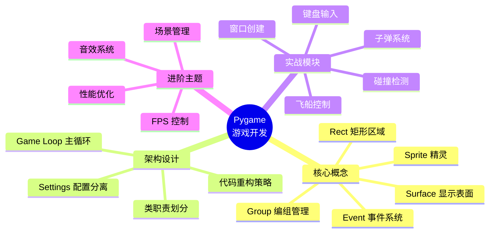
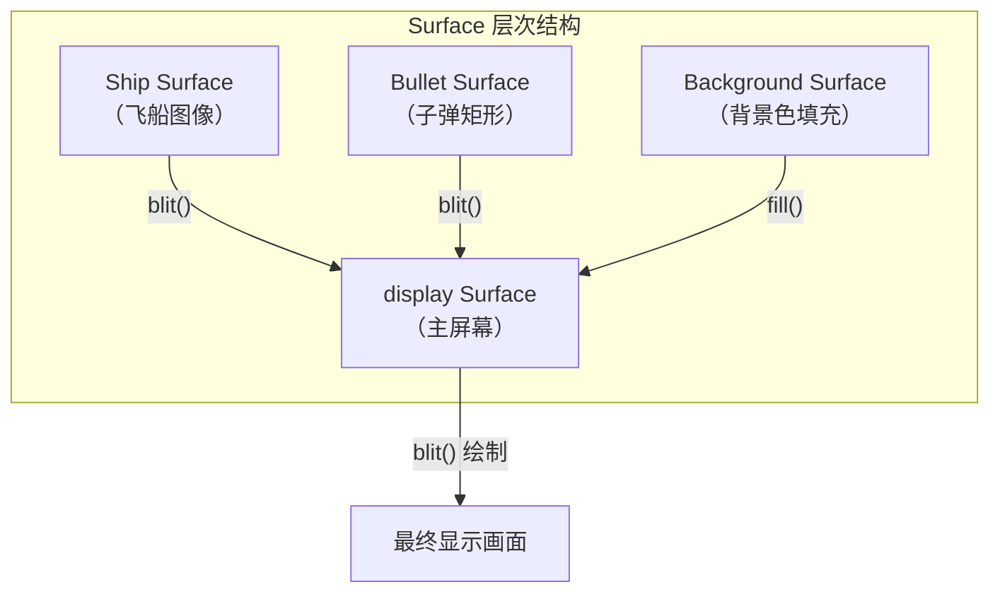
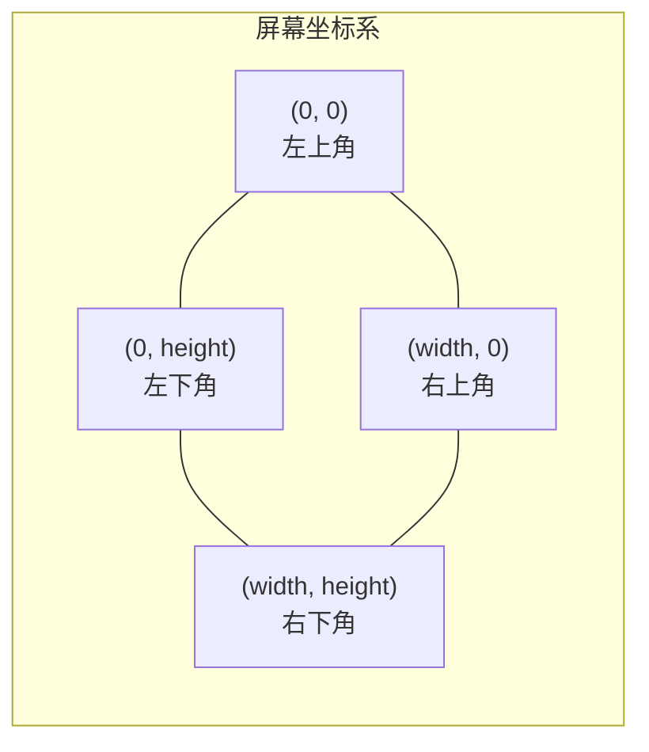
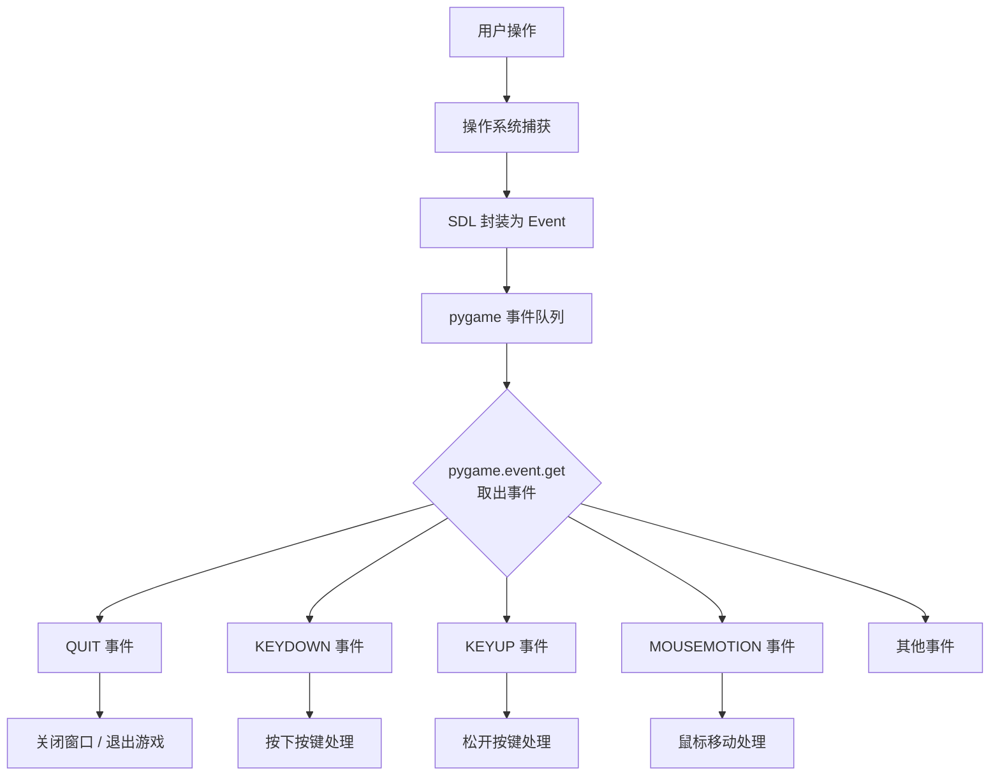
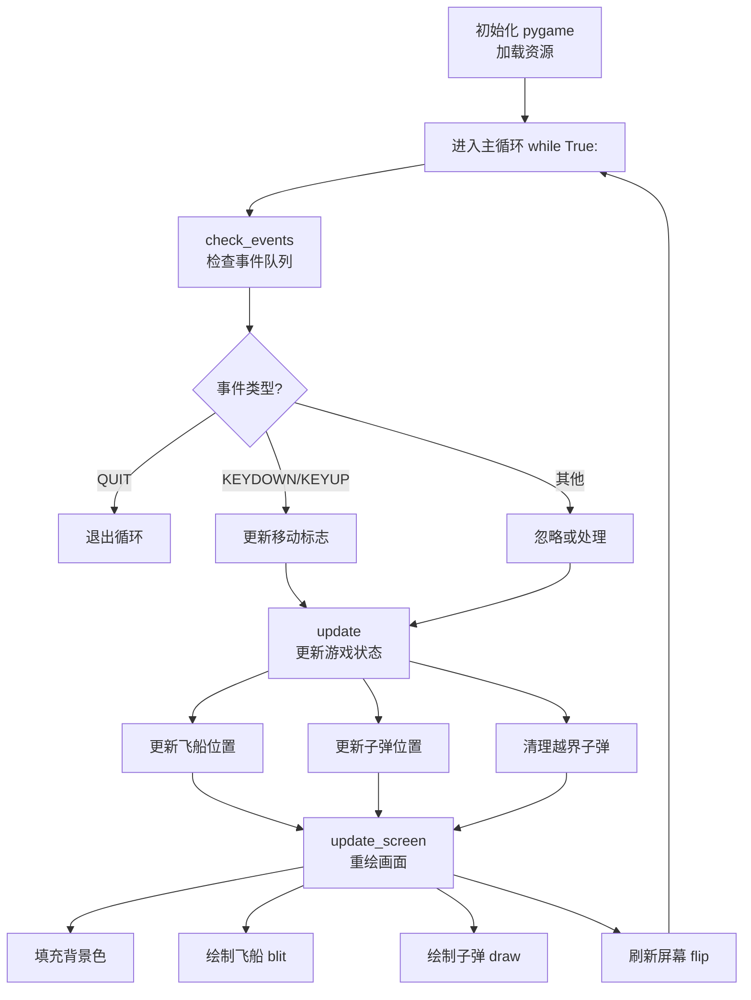
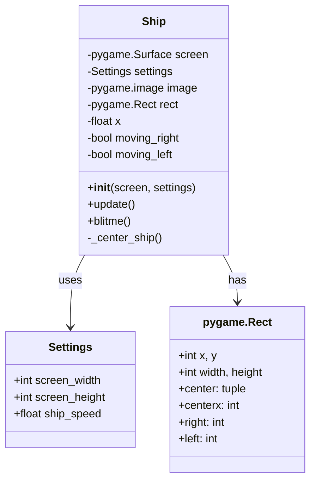
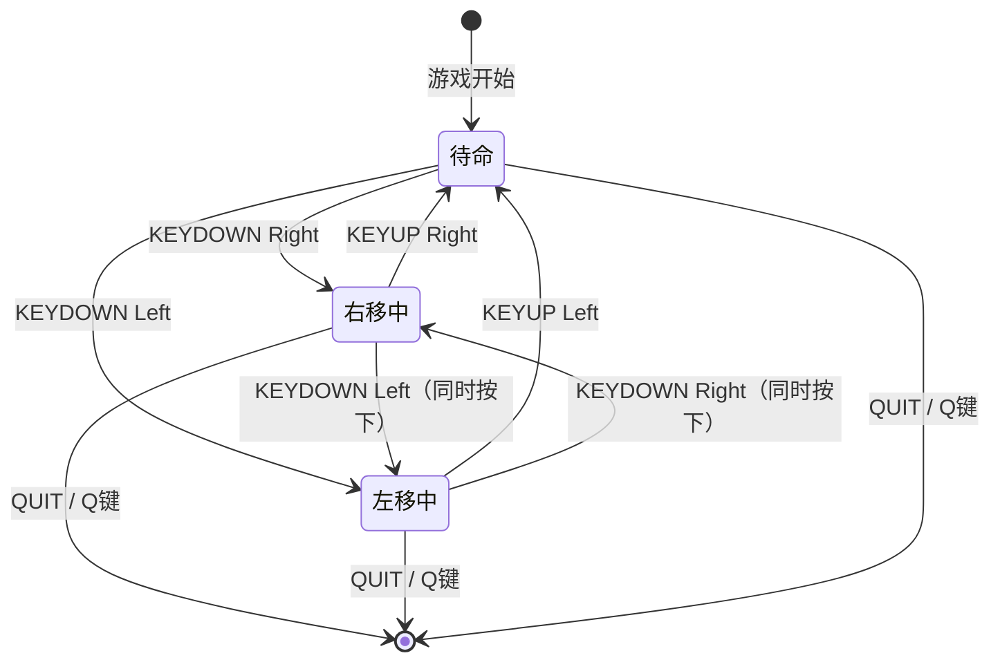
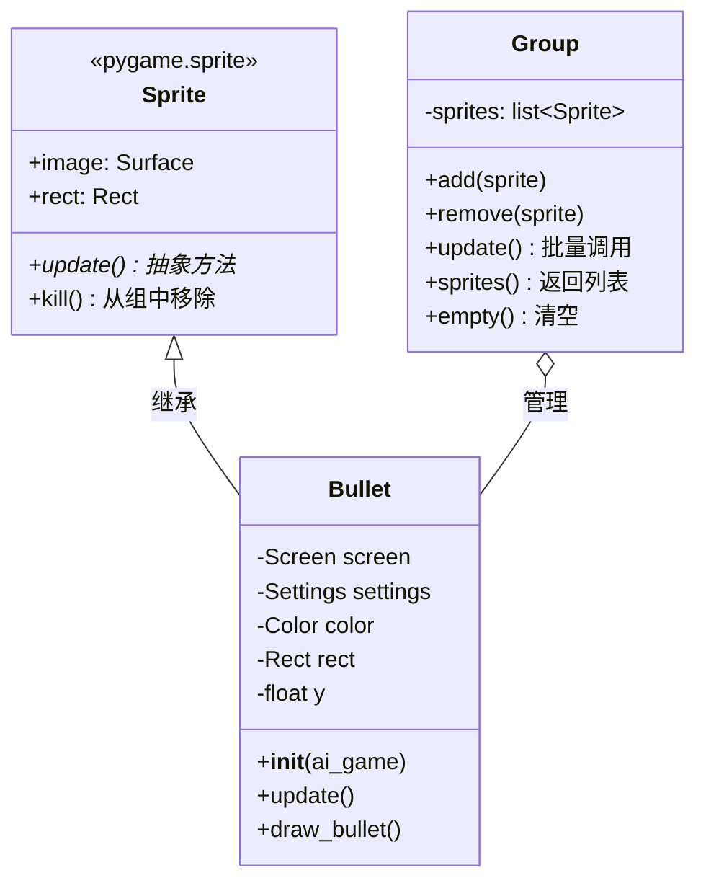

# Pygame 游戏开发基础

> **一句话概括**：Pygame 是 Python 生态中最成熟的游戏开发库，它将 SDL（Simple DirectMedia Layer）的底层能力封装为简洁的 Python API，让你用不到 200 行代码就能构建出一个可交互的 2D 游戏。

## 开篇概述

### Pygame 是什么

Pygame 是一个跨平台的 Python 游戏开发库，基于 [SDL 库](https://www.libsdl.org/) 构建，提供图像渲染、声音播放、键盘鼠标输入、碰撞检测等游戏开发所需的核心功能。自 2000 年发布以来，Pygame 已成为 Python 游戏开发的事实标准。

**核心特征**：

| 特征 | 说明 |
|------|------|
| 跨平台 | Windows / macOS / Linux 全平台支持 |
| 2D 专注 | 专注于 2D 游戏开发，API 简洁直观 |
| 社区活跃 | 大量教程、示例和第三方扩展 |
| 学习友好 | 代码量少，概念清晰，适合入门 |
| 成熟稳定 | 20+ 年发展历史，API 稳定可靠 |

### 安装

```bash
pip install pygame
```

::: tip 验证安装
安装完成后，在 Python 中执行以下代码验证：
```python
import pygame
print(pygame.ver)   # 应输出版本号，如 '2.6.1'
```
如果成功打印版本号，说明安装正常。
:::

### 知识体系总览



---

## Pygame 核心概念

### Surface 与显示系统

Surface 是 Pygame 中最核心的概念——**屏幕上的每一个元素都是 Surface**。理解 Surface 是掌握 Pygame 的第一步。



**Surface 的本质**：一张可以绘制像素的"画布"。主屏幕是一个特殊的 Surface，其他元素（飞船、子弹、敌人）各自也是独立的 Surface，通过 `blit()` 方法将它们"粘贴"到主屏幕上。

| 属性 | 说明 |
|------|------|
| `get_size()` | 返回 `(width, height)` 元组 |
| `get_rect()` | 获取包围该 Surface 的 Rect 对象 |
| `fill(color)` | 用颜色填充整个 Surface |
| `blit(source, dest)` | 将另一个 Surface 绘制到当前 Surface 的指定位置 |
| `convert()` | 转换像素格式以提升绘制性能 |

### 坐标系与颜色模型

#### 屏幕坐标系



> **⚠️ 重要区别**：Pygame 使用的是**屏幕坐标系**——原点在左上角，x 轴向右为正，y 轴向下为正。这与数学坐标系（原点在中心，y 轴向上为正）不同！

**坐标规则速查**：

| 方向 | 坐标变化 | 典型用途 |
|------|---------|---------|
| 向右移动 | x 增加 | 飞船右移 |
| 向左移动 | x 减少 | 飞船左移 |
| 向上移动 | y 减少 | 子弹向上飞行 |
| 向下移动 | y 增加 | 敌人向下逼近 |

#### RGB 颜色模型

Pygame 使用 RGB 颜色模式，每个通道取值范围 0~255：

| 颜色 | RGB 元组 | 说明 |
|------|----------|------|
| 黑色 | `(0, 0, 0)` | 无光 |
| 白色 | `(255, 255, 255)` | 全色混合 |
| 红色 | `(255, 0, 0)` | 仅红色通道 |
| 绿色 | `(0, 255, 0)` | 仅绿色通道 |
| 蓝色 | `(0, 0, 255)` | 仅蓝色通道 |
| 深灰色 | `(230, 230, 230)` | 常用背景色 |

### Rect 矩形与碰撞检测原理

Rect（Rectangle）是 Pygame 中用于表示矩形区域的对象，几乎所有游戏对象都通过 Rect 来定位和检测碰撞。

```python
# Rect 创建方式
rect = pygame.Rect(x, y, width, height)   # 手动创建
rect = surface.get_rect()                   # 从 Surface 获取
```

**Rect 的核心属性**：

| 属性 | 说明 | 示意图位置 |
|------|------|-----------|
| `x`, `y` | 左上角坐标 | ┌───────┐ |
| `width`, `height` | 宽度和高度 │       │ |
| `center` | 中心点坐标 │  ●     │ |
| `centerx`, `centery` | 中心的 x/y 坐标 │       │ |
| `top`, `bottom` | 上边和下边的 y 坐标 │       │ |
| `left`, `right` | 左边和右边的 x 坐标 └───────┘ |
| `midtop`, `midbottom` | 上边中点 / 下边中点 | — |
| `midleft`, `midright` | 左边中点 / 右边中点 | — |

**碰撞检测方法**：

| 方法 | 说明 | 返回值 |
|------|------|--------|
| `rect.colliderect(other)` | 两个矩形是否重叠 | `bool` |
| `rect.collidepoint(x, y)` | 点是否在矩形内 | `bool` |
| `rect.collidelist(list)` | 检测与列表中哪个矩形碰撞 | `int`（索引）或 `-1` |

### 事件驱动模型

Pygame 采用事件驱动架构——用户的每一次按键、鼠标移动、窗口操作都会产生事件，程序通过事件队列来响应这些输入。



**常用事件类型**：

| 事件类型 | 触发时机 | 典型属性 |
|----------|---------|----------|
| `QUIT` | 点击窗口关闭按钮 | — |
| `KEYDOWN` | 按下键盘按键 | `event.key`（按键码）、`event.mod`（修饰键） |
| `KEYUP` | 松开键盘按键 | `event.key` |
| `MOUSEMOTION` | 鼠标移动 | `event.pos`（位置）、`event.rel`（相对位移） |
| `MOUSEBUTTONDOWN` | 鼠标按下 | `event.pos`、`event.button`（哪个键） |
| `MOUSEBUTTONUP` | 鼠标释放 | `event.pos`、`event.button` |

---

## 游戏项目架构设计

### 主循环模式（Game Loop Pattern）

游戏主循环是所有实时游戏的"心脏"——它以极高频率不断重复执行三件事：**检查输入 → 更新状态 → 绘制画面**。



**主循环的核心原则**：

| 原则 | 说明 | 违反后果 |
|------|------|---------|
| 单一职责 | 每个阶段只做一件事 | 代码混乱，难以调试 |
| 固定顺序 | check_events → update → update_screen | 输入延迟或画面闪烁 |
| 高频执行 | 每秒 60~120 次 | 动画卡顿 |
| 及时刷新 | 每帧结束时调用 `flip()` | 画面不更新 |

### Settings 配置分离

将所有配置参数集中到一个类中是游戏开发的最佳实践——修改游戏参数时只需改一处，而非散落在各处的魔法数字。

```python
class Settings:
    """存储游戏的所有设置"""

    def __init__(self):
        # 屏幕设置
        self.screen_width = 1200
        self.screen_height = 800
        self.bg_color = (230, 230, 230)

        # 飞船设置
        self.ship_speed = 1.5
        self.ship_limit = 3

        # 子弹设置
        self.bullet_speed = 1.0
        self.bullet_width = 3
        self.bullet_height = 15
        self.bullet_color = (60, 60, 60)
        self.bullets_allowed = 3
```

**配置类的优势**：

| 优势 | 说明 |
|------|------|
| 集中管理 | 所有参数一目了然 |
| 易于调整 | 改速度只需改一行 |
| 解耦逻辑 | 游戏代码不硬编码数值 |
| 支持扩展 | 后续可从文件/网络加载配置 |

### 代码重构策略

随着游戏功能增加，代码会快速膨胀。Pygame 项目通常遵循以下重构策略：

| 重构手段 | 目的 | 示例 |
|----------|------|------|
| 辅助方法（`_`前缀） | 将长方法拆分为小方法 | `_check_keydown_events()` |
| 类封装 | 将相关数据和行为归为一类 | Ship 类、Bullet 类 |
| 配置类分离 | 将常量集中到 Settings | `self.settings.ship_speed` |
| 编组管理 | 用 Group 批量管理同类对象 | `bullets.update()` |

::: tip 命名约定
- 公共方法：`update()`、`draw_bullet()` —— 外部调用
- 私有辅助方法：`_fire_bullet()`、`_check_keydown_events()` —— 内部实现
- 双下划线属性：`__init__()` —— 特殊方法
:::

---

## 武装飞船实战：完整实现

### 项目规划与需求

我们将从零构建一个"武装飞船"小游戏，核心需求如下：

| 功能模块 | 描述 |
|----------|------|
| 游戏窗口 | 1200×800 像素，灰色背景 |
| 飞船控制 | 左右方向键移动，不能超出屏幕边界 |
| 发射子弹 | 空格键发射，最多同时存在 3 颗子弹 |
| 子弹飞行 | 从飞船位置向上飞行，飞出屏幕后自动销毁 |
| 快捷退出 | 按 Q 键退出游戏 |

### 窗口创建与背景色

```python
import sys
import pygame


def run_game():
    # 初始化游戏并创建一个屏幕对象
    pygame.init()
    screen = pygame.display.set_mode((1200, 800))
    pygame.display.set_caption("Alien Invasion")

    # 设置背景色
    bg_color = (230, 230, 230)

    # 开始游戏的主循环
    while True:
        # 监视键盘和鼠标事件
        for event in pygame.event.get():
            if event.type == pygame.QUIT:
                sys.exit()

        # 每次循环时都重绘屏幕
        screen.fill(bg_color)

        # 让最近绘制的屏幕可见
        pygame.display.flip()


if __name__ == '__main__':
    run_game()
```

**关键步骤解析**：

| 步骤 | 代码 | 作用 |
|------|------|------|
| 初始化 | `pygame.init()` | 初始化所有 Pygame 模块（显示、音频、字体等） |
| 创建窗口 | `display.set_mode((w, h))` | 返回主屏幕 Surface，尺寸 1200×800 |
| 设置标题 | `set_caption()` | 窗口标题栏文字 |
| 事件监听 | `pygame.event.get()` | 获取当前帧所有待处理事件 |
| 填充背景 | `screen.fill(color)` | 用指定颜色覆盖整个屏幕 |
| 刷新显示 | `display.flip()` | 将缓冲区内容绘制到实际屏幕 |

### Ship 类设计

飞船是游戏中玩家控制的实体，需要独立封装为一个类来管理其图像、位置和移动逻辑。



**完整 Ship 类实现**：

```python
import pygame


class Ship:
    """管理飞船的类"""

    def __init__(self, ai_game):
        """初始化飞船并设置其初始位置"""
        self.screen = ai_game.screen
        self.screen_rect = ai_game.screen.get_rect()
        self.settings = ai_game.settings

        # 加载飞船图像并获取其外接矩形
        self.image = pygame.image.load('images/ship.bmp')
        self.rect = self.image.get_rect()

        # 对于每艘新飞船，都将其放在屏幕底部的中央
        self.rect.midbottom = self.screen_rect.midbottom

        # 在飞船的属性 x 中存储浮点数
        self.x = float(self.rect.x)

        # 移动标志
        self.moving_right = False
        self.moving_left = False

    def update(self):
        """根据移动标志调整飞船的位置"""
        if self.moving_right and self.rect.right < self.screen_rect.right:
            self.x += self.settings.ship_speed
        if self.moving_left and self.rect.left > self.screen_rect.left:
            self.x -= self.settings.ship_speed

        # 根据 self.x 更新 rect 对象
        self.rect.x = self.x

    def blitme(self):
        """在指定位置绘制飞船"""
        self.screen.blit(self.image, self.rect)
```

**Ship 类的设计要点**：

| 要点 | 实现 | 原因 |
|------|------|------|
| 图像加载 | `pygame.image.load('ship.bmp')` | 加载位图作为飞船外观 |
| 定位方式 | `rect.midbottom = screen_rect.midbottom` | 将飞船放在屏幕底部中央 |
| 浮点精度 | `self.x = float(self.rect.x)` | 避免 Rect 整数截断导致的速度丢失 |
| 边界限制 | `rect.right < screen_rect.right` | 防止飞船移出屏幕 |
| 移动标志 | `moving_right / moving_left` | 实现持续按住时的平滑移动 |

::: warning 浮点精度问题
`rect.x` 只能存储整数。如果直接用 `rect.x += 0.5`，由于整数截断，实际位移会是 0 或 1，导致移动速度不稳定。解决方案是用单独的 float 变量存储精确位置，每帧更新后再赋值给 `rect.x`。
:::

### 键盘控制系统

Pygame 的键盘输入基于 KEYDOWN（按下）和 KEYUP（松开）两个事件，配合布尔标志位实现持续移动的状态机模式。



**事件处理代码**：

```python
def _check_events(self):
    """响应按键和鼠标事件"""
    for event in pygame.event.get():
        if event.type == pygame.QUIT:
            sys.exit()
        elif event.type == pygame.KEYDOWN:
            self._check_keydown_events(event)
        elif event.type == pygame.KEYUP:
            self._check_keyup_events(event)


def _check_keydown_events(self, event):
    """响应按下"""
    if event.key == pygame.K_RIGHT:
        self.ship.moving_right = True
    elif event.key == pygame.K_LEFT:
        self.ship.moving_left = True
    elif event.key == pygame.K_q:
        sys.exit()


def _check_keyup_events(self, event):
    """响应松开"""
    if event.key == pygame.K_RIGHT:
        self.ship.moving_right = False
    elif event.key == pygame.K_LEFT:
        self.ship.moving_left = False
```

**常用按键码速查表**：

| 按键 | Pygame 常量 | 说明 |
|------|------------|------|
| ← 左箭头 | `K_LEFT` | 飞船左移 |
| → 右箭头 | `K_RIGHT` | 飞船右移 |
| ↑ 上箭头 | `K_UP` | 向上移动 |
| ↓ 下箭头 | `K_DOWN` | 向下移动 |
| 空格 | `K_SPACE` | 发射子弹 |
| Q | `K_q` | 快捷退出 |
| Esc | `K_ESCAPE` | 暂停/退出 |
| Enter | `K_RETURN` | 确认/开始 |

### 子弹系统（Sprite + Group 编组）

子弹系统展示了 Pygame 最强大的特性之一——**精灵（Sprite）和编组（Group）**。精灵是游戏中的可移动对象，编组用于批量管理同类型的精灵。



**Bullet 类实现**：

```python
import pygame
from pygame.sprite import Sprite


class Bullet(Sprite):
    """管理飞船所发射子弹的类"""

    def __init__(self, ai_game):
        """在飞船当前位置创建一个子弹对象"""
        super().__init__()
        self.screen = ai_game.screen
        self.settings = ai_game.settings
        self.color = self.settings.bullet_color

        # 在 (0,0) 处创建一个表示子弹的矩形，
        # 再设置正确的位置
        self.rect = pygame.Rect(
            0, 0,
            self.settings.bullet_width,
            self.settings.bullet_height
        )
        self.rect.midtop = ai_game.ship.rect.midtop

        # 存储用浮点数表示的子弹位置
        self.y = float(self.rect.y)

    def update(self):
        """向上移动子弹"""
        # 更新表示子弹位置的浮点数值
        self.y -= self.settings.bullet_speed
        # 更新表示子弹的 rect 的位置
        self.rect.y = self.y

    def draw_bullet(self):
        """在屏幕上绘制子弹"""
        pygame.draw.rect(self.screen, self.color, self.rect)
```

**Group 编组的威力**：

```python
# 创建子弹编组
self.bullets = pygame.sprite.Group()

# 发射子弹：创建并加入编组
if len(self.bullets) < self.settings.bullets_allowed:
    new_bullet = Bullet(self)
    self.bullets.add(new_bullet)

# 更新所有子弹的位置
self.bullets.update()

# 绘制所有子弹
for bullet in self.bullets.sprites():
    bullet.draw_bullet()

# 删除消失的子弹（遍历副本以安全删除）
for bullet in self.bullets.copy():
    if bullet.rect.bottom <= 0:
        self.bullets.remove(bullet)
```

**Group 常用方法一览**：

| 方法 | 说明 | 返回值 |
|------|------|--------|
| `add(sprite)` | 添加精灵到编组 | None |
| `remove(sprite)` | 从编组移除精灵 | None |
| `update()` | 调用每个精灵的 `update()` 方法 | None |
| `sprites()` | 返回包含所有精灵的列表 | `list[Sprite]` |
| `empty()` | 清空编组 | None |
| `has(sprite)` | 检查精灵是否在编组中 | `bool` |
| `len(group)` | 获取编组中精灵数量 | `int` |

::: info 为什么子弹不用图像？
子弹是一个简单的实心矩形，使用 `pygame.Rect` 手动创建比加载图片更高效。对于复杂图形（如飞船、敌人），才需要 `image.load()` 加载位图资源。
:::

### 完整代码整合

以下是可以直接运行的完整游戏代码：

```python
"""
Alien Invasion —— 武装飞船游戏
完整可运行版本，包含飞船控制和子弹发射功能
"""

import sys
import pygame
from pygame.sprite import Sprite


class Settings:
    """存储游戏的所有设置"""

    def __init__(self):
        # 屏幕设置
        self.screen_width = 1200
        self.screen_height = 800
        self.bg_color = (230, 230, 230)

        # 飞船设置
        self.ship_speed = 1.5

        # 子弹设置
        self.bullet_speed = 1.0
        self.bullet_width = 3
        self.bullet_height = 15
        self.bullet_color = (60, 60, 60)
        self.bullets_allowed = 3


class Ship:
    """管理飞船的类"""

    def __init__(self, ai_game):
        """初始化飞船并设置其初始位置"""
        self.screen = ai_game.screen
        self.screen_rect = ai_game.screen.get_rect()
        self.settings = ai_game.settings

        # 加载飞船图像并获取其外接矩形
        self.image = pygame.image.load('images/ship.bmp')
        self.rect = self.image.get_rect()

        # 对于每艘新飞船，都将其放在屏幕底部的中央
        self.rect.midbottom = self.screen_rect.midbottom

        # 在飞船的属性 x 中存储浮点数
        self.x = float(self.rect.x)

        # 移动标志
        self.moving_right = False
        self.moving_left = False

    def update(self):
        """根据移动标志调整飞船的位置"""
        if self.moving_right and self.rect.right < self.screen_rect.right:
            self.x += self.settings.ship_speed
        if self.moving_left and self.rect.left > self.screen_rect.left:
            self.x -= self.settings.ship_speed

        # 根据 self.x 更新 rect 对象
        self.rect.x = self.x

    def blitme(self):
        """在指定位置绘制飞船"""
        self.screen.blit(self.image, self.rect)


class Bullet(Sprite):
    """管理飞船所发射子弹的类"""

    def __init__(self, ai_game):
        """在飞船当前位置创建一个子弹对象"""
        super().__init__()
        self.screen = ai_game.screen
        self.settings = ai_game.settings
        self.color = self.settings.bullet_color

        # 在 (0,0) 处创建一个表示子弹的矩形，再设置正确的位置
        self.rect = pygame.Rect(
            0, 0,
            self.settings.bullet_width,
            self.settings.bullet_height
        )
        self.rect.midtop = ai_game.ship.rect.midtop

        # 存储用浮点数表示的子弹位置
        self.y = float(self.rect.y)

    def update(self):
        """向上移动子弹"""
        # 更新表示子弹位置的浮点数值
        self.y -= self.settings.bullet_speed
        # 更新表示子弹的 rect 的位置
        self.rect.y = self.y

    def draw_bullet(self):
        """在屏幕上绘制子弹"""
        pygame.draw.rect(self.screen, self.color, self.rect)


class AlienInvasion:
    """管理游戏资源和行为的类"""

    def __init__(self):
        """初始化游戏并创建游戏资源"""
        pygame.init()
        self.settings = Settings()

        self.screen = pygame.display.set_mode(
            (self.settings.screen_width, self.settings.screen_height)
        )
        pygame.display.set_caption("Alien Invasion")

        self.ship = Ship(self)
        self.bullets = pygame.sprite.Group()

    def run_game(self):
        """开始游戏的主循环"""
        while True:
            self._check_events()
            self.ship.update()
            self._update_bullets()
            self._update_screen()

    def _check_events(self):
        """响应按键和鼠标事件"""
        for event in pygame.event.get():
            if event.type == pygame.QUIT:
                sys.exit()
            elif event.type == pygame.KEYDOWN:
                self._check_keydown_events(event)
            elif event.type == pygame.KEYUP:
                self._check_keyup_events(event)

    def _check_keydown_events(self, event):
        """响应按下"""
        if event.key == pygame.K_RIGHT:
            self.ship.moving_right = True
        elif event.key == pygame.K_LEFT:
            self.ship.moving_left = True
        elif event.key == pygame.K_SPACE:
            self._fire_bullet()
        elif event.key == pygame.K_q:
            sys.exit()

    def _check_keyup_events(self, event):
        """响应松开"""
        if event.key == pygame.K_RIGHT:
            self.ship.moving_right = False
        elif event.key == pygame.K_LEFT:
            self.ship.moving_left = False

    def _fire_bullet(self):
        """创建一颗子弹，并将其加入编组 bullets"""
        if len(self.bullets) < self.settings.bullets_allowed:
            new_bullet = Bullet(self)
            self.bullets.add(new_bullet)

    def _update_bullets(self):
        """更新子弹的位置，并删除已消失的子弹"""
        # 更新子弹的位置
        self.bullets.update()

        # 删除已消失的子弹
        for bullet in self.bullets.copy():
            if bullet.rect.bottom <= 0:
                self.bullets.remove(bullet)

    def _update_screen(self):
        """更新屏幕上的图像，并切换到新屏幕"""
        self.screen.fill(self.settings.bg_color)
        self.ship.blitme()

        for bullet in self.bullets.sprites():
            bullet.draw_bullet()

        # 让最近绘制的屏幕可见
        pygame.display.flip()


if __name__ == '__main__':
    # 创建游戏实例并运行游戏
    ai = AlienInvasion()
    ai.run_game()
```

**项目文件结构**：

```
alien_invasion/
├── alien_invasion.py          # 主程序入口
├── images/
│   └── ship.bmp               # 飞船位图（需自行准备）
└── README.md                  # 项目说明
```

::: tip 准备飞船图片
你需要一张名为 `ship.bmp` 的位图文件放在 `images/` 目录下。可以使用任何图片编辑工具创建，推荐尺寸约 50×50 像素，PNG 格式也可（将代码中的 `.bmp` 改为 `.png`）。如果没有现成图片，可以用纯色矩形替代测试。
:::

---

## Pygame 常用模块速查

### 核心模块一览

| 模块 | 功能 | 常用函数/类 |
|------|------|------------|
| `pygame.display` | 窗口管理与屏幕刷新 | `set_mode()`, `set_caption()`, `flip()` |
| `pygame.event` | 事件队列管理 | `get()`, `poll()`, `wait()` |
| `pygame.image` | 图片加载与保存 | `load()`, `save()` |
| `pygame.sprite` | 精灵与编组系统 | `Sprite`, `Group`, `GroupSingle` |
| `pygame.draw` | 基础图形绘制 | `rect()`, `circle()`, `line()`, `polygon()` |
| `pygame.transform` | 图像变换 | `scale()`, `rotate()`, `flip()` |
| `pygame.mixer` | 音频播放 | `Sound()`, `music.load()`, `music.play()` |
| `pygame.font` | 文字渲染 | `Font()`, `SysFont()` |
| `pygame.time` | 时间控制 | `Clock()`, `get_ticks()` |
| `pygame.key` | 键盘状态查询 | `get_pressed()`, `name()` |
| `pygame.mouse` | 鼠标状态查询 | `get_pos()`, `get_pressed()` |

### 初始化与退出

| 操作 | 代码 | 说明 |
|------|------|------|
| 初始化 | `pygame.init()` | 初始化所有模块 |
| 退出 | `pygame.quit()` | 卸载所有模块（通常配合 `sys.exit()`） |
| 版本查看 | `pygame.ver` | 字符串形式的版本号 |

### 显示相关

| 操作 | 代码 | 说明 |
|------|------|------|
| 创建窗口 | `pygame.display.set_mode((1200, 800))` | 返回主屏幕 Surface |
| 全屏模式 | `pygame.display.set_mode((0, 0), pygame.FULLSCREEN)` | 占据整个显示器 |
| 设置标题 | `pygame.display.set_caption("游戏名称")` | 窗口标题栏文字 |
| 刷新屏幕 | `pygame.display.flip()` | 将缓冲区绘制到屏幕 |
| 更新部分区域 | `pygame.display.update(rect_list)` | 只刷新指定区域（性能优化） |

---

## 性能优化初步

### FPS 控制

默认情况下，Pygame 会以尽可能快的速度运行主循环，这会导致不同电脑上游戏速度不一致。使用 `Clock` 对象可以锁定帧率：

```python
# 在 __init__ 中创建时钟
self.clock = pygame.time.Clock()

# 在主循环末尾限制帧率
while True:
    # ... 游戏逻辑 ...
    self.clock.tick(60)   # 限制为 60 FPS
```

| 帧率 | 适用场景 | 说明 |
|------|---------|------|
| 30 FPS | 简单 2D 游戏 | 流畅度够用，CPU 占用低 |
| 60 FPS | 大多数游戏 | 行业标准，体验流畅 |
| 120 FPS | 竞技/动作游戏 | 更流畅，但 CPU/GPU 开销大 |

### 脏矩形更新

当屏幕只有少量区域发生变化时，不需要重绘整个屏幕。`pygame.display.update()` 可以只刷新指定的矩形区域：

```python
# 只刷新发生变化的区域
dirty_rects = []
dirty_rects.append(ship.rect)
for bullet in bullets:
    dirty_rects.append(bullet.rect)
pygame.display.update(dirty_rects)
```

::: tip 性能优化优先级
1. **FPS 控制**（必须做）——保证不同机器上速度一致
2. **脏矩形更新**（可选）——大量对象时效果明显
3. **Surface.convert()**（必做）——转换像素格式提升 blit 性能
4. **减少不必要的绘制**（推荐）——只在必要时更新
:::

---

## 常见陷阱

### 陷阱 1：浮点精度丢失

**现象**：飞船移动速度忽快忽慢，或者某些速度值完全无效。

**原因**：`Rect` 的 `x` 和 `y` 属性只能存储整数。直接对它们进行小于 1 的加减会被截断为零。

```python
# ❌ 错误做法：速度丢失
self.rect.x += 0.5   # 实际效果：有时+0，有时+1，不稳定

# ✅ 正确做法：用 float 变量保存精确位置
self.x += 0.5         # float 精确累加
self.rect.x = self.x  # 最终赋值给 rect（自动截断为 int）
```

### 陷阱 2：遍历编组时删除元素

**现象**：运行时抛出 `RuntimeError: list changed size during iteration` 或子弹删除不彻底。

**原因**：Python 不允许在遍历列表/集合的同时修改它。

```python
# ❌ 错误做法：直接遍历删除
for bullet in self.bullets:        # 遍历原列表
    if bullet.rect.bottom <= 0:
        self.bullets.remove(bullet)  # 同时修改列表 → 报错！

# ✅ 正确做法：遍历副本
for bullet in self.bullets.copy():  # 遍历副本
    if bullet.rect.bottom <= 0:
        self.bullets.remove(bullet)  # 修改原列表 → 安全
```

### 陷阱 3：忘记调用 super().__init__()

**现象**：继承 Sprite 的子类报错，或精灵无法正确加入 Group。

**原因**：`Sprite.__init__()` 内部会初始化必要的属性（如 `_sprite_group`），跳过它会导致后续操作异常。

```python
class Bullet(Sprite):
    def __init__(self, ai_game):
        # ❌ 缺少这一行
        super().__init__()   # 必须调用！
        # ... 其他初始化代码
```

### 陷阱 4：事件队列堆积

**现象**：按键响应有明显的延迟感，松开按键后物体还在继续移动。

**原因**：主循环执行太慢，导致事件队列中积压了大量的 KEYDOWN 事件尚未处理。

```python
# 解决方案：确保主循环足够快
self.clock.tick(60)   # 保持 60 FPS
```

### 陷阱 5：图片路径错误

**现象**：`FileNotFoundError: No such file or directory: 'images/ship.bmp'`

**原因**：Pygame 的 `image.load()` 使用相对于**工作目录**（不是脚本所在目录）的路径。

```python
# 推荐做法：使用绝对路径或基于脚本的路径
import os

BASE_DIR = os.path.dirname(os.path.abspath(__file__))
ship_path = os.path.join(BASE_DIR, 'images', 'ship.bmp')
self.image = pygame.image.load(ship_path)
```

### 陷阱 6：全屏模式下无法关闭

**现象**：进入全屏后，点击关闭按钮无反应，只能强制结束进程。

**原因**：全屏模式下某些系统的关闭按钮事件可能被拦截。

```python
# 解决方案：添加快捷键退出
elif event.type == pygame.KEYDOWN:
    if event.key == pygame.K_q:
        sys.exit()   # Q 键随时可退出
```

### 陷阱汇总表

| 陷阱 | 症状 | 根因 | 解决方案 |
|------|------|------|---------|
| 浮点精度丢失 | 移动速度不稳定 | Rect 只存整数 | 用 float 变量暂存位置 |
| 遍历时删除报错 | RuntimeError | 不能边遍历边修改 | 遍历 `copy()` 副本 |
| 忘记 super() | Sprite 异常 | 未初始化基类属性 | 调用 `super().__init__()` |
| 事件延迟 | 按键反应慢 | 事件队列堆积 | 保持高帧率 |
| 路径错误 | FileNotFoundError | 相对路径依赖工作目录 | 使用 `os.path` 构建路径 |
| 全屏卡死 | 无法关闭窗口 | 关闭事件被拦截 | 添加快捷键退出 |

---

## 术语表

| 术语 | 英文 | 说明 |
|------|------|------|
| **Surface** | Surface | Pygame 中的"画布"，所有可见元素都是 Surface，包括屏幕本身 |
| **Rect** | Rectangle | 矩形区域对象，用于定位、碰撞检测和边界判断 |
| **Sprite** | Sprite | 游戏精灵，代表屏幕上一个可移动的游戏对象（如飞船、子弹、敌人） |
| **Group** | Group | 精灵编组，用于批量管理和更新多个同类精灵 |
| **Event** | Event | 事件对象，封装用户输入（按键、鼠标）或系统消息（关闭窗口） |
| **Blit** | Block Transfer | 位块传输，将一个 Surface 的内容复制到另一个 Surface 上 |
| **Flip** | Flip | 翻转/刷新，将内存中的绘制结果呈现到实际屏幕 |
| **FPS** | Frames Per Second | 每秒帧数，衡量游戏运行速度的单位 |
| **Game Loop** | Game Loop | 游戏主循环，不断重复「输入→更新→渲染」的核心循环 |
| **Collision Detection** | Collision Detection | 碰撞检测，判断两个游戏对象是否接触或重叠 |
| **Dirty Rectangle** | Dirty Rectangle | 脏矩形，只重绘屏幕中发生变化的部分区域以节省性能 |
| **SDL** | Simple DirectMedia Layer | Pygame 底层依赖的跨平台多媒体库 |
| **Alpha Channel** | Alpha Channel | 透明度通道，控制像素的透明程度（0=全透明，255=不透明） |
| **Pixel Format** | Pixel Format | 像素格式，描述颜色在内存中的存储方式（RGB/RGBA 等） |
| **Event Queue** | Event Queue | 事件队列，存储待处理的用户输入和系统事件的先进先出队列 |
| **Key Code** | Key Code | 按键码，Pygame 为每个物理按键分配的唯一数字标识符 |
| **State Machine** | State Machine | 状态机，用一组状态和转移规则来建模对象的行为（如移动标志位） |

---

## 延伸阅读

| 资源 | 说明 |
|------|------|
| [Pygame 官方文档](https://www.pygame.org/docs/) | 最权威的 API 参考，涵盖所有模块和函数 |
| [Pygame 官网](https://www.pygame.org/) | 新闻、示例项目和社区资源 |
| [Program Arcade Games With Python](https://programarcadegames.com/) | Paul Craven 的免费在线教材，从零到完整游戏 |
| [Real Python - Pygame 教程](https://realpython.com/pygame-a-primer/) | 英文入门教程，适合有 Python 基础的开发者 |
| [Python Crash Course - Alien Invasion](https://nostarch.com/pythoncrashcourse2e) | Eric Matthes 的经典书籍，本章内容即源于此项目的精炼版 |
| [Pygame Wiki](https://www.pygame.org/wiki/) | 社区维护的知识库，包含大量技巧和最佳实践 |
| [Pygame GitHub](https://github.com/pygame/pygame) | 源码仓库，可查阅实现细节和提交 Issue |

## 版本差异（第三方库 → 当前稳定版）

| 库 | 本文编写时 | 当前稳定版 |
|----|-----------|-----------|
| `pydantic` | 1.x | 2.x（V2 核心重写，API 兼容层 `v1` 可选） |
| `pytest` | 7.x | 8.x（`pytest 8` 移除部分旧插件兼容） |
| `Pillow` | 9.x/10.x | 11.x |
| `psutil` | 5.x | 6.x/7.x |
| `chardet` | 4.x | 5.x（纯 Python；如需更高性能可选用 `charset-normalizer` 或维护中的 `faust-cchardet`） |

> 本文示例多为概念讲解，API 基本稳定；升级第三方库时以官方 changelog 为准。
