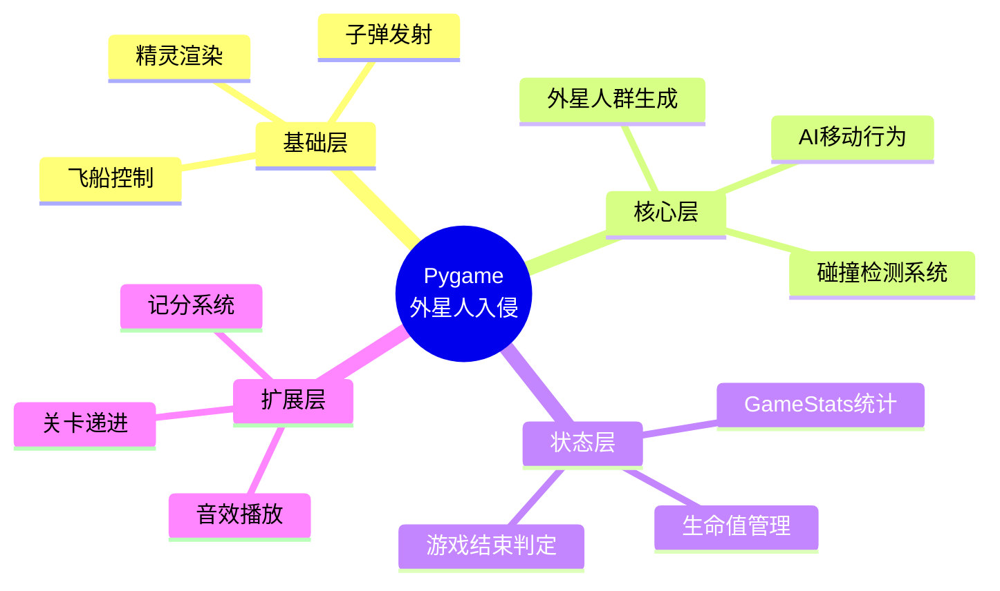
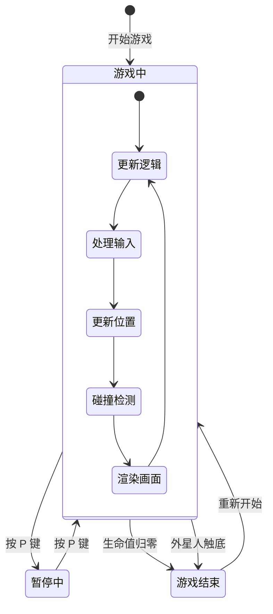
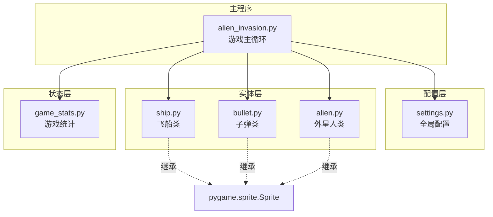
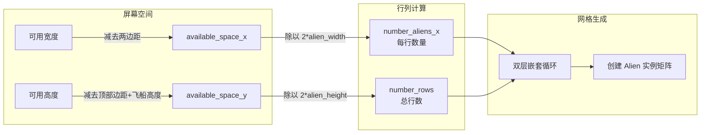
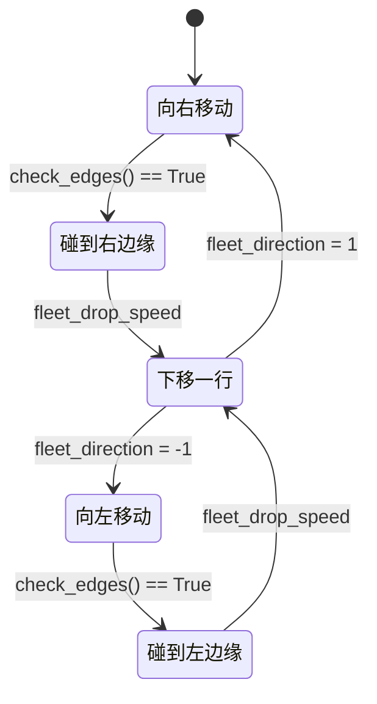

# Pygame 外星人入侵实战

## 开篇概述

在 《07-Pygame武装飞船实战》 中，我们实现了飞船移动和子弹发射的基础功能。本章将在此基础上，构建一个**完整的外星人入侵游戏**，引入以下核心系统：

- **外星人群生成与网格布局算法**
- **外星人 AI 移动行为系统**
- **多对象碰撞检测机制**
- **游戏状态管理与生命系统**

::: tip 知识体系定位

本节是 Pygame 游戏开发的**进阶核心篇**，承上启下：
- **前置知识**：Sprite 精灵类、Group 精灵群、事件循环（07 章）
- **本节重点**：精灵群协作、碰撞检测、状态机设计
- **后续扩展**：音效系统、粒子效果、关卡设计



:::

## 游戏需求与架构设计

### 游戏规则定义

在编码之前，我们需要明确游戏的核心规则和状态流转：

| 规则项 | 具体描述 |
|--------|----------|
| **玩家操作** | 鼠标/键盘控制飞船左右移动，空格键发射子弹 |
| **敌人行为** | 外星人群以网格形式排列，整体水平移动，碰边后下移并反向 |
| **胜利条件** | 消灭所有外星人后生成新一批（可扩展为关卡递进） |
| **失败条件** | 外星人撞到飞船 或 外星人到达屏幕底部 |
| **生命系统** | 初始 3 条命，被撞击后 -1，归零时游戏结束 |

#### 游戏状态机



### 文件模块划分

本项目采用**模块化架构**，每个文件职责单一：



#### 文件职责分工表

| 文件名 | 类/函数 | 职责说明 | 依赖关系 |
|--------|---------|----------|----------|
| `alien_invasion.py` | `AlienInvasion` | 游戏主类，管理事件循环、精灵群、状态流转 | 所有模块 |
| `settings.py` | `Settings` | 集中管理所有配置参数（屏幕尺寸、颜色、速度等） | 无 |
| `ship.py` | `Ship` | 飞船实体，处理移动和绘制 | pygame, settings |
| `bullet.py` | `Bullet` | 子弹实体，管理位置更新和屏幕边界清理 | pygame, settings |
| `alien.py` | `Alien` | 外星人实体，实现移动和边缘检测 | pygame, settings |
| `game_stats.py` | `GameStats` | 游戏状态追踪（生命值、分数、等级） | settings |

## Alien 类设计

外星人类是游戏的**敌对实体**，继承自 `pygame.sprite.Sprite`，需要支持：

1. 图像加载与渲染
2. 位置初始化（浮点精度）
3. 移动方法（受 fleet_direction 控制）

### 完整代码实现

```python
# alien.py
import pygame
from pygame.sprite import Sprite


class Alien(Sprite):
    """表示单个外星人的类"""

    def __init__(self, ai_game):
        """初始化外星人并设置其起始位置"""
        super().__init__()
        self.screen = ai_game.screen
        self.settings = ai_game.settings

        # 加载外星人图像并设置其rect属性
        self.image = pygame.image.load('images/alien.bmp')
        self.rect = self.image.get_rect()

        # 每个外星人最初都在屏幕左上角附近
        self.rect.x = self.rect.width
        self.rect.y = self.rect.height

        # 存储外星人的精确水平位置（使用浮点数）
        self.x = float(self.rect.x)

    def check_edges(self):
        """如果外星人位于屏幕边缘，就返回True"""
        screen_rect = self.screen.get_rect()
        if self.rect.right >= screen_rect.right or self.rect.left <= 0:
            return True
        return False

    def update(self):
        """向左或向右移动外星人"""
        self.x += (self.settings.alien_speed *
                   self.settings.fleet_direction)
        self.rect.x = self.x
```

::: warning 关键设计点

**为什么使用 `float(self.x)`？**
- `rect.x` 只能存储整数，直接累加速度会导致**精度丢失**
- 当速度 < 1 像素/帧时，整数截断会导致外星人完全不动
- 浮点数存储确保亚像素级平滑移动

```python
# 错误做法：速度=0.5时永远不移动
self.rect.x += 0.5  # rect.x 始终为 0

# 正确做法：浮点累积后再取整
self.x += 0.5       # 内部精确累加
self.rect.x = self.x # 最终转换为整数显示
```

:::

## 外星人群生成系统

### 网格布局算法

外星人以**矩阵网格**形式排列，算法分为两步：计算每行数量 + 计算行数。

#### 布局计算示意图



#### 数学公式

$$
\begin{aligned}
\text{available\_space}_x &= \text{screen\_width} - 2 \times \text{alien\_width} \\
\text{number\_aliens\_x} &= \left\lfloor \frac{\text{available\_space\_x}}{2 \times \text{alien\_width}} \right\rfloor \\[10pt]
\text{available\_space}_y &= \text{screen\_height} - 3 \times \text{alien\_height} - \text{ship\_height} \\
\text{number\_rows} &= \left\lfloor \frac{\text{available\_space}_y}{2 \times \text{alien\_height}} \right\rfloor
\end{aligned}
$$

### _create_fleet() 实现

```python
# alien_invasion.py 中的方法
def _create_fleet(self):
    """创建外星人群"""
    # 创建一个外星人，用于计算间距
    alien = Alien(self)
    alien_width, alien_height = alien.rect.size

    # 计算可容纳多少个外星人
    available_space_x = self.settings.screen_width - (2 * alien_width)
    number_aliens_x = available_space_x // (2 * alien_width)

    # 计算屏幕可容纳多少行外星人
    ship_height = self.ship.rect.height
    available_space_y = (self.settings.screen_height -
                         (3 * alien_height) - ship_height)
    number_rows = available_space_y // (2 * alien_height)

    # 创建外星人群
    for row_number in range(number_rows):
        for alien_number in range(number_aliens_x):
            self._create_alien(alien_number, row_number)
```

### 重构策略：_create_alien()

将单行创建逻辑提取为独立方法，提升可读性和复用性：

```python
def _create_alien(self, alien_number, row_number):
    """创建一个外星人并将其放在当前行"""
    alien = Alien(self)
    alien_width, alien_height = alien.rect.size
    alien.x = alien_width + 2 * alien_width * alien_number
    alien.rect.x = alien.x
    alien.rect.y = alien.rect.height + 2 * alien_rect.height * row_number
    self.aliens.add(alien)
```

::: info 设计模式：工厂方法

`_create_alien()` 是典型的**工厂方法**模式：
- **封装创建细节**：调用者无需知道位置计算逻辑
- **参数化配置**：通过行列号动态确定位置
- **自动注册**：创建后立即加入精灵群

:::

### 动态调整：基于屏幕尺寸自适应

上述算法的优势在于**完全基于实际尺寸计算**，而非硬编码数值：

| 屏幕分辨率 | 预估外星人数量（假设 64×48 像素） |
|------------|----------------------------------|
| 800×600 | ~11 列 × 5 行 = 55 个 |
| 1200×800 | ~17 列 × 7 行 = 119 个 |
| 1920×1080 | ~28 列 × 10 行 = 280 个 |

> **性能提示**：高分辨率下外星人数量激增，建议设置 `max_aliens` 上限或采用对象池技术。

## 外星人 AI 行为系统

### 移动模式

外星人的移动遵循经典的**打字机扫描模式**（Typewriter Pattern）：



### Settings 中的 AI 参数

```python
# settings.py
class Settings:
    def __init__(self):
        # ... 其他配置 ...

        # 外星人设置
        self.alien_speed = 1.0
        self.fleet_drop_speed = 10
        self.fleet_direction = 1  # 1 表示右移，-1 表示左移

        # 飞船限制
        self.ship_limit = 3
```

### 边缘检测与方向切换

```python
# alien_invasion.py
def _check_fleet_edges(self):
    """在有外星人到达边缘时采取相应措施"""
    for alien in self.aliens.sprites():
        if alien.check_edges():
            self._change_fleet_direction()
            break

def _change_fleet_direction(self):
    """将整群外星人下移，并改变它们的方向"""
    for alien in self.aliens.sprites():
        alien.rect.y += self.settings.fleet_drop_speed
    self.settings.fleet_direction *= -1
```

### 速度平衡性调优

| 参数 | 默认值 | 影响范围 | 调优建议 |
|------|--------|----------|----------|
| `alien_speed` | 1.0 | 水平移动速率 | 初期设低，随关卡递增 |
| `fleet_drop_speed` | 10 | 下移像素数 | 保持 > alien_height 的 50% |
| `fleet_direction` | ±1 | 移动方向 | 仅限 1 和 -1 |

::: danger 平衡性陷阱

**常见错误**：`fleet_drop_speed` 设置过小导致外星人"粘"在边缘抖动。
- 原因：方向切换后立即再次触发边缘检测
- 解决：确保下移距离足够大，或在切换后添加冷却帧

```python
# 错误：可能产生抖动
self.settings.fleet_drop_speed = 1  # 太小！

# 正确：确保明显位移
self.settings.fleet_drop_speed = 10  # 接近半个外星人高度
```

:::

## 碰撞检测系统

Pygame 提供了多种碰撞检测 API，理解它们的语义差异至关重要。

### Pygame 碰撞检测 API 速查表

| 方法 | 返回值类型 | 用途 | 性能特征 |
|------|-----------|------|----------|
| `spritecollide()` | `list[Sprite]` | 单精灵 vs 精灵群 | O(n) 遍历 |
| **`groupcollide()`** | **`dict[Sprite, list[Sprite]]`** | **精灵群 vs 精灵群** | **O(m×n) 双重遍历** |
| `spritecollideany()` | `Sprite \| None` | 单精灵 vs 精灵群（任一命中即停） | O(n) 短路 |
| `collide_rect()` | `bool` | 两精灵矩形碰撞 | O(1) 常量时间 |

### 子弹-外星人碰撞（groupcollide）

这是游戏中最复杂的碰撞场景：**多个子弹同时击中多个外星人**。

```python
# alien_invasion.py
def _check_bullet_alien_collisions(self):
    """响应子弹和外星人的碰撞"""
    # 检查是否有子弹击中了外星人
    # 如果是，就删除相应的子弹和外星人
    collisions = pygame.sprite.groupcollide(
        self.bullets, self.aliens, True, True
    )

    if collisions:
        for aliens in collisions.values():
            # 后续可在此处添加记分逻辑
            # self.stats.score += len(aliens) * self.alien_points
            pass

    if not self.aliens:
        # 删除现有的所有子弹并新建一群外星人
        self.bullets.empty()
        self._create_fleet()
```

#### groupcollide 参数详解

```python
pygame.sprite.groupcollide(
    group1,          # 第一组精灵（子弹）
    group2,          # 第二组精灵（外星人）
    dokill1=True,    # 是否删除 group1 中的碰撞精灵
    dokill2=True,    # 是否删除 group2 中的碰撞精灵
    collided=None    # 自定义碰撞回调函数
) -> dict[Sprite, list[Sprite]]
```

**返回值结构示例**：

```python
{
    bullet_instance_1: [alien_a, alien_b],  # 一颗子弹穿透两个外星人
    bullet_instance_2: [alien_c],           # 一颗子弹击中一个外星人
    # 未命中的子弹不会出现在字典中
}
```

::: warning 关键语义：dokill 参数

`groupcollide` 的 `dokill1` 和 `dokill2` 控制的是**是否从原 Group 中移除**，而非是否销毁对象：

- `True`：碰撞后自动从 Group 中移除（Python GC 回收）
- `False`：保留在 Group 中（适用于需要特殊效果的场景，如爆炸动画）

```python
# 场景1：标准消除（本游戏使用）
collisions = groupcollide(bullets, aliens, True, True)

# 场景2：子弹穿透（一颗子弹消灭一列外星人）
collisions = groupcollide(bullets, aliens, False, True)

# 场景3：仅检测不消除（用于预判）
collisions = groupcollide(bullets, aliens, False, False)
```

:::

### 外星人-飞船碰撞（spritecollideany）

当任意一个外星人碰到飞船时，触发损失生命事件：

```python
# alien_invasion.py
def _ship_hit(self):
    """响应飞船被外星人撞到"""
    if self.stats.ships_left > 0:
        # 将 ships_left 减 1
        self.stats.ships_left -= 1

        # 清空外星人列表和子弹列表
        self.aliens.empty()
        self.bullets.empty()

        # 创建一群新的外星人，并将飞船放到屏幕底部的中央
        self._create_fleet()
        self.ship.center_ship()

        # 暂停（可选）
        sleep(0.5)
    else:
        self.stats.game_active = False
```

### 碰撞检测流程图

```mermaid
flowchart TD
    A[_update_aliens 被调用] --> B[spritecollideany<br/>ship vs aliens]
    B -->|返回 None| C[继续游戏循环]
    B -->|返回 Alien 实例| D[_ship_hit()]

    D --> E{ships_left > 0?}
    E -->|是| F[ships_left -= 1]
    F --> G[清空 aliens & bullets]
    G --> H[重建外星人群]
    H --> I[重置飞船位置]
    I --> J[暂停 0.5s]
    J --> C

    E -->|否| K[game_active = False]
    K --> L[显示游戏结束]

    M[_update_bullets 被调用] --> N[groupcollide<br/>bullets vs aliens]
    N --> O{有碰撞?}
    O -->|是| P[删除碰撞双方]
    P --> Q[记分（预留）]
    Q --> R{aliens 为空?}
    R -->|是| S[清空 bullets]
    S --> T[_create_fleet 新一波]
    T --> C
    R -->|否| C
    O -->|否| C
```

### 碰撞响应策略对比

| 碰撞类型 | 检测时机 | 响应动作 | 后果 |
|----------|----------|----------|------|
| 子弹→外星人 | `_update_bullets()` 中 | 双方销毁 | 可能触发新波次 |
| 外星人→飞船 | `_update_aliens()` 中 | 生命-1，重置场景 | 可能触发游戏结束 |
| 外星人→屏幕底 | `_update_aliens()` 中 | 同飞船碰撞 | 直接游戏结束 |

## 游戏状态管理

### GameStats 设计模式

游戏状态管理采用**集中式统计类**模式，将所有可变状态从主循环中抽离：

```python
# game_stats.py
class GameStats:
    """跟踪游戏的统计信息"""

    def __init__(self, ai_game):
        """初始化统计信息"""
        self.settings = ai_game.settings
        self.reset_stats()

        # 游戏启动时处于活动状态
        self.game_active = True

    def reset_stats(self):
        """初始化在游戏运行期间可能变化的统计信息"""
        self.ships_left = self.settings.ship_limit
        # 预留扩展字段
        self.score = 0
        self.level = 1
```

#### 设计优势

| 特性 | 说明 |
|------|------|
| **单一职责** | 状态管理与业务逻辑分离 |
| **易重置** | `reset_stats()` 一键恢复初始状态 |
| **可序列化** | 未来可直接 pickle/json 存档 |
| **可扩展** | 分数、等级、成就等字段自然添加 |

### 生命系统实现

在主程序中集成 GameStats：

```python
# alien_invasion.py __init__ 方法中
def __init__(self):
    pygame.init()
    self.settings = Settings()
    # ... 屏幕设置 ...

    self.ship = Ship(self)
    self.bullets = pygame.sprite.Group()
    self.aliens = pygame.sprite.Group()

    # 创建游戏统计实例
    self.stats = GameStats(self)
```

在游戏主循环中使用：

```python
def run_game(self):
    """开始游戏的主循环"""
    while True:
        self._check_events()

        if self.stats.game_active:
            self.ship.update()
            self._update_bullets()
            self._update_aliens()

        self._update_screen()
```

### 扩展：记分系统（预留接口）

GameStats 已预留分数字段，未来可在 `_check_bullet_alien_collisions()` 中接入：

```python
# 预留接口代码（当前版本注释状态）
if collisions:
    for aliens in collisions.values():
        self.stats.score += len(aliens) * self.settings.alien_points
        self.sb.prep_score()  # Scoreboard 对象（待实现）
```

## 完整项目代码整合

以下是所有文件的最终版本，可直接复制运行。

### 项目目录结构

```
alien_invasion/
├── alien_invasion.py    # 主程序
├── settings.py          # 配置文件
├── ship.py              # 飞船类
├── bullet.py            # 子弹类
├── alien.py             # 外星人类
├── game_stats.py        # 游戏统计
└── images/              # 素材目录
    ├── ship.bmp         # 飞船图像 (需准备)
    ├── alien.bmp        # 外星人图像 (需准备)
    └── background.bmp   # 背景图像 (可选)
```

### settings.py

```python
class Settings:
    """存储《外星人入侵》的所有设置的类"""

    def __init__(self):
        """初始化游戏的静态设置"""
        # 屏幕设置
        self.screen_width = 1200
        self.screen_height = 800
        self.bg_color = (230, 230, 230)

        # 飞船设置
        self.ship_speed = 1.5
        self.ship_limit = 3

        # 子弹设置
        self.bullet_speed = 1.5
        self.bullet_width = 3
        self.bullet_height = 15
        self.bullet_color = (60, 60, 60)
        self.bullets_allowed = 3

        # 外星人设置
        self.alien_speed = 1.0
        self.fleet_drop_speed = 10
        self.fleet_direction = 1
```

### ship.py

```python
import pygame


class Ship:
    """管理飞船的类"""

    def __init__(self, ai_game):
        """初始化飞船并设置其初始位置"""
        self.screen = ai_game.screen
        self.screen_rect = ai_game.screen.get_rect()
        self.settings = ai_game.settings

        # 加载飞船图像并获取其外接矩形
        self.image = pygame.image.load('images/ship.bmp')
        self.rect = self.image.get_rect()

        # 对于每艘新飞船，都将其放在屏幕底部的中央
        self.rect.midbottom = self.screen_rect.midbottom

        # 在飞船的属性x中存储小数值
        self.x = float(self.rect.x)
        self.moving_right = False
        self.moving_left = False

    def update(self):
        """根据移动标志调整飞船的位置"""
        if self.moving_right and self.rect.right < self.screen_rect.right:
            self.x += self.settings.ship_speed
        if self.moving_left and self.rect.left > 0:
            self.x -= self.settings.ship_speed

        self.rect.x = self.x

    def blitme(self):
        """在指定位置绘制飞船"""
        self.screen.blit(self.image, self.rect)

    def center_ship(self):
        """让飞船在屏幕底居中"""
        self.rect.midbottom = self.screen_rect.midbottom
        self.x = float(self.rect.x)
```

### bullet.py

```python
import pygame
from pygame.sprite import Sprite


class Bullet(Sprite):
    """管理飞船所发射子弹的类"""

    def __init__(self, ai_game):
        """在飞船当前位置创建一个子弹对象"""
        super().__init__()
        self.screen = ai_game.screen
        self.settings = ai_game.settings

        # 在(0,0)处创建一个表示子弹的矩形，再设置正确的位置
        self.rect = pygame.Rect(0, 0, self.settings.bullet_width,
                                self.settings.bullet_height)
        self.rect.midtop = ai_game.ship.rect.midtop

        # 存储用浮点数表示的子弹位置
        self.y = float(self.rect.y)

        self.color = self.settings.bullet_color
        self.speed = self.settings.bullet_speed

    def update(self):
        """向上移动子弹"""
        # 更新表示子弹位置的小数值
        self.y -= self.speed
        # 更新表示子弹的rect的位置
        self.rect.y = self.y

    def draw_bullet(self):
        """在屏幕上绘制子弹"""
        pygame.draw.rect(self.screen, self.color, self.rect)
```

### alien.py

```python
import pygame
from pygame.sprite import Sprite


class Alien(Sprite):
    """表示单个外星人的类"""

    def __init__(self, ai_game):
        """初始化外星人并设置其起始位置"""
        super().__init__()
        self.screen = ai_game.screen
        self.settings = ai_game.settings

        # 加载外星人图像并设置其rect属性
        self.image = pygame.image.load('images/alien.bmp')
        self.rect = self.image.get_rect()

        # 每个外星人最初都在屏幕左上角附近
        self.rect.x = self.rect.width
        self.rect.y = self.rect.height

        # 存储外星人的精确水平位置
        self.x = float(self.rect.x)

    def check_edges(self):
        """如果外星人位于屏幕边缘，就返回True"""
        screen_rect = self.screen.get_rect()
        if self.rect.right >= screen_rect.right or self.rect.left <= 0:
            return True
        return False

    def update(self):
        """向左或向右移动外星人"""
        self.x += (self.settings.alien_speed *
                   self.settings.fleet_direction)
        self.rect.x = self.x
```

### game_stats.py

```python
class GameStats:
    """跟踪游戏的统计信息"""

    def __init__(self, ai_game):
        """初始化统计信息"""
        self.settings = ai_game.settings
        self.reset_stats()
        self.game_active = True

    def reset_stats(self):
        """初始化在游戏运行期间可能变化的统计信息"""
        self.ships_left = self.settings.ship_limit
```

### alien_invasion.py（主程序）

```python
import sys
import pygame
from time import sleep

from settings import Settings
from ship import Ship
from bullet import Bullet
from alien import Alien
from game_stats import GameStats


class AlienInvasion:
    """管理游戏资源和行为的类"""

    def __init__(self):
        """初始化游戏并创建游戏资源"""
        pygame.init()
        self.settings = Settings()

        self.screen = pygame.display.set_mode(
            (self.settings.screen_width, self.settings.screen_height)
        )
        pygame.display.set_caption("Alien Invasion")

        # 创建存储游戏统计信息的实例
        self.stats = GameStats(self)

        self.ship = Ship(self)
        self.bullets = pygame.sprite.Group()
        self.aliens = pygame.sprite.Group()

        self._create_fleet()

    def run_game(self):
        """开始游戏的主循环"""
        while True:
            self._check_events()

            if self.stats.game_active:
                self.ship.update()
                self._update_bullets()
                self._update_aliens()

            self._update_screen()

    def _check_events(self):
        """响应按键和鼠标事件"""
        for event in pygame.event.get():
            if event.type == pygame.QUIT:
                sys.exit()
            elif event.type == pygame.KEYDOWN:
                self._check_keydown_events(event)
            elif event.type == pygame.KEYUP:
                self._check_keyup_events(event)

    def _check_keydown_events(self, event):
        """响应按下按键"""
        if event.key == pygame.K_RIGHT:
            self.ship.moving_right = True
        elif event.key == pygame.K_LEFT:
            self.ship.moving_left = True
        elif event.key == pygame.K_SPACE:
            self._fire_bullet()
        elif event.key == pygame.K_q:
            sys.exit()

    def _check_keyup_events(self, event):
        """响应松开按键"""
        if event.key == pygame.K_RIGHT:
            self.ship.moving_right = False
        elif event.key == pygame.K_LEFT:
            self.ship.moving_left = False

    def _fire_bullet(self):
        """创建一颗子弹，并将其加入编组bullets"""
        if len(self.bullets) < self.settings.bullets_allowed:
            new_bullet = Bullet(self)
            self.bullets.add(new_bullet)

    def _update_bullets(self):
        """更新子弹的位置并删除已消失的子弹"""
        self.bullets.update()

        # 删除已消失的子弹
        for bullet in self.bullets.copy():
            if bullet.rect.bottom <= 0:
                self.bullets.remove(bullet)

        self._check_bullet_alien_collisions()

    def _check_bullet_alien_collisions(self):
        """响应子弹和外星人的碰撞"""
        # 删除发生碰撞的子弹和外星人
        collisions = pygame.sprite.groupcollide(
            self.bullets, self.aliens, True, True
        )

        if not self.aliens:
            # 删除现有子弹并新建一群外星人
            self.bullets.empty()
            self._create_fleet()

    def _update_aliens(self):
        """
        检查是否有外星人位于屏幕边缘，
        并更新整群外星人的位置
        """
        self._check_fleet_edges()
        self.aliens.update()

        # 检测外星人和飞船之间的碰撞
        if pygame.sprite.spritecollideany(self.ship, self.aliens):
            self._ship_hit()

        # 检查是否有外星人到达屏幕底端
        self._check_aliens_bottom()

    def _check_fleet_edges(self):
        """在有外星人到达边缘时采取相应措施"""
        for alien in self.aliens.sprites():
            if alien.check_edges():
                self._change_fleet_direction()
                break

    def _change_fleet_direction(self):
        """将整群外星人下移，并改变它们的方向"""
        for alien in self.aliens.sprites():
            alien.rect.y += self.settings.fleet_drop_speed
        self.settings.fleet_direction *= -1

    def _ship_hit(self):
        """响应飞船被外星人撞到"""
        if self.stats.ships_left > 0:
            # 将ships_left减1
            self.stats.ships_left -= 1

            # 清空外星人列表和子弹列表
            self.aliens.empty()
            self.bullets.empty()

            # 创建一群新的外星人，并将飞船放到屏幕底部的中央
            self._create_fleet()
            self.ship.center_ship()

            # 暂停
            sleep(0.5)
        else:
            self.stats.game_active = False

    def _check_aliens_bottom(self):
        """检查是否有外星人到达了屏幕底端"""
        screen_rect = self.screen.get_rect()
        for alien in self.aliens.sprites():
            if alien.rect.bottom >= screen_rect.bottom:
                # 像飞船被撞到一样处理
                self._ship_hit()
                break

    def _create_fleet(self):
        """创建外星人群"""
        # 创建一个外星人，用于计算间距
        alien = Alien(self)
        alien_width, alien_height = alien.rect.size

        available_space_x = self.settings.screen_width - (2 * alien_width)
        number_aliens_x = available_space_x // (2 * alien_width)

        ship_height = self.ship.rect.height
        available_space_y = (self.settings.screen_height -
                             (3 * alien_height) - ship_height)
        number_rows = available_space_y // (2 * alien_height)

        # 创建外星人群
        for row_number in range(number_rows):
            for alien_number in range(number_aliens_x):
                self._create_alien(alien_number, row_number)

    def _create_alien(self, alien_number, row_number):
        """创建一个外星人并将其放在当前行"""
        alien = Alien(self)
        alien_width, alien_height = alien.rect.size
        alien.x = alien_width + 2 * alien_width * alien_number
        alien.rect.x = alien.x
        alien.rect.y = alien.height + 2 * alien.height * row_number
        self.aliens.add(alien)

    def _update_screen(self):
        """更新屏幕上的图像，并切换到新屏幕"""
        self.screen.fill(self.settings.bg_color)
        self.ship.blitme()
        for bullet in self.bullets.sprites():
            bullet.draw_bullet()
        self.aliens.draw(self.screen)

        pygame.display.flip()


if __name__ == '__main__':
    # 创建游戏实例并运行游戏
    ai = AlienInvasion()
    ai.run_game()
```

### 运行说明与素材准备

::: details 环境要求

**Python 版本**：3.8+

**依赖安装**：
```bash
pip install pygame
```

**素材准备**：
在项目根目录创建 `images/` 文件夹，放入：
- `ship.bmp` - 飞船位图（推荐尺寸 50×60 像素）
- `alien.bmp` - 外星人位图（推荐尺寸 50×38 像素）

> 可使用 [Aseprite](https://www.aseprite.org/) 或 [Piskel](https://www.piskelapp.com/) 制作像素风格素材。

:::

## 进阶方向

完成基础版后，可按以下路径持续迭代：

### 音效与背景音乐

```python
# 使用 pygame.mixer 添加音效
pygame.mixer.init()
shoot_sound = pygame.mixer.Sound('sounds/shoot.wav')
explosion_sound = pygame.mixer.Sound('sounds/explosion.wav')

# 在发射子弹时播放
shoot_sound.play()

# 在外星人被击中时播放
explosion_sound.play()
```

### 粒子效果

外星人被摧毁时生成爆炸粒子群：

```python
class Particle(Sprite):
    def __init__(self, pos, color):
        super().__init__()
        self.rect = pygame.Rect(pos, (4, 4))
        self.color = color
        self.velocity = [randint(-3, 3), randint(-3, 3)]
        self.lifetime = 30

    def update(self):
        self.rect.move_ip(self.velocity)
        self.lifetime -= 1
        if self.lifetime <= 0:
            self.kill()
```

### 关卡系统

通过修改 `Settings` 动态调整难度：

```python
def increase_speed(self):
    """提高速度设置"""
    self.ship_speed *= self.speedup_scale
    self.bullet_speed *= self.speedup_scale
    self.alien_speed *= self.speedup_scale
```

### 存档读档

使用 JSON 序列化 GameStats：

```python
import json

def save_game(self, filename='save.json'):
    data = {
        'score': self.stats.score,
        'level': self.stats.level,
        'ships_left': self.stats.ships_left
    }
    with open(filename, 'w') as f:
        json.dump(data, f)

def load_game(self, filename='save.json'):
    with open(filename, 'r') as f:
        data = json.load(f)
        self.stats.score = data['score']
        self.stats.level = data['level']
```

## 常见陷阱

### 1. groupcollide 参数语义混淆

::: danger 高频错误

**问题**：误以为 `dokill=False` 时碰撞对象会自动标记为"已死亡"

**真相**：`dokill` 仅控制是否从 Group 中**移除引用**，对象本身不会被销毁

```python
# 错误用法：试图保留子弹但删除外星人
collisions = groupcollide(bullets, aliens, False, True)
# 此时命中的子弹仍在 bullets 组中，下一帧还会参与碰撞检测！
# 导致同一颗子弹"重复计分"

# 正确做法：如需特殊效果，手动管理生命周期
collisions = groupcollide(bullets, aliens, True, True)
for bullet, hit_aliens in collisions.items():
    create_explosion(bullet.rect.center)  # 手动创建特效
```

:::

### 2. 边缘检测时机不当

::: warning 时序问题

**问题**：在 `aliens.update()` 之后才调用 `check_edges()`

**后果**：外星人已经移出屏幕边界才检测到，导致画面闪烁

```python
# 错误顺序
self.aliens.update()          # 先移动
self._check_fleet_edges()     # 再检测（已晚！）

# 正确顺序（本项目实现）
self._check_fleet_edges()     # 先检测边缘
self.aliens.update()          # 再执行移动
```

:::

### 3. stats.reset_stats() 遗漏

::: caution 状态残留

**问题**：重新开始游戏时未调用 `reset_stats()`

**现象**：`ships_left` 持续减少，第二次游戏只有 1 条命甚至直接结束

```python
# 正确的重启流程
def restart_game(self):
    self.stats.reset_stats()   # ← 必须调用！
    self.stats.game_active = True
    self.aliens.empty()
    self.bullets.empty()
    self._create_fleet()
    self.ship.center_ship()
```

:::

### 4. 外星人重叠问题

::: info 布局 Bug

**现象**：高分辨率下外星人相互重叠

**原因**：`2 * alien_width` 间距不足，未考虑图像透明区域

**修复**：增大间距系数或引入 padding 配置

```python
# 当前代码
spacing = 2 * alien_width

# 改进方案
spacing = int(alien_width * 2.5)  # 增加间距
# 或
padding = self.settings.alien_padding  # 从 Settings 读取
spacing = 2 * alien_width + padding
```

:::

### 5. sleep() 阻塞主循环

::: warning 性能隐患

**问题**：`_ship_hit()` 中的 `sleep(0.5)` 会冻结整个游戏

**影响**：无法响应退出事件、窗口无响应

**改进方案**：使用帧计数器替代阻塞等待

```python
# 方案：非阻塞式暂停
self.pause_counter = 30  # 0.5秒 @ 60FPS

def _update_aliens(self):
    if self.pause_counter > 0:
        self.pause_counter -= 1
        return
    # ... 正常逻辑
```

:::

## 术语表

| 术语 | 英文全称 | 定义 | 使用场景 |
|------|----------|------|----------|
| **Sprite** | Sprite | Pygame 的精灵基类，封装图像、位置和更新逻辑 | 所有游戏实体的父类 |
| **Group** | Sprite Group | 精灵容器，提供批量更新、绘制和碰撞检测 | 管理 bullets/aliens 集合 |
| **groupcollide** | Group Collide | 双精灵群碰撞检测，返回碰撞映射字典 | 子弹 vs 外星人 |
| **spritecollideany** | Sprite Collide Any | 单精灵与精灵群的碰撞短路检测 | 飞船 vs 外星人 |
| **Fleet Direction** | Fleet Direction | 外星人群整体移动方向标志（±1） | AI 移动控制 |
| **GameStats** | Game Statistics | 游戏状态统计类，追踪生命值、分数等 | 状态管理中心 |
| **Rect** | Rectangle | 矩形区域，用于位置表达和碰撞检测 | 所有精灵的位置属性 |
| **Blit** | Block Transfer | 位块传输，将图像数据复制到屏幕 | 渲染绘制操作 |
| **Float Position** | Floating-point Position | 使用浮点数存储坐标以保持亚像素精度 | 平滑移动实现 |
| **Factory Method** | 工厂方法 | 封装对象创建过程的设计模式 | `_create_alien()` 方法 |
| **Typewriter Pattern** | 打字机模式 | 先水平扫动再换行的移动轨迹 | 外星人 AI 行为 |

---

## 小结

本章实现了外星人入侵游戏的核心系统：

1. ✅ **Alien 类**：基于 Sprite 的外星人实体，支持浮点精度移动
2. ✅ **网格生成算法**：自适应屏幕尺寸的外星人群布局
3. ✅ **AI 行为系统**：打字机扫描模式的边缘检测与方向切换
4. ✅ **碰撞检测体系**：groupcollide + spritecollideany 双机制
5. ✅ **状态管理**：GameStats 集中式生命计数与游戏状态控制

**下一步**：在 《09-Pygame记分板与进阶系统》 中，我们将实现记分板显示、等级递增和按钮 UI，完成游戏的商业化打磨。

::: reference 相关资源

- [Pygame 官方文档 - sprite 模块](https://www.pygame.org/docs/ref/sprite.html)
- [Program Arcade Games With Python](https://programarcadegames.com/)
- 《Python 编程：从入门到实践》第 13-14 章

:::

## 版本差异（第三方库 → 当前稳定版）

| 库 | 本文编写时 | 当前稳定版 |
|----|-----------|-----------|
| `pydantic` | 1.x | 2.x（V2 核心重写，API 兼容层 `v1` 可选） |
| `pytest` | 7.x | 8.x（`pytest 8` 移除部分旧插件兼容） |
| `Pillow` | 9.x/10.x | 11.x |
| `psutil` | 5.x | 6.x/7.x |
| `chardet` | 4.x | 5.x（纯 Python；如需更高性能可选用 `charset-normalizer` 或维护中的 `faust-cchardet`） |

> 本文示例多为概念讲解，API 基本稳定；升级第三方库时以官方 changelog 为准。
