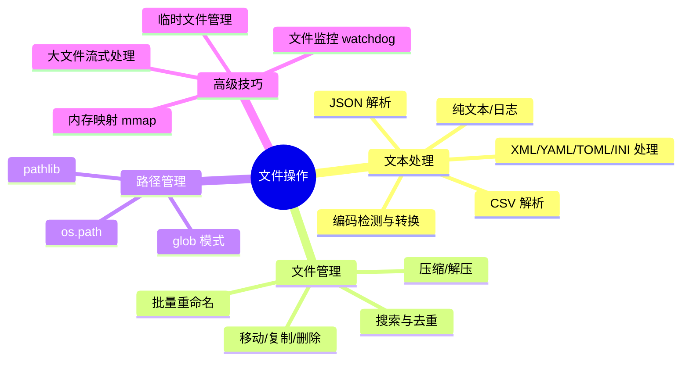
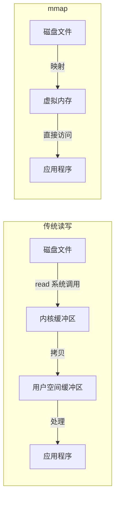
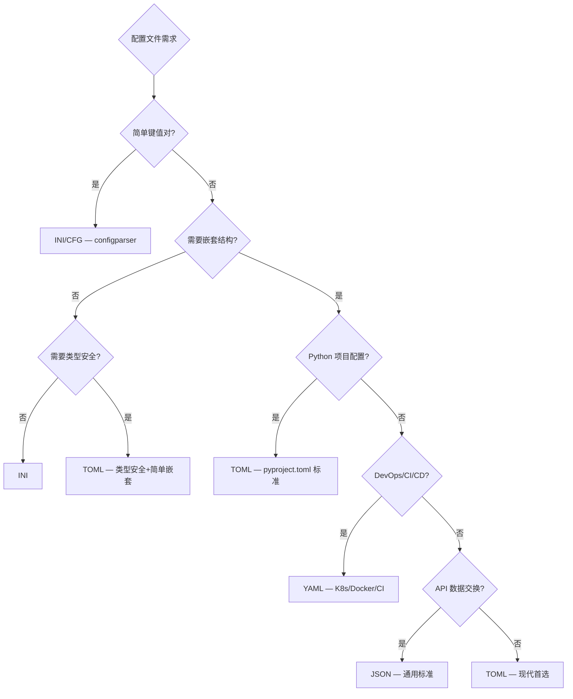

# Python 文本文件与文件操作指南

## 概述

文件操作是自动化办公的基石。无论是读取配置文件、解析日志、处理 CSV 报表，还是批量重命名文件，都需要掌握 Python 的文件 I/O 能力。本章从底层原理到高级技巧，系统覆盖文件操作全链路。



## 路径处理：pathlib vs os.path

Python 3.6+ 推荐使用 `pathlib`，它采用面向对象的接口，比 `os.path` 的函数式风格更直观：

```python
from pathlib import Path

# 路径拼接 — pathlib（推荐）
base = Path('/home/user')
full = base / 'docs' / 'readme.md'    # /home/user/docs/readme.md

# 路径拼接 — os.path（旧式）
import os
full = os.path.join('/home/user', 'docs', 'readme.md')

# pathlib 常用操作
p = Path('/home/user/data.csv')
p.name          # 'data.csv'
p.stem          # 'data'
p.suffix        # '.csv'
p.suffixes      # ['.csv']（多后缀文件如 a.tar.gz 则为 ['.tar', '.gz']）
p.parent        # Path('/home/user')
p.exists()      # True/False
p.is_file()     # True/False
p.is_dir()      # True/False
p.is_symlink()  # True/False
p.stat().st_size  # 文件大小（字节）
p.stat().st_mtime # 修改时间（时间戳）
p.resolve()     # 解析符号链接，返回绝对路径
p.absolute()    # 返回绝对路径（不解析符号链接）

# 遍历目录
for item in Path('./docs').iterdir():
    print(item.name)

# 递归搜索
for md_file in Path('./docs').rglob('*.md'):
    print(md_file)

# glob 模式匹配
for f in Path('.').glob('**/*.py'):
    print(f)

# 读取和写入
content = Path('file.txt').read_text(encoding='utf-8')
Path('output.txt').write_text('Hello', encoding='utf-8')
Path('binary.dat').write_bytes(b'\x00\x01\x02')
```

### pathlib 高级操作

```python
from pathlib import Path
import stat

p = Path('/home/user/project')

# 创建目录（递归，类似 mkdir -p）
p.mkdir(parents=True, exist_ok=True)

# 创建父目录
Path('a/b/c/file.txt').parent.mkdir(parents=True, exist_ok=True)

# 重命名/移动
p.rename(p.parent / 'new_name')       # 重命名
p.replace(p.parent / 'existing_file') # 覆盖式移动

# 修改权限
p.chmod(0o755)

# 获取文件信息
st = p.stat()
print(f'大小: {st.st_size} 字节')
print(f'修改时间: {st.st_mtime}')
print(f'权限: {stat.filemode(st.st_mode)}')

# 相对路径计算
Path('/home/user/docs/readme.md').relative_to('/home/user')
# PosixPath('docs/readme.md')

# 路径拼接与规范化
Path('/home/user/../docs').resolve()  # /home/docs（解析 ..）

# 同级文件查找
config = p.with_suffix('.yaml')  # project.yaml
backup = p.with_name(p.name + '.bak')  # project.bak
```

## 常见文件格式

| 格式 | 扩展名 | 本质 | 解析库 | 典型场景 |
|------|--------|------|--------|---------|
| 纯文本 | `.txt` `.log` | 字符序列 | built-in `open()` | 日志、笔记 |
| CSV | `.csv` | 逗号分隔的表格文本 | `csv` 模块 | 数据导出、报表 |
| JSON | `.json` | 结构化键值对文本 | `json` 模块 | API 数据、配置 |
| XML | `.xml` | 标记语言 | `xml.etree.ElementTree` / `lxml` | SVG、SOAP、Office |
| YAML | `.yaml` `.yml` | 层级结构化文本 | `PyYAML` | CI/CD 配置、K8s |
| TOML | `.toml` | 表格结构化文本 | `tomllib` / `tomli` | Python pyproject.toml |
| INI | `.ini` `.cfg` | 分节键值对 | `configparser` | 应用配置 |
| PDF | `.pdf` | 二进制文档格式 | PyPDF2 / pdfplumber | 文档交换 |
| Office | `.docx` `.xlsx` `.pptx` | ZIP 压缩的 XML | python-docx / openpyxl | 办公文档 |
| 图片 | `.png` `.jpg` | 二进制像素数据 | Pillow / OpenCV | 图像处理 |

## 文本文件读写

### 基本读写

```python
# 读取整个文件
with open('data.txt', 'r', encoding='utf-8') as f:
    content = f.read()

# 逐行读取（推荐：内存友好）
with open('large_file.log', 'r', encoding='utf-8') as f:
    for line in f:
        process(line.strip())

# 写入文件
with open('output.txt', 'w', encoding='utf-8') as f:
    f.write('Hello, World!\n')

# 追加写入
with open('error.log', 'a', encoding='utf-8') as f:
    from datetime import datetime
    f.write(f'[{datetime.now()}] Error occurred\n')

# 读写模式
with open('data.txt', 'r+', encoding='utf-8') as f:
    content = f.read()
    f.seek(0)           # 移动指针到开头
    f.write('new data')
    f.truncate()        # 截断到当前指针位置
```

### 文件打开模式

| 模式 | 含义 | 文件不存在时 | 指针位置 |
|------|------|------------|---------|
| `'r'` | 只读 | ❌ 报错 | 开头 |
| `'w'` | 写入（覆盖） | ✅ 创建 | 开头 |
| `'a'` | 追加 | ✅ 创建 | 末尾 |
| `'x'` | 排他创建 | ✅ 创建（若文件已存在则报错） | 开头 |
| `'r+'` | 读写 | ❌ 报错 | 开头 |
| `'w+'` | 读写（覆盖） | ✅ 创建 | 开头 |
| `'a+'` | 读写（追加） | ✅ 创建 | 末尾 |
| `'b'` | 二进制模式 | 与上述任意组合 | — |
| `'t'` | 文本模式（默认） | 与上述任意组合 | — |

### 编码检测与转换

```python
import chardet  # pip install chardet

# 自动检测文件编码
with open('unknown.txt', 'rb') as f:
    raw = f.read()
    detected = chardet.detect(raw)
    print(f"编码: {detected['encoding']}, 置信度: {detected['confidence']}")

# 常见编码陷阱：
# - GBK/GB2312: 中文 Windows 生成的文件
# - UTF-8 BOM: Windows 记事本保存的 UTF-8（开头有 ）
# - latin-1: 兜底编码，永不报错但内容可能是乱码

# 编码转换（GBK → UTF-8）
with open('gbk_file.txt', 'r', encoding='gbk') as f:
    content = f.read()
with open('utf8_file.txt', 'w', encoding='utf-8') as f:
    f.write(content)

# 处理 UTF-8 BOM
with open('bom_file.txt', 'r', encoding='utf-8-sig') as f:
    content = f.read()  # 自动去除 BOM 标记

# cchardet 曾是更快的 C 扩展检测库，但已停止维护（不支持新版 Python）
# 现代替代：charset-normalizer（requests 内置使用）
# pip install charset-normalizer
from charset_normalizer import from_bytes
result = from_bytes(raw_bytes).best()  # 返回最佳匹配的 CharsetMatch 对象
```

### 大文件流式处理

```python
# 方法一：逐行迭代（最常用）
def process_large_file(filepath, handler, encoding='utf-8'):
    """逐行处理大文件，内存占用恒定"""
    with open(filepath, 'r', encoding=encoding) as f:
        for line_num, line in enumerate(f, 1):
            try:
                handler(line_num, line.strip())
            except Exception as e:
                print(f'行 {line_num} 处理失败: {e}')

# 方法二：分块读取
def read_in_chunks(filepath, chunk_size=8192):
    """按块读取文件，适用于二进制或无换行符的大文件"""
    with open(filepath, 'rb') as f:
        while chunk := f.read(chunk_size):
            yield chunk

# 方法三：使用 itertools.islice 分批处理
from itertools import islice

def batch_process(filepath, batch_size=1000):
    """分批处理，每批 N 行"""
    with open(filepath, 'r', encoding='utf-8') as f:
        while True:
            batch = list(islice(f, batch_size))
            if not batch:
                break
            yield [line.strip() for line in batch]

# 使用示例：统计日志中 ERROR 出现次数
error_count = 0
for batch in batch_process('app.log', batch_size=5000):
    error_count += sum(1 for line in batch if 'ERROR' in line)
print(f'ERROR 总数: {error_count}')
```

## CSV 文件处理

### 基础读写

```python
import csv

# 读取 CSV
with open('data.csv', 'r', encoding='utf-8') as f:
    reader = csv.reader(f)
    header = next(reader)  # 跳过表头
    for row in reader:
        print(row[0], row[1])

# 字典形式读取（按列名访问）
with open('data.csv', 'r', encoding='utf-8') as f:
    for row in csv.DictReader(f):
        print(row['name'], row['age'])

# 写入 CSV
with open('output.csv', 'w', newline='', encoding='utf-8') as f:
    writer = csv.writer(f)
    writer.writerow(['name', 'age', 'city'])
    writer.writerows([
        ['张三', 25, '北京'],
        ['李四', 30, '上海'],
    ])

# 字典形式写入
with open('output.csv', 'w', newline='', encoding='utf-8') as f:
    writer = csv.DictWriter(f, fieldnames=['name', 'age'])
    writer.writeheader()
    writer.writerow({'name': '张三', 'age': 25})
```

### CSV 高级处理

```python
import csv
from pathlib import Path

# 处理不同分隔符（TSV、分号分隔等）
with open('data.tsv', 'r', encoding='utf-8') as f:
    reader = csv.reader(f, delimiter='\t')
    for row in reader:
        print(row)

# 处理引号和特殊字符
with open('data.csv', 'r', encoding='utf-8') as f:
    reader = csv.reader(f, quotechar='"', quoting=csv.QUOTE_MINIMAL)
    # quoting 选项:
    #   csv.QUOTE_MINIMAL — 仅必要时加引号（默认）
    #   csv.QUOTE_ALL — 所有字段加引号
    #   csv.QUOTE_NONNUMERIC — 非数字字段加引号
    #   csv.QUOTE_NONE — 不加引号（需设置 escapechar）

# CSV Sniffer — 自动检测分隔符和引号
with open('unknown.csv', 'r', encoding='utf-8') as f:
    sample = f.read(2048)
    dialect = csv.Sniffer().sniff(sample)
    f.seek(0)
    reader = csv.reader(f, dialect)
    for row in reader:
        print(row)

# 大 CSV 文件流式过滤
def filter_csv(input_path, output_path, condition, encoding='utf-8'):
    """流式过滤 CSV 行，内存友好"""
    with open(input_path, 'r', encoding=encoding, newline='') as fin, \
         open(output_path, 'w', encoding=encoding, newline='') as fout:
        reader = csv.DictReader(fin)
        writer = csv.DictWriter(fout, fieldnames=reader.fieldnames)
        writer.writeheader()
        for row in reader:
            if condition(row):
                writer.writerow(row)

# 示例：筛选年龄 > 25 的记录
filter_csv(
    'employees.csv', 'filtered.csv',
    lambda row: int(row['age']) > 25
)
```

## JSON 文件处理

### 基础操作

```python
import json

# 读取
with open('config.json', 'r', encoding='utf-8') as f:
    config = json.load(f)

# 写入（ensure_ascii=False 保留中文，indent 美化格式）
with open('output.json', 'w', encoding='utf-8') as f:
    json.dump(data, f, ensure_ascii=False, indent=2)

# 字符串 ↔ 对象
json_str = json.dumps(obj, ensure_ascii=False, indent=2)
obj = json.loads(json_str)
```

### JSON 高级技巧

```python
import json
from decimal import Decimal
from datetime import datetime, date
from pathlib import Path

# 自定义序列化：处理 Python 特殊类型
class ExtendedEncoder(json.JSONEncoder):
    """支持 datetime、Decimal、Path 等类型的 JSON 编码器"""
    def default(self, obj):
        if isinstance(obj, (datetime, date)):
            return obj.isoformat()
        if isinstance(obj, Decimal):
            return float(obj)
        if isinstance(obj, Path):
            return str(obj)
        if isinstance(obj, bytes):
            return obj.decode('utf-8')
        if isinstance(obj, set):
            return list(obj)
        return super().default(obj)

# 使用自定义编码器
data = {
    'time': datetime.now(),
    'amount': Decimal('3.14'),
    'path': Path('/home/user'),
    'tags': {'python', 'json'},
}
json_str = json.dumps(data, cls=ExtendedEncoder, ensure_ascii=False, indent=2)

# 自定义反序列化
def json_object_hook(obj):
    """自动识别 ISO 格式日期字符串"""
    for key, value in obj.items():
        if isinstance(value, str):
            try:
                obj[key] = datetime.fromisoformat(value)
            except ValueError:
                pass
    return obj

data = json.loads(json_str, object_hook=json_object_hook)

# JSON Lines（.jsonl）— 逐行 JSON，适合流式处理
def process_jsonl(filepath):
    """逐行读取 JSONL 文件"""
    with open(filepath, 'r', encoding='utf-8') as f:
        for line in f:
            yield json.loads(line)

def write_jsonl(filepath, records):
    """逐行写入 JSONL 文件"""
    with open(filepath, 'w', encoding='utf-8') as f:
        for record in records:
            f.write(json.dumps(record, ensure_ascii=False) + '\n')

# JSON Patch — 增量修改 JSON 文档
# pip install jsonpatch
import jsonpatch
original = {'name': 'Alice', 'age': 25}
patch = jsonpatch.make_patch(original, {'name': 'Alice', 'age': 26, 'city': 'Beijing'})
print(patch)  # [{'op': 'replace', 'path': '/age', 'value': 26}, {'op': 'add', 'path': '/city', 'value': 'Beijing'}]
result = patch.apply(original)
```

## XML 文件处理

### ElementTree 标准库

```python
import xml.etree.ElementTree as ET

# 解析 XML 文件
tree = ET.parse('data.xml')
root = tree.getroot()

# 解析 XML 字符串
root = ET.fromstring('<root><item id="1">Hello</item></root>')

# 访问元素
print(root.tag)          # 'root'
print(root.attrib)       # {}（该根元素无属性；含属性时为属性字典）
print(root.text)         # 文本内容

# 遍历子元素
for child in root:
    print(child.tag, child.attrib, child.text)

# 按标签查找
for item in root.findall('item'):
    item_id = item.get('id')       # 属性
    item_text = item.text          # 文本
    sub = item.find('subelement')  # 第一个子元素

# XPath 查找（有限支持）
# .  当前元素  ..  父元素  *  所有子元素
# //  所有后代  [@attr]  有属性的  [@attr='val']  属性匹配
results = root.findall(".//item[@category='important']")

# 修改 XML
for item in root.findall('item'):
    item.set('processed', 'true')  # 设置属性
    item.text = item.text.upper()  # 修改文本

# 添加元素
new_item = ET.SubElement(root, 'item')
new_item.set('id', '99')
new_item.text = 'New Item'

# 写入文件
tree.write('output.xml', encoding='utf-8', xml_declaration=True)
```

### lxml — 高性能 XML 处理

```bash
pip install lxml
```

```python
from lxml import etree

# 解析（支持完整 XPath 1.0）
tree = etree.parse('data.xml')
root = tree.getroot()

# 完整 XPath 支持
results = root.xpath('//item[@price > 100]/name/text()')
results = root.xpath('//item[contains(@class, "active")]')
results = root.xpath('count(//item)')  # 聚合函数

# 命名空间处理
ns = {'dc': 'http://purl.org/dc/elements/1.1/'}
titles = root.xpath('//dc:title/text()', namespaces=ns)

# 构建 XML
root = etree.Element('catalog')
book = etree.SubElement(root, 'book', id='bk101')
title = etree.SubElement(book, 'title')
title.text = 'Python Guide'
author = etree.SubElement(book, 'author')
author.text = 'Alice'

# 美化输出
xml_str = etree.tostring(root, pretty_print=True, encoding='unicode')
print(xml_str)

# XML 验证（XSD Schema）
schema_root = etree.parse('schema.xsd')
schema = etree.XMLSchema(schema_root)
is_valid = schema.validate(tree)
if not is_valid:
    print(schema.error_log)
```

## YAML 文件处理

```bash
pip install PyYAML
```

```python
import yaml

# 读取 YAML
with open('config.yaml', 'r', encoding='utf-8') as f:
    config = yaml.safe_load(f)  # safe_load 防止代码注入

# 写入 YAML
with open('output.yaml', 'w', encoding='utf-8') as f:
    yaml.dump(config, f, allow_unicode=True, default_flow_style=False, sort_keys=False)

# YAML 字符串解析
yaml_str = """
database:
  host: localhost
  port: 5432
  name: mydb
  credentials:
    user: admin
    password: secret
logging:
  level: INFO
  file: app.log
"""
config = yaml.safe_load(yaml_str)
print(config['database']['host'])  # localhost

# 多文档 YAML（--- 分隔）
with open('multi.yaml', 'r', encoding='utf-8') as f:
    docs = list(yaml.safe_load_all(f))

# 安全注意事项
# ❌ 危险：yaml.load() 可以执行任意 Python 代码
# ✅ 安全：yaml.safe_load() 只解析基本数据类型

# 自定义构造器（安全地扩展 YAML 类型）
class PathConstructor:
    @staticmethod
    def construct_path(loader, node):
        value = loader.construct_scalar(node)
        return Path(value)

yaml.add_constructor('!path', PathConstructor, Loader=yaml.SafeLoader)

# YAML 中使用: data_dir: !path /home/user/data
```

## TOML 文件处理

```python
# Python 3.11+ 内置 tomllib（只读）
import tomllib

with open('pyproject.toml', 'rb') as f:  # 注意：必须用二进制模式
    config = tomllib.load(f)

# Python 3.10 及以下
# pip install tomli
import tomli
with open('pyproject.toml', 'rb') as f:
    config = tomli.load(f)

# 写入 TOML
# pip install tomli_w
import tomli_w

config = {
    'project': {
        'name': 'my-package',
        'version': '1.0.0',
        'requires-python': '>=3.8',
        'dependencies': ['requests', 'pyyaml'],
    },
    'tool': {
        'pytest': {'ini_options': {'testpaths': ['tests']}},
    },
}
with open('pyproject.toml', 'wb') as f:
    tomli_w.dump(config, f)

# TOML 特性：支持日期时间、内联表、数组表
# [servers.alpha]
# ip = "10.0.0.1"
# dc = "eqdc10"
#
# [[products]]
# name = "Hammer"
# sku = 738594937
#
# [[products]]
# name = "Nail"
# sku = 284758393
```

## INI/CFG 配置文件处理

```python
import configparser

# 读取 INI 文件
config = configparser.ConfigParser()
config.read('app.ini', encoding='utf-8')

# 访问配置
db_host = config.get('database', 'host')           # 字符串
db_port = config.getint('database', 'port')         # 整数
debug = config.getboolean('app', 'debug')            # 布尔值
timeout = config.getfloat('network', 'timeout')      # 浮点数

# 带默认值
host = config.get('database', 'host', fallback='localhost')

# 检查节和键是否存在
if config.has_section('database'):
    if config.has_option('database', 'host'):
        print(config['database']['host'])

# 遍历所有配置
for section in config.sections():
    print(f'[{section}]')
    for key, value in config.items(section):
        print(f'  {key} = {value}')

# 写入 INI
config['database'] = {
    'host': 'localhost',
    'port': '5432',
    'name': 'mydb',
}
config['logging'] = {
    'level': 'INFO',
    'file': 'app.log',
}
with open('app.ini', 'w') as f:
    config.write(f)

# 插值变量（默认使用 %(key)s 语法）
# [paths]
# base: /opt/app
# data: %(base)s/data
# logs: %(base)s/logs
print(config.get('paths', 'data'))  # /opt/app/data

# 环境变量覆盖配置
import os
config['database']['host'] = os.environ.get('DB_HOST', config.get('database', 'host', fallback='localhost'))
```

## 文件管理操作

### 移动、复制、删除

```python
import shutil
from pathlib import Path

# 复制
shutil.copy('source.txt', 'dest.txt')        # 复制文件内容+权限
shutil.copy2('source.txt', 'dest.txt')       # 保留所有元数据（时间戳等）
shutil.copytree('src_dir', 'dst_dir')        # 递归复制目录
shutil.copytree('src_dir', 'dst_dir',        # 忽略特定文件
                ignore=shutil.ignore_patterns('*.pyc', '__pycache__'))

# 移动
shutil.move('old/file.txt', 'new/file.txt')
shutil.move('old_dir/', 'new_dir/')          # 移动整个目录

# 删除
import os
os.remove('file.txt')                        # 删除文件
os.rmdir('empty_dir')                        # 删除空目录
shutil.rmtree('dir_path')                    # 递归删除目录（危险！）

# 安全删除（移到回收站）
# pip install send2trash
import send2trash
send2trash.send2trash('unwanted_file.txt')   # 可从回收站恢复
```

### 压缩与解压

```python
import shutil
import zipfile
import tarfile

# 快速打包
shutil.make_archive('archive', 'zip', 'source_dir')
shutil.make_archive('archive', 'gztar', 'source_dir')  # .tar.gz
shutil.unpack_archive('archive.zip', 'extract_dir')

# 高级 ZIP 操作
with zipfile.ZipFile('archive.zip', 'w', zipfile.ZIP_DEFLATED) as zf:
    zf.write('file1.txt')
    zf.write('file2.txt', arcname='sub/file2.txt')  # 自定义内部路径
    # ZIP_DEFLATED: 压缩（默认）
    # ZIP_STORED: 不压缩（更快）
    # ZIP_BZIP2 / ZIP_LZMA: 更高压缩率

with zipfile.ZipFile('archive.zip', 'r') as zf:
    # 列出内容
    for info in zf.infolist():
        print(f'{info.filename}: {info.file_size} bytes, compressed: {info.compress_size}')

    # 解压
    zf.extract('file1.txt', 'output')  # 解压单个文件
    zf.extractall('output')            # 全部解压

    # 读取压缩包内文件（不解压）
    with zf.open('file1.txt') as f:
        content = f.read().decode('utf-8')

# 加密 ZIP（需要 pyzipper）
# pip install pyzipper
import pyzipper
with pyzipper.AESZipFile('encrypted.zip', 'w',
                         compression=pyzipper.ZIP_DEFLATED,
                         encryption=pyzipper.WZ_AES) as zf:
    zf.setpassword(b'my_password')
    zf.writestr('secret.txt', 'Top secret content')

# tar.gz / tar.bz2 处理
with tarfile.open('archive.tar.gz', 'w:gz') as tf:
    tf.add('file1.txt')
    tf.add('directory/', recursive=True)

with tarfile.open('archive.tar.gz', 'r:gz') as tf:
    tf.extractall('output')
```

### 批量重命名

```python
from pathlib import Path
import re

def batch_rename(directory, pattern, replacement):
    """正则匹配批量重命名"""
    for f in Path(directory).iterdir():
        new_name = re.sub(pattern, replacement, f.name)
        if new_name != f.name:
            f.rename(f.parent / new_name)
            print(f'{f.name} → {new_name}')

# 示例：添加序号前缀
def add_prefix(directory):
    for i, f in enumerate(sorted(Path(directory).iterdir()), 1):
        f.rename(f.parent / f'{i:03d}-{f.name}')

# 示例：统一文件扩展名
def normalize_extensions(directory):
    """将 .JPG/.jpeg 等统一为 .jpg"""
    for f in Path(directory).rglob('*'):
        if f.suffix.lower() in ('.jpg', '.jpeg'):
            f.rename(f.with_suffix('.jpg'))

# 示例：按日期重命名照片（从 EXIF 读取）
# pip install Pillow
from PIL import Image

def rename_photos_by_date(directory):
    """根据拍摄日期重命名照片"""
    for f in Path(directory).glob('*.jpg'):
        try:
            img = Image.open(f)
            # 使用公开 API getexif()；DateTimeOriginal(36867) 位于 Exif IFD(0x8769)
            value = img.getexif().get_ifd(0x8769).get(36867)
            if value:
                # 格式: '2024:01:15 14:30:00'
                date_str = value.replace(':', '-').replace(' ', '_')
                new_name = f'{date_str}{f.suffix}'
                f.rename(f.parent / new_name)
                print(f'{f.name} → {new_name}')
        except Exception as e:
            print(f'跳过 {f.name}: {e}')
```

### 文件搜索与去重

```python
from pathlib import Path
import hashlib
import re

# glob 模式搜索
for py_file in Path('.').rglob('*.py'):
    print(py_file)

# 按内容搜索
def search_content(directory, pattern, file_extensions=('.py', '.md', '.txt', '.json')):
    """递归搜索文件内容匹配的行"""
    for f in Path(directory).rglob('*'):
        if f.suffix in file_extensions:
            try:
                for i, line in enumerate(f.read_text(encoding='utf-8').splitlines(), 1):
                    if re.search(pattern, line):
                        yield f, i, line.strip()
            except (UnicodeDecodeError, PermissionError):
                pass

# 文件去重（按 MD5）
def find_duplicates(directory):
    """查找重复文件"""
    hashes = {}
    for f in Path(directory).rglob('*'):
        if f.is_file():
            h = hashlib.md5(f.read_bytes()).hexdigest()
            hashes.setdefault(h, []).append(f)
    return {h: paths for h, paths in hashes.items() if len(paths) > 1}

# 大文件去重（流式哈希，避免 OOM）
def find_duplicates_streaming(directory, chunk_size=8192):
    """流式计算哈希，适用于大文件"""
    def file_hash(filepath):
        h = hashlib.md5()
        with open(filepath, 'rb') as f:
            while chunk := f.read(chunk_size):
                h.update(chunk)
        return h.hexdigest()

    hashes = {}
    for f in Path(directory).rglob('*'):
        if f.is_file():
            # 先按文件大小分组，大小不同一定不重复
            size = f.stat().st_size
            key = (size, file_hash(f))
            hashes.setdefault(key, []).append(f)
    return {k: v for k, v in hashes.items() if len(v) > 1}
```

## 内存映射（mmap）

内存映射将文件直接映射到进程的虚拟地址空间，实现零拷贝读写，特别适合大文件随机访问。

```python
import mmap
import os

# 读取映射
with open('large_file.bin', 'rb') as f:
    with mmap.mmap(f.fileno(), 0, access=mmap.ACCESS_READ) as mm:
        # 像操作 bytes 一样操作文件
        print(mm[:100])           # 读取前 100 字节
        print(mm.read(50))        # 读取 50 字节（移动指针）
        mm.seek(0)                # 回到开头
        # 搜索
        pos = mm.find(b'pattern') # 查找字节模式
        if pos != -1:
            print(f'找到于位置 {pos}')

# 读写映射
with open('data.bin', 'r+b') as f:
    with mmap.mmap(f.fileno(), 0, access=mmap.ACCESS_WRITE) as mm:
        mm[0:4] = b'NEW!'         # 原地修改（零拷贝）
        mm.flush()                # 刷新到磁盘

# COPY_ON_WRITE 模式（修改不写回文件）
with open('data.bin', 'rb') as f:
    with mmap.mmap(f.fileno(), 0, access=mmap.ACCESS_COPY) as mm:
        mm[0:4] = b'TEST'         # 仅内存中修改
        # 文件本身不变

# 大文件搜索实战：在 10GB 日志中搜索关键词
def search_in_large_file(filepath, keyword, encoding='utf-8'):
    """在超大文件中高效搜索关键词"""
    keyword_bytes = keyword.encode(encoding)
    results = []

    with open(filepath, 'rb') as f:
        with mmap.mmap(f.fileno(), 0, access=mmap.ACCESS_READ) as mm:
            pos = 0
            while True:
                idx = mm.find(keyword_bytes, pos)
                if idx == -1:
                    break
                # 找到所在行
                line_start = mm.rfind(b'\n', 0, idx) + 1
                line_end = mm.find(b'\n', idx)
                if line_end == -1:
                    line_end = len(mm)
                line = mm[line_start:line_end].decode(encoding, errors='replace')
                results.append((line_start, line))
                pos = line_end

    return results
```



## 文件监控（watchdog）

实时监控文件系统变化，适用于自动构建、日志追踪、热重载等场景。

```bash
pip install watchdog
```

```python
from watchdog.observers import Observer
from watchdog.events import FileSystemEventHandler, FileModifiedEvent, FileCreatedEvent
import time
from pathlib import Path

class AutoBuildHandler(FileSystemEventHandler):
    """文件变化时自动触发构建"""

    def __init__(self, watch_dir, build_cmd, extensions=('.py', '.md', '.yaml')):
        self.watch_dir = Path(watch_dir)
        self.build_cmd = build_cmd
        self.extensions = extensions

    def on_modified(self, event):
        if event.is_directory:
            return
        if Path(event.src_path).suffix in self.extensions:
            print(f'检测到修改: {event.src_path}')
            self._run_build()

    def on_created(self, event):
        if not event.is_directory and Path(event.src_path).suffix in self.extensions:
            print(f'检测到新建: {event.src_path}')
            self._run_build()

    def _run_build(self):
        import subprocess
        print('执行构建...')
        result = subprocess.run(self.build_cmd, shell=True, capture_output=True, text=True)
        if result.returncode == 0:
            print('构建成功 ✅')
        else:
            print(f'构建失败 ❌: {result.stderr[:200]}')

# 使用
observer = Observer()
handler = AutoBuildHandler('./src', 'python build.py')
observer.schedule(handler, './src', recursive=True)
observer.start()

try:
    while True:
        time.sleep(1)
except KeyboardInterrupt:
    observer.stop()
observer.join()
```

## 临时文件管理

```python
import tempfile
from pathlib import Path

# 临时文件（自动清理）
with tempfile.NamedTemporaryFile(mode='w', suffix='.csv', delete=True) as f:
    f.write('name,age\nAlice,25\n')
    temp_path = f.name  # 获取路径
    # with 结束后文件自动删除

# 临时文件（手动清理）
temp = tempfile.NamedTemporaryFile(mode='w', suffix='.log', delete=False)
temp.write('log content')
temp.close()
# 使用 temp.name ...
Path(temp.name).unlink()  # 手动删除

# 临时目录
with tempfile.TemporaryDirectory() as tmpdir:
    tmp_path = Path(tmpdir)
    (tmp_path / 'output.txt').write_text('result')
    # with 结束后目录自动递归删除

# 指定临时目录位置
tempfile.tempdir = '/data/tmp'  # 全局设置
with tempfile.TemporaryDirectory(dir='/data/tmp') as tmpdir:
    pass
```

## 实战案例：日志分析系统

```python
"""
日志分析系统：自动解析应用日志，生成统计报告
支持大文件流式处理、多格式日志、异常告警
"""
import re
from pathlib import Path
from collections import Counter, defaultdict
from datetime import datetime
from dataclasses import dataclass, field
import json
import csv

@dataclass
class LogEntry:
    """日志条目数据类"""
    timestamp: datetime
    level: str
    module: str
    message: str

@dataclass
class LogReport:
    """日志分析报告"""
    file_path: str
    total_lines: int = 0
    parsed_lines: int = 0
    level_counts: dict = field(default_factory=dict)
    error_modules: dict = field(default_factory=dict)
    hourly_distribution: dict = field(default_factory=dict)
    top_errors: list = field(default_factory=list)
    slow_requests: list = field(default_factory=list)

class LogAnalyzer:
    """日志分析器"""

    # 常见日志格式正则
    PATTERNS = {
        'standard': re.compile(
            r'(\d{4}-\d{2}-\d{2} \d{2}:\d{2}:\d{2},\d{3}) '
            r'\[(\w+)\] (\w+): (.+)'
        ),
        '11-Nginx基础概述': re.compile(
            r'(\d+\.\d+\.\d+\.\d+) - - \[(.+?)\] "(\w+) (.+?) HTTP/\d\.\d" (\d+) (\d+)'
        ),
        'simple': re.compile(
            r'(\d{4}-\d{2}-\d{2} \d{2}:\d{2}:\d{2}) (\w+) (.+)'
        ),
    }

    def __init__(self, log_format='standard'):
        self.pattern = self.PATTERNS.get(log_format, self.PATTERNS['standard'])
        self.report = None

    def analyze(self, filepath, encoding='utf-8'):
        """分析日志文件"""
        filepath = Path(filepath)
        self.report = LogReport(file_path=str(filepath))

        level_counter = Counter()
        module_errors = defaultdict(int)
        hourly_counter = Counter()
        error_messages = []

        with open(filepath, 'r', encoding=encoding, errors='replace') as f:
            for line in f:
                self.report.total_lines += 1
                match = self.pattern.match(line.strip())
                if not match:
                    continue

                self.report.parsed_lines += 1
                groups = match.groups()

                if len(groups) >= 4:
                    timestamp_str, level, module, message = groups[:4]
                    try:
                        ts = datetime.strptime(timestamp_str, '%Y-%m-%d %H:%M:%S,%f')
                    except ValueError:
                        try:
                            ts = datetime.strptime(timestamp_str, '%Y-%m-%d %H:%M:%S')
                        except ValueError:
                            continue

                    level_counter[level] += 1
                    hourly_counter[ts.hour] += 1

                    if level in ('ERROR', 'CRITICAL'):
                        module_errors[module] += 1
                        error_messages.append({
                            'time': timestamp_str,
                            'module': module,
                            'message': message[:200],
                        })

        self.report.level_counts = dict(level_counter.most_common())
        self.report.error_modules = dict(
            sorted(module_errors.items(), key=lambda x: x[1], reverse=True)[:10]
        )
        self.report.hourly_distribution = dict(sorted(hourly_counter.items()))
        self.report.top_errors = error_messages[:20]

        return self.report

    def export_json(self, output_path):
        """导出 JSON 报告"""
        report_dict = {
            'file': self.report.file_path,
            'total_lines': self.report.total_lines,
            'parsed_lines': self.report.parsed_lines,
            'parse_rate': f'{self.report.parsed_lines / max(self.report.total_lines, 1) * 100:.1f}%',
            'level_distribution': self.report.level_counts,
            'top_error_modules': self.report.error_modules,
            'hourly_distribution': self.report.hourly_distribution,
            'top_errors': self.report.top_errors,
        }
        Path(output_path).write_text(
            json.dumps(report_dict, ensure_ascii=False, indent=2),
            encoding='utf-8'
        )

    def export_csv(self, output_path):
        """导出错误日志 CSV"""
        with open(output_path, 'w', newline='', encoding='utf-8') as f:
            writer = csv.DictWriter(f, fieldnames=['time', 'module', 'message'])
            writer.writeheader()
            writer.writerows(self.report.top_errors)

# 使用
analyzer = LogAnalyzer(log_format='standard')
report = analyzer.analyze('app.log')
print(f'总行数: {report.total_lines}')
print(f'解析率: {report.parsed_lines / max(report.total_lines, 1) * 100:.1f}%')
print(f'级别分布: {report.level_counts}')
print(f'错误模块 Top5: {list(report.error_modules.items())[:5]}')
analyzer.export_json('log_report.json')
analyzer.export_csv('error_log.csv')
```

## 配置文件格式选择决策



## 常见陷阱

| 陷阱 | 说明 | 正确做法 |
|------|------|---------|
| 不指定编码 | Windows 默认 GBK，Mac/Linux 默认 UTF-8 | 始终显式 `encoding='utf-8'` |
| 不关文件 | 文件句柄泄漏 | 始终使用 `with open(...)` |
| 大文件一次性读入 | `read()` 或 `readlines()` OOM | 逐行迭代 `for line in f` |
| CSV 不设 `newline=''` | Windows 下空行问题 | `open(..., newline='')` |
| `os.remove` 删目录 | 报 `PermissionError` | 目录用 `shutil.rmtree()` |
| `yaml.load()` 不安全 | 可执行任意 Python 代码 | 使用 `yaml.safe_load()` |
| JSON 日期序列化失败 | datetime 不是 JSON 原生类型 | 自定义 JSONEncoder |
| INI 值都是字符串 | configparser 不自动类型转换 | 使用 `getint()`/`getboolean()`/`getfloat()` |
| TOML 用文本模式打开 | tomllib 要求二进制模式 | `open('f.toml', 'rb')` |
| mmap 修改不刷新 | 修改可能停留在内存 | 调用 `mm.flush()` 或使用 `ACCESS_WRITE` |

## 延伸阅读

- [Python 官方 — 文件读写](https://docs.python.org/3/tutorial/inputoutput.html)
- [Python 官方 — csv 模块](https://docs.python.org/3/library/csv.html)
- [Python 官方 — pathlib](https://docs.python.org/3/library/pathlib.html)
- [Python 官方 — json 模块](https://docs.python.org/3/library/json.html)
- [Python 官方 — configparser](https://docs.python.org/3/library/configparser.html)
- [Python 官方 — tomllib](https://docs.python.org/3/library/tomllib.html)
- [PyYAML 文档](https://pyyaml.org/wiki/PyYAMLDocumentation)
- [lxml 教程](https://lxml.de/tutorial.html)
- [watchdog 文档](https://python-watchdog.readthedocs.io/)
- [mmap 原理详解](https://docs.python.org/3/library/mmap.html)

## 版本差异（自动化办公库 → 当前稳定版）

| 库 | 本文编写时 | 当前稳定版（截至 2026-09） |
|----|-----------|-----------|
| `openpyxl`（Excel） | 旧版 | 3.1.x |
| `python-docx`（Word） | 旧版 | 1.2.x |
| `python-pptx`（PPT） | 旧版 | 1.0.x |
| `reportlab`（PDF） | 旧版 | 5.x |
| `PyPDF2`/`pypdf` | PyPDF2 | 推荐 `pypdf`（6.x，PyPDF2 已停止维护） |
| `Pillow`（图像） | 旧版 | 12.x |

> 本文讲解的自动化办公流程（读写 Excel/Word/PDF/PPT）与核心 API 在最新版本中成立；注意 PyPDF2 已迁移至 pypdf。
