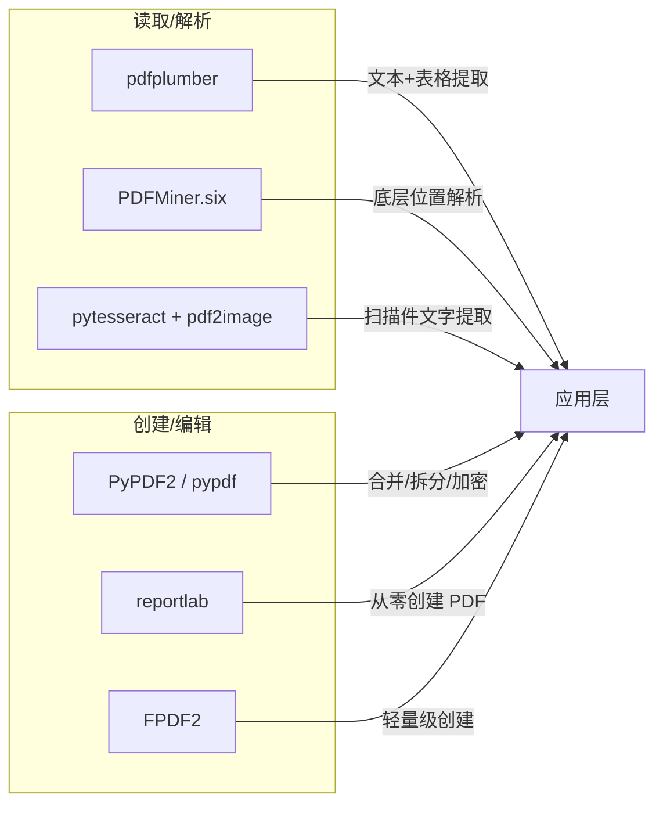
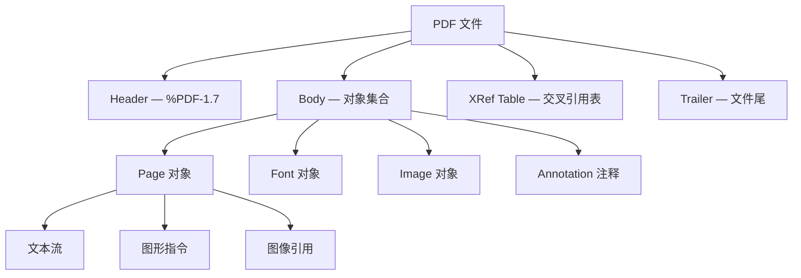
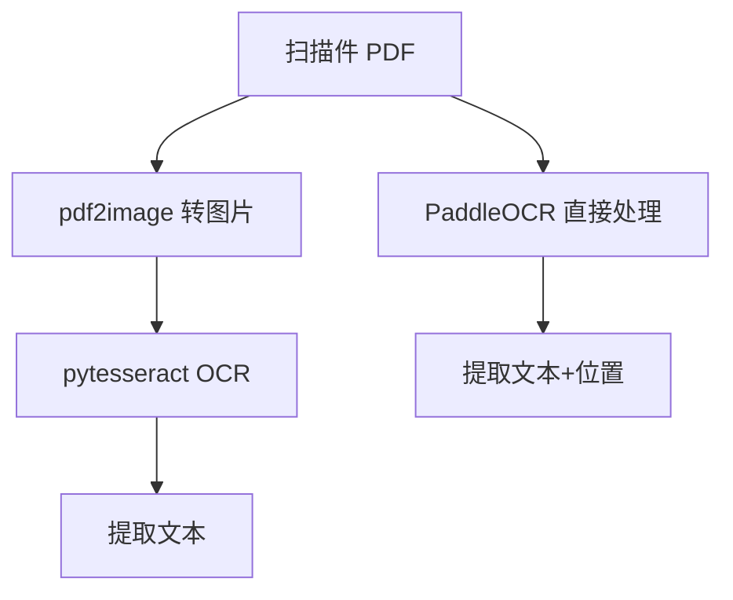
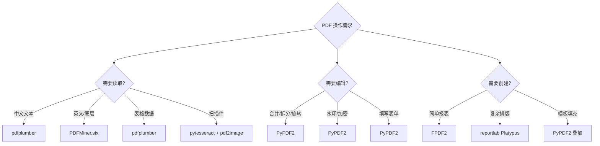

# Python 操作 PDF 文件指南

## 概述

PDF (Portable Document Format) 是最通用的文档交换格式，由 Adobe 于 1993 年发明，2008 年成为 ISO 32000 国际标准。PDF 的核心设计目标是**在任何设备上保持一致的视觉呈现**——"所见即所得"。



| 库 | 能力 | 特点 |
|---|------|------|
| **PyPDF2** / pypdf | 合并、拆分、旋转、水印、加密、元数据 | 功能全面，但不支持中文文本提取 |
| **pdfplumber** | 文本提取、表格提取、图像提取、图表分析 | **最佳中文支持**，API 友好，推荐 |
| **PDFMiner.six** | 底层文本/位置解析 | 功能强大但 API 偏底层 |
| **reportlab** | 从零创建 PDF | 编程式 PDF 生成，企业级 |
| **FPDF2** | 从零创建 PDF | 轻量级，API 简单，适合简单报表 |
| **pytesseract** + pdf2image | OCR 文字识别 | 扫描件 PDF 必备 |

## PDF 内部结构

理解 PDF 内部结构有助于选择正确的工具和处理策略：



### PDF 文本存储原理

PDF 中的文本**不是按阅读顺序存储**的，而是按**绘制指令**排列。每个字符都有 `(x, y)` 坐标，PDF 阅读器根据坐标渲染，但提取文本时需要重新排序。这就是为什么某些库提取中文文本会乱序或丢失。

### PDF 类型与处理策略

| 类型 | 特征 | 处理方式 |
|------|------|---------|
| 文本型 PDF | 内容为可提取文本 | pdfplumber / PDFMiner |
| 扫描型 PDF | 内容为图像，无可提取文本 | OCR（pytesseract + pdf2image） |
| 混合型 PDF | 部分页面文本、部分扫描 | 先尝试提取，失败则 OCR |
| 表单型 PDF | 含可填写字段 | PyPDF2 / pypdf 读写表单 |
| 加密型 PDF | 需密码才能打开 | PyPDF2 decrypt |

## PyPDF2 / pypdf：PDF 编辑操作

> PyPDF2 已停止维护（2023 年起），官方推荐迁移至其继任者 **pypdf**（API 兼容，`import pypdf` 即可，或安装 PyPDF2 时自动使用 pypdf 内核）。本文以 PyPDF2 语法讲解，pypdf 用法完全一致。

```bash
pip install pypdf   # 旧写法 pip install PyPDF2（3.0.1 为更名后的旧包，已不再更新）
```

```python
import pypdf  # 兼容写法：import PyPDF2

# 读取 PDF 基本信息
reader = pypdf.PdfReader('sample.pdf')
print(f'页数: {len(reader.pages)}')
print(f'加密: {reader.is_encrypted}')

# 读取元数据
meta = reader.metadata
if meta:
    print(f'标题: {meta.title}')
    print(f'作者: {meta.author}')
    print(f'创建者: {meta.creator}')
    print(f'创建日期: {meta.creation_date}')

# 获取页面尺寸（单位：磅，1 磅 ≈ 0.353mm）
page = reader.pages[0]
box = page.mediabox
print(f'宽度: {float(box.width):.1f}pt, 高度: {float(box.height):.1f}pt')
```

### 拆分 PDF

```python
import pypdf

reader = pypdf.PdfReader('input.pdf')

# 按页拆分
for i, page in enumerate(reader.pages):
    writer = pypdf.PdfWriter()
    writer.add_page(page)
    with open(f'page_{i+1}.pdf', 'wb') as f:
        writer.write(f)

# 按范围拆分（提取第 2-5 页）
writer = pypdf.PdfWriter()
for i in range(1, 5):  # 索引从 0 开始
    writer.add_page(reader.pages[i])
with open('extract_2-5.pdf', 'wb') as f:
    writer.write(f)

# 按书签/大纲拆分
def split_by_outline(input_path):
    """按 PDF 大纲（书签）拆分文档"""
    reader = pypdf.PdfReader(input_path)
    outlines = reader.outline

    for i, outline in enumerate(outlines):
        if isinstance(outline, list):
            continue  # 跳过子书签
        page_num = reader.get_destination_page_number(outline)
        print(f'书签: {outline.title}, 页码: {page_num + 1}')
```

### 合并 PDF

```python
import pypdf
from pathlib import Path

# 基础合并
merger = pypdf.PdfWriter()

for pdf_file in sorted(Path('.').glob('*.pdf')):
    merger.append(pdf_file)

merger.write('merged.pdf')
merger.close()

# 精确控制合并位置
writer = pypdf.PdfWriter()
# 在第 2 页之后插入
writer.append('base.pdf', pages=(0, 2))     # 前 2 页
writer.append('insert.pdf')                   # 插入完整文档
writer.append('base.pdf', pages=(2,))        # 剩余页面
writer.write('inserted.pdf')
writer.close()

# 大文件合并（避免内存溢出）
def merge_large_pdfs(pdf_paths, output_path):
    """流式合并大 PDF 文件"""
    writer = pypdf.PdfWriter()
    for path in pdf_paths:
        reader = pypdf.PdfReader(path)
        for page in reader.pages:
            writer.add_page(page)
    with open(output_path, 'wb') as f:
        writer.write(f)
```

### 旋转与裁剪

```python
reader = pypdf.PdfReader('input.pdf')
writer = pypdf.PdfWriter()

# 旋转
page = reader.pages[0]
page.rotate(90)    # 逆时针 90°
page.rotate(-90)   # 顺时针 90°
page.rotate(180)   # 上下颠倒
writer.add_page(page)

# 裁剪页面（只保留指定区域）
page = reader.pages[0]
page.mediabox.lower_left = (50, 50)       # 左下角
page.mediabox.upper_right = (500, 700)     # 右上角
writer.add_page(page)

# 缩放页面
from pypdf import Transformation
page = reader.pages[0]
page.scale(1.5, 1.5)  # 宽高各放大 1.5 倍
# page.scale_to(width=595, height=842)  # 缩放到 A4 尺寸
writer.add_page(page)

writer.write('processed.pdf')
```

### 添加水印

```python
reader = pypdf.PdfReader('document.pdf')
watermark_reader = pypdf.PdfReader('watermark.pdf')
watermark = watermark_reader.pages[0]
writer = pypdf.PdfWriter()

for page in reader.pages:
    page.merge_page(watermark)  # 叠加水印
    writer.add_page(page)

writer.write('watermarked.pdf')

# 动态生成文字水印（使用 reportlab）
from reportlab.pdfgen import canvas
from reportlab.lib.pagesizes import A4
import io

def create_watermark(text, pagesize=A4, opacity=0.1):
    """生成文字水印 PDF 页面"""
    packet = io.BytesIO()
    c = canvas.Canvas(packet, pagesize=pagesize)
    c.saveState()
    c.setFont('Helvetica', 60)
    c.setFillColorRGB(0.5, 0.5, 0.5, alpha=opacity)
    c.translate(pagesize[0] / 2, pagesize[1] / 2)
    c.rotate(45)
    c.drawCentredString(0, 0, text)
    c.restoreState()
    c.save()
    packet.seek(0)
    return pypdf.PdfReader(packet).pages[0]

# 使用动态水印
watermark = create_watermark('CONFIDENTIAL')
for page in reader.pages:
    page.merge_page(watermark)
    writer.add_page(page)
```

### 加密与解密

```python
# 加密
reader = pypdf.PdfReader('input.pdf')
writer = pypdf.PdfWriter()
for page in reader.pages:
    writer.add_page(page)

writer.encrypt(
    user_password='user123',        # 用户密码（打开文档需要）
    owner_password='owner456',      # 所有者密码（完全控制权限）
    permissions_flag=0b0000000000100  # 仅允许打印
)
writer.write('encrypted.pdf')

# 解密
reader = pypdf.PdfReader('encrypted.pdf')
if reader.is_encrypted:
    reader.decrypt('user123')
print(f'解密成功，页数: {len(reader.pages)}')

# 权限标志位说明（PDF 规范：bit3=打印(4)、bit4=修改(8)、bit5=复制(16)、bit6=注释(32)）：
# 0b0000000000100  — 打印
# 0b0000000001000  — 修改
# 0b000000010000   — 复制内容
# 0b000000100000   — 添加/修改注释
```

### 读取/填写 PDF 表单

```python
reader = pypdf.PdfReader('form.pdf')

# 读取表单字段
fields = reader.get_form_text_fields()
if fields:
    for name, value in fields.items():
        print(f'{name}: {value}')

# 填写表单
writer = pypdf.PdfWriter()
writer.append('form.pdf')
writer.update_page_form_field_values(
    writer.pages[0],
    {
        'name': '张三',
        'email': 'zhangsan@example.com',
        'date': '2026-06-06',
    }
)
writer.write('filled_form.pdf')
```

## PDFMiner.six：底层文本提取

```bash
pip install pdfminer.six
```

```python
from pdfminer.high_level import extract_text, extract_pages
from pdfminer.layout import LTTextBox, LTTextLine, LTFigure, LTChar

# 提取全部文本
text = extract_text('document.pdf')
print(text)

# 按页面提取，带布局信息
for page_layout in extract_pages('document.pdf'):
    for element in page_layout:
        if isinstance(element, LTTextBox):
            print(f'位置: ({element.x0:.0f}, {element.y0:.0f})')
            print(element.get_text().strip())

# 提取字体信息（检测扫描件）
def is_scanned_pdf(filepath):
    """检测 PDF 是否为扫描件（无可提取文本字符）"""
    char_count = 0
    for page_layout in extract_pages(filepath):
        for element in page_layout:
            if isinstance(element, LTTextBox):
                for line in element:
                    for char in line:
                        if isinstance(char, LTChar):
                            char_count += 1
    return char_count < 10  # 字符数极少则判定为扫描件
```

## pdfplumber：中文 PDF 最佳实践

**强烈推荐用于中文 PDF 处理**，API 更友好，社区更活跃。

```bash
pip install pdfplumber
```

### 文本提取

```python
import pdfplumber

with pdfplumber.open('report.pdf') as pdf:
    print(f'总页数: {len(pdf.pages)}')

    for i, page in enumerate(pdf.pages):
        text = page.extract_text()
        if text:
            print(f'--- 第 {i+1} 页 ---')
            print(text[:200])

    # 按布局提取（保留空格和换行位置）
    text = page.extract_text(layout=True)

    # 提取单词级信息（含坐标）
    words = page.extract_words()
    for word in words[:5]:
        print(f'文字: {word["text"]}, 位置: ({word["x0"]:.0f}, {word["top"]:.0f})')

    # 按行提取
    lines = page.extract_text_lines()
    for line in lines[:3]:
        print(line['text'])
```

### 表格提取

```python
import pdfplumber

with pdfplumber.open('financial_report.pdf') as pdf:
    page = pdf.pages[0]

    # 自动检测表格
    tables = page.extract_tables()

    for i, table in enumerate(tables):
        print(f'表格 {i+1}:')
        for row in table:
            print(' | '.join([cell or '' for cell in row]))

    # 自定义表格提取参数
    table_settings = {
        "vertical_strategy": "lines",       # 按线条检测垂直边框
        "horizontal_strategy": "lines",     # 按线条检测水平边框
        "intersection_tolerance": 10,       # 线条交点容差
        "min_words_vertical": 3,            # 最少词数（text 策略）
        "min_words_horizontal": 1,
        "snap_tolerance": 5,                # 对齐容差
    }

    tables = page.extract_tables(table_settings)

    # text 策略：无边框表格按文本间距检测
    text_tables = page.extract_tables({
        "vertical_strategy": "text",
        "horizontal_strategy": "text",
    })

    # 提取为 pandas DataFrame
    import pandas as pd
    table = page.extract_table()
    if table:
        df = pd.DataFrame(table[1:], columns=table[0])
        print(df.head())
```

### 图像提取

```python
import pdfplumber
import fitz  # pymupdf

# pdfplumber 获取图像位置信息
with pdfplumber.open('document.pdf') as pdf:
    page = pdf.pages[0]
    for image in page.images:
        print(f'图像位置: x0={image["x0"]:.0f}, y0={image["top"]:.0f}, '
              f'宽度={image["width"]:.0f}, 高度={image["height"]:.0f}')

# pymupdf 提取实际图像（推荐）
# pip install pymupdf
doc = fitz.open('document.pdf')
for i, page in enumerate(doc):
    for j, img in enumerate(page.get_images(full=True)):
        xref = img[0]
        base_image = doc.extract_image(xref)
        with open(f'page{i+1}_img{j+1}.{base_image["ext"]}', 'wb') as f:
            f.write(base_image['image'])
```

## reportlab：从零创建 PDF

reportlab 是 Python 最强大的 PDF 生成框架，支持精确排版、矢量图形、中文字体、条形码等。

```bash
pip install reportlab
```

### 基础创建

```python
from reportlab.lib.pagesizes import A4, letter
from reportlab.lib.units import cm, mm, inch
from reportlab.lib.colors import HexColor, black, white
from reportlab.pdfgen import canvas

# 创建 PDF
c = canvas.Canvas('hello.pdf', pagesize=A4)
width, height = A4  # 595.27 × 841.89 磅

# 绘制文本
c.setFont('Helvetica', 12)
c.drawString(100, 750, 'Hello, World!')

# 绘制中文（需要注册中文字体）
from reportlab.pdfbase import pdfmetrics
from reportlab.pdfbase.ttfonts import TTFont

pdfmetrics.registerFont(TTFont('SimSun', '/System/Library/Fonts/Supplemental/Songti.ttc'))  # macOS 宋体实际路径（按系统调整）
c.setFont('SimSun', 16)
c.drawString(100, 700, '你好，世界！')

# 绘制图形
c.setFillColor(HexColor('#4472C4'))
c.rect(100, 600, 200, 50, fill=1, stroke=0)  # 矩形

c.setFillColor(white)
c.setFont('Helvetica-Bold', 14)
c.drawCentredString(200, 615, 'Button Text')

# 绘制线条
c.setStrokeColor(HexColor('#333333'))
c.setLineWidth(0.5)
c.line(72, 580, width - 72, 580)  # 水平分割线

c.save()
```

### 使用 Platypus 高级排版

```python
from reportlab.lib.pagesizes import A4
from reportlab.lib.styles import getSampleStyleSheet, ParagraphStyle
from reportlab.lib.units import cm, mm
from reportlab.lib.colors import HexColor
from reportlab.lib.enums import TA_CENTER, TA_LEFT, TA_RIGHT
from reportlab.platypus import (
    SimpleDocTemplate, Paragraph, Spacer, Table, TableStyle,
    PageBreak, Image, KeepTogether
)
from reportlab.pdfbase import pdfmetrics
from reportlab.pdfbase.ttfonts import TTFont

# 注册中文字体
pdfmetrics.registerFont(TTFont('SimSun', '/System/Library/Fonts/Supplemental/Songti.ttc'))  # macOS 宋体实际路径（按系统调整）

# 创建文档模板
doc = SimpleDocTemplate(
    'report.pdf',
    pagesize=A4,
    topMargin=2*cm,
    bottomMargin=2*cm,
    leftMargin=2.5*cm,
    rightMargin=2.5*cm,
)

# 定义样式
styles = getSampleStyleSheet()
styles.add(ParagraphStyle(
    name='CNTitle',
    fontName='SimSun',
    fontSize=22,
    leading=30,
    alignment=TA_CENTER,
    spaceAfter=20,
    textColor=HexColor('#1a1a2e'),
))
styles.add(ParagraphStyle(
    name='CNBody',
    fontName='SimSun',
    fontSize=11,
    leading=18,
    spaceAfter=8,
    firstLineIndent=22,  # 首行缩进 2 字符
))

# 构建内容
elements = []
elements.append(Paragraph('项目开发报告', styles['CNTitle']))
elements.append(Spacer(1, 20))

elements.append(Paragraph(
    '本报告详细阐述了项目的开发过程、技术方案选择及最终实施成果。'
    '项目采用敏捷开发模式，经过 3 个迭代周期完成了核心功能的开发与交付。',
    styles['CNBody']
))

# 表格
table_data = [
    ['模块', '负责人', '进度', '状态'],
    ['用户管理', '张三', '100%', '已完成'],
    ['数据分析', '李四', '85%', '进行中'],
    ['报表导出', '王五', '60%', '进行中'],
]
table = Table(table_data, colWidths=[4*cm, 3*cm, 2.5*cm, 2.5*cm])
table.setStyle(TableStyle([
    ('FONTNAME', (0, 0), (-1, -1), 'SimSun'),
    ('FONTSIZE', (0, 0), (-1, -1), 10),
    ('BACKGROUND', (0, 0), (-1, 0), HexColor('#4472C4')),
    ('TEXTCOLOR', (0, 0), (-1, 0), white),
    ('ALIGN', (0, 0), (-1, -1), 'CENTER'),
    ('GRID', (0, 0), (-1, -1), 0.5, HexColor('#cccccc')),
    ('ROWBACKGROUNDS', (0, 1), (-1, -1), [white, HexColor('#f2f2f2')]),
]))
elements.append(table)

doc.build(elements)
```

### 页眉页脚与页码

```python
from reportlab.lib.pagesizes import A4
from reportlab.platypus import SimpleDocTemplate, Paragraph, Spacer, PageBreak
from reportlab.lib.units import cm
from reportlab.lib.colors import gray

def add_page_number(canvas_obj, doc):
    """每页添加页眉和页码"""
    page_num = canvas_obj.getPageNumber()

    # 页眉
    canvas_obj.setFont('Helvetica', 8)
    canvas_obj.setFillColor(gray)
    canvas_obj.drawString(2*cm, A4[1] - 1.5*cm, '机密文档 — 仅供内部使用')

    # 页码
    canvas_obj.drawCentredString(A4[0] / 2, 1.2*cm, f'— {page_num} —')

    # 页眉下方横线
    canvas_obj.setStrokeColor(gray)
    canvas_obj.setLineWidth(0.5)
    canvas_obj.line(2*cm, A4[1] - 1.7*cm, A4[0] - 2*cm, A4[1] - 1.7*cm)

doc = SimpleDocTemplate(
    'with_header_footer.pdf',
    pagesize=A4,
    topMargin=2.5*cm,
    bottomMargin=2*cm,
)

elements = []
for i in range(10):
    elements.append(Paragraph(f'第 {i+1} 节内容...', styles['CNBody']))
    if i < 9:
        elements.append(PageBreak())

doc.build(elements, onFirstPage=add_page_number, onLaterPages=add_page_number)
```

## OCR 扫描件处理

扫描件 PDF 的文字以图像形式存储，需要 OCR 才能提取。



```bash
pip install pytesseract pdf2image pillow
# 还需安装 Tesseract OCR 引擎：
# macOS: brew install tesseract tesseract-lang
# Ubuntu: sudo apt install tesseract-ocr tesseract-ocr-chi-sim
```

```python
import pytesseract
from pdf2image import convert_from_path
from pathlib import Path

# PDF 转图片
images = convert_from_path('scanned.pdf', dpi=300)

# OCR 提取文本
for i, image in enumerate(images):
    text = pytesseract.image_to_string(
        image,
        lang='chi_sim+eng',  # 中文+英文
        config='--psm 6'     # 页面分割模式
    )
    print(f'--- 第 {i+1} 页 ---')
    print(text)

# PSM 模式说明：
# 0  — 仅方向和脚本检测
# 3  — 全自动页面分割（默认）
# 6  — 假设为统一文本块
# 11 — 稀疏文本，无特定顺序

# 批量扫描件 PDF OCR
def batch_ocr_pdf(input_dir, output_dir):
    """批量处理扫描件 PDF"""
    output_dir = Path(output_dir)
    output_dir.mkdir(parents=True, exist_ok=True)

    for pdf_file in Path(input_dir).glob('*.pdf'):
        print(f'处理: {pdf_file.name}')
        images = convert_from_path(str(pdf_file), dpi=300)
        full_text = []

        for i, image in enumerate(images):
            text = pytesseract.image_to_string(image, lang='chi_sim+eng')
            full_text.append(f'=== 第 {i+1} 页 ===\n{text}')

        output_file = output_dir / f'{pdf_file.stem}.txt'
        output_file.write_text('\n\n'.join(full_text), encoding='utf-8')
        print(f'  → 已保存: {output_file.name}')
```

## FPDF2：轻量级 PDF 创建

```bash
pip install fpdf2
```

```python
from fpdf import FPDF

class ChinesePDF(FPDF):
    def __init__(self):
        super().__init__()
        # 添加中文字体（需要 .ttf 文件）
        self.add_font('SimSun', '', '/System/Library/Fonts/STSong.ttf')  # fpdf2 2.7+ 已移除 uni 参数

    def header(self):
        self.set_font('SimSun', '', 8)
        self.cell(0, 10, '自动化生成报告', 0, 1, 'C')
        self.ln(5)

    def footer(self):
        self.set_y(-15)
        self.set_font('SimSun', '', 8)
        self.cell(0, 10, f'第 {self.page_no()}/{{nb}} 页', 0, 0, 'C')

pdf = ChinesePDF()
pdf.alias_nb_pages()
pdf.add_page()

pdf.set_font('SimSun', '', 16)
pdf.cell(0, 15, '月度销售报告', 0, 1, 'C')
pdf.ln(10)

pdf.set_font('SimSun', '', 11)
pdf.cell(0, 8, '报告日期：2026年6月', 0, 1)
pdf.ln(5)

# 简单表格
pdf.set_fill_color(68, 114, 196)
pdf.set_text_color(255, 255, 255)
pdf.set_font('SimSun', '', 10)
for header in ['产品', '销量', '单价', '金额']:
    pdf.cell(45, 8, header, 1, 0, 'C', True)
pdf.ln()

pdf.set_text_color(0, 0, 0)
pdf.set_fill_color(242, 242, 242)
data = [
    ('产品A', '1,200', '¥49.9', '¥59,880'),
    ('产品B', '850', '¥89.0', '¥75,650'),
    ('产品C', '500', '¥129.0', '¥64,500'),
]
for i, row in enumerate(data):
    fill = i % 2 == 0
    for cell in row:
        pdf.cell(45, 7, cell, 1, 0, 'C', fill)
    pdf.ln()

pdf.output('simple_report.pdf')
```

## 库选择决策



## 实战案例：批量合同生成系统

```python
"""
批量合同生成系统
功能：根据 Excel 数据 + Word 模板 → 生成个性化合同 PDF
流程：读取数据 → 填充模板 → 转换 PDF → 合并/加密
"""
import pypdf
from pathlib import Path
from reportlab.lib.pagesizes import A4
from reportlab.lib.styles import ParagraphStyle
from reportlab.lib.units import cm
from reportlab.lib.colors import HexColor, white, black
from reportlab.lib.enums import TA_CENTER, TA_LEFT, TA_RIGHT
from reportlab.platypus import (
    SimpleDocTemplate, Paragraph, Spacer, Table, TableStyle,
    HRFlowable
)
from reportlab.pdfbase import pdfmetrics
from reportlab.pdfbase.ttfonts import TTFont
from datetime import datetime
import json


# 注册中文字体（根据系统选择字体路径）
FONT_PATHS = {
    'macos': '/System/Library/Fonts/Supplemental/Songti.ttc',
    'windows': 'C:/Windows/Fonts/simsun.ttc',
    'linux': '/usr/share/fonts/truetype/wqy/wqy-microhei.ttc',
}
import platform
system = platform.system().lower()
font_path = FONT_PATHS.get(system if system != 'darwin' else 'macos', FONT_PATHS['linux'])
pdfmetrics.registerFont(TTFont('Song', font_path))


class ContractGenerator:
    """合同 PDF 生成器"""

    def __init__(self, output_dir='contracts'):
        self.output_dir = Path(output_dir)
        self.output_dir.mkdir(parents=True, exist_ok=True)

    def generate(self, data):
        """生成单份合同 PDF"""
        filename = f'合同_{data["contract_id"]}_{data["party_b"]}.pdf'
        filepath = self.output_dir / filename

        doc = SimpleDocTemplate(
            str(filepath), pagesize=A4,
            topMargin=2.5*cm, bottomMargin=2*cm,
            leftMargin=2.5*cm, rightMargin=2.5*cm,
        )

        # 样式
        title_style = ParagraphStyle(
            'Title', fontName='Song', fontSize=20,
            leading=28, alignment=TA_CENTER, spaceAfter=20,
        )
        body_style = ParagraphStyle(
            'Body', fontName='Song', fontSize=12,
            leading=22, spaceAfter=10,
            firstLineIndent=24,
        )
        sig_style = ParagraphStyle(
            'Signature', fontName='Song', fontSize=12,
            leading=20, alignment=TA_LEFT, spaceAfter=5,
        )

        elements = []

        # 标题
        elements.append(Paragraph('技术服务合同', title_style))
        elements.append(Spacer(1, 15))
        elements.append(HRFlowable(width='100%', thickness=1, color=HexColor('#333')))
        elements.append(Spacer(1, 15))

        # 合同编号与日期
        elements.append(Paragraph(
            f'合同编号：{data["contract_id"]}　　签订日期：{data["sign_date"]}',
            ParagraphStyle('Info', fontName='Song', fontSize=10, alignment=TA_RIGHT)
        ))
        elements.append(Spacer(1, 15))

        # 合同主体
        elements.append(Paragraph(
            f'甲方（委托方）：{data["party_a"]}',
            sig_style
        ))
        elements.append(Paragraph(
            f'乙方（服务方）：{data["party_b"]}',
            sig_style
        ))
        elements.append(Spacer(1, 10))

        # 服务内容
        elements.append(Paragraph(
            f'根据《中华人民共和国民法典》及相关法律法规，甲乙双方经友好协商，'
            f'就{data["service_name"]}项目达成如下协议：',
            body_style
        ))

        elements.append(Paragraph('一、服务内容', body_style))
        elements.append(Paragraph(
            f'乙方为甲方提供{data["service_name"]}服务，'
            f'服务期限自{data["start_date"]}起至{data["end_date"]}止。',
            body_style
        ))

        elements.append(Paragraph('二、费用及支付', body_style))
        elements.append(Paragraph(
            f'本合同总金额为人民币{data["amount"]}元整（¥{data["amount_num"]:,.2f}）。'
            f'甲方应在合同签订后{data["payment_days"]}个工作日内支付首期款项。',
            body_style
        ))

        # 费用明细表
        table_data = [
            ['项目', '金额（元）', '备注'],
            [data['service_name'], f'{data["amount_num"]:,.2f}', '含税'],
            ['合计', f'{data["amount_num"]:,.2f}', ''],
        ]
        table = Table(table_data, colWidths=[6*cm, 4*cm, 4*cm])
        table.setStyle(TableStyle([
            ('FONTNAME', (0, 0), (-1, -1), 'Song'),
            ('FONTSIZE', (0, 0), (-1, -1), 11),
            ('BACKGROUND', (0, 0), (-1, 0), HexColor('#4472C4')),
            ('TEXTCOLOR', (0, 0), (-1, 0), white),
            ('ALIGN', (0, 0), (-1, -1), 'CENTER'),
            ('GRID', (0, 0), (-1, -1), 0.5, HexColor('#999')),
            ('ROWBACKGROUNDS', (0, 1), (-1, -1), [white, HexColor('#f8f8f8')]),
            ('BOLD', (0, -1), (-1, -1), True),
        ]))
        elements.append(table)
        elements.append(Spacer(1, 20))

        elements.append(Paragraph('三、违约责任', body_style))
        elements.append(Paragraph(
            '任何一方未按合同约定履行义务的，应承担违约责任，'
            '并赔偿对方因此遭受的损失。',
            body_style
        ))

        elements.append(Spacer(1, 40))

        # 签章区域
        sig_data = [
            ['甲方（盖章）', '', '乙方（盖章）', ''],
            ['', '', '', ''],
            ['授权代表：', '', '授权代表：', ''],
            ['日期：', '', '日期：', ''],
        ]
        sig_table = Table(sig_data, colWidths=[3.5*cm, 3.5*cm, 3.5*cm, 3.5*cm])
        sig_table.setStyle(TableStyle([
            ('FONTNAME', (0, 0), (-1, -1), 'Song'),
            ('FONTSIZE', (0, 0), (-1, -1), 11),
            ('TOPPADDING', (0, 0), (-1, -1), 8),
            ('BOTTOMPADDING', (0, 0), (-1, -1), 8),
        ]))
        elements.append(sig_table)

        # 水印
        doc.build(elements, onFirstPage=self._add_watermark, onLaterPages=self._add_watermark)
        return filepath

    @staticmethod
    def _add_watermark(canvas_obj, doc):
        """添加'样本'水印"""
        canvas_obj.saveState()
        canvas_obj.setFont('Song', 60)
        canvas_obj.setFillColorRGB(0.85, 0.85, 0.85, alpha=0.3)
        canvas_obj.translate(A4[0] / 2, A4[1] / 2)
        canvas_obj.rotate(45)
        canvas_obj.drawCentredString(0, 0, '样本')
        canvas_obj.restoreState()

    @staticmethod
    def encrypt_pdf(input_path, output_path, password):
        """加密 PDF"""
        reader = pypdf.PdfReader(str(input_path))
        writer = pypdf.PdfWriter()
        for page in reader.pages:
            writer.add_page(page)
        writer.encrypt(password)
        with open(str(output_path), 'wb') as f:
            writer.write(f)

    @staticmethod
    def merge_pdfs(pdf_paths, output_path):
        """合并多个 PDF"""
        writer = pypdf.PdfWriter()
        for path in pdf_paths:
            writer.append(str(path))
        with open(str(output_path), 'wb') as f:
            writer.write(f)


# 使用
generator = ContractGenerator()

# 批量生成
contracts_data = [
    {
        'contract_id': 'HT-2026-001',
        'party_a': 'XX科技有限公司',
        'party_b': 'YY数据服务公司',
        'service_name': '数据分析平台建设',
        'sign_date': '2026年6月6日',
        'start_date': '2026年7月1日',
        'end_date': '2026年12月31日',
        'amount': '伍拾万',
        'amount_num': 500000.00,
        'payment_days': 15,
    },
    {
        'contract_id': 'HT-2026-002',
        'party_a': 'XX科技有限公司',
        'party_b': 'ZZ云计算公司',
        'service_name': '云服务器运维托管',
        'sign_date': '2026年6月6日',
        'start_date': '2026年7月1日',
        'end_date': '2027年6月30日',
        'amount': '叁拾万',
        'amount_num': 300000.00,
        'payment_days': 10,
    },
]

pdf_paths = []
for data in contracts_data:
    path = generator.generate(data)
    pdf_paths.append(path)
    print(f'已生成: {path.name}')

    # 加密版本
    encrypted_path = path.parent / f'encrypted_{path.name}'
    generator.encrypt_pdf(path, encrypted_path, 'contract2026')
    print(f'已加密: {encrypted_path.name}')

# 合并所有合同
generator.merge_pdfs(pdf_paths, generator.output_dir / 'all_contracts.pdf')
print('所有合同已合并')
```

## 常见陷阱

| 陷阱 | 说明 | 正确做法 |
|------|------|---------|
| PyPDF2 提取中文乱码 | PyPDF2 的文本提取对中文支持差 | 用 pdfplumber |
| 忽略 PDF 密码 | 加密 PDF 直接读取失败 | 先 `reader.decrypt()` |
| 合并大 PDF 时内存溢出 | `PdfWriter` 全部在内存中 | 分批处理或使用 `append_pages_from_reader()` |
| 表格线不完整 | 无边框表格无法检测 | 使用 `"text"` 策略按文本间距检测 |
| 扫描版 PDF | 文字以图像形式存在，无法直接提取 | 需要 OCR（pytesseract + pdf2image） |
| reportlab 中文乱码 | 默认字体不支持中文 | 注册中文字体 `pdfmetrics.registerFont()` |
| PDF/A 归档标准 | 长期保存需符合 PDF/A 规范 | 使用 `pypdf` 或 Ghostscript 转换 |
| 表单字段名称未知 | 需要知道字段名才能填写 | 先用 `get_form_text_fields()` 获取字段名 |

## 延伸阅读

- [pdfplumber 官方文档](https://github.com/jsvine/pdfplumber)
- [PyPDF2 官方文档](https://pypdf2.readthedocs.io/)
- [PDFMiner.six 文档](https://pdfminersix.readthedocs.io/)
- [reportlab 用户指南](https://www.reportlab.com/docs/reportlab-userguide.pdf)
- [FPDF2 文档](https://py-pdf.github.io/fpdf2/)
- [Tesseract OCR 文档](https://tesseract-ocr.github.io/)
- [PDF Reference (ISO 32000)](https://www.adobe.com/devnet/pdf/pdf_reference.html)

## 版本差异（自动化办公库 → 当前稳定版）

| 库 | 本文编写时 | 当前稳定版（截至 2026-09） |
|----|-----------|-----------|
| `openpyxl`（Excel） | 旧版 | 3.1.x |
| `python-docx`（Word） | 旧版 | 1.2.x |
| `python-pptx`（PPT） | 旧版 | 1.0.x |
| `reportlab`（PDF） | 旧版 | 5.x |
| `PyPDF2`/`pypdf` | PyPDF2 | 推荐 `pypdf`（6.x，PyPDF2 已停止维护） |
| `Pillow`（图像） | 旧版 | 12.x |

> 本文讲解的自动化办公流程（读写 Excel/Word/PDF/PPT）与核心 API 在最新版本中成立；注意 PyPDF2 已迁移至 pypdf。
