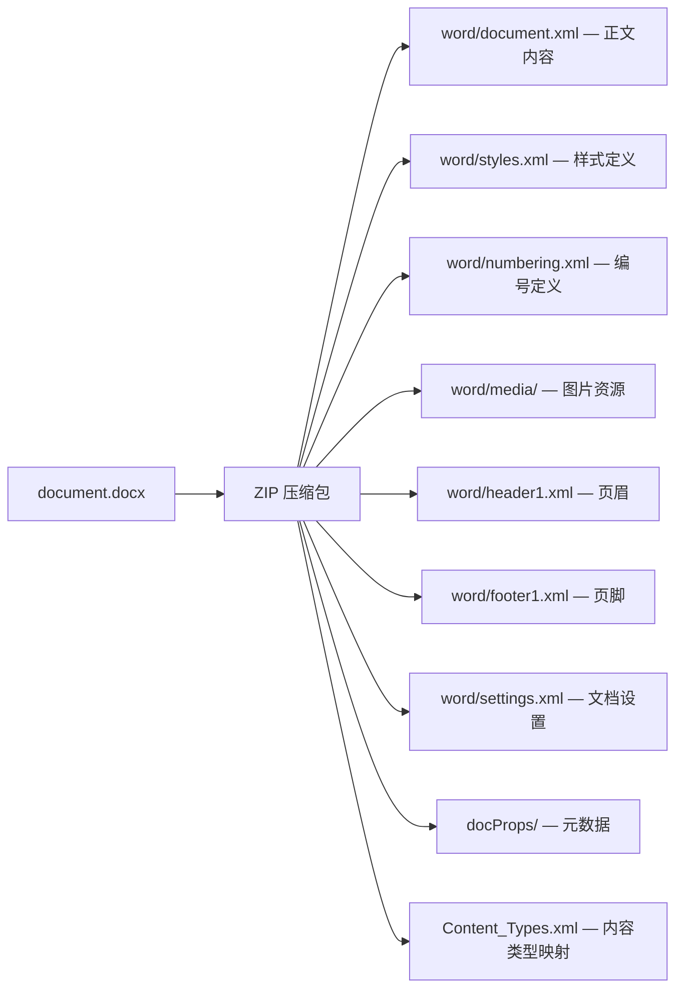
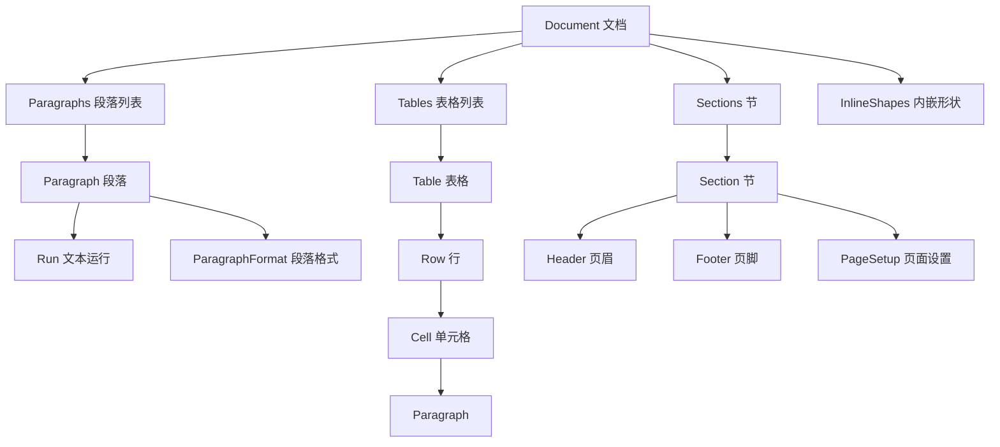

# Python 操作 Word 文件指南

## 概述

### OpenXML 格式背景

2007 年起，Microsoft Office 采用 **OpenXML** 作为默认格式（`.docx`、`.xlsx`、`.pptx`）。OpenXML 本质上是一个 ZIP 压缩包，内部包含 XML 文件集合。2008 年，OpenXML 成为 ISO 国际标准（ECMA-376 / ISO/IEC 29500）。



这意味着：**任何能处理 ZIP 和 XML 的编程语言都可以操作 Office 文档**，不再依赖 Windows 环境或 Office 软件。

### 验证 OpenXML 结构

```python
from zipfile import ZipFile
from pathlib import Path

# 解压 docx 查看内部结构
with ZipFile('sample.docx', 'r') as zf:
    for info in zf.infolist():
        print(f'{info.filename:40s} {info.file_size:>8d} bytes')

    # 读取正文 XML
    with zf.open('word/document.xml') as f:
        content = f.read().decode('utf-8')
        print(content[:500])
```

## python-docx

```bash
pip install python-docx
```

```python
from docx import Document
from docx.shared import Inches, Pt, Cm, RGBColor, Emu
from docx.enum.text import WD_ALIGN_PARAGRAPH, WD_LINE_SPACING
from docx.enum.table import WD_TABLE_ALIGNMENT, WD_ALIGN_VERTICAL
from docx.enum.section import WD_ORIENT
from docx.oxml.ns import qn
from docx.oxml import OxmlElement
```

### 基本概念模型



| 概念 | 说明 | 关键属性 |
|------|------|---------|
| `Document` | 整个 Word 文档 | paragraphs, tables, sections, styles |
| `Paragraph` | 一个段落（按回车分隔） | text, style, alignment, runs |
| `Run` | 段落内的一段连续文本（相同格式） | text, font, bold, italic, underline |
| `Table` | 表格 | rows, columns, style |
| `Section` | 节（控制页面尺寸、页眉页脚等） | page_width, page_height, orientation |
| `Style` | 样式（段落/字符/表格样式） | name, font, paragraph_format |

## 读取 Word 文档

### 基本读取

```python
from docx import Document

doc = Document('sample.docx')

# 读取所有段落
for para in doc.paragraphs:
    print(f'[{para.style.name}] {para.text}')

# 读取所有表格
for table in doc.tables:
    for row in table.rows:
        cells = [cell.text for cell in row.cells]
        print(' | '.join(cells))

# 读取文档属性
props = doc.core_properties
print(f'标题: {props.title}')
print(f'作者: {props.author}')
print(f'创建时间: {props.created}')
print(f'修改时间: {props.modified}')
print(f'关键词: {props.keywords}')
```

### 搜索关键词

```python
def search_keyword(doc, keyword):
    """搜索包含关键词的段落"""
    results = []
    for i, para in enumerate(doc.paragraphs):
        if keyword in para.text:
            results.append({
                'index': i,
                'text': para.text[:100] + ('...' if len(para.text) > 100 else ''),
                'style': para.style.name
            })
    return results

results = search_keyword(doc, 'Python')
for r in results:
    print(f'段落 {r["index"]}: [{r["style"]}] {r["text"]}')

# 搜索并高亮关键词
from docx.shared import RGBColor

def highlight_keyword(doc, keyword, color=RGBColor(0xFF, 0x00, 0x00)):
    """在文档中高亮关键词（红色加粗）"""
    for para in doc.paragraphs:
        if keyword in para.text:
            # 需要拆分 Run 来实现部分高亮
            for run in para.runs:
                if keyword in run.text:
                    # 将包含关键词的 Run 拆分
                    parts = run.text.split(keyword)
                    run.text = parts[0]
                    for part in parts[1:]:
                        highlight_run = para.add_run(keyword)
                        highlight_run.font.color.rgb = color
                        highlight_run.font.bold = True
                        para.add_run(part)
    return doc
```

### 提取文档结构

```python
def extract_document_structure(doc):
    """提取文档标题结构（大纲）"""
    structure = []
    for para in doc.paragraphs:
        style_name = para.style.name
        if style_name.startswith('Heading'):
            level = int(style_name.replace('Heading ', ''))
            structure.append({
                'level': level,
                'text': para.text,
            })
    return structure

# 提取所有超链接
def extract_hyperlinks(doc):
    """提取文档中的所有超链接"""
    links = []
    for para in doc.paragraphs:
        for run in para.runs:
            # 超链接存储在 XML 层
            hyperlink = run._element.find(qn('w:hyperlink'))
            if hyperlink is not None:
                r_id = hyperlink.get(qn('r:id'))
                if r_id:
                    url = doc.part.rels[r_id].target_ref
                    links.append({'text': run.text, 'url': url})
    return links
```

## 生成 Word 文档

### 段落与样式

```python
from docx import Document
from docx.shared import Pt, RGBColor, Cm
from docx.enum.text import WD_ALIGN_PARAGRAPH, WD_LINE_SPACING

doc = Document()

# 标题（内置样式）
doc.add_heading('项目周报', level=1)
doc.add_heading('一、本周进展', level=2)
doc.add_heading('1.1 核心功能开发', level=3)

# 正文段落
para = doc.add_paragraph('本周完成了以下工作：')

# 自定义段落格式
para = doc.add_paragraph()
para.alignment = WD_ALIGN_PARAGRAPH.CENTER
para.paragraph_format.line_spacing_rule = WD_LINE_SPACING.ONE_POINT_FIVE
para.paragraph_format.space_after = Pt(12)
para.paragraph_format.first_line_indent = Cm(0.74)  # 首行缩进 2 字符

run = para.add_run('重点内容')
run.bold = True
run.font.size = Pt(14)
run.font.color.rgb = RGBColor(0xFF, 0x00, 0x00)

run2 = para.add_run(' —— 这是红色加粗文本')

# 列表
doc.add_paragraph('项目A — 已完成', style='List Bullet')
doc.add_paragraph('项目B — 进行中', style='List Bullet')
doc.add_paragraph('项目C — 待启动', style='List Bullet')

# 编号列表
doc.add_paragraph('需求分析', style='List Number')
doc.add_paragraph('系统设计', style='List Number')
doc.add_paragraph('编码实现', style='List Number')

# 引用块
para = doc.add_paragraph('这是一段引用文字', style='Intense Quote')

doc.save('report.docx')
```

### 自定义样式

```python
from docx import Document
from docx.shared import Pt, RGBColor, Cm
from docx.enum.text import WD_ALIGN_PARAGRAPH
from docx.enum.style import WD_STYLE_TYPE

doc = Document()

# 创建自定义段落样式
styles = doc.styles

# 基于现有样式创建
custom_style = styles.add_style('MyTitle', WD_STYLE_TYPE.PARAGRAPH)
custom_style.base_style = styles['Heading 1']
custom_style.font.name = '微软雅黑'
custom_style.font.size = Pt(24)
custom_style.font.color.rgb = RGBColor(0x1A, 0x1A, 0x2E)
custom_style.font.bold = True
custom_style.paragraph_format.alignment = WD_ALIGN_PARAGRAPH.CENTER
custom_style.paragraph_format.space_after = Pt(20)

# 创建自定义字符样式
char_style = styles.add_style('MyEmphasis', WD_STYLE_TYPE.CHARACTER)
char_style.font.italic = True
char_style.font.color.rgb = RGBColor(0x44, 0x72, 0xC4)
char_style.font.underline = True

# 使用自定义样式
doc.add_paragraph('自定义标题', style='MyTitle')
para = doc.add_paragraph('这是')
para.add_run('重点强调', style='MyEmphasis')
para.add_run('的文字')

# 设置中文字体（需要同时设置西文字体和中文字体）
from docx.oxml.ns import qn
from docx.oxml import OxmlElement

def set_font(run, font_name='微软雅黑', font_name_east='微软雅黑', size=Pt(11)):
    """同时设置西文和中文字体"""
    run.font.name = font_name_east
    run.font.size = size
    r = run._element
    rPr = r.find(qn('w:rPr'))
    if rPr is None:
        rPr = OxmlElement('w:rPr')
        r.insert(0, rPr)
    rFonts = rPr.find(qn('w:rFonts'))
    if rFonts is None:
        rFonts = OxmlElement('w:rFonts')
        rPr.insert(0, rFonts)
    rFonts.set(qn('w:eastAsia'), font_name)
    rFonts.set(qn('w:ascii'), font_name)
    rFonts.set(qn('w:hAnsi'), font_name)
```

### 表格

```python
from docx import Document
from docx.shared import Pt, Cm, RGBColor
from docx.enum.table import WD_TABLE_ALIGNMENT, WD_ALIGN_VERTICAL
from docx.oxml.ns import qn
from docx.oxml import OxmlElement

doc = Document()

# 创建表格
table = doc.add_table(rows=4, cols=4, style='Light Shading Accent 1')
table.alignment = WD_TABLE_ALIGNMENT.CENTER

# 设置列宽
for i, width in enumerate([Cm(3), Cm(3), Cm(3), Cm(3)]):
    table.columns[i].width = width

# 表头
header_cells = table.rows[0].cells
for i, text in enumerate(['月份', '收入', '支出', '利润']):
    header_cells[i].text = text
    for run in header_cells[i].paragraphs[0].runs:
        run.font.bold = True
        run.font.color.rgb = RGBColor(0xFF, 0xFF, 0xFF)
    header_cells[i].paragraphs[0].alignment = WD_ALIGN_PARAGRAPH.CENTER

# 数据
data = [
    ['1月', '100万', '80万', '20万'],
    ['2月', '120万', '90万', '30万'],
    ['3月', '150万', '100万', '50万'],
]
for i, row_data in enumerate(data):
    row = table.rows[i + 1]
    for j, cell_text in enumerate(row_data):
        cell = row.cells[j]
        cell.text = cell_text
        cell.paragraphs[0].alignment = WD_ALIGN_PARAGRAPH.CENTER
        cell.vertical_alignment = WD_ALIGN_VERTICAL.CENTER

# 设置单元格底色
def set_cell_shading(cell, color):
    """设置单元格底色"""
    shading = OxmlElement('w:shd')
    shading.set(qn('w:fill'), color)
    shading.set(qn('w:val'), 'clear')
    cell._tc.get_or_add_tcPr().append(shading)

# 合并单元格
table.cell(0, 0).merge(table.cell(0, 1))  # 横向合并
table.cell(2, 3).merge(table.cell(3, 3))  # 纵向合并

# 处理合并单元格的读取
def read_merged_table(table):
    """正确读取含合并单元格的表格"""
    data = []
    for row in table.rows:
        row_data = []
        for cell in row.cells:
            # 合并单元格会返回相同的 _tc 对象
            if not row_data or row_data[-1] != cell.text:
                row_data.append(cell.text)
        data.append(row_data)
    return data
```

### 图片

```python
from docx.shared import Inches, Cm
from docx.enum.text import WD_ALIGN_PARAGRAPH

# 行内图片
doc.add_picture('chart.png', width=Cm(10), height=Cm(6))

# 居中图片
para = doc.add_paragraph()
para.alignment = WD_ALIGN_PARAGRAPH.CENTER
run = para.add_run()
run.add_picture('logo.png', width=Cm(3))

# 图片加说明文字
para = doc.add_paragraph()
para.alignment = WD_ALIGN_PARAGRAPH.CENTER
run = para.add_run()
run.add_picture('diagram.png', width=Cm(12))
caption = doc.add_paragraph('图 1：系统架构图')
caption.alignment = WD_ALIGN_PARAGRAPH.CENTER
caption.style = doc.styles['Caption']

# 从 URL 插入图片
import requests
import io

def add_image_from_url(doc, url, width=Cm(10)):
    """从 URL 下载并插入图片"""
    response = requests.get(url)
    image_stream = io.BytesIO(response.content)
    doc.add_picture(image_stream, width=width)
```

### 页眉与页脚

```python
from docx.enum.text import WD_ALIGN_PARAGRAPH
from docx.oxml import OxmlElement
from docx.oxml.ns import qn

# 页眉
section = doc.sections[0]
header = section.header
header.is_linked_to_previous = False  # 断开与前一节的链接

header_para = header.paragraphs[0]
header_para.text = '机密文档 — 仅供内部使用'
header_para.alignment = WD_ALIGN_PARAGRAPH.CENTER
for run in header_para.runs:
    run.font.size = Pt(8)
    run.font.color.rgb = RGBColor(0x99, 0x99, 0x99)

# 页脚（带页码）
footer = section.footer
footer.is_linked_to_previous = False
footer_para = footer.paragraphs[0]
footer_para.alignment = WD_ALIGN_PARAGRAPH.CENTER

# 添加页码字段
def add_page_number(paragraph):
    """在段落中添加自动页码"""
    run = paragraph.add_run('第 ')
    run.font.size = Pt(9)

    # PAGE 字段 — 当前页码
    fld_char_begin = OxmlElement('w:fldChar')
    fld_char_begin.set(qn('w:fldCharType'), 'begin')
    run1 = paragraph.add_run()
    run1._r.append(fld_char_begin)

    instr_text = OxmlElement('w:instrText')
    instr_text.set(qn('xml:space'), 'preserve')
    instr_text.text = ' PAGE '
    run2 = paragraph.add_run()
    run2._r.append(instr_text)

    fld_char_end = OxmlElement('w:fldChar')
    fld_char_end.set(qn('w:fldCharType'), 'end')
    run3 = paragraph.add_run()
    run3._r.append(fld_char_end)

    run4 = paragraph.add_run(' 页')
    run4.font.size = Pt(9)

add_page_number(footer_para)

# 不同首页页眉页脚
section.different_first_page_header_footer = True
first_header = section.first_page_header
first_header.paragraphs[0].text = '首页专用页眉'
```

### 页面设置

```python
from docx.shared import Cm, Mm
from docx.enum.section import WD_ORIENT

section = doc.sections[0]

# 纸张大小
section.page_width = Cm(21)    # A4 宽度
section.page_height = Cm(29.7) # A4 高度

# 页边距
section.top_margin = Cm(2.54)
section.bottom_margin = Cm(2.54)
section.left_margin = Cm(3.17)
section.right_margin = Cm(3.17)

# 横向
section.orientation = WD_ORIENT.LANDSCAPE
new_width, new_height = section.page_height, section.page_width
section.page_width = new_width
section.page_height = new_height

# 分栏
from docx.oxml import OxmlElement
sectPr = section._sectPr
cols = OxmlElement('w:cols')
cols.set(qn('w:num'), '2')  # 两栏
cols.set(qn('w:space'), '720')  # 栏间距
sectPr.append(cols)
```

### 脚注与尾注

```python
from docx.oxml import OxmlElement
from docx.oxml.ns import qn

def add_footnote(paragraph, text):
    """添加脚注（python-docx 不原生支持，需操作 XML）"""
    # 获取脚注部分
    doc_part = paragraph.part
    footnote_part = doc_part.package.part_related_by(
        'http://schemas.openxmlformats.org/officeDocument/2006/relationships/footnotes'
    ) if hasattr(doc_part, 'package') else None

    # 简化方案：使用上标模拟脚注标记
    run = paragraph.add_run()
    sup = OxmlElement('w:rPr')
    vertAlign = OxmlElement('w:vertAlign')
    vertAlign.set(qn('w:val'), 'superscript')
    sup.append(vertAlign)
    run._r.insert(0, sup)
    run.text = '[1]'

    # 在文档末尾添加脚注内容
    note_para = doc.add_paragraph()
    note_para.style = doc.styles['Normal']
    note_run = note_para.add_run('[1] ')
    note_run.font.size = Pt(8)
    note_run2 = note_para.add_run(text)
    note_run2.font.size = Pt(8)
```

## 模板系统

### 使用模板文档

```python
from docx import Document
from pathlib import Path

# 加载模板
doc = Document('template.docx')

# 替换模板中的占位符
def replace_placeholders(doc, replacements):
    """替换文档中的 {{placeholder}} 占位符"""
    for para in doc.paragraphs:
        for key, value in replacements.items():
            placeholder = f'{{{{{key}}}}}'  # {{key}}
            if placeholder in para.text:
                for run in para.runs:
                    if placeholder in run.text:
                        run.text = run.text.replace(placeholder, str(value))

    # 替换表格中的占位符
    for table in doc.tables:
        for row in table.rows:
            for cell in row.cells:
                for para in cell.paragraphs:
                    for key, value in replacements.items():
                        placeholder = f'{{{{{key}}}}}'
                        if placeholder in para.text:
                            for run in para.runs:
                                if placeholder in run.text:
                                    run.text = run.text.replace(placeholder, str(value))

    return doc

# 使用
replacements = {
    'company_name': 'XX科技有限公司',
    'report_date': '2026年6月6日',
    'total_revenue': '1,500,000',
    'growth_rate': '23.5%',
}
doc = replace_placeholders(doc, replacements)
doc.save('filled_report.docx')
```

### Jinja2 模板引擎集成

```bash
pip install docxtpl
```

```python
from docxtpl import DocxTemplate
from datetime import datetime

# 在 Word 模板中使用 Jinja2 语法：
# {{ company_name }}
# 
# {{ item.name }} | {{ item.value }}
# 
# 汇总信息

tpl = DocxTemplate('template.docx')

context = {
    'company_name': 'XX科技有限公司',
    'report_date': datetime.now().strftime('%Y年%m月%d日'),
    'items': [
        {'name': '产品A', 'value': '¥598,880', 'status': '已完成'},
        {'name': '产品B', 'value': '¥756,500', 'status': '进行中'},
        {'name': '产品C', 'value': '¥645,000', 'status': '待启动'},
    ],
    'show_summary': True,
    'total': '¥2,000,380',
}

tpl.render(context)
tpl.save('rendered_report.docx')
```

## 目录生成

```python
from docx.oxml import OxmlElement
from docx.oxml.ns import qn

def add_table_of_contents(doc, title='目录'):
    """在文档开头插入自动目录"""
    # 在文档开头插入段落
    para = doc.add_paragraph()
    # 移动到文档开头
    doc.element.body.insert(0, para._element)

    para.style = doc.styles['Heading 1']
    run = para.add_run(title)
    run.font.size = Pt(22)
    run.font.bold = True

    # 插入 TOC 域代码
    toc_para = doc.add_paragraph()
    doc.element.body.insert(1, toc_para._element)

    fld_char_begin = OxmlElement('w:fldChar')
    fld_char_begin.set(qn('w:fldCharType'), 'begin')

    instr_text = OxmlElement('w:instrText')
    instr_text.set(qn('xml:space'), 'preserve')
    instr_text.text = r' TOC \o "1-3" \h \z \u '  # 1-3 级标题

    fld_char_separate = OxmlElement('w:fldChar')
    fld_char_separate.set(qn('w:fldCharType'), 'separate')

    fld_char_end = OxmlElement('w:fldChar')
    fld_char_end.set(qn('w:fldCharType'), 'end')

    run1 = toc_para.add_run()
    run1._r.append(fld_char_begin)
    run2 = toc_para.add_run()
    run2._r.append(instr_text)
    run3 = toc_para.add_run()
    run3._r.append(fld_char_separate)
    run4 = toc_para.add_run('（请在 Word 中右键更新域以生成目录）')
    run4.font.color.rgb = RGBColor(0x99, 0x99, 0x99)
    run5 = toc_para.add_run()
    run5._r.append(fld_char_end)
```

## 文档对比

```bash
# python-docx 生态无成熟的文档对比包，推荐基于 difflib 自行实现（见下）
```

```python
from docx import Document

def compare_documents(doc1_path, doc2_path):
    """简单对比两个 Word 文档的文本差异"""
    doc1 = Document(doc1_path)
    doc2 = Document(doc2_path)

    # 提取文本
    text1 = [p.text for p in doc1.paragraphs]
    text2 = [p.text for p in doc2.paragraphs]

    # 使用 difflib 对比
    import difflib
    diff = difflib.unified_diff(text1, text2, lineterm='',
                                 fromfile='原文档', tofile='新文档')

    changes = []
    for line in diff:
        if line.startswith('+') and not line.startswith('+++'):
            changes.append({'type': 'added', 'text': line[1:]})
        elif line.startswith('-') and not line.startswith('---'):
            changes.append({'type': 'removed', 'text': line[1:]})

    return changes

# 高级方案：使用 redlines 库生成带修订标记的文档
# pip install redlines
from redlines import Redlines

def generate_redline_doc(original_text, revised_text, output_path):
    """生成带修订标记的 Word 文档"""
    red = Redlines(original_text, revised_text)
    doc = Document()
    doc.add_paragraph(red.output_markdown)
    doc.save(output_path)
```

## 实战案例：批量周报生成系统

```python
"""
批量周报生成系统
功能：根据数据源自动生成格式统一的周报文档
支持：模板填充、图表插入、多部门批量生成
"""
from docx import Document
from docx.shared import Pt, Cm, RGBColor, Inches
from docx.enum.text import WD_ALIGN_PARAGRAPH
from docx.enum.table import WD_TABLE_ALIGNMENT
from docx.oxml.ns import qn
from docx.oxml import OxmlElement
from pathlib import Path
from datetime import datetime, timedelta
import json


class WeeklyReportGenerator:
    """周报生成器"""

    def __init__(self, template_path=None):
        self.template_path = template_path

    def generate(self, data, output_path):
        """生成单份周报"""
        if self.template_path and Path(self.template_path).exists():
            doc = Document(self.template_path)
        else:
            doc = Document()
            self._setup_default_styles(doc)

        # 文档标题
        title = doc.add_heading('', level=1)
        run = title.add_run(f'{data["department"]} — 第{data["week_number"]}周工作周报')
        run.font.size = Pt(22)
        run.font.color.rgb = RGBColor(0x1A, 0x1A, 0x2E)
        title.alignment = WD_ALIGN_PARAGRAPH.CENTER

        # 基本信息
        info_table = doc.add_table(rows=3, cols=4, style='Table Grid')
        info_data = [
            ['部门', data['department'], '报告人', data['reporter']],
            ['报告周期', f'{data["start_date"]} ~ {data["end_date"]}', '提交日期', data['submit_date']],
            ['本周工作天数', str(data.get('work_days', 5)), '下周计划天数', str(data.get('next_work_days', 5))],
        ]
        for i, row_data in enumerate(info_data):
            for j, text in enumerate(row_data):
                cell = info_table.cell(i, j)
                cell.text = text
                if j % 2 == 0:  # 标签列
                    for run in cell.paragraphs[0].runs:
                        run.font.bold = True
                    set_cell_shading(cell, 'E8EDF3')

        doc.add_paragraph()

        # 一、本周工作完成情况
        doc.add_heading('一、本周工作完成情况', level=2)

        task_table = doc.add_table(rows=1, cols=5, style='Table Grid')
        task_table.alignment = WD_TABLE_ALIGNMENT.CENTER
        headers = ['序号', '工作内容', '计划进度', '实际进度', '完成状态']
        for j, h in enumerate(headers):
            cell = task_table.cell(0, j)
            cell.text = h
            for run in cell.paragraphs[0].runs:
                run.font.bold = True
                run.font.color.rgb = RGBColor(0xFF, 0xFF, 0xFF)
            set_cell_shading(cell, '4472C4')

        for i, task in enumerate(data['tasks'], 1):
            row = task_table.add_row()
            row.cells[0].text = str(i)
            row.cells[1].text = task['content']
            row.cells[2].text = task['planned']
            row.cells[3].text = task['actual']
            row.cells[4].text = task['status']

            # 根据状态设置颜色
            status = task['status']
            if status == '已完成':
                set_cell_shading(row.cells[4], 'C6EFCE')
            elif status == '进行中':
                set_cell_shading(row.cells[4], 'FFEB9C')
            elif status == '延期':
                set_cell_shading(row.cells[4], 'FFC7CE')

        # 设置列宽
        widths = [Cm(1.5), Cm(7), Cm(2.5), Cm(2.5), Cm(2.5)]
        for i, width in enumerate(widths):
            for row in task_table.rows:
                row.cells[i].width = width

        doc.add_paragraph()

        # 二、关键问题与风险
        doc.add_heading('二、关键问题与风险', level=2)
        if data.get('risks'):
            risk_table = doc.add_table(rows=1, cols=4, style='Table Grid')
            risk_headers = ['风险描述', '影响程度', '应对措施', '责任人']
            for j, h in enumerate(risk_headers):
                cell = risk_table.cell(0, j)
                cell.text = h
                for run in cell.paragraphs[0].runs:
                    run.font.bold = True
                set_cell_shading(cell, '4472C4')
                for run in cell.paragraphs[0].runs:
                    run.font.color.rgb = RGBColor(0xFF, 0xFF, 0xFF)

            for risk in data['risks']:
                row = risk_table.add_row()
                row.cells[0].text = risk['description']
                row.cells[1].text = risk['impact']
                row.cells[2].text = risk['measure']
                row.cells[3].text = risk['owner']
        else:
            doc.add_paragraph('本周无重大风险。')

        doc.add_paragraph()

        # 三、下周工作计划
        doc.add_heading('三、下周工作计划', level=2)
        for plan in data.get('next_plans', []):
            doc.add_paragraph(plan, style='List Bullet')

        # 四、需要协调的事项
        doc.add_heading('四、需要协调的事项', level=2)
        for item in data.get('coordination', []):
            doc.add_paragraph(item, style='List Bullet')

        # 页脚
        section = doc.sections[0]
        footer = section.footer
        footer_para = footer.paragraphs[0]
        footer_para.alignment = WD_ALIGN_PARAGRAPH.CENTER
        footer_para.add_run(f'{data["department"]} | 机密文件 | ').font.size = Pt(8)
        add_page_number(footer_para)

        doc.save(str(output_path))
        return output_path

    def batch_generate(self, data_list, output_dir):
        """批量生成周报"""
        output_dir = Path(output_dir)
        output_dir.mkdir(parents=True, exist_ok=True)

        generated = []
        for data in data_list:
            filename = f'周报_{data["department"]}_第{data["week_number"]}周.docx'
            output_path = output_dir / filename
            self.generate(data, output_path)
            generated.append(output_path)
            print(f'已生成: {filename}')

        return generated


# 辅助函数
def set_cell_shading(cell, color):
    shading = OxmlElement('w:shd')
    shading.set(qn('w:fill'), color)
    shading.set(qn('w:val'), 'clear')
    cell._tc.get_or_add_tcPr().append(shading)

def add_page_number(paragraph):
    run = paragraph.add_run('第 ')
    run.font.size = Pt(8)
    fld_char_begin = OxmlElement('w:fldChar')
    fld_char_begin.set(qn('w:fldCharType'), 'begin')
    run1 = paragraph.add_run()
    run1._r.append(fld_char_begin)
    instr_text = OxmlElement('w:instrText')
    instr_text.set(qn('xml:space'), 'preserve')
    instr_text.text = ' PAGE '
    run2 = paragraph.add_run()
    run2._r.append(instr_text)
    fld_char_end = OxmlElement('w:fldChar')
    fld_char_end.set(qn('w:fldCharType'), 'end')
    run3 = paragraph.add_run()
    run3._r.append(fld_char_end)
    run4 = paragraph.add_run(' 页')
    run4.font.size = Pt(8)


# 使用示例
generator = WeeklyReportGenerator()

departments_data = [
    {
        'department': '研发部',
        'week_number': 23,
        'reporter': '张三',
        'start_date': '2026-06-01',
        'end_date': '2026-06-06',
        'submit_date': '2026-06-06',
        'tasks': [
            {'content': '用户认证模块重构', 'planned': '100%', 'actual': '100%', 'status': '已完成'},
            {'content': 'API 性能优化', 'planned': '80%', 'actual': '70%', 'status': '进行中'},
            {'content': '数据库迁移方案设计', 'planned': '50%', 'actual': '30%', 'status': '延期'},
        ],
        'risks': [
            {'description': '数据库迁移可能影响线上服务', 'impact': '高', 'measure': '制定回滚方案，灰度发布', 'owner': '李四'},
        ],
        'next_plans': ['完成 API 性能优化', '启动数据库迁移测试', '编写技术文档'],
        'coordination': ['需要运维部配合数据库迁移窗口'],
    },
    {
        'department': '产品部',
        'week_number': 23,
        'reporter': '王五',
        'start_date': '2026-06-01',
        'end_date': '2026-06-06',
        'submit_date': '2026-06-06',
        'tasks': [
            {'content': 'V2.5 需求评审', 'planned': '100%', 'actual': '100%', 'status': '已完成'},
            {'content': '竞品分析报告', 'planned': '80%', 'actual': '90%', 'status': '已完成'},
        ],
        'risks': [],
        'next_plans': ['V2.5 原型设计', '用户调研问卷设计'],
        'coordination': [],
    },
]

generator.batch_generate(departments_data, 'weekly_reports')
```

## 常见陷阱

| 陷阱 | 说明 | 正确做法 |
|------|------|---------|
| 图片路径问题 | 构建时本地路径不可用 | 使用 OSS 外链或 `io.BytesIO` |
| 合并单元格无法提取内容 | `cell.text` 为空 | 使用 `cell._element` 底层访问 |
| python-docx 不支持超链接 | 提取时丢失链接信息 | 操作 XML 层 `w:hyperlink` |
| 样式不生效 | 修改了不存在的 Run | 检查 `para.runs` 是否有元素 |
| 中文字体不生效 | 只设置了 `font.name` | 需同时设置 `w:rFonts` 的 `w:eastAsia` |
| 模板占位符跨 Run | `{{name}}` 被拆分为多个 Run | 使用 `docxtpl` 或合并 Run 后替换 |
| 大文档内存溢出 | 全部加载到内存 | 拆分文档分段处理（python-docx 需整档加载） |
| 页码域代码不显示 | 需在 Word 中手动更新 | 提示用户打开后按 Ctrl+A → F9 |

## 延伸阅读

- [python-docx 官方文档](https://python-docx.readthedocs.io/)
- [python-docx 样式参考](https://python-docx.readthedocs.io/en/latest/user/styles-understanding.html)
- [docxtpl 模板引擎](https://github.com/elapouya/python-docx-template)
- [OpenXML 标准](https://www.ecma-international.org/publications-and-standards/standards/ecma-376/)
- [Word OpenXML 文档结构](https://learn.microsoft.com/en-us/openspecs/office_standards/ms-docx/)

## 版本差异（自动化办公库 → 当前稳定版）

| 库 | 本文编写时 | 当前稳定版（截至 2026-09） |
|----|-----------|-----------|
| `openpyxl`（Excel） | 旧版 | 3.1.x |
| `python-docx`（Word） | 旧版 | 1.2.x |
| `python-pptx`（PPT） | 旧版 | 1.0.x |
| `reportlab`（PDF） | 旧版 | 5.x |
| `PyPDF2`/`pypdf` | PyPDF2 | 推荐 `pypdf`（6.x，PyPDF2 已停止维护） |
| `Pillow`（图像） | 旧版 | 12.x |

> 本文讲解的自动化办公流程（读写 Excel/Word/PDF/PPT）与核心 API 在最新版本中成立；注意 PyPDF2 已迁移至 pypdf。
