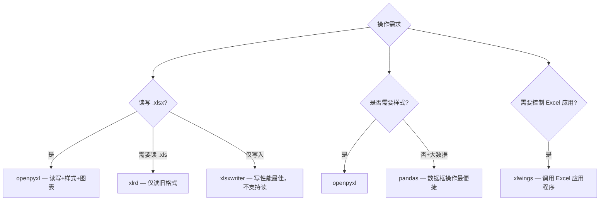
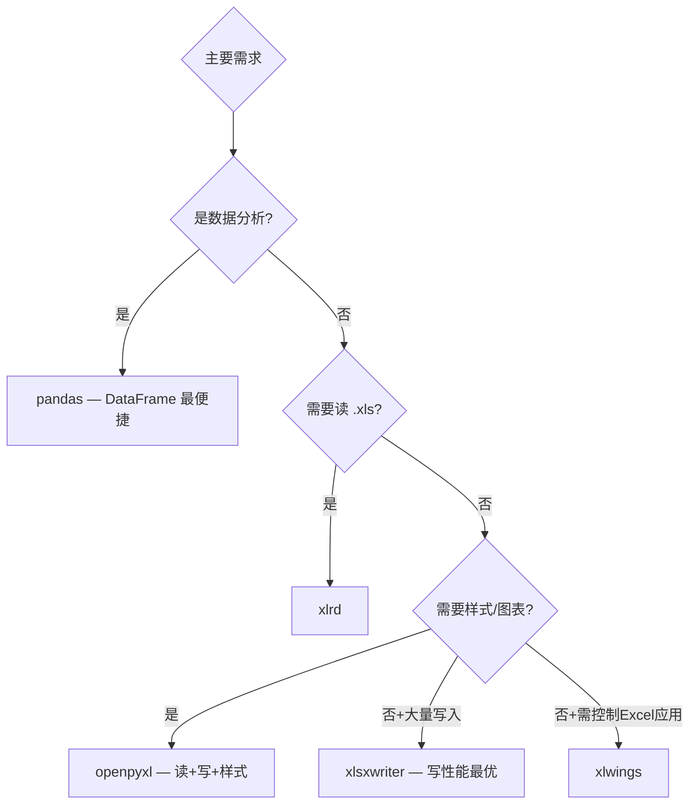

# Python 操作 Excel 文件指南

## 概述

Python 处理 Excel 的库选择因需求而异：



| 库 | 读 | 写 | 样式 | 图表 | .xls 支持 | 亮点 |
|---|---|---|---|---|---|---|
| **openpyxl** | ✅ | ✅ | ✅ | ✅ | ❌ | **最全面，推荐** |
| xlrd | ✅ | ❌ | ❌ | ❌ | ✅ | 旧格式兼容 |
| xlsxwriter | ❌ | ✅ | ✅ | ✅ | ❌ | 写入性能最好 |
| pandas | ✅ | ✅ | 有限 | ❌ | 有限 | 数据分析场景 |
| xlwings | ✅ | ✅ | ✅ | ✅ | ✅ | 需安装 Excel |

## openpyxl 基础

```bash
pip install openpyxl
```

```python
import openpyxl
from openpyxl.styles import Font, Alignment, Border, Side, PatternFill, numbers
from openpyxl.chart import BarChart, PieChart, LineChart, Reference
from openpyxl.utils import get_column_letter, column_index_from_string
```

### 工作簿与工作表

```python
# 创建新工作簿
wb = openpyxl.Workbook()
ws = wb.active          # 默认工作表
ws.title = '第一季度'

# 新建工作表
ws2 = wb.create_sheet('第二季度', 0)  # 插入到位置 0
ws3 = wb.create_sheet('汇总')

# 复制工作表
ws_copy = wb.copy_worksheet(ws)
ws_copy.title = '第一季度(副本)'

# 打开现有文件
wb = openpyxl.load_workbook('report.xlsx')
ws = wb['Sheet1']

# 遍历所有工作表
for sheet_name in wb.sheetnames:
    ws = wb[sheet_name]
    print(f'{sheet_name}: {ws.max_row} 行 × {ws.max_column} 列')

# 删除工作表
wb.remove(wb['汇总'])

# 工作表标签颜色
ws.sheet_properties.tabColor = '4472C4'

# 冻结窗格
ws.freeze_panes = 'A2'       # 冻结首行
ws.freeze_panes = 'B2'       # 冻结首行和首列
ws.freeze_panes = 'C3'       # 冻结前2行2列

# 拆分窗口
ws.split = 'C3'

wb.save('output.xlsx')
```

### 读写数据

```python
# 写入
ws['A1'] = '姓名'
ws['B1'] = '年龄'
ws.cell(row=2, column=1, value='张三')
ws.cell(row=2, column=2, value=25)

# 批量写入（按行）
data = [
    ['姓名', '年龄', '部门'],
    ['张三', 25, '研发'],
    ['李四', 30, '产品'],
    ['王五', 28, '设计'],
]
for row in data:
    ws.append(row)

# 读取
for row in ws.iter_rows(min_row=2, values_only=True):
    name, age, dept = row
    print(f'{name} | {age} | {dept}')

# 读取指定范围（A1:C5）
for row in ws['A1:C5']:
    for cell in row:
        print(cell.value)

# 按列读取
for col in ws.iter_cols(min_col=1, max_col=3, values_only=True):
    print(col)

# 读取为字典列表
def read_as_dicts(ws):
    """将工作表读取为字典列表"""
    headers = [cell.value for cell in ws[1]]
    return [
        dict(zip(headers, [cell.value for cell in row]))
        for row in ws.iter_rows(min_row=2)
    ]

# 行列工具函数
get_column_letter(1)          # 'A'
get_column_letter(27)         # 'AA'
column_index_from_string('A') # 1
column_index_from_string('AA') # 27
```

## 单元格样式

### 字体与对齐

```python
from openpyxl.styles import Font, Alignment, PatternFill, Border, Side

# 字体
ws['A1'].font = Font(
    name='微软雅黑',
    size=14,
    bold=True,
    italic=False,
    color='FF0000',     # 红色
    underline='single'
)

# 对齐方式
ws['A1'].alignment = Alignment(
    horizontal='center',
    vertical='center',
    wrap_text=True,       # 自动换行
    shrink_to_fit=True,   # 缩小字体填充
    text_rotation=0,      # 文字旋转角度（0-180）
)

# 填充（背景色）
ws['A1'].fill = PatternFill(
    start_color='4472C4',  # 深蓝色
    end_color='4472C4',
    fill_type='solid'
)

# 渐变填充
from openpyxl.styles import GradientFill
ws['B1'].fill = GradientFill(
    stop=('4472C4', 'ED7D31')  # 蓝到橙渐变
)

# 边框
thin_border = Border(
    left=Side(style='thin'),
    right=Side(style='thin'),
    top=Side(style='thin'),
    bottom=Side(style='thin'),
)
# 边框样式: thin, medium, thick, double, dashed, dotted, dashDot, hair

for row in ws['A1:C10']:
    for cell in row:
        cell.border = thin_border

# 数字格式
ws['B2'].number_format = '#,##0.00'     # 千分位两位小数
ws['C2'].number_format = 'YYYY-MM-DD'   # 日期格式
ws['D2'].number_format = '0.00%'        # 百分比
ws['E2'].number_format = '¥#,##0.00'    # 货币
ws['F2'].number_format = '0.00E+00'     # 科学计数法
ws['G2'].number_format = '[Red][<0]0.00;[Green][>0]0.00;0.00'  # 条件颜色
```

### 命名样式（复用）

```python
from openpyxl.styles import NamedStyle

header_style = NamedStyle(name='header')
header_style.font = Font(bold=True, size=12, color='FFFFFF')
header_style.fill = PatternFill('solid', fgColor='4472C4')
header_style.alignment = Alignment(horizontal='center')
header_style.border = Border(
    left=Side('thin'), right=Side('thin'),
    top=Side('thin'), bottom=Side('thin'),
)

# 注册到工作簿
wb.add_named_style(header_style)
for cell in ws[1]:  # 第一行
    cell.style = 'header'
```

### 单元格合并

```python
# 合并单元格
ws.merge_cells('A1:D1')
ws['A1'] = '2024 年度销售报表'

# 按范围合并
ws.merge_cells(start_row=2, start_column=1, end_row=2, end_column=4)

# 取消合并
ws.unmerge_cells('A1:D1')

# 合并单元格样式设置
ws['A1'].alignment = Alignment(horizontal='center', vertical='center')
```

## 条件格式

```python
from openpyxl.formatting.rule import CellIsRule, ColorScaleRule, DataBarRule, FormulaRule

# 1. 单元格值条件格式
ws.conditional_formatting.add('B2:B100',
    CellIsRule(operator='greaterThan', formula=['100'],
              fill=PatternFill('solid', fgColor='C6EFCE'),
              font=Font(color='006100')))

ws.conditional_formatting.add('B2:B100',
    CellIsRule(operator='lessThan', formula=['50'],
              fill=PatternFill('solid', fgColor='FFC7CE'),
              font=Font(color='9C0006')))

# 2. 颜色渐变（色阶）
ws.conditional_formatting.add('C2:C100',
    ColorScaleRule(start_type='min', start_color='63BE7B',
                   mid_type='percentile', mid_value=50, mid_color='FFEB84',
                   end_type='max', end_color='F8696B'))

# 3. 数据条
ws.conditional_formatting.add('D2:D100',
    DataBarRule(start_type='min', end_type='max',
               color='4472C4', showValue=True))

# 4. 公式条件格式
ws.conditional_formatting.add('A2:E100',
    FormulaRule(formula=['$E2<0.6'],
               fill=PatternFill('solid', fgColor='FFC7CE')))

# 5. 图标集
from openpyxl.formatting.rule import IconSetRule
ws.conditional_formatting.add('F2:F100',
    IconSetRule(icon_style='3TrafficLights1', type='percent',
                values=[0, 33, 67]))

# 6. 重复值高亮（openpyxl 没有 DuplicateRule 类，需用通用 Rule）
from openpyxl.formatting.rule import Rule
from openpyxl.styles.differential import DifferentialStyle

dxf_dup = DifferentialStyle(fill=PatternFill(bgColor='FFFF00'))
ws.conditional_formatting.add('A2:A100',
    Rule(type='duplicateValues', dxf=dxf_dup))

# 7. 前 N 项 / 后 N 项
dxf_top = DifferentialStyle(fill=PatternFill(bgColor='C6EFCE'))
ws.conditional_formatting.add('B2:B100',
    Rule(type='top10', rank=5, percent=False, dxf=dxf_top))
```

## 数据验证

```python
from openpyxl.worksheet.datavalidation import DataValidation

# 下拉列表
dv_list = DataValidation(type='list', formula1='"研发,产品,设计,运营"', allow_blank=True)
dv_list.error = '请选择有效的部门'
dv_list.errorTitle = '输入错误'
dv_list.prompt = '请从下拉列表中选择部门'
dv_list.promptTitle = '部门选择'
ws.add_data_validation(dv_list)
dv_list.add('C2:C100')

# 数值范围
dv_range = DataValidation(type='whole', operator='between', formula1='18', formula2='65')
dv_range.error = '年龄必须在 18-65 之间'
ws.add_data_validation(dv_range)
dv_range.add('B2:B100')

# 日期范围
dv_date = DataValidation(type='date', operator='between',
                         formula1='2024-01-01', formula2='2024-12-31')
ws.add_data_validation(dv_date)
dv_date.add('D2:D100')

# 文本长度
dv_text = DataValidation(type='textLength', operator='lessThanOrEqual', formula1='20')
ws.add_data_validation(dv_text)
dv_text.add('A2:A100')

# 自定义公式验证
dv_custom = DataValidation(type='custom', formula1='=AND(ISNUMBER(A2),A2>0)')
ws.add_data_validation(dv_custom)
dv_custom.add('A2:A100')
```

## 图表生成

```python
from openpyxl.chart import BarChart, PieChart, LineChart, Reference, Series
from openpyxl.chart.label import DataLabelList
from openpyxl.chart.series import DataPoint

# 柱状图
chart = BarChart()
chart.title = '季度销售对比'
chart.x_axis.title = '季度'
chart.y_axis.title = '销售额（万元）'
chart.style = 10
chart.width = 20
chart.height = 12

data = Reference(ws, min_col=2, min_row=1, max_col=4, max_row=5)
categories = Reference(ws, min_col=1, min_row=2, max_row=5)
chart.add_data(data, titles_from_data=True)
chart.set_categories(categories)

# 设置系列颜色
from openpyxl.chart.series import DataPoint
from openpyxl.drawing.fill import PatternFillProperties, ColorChoice
chart.series[0].graphicalProperties.solidFill = '4472C4'
chart.series[1].graphicalProperties.solidFill = 'ED7D31'

ws.add_chart(chart, 'A10')

# 饼图
pie = PieChart()
pie.title = '市场份额分布'
data = Reference(ws, min_col=2, min_row=1, max_row=5)
categories = Reference(ws, min_col=1, min_row=2, max_row=5)
pie.add_data(data, titles_from_data=True)
pie.set_categories(categories)

# 数据标签
pie.dataLabels = DataLabelList()
pie.dataLabels.showPercent = True
pie.dataLabels.showCatName = True

# 突出某个扇区
pt = DataPoint(idx=0)
pt.graphicalProperties.solidFill = 'FF0000'
pie.series[0].data_points.append(pt)

ws.add_chart(pie, 'A25')

# 折线图
line = LineChart()
line.title = '月度趋势'
line.y_axis.title = '数值'
line.x_axis.title = '月份'
line.style = 10

data = Reference(ws, min_col=2, min_row=1, max_col=3, max_row=13)
cats = Reference(ws, min_col=1, min_row=2, max_row=13)
line.add_data(data, titles_from_data=True)
line.set_categories(cats)

# 线条样式
line.series[0].graphicalProperties.line.width = 25000  # EMU
line.series[0].smooth = True  # 平滑曲线

ws.add_chart(line, 'A40')

# 双轴图表（柱状 + 折线）
bar = BarChart()
line2 = LineChart()
# 各自添加数据...
bar.y_axis.crosses = 'min'
line2.y_axis.axId = 200
line2.y_axis.crosses = 'max'
bar += line2  # 组合
ws.add_chart(bar, 'A55')
```

### 插入图片

```python
from openpyxl.drawing.image import Image

img = Image('logo.png')
img.width = 150
img.height = 100
ws.add_image(img, 'F1')  # 放置在 F1 单元格附近
```

## pandas 协同

```python
import pandas as pd
import openpyxl

# pandas 读取 Excel
df = pd.read_excel('data.xlsx', sheet_name='Sheet1', header=0)
df = pd.read_excel('data.xlsx', sheet_name=0, skiprows=2, usecols='A:D')
df = pd.read_excel('data.xlsx', sheet_name=None)  # 读取所有工作表，返回字典

# pandas 写入 Excel
df.to_excel('output.xlsx', index=False, sheet_name='数据')

# 多 DataFrame 写入不同工作表
with pd.ExcelWriter('multi_sheet.xlsx', engine='openpyxl') as writer:
    df1.to_excel(writer, sheet_name='销售', index=False)
    df2.to_excel(writer, sheet_name='库存', index=False)
    df3.to_excel(writer, sheet_name='汇总', index=False)

# pandas 处理 + openpyxl 美化
def pandas_to_beautiful_excel(df, output_path, title='数据报表'):
    """pandas 处理数据 + openpyxl 美化输出"""
    # 先用 pandas 写入
    with pd.ExcelWriter(output_path, engine='openpyxl') as writer:
        df.to_excel(writer, sheet_name='数据', index=False)

    # 再用 openpyxl 美化
    wb = openpyxl.load_workbook(output_path)
    ws = wb['数据']

    # 表头样式
    header_font = Font(bold=True, color='FFFFFF', size=11)
    header_fill = PatternFill('solid', fgColor='4472C4')
    for cell in ws[1]:
        cell.font = header_font
        cell.fill = header_fill
        cell.alignment = Alignment(horizontal='center')

    # 自动列宽
    for col in ws.columns:
        max_length = 0
        col_letter = col[0].column_letter
        for cell in col:
            try:
                if cell.value:
                    max_length = max(max_length, len(str(cell.value)))
            except:
                pass
        ws.column_dimensions[col_letter].width = min(max_length + 4, 30)

    # 添加边框
    thin_border = Border(
        left=Side('thin'), right=Side('thin'),
        top=Side('thin'), bottom=Side('thin'),
    )
    for row in ws.iter_rows(min_row=1, max_row=ws.max_row, max_col=ws.max_column):
        for cell in row:
            cell.border = thin_border

    # 交替行颜色
    for i, row in enumerate(ws.iter_rows(min_row=2, max_row=ws.max_row), 1):
        if i % 2 == 0:
            for cell in row:
                cell.fill = PatternFill('solid', fgColor='F2F2F2')

    # 冻结首行
    ws.freeze_panes = 'A2'

    # 自动筛选
    ws.auto_filter.ref = f'A1:{get_column_letter(ws.max_column)}{ws.max_row}'

    wb.save(output_path)
```

## 大数据优化

```python
# 1. read_only 模式读取大文件
wb = openpyxl.load_workbook('large_file.xlsx', read_only=True)
ws = wb['Sheet1']

for row in ws.iter_rows(values_only=True):
    process(row)

wb.close()  # read_only 模式必须手动关闭

# 2. write_only 模式写入大文件
wb = openpyxl.Workbook(write_only=True)
ws = wb.create_sheet('数据')

# write_only 模式只能 append，不能修改已有单元格
for chunk in data_chunks:
    ws.append(chunk)

wb.save('large_output.xlsx')

# 3. 分块处理
def process_large_excel(input_path, output_path, chunk_size=10000):
    """分块处理大 Excel 文件"""
    wb_in = openpyxl.load_workbook(input_path, read_only=True)
    ws_in = wb_in.active

    wb_out = openpyxl.Workbook(write_only=True)
    ws_out = wb_out.create_sheet('处理结果')

    # 写入表头
    headers = next(ws_in.iter_rows(min_row=1, max_row=1, values_only=True))
    ws_out.append(headers)

    # 分块处理
    chunk = []
    for i, row in enumerate(ws_in.iter_rows(min_row=2, values_only=True), 1):
        processed = process_row(row)
        chunk.append(processed)
        if len(chunk) >= chunk_size:
            for r in chunk:
                ws_out.append(r)
            chunk = []
            print(f'已处理 {i} 行...')

    if chunk:
        for r in chunk:
            ws_out.append(r)

    wb_in.close()
    wb_out.save(output_path)

# 4. 使用 openpyxl 的优化写入
# 避免逐单元格设置样式，使用 NamedStyle 批量应用
# 避免频繁 save，最后一次性保存
```

## 实战案例：自动化报表系统

```python
"""
自动化报表系统
功能：从数据源读取数据 → 生成多 Sheet 报表 → 添加图表 → 条件格式 → 自动邮件发送
"""
import openpyxl
from openpyxl.styles import Font, Alignment, PatternFill, Border, Side, numbers
from openpyxl.chart import BarChart, PieChart, LineChart, Reference
from openpyxl.chart.label import DataLabelList
from openpyxl.formatting.rule import CellIsRule, DataBarRule, ColorScaleRule
from openpyxl.utils import get_column_letter
from openpyxl.worksheet.datavalidation import DataValidation
from pathlib import Path
from datetime import datetime
import json


class AutoReportSystem:
    """自动化报表生成系统"""

    # 预定义样式
    HEADER_FONT = Font(bold=True, color='FFFFFF', size=11, name='微软雅黑')
    HEADER_FILL = PatternFill('solid', fgColor='4472C4')
    TITLE_FONT = Font(bold=True, size=16, name='微软雅黑', color='1A1A2E')
    SUBTITLE_FONT = Font(bold=True, size=12, name='微软雅黑')
    BODY_FONT = Font(size=10, name='微软雅黑')
    THIN_BORDER = Border(
        left=Side('thin'), right=Side('thin'),
        top=Side('thin'), bottom=Side('thin'),
    )
    CENTER_ALIGN = Alignment(horizontal='center', vertical='center')
    WRAP_ALIGN = Alignment(horizontal='center', vertical='center', wrap_text=True)

    def __init__(self, output_dir='reports'):
        self.output_dir = Path(output_dir)
        self.output_dir.mkdir(parents=True, exist_ok=True)

    def generate(self, data, filename=None):
        """生成完整报表"""
        if filename is None:
            filename = f'报表_{datetime.now().strftime("%Y%m%d_%H%M%S")}.xlsx'
        filepath = self.output_dir / filename

        wb = openpyxl.Workbook()

        # Sheet 1: 销售数据
        self._create_sales_sheet(wb, data.get('sales', []))

        # Sheet 2: 产品分析
        self._create_product_sheet(wb, data.get('products', []))

        # Sheet 3: 趋势分析
        self._create_trend_sheet(wb, data.get('monthly', []))

        # Sheet 4: 汇总仪表盘
        self._create_dashboard(wb, data)

        wb.save(str(filepath))
        print(f'报表已生成: {filepath}')
        return filepath

    def _create_sales_sheet(self, wb, sales_data):
        """创建销售数据表"""
        ws = wb.active
        ws.title = '销售数据'

        # 标题
        ws.merge_cells('A1:G1')
        ws['A1'] = '销售数据明细'
        ws['A1'].font = self.TITLE_FONT
        ws['A1'].alignment = self.CENTER_ALIGN

        # 表头
        headers = ['日期', '销售员', '产品', '数量', '单价', '金额', '状态']
        for col, h in enumerate(headers, 1):
            cell = ws.cell(row=3, column=col, value=h)
            cell.font = self.HEADER_FONT
            cell.fill = self.HEADER_FILL
            cell.alignment = self.CENTER_ALIGN
            cell.border = self.THIN_BORDER

        # 数据
        for i, record in enumerate(sales_data, 4):
            ws.cell(row=i, column=1, value=record['date']).number_format = 'YYYY-MM-DD'
            ws.cell(row=i, column=2, value=record['salesperson'])
            ws.cell(row=i, column=3, value=record['product'])
            ws.cell(row=i, column=4, value=record['quantity'])
            ws.cell(row=i, column=5, value=record['price']).number_format = '¥#,##0.00'
            ws.cell(row=i, column=6).value = f'=D{i}*E{i}'
            ws.cell(row=i, column=6).number_format = '¥#,##0.00'
            ws.cell(row=i, column=7, value=record['status'])

            # 边框
            for col in range(1, 8):
                ws.cell(row=i, column=col).border = self.THIN_BORDER
                ws.cell(row=i, column=col).font = self.BODY_FONT

        # 条件格式
        last_row = len(sales_data) + 3
        # 金额数据条
        ws.conditional_formatting.add(
            f'F4:F{last_row}',
            DataBarRule(start_type='min', end_type='max', color='4472C4')
        )
        # 状态颜色
        ws.conditional_formatting.add(
            f'G4:G{last_row}',
            CellIsRule(operator='equal', formula=['"已完成"'],
                       fill=PatternFill('solid', fgColor='C6EFCE'),
                       font=Font(color='006100'))
        )
        ws.conditional_formatting.add(
            f'G4:G{last_row}',
            CellIsRule(operator='equal', formula=['"进行中"'],
                       fill=PatternFill('solid', fgColor='FFEB9C'),
                       font=Font(color='9C6500'))
        )

        # 汇总行
        summary_row = last_row + 1
        ws.cell(row=summary_row, column=1, value='合计').font = Font(bold=True, size=11)
        ws.cell(row=summary_row, column=4).value = f'=SUM(D4:D{last_row})'
        ws.cell(row=summary_row, column=6).value = f'=SUM(F4:F{last_row})'
        ws.cell(row=summary_row, column=6).number_format = '¥#,##0.00'
        for col in range(1, 8):
            ws.cell(row=summary_row, column=col).border = Border(
                top=Side('double'), bottom=Side('double'),
                left=Side('thin'), right=Side('thin'),
            )

        # 冻结窗格
        ws.freeze_panes = 'A4'

        # 自动筛选
        ws.auto_filter.ref = f'A3:G{last_row}'

        # 列宽
        col_widths = [12, 10, 15, 8, 12, 14, 10]
        for i, w in enumerate(col_widths, 1):
            ws.column_dimensions[get_column_letter(i)].width = w

    def _create_product_sheet(self, wb, products):
        """创建产品分析表（含饼图）"""
        ws = wb.create_sheet('产品分析')

        ws.merge_cells('A1:D1')
        ws['A1'] = '产品销售占比分析'
        ws['A1'].font = self.TITLE_FONT
        ws['A1'].alignment = self.CENTER_ALIGN

        # 数据
        headers = ['产品', '销售额', '占比']
        for col, h in enumerate(headers, 1):
            cell = ws.cell(row=3, column=col, value=h)
            cell.font = self.HEADER_FONT
            cell.fill = self.HEADER_FILL
            cell.alignment = self.CENTER_ALIGN

        for i, p in enumerate(products, 4):
            ws.cell(row=i, column=1, value=p['name'])
            ws.cell(row=i, column=2, value=p['revenue']).number_format = '¥#,##0.00'
            ws.cell(row=i, column=3, value=p['ratio']).number_format = '0.0%'

        # 饼图
        pie = PieChart()
        pie.title = '产品销售占比'
        pie.dataLabels = DataLabelList()
        pie.dataLabels.showPercent = True
        pie.dataLabels.showCatName = True
        data = Reference(ws, min_col=2, min_row=3, max_row=3 + len(products))
        cats = Reference(ws, min_col=1, min_row=4, max_row=3 + len(products))
        pie.add_data(data, titles_from_data=True)
        pie.set_categories(cats)
        ws.add_chart(pie, 'A10')

    def _create_trend_sheet(self, wb, monthly_data):
        """创建趋势分析表（含折线图）"""
        ws = wb.create_sheet('趋势分析')

        ws.merge_cells('A1:D1')
        ws['A1'] = '月度趋势分析'
        ws['A1'].font = self.TITLE_FONT
        ws['A1'].alignment = self.CENTER_ALIGN

        headers = ['月份', '收入', '支出', '利润']
        for col, h in enumerate(headers, 1):
            cell = ws.cell(row=3, column=col, value=h)
            cell.font = self.HEADER_FONT
            cell.fill = self.HEADER_FILL
            cell.alignment = self.CENTER_ALIGN

        for i, m in enumerate(monthly_data, 4):
            ws.cell(row=i, column=1, value=m['month'])
            ws.cell(row=i, column=2, value=m['revenue']).number_format = '#,##0'
            ws.cell(row=i, column=3, value=m['expense']).number_format = '#,##0'
            ws.cell(row=i, column=4).value = f'=B{i}-C{i}'
            ws.cell(row=i, column=4).number_format = '#,##0'

        # 折线图
        line = LineChart()
        line.title = '月度收支趋势'
        line.y_axis.title = '金额（元）'
        line.style = 10
        line.width = 25
        line.height = 15

        data = Reference(ws, min_col=2, min_row=3, max_col=4, max_row=3 + len(monthly_data))
        cats = Reference(ws, min_col=1, min_row=4, max_row=3 + len(monthly_data))
        line.add_data(data, titles_from_data=True)
        line.set_categories(cats)

        # 利润线用虚线
        line.series[2].graphicalProperties.line.dashStyle = 'dash'

        ws.add_chart(line, 'A10')

    def _create_dashboard(self, wb, data):
        """创建汇总仪表盘"""
        ws = wb.create_sheet('仪表盘')

        ws.merge_cells('A1:H1')
        ws['A1'] = '📊 数据仪表盘'
        ws['A1'].font = Font(bold=True, size=20, name='微软雅黑', color='1A1A2E')
        ws['A1'].alignment = self.CENTER_ALIGN

        # KPI 卡片
        kpis = [
            ('总销售额', f'¥{data.get("total_revenue", 0):,.0f}', '4472C4'),
            ('总订单数', f'{data.get("total_orders", 0):,}', 'ED7D31'),
            ('平均客单价', f'¥{data.get("avg_order", 0):,.0f}', '70AD47'),
            ('完成率', f'{data.get("completion_rate", 0):.1%}', 'FFC000'),
        ]

        for i, (label, value, color) in enumerate(kpis):
            col = i * 2 + 1
            cell_label = ws.cell(row=3, column=col, value=label)
            cell_label.font = Font(bold=True, size=11, name='微软雅黑')
            cell_label.alignment = self.CENTER_ALIGN

            cell_value = ws.cell(row=4, column=col, value=value)
            cell_value.font = Font(bold=True, size=18, name='微软雅黑', color=color)
            cell_value.alignment = self.CENTER_ALIGN

        # 柱状图
        if data.get('products'):
            chart = BarChart()
            chart.title = '产品销售对比'
            chart.style = 10
            chart.width = 25
            chart.height = 15

            # 在仪表盘写入图表数据
            ws.cell(row=7, column=1, value='产品')
            ws.cell(row=7, column=2, value='销售额')
            for i, p in enumerate(data['products'], 8):
                ws.cell(row=i, column=1, value=p['name'])
                ws.cell(row=i, column=2, value=p['revenue'])

            data_ref = Reference(ws, min_col=2, min_row=7, max_row=7 + len(data['products']))
            cats = Reference(ws, min_col=1, min_row=8, max_row=7 + len(data['products']))
            chart.add_data(data_ref, titles_from_data=True)
            chart.set_categories(cats)
            ws.add_chart(chart, 'A20')


# 使用示例
report_system = AutoReportSystem()

report_data = {
    'sales': [
        {'date': '2026-06-01', 'salesperson': '张三', 'product': '产品A', 'quantity': 10, 'price': 49.9, 'status': '已完成'},
        {'date': '2026-06-02', 'salesperson': '李四', 'product': '产品B', 'quantity': 5, 'price': 89.0, 'status': '已完成'},
        {'date': '2026-06-03', 'salesperson': '王五', 'product': '产品C', 'quantity': 8, 'price': 129.0, 'status': '进行中'},
    ],
    'products': [
        {'name': '产品A', 'revenue': 59880, 'ratio': 0.40},
        {'name': '产品B', 'revenue': 75650, 'ratio': 0.35},
        {'name': '产品C', 'revenue': 64500, 'ratio': 0.25},
    ],
    'monthly': [
        {'month': '1月', 'revenue': 150000, 'expense': 120000},
        {'month': '2月', 'revenue': 180000, 'expense': 135000},
        {'month': '3月', 'revenue': 200000, 'expense': 140000},
    ],
    'total_revenue': 200030,
    'total_orders': 23,
    'avg_order': 8697,
    'completion_rate': 0.87,
}

report_system.generate(report_data)
```

## 库选择决策



## 常见陷阱

| 陷阱 | 说明 | 正确做法 |
|------|------|---------|
| 操作大的 xlsx 文件内存溢出 | openpyxl 全部加载到内存 | 使用 `read_only=True` / `write_only=True` |
| 单元格值为 None | 空白单元格 | 检查 `cell.value is not None` |
| 公式不计算 | openpyxl 不执行 Excel 公式引擎 | 用 Excel 打开后自动计算，或用 `data_only=True` 读取缓存值 |
| 样式过多 | 每个单元格独立样式导致文件膨胀 | 使用 NamedStyle 复用 |
| datetime 格式错误 | Excel 和 Python 日期转换 | 使用 `number_format='YYYY-MM-DD'` |
| 条件格式不显示 | 公式引用错误 | 确保公式使用正确的单元格引用格式 |
| 数据验证不生效 | 未调用 `add_data_validation` | `ws.add_data_validation(dv)` + `dv.add(range)` |
| 图表数据引用错误 | Reference 范围不包含标题行 | `titles_from_data=True` 时数据范围需包含标题 |

## 延伸阅读

- [openpyxl 官方文档](https://openpyxl.readthedocs.io/)
- [xlsxwriter 官方文档](https://xlsxwriter.readthedocs.io/)
- [pandas Excel 操作](https://pandas.pydata.org/docs/reference/api/pandas.read_excel.html)
- [openpyxl 图表文档](https://openpyxl.readthedocs.io/en/stable/charts/)
- [openpyxl 条件格式](https://openpyxl.readthedocs.io/en/stable/formatting.html)

## 版本差异（自动化办公库 → 当前稳定版）

| 库 | 本文编写时 | 当前稳定版（截至 2026-09） |
|----|-----------|-----------|
| `openpyxl`（Excel） | 旧版 | 3.1.x |
| `python-docx`（Word） | 旧版 | 1.2.x |
| `python-pptx`（PPT） | 旧版 | 1.0.x |
| `reportlab`（PDF） | 旧版 | 5.x |
| `PyPDF2`/`pypdf` | PyPDF2 | 推荐 `pypdf`（6.x，PyPDF2 已停止维护） |
| `Pillow`（图像） | 旧版 | 12.x |

> 本文讲解的自动化办公流程（读写 Excel/Word/PDF/PPT）与核心 API 在最新版本中成立；注意 PyPDF2 已迁移至 pypdf。
