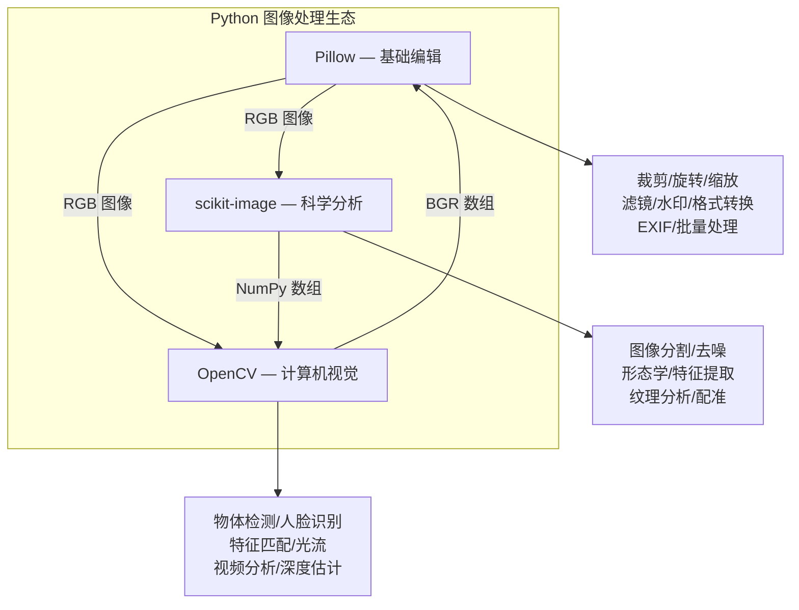
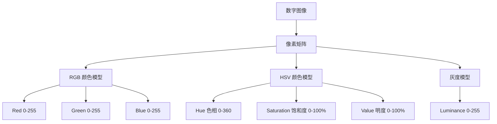
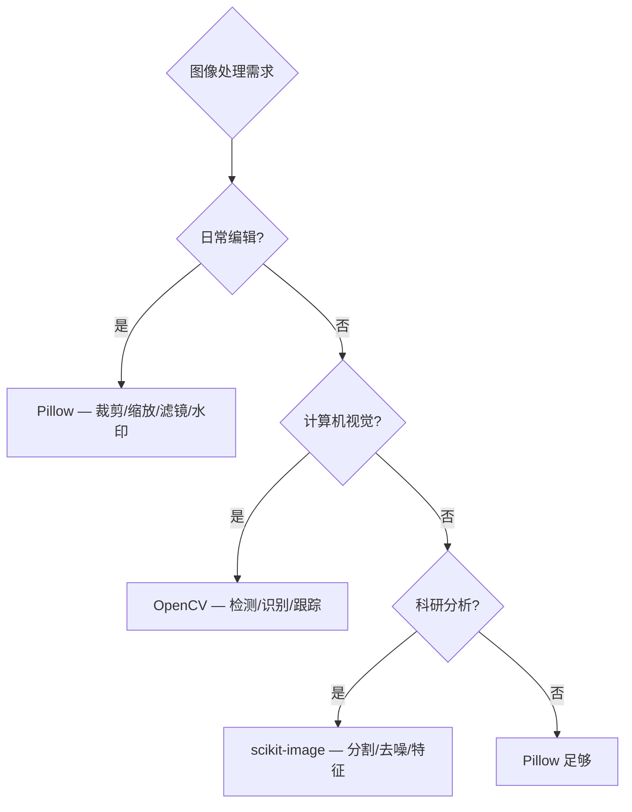

# Python 图像处理指南

## 三大图像处理库



| 库 | 定位 | 图像格式 | 优势 |
|---|------|---------|------|
| **Pillow** | 通用图像处理 | PIL Image 对象 | 简单直观，日常操作首选 |
| **OpenCV** | 计算机视觉 | NumPy BGR 数组 | 算法最全，速度最快 |
| **scikit-image** | 科学图像分析 | NumPy RGB 数组 | 科研级算法，API 统一 |

## 数字图像基础

### 像素与颜色模型



| 颜色模型 | 适用场景 | Python 表示 |
|---------|---------|------------|
| RGB | 屏幕显示、Web | `(R, G, B)` 各 0-255 |
| RGBA | 带透明度 | `(R, G, B, A)` A 为 0-255 |
| HSV/HSL | 颜色筛选、肤色检测 | `(H, S, V)` |
| CMYK | 印刷 | `(C, M, Y, K)` |
| 灰度 | 边缘检测、OCR 前处理 | 单通道 0-255 |
| YCbCr | 视频编码、肤色检测 | `(Y, Cb, Cr)` |

### 图像模式（Pillow）

| 模式 | 说明 | 通道 | 位深 |
|------|------|------|------|
| `1` | 二值图（黑白） | 1 | 1 bit |
| `L` | 灰度图 | 1 | 8 bit |
| `P` | 调色板图 | 1 | 8 bit |
| `RGB` | 真彩色 | 3 | 24 bit |
| `RGBA` | 带透明度 | 4 | 32 bit |
| `CMYK` | 印刷色 | 4 | 32 bit |
| `I` | 32位整数 | 1 | 32 bit |
| `F` | 32位浮点 | 1 | 32 bit |

## Pillow (PIL Fork)

```bash
pip install Pillow
```

### 基本操作

```python
from PIL import Image, ImageFilter, ImageDraw, ImageFont, ImageEnhance

# 打开与基本信息
img = Image.open('photo.jpg')
print(f'尺寸: {img.size}')        # (width, height)
print(f'模式: {img.mode}')        # RGB, RGBA, L(灰度), CMYK
print(f'格式: {img.format}')      # JPEG, PNG, GIF
print(f'信息: {img.info}')        # dpi、icc_profile 等

# 缩放（保持宽高比）
img.thumbnail((800, 800))  # 原地缩放，不超出指定尺寸
img_resized = img.resize((400, 300), Image.LANCZOS)

# 缩放算法对比
# Image.NEAREST   — 最近邻（最快，质量最低）
# Image.BILINEAR  — 双线性
# Image.BICUBIC   — 双三次（较好）
# Image.LANCZOS   — Lanczos（最慢，质量最高）

# 旋转与翻转
img_rotated = img.rotate(45, expand=True, fillcolor='white')  # expand 防止裁剪
img_flipped = img.transpose(Image.FLIP_LEFT_RIGHT)
img_vertical = img.transpose(Image.FLIP_TOP_BOTTOM)
img_90 = img.transpose(Image.ROTATE_90)
img_180 = img.transpose(Image.ROTATE_180)
img_270 = img.transpose(Image.ROTATE_270)

# 裁剪
cropped = img.crop((100, 100, 400, 400))  # (left, top, right, bottom)

# 粘贴与合成
img_copy = img.copy()
img_copy.paste(cropped, (0, 0))  # 左上角 (0,0) 处贴上裁剪区

# 带透明度粘贴（RGBA 图像）
overlay = Image.open('logo.png').convert('RGBA')
img_copy.paste(overlay, (50, 50), overlay)  # 第三个参数为 mask

# 保存与格式转换
img.save('output.png')
img.save('output.webp', quality=80)  # WebP 格式
img.save('output.jpg', quality=95, optimize=True)  # JPEG 优化
img.convert('L').save('gray.png')    # 转灰度
img.save('output.ico', sizes=[(16,16), (32,32), (48,48)])  # ICO 图标
```

### EXIF 信息处理

```python
from PIL import Image
from PIL.ExifTags import TAGS, GPSTAGS

def get_exif_data(image_path):
    """获取完整的 EXIF 信息"""
    img = Image.open(image_path)
    exif = img.getexif()  # 公开 API（旧私有方法 _getexif 已不推荐）
    if not exif:
        return {}

    result = {}
    for tag_id, value in exif.items():
        tag = TAGS.get(tag_id, tag_id)
        if tag == 'GPSInfo':
            # GPS 信息位于独立的 GPS IFD
            gps_ifd = exif.get_ifd(0x8825)
            result[tag] = {GPSTAGS.get(k, k): v for k, v in gps_ifd.items()}
        else:
            result[tag] = value
    return result

# 常用 EXIF 字段
exif = get_exif_data('photo.jpg')
print(f'相机: {exif.get("Make", "N/A")} {exif.get("Model", "N/A")}')
print(f'光圈: f/{exif.get("FNumber", "N/A")}')
print(f'快门: 1/{exif.get("ExposureTime", "N/A")}')
print(f'ISO: {exif.get("ISOSpeedRatings", "N/A")}')
print(f'焦距: {exif.get("FocalLength", "N/A")}mm')
print(f'拍摄时间: {exif.get("DateTimeOriginal", "N/A")}')

# 处理 EXIF 方向（自动旋转手机拍摄的照片）
def auto_rotate(image_path):
    """根据 EXIF 方向信息自动旋转图片"""
    img = Image.open(image_path)
    try:
        exif = img.getexif()
        if exif:
            orientation = exif.get(274)  # 274 = Orientation tag
            if orientation == 3:
                img = img.transpose(Image.ROTATE_180)
            elif orientation == 6:
                img = img.transpose(Image.ROTATE_270)
            elif orientation == 8:
                img = img.transpose(Image.ROTATE_90)
    except (AttributeError, KeyError):
        pass
    return img

# 删除 EXIF（隐私保护）
def strip_exif(image_path, output_path):
    """移除所有 EXIF 信息"""
    img = Image.open(image_path)
    data = list(img.getdata())
    img_no_exif = Image.new(img.mode, img.size)
    img_no_exif.putdata(data)
    img_no_exif.save(output_path, quality=95)
```

### 颜色通道操作

```python
import numpy as np

# 分离通道
r, g, b = img.split()
r.save('red_channel.png')
g.save('green_channel.png')
b.save('blue_channel.png')

# 合并通道（可替换通道）
img_modified = Image.merge('RGB', (r, g, b))

# NumPy 数组操作
arr = np.array(img)  # shape: (height, width, channels)

# 反转颜色（负片效果）
arr_inverted = 255 - arr
Image.fromarray(arr_inverted).save('negative.png')

# 颜色替换（将红色区域替换为蓝色）
hsv = np.array(img.convert('HSV'))
red_mask = (hsv[:,:,0] >= 0) & (hsv[:,:,0] <= 10) & (hsv[:,:,1] >= 100)
hsv[red_mask, 0] = 120  # 色相改为蓝色
Image.fromarray(hsv, 'HSV').convert('RGB').save('color_replaced.png')

# 直方图
histogram = img.histogram()
r_hist = histogram[0:256]
g_hist = histogram[256:512]
b_hist = histogram[512:768]

# 手绘效果（灰度 + 梯度 + 光照模拟）
gray = np.array(img.convert('L'))
depth = 10.0
grad_x, grad_y = np.gradient(gray.astype('float'))
grad = np.sqrt(grad_x**2 + grad_y**2)
uni_x = grad_x / (grad + 1e-7)
uni_y = grad_y / (grad + 1e-7)
vec_el = np.pi / 2.2
vec_az = np.pi / 4.0
dx = np.cos(vec_el) * np.cos(vec_az)
dy = np.cos(vec_el) * np.sin(vec_az)
dz = np.sin(vec_el)
result = 255 * (dx*uni_x + dy*uni_y + dz)
result = np.clip(result, 0, 255).astype('uint8')
Image.fromarray(result).save('hand_drawn.png')
```

### 滤镜与增强

```python
from PIL import ImageFilter, ImageEnhance

# 内置滤镜
img_blur = img.filter(ImageFilter.GaussianBlur(radius=5))
img_sharpen = img.filter(ImageFilter.SHARPEN)
img_edge = img.filter(ImageFilter.FIND_EDGES)
img_emboss = img.filter(ImageFilter.EMBOSS)
img_contour = img.filter(ImageFilter.CONTOUR)
img_smooth = img.filter(ImageFilter.SMOOTH_MORE)
img_detail = img.filter(ImageFilter.DETAIL)

# 自定义卷积核
from PIL import ImageFilter
kernel = ImageFilter.Kernel(
    size=(3, 3),
    kernel=[-1, -1, -1,    # 锐化核
            -1,  9, -1,
            -1, -1, -1],
    scale=1,
    offset=0
)
img_custom = img.filter(kernel)

# 增强器
enhancer = ImageEnhance.Brightness(img)
img_bright = enhancer.enhance(1.5)  # 1.0 原值

enhancer = ImageEnhance.Contrast(img)
img_contrast = enhancer.enhance(1.3)

enhancer = ImageEnhance.Color(img)
img_saturated = enhancer.enhance(1.8)

enhancer = ImageEnhance.Sharpness(img)
img_sharp = enhancer.enhance(2.0)
```

### 水印

```python
# 文字水印
def add_text_watermark(img_path, text, output_path, opacity=128, position='bottom_right'):
    img = Image.open(img_path).convert('RGBA')
    overlay = Image.new('RGBA', img.size, (0, 0, 0, 0))
    draw = ImageDraw.Draw(overlay)

    # 字体（根据系统选择）
    import platform
    system = platform.system()
    if system == 'Darwin':
        font_path = '/System/Library/Fonts/PingFang.ttc'
    elif system == 'Windows':
        font_path = 'C:/Windows/Fonts/msyh.ttc'
    else:
        font_path = '/usr/share/fonts/truetype/wqy/wqy-microhei.ttc'

    font = ImageFont.truetype(font_path, 36)
    text_bbox = draw.textbbox((0, 0), text, font=font)
    text_w, text_h = text_bbox[2] - text_bbox[0], text_bbox[3] - text_bbox[1]

    positions = {
        'bottom_right': (img.size[0] - text_w - 20, img.size[1] - text_h - 20),
        'bottom_left': (20, img.size[1] - text_h - 20),
        'top_right': (img.size[0] - text_w - 20, 20),
        'center': ((img.size[0] - text_w) // 2, (img.size[1] - text_h) // 2),
    }
    x, y = positions.get(position, positions['bottom_right'])
    draw.text((x, y), text, font=font, fill=(255, 255, 255, opacity))

    result = Image.alpha_composite(img, overlay)
    result.save(output_path)

# 平铺水印
def add_tiled_watermark(img_path, text, output_path, opacity=60):
    """平铺水印（全图覆盖）"""
    img = Image.open(img_path).convert('RGBA')
    overlay = Image.new('RGBA', img.size, (0, 0, 0, 0))

    font = ImageFont.truetype('/System/Library/Fonts/PingFang.ttc', 24)
    draw = ImageDraw.Draw(overlay)

    # 计算文字尺寸
    bbox = draw.textbbox((0, 0), text, font=font)
    text_w, text_h = bbox[2] - bbox[0], bbox[3] - bbox[1]

    # 旋转后的文字层
    text_layer = Image.new('RGBA', (text_w + 50, text_h + 50), (0, 0, 0, 0))
    text_draw = ImageDraw.Draw(text_layer)
    text_draw.text((25, 25), text, font=font, fill=(255, 255, 255, opacity))
    text_layer = text_layer.rotate(30, expand=True)

    # 平铺
    for y in range(-text_layer.height, img.height + text_layer.height, 100):
        for x in range(-text_layer.width, img.width + text_layer.width, 200):
            overlay.paste(text_layer, (x, y), text_layer)

    result = Image.alpha_composite(img, overlay)
    result.save(output_path)

# 图片水印
def add_image_watermark(img_path, logo_path, output_path, position='bottom_right', margin=20):
    img = Image.open(img_path).convert('RGBA')
    logo = Image.open(logo_path).convert('RGBA')
    logo.thumbnail((100, 100))

    positions = {
        'bottom_right': (img.size[0] - logo.size[0] - margin, img.size[1] - logo.size[1] - margin),
        'top_left': (margin, margin),
        'center': ((img.size[0] - logo.size[0]) // 2, (img.size[1] - logo.size[1]) // 2),
    }
    img.paste(logo, positions[position], logo)
    img.save(output_path)
```

### 九宫格切图

```python
def nine_grid_split(img_path, output_dir, rows=3, cols=3):
    """将图片切成 N×M 宫格"""
    img = Image.open(img_path)
    width, height = img.size
    item_w, item_h = width // cols, height // rows

    for i in range(rows):
        for j in range(cols):
            box = (j*item_w, i*item_h, (j+1)*item_w, (i+1)*item_h)
            piece = img.crop(box)
            piece.save(f'{output_dir}/piece_{i}_{j}.png')

    print('切图完成')
```

## OpenCV

```bash
pip install opencv-python
# 完整版（包含 contrib 模块）: pip install opencv-contrib-python
```

```python
import cv2
import numpy as np

# 读取（OpenCV 默认 BGR）
img_bgr = cv2.imread('photo.jpg')
img_rgb = cv2.cvtColor(img_bgr, cv2.COLOR_BGR2RGB)
img_gray = cv2.cvtColor(img_bgr, cv2.COLOR_BGR2GRAY)

# 读取为灰度（直接）
img_gray = cv2.imread('photo.jpg', cv2.IMREAD_GRAYSCALE)

# 读取带透明通道
img_bgra = cv2.imread('photo.png', cv2.IMREAD_UNCHANGED)

# 缩放
resized = cv2.resize(img_bgr, (400, 300), interpolation=cv2.INTER_LANCZOS4)
# 插值方法：
# INTER_NEAREST — 最近邻
# INTER_LINEAR  — 双线性（默认）
# INTER_CUBIC   — 双三次
# INTER_LANCZOS4 — Lanczos（最高质量）
# INTER_AREA    — 缩小时的区域插值（推荐缩小使用）

# 按比例缩放
scale_percent = 50
width = int(img_bgr.shape[1] * scale_percent / 100)
height = int(img_bgr.shape[0] * scale_percent / 100)
resized = cv2.resize(img_bgr, (width, height), interpolation=cv2.INTER_AREA)

# 旋转
h, w = img_bgr.shape[:2]
center = (w//2, h//2)
M = cv2.getRotationMatrix2D(center, 45, 1.0)  # 逆时针 45°
rotated = cv2.warpAffine(img_bgr, M, (w, h))

# 仿射变换
pts1 = np.float32([[50,50],[200,50],[50,200]])
pts2 = np.float32([[10,100],[200,50],[100,250]])
M = cv2.getAffineTransform(pts1, pts2)
dst = cv2.warpAffine(img_bgr, M, (w, h))

# 边缘检测
gray = cv2.cvtColor(img_bgr, cv2.COLOR_BGR2GRAY)
edges = cv2.Canny(gray, 100, 200)  # 双阈值
cv2.imwrite('edges.png', edges)

# 自适应阈值
thresh = cv2.adaptiveThreshold(gray, 255, cv2.ADAPTIVE_THRESH_GAUSSIAN_C,
                                cv2.THRESH_BINARY, 11, 2)
cv2.imwrite('thresh.png', thresh)
```

### 特征检测

```python
# SIFT 特征点检测（需 opencv-contrib-python）
sift = cv2.SIFT_create()
keypoints, descriptors = sift.detectAndCompute(gray, None)
img_kp = cv2.drawKeypoints(img_bgr, keypoints, None, flags=cv2.DRAW_MATCHES_FLAG_DRAW_RICH_KEYPOINTS)
cv2.imwrite('keypoints.png', img_kp)

# ORB 特征（免费，速度快）
orb = cv2.ORB_create(nfeatures=1000)
keypoints, descriptors = orb.detectAndCompute(gray, None)

# 特征匹配
img1 = cv2.imread('template.jpg', cv2.IMREAD_GRAYSCALE)
img2 = cv2.imread('scene.jpg', cv2.IMREAD_GRAYSCALE)

orb = cv2.ORB_create()
kp1, des1 = orb.detectAndCompute(img1, None)
kp2, des2 = orb.detectAndCompute(img2, None)

bf = cv2.BFMatcher(cv2.NORM_HAMMING, crossCheck=True)
matches = bf.match(des1, des2)
matches = sorted(matches, key=lambda x: x.distance)

result = cv2.drawMatches(img1, kp1, img2, kp2, matches[:20], None)
cv2.imwrite('matches.png', result)
```

### 轮廓检测与形状分析

```python
gray = cv2.cvtColor(img_bgr, cv2.COLOR_BGR2GRAY)
blurred = cv2.GaussianBlur(gray, (5, 5), 0)
edged = cv2.Canny(blurred, 50, 150)

contours, hierarchy = cv2.findContours(edged, cv2.RETR_EXTERNAL, cv2.CHAIN_APPROX_SIMPLE)

for i, contour in enumerate(contours):
    area = cv2.contourArea(contour)
    if area < 100:  # 过滤小轮廓
        continue

    # 边界矩形
    x, y, w, h = cv2.boundingRect(contour)
    cv2.rectangle(img_bgr, (x, y), (x+w, y+h), (0, 255, 0), 2)

    # 最小外接矩形（可旋转）
    rect = cv2.minAreaRect(contour)
    box = cv2.boxPoints(rect)
    box = box.astype(np.int32)  # np.int0 已在 NumPy 2.0 移除
    cv2.drawContours(img_bgr, [box], 0, (0, 0, 255), 2)

    # 形状近似
    perimeter = cv2.arcLength(contour, True)
    approx = cv2.approxPolyDP(contour, 0.04 * perimeter, True)
    sides = len(approx)
    if sides == 3:
        shape = '三角形'
    elif sides == 4:
        shape = '矩形'
    elif sides > 4:
        shape = '圆形'
    else:
        shape = '未知'

    print(f'轮廓 {i}: 面积={area:.0f}, 形状={shape}, 边数={sides}')

cv2.imwrite('contours.png', img_bgr)
```

### 库间数据转换

```python
# Pillow → OpenCV
import numpy as np
import cv2
from PIL import Image

pil_img = Image.open('photo.jpg')
cv_img = cv2.cvtColor(np.array(pil_img), cv2.COLOR_RGB2BGR)

# OpenCV → Pillow
cv_img_bgr = cv2.imread('photo.jpg')
cv_img_rgb = cv2.cvtColor(cv_img_bgr, cv2.COLOR_BGR2RGB)
pil_img = Image.fromarray(cv_img_rgb)

# Pillow → scikit-image
sk_img = np.array(pil_img)

# OpenCV → scikit-image
sk_img = cv2.cvtColor(cv_img_bgr, cv2.COLOR_BGR2RGB)
```

## scikit-image

```bash
pip install scikit-image
```

```python
from skimage import io, filters, color, morphology, feature, measure, transform
import numpy as np

img = io.imread('photo.jpg')

# 去噪
denoised = filters.median(img, channel_axis=-1)  # 彩色图需指定通道轴
denoised_gaussian = filters.gaussian(img, sigma=1)

# 图像分割
gray = color.rgb2gray(img)
thresh = filters.threshold_otsu(gray)
binary = gray > thresh

# 自适应阈值
thresh_local = filters.threshold_local(gray, block_size=51, method='gaussian')
binary_local = gray > thresh_local

# 边缘检测
edges_sobel = filters.sobel(gray)
edges_canny = feature.canny(gray, sigma=1)

# 形态学
eroded = morphology.binary_erosion(binary)
dilated = morphology.binary_dilation(binary)
opened = morphology.binary_opening(binary)   # 先腐蚀后膨胀
closed = morphology.binary_closing(binary)   # 先膨胀后腐蚀

# 连通区域标记
label_img = measure.label(binary)
regions = measure.regionprops(label_img)
for region in regions:
    print(f'区域: 面积={region.area}, 周长={region.perimeter:.1f}')

# 图像配准（img1/img2 为两幅待配准的图像）
from skimage.registration import phase_cross_correlation
shift, error, diffphase = phase_cross_correlation(img1, img2)

# 霍夫变换（直线检测）
from skimage.transform import hough_line, hough_line_peaks
tested_angles = np.linspace(-np.pi/2, np.pi/2, 180)
h, theta, d = hough_line(binary, theta=tested_angles)
```

## 批量处理流水线

```python
from PIL import Image, ImageFilter, ImageEnhance
from pathlib import Path
from concurrent.futures import ThreadPoolExecutor, as_completed
from dataclasses import dataclass
from typing import Callable, Optional
import time


@dataclass
class ImageTask:
    """图像处理任务"""
    input_path: Path
    output_path: Path
    operations: list  # 操作列表


class ImagePipeline:
    """图像批量处理流水线"""

    def __init__(self, output_dir='processed', max_workers=4):
        self.output_dir = Path(output_dir)
        self.output_dir.mkdir(parents=True, exist_ok=True)
        self.max_workers = max_workers
        self.operations = []  # 注册的操作

    def add_operation(self, name: str, func: Callable):
        """注册处理操作"""
        self.operations.append({'name': name, 'func': func})

    def process_single(self, img_path: Path):
        """处理单张图片"""
        try:
            img = Image.open(img_path)

            # 依次执行所有操作
            for op in self.operations:
                img = op['func'](img)

            # 自动检测格式
            output_path = self.output_dir / img_path.name
            if img.mode == 'RGBA' and img_path.suffix.lower() in ('.jpg', '.jpeg'):
                img = img.convert('RGB')
                output_path = self.output_dir / f'{img_path.stem}.png'

            img.save(output_path, quality=95)
            return True, img_path.name
        except Exception as e:
            return False, f'{img_path.name}: {e}'

    def batch_process(self, input_dir, pattern='*.*', recursive=False):
        """批量处理"""
        input_dir = Path(input_dir)
        image_extensions = {'.jpg', '.jpeg', '.png', '.bmp', '.webp', '.tiff'}

        if recursive:
            files = [f for f in input_dir.rglob(pattern) if f.suffix.lower() in image_extensions]
        else:
            files = [f for f in input_dir.glob(pattern) if f.suffix.lower() in image_extensions]

        print(f'找到 {len(files)} 张图片，开始处理...')

        success, failed = 0, 0
        start = time.time()

        with ThreadPoolExecutor(max_workers=self.max_workers) as executor:
            futures = {executor.submit(self.process_single, f): f for f in files}
            for future in as_completed(futures):
                ok, msg = future.result()
                if ok:
                    success += 1
                else:
                    failed += 1
                    print(f'失败: {msg}')

        elapsed = time.time() - start
        print(f'处理完成: 成功 {success}, 失败 {failed}, 耗时 {elapsed:.1f}s')


# 内存版文字水印（供流水线调用）
def add_text_watermark_to_img(img, text, opacity=128):
    img = img.convert('RGBA')
    overlay = Image.new('RGBA', img.size, (0, 0, 0, 0))
    draw = ImageDraw.Draw(overlay)
    font = ImageFont.truetype('/System/Library/Fonts/PingFang.ttc', 36)
    bbox = draw.textbbox((0, 0), text, font=font)
    w, h = bbox[2] - bbox[0], bbox[3] - bbox[1]
    draw.text((img.size[0] - w - 20, img.size[1] - h - 20), text,
              font=font, fill=(255, 255, 255, opacity))
    return Image.alpha_composite(img, overlay)


# 使用
pipeline = ImagePipeline(output_dir='processed_images', max_workers=8)

# 注册操作
pipeline.add_operation('缩放', lambda img: img.thumbnail((1920, 1080)) or img)
pipeline.add_operation('自动旋转', auto_rotate)
pipeline.add_operation('锐化', lambda img: img.filter(ImageFilter.SHARPEN))
pipeline.add_operation('增强对比度', lambda img: ImageEnhance.Contrast(img).enhance(1.2))
pipeline.add_operation('添加水印', lambda img: add_text_watermark_to_img(img, '© 2026'))

pipeline.batch_process('./photos', recursive=True)
```

## 库选择决策



## 实战案例：证件照处理工具

```python
"""
证件照处理工具
功能：自动裁剪、换底色、调整尺寸、批量处理
"""
from PIL import Image, ImageDraw, ImageFilter
import numpy as np
from pathlib import Path


class IDPhotoProcessor:
    """证件照处理器"""

    # 标准证件照尺寸（毫米）
    SIZES = {
        '一寸': (25, 35),      # 295×413 px (300dpi)
        '二寸': (35, 49),      # 413×579 px (300dpi)
        '小一寸': (22, 32),    # 260×378 px
        '小二寸': (35, 45),    # 413×531 px
        '护照': (33, 48),      # 390×567 px
        '签证': (51, 51),      # 600×600 px (美国签证)
    }

    # 标准背景色 (RGB)
    BG_COLORS = {
        '白色': (255, 255, 255),
        '蓝色': (67, 142, 219),
        '红色': (220, 55, 55),
        '渐变蓝': (101, 157, 207),
    }

    def __init__(self):
        pass

    def auto_crop(self, img, target_ratio=None):
        """自动裁剪（检测人脸区域居中裁剪）"""
        arr = np.array(img)

        # 简单肤色检测定位人脸大致区域
        if arr.shape[2] == 4:
            arr = arr[:, :, :3]

        # YCbCr 肤色模型
        r, g, b = arr[:,:,0].astype(float), arr[:,:,1].astype(float), arr[:,:,2].astype(float)
        y = 0.299 * r + 0.587 * g + 0.114 * b
        cb = 128 - 0.168736 * r - 0.331264 * g + 0.5 * b
        cr = 128 + 0.5 * r - 0.418688 * g - 0.081312 * b

        skin_mask = (cb >= 77) & (cb <= 127) & (cr >= 133) & (cr <= 173)

        # 找到肤色区域的边界框
        rows = np.any(skin_mask, axis=1)
        cols = np.any(skin_mask, axis=0)

        if not rows.any():
            # 未检测到肤色，返回原图
            return img

        rmin, rmax = np.where(rows)[0][[0, -1]]
        cmin, cmax = np.where(cols)[0][[0, -1]]

        # 扩展边界（留出头部和身体空间）
        h, w = arr.shape[:2]
        padding_x = int((cmax - cmin) * 0.3)
        padding_top = int((rmax - rmin) * 0.5)  # 头部上方更多空间
        padding_bottom = int((rmax - rmin) * 0.8)  # 身体下方更多空间

        left = max(0, cmin - padding_x)
        right = min(w, cmax + padding_x)
        top = max(0, rmin - padding_top)
        bottom = min(h, rmax + padding_bottom)

        return img.crop((left, top, right, bottom))

    def change_background(self, img, bg_color='蓝色', tolerance=30):
        """更换背景色"""
        img = img.convert('RGBA')
        arr = np.array(img)

        # 生成背景蒙版（基于边缘颜色）
        # 取四条边的颜色作为背景参考色
        top_colors = arr[:5, :, :3].reshape(-1, 3)
        bottom_colors = arr[-5:, :, :3].reshape(-1, 3)
        left_colors = arr[:, :5, :3].reshape(-1, 3)
        right_colors = arr[:, -5:, :3].reshape(-1, 3)

        edge_colors = np.vstack([top_colors, bottom_colors, left_colors, right_colors])
        bg_color_mean = edge_colors.mean(axis=0).astype(int)

        # 创建背景蒙版
        diff = np.abs(arr[:, :, :3].astype(float) - bg_color_mean.astype(float))
        dist = np.sqrt(np.sum(diff**2, axis=2))
        mask = dist < tolerance

        # 形态学处理，去除噪点
        from PIL import Image as PILImage
        mask_img = PILImage.fromarray((mask * 255).astype('uint8'))
        mask_img = mask_img.filter(ImageFilter.MaxFilter(5))
        mask_img = mask_img.filter(ImageFilter.MinFilter(5))
        mask = np.array(mask_img) > 128

        # 替换背景
        result = arr.copy()
        bg_rgb = self.BG_COLORS.get(bg_color, (67, 142, 219))
        result[mask, 0] = bg_rgb[0]
        result[mask, 1] = bg_rgb[1]
        result[mask, 2] = bg_rgb[2]
        result[mask, 3] = 255

        return PILImage.fromarray(result)

    def resize_to_standard(self, img, size_name='一寸', dpi=300):
        """调整为标准证件照尺寸"""
        if size_name not in self.SIZES:
            raise ValueError(f'不支持的尺寸: {size_name}，可选: {list(self.SIZES.keys())}')

        width_mm, height_mm = self.SIZES[size_name]
        # 毫米转像素（1 英寸 = 25.4 毫米）
        width_px = int(width_mm / 25.4 * dpi)
        height_px = int(height_mm / 25.4 * dpi)

        return img.resize((width_px, height_px), Image.LANCZOS)

    def process(self, input_path, output_path, size='一寸', bg_color='蓝色'):
        """完整处理流程"""
        img = Image.open(input_path)

        # 1. 自动裁剪
        img = self.auto_crop(img)

        # 2. 调整为标准尺寸
        img = self.resize_to_standard(img, size)

        # 3. 换底色
        img = self.change_background(img, bg_color)

        # 4. 保存
        img.save(output_path, dpi=(300, 300))
        return img

    def generate_print_layout(self, photos, paper_size=(6, 4), photo_size='一寸'):
        """生成排版打印版（6寸相纸排列多张证件照）"""
        paper_w_px, paper_h_px = int(paper_size[0] / 25.4 * 300), int(paper_size[1] / 25.4 * 300)

        # 获取照片尺寸
        width_mm, height_mm = self.SIZES[photo_size]
        photo_w_px = int(width_mm / 25.4 * 300)
        photo_h_px = int(height_mm / 25.4 * 300)

        # 计算排列
        cols = paper_w_px // (photo_w_px + 10)
        rows = paper_h_px // (photo_h_px + 10)

        # 创建排版画布
        layout = Image.new('RGB', (paper_w_px, paper_h_px), (255, 255, 255))

        for row in range(rows):
            for col in range(cols):
                x = col * (photo_w_px + 10) + 5
                y = row * (photo_h_px + 10) + 5
                layout.paste(photos[0].resize((photo_w_px, photo_h_px)), (x, y))

        return layout


# 使用
processor = IDPhotoProcessor()

# 处理单张
processor.process('photo.jpg', 'id_photo_blue.jpg', size='一寸', bg_color='蓝色')
processor.process('photo.jpg', 'id_photo_white.jpg', size='二寸', bg_color='白色')

# 生成排版打印版
photo = Image.open('id_photo_blue.jpg')
layout = processor.generate_print_layout([photo], photo_size='一寸')
layout.save('print_layout.jpg', dpi=(300, 300))
```

## 常见陷阱

| 陷阱 | 说明 | 正确做法 |
|------|------|---------|
| OpenCV BGR 通道顺序 | `cv2.imread` 返回 BGR，不是 RGB | `cv2.cvtColor(img, cv2.COLOR_BGR2RGB)` |
| 图像模式不匹配 | RGBA 图像无法直接 save 为 JPEG | `img.convert('RGB')` |
| 缩略图覆盖原图 | `thumbnail()` 原地修改 | 先 `copy()` |
| GPU 内存泄漏 | OpenCV CUDA 操作不释放 | 显式 `del` + `gc.collect()` |
| 大图处理内存溢出 | 直接加载整张图 | 分块处理或先缩小 |
| EXIF 方向未处理 | 手机照片方向错误 | 读取 EXIF Orientation 并旋转 |
| 批量处理串行慢 | 逐张处理效率低 | 使用 `ThreadPoolExecutor` 并行 |
| JPEG 保存质量损失 | 默认 quality=75 | 设置 `quality=95` 或使用 PNG |

## 延伸阅读

- [Pillow 官方文档](https://pillow.readthedocs.io/)
- [OpenCV Python 教程](https://docs.opencv.org/master/d6/d00/tutorial_py_root.html)
- [scikit-image 示例库](https://scikit-image.org/docs/stable/auto_examples/)
- [OpenCV 特征检测](https://docs.opencv.org/master/db/d27/tutorial_py_table_of_contents_feature2d.html)
- [EXIF 规范](https://www.exif.org/Exif2-2.PDF)

## 版本差异（自动化办公库 → 当前稳定版）

| 库 | 本文编写时 | 当前稳定版（截至 2026-09） |
|----|-----------|-----------|
| `openpyxl`（Excel） | 旧版 | 3.1.x |
| `python-docx`（Word） | 旧版 | 1.2.x |
| `python-pptx`（PPT） | 旧版 | 1.0.x |
| `reportlab`（PDF） | 旧版 | 5.x |
| `PyPDF2`/`pypdf` | PyPDF2 | 推荐 `pypdf`（6.x，PyPDF2 已停止维护） |
| `Pillow`（图像） | 旧版 | 12.x |

> 本文讲解的自动化办公流程（读写 Excel/Word/PDF/PPT）与核心 API 在最新版本中成立；注意 PyPDF2 已迁移至 pypdf。
