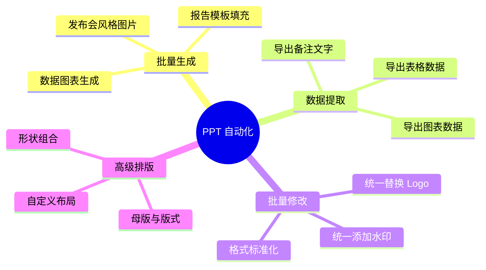
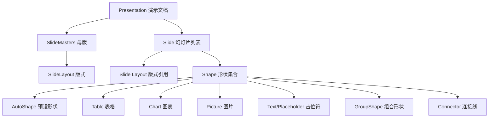

# Python 操作 PPT 文件指南

## 概述

PPT 的应用重点在于表演和传达。Python 适合以下 PPT 自动化场景：



| 库 | 能力 | 平台限制 |
|---|------|---------|
| **python-pptx** | 创建、读取、修改 `.pptx` | ✅ 跨平台 |
| pywin32 | 控制 PowerPoint 应用程序、导出图片 | ❌ 仅 Windows |
| LibreOffice CLI | 转换 PPT 为 PDF/图片 | ✅ 跨平台（需安装 LibreOffice）|

## python-pptx 基础

```bash
pip install python-pptx
```

```python
from pptx import Presentation
from pptx.util import Inches, Pt, Cm, Emu
from pptx.enum.text import PP_ALIGN, MSO_ANCHOR
from pptx.dml.color import RGBColor
```

### 概念模型



### 单位系统

python-pptx 使用 EMU（English Metric Units）作为内部单位，1 英寸 = 914400 EMU：

| 单位 | 换算 | 示例 |
|------|------|------|
| `Inches(1)` | 1 英寸 = 914400 EMU | `Inches(2.5)` |
| `Cm(1)` | 1 厘米 = 360000 EMU | `Cm(10)` |
| `Pt(12)` | 1 磅 = 12700 EMU | `Pt(24)` |
| `Emu(n)` | 原始 EMU | `Emu(914400)` |

### 基本操作

```python
from pptx import Presentation
from pptx.util import Inches, Pt, Cm

# 创建演示文稿
prs = Presentation()

# 设置幻灯片尺寸（默认 16:9）
prs.slide_width = Cm(33.867)   # 16:9 宽度
prs.slide_height = Cm(19.05)   # 16:9 高度

# 4:3 标准尺寸
# prs.slide_width = Cm(25.4)
# prs.slide_height = Cm(19.05)

# 幻灯片布局（0=标题页, 1=标题和内容, 6=空白页 等）
slide_layouts = prs.slide_layouts
for i, layout in enumerate(slide_layouts):
    print(f'{i}: {layout.name}')

title_slide_layout = prs.slide_layouts[0]
slide = prs.slides.add_slide(title_slide_layout)

# 占位符
title = slide.shapes.title
subtitle = slide.placeholders[1]
title.text = '2024 年度总结'
subtitle.text = '技术部'

# 按占位符名称访问
for ph in slide.placeholders:
    print(f'  idx={ph.placeholder_format.idx}, type={ph.placeholder_format.type}, name={ph.name}')
```

### 文本与段落

```python
from pptx.util import Pt, Inches
from pptx.enum.text import PP_ALIGN, MSO_ANCHOR

# 添加文本框
left, top, width, height = Inches(1), Inches(2), Inches(8), Inches(3)
textbox = slide.shapes.add_textbox(left, top, width, height)
tf = textbox.text_frame

# 文本框属性
tf.word_wrap = True           # 自动换行
tf.auto_size = None           # MSO_AUTO_SIZE.TEXT_TO_FIT_SHAPE 自动缩放

# 第一段
p = tf.paragraphs[0]
p.text = '核心成果'
p.font.size = Pt(28)
p.font.bold = True
p.alignment = PP_ALIGN.CENTER
p.space_after = Pt(12)        # 段后间距
p.space_before = Pt(6)        # 段前间距

# 添加多段
items = [
    '完成 3 个核心模块重构',
    '系统性能提升 40%',
    '代码覆盖率从 65% 提升到 85%',
]
for item in items:
    p = tf.add_paragraph()
    p.text = f'• {item}'
    p.font.size = Pt(18)
    p.level = 0  # 缩进级别
    p.space_after = Pt(10)

# Run 级别格式（同一段内不同格式）
p = tf.add_paragraph()
run1 = p.add_run('项目状态：')
run1.font.bold = True
run1.font.size = Pt(16)
run2 = p.add_run('按计划推进')
run2.font.size = Pt(16)
run2.font.color.rgb = RGBColor(0x00, 0x70, 0x30)

# 垂直对齐
tf.paragraphs[0].alignment = PP_ALIGN.LEFT
textbox.text_frame.paragraphs[0].space_before = Pt(0)
```

### 母版与版式操作

```python
# 读取模板中的母版和版式
prs = Presentation('template.pptx')

# 列出所有版式
for master in prs.slide_masters:
    print(f'母版: {master.slide_layouts}')
    for i, layout in enumerate(master.slide_layouts):
        print(f'  版式 {i}: {layout.name}')

# 使用特定版式创建幻灯片
blank_layout = prs.slide_layouts[6]  # 空白版式
slide = prs.slides.add_slide(blank_layout)

# 修改母版占位符（影响所有使用该版式的幻灯片）
# 注意：python-pptx 对母版的修改支持有限

# 自定义版式方案：预先在 PowerPoint 中设计好版式模板
# 然后用 python-pptx 读取模板并填充内容
```

## 图片与形状

```python
# 插入图片
img_path = 'chart.png'
slide.shapes.add_picture(img_path, Inches(1), Inches(1), Inches(6), Inches(4))

# 插入网络图片
import io
import requests

def add_web_image(slide, url, left, top, width=None, height=None):
    """从 URL 插入图片"""
    response = requests.get(url)
    image_stream = io.BytesIO(response.content)
    if width and height:
        slide.shapes.add_picture(image_stream, left, top, width, height)
    elif width:
        slide.shapes.add_picture(image_stream, left, top, width=width)
    else:
        slide.shapes.add_picture(image_stream, left, top)

# 预设形状（AutoShape）
from pptx.enum.shapes import MSO_SHAPE

shapes_to_add = [
    MSO_SHAPE.RECTANGLE,
    MSO_SHAPE.ROUNDED_RECTANGLE,
    MSO_SHAPE.OVAL,
    MSO_SHAPE.CHEVRON,
    MSO_SHAPE.PENTAGON,
    MSO_SHAPE.DIAMOND,
    MSO_SHAPE.STAR_5_POINT,
    MSO_SHAPE.ARROW_RIGHT,
]

for i, shape_type in enumerate(shapes_to_add):
    shape = slide.shapes.add_shape(
        shape_type,
        Inches(1 + i*1.2), Inches(4),
        Inches(1), Inches(1)
    )
    shape.fill.solid()
    shape.fill.fore_color.rgb = RGBColor(0x44, 0x72, 0xC4)

    # 形状内文字
    if shape.has_text_frame:
        tf = shape.text_frame
        tf.word_wrap = True
        p = tf.paragraphs[0]
        p.text = f'Shape {i+1}'
        p.font.size = Pt(10)
        p.font.color.rgb = RGBColor(0xFF, 0xFF, 0xFF)
        p.alignment = PP_ALIGN.CENTER

# 连接线
from pptx.enum.shapes import MSO_CONNECTOR
connector = slide.shapes.add_connector(
    MSO_CONNECTOR.STRAIGHT,
    Inches(1), Inches(2),
    Inches(5), Inches(2)
)
connector.line.color.rgb = RGBColor(0x44, 0x72, 0xC4)
connector.line.width = Pt(2)
```

### 形状填充与线条

```python
from pptx.enum.line import MSO_LINE

# 纯色填充
shape.fill.solid()
shape.fill.fore_color.rgb = RGBColor(0x44, 0x72, 0xC4)

# 渐变填充
shape.fill.gradient()
shape.fill.gradient_stops[0].color.rgb = RGBColor(0x44, 0x72, 0xC4)
shape.fill.gradient_stops[0].position = 0.0
shape.fill.gradient_stops[1].color.rgb = RGBColor(0xED, 0x7D, 0x31)
shape.fill.gradient_stops[1].position = 1.0

# 无填充（透明）
shape.fill.background()

# 线条样式
shape.line.color.rgb = RGBColor(0x33, 0x33, 0x33)
shape.line.width = Pt(2)
shape.line.dash_style = MSO_LINE.DASH  # 虚线

# 阴影
from pptx.oxml.ns import qn
from lxml import etree

shadow = etree.SubElement(shape._element, qn('a:effectLst'))
outer_shdw = etree.SubElement(shadow, qn('a:outerShdw'))
outer_shdw.set('blurRad', '76200')
outer_shdw.set('dist', '38100')
outer_shdw.set('dir', '5400000')
outer_shdw.set('algn', 'bl')
srgb = etree.SubElement(outer_shdw, qn('a:srgbClr'))
srgb.set('val', '000000')
alpha = etree.SubElement(srgb, qn('a:alpha'))
alpha.set('val', '40000')
```

## 图表

```python
from pptx.chart.data import CategoryChartData
from pptx.enum.chart import XL_CHART_TYPE, XL_LEGEND_POSITION
from pptx.util import Inches, Pt

# 柱状图
chart_data = CategoryChartData()
chart_data.categories = ['Q1', 'Q2', 'Q3', 'Q4']
chart_data.add_series('收入', (100, 120, 150, 180))
chart_data.add_series('支出', (80, 90, 100, 110))

chart_frame = slide.shapes.add_chart(
    XL_CHART_TYPE.COLUMN_CLUSTERED,
    Inches(1), Inches(2), Inches(8), Inches(5),
    chart_data
)
chart = chart_frame.chart

chart.has_legend = True
chart.legend.position = XL_LEGEND_POSITION.BOTTOM
chart.legend.include_in_layout = False
chart.has_title = True
chart.chart_title.text_frame.paragraphs[0].text = '季度收支对比'
chart.chart_title.text_frame.paragraphs[0].font.size = Pt(16)

# 修改系列颜色
from pptx.oxml.ns import qn
series_0 = chart.series[0]
series_0.format.fill.solid()
series_0.format.fill.fore_color.rgb = RGBColor(0x44, 0x72, 0xC4)
series_1 = chart.series[1]
series_1.format.fill.solid()
series_1.format.fill.fore_color.rgb = RGBColor(0xED, 0x7D, 0x31)

# 数据标签
plot = chart.plots[0]
plot.has_data_labels = True
data_labels = plot.data_labels
data_labels.font.size = Pt(9)
data_labels.number_format = '#,##0'

# 饼图
pie_data = CategoryChartData()
pie_data.categories = ['研发', '市场', '运营', '管理']
pie_data.add_series('预算占比', (40, 25, 20, 15))

pie_chart = slide.shapes.add_chart(
    XL_CHART_TYPE.PIE,
    Inches(3), Inches(2), Inches(5), Inches(5),
    pie_data
).chart

pie_chart.has_legend = True
pie_chart.legend.position = XL_LEGEND_POSITION.RIGHT

# 饼图数据标签
plot = pie_chart.plots[0]
plot.has_data_labels = True
data_labels = plot.data_labels
data_labels.show_percentage = True
data_labels.show_category_name = True
data_labels.font.size = Pt(10)

# 折线图
line_data = CategoryChartData()
line_data.categories = ['1月', '2月', '3月', '4月', '5月', '6月']
line_data.add_series('销售额', (45, 52, 49, 63, 58, 72))
line_data.add_series('目标', (50, 50, 55, 55, 60, 65))

line_chart = slide.shapes.add_chart(
    XL_CHART_TYPE.LINE_MARKERS,
    Inches(1), Inches(2), Inches(8), Inches(5),
    line_data
).chart

# 组合图（柱状+折线）
chart_data = CategoryChartData()
chart_data.categories = ['Q1', 'Q2', 'Q3', 'Q4']
chart_data.add_series('销售额', (100, 120, 150, 180))
chart_data.add_series('增长率', (0.1, 0.2, 0.25, 0.2))

combo_frame = slide.shapes.add_chart(
    XL_CHART_TYPE.COLUMN_CLUSTERED,
    Inches(1), Inches(2), Inches(8), Inches(5),
    chart_data
)
combo_chart = combo_frame.chart

# 将第二系列改为折线并使用次坐标轴
series_1 = combo_chart.series[1]
series_1.format.line.color.rgb = RGBColor(0xED, 0x7D, 0x31)
# 次坐标轴需要 XML 操作
```

## 表格

```python
from pptx.util import Inches, Pt, Cm
from pptx.enum.text import PP_ALIGN

rows, cols = 4, 3
table_shape = slide.shapes.add_table(rows, cols, Inches(1), Inches(2), Inches(8), Inches(3))
table = table_shape.table

# 设置列宽
table.columns[0].width = Cm(4)
table.columns[1].width = Cm(5)
table.columns[2].width = Cm(4)

# 表头
headers = ['月份', '销售额', '增长率']
for i, h in enumerate(headers):
    cell = table.cell(0, i)
    cell.text = h
    cell.fill.solid()
    cell.fill.fore_color.rgb = RGBColor(0x44, 0x72, 0xC4)
    for p in cell.text_frame.paragraphs:
        p.font.color.rgb = RGBColor(0xFF, 0xFF, 0xFF)
        p.font.bold = True
        p.font.size = Pt(12)
        p.alignment = PP_ALIGN.CENTER

# 数据
data = [
    ['1月', '50万', '—'],
    ['2月', '65万', '+30%'],
    ['3月', '80万', '+23%'],
]
for i, row in enumerate(data):
    for j, val in enumerate(row):
        cell = table.cell(i+1, j)
        cell.text = val
        for p in cell.text_frame.paragraphs:
            p.font.size = Pt(11)
            p.alignment = PP_ALIGN.CENTER

        # 交替行颜色
        if i % 2 == 1:
            cell.fill.solid()
            cell.fill.fore_color.rgb = RGBColor(0xF2, 0xF2, 0xF2)

# 合并单元格
table.cell(0, 0).merge(table.cell(0, 1))

# 设置单元格边框
def set_cell_border(cell, border_color='CCCCCC', border_width='0.5'):
    """设置单元格边框"""
    from pptx.oxml.ns import qn
    from lxml import etree

    tc = cell._tc
    tcPr = tc.get_or_add_tcPr()

    for edge in ('lnL', 'lnR', 'lnT', 'lnB'):
        ln = etree.SubElement(tcPr, qn(f'a:{edge}'))
        ln.set('w', str(int(float(border_width) * 12700)))
        solid_fill = etree.SubElement(ln, qn('a:solidFill'))
        srgb = etree.SubElement(solid_fill, qn('a:srgbClr'))
        srgb.set('val', border_color)
```

## 数据提取（从现有 PPT 读取）

```python
prs = Presentation('existing.pptx')

# 提取文本
for i, slide in enumerate(prs.slides):
    print(f'\n=== 第 {i+1} 页 ===')
    for shape in slide.shapes:
        if shape.has_text_frame:
            print(shape.text)

# 提取表格数据
for slide in prs.slides:
    for shape in slide.shapes:
        if shape.has_table:
            table = shape.table
            for row in table.rows:
                row_data = [cell.text for cell in row.cells]
                print(' | '.join(row_data))

# 提取备注
for slide in prs.slides:
    if slide.has_notes_slide:
        notes = slide.notes_slide.notes_text_frame.text
        print(notes)

# 提取所有图片
def extract_images(prs, output_dir):
    """提取 PPT 中的所有图片"""
    from pathlib import Path
    output_dir = Path(output_dir)
    output_dir.mkdir(parents=True, exist_ok=True)

    for i, slide in enumerate(prs.slides):
        for j, shape in enumerate(slide.shapes):
            if shape.shape_type == 13:  # MSO_SHAPE_TYPE.PICTURE
                image = shape.image
                ext = image.content_type.split('/')[-1]
                if ext == 'jpeg':
                    ext = 'jpg'
                output_path = output_dir / f'slide{i+1}_img{j+1}.{ext}'
                with open(output_path, 'wb') as f:
                    f.write(image.blob)
                print(f'提取: {output_path}')

# 批量替换文本
def replace_text_in_pptx(prs, replacements):
    """批量替换 PPT 中的文本"""
    for slide in prs.slides:
        for shape in slide.shapes:
            if shape.has_text_frame:
                for para in shape.text_frame.paragraphs:
                    for run in para.runs:
                        for old_text, new_text in replacements.items():
                            if old_text in run.text:
                                run.text = run.text.replace(old_text, new_text)
    return prs
```

## 实战案例：数据可视化报告生成器

```python
"""
数据可视化报告生成器
功能：根据数据自动生成专业 PPT 报告
支持：封面、目录、数据页、图表页、总结页
"""
from pptx import Presentation
from pptx.util import Inches, Pt, Cm, Emu
from pptx.enum.text import PP_ALIGN, MSO_ANCHOR
from pptx.dml.color import RGBColor
from pptx.chart.data import CategoryChartData
from pptx.enum.chart import XL_CHART_TYPE, XL_LEGEND_POSITION
from pathlib import Path
from datetime import datetime


class ReportGenerator:
    """数据可视化报告生成器"""

    # 配色方案
    COLORS = {
        'primary': RGBColor(0x1A, 0x1A, 0x2E),
        'secondary': RGBColor(0x44, 0x72, 0xC4),
        'accent': RGBColor(0xED, 0x7D, 0x31),
        'success': RGBColor(0x70, 0xAD, 0x47),
        'danger': RGBColor(0xFF, 0x00, 0x00),
        'white': RGBColor(0xFF, 0xFF, 0xFF),
        'gray': RGBColor(0x99, 0x99, 0x99),
        'light_gray': RGBColor(0xF2, 0xF2, 0xF2),
    }

    def __init__(self, template_path=None):
        if template_path and Path(template_path).exists():
            self.prs = Presentation(template_path)
        else:
            self.prs = Presentation()
            # 16:9
            self.prs.slide_width = Cm(33.867)
            self.prs.slide_height = Cm(19.05)

    def add_cover_slide(self, title, subtitle, date=None):
        """添加封面页"""
        slide = self.prs.slides.add_slide(self.prs.slide_layouts[6])  # 空白页

        # 背景色
        background = slide.background
        fill = background.fill
        fill.solid()
        fill.fore_color.rgb = self.COLORS['primary']

        # 标题
        title_box = slide.shapes.add_textbox(Cm(3), Cm(6), Cm(28), Cm(4))
        tf = title_box.text_frame
        p = tf.paragraphs[0]
        p.text = title
        p.font.size = Pt(40)
        p.font.bold = True
        p.font.color.rgb = self.COLORS['white']
        p.alignment = PP_ALIGN.CENTER

        # 副标题
        sub_box = slide.shapes.add_textbox(Cm(3), Cm(10), Cm(28), Cm(2))
        tf = sub_box.text_frame
        p = tf.paragraphs[0]
        p.text = subtitle
        p.font.size = Pt(20)
        p.font.color.rgb = self.COLORS['gray']
        p.alignment = PP_ALIGN.CENTER

        # 日期
        if date:
            date_box = slide.shapes.add_textbox(Cm(3), Cm(14), Cm(28), Cm(1.5))
            tf = date_box.text_frame
            p = tf.paragraphs[0]
            p.text = date
            p.font.size = Pt(14)
            p.font.color.rgb = self.COLORS['gray']
            p.alignment = PP_ALIGN.CENTER

        return slide

    def add_section_slide(self, section_title):
        """添加章节分隔页"""
        slide = self.prs.slides.add_slide(self.prs.slide_layouts[6])

        background = slide.background
        fill = background.fill
        fill.solid()
        fill.fore_color.rgb = self.COLORS['secondary']

        title_box = slide.shapes.add_textbox(Cm(3), Cm(7), Cm(28), Cm(5))
        tf = title_box.text_frame
        p = tf.paragraphs[0]
        p.text = section_title
        p.font.size = Pt(36)
        p.font.bold = True
        p.font.color.rgb = self.COLORS['white']
        p.alignment = PP_ALIGN.CENTER

        return slide

    def add_kpi_slide(self, title, kpis):
        """添加 KPI 数据页"""
        slide = self.prs.slides.add_slide(self.prs.slide_layouts[6])

        # 标题
        title_box = slide.shapes.add_textbox(Cm(1.5), Cm(1), Cm(30), Cm(2))
        tf = title_box.text_frame
        p = tf.paragraphs[0]
        p.text = title
        p.font.size = Pt(24)
        p.font.bold = True
        p.font.color.rgb = self.COLORS['primary']

        # KPI 卡片
        card_width = Cm(7)
        card_height = Cm(5)
        start_x = Cm(1.5)
        gap = Cm(0.8)

        for i, (label, value, color) in enumerate(kpis):
            x = start_x + i * (card_width + gap)
            y = Cm(4)

            # 卡片背景
            shape = slide.shapes.add_shape(
                1,  # 矩形
                x, y, card_width, card_height
            )
            shape.fill.solid()
            shape.fill.fore_color.rgb = self.COLORS['light_gray']
            shape.line.fill.background()

            # 数值
            value_box = slide.shapes.add_textbox(x + Cm(0.5), y + Cm(1), card_width - Cm(1), Cm(2))
            tf = value_box.text_frame
            p = tf.paragraphs[0]
            p.text = str(value)
            p.font.size = Pt(28)
            p.font.bold = True
            p.font.color.rgb = color
            p.alignment = PP_ALIGN.CENTER

            # 标签
            label_box = slide.shapes.add_textbox(x + Cm(0.5), y + Cm(3.2), card_width - Cm(1), Cm(1))
            tf = label_box.text_frame
            p = tf.paragraphs[0]
            p.text = label
            p.font.size = Pt(12)
            p.font.color.rgb = self.COLORS['gray']
            p.alignment = PP_ALIGN.CENTER

        return slide

    def add_chart_slide(self, title, chart_type, data_dict):
        """添加图表页"""
        slide = self.prs.slides.add_slide(self.prs.slide_layouts[6])

        # 标题
        title_box = slide.shapes.add_textbox(Cm(1.5), Cm(1), Cm(30), Cm(2))
        tf = title_box.text_frame
        p = tf.paragraphs[0]
        p.text = title
        p.font.size = Pt(24)
        p.font.bold = True
        p.font.color.rgb = self.COLORS['primary']

        # 图表数据
        chart_data = CategoryChartData()
        chart_data.categories = data_dict['categories']
        for series_name, values in data_dict['series'].items():
            chart_data.add_series(series_name, values)

        chart_frame = slide.shapes.add_chart(
            chart_type,
            Cm(1.5), Cm(3.5), Cm(30), Cm(14),
            chart_data
        )
        chart = chart_frame.chart
        chart.has_legend = True
        chart.legend.position = XL_LEGEND_POSITION.BOTTOM

        return slide

    def add_table_slide(self, title, headers, rows_data):
        """添加表格页"""
        slide = self.prs.slides.add_slide(self.prs.slide_layouts[6])

        # 标题
        title_box = slide.shapes.add_textbox(Cm(1.5), Cm(1), Cm(30), Cm(2))
        tf = title_box.text_frame
        p = tf.paragraphs[0]
        p.text = title
        p.font.size = Pt(24)
        p.font.bold = True
        p.font.color.rgb = self.COLORS['primary']

        # 表格
        num_rows = len(rows_data) + 1
        num_cols = len(headers)
        table_shape = slide.shapes.add_table(
            num_rows, num_cols,
            Cm(1.5), Cm(3.5), Cm(30), Cm(13)
        )
        table = table_shape.table

        # 表头
        for i, h in enumerate(headers):
            cell = table.cell(0, i)
            cell.text = h
            cell.fill.solid()
            cell.fill.fore_color.rgb = self.COLORS['secondary']
            for p in cell.text_frame.paragraphs:
                p.font.color.rgb = self.COLORS['white']
                p.font.bold = True
                p.alignment = PP_ALIGN.CENTER

        # 数据
        for i, row in enumerate(rows_data):
            for j, val in enumerate(row):
                cell = table.cell(i + 1, j)
                cell.text = str(val)
                for p in cell.text_frame.paragraphs:
                    p.alignment = PP_ALIGN.CENTER

                if i % 2 == 1:
                    cell.fill.solid()
                    cell.fill.fore_color.rgb = self.COLORS['light_gray']

        return slide

    def add_summary_slide(self, summary_points, conclusion=''):
        """添加总结页"""
        slide = self.prs.slides.add_slide(self.prs.slide_layouts[6])

        # 标题
        title_box = slide.shapes.add_textbox(Cm(1.5), Cm(1), Cm(30), Cm(2))
        tf = title_box.text_frame
        p = tf.paragraphs[0]
        p.text = '总结与展望'
        p.font.size = Pt(28)
        p.font.bold = True
        p.font.color.rgb = self.COLORS['primary']

        # 要点
        content_box = slide.shapes.add_textbox(Cm(2), Cm(4), Cm(29), Cm(10))
        tf = content_box.text_frame
        tf.word_wrap = True

        for i, point in enumerate(summary_points):
            if i == 0:
                p = tf.paragraphs[0]
            else:
                p = tf.add_paragraph()
            p.text = f'✅ {point}'
            p.font.size = Pt(16)
            p.space_after = Pt(12)

        # 结论
        if conclusion:
            p = tf.add_paragraph()
            p.text = ''
            p = tf.add_paragraph()
            run = p.add_run(conclusion)
            run.font.size = Pt(14)
            run.font.italic = True
            run.font.color.rgb = self.COLORS['secondary']

        return slide

    def save(self, output_path):
        self.prs.save(str(output_path))
        print(f'报告已生成: {output_path}')


# 使用
generator = ReportGenerator()

# 封面
generator.add_cover_slide(
    '2026 年度数据分析报告',
    'XX科技有限公司 · 数据团队',
    date='2026年6月6日'
)

# KPI 页
generator.add_kpi_slide('核心指标', [
    ('总营收', '¥2,000,380', generator.COLORS['secondary']),
    ('订单数', '23,456', generator.COLORS['accent']),
    ('客单价', '¥8,697', generator.COLORS['success']),
    ('增长率', '+23.5%', generator.COLORS['accent']),
])

# 图表页
generator.add_chart_slide(
    '月度趋势分析',
    XL_CHART_TYPE.LINE_MARKERS,
    {
        'categories': ['1月', '2月', '3月', '4月', '5月', '6月'],
        'series': {
            '收入': (150, 180, 200, 220, 250, 280),
            '支出': (120, 135, 140, 150, 160, 170),
        }
    }
)

# 表格页
generator.add_table_slide(
    '产品销售明细',
    ['产品', '销售额', '增长率', '状态'],
    [
        ['产品A', '¥598,880', '+15%', '增长'],
        ['产品B', '¥756,500', '+8%', '稳定'],
        ['产品C', '¥645,000', '-3%', '下降'],
    ]
)

# 总结
generator.add_summary_slide(
    ['营收同比增长 23.5%，超额完成目标',
     '产品B 贡献最大营收，占比 37.8%',
     '产品C 出现下滑，需重点关注'],
    conclusion='建议 Q3 加大产品C的营销投入，同时探索新产品线。'
)

generator.save('data_report_2026.pptx')
```

## 常见陷阱

| 陷阱 | 说明 | 正确做法 |
|------|------|---------|
| SmartArt 不支持 | python-pptx 无法操作 SmartArt | 导出为图片后插入 |
| 幻灯片导出为图片 | 需 pywin32（仅 Windows） | Linux 环境可先用 LibreOffice 转 PDF 再转图片 |
| 占位符索引混乱 | 索引因版式而异 | 使用 `slide.placeholders[idx]` 时确认版式 |
| 图表样式有限 | python-pptx 图表样式比 Excel 少 | 用 openpyxl 在 Excel 中生成再用 python-pptx 插入 |
| 文本框溢出 | 内容超出文本框范围 | 设置 `word_wrap=True` 和 `auto_size` |
| 字体不可用 | 目标机器无对应字体 | 嵌入字体或使用通用字体 |
| 图片 DPI 不匹配 | 插入图片尺寸偏差 | 显式指定 `width` 和 `height` |

## 延伸阅读

- [python-pptx 官方文档](https://python-pptx.readthedocs.io/)
- [python-pptx 图表示例](https://python-pptx.readthedocs.io/en/latest/user/charts.html)
- [Microsoft OpenXML 规范](https://docs.microsoft.com/en-us/openspecs/office_standards/)
- [PPT 设计原则](https://www.garrreynolds.com/presentation-tips/)

## 版本差异（自动化办公库 → 当前稳定版）

| 库 | 本文编写时 | 当前稳定版（截至 2026-09） |
|----|-----------|-----------|
| `openpyxl`（Excel） | 旧版 | 3.1.x |
| `python-docx`（Word） | 旧版 | 1.2.x |
| `python-pptx`（PPT） | 旧版 | 1.0.x |
| `reportlab`（PDF） | 旧版 | 5.x |
| `PyPDF2`/`pypdf` | PyPDF2 | 推荐 `pypdf`（6.x，PyPDF2 已停止维护） |
| `Pillow`（图像） | 旧版 | 12.x |

> 本文讲解的自动化办公流程（读写 Excel/Word/PDF/PPT）与核心 API 在最新版本中成立；注意 PyPDF2 已迁移至 pypdf。
