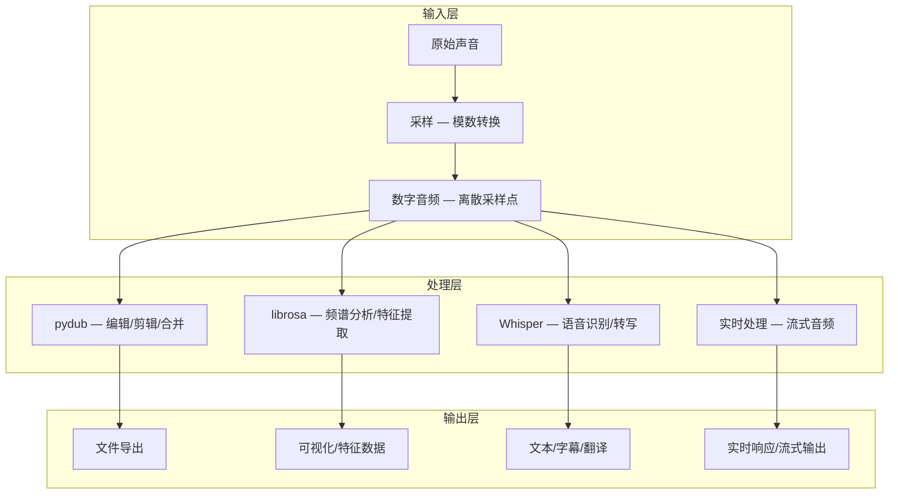
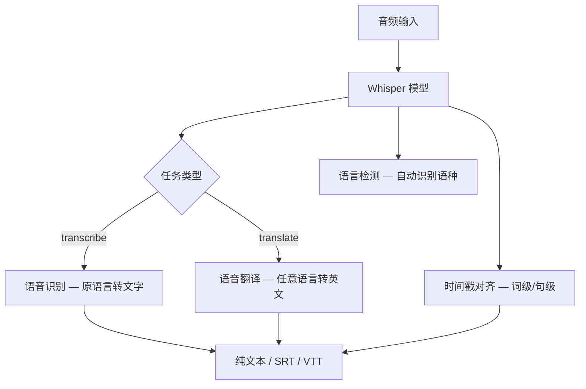
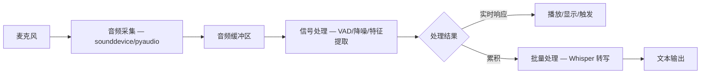
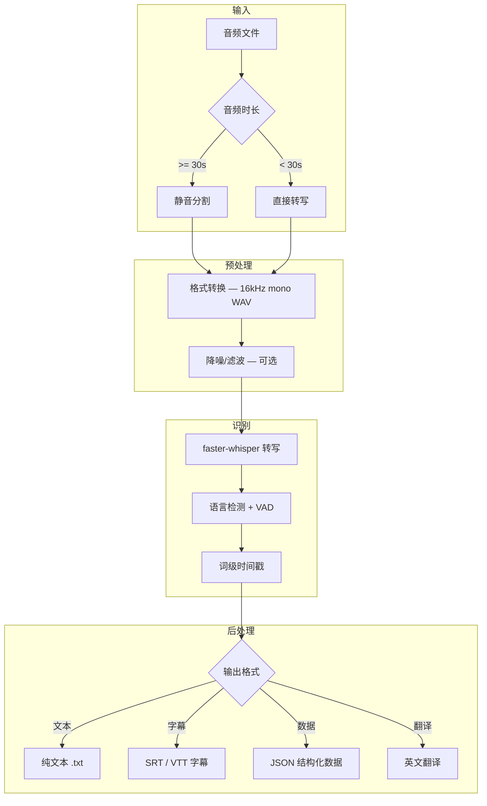

# Python 音频处理指南

## 概述

音频的本质是**时间和频率的关系**——声音是空气压力随时间变化的波形，人类听觉就是鼓膜感知这种振动。Python 生态提供了从底层信号处理到高层 AI 应用的完整工具链，覆盖音频编辑、频谱分析、语音识别、实时处理等全部场景。



## 音频基础知识

### 采样率与位深度

| 参数 | 含义 | 常见值 |
|------|------|--------|
| 采样率 | 每秒采样次数 | 44.1kHz (CD)、48kHz (影视)、16kHz (语音) |
| 位深度 | 每个采样点的精度 | 16bit (CD)、24bit (专业)、32bit (浮点) |
| 声道 | 单声道/立体声/环绕 | 1 (mono)、2 (stereo)、5.1/7.1 (环绕) |
| 比特率 | 每秒数据量 | 128kbps (MP3)、320kbps (高质量 MP3)、1411kbps (CD) |

**奈奎斯特定理**：采样率必须大于信号最高频率的 2 倍，才能无失真还原原始信号。人耳可听频率上限约 20kHz，因此 CD 采用 44.1kHz 采样率（44.1 > 20 x 2）。

### 常见音频格式

| 格式 | 类型 | 特点 | 适用场景 |
|------|------|------|----------|
| WAV | 无损 | 原始 PCM 数据，体积大，通用性强 | 音频处理中间格式、专业录音 |
| FLAC | 无损压缩 | 质量等同 WAV，体积减半 | 音乐收藏、归档 |
| MP3 | 有损压缩 | 最流行，兼容性好，比特率决定质量 | 日常播放、网络传输 |
| AAC | 有损压缩 | 比 MP3 同码率质量更好 | 流媒体、Apple 生态 |
| OGG | 有损压缩 | 开源格式，常用于游戏 | 游戏、开源项目 |
| OPUS | 有损压缩 | 低延迟、高质量，语音/音乐皆优 | 实时通信、VoIP |

### 音频数据在 Python 中的表示

```python
import numpy as np

# 音频在 Python 中本质是 numpy 数组
# 一维数组 = 单声道，二维数组 = 多声道
# 数据类型：int16 (-32768~32767)、float32 (-1.0~1.0)

# 示例：生成 440Hz 标准音 A4
sr = 44100
duration = 2.0
t = np.linspace(0, duration, int(sr * duration), endpoint=False)
tone = np.sin(2 * np.pi * 440 * t)  # 纯正弦波

# 添加泛音使声音更丰富
tone_rich = (np.sin(2 * np.pi * 440 * t) +           # 基频
             0.5 * np.sin(2 * np.pi * 880 * t) +     # 二次泛音
             0.25 * np.sin(2 * np.pi * 1320 * t))    # 三次泛音
tone_rich = tone_rich / np.max(np.abs(tone_rich))    # 归一化到 [-1, 1]
```

## pydub：音频编辑

```bash
pip install pydub
# 需要安装 ffmpeg (macOS: brew install ffmpeg, Ubuntu: sudo apt install ffmpeg)
```

### 基础操作

```python
from pydub import AudioSegment
from pydub.playback import play

# 加载音频（支持 WAV, MP3, FLAC, OGG 等）
audio = AudioSegment.from_file('music.mp3')
print(f'时长: {len(audio)/1000:.1f}秒')
print(f'声道: {audio.channels}')
print(f'采样率: {audio.frame_rate}Hz')
print(f'位深度: {audio.sample_width*8}bit')
print(f'帧数: {audio.frame_count()}')
print(f'RMS 能量: {audio.rms}')  # 音频响度指标

# 剪辑（单位：毫秒）
first_30s = audio[:30000]        # 前 30 秒
middle = audio[30000:60000]      # 30-60 秒
last_30s = audio[-30000:]        # 最后 30 秒

# 合并
combined = first_30s + middle

# 重复
looped = audio * 3  # 重复 3 次

# 音量控制
louder = audio + 10   # 增加 10dB
quieter = audio - 5   # 减少 5dB

# 淡入淡出
fade_in = audio.fade_in(2000)      # 2 秒淡入
fade_out = audio.fade_out(3000)    # 3 秒淡出

# 交叉淡化（两段音频无缝过渡）
crossfade = first_30s.append(middle, crossfade=3000)

# 导出
first_30s.export('clip.mp3', format='mp3', bitrate='192k',
                 tags={'artist': 'Demo', 'title': 'Clip'})
first_30s.export('clip.wav', format='wav')
```

### 高级编辑技巧

```python
from pydub import AudioSegment
from pydub.effects import normalize, low_pass_filter, high_pass_filter

# 归一化：将音量调整到最大不失真水平
audio = AudioSegment.from_file('quiet_audio.wav')
normalized = normalize(audio)

# 低通滤波：去除高频噪声（如风声、嘶嘶声）
filtered = low_pass_filter(audio, cutoff=3000)  # 截止频率 3kHz

# 高通滤波：去除低频噪声（如电流声、空调声）
filtered = high_pass_filter(audio, cutoff=200)   # 截止频率 200Hz

# 声道操作
stereo = audio.set_channels(2)    # 单声道转立体声
mono = audio.set_channels(1)      # 立体声转单声道

# 采样率转换
resampled = audio.set_frame_rate(16000)  # 转为 16kHz（语音识别常用）

# 位深度转换
depth_16 = audio.set_sample_width(2)  # 16bit

# 反转音频
reversed_audio = audio.reverse()

# 速度调整（通过改变帧率实现，会改变音调）
faster = audio.speedup(playback_speed=1.5)

# 精确速度调整（不改变音调，需要 ffmpeg）
from pydub import AudioSegment
audio = AudioSegment.from_file('speech.wav')
# 使用 ffmpeg atempo 滤镜实现变速不变调
faster = audio._spawn(
    audio.raw_data,
    overrides={'frame_rate': int(audio.frame_rate * 1.5)}
).set_frame_rate(audio.frame_rate)
```

### 格式转换

```python
from pydub import AudioSegment
from pathlib import Path

def batch_convert(input_dir, output_dir, output_format='mp3',
                  bitrate='192k', sample_rate=None):
    """批量转换音频格式

    Args:
        input_dir: 输入目录
        output_dir: 输出目录
        output_format: 目标格式 (mp3, wav, flac, ogg, aac)
        bitrate: 比特率（有损格式适用）
        sample_rate: 目标采样率，None 保持原始
    """
    input_path = Path(input_dir)
    output_path = Path(output_dir)
    output_path.mkdir(parents=True, exist_ok=True)

    supported = {'.mp3', '.wav', '.flac', '.ogg', '.m4a', '.aac', '.wma'}
    results = {'success': 0, 'failed': 0}

    for f in input_path.iterdir():
        if f.suffix.lower() not in supported:
            continue
        try:
            audio = AudioSegment.from_file(f)
            if sample_rate:
                audio = audio.set_frame_rate(sample_rate)
            out_file = output_path / f'{f.stem}.{output_format}'
            audio.export(out_file, format=output_format, bitrate=bitrate)
            print(f'[OK] {f.name} -> {out_file.name}')
            results['success'] += 1
        except Exception as e:
            print(f'[FAIL] {f.name}: {e}')
            results['failed'] += 1

    print(f'\n完成: 成功 {results["success"]}, 失败 {results["failed"]}')
    return results
```

### 背景音乐与人声分离

```python
# 方法一：相位反转法（适用于立体声文件，去除中心声像）
def extract_background_music(audio_path, output_path):
    audio = AudioSegment.from_file(audio_path)
    if audio.channels < 2:
        raise ValueError('需要立体声音频')

    # 分离左右声道
    left = audio.split_to_mono()[0]
    right = audio.split_to_mono()[1]

    # 相位反转：左声道 - 右声道，消除中心声像（通常是人声）
    instrumental = (left - right).pan(0)  # pan(0) 合并为单声道
    instrumental.export(output_path, format='mp3')

# 方法二：spleeter AI 分离（需要安装 spleeter）
# pip install spleeter
# from spleeter.separator import Separator
# separator = Separator('spleeter:2stems')  # 人声 + 伴奏
# separator.separate_to_file('song.mp3', 'output_dir/')

# 方法三：demucs AI 分离（效果更好，推荐）
# pip install demucs
# 命令行使用：demucs --two-stems=vocals song.mp3
# Python 调用：
# import subprocess
# subprocess.run(['demucs', '--two-stems=vocals', 'song.mp3'])
```

## 音频分割算法：静音检测分割

音频分割是语音识别、播客处理、会议记录等场景的核心预处理步骤。最常用的方法是基于静音检测（Silence Detection）将长音频切分为有意义的片段。


### pydub 静音分割

```python
from pydub import AudioSegment
from pydub.silence import split_on_silence, detect_nonsilent

def split_audio_by_silence(audio_path, output_dir,
                           min_silence_len=500,
                           silence_thresh=-40,
                           keep_silence=200,
                           padding=100):
    """基于静音检测分割音频

    Args:
        audio_path: 输入音频路径
        output_dir: 输出目录
        min_silence_len: 最小静音长度（毫秒），低于此长度的静音不作为分割点
        silence_thresh: 静音阈值（dBFS），低于此值视为静音
        keep_silence: 在分割点保留的静音长度（毫秒），避免词被截断
        padding: 分割点前后额外保留的音频长度（毫秒）

    Returns:
        list: 分割后的音频片段列表
    """
    audio = AudioSegment.from_file(audio_path)

    # 方法一：直接分割（最简单）
    chunks = split_on_silence(
        audio,
        min_silence_len=min_silence_len,
        silence_thresh=silence_thresh,
        keep_silence=keep_silence
    )

    # 方法二：先检测非静音段，再精细控制分割
    nonsilent_ranges = detect_nonsilent(
        audio,
        min_silence_len=min_silence_len,
        silence_thresh=silence_thresh
    )
    # nonsilent_ranges 返回 [(start_ms, end_ms), ...] 列表

    # 导出每个片段
    from pathlib import Path
    Path(output_dir).mkdir(parents=True, exist_ok=True)

    for i, chunk in enumerate(chunks):
        # 过滤过短的片段（可能是噪声）
        if len(chunk) < 200:  # 少于 200ms 的片段跳过
            continue
        out_path = f'{output_dir}/chunk_{i:04d}.wav'
        chunk.export(out_path, format='wav')
        print(f'片段 {i}: {len(chunk)/1000:.1f}秒')

    return chunks
```

### 自适应静音阈值

固定阈值在音量变化大的音频中效果不佳，自适应阈值根据音频整体响度动态调整。

```python
from pydub import AudioSegment
from pydub.silence import detect_nonsilent
import numpy as np

def adaptive_silence_split(audio_path, output_dir,
                           min_silence_len=500,
                           silence_ratio=0.6,
                           keep_silence=200):
    """自适应静音分割

    根据音频整体响度自动计算静音阈值，
    silence_ratio 表示静音阈值 = 最大响度 * silence_ratio（dBFS 刻度下）

    Args:
        audio_path: 输入音频路径
        output_dir: 输出目录
        min_silence_len: 最小静音长度（毫秒）
        silence_ratio: 静音阈值比例（0.0~1.0），越小越严格
        keep_silence: 保留静音长度（毫秒）
    """
    audio = AudioSegment.from_file(audio_path)

    # 计算自适应阈值
    # dBFS 范围：0（最大）到 -∞（静音）
    # 取音频的分位数作为参考
    chunk_size = 100  # 100ms 为一帧
    chunks_dBFS = [
        audio[i:i+chunk_size].dBFS
        for i in range(0, len(audio), chunk_size)
        if audio[i:i+chunk_size].dBFS != float('-inf')
    ]

    if not chunks_dBFS:
        raise ValueError('音频可能完全静音')

    # 使用中位数作为参考响度，静音阈值设为参考响度减去偏移量
    median_db = np.median(chunks_dBFS)
    silence_thresh = median_db - 15  # 比中位数低 15dB 视为静音

    print(f'音频中位响度: {median_db:.1f} dBFS')
    print(f'自适应静音阈值: {silence_thresh:.1f} dBFS')

    # 检测非静音段
    nonsilent_ranges = detect_nonsilent(
        audio,
        min_silence_len=min_silence_len,
        silence_thresh=silence_thresh
    )

    # 分割并导出
    from pathlib import Path
    Path(output_dir).mkdir(parents=True, exist_ok=True)

    segments = []
    for i, (start, end) in enumerate(nonsilent_ranges):
        # 添加 keep_silence 偏移
        seg_start = max(0, start - keep_silence)
        seg_end = min(len(audio), end + keep_silence)
        segment = audio[seg_start:seg_end]

        if len(segment) < 200:
            continue

        out_path = f'{output_dir}/segment_{i:04d}.wav'
        segment.export(out_path, format='wav')
        segments.append(segment)
        print(f'片段 {i}: {seg_start/1000:.1f}s - {seg_end/1000:.1f}s '
              f'({len(segment)/1000:.1f}秒)')

    return segments
```

### 基于 librosa 的能量分割

librosa 提供更精细的信号级分割能力，适合对分割精度要求高的场景。

```python
import librosa
import numpy as np

def librosa_energy_split(audio_path, frame_length=2048, hop_length=512,
                         top_db=30, ref=np.max):
    """基于短时能量的音频分割

    使用 librosa 的 effects.split 函数，基于能量阈值分割

    Args:
        audio_path: 音频文件路径
        frame_length: FFT 帧长
        hop_length: 帧移
        top_db: 低于参考值 top_db dB 的部分视为静音
        ref: 参考能量值计算方式

    Returns:
        list: [(start_sample, end_sample), ...] 非静音区间列表
    """
    y, sr = librosa.load(audio_path, sr=None)

    # effects.split 返回非静音区间的样本索引
    intervals = librosa.effects.split(y, top_db=top_db, ref=ref,
                                       frame_length=frame_length,
                                       hop_length=hop_length)

    print(f'采样率: {sr}Hz, 总时长: {len(y)/sr:.1f}秒')
    print(f'检测到 {len(intervals)} 个非静音片段:')

    for i, (start, end) in enumerate(intervals):
        start_sec = start / sr
        end_sec = end / sr
        duration = (end - start) / sr
        print(f'  片段 {i}: {start_sec:.2f}s - {end_sec:.2f}s '
              f'({duration:.2f}秒)')

    return intervals, y, sr


def split_and_export(audio_path, output_dir, top_db=30, min_duration=0.5):
    """分割音频并导出为独立文件

    Args:
        audio_path: 输入音频路径
        output_dir: 输出目录
        top_db: 静音阈值（dB），值越大分割越细
        min_duration: 最小片段时长（秒），过滤噪声片段
    """
    from pathlib import Path
    import soundfile as sf  # pip install soundfile

    Path(output_dir).mkdir(parents=True, exist_ok=True)

    y, sr = librosa.load(audio_path, sr=None)
    intervals = librosa.effects.split(y, top_db=top_db)

    exported = 0
    for i, (start, end) in enumerate(intervals):
        duration = (end - start) / sr
        if duration < min_duration:
            continue
        segment = y[start:end]
        out_path = f'{output_dir}/segment_{exported:04d}.wav'
        sf.write(out_path, segment, sr)
        print(f'导出: {out_path} ({duration:.2f}秒)')
        exported += 1

    print(f'\n共导出 {exported} 个片段')
```

## librosa：音频分析

```bash
pip install librosa soundfile
```

### 频谱分析

```python
import librosa
import librosa.display
import matplotlib.pyplot as plt
import numpy as np

# 加载音频
y, sr = librosa.load('audio.mp3', sr=None)  # sr=None 保持原始采样率
print(f'采样率: {sr}Hz, 时长: {len(y)/sr:.1f}秒')

# 节拍检测
tempo, beat_frames = librosa.beat.beat_track(y=y, sr=sr)
beat_times = librosa.frames_to_time(beat_frames, sr=sr)
print(f'BPM: {tempo:.0f}')

# 梅尔频谱图（语音识别和音乐信息检索的核心特征）
mel_spec = librosa.feature.melspectrogram(y=y, sr=sr, n_mels=128)
mel_spec_db = librosa.power_to_db(mel_spec, ref=np.max)

# 可视化
fig, axes = plt.subplots(3, 1, figsize=(12, 10))

# 波形
librosa.display.waveshow(y, sr=sr, ax=axes[0])
axes[0].set_title('Waveform')

# 梅尔频谱图
librosa.display.specshow(mel_spec_db, x_axis='time', y_axis='mel',
                          sr=sr, ax=axes[1])
fig.colorbar(axes[1].images[0], ax=axes[1], format='%+2.0f dB')
axes[1].set_title('Mel Spectrogram')

# MFCC（梅尔频率倒谱系数，语音识别经典特征）
mfcc = librosa.feature.mfcc(y=y, sr=sr, n_mfcc=13)
librosa.display.specshow(mfcc, x_axis='time', ax=axes[2])
axes[2].set_title('MFCC')

plt.tight_layout()
plt.savefig('audio_analysis.png', dpi=150)
print('分析图已保存')
```

### 音频特征提取

```python
import librosa
import numpy as np

def extract_features(audio_path, sr=22050):
    """提取音频的常用特征

    Returns:
        dict: 包含各类音频特征的字典
    """
    y, sr = librosa.load(audio_path, sr=sr)

    features = {}

    # --- 时域特征 ---
    # 过零率：信号符号变化的频率，区分清音/浊音
    features['zcr'] = librosa.feature.zero_crossing_rate(y)

    # RMS 能量：音频响度
    features['rms'] = librosa.feature.rms(y=y)

    # --- 频域特征 ---
    # 频谱质心：频谱能量中心，描述音色"亮度"
    features['spectral_centroid'] = librosa.feature.spectral_centroid(y=y, sr=sr)

    # 频谱带宽：频谱的频率范围
    features['spectral_bandwidth'] = librosa.feature.spectral_bandwidth(y=y, sr=sr)

    # 频谱滚降点：频谱能量集中百分比对应的频率
    features['spectral_rolloff'] = librosa.feature.spectral_rolloff(y=y, sr=sr)

    # --- 倒谱特征 ---
    # MFCC：语音识别最核心的特征
    features['mfcc'] = librosa.feature.mfcc(y=y, sr=sr, n_mfcc=13)

    # MFCC 的一阶和二阶差分（动态特征）
    features['mfcc_delta'] = librosa.feature.delta(features['mfcc'])
    features['mfcc_delta2'] = librosa.feature.delta(features['mfcc'], order=2)

    # --- 节奏特征 ---
    tempo, _ = librosa.beat.beat_track(y=y, sr=sr)
    features['tempo'] = tempo

    # --- 色度特征（音乐和弦分析）---
    features['chroma'] = librosa.feature.chroma_stft(y=y, sr=sr)

    # 汇总统计
    summary = {}
    for name, feat in features.items():
        if isinstance(feat, np.ndarray):
            summary[name] = {
                'mean': float(np.mean(feat)),
                'std': float(np.std(feat)),
                'min': float(np.min(feat)),
                'max': float(np.max(feat)),
                'shape': feat.shape
            }
        else:
            summary[name] = float(feat)

    return summary
```

## Whisper：开源语音识别

[OpenAI Whisper](https://github.com/openai/whisper) 是当前最强大的开源语音识别模型，支持 99 种语言，具备语音识别、语音翻译、语言识别和语音活动检测能力。



### 安装与模型选择

```bash
# 安装 Whisper
pip install openai-whisper

# Whisper 依赖 ffmpeg，确保已安装
# macOS: brew install ffmpeg
# Ubuntu: sudo apt install ffmpeg
# Windows: 从 https://ffmpeg.org 下载并添加到 PATH
```

| 模型 | 参数量 | 英语模型 | VRAM | 相对速度 | 最大音频长度 |
|------|--------|----------|------|----------|-------------|
| tiny | 39M | tiny.en | ~1GB | ~32x | 30s |
| base | 74M | base.en | ~1GB | ~26x | 30s |
| small | 244M | small.en | ~2GB | ~10x | 30s |
| medium | 769M | medium.en | ~5GB | ~2x | 30s |
| large-v3 | 1550M | -- | ~10GB | 1x | 30s |
| turbo | 809M | -- | ~6GB | ~8x | 30s |

> 注意：Whisper 每次推理最多处理 30 秒音频，长音频会自动分段处理。

### 基础用法

```python
import whisper

# 加载模型（首次运行会自动下载）
model = whisper.load_model('base')  # 可选: tiny, base, small, medium, large-v3, turbo

# 语音识别
result = model.transcribe('audio.mp3')
print(result['text'])  # 识别文本

# 查看完整结果
print(f'检测语言: {result["language"]}')
for segment in result['segments']:
    print(f'[{segment["start"]:.1f}s - {segment["end"]:.1f}s] '
          f'{segment["text"]}')
```

### 指定语言与任务

```python
import whisper

model = whisper.load_model('small')

# 指定语言（跳过语言检测，加速处理）
result = model.transcribe('chinese_audio.mp3', language='zh')

# 语音翻译：将任意语言翻译为英文
result = model.transcribe('french_audio.mp3', task='translate')
print(result['text'])  # 输出英文翻译

# 指定初始提示词，引导模型输出风格
result = model.transcribe(
    'meeting.mp3',
    language='zh',
    initial_prompt='以下是普通话的句子。'  # 帮助模型识别中文标点
)

# 控制温度和采样参数
result = model.transcribe(
    'audio.mp3',
    temperature=0.0,       # 0 = 贪心解码，更稳定；>0 更有创造性
    best_of=5,             # 候选数量，温度 >0 时有效
    beam_size=5,           # 束搜索宽度，温度 =0 时有效
    condition_on_previous_text=True,  # 是否基于前文生成
)
```

### 输出字幕格式（SRT / VTT）

```python
import whisper
from datetime import timedelta

model = whisper.load_model('base')
result = model.transcribe('video_audio.mp3')

def format_timestamp_srt(seconds):
    """格式化为 SRT 时间格式: 00:00:00,000"""
    td = timedelta(seconds=seconds)
    hours = int(td.total_seconds() // 3600)
    minutes = int((td.total_seconds() % 3600) // 60)
    secs = int(td.total_seconds() % 60)
    millis = int((seconds - int(seconds)) * 1000)
    return f'{hours:02d}:{minutes:02d}:{secs:02d},{millis:03d}'

def format_timestamp_vtt(seconds):
    """格式化为 VTT 时间格式: 00:00:00.000"""
    return format_timestamp_srt(seconds).replace(',', '.')

def save_srt(result, output_path):
    """保存为 SRT 字幕文件"""
    with open(output_path, 'w', encoding='utf-8') as f:
        for i, segment in enumerate(result['segments'], 1):
            start = format_timestamp_srt(segment['start'])
            end = format_timestamp_srt(segment['end'])
            f.write(f'{i}\n{start} --> {end}\n{segment["text"].strip()}\n\n')
    print(f'SRT 字幕已保存: {output_path}')

def save_vtt(result, output_path):
    """保存为 VTT 字幕文件"""
    with open(output_path, 'w', encoding='utf-8') as f:
        f.write('WEBVTT\n\n')
        for segment in result['segments']:
            start = format_timestamp_vtt(segment['start'])
            end = format_timestamp_vtt(segment['end'])
            f.write(f'{start} --> {end}\n{segment["text"].strip()}\n\n')
    print(f'VTT 字幕已保存: {output_path}')

# 同时保存两种格式
save_srt(result, 'output.srt')
save_vtt(result, 'output.vtt')
```

### 词级时间戳

```python
import whisper

model = whisper.load_model('small')

# 启用词级时间戳
result = model.transcribe('audio.mp3', word_timestamps=True)

for segment in result['segments']:
    print(f'\n--- 句子 [{segment["start"]:.1f}s - {segment["end"]:.1f}s] ---')
    print(segment['text'])
    print('词级时间戳:')
    for word in segment['words']:
        print(f'  [{word["start"]:.2f}s - {word["end"]:.2f}s] '
              f'{word["word"]} (概率: {word["probability"]:.2%})')
```

### 长音频处理策略

Whisper 内置了长音频分段机制，但对于超长音频（如会议、播客），需要更精细的控制。

```python
import whisper
from pydub import AudioSegment
from pydub.silence import detect_nonsilent

def transcribe_long_audio(audio_path, model_name='base',
                          min_silence_len=500, silence_thresh=-40):
    """长音频转写：先按静音分割，再逐段识别

    优势：
    - 避免单段过长导致显存溢出
    - 静音分割点更自然，减少句子被截断
    - 可并行处理各段

    Args:
        audio_path: 音频文件路径
        model_name: Whisper 模型名称
        min_silence_len: 最小静音长度（毫秒）
        silence_thresh: 静音阈值（dBFS）

    Returns:
        list: 每段的识别结果
    """
    model = whisper.load_model(model_name)

    # 加载音频并转为 16kHz 单声道 WAV（Whisper 要求）
    audio = AudioSegment.from_file(audio_path)
    audio = audio.set_channels(1).set_frame_rate(16000)

    # 检测非静音段
    nonsilent = detect_nonsilent(audio,
                                  min_silence_len=min_silence_len,
                                  silence_thresh=silence_thresh)

    # 合并过短的相邻段（Whisper 处理 30s 以内的片段效果最好）
    merged = []
    current_start, current_end = nonsilent[0]
    for start, end in nonsilent[1:]:
        # 如果当前段 + 间隔 + 下一段 < 28秒，合并
        gap = start - current_end
        if (current_end - current_start) + gap + (end - start) < 28000:
            current_end = end
        else:
            merged.append((current_start, current_end))
            current_start, current_end = start, end
    merged.append((current_start, current_end))

    print(f'音频总时长: {len(audio)/1000:.1f}秒')
    print(f'分割为 {len(merged)} 个片段')

    # 逐段识别
    all_segments = []
    for i, (start_ms, end_ms) in enumerate(merged):
        segment_audio = audio[start_ms:end_ms]

        # 导出为临时 WAV 供 Whisper 使用
        temp_path = f'/tmp/whisper_segment_{i}.wav'
        segment_audio.export(temp_path, format='wav')

        result = model.transcribe(temp_path, language='zh',
                                   condition_on_previous_text=True)

        # 时间偏移：将片段内时间转为全局时间
        for seg in result['segments']:
            seg['start'] += start_ms / 1000
            seg['end'] += start_ms / 1000
            all_segments.append(seg)

        print(f'片段 {i+1}/{len(merged)}: '
              f'{start_ms/1000:.1f}s - {end_ms/1000:.1f}s 完成')

    # 清理临时文件
    import os
    for i in range(len(merged)):
        os.remove(f'/tmp/whisper_segment_{i}.wav')

    return all_segments
```

### Whisper + faster-whisper 加速

[faster-whisper](https://github.com/SYSTRAN/faster-whisper) 使用 CTranslate2 重新实现 Whisper，速度提升 4 倍，内存减少 50%。

```bash
pip install faster-whisper
```

```python
from faster_whisper import WhisperModel

# GPU 加速（需要 CUDA）
# model = WhisperModel('large-v3', device='cuda', compute_type='float16')

# CPU 推理
model = WhisperModel('base', device='cpu', compute_type='int8')

# 使用方式与 openai-whisper 类似
segments, info = model.transcribe('audio.mp3', language='zh',
                                   beam_size=5, vad_filter=True)

print(f'检测语言: {info.language} (概率: {info.language_probability:.2%})')
print(f'音频时长: {info.duration:.1f}秒')

# segments 是生成器，逐段产出（节省内存）
for segment in segments:
    print(f'[{segment.start:.1f}s - {segment.end:.1f}s] {segment.text}')

# VAD 过滤（语音活动检测，自动跳过静音段）
segments, info = model.transcribe(
    'long_audio.mp3',
    vad_filter=True,           # 启用 VAD
    vad_parameters=dict(
        min_silence_duration_ms=500,  # 最小静音时长
        speech_pad_ms=200,            # 语音前后填充
    ),
    word_timestamps=True,
)
```

### Whisper 语言检测

```python
import whisper

model = whisper.load_model('base')

# 检测音频语言
audio = whisper.load_audio('unknown_audio.mp3')
audio = whisper.pad_or_trim(audio)  # 裁剪/填充到 30 秒
mel = whisper.log_mel_spectrogram(audio).to(model.device)

# 语言检测
_, probs = model.detect_language(mel)
detected_lang = max(probs, key=probs.get)
print(f'检测语言: {detected_lang} (概率: {probs[detected_lang]:.2%})')

# 打印所有语言概率（Top 5）
top_langs = sorted(probs.items(), key=lambda x: x[1], reverse=True)[:5]
for lang, prob in top_langs:
    print(f'  {lang}: {prob:.2%}')
```

## 实时音频处理基础

实时音频处理要求在音频流到达时即时处理，延迟通常需控制在 100ms 以内。Python 生态中 `sounddevice` 和 `pyaudio` 是两个核心库。



### sounddevice：音频采集与播放

```bash
pip install sounddevice numpy
```

```python
import sounddevice as sd
import numpy as np

# 查询音频设备
print('输入设备:')
print(sd.query_devices(kind='input'))
print('\n输出设备:')
print(sd.query_devices(kind='output'))

# 录音（阻塞方式）
def record_audio(duration=5, sr=16000, channels=1):
    """录音指定时长

    Args:
        duration: 录音时长（秒）
        sr: 采样率
        channels: 声道数

    Returns:
        numpy.ndarray: 音频数据
    """
    print(f'录音中... ({duration}秒)')
    audio = sd.rec(int(duration * sr), samplerate=sr,
                   channels=channels, dtype='float32')
    sd.wait()  # 等待录音完成
    print('录音完成')
    return audio.flatten()

# 播放
def play_audio(audio, sr=16000):
    """播放音频数据"""
    sd.play(audio, samplerate=sr)
    sd.wait()

# 录音并立即播放（回声测试）
audio = record_audio(duration=3, sr=16000)
play_audio(audio, sr=16000)
```

### 流式音频处理（回调模式）

```python
import sounddevice as sd
import numpy as np
import queue
import threading

class AudioStreamProcessor:
    """流式音频处理器

    使用回调模式实现低延迟实时处理：
    - 音频数据通过回调函数实时获取
    - 处理逻辑在独立线程中执行，不阻塞音频流
    """

    def __init__(self, sr=16000, channels=1, block_duration=0.5,
                 silence_threshold=0.02, min_speech_duration=1.0):
        self.sr = sr
        self.channels = channels
        self.block_size = int(sr * block_duration)  # 每次回调的采样数
        self.silence_threshold = silence_threshold
        self.min_speech_duration = min_speech_duration

        self.audio_queue = queue.Queue()
        self.buffer = np.array([], dtype=np.float32)
        self.is_speaking = False
        self.speech_buffer = np.array([], dtype=np.float32)
        self.running = False

    def _audio_callback(self, indata, frames, time_info, status):
        """音频流回调（在音频线程中执行，必须快速返回）"""
        if status:
            print(f'音频状态: {status}')
        self.audio_queue.put(indata.copy())

    def _is_speech(self, audio_chunk):
        """简单的语音活动检测（基于能量阈值）"""
        rms = np.sqrt(np.mean(audio_chunk ** 2))
        return rms > self.silence_threshold

    def _process_buffer(self):
        """在主线程中处理音频缓冲区"""
        while self.running:
            try:
                chunk = self.audio_queue.get(timeout=0.1)
                audio = chunk.flatten()

                if self._is_speech(audio):
                    self.speech_buffer = np.concatenate([self.speech_buffer, audio])
                    self.is_speaking = True
                elif self.is_speaking:
                    # 语音结束，检查是否达到最小时长
                    duration = len(self.speech_buffer) / self.sr
                    if duration >= self.min_speech_duration:
                        self._on_speech_end(self.speech_buffer, duration)
                    self.speech_buffer = np.array([], dtype=np.float32)
                    self.is_speaking = False

            except queue.Empty:
                continue

    def _on_speech_end(self, audio, duration):
        """语音段结束回调（子类可重写）"""
        print(f'检测到语音段: {duration:.1f}秒')

    def start(self):
        """启动音频流"""
        self.running = True
        self.process_thread = threading.Thread(target=self._process_buffer,
                                                daemon=True)
        self.process_thread.start()

        self.stream = sd.InputStream(
            samplerate=self.sr,
            channels=self.channels,
            blocksize=self.block_size,
            callback=self._audio_callback,
            dtype='float32'
        )
        self.stream.start()
        print(f'音频流已启动 (采样率: {self.sr}Hz, 块大小: {self.block_size})')

    def stop(self):
        """停止音频流"""
        self.running = False
        self.stream.stop()
        self.stream.close()
        self.process_thread.join(timeout=2)
        print('音频流已停止')
```

### 实时音量监控

```python
import sounddevice as sd
import numpy as np
import time

def real_time_volume_monitor(duration=10, sr=16000, block_duration=0.05):
    """实时音量监控

    Args:
        duration: 监控总时长（秒）
        sr: 采样率
        block_duration: 每次采样的时长（秒），越小延迟越低
    """
    block_size = int(sr * block_duration)

    def callback(indata, frames, time_info, status):
        audio = indata.flatten()
        rms = np.sqrt(np.mean(audio ** 2))
        db = 20 * np.log10(rms + 1e-10)  # 转为 dB

        # 可视化音量条
        bar_length = int(max(0, (db + 60) / 60 * 40))  # -60dB ~ 0dB 映射到 0~40
        bar = '#' * bar_length + '-' * (40 - bar_length)
        level = 'SILENT' if db < -50 else 'LOW' if db < -30 else 'MID' if db < -15 else 'HIGH'
        print(f'\r[{bar}] {db:6.1f}dB {level}', end='', flush=True)

    with sd.InputStream(samplerate=sr, channels=1, blocksize=block_size,
                        callback=callback, dtype='float32'):
        print(f'音量监控中... ({duration}秒, Ctrl+C 停止)')
        try:
            time.sleep(duration)
        except KeyboardInterrupt:
            pass
    print('\n监控结束')
```

### 实时降噪基础

```python
import numpy as np
import sounddevice as sd
from scipy.signal import butter, lfilter

class RealTimeDenoiser:
    """实时音频降噪处理器

    使用频域滤波和谱减法进行实时降噪
    """

    def __init__(self, sr=16000, noise_frames=10):
        self.sr = sr
        self.noise_frames = noise_frames
        self.noise_profile = None
        self.frame_count = 0

    def _butter_filter(self, lowcut, highcut, order=5):
        """设计 Butterworth 带通滤波器"""
        nyq = 0.5 * self.sr
        low = lowcut / nyq
        high = highcut / nyq
        b, a = butter(order, [low, high], btype='band')
        return b, a

    def estimate_noise(self, audio):
        """估计噪声谱（在静音段调用）"""
        fft = np.fft.rfft(audio)
        self.noise_profile = np.abs(fft)
        self.frame_count += 1
        print(f'噪声估计帧 {self.frame_count}/{self.noise_frames}')

    def spectral_subtraction(self, audio, alpha=2.0):
        """谱减法降噪

        Args:
            audio: 输入音频
            alpha: 过减因子，越大降噪越强但可能产生音乐噪声
        """
        if self.noise_profile is None:
            return audio

        fft = np.fft.rfft(audio)
        magnitude = np.abs(fft)
        phase = np.angle(fft)

        # 谱减法：从信号谱中减去噪声谱
        clean_magnitude = np.maximum(
            magnitude - alpha * self.noise_profile[:len(magnitude)],
            0  # 确保非负
        )

        # 重建信号
        clean_fft = clean_magnitude * np.exp(1j * phase)
        clean_audio = np.fft.irfft(clean_fft, n=len(audio))
        return clean_audio.astype(np.float32)

    def process(self, audio):
        """处理一帧音频"""
        # 带通滤波：保留 80Hz~8000Hz（语音频率范围）
        b, a = self._butter_filter(80, 8000)
        filtered = lfilter(b, a, audio).astype(np.float32)

        # 谱减法降噪
        if self.noise_profile is not None:
            filtered = self.spectral_subtraction(filtered)

        return filtered
```

## 实战：完整音频转写系统

将前面所有技术整合，构建一个生产级的音频转写系统，支持长音频分割、Whisper 识别、字幕输出和实时转写。



### 转写系统核心类

```python
import os
import json
import time
from pathlib import Path
from datetime import timedelta
from dataclasses import dataclass, field, asdict
from typing import Optional

import numpy as np
from pydub import AudioSegment
from pydub.silence import detect_nonsilent

try:
    from faster_whisper import WhisperModel
    USE_FASTER = True
except ImportError:
    import whisper
    USE_FASTER = False


@dataclass
class TranscriptionSegment:
    """单个转写片段"""
    id: int
    start: float          # 开始时间（秒）
    end: float            # 结束时间（秒）
    text: str
    confidence: float = 0.0
    words: list = field(default_factory=list)

    @property
    def duration(self) -> float:
        return self.end - self.start


@dataclass
class TranscriptionResult:
    """完整转写结果"""
    audio_path: str
    language: str
    language_probability: float
    duration: float
    segments: list = field(default_factory=list)
    model_name: str = ''
    processing_time: float = 0.0

    @property
    def full_text(self) -> str:
        return ' '.join(seg.text.strip() for seg in self.segments)

    def to_dict(self) -> dict:
        return {
            'audio_path': self.audio_path,
            'language': self.language,
            'language_probability': self.language_probability,
            'duration': self.duration,
            'model_name': self.model_name,
            'processing_time': self.processing_time,
            'full_text': self.full_text,
            'segments': [asdict(seg) for seg in self.segments],
        }


class AudioTranscriber:
    """音频转写系统

    支持：
    - 自动语言检测或指定语言
    - 长音频智能分割
    - 多种输出格式（TXT, SRT, VTT, JSON）
    - faster-whisper 加速（自动检测）
    - 语音翻译（任意语言转英文）
    """

    # Whisper 模型推荐配置
    MODEL_CONFIGS = {
        'tiny': {'vram': '~1GB', 'speed': '~32x', 'quality': '低'},
        'base': {'vram': '~1GB', 'speed': '~26x', 'quality': '基础'},
        'small': {'vram': '~2GB', 'speed': '~10x', 'quality': '中等'},
        'medium': {'vram': '~5GB', 'speed': '~2x', 'quality': '良好'},
        'large-v3': {'vram': '~10GB', 'speed': '1x', 'quality': '最佳'},
        'turbo': {'vram': '~6GB', 'speed': '~8x', 'quality': '优秀'},
    }

    def __init__(self, model_name='base', device='cpu',
                 compute_type='int8', language=None):
        """
        Args:
            model_name: Whisper 模型名称
            device: 'cpu' 或 'cuda'
            compute_type: 计算精度 ('int8', 'float16', 'float32')
            language: 指定语言（None 为自动检测）
        """
        self.model_name = model_name
        self.device = device
        self.language = language
        self._load_model(model_name, device, compute_type)

    def _load_model(self, model_name, device, compute_type):
        """加载 Whisper 模型"""
        print(f'加载模型: {model_name} (设备: {device})')
        start = time.time()

        if USE_FASTER:
            self.model = WhisperModel(model_name, device=device,
                                       compute_type=compute_type)
        else:
            self.model = whisper.load_model(model_name, device=device)

        print(f'模型加载完成 ({time.time()-start:.1f}秒)')

    def _preprocess_audio(self, audio_path, target_sr=16000):
        """音频预处理：格式转换 + 降噪

        Args:
            audio_path: 输入音频路径
            target_sr: 目标采样率

        Returns:
            str: 预处理后的临时 WAV 文件路径
        """
        audio = AudioSegment.from_file(audio_path)

        # 转为 16kHz 单声道
        audio = audio.set_channels(1).set_frame_rate(target_sr)

        # 归一化音量
        from pydub.effects import normalize
        audio = normalize(audio)

        # 导出临时文件
        temp_path = f'/tmp/whisper_preprocessed_{os.getpid()}.wav'
        audio.export(temp_path, format='wav')

        return temp_path

    def _split_long_audio(self, audio_path, max_segment_ms=28000,
                          min_silence_len=500, silence_thresh=-40):
        """长音频分割

        Args:
            audio_path: 音频文件路径
            max_segment_ms: 单段最大时长（毫秒）
            min_silence_len: 最小静音长度（毫秒）
            silence_thresh: 静音阈值（dBFS）

        Returns:
            list: [(start_ms, end_ms), ...] 分割区间列表
        """
        audio = AudioSegment.from_file(audio_path)

        if len(audio) <= max_segment_ms:
            return [(0, len(audio))]

        # 检测非静音段
        nonsilent = detect_nonsilent(audio,
                                      min_silence_len=min_silence_len,
                                      silence_thresh=silence_thresh)

        if not nonsilent:
            # 整段都是静音，按固定长度分割
            return [(i, min(i + max_segment_ms, len(audio)))
                    for i in range(0, len(audio), max_segment_ms)]

        # 合并相邻段，确保每段不超过 max_segment_ms
        merged = []
        current_start, current_end = nonsilent[0]

        for start, end in nonsilent[1:]:
            potential_length = (end - current_start)
            if potential_length <= max_segment_ms:
                current_end = end
            else:
                merged.append((current_start, current_end))
                current_start, current_end = start, end

        merged.append((current_start, current_end))
        return merged

    def transcribe(self, audio_path, task='transcribe',
                   word_timestamps=True, vad_filter=True,
                   output_dir=None, output_formats=None):
        """转写音频文件

        Args:
            audio_path: 音频文件路径
            task: 'transcribe'（识别）或 'translate'（翻译为英文）
            word_timestamps: 是否生成词级时间戳
            vad_filter: 是否启用 VAD 过滤
            output_dir: 输出目录（None 则不保存文件）
            output_formats: 输出格式列表，如 ['txt', 'srt', 'vtt', 'json']

        Returns:
            TranscriptionResult: 转写结果
        """
        start_time = time.time()

        # 预处理
        processed_path = self._preprocess_audio(audio_path)

        # 分割
        segments_ranges = self._split_long_audio(processed_path)
        print(f'音频分割为 {len(segments_ranges)} 个片段')

        # 转写
        all_segments = []
        language = 'unknown'
        language_prob = 0.0

        for i, (start_ms, end_ms) in enumerate(segments_ranges):
            # 提取片段
            audio = AudioSegment.from_file(processed_path)
            segment_audio = audio[start_ms:end_ms]
            temp_segment = f'/tmp/whisper_seg_{os.getpid()}_{i}.wav'
            segment_audio.export(temp_segment, format='wav')

            # 识别
            if USE_FASTER:
                seg_result, info = self.model.transcribe(
                    temp_segment,
                    language=self.language,
                    task=task,
                    word_timestamps=word_timestamps,
                    vad_filter=vad_filter,
                    beam_size=5,
                )
                language = info.language
                language_prob = info.language_probability

                for j, seg in enumerate(seg_result):
                    ts = TranscriptionSegment(
                        id=len(all_segments),
                        start=seg.start + start_ms / 1000,
                        end=seg.end + start_ms / 1000,
                        text=seg.text,
                        words=[{'start': w.start + start_ms / 1000,
                                'end': w.end + start_ms / 1000,
                                'word': w.word,
                                'probability': w.probability}
                               for w in (seg.words or [])]
                    )
                    all_segments.append(ts)
            else:
                seg_result = self.model.transcribe(
                    temp_segment,
                    language=self.language,
                    task=task,
                    word_timestamps=word_timestamps,
                    condition_on_previous_text=True,
                )
                language = seg_result.get('language', 'unknown')
                language_prob = seg_result.get('language_prob', 0.0)

                for seg in seg_result['segments']:
                    ts = TranscriptionSegment(
                        id=len(all_segments),
                        start=seg['start'] + start_ms / 1000,
                        end=seg['end'] + start_ms / 1000,
                        text=seg['text'],
                        confidence=seg.get('avg_logprob', 0.0),
                        words=seg.get('words', [])
                    )
                    all_segments.append(ts)

            os.remove(temp_segment)
            print(f'  片段 {i+1}/{len(segments_ranges)} 完成')

        # 清理临时文件
        os.remove(processed_path)

        # 构建结果
        audio_duration = sum(seg.duration for seg in all_segments)
        result = TranscriptionResult(
            audio_path=audio_path,
            language=language,
            language_probability=language_prob,
            duration=audio_duration,
            segments=all_segments,
            model_name=self.model_name,
            processing_time=time.time() - start_time
        )

        # 保存输出
        if output_dir and output_formats:
            self._save_outputs(result, output_dir, output_formats)

        print(f'\n转写完成: {len(all_segments)} 个片段, '
              f'耗时 {result.processing_time:.1f}秒')
        print(f'语言: {language} ({language_prob:.2%})')
        print(f'全文: {result.full_text[:200]}...')

        return result

    def _save_outputs(self, result, output_dir, formats):
        """保存多种格式的输出"""
        output_path = Path(output_dir)
        output_path.mkdir(parents=True, exist_ok=True)
        stem = Path(result.audio_path).stem

        if 'txt' in formats:
            self._save_txt(result, output_path / f'{stem}.txt')

        if 'srt' in formats:
            self._save_srt(result, output_path / f'{stem}.srt')

        if 'vtt' in formats:
            self._save_vtt(result, output_path / f'{stem}.vtt')

        if 'json' in formats:
            self._save_json(result, output_path / f'{stem}.json')

    @staticmethod
    def _format_srt_time(seconds):
        td = timedelta(seconds=seconds)
        h = int(td.total_seconds() // 3600)
        m = int((td.total_seconds() % 3600) // 60)
        s = int(td.total_seconds() % 60)
        ms = int((seconds - int(seconds)) * 1000)
        return f'{h:02d}:{m:02d}:{s:02d},{ms:03d}'

    @staticmethod
    def _format_vtt_time(seconds):
        return AudioTranscriber._format_srt_time(seconds).replace(',', '.')

    def _save_txt(self, result, path):
        with open(path, 'w', encoding='utf-8') as f:
            f.write(result.full_text)
        print(f'已保存: {path}')

    def _save_srt(self, result, path):
        with open(path, 'w', encoding='utf-8') as f:
            for seg in result.segments:
                f.write(f'{seg.id+1}\n')
                f.write(f'{self._format_srt_time(seg.start)} --> '
                        f'{self._format_srt_time(seg.end)}\n')
                f.write(f'{seg.text.strip()}\n\n')
        print(f'已保存: {path}')

    def _save_vtt(self, result, path):
        with open(path, 'w', encoding='utf-8') as f:
            f.write('WEBVTT\n\n')
            for seg in result.segments:
                f.write(f'{self._format_vtt_time(seg.start)} --> '
                        f'{self._format_vtt_time(seg.end)}\n')
                f.write(f'{seg.text.strip()}\n\n')
        print(f'已保存: {path}')

    def _save_json(self, result, path):
        with open(path, 'w', encoding='utf-8') as f:
            json.dump(result.to_dict(), f, ensure_ascii=False, indent=2)
        print(f'已保存: {path}')
```

### 使用示例

```python
# === 示例 1：基本转写 ===
transcriber = AudioTranscriber(model_name='base', language='zh')
result = transcriber.transcribe(
    'meeting_recording.mp3',
    output_dir='output',
    output_formats=['txt', 'srt', 'vtt', 'json']
)

# === 示例 2：英文翻译（任意语言转英文）===
transcriber = AudioTranscriber(model_name='small')
result = transcriber.transcribe(
    'french_interview.mp3',
    task='translate',  # 翻译为英文
    output_dir='output',
    output_formats=['srt']
)

# === 示例 3：高质量长音频转写 ===
transcriber = AudioTranscriber(
    model_name='large-v3',
    device='cuda',           # GPU 加速
    compute_type='float16',
    language='zh'
)
result = transcriber.transcribe(
    '2hour_podcast.mp3',
    word_timestamps=True,
    vad_filter=True,
    output_dir='output/podcast',
    output_formats=['txt', 'srt', 'json']
)

# === 示例 4：批量转写 ===
def batch_transcribe(input_dir, model_name='base', language='zh'):
    """批量转写目录下所有音频文件"""
    transcriber = AudioTranscriber(model_name=model_name, language=language)
    supported = {'.mp3', '.wav', '.flac', '.m4a', '.ogg'}

    for f in Path(input_dir).iterdir():
        if f.suffix.lower() in supported:
            print(f'\n{"="*60}')
            print(f'处理: {f.name}')
            print(f'{"="*60}')
            result = transcriber.transcribe(
                str(f),
                output_dir=f'output/{f.stem}',
                output_formats=['txt', 'srt', 'json']
            )

batch_transcribe('audio_files/', model_name='small')
```

### 实时转写（麦克风输入）

```python
import sounddevice as sd
import numpy as np
import tempfile
import wave

class RealTimeTranscriber(AudioStreamProcessor):
    """实时语音转写器

    继承 AudioStreamProcessor，在检测到语音段结束后自动调用 Whisper 转写
    """

    def __init__(self, model_name='base', language='zh',
                 sr=16000, min_speech_duration=2.0):
        super().__init__(sr=sr, channels=1, block_duration=0.5,
                         silence_threshold=0.02,
                         min_speech_duration=min_speech_duration)
        self.transcriber = AudioTranscriber(model_name=model_name,
                                             language=language)
        self.transcript_log = []

    def _on_speech_end(self, audio, duration):
        """语音段结束，执行转写"""
        # 保存为临时 WAV
        temp = tempfile.NamedTemporaryFile(suffix='.wav', delete=False)
        with wave.open(temp.name, 'wb') as wf:
            wf.setnchannels(1)
            wf.setsampwidth(2)  # 16bit
            wf.setframerate(self.sr)
            # float32 -> int16
            audio_int16 = (audio * 32767).astype(np.int16)
            wf.writeframes(audio_int16.tobytes())

        # 转写
        try:
            result = self.transcriber.transcribe(temp.name)
            text = result.full_text
            if text.strip():
                timestamp = time.strftime('%H:%M:%S')
                print(f'\n[{timestamp}] {text}')
                self.transcript_log.append({
                    'time': timestamp,
                    'duration': duration,
                    'text': text
                })
        except Exception as e:
            print(f'\n转写错误: {e}')
        finally:
            os.unlink(temp.name)

    def get_transcript(self):
        """获取完整转写记录"""
        return '\n'.join(
            f'[{item["time"]}] {item["text"]}'
            for item in self.transcript_log
        )


# 使用实时转写
if __name__ == '__main__':
    print('=== 实时语音转写系统 ===')
    print('对着麦克风说话，系统会自动识别并转写')
    print('按 Ctrl+C 停止\n')

    transcriber = RealTimeTranscriber(model_name='base', language='zh')
    transcriber.start()

    try:
        import time
        while True:
            time.sleep(0.1)
    except KeyboardInterrupt:
        transcriber.stop()
        print('\n\n=== 完整转写记录 ===')
        print(transcriber.get_transcript())
```

## 语音合成 (TTS)

### edge-tts：免费高质量语音合成

```bash
pip install edge-tts
```

```python
import asyncio
import edge_tts

async def text_to_speech(text, output_path, voice='zh-CN-XiaoxiaoNeural',
                          rate='+0%', volume='+0%'):
    """使用 Microsoft Edge TTS 合成语音

    Args:
        text: 要合成的文本
        output_path: 输出音频路径
        voice: 发音人（见下方列表）
        rate: 语速调整 (-100% ~ +200%)
        volume: 音量调整 (-50% ~ +100%)
    """
    communicate = edge_tts.Communicate(text, voice, rate=rate, volume=volume)
    await communicate.save(output_path)
    print(f'合成完成: {output_path}')

# 常用中文发音人
# zh-CN-XiaoxiaoNeural  — 女声，温柔自然（推荐）
# zh-CN-XiaoyiNeural    — 女声，活泼
# zh-CN-YunjianNeural   — 男声，沉稳
# zh-CN-YunxiNeural     — 男声，阳光
# zh-CN-YunxiaNeural    — 男声，少年

# 常用英文发音人
# en-US-JennyNeural     — 女声，自然
# en-US-GuyNeural       — 男声，成熟

# 列出所有可用发音人
async def list_voices():
    voices = await edge_tts.list_voices()
    zh_voices = [v for v in voices if v['Locale'].startswith('zh')]
    for v in zh_voices:
        print(f'{v["ShortName"]:30s} {v["Gender"]:8s} {v["Locale"]}')

# 运行
asyncio.run(text_to_speech('你好，这是一个语音合成测试。', 'output.mp3'))
```

### 带字幕的语音合成

```python
import asyncio
import edge_tts

async def tts_with_subtitles(text, output_audio, output_srt,
                              voice='zh-CN-XiaoxiaoNeural'):
    """合成语音并生成 SRT 字幕"""
    communicate = edge_tts.Communicate(text, voice)

    submaker = edge_tts.SubMaker()
    with open(output_audio, 'wb') as audio_file:
        async for chunk in communicate.stream():
            if chunk['type'] == 'audio':
                audio_file.write(chunk['data'])
            elif chunk['type'] in ('WordBoundary', 'SentenceBoundary'):
                submaker.feed(chunk)  # 7.x API：feed 接收完整消息

    with open(output_srt, 'w', encoding='utf-8') as srt_file:
        srt_file.write(submaker.get_srt())

    print(f'音频: {output_audio}')
    print(f'字幕: {output_srt}')

asyncio.run(tts_with_subtitles(
    'Python 是一种广泛使用的高级编程语言。它的设计哲学强调代码的可读性。',
    'speech.mp3', 'speech.srt'
))
```

### 云端 TTS（阿里云）

```python
import requests

def aliyun_tts(text, app_key, token, output_path):
    """阿里云语音合成"""
    url = 'https://nls-gateway.cn-shanghai.aliyuncs.com/stream/v1/tts'
    headers = {'X-NLS-Token': token, 'Content-Type': 'application/json'}
    body = {
        'appkey': app_key,
        'text': text,
        'voice': 'xiaoyun',       # 发音人
        'format': 'mp3',
        'sample_rate': '16000',
        'volume': 50,
        'speech_rate': 0,          # 语速，-500~500
        'pitch_rate': 0,           # 语调，-500~500
    }
    response = requests.post(url, headers=headers, json=body)
    with open(output_path, 'wb') as f:
        f.write(response.content)
    print(f'合成完成: {output_path}')
```

## 常见陷阱与最佳实践

### 陷阱

| 陷阱 | 说明 | 正确做法 |
|------|------|---------|
| 缺少 ffmpeg | pydub/Whisper 处理 MP3/OGG 需要 ffmpeg | `brew install ffmpeg` (Mac) / `sudo apt install ffmpeg` (Linux) |
| 采样率不匹配 | 不同音频合成时采样率不一致 | 统一 `audio.set_frame_rate(44100)` |
| 内存溢出 | 长音频一次性加载到内存 | 使用分段处理，或 faster-whisper 的流式模式 |
| 编码格式不支持 | 某些格式需特定解码器 | 先用 ffmpeg 转 WAV 再处理 |
| Whisper 幻觉 | 长静音段可能产生重复文本 | 启用 `vad_filter=True` 过滤静音 |
| Whisper 截断 | 句子中间被切断导致不完整 | 使用 `condition_on_previous_text=True` |
| 静音阈值不当 | 固定阈值在音量变化大的音频中失效 | 使用自适应阈值（基于中位响度计算） |
| 实时处理阻塞 | 在音频回调中执行耗时操作 | 回调只做数据搬运，处理在独立线程 |

### 最佳实践

```python
# 1. 音频处理前统一格式
def standardize_audio(audio_path, sr=16000, channels=1, sample_width=2):
    """标准化音频格式（语音识别预处理）"""
    audio = AudioSegment.from_file(audio_path)
    audio = audio.set_frame_rate(sr)
    audio = audio.set_channels(channels)
    audio = audio.set_sample_width(sample_width)
    return audio

# 2. 大文件分块处理
def process_large_audio(audio_path, chunk_duration_ms=30000, process_func=None):
    """分块处理大音频文件"""
    audio = AudioSegment.from_file(audio_path)
    results = []
    for i in range(0, len(audio), chunk_duration_ms):
        chunk = audio[i:i+chunk_duration_ms]
        if process_func:
            result = process_func(chunk)
            results.append(result)
    return results

# 3. Whisper 推理优化
# - 使用 faster-whisper 替代 openai-whisper（4x 加速）
# - 启用 VAD 过滤减少无效推理
# - 指定 language 跳过语言检测
# - CPU 使用 int8 量化，GPU 使用 float16

# 4. 实时处理延迟控制
# - block_duration 设为 20-50ms（语音识别场景可设 500ms-1s）
# - 回调函数中只做数据搬运，不执行计算
# - 使用队列解耦采集和处理
```

## 工具选型指南

| 需求 | 推荐工具 | 理由 |
|------|----------|------|
| 音频剪辑/合并/格式转换 | pydub | API 简洁，功能全面 |
| 频谱分析/特征提取 | librosa | 学术标准，功能最全 |
| 语音识别（离线） | faster-whisper | 速度快，精度高，免费 |
| 语音识别（在线） | 阿里云/腾讯云 ASR | 中文效果好，标点准确 |
| 语音合成（免费） | edge-tts | 免费，质量高，多语言 |
| 语音合成（商业） | 阿里云/腾讯云 TTS | 音色丰富，支持 SSML |
| 人声分离 | demucs | 效果最好，开源 |
| 实时音频采集 | sounddevice | 跨平台，回调模式 |
| 音频降噪 | noisereduce / scipy | 简单场景用谱减法，复杂场景用 noisereduce |

## 延伸阅读

- [pydub 官方文档](https://github.com/jiaaro/pydub)
- [librosa 文档](https://librosa.org/doc/latest/index.html)
- [Whisper 官方仓库](https://github.com/openai/whisper)
- [faster-whisper 文档](https://github.com/SYSTRAN/faster-whisper)
- [edge-tts 文档](https://github.com/rany2/edge-tts)
- [demucs 人声分离](https://github.com/facebookresearch/demucs)
- [sounddevice 文档](https://python-sounddevice.readthedocs.io/)
- [ffmpeg 官方文档](https://ffmpeg.org/documentation.html)
- [Whisper 模型论文](https://cdn.openai.com/papers/whisper.pdf)

## 版本差异（自动化办公库 → 当前稳定版）

| 库 | 本文编写时 | 当前稳定版（截至 2026-09） |
|----|-----------|-----------|
| `openpyxl`（Excel） | 旧版 | 3.1.x |
| `python-docx`（Word） | 旧版 | 1.2.x |
| `python-pptx`（PPT） | 旧版 | 1.0.x |
| `reportlab`（PDF） | 旧版 | 5.x |
| `PyPDF2`/`pypdf` | PyPDF2 | 推荐 `pypdf`（6.x，PyPDF2 已停止维护） |
| `Pillow`（图像） | 旧版 | 12.x |

> 本文讲解的自动化办公流程（读写 Excel/Word/PDF/PPT）与核心 API 在最新版本中成立；注意 PyPDF2 已迁移至 pypdf。
