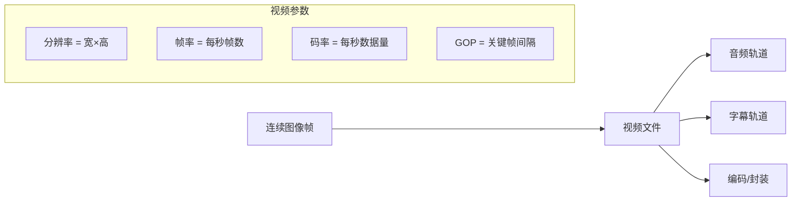
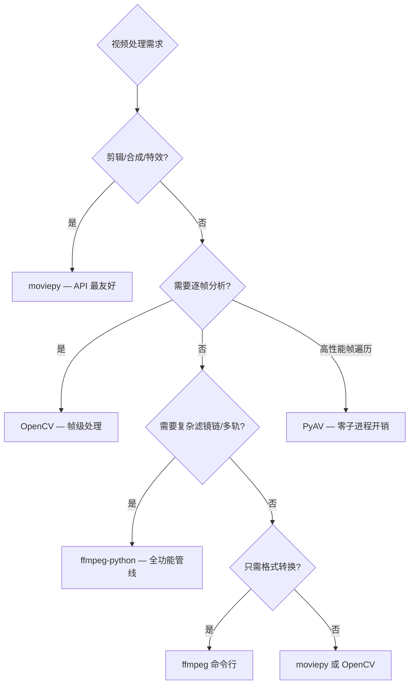
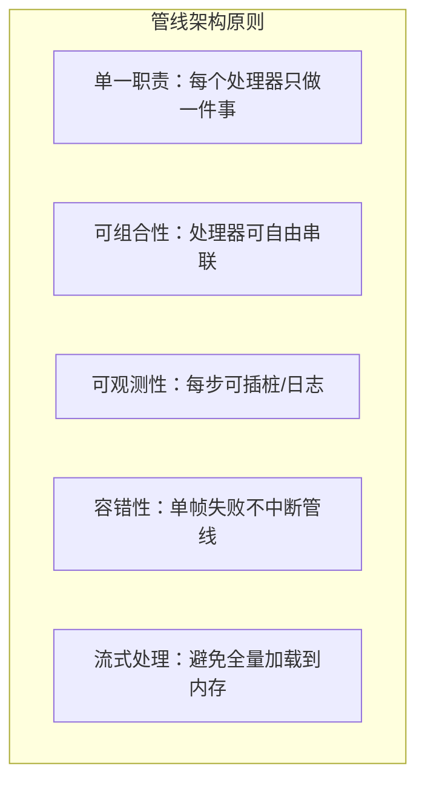
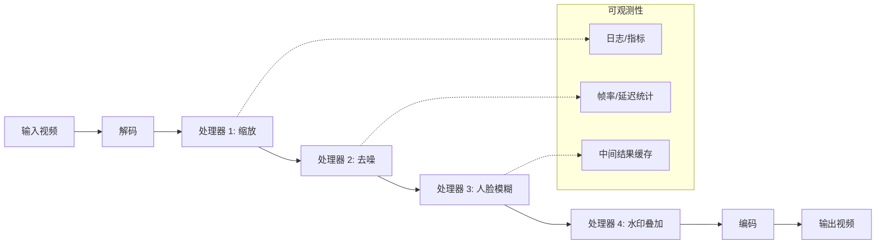
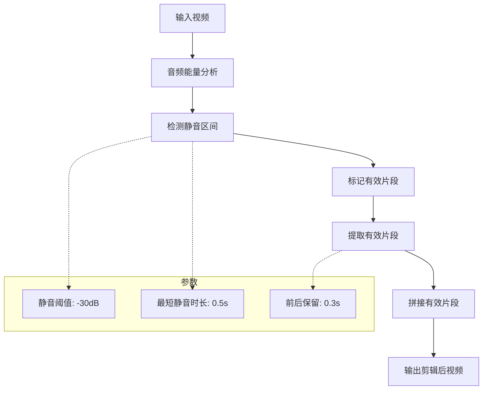
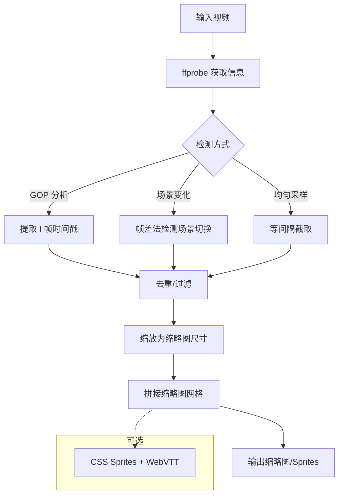
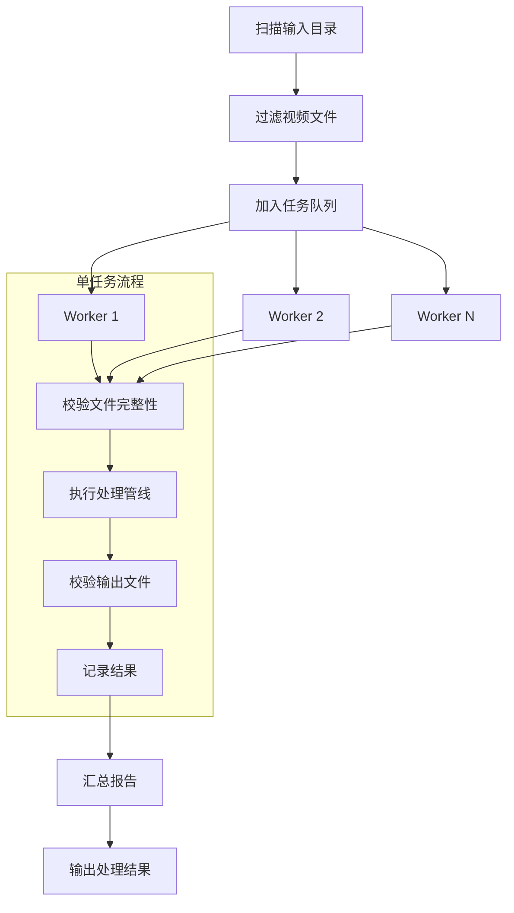
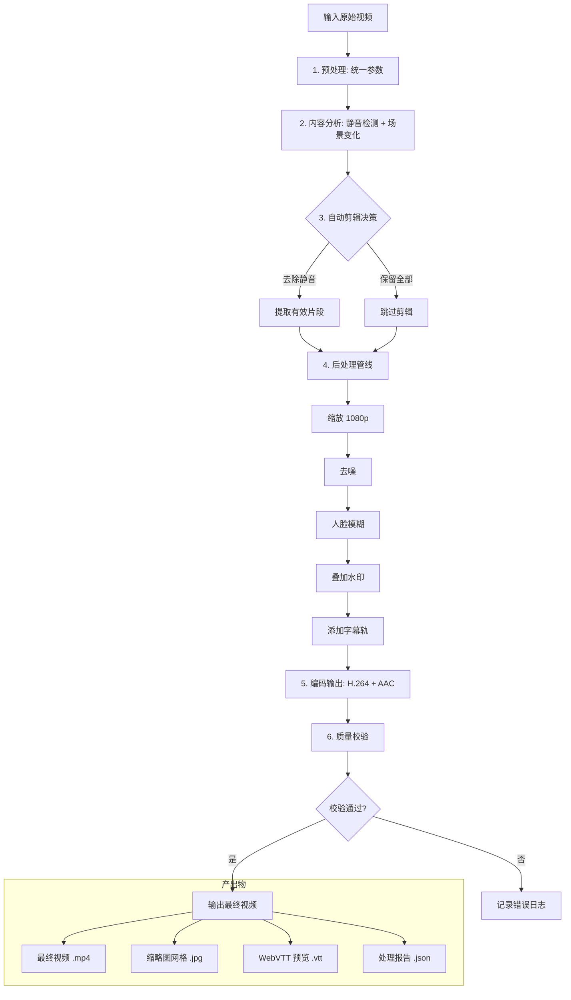

# Python 视频处理指南

## 概述

视频可以看作**连续图像的序列**。当连续图像切换足够快时（主流认为每秒 24 帧），人眼就会感受到平滑的运动视觉效果。



| 参数 | 含义 | 常见值 |
|------|------|--------|
| 分辨率 | 每帧的像素数量 | 1080p (1920×1080)、720p、4K (3840×2160) |
| 帧率 (FPS) | 每秒显示的帧数 | 24 (电影)、30 (视频)、60 (游戏画面) |
| 码率 | 每秒编码后的数据量 | 2-8 Mbps (1080p H.264) |
| 编码格式 | 视频压缩算法 | H.264、H.265/HEVC、VP9、AV1 |
| 封装格式 | 容器，可包含多轨道 | MP4、AVI、MKV、MOV |
| GOP 大小 | 两个关键帧之间的帧数 | 250 (默认)、1 (全关键帧) |
| 色彩空间 | 像素值的编码方式 | YUV420P、RGB24、NV12 |

## Python 视频处理库对比

| 库 | 定位 | 优势 | 适用场景 |
|---|------|------|---------|
| **moviepy** | 视频编辑 | API 最友好，剪辑/特效/合成一体 | 快速剪辑、特效、水印 |
| **OpenCV** | 帧级处理 | 逐帧分析、物体检测、人脸跟踪 | 计算机视觉、实时处理 |
| **ffmpeg-python** | ffmpeg 的 Python 封装 | 调用 ffmpeg 的全部功能 | 格式转换、复杂滤镜、管线编排 |
| **av (PyAV)** | FFmpeg 的 Pythonic 绑定 | 直接操作流/包/帧，零子进程开销 | 高性能帧遍历、流级处理 |



## moviepy：视频编辑器

```bash
# ⚠️ 本文 moviepy 示例基于 1.x API。moviepy 2.0（2024-11）起有破坏性变更：
# - moviepy.editor 命名空间被移除，改为 from moviepy import VideoFileClip
# - set_* 系列方法更名为 with_*（set_start→with_start、set_position→with_position、set_duration→with_duration 等）
# - clip.fx 与 vfx 函数被移除，改为 clip.with_effects([vfx.MultiplySpeed(2)]) 等效果类
# - subclip → subclipped、resize → resized、TextClip 需要传入字体文件路径
pip install "moviepy<2"   # 复现本文示例请安装 1.x
# 需要安装 ffmpeg 和 ImageMagick（文字特效需要）
# brew install ffmpeg imagemagick
```

### 基本操作

```python
from moviepy.editor import VideoFileClip, concatenate_videoclips, vfx
from moviepy.video.io.ffmpeg_tools import ffmpeg_extract_subclip

# 加载视频
clip = VideoFileClip('input.mp4')
print(f'时长: {clip.duration:.1f}秒')
print(f'分辨率: {clip.size}')
print(f'帧率: {clip.fps}')

# 裁剪
sub_clip = clip.subclip(10, 30)  # 10秒到30秒
sub_clip.write_videofile('clip.mp4')

# 音频提取
clip.audio.write_audiofile('audio.mp3')

# 截图
clip.save_frame('screenshot.png', t=5)  # 第 5 秒

# 音量调整
clip = clip.volumex(0.5)  # 音量减半

# FPS 与分辨率
clip = clip.set_fps(30)
clip = clip.resize(height=720)  # 保持宽高比缩放到720p

# 变速
clip_speedup = clip.fx(vfx.speedx, 2.0)    # 2x 加速
clip_slowmo = clip.fx(vfx.speedx, 0.5)     # 0.5x 慢放

# 格式转换
clip.write_videofile('output.mp4', codec='libx264', bitrate='2000k')
clip.write_gif('output.gif', fps=10)  # 导出 GIF
```

### 视频拼接与裁剪

```python
from moviepy.editor import VideoFileClip, concatenate_videoclips, CompositeVideoClip

# ---- 顺序拼接 ----
clip1 = VideoFileClip('part1.mp4')
clip2 = VideoFileClip('part2.mp4')
final = concatenate_videoclips([clip1, clip2])
final.write_videofile('merged.mp4')

# ---- 带转场效果的拼接 ----
# 交叉淡入淡出（Crossfade）
crossfade_duration = 1.0  # 1秒交叉过渡
clip1 = VideoFileClip('part1.mp4')
clip2 = VideoFileClip('part2.mp4')

# clip1 末尾淡出，clip2 开头淡入，交叉重叠
clip1_out = clip1.crossfadeout(crossfade_duration)
clip2_in = clip2.crossfadein(crossfade_duration)

# 通过 CompositeVideoClip 实现交叉过渡
final = CompositeVideoClip([
    clip1_out.set_start(0),
    clip2_in.set_start(clip1.duration - crossfade_duration)
])
final.write_videofile('crossfade_merged.mp4')

# ---- 使用 concatenate_videoclips 的 transition 参数 ----
# moviepy 1.0.3+ 支持 padding 和 method 参数
clips = [clip1, clip2, VideoFileClip('part3.mp4')]
final = concatenate_videoclips(
    clips,
    method='compose',      # compose 模式支持不同分辨率
    padding=-0.5           # 片段间重叠 0.5 秒（负值 = 重叠）
)

# ---- 裁剪黑边 ----
from moviepy.video.fx.crop import crop

def crop_black_bars(clip):
    """自动裁剪黑边"""
    clip = crop(
        clip,
        x_center=clip.w/2,
        y_center=clip.h/2,
        width=clip.w * 0.9,
        height=clip.h * 0.9
    )
    return clip
```

### 精确拼接与时间码对齐

```python
"""
精确拼接的关键：
1. 统一编码参数（分辨率、帧率、编码器）
2. 使用关键帧对齐（避免花屏/绿帧）
3. 处理音频间隙（避免爆音）
"""
from moviepy.editor import VideoFileClip, concatenate_videoclips
import subprocess

def ensure_uniform(source_path, target_path, width=1920, height=1080, fps=30):
    """预处理：统一分辨率、帧率、编码"""
    cmd = [
        'ffmpeg', '-i', source_path,
        '-vf', f'scale={width}:{height}:force_original_aspect_ratio=decrease,pad={width}:{height}:(ow-iw)/2:(oh-ih)/2',
        '-r', str(fps),
        '-c:v', 'libx264', '-preset', 'fast', '-crf', '23',
        '-c:a', 'aac', '-ar', '44100', '-ac', '2',
        '-y', target_path
    ]
    subprocess.run(cmd, check=True)

# 先统一参数再拼接，避免拼接处花屏
sources = ['clip1.mp4', 'clip2.mp4', 'clip3.mp4']
uniform = [f'uniform_{i}.mp4' for i in range(len(sources))]
for src, dst in zip(sources, uniform):
    ensure_uniform(src, dst)

clips = [VideoFileClip(f) for f in uniform]
final = concatenate_videoclips(clips, method='compose')
final.write_videofile('precise_merge.mp4', codec='libx264', audio_codec='aac')
```

### 特效处理

```python
from moviepy.editor import VideoFileClip, vfx

clip = VideoFileClip('input.mp4')

# 镜像翻转
mirror = clip.fx(vfx.mirror_x)     # 水平镜像

# 亮度调整
bright = clip.fx(vfx.colorx, 1.5)  # 1.0 = 原值

# 淡入淡出
faded = clip.fadein(2).fadeout(3)   # 2秒淡入, 3秒淡出

# 旋转
rotated = clip.rotate(45, expand=True)

# 黑白
bw = clip.fx(vfx.blackwhite)

# 反转颜色
invert = clip.fx(vfx.invert_colors)

# 冻结帧（画面定格）
frozen = clip.freeze(t=5, freeze_duration=3)  # 第5秒定格3秒

# 时间镜像（倒放效果）
# 注意：倒放需要先将整个视频读入内存
reversed_clip = clip.fx(vfx.time_mirror)
```

### 水印

```python
from moviepy.editor import VideoFileClip, TextClip, ImageClip, CompositeVideoClip

clip = VideoFileClip('video.mp4')

# 文字水印
txt = (TextClip('© 版权所有', fontsize=24, color='white', font='Arial')
       .set_duration(clip.duration)
       .set_position(('right', 'bottom'))  # 右下角
       .margin(right=20, bottom=20, opacity=0))

# 图片水印
logo = (ImageClip('logo.png')
        .set_duration(clip.duration)
        .resize(height=50)
        .set_position(('left', 'top'))
        .margin(left=20, top=20, opacity=0))

# 动态水印（随时间移动位置）
def moving_watermark(t):
    """水印从左到右缓慢移动"""
    x = int((t / clip.duration) * (clip.w - 100))
    return (x, clip.h - 60)

watermark = (TextClip('WATERMARK', fontsize=30, color='white', font='Arial')
             .set_duration(clip.duration)
             .set_position(moving_watermark)
             .set_opacity(0.5))

result = CompositeVideoClip([clip, txt, logo, watermark])
result.write_videofile('watermarked.mp4')
```

## ffmpeg-python：高级管线编排

`ffmpeg-python` 是 ffmpeg 命令行的 Pythonic 封装，能用 Python 表达 ffmpeg 的全部功能，包括多轨处理、复杂滤镜链和管线编排。

```bash
pip install ffmpeg-python
# 前置依赖：系统安装 ffmpeg
# brew install ffmpeg   # macOS
# apt install ffmpeg    # Ubuntu
```

### 基础用法

```python
import ffmpeg

# 探测视频信息
probe = ffmpeg.probe('input.mp4')
video_info = next(s for s in probe['streams'] if s['codec_type'] == 'video')
print(f"分辨率: {video_info['width']}x{video_info['height']}")
print(f"编码: {video_info['codec_name']}")
print(f"帧率: {video_info['r_frame_rate']}")

# 格式转换
(ffmpeg
 .input('input.avi')
 .output('output.mp4', vcodec='libx264', crf=23, preset='medium',
         acodec='aac', ar=44100)
 .run()
)

# 提取音频
(ffmpeg
 .input('input.mp4')
 .output('audio.mp3', acodec='libmp3lame', ab='192k')
 .run()
)

# 提取视频（静音）
(ffmpeg
 .input('input.mp4')
 .output('silent.mp4', an=None)  # an = no audio
 .run()
)
```

### 多轨处理

```python
import ffmpeg

# ---- 多音频轨嵌入 ----
# 将视频轨 + 主音频 + 旁白音频 + 背景音乐写入 MKV（MKV 支持多音频轨）
video = ffmpeg.input('movie.mp4')
commentary = ffmpeg.input('commentary.mp3')
bgm = ffmpeg.input('bgm.mp3')

(ffmpeg
 .output(video.video, video.audio, commentary.audio, bgm.audio,
         'multi_audio.mkv',
         map=['0', '1:a', '2:a'],  # 0=视频+主音频，1:a=旁白，2:a=BGM
         **{'metadata:s:a:0': 'language=chi',
            'metadata:s:a:1': 'language=eng',
            'metadata:s:a:2': 'language=jpn'})
 .run()
)

# ---- 多字幕轨嵌入 ----
video = ffmpeg.input('movie.mp4')
sub_chi = ffmpeg.input('sub_chi.srt')
sub_eng = ffmpeg.input('sub_eng.srt')

(ffmpeg
 .output(video, sub_chi, sub_eng, 'with_subs.mkv',
         map=['0', '1:s', '2:s'],
         **{'c:s:0': 'ass'}, **{'c:s:1': 'ass'},
         **{'metadata:s:s:0': 'language=chi'},
         **{'metadata:s:s:1': 'language=eng'})
 .run()
)

# ---- 替换音频轨 ----
video = ffmpeg.input('video_no_audio.mp4')
new_audio = ffmpeg.input('new_audio.mp3')

(ffmpeg
 .output(video.video, new_audio.audio, 'replaced.mp4',
         vcodec='copy', acodec='aac', shortest=None)
 .run()
)

# ---- 音频混流（多路音频混合） ----
voice = ffmpeg.input('voiceover.wav')
bgm = ffmpeg.input('bgm.mp3')

mixed = ffmpeg.filter(
    [voice.audio, bgm.audio], 'amix',
    inputs=2,
    duration='first',      # 以较长音频为准
    dropout_transition=2,   # 混合过渡时间
    weights='1.0 0.3'      # 语音权重1.0, BGM权重0.3
)

(ffmpeg
 .output(mixed, 'mixed_audio.mp3', acodec='libmp3lame', ab='192k')
 .run()
)
```

### 关键帧提取

```python
import ffmpeg
import json

# ---- 方式一：使用 ffprobe 提取关键帧时间戳 ----
def extract_keyframe_timestamps(video_path):
    """提取所有关键帧的时间戳"""
    probe = ffmpeg.probe(
        video_path,
        select_streams='v',
        show_entries='frame=pict_type,pts_time',
        of='json'
    )
    keyframes = []
    for frame in probe['frames']:
        if frame.get('pict_type') == 'I':
            keyframes.append(float(frame['pts_time']))
    return keyframes

timestamps = extract_keyframe_timestamps('input.mp4')
print(f"关键帧数量: {len(timestamps)}")
print(f"前5个关键帧时间: {timestamps[:5]}")

# ---- 方式二：将关键帧导出为图片 ----
def export_keyframes(video_path, output_dir='keyframes'):
    """将所有关键帧导出为 PNG 图片"""
    import os
    os.makedirs(output_dir, exist_ok=True)

    (ffmpeg
     .input(video_path)
     .output(f'{output_dir}/keyframe_%04d.png',
             vf='select=eq(pict_type\\,I)',  # 仅选择 I 帧
             vsync='vfr',                      # 可变帧率（保持原始时间戳）
             frame_pts=1)                      # 使用时间戳命名
     .run()
    )

# ---- 方式三：基于场景变化检测提取关键帧 ----
def extract_scene_changes(video_path, threshold=0.3):
    """检测场景变化并提取关键帧时间戳"""
    import subprocess, json

    cmd = [
        'ffprobe', video_path,
        '-select_streams', 'v:0',
        '-show_entries', 'frame=pts_time',
        '-of', 'json',
        '-vf', f'select=gt(scene\\,{threshold})'  # 场景变化阈值
    ]
    result = subprocess.run(cmd, capture_output=True, text=True)
    data = json.loads(result.stdout)
    return [float(f['pts_time']) for f in data.get('frames', [])]

# ---- 关键帧间隔分析 ----
def analyze_gop_structure(video_path):
    """分析 GOP 结构：关键帧间隔分布"""
    probe = ffmpeg.probe(
        video_path,
        select_streams='v',
        show_entries='frame=pict_type,pts_time',
        of='json'
    )

    gop_sizes = []
    last_keyframe_pts = 0.0

    for frame in probe['frames']:
        if frame.get('pict_type') == 'I':
            if last_keyframe_pts > 0:
                gop_sizes.append(float(frame['pts_time']) - last_keyframe_pts)
            last_keyframe_pts = float(frame['pts_time'])

    if gop_sizes:
        print(f"GOP 数量: {len(gop_sizes)}")
        print(f"平均 GOP 时长: {sum(gop_sizes)/len(gop_sizes):.2f}s")
        print(f"最大 GOP 时长: {max(gop_sizes):.2f}s")
        print(f"最小 GOP 时长: {min(gop_sizes):.2f}s")

    return gop_sizes
```

### 复杂滤镜链

```python
import ffmpeg

# ---- 画中画（Picture-in-Picture） ----
main = ffmpeg.input('main.mp4')
overlay = ffmpeg.input('overlay.mp4')

# 将叠加视频缩放到右下角 1/4 大小
overlay_small = overlay.video.filter('scale', 320, 180)
# 启用 pad 以避免边缘溢出
padded = overlay_small.filter('pad', 320, 180)

result = ffmpeg.overlay(main.video, padded,
                        x='main_w-overlay_w-20',
                        y='main_h-overlay_h-20',
                        enable='between(t,5,30)')  # 仅5-30秒显示

(ffmpeg
 .output(result, main.audio, 'pip.mp4', vcodec='libx264', crf=23)
 .run()
)

# ---- 分屏（多视频并排） ----
left = ffmpeg.input('left.mp4')
right = ffmpeg.input('right.mp4')

# 统一分辨率后水平拼接
left_scaled = left.video.filter('scale', 960, 1080)
right_scaled = right.video.filter('scale', 960, 1080)

stacked = ffmpeg.filter([left_scaled, right_scaled], 'hstack')

(ffmpeg
 .output(stacked, left.audio, 'split_screen.mp4', vcodec='libx264')
 .run()
)

# ---- 动态缩放 + 旋转 + 边框滤镜链 ----
input_stream = ffmpeg.input('input.mp4')

filtered = (input_stream.video
            .filter('scale', 1280, 720)
            .filter('pad', 1280, 720, '(ow-iw)/2', '(oh-ih)/2', color='black')
            .filter('drawbox', x=10, y=10, w='iw-20', h='ih-20',
                    color='red', thickness=3)
            .filter('drawtext', text='Timestamp %{pts\\:hms}',
                    x=10, y=10, fontsize=24, fontcolor='white',
                    shadowcolor='black', shadowx=1, shadowy=1))

(ffmpeg
 .output(filtered, input_stream.audio, 'filtered.mp4',
         vcodec='libx264', crf=23, acodec='copy')
 .run()
)

# ---- 去噪 + 锐化链 ----
input_stream = ffmpeg.input('noisy.mp4')

denoised = (input_stream.video
            .filter('hqdn3d', luma_spatial=4, chroma_spatial=3,
                    luma_tmp=6, chroma_tmp=4.5)   # 高质量去噪
            .filter('unsharp', luma='5:5:1.0', chroma='5:5:0.0'))  # 锐化

(ffmpeg
 .output(denoised, input_stream.audio, 'denoised_sharp.mp4',
         vcodec='libx264', crf=20, preset='slow')
 .run()
)

# ---- 色彩空间转换 + LUT 调色 ----
input_stream = ffmpeg.input('log_video.mp4')

graded = (input_stream.video
          .filter('colorspace', all='bt709', iall='bt2020',
                  fast=1)                              # 色彩空间转换
          .filter('lut3d', file='color_lut.cube'))     # 应用 LUT 文件

(ffmpeg
 .output(graded, input_stream.audio, 'graded.mp4',
         vcodec='libx264', crf=20, pix_fmt='yuv420p')
 .run()
)

# ---- 查看构建的 ffmpeg 命令（调试用） ----
cmd = ffmpeg.output(filtered, 'test.mp4').compile()
print(' '.join(cmd))  # 打印完整 ffmpeg 命令行
```

### 性能优化技巧

```python
import ffmpeg

# ---- 硬件加速编码 ----
# NVIDIA GPU (NVENC)
(ffmpeg
 .input('input.mp4', hwaccel='cuda', hwaccel_output_format='cuda')
 .output('output.mp4', vcodec='h264_nvenc', preset='p4', rc='vbr',
         cq=23, maxrate='8M', bufsize='10M', **{'b:v': '5M'})
 .run()
)

# macOS VideoToolbox
(ffmpeg
 .input('input.mp4')
 .output('output.mp4', vcodec='h264_videotoolbox',
         allow_sw='1', **{'b:v': '5M'})
 .run()
)

# ---- 多线程与管道 ----
# 使用多线程解码 + 管道输出原始帧
process = (
    ffmpeg
    .input('input.mp4', thread_queue_size=1024)
    .output('pipe:', format='rawvideo', pix_fmt='rgb24',
            loglevel='quiet')
    .run_async(pipe_stdout=True)
)

# 逐帧读取原始数据（配合 NumPy 处理）
import numpy as np
width, height = 1920, 1080
while True:
    raw = process.stdout.read(width * height * 3)
    if not raw:
        break
    frame = np.frombuffer(raw, dtype=np.uint8).reshape((height, width, 3))
    # ... 对 frame 进行 NumPy/OpenCV 处理 ...

process.wait()

# ---- 二次编码（Two-Pass）获取最优质量 ----
# Pass 1：分析
(ffmpeg
 .input('input.mp4')
 .output('/dev/null', vcodec='libx264', f='null',
         preset='slow', **{'pass': 1, 'b:v': '5M'})
 .run()
)

# Pass 2：编码
(ffmpeg
 .input('input.mp4')
 .output('output.mp4', vcodec='libx264',
         preset='slow', acodec='copy', **{'pass': 2, 'b:v': '5M'})
 .run()
)
```

## 字幕提取 (OCR)

```python
# 使用 paddlehub OCR 提取视频字幕
# pip install paddlehub paddlepaddle

import paddlehub as hub
import cv2

ocr = hub.Module(name='chinese_ocr_db_crnn_mobile')

vid = cv2.VideoCapture('video.mp4')
fps = vid.get(cv2.CAP_PROP_FPS)
frame_count = int(vid.get(cv2.CAP_PROP_FRAME_COUNT))

for i in range(0, frame_count, int(fps)):  # 每秒取一帧
    vid.set(cv2.CAP_PROP_POS_FRAMES, i)
    ret, frame = vid.read()
    if not ret:
        break

    results = ocr.recognize_text(images=[frame])
    if results[0]['data']:
        for item in results[0]['data']:
            print(f'{i/fps:.0f}s: {item["text"]} (置信度: {item["confidence"]:.2f})')
```

### 字幕去重与时间轴合并

```python
"""OCR 提取的字幕往往连续多帧重复，需要去重并合并时间区间"""
from collections import defaultdict

def deduplicate_subtitles(ocr_results: list[dict]) -> list[dict]:
    """
    将连续重复的字幕文本合并为一条，生成 SRT 格式的时间轴。
    ocr_results: [{'time': float, 'text': str}, ...]
    """
    if not ocr_results:
        return []

    deduped = []
    current_text = ocr_results[0]['text']
    start_time = ocr_results[0]['time']
    end_time = start_time

    for item in ocr_results[1:]:
        if item['text'] == current_text:
            end_time = item['time']  # 延续同一字幕
        else:
            deduped.append({
                'text': current_text,
                'start': start_time,
                'end': end_time
            })
            current_text = item['text']
            start_time = item['time']
            end_time = start_time

    # 最后一条
    deduped.append({
        'text': current_text,
        'start': start_time,
        'end': end_time
    })

    return deduped


def format_srt(subtitles: list[dict], output_path: str):
    """将去重后的字幕写入 SRT 文件"""
    def fmt_time(seconds):
        h = int(seconds // 3600)
        m = int((seconds % 3600) // 60)
        s = int(seconds % 60)
        ms = int((seconds % 1) * 1000)
        return f'{h:02d}:{m:02d}:{s:02d},{ms:03d}'

    with open(output_path, 'w', encoding='utf-8') as f:
        for idx, sub in enumerate(subtitles, 1):
            f.write(f'{idx}\n')
            f.write(f'{fmt_time(sub["start"])} --> {fmt_time(sub["end"])}\n')
            f.write(f'{sub["text"]}\n\n')
```

## OpenCV 逐帧处理

```python
import cv2

vid = cv2.VideoCapture('input.mp4')
fps = vid.get(cv2.CAP_PROP_FPS)
width = int(vid.get(cv2.CAP_PROP_FRAME_WIDTH))
height = int(vid.get(cv2.CAP_PROP_FRAME_HEIGHT))

# 逐帧处理并写入新视频
fourcc = cv2.VideoWriter_fourcc(*'mp4v')
out = cv2.VideoWriter('output.mp4', fourcc, fps, (width, height))

while True:
    ret, frame = vid.read()
    if not ret:
        break

    # 帧处理逻辑
    gray = cv2.cvtColor(frame, cv2.COLOR_BGR2GRAY)
    edge = cv2.Canny(gray, 100, 200)
    edge_bgr = cv2.cvtColor(edge, cv2.COLOR_GRAY2BGR)

    out.write(edge_bgr)

vid.release()
out.release()
```

### 人脸检测与模糊

```python
import cv2

# 加载预训练的人脸检测器
face_cascade = cv2.CascadeClassifier(
    cv2.data.haarcascades + 'haarcascade_frontalface_default.xml'
)

vid = cv2.VideoCapture('input.mp4')
fps = vid.get(cv2.CAP_PROP_FPS)
width = int(vid.get(cv2.CAP_PROP_FRAME_WIDTH))
height = int(vid.get(cv2.CAP_PROP_FRAME_HEIGHT))
fourcc = cv2.VideoWriter_fourcc(*'mp4v')
out = cv2.VideoWriter('blurred_faces.mp4', fourcc, fps, (width, height))

while True:
    ret, frame = vid.read()
    if not ret:
        break

    gray = cv2.cvtColor(frame, cv2.COLOR_BGR2GRAY)
    faces = face_cascade.detectMultiScale(gray, 1.1, 4)

    for (x, y, w, h) in faces:
        # 对人脸区域进行高斯模糊
        face_region = frame[y:y+h, x:x+w]
        blurred = cv2.GaussianBlur(face_region, (99, 99), 30)
        frame[y:y+h, x:x+w] = blurred

    out.write(frame)

vid.release()
out.release()
```

### 场景变化检测

```python
import cv2
import numpy as np

def detect_scene_changes(video_path, threshold=30.0):
    """
    基于帧差法检测场景变化。
    返回场景切换的时间戳列表。
    """
    cap = cv2.VideoCapture(video_path)
    fps = cap.get(cv2.CAP_PROP_FPS)

    ret, prev_frame = cap.read()
    if not ret:
        return []

    prev_gray = cv2.cvtColor(prev_frame, cv2.COLOR_BGR2GRAY)
    scene_changes = []
    frame_idx = 1

    while True:
        ret, frame = cap.read()
        if not ret:
            break

        gray = cv2.cvtColor(frame, cv2.COLOR_BGR2GRAY)

        # 计算帧间差异
        diff = cv2.absdiff(prev_gray, gray)
        mean_diff = np.mean(diff)

        if mean_diff > threshold:
            timestamp = frame_idx / fps
            scene_changes.append(timestamp)

        prev_gray = gray
        frame_idx += 1

    cap.release()
    return scene_changes
```

## 视频处理管线架构设计

### 架构原则



### 管线基础框架

```python
"""
视频处理管线框架

设计理念：
- 将视频处理拆解为可组合的处理步骤（Processor）
- 管线（Pipeline）负责编排步骤的执行顺序
- 支持帧级并行、错误恢复和中间结果缓存
"""
from abc import ABC, abstractmethod
from dataclasses import dataclass, field
from pathlib import Path
from typing import Optional
import logging
import time

import cv2
import numpy as np

logger = logging.getLogger(__name__)


@dataclass
class FramePacket:
    """帧数据包：在管线中流转的基本单元"""
    index: int                    # 帧序号
    timestamp: float              # 时间戳（秒）
    image: np.ndarray             # BGR 图像
    metadata: dict = field(default_factory=dict)  # 附加元数据

    @property
    def width(self) -> int:
        return self.image.shape[1]

    @property
    def height(self) -> int:
        return self.image.shape[0]


class FrameProcessor(ABC):
    """帧处理器基类"""

    @abstractmethod
    def process(self, packet: FramePacket) -> Optional[FramePacket]:
        """
        处理一帧数据。
        返回 None 表示丢弃该帧，返回修改后的 FramePacket 表示继续传递。
        """
        ...

    def on_start(self) -> None:
        """管线启动时调用（初始化资源）"""
        pass

    def on_end(self) -> None:
        """管线结束时调用（释放资源）"""
        pass


class VideoPipeline:
    """
    视频处理管线

    用法:
        pipeline = VideoPipeline()
        pipeline.add(ResizeProcessor(1280, 720))
        pipeline.add(GrayScaleProcessor())
        pipeline.run('input.mp4', 'output.mp4')
    """

    def __init__(self, name: str = 'default'):
        self.name = name
        self.processors: list[FrameProcessor] = []
        self.stats = {'total_frames': 0, 'dropped_frames': 0, 'errors': 0}

    def add(self, processor: FrameProcessor) -> 'VideoPipeline':
        """添加处理器（链式调用）"""
        self.processors.append(processor)
        return self

    def run(self, input_path: str, output_path: str,
            fps: Optional[int] = None,
            codec: str = 'mp4v') -> dict:
        """执行管线"""
        cap = cv2.VideoCapture(input_path)
        source_fps = cap.get(cv2.CAP_PROP_FPS)
        width = int(cap.get(cv2.CAP_PROP_FRAME_WIDTH))
        height = int(cap.get(cv2.CAP_PROP_FRAME_HEIGHT))
        output_fps = fps or source_fps

        # 自动检测输出分辨率（由第一个 ResizeProcessor 决定）
        out_width, out_height = width, height
        for p in self.processors:
            if isinstance(p, ResizeProcessor):
                out_width = p.target_width
                out_height = p.target_height
                break

        fourcc = cv2.VideoWriter_fourcc(*codec)
        writer = cv2.VideoWriter(output_path, fourcc, output_fps,
                                 (out_width, out_height))

        # 启动所有处理器
        for p in self.processors:
            p.on_start()

        frame_idx = 0
        start_time = time.time()

        try:
            while True:
                ret, frame = cap.read()
                if not ret:
                    break

                packet = FramePacket(
                    index=frame_idx,
                    timestamp=frame_idx / source_fps,
                    image=frame
                )

                # 依次通过每个处理器
                for processor in self.processors:
                    try:
                        packet = processor.process(packet)
                        if packet is None:
                            self.stats['dropped_frames'] += 1
                            break
                    except Exception as e:
                        logger.error(f"Processor {processor.__class__.__name__} "
                                     f"failed at frame {frame_idx}: {e}")
                        self.stats['errors'] += 1
                        break

                if packet is not None:
                    writer.write(packet.image)

                frame_idx += 1

        finally:
            for p in self.processors:
                p.on_end()
            cap.release()
            writer.release()

        elapsed = time.time() - start_time
        self.stats['total_frames'] = frame_idx
        self.stats['elapsed_seconds'] = round(elapsed, 2)
        self.stats['fps'] = round(frame_idx / elapsed, 1) if elapsed > 0 else 0

        logger.info(f"Pipeline '{self.name}' completed: {self.stats}")
        return self.stats


# ---- 内置处理器 ----

class ResizeProcessor(FrameProcessor):
    """缩放处理器"""

    def __init__(self, target_width: int, target_height: int):
        self.target_width = target_width
        self.target_height = target_height

    def process(self, packet: FramePacket) -> FramePacket:
        packet.image = cv2.resize(
            packet.image, (self.target_width, self.target_height)
        )
        return packet


class GrayScaleProcessor(FrameProcessor):
    """灰度处理器"""

    def process(self, packet: FramePacket) -> FramePacket:
        gray = cv2.cvtColor(packet.image, cv2.COLOR_BGR2GRAY)
        packet.image = cv2.cvtColor(gray, cv2.COLOR_GRAY2BGR)
        return packet


class EdgeDetectionProcessor(FrameProcessor):
    """边缘检测处理器"""

    def __init__(self, low_threshold: int = 100, high_threshold: int = 200):
        self.low = low_threshold
        self.high = high_threshold

    def process(self, packet: FramePacket) -> FramePacket:
        gray = cv2.cvtColor(packet.image, cv2.COLOR_BGR2GRAY)
        edges = cv2.Canny(gray, self.low, self.high)
        packet.image = cv2.cvtColor(edges, cv2.COLOR_GRAY2BGR)
        return packet


class BlurProcessor(FrameProcessor):
    """高斯模糊处理器"""

    def __init__(self, kernel_size: int = 15):
        self.kernel_size = kernel_size

    def process(self, packet: FramePacket) -> FramePacket:
        packet.image = cv2.GaussianBlur(
            packet.image, (self.kernel_size, self.kernel_size), 0
        )
        return packet


class FaceBlurProcessor(FrameProcessor):
    """人脸模糊处理器"""

    def __init__(self, scale_factor: float = 1.1, min_neighbors: int = 4):
        self.scale_factor = scale_factor
        self.min_neighbors = min_neighbors
        self.cascade = None

    def on_start(self) -> None:
        self.cascade = cv2.CascadeClassifier(
            cv2.data.haarcascades + 'haarcascade_frontalface_default.xml'
        )

    def process(self, packet: FramePacket) -> FramePacket:
        gray = cv2.cvtColor(packet.image, cv2.COLOR_BGR2GRAY)
        faces = self.cascade.detectMultiScale(
            gray, self.scale_factor, self.min_neighbors
        )
        for (x, y, w, h) in faces:
            region = packet.image[y:y+h, x:x+w]
            packet.image[y:y+h, x:x+w] = cv2.GaussianBlur(region, (99, 99), 30)
            packet.metadata.setdefault('faces', []).append(
                {'x': int(x), 'y': int(y), 'w': int(w), 'h': int(h)}
            )
        return packet


# ---- 管线使用示例 ----
def demo_pipeline():
    pipeline = VideoPipeline(name='edge_detection')
    pipeline.add(ResizeProcessor(1280, 720))
    pipeline.add(EdgeDetectionProcessor(50, 150))
    stats = pipeline.run('input.mp4', 'edges.mp4')
    print(stats)
```

### 管线编排流程



## 视频处理管线实战案例

### 实战一：自动剪辑（基于静音检测）



```python
"""
自动剪辑：基于音频静音检测，自动去除无声片段
适用场景：会议录像、课程录屏、播客剪辑
"""
import ffmpeg
import json
from dataclasses import dataclass
from typing import List, Tuple


@dataclass
class Segment:
    """视频片段"""
    start: float  # 起始时间（秒）
    end: float    # 结束时间（秒）

    @property
    def duration(self) -> float:
        return self.end - self.start


def detect_silence(video_path: str,
                   noise_threshold: float = -30,
                   min_silence_duration: float = 0.5) -> List[Segment]:
    """
    使用 ffmpeg silencedetect 滤镜检测静音区间。
    noise_threshold: 噪声阈值（dB），低于此值视为静音
    min_silence_duration: 最短静音持续时间（秒）
    """
    cmd = [
        'ffmpeg', '-i', video_path,
        '-af', f'silencedetect=noise={noise_threshold}dB:'
               f'd={min_silence_duration}',
        '-f', 'null', '-'
    ]

    import subprocess
    result = subprocess.run(cmd, capture_output=True, text=True)
    stderr = result.stderr

    # 解析 silencedetect 输出
    silence_starts = []
    silence_ends = []

    for line in stderr.split('\n'):
        if 'silence_start' in line:
            start = float(line.split('silence_start:')[1].strip().split()[0])
            silence_starts.append(start)
        elif 'silence_end' in line:
            end = float(line.split('silence_end:')[1].strip().split()[0])
            silence_ends.append(end)

    # 构建静音片段
    silences = []
    for i in range(len(silence_starts)):
        start = silence_starts[i]
        end = silence_ends[i] if i < len(silence_ends) else float('inf')
        silences.append(Segment(start, end))

    return silences


def get_active_segments(video_path: str,
                        silences: List[Segment],
                        padding: float = 0.3) -> List[Segment]:
    """
    从静音区间反推有效（有声）区间。
    padding: 每段保留前后 padding 秒的缓冲。
    """
    probe = ffmpeg.probe(video_path)
    duration = float(probe['format']['duration'])

    active = []
    current_start = 0.0

    for silence in silences:
        # 有声区间 = 当前起点 到 静音起点（加缓冲）
        segment_end = silence.start + padding
        if segment_end > current_start:
            active.append(Segment(current_start, min(segment_end, duration)))

        current_start = silence.end - padding  # 静音结束后（减缓冲）

    # 最后一段
    if current_start < duration:
        active.append(Segment(current_start, duration))

    return active


def auto_edit(video_path: str, output_path: str,
              noise_threshold: float = -30,
              min_silence_duration: float = 0.5,
              padding: float = 0.3):
    """
    自动剪辑主函数。
    1. 检测静音区间
    2. 计算有效片段
    3. 使用 ffmpeg 拼接
    """
    # Step 1: 检测静音
    silences = detect_silence(video_path, noise_threshold, min_silence_duration)
    print(f"检测到 {len(silences)} 个静音区间")

    # Step 2: 获取有效片段
    active_segments = get_active_segments(video_path, silences, padding)
    print(f"保留 {len(active_segments)} 个有效片段")

    total_active = sum(s.duration for s in active_segments)
    probe = ffmpeg.probe(video_path)
    total_duration = float(probe['format']['duration'])
    print(f"原始时长: {total_duration:.1f}s -> 剪辑后: {total_active:.1f}s "
          f"(节省 {(1 - total_active/total_duration)*100:.0f}%)")

    # Step 3: 使用 ffmpeg 拼接
    import tempfile, os

    # 生成 concat 文件
    concat_file = tempfile.NamedTemporaryFile(
        mode='w', suffix='.txt', delete=False
    )
    for seg in active_segments:
        concat_file.write(
            f"file '{os.path.abspath(video_path)}'\n"
            f"inpoint {seg.start}\n"
            f"outpoint {seg.end}\n"
        )
    concat_file.close()

    # 执行拼接
    (ffmpeg
     .input(concat_file.name, format='concat', safe=0)
     .output(output_path, c='copy')
     .run()
    )

    os.unlink(concat_file.name)
    print(f"剪辑完成: {output_path}")


# 使用示例
# auto_edit('meeting.mp4', 'meeting_edited.mp4',
#           noise_threshold=-30, min_silence_duration=0.5, padding=0.3)
```

### 实战二：关键帧提取与缩略图生成



```python
"""
关键帧提取与缩略图网格生成
适用场景：视频预览、内容审核、进度条预览图
"""
import ffmpeg
import cv2
import numpy as np
from pathlib import Path
from typing import List, Tuple
import math


def extract_keyframes_opencv(video_path: str,
                             method: str = 'scene',
                             threshold: float = 30.0,
                             interval: float = 5.0) -> List[Tuple[float, np.ndarray]]:
    """
    提取关键帧。
    method: 'scene' (场景变化), 'interval' (等间隔), 'gop' (I帧)
    返回: [(timestamp, frame_image), ...]
    """
    cap = cv2.VideoCapture(video_path)
    fps = cap.get(cv2.CAP_PROP_FPS)
    total_frames = int(cap.get(cv2.CAP_PROP_FRAME_COUNT))

    keyframes = []

    if method == 'interval':
        # 等间隔采样
        frame_interval = int(fps * interval)
        for idx in range(0, total_frames, frame_interval):
            cap.set(cv2.CAP_PROP_POS_FRAMES, idx)
            ret, frame = cap.read()
            if ret:
                keyframes.append((idx / fps, frame))

    elif method == 'scene':
        # 场景变化检测
        ret, prev_frame = cap.read()
        if not ret:
            cap.release()
            return []

        prev_gray = cv2.cvtColor(prev_frame, cv2.COLOR_BGR2GRAY)
        keyframes.append((0.0, prev_frame))

        for idx in range(1, total_frames):
            ret, frame = cap.read()
            if not ret:
                break

            gray = cv2.cvtColor(frame, cv2.COLOR_BGR2GRAY)
            diff = cv2.absdiff(prev_gray, gray)
            mean_diff = np.mean(diff)

            if mean_diff > threshold:
                keyframes.append((idx / fps, frame))

            prev_gray = gray

    elif method == 'gop':
        # 使用 ffmpeg 提取 I 帧
        import subprocess, json
        cmd = [
            'ffprobe', video_path,
            '-select_streams', 'v:0',
            '-show_entries', 'frame=pts_time,pict_type',
            '-of', 'json'
        ]
        result = subprocess.run(cmd, capture_output=True, text=True)
        data = json.loads(result.stdout)

        i_frame_times = [
            float(f['pts_time'])
            for f in data.get('frames', [])
            if f.get('pict_type') == 'I'
        ]

        for t in i_frame_times:
            cap.set(cv2.CAP_PROP_POS_FRAMES, int(t * fps))
            ret, frame = cap.read()
            if ret:
                keyframes.append((t, frame))

    cap.release()
    return keyframes


def generate_thumbnail_grid(keyframes: List[Tuple[float, np.ndarray]],
                            thumb_width: int = 160,
                            columns: int = 5,
                            padding: int = 4,
                            output_path: str = 'thumbnails.jpg') -> str:
    """
    将关键帧拼接为缩略图网格。
    """
    if not keyframes:
        raise ValueError("No keyframes to generate grid")

    thumbnails = []
    for ts, frame in keyframes:
        h, w = frame.shape[:2]
        thumb_h = int(thumb_width * h / w)
        thumb = cv2.resize(frame, (thumb_width, thumb_h))

        # 在缩略图上叠加时间戳
        text = f'{ts:.1f}s'
        cv2.putText(thumb, text, (5, thumb_h - 8),
                    cv2.FONT_HERSHEY_SIMPLEX, 0.4, (255, 255, 255), 1)
        thumbnails.append(thumb)

    # 计算网格布局
    thumb_h = thumbnails[0].shape[0]
    rows = math.ceil(len(thumbnails) / columns)

    # 创建空白画布
    grid_w = columns * thumb_width + (columns + 1) * padding
    grid_h = rows * thumb_h + (rows + 1) * padding
    grid = np.zeros((grid_h, grid_w, 3), dtype=np.uint8)

    for idx, thumb in enumerate(thumbnails):
        row = idx // columns
        col = idx % columns
        x = padding + col * (thumb_width + padding)
        y = padding + row * (thumb_h + padding)
        grid[y:y+thumb.shape[0], x:x+thumb.shape[1]] = thumb

    cv2.imwrite(output_path, grid)
    return output_path


def generate_webvtt_thumbnails(video_path: str,
                               output_dir: str = 'vtt_thumbs',
                               interval: float = 5.0,
                               thumb_width: int = 160) -> Tuple[str, str]:
    """
    生成 WebVTT 缩略图（用于视频播放器进度条预览）。
    返回: (vtt_file_path, sprite_image_path)
    """
    Path(output_dir).mkdir(exist_ok=True)

    # 等间隔提取关键帧
    keyframes = extract_keyframes_opencv(
        video_path, method='interval', interval=interval
    )

    if not keyframes:
        raise ValueError("No keyframes extracted")

    # 计算每帧缩略图尺寸
    thumb_h = int(thumb_width * keyframes[0][1].shape[0]
                  / keyframes[0][1].shape[1])

    columns = 5
    rows = math.ceil(len(keyframes) / columns)

    # 生成 Sprite 图
    sprite_path = f'{output_dir}/sprite.jpg'
    sprite = np.zeros((
        rows * thumb_h + (rows + 1) * 2,
        columns * thumb_width + (columns + 1) * 2,
        3
    ), dtype=np.uint8)

    vtt_lines = ['WEBVTT', '']

    for idx, (ts, frame) in enumerate(keyframes):
        thumb = cv2.resize(frame, (thumb_width, thumb_h))

        row = idx // columns
        col = idx % columns
        x = 2 + col * (thumb_width + 2)
        y = 2 + row * (thumb_h + 2)
        sprite[y:y+thumb_h, x:x+thumb_width] = thumb

        # WebVTT 时间格式
        m, s = divmod(ts, 60)
        h, m = divmod(m, 60)
        start_time = f'{int(h):02d}:{int(m):02d}:{s:06.3f}'

        next_ts = keyframes[idx + 1][0] if idx + 1 < len(keyframes) else ts + interval
        m2, s2 = divmod(next_ts, 60)
        h2, m2 = divmod(m2, 60)
        end_time = f'{int(h2):02d}:{int(m2):02d}:{s2:06.3f}'

        vtt_lines.append(f'{start_time} --> {end_time}')
        vtt_lines.append(f'sprite.jpg#xywh={x},{y},{thumb_width},{thumb_h}')
        vtt_lines.append('')

    cv2.imwrite(sprite_path, sprite)

    vtt_path = f'{output_dir}/thumbnails.vtt'
    with open(vtt_path, 'w') as f:
        f.write('\n'.join(vtt_lines))

    return vtt_path, sprite_path


# 使用示例
# keyframes = extract_keyframes_opencv('movie.mp4', method='scene', threshold=25)
# generate_thumbnail_grid(keyframes, output_path='movie_thumbs.jpg')
# generate_webvtt_thumbnails('movie.mp4', output_dir='movie_vtt')
```

### 实战三：批量视频处理



```python
"""
批量视频处理框架
适用场景：批量转码、批量加水印、批量截图、批量格式转换
"""
import os
import json
import time
import logging
import subprocess
from pathlib import Path
from dataclasses import dataclass, field, asdict
from concurrent.futures import ProcessPoolExecutor, as_completed
from typing import Callable, Optional

import ffmpeg

logger = logging.getLogger(__name__)

VIDEO_EXTENSIONS = {'.mp4', '.avi', '.mkv', '.mov', '.flv', '.wmv', '.webm'}


@dataclass
class TaskResult:
    """单个文件的处理结果"""
    input_path: str
    output_path: str
    success: bool
    duration_seconds: float = 0.0
    error_message: str = ''
    metadata: dict = field(default_factory=dict)


class BatchProcessor:
    """
    批量视频处理器

    用法:
        processor = BatchProcessor(
            input_dir='raw_videos',
            output_dir='processed',
            process_fn=my_process_function
        )
        results = processor.run(max_workers=4)
    """

    def __init__(self,
                 input_dir: str,
                 output_dir: str,
                 process_fn: Callable[[str, str], dict],
                 pattern: str = '**/*'):
        self.input_dir = Path(input_dir)
        self.output_dir = Path(output_dir)
        self.process_fn = process_fn
        self.pattern = pattern
        self.results: List[TaskResult] = []

    def scan_files(self) -> list[Path]:
        """扫描目录中的视频文件"""
        files = []
        for f in self.input_dir.glob(self.pattern):
            if f.suffix.lower() in VIDEO_EXTENSIONS:
                files.append(f)
        logger.info(f"扫描到 {len(files)} 个视频文件")
        return sorted(files)

    def validate_video(self, path: Path) -> bool:
        """校验视频文件是否完整可读"""
        try:
            probe = ffmpeg.probe(str(path))
            return 'streams' in probe and len(probe['streams']) > 0
        except Exception:
            return False

    def _process_single(self, input_path: str, output_path: str) -> TaskResult:
        """处理单个文件（供子进程调用）"""
        start = time.time()
        try:
            metadata = self.process_fn(input_path, output_path)
            elapsed = time.time() - start
            return TaskResult(
                input_path=input_path,
                output_path=output_path,
                success=True,
                duration_seconds=round(elapsed, 2),
                metadata=metadata or {}
            )
        except Exception as e:
            elapsed = time.time() - start
            return TaskResult(
                input_path=input_path,
                output_path=output_path,
                success=False,
                duration_seconds=round(elapsed, 2),
                error_message=str(e)
            )

    def run(self, max_workers: int = 1, skip_invalid: bool = True) -> list[TaskResult]:
        """
        执行批量处理。
        max_workers: 并行进程数
        skip_invalid: 是否跳过校验失败的文件
        """
        self.output_dir.mkdir(parents=True, exist_ok=True)
        files = self.scan_files()
        self.results = []

        # 构建任务列表
        tasks = []
        for f in files:
            if skip_invalid and not self.validate_video(f):
                logger.warning(f"跳过无效文件: {f}")
                self.results.append(TaskResult(
                    input_path=str(f), output_path='',
                    success=False, error_message='Invalid video file'
                ))
                continue

            output_path = str(self.output_dir / f"{f.stem}_processed{f.suffix}")
            tasks.append((str(f), output_path))

        # 并行执行
        with ProcessPoolExecutor(max_workers=max_workers) as executor:
            futures = {
                executor.submit(self._process_single, inp, out): (inp, out)
                for inp, out in tasks
            }

            for future in as_completed(futures):
                result = future.result()
                status = "OK" if result.success else "FAIL"
                logger.info(f"[{status}] {result.input_path} "
                            f"({result.duration_seconds}s)")
                self.results.append(result)

        # 汇总报告
        self._print_summary()
        return self.results

    def _print_summary(self):
        """打印汇总报告"""
        total = len(self.results)
        success = sum(1 for r in self.results if r.success)
        failed = total - success
        total_time = sum(r.duration_seconds for r in self.results)

        print(f"\n{'='*50}")
        print(f"批量处理完成")
        print(f"总计: {total} | 成功: {success} | 失败: {failed}")
        print(f"总耗时: {total_time:.1f}s")
        if failed > 0:
            print(f"\n失败文件:")
            for r in self.results:
                if not r.success:
                    print(f"  - {r.input_path}: {r.error_message}")
        print(f"{'='*50}")

    def save_report(self, output_path: str = 'batch_report.json'):
        """保存处理报告为 JSON"""
        report = {
            'timestamp': time.strftime('%Y-%m-%d %H:%M:%S'),
            'total': len(self.results),
            'success': sum(1 for r in self.results if r.success),
            'failed': sum(1 for r in self.results if not r.success),
            'results': [asdict(r) for r in self.results]
        }
        with open(output_path, 'w', encoding='utf-8') as f:
            json.dump(report, f, ensure_ascii=False, indent=2)


# ---- 批量处理函数示例 ----

def process_transcode(input_path: str, output_path: str) -> dict:
    """批量转码：统一为 H.264 + AAC 的 MP4"""
    probe = ffmpeg.probe(input_path)
    video_stream = next(
        (s for s in probe['streams'] if s['codec_type'] == 'video'), None
    )

    (ffmpeg
     .input(input_path)
     .output(output_path,
             vcodec='libx264', preset='medium', crf=23,
             acodec='aac', ar=44100, ac=2,
             movflags='faststart')     # Web 友好：moov atom 前置
     .run(overwrite_output=True)
    )

    return {
        'original_codec': video_stream['codec_name'] if video_stream else None,
        'original_size': os.path.getsize(input_path),
        'output_size': os.path.getsize(output_path)
    }


def process_watermark(input_path: str, output_path: str) -> dict:
    """批量加水印"""
    watermark_path = 'watermark.png'  # 水印图片路径

    input_video = ffmpeg.input(input_path)
    watermark = ffmpeg.input(watermark_path)

    # 水印缩放至视频宽度的 15%
    probe = ffmpeg.probe(input_path)
    width = next(s for s in probe['streams']
                 if s['codec_type'] == 'video')['width']
    wm_width = int(width * 0.15)

    overlay = watermark.video.filter('scale', wm_width, -1)

    result = ffmpeg.overlay(
        input_video.video, overlay,
        x='main_w-overlay_w-20',
        y='main_h-overlay_h-20'
    )

    (ffmpeg
     .output(result, input_video.audio, output_path,
             vcodec='libx264', crf=23, acodec='copy')
     .run(overwrite_output=True)
    )

    return {'watermark_applied': True}


def process_screenshot(input_path: str, output_path: str) -> dict:
    """批量截图：每 10 秒截取一张"""
    probe = ffmpeg.probe(input_path)
    duration = float(probe['format']['duration'])

    output_dir = Path(output_path).parent / 'screenshots' / Path(input_path).stem
    output_dir.mkdir(parents=True, exist_ok=True)

    (ffmpeg
     .input(input_path)
     .output(str(output_dir / 'ss_%04d.jpg'),
             vf='fps=1/10',           # 每10秒1帧
             **{'q:v': 2})            # JPEG 高质量
     .run(overwrite_output=True)
    )

    count = len(list(output_dir.glob('*.jpg')))
    return {'screenshots': count, 'output_dir': str(output_dir)}


# ---- 使用示例 ----
def demo_batch():
    # 批量转码
    processor = BatchProcessor(
        input_dir='raw_videos',
        output_dir='transcoded',
        process_fn=process_transcode
    )
    results = processor.run(max_workers=2)
    processor.save_report('transcode_report.json')

    # 批量加水印
    # wm_processor = BatchProcessor('videos', 'watermarked', process_watermark)
    # wm_processor.run(max_workers=1)

    # 批量截图
    # ss_processor = BatchProcessor('videos', 'screenshots', process_screenshot)
    # ss_processor.run(max_workers=4)
```

### 实战四：视频处理完整管线（综合案例）



```python
"""
综合视频处理管线：自动剪辑 + 关键帧提取 + 批量处理
将前面所有模块组合为一个端到端的处理管线
"""
import json
import logging
import time
from dataclasses import dataclass, field, asdict
from pathlib import Path
from typing import Optional

import ffmpeg
import cv2
import numpy as np

logger = logging.getLogger(__name__)


@dataclass
class PipelineConfig:
    """管线配置"""
    # 预处理
    target_width: int = 1920
    target_height: int = 1080
    target_fps: int = 30

    # 自动剪辑
    auto_edit: bool = True
    silence_threshold_db: float = -30
    min_silence_duration: float = 0.5
    padding_seconds: float = 0.3

    # 后处理
    denoise: bool = True
    face_blur: bool = False
    watermark_path: Optional[str] = None
    subtitle_path: Optional[str] = None

    # 输出
    output_codec: str = 'libx264'
    output_crf: int = 23
    output_preset: str = 'medium'
    output_audio_codec: str = 'aac'
    output_audio_bitrate: str = '192k'

    # 缩略图
    generate_thumbnails: bool = True
    thumbnail_interval: float = 5.0


class VideoProcessingPipeline:
    """
    端到端视频处理管线

    流程: 预处理 -> 内容分析 -> 自动剪辑 -> 后处理 -> 编码输出 -> 质量校验
    """

    def __init__(self, config: PipelineConfig = None):
        self.config = config or PipelineConfig()
        self.report = {
            'steps': [],
            'start_time': None,
            'end_time': None,
        }

    def _record_step(self, step_name: str, duration: float, details: dict = None):
        self.report['steps'].append({
            'step': step_name,
            'duration_seconds': round(duration, 2),
            'details': details or {}
        })

    def run(self, input_path: str, output_dir: str) -> dict:
        """
        执行完整管线。
        返回处理报告。
        """
        self.report['start_time'] = time.strftime('%Y-%m-%d %H:%M:%S')
        self.report['input'] = input_path

        output_dir = Path(output_dir)
        output_dir.mkdir(parents=True, exist_ok=True)

        current_file = input_path

        try:
            # Step 1: 预处理
            current_file = self._preprocess(current_file, output_dir)

            # Step 2: 内容分析 + 自动剪辑
            if self.config.auto_edit:
                current_file = self._auto_edit(current_file, output_dir)

            # Step 3: 后处理
            current_file = self._postprocess(current_file, output_dir)

            # Step 4: 编码输出
            final_path = self._encode(current_file, output_dir)

            # Step 5: 生成缩略图
            if self.config.generate_thumbnails:
                self._generate_thumbnails(final_path, output_dir)

            # Step 6: 质量校验
            self._validate_output(final_path)

            self.report['output'] = final_path
            self.report['success'] = True

        except Exception as e:
            logger.error(f"Pipeline failed: {e}")
            self.report['success'] = False
            self.report['error'] = str(e)

        self.report['end_time'] = time.strftime('%Y-%m-%d %H:%M:%S')

        # 保存报告
        report_path = output_dir / 'pipeline_report.json'
        with open(report_path, 'w', encoding='utf-8') as f:
            json.dump(self.report, f, ensure_ascii=False, indent=2)

        return self.report

    def _preprocess(self, input_path: str, output_dir: Path) -> str:
        """预处理：统一分辨率、帧率、编码"""
        start = time.time()
        output_path = str(output_dir / '01_preprocessed.mp4')

        w, h = self.config.target_width, self.config.target_height
        fps = self.config.target_fps

        (ffmpeg
         .input(input_path)
         .output(output_path,
                 vf=f'scale={w}:{h}:force_original_aspect_ratio=decrease,'
                    f'pad={w}:{h}:(ow-iw)/2:(oh-ih)/2',
                 r=fps,
                 vcodec='libx264', preset='fast', crf=23,
                 acodec='aac', ar=44100, ac=2,
                 movflags='faststart')
         .run(overwrite_output=True)
        )

        self._record_step('preprocess', time.time() - start,
                          {'output': output_path})
        return output_path

    def _auto_edit(self, input_path: str, output_dir: Path) -> str:
        """自动剪辑：去除静音片段"""
        start = time.time()
        output_path = str(output_dir / '02_auto_edited.mp4')

        # 复用前面的静音检测逻辑
        from subprocess import run as sp_run

        cmd = [
            'ffmpeg', '-i', input_path,
            '-af', f'silencedetect=noise={self.config.silence_threshold_db}dB:'
                   f'd={self.config.min_silence_duration}',
            '-f', 'null', '-'
        ]
        result = sp_run(cmd, capture_output=True, text=True)
        stderr = result.stderr

        silence_starts, silence_ends = [], []
        for line in stderr.split('\n'):
            if 'silence_start' in line:
                t = float(line.split('silence_start:')[1].strip().split()[0])
                silence_starts.append(t)
            elif 'silence_end' in line:
                t = float(line.split('silence_end:')[1].strip().split()[0])
                silence_ends.append(t)

        if not silence_starts:
            # 无静音，跳过剪辑
            self._record_step('auto_edit', time.time() - start,
                              {'skipped': True, 'reason': 'no silence detected'})
            return input_path

        # 构建 concat 文件
        probe = ffmpeg.probe(input_path)
        duration = float(probe['format']['duration'])
        padding = self.config.padding_seconds

        import tempfile
        concat_file = tempfile.NamedTemporaryFile(
            mode='w', suffix='.txt', delete=False
        )

        current_start = 0.0
        segment_count = 0

        for i, ss in enumerate(silence_starts):
            seg_end = ss + padding
            if seg_end > current_start:
                concat_file.write(
                    f"file '{input_path}'\n"
                    f"inpoint {current_start}\n"
                    f"outpoint {min(seg_end, duration)}\n"
                )
                segment_count += 1
            se = silence_ends[i] if i < len(silence_ends) else duration
            current_start = max(se - padding, 0)

        if current_start < duration:
            concat_file.write(
                f"file '{input_path}'\n"
                f"inpoint {current_start}\n"
                f"outpoint {duration}\n"
            )
            segment_count += 1

        concat_file.close()

        (ffmpeg
         .input(concat_file.name, format='concat', safe=0)
         .output(output_path, c='copy')
         .run(overwrite_output=True)
        )

        import os
        os.unlink(concat_file.name)

        self._record_step('auto_edit', time.time() - start,
                          {'segments': segment_count,
                           'silences_detected': len(silence_starts)})
        return output_path

    def _postprocess(self, input_path: str, output_dir: Path) -> str:
        """后处理：去噪、水印等"""
        start = time.time()
        output_path = str(output_dir / '03_postprocessed.mp4')

        stream = ffmpeg.input(input_path)
        video = stream.video

        # 去噪
        if self.config.denoise:
            video = video.filter('hqdn3d', luma_spatial=4, chroma_spatial=3)

        # 叠加水印
        if self.config.watermark_path:
            watermark = ffmpeg.input(self.config.watermark_path)
            probe = ffmpeg.probe(input_path)
            width = next(s for s in probe['streams']
                         if s['codec_type'] == 'video')['width']
            wm_width = int(width * 0.15)
            wm_scaled = watermark.video.filter('scale', wm_width, -1)
            video = ffmpeg.overlay(
                video, wm_scaled,
                x='main_w-overlay_w-20',
                y='main_h-overlay_h-20'
            )

        outputs = [video, stream.audio]

        # 字幕
        kwargs = {}
        if self.config.subtitle_path:
            sub_input = ffmpeg.input(self.config.subtitle_path)
            outputs.append(sub_input)
            kwargs['c:s'] = 'mov_text'
            kwargs['metadata:s:s:0'] = 'language=chi'

        (ffmpeg
         .output(*outputs, output_path,
                 vcodec=self.config.output_codec,
                 crf=self.config.output_crf,
                 preset=self.config.output_preset,
                 acodec=self.config.output_audio_codec,
                 **kwargs)
         .run(overwrite_output=True)
        )

        self._record_step('postprocess', time.time() - start,
                          {'denoise': self.config.denoise,
                           'watermark': bool(self.config.watermark_path),
                           'subtitle': bool(self.config.subtitle_path)})
        return output_path

    def _encode(self, input_path: str, output_dir: Path) -> str:
        """最终编码输出"""
        start = time.time()
        output_path = str(output_dir / 'final.mp4')

        (ffmpeg
         .input(input_path)
         .output(output_path,
                 vcodec=self.config.output_codec,
                 crf=self.config.output_crf,
                 preset=self.config.output_preset,
                 acodec=self.config.output_audio_codec,
                 ar=44100, ac=2,
                 movflags='faststart',
                 pix_fmt='yuv420p')
         .run(overwrite_output=True)
        )

        self._record_step('encode', time.time() - start,
                          {'output': output_path})
        return output_path

    def _generate_thumbnails(self, video_path: str, output_dir: Path):
        """生成缩略图和 WebVTT"""
        start = time.time()
        thumb_dir = output_dir / 'thumbnails'
        thumb_dir.mkdir(exist_ok=True)

        # 等间隔截图
        (ffmpeg
         .input(video_path)
         .output(str(thumb_dir / 'thumb_%04d.jpg'),
                 vf=f'fps=1/{self.config.thumbnail_interval}',
                 **{'q:v': 2})
         .run(overwrite_output=True)
        )

        count = len(list(thumb_dir.glob('*.jpg')))

        # 生成缩略图网格
        images = sorted(thumb_dir.glob('*.jpg'))
        if images:
            import math
            cols = 5
            thumb_w = 160
            frames = [cv2.imread(str(p)) for p in images[:50]]
            frames = [cv2.resize(f, (thumb_w, int(thumb_w * f.shape[0] / f.shape[1])))
                      for f in frames if f is not None]

            if frames:
                thumb_h = frames[0].shape[0]
                rows = math.ceil(len(frames) / cols)
                grid = np.zeros((rows * thumb_h, cols * thumb_w, 3),
                                dtype=np.uint8)
                for idx, frame in enumerate(frames):
                    r, c = divmod(idx, cols)
                    y, x = r * thumb_h, c * thumb_w
                    grid[y:y+thumb_h, x:x+thumb_w] = frame

                cv2.imwrite(str(output_dir / 'thumbnail_grid.jpg'), grid)

        self._record_step('thumbnails', time.time() - start,
                          {'count': count})

    def _validate_output(self, output_path: str):
        """校验输出文件"""
        start = time.time()

        probe = ffmpeg.probe(output_path)
        has_video = any(s['codec_type'] == 'video' for s in probe['streams'])
        has_audio = any(s['codec_type'] == 'audio' for s in probe['streams'])
        duration = float(probe['format']['duration'])

        if not has_video:
            raise ValueError("Output file has no video stream")

        self._record_step('validate', time.time() - start,
                          {'has_video': has_video, 'has_audio': has_audio,
                           'duration': duration})


# ---- 使用示例 ----
def demo_full_pipeline():
    config = PipelineConfig(
        auto_edit=True,
        denoise=True,
        watermark_path='logo.png',
        generate_thumbnails=True,
    )

    pipeline = VideoProcessingPipeline(config)
    report = pipeline.run('raw_meeting.mp4', 'output/')

    print(f"处理{'成功' if report['success'] else '失败'}")
    for step in report['steps']:
        print(f"  {step['step']}: {step['duration_seconds']}s - {step['details']}")
```

## 常见陷阱

| 陷阱 | 说明 | 正确做法 |
|------|------|---------|
| 缺少编解码器 | `write_videofile` 失败 | 确保 ffmpeg 正确安装 |
| 音频视频不同步 | 处理时音频和视频分离 | 使用 `clip.set_audio()` 手动对齐 |
| 大视频内存溢出 | moviepy 全帧加载 | 使用 OpenCV/ffmpeg-python 逐帧处理 |
| GIF 文件过大 | 未压缩直接导出 | 限制帧率和尺寸 |
| 拼接处花屏 | 片段编码参数不一致 | 先统一参数再拼接 |
| 关键帧缺失 | 精确 seek 后画面灰色 | 使用 `-ss` 放在 `-i` 前做输入级跳转 |
| ffmpeg-python 管道死锁 | stdout 缓冲区满 | 使用 `run_async` + 异步读取 |
| 批量处理中断 | 单文件错误导致全部中断 | 每个文件独立 try/except，记录错误继续 |

## 性能优化清单

| 场景 | 优化手段 | 预期收益 |
|------|---------|---------|
| 大视频逐帧处理 | 使用 ffmpeg pipe 模式代替 moviepy | 内存降低 90%+ |
| 格式转换 | 硬件加速 (NVENC/VideoToolbox) | 速度提升 3-10x |
| 高质量输出 | 二次编码 (Two-Pass) | 同码率下质量更优 |
| 批量处理 | ProcessPoolExecutor 多进程 | CPU 利用率接近 100% |
| Web 视频 | `movflags=faststart` | 首帧加载速度提升 |
| 进度条预览 | WebVTT + Sprite 缩略图 | 无需实时截图 |
| 长视频剪辑 | concat 协议 + `c=copy` | 秒级完成（无需重编码） |

## 延伸阅读

- [moviepy 官方文档](https://zulko.github.io/moviepy/)
- [OpenCV Python 视频教程](https://docs.opencv.org/master/dd/d43/tutorial_py_video_display.html)
- [ffmpeg 滤镜文档](https://ffmpeg.org/ffmpeg-filters.html)
- [ffmpeg-python GitHub](https://github.com/kkroening/ffmpeg-python)
- [PyAV 文档](https://pyav.org/docs/stable/)
- [ffmpeg 硬件加速指南](https://trac.ffmpeg.org/wiki/HWAccelIntro)
- [WebVTT 规范](https://w3c.github.io/webvtt/)

## 版本差异（自动化办公库 → 当前稳定版）

| 库 | 本文编写时 | 当前稳定版（截至 2026-09） |
|----|-----------|-----------|
| `openpyxl`（Excel） | 旧版 | 3.1.x |
| `python-docx`（Word） | 旧版 | 1.2.x |
| `python-pptx`（PPT） | 旧版 | 1.0.x |
| `reportlab`（PDF） | 旧版 | 5.x |
| `PyPDF2`/`pypdf` | PyPDF2 | 推荐 `pypdf`（6.x，PyPDF2 已停止维护） |
| `Pillow`（图像） | 旧版 | 12.x |
| `moviepy` | 1.x | 2.x（2.0 起移除 `moviepy.editor`、`set_*`→`with_*`、`clip.fx`→`with_effects`，见本文警示） |

> 本文讲解的自动化办公流程（读写 Excel/Word/PDF/PPT）与核心 API 在最新版本中成立；注意 PyPDF2 已迁移至 pypdf。
