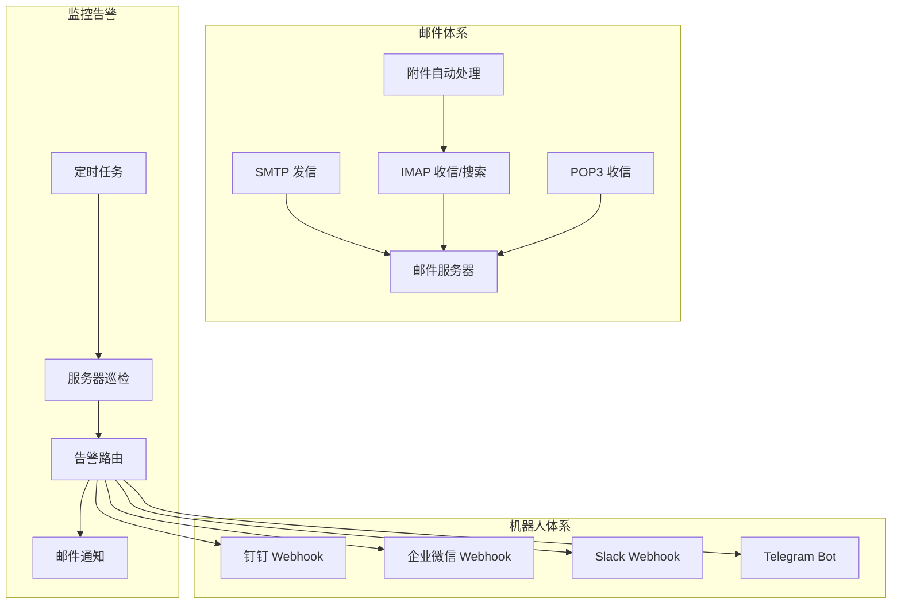
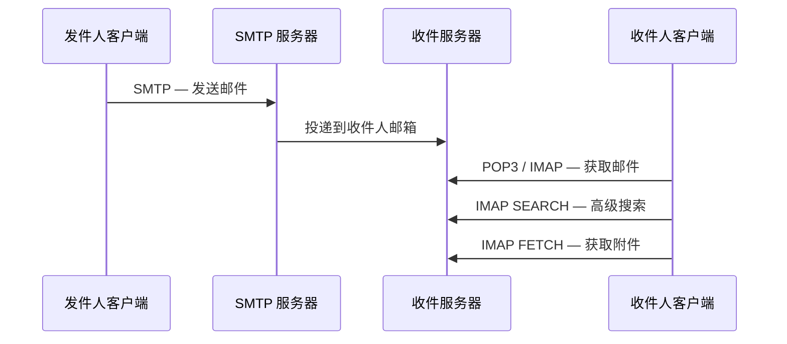
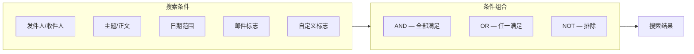
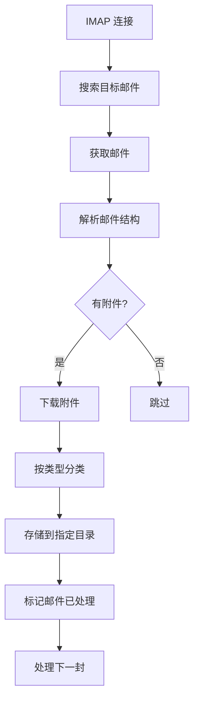

# Python 邮件与机器人自动化指南

## 概述

本章涵盖两大自动化通信场景：**邮件收发** 和 **即时通讯机器人**，并在此基础上构建完整的监控告警系统。



## 邮件协议



| 协议 | 端口 | 方向 | 用途 | 特点 |
|------|------|------|------|------|
| SMTP | 25/465(SSL)/587(TLS) | 客户端→服务器 | 发送邮件 | 支持 HTML、附件、多收件人 |
| POP3 | 110/995(SSL) | 服务器→客户端 | 下载邮件 | 下载后通常从服务器删除，离线访问 |
| IMAP | 143/993(SSL) | 服务器→客户端 | 管理邮件 | 保留在服务器，支持搜索、文件夹、标志位 |

## 发送邮件

```bash
pip install yagmail  # 最简洁的邮件发送库（推荐）
```

### yagmail 快速发送

```python
import yagmail

# 初始化（密码为 SMTP 授权码，非邮箱登录密码）
yag = yagmail.SMTP(
    user='your_email@qq.com',
    password='your_authorization_code',  # QQ邮箱需开启SMTP并获取授权码
    host='smtp.qq.com',
    port=465,
)

# 发送纯文本
yag.send(
    to='receiver@example.com',
    subject='测试邮件',
    contents='这是一封测试邮件'
)

# 发送 HTML 邮件
yag.send(
    to='receiver@example.com',
    subject='HTML 测试',
    contents='<h1>标题</h1><p>这是 <b>HTML</b> 邮件</p>'
)

# 发送带附件
yag.send(
    to='receiver@example.com',
    subject='附件测试',
    contents='请查收附件',
    attachments=['report.pdf', 'image.png']
)

# 群发
yag.send(
    to=['a@qq.com', 'b@qq.com', 'c@company.com'],
    subject='群发测试',
    contents='这是一封群发邮件'
)

# 抄送与密送
yag.send(
    to='receiver@example.com',
    cc='cc@example.com',
    bcc='bcc@example.com',
    subject='带抄送的邮件',
    contents='请查阅'
)
```

### smtplib 标准库发送

```python
import smtplib
from email.mime.text import MIMEText
from email.mime.multipart import MIMEMultipart
from email.mime.base import MIMEBase
from email import encoders
from email.utils import formataddr, formatdate

def send_html_mail(sender, password, receiver, subject, html_body,
                   attachments=None, cc=None, bcc=None, reply_to=None):
    """发送带附件的 HTML 邮件（标准库实现）

    Args:
        sender: 发件人邮箱
        password: SMTP 授权码
        receiver: 收件人（字符串或列表）
        subject: 邮件主题
        html_body: HTML 正文
        attachments: 附件路径列表
        cc: 抄送列表
        bcc: 密送列表
        reply_to: 回复地址
    """
    msg = MIMEMultipart()
    msg['From'] = formataddr(('自动化系统', sender))
    msg['To'] = ', '.join(receiver) if isinstance(receiver, list) else receiver
    msg['Subject'] = subject
    msg['Date'] = formatdate(localtime=True)

    if cc:
        msg['Cc'] = ', '.join(cc) if isinstance(cc, list) else cc
    if reply_to:
        msg['Reply-To'] = reply_to

    msg.attach(MIMEText(html_body, 'html', 'utf-8'))

    # 添加附件
    for filepath in (attachments or []):
        with open(filepath, 'rb') as f:
            part = MIMEBase('application', 'octet-stream')
            part.set_payload(f.read())
            encoders.encode_base64(part)
            # 处理中文文件名
            import os
            filename = os.path.basename(filepath)
            part.add_header(
                'Content-Disposition', 'attachment',
                filename=('utf-8', '', filename)
            )
            msg.attach(part)

    # 合并所有收件人
    all_recipients = []
    all_recipients += [receiver] if isinstance(receiver, str) else receiver
    all_recipients += [cc] if isinstance(cc, str) else (cc or [])
    all_recipients += [bcc] if isinstance(bcc, str) else (bcc or [])

    with smtplib.SMTP_SSL('smtp.qq.com', 465) as server:
        server.login(sender, password)
        server.sendmail(sender, all_recipients, msg.as_string())

    print(f'邮件已发送到 {receiver}')

# 使用
send_html_mail(
    sender='your_email@qq.com',
    password='authorization_code',
    receiver='recipient@example.com',
    subject='带附件的 HTML 邮件',
    html_body='''
    <h2>月度报告</h2>
    <table border="1" cellpadding="6" style="border-collapse: collapse;">
        <tr style="background-color: #4CAF50; color: white;">
            <th>项目</th><th>进度</th><th>负责人</th>
        </tr>
        <tr><td>项目A</td><td>80%</td><td>张三</td></tr>
        <tr><td>项目B</td><td>60%</td><td>李四</td></tr>
    </table>
    ''',
    attachments=['monthly_report.xlsx'],
    cc=['manager@example.com'],
    reply_to='noreply@example.com',
)
```

### 常用 SMTP 服务器配置

| 邮箱 | SMTP 地址 | 端口 | 备注 |
|------|----------|------|------|
| QQ 邮箱 | smtp.qq.com | 465 (SSL) | 需开启 SMTP 服务，使用授权码 |
| 163 邮箱 | smtp.163.com | 465 (SSL) | 需开启 POP3/SMTP 服务 |
| Gmail | smtp.gmail.com | 587 (TLS) | 需使用应用专用密码 |
| Outlook | smtp.office365.com | 587 (TLS) | 需开启 SMTP AUTH |
| 企业微信 | smtp.exmail.qq.com | 465 (SSL) | 腾讯企业邮箱 |
| 阿里企业邮箱 | smtp.mxhichina.com | 465 (SSL) | 阿里云企业邮箱 |

## 接收邮件

### IMAP 基础接收

```python
import imaplib
import email
from email.header import decode_header

def decode_str(s):
    """解码邮件头部字段"""
    if s is None:
        return ''
    parts = decode_header(s)
    result = []
    for data, charset in parts:
        if isinstance(data, bytes):
            result.append(data.decode(charset or 'utf-8', errors='replace'))
        else:
            result.append(data)
    return ''.join(result)

def receive_emails(imap_server, email_addr, password, folder='INBOX', limit=10):
    """IMAP 接收邮件"""
    mail = imaplib.IMAP4_SSL(imap_server, 993)
    mail.login(email_addr, password)
    mail.select(folder)

    # 搜索最近 N 封邮件
    status, messages = mail.search(None, 'ALL')
    mail_ids = messages[0].split()[-limit:]

    emails = []
    for mail_id in reversed(mail_ids):
        status, msg_data = mail.fetch(mail_id, '(RFC822)')
        msg = email.message_from_bytes(msg_data[0][1])

        # 解码主题和发件人
        subject = decode_str(msg['Subject'])
        from_addr = decode_str(msg.get('From'))

        # 提取正文
        body = ''
        if msg.is_multipart():
            for part in msg.walk():
                content_type = part.get_content_type()
                if content_type == 'text/plain' and not part.get('Content-Disposition'):
                    payload = part.get_payload(decode=True)
                    charset = part.get_content_charset() or 'utf-8'
                    body = payload.decode(charset, errors='replace')
                    break
        else:
            payload = msg.get_payload(decode=True)
            charset = msg.get_content_charset() or 'utf-8'
            body = payload.decode(charset, errors='replace')

        emails.append({
            'from': from_addr,
            'subject': subject,
            'date': msg['Date'],
            'body': body[:500],
            'id': mail_id.decode(),
        })

    mail.logout()
    return emails

emails = receive_emails('imap.qq.com', 'your_email@qq.com', 'password')
for e in emails:
    print(f"发件人: {e['from']}")
    print(f"主题: {e['subject']}")
    print(f"正文预览: {e['body']}...")
    print('---')
```

### IMAP 高级搜索

IMAP 搜索是邮件自动化的核心能力，通过组合搜索条件可以精准定位目标邮件，避免全量遍历。



#### 单条件搜索

```python
import imaplib
from datetime import datetime, timedelta

mail = imaplib.IMAP4_SSL('imap.qq.com', 993)
mail.login('your_email@qq.com', 'password')
mail.select('INBOX')

# --- 常用单条件搜索 ---

# 按发件人搜索
status, data = mail.search(None, 'FROM "boss@company.com"')

# 按主题搜索（支持子串匹配）
status, data = mail.search(None, 'SUBJECT "季度报告"')

# 按收件人搜索
status, data = mail.search(None, 'TO "me@company.com"')

# 按正文内容搜索
status, data = mail.search(None, 'BODY "紧急"')

# 按日期搜索（SINCE：当天及之后；BEFORE：当天之前）
status, data = mail.search(None, 'SINCE 01-Jun-2026')
status, data = mail.search(None, 'BEFORE 01-Jun-2026')

# 按邮件标志搜索
status, data = mail.search(None, 'UNSEEN')        # 未读邮件
status, data = mail.search(None, 'SEEN')           # 已读邮件
status, data = mail.search(None, 'FLAGGED')        # 标记邮件（星标）
status, data = mail.search(None, 'UNFLAGGED')      # 未标记邮件
status, data = mail.search(None, 'ANSWERED')       # 已回复
status, data = mail.search(None, 'DELETED')        # 已删除

# 按大小搜索（大于 100KB 的邮件）
status, data = mail.search(None, 'LARGER 102400')

# 搜索草稿箱中的邮件
status, data = mail.search(None, 'DRAFT')
```

#### 条件组合搜索（AND / OR / NOT）

```python
# IMAP 使用 charset 前缀指定编码，条件间空格分隔 = AND 逻辑

# AND：来自 boss 且未读
status, data = mail.search('UTF-8', 'FROM "boss@company.com" UNSEEN')

# AND：主题含 "报告" 且日期在 2026-06-01 之后
status, data = mail.search('UTF-8', 'SUBJECT "报告" SINCE 01-Jun-2026')

# OR：来自 boss 或来自 hr
status, data = mail.search('UTF-8', 'OR FROM "boss@company.com" FROM "hr@company.com"')

# 复合 OR：主题含 "报告" 或正文含 "总结"，且未读
status, data = mail.search(
    'UTF-8',
    'OR SUBJECT "报告" BODY "总结" UNSEEN'
)

# NOT：排除来自 noreply 的邮件
status, data = mail.search('UTF-8', 'NOT FROM "noreply@"')

# 综合组合：来自公司域名 + 主题含"审批" + 未读 + 最近7天
since_date = (datetime.now() - timedelta(days=7)).strftime('%d-%b-%Y')
status, data = mail.search(
    'UTF-8',
    f'FROM "@company.com" SUBJECT "审批" UNSEEN SINCE {since_date}'
)
```

#### 日期范围搜索

```python
from datetime import datetime, timedelta

def search_by_date_range(mail, start_date, end_date):
    """搜索指定日期范围内的邮件

    Args:
        mail: IMAP 连接对象
        start_date: 起始日期（含），datetime 对象
        end_date: 结束日期（不含），datetime 对象
    """
    since_str = start_date.strftime('%d-%b-%Y')
    before_str = end_date.strftime('%d-%b-%Y')

    status, data = mail.search(
        None,
        f'SINCE {since_str} BEFORE {before_str}'
    )
    return data[0].split() if status == 'OK' else []

# 示例：搜索最近 30 天的邮件
start = datetime.now() - timedelta(days=30)
end = datetime.now() + timedelta(days=1)  # BEFORE 不含当天，+1 天
ids = search_by_date_range(mail, start, end)

# 搜索本月邮件
today = datetime.now()
month_start = today.replace(day=1)
month_end = today + timedelta(days=1)
ids = search_by_date_range(mail, month_start, month_end)

# 搜索上个月邮件
this_month_start = today.replace(day=1)
last_month_end = this_month_start
last_month_start = (this_month_start - timedelta(days=1)).replace(day=1)
ids = search_by_date_range(mail, last_month_start, last_month_end)
```

#### 自定义标志管理

```python
def manage_flags(mail, mail_id, action='add', flags=None):
    """管理邮件标志

    Args:
        mail: IMAP 连接对象
        mail_id: 邮件 ID
        action: 'add' | 'remove' | 'replace'
        flags: 标志列表，如 ['\\Flagged', 'Processed', 'Archived']
    """
    flags = flags or []
    flag_str = ' '.join(f'({f})' for f in flags)

    if action == 'add':
        mail.store(mail_id, '+FLAGS', flag_str)
    elif action == 'remove':
        mail.store(mail_id, '-FLAGS', flag_str)
    elif action == 'replace':
        mail.store(mail_id, 'FLAGS', flag_str)

# 标记为已处理（自定义标志）
manage_flags(mail, b'1', action='add', flags=['Processed'])

# 标记为星标 + 重要
manage_flags(mail, b'1', action='add', flags=['\\Flagged', 'Important'])

# 移除自定义标志
manage_flags(mail, b'1', action='remove', flags=['Processed'])

# 搜索带有自定义标志的邮件
status, data = mail.search(None, 'KEYWORD "Processed"')
status, data = mail.search(None, 'KEYWORD "Important"')

# 查看邮件当前标志
status, flags_data = mail.fetch(b'1', '(FLAGS)')
print(flags_data)  # (FLAGS (\\Seen \\Flagged Processed))

mail.logout()
```

#### 高级搜索封装

```python
class IMAPSearcher:
    """IMAP 高级搜索封装"""

    def __init__(self, imap_server, email_addr, password):
        self.mail = imaplib.IMAP4_SSL(imap_server, 993)
        self.mail.login(email_addr, password)

    def select_folder(self, folder='INBOX'):
        self.mail.select(folder)
        return self

    def search(self, *criteria, charset='UTF-8'):
        """执行搜索，返回邮件 ID 列表

        Args:
            criteria: 搜索条件，如 'UNSEEN', 'FROM "x@"', 'SINCE 01-Jun-2026'
            charset: 字符编码
        """
        query = ' '.join(criteria)
        status, data = self.mail.search(charset, query)
        if status != 'OK':
            return []
        return data[0].split()

    def search_unread_from(self, sender, days=7):
        """搜索指定发件人的未读邮件"""
        since = (datetime.now() - timedelta(days=days)).strftime('%d-%b-%Y')
        return self.search(f'FROM "{sender}"', 'UNSEEN', f'SINCE {since}')

    def search_by_subject(self, keyword, days=30):
        """按主题关键词搜索"""
        since = (datetime.now() - timedelta(days=days)).strftime('%d-%b-%Y')
        return self.search(f'SUBJECT "{keyword}"', f'SINCE {since}')

    def search_flagged_but_unanswered(self):
        """搜索已标记但未回复的邮件"""
        return self.search('FLAGGED', 'UNANSWERED')

    def search_with_custom_flag(self, flag):
        """搜索带自定义标志的邮件"""
        return self.search(f'KEYWORD "{flag}"')

    def close(self):
        self.mail.close()
        self.mail.logout()

# 使用
searcher = IMAPSearcher('imap.qq.com', 'your_email@qq.com', 'password')
searcher.select_folder('INBOX')

# 搜索老板的未读邮件
ids = searcher.search_unread_from('boss@company.com', days=7)
print(f'未读邮件数: {len(ids)}')

# 搜索主题含"报告"的邮件
ids = searcher.search_by_subject('报告', days=30)

# 搜索已标记但未回复
ids = searcher.search_flagged_but_unanswered()

searcher.close()
```

### POP3 接收

```python
import poplib
from email.parser import Parser
from email.header import decode_header

def receive_via_pop3(pop_server, email_addr, password, limit=5):
    """POP3 接收邮件"""
    server = poplib.POP3_SSL(pop_server, 995)
    server.user(email_addr)
    server.pass_(password)

    msg_count, mailbox_size = server.stat()
    print(f'邮箱共 {msg_count} 封邮件，总大小 {mailbox_size} 字节')

    start = max(1, msg_count - limit + 1)
    for i in range(start, msg_count + 1):
        resp, lines, octets = server.retr(i)
        msg_content = b'\r\n'.join(lines).decode('utf-8', errors='replace')
        msg = Parser().parsestr(msg_content)

        # 解码主题
        subject_parts = decode_header(msg['Subject'])
        subject = ''
        for data, charset in subject_parts:
            if isinstance(data, bytes):
                subject += data.decode(charset or 'utf-8', errors='replace')
            else:
                subject += data

        print(f'[{i}] 主题: {subject} | 大小: {octets} 字节')

    server.quit()
```

## 邮件附件自动处理

邮件附件的自动下载、分类和存储是办公自动化的核心场景之一。



### 附件下载与解析

```python
import imaplib
import email
import os
from email.header import decode_header
from pathlib import Path

def download_attachments(imap_server, email_addr, password,
                         save_dir='./downloads', folder='INBOX',
                         search_criteria='ALL', max_size_mb=25):
    """自动下载邮件附件

    Args:
        imap_server: IMAP 服务器地址
        email_addr: 邮箱地址
        password: 授权码
        save_dir: 附件保存目录
        folder: 邮箱文件夹
        search_criteria: IMAP 搜索条件
        max_size_mb: 附件最大大小（MB）

    Returns:
        下载结果列表
    """
    Path(save_dir).mkdir(parents=True, exist_ok=True)

    mail = imaplib.IMAP4_SSL(imap_server, 993)
    mail.login(email_addr, password)
    mail.select(folder)

    status, data = mail.search(None, search_criteria)
    mail_ids = data[0].split()

    results = []
    for mail_id in mail_ids:
        status, msg_data = mail.fetch(mail_id, '(RFC822)')
        msg = email.message_from_bytes(msg_data[0][1])

        subject = _decode_header(msg['Subject'])
        from_addr = _decode_header(msg.get('From', ''))

        for part in msg.walk():
            content_disposition = part.get('Content-Disposition', '')
            if 'attachment' not in content_disposition:
                continue

            filename = part.get_filename()
            if not filename:
                continue

            # 解码文件名
            filename = _decode_header(filename)
            if not filename:
                continue

            # 检查大小
            payload = part.get_payload(decode=True)
            if not payload:
                continue

            size_mb = len(payload) / (1024 * 1024)
            if size_mb > max_size_mb:
                print(f'跳过过大附件: {filename} ({size_mb:.1f}MB)')
                continue

            # 保存文件
            filepath = _safe_save(save_dir, filename, payload)
            results.append({
                'filename': filename,
                'filepath': filepath,
                'size_mb': round(size_mb, 2),
                'from': from_addr,
                'subject': subject,
                'mail_id': mail_id.decode(),
            })
            print(f'已下载: {filename} ({size_mb:.1f}MB)')

    mail.logout()
    return results


def _decode_header(value):
    """解码邮件头部字段"""
    if value is None:
        return ''
    parts = decode_header(value)
    result = []
    for data, charset in parts:
        if isinstance(data, bytes):
            result.append(data.decode(charset or 'utf-8', errors='replace'))
        else:
            result.append(data)
    return ''.join(result)


def _safe_save(directory, filename, payload):
    """安全保存文件，处理重名"""
    filepath = Path(directory) / filename
    if filepath.exists():
        stem = filepath.stem
        suffix = filepath.suffix
        counter = 1
        while filepath.exists():
            filepath = Path(directory) / f'{stem}_{counter}{suffix}'
            counter += 1
    filepath.write_bytes(payload)
    return str(filepath)


# 使用示例：下载所有未读邮件的附件
results = download_attachments(
    imap_server='imap.qq.com',
    email_addr='your_email@qq.com',
    password='password',
    save_dir='./email_attachments',
    search_criteria='UNSEEN',
)
for r in results:
    print(f"  文件: {r['filename']} | 来自: {r['from']} | 主题: {r['subject']}")
```

### 附件自动分类

```python
from pathlib import Path
import shutil

# 文件类型分类规则
FILE_CATEGORIES = {
    '文档': ['.pdf', '.doc', '.docx', '.xls', '.xlsx', '.ppt', '.pptx', '.txt', '.csv'],
    '图片': ['.jpg', '.jpeg', '.png', '.gif', '.bmp', '.svg', '.webp'],
    '压缩包': ['.zip', '.rar', '.7z', '.tar', '.gz', '.bz2'],
    '代码': ['.py', '.js', '.java', '.cpp', '.h', '.sql', '.json', '.xml', '.yaml'],
    '其他': [],  # 兜底分类
}

def classify_attachment(filepath, base_dir='./classified_attachments'):
    """按文件类型自动分类附件

    Args:
        filepath: 文件路径
        base_dir: 分类存储根目录

    Returns:
        移动后的新路径
    """
    filepath = Path(filepath)
    ext = filepath.suffix.lower()

    # 确定分类
    category = '其他'
    for cat, extensions in FILE_CATEGORIES.items():
        if ext in extensions:
            category = cat
            break

    # 创建分类目录
    target_dir = Path(base_dir) / category
    target_dir.mkdir(parents=True, exist_ok=True)

    # 移动文件
    target_path = target_dir / filepath.name
    if target_path.exists():
        stem = target_path.stem
        suffix = target_path.suffix
        counter = 1
        while target_path.exists():
            target_path = target_dir / f'{stem}_{counter}{suffix}'
            counter += 1

    shutil.move(str(filepath), str(target_path))
    return str(target_path)


def batch_classify(downloaded_files, base_dir='./classified_attachments'):
    """批量分类附件"""
    classified = {}
    for result in downloaded_files:
        new_path = classify_attachment(result['filepath'], base_dir)
        result['classified_path'] = new_path

        ext = Path(result['filename']).suffix.lower()
        category = '其他'
        for cat, extensions in FILE_CATEGORIES.items():
            if ext in extensions:
                category = cat
                break
        classified.setdefault(category, []).append(result)

    return classified


# 使用
results = download_attachments(
    'imap.qq.com', 'your_email@qq.com', 'password',
    search_criteria='SINCE 01-Jun-2026'
)
classified = batch_classify(results)
for category, files in classified.items():
    print(f'\n{category}:')
    for f in files:
        print(f"  {f['filename']} -> {f['classified_path']}")
```

### 附件处理管道

```python
class AttachmentPipeline:
    """邮件附件处理管道：搜索 → 下载 → 分类 → 后处理"""

    def __init__(self, imap_server, email_addr, password,
                 download_dir='./downloads',
                 classified_dir='./classified'):
        self.imap_server = imap_server
        self.email_addr = email_addr
        self.password = password
        self.download_dir = download_dir
        self.classified_dir = classified_dir
        self.processors = []  # 后处理器列表

    def add_processor(self, processor):
        """添加后处理器，processor 为 callable(filepath, metadata)"""
        self.processors.append(processor)
        return self

    def run(self, search_criteria='UNSEEN', folder='INBOX',
            mark_processed=True):
        """执行完整管道

        Args:
            search_criteria: IMAP 搜索条件
            folder: 邮箱文件夹
            mark_processed: 是否标记邮件为已处理
        """
        # 1. 下载附件
        results = download_attachments(
            self.imap_server, self.email_addr, self.password,
            save_dir=self.download_dir, folder=folder,
            search_criteria=search_criteria,
        )

        if not results:
            print('没有找到附件')
            return []

        # 2. 分类
        classified = batch_classify(results, self.classified_dir)

        # 3. 后处理
        for category, files in classified.items():
            for f in files:
                for processor in self.processors:
                    try:
                        processor(f['classified_path'], f)
                    except Exception as e:
                        print(f'处理失败 [{f["filename"]}]: {e}')

        # 4. 标记邮件已处理
        if mark_processed:
            self._mark_processed(folder, results)

        return results

    def _mark_processed(self, folder, results):
        """标记邮件为已处理"""
        mail = imaplib.IMAP4_SSL(self.imap_server, 993)
        mail.login(self.email_addr, self.password)
        mail.select(folder)

        processed_ids = set(r['mail_id'] for r in results)
        for mid in processed_ids:
            mail.store(mid.encode(), '+FLAGS', '(Processed)')

        mail.logout()
        print(f'已标记 {len(processed_ids)} 封邮件为已处理')


# --- 自定义后处理器示例 ---

def virus_scan_processor(filepath, metadata):
    """模拟病毒扫描后处理器"""
    print(f'  [病毒扫描] {filepath} - 安全')


def ocr_processor(filepath, metadata):
    """OCR 识别后处理器（对图片附件）"""
    ext = Path(filepath).suffix.lower()
    if ext in ['.jpg', '.jpeg', '.png']:
        print(f'  [OCR] {filepath} - 文字提取完成')


def database_record_processor(filepath, metadata):
    """将附件信息记入数据库"""
    import sqlite3
    conn = sqlite3.connect('attachments.db')
    conn.execute('''
        CREATE TABLE IF NOT EXISTS attachments (
            id INTEGER PRIMARY KEY,
            filename TEXT, filepath TEXT, from_addr TEXT,
            subject TEXT, category TEXT, processed_at TIMESTAMP DEFAULT CURRENT_TIMESTAMP
        )
    ''')
    conn.execute(
        'INSERT INTO attachments (filename, filepath, from_addr, subject) VALUES (?, ?, ?, ?)',
        (metadata['filename'], filepath, metadata['from'], metadata['subject'])
    )
    conn.commit()
    conn.close()


# 使用
pipeline = AttachmentPipeline(
    imap_server='imap.qq.com',
    email_addr='your_email@qq.com',
    password='password',
)
pipeline.add_processor(virus_scan_processor)
pipeline.add_processor(ocr_processor)
pipeline.add_processor(database_record_processor)

# 只处理含附件的未读邮件
results = pipeline.run(search_criteria='UNSEEN')
```

## 钉钉机器人

```python
import requests
import time
import hmac
import hashlib
import base64
import urllib.parse

class DingTalkBot:
    """钉钉机器人（支持加签安全模式）"""

    def __init__(self, webhook_url, secret=None):
        self.webhook_url = webhook_url
        self.secret = secret

    def _build_url(self):
        """构建带签名的 Webhook URL"""
        if not self.secret:
            return self.webhook_url

        timestamp = str(round(time.time() * 1000))
        string_to_sign = f'{timestamp}\n{self.secret}'
        hmac_code = hmac.new(
            self.secret.encode('utf-8'),
            string_to_sign.encode('utf-8'),
            digestmod=hashlib.sha256
        ).digest()
        sign = urllib.parse.quote_plus(base64.b64encode(hmac_code))

        return f'{self.webhook_url}&timestamp={timestamp}&sign={sign}'

    def send(self, msg_type, content, at_mobiles=None, at_all=False):
        """发送消息

        Args:
            msg_type: text / link / markdown / actionCard / feedCard
            content: 消息内容（类型不同结构不同）
            at_mobiles: @指定手机号列表
            at_all: 是否@所有人
        """
        payload = {'msgtype': msg_type}

        if msg_type == 'text':
            payload['text'] = {'content': content}
            payload['at'] = {
                'atMobiles': at_mobiles or [],
                'isAtAll': at_all,
            }

        elif msg_type == 'link':
            payload['link'] = {
                'title': content.get('title', ''),
                'text': content.get('text', ''),
                'messageUrl': content.get('url', ''),
                'picUrl': content.get('picUrl', ''),
            }

        elif msg_type == 'markdown':
            payload['markdown'] = {
                'title': content.get('title', ''),
                'text': content.get('text', ''),
            }
            payload['at'] = {
                'atMobiles': at_mobiles or [],
                'isAtAll': at_all,
            }

        elif msg_type == 'actionCard':
            payload['actionCard'] = {
                'title': content.get('title', ''),
                'text': content.get('text', ''),
                'btnOrientation': content.get('orientation', '0'),
                'singleTitle': content.get('singleTitle', ''),
                'singleURL': content.get('singleURL', ''),
            }

        elif msg_type == 'feedCard':
            payload['feedCard'] = {
                'links': content  # 列表格式 [{title, messageURL, picURL}]
            }

        url = self._build_url()
        resp = requests.post(url, json=payload, timeout=10)
        result = resp.json()
        if result.get('errcode') != 0:
            print(f'钉钉发送失败: {result}')
        return result


# --- 使用示例 ---

bot = DingTalkBot(
    webhook_url='https://oapi.dingtalk.com/robot/send?access_token=YOUR_TOKEN',
    secret='SECxxx',  # 加签密钥（可选，推荐开启）
)

# 发送文本（@指定人）
bot.send('text', '部署完成，请验证！', at_mobiles=['138xxxx1234'])

# 发送 Markdown
bot.send('markdown', {
    'title': '每日构建报告',
    'text': '### 构建结果\n'
            '- **分支**: main\n'
            '- **耗时**: 3m 24s\n'
            '- **测试**: 142/142 通过\n'
})

# 发送链接卡片
bot.send('link', {
    'title': '紧急：线上告警',
    'text': '订单服务 CPU 使用率飙升至 95%',
    'url': 'https://monitor.example.com/alert/123',
})

# 发送交互卡片（带按钮）
bot.send('actionCard', {
    'title': '审批请求',
    'text': '### 请审批\n张三提交了休假申请（3天）',
    'singleTitle': '前往审批',
    'singleURL': 'https://oa.example.com/approve/123',
})

# 发送多图文
bot.send('feedCard', [
    {'title': '文章1', 'messageURL': 'https://example.com/1', 'picURL': 'https://img.example.com/1.png'},
    {'title': '文章2', 'messageURL': 'https://example.com/2', 'picURL': 'https://img.example.com/2.png'},
])

# @所有人
bot.send('text', '全员通知：系统今晚 22:00 维护', at_all=True)
```

## 企业微信机器人

```python
import requests
import base64
import hashlib

class WeComBot:
    """企业微信群机器人"""

    def __init__(self, key):
        self.key = key
        self.base_url = f'https://qyapi.weixin.qq.com/cgi-bin/webhook/send?key={key}'
        self.upload_url = f'https://qyapi.weixin.qq.com/cgi-bin/webhook/upload_media?key={key}&type=file'

    def send_text(self, content, mentioned_list=None, mentioned_mobile_list=None):
        """发送文本消息

        Args:
            content: 文本内容
            mentioned_list: @指定成员（userid 列表或 ['@all']）
            mentioned_mobile_list: @指定手机号
        """
        payload = {
            'msgtype': 'text',
            'text': {
                'content': content,
                'mentioned_list': mentioned_list or [],
                'mentioned_mobile_list': mentioned_mobile_list or [],
            }
        }
        return self._post(payload)

    def send_markdown(self, content):
        """发送 Markdown 消息

        支持的语法：标题、加粗、引用、链接、字体颜色（<font color="info/warning/comment">）
        """
        payload = {
            'msgtype': 'markdown',
            'markdown': {'content': content}
        }
        return self._post(payload)

    def send_image(self, image_path):
        """发送图片消息（base64 编码，限制 2MB）"""
        with open(image_path, 'rb') as f:
            data = f.read()
        md5 = hashlib.md5(data).hexdigest()
        payload = {
            'msgtype': 'image',
            'image': {
                'base64': base64.b64encode(data).decode(),
                'md5': md5,
            }
        }
        return self._post(payload)

    def send_news(self, articles):
        """发送图文消息

        Args:
            articles: 列表，每项含 title, description, url, picurl
        """
        payload = {
            'msgtype': 'news',
            'news': {'articles': articles}
        }
        return self._post(payload)

    def send_file(self, filepath):
        """发送文件消息（需先上传）"""
        with open(filepath, 'rb') as f:
            upload_resp = requests.post(
                self.upload_url,
                files={'media': f},
                timeout=30,
            ).json()

        if upload_resp.get('errcode') != 0:
            print(f'文件上传失败: {upload_resp}')
            return upload_resp

        payload = {
            'msgtype': 'file',
            'file': {'media_id': upload_resp['media_id']}
        }
        return self._post(payload)

    def send_template_card(self, card):
        """发送模板卡片消息

        Args:
            card: 模板卡片配置（详见企业微信文档）
        """
        payload = {
            'msgtype': 'template_card',
            'template_card': card,
        }
        return self._post(payload)

    def _post(self, payload):
        resp = requests.post(self.base_url, json=payload, timeout=10)
        result = resp.json()
        if result.get('errcode') != 0:
            print(f'企业微信发送失败: {result}')
        return result


# --- 使用示例 ---

bot = WeComBot(key='YOUR_WEBHOOK_KEY')

# Markdown 通知
bot.send_markdown('''## 告警通知
> 服务器: 192.168.1.100
> 指标: 磁盘使用率 92%
> 级别: <font color="warning">警告</font>

[查看详情](https://monitor.example.com)''')

# @指定人
bot.send_text('请 @zhangsan 尽快处理', mentioned_list=['zhangsan'])
bot.send_text('全员注意：系统维护', mentioned_list=['@all'])

# 图文消息
bot.send_news([{
    'title': '版本 v2.3.0 发布',
    'description': '新增报表导出功能，修复 3 个已知 Bug',
    'url': 'https://changelog.example.com/v2.3.0',
    'picurl': 'https://img.example.com/release.png',
}])

# 发送文件
bot.send_file('./report.xlsx')

# 发送图片
bot.send_image('./chart.png')
```

## Slack Webhook

```python
import requests
import json
import time

class SlackBot:
    """Slack Incoming Webhook 机器人"""

    def __init__(self, webhook_url, channel=None, username=None, icon_emoji=None):
        """
        Args:
            webhook_url: Slack Incoming Webhook URL
            channel: 频道名称（如 '#alerts'），覆盖默认设置
            username: 显示的发送者名称
            icon_emoji: 显示的头像 emoji（如 ':robot_face:'）
        """
        self.webhook_url = webhook_url
        self.default_payload = {}
        if channel:
            self.default_payload['channel'] = channel
        if username:
            self.default_payload['username'] = username
        if icon_emoji:
            self.default_payload['icon_emoji'] = icon_emoji

    def send_text(self, text, channel=None):
        """发送纯文本消息"""
        payload = {**self.default_payload, 'text': text}
        if channel:
            payload['channel'] = channel
        return self._post(payload)

    def send_blocks(self, text, blocks, channel=None):
        """发送 Block Kit 格式消息（Slack 特色）

        Args:
            text: 回退文本（通知弹出时显示）
            blocks: Block Kit 块列表
            channel: 频道
        """
        payload = {
            **self.default_payload,
            'text': text,
            'blocks': blocks,
        }
        if channel:
            payload['channel'] = channel
        return self._post(payload)

    def send_attachment(self, text, attachments, channel=None):
        """发送附件格式消息

        Args:
            attachments: 附件列表，支持颜色标识、字段表格等
        """
        payload = {
            **self.default_payload,
            'text': text,
            'attachments': attachments,
        }
        if channel:
            payload['channel'] = channel
        return self._post(payload)

    def _post(self, payload):
        resp = requests.post(
            self.webhook_url,
            data=json.dumps(payload),
            headers={'Content-Type': 'application/json'},
            timeout=10,
        )
        if resp.status_code != 200:
            print(f'Slack 发送失败: {resp.status_code} {resp.text}')
        return resp.status_code == 200


# --- 使用示例 ---

slack = SlackBot(
    webhook_url='https://hooks.slack.com/services/T000/B000/xxx',
    channel='#alerts',
    username='运维机器人',
    icon_emoji=':robot_face:',
)

# 发送纯文本
slack.send_text(':rotating_light: 线上告警：CPU 使用率 > 90%')

# 发送 Block Kit 消息（丰富的交互式布局）
slack.send_blocks(
    text='服务器巡检报告',
    blocks=[
        {
            'type': 'header',
            'text': {'type': 'plain_text', 'text': '服务器巡检报告'}
        },
        {
            'type': 'section',
            'fields': [
                {'type': 'mrkdwn', 'text': '*CPU*\n85% :large_orange_diamond:'},
                {'type': 'mrkdwn', 'text': '*内存*\n72% :large_blue_diamond:'},
                {'type': 'mrkdwn', 'text': '*磁盘*\n45% :large_green_circle:'},
                {'type': 'mrkdwn', 'text': '*网络*\n正常 :white_check_mark:'},
            ]
        },
        {
            'type': 'divider'
        },
        {
            'type': 'actions',
            'elements': [
                {
                    'type': 'button',
                    'text': {'type': 'plain_text', 'text': '查看详情'},
                    'url': 'https://monitor.example.com/dashboard',
                },
                {
                    'type': 'button',
                    'text': {'type': 'plain_text', 'text': '确认告警'},
                    'style': 'danger',
                    'value': 'ack_alert',
                },
            ]
        }
    ]
)

# 发送带颜色标识的附件消息
slack.send_attachment(
    text='构建结果',
    attachments=[
        {
            'color': 'good',  # good=绿, warning=黄, danger=红
            'title': '构建成功',
            'text': '分支: main | 耗时: 3m 24s | 测试: 142/142 通过',
            'fields': [
                {'title': '版本', 'value': 'v2.3.0', 'short': True},
                {'title': '提交者', 'value': 'zhangsan', 'short': True},
            ],
            'footer': 'CI/CD Pipeline',
            'ts': int(time.time()),
        }
    ]
)
```

## Telegram Bot

```python
import requests

class TelegramBot:
    """Telegram Bot API 封装"""

    def __init__(self, token, parse_mode='MarkdownV2'):
        """
        Args:
            token: Bot Token（从 @BotFather 获取）
            parse_mode: 解析模式 MarkdownV2 / HTML / Markdown
        """
        self.token = token
        self.parse_mode = parse_mode
        self.api_base = f'https://api.telegram.org/bot{token}'

    def send_message(self, chat_id, text, parse_mode=None,
                     disable_notification=False, reply_to=None):
        """发送文本消息

        Args:
            chat_id: 目标聊天 ID（数字或 @channel_name）
            text: 消息内容
            parse_mode: 覆盖默认解析模式
            disable_notification: 静默发送
            reply_to: 回复的消息 ID
        """
        payload = {
            'chat_id': chat_id,
            'text': text,
            'parse_mode': parse_mode or self.parse_mode,
            'disable_notification': disable_notification,
        }
        if reply_to:
            payload['reply_to_message_id'] = reply_to

        return self._post('sendMessage', payload)

    def send_photo(self, chat_id, photo, caption=None,
                   disable_notification=False):
        """发送图片

        Args:
            photo: 文件路径或 URL
            caption: 图片说明
        """
        if photo.startswith('http'):
            payload = {
                'chat_id': chat_id,
                'photo': photo,
                'caption': caption,
                'disable_notification': disable_notification,
            }
            return self._post('sendPhoto', payload)
        else:
            with open(photo, 'rb') as f:
                files = {'photo': f}
                data = {
                    'chat_id': chat_id,
                    'caption': caption or '',
                    'disable_notification': str(disable_notification).lower(),
                }
                return self._post_file('sendPhoto', data, files)

    def send_document(self, chat_id, filepath, caption=None,
                      disable_notification=False):
        """发送文件"""
        with open(filepath, 'rb') as f:
            filename = filepath.split('/')[-1]
            files = {'document': (filename, f)}
            data = {
                'chat_id': chat_id,
                'caption': caption or '',
                'disable_notification': str(disable_notification).lower(),
            }
            return self._post_file('sendDocument', data, files)

    def send_inline_keyboard(self, chat_id, text, buttons):
        """发送带内联键盘的消息

        Args:
            buttons: 二维列表，格式:
                [[{'text': '按钮1', 'url': 'https://...'}, ...], [...]]
        """
        payload = {
            'chat_id': chat_id,
            'text': text,
            'parse_mode': self.parse_mode,
            'reply_markup': {
                'inline_keyboard': buttons,
            }
        }
        return self._post('sendMessage', payload)

    def get_updates(self, offset=None, timeout=30):
        """获取更新（轮询模式接收消息）"""
        payload = {'timeout': timeout}
        if offset:
            payload['offset'] = offset
        return self._post('getUpdates', payload)

    def _post(self, method, payload):
        resp = requests.post(
            f'{self.api_base}/{method}',
            json=payload,
            timeout=60,
        )
        result = resp.json()
        if not result.get('ok'):
            print(f'Telegram API 错误: {result}')
        return result

    def _post_file(self, method, data, files):
        resp = requests.post(
            f'{self.api_base}/{method}',
            data=data,
            files=files,
            timeout=60,
        )
        return resp.json()


# --- 使用示例 ---

tg = TelegramBot(token='123456:ABC-DEF1234ghIkl-zyx57W2v1u123ew11')

# 发送 Markdown 消息（MarkdownV2 需转义特殊字符）
# 使用 HTML 模式更简单直观
tg_html = TelegramBot(token='123456:ABC-DEF1234ghIkl-zyx57W2v1u123ew11', parse_mode='HTML')

tg_html.send_message(
    chat_id='-1001234567890',  # 群组 ID 或 @channel_name
    text='<b>服务器巡检报告</b>\n\n'
         'CPU: <code>85%</code> ⚠️\n'
         '内存: <code>72%</code> ✅\n'
         '磁盘: <code>45%</code> ✅\n\n'
         f'<i>详情: <a href="https://monitor.example.com">监控面板</a></i>',
)

# 发送图片
tg_html.send_photo(
    chat_id='-1001234567890',
    photo='./dashboard.png',
    caption='<b>实时监控图</b>',
)

# 发送文件
tg_html.send_document(
    chat_id='-1001234567890',
    filepath='./report.pdf',
    caption='月度报告',
)

# 发送带按钮的消息
tg_html.send_inline_keyboard(
    chat_id='-1001234567890',
    text='<b>告警确认</b>\n服务器 192.168.1.100 CPU > 90%',
    buttons=[
        [
            {'text': '确认处理', 'callback_data': 'ack:cpu_alert'},
            {'text': '查看详情', 'url': 'https://monitor.example.com/alert/123'},
        ],
        [
            {'text': '静默 30 分钟', 'callback_data': 'mute:30m'},
        ]
    ]
)

# 静默发送（不触发通知）
tg_html.send_message(
    chat_id='-1001234567890',
    text='低优先级通知：日志轮转完成',
    disable_notification=True,
)
```

## 实战：监控告警系统

本节将邮件、机器人、IMAP 搜索等能力组合，构建一个完整的监控告警系统。

```mermaid
flowchart TB
    subgraph 定时触发
        Cron[cron / schedule] --> Inspector
    end

    subgraph 巡检引擎
        Inspector[服务器巡检] --> Metrics[采集指标]
        Metrics --> CPU[CPU / 内存 / 磁盘]
        Metrics --> Process[关键进程]
        Metrics --> Service[服务端口]
        Metrics --> Log[错误日志]
    end

    subgraph 告警判定
        CPU --> Judge{阈值判定}
        Process --> Judge
        Service --> Judge
        Log --> Judge
        Judge -->|正常| Report[生成日报]
        Judge -->|异常| Alert[生成告警]
    end

    subgraph 通知路由
        Alert --> Level{告警级别}
        Level -->|P0 紧急| Phone[电话/短信]
        Level -->|P1 严重| All[全渠道通知]
        Level -->|P2 警告| IM[IM 机器人]
        Level -->|P3 提示| Email[邮件]
        Report --> Email
    end

    subgraph 通知渠道
        Phone --> DingTalk2[钉钉@所有人]
        All --> DingTalk2
        All --> WeCom2[企业微信]
        All --> Slack2[Slack]
        All --> Telegram2[Telegram]
        All --> Email
        IM --> DingTalk2
        IM --> WeCom2
        IM --> Slack2
        IM --> Telegram2
        Email --> SMTP[SMTP 发信]
    end
```

### 巡检引擎

```python
import psutil
import platform
import socket
import subprocess
from datetime import datetime
from dataclasses import dataclass, field
from typing import List, Optional

@dataclass
class MetricResult:
    """单个指标检查结果"""
    name: str
    value: str
    status: str  # 'ok' | 'warning' | 'critical'
    threshold: str
    message: str = ''

@dataclass
class InspectionReport:
    """巡检报告"""
    hostname: str
    timestamp: str
    metrics: List[MetricResult] = field(default_factory=list)
    overall_status: str = 'ok'  # 'ok' | 'warning' | 'critical'

    @property
    def has_alert(self):
        return self.overall_status != 'ok'

    @property
    def alert_level(self):
        """告警级别：P0/P1/P2/P3"""
        if self.overall_status == 'critical':
            return 'P1'
        elif self.overall_status == 'warning':
            return 'P2'
        return 'P3'


class ServerInspector:
    """服务器巡检引擎"""

    def __init__(self, thresholds=None):
        self.thresholds = thresholds or {
            'cpu_warning': 70,
            'cpu_critical': 90,
            'mem_warning': 75,
            'mem_critical': 90,
            'disk_warning': 80,
            'disk_critical': 95,
        }

    def inspect(self, check_processes=None, check_ports=None,
                check_commands=None):
        """执行完整巡检

        Args:
            check_processes: 需检查的进程名列表，如 ['11-Nginx基础概述', 'redis']
            check_ports: 需检查的端口列表，如 [80, 443, 6379]
            check_commands: 需执行的检查命令，如 [('连接数', 'ss -s')]
        """
        report = InspectionReport(
            hostname=platform.node(),
            timestamp=datetime.now().strftime('%Y-%m-%d %H:%M:%S'),
        )

        # 系统指标
        report.metrics.extend(self._check_cpu())
        report.metrics.extend(self._check_memory())
        report.metrics.extend(self._check_disk())

        # 进程检查
        if check_processes:
            report.metrics.extend(self._check_processes(check_processes))

        # 端口检查
        if check_ports:
            report.metrics.extend(self._check_ports(check_ports))

        # 自定义命令
        if check_commands:
            report.metrics.extend(self._check_commands(check_commands))

        # 判定总体状态
        statuses = [m.status for m in report.metrics]
        if 'critical' in statuses:
            report.overall_status = 'critical'
        elif 'warning' in statuses:
            report.overall_status = 'warning'

        return report

    def _check_cpu(self) -> List[MetricResult]:
        cpu = psutil.cpu_percent(interval=1)
        cpu_count = psutil.cpu_count()
        load1, load5, load15 = psutil.getloadavg() if hasattr(psutil, 'getloadavg') else (0, 0, 0)

        if cpu >= self.thresholds['cpu_critical']:
            status, msg = 'critical', f'CPU {cpu}% 超过临界值 {self.thresholds["cpu_critical"]}%'
        elif cpu >= self.thresholds['cpu_warning']:
            status, msg = 'warning', f'CPU {cpu}% 超过警告值 {self.thresholds["cpu_warning"]}%'
        else:
            status, msg = 'ok', 'CPU 正常'

        return [
            MetricResult('CPU 使用率', f'{cpu}%', status,
                         f'<{self.thresholds["cpu_warning"]}%', msg),
            MetricResult('CPU 核心数', str(cpu_count), 'ok', '-', '逻辑核心'),
            MetricResult('系统负载', f'{load1:.2f}/{load5:.2f}/{load15:.2f}',
                         'ok', '-', '1m/5m/15m'),
        ]

    def _check_memory(self) -> List[MetricResult]:
        mem = psutil.virtual_memory()
        swap = psutil.swap_memory()

        if mem.percent >= self.thresholds['mem_critical']:
            status, msg = 'critical', f'内存 {mem.percent}% 超过临界值'
        elif mem.percent >= self.thresholds['mem_warning']:
            status, msg = 'warning', f'内存 {mem.percent}% 超过警告值'
        else:
            status, msg = 'ok', '内存正常'

        used_gb = mem.used // (1024**3)
        total_gb = mem.total // (1024**3)

        return [
            MetricResult('内存使用率', f'{mem.percent}%', status,
                         f'<{self.thresholds["mem_warning"]}%', msg),
            MetricResult('内存用量', f'{used_gb}/{total_gb} GB', 'ok', '-', ''),
            MetricResult('Swap 使用率', f'{swap.percent}%', 'ok', '<50%', ''),
        ]

    def _check_disk(self) -> List[MetricResult]:
        results = []
        for partition in psutil.disk_partitions():
            try:
                usage = psutil.disk_usage(partition.mountpoint)
                if usage.percent >= self.thresholds['disk_critical']:
                    status, msg = 'critical', f'磁盘 {partition.mountpoint} 使用率 {usage.percent}%'
                elif usage.percent >= self.thresholds['disk_warning']:
                    status, msg = 'warning', f'磁盘 {partition.mountpoint} 使用率 {usage.percent}%'
                else:
                    status, msg = 'ok', ''

                used_gb = usage.used // (1024**3)
                total_gb = usage.total // (1024**3)

                results.append(MetricResult(
                    f'磁盘 {partition.mountpoint}',
                    f'{usage.percent}%', status,
                    f'<{self.thresholds["disk_warning"]}%',
                    msg or f'{used_gb}/{total_gb} GB',
                ))
            except PermissionError:
                continue

        return results

    def _check_processes(self, process_names) -> List[MetricResult]:
        results = []
        running = set()
        for proc in psutil.process_iter(['name']):
            try:
                running.add(proc.info['name'].lower())
            except (psutil.NoSuchProcess, psutil.AccessDenied):
                continue

        for name in process_names:
            is_running = name.lower() in running
            results.append(MetricResult(
                f'进程 {name}',
                '运行中' if is_running else '未运行',
                'ok' if is_running else 'critical',
                '必须运行',
                '' if is_running else f'进程 {name} 未运行！',
            ))
        return results

    def _check_ports(self, ports) -> List[MetricResult]:
        results = []
        for port in ports:
            sock = socket.socket(socket.AF_INET, socket.SOCK_STREAM)
            sock.settimeout(2)
            result = sock.connect_ex(('127.0.0.1', port))
            sock.close()

            is_open = result == 0
            results.append(MetricResult(
                f'端口 {port}',
                '开放' if is_open else '关闭',
                'ok' if is_open else 'critical',
                '必须开放',
                '' if is_open else f'端口 {port} 未监听！',
            ))
        return results

    def _check_commands(self, commands) -> List[MetricResult]:
        results = []
        for name, cmd in commands:
            try:
                output = subprocess.check_output(
                    cmd, shell=True, stderr=subprocess.DEVNULL,
                    timeout=10
                ).decode('utf-8', errors='replace').strip()
                results.append(MetricResult(name, output[:100], 'ok', '-', ''))
            except subprocess.CalledProcessError as e:
                results.append(MetricResult(name, f'执行失败 (exit {e.returncode})',
                                           'warning', '-', ''))
            except subprocess.TimeoutExpired:
                results.append(MetricResult(name, '超时', 'warning', '-', ''))
        return results
```

### 告警通知路由

```python
import time
from enum import Enum

class AlertLevel(Enum):
    P0 = 'P0'  # 紧急：电话 + 全渠道
    P1 = 'P1'  # 严重：全渠道
    P2 = 'P2'  # 警告：IM 机器人
    P3 = 'P3'  # 提示：邮件


class AlertRouter:
    """告警路由：根据级别选择通知渠道"""

    def __init__(self):
        self.channels = {
            'dingtalk': None,   # DingTalkBot 实例
            'wecom': None,      # WeComBot 实例
            'slack': None,      # SlackBot 实例
            'telegram': None,   # TelegramBot 实例
            'email': None,      # yagmail SMTP 实例
        }
        self.alert_rules = {
            AlertLevel.P0: ['dingtalk', 'wecom', 'slack', 'telegram', 'email'],
            AlertLevel.P1: ['dingtalk', 'wecom', 'slack', 'telegram'],
            AlertLevel.P2: ['dingtalk', 'wecom'],
            AlertLevel.P3: ['email'],
        }
        self.cooldown = {}  # 告警冷却，防止频繁发送

    def register(self, channel_name, bot_instance):
        """注册通知渠道"""
        self.channels[channel_name] = bot_instance
        return self

    def set_rule(self, level, channels):
        """自定义告警路由规则"""
        self.alert_rules[level] = channels
        return self

    def send_alert(self, report, cooldown_minutes=10):
        """发送告警通知

        Args:
            report: InspectionReport 实例
            cooldown_minutes: 同一主机同一级别的告警冷却时间（分钟）
        """
        level = AlertLevel(report.alert_level)

        # 检查冷却
        cooldown_key = f'{report.hostname}:{level.value}'
        now = time.time()
        if cooldown_key in self.cooldown:
            elapsed = (now - self.cooldown[cooldown_key]) / 60
            if elapsed < cooldown_minutes:
                print(f'告警冷却中，跳过 ({elapsed:.0f}/{cooldown_minutes} 分钟)')
                return

        self.cooldown[cooldown_key] = now

        # 获取目标渠道
        target_channels = self.alert_rules.get(level, [])

        # 生成消息
        message = self._format_message(report, level)

        # 逐渠道发送
        for ch_name in target_channels:
            bot = self.channels.get(ch_name)
            if not bot:
                continue

            try:
                if ch_name == 'dingtalk':
                    bot.send('markdown', {
                        'title': f'[{level.value}] 服务器告警',
                        'text': message['dingtalk'],
                    })
                elif ch_name == 'wecom':
                    bot.send_markdown(message['wecom'])
                elif ch_name == 'slack':
                    bot.send_attachment(
                        text=f'[{level.value}] 服务器告警',
                        attachments=message['slack'],
                    )
                elif ch_name == 'telegram':
                    bot.send_message(
                        chat_id=message['telegram_chat_id'],
                        text=message['telegram'],
                    )
                elif ch_name == 'email':
                    bot.send(
                        to=message['email_to'],
                        subject=f'[{level.value}] 服务器告警 - {report.hostname}',
                        contents=message['email'],
                    )
                print(f'  -> {ch_name}: 发送成功')
            except Exception as e:
                print(f'  -> {ch_name}: 发送失败 - {e}')

    def _format_message(self, report, level):
        """为不同渠道格式化消息"""
        status_emoji = {'ok': 'OK', 'warning': 'WARN', 'critical': 'CRIT'}
        alert_icon = {'P0': 'EMERGENCY', 'P1': 'CRITICAL', 'P2': 'WARNING', 'P3': 'INFO'}

        # 生成指标表格行
        metric_rows = ''
        for m in report.metrics:
            icon = status_emoji.get(m.status, '?')
            metric_rows += f'| {m.name} | {m.value} | {icon} | {m.threshold} |\n'

        # 钉钉 Markdown
        dingtalk_msg = (
            f'### [{level.value}] 服务器告警\n\n'
            f'**主机**: {report.hostname}\n\n'
            f'**时间**: {report.timestamp}\n\n'
            f'| 指标 | 数值 | 状态 | 阈值 |\n|---|---|---|---|\n{metric_rows}\n'
        )
        if level in (AlertLevel.P0, AlertLevel.P1):
            dingtalk_msg += '\n@所有人 请立即处理！'

        # 企业微信 Markdown
        wecom_msg = (
            f'## [{level.value}] 服务器告警\n'
            f'> 主机: {report.hostname}\n'
            f'> 时间: {report.timestamp}\n\n'
        )
        for m in report.metrics:
            if m.status != 'ok':
                color = 'warning' if m.status == 'warning' else 'comment'
                wecom_msg += f'<font color="{color}">{m.name}: {m.value} ({m.message})</font>\n'

        # Slack 附件
        color_map = {'P0': 'danger', 'P1': 'danger', 'P2': 'warning', 'P3': 'good'}
        slack_fields = []
        for m in report.metrics:
            slack_fields.append({
                'title': m.name,
                'value': f'{m.value} ({status_emoji.get(m.status, "?")})',
                'short': True,
            })
        slack_msg = [{
            'color': color_map.get(level.value, 'good'),
            'title': f'[{level.value}] {report.hostname}',
            'fields': slack_fields,
            'footer': 'Server Monitor',
            'ts': int(time.time()),
        }]

        # Telegram HTML
        telegram_msg = (
            f'<b>[{level.value}] 服务器告警</b>\n\n'
            f'主机: <code>{report.hostname}</code>\n'
            f'时间: {report.timestamp}\n\n'
        )
        for m in report.metrics:
            if m.status != 'ok':
                telegram_msg += f'  {m.name}: <code>{m.value}</code> - {m.message}\n'

        # 邮件 HTML
        email_msg = f'''
        <h2>[{level.value}] 服务器告警</h2>
        <p><b>主机</b>: {report.hostname} | <b>时间</b>: {report.timestamp}</p>
        <table border="1" cellpadding="6" style="border-collapse: collapse;">
            <tr style="background-color: #333; color: white;">
                <th>指标</th><th>数值</th><th>状态</th><th>阈值</th>
            </tr>
        '''
        for m in report.metrics:
            bg = {'ok': '#dff0d8', 'warning': '#fcf8e3', 'critical': '#f2dede'}
            email_msg += (
                f'<tr style="background-color: {bg.get(m.status, "#fff")}">'
                f'<td>{m.name}</td><td>{m.value}</td>'
                f'<td>{status_emoji.get(m.status, "?")}</td><td>{m.threshold}</td></tr>'
            )
        email_msg += '</table>'

        return {
            'dingtalk': dingtalk_msg,
            'wecom': wecom_msg,
            'slack': slack_msg,
            'telegram': telegram_msg,
            'telegram_chat_id': '-1001234567890',
            'email': email_msg,
            'email_to': 'admin@company.com',
        }
```

### 完整系统集成

```python
import yagmail
import schedule
import time
import logging

logging.basicConfig(
    level=logging.INFO,
    format='%(asctime)s [%(levelname)s] %(message)s',
)
logger = logging.getLogger('monitor')


def build_monitor_system():
    """构建完整的监控告警系统"""

    # 1. 初始化巡检引擎
    inspector = ServerInspector(thresholds={
        'cpu_warning': 70, 'cpu_critical': 90,
        'mem_warning': 75, 'mem_critical': 90,
        'disk_warning': 80, 'disk_critical': 95,
    })

    # 2. 初始化通知渠道
    dingtalk = DingTalkBot(
        webhook_url='https://oapi.dingtalk.com/robot/send?access_token=TOKEN',
        secret='SECxxx',
    )
    wecom = WeComBot(key='YOUR_KEY')
    slack = SlackBot(
        webhook_url='https://hooks.slack.com/services/T/B/xxx',
        channel='#alerts',
    )
    telegram = TelegramBot(token='BOT_TOKEN', parse_mode='HTML')
    email_sender = yagmail.SMTP(
        user='monitor@company.com',
        password='authorization_code',
        host='smtp.exmail.qq.com',
        port=465,
    )

    # 3. 初始化告警路由
    router = AlertRouter()
    router.register('dingtalk', dingtalk)
    router.register('wecom', wecom)
    router.register('slack', slack)
    router.register('telegram', telegram)
    router.register('email', email_sender)

    # 4. 自定义路由规则
    router.set_rule(AlertLevel.P0, ['dingtalk', 'wecom', 'slack', 'telegram', 'email'])
    router.set_rule(AlertLevel.P1, ['dingtalk', 'wecom', 'slack', 'telegram'])
    router.set_rule(AlertLevel.P2, ['dingtalk', 'wecom'])
    router.set_rule(AlertLevel.P3, ['email'])

    return inspector, router


def inspection_job(inspector, router):
    """单次巡检任务"""
    logger.info('开始服务器巡检...')

    report = inspector.inspect(
        check_processes=['11-Nginx基础概述', 'redis', 'postgresql'],
        check_ports=[80, 443, 6379, 5432],
        check_commands=[
            ('TCP 连接数', 'ss -s | grep estab'),
            ('僵尸进程', 'ps aux | grep -c Z'),
        ],
    )

    logger.info(f'巡检完成: {report.overall_status} ({len(report.metrics)} 项指标)')

    if report.has_alert:
        router.send_alert(report, cooldown_minutes=15)
    else:
        logger.info('所有指标正常')

    return report


def daily_report_job(inspector, email_sender, admin_email):
    """每日巡检日报（无论是否有告警都发送）"""
    report = inspector.inspect(
        check_processes=['11-Nginx基础概述', 'redis', 'postgresql'],
        check_ports=[80, 443, 6379, 5432],
    )

    status_emoji = {'ok': 'OK', 'warning': 'WARN', 'critical': 'CRIT'}
    rows = ''
    for m in report.metrics:
        rows += f'<tr><td>{m.name}</td><td>{m.value}</td><td>{status_emoji[m.status]}</td></tr>'

    html = f'''
    <h2>服务器日报 - {report.hostname}</h2>
    <p>时间: {report.timestamp}</p>
    <table border="1" cellpadding="6" style="border-collapse: collapse;">
        <tr><th>指标</th><th>数值</th><th>状态</th></tr>
        {rows}
    </table>
    '''

    email_sender.send(
        to=admin_email,
        subject=f'[日报] {report.hostname} - {report.timestamp}',
        contents=html,
    )
    logger.info(f'日报已发送至 {admin_email}')


# --- 运行监控 ---

if __name__ == '__main__':
    inspector, router = build_monitor_system()

    # 每 5 分钟巡检一次
    schedule.every(5).minutes.do(inspection_job, inspector=inspector, router=router)

    # 每天 9:00 发送日报
    schedule.every().day.at('09:00').do(
        daily_report_job,
        inspector=inspector,
        email_sender=yagmail.SMTP('monitor@company.com', 'pwd', host='smtp.exmail.qq.com'),
        admin_email='admin@company.com',
    )

    logger.info('监控系统启动')
    while True:
        schedule.run_pending()
        time.sleep(1)
```

### IMAP 邮件触发式监控

除了主动巡检，还可以通过 IMAP 监控特定邮件触发自动化流程。

```python
def monitor_alert_emails(imap_server, email_addr, password, router,
                         check_interval=60, last_check_time=None):
    """监控告警邮件并转发到 IM 机器人

    适用于：第三方监控系统发送告警邮件 → 自动转发到钉钉/企业微信
    """
    import time as _time
    from datetime import datetime, timedelta

    if last_check_time is None:
        last_check_time = datetime.now() - timedelta(hours=1)

    while True:
        try:
            mail = imaplib.IMAP4_SSL(imap_server, 993)
            mail.login(email_addr, password)
            mail.select('INBOX')

            # 搜索最近的告警邮件
            since = last_check_time.strftime('%d-%b-%Y')
            status, data = mail.search(
                'UTF-8',
                f'FROM "monitoring@company.com" SUBJECT "告警" UNSEEN SINCE {since}'
            )

            mail_ids = data[0].split() if status == 'OK' else []

            for mail_id in mail_ids:
                status, msg_data = mail.fetch(mail_id, '(RFC822)')
                msg = email.message_from_bytes(msg_data[0][1])

                subject = _decode_header_value(msg['Subject'])
                body = _extract_body(msg)

                # 构造简易巡检报告
                report = InspectionReport(
                    hostname='邮件告警',
                    timestamp=datetime.now().strftime('%Y-%m-%d %H:%M:%S'),
                    metrics=[MetricResult(subject, body[:100], 'warning', '-', body[:200])],
                    overall_status='warning',
                )

                router.send_alert(report, cooldown_minutes=5)

                # 标记已读
                mail.store(mail_id, '+FLAGS', '\\Seen')

            mail.logout()

        except Exception as e:
            logger.error(f'邮件监控异常: {e}')

        last_check_time = datetime.now()
        _time.sleep(check_interval)


def _decode_header_value(value):
    """解码邮件头部"""
    if value is None:
        return ''
    parts = decode_header(value)
    result = []
    for data, charset in parts:
        if isinstance(data, bytes):
            result.append(data.decode(charset or 'utf-8', errors='replace'))
        else:
            result.append(data)
    return ''.join(result)


def _extract_body(msg):
    """提取邮件正文"""
    if msg.is_multipart():
        for part in msg.walk():
            if part.get_content_type() == 'text/plain' and not part.get('Content-Disposition'):
                payload = part.get_payload(decode=True)
                charset = part.get_content_charset() or 'utf-8'
                return payload.decode(charset, errors='replace')
    else:
        payload = msg.get_payload(decode=True)
        charset = msg.get_content_charset() or 'utf-8'
        return payload.decode(charset, errors='replace') if payload else ''
    return ''
```

## 常见陷阱

| 陷阱 | 说明 | 正确做法 |
|------|------|---------|
| 使用登录密码 | SMTP/IMAP 需要授权码而非邮箱密码 | 在邮箱设置中获取 SMTP/IMAP 授权码 |
| 邮件被当作垃圾邮件 | 内容或发送频率触发反垃圾 | 设置合理频率、添加 SPF/DKIM 记录、避免纯链接邮件 |
| IMAP 全量搜索 | `ALL` 搜索全量扫描所有邮件 | 使用 `SINCE` `BEFORE` `FROM` 等条件缩小范围 |
| IMAP 搜索中文 | 直接传中文字符串可能搜索失败 | 使用 `search('UTF-8', ...)` 指定字符集 |
| Webhook 频率限制 | 钉钉 20条/分钟，企业微信 20条/分钟 | 批量合并消息或消息队列排队发送 |
| 附件过大 | SMTP 服务器限制 10-25MB | 附件上传至 OSS，邮件中放下载链接 |
| Telegram MarkdownV2 转义 | 特殊字符需转义否则发送失败 | 使用 HTML 解析模式或仔细转义 `_ * [ ] ( ) ~` 等 |
| Slack Block Kit 结构 | blocks 格式错误导致静默失败 | 使用 [Block Kit Builder](https://app.slack.com/block-kit-builder) 预览验证 |
| 告警风暴 | 短时间大量告警淹没通知渠道 | 实现告警冷却、聚合、分级路由 |
| IMAP 连接泄漏 | 未正确关闭连接导致资源泄漏 | 使用 `with` 或 `try/finally` 确保关闭 |

## 延伸阅读

- [yagmail 文档](https://github.com/kootenpv/yagmail)
- [Python imaplib 文档](https://docs.python.org/3/library/imaplib.html)
- [IMAP4rev1 RFC 3501 - 搜索语法](https://www.rfc-editor.org/rfc/rfc3501#section-6.4.4)
- [钉钉机器人开放文档](https://open.dingtalk.com/document/orgapp/custom-robot-access)
- [企业微信机器人文档](https://developer.work.weixin.qq.com/document/path/91770)
- [Slack Incoming Webhook 文档](https://api.slack.com/messaging/webhooks)
- [Slack Block Kit 文档](https://api.slack.com/block-kit)
- [Telegram Bot API 文档](https://core.telegram.org/bots/api)
- [psutil 文档](https://psutil.readthedocs.io/)

## 版本差异（自动化办公库 → 当前稳定版）

| 库 | 本文编写时 | 当前稳定版（截至 2026-09） |
|----|-----------|-----------|
| `openpyxl`（Excel） | 旧版 | 3.1.x |
| `python-docx`（Word） | 旧版 | 1.2.x |
| `python-pptx`（PPT） | 旧版 | 1.0.x |
| `reportlab`（PDF） | 旧版 | 5.x |
| `PyPDF2`/`pypdf` | PyPDF2 | 推荐 `pypdf`（6.x，PyPDF2 已停止维护） |
| `Pillow`（图像） | 旧版 | 12.x |

> 本文讲解的自动化办公流程（读写 Excel/Word/PDF/PPT）与核心 API 在最新版本中成立；注意 PyPDF2 已迁移至 pypdf。
