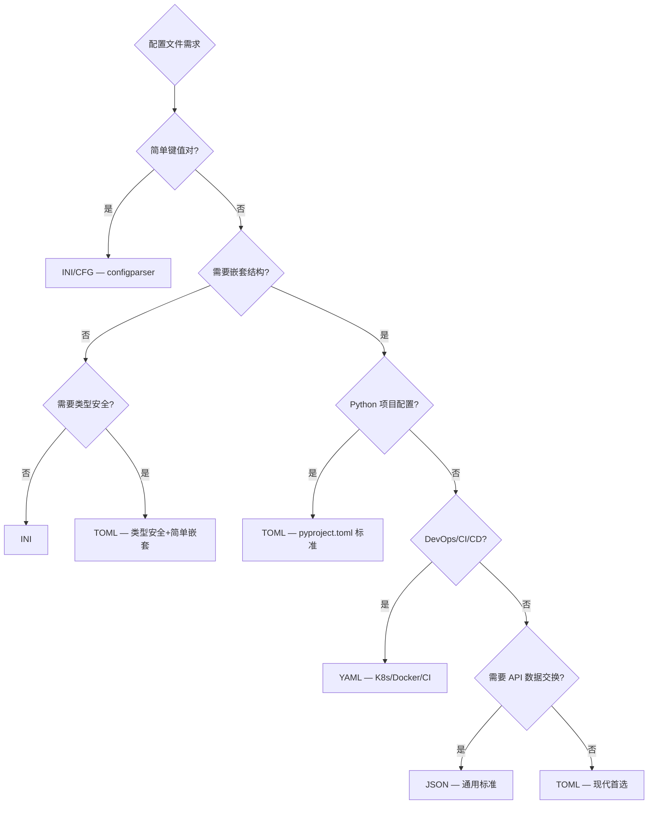
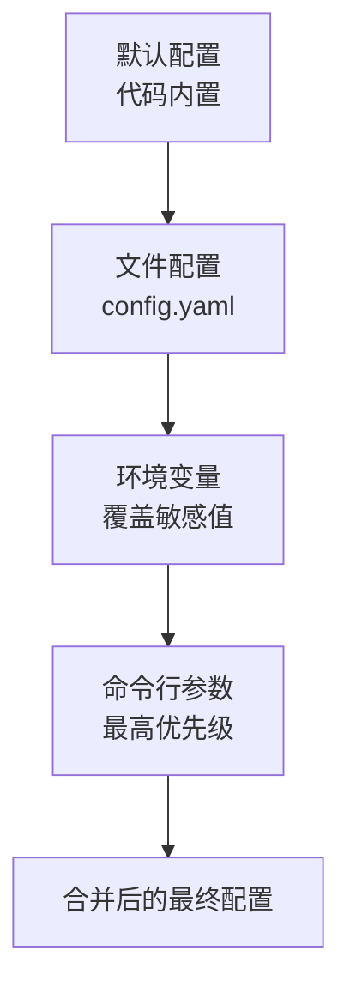

# Python 配置文件处理指南

## 概述

配置文件是软件工程中**将行为与代码分离**的核心手段。选择正确的配置格式和管理工作流，直接决定项目的可维护性和部署灵活性。



| 格式 | 文件扩展名 | 层级嵌套 | 类型安全 | 注释 | 适用场景 |
|------|----------|---------|---------|------|---------|
| INI | `.ini` `.cfg` | 分节 | ❌ 全字符串 | ✅ `;` `#` | 应用配置 |
| JSON | `.json` | ✅ | ✅ | ❌ | API 数据交换 |
| YAML | `.yaml` `.yml` | ✅ | ⚠️ 有限 | ✅ `#` | CI/CD、K8s |
| TOML | `.toml` | ✅ | ✅ | ✅ `#` | Python 项目配置 |
| ENV | `.env` | ❌ | ❌ | ✅ `#` | 环境变量 |

## INI/CFG 配置处理

### 标准库 configparser

```python
import configparser

# 读取
config = configparser.ConfigParser()
config.read('app.ini', encoding='utf-8')

# 基本访问
host = config.get('database', 'host')           # 字符串
port = config.getint('database', 'port')         # 整数
debug = config.getboolean('app', 'debug')         # 布尔值
timeout = config.getfloat('network', 'timeout')   # 浮点数

# 带默认值
host = config.get('database', 'host', fallback='localhost')

# 检查存在性
if config.has_section('database'):
    if config.has_option('database', 'host'):
        print(config['database']['host'])

# 遍历
for section in config.sections():
    print(f'[{section}]')
    for key, value in config.items(section):
        print(f'  {key} = {value}')
```

### INI 高级特性

```python
# 插值变量 — 在值中引用其他配置项
# [paths]
# base: /opt/app
# data: %(base)s/data
# logs: %(base)s/logs
config = configparser.ConfigParser()
config.read('app.ini')
print(config.get('paths', 'data'))  # /opt/app/data

# ExtendedInterpolation — 使用 ${section:key} 语法（推荐）
# [paths]
# base: /opt/app
# data: ${paths:base}/data
config = configparser.ConfigParser(
    interpolation=configparser.ExtendedInterpolation()
)

# 转换器 — 自定义类型解析
def list_converter(value):
    """将逗号分隔的字符串转为列表"""
    return [item.strip() for item in value.split(',')]

config = configparser.ConfigParser(converters={'list': list_converter})
# 使用: config.getlist('server', 'allowed_hosts')

# 写入
config['database'] = {
    'host': 'localhost',
    'port': '5432',
    'name': 'mydb',
}
with open('app.ini', 'w') as f:
    config.write(f)

# 保留大小写（默认键名转小写）
config = configparser.ConfigParser()
config.optionxform = str  # 保留原始大小写
```

## JSON 配置处理

```python
import json
from pathlib import Path
from datetime import datetime
from decimal import Decimal

# 读取
config = json.loads(Path('config.json').read_text(encoding='utf-8'))

# 写入
Path('config.json').write_text(
    json.dumps(config, ensure_ascii=False, indent=2),
    encoding='utf-8'
)

# 自定义编码器（处理特殊类型）
class ConfigEncoder(json.JSONEncoder):
    def default(self, obj):
        if isinstance(obj, datetime):
            return obj.isoformat()
        if isinstance(obj, Decimal):
            return float(obj)
        if isinstance(obj, Path):
            return str(obj)
        if isinstance(obj, set):
            return sorted(list(obj))
        return super().default(obj)

# JSON5 — 支持注释和尾逗号
# pip install json5
import json5
config = json5.loads(Path('config.json5').read_text(encoding='utf-8'))

# JSON Schema 验证
# pip install jsonschema
from jsonschema import validate, ValidationError

schema = {
    "type": "object",
    "properties": {
        "database": {
            "type": "object",
            "properties": {
                "host": {"type": "string"},
                "port": {"type": "integer", "minimum": 1, "maximum": 65535},
            },
            "required": ["host", "port"]
        }
    },
    "required": ["database"]
}

try:
    validate(instance=config, schema=schema)
except ValidationError as e:
    print(f'配置验证失败: {e.message}')
```

## YAML 配置处理

```bash
pip install PyYAML
```

### 基础操作

```python
import yaml

# 安全加载（推荐）
with open('config.yaml', 'r', encoding='utf-8') as f:
    config = yaml.safe_load(f)

# 写入
with open('output.yaml', 'w', encoding='utf-8') as f:
    yaml.dump(config, f, allow_unicode=True, default_flow_style=False, sort_keys=False)

# 多文档 YAML
with open('multi.yaml', 'r', encoding='utf-8') as f:
    docs = list(yaml.safe_load_all(f))
```

### YAML 高级用法

```python
# 自定义构造器（安全扩展 YAML 类型）
class PathConstructor:
    @staticmethod
    def construct_path(loader, node):
        value = loader.construct_scalar(node)
        return Path(value)

yaml.add_constructor('!path', PathConstructor, Loader=yaml.SafeLoader)

# config.yaml:
# data_dir: !path /home/user/data

# 环境变量插值
import os
import re

def resolve_env_vars(config_dict):
    """递归解析 ${ENV_VAR} 格式的环境变量引用"""
    if isinstance(config_dict, dict):
        return {k: resolve_env_vars(v) for k, v in config_dict.items()}
    elif isinstance(config_dict, list):
        return [resolve_env_vars(item) for item in config_dict]
    elif isinstance(config_dict, str):
        pattern = r'\$\{(\w+)(?::([^}]*))?\}'  # ${VAR} 或 ${VAR:default}
        def replacer(match):
            var_name = match.group(1)
            default = match.group(2)
            return os.environ.get(var_name, default or match.group(0))
        return re.sub(pattern, replacer, config_dict)
    return config_dict

# YAML 锚点与别名
# common: &common_settings
#   timeout: 30
#   retry: 3
#
# production:
#   <<: *common_settings
#   host: prod.example.com
#
# development:
#   <<: *common_settings
#   host: localhost
```

## TOML 配置处理

```python
# Python 3.11+ 内置
import tomllib

with open('pyproject.toml', 'rb') as f:
    config = tomllib.load(f)

# Python 3.10 及以下
# pip install tomli
import tomli
with open('pyproject.toml', 'rb') as f:
    config = tomli.load(f)

# 写入 TOML
# pip install tomli_w
import tomli_w

config = {
    'project': {
        'name': 'my-package',
        'version': '1.0.0',
        'requires-python': '>=3.8',
        'dependencies': ['requests>=2.28', 'pyyaml>=6.0'],
    },
    'tool': {
        'ruff': {
            'line-length': 88,
            'select': ['E', 'F', 'W'],
        },
        'pytest': {
            'ini_options': {
                'testpaths': ['tests'],
                'addopts': '-v --tb=short',
            }
        },
    },
}
with open('pyproject.toml', 'wb') as f:
    tomli_w.dump(config, f)
```

### TOML 语法要点

```toml
# 基本类型
string = "hello"
integer = 42
float = 3.14
boolean = true
date = 2026-06-06
datetime = 2026-06-06T10:30:00+08:00

# 数组
colors = ["red", "green", "blue"]
numbers = [1, 2, 3]

# 表（字典）
[database]
host = "localhost"
port = 5432

# 内联表
point = {x = 1, y = 2}

# 数组表（列表中的字典）
[[servers]]
name = "alpha"
ip = "10.0.0.1"

[[servers]]
name = "beta"
ip = "10.0.0.2"

# 多行字符串
description = """
这是一个
多行字符串
"""

# 点号键
physical.color = "orange"
physical.shape = "round"
# 等价于：
# [physical]
# color = "orange"
# shape = "round"
```

## ENV 环境变量处理

```bash
pip install python-dotenv
```

```python
from dotenv import load_dotenv, dotenv_values
import os

# 加载 .env 文件到环境变量
load_dotenv()

# 读取
db_host = os.environ.get('DB_HOST', 'localhost')
db_port = os.environ.get('DB_PORT', '5432')

# 不修改环境变量，仅读取值
config = dotenv_values('.env')
print(config['DB_HOST'])

# 覆盖策略
load_dotenv(override=True)    # .env 值覆盖已有环境变量
load_dotenv(override=False)   # 已有环境变量优先（默认）

# 多环境 .env 文件
from pathlib import Path

env = os.environ.get('APP_ENV', 'development')
env_file = Path(f'.env.{env}')
if env_file.exists():
    load_dotenv(env_file)
load_dotenv()  # .env 作为基础

# 类型转换
def env_int(key, default=0):
    return int(os.environ.get(key, str(default)))

def env_bool(key, default=False):
    val = os.environ.get(key, str(default)).lower()
    return val in ('1', 'true', 'yes', 'on')

def env_list(key, separator=','):
    val = os.environ.get(key, '')
    return [item.strip() for item in val.split(separator) if item.strip()]
```

## 配置管理最佳实践

### 分层配置架构



```python
from dataclasses import dataclass, field
from typing import Optional, List
import os
import yaml
from pathlib import Path


@dataclass
class DatabaseConfig:
    host: str = 'localhost'
    port: int = 5432
    name: str = 'mydb'
    user: str = 'admin'
    password: str = ''
    pool_size: int = 5
    timeout: float = 30.0


@dataclass
class AppConfig:
    app_name: str = 'MyApp'
    debug: bool = False
    database: DatabaseConfig = field(default_factory=DatabaseConfig)
    allowed_hosts: List[str] = field(default_factory=lambda: ['*'])
    log_level: str = 'INFO'


class ConfigManager:
    """分层配置管理器"""

    def __init__(self):
        self._config = AppConfig()

    def load_defaults(self):
        """加载默认配置（已通过 dataclass 默认值设置）"""
        return self

    def load_file(self, filepath: str):
        """从 YAML 文件加载配置"""
        path = Path(filepath)
        if not path.exists():
            return self

        with open(path, 'r', encoding='utf-8') as f:
            file_config = yaml.safe_load(f) or {}

        self._merge_dict(self._config, file_config)
        return self

    def load_env(self, prefix: str = 'APP'):
        """从环境变量加载配置（覆盖文件配置）"""
        env_mapping = {
            f'{prefix}_DEBUG': ('debug', lambda x: x.lower() in ('1', 'true', 'yes')),
            f'{prefix}_LOG_LEVEL': ('log_level', str),
            f'{prefix}_DB_HOST': ('database.host', str),
            f'{prefix}_DB_PORT': ('database.port', int),
            f'{prefix}_DB_NAME': ('database.name', str),
            f'{prefix}_DB_USER': ('database.user', str),
            f'{prefix}_DB_PASSWORD': ('database.password', str),
            f'{prefix}_DB_POOL_SIZE': ('database.pool_size', int),
        }

        for env_key, (config_path, converter) in env_mapping.items():
            value = os.environ.get(env_key)
            if value is not None:
                self._set_nested(self._config, config_path, converter(value))

        return self

    @property
    def config(self) -> AppConfig:
        return self._config

    @staticmethod
    def _merge_dict(obj, data: dict):
        """递归合并字典到 dataclass"""
        for key, value in data.items():
            if hasattr(obj, key):
                if isinstance(value, dict) and hasattr(getattr(obj, key), '__dataclass_fields__'):
                    ConfigManager._merge_dict(getattr(obj, key), value)
                else:
                    setattr(obj, key, value)

    @staticmethod
    def _set_nested(obj, path: str, value):
        """设置嵌套属性（用 . 分隔）"""
        parts = path.split('.')
        for part in parts[:-1]:
            obj = getattr(obj, part)
        setattr(obj, parts[-1], value)


# 使用
manager = ConfigManager()
manager.load_defaults()
manager.load_file('config.yaml')
manager.load_env(prefix='APP')

config = manager.config
print(f'数据库: {config.database.host}:{config.database.port}/{config.database.name}')
print(f'调试模式: {config.debug}')
```

### 配置验证

```python
# Pydantic v2 中 BaseSettings 已拆分到独立的 pydantic-settings 包
# pip install pydantic-settings
from pydantic import Field, field_validator
from pydantic_settings import BaseSettings, SettingsConfigDict
from typing import List


class Settings(BaseSettings):
    """使用 Pydantic 进行配置验证和类型转换"""

    model_config = SettingsConfigDict(
        env_file='.env',
        env_file_encoding='utf-8',
        case_sensitive=False,
    )

    app_name: str = 'MyApp'
    debug: bool = False
    database_url: str = Field(..., description="数据库连接URL")
    max_workers: int = Field(4, ge=1, le=32, description="最大工作线程数")
    allowed_hosts: List[str] = ['*']
    api_key: str = Field(..., description="第三方API密钥（环境变量 API_KEY 自动映射）")

    @field_validator('database_url')
    @classmethod
    def validate_db_url(cls, v):
        if not v.startswith(('postgresql://', 'mysql://', 'sqlite://')):
            raise ValueError('不支持的数据库协议')
        return v

# 使用
settings = Settings()  # 自动读取 .env 和环境变量
print(settings.database_url)
```

## 常见陷阱

| 陷阱 | 说明 | 正确做法 |
|------|------|---------|
| `yaml.load()` 不安全 | 可执行任意 Python 代码 | 使用 `yaml.safe_load()` |
| INI 值都是字符串 | configparser 不自动类型转换 | 使用 `getint()` / `getboolean()` / `getfloat()` |
| TOML 用文本模式打开 | tomllib 要求二进制模式 | `open('f.toml', 'rb')` |
| 环境变量明文密码 | .env 文件中存敏感信息 | 加入 `.gitignore`，生产环境用密钥管理服务 |
| JSON 不支持注释 | 配置文件无法添加说明 | 使用 JSON5 或改用 YAML/TOML |
| YAML 缩进错误 | 缩进不一致导致解析失败 | 使用 linter 检查（yamllint） |
| 配置文件格式混用 | 同一项目多种配置格式 | 统一使用一种格式（推荐 TOML） |
| 多层配置覆盖不清 | 不知道最终值来自哪层 | 使用分层架构，明确优先级 |

## 延伸阅读

- [Python 官方 — configparser](https://docs.python.org/3/library/configparser.html)
- [Python 官方 — tomllib](https://docs.python.org/3/library/tomllib.html)
- [PyYAML 文档](https://pyyaml.org/wiki/PyYAMLDocumentation)
- [TOML 规范](https://toml.io/cn/)
- [python-dotenv 文档](https://github.com/theskumar/python-dotenv)
- [Pydantic Settings](https://docs.pydantic.dev/latest/concepts/pydantic_settings/)
- [JSON Schema 规范](https://json-schema.org/)

## 版本差异（自动化办公库 → 当前稳定版）

| 库 | 本文编写时 | 当前稳定版（截至 2026-09） |
|----|-----------|-----------|
| `openpyxl`（Excel） | 旧版 | 3.1.x |
| `python-docx`（Word） | 旧版 | 1.2.x |
| `python-pptx`（PPT） | 旧版 | 1.0.x |
| `reportlab`（PDF） | 旧版 | 5.x |
| `PyPDF2`/`pypdf` | PyPDF2 | 推荐 `pypdf`（6.x，PyPDF2 已停止维护） |
| `Pillow`（图像） | 旧版 | 12.x |
| `pydantic` | 1.x | 2.x（`BaseSettings` 拆分至 `pydantic-settings`，`@validator` → `@field_validator`） |

> 本文讲解的自动化办公流程（读写 Excel/Word/PDF/PPT）与核心 API 在最新版本中成立；注意 PyPDF2 已迁移至 pypdf。
