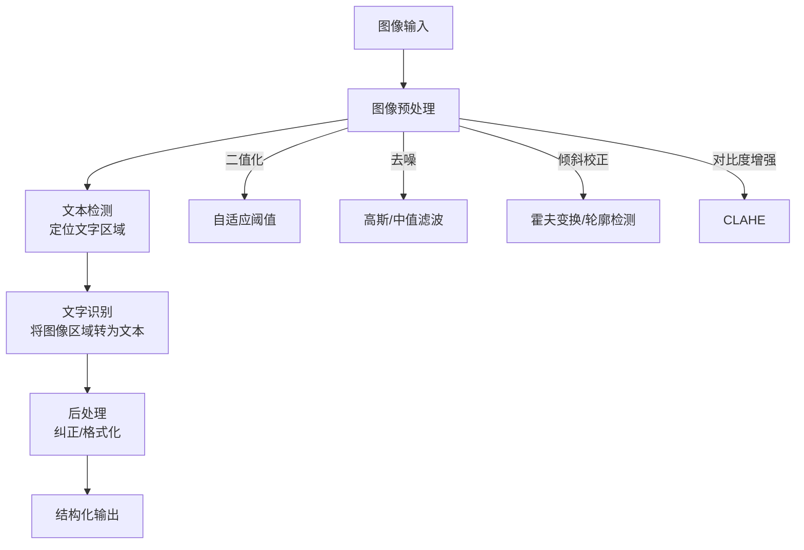
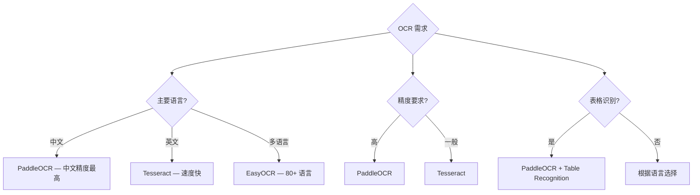

# Python OCR 文字识别指南

## 概述

OCR (Optical Character Recognition，光学字符识别) 将图像中的文字转换为可编辑的文本。在自动化办公中，OCR 是处理扫描件、发票、合同、证件等非结构化文档的关键技术。



## OCR 引擎对比

| 引擎 | 中文支持 | 速度 | 精度 | GPU | 部署难度 | 适用场景 |
|------|---------|------|------|-----|---------|---------|
| **Tesseract** | ✅ 中等 | ⚡ 快 | ⭐⭐⭐ | ❌ | 低 | 简单文档、英文 |
| **PaddleOCR** | ✅ 优秀 | ⚡⚡ 快 | ⭐⭐⭐⭐⭐ | ✅ | 中 | 中文场景首选 |
| **EasyOCR** | ✅ 良好 | ⚡ 中 | ⭐⭐⭐⭐ | ✅ | 低 | 多语言、快速原型 |



## Tesseract / pytesseract

### 安装

```bash
# 安装 Tesseract OCR 引擎
# macOS
brew install tesseract tesseract-lang

# Ubuntu/Debian
sudo apt install tesseract-ocr tesseract-ocr-chi-sim

# Windows
# 下载安装器：https://github.com/UB-Mannheim/tesseract/wiki

# Python 绑定
pip install pytesseract Pillow
```

### 基础用法

```python
import pytesseract
from PIL import Image

# 基础识别
img = Image.open('document.png')
text = pytesseract.image_to_string(img, lang='chi_sim+eng')
print(text)

# 带坐标的识别（词级别）
data = pytesseract.image_to_data(img, lang='chi_sim+eng', output_type=pytesseract.Output.DICT)
for i in range(len(data['text'])):
    if int(data['conf'][i]) > 30:  # 置信度过滤
        print(f'文字: {data["text"][i]}, '
              f'位置: ({data["left"][i]}, {data["top"][i]}), '
              f'置信度: {data["conf"][i]}')

# 页面分割模式（PSM）
# --psm 0  仅方向和脚本检测
# --psm 3  全自动页面分割（默认）
# --psm 6  假设为统一文本块
# --psm 7  将图像视为单行文本
# --psm 11 稀疏文本，无特定顺序

# 单行文本
text = pytesseract.image_to_string(img, lang='chi_sim', config='--psm 7')

# OCR 引擎模式（OEM）
# --oem 0  原始 Tesseract 引擎
# --oem 1  神经网络 LSTM 引擎（推荐）
# --oem 2  混合引擎
# --oem 3  默认引擎

text = pytesseract.image_to_string(img, lang='chi_sim+eng',
                                    config='--psm 6 --oem 1')
```

### 图像预处理提升精度

```python
from PIL import Image, ImageFilter, ImageEnhance
import numpy as np

def preprocess_for_ocr(img):
    """OCR 专用图像预处理流水线"""
    # 1. 转灰度
    if img.mode != 'L':
        img = img.convert('L')

    # 2. 放大（Tesseract 对 300dpi 以上效果最好）
    w, h = img.size
    if w < 1500:
        scale = 1500 / w
        img = img.resize((int(w * scale), int(h * scale)), Image.LANCZOS)

    # 3. 对比度增强
    enhancer = ImageEnhance.Contrast(img)
    img = enhancer.enhance(2.0)

    # 4. 二值化（自适应阈值）
    arr = np.array(img)

    # 简单二值化
    from PIL import ImageOps
    img = ImageOps.autocontrast(img)

    # 5. 去噪
    img = img.filter(ImageFilter.MedianFilter(3))

    return img

# 倾斜校正
def deskew_image(img):
    """检测并校正图像倾斜"""
    import cv2
    import numpy as np

    arr = np.array(img.convert('L'))
    # 二值化
    thresh = cv2.threshold(arr, 0, 255, cv2.THRESH_BINARY_INV + cv2.THRESH_OTSU)[1]

    # 霍夫变换检测倾斜角度
    coords = np.column_stack(np.where(thresh > 0))
    angle = cv2.minAreaRect(coords)[-1]

    if angle < -45:
        angle = -(90 + angle)
    else:
        angle = -angle

    if abs(angle) < 0.5:  # 倾斜角度太小，不需要校正
        return img

    # 旋转校正
    h, w = arr.shape
    center = (w // 2, h // 2)
    M = cv2.getRotationMatrix2D(center, angle, 1.0)
    rotated = cv2.warpAffine(arr, M, (w, h), flags=cv2.INTER_CUBIC, borderMode=cv2.BORDER_REPLICATE)
    return Image.fromarray(rotated)
```

## PaddleOCR

```bash
pip install paddlepaddle paddleocr
# GPU 版本: pip install paddlepaddle-gpu
```

### 基础用法

```python
from paddleocr import PaddleOCR

# 初始化（首次运行自动下载模型）
# 注意：PaddleOCR 3.x 移除了 show_log 参数（改用新日志系统），
# use_angle_cls 已更名为 use_textline_orientation，ocr() 之外推荐 predict() 统一接口
ocr = PaddleOCR(use_angle_cls=True, lang='ch')

# 识别
result = ocr.ocr('document.png', cls=True)

# 解析结果
for idx in range(len(result)):
    res = result[idx]
    for line in res:
        box = line[0]        # 文本区域坐标 [[x1,y1],[x2,y2],[x3,y3],[x4,y4]]
        text = line[1][0]    # 识别文本
        confidence = line[1][1]  # 置信度
        print(f'文字: {text}, 置信度: {confidence:.2f}')
        print(f'位置: {box}')
```

### 表格识别

> 注：PaddleOCR 3.x 将表格/版面分析升级为 PP-StructureV3 管线（`from paddleocr import PPStructureV3`），下方的 PPStructure 写法适用于 2.x。

```python
from paddleocr import PPStructure

# 初始化表格识别引擎
table_engine = PPStructure(show_log=True, image_dir=None)

# 识别表格
result = table_engine('table_image.png')

# 解析表格结果
for region in result:
    if region['type'] == 'table':
        # 获取 HTML 表格
        html = region['res']['html']
        print(html)

        # 转为 DataFrame
        import pandas as pd
        # pip install lxml
        dfs = pd.read_html(html)
        if dfs:
            df = dfs[0]
            print(df)

    elif region['type'] == 'figure':
        print(f'检测到图片区域: {region["bbox"]}')

    elif region['type'] == 'text':
        text = region['res'][0]['text']
        print(f'文本: {text}')

    elif region['type'] == 'title':
        title = region['res'][0]['text']
        print(f'标题: {title}')
```

### 版面分析

```python
from paddleocr import PPStructure

# 版面分析（检测文档中的标题、正文、图片、表格等区域）
layout_engine = PPStructure(show_log=True)

result = layout_engine('document.png')

for region in result:
    bbox = region['bbox']  # [x1, y1, x2, y2]
    region_type = region['type']
    confidence = region['confidence']

    print(f'类型: {region_type}, 置信度: {confidence:.2f}, 区域: {bbox}')

    if region_type == 'text':
        for line in region['res']:
            print(f'  文字: {line["text"]}')
```

## EasyOCR

```bash
pip install easyocr
```

```python
import easyocr

# 初始化（支持 GPU）
reader = easyocr.Reader(['ch_sim', 'en'], gpu=False)

# 识别
results = reader.readtext('document.png')

# 解析结果
for bbox, text, confidence in results:
    print(f'文字: {text}, 置信度: {confidence:.2f}')
    print(f'位置: {bbox}')  # [[x1,y1],[x2,y2],[x3,y3],[x4,y4]]

# 控制识别细节
results = reader.readtext(
    'document.png',
    detail=1,           # 0=仅文本, 1=带坐标
    paragraph=False,    # True=合并为段落
    width_ths=0.5,      # 合并文本框的宽度阈值
    decoder='greedy',   # greedy / beamsearch / wordbeamsearch
    beamWidth=5,        # beam search 宽度
    batch_size=1,
)

# 批量识别
results = reader.readtext_batched(['img1.png', 'img2.png'], batch_size=4)
```

## PDF OCR 处理

```bash
pip install pdf2image pytesseract
```

```python
from pdf2image import convert_from_path
import pytesseract
from pathlib import Path

def ocr_pdf(pdf_path, lang='chi_sim+eng', dpi=300):
    """将 PDF 转为图片后 OCR"""
    images = convert_from_path(pdf_path, dpi=dpi)
    full_text = []

    for i, image in enumerate(images):
        text = pytesseract.image_to_string(image, lang=lang)
        full_text.append(f'=== 第 {i+1} 页 ===\n{text}')

    return '\n\n'.join(full_text)

def ocr_pdf_with_layout(pdf_path, output_dir='ocr_output'):
    """保留版面信息的 PDF OCR"""
    output_dir = Path(output_dir)
    output_dir.mkdir(parents=True, exist_ok=True)

    images = convert_from_path(pdf_path, dpi=300)
    pdf_name = Path(pdf_path).stem

    for i, image in enumerate(images):
        # 保存原图
        image.save(output_dir / f'{pdf_name}_page{i+1}.png')

        # OCR 识别
        data = pytesseract.image_to_data(image, lang='chi_sim+eng', output_type=pytesseract.Output.DICT)

        # 生成带标注的图片
        from PIL import ImageDraw
        draw = ImageDraw.Draw(image)
        for j in range(len(data['text'])):
            if int(data['conf'][j]) > 30 and data['text'][j].strip():
                x, y, w, h = data['left'][j], data['top'][j], data['width'][j], data['height'][j]
                draw.rectangle([x, y, x+w, y+h], outline='red', width=1)

        image.save(output_dir / f'{pdf_name}_page{i+1}_annotated.png')

        # 保存文本
        text = pytesseract.image_to_string(image, lang='chi_sim+eng')
        (output_dir / f'{pdf_name}_page{i+1}.txt').write_text(text, encoding='utf-8')
```

## 实战案例：发票识别系统

```python
"""
发票识别系统
功能：自动识别发票图像，提取结构化数据
支持：增值税普通发票、电子发票
"""
from dataclasses import dataclass, field
from typing import Optional, List
from pathlib import Path
import re
import json


@dataclass
class InvoiceInfo:
    """发票信息数据类"""
    invoice_code: str = ''          # 发票代码
    invoice_number: str = ''        # 发票号码
    invoice_date: str = ''          # 开票日期
    buyer_name: str = ''            # 购买方名称
    buyer_tax_id: str = ''          # 购买方纳税人识别号
    seller_name: str = ''           # 销售方名称
    seller_tax_id: str = ''         # 销售方纳税人识别号
    total_amount: str = ''          # 合计金额
    total_tax: str = ''             # 合计税额
    amount_in_words: str = ''       # 价税合计（大写）
    amount_in_figures: str = ''     # 价税合计（小写）
    items: List[dict] = field(default_factory=list)  # 商品明细


class InvoiceOCR:
    """发票 OCR 识别器"""

    def __init__(self, engine='paddleocr'):
        self.engine = engine
        if engine == 'paddleocr':
            from paddleocr import PaddleOCR
            self.ocr = PaddleOCR(use_angle_cls=True, lang='ch')
        elif engine == 'easyocr':
            import easyocr
            self.reader = easyocr.Reader(['ch_sim', 'en'], gpu=False)

    def recognize(self, image_path):
        """识别发票并返回结构化数据"""
        # OCR 识别
        if self.engine == 'paddleocr':
            result = self.ocr.ocr(image_path, cls=True)
            texts = []
            for line in result[0]:
                box, (text, conf) = line
                texts.append({'text': text, 'confidence': conf, 'box': box})
        else:
            raw = self.reader.readtext(image_path)
            texts = [{'text': t, 'confidence': c, 'box': b} for b, t, c in raw]

        # 提取结构化信息
        invoice = self._extract_invoice_info(texts)
        return invoice

    def _extract_invoice_info(self, texts):
        """从 OCR 结果中提取发票字段"""
        invoice = InvoiceInfo()

        # 合并所有文本用于正则匹配
        all_text = '\n'.join([t['text'] for t in texts])

        # 发票代码（10-12位数字）
        code_match = re.search(r'发\s*票\s*代\s*码\s*[：:]\s*(\d{10,12})', all_text)
        if code_match:
            invoice.invoice_code = code_match.group(1)

        # 发票号码（8位数字）
        number_match = re.search(r'发\s*票\s*号\s*码\s*[：:]\s*(\d{8})', all_text)
        if number_match:
            invoice.invoice_number = number_match.group(1)

        # 开票日期
        date_match = re.search(r'开\s*票\s*日\s*期\s*[：:]\s*(\d{4})\s*年\s*(\d{1,2})\s*月\s*(\d{1,2})\s*日', all_text)
        if date_match:
            invoice.invoice_date = f'{date_match.group(1)}-{int(date_match.group(2)):02d}-{int(date_match.group(3)):02d}'

        # 购买方
        buyer_match = re.search(r'购\s*买\s*方[\s\S]*?名\s*称\s*[：:]\s*([^\n]+)', all_text)
        if buyer_match:
            invoice.buyer_name = buyer_match.group(1).strip()

        buyer_tax_match = re.search(r'纳\s*税\s*人\s*识\s*别\s*号\s*[：:]\s*([A-Z0-9]{15,20})', all_text)
        if buyer_tax_match:
            invoice.buyer_tax_id = buyer_tax_match.group(1)

        # 销售方
        seller_match = re.search(r'销\s*售\s*方[\s\S]*?名\s*称\s*[：:]\s*([^\n]+)', all_text)
        if seller_match:
            invoice.seller_name = seller_match.group(1).strip()

        # 金额
        amount_match = re.search(r'合\s*计\s*[：:]\s*[¥￥]?\s*([\d,.]+)', all_text)
        if amount_match:
            invoice.total_amount = amount_match.group(1)

        # 价税合计
        total_match = re.search(r'价\s*税\s*合\s*计.*?[¥￥]\s*([\d,.]+)', all_text)
        if total_match:
            invoice.amount_in_figures = total_match.group(1)

        return invoice


# 使用
ocr = InvoiceOCR(engine='paddleocr')

# 识别单张发票
invoice = ocr.recognize('invoice.jpg')
print(f'发票代码: {invoice.invoice_code}')
print(f'发票号码: {invoice.invoice_number}')
print(f'开票日期: {invoice.invoice_date}')
print(f'购买方: {invoice.buyer_name}')
print(f'价税合计: ¥{invoice.amount_in_figures}')

# 批量识别
def batch_recognize_invoices(input_dir, output_file='invoices.json'):
    """批量识别发票"""
    results = []
    for img_path in Path(input_dir).glob('*.jpg'):
        invoice = ocr.recognize(str(img_path))
        result = {
            'file': img_path.name,
            'invoice_code': invoice.invoice_code,
            'invoice_number': invoice.invoice_number,
            'date': invoice.invoice_date,
            'buyer': invoice.buyer_name,
            'amount': invoice.amount_in_figures,
        }
        results.append(result)
        print(f'已识别: {img_path.name}')

    Path(output_file).write_text(
        json.dumps(results, ensure_ascii=False, indent=2),
        encoding='utf-8'
    )
    print(f'结果已保存到 {output_file}')
```

## 常见陷阱

| 陷阱 | 说明 | 正确做法 |
|------|------|---------|
| Tesseract 中文精度低 | 默认模型对中文支持不佳 | 使用 PaddleOCR 或训练自定义模型 |
| 图像分辨率不足 | 低分辨率图像 OCR 精度差 | 至少 300dpi，必要时放大 |
| 倾斜/旋转图像 | 未校正的倾斜图像影响识别 | 先进行倾斜校正 |
| 背景噪声 | 复杂背景干扰文字识别 | 预处理去噪、二值化 |
| 字体不支持 | 特殊字体无法识别 | 训练自定义模型或微调 |
| 大图像内存溢出 | 高分辨率图像占用大量内存 | 分块处理 |
| 扫描件质量差 | 模糊、污损影响精度 | 先做图像增强再 OCR |
| 表格结构丢失 | OCR 只返回文本，丢失表格关系 | 使用 PaddleOCR 表格识别 |

## 延伸阅读

- [Tesseract 官方文档](https://tesseract-ocr.github.io/)
- [PaddleOCR 项目](https://github.com/PaddlePaddle/PaddleOCR)
- [EasyOCR 项目](https://github.com/JaidedAI/EasyOCR)
- [OCR 预处理最佳实践](https://tesseract-ocr.github.io/tessdoc/ImproveQuality)
- [pdf2image 文档](https://github.com/Belval/pdf2image)

## 版本差异（自动化办公库 → 当前稳定版）

| 库 | 本文编写时 | 当前稳定版（截至 2026-09） |
|----|-----------|-----------|
| `openpyxl`（Excel） | 旧版 | 3.1.x |
| `python-docx`（Word） | 旧版 | 1.2.x |
| `python-pptx`（PPT） | 旧版 | 1.0.x |
| `reportlab`（PDF） | 旧版 | 5.x |
| `PyPDF2`/`pypdf` | PyPDF2 | 推荐 `pypdf`（6.x，PyPDF2 已停止维护） |
| `Pillow`（图像） | 旧版 | 12.x |
| `paddleocr` | 2.x | 3.x（移除 `show_log`，`use_angle_cls`→`use_textline_orientation`，表格识别升级为 PP-StructureV3） |

> 本文讲解的自动化办公流程（读写 Excel/Word/PDF/PPT）与核心 API 在最新版本中成立；注意 PyPDF2 已迁移至 pypdf。
