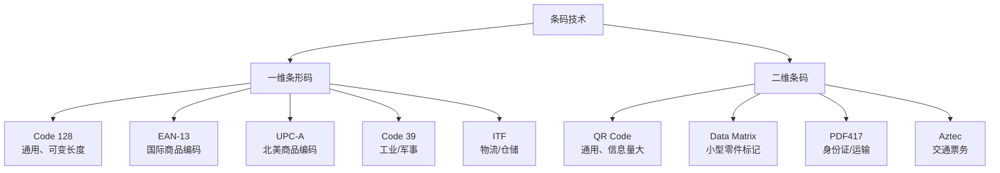
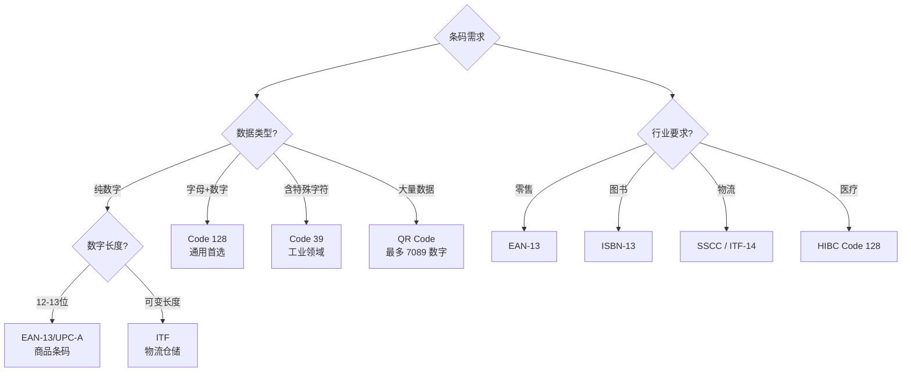

# Python 二维码与条形码指南

## 概述

条码技术是物品标识和信息传递的基础设施。在自动化办公中，条码用于库存管理、产品溯源、文档追踪、会议签到等场景。



| 类型 | 信息容量 | 读取速度 | 容错能力 | 适用场景 |
|------|---------|---------|---------|---------|
| 一维条形码 | 20-30 字符 | ⚡⚡⚡ 极快 | ❌ 无 | 商品、物流 |
| QR Code | 最多 7089 数字 | ⚡⚡ 快 | ✅ 7%-30% | 通用、营销、支付 |
| Data Matrix | 最多 3116 数字 | ⚡⚡ 快 | ✅ 高 | 小型零件、电子 |
| PDF417 | 最多 1850 文字 | ⚡ 中 | ✅ 高 | 证件、运输 |

## 二维码生成

### qrcode 库

```bash
pip install qrcode[pil]
```

```python
import qrcode
from qrcode.constants import ERROR_CORRECT_L, ERROR_CORRECT_M, ERROR_CORRECT_Q, ERROR_CORRECT_H

# 基础生成
qr = qrcode.make('https://example.com')
qr.save('basic_qr.png')

# 自定义参数
qr = qrcode.QRCode(
    version=None,          # 自动选择版本（1-40）
    error_correction=ERROR_CORRECT_H,  # 容错等级
    box_size=10,           # 每个模块的像素数
    border=4,              # 边框宽度（模块数）
)

qr.add_data('https://example.com/register?token=abc123')
qr.make(fit=True)

img = qr.make_image(fill_color='black', back_color='white')
img.save('custom_qr.png')

# 容错等级说明：
# ERROR_CORRECT_L — 7% 容错（最小）
# ERROR_CORRECT_M — 15% 容错（默认）
# ERROR_CORRECT_Q — 25% 容错
# ERROR_CORRECT_H — 30% 容错（最高，适合加 Logo）
```

### 嵌入 Logo

```python
import qrcode
from qrcode.constants import ERROR_CORRECT_H
from PIL import Image

def create_qr_with_logo(data, logo_path, output_path, qr_size=300, logo_ratio=0.25):
    """生成带 Logo 的二维码"""
    qr = qrcode.QRCode(
        version=None,
        error_correction=ERROR_CORRECT_H,  # 高容错，允许被 Logo 遮挡
        box_size=10,
        border=4,
    )
    qr.add_data(data)
    qr.make(fit=True)

    img = qr.make_image(fill_color='#1a1a2e', back_color='white').convert('RGBA')

    # 缩放到目标尺寸
    img = img.resize((qr_size, qr_size), Image.LANCZOS)

    # 加载并缩放 Logo
    logo = Image.open(logo_path).convert('RGBA')
    logo_size = int(qr_size * logo_ratio)
    logo = logo.resize((logo_size, logo_size), Image.LANCZOS)

    # 居中粘贴
    pos = ((qr_size - logo_size) // 2, (qr_size - logo_size) // 2)
    img.paste(logo, pos, logo)

    img.save(output_path)
    return output_path

create_qr_with_logo(
    'https://example.com',
    'logo.png',
    'qr_with_logo.png'
)
```

### 批量生成

```python
from pathlib import Path
import qrcode
from qrcode.constants import ERROR_CORRECT_H
import csv
from concurrent.futures import ThreadPoolExecutor

def batch_generate_qrcodes(data_source, output_dir='qrcodes', url_template='https://example.com/verify/{code}'):
    """批量生成二维码"""
    output_dir = Path(output_dir)
    output_dir.mkdir(parents=True, exist_ok=True)

    if isinstance(data_source, str):
        # 从 CSV 文件读取
        with open(data_source, 'r', encoding='utf-8') as f:
            reader = csv.DictReader(f)
            items = list(reader)
    else:
        items = data_source

    def generate_one(item):
        code = item.get('code', item.get('id', ''))
        url = url_template.format(code=code)
        filename = f'qr_{code}.png'

        qr = qrcode.QRCode(
            version=None,
            error_correction=ERROR_CORRECT_H,
            box_size=10,
            border=4,
        )
        qr.add_data(url)
        qr.make(fit=True)
        img = qr.make_image(fill_color='black', back_color='white')
        img.save(str(output_dir / filename))
        return filename

    with ThreadPoolExecutor(max_workers=8) as executor:
        results = list(executor.map(generate_one, items))

    print(f'已生成 {len(results)} 个二维码')
    return results

# 使用
batch_generate_qrcodes([
    {'code': 'PROD-001', 'name': '产品A'},
    {'code': 'PROD-002', 'name': '产品B'},
    {'code': 'PROD-003', 'name': '产品C'},
])
```

## 二维码识别

### pyzbar

```bash
pip install pyzbar
# macOS: brew install zbar
# Ubuntu: sudo apt install libzbar0
# Windows: 自动包含 DLL
```

```python
from pyzbar.pyzbar import decode
from PIL import Image

# 识别图片中的二维码
img = Image.open('qrcode.png')
results = decode(img)

for result in results:
    print(f'类型: {result.type}')      # QRCODE, CODE128 等
    print(f'数据: {result.data.decode("utf-8")}')
    print(f'质量: {result.quality}')
    print(f'位置: {result.polygon}')

# 识别多个二维码
img = Image.open('multiple_qr.png')
results = decode(img)
for r in results:
    print(r.data.decode('utf-8'))

# 从摄像头实时识别
import cv2

cap = cv2.VideoCapture(0)
while True:
    ret, frame = cap.read()
    if not ret:
        break

    results = decode(frame)
    for r in results:
        data = r.data.decode('utf-8')
        x, y, w, h = r.rect.left, r.rect.top, r.rect.width, r.rect.height
        cv2.rectangle(frame, (x, y), (x+w, y+h), (0, 255, 0), 2)
        cv2.putText(frame, data, (x, y-10), cv2.FONT_HERSHEY_SIMPLEX, 0.5, (0, 255, 0), 2)

    cv2.imshow('QR Scanner', frame)
    if cv2.waitKey(1) & 0xFF == ord('q'):
        break

cap.release()
cv2.destroyAllWindows()
```

## 条形码

### python-barcode

```bash
pip install python-barcode
# 生成 PNG 需要 Pillow
```

```python
import barcode
from barcode.writer import ImageWriter

# 查看支持的格式
print(barcode.PROVIDED_BARCODES)
# 节选：['code39', 'code128', 'ean', 'ean13', 'ean8', 'gtin',
#  'isbn10', 'isbn13', 'issn', 'itf', 'jan', 'upc', 'pzn', ...]

# Code 128（通用、可变长度）
code128 = barcode.get_barcode_class('code128')
code = code128('ABC-12345', writer=ImageWriter())
code.save('code128_barcode')

# EAN-13（国际商品条码，必须 13 位数字，最后一位是校验码）
# 提供 12 位，自动计算校验位
ean = barcode.get_barcode_class('ean13')
code = ean('690123456789', writer=ImageWriter())
code.save('ean13_barcode')

# 自定义样式
code = code128('PRODUCT-001', writer=ImageWriter(),
               writer_options={
                   'format': 'PNG',
                   'module_width': 0.2,   # 条码线宽（mm）
                   'module_height': 15.0, # 条码高度（mm）
                   'font_size': 10,       # 文字大小（pt）
                   'text_distance': 5.0,  # 文字与条码间距（mm）
                   'foreground': 'black',
                   'background': 'white',
                   'write_text': True,    # 底部显示文字
                   'quiet_zone': 6.5,     # 安静区宽度（mm）
               })
code.save('styled_barcode')

# 批量生成
def batch_generate_barcodes(items, barcode_type='code128', output_dir='barcodes'):
    output_dir = Path(output_dir)
    output_dir.mkdir(parents=True, exist_ok=True)

    BarcodeClass = barcode.get_barcode_class(barcode_type)

    for item in items:
        code_value = item.get('code', str(item))
        code = BarcodeClass(code_value, writer=ImageWriter())
        filepath = output_dir / f'barcode_{code_value}'
        code.save(str(filepath))
        print(f'生成: {filepath}.png')
```

### 条形码识别

```python
from pyzbar.pyzbar import decode
from PIL import Image

# 识别条形码
img = Image.open('barcode.png')
results = decode(img)

for result in results:
    print(f'类型: {result.type}')
    print(f'数据: {result.data.decode("utf-8")}')

# OpenCV + pyzbar 处理模糊条形码
import cv2
import numpy as np

def enhance_barcode_image(img_path):
    """增强条形码图像以提高识别率"""
    img = cv2.imread(img_path, cv2.IMREAD_GRAYSCALE)

    # 自适应阈值二值化
    thresh = cv2.adaptiveThreshold(img, 255, cv2.ADAPTIVE_THRESH_GAUSSIAN_C,
                                    cv2.THRESH_BINARY, 11, 2)

    # 形态学操作（连接断裂的线条）
    kernel = cv2.getStructuringElement(cv2.MORPH_RECT, (3, 1))
    thresh = cv2.morphologyEx(thresh, cv2.MORPH_CLOSE, kernel)

    return Image.fromarray(thresh)
```

## 条码类型选择



## 实战案例：防伪溯源系统

```python
"""
防伪溯源系统
功能：为产品生成唯一防伪码（二维码），消费者扫码查询真伪
支持：批量生成、加密签名、查询验证、溯源记录
"""
import qrcode
from qrcode.constants import ERROR_CORRECT_H
from pyzbar.pyzbar import decode
from PIL import Image
from pathlib import Path
import hashlib
import hmac
import json
import time
from dataclasses import dataclass, field, asdict
from datetime import datetime


@dataclass
class TraceRecord:
    """溯源记录"""
    timestamp: str
    location: str
    action: str
    operator: str


@dataclass
class ProductCode:
    """产品防伪码"""
    product_id: str
    batch_id: str
    code: str
    signature: str
    created_at: str = field(default_factory=lambda: datetime.now().isoformat())
    verified_count: int = 0
    trace: list = field(default_factory=list)


class AntiCounterfeitSystem:
    """防伪溯源系统"""

    def __init__(self, secret_key: str = 'default-secret-key'):
        self.secret_key = secret_key.encode('utf-8')
        self.products: dict = {}  # code -> ProductCode

    def generate_code(self, product_id: str, batch_id: str) -> ProductCode:
        """生成防伪码"""
        # 生成唯一码
        raw = f'{product_id}:{batch_id}:{time.time_ns()}'
        code_hash = hashlib.sha256(raw.encode('utf-8')).hexdigest()[:16]

        # HMAC 签名防篡改
        signature = hmac.new(
            self.secret_key,
            f'{product_id}:{batch_id}:{code_hash}'.encode('utf-8'),
            hashlib.sha256
        ).hexdigest()[:16]

        product_code = ProductCode(
            product_id=product_id,
            batch_id=batch_id,
            code=code_hash,
            signature=signature,
        )

        self.products[code_hash] = product_code
        return product_code

    def generate_qr(self, product_code: ProductCode, output_path: str):
        """生成防伪二维码"""
        # 二维码内容 = 查询URL + 签名
        payload = {
            'code': product_code.code,
            'pid': product_code.product_id,
            'batch': product_code.batch_id,
            'sig': product_code.signature,
        }
        data = f'https://verify.example.com/check?data={json.dumps(payload)}'

        qr = qrcode.QRCode(
            version=None,
            error_correction=ERROR_CORRECT_H,
            box_size=10,
            border=4,
        )
        qr.add_data(data)
        qr.make(fit=True)

        img = qr.make_image(fill_color='#1a1a2e', back_color='white')
        img.save(output_path)
        return output_path

    def verify_code(self, code: str, signature: str, product_id: str, batch_id: str) -> dict:
        """验证防伪码真伪"""
        # 验证签名
        expected_sig = hmac.new(
            self.secret_key,
            f'{product_id}:{batch_id}:{code}'.encode('utf-8'),
            hashlib.sha256
        ).hexdigest()[:16]

        is_authentic = hmac.compare_digest(signature, expected_sig)

        result = {
            'authentic': is_authentic,
            'code': code,
            'product_id': product_id,
            'verified_at': datetime.now().isoformat(),
        }

        if is_authentic and code in self.products:
            product = self.products[code]
            product.verified_count += 1
            result['verified_count'] = product.verified_count
            result['trace'] = [asdict(r) for r in product.trace]
            result['warning'] = '该码已被多次查询，请确认是否为正品' if product.verified_count > 3 else None

        return result

    def add_trace_record(self, code: str, location: str, action: str, operator: str):
        """添加溯源记录"""
        if code in self.products:
            record = TraceRecord(
                timestamp=datetime.now().isoformat(),
                location=location,
                action=action,
                operator=operator,
            )
            self.products[code].trace.append(record)

    def batch_generate(self, product_id: str, batch_id: str, count: int, output_dir: str = 'anti_fake_qr'):
        """批量生成防伪二维码"""
        output_dir = Path(output_dir)
        output_dir.mkdir(parents=True, exist_ok=True)

        codes = []
        for i in range(count):
            pc = self.generate_code(product_id, batch_id)
            filename = f'{product_id}_{batch_id}_{i+1:04d}.png'
            self.generate_qr(pc, str(output_dir / filename))

            # 添加初始溯源记录
            self.add_trace_record(pc.code, '工厂', '生产入库', '系统')

            codes.append({
                'index': i + 1,
                'code': pc.code,
                'signature': pc.signature,
                'file': filename,
            })

        # 保存清单
        manifest = {
            'product_id': product_id,
            'batch_id': batch_id,
            'count': count,
            'generated_at': datetime.now().isoformat(),
            'codes': codes,
        }
        (output_dir / 'manifest.json').write_text(
            json.dumps(manifest, ensure_ascii=False, indent=2),
            encoding='utf-8'
        )

        print(f'已生成 {count} 个防伪码 → {output_dir}')
        return codes


# 使用
system = AntiCounterfeitSystem(secret_key='my-secret-key-2026')

# 批量生成
codes = system.batch_generate('PROD-A001', 'BATCH-202606', 100)

# 验证
result = system.verify_code(codes[0]['code'], codes[0]['signature'], 'PROD-A001', 'BATCH-202606')
print(f'验证结果: {result["authentic"]}')
print(f'查询次数: {result.get("verified_count", 0)}')
```

## 常见陷阱

| 陷阱 | 说明 | 正确做法 |
|------|------|---------|
| EAN-13 校验位错误 | 13位需包含校验位 | 输入12位，让库自动计算 |
| 二维码内容过长 | 超过最大容量导致生成失败 | 缩短内容或使用更高版本 |
| 容错等级与 Logo 不匹配 | Logo 遮挡低容错二维码 | 嵌入 Logo 必须用 `ERROR_CORRECT_H` |
| pyzbar 找不到库 | 系统缺少 ZBar 库 | 安装 `zbar` 系统库 |
| 条形码缩放模糊 | 矢量条码转为位图时缩放 | 使用足够高的 `module_width` |
| 批量生成性能 | 串行生成太慢 | 使用 `ThreadPoolExecutor` 并行 |
| 防伪码可预测 | 简单递增编码可被伪造 | 使用加密签名（HMAC） |

## 延伸阅读

- [qrcode 文档](https://github.com/lincolnloop/python-qrcode)
- [python-barcode 文档](https://github.com/WhyNotHugo/python-barcode)
- [pyzbar 文档](https://github.com/NaturalHistoryMuseum/pyzbar)
- [QR Code ISO 标准](https://www.iso.org/standard/62094.html)
- [GS1 条码标准](https://www.gs1.org/standards/barcodes)

## 版本差异（自动化办公库 → 当前稳定版）

| 库 | 本文编写时 | 当前稳定版（截至 2026-09） |
|----|-----------|-----------|
| `openpyxl`（Excel） | 旧版 | 3.1.x |
| `python-docx`（Word） | 旧版 | 1.2.x |
| `python-pptx`（PPT） | 旧版 | 1.0.x |
| `reportlab`（PDF） | 旧版 | 5.x |
| `PyPDF2`/`pypdf` | PyPDF2 | 推荐 `pypdf`（6.x，PyPDF2 已停止维护） |
| `Pillow`（图像） | 旧版 | 12.x |

> 本文讲解的自动化办公流程（读写 Excel/Word/PDF/PPT）与核心 API 在最新版本中成立；注意 PyPDF2 已迁移至 pypdf。
