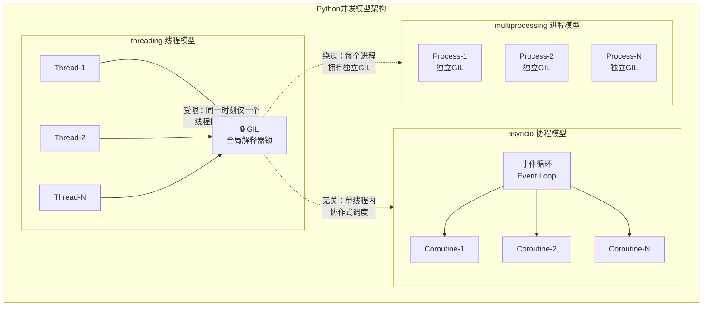
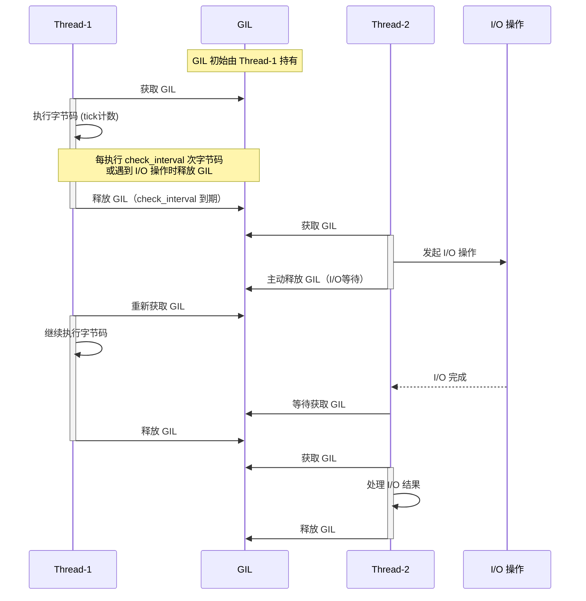
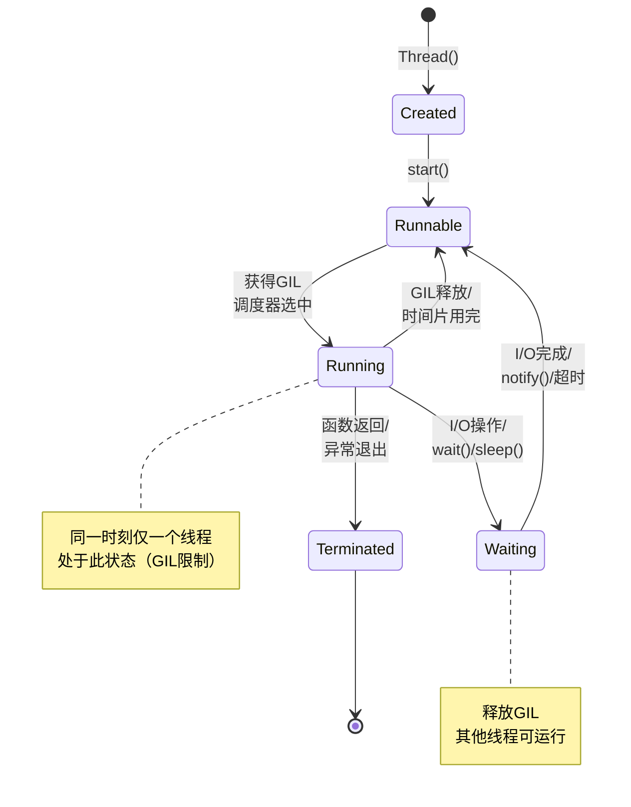
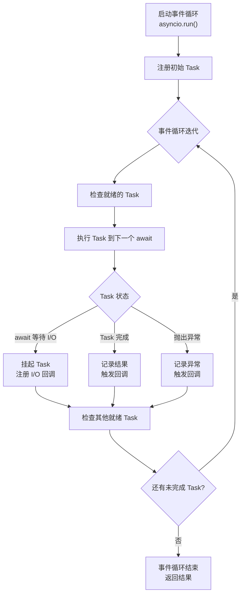
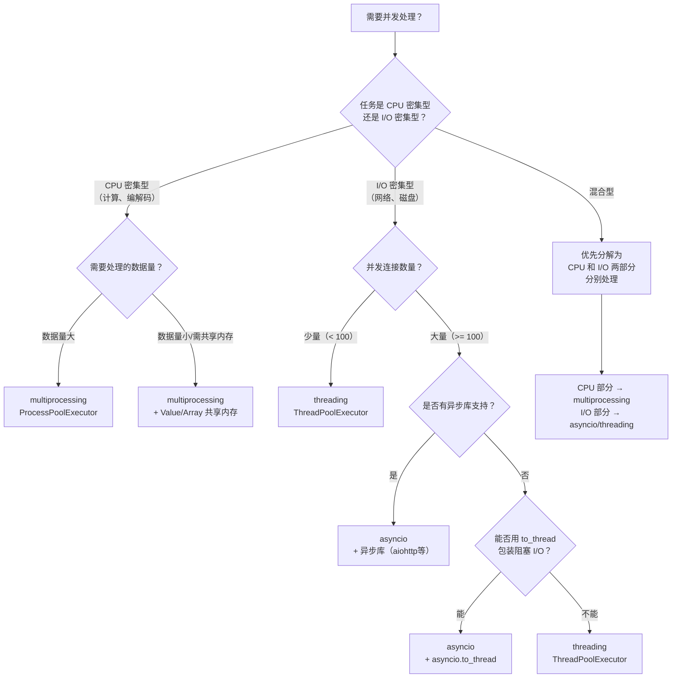

# Python 并发与并行编程：全面指南

> **三层展开**：是什么（并发/并行模型） → 为什么（GIL 限制与选型依据） → 怎么做（threading / multiprocessing / asyncio 实战）

在现代计算中，为了充分利用多核 CPU 的性能并处理复杂的 I/O 操作，**并发（Concurrency）** 与 **并行（Parallelism）** 编程变得至关重要。Python 提供了三种核心并发模型——`threading`、`multiprocessing`、`asyncio`——每种都有其适用场景与局限。

---

## 1. 核心概念：并发与并行

### 1.1 是什么

| 概念 | 定义 | 一句话 |
|:---|:---|:---|
| **并发** | 在一段时间内交错处理多个任务 | 一个厨师交替做两道菜 |
| **并行** | 在同一时刻真正同时执行多个任务 | 两个厨师各做一道菜 |

### 1.2 为什么需要区分

- **并发**追求的是 **最小化等待时间**：当任务 A 等待 I/O 时，CPU 切换到任务 B，提高资源利用率。
- **并行**追求的是 **最大化计算速度**：将计算任务分配到多个 CPU 核心，缩短总执行时间。

### 1.3 怎么做：Python 并发模型架构



| 特性 | 并发 (Concurrency) | 并行 (Parallelism) |
|:---|:---|:---|
| **定义** | 任务交错执行，看起来像同时运行 | 任务在同一时刻同时执行 |
| **目标** | 最小化等待时间，提高资源利用率 | 最大化计算速度，缩短总执行时间 |
| **实现方式** | 单核或多核 CPU 上的任务切换 | 必须在多核 CPU 上 |
| **典型场景** | I/O 密集型任务（网络、磁盘） | CPU 密集型任务（计算、分析） |

---

## 2. GIL 机制详解

### 2.1 是什么

**GIL（Global Interpreter Lock，全局解释器锁）** 是 CPython 解释器中的一把互斥锁，它保证在任何时刻，**只有一个线程**能够执行 Python 字节码。

### 2.2 为什么存在

GIL 的存在是为了简化 CPython 的内存管理：
- Python 使用**引用计数**进行垃圾回收
- 如果多个线程同时修改引用计数，会导致计数错误，引发内存泄漏或提前释放
- GIL 通过限制同一时刻只有一个线程执行字节码，避免了引用计数的竞争条件

### 2.3 GIL 运行时序



### 2.4 GIL 对不同任务的影响

| 任务类型 | GIL 影响 | 原因 | 推荐方案 |
|:---|:---|:---|:---|
| **CPU 密集型** | 严重受限 | 线程无法真正并行，反而有线程切换开销 | `multiprocessing` |
| **I/O 密集型** | 影响较小 | I/O 等待时自动释放 GIL | `threading` 或 `asyncio` |
| **C 扩展计算** | 可绕过 | NumPy/OpenCV 等在 C 层释放 GIL | `threading` 亦可 |
| **纯 Python 计算** | 完全受限 | 纯 Python 字节码受 GIL 约束 | `multiprocessing` |

---

## 3. threading 线程模块

### 3.1 是什么

`threading` 模块基于操作系统原生线程实现，每个 Python 线程对应一个 OS 线程。受 GIL 限制，同一时刻只有一个线程执行 Python 字节码，但在 I/O 等待时会自动释放 GIL。

### 3.2 为什么用线程

- I/O 密集型任务（网络请求、文件读写、数据库查询）时，线程在等待 I/O 期间释放 GIL，其他线程可以继续执行
- 编程模型直观，符合传统并发思维
- 线程创建和切换开销远小于进程

### 3.3 线程生命周期状态图



### 3.4 怎么做：基本用法

```python
import threading
import time

def worker(name: str, duration: float) -> None:
    """线程工作函数

    Args:
        name: 线程名称，用于日志标识
        duration: 模拟工作时长（秒）
    """
    print(f"线程 {name}：开始工作")       # 1. 线程启动，打印开始信息
    time.sleep(duration)                  # 2. 模拟 I/O 等待，此时释放 GIL
    print(f"线程 {name}：完成工作")       # 3. 等待结束，打印完成信息

# 4. 创建线程对象（此时线程尚未启动，处于 Created 状态）
thread1 = threading.Thread(target=worker, args=("A", 2))
thread2 = threading.Thread(target=worker, args=("B", 3))

# 5. 启动线程（进入 Runnable 状态，等待调度）
thread1.start()
thread2.start()

print("主线程：等待所有子线程完成...")

# 6. 阻塞主线程，直到子线程结束
thread1.join()  # 等待 thread1 进入 Terminated 状态
thread2.join()  # 等待 thread2 进入 Terminated 状态

print("主线程：所有子线程已完成")
```

### 3.5 线程安全与锁机制

在多线程环境中，当多个线程访问共享资源时，必须进行同步以避免**竞态条件（Race Condition）**。Python 提供了多种同步原语：

#### 3.5.1 同步原语对比

| 同步原语 | 用途 | 特点 | 适用场景 |
|:---|:---|:---|:---|
| `Lock` | 互斥访问 | 不可重入，同线程二次获取会死锁 | 保护共享资源的最基本方式 |
| `RLock` | 可重入互斥 | 同一线程可多次 acquire，需等量 release | 需要递归调用或同线程多次加锁 |
| `Semaphore` | 限制并发数 | 内部计数器控制同时访问的线程数 | 限流、连接池、资源池 |
| `Event` | 线程间信号通知 | set/clear/wait，一对多通知 | 等待某个条件成立后统一唤醒 |
| `Condition` | 条件变量 | 结合 Lock + wait/notify | 生产者-消费者模式 |

#### 3.5.2 Lock 基本用法

```python
import threading

counter = 0                                      # 1. 共享变量，无保护时多线程修改会竞态
lock = threading.Lock()                           # 2. 创建互斥锁

def increment() -> None:
    """对共享计数器安全递增 100000 次"""
    global counter
    for _ in range(100000):
        with lock:                                # 3. with 语句自动 acquire/release
            counter += 1                          # 4. 临界区：同一时刻仅一个线程可执行

threads = [threading.Thread(target=increment) for _ in range(5)]

for t in threads:
    t.start()                                     # 5. 启动 5 个线程

for t in threads:
    t.join()                                      # 6. 等待所有线程完成

print(f"最终计数: {counter}")                     # 7. 期望输出: 500000（无锁时远小于此值）
```

#### 3.5.3 RLock 可重入锁

```python
import threading

rlock = threading.RLock()                         # 1. 创建可重入锁

def outer_function() -> None:
    """外层函数获取锁后调用内层函数"""
    with rlock:                                   # 2. 第一次 acquire（计数=1）
        print("外层获取锁")
        inner_function()                          # 3. 调用内层，同线程再次 acquire
        print("外层释放锁")                        # 6. 第二次 release（计数=0，真正释放）

def inner_function() -> None:
    """内层函数也需要同一把锁"""
    with rlock:                                   # 4. 同一线程第二次 acquire（计数=2，不阻塞）
        print("内层获取锁")                        # 5. 第一次 release（计数=1，未真正释放）

outer_function()
# 若使用 Lock 替代 RLock，inner_function 会死锁
```

#### 3.5.4 Semaphore 信号量

```python
import threading
import time

semaphore = threading.Semaphore(3)                # 1. 最多允许 3 个线程同时访问

def access_resource(worker_id: int) -> None:
    """模拟有限资源的访问"""
    with semaphore:                               # 2. 获取信号量，计数器 -1
        print(f"工作者 {worker_id} 开始访问资源")   # 3. 最多 3 个线程同时执行此段
        time.sleep(2)                             # 4. 模拟资源使用
        print(f"工作者 {worker_id} 释放资源")       # 5. 离开 with 块，计数器 +1

threads = [threading.Thread(target=access_resource, args=(i,)) for i in range(10)]

for t in threads:
    t.start()
for t in threads:
    t.join()
# 输出可见：每次最多 3 个线程同时访问
```

#### 3.5.5 Event 事件通知

```python
import threading
import time

event = threading.Event()                         # 1. 创建事件对象（初始为 unset）

def waiter(name: str) -> None:
    """等待事件被设置"""
    print(f"{name}：等待事件触发...")               # 2. 打印等待信息
    event.wait()                                  # 3. 阻塞，直到 event.set() 被调用
    print(f"{name}：事件已触发，开始执行！")         # 4. 被唤醒后继续执行

def setter() -> None:
    """设置事件"""
    time.sleep(3)                                 # 5. 模拟准备工作
    print("setter：准备就绪，触发事件！")            # 6. 触发前打印
    event.set()                                   # 7. 设置事件，唤醒所有 wait() 的线程

# 8. 启动多个等待线程和一个触发线程
threads = [threading.Thread(target=waiter, args=(f"Waiter-{i}",)) for i in range(3)]
threads.append(threading.Thread(target=setter))

for t in threads:
    t.start()
for t in threads:
    t.join()
```

#### 3.5.6 Condition 条件变量

```python
import threading
import time
import random

condition = threading.Condition()                 # 1. 创建条件变量（内部自带 Lock）
items = []                                        # 2. 共享缓冲区

def producer() -> None:
    """生产者：向缓冲区添加数据"""
    for i in range(5):
        time.sleep(random.uniform(0.1, 0.5))      # 3. 模拟生产耗时
        with condition:                           # 4. 获取关联的锁
            item = f"项目-{i}"
            items.append(item)                    # 5. 向缓冲区添加数据
            print(f"生产: {item}")
            condition.notify_all()                # 6. 通知所有等待的消费者

def consumer() -> None:
    """消费者：从缓冲区获取数据"""
    consumed = 0
    while consumed < 5:
        with condition:                           # 7. 获取关联的锁
            while not items:                      # 8. 缓冲区为空，必须用 while 防止虚假唤醒
                condition.wait()                  # 9. 释放锁并等待，被唤醒后重新获取锁
            item = items.pop(0)                   # 10. 从缓冲区取出数据
            consumed += 1
            print(f"  消费: {item}")

# 11. 启动生产者和消费者线程
t_producer = threading.Thread(target=producer)
t_consumer = threading.Thread(target=consumer)

t_producer.start()
t_consumer.start()

t_producer.join()
t_consumer.join()
```

### 3.6 线程局部数据 `threading.local`

`threading.local` 对象为每个线程提供独立的存储空间，避免了线程间共享状态时需要进行同步的麻烦。

```python
import threading
import random

local_data = threading.local()                    # 1. 创建线程局部数据对象

def worker() -> None:
    """每个线程拥有独立的 value"""
    local_data.value = random.randint(1, 100)     # 2. 写入当前线程的独立存储
    print(f"线程 {threading.current_thread().name} 的值为: {local_data.value}")  # 3. 读取当前线程的值

threads = [threading.Thread(target=worker) for _ in range(3)]
for t in threads:
    t.start()
for t in threads:
    t.join()
# 每个线程读到的是自己写入的值，互不干扰
```

---

## 4. multiprocessing 进程模块

### 4.1 是什么

`multiprocessing` 模块通过创建独立的操作系统进程来执行任务，每个进程拥有自己的 Python 解释器和内存空间，因此**完全绕过 GIL**，实现真正的并行计算。

### 4.2 为什么用多进程

- CPU 密集型任务需要真正的并行计算，多线程受 GIL 限制无法实现
- 每个进程独立运行，一个进程崩溃不会影响其他进程
- 可以充分利用多核 CPU

### 4.3 怎么做：基本用法

```python
import multiprocessing
import os
import time

def worker(name: str) -> None:
    """进程工作函数"""
    print(f"进程 {name} (PID: {os.getpid()})：开始工作")   # 1. 打印进程ID，验证独立进程
    time.sleep(2)                                          # 2. 模拟工作
    print(f"进程 {name} (PID: {os.getpid()})：完成工作")   # 3. 工作完成

if __name__ == "__main__":                                 # 4. 必须放在 __main__ 保护下！
    process1 = multiprocessing.Process(target=worker, args=("P1",))  # 5. 创建进程对象
    process2 = multiprocessing.Process(target=worker, args=("P2",))

    process1.start()                                       # 6. 启动进程
    process2.start()

    print(f"主进程 PID: {os.getpid()}")                    # 7. 主进程ID与子进程不同

    process1.join()                                        # 8. 等待子进程结束
    process2.join()
    print("主进程：所有子进程已完成")
```

> **重要**：在 Windows 和 macOS 上，子进程会重新导入主脚本。必须将启动进程的代码放在 `if __name__ == "__main__":` 块内，否则会导致无限递归创建子进程。

### 4.4 进程间通信（IPC）

由于进程拥有独立的内存空间，它们之间的通信需要通过特殊机制：

#### 4.4.1 IPC 机制对比

| 机制 | 原理 | 特点 | 适用场景 |
|:---|:---|:---|:---|
| `Queue` | 基于 Pipe + Lock 的线程/进程安全队列 | 支持多生产者多消费者，自动序列化 | 生产者-消费者模式，最常用 |
| `Pipe` | 一对双向管道 | 高性能，但仅支持两端通信 | 两个进程间的点对点通信 |
| `Value` | 共享内存中的单个值 | 需手动指定类型和锁 | 共享简单计数器/标志位 |
| `Array` | 共享内存中的数组 | 需手动指定类型和锁 | 共享数值数组 |

#### 4.4.2 Queue 示例

```python
import multiprocessing

def producer(q: multiprocessing.Queue) -> None:
    """生产者：向队列中放入数据"""
    for i in range(5):
        item = f"项目 {i}"
        q.put(item)                               # 1. 将数据放入队列（自动序列化+跨进程传输）
        print(f"生产: {item}")
    q.put("END")                                  # 2. 发送结束信号

def consumer(q: multiprocessing.Queue) -> None:
    """消费者：从队列中获取数据"""
    while True:
        item = q.get()                            # 3. 阻塞获取数据
        if item == "END":                         # 4. 收到结束信号，退出循环
            break
        print(f"消费: {item}")

if __name__ == "__main__":
    q = multiprocessing.Queue()                   # 5. 创建进程安全的队列

    p_producer = multiprocessing.Process(target=producer, args=(q,))
    p_consumer = multiprocessing.Process(target=consumer, args=(q,))

    p_producer.start()
    p_consumer.start()

    p_producer.join()
    p_consumer.join()
```

#### 4.4.3 Pipe 示例

```python
import multiprocessing

def sender(conn: multiprocessing.connection.Connection) -> None:
    """发送端：通过管道发送数据"""
    for i in range(5):
        conn.send(f"消息 {i}")                    # 1. 向管道写入数据
        print(f"发送: 消息 {i}")
    conn.send(None)                               # 2. 发送结束信号
    conn.close()                                  # 3. 关闭连接

def receiver(conn: multiprocessing.connection.Connection) -> None:
    """接收端：通过管道接收数据"""
    while True:
        msg = conn.recv()                         # 4. 阻塞接收数据
        if msg is None:                           # 5. 收到结束信号
            break
        print(f"接收: {msg}")
    conn.close()                                  # 6. 关闭连接

if __name__ == "__main__":
    parent_conn, child_conn = multiprocessing.Pipe()  # 7. 创建管道，返回两端连接

    p_sender = multiprocessing.Process(target=sender, args=(child_conn,))
    p_receiver = multiprocessing.Process(target=receiver, args=(parent_conn,))

    p_sender.start()
    p_receiver.start()

    p_sender.join()
    p_receiver.join()
```

#### 4.4.4 Value / Array 共享内存

```python
import multiprocessing
import ctypes

def increment_value(val: multiprocessing.Value, lock: multiprocessing.Lock) -> None:
    """对共享值安全递增"""
    for _ in range(100000):
        with lock:                                # 1. 获取锁（共享内存无自动锁保护）
            val.value += 1                        # 2. 修改共享值

def modify_array(arr: multiprocessing.Array) -> None:
    """修改共享数组"""
    for i in range(len(arr)):
        arr[i] = i * 10                           # 3. 修改共享数组中的元素

if __name__ == "__main__":
    # 4. 创建共享内存中的整数（'i' 表示有符号 int）
    shared_val = multiprocessing.Value(ctypes.c_int, 0)
    shared_lock = multiprocessing.Lock()

    # 5. 创建共享内存中的数组（'d' 表示 double，5 个元素）
    shared_arr = multiprocessing.Array(ctypes.c_double, 5)

    processes = [
        multiprocessing.Process(target=increment_value, args=(shared_val, shared_lock))
        for _ in range(5)
    ]

    for p in processes:
        p.start()
    for p in processes:
        p.join()

    print(f"共享值: {shared_val.value}")          # 6. 期望输出: 500000

    p_arr = multiprocessing.Process(target=modify_array, args=(shared_arr,))
    p_arr.start()
    p_arr.join()

    print(f"共享数组: {list(shared_arr)}")        # 7. 输出: [0.0, 10.0, 20.0, 30.0, 40.0]
```

---

## 5. asyncio 协程模块

### 5.1 是什么

`asyncio` 是 Python 用于编写**单线程并发代码**的库，使用**事件循环**和**协程**实现异步 I/O。它通过协作式调度在单线程内切换任务，完全不涉及 GIL 问题。

### 5.2 为什么用协程

- **极高并发**：单线程即可管理数千甚至数万个并发连接，无需线程/进程切换开销
- **资源高效**：协程是用户态调度，创建一个协程仅几 KB，而线程约 8 MB
- **避免竞态**：单线程内协作式调度，无锁、无竞态条件
- **生态成熟**：aiohttp / aiomysql / aiofiles 等异步库生态完善

### 5.3 核心概念

| 概念 | 说明 | 类比 |
|:---|:---|:---|
| **Event Loop** | 事件循环，协程的调度核心，不断监听并执行就绪的任务 | 交通指挥员 |
| **Coroutine** | 用 `async def` 定义的函数，调用后返回协程对象 | 菜单上的菜名（描述，不是菜品本身） |
| **await** | 挂起当前协程，将控制权交还事件循环，等待可等待对象完成 | 等上菜时先让出桌子 |
| **Task** | 对协程的封装，由事件循环调度执行，是"正在做"的协程 | 厨房正在做的菜 |
| **Future** | 代表一个未来才有结果的对象，Task 是 Future 的子类 | 取餐号牌 |

### 5.4 事件循环工作流程



### 5.5 怎么做：基本用法

#### 5.5.1 协程定义与执行

```python
import asyncio
import time

async def say_after(delay: float, what: str) -> None:
    """一个简单的协程

    Args:
        delay: 等待秒数
        what: 要打印的消息
    """
    await asyncio.sleep(delay)                     # 1. 异步等待，不阻塞事件循环
    print(what)                                    # 2. 等待结束后打印

async def main() -> None:
    """主协程"""
    print(f"开始于 {time.strftime('%X')}")

    # 3. 顺序执行：总耗时 1 + 2 = 3 秒
    await say_after(1, "Hello")                    # 4. 等待 1 秒后打印
    await say_after(2, "World")                    # 5. 再等待 2 秒后打印

    print(f"结束于 {time.strftime('%X')}")

asyncio.run(main())                               # 6. 启动事件循环，运行主协程
```

#### 5.5.2 并发执行：create_task + gather

```python
import asyncio
import time

async def say_after(delay: float, what: str) -> None:
    """异步等待后打印消息"""
    await asyncio.sleep(delay)
    print(what)

async def main() -> None:
    print(f"开始于 {time.strftime('%X')}")

    # 1. 方式一：create_task 手动创建任务
    task1 = asyncio.create_task(say_after(1, "Hello"))   # 2. 立即调度，不等待完成
    task2 = asyncio.create_task(say_after(2, "World"))

    await task1                                           # 3. 等待 task1 完成
    await task2                                           # 4. 等待 task2 完成

    print(f"结束于 {time.strftime('%X')}")                # 5. 总耗时约 2 秒（并发执行）

asyncio.run(main())
```

```python
import asyncio
import time

async def fetch_data(name: str, delay: float) -> str:
    """模拟异步获取数据"""
    await asyncio.sleep(delay)                     # 1. 模拟网络延迟
    return f"{name}的数据"                          # 2. 返回结果

async def main() -> None:
    # 3. 方式二：gather 一次并发执行多个协程，按顺序返回结果
    results = await asyncio.gather(
        fetch_data("源A", 2),                      # 4. 并发执行，耗时 2 秒
        fetch_data("源B", 1),                      # 5. 并发执行，耗时 1 秒
        fetch_data("源C", 3),                      # 6. 并发执行，耗时 3 秒
    )                                              # 7. 总耗时约 3 秒（取最长）

    for r in results:
        print(r)                                   # 8. 按传入顺序输出结果

asyncio.run(main())
```

#### 5.5.3 异步 I/O 实战：并发 HTTP 请求

```python
import asyncio
import time

async def fetch_url(url: str) -> tuple[str, int]:
    """异步获取 URL 内容（使用标准库，无需第三方依赖）

    Args:
        url: 目标 URL
    Returns:
        (url, 响应长度) 元组
    """
    import urllib.request
    # 1. 使用 asyncio.to_thread 将阻塞式 I/O 转为异步
    #    这样不会阻塞事件循环
    def _blocking_fetch():
        with urllib.request.urlopen(url, timeout=10) as resp:
            return len(resp.read())

    length = await asyncio.to_thread(_blocking_fetch)   # 2. 在线程池中执行阻塞操作
    return (url, length)

async def main() -> None:
    urls = [
        "https://www.python.org",
        "https://github.com",
        "https://dev.to",
    ]

    print(f"开始于 {time.strftime('%X')}")

    # 3. 并发请求所有 URL
    results = await asyncio.gather(*[fetch_url(url) for url in urls])

    for url, length in results:
        print(f"{url} 的响应长度: {length} 字节")

    print(f"结束于 {time.strftime('%X')}")

asyncio.run(main())
```

#### 5.5.4 超时与取消

```python
import asyncio

async def slow_operation() -> str:
    """模拟一个耗时操作"""
    await asyncio.sleep(10)                        # 1. 模拟 10 秒的慢操作
    return "完成"

async def main() -> None:
    # 2. 方式一：wait_for 设置超时
    try:
        result = await asyncio.wait_for(slow_operation(), timeout=3.0)
        print(result)
    except asyncio.TimeoutError:                   # 3. 超时后抛出 TimeoutError
        print("操作超时！")

    # 4. 方式二：手动取消 Task
    task = asyncio.create_task(slow_operation())
    await asyncio.sleep(3)                         # 5. 等待 3 秒
    task.cancel()                                  # 6. 取消任务

    try:
        await task
    except asyncio.CancelledError:                 # 7. 被取消的任务抛出 CancelledError
        print("任务已被取消")

asyncio.run(main())
```

---

## 6. concurrent.futures 高级并发接口

### 6.1 是什么

`concurrent.futures` 模块对 `threading` 和 `multiprocessing` 进行了封装，提供了更简洁的高层 API。它的核心抽象是 **Future**——代表一个异步计算的未来结果。

### 6.2 为什么用 futures

- 统一 API：线程池和进程池接口一致，切换仅需改一个类名
- 自动管理池的生命周期（`with` 语句）
- `as_completed` 可以逐个处理完成的任务，无需等待全部完成

### 6.3 怎么做

#### 6.3.1 ThreadPoolExecutor 线程池

```python
import concurrent.futures
import time

def io_bound_task(n: int) -> str:
    """模拟 I/O 密集型任务"""
    time.sleep(1)                                  # 1. 模拟 I/O 等待
    return f"任务 {n} 完成"

def main() -> None:
    # 2. 创建包含 5 个工作线程的线程池
    with concurrent.futures.ThreadPoolExecutor(max_workers=5) as executor:
        # 3. submit 立即返回 Future 对象，不阻塞
        futures = [executor.submit(io_bound_task, i) for i in range(5)]

        # 4. as_completed 在任务完成时逐个返回（不保证顺序）
        for future in concurrent.futures.as_completed(futures):
            result = future.result()               # 5. 获取任务结果（已完成，不阻塞）
            print(result)

if __name__ == "__main__":
    main()
# 总耗时约 1 秒（5 个任务并发执行）
```

#### 6.3.2 ProcessPoolExecutor 进程池

```python
import concurrent.futures
import math

def cpu_bound_task(n: int) -> float:
    """模拟 CPU 密集型任务：计算 1 到 n 的平方根之和"""
    return sum(math.sqrt(i) for i in range(1, n))  # 1. 纯计算，无 I/O

def main() -> None:
    numbers = [1000000 + i for i in range(10)]

    # 2. 创建进程池（默认进程数 = CPU 核心数）
    with concurrent.futures.ProcessPoolExecutor() as executor:
        # 3. map 方法按输入顺序返回结果
        results = executor.map(cpu_bound_task, numbers)

        for result in results:
            print(f"计算结果: {result:.2f}")

if __name__ == "__main__":
    main()
```

---

## 7. 并发方案选择决策

### 7.1 决策树



### 7.2 三大模型全面对比

| 维度 | threading | multiprocessing | asyncio |
|:---|:---|:---|:---|
| **GIL 影响** | 受限：同一时刻仅一个线程执行字节码 | 不受限：每个进程有独立 GIL | 无关：单线程协作式调度 |
| **适用场景** | I/O 密集型（少量并发） | CPU 密集型 | I/O 密集型（大量并发） |
| **内存开销** | 中等（每线程约 8 MB） | 高（每进程约 20-100 MB） | 极低（每协程约几 KB） |
| **通信方式** | 共享变量（需锁保护） | Queue / Pipe / Value / Array | 不需要通信（单线程） |
| **调试难度** | 中等（竞态条件难复现） | 中等（进程状态独立） | 较低（无竞态，但调用栈复杂） |
| **启动开销** | 低 | 高（需复制解释器） | 极低 |
| **切换开销** | 中（OS 级上下文切换） | 高（进程上下文切换） | 极低（用户态协程切换） |
| **生态兼容性** | 所有同步库可用 | 所有同步库可用 | 需异步库（aiohttp 等） |
| **推荐并发数** | 数十到数百 | 等于 CPU 核心数 | 数千到数万 |

### 7.3 最佳实践对比表

| 最佳实践 | threading | multiprocessing | asyncio |
|:---|:---|:---|:---|
| **首选 API** | `ThreadPoolExecutor` | `ProcessPoolExecutor` | `asyncio.gather` |
| **资源管理** | 用 `with` 管理池生命周期 | 用 `with` 管理池生命周期 | 用 `async with` 管理连接 |
| **异常处理** | `future.result()` 获取异常 | `future.result()` 获取异常 | `try/except` 包裹 `await` |
| **超时控制** | `future.result(timeout=N)` | `future.result(timeout=N)` | `asyncio.wait_for(coro, timeout=N)` |
| **取消任务** | 不支持直接取消 | 不支持直接取消 | `task.cancel()` |
| **进度监控** | `as_completed` | `as_completed` | `asyncio.as_completed` |
| **日志建议** | 含 `threadName` | 含 `processName` | 含 `task_name` |

---

## 8. 实战案例

### 8.1 线程池：并发下载

```python
import concurrent.futures
import urllib.request
import time

def download(url: str) -> tuple[str, int]:
    """下载 URL 内容并返回长度

    Args:
        url: 目标 URL
    Returns:
        (url, 内容长度) 元组
    """
    with urllib.request.urlopen(url, timeout=15) as resp:   # 1. 阻塞式下载
        data = resp.read()                                   # 2. 读取全部内容
        return (url, len(data))

def main() -> None:
    urls = [
        "https://www.python.org",
        "https://github.com",
        "https://dev.to",
        "https://docs.python.org",
        "https://pypi.org",
    ]

    start = time.time()

    # 3. 使用线程池并发下载（I/O 密集型适合线程）
    with concurrent.futures.ThreadPoolExecutor(max_workers=5) as executor:
        # 4. 将所有下载任务提交到线程池
        future_to_url = {executor.submit(download, url): url for url in urls}

        for future in concurrent.futures.as_completed(future_to_url):
            url = future_to_url[future]
            try:
                url, length = future.result()                # 5. 获取结果
                print(f"✓ {url}: {length} 字节")
            except Exception as e:
                print(f"✗ {url}: {e}")                       # 6. 处理异常

    print(f"总耗时: {time.time() - start:.2f} 秒")

if __name__ == "__main__":
    main()
```

### 8.2 进程池：并行计算

```python
import concurrent.futures
import math
import time

def is_prime(n: int) -> bool:
    """判断 n 是否为素数（CPU 密集型）"""
    if n < 2:
        return False
    if n < 4:
        return True
    if n % 2 == 0 or n % 3 == 0:                   # 1. 排除偶数和 3 的倍数
        return False
    for i in range(5, int(math.sqrt(n)) + 1, 6):   # 2. 仅检查 6k±1 形式的因子
        if n % i == 0 or n % (i + 2) == 0:
            return False
    return True

def find_primes_in_range(start: int, end: int) -> list[int]:
    """在指定范围内查找所有素数"""
    return [n for n in range(start, end) if is_prime(n)]  # 3. 逐个判断

def main() -> None:
    range_start = 10_000_000
    range_end = 10_100_000
    num_workers = 4

    # 4. 将范围分割为 num_workers 段
    chunk = (range_end - range_start) // num_workers
    ranges = [
        (range_start + i * chunk, range_start + (i + 1) * chunk)
        for i in range(num_workers)
    ]

    start_time = time.time()

    # 5. 使用进程池并行计算（CPU 密集型适合多进程）
    with concurrent.futures.ProcessPoolExecutor(max_workers=num_workers) as executor:
        futures = [executor.submit(find_primes_in_range, s, e) for s, e in ranges]

        total_primes = 0
        for future in concurrent.futures.as_completed(futures):
            primes = future.result()                 # 6. 获取每段的素数列表
            total_primes += len(primes)

    elapsed = time.time() - start_time
    print(f"在 {range_start}-{range_end} 范围内找到 {total_primes} 个素数")
    print(f"耗时: {elapsed:.2f} 秒（{num_workers} 进程并行）")

if __name__ == "__main__":
    main()
```

### 8.3 asyncio：高并发异步 I/O

```python
import asyncio
import time

async def fetch_data(source_id: int, delay: float) -> dict:
    """模拟从数据源异步获取数据

    Args:
        source_id: 数据源编号
        delay: 模拟网络延迟（秒）
    Returns:
        包含数据源信息和结果的字典
    """
    print(f"  → 开始获取数据源 {source_id}")
    await asyncio.sleep(delay)                      # 1. 异步等待，不阻塞事件循环
    result = f"数据源{source_id}_结果"
    print(f"  ← 数据源 {source_id} 完成（耗时 {delay}s）")
    return {"source": source_id, "data": result}

async def main() -> None:
    start = time.time()

    # 2. 模拟 10 个数据源，不同延迟
    tasks = [
        fetch_data(i, delay=1.0 + (i % 3) * 0.5)   # 3. 延迟 1.0-2.0 秒不等
        for i in range(10)
    ]

    # 4. gather 并发执行所有任务
    results = await asyncio.gather(*tasks)

    # 5. 按数据源编号排序输出
    for r in sorted(results, key=lambda x: x["source"]):
        print(f"  数据源 {r['source']}: {r['data']}")

    elapsed = time.time() - start
    print(f"总耗时: {elapsed:.2f} 秒")               # 6. 总耗时约 2 秒（取最长延迟）

asyncio.run(main())
```

---

## 9. 常见陷阱与 FAQ

### FAQ 1：GIL 限制下多线程还有用吗？

**有用**。GIL 仅限制 Python 字节码的并行执行，但以下场景多线程仍有效：

| 场景 | GIL 行为 | 多线程效果 |
|:---|:---|:---|
| I/O 操作（网络、文件） | 自动释放 GIL | 有效并发 |
| C 扩展计算（NumPy、OpenCV） | 在 C 层可释放 GIL | 有效并发 |
| `time.sleep()` | 释放 GIL | 有效并发 |
| 纯 Python 计算 | 不释放 GIL | 无效，甚至更慢 |

### FAQ 2：如何避免死锁？

**死锁的四个必要条件**：互斥、持有并等待、不可抢占、循环等待。打破任一条件即可预防：

```python
import threading
import time

# ✗ 错误示范：以不同顺序获取锁，可能死锁
lock_a = threading.Lock()
lock_b = threading.Lock()

def deadlock_task1():
    with lock_a:                                   # 1. 先获取 lock_a
        time.sleep(0.1)
        with lock_b:                               # 2. 再获取 lock_b（可能被 task2 持有）
            print("task1 完成")

def deadlock_task2():
    with lock_b:                                   # 3. 先获取 lock_b
        time.sleep(0.1)
        with lock_a:                               # 4. 再获取 lock_a（可能被 task1 持有）
            print("task2 完成")

# ✓ 正确做法：始终以相同顺序获取锁
def safe_task1():
    with lock_a:                                   # 5. 两个任务都以 lock_a → lock_b 的顺序获取
        time.sleep(0.1)
        with lock_b:
            print("safe_task1 完成")

def safe_task2():
    with lock_a:                                   # 6. 同样先获取 lock_a
        time.sleep(0.1)
        with lock_b:
            print("safe_task2 完成")
```

**更多防死锁策略**：
- 使用 `RLock` 避免同线程重复加锁导致的自锁
- 使用 `lock.acquire(timeout=5)` 设置超时
- 尽量减少锁的持有时间
- 使用 `threading.local` 避免不必要的共享状态

### FAQ 3：进程开销太大怎么办？

| 策略 | 说明 |
|:---|:---|
| 使用进程池 | 预创建进程，避免频繁创建/销毁 |
| 增大任务粒度 | 每个进程处理更多数据，摊薄启动开销 |
| 共享内存替代序列化 | 用 `Value`/`Array` 避免 pickle 开销 |
| 考虑 C 扩展 | NumPy 等库在 C 层释放 GIL，线程即可并行 |

### FAQ 4：asyncio 和 threading 能混用吗？

**可以**，Python 3.9+ 提供了 `asyncio.to_thread()` 正式支持混用：

```python
import asyncio
import time

def blocking_io(name: str) -> str:
    """阻塞式 I/O 操作（无法改为 async 的旧代码）"""
    time.sleep(2)                                  # 1. 阻塞操作
    return f"{name} 完成"

async def main() -> None:
    # 2. asyncio.to_thread 将阻塞函数放入线程池执行
    #    不会阻塞事件循环
    result = await asyncio.to_thread(blocking_io, "阻塞任务")
    print(result)                                  # 3. 获取结果

    # 4. 也可以并发执行多个阻塞任务
    results = await asyncio.gather(
        asyncio.to_thread(blocking_io, "任务A"),
        asyncio.to_thread(blocking_io, "任务B"),
        asyncio.sleep(1),                          # 5. 同时执行异步任务
    )

asyncio.run(main())
```

### FAQ 5：multiprocessing 在 Jupyter/交互式环境中报错？

Jupyter Notebook 的 `__name__` 不是 `"__main__"`，且 `spawn` 方式会重新导入模块。解决方案：

```python
# 方案一：将 worker 函数放到单独的 .py 文件中 import
# 方案二：使用 fork 启动方式（仅 Linux/macOS；3.14 起 Linux 默认已改为 forkserver，
#         且在线程环境中 fork 自 3.12 起有弃用警告，建议优先尝试 forkserver 或方案三）
import multiprocessing as mp
mp.set_start_method('fork')                        # 1. 使用 fork 而非 spawn

# 方案三：使用 concurrent.futures.ProcessPoolExecutor
#         它在 Jupyter 中通常可以正常工作
import concurrent.futures
with concurrent.futures.ProcessPoolExecutor() as executor:
    result = executor.submit(lambda x: x * x, 10).result()
```

### FAQ 6：如何调试并发代码？

```python
import logging
import threading

# 1. 使用 logging 替代 print（logging 是线程安全的）
logging.basicConfig(
    level=logging.INFO,
    format='%(asctime)s [%(threadName)s] %(message)s'   # 2. 包含线程名
)

# 3. 对于 multiprocessing，包含进程名
import multiprocessing
logging.basicConfig(
    level=logging.INFO,
    format='%(asctime)s [%(processName)s/%(threadName)s] %(message)s'
)

# 4. 对于 asyncio，使用 asyncio 的调试模式
import asyncio
asyncio.run(main(), debug=True)                    # 5. 开启调试：检测未 await 的协程等
```

---

## 术语表

| 术语 | 英文 | 定义 |
|:---|:---|:---|
| **并发** | Concurrency | 在一段时间内交错处理多个任务，强调结构 |
| **并行** | Parallelism | 在同一时刻同时执行多个任务，强调执行 |
| **GIL** | Global Interpreter Lock | CPython 的全局解释器锁，限制同一时刻仅一个线程执行字节码 |
| **线程** | Thread | OS 级别的最小调度单元，多线程共享进程内存 |
| **进程** | Process | OS 级别的资源分配单元，拥有独立内存空间 |
| **协程** | Coroutine | 用户态的轻量级调度单元，由事件循环管理 |
| **事件循环** | Event Loop | asyncio 的调度核心，监听 I/O 事件并分派任务 |
| **竞态条件** | Race Condition | 多个执行单元以不可预测的顺序访问共享数据，导致结果不一致 |
| **死锁** | Deadlock | 两个或多个执行单元互相等待对方释放资源，都无法继续 |
| **锁** | Lock | 互斥同步原语，保证同一时刻仅一个执行单元进入临界区 |
| **可重入锁** | RLock | 允许同一线程多次获取的锁，需等量释放 |
| **信号量** | Semaphore | 限制同时访问某资源的执行单元数量的同步原语 |
| **条件变量** | Condition | 结合锁与等待/通知机制的同步原语 |
| **Future** | Future | 代表一个异步计算的未来结果的对象 |
| **Task** | Task | 对协程的封装，由事件循环调度执行的 Future 子类 |
| **IPC** | Inter-Process Communication | 进程间通信机制 |
| **上下文切换** | Context Switch | CPU 从一个执行单元切换到另一个的开销 |
| **协作式调度** | Cooperative Scheduling | 执行单元主动让出控制权的调度方式（asyncio） |
| **抢占式调度** | Preemptive Scheduling | 由 OS 强制切换执行单元的调度方式（threading） |

---

## 延伸阅读

| 资源 | 类型 | 说明 |
|:---|:---|:---|
| [Python 官方文档 — threading](https://docs.python.org/3/library/threading.html) | 官方文档 | 线程模块完整 API 参考 |
| [Python 官方文档 — multiprocessing](https://docs.python.org/3/library/multiprocessing.html) | 官方文档 | 进程模块完整 API 参考 |
| [Python 官方文档 — asyncio](https://docs.python.org/3/library/asyncio.html) | 官方文档 | 协程模块完整 API 参考 |
| [Python 官方文档 — concurrent.futures](https://docs.python.org/3/library/concurrent.futures.html) | 官方文档 | 高级并发接口 API 参考 |
| [PEP 3156 — asyncio](https://peps.python.org/pep-3156/) | PEP | asyncio 的设计规范 |
| [PEP 703 — Making the Global Interpreter Lock Optional](https://peps.python.org/pep-0703/) | PEP | free-threaded 构建（无 GIL）：3.13 实验性引入，3.14 起正式支持（PEP 779） |
| [Real Python — Async IO in Python](https://realpython.com/async-io-python/) | 教程 | asyncio 深度教程 |
| [Real Python — Python GIL](https://realpython.com/python-gil/) | 教程 | GIL 机制详解 |
| [Fluent Python (2nd Edition)](https://www.oreilly.com/library/view/fluent-python-2nd/9781492056348/) | 书籍 | Luciano Ramalho 著，第 19-21 章深入讲解并发 |
| [Python Concurrency with asyncio](https://www.manning.com/books/python-concurrency-with-asyncio) | 书籍 | Matthew Fowler 著，asyncio 实战指南 |

---

## 10. 总结与最佳实践

1. **理解任务类型**：首先分析任务是 CPU 密集型还是 I/O 密集型，这是选择正确工具的基础
2. **优先选择高层 API**：`concurrent.futures` 提供了简洁、易用的接口，应作为首选。当需要更精细的控制时，再考虑使用 `threading` 或 `multiprocessing`
3. **拥抱异步**：对于新的网络应用，特别是需要处理大量并发连接的场景，`asyncio` 是一个强大的选择
4. **保持简单**：并发会增加复杂性。如果性能不是瓶颈，简单的顺序执行代码更容易维护
5. **资源管理**：确保正确关闭进程池/线程池，释放文件句柄和网络连接，避免资源泄漏
6. **关注 free-threaded 构建**：PEP 703 的 free-threaded 模式（可选禁用 GIL）在 3.13 为实验性，3.14 起已正式支持（PEP 779）。CPU 密集型多线程将不再受 GIL 限制，但目前仍非默认构建

通过理解这些核心概念和工具，你可以为你的 Python 应用选择最合适的并发或并行策略，从而显著提升其性能和响应能力。

## 版本差异（并发 → Python 3.13/3.14）

| 特性 | 本文编写时 | Python 3.13/3.14 |
|------|-----------|------------------|
| GIL | 全局锁 | 3.13 提供实验性 free-threaded 构建（PEP 703，`python3.13t`）；3.14 起正式支持（PEP 779），但仍非默认构建 |
| 线程池 | `ThreadPoolExecutor` | 不变；3.9+ 默认 max_workers 为 min(32, CPU+4) |
| 进程间通信 | `multiprocessing` | 3.14 起 Linux 等平台默认启动方式由 `fork` 改为 `forkserver`（Windows/macOS 仍为 `spawn`）；`queue`/`Pipe` 稳定 |
| 协程与线程混用 | `run_in_executor` | 3.9+ 推荐 `asyncio.to_thread()` |

> 本文讲解的 threading/multiprocessing 原理在 3.14 中完全成立；free-threaded 构建为 CPU 密集型多线程提供了新选项（3.14 起正式支持）。
