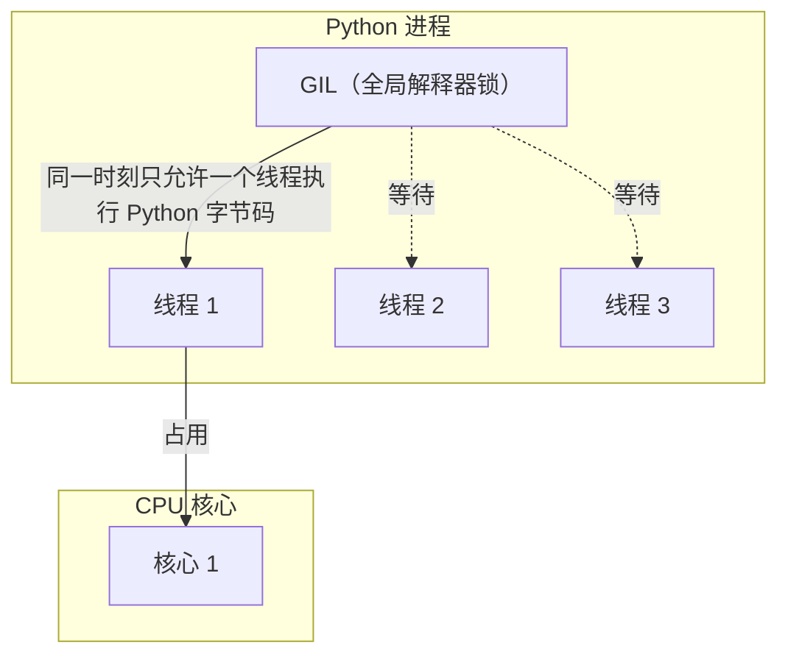

# threading 实战

Python 的 `threading` 模块提供了构建多线程应用的基础设施。对于 I/O 密集型任务（网络请求、文件操作、用户交互），多线程能显著提升程序吞吐量。本文面向 1-3 年经验的 Python 开发者，从基础概念到实战场景，系统讲解多线程编程的核心技术。

> 阅读提示

- 如果你只想快速上手，可以直接跳到[线程创建与启动](#线程创建与启动)
- 如果你想理解线程安全，重点阅读[线程安全与锁](#线程安全与锁)
- 如果你需要解决具体问题，可以查看[实战场景](#实战场景)和[常见陷阱](#常见陷阱)
- 本文所有代码示例基于 **Python 3.10+**，建议在阅读时同步运行实验

## 概念全景：GIL 与多线程的边界

在深入代码之前，必须理解 Python 多线程的核心约束——**全局解释器锁（GIL, Global Interpreter Lock）**。



### GIL 的影响

| 场景 | GIL 影响 | 多线程效果 |
|------|----------|------------|
| **CPU 密集型**（数值计算、图像处理） | 严重限制 | 线程间频繁切换，性能反而下降 |
| **I/O 密集型**（网络请求、文件读写） | 影响较小 | I/O 阻塞时释放 GIL，多线程显著提升吞吐量 |
| **混合型** | 中等影响 | 需要合理设计，I/O 部分可并行，CPU 部分串行 |

::: tip 何时使用多线程
- 网络爬虫、并发 HTTP 请求
- 并发文件下载/上传
- GUI 应用保持界面响应
- 数据库并发查询
- 不适合：大规模数值计算（考虑 `multiprocessing` 或 `concurrent.futures.ProcessPoolExecutor`）
:::

## 线程创建与启动

Python 提供两种创建线程的方式：实例化 `Thread` 类和使用 `threading` 模块的高级函数。

### 方式一：实例化 Thread 类

```python
import threading
import time


def worker(name: str, delay: float):
    """工作线程函数"""
    print(f"[{name}] 开始工作")
    time.sleep(delay)  # 模拟耗时操作
    print(f"[{name}] 工作完成")


# 创建线程
t1 = threading.Thread(target=worker, args=("线程A", 2.0))
t2 = threading.Thread(target=worker, args=("线程B", 1.0))

# 启动线程
t1.start()
t2.start()

# 等待线程结束
t1.join()
t2.join()

print("所有线程已完成")
```

### 方式二：继承 Thread 类

```python
import threading
import time


class WorkerThread(threading.Thread):
    """自定义线程类"""

    def __init__(self, name: str, delay: float):
        super().__init__()
        self.name = name
        self.delay = delay

    def run(self):
        """重写 run 方法定义线程逻辑"""
        print(f"[{self.name}] 开始工作")
        time.sleep(self.delay)
        print(f"[{self.name}] 工作完成")


# 使用自定义线程类
t1 = WorkerThread("线程A", 2.0)
t2 = WorkerThread("线程B", 1.0)

t1.start()
t2.start()

t1.join()
t2.join()
```

### 关键方法详解

| 方法 | 说明 | 使用场景 |
|------|------|----------|
| `start()` | 启动线程，调用 `run()` 方法 | 必须调用，不要直接调用 `run()` |
| `join(timeout=None)` | 等待线程结束 | 确保线程完成后再继续主线程 |
| `is_alive()` | 检查线程是否存活 | 监控线程状态 |
| `name` 属性 | 设置/获取线程名称 | 调试和日志记录（`setName()`/`getName()` 自 3.10 起已废弃，改用属性） |

::: danger start() vs run()
- `start()`：创建新线程，在新线程中执行 `run()`
- `run()`：在当前线程中同步执行，**不会创建新线程**

```python
t = threading.Thread(target=worker)
t.run()   # 错误！在主线程中同步执行
t.start() # 正确！创建新线程执行
```
:::

### 守护线程（Daemon Thread）

守护线程在主线程结束时自动终止，不会阻止程序退出。适用于后台任务（日志收集、心跳检测）。

```python
import threading
import time


def background_monitor():
    """后台监控任务"""
    while True:
        print("监控中...")
        time.sleep(1)


# 创建守护线程
daemon_thread = threading.Thread(target=background_monitor)
daemon_thread.daemon = True  # 设置为守护线程
daemon_thread.start()

# 主线程工作
time.sleep(3)
print("主线程结束，守护线程将自动终止")
```

::: warning 守护线程注意事项
- 守护线程被强制终止时不会执行清理代码（`finally` 块不会运行）
- 不要在守护线程中操作需要正确关闭的资源（文件、数据库连接）
- 默认情况下，新线程继承创建它的线程的 daemon 属性
:::

## 线程安全与锁

多线程环境下，多个线程同时访问共享数据会导致**竞态条件（Race Condition）**，产生不可预测的结果。

### 竞态条件示例

```python
import threading

counter = 0  # 共享变量


def increment():
    global counter
    for _ in range(100000):
        counter += 1  # 非原子操作！


# 创建多个线程同时修改 counter
threads = [threading.Thread(target=increment) for _ in range(10)]
for t in threads:
    t.start()
for t in threads:
    t.join()

print(f"预期结果: 1000000")
print(f"实际结果: {counter}")  # 每次运行结果不同，且小于预期值
```

`counter += 1` 实际上是三步操作：
1. 读取 `counter` 的值
2. 将值加 1
3. 将新值写回 `counter`

多线程交错执行这些步骤会导致数据丢失。

### Lock：互斥锁

`Lock` 是最基本的同步原语，确保同一时刻只有一个线程访问共享资源。

```python
import threading

counter = 0
lock = threading.Lock()  # 创建锁


def safe_increment():
    global counter
    for _ in range(100000):
        with lock:  # 使用上下文管理器自动获取/释放锁
            counter += 1


threads = [threading.Thread(target=safe_increment) for _ in range(10)]
for t in threads:
    t.start()
for t in threads:
    t.join()

print(f"预期结果: 1000000")
print(f"实际结果: {counter}")  # 正确输出 1000000
```

#### Lock 的两种使用方式

```python
lock = threading.Lock()

# 方式一：上下文管理器（推荐）
with lock:
    # 临界区代码
    pass

# 方式二：显式调用
lock.acquire()
try:
    # 临界区代码
    pass
finally:
    lock.release()  # 必须在 finally 中释放，防止死锁
```

::: danger 死锁风险
如果一个线程获取锁后忘记释放，其他线程将永远等待。始终使用 `with` 语句或 `try-finally` 确保锁被释放。
:::

### RLock：可重入锁

`RLock`（Reentrant Lock）允许同一个线程多次获取同一把锁，解决递归调用中的死锁问题。

```python
import threading

rlock = threading.RLock()


def recursive_function(depth: int):
    """递归函数需要可重入锁"""
    with rlock:  # 同一线程可以多次获取 RLock
        print(f"深度: {depth}")
        if depth > 0:
            recursive_function(depth - 1)


# 使用 Lock 会导致死锁
# lock = threading.Lock()
# def recursive_with_lock(depth):
#     with lock:  # 第二次获取同一把锁会永久阻塞
#         if depth > 0:
#             recursive_with_lock(depth - 1)

recursive_function(3)
```

#### Lock vs RLock 对比

| 特性 | Lock | RLock |
|------|------|-------|
| 同一线程多次获取 | 死锁 | 允许 |
| 性能 | 略高 | 略低（需维护计数） |
| 使用场景 | 简单互斥 | 递归调用、回调函数 |
| 释放要求 | 任意线程可释放 | 必须由获取锁的线程释放 |

### Semaphore：信号量

信号量控制同时访问资源的线程数量，适用于资源池（数据库连接池、线程池）。

```python
import threading
import time

# 限制最多 3 个线程同时访问
semaphore = threading.Semaphore(3)


def limited_resource(name: str):
    with semaphore:
        print(f"[{name}] 获取资源")
        time.sleep(2)  # 模拟资源使用
        print(f"[{name}] 释放资源")


threads = [threading.Thread(target=limited_resource, args=(f"线程{i}",)) for i in range(6)]
for t in threads:
    t.start()
for t in threads:
    t.join()

# 输出显示：每批最多 3 个线程同时执行
```

### Event：事件通知

`Event` 用于线程间简单的事件通知，一个线程设置事件，其他线程等待事件。

```python
import threading
import time

event = threading.Event()


def waiter(name: str):
    print(f"[{name}] 等待事件...")
    event.wait()  # 阻塞直到事件被设置
    print(f"[{name}] 事件已触发，继续执行")


def setter():
    time.sleep(2)
    print("[设置者] 触发事件")
    event.set()  # 设置事件，唤醒所有等待的线程


threads = [threading.Thread(target=waiter, args=(f"等待者{i}",)) for i in range(3)]
threads.append(threading.Thread(target=setter))

for t in threads:
    t.start()
for t in threads:
    t.join()
```

#### Event 的关键方法

| 方法 | 说明 |
|------|------|
| `set()` | 设置事件，唤醒所有等待线程 |
| `clear()` | 清除事件，后续 `wait()` 将阻塞 |
| `wait(timeout=None)` | 阻塞直到事件被设置，可设置超时 |
| `is_set()` | 检查事件是否被设置 |

### Condition：条件变量

`Condition` 提供更复杂的线程同步，允许线程等待特定条件满足后再继续执行。

```python
import threading
import time
import random

buffer = []
buffer_size = 5
condition = threading.Condition()


def producer():
    """生产者：向缓冲区添加数据"""
    for i in range(10):
        with condition:
            while len(buffer) >= buffer_size:
                print("[生产者] 缓冲区已满，等待...")
                condition.wait()  # 缓冲区满时等待

            item = f"商品{i}"
            buffer.append(item)
            print(f"[生产者] 生产: {item}, 缓冲区大小: {len(buffer)}")
            condition.notify_all()  # 通知消费者
        time.sleep(random.uniform(0.1, 0.5))


def consumer(name: str):
    """消费者：从缓冲区取出数据"""
    for _ in range(5):
        with condition:
            while not buffer:
                print(f"[{name}] 缓冲区为空，等待...")
                condition.wait()  # 缓冲区空时等待

            item = buffer.pop(0)
            print(f"[{name}] 消费: {item}, 缓冲区大小: {len(buffer)}")
            condition.notify_all()  # 通知生产者
        time.sleep(random.uniform(0.2, 0.8))


threads = [threading.Thread(target=producer)]
threads.extend([threading.Thread(target=consumer, args=(f"消费者{i}",)) for i in range(2)])

for t in threads:
    t.start()
for t in threads:
    t.join()
```

### Barrier：栅栏

`Barrier` 让指定数量的线程互相等待，全部到达后同时继续执行。适用于多线程分阶段任务。

```python
import threading
import time
import random

# 创建需要 3 个线程同步的栅栏
barrier = threading.Barrier(3)


def phase_worker(name: str):
    """分阶段工作的线程"""
    for phase in range(1, 4):
        # 第一阶段工作
        work_time = random.uniform(0.5, 2.0)
        print(f"[{name}] 阶段 {phase} 工作中... (耗时 {work_time:.2f}s)")
        time.sleep(work_time)

        print(f"[{name}] 阶段 {phase} 完成，等待其他线程...")
        barrier.wait()  # 等待所有线程到达

        print(f"[{name}] 所有线程就绪，进入下一阶段")


threads = [threading.Thread(target=phase_worker, args=(f"线程{i}",)) for i in range(3)]
for t in threads:
    t.start()
for t in threads:
    t.join()
```

### 同步原语对比

| 同步原语 | 用途 | 典型场景 |
|----------|------|----------|
| `Lock` | 互斥访问 | 保护共享变量 |
| `RLock` | 可重入互斥 | 递归函数、回调 |
| `Semaphore` | 限制并发数 | 资源池、限流 |
| `Event` | 事件通知 | 启动信号、停止信号 |
| `Condition` | 条件等待 | 生产者-消费者 |
| `Barrier` | 阶段同步 | 并行计算分阶段执行 |

## 线程间通信

线程间传递数据应使用线程安全的队列，避免手动加锁的复杂性。

### Queue：线程安全队列

`queue.Queue` 是线程安全的 FIFO（先进先出）队列。

```python
import threading
import queue
import time
import random

# 创建队列
task_queue = queue.Queue()


def producer():
    """生产者：向队列添加任务"""
    for i in range(10):
        task = f"任务-{i}"
        task_queue.put(task)
        print(f"[生产者] 添加: {task}")
        time.sleep(random.uniform(0.1, 0.3))
    task_queue.put(None)  # 发送结束信号
    print("[生产者] 完成")


def consumer():
    """消费者：从队列取出任务"""
    while True:
        task = task_queue.get()  # 阻塞直到有数据
        if task is None:  # 收到结束信号
            task_queue.task_done()
            break
        print(f"[消费者] 处理: {task}")
        time.sleep(random.uniform(0.2, 0.5))
        task_queue.task_done()  # 标记任务完成
    print("[消费者] 完成")


t1 = threading.Thread(target=producer)
t2 = threading.Thread(target=consumer)
t1.start()
t2.start()
t1.join()
t2.join()
```

### Queue 的关键方法

| 方法 | 说明 | 阻塞行为 |
|------|------|----------|
| `put(item, block=True, timeout=None)` | 添加元素 | 满时阻塞（可选超时） |
| `get(block=True, timeout=None)` | 取出元素 | 空时阻塞（可选超时） |
| `task_done()` | 标记任务完成 | 配合 `join()` 使用 |
| `join()` | 等待所有任务完成 | 阻塞直到所有 `task_done()` |
| `qsize()` | 队列大小 | 非精确，仅供参考 |
| `empty()` | 是否为空 | 非精确，仅供参考 |
| `full()` | 是否已满 | 非精确，仅供参考 |

### PriorityQueue：优先级队列

`PriorityQueue` 按优先级顺序取出元素（最小堆）。

```python
import threading
import queue
import time

priority_queue = queue.PriorityQueue()


def priority_producer():
    """添加带优先级的任务"""
    tasks = [
        (3, "普通任务"),
        (1, "紧急任务"),
        (2, "重要任务"),
        (1, "另一个紧急任务"),
    ]
    for priority, task in tasks:
        priority_queue.put((priority, task))
        print(f"[生产者] 添加: 优先级 {priority}, {task}")
    priority_queue.put((float("inf"), None))  # 结束信号


def priority_consumer():
    """按优先级处理任务"""
    while True:
        priority, task = priority_queue.get()
        if task is None:
            break
        print(f"[消费者] 处理: 优先级 {priority}, {task}")
        time.sleep(0.5)
        priority_queue.task_done()


t1 = threading.Thread(target=priority_producer)
t2 = threading.Thread(target=priority_consumer)
t1.start()
t2.start()
t1.join()
t2.join()

# 输出显示：优先级 1 的任务最先被处理
```

### LifoQueue：后进先出队列

`LifoQueue` 类似栈，后添加的元素先被取出。

```python
import queue

lifo_queue = queue.LifoQueue()

lifo_queue.put("第一")
lifo_queue.put("第二")
lifo_queue.put("第三")

print(lifo_queue.get())  # 第三
print(lifo_queue.get())  # 第二
print(lifo_queue.get())  # 第一
```

### 生产者-消费者模式完整示例

```python
import threading
import queue
import time
import random
from dataclasses import dataclass
from typing import Optional


@dataclass
class Task:
    """任务数据类"""
    id: int
    name: str
    priority: int = 0


class ProducerConsumerSystem:
    """生产者-消费者系统"""

    def __init__(self, num_producers: int = 2, num_consumers: int = 3, queue_size: int = 10):
        self.task_queue = queue.Queue(maxsize=queue_size)
        self.producers = []
        self.consumers = []
        self.running = threading.Event()
        self.running.set()  # 设置运行标志

        # 创建生产者线程
        for i in range(num_producers):
            t = threading.Thread(target=self._producer, args=(i,), name=f"Producer-{i}")
            self.producers.append(t)

        # 创建消费者线程
        for i in range(num_consumers):
            t = threading.Thread(target=self._consumer, args=(i,), name=f"Consumer-{i}")
            self.consumers.append(t)

    def _producer(self, producer_id: int):
        """生产者逻辑"""
        task_id = 0
        while self.running.is_set():
            task = Task(id=task_id, name=f"任务-{producer_id}-{task_id}")
            try:
                self.task_queue.put(task, timeout=1.0)
                print(f"[生产者-{producer_id}] 生产: {task.name}")
                task_id += 1
                time.sleep(random.uniform(0.1, 0.5))
            except queue.Full:
                pass  # 队列满，继续尝试

        print(f"[生产者-{producer_id}] 停止")

    def _consumer(self, consumer_id: int):
        """消费者逻辑"""
        while True:
            try:
                task = self.task_queue.get(timeout=1.0)
                print(f"[消费者-{consumer_id}] 处理: {task.name}")
                time.sleep(random.uniform(0.2, 0.8))
                self.task_queue.task_done()
            except queue.Empty:
                if not self.running.is_set():
                    break  # 停止信号且队列为空，退出

        print(f"[消费者-{consumer_id}] 停止")

    def start(self):
        """启动系统"""
        for t in self.producers + self.consumers:
            t.start()

    def stop(self):
        """停止系统"""
        self.running.clear()  # 清除运行标志
        for t in self.producers + self.consumers:
            t.join()


# 使用示例
system = ProducerConsumerSystem(num_producers=2, num_consumers=3)
system.start()
time.sleep(5)  # 运行 5 秒
system.stop()
print("系统已停止")
```

## 线程池 ThreadPoolExecutor

手动管理线程繁琐且容易出错，`concurrent.futures.ThreadPoolExecutor` 提供了高级的线程池接口。

### 基本使用

```python
from concurrent.futures import ThreadPoolExecutor
import time


def task(name: str, delay: float):
    """模拟耗时任务"""
    print(f"[{name}] 开始执行")
    time.sleep(delay)
    print(f"[{name}] 执行完成")
    return f"{name} 的结果"


# 创建线程池
with ThreadPoolExecutor(max_workers=3) as executor:
    # 提交任务
    future1 = executor.submit(task, "任务A", 2.0)
    future2 = executor.submit(task, "任务B", 1.0)
    future3 = executor.submit(task, "任务C", 1.5)

    # 获取结果（会阻塞直到任务完成）
    print(future1.result())
    print(future2.result())
    print(future3.result())
```

### submit() 方法

`submit()` 提交单个任务，返回 `Future` 对象。

```python
from concurrent.futures import ThreadPoolExecutor
import time


def compute(x: int):
    """计算任务"""
    time.sleep(1)
    return x * x


with ThreadPoolExecutor(max_workers=4) as executor:
    futures = [executor.submit(compute, i) for i in range(10)]

    # Future 对象的方法
    for future in futures:
        # future.result(timeout=None)  # 获取结果，可设置超时
        # future.done()                # 检查是否完成
        # future.cancel()              # 尝试取消任务
        # future.cancelled()           # 检查是否被取消
        # future.exception()           # 获取异常
        print(future.result())
```

### map() 方法

`map()` 批量提交任务，按提交顺序返回结果。

```python
from concurrent.futures import ThreadPoolExecutor
import time


def process_item(item: int):
    """处理单个项目"""
    time.sleep(0.5)
    return item * 2


items = range(10)

with ThreadPoolExecutor(max_workers=4) as executor:
    # map 返回迭代器，按提交顺序返回结果
    results = list(executor.map(process_item, items))
    print(results)  # [0, 2, 4, 6, 8, 10, 12, 14, 16, 18]
```

::: warning map() 的注意事项
- 结果按提交顺序返回，而非完成顺序
- 如果任务抛出异常，迭代到该结果时会重新抛出
- 适合批量处理相同类型的任务
:::

### as_completed() 函数

`as_completed()` 按完成顺序返回 Future，适合需要尽快处理结果的场景。

```python
from concurrent.futures import ThreadPoolExecutor, as_completed
import time
import random


def random_task(name: str):
    """随机耗时的任务"""
    delay = random.uniform(0.5, 2.0)
    time.sleep(delay)
    return name, delay


with ThreadPoolExecutor(max_workers=4) as executor:
    futures = {executor.submit(random_task, f"任务{i}"): i for i in range(5)}

    # 按完成顺序获取结果
    for future in as_completed(futures):
        name, delay = future.result()
        task_id = futures[future]
        print(f"[{task_id}] {name} 完成 (耗时 {delay:.2f}s)")
```

### wait() 函数

`wait()` 提供更灵活的等待控制。

```python
from concurrent.futures import ThreadPoolExecutor, wait, ALL_COMPLETED, FIRST_COMPLETED
import time


def task(n: int):
    time.sleep(n)
    return n


with ThreadPoolExecutor(max_workers=5) as executor:
    futures = [executor.submit(task, i) for i in [3, 1, 2, 4, 1]]

    # 等待所有任务完成
    done, not_done = wait(futures, return_when=ALL_COMPLETED)
    print(f"完成: {len(done)}, 未完成: {len(not_done)}")

    # 或者等待第一个任务完成
    # done, not_done = wait(futures, return_when=FIRST_COMPLETED)
```

### 回调函数

`Future.add_done_callback()` 在任务完成时执行回调。

```python
from concurrent.futures import ThreadPoolExecutor
import time


def task(n: int):
    time.sleep(1)
    return n * n


def on_done(future):
    """任务完成回调"""
    try:
        result = future.result()
        print(f"回调: 结果 = {result}")
    except Exception as e:
        print(f"回调: 异常 = {e}")


with ThreadPoolExecutor(max_workers=3) as executor:
    for i in range(5):
        future = executor.submit(task, i)
        future.add_done_callback(on_done)

    time.sleep(3)  # 等待所有任务完成
```

### ThreadPoolExecutor 方法对比

| 方法/函数 | 返回值 | 结果顺序 | 使用场景 |
|-----------|--------|----------|----------|
| `submit()` | `Future` | 单个任务 | 单个异步任务 |
| `map()` | 迭代器 | 提交顺序 | 批量处理，顺序重要 |
| `as_completed()` | 迭代器 | 完成顺序 | 批量处理，尽快处理结果 |
| `wait()` | `(done, not_done)` | 可配置 | 需要精细控制等待行为 |

## 线程局部存储

`threading.local()` 提供线程独立的存储空间，每个线程访问自己的数据副本，无需加锁。

### 基本使用

```python
import threading
import time

# 创建线程局部存储
local_data = threading.local()


def worker(name: str):
    """每个线程有独立的 local_data 副本"""
    local_data.value = name  # 设置线程独立的数据
    local_data.count = 0

    for i in range(3):
        local_data.count += 1
        print(f"[{name}] value={local_data.value}, count={local_data.count}")
        time.sleep(0.5)


threads = [threading.Thread(target=worker, args=(f"线程{i}",)) for i in range(3)]
for t in threads:
    t.start()
for t in threads:
    t.join()

# 输出显示：每个线程的 count 独立计数
```

### 实际应用：请求上下文

```python
import threading
import time
from dataclasses import dataclass
from typing import Optional


@dataclass
class RequestContext:
    """请求上下文"""
    request_id: str
    user_id: str
    start_time: float


# 线程局部存储保存请求上下文
request_context = threading.local()


def set_context(request_id: str, user_id: str):
    """设置当前线程的请求上下文"""
    request_context.ctx = RequestContext(
        request_id=request_id,
        user_id=user_id,
        start_time=time.time()
    )


def get_context() -> Optional[RequestContext]:
    """获取当前线程的请求上下文"""
    return getattr(request_context, "ctx", None)


def process_request(request_id: str, user_id: str):
    """处理请求"""
    set_context(request_id, user_id)

    # 在任何地方都可以获取上下文
    ctx = get_context()
    print(f"[{ctx.request_id}] 开始处理，用户: {ctx.user_id}")

    time.sleep(1)  # 模拟处理

    ctx = get_context()
    elapsed = time.time() - ctx.start_time
    print(f"[{ctx.request_id}] 处理完成，耗时: {elapsed:.2f}s")


# 模拟并发请求
threads = [
    threading.Thread(target=process_request, args=("REQ-001", "user_a")),
    threading.Thread(target=process_request, args=("REQ-002", "user_b")),
    threading.Thread(target=process_request, args=("REQ-003", "user_c")),
]

for t in threads:
    t.start()
for t in threads:
    t.join()
```

### 线程局部存储 vs 共享变量

| 特性 | 线程局部存储 | 共享变量 |
|------|--------------|----------|
| 线程隔离 | 是 | 否 |
| 需要加锁 | 否 | 是 |
| 数据共享 | 否 | 是 |
| 典型场景 | 请求上下文、数据库连接 | 计数器、共享缓存 |

## 实战场景

### 场景一：多线程 Web 爬虫

使用 `ThreadPoolExecutor` 和 `Queue` 构建高效爬虫。

```python
import threading
import queue
import time
import random
from concurrent.futures import ThreadPoolExecutor, as_completed
from dataclasses import dataclass
from typing import List, Optional
import urllib.request
import urllib.error


@dataclass
class CrawlResult:
    """爬取结果"""
    url: str
    status: int
    content_size: int
    elapsed: float
    error: Optional[str] = None


class WebCrawler:
    """多线程 Web 爬虫"""

    def __init__(self, max_workers: int = 5, request_timeout: float = 10.0):
        self.max_workers = max_workers
        self.request_timeout = request_timeout
        self.results: List[CrawlResult] = []
        self.results_lock = threading.Lock()

    def fetch(self, url: str) -> CrawlResult:
        """抓取单个 URL"""
        start_time = time.time()
        try:
            # 模拟网络请求（实际使用 requests 库）
            time.sleep(random.uniform(0.5, 2.0))  # 模拟网络延迟

            # 模拟结果
            status = random.choice([200, 200, 200, 404, 500])
            content_size = random.randint(1000, 10000) if status == 200 else 0

            elapsed = time.time() - start_time
            return CrawlResult(url=url, status=status, content_size=content_size, elapsed=elapsed)

        except Exception as e:
            elapsed = time.time() - start_time
            return CrawlResult(url=url, status=0, content_size=0, elapsed=elapsed, error=str(e))

    def crawl(self, urls: List[str]) -> List[CrawlResult]:
        """并发抓取多个 URL"""
        with ThreadPoolExecutor(max_workers=self.max_workers) as executor:
            # 提交所有任务
            future_to_url = {executor.submit(self.fetch, url): url for url in urls}

            # 按完成顺序收集结果
            for future in as_completed(future_to_url):
                result = future.result()
                with self.results_lock:
                    self.results.append(result)

                status_str = "成功" if result.status == 200 else f"失败({result.status})"
                print(f"[{result.url}] {status_str}, 大小: {result.content_size}B, 耗时: {result.elapsed:.2f}s")

        return self.results

    def get_statistics(self) -> dict:
        """获取统计信息"""
        with self.results_lock:
            total = len(self.results)
            success = sum(1 for r in self.results if r.status == 200)
            failed = total - success
            total_size = sum(r.content_size for r in self.results)
            total_time = sum(r.elapsed for r in self.results)

            return {
                "total": total,
                "success": success,
                "failed": failed,
                "success_rate": f"{success / total * 100:.1f}%" if total > 0 else "N/A",
                "total_size": f"{total_size / 1024:.1f}KB",
                "total_time": f"{total_time:.2f}s",
            }


# 使用示例
urls = [
    "https://example.com/page1",
    "https://example.com/page2",
    "https://example.com/page3",
    "https://example.com/page4",
    "https://example.com/page5",
    "https://example.com/page6",
    "https://example.com/page7",
    "https://example.com/page8",
]

crawler = WebCrawler(max_workers=4)
results = crawler.crawl(urls)
print("\n统计信息:", crawler.get_statistics())
```

### 场景二：并发文件下载器

支持断点续传、进度显示的并发下载器。

```python
import threading
import queue
import time
import random
from concurrent.futures import ThreadPoolExecutor, as_completed
from dataclasses import dataclass
from typing import Dict, Optional
import os


@dataclass
class DownloadTask:
    """下载任务"""
    url: str
    file_path: str
    total_size: int
    downloaded: int = 0
    status: str = "pending"  # pending, downloading, completed, failed
    error: Optional[str] = None


class ConcurrentDownloader:
    """并发文件下载器"""

    def __init__(self, max_workers: int = 3, chunk_size: int = 8192):
        self.max_workers = max_workers
        self.chunk_size = chunk_size
        self.tasks: Dict[str, DownloadTask] = {}
        self.tasks_lock = threading.Lock()
        self.progress_callback = None

    def set_progress_callback(self, callback):
        """设置进度回调函数"""
        self.progress_callback = callback

    def download_chunk(self, task: DownloadTask) -> DownloadTask:
        """下载单个文件（模拟）"""
        task.status = "downloading"

        try:
            # 模拟下载
            while task.downloaded < task.total_size:
                # 模拟网络波动
                if random.random() < 0.02:  # 2% 概率失败
                    raise Exception("网络连接中断")

                # 模拟下载一块数据
                chunk = min(self.chunk_size, task.total_size - task.downloaded)
                task.downloaded += chunk
                time.sleep(random.uniform(0.01, 0.05))  # 模拟下载延迟

                # 更新进度
                if self.progress_callback:
                    self.progress_callback(task)

            task.status = "completed"
            return task

        except Exception as e:
            task.status = "failed"
            task.error = str(e)
            return task

    def download(self, downloads: list) -> Dict[str, DownloadTask]:
        """并发下载多个文件"""
        # 创建任务
        for url, file_path, size in downloads:
            task = DownloadTask(url=url, file_path=file_path, total_size=size)
            self.tasks[url] = task

        # 并发下载
        with ThreadPoolExecutor(max_workers=self.max_workers) as executor:
            futures = {
                executor.submit(self.download_chunk, task): url
                for url, task in self.tasks.items()
            }

            for future in as_completed(futures):
                url = futures[future]
                task = future.result()
                with self.tasks_lock:
                    self.tasks[url] = task

        return self.tasks

    def get_progress(self) -> dict:
        """获取整体进度"""
        with self.tasks_lock:
            total_size = sum(t.total_size for t in self.tasks.values())
            downloaded = sum(t.downloaded for t in self.tasks.values())
            completed = sum(1 for t in self.tasks.values() if t.status == "completed")
            failed = sum(1 for t in self.tasks.values() if t.status == "failed")

            return {
                "total_files": len(self.tasks),
                "completed": completed,
                "failed": failed,
                "progress": f"{downloaded / total_size * 100:.1f}%" if total_size > 0 else "0%",
                "downloaded": f"{downloaded / 1024 / 1024:.1f}MB",
                "total": f"{total_size / 1024 / 1024:.1f}MB",
            }


def progress_printer(task: DownloadTask):
    """打印下载进度"""
    progress = task.downloaded / task.total_size * 100
    filename = os.path.basename(task.file_path)
    print(f"\r[{filename}] {progress:.1f}% ({task.downloaded}/{task.total_size} bytes)", end="")


# 使用示例
downloads = [
    ("https://example.com/file1.zip", "/tmp/file1.zip", 1024 * 1024 * 5),   # 5MB
    ("https://example.com/file2.pdf", "/tmp/file2.pdf", 1024 * 1024 * 3),   # 3MB
    ("https://example.com/file3.mp4", "/tmp/file3.mp4", 1024 * 1024 * 10),  # 10MB
    ("https://example.com/file4.jpg", "/tmp/file4.jpg", 1024 * 500),        # 500KB
]

downloader = ConcurrentDownloader(max_workers=3)
downloader.set_progress_callback(progress_printer)
results = downloader.download(downloads)

print("\n\n下载完成:")
print(downloader.get_progress())
```

### 场景三：线程安全的缓存系统

实现带过期时间、LRU 淘汰策略的线程安全缓存。

```python
import threading
import time
from collections import OrderedDict
from dataclasses import dataclass
from typing import Any, Optional, Callable
import hashlib


@dataclass
class CacheEntry:
    """缓存条目"""
    value: Any
    expire_time: float
    access_count: int = 0
    last_access: float = 0.0


class ThreadSafeCache:
    """线程安全缓存系统"""

    def __init__(
        self,
        max_size: int = 1000,
        default_ttl: float = 300.0,  # 默认 5 分钟过期
        cleanup_interval: float = 60.0,  # 清理间隔
    ):
        self.max_size = max_size
        self.default_ttl = default_ttl
        self.cleanup_interval = cleanup_interval

        self._cache: OrderedDict[str, CacheEntry] = OrderedDict()
        self._lock = threading.RLock()  # 使用 RLock 支持递归调用
        self._last_cleanup = time.time()

        # 统计信息
        self._hits = 0
        self._misses = 0

    def _cleanup_expired(self):
        """清理过期条目"""
        now = time.time()
        if now - self._last_cleanup < self.cleanup_interval:
            return

        expired_keys = [
            key for key, entry in self._cache.items()
            if entry.expire_time < now
        ]

        for key in expired_keys:
            del self._cache[key]

        self._last_cleanup = now

    def _evict_lru(self, count: int = 1):
        """淘汰最少使用的条目"""
        for _ in range(count):
            if self._cache:
                self._cache.popitem(last=False)  # 移除最旧的条目

    def get(self, key: str) -> Optional[Any]:
        """获取缓存值"""
        with self._lock:
            self._cleanup_expired()

            if key not in self._cache:
                self._misses += 1
                return None

            entry = self._cache[key]

            # 检查是否过期
            if entry.expire_time < time.time():
                del self._cache[key]
                self._misses += 1
                return None

            # 更新访问信息
            entry.access_count += 1
            entry.last_access = time.time()

            # 移动到末尾（最近使用）
            self._cache.move_to_end(key)

            self._hits += 1
            return entry.value

    def set(self, key: str, value: Any, ttl: Optional[float] = None):
        """设置缓存值"""
        with self._lock:
            self._cleanup_expired()

            # 如果已存在，先删除
            if key in self._cache:
                del self._cache[key]

            # 如果超过最大大小，淘汰
            while len(self._cache) >= self.max_size:
                self._evict_lru()

            # 添加新条目
            expire_time = time.time() + (ttl if ttl is not None else self.default_ttl)
            self._cache[key] = CacheEntry(
                value=value,
                expire_time=expire_time,
                last_access=time.time()
            )

    def delete(self, key: str) -> bool:
        """删除缓存条目"""
        with self._lock:
            if key in self._cache:
                del self._cache[key]
                return True
            return False

    def clear(self):
        """清空缓存"""
        with self._lock:
            self._cache.clear()
            self._hits = 0
            self._misses = 0

    def get_or_set(self, key: str, factory: Callable[[], Any], ttl: Optional[float] = None) -> Any:
        """获取或设置缓存（线程安全）"""
        with self._lock:
            value = self.get(key)
            if value is not None:
                return value

            value = factory()  # 在锁内执行工厂函数
            self.set(key, value, ttl)
            return value

    def get_stats(self) -> dict:
        """获取缓存统计"""
        with self._lock:
            total = self._hits + self._misses
            return {
                "size": len(self._cache),
                "max_size": self.max_size,
                "hits": self._hits,
                "misses": self._misses,
                "hit_rate": f"{self._hits / total * 100:.1f}%" if total > 0 else "N/A",
            }


# 使用示例：模拟多线程访问缓存
def worker(cache: ThreadSafeCache, worker_id: int, operations: int):
    """模拟缓存访问"""
    for i in range(operations):
        key = f"key-{i % 10}"  # 使用 10 个不同的 key

        # 尝试获取
        value = cache.get(key)

        if value is None:
            # 缓存未命中，设置新值
            cache.set(key, f"value-{worker_id}-{i}", ttl=60)
            print(f"[Worker-{worker_id}] 设置: {key}")
        else:
            print(f"[Worker-{worker_id}] 命中: {key} = {value}")


# 创建缓存
cache = ThreadSafeCache(max_size=100, default_ttl=60)

# 多线程访问
threads = [
    threading.Thread(target=worker, args=(cache, i, 20))
    for i in range(5)
]

for t in threads:
    t.start()
for t in threads:
    t.join()

print("\n缓存统计:", cache.get_stats())
```

## 常见陷阱

| 陷阱 | 现象 | 原因 | 解决方案 |
|------|------|------|----------|
| 竞态条件 | 结果不确定、数据丢失 | 多线程同时修改共享数据 | 使用 Lock/RLock 保护临界区 |
| 死锁 | 程序永久挂起 | 循环等待锁、锁未释放 | 按固定顺序获取锁、使用 with 语句 |
| 忘记 join() | 主线程提前退出 | 主线程结束导致守护线程被强制终止 | 等待所有工作线程完成 |
| GIL 误解 | CPU 密集型任务性能下降 | GIL 限制同一时刻只有一个线程执行 Python 字节码 | CPU 密集型使用 multiprocessing |
| 线程不安全的操作 | 列表/字典操作导致数据损坏 | 复合操作非原子性 | 使用线程安全数据结构或加锁 |
| 过多线程 | 性能下降、内存耗尽 | 线程创建和切换开销 | 使用线程池限制并发数 |
| 忘记 task_done() | join() 永久阻塞 | Queue.join() 等待所有 task_done() | 每次处理完任务后调用 task_done() |
| 守护线程资源泄漏 | 文件/连接未正确关闭 | 守护线程被强制终止时不执行 finally | 非守护线程处理需要清理的资源 |

### 陷阱详解：死锁

```python
import threading
import time

# 死锁示例（不要运行！）
lock_a = threading.Lock()
lock_b = threading.Lock()


def thread_1():
    with lock_a:
        time.sleep(0.1)  # 给 thread_2 时间获取 lock_b
        print("Thread 1 等待 lock_b")
        with lock_b:  # 等待 lock_b，但 thread_2 持有它
            print("Thread 1 获取了两个锁")


def thread_2():
    with lock_b:
        time.sleep(0.1)  # 给 thread_1 时间获取 lock_a
        print("Thread 2 等待 lock_a")
        with lock_a:  # 等待 lock_a，但 thread_1 持有它
            print("Thread 2 获取了两个锁")


# 解决方案：按固定顺序获取锁
def thread_1_safe():
    with lock_a:
        time.sleep(0.1)
        with lock_b:  # 始终先获取 lock_a，再获取 lock_b
            print("Thread 1 安全获取了两个锁")


def thread_2_safe():
    with lock_a:  # 也先获取 lock_a
        time.sleep(0.1)
        with lock_b:
            print("Thread 2 安全获取了两个锁")
```

### 陷阱详解：线程不安全的操作

```python
import threading

# 注意：单次 list.append() 在 CPython 中是原子的，多线程 append 不会丢数据；
# 真正危险的是"检查-再行动"这类读-改-写复合操作
shared_list = []


def unsafe_populate():
    for i in range(10000):
        # 检查 + 写入两步之间可能被其他线程插入，导致超写
        if len(shared_list) < 20000:  # 复合操作非原子！
            shared_list.append(i)


threads = [threading.Thread(target=unsafe_populate) for _ in range(5)]
for t in threads:
    t.start()
for t in threads:
    t.join()

print(f"预期长度: 20000, 实际长度: {len(shared_list)}")  # 可能大于 20000

# 解决方案：加锁或使用线程安全的数据结构
from queue import Queue

safe_queue = Queue()


def safe_enqueue():
    for i in range(10000):
        safe_queue.put(i)


threads = [threading.Thread(target=safe_enqueue) for _ in range(5)]
for t in threads:
    t.start()
for t in threads:
    t.join()

print(f"Queue 大小: {safe_queue.qsize()}")  # 正确的 50000
```

## 最佳实践速查表

| 场景 | 推荐方案 | 示例 |
|------|----------|------|
| 保护共享变量 | `with lock:` | `with lock: counter += 1` |
| 递归函数加锁 | `RLock` | `rlock = threading.RLock()` |
| 限制并发数 | `Semaphore` 或线程池 | `ThreadPoolExecutor(max_workers=N)` |
| 线程间传递数据 | `Queue` | `queue.Queue()` |
| 等待事件触发 | `Event` | `event.wait()` |
| 生产者-消费者 | `Condition` + `Queue` | 见完整示例 |
| 批量异步任务 | `ThreadPoolExecutor` | `executor.map()` |
| 尽快处理结果 | `as_completed()` | `for f in as_completed(futures):` |
| 线程独立数据 | `threading.local()` | `local_data = threading.local()` |
| 后台任务 | 守护线程 | `t.daemon = True` |
| 超时控制 | `wait(timeout)` / `result(timeout)` | `future.result(timeout=10)` |

### 性能优化建议

1. **合理设置线程数**
   - I/O 密集型：线程数 = CPU 核心数 × (1 + I/O 等待时间 / CPU 计算时间)
   - 一般建议：2-10 倍 CPU 核心数
   - 过多线程会增加切换开销

2. **减少锁的持有时间**
   ```python
   # 不推荐：锁内执行耗时操作
   with lock:
       data = fetch_from_network()  # 耗时操作
       process(data)

   # 推荐：只在必要时加锁
   data = fetch_from_network()  # 锁外执行
   with lock:
       process(data)
   ```

3. **使用线程池而非手动创建线程**
   ```python
   # 不推荐
   threads = [threading.Thread(target=task) for _ in range(100)]
   for t in threads:
       t.start()

   # 推荐
   with ThreadPoolExecutor(max_workers=10) as executor:
       executor.map(task, range(100))
   ```

4. **避免过度同步**
   - 不是所有操作都需要加锁
   - 只读操作通常不需要锁
   - 使用线程安全的数据结构替代手动加锁

## 术语表

| 术语 | 英文 | 定义 |
|------|------|------|
| 线程 | Thread | 操作系统调度的最小单位，同一进程内的线程共享内存空间 |
| GIL | Global Interpreter Lock | Python 全局解释器锁，同一时刻只允许一个线程执行 Python 字节码 |
| 竞态条件 | Race Condition | 多线程交错执行导致结果不确定的情况 |
| 死锁 | Deadlock | 两个或多个线程互相等待对方释放资源，导致永久阻塞 |
| 临界区 | Critical Section | 访问共享资源的代码段，需要互斥保护 |
| 互斥锁 | Mutex / Lock | 保证同一时刻只有一个线程进入临界区的同步原语 |
| 可重入锁 | Reentrant Lock | 允许同一线程多次获取的锁 |
| 信号量 | Semaphore | 控制同时访问资源的线程数量的同步原语 |
| 条件变量 | Condition | 允许线程等待特定条件的同步原语 |
| 守护线程 | Daemon Thread | 主线程结束时自动终止的后台线程 |
| 线程池 | Thread Pool | 预创建的线程集合，避免频繁创建销毁线程 |
| 线程安全 | Thread-Safe | 多线程环境下能正确运行的代码或数据结构 |
| 原子操作 | Atomic Operation | 不可分割的操作，执行过程中不会被中断 |
| Future | Future | 表示异步操作结果的对象 |
| 局部存储 | Thread-Local Storage | 每个线程独立的数据存储空间 |

## 延伸阅读

- [Python 官方文档：threading 模块](https://docs.python.org/zh-cn/3/library/threading.html)
- [Python 官方文档：queue 模块](https://docs.python.org/zh-cn/3/library/queue.html)
- [Python 官方文档：concurrent.futures 模块](https://docs.python.org/zh-cn/3/library/concurrent.futures.html)
- [Python 官方文档：GIL 相关 FAQ](https://docs.python.org/zh-cn/3/faq/library.html#can-t-we-get-rid-of-the-global-interpreter-lock)
- [PEP 371 — Addition of the multiprocessing module](https://peps.python.org/pep-0371/)
- [本系列：异步编程](../02-异步编程/01-asyncio基础) — asyncio 协程详解
- [本系列：multiprocessing 实战](02-multiprocessing实战) — 多进程编程

## 版本差异（并发 → Python 3.13/3.14）

| 特性 | 本文编写时 | Python 3.13/3.14 |
|------|-----------|------------------|
| GIL | 全局锁 | 3.13 提供实验性 free-threaded 构建（PEP 703，`python3.13t`）；3.14 起正式支持（PEP 779），但仍非默认构建 |
| 线程池 | `ThreadPoolExecutor` | 不变；3.9+ 默认 max_workers 为 min(32, CPU+4) |
| 进程间通信 | `multiprocessing` | 3.14 起 Linux 等平台默认启动方式由 `fork` 改为 `forkserver`（Windows/macOS 仍为 `spawn`）；`queue`/`Pipe` 稳定 |
| 协程与线程混用 | `run_in_executor` | 3.9+ 推荐 `asyncio.to_thread()` |

> 本文讲解的 threading/multiprocessing 原理在 3.14 中完全成立；free-threaded 构建为 CPU 密集型多线程提供了新选项（3.14 起正式支持）。
