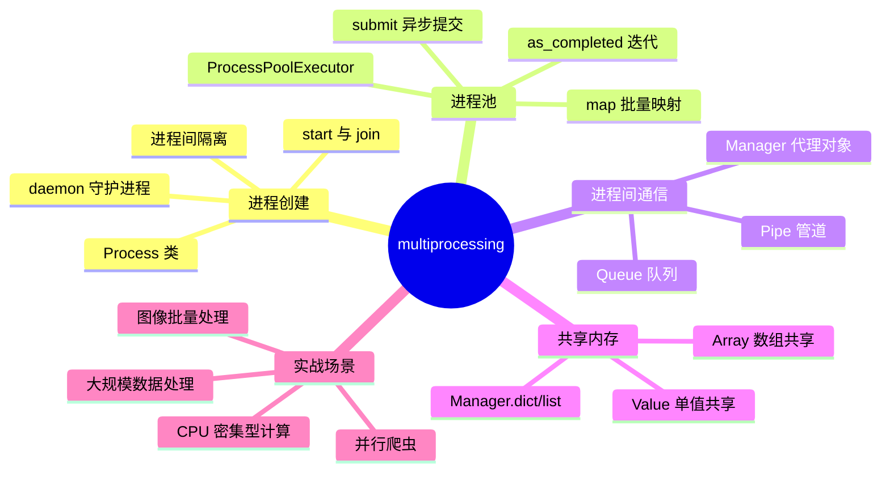
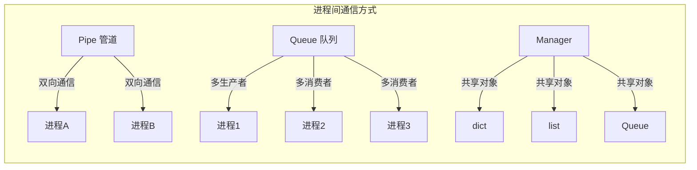
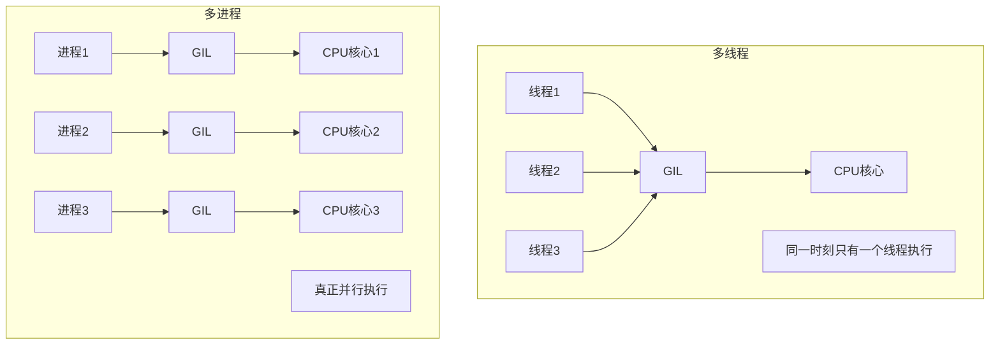
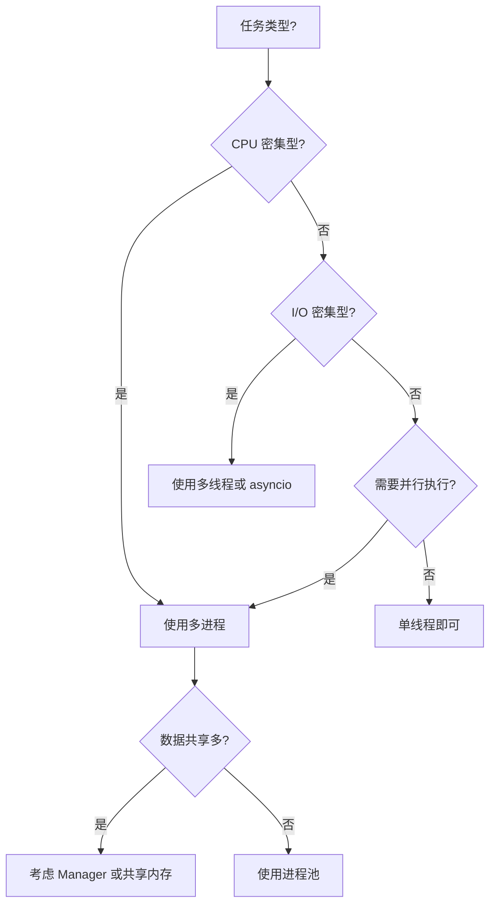

# Python multiprocessing 实战指南

**多进程是 Python 突破 GIL 限制、实现真正并行的关键方案。** 与多线程不同，每个 Python 进程都有独立的 GIL，因此多进程可以充分利用多核 CPU，显著提升 CPU 密集型任务的性能。

> 阅读提示

- 如果你只想快速启动子进程，直接看 [进程创建与启动](#进程创建与启动)
- 如果你想处理大量并行任务，跳到 [进程池 ProcessPoolExecutor](#进程池-processpoolexecutor)
- 如果你想了解进程间如何通信，看 [进程间通信](#进程间通信)
- 如果你想对比多进程与多线程的选择，跳到 [多进程 vs 多线程对比](#多进程-vs-多线程对比)
- 本文所有代码基于 **Python 3.10+**

## 多进程全景



## 进程创建与启动

### Process 类基础

`multiprocessing.Process` 是创建子进程的核心类，用法与 `threading.Thread` 类似：

```python
import multiprocessing
import os

def worker(name: str, count: int) -> None:
    """子进程执行的任务函数"""
    pid = os.getpid()
    print(f"[进程 {pid}] {name} 开始工作，计数: {count}")
    for i in range(count):
        print(f"[进程 {pid}] {name} 计数: {i + 1}/{count}")
    print(f"[进程 {pid}] {name} 工作完成")

if __name__ == "__main__":
    # 创建进程实例
    p1 = multiprocessing.Process(target=worker, args=("Worker-A", 3))
    p2 = multiprocessing.Process(target=worker, args=("Worker-B", 2))

    # 启动进程
    p1.start()
    p2.start()

    # 等待进程结束
    p1.join()
    p2.join()

    print("所有进程已完成")
```

**关键点：**

| 方法/属性 | 说明 | 使用场景 |
|-----------|------|---------|
| `start()` | 启动子进程 | 创建后必须调用 |
| `join(timeout)` | 等待进程结束 | 主进程需要等待子进程完成 |
| `is_alive()` | 检查进程是否存活 | 监控进程状态 |
| `daemon` | 设置守护进程 | 主进程退出时自动终止子进程 |
| `pid` | 获取进程 ID | 日志记录、调试 |
| `exitcode` | 获取退出码 | 检查进程是否正常退出 |

### daemon 守护进程

守护进程会在主进程退出时自动终止，适合后台服务任务：

```python
import multiprocessing
import time

def background_monitor():
    """后台监控任务"""
    while True:
        print("监控中...")
        time.sleep(1)

if __name__ == "__main__":
    p = multiprocessing.Process(target=background_monitor)
    p.daemon = True  # 设置为守护进程
    p.start()

    # 主进程运行 3 秒后退出
    time.sleep(3)
    print("主进程退出，守护进程将自动终止")
    # 无需 p.join()，守护进程会随主进程退出
```

::: warning 守护进程注意事项

- 守护进程不能创建新的子进程
- 守护进程在主进程退出时会被强制终止，不会执行清理代码
- 必须在 `start()` 之前设置 `daemon` 属性
:::

### 进程启动方法

Python 支持三种进程启动方法：

```python
import multiprocessing as mp

# 查看当前启动方法
print(mp.get_start_method())

# 设置启动方法（必须在创建进程前）
mp.set_start_method('spawn')  # 或 'fork' 或 'forkserver'
```

| 启动方法 | 平台支持 | 特点 | 适用场景 |
|---------|---------|------|---------|
| `spawn` | 全平台 | 启动慢，内存干净，安全 | Windows、跨平台代码 |
| `fork` | Unix/Linux | 启动快，继承父进程状态 | Linux 服务端程序 |
| `forkserver` | Unix/Linux | 折中方案，服务进程模式 | 需要隔离的高并发场景 |

```python
import multiprocessing as mp

def worker():
    print("子进程运行中")

if __name__ == "__main__":
    # 跨平台推荐使用 spawn
    mp.set_start_method('spawn')

    p = mp.Process(target=worker)
    p.start()
    p.join()
```

::: tip 最佳实践

- **跨平台代码**：使用 `spawn` 方法，确保 Windows 和 Linux 行为一致
- **Linux 性能优先**：3.14 起 Linux 默认启动方式已由 `fork` 改为 `forkserver`（fork 与线程混用存在安全隐患，且自 3.12 起有弃用警告），一般建议跟随默认
- **高并发服务**：考虑 `forkserver`，减少 fork 开销
:::

## 进程池 ProcessPoolExecutor

`concurrent.futures.ProcessPoolExecutor` 是管理进程池的现代接口，比 `multiprocessing.Pool` 更简洁：

### 基本使用

```python
from concurrent.futures import ProcessPoolExecutor
import os

def compute_square(n: int) -> int:
    """计算平方的 CPU 密集型任务"""
    pid = os.getpid()
    print(f"[进程 {pid}] 计算 {n}^2")
    return n * n

if __name__ == "__main__":
    # 创建进程池，默认使用 CPU 核心数
    with ProcessPoolExecutor(max_workers=4) as executor:
        # 提交单个任务
        future = executor.submit(compute_square, 10)
        result = future.result()
        print(f"结果: {result}")
```

### submit 异步提交

`submit()` 返回 `Future` 对象，支持异步获取结果：

```python
from concurrent.futures import ProcessPoolExecutor, as_completed
import time

def slow_task(name: str, duration: float) -> str:
    """模拟耗时任务"""
    time.sleep(duration)
    return f"{name} 完成，耗时 {duration}s"

if __name__ == "__main__":
    with ProcessPoolExecutor(max_workers=3) as executor:
        # 提交多个任务
        futures = {
            executor.submit(slow_task, "任务A", 2.0): "任务A",
            executor.submit(slow_task, "任务B", 1.0): "任务B",
            executor.submit(slow_task, "任务C", 3.0): "任务C",
        }

        # 按完成顺序获取结果
        for future in as_completed(futures):
            task_name = futures[future]
            result = future.result()
            print(f"{task_name}: {result}")
```

### map 批量映射

`map()` 类似内置 `map()`，但并行执行：

```python
from concurrent.futures import ProcessPoolExecutor

def process_item(item: int) -> int:
    """处理单个数据项"""
    return item ** 2 + item * 2

if __name__ == "__main__":
    data = range(1, 11)

    with ProcessPoolExecutor(max_workers=4) as executor:
        # 并行处理，保持顺序
        results = list(executor.map(process_item, data))
        print(f"输入: {list(data)}")
        print(f"输出: {results}")
```

### as_completed 迭代器

`as_completed()` 按任务完成顺序返回，而非提交顺序：

```python
from concurrent.futures import ProcessPoolExecutor, as_completed
import random
import time

def random_task(n: int) -> tuple[int, float]:
    """随机耗时的任务"""
    delay = random.uniform(0.5, 2.0)
    time.sleep(delay)
    return n, delay

if __name__ == "__main__":
    with ProcessPoolExecutor(max_workers=4) as executor:
        futures = [executor.submit(random_task, i) for i in range(1, 6)]

        print("按完成顺序输出:")
        for future in as_completed(futures):
            n, delay = future.result()
            print(f"  任务 {n} 完成，耗时 {delay:.2f}s")
```

### ProcessPoolExecutor vs Pool 对比

| 特性 | ProcessPoolExecutor | multiprocessing.Pool |
|------|---------------------|---------------------|
| 接口风格 | 现代，上下文管理器 | 传统，方法丰富 |
| 异常处理 | Future.exception() | 回调函数 |
| 取消任务 | Future.cancel() | 不支持 |
| 结果获取 | Future.result(timeout) | get(timeout) |
| 迭代结果 | as_completed() | imap(), imap_unordered() |
| 推荐程度 | **推荐** | 兼容旧代码 |

```python
# ProcessPoolExecutor 推荐写法
from concurrent.futures import ProcessPoolExecutor

def task(n):
    return n * 2

if __name__ == "__main__":
    with ProcessPoolExecutor() as executor:
        results = list(executor.map(task, range(10)))
```

## 进程间通信

由于进程间内存隔离，需要特殊机制进行通信：



### Pipe 管道

`Pipe()` 创建双向管道，适合两个进程间通信：

```python
import multiprocessing

def sender(conn):
    """发送端进程"""
    messages = ["Hello", "World", "Python", "Multiprocessing"]
    for msg in messages:
        print(f"[发送端] 发送: {msg}")
        conn.send(msg)
    conn.send(None)  # 发送结束信号
    conn.close()

def receiver(conn):
    """接收端进程"""
    while True:
        msg = conn.recv()
        if msg is None:
            break
        print(f"[接收端] 收到: {msg}")
    conn.close()

if __name__ == "__main__":
    # 创建管道，返回两个连接对象
    parent_conn, child_conn = multiprocessing.Pipe()

    # 创建进程
    p1 = multiprocessing.Process(target=sender, args=(parent_conn,))
    p2 = multiprocessing.Process(target=receiver, args=(child_conn,))

    p1.start()
    p2.start()

    p1.join()
    p2.join()
```

### Queue 队列

`Queue` 是进程安全的 FIFO 队列，支持多生产者多消费者：

```python
import multiprocessing
import time
import random

def producer(queue: multiprocessing.Queue, name: str, count: int):
    """生产者进程"""
    for i in range(count):
        item = f"{name}-商品{i}"
        queue.put(item)
        print(f"[生产者 {name}] 生产: {item}")
        time.sleep(random.uniform(0.1, 0.3))
    queue.put(None)  # 发送结束信号

def consumer(queue: multiprocessing.Queue, name: str):
    """消费者进程"""
    while True:
        item = queue.get()
        if item is None:
            print(f"[消费者 {name}] 收到结束信号，退出")
            break
        print(f"[消费者 {name}] 消费: {item}")
        time.sleep(random.uniform(0.2, 0.5))

if __name__ == "__main__":
    queue = multiprocessing.Queue()

    # 创建 2 个生产者和 2 个消费者
    producers = [
        multiprocessing.Process(target=producer, args=(queue, "P1", 5)),
        multiprocessing.Process(target=producer, args=(queue, "P2", 5)),
    ]
    consumers = [
        multiprocessing.Process(target=consumer, args=(queue, "C1")),
        multiprocessing.Process(target=consumer, args=(queue, "C2")),
    ]

    # 启动所有进程
    for p in producers + consumers:
        p.start()

    # 等待生产者完成
    for p in producers:
        p.join()

    # 发送额外的结束信号给每个消费者
    for _ in consumers:
        queue.put(None)

    # 等待消费者完成
    for c in consumers:
        c.join()
```

### Manager 代理对象

`Manager` 创建可在进程间共享的代理对象：

```python
import multiprocessing
from multiprocessing import Manager

def worker(shared_dict: dict, shared_list: list, worker_id: int):
    """使用共享对象的进程"""
    # 修改共享字典
    shared_dict[f"worker_{worker_id}"] = f"数据来自进程 {worker_id}"

    # 修改共享列表
    shared_list.append(worker_id * 10)

    print(f"[Worker {worker_id}] 已写入数据")

if __name__ == "__main__":
    with Manager() as manager:
        # 创建共享数据结构
        shared_dict = manager.dict()
        shared_list = manager.list()

        # 创建多个进程
        processes = [
            multiprocessing.Process(target=worker, args=(shared_dict, shared_list, i))
            for i in range(4)
        ]

        for p in processes:
            p.start()

        for p in processes:
            p.join()

        # 主进程读取共享数据
        print(f"共享字典: {dict(shared_dict)}")
        print(f"共享列表: {list(shared_list)}")
```

### 通信方式对比

| 方式 | 适用场景 | 性能 | 复杂度 | 特点 |
|------|---------|------|--------|------|
| **Pipe** | 两个进程间双向通信 | 高 | 低 | 简单直接，仅限两个进程 |
| **Queue** | 多生产者多消费者 | 中 | 中 | 进程安全，支持阻塞 |
| **Manager** | 复杂数据结构共享 | 低 | 高 | 灵活，支持 dict/list 等 |

::: tip 选择建议

- **两个进程通信**：优先使用 `Pipe`
- **任务队列模式**：使用 `Queue`
- **需要共享复杂状态**：使用 `Manager`
:::

## 共享内存

对于大量数据共享，共享内存比序列化更高效：

### Value 单值共享

```python
import multiprocessing
from multiprocessing import Value, Array
import time

def increment_counter(counter: Value, iterations: int):
    """增加计数器"""
    for _ in range(iterations):
        with counter.get_lock():  # 获取锁
            counter.value += 1

if __name__ == "__main__":
    # 创建共享整数，初始值为 0
    counter = Value('i', 0)  # 'i' 表示有符号整数

    # 创建多个进程同时增加计数器
    processes = [
        multiprocessing.Process(target=increment_counter, args=(counter, 10000))
        for _ in range(4)
    ]

    for p in processes:
        p.start()

    for p in processes:
        p.join()

    print(f"最终计数: {counter.value}")  # 应该是 40000
```

### Array 数组共享

```python
import multiprocessing
from multiprocessing import Array
import math

def compute_partial_sum(arr: Array, start: int, end: int, result: Array, idx: int):
    """计算数组部分元素的和"""
    partial = sum(arr[start:end])
    result[idx] = partial

if __name__ == "__main__":
    # 创建共享数组
    data = list(range(1, 101))  # 1 到 100
    shared_arr = Array('i', data)  # 'i' 表示整数类型
    result_arr = Array('d', [0.0] * 4)  # 'd' 表示双精度浮点数

    # 分割任务
    chunk_size = len(data) // 4
    processes = []

    for i in range(4):
        start = i * chunk_size
        end = start + chunk_size if i < 3 else len(data)
        p = multiprocessing.Process(
            target=compute_partial_sum,
            args=(shared_arr, start, end, result_arr, i)
        )
        processes.append(p)
        p.start()

    for p in processes:
        p.join()

    # 汇总结果
    total = sum(result_arr)
    print(f"数组总和: {total}")  # 5050
```

### 类型代码参考

| 类型代码 | C 类型 | Python 类型 | 大小 |
|---------|--------|-------------|------|
| `'b'` | signed char | int | 1 字节 |
| `'B'` | unsigned char | int | 1 字节 |
| `'i'` | signed int | int | 4 字节 |
| `'I'` | unsigned int | int | 4 字节 |
| `'f'` | float | float | 4 字节 |
| `'d'` | double | float | 8 字节 |

### Manager.dict/list vs Value/Array

```python
import multiprocessing
from multiprocessing import Value, Array, Manager
import time

def benchmark_shared_memory():
    """对比共享内存和 Manager 的性能"""
    N = 1_000_000

    # 方式 1: Value/Array (共享内存)
    start = time.time()
    counter = Value('i', 0)

    def inc_value(c, n):
        for _ in range(n):
            with c.get_lock():
                c.value += 1

    p = multiprocessing.Process(target=inc_value, args=(counter, N))
    p.start()
    p.join()
    print(f"Value 耗时: {time.time() - start:.3f}s")

    # 方式 2: Manager (代理对象)
    start = time.time()
    with Manager() as manager:
        m_counter = manager.Value('i', 0)

        def inc_manager(c, n):
            for _ in range(n):
                c.value += 1

        p = multiprocessing.Process(target=inc_manager, args=(m_counter, N))
        p.start()
        p.join()
        print(f"Manager 耗时: {time.time() - start:.3f}s")

if __name__ == "__main__":
    benchmark_shared_memory()
```

::: warning 性能提示

- `Value/Array` 使用共享内存，性能更高
- `Manager` 使用服务进程，每次访问都有 IPC 开销
- 对于高频访问的数据，优先使用 `Value/Array`
:::

## 多进程 vs 多线程对比



### 详细对比表

| 维度 | 多线程 (threading) | 多进程 (multiprocessing) |
|------|-------------------|-------------------------|
| **并行能力** | 受 GIL 限制，伪并行 | 真正并行，利用多核 |
| **内存开销** | 低，共享内存 | 高，独立内存空间 |
| **启动速度** | 快 | 慢 |
| **数据共享** | 简单，直接共享 | 复杂，需要 IPC |
| **适用场景** | I/O 密集型 | CPU 密集型 |
| **稳定性** | 一个线程崩溃可能影响整个进程 | 进程隔离，更稳定 |
| **调试难度** | 较高（竞态条件） | 中等 |
| **平台差异** | 小 | 大（Windows 用 spawn） |

### 选择决策树



### 代码对比示例

```python
# 多线程版本 - 受 GIL 限制
import threading
import time

def cpu_bound_task(n: int) -> int:
    """CPU 密集型任务"""
    return sum(i * i for i in range(n))

def threaded_version():
    start = time.time()
    threads = []
    for _ in range(4):
        t = threading.Thread(target=cpu_bound_task, args=(1000000,))
        threads.append(t)
        t.start()
    for t in threads:
        t.join()
    print(f"多线程耗时: {time.time() - start:.2f}s")

# 多进程版本 - 真正并行
import multiprocessing

def process_version():
    start = time.time()
    processes = []
    for _ in range(4):
        p = multiprocessing.Process(target=cpu_bound_task, args=(1000000,))
        processes.append(p)
        p.start()
    for p in processes:
        p.join()
    print(f"多进程耗时: {time.time() - start:.2f}s")

if __name__ == "__main__":
    threaded_version()
    process_version()
```

## 实战场景

### 场景一：大规模数据并行处理

使用 Map-Reduce 模式处理大数据集：

```python
from concurrent.futures import ProcessPoolExecutor, as_completed
from collections import Counter
import re
from pathlib import Path

def process_chunk(file_path: str, start: int, end: int) -> Counter:
    """处理文件的一个数据块"""
    word_counts = Counter()
    with open(file_path, 'r', encoding='utf-8') as f:
        f.seek(start)
        # 确保从完整的行开始
        if start > 0:
            f.readline()
        lines = []
        pos = f.tell()
        while pos < end:
            line = f.readline()
            if not line:
                break
            lines.append(line)
            pos = f.tell()

        # 统计词频
        for line in lines:
            words = re.findall(r'\b\w+\b', line.lower())
            word_counts.update(words)

    return word_counts

def parallel_word_count(file_path: str, num_workers: int = 4) -> Counter:
    """并行统计大文件词频"""
    file_size = Path(file_path).stat().st_size
    chunk_size = file_size // num_workers

    with ProcessPoolExecutor(max_workers=num_workers) as executor:
        futures = []
        for i in range(num_workers):
            start = i * chunk_size
            end = start + chunk_size if i < num_workers - 1 else file_size
            future = executor.submit(process_chunk, file_path, start, end)
            futures.append(future)

        # 合并结果
        total_counts = Counter()
        for future in as_completed(futures):
            total_counts.update(future.result())

    return total_counts

if __name__ == "__main__":
    # 示例：统计大文件词频
    # result = parallel_word_count("large_file.txt", num_workers=8)
    # print(f"最常见的 10 个词: {result.most_common(10)}")
    pass
```

### 场景二：CPU 密集型任务并行

图像批量处理示例：

```python
from concurrent.futures import ProcessPoolExecutor
from PIL import Image, ImageFilter
from pathlib import Path
import time

def process_image(image_path: str, output_dir: str, operations: list) -> str:
    """处理单张图片"""
    img = Image.open(image_path)

    for op in operations:
        if op == 'grayscale':
            img = img.convert('L')
        elif op == 'blur':
            img = img.filter(ImageFilter.GaussianBlur(radius=2))
        elif op == 'resize':
            img = img.resize((800, 600))
        elif op == 'thumbnail':
            img.thumbnail((200, 200))

    # 保存处理后的图片
    output_path = Path(output_dir) / Path(image_path).name
    img.save(output_path)
    return str(output_path)

def batch_process_images(input_dir: str, output_dir: str, num_workers: int = 4):
    """批量处理图片"""
    input_path = Path(input_dir)
    output_path = Path(output_dir)
    output_path.mkdir(parents=True, exist_ok=True)

    # 获取所有图片文件
    image_files = list(input_path.glob("*.jpg")) + list(input_path.glob("*.png"))

    operations = ['grayscale', 'blur', 'thumbnail']

    start = time.time()

    with ProcessPoolExecutor(max_workers=num_workers) as executor:
        futures = {
            executor.submit(process_image, str(img), str(output_path), operations): img
            for img in image_files
        }

        completed = 0
        for future in as_completed(futures):
            completed += 1
            result = future.result()
            print(f"[{completed}/{len(image_files)}] 完成: {result}")

    print(f"总耗时: {time.time() - start:.2f}s")

if __name__ == "__main__":
    # batch_process_images("input_images", "output_images", num_workers=8)
    pass
```

数学计算并行示例：

```python
from concurrent.futures import ProcessPoolExecutor
import math
import time

def is_prime(n: int) -> bool:
    """判断是否为质数"""
    if n < 2:
        return False
    if n == 2:
        return True
    if n % 2 == 0:
        return False
    for i in range(3, int(math.sqrt(n)) + 1, 2):
        if n % i == 0:
            return False
    return True

def find_primes_in_range(start: int, end: int) -> list[int]:
    """在指定范围内查找质数"""
    return [n for n in range(start, end) if is_prime(n)]

def parallel_prime_search(limit: int, num_workers: int = 4) -> list[int]:
    """并行查找质数"""
    chunk_size = limit // num_workers
    ranges = [
        (i * chunk_size, (i + 1) * chunk_size if i < num_workers - 1 else limit)
        for i in range(num_workers)
    ]

    start_time = time.time()

    with ProcessPoolExecutor(max_workers=num_workers) as executor:
        futures = [
            executor.submit(find_primes_in_range, r[0], r[1])
            for r in ranges
        ]

        all_primes = []
        for future in futures:
            all_primes.extend(future.result())

    all_primes.sort()
    elapsed = time.time() - start_time
    print(f"在 1-{limit} 范围内找到 {len(all_primes)} 个质数")
    print(f"耗时: {elapsed:.2f}s")

    return all_primes

if __name__ == "__main__":
    # 查找 1 到 1000000 的所有质数
    primes = parallel_prime_search(1_000_000, num_workers=8)
```

## 常见陷阱

| 陷阱 | 问题描述 | 解决方案 |
|------|---------|---------|
| **忘记 `if __name__ == "__main__"`** | Windows 下无限递归创建进程 | 始终在入口代码使用此保护 |
| **共享数据竞态条件** | 多进程同时修改共享数据导致数据不一致 | 使用 `Lock` 或 `Value.get_lock()` |
| **进程间传递大对象** | 序列化大对象开销大，性能下降 | 使用共享内存或分块处理 |
| **死锁** | 进程间相互等待对方释放资源 | 设计合理的锁获取顺序，使用超时 |
| **僵尸进程** | 子进程结束但父进程未回收 | 使用 `join()` 或设置 `daemon=True` |
| **Manager 性能问题** | 频繁访问 Manager 对象导致性能瓶颈 | 减少访问频率，使用本地缓存 |
| **启动方法不兼容** | `fork` 方法在 Windows 不可用 | 使用 `spawn` 方法保证跨平台 |
| **信号处理冲突** | 子进程继承父进程的信号处理 | 在子进程中重新设置信号处理 |
| **文件描述符泄漏** | fork 后继承父进程的文件描述符 | 使用 `close_fds=True` 或显式关闭 |
| **全局状态不一致** | fork 后子进程继承父进程状态但独立 | 避免依赖全局状态，使用 `spawn` |

### 陷阱示例：忘记 `if __name__ == "__main__"`

```python
# 错误示例 - Windows 下会无限创建进程
import multiprocessing

def worker():
    print("工作进程")

# 错误：没有保护，Windows 下会递归创建进程
p = multiprocessing.Process(target=worker)
p.start()
p.join()
```

```python
# 正确示例
import multiprocessing

def worker():
    print("工作进程")

if __name__ == "__main__":
    p = multiprocessing.Process(target=worker)
    p.start()
    p.join()
```

### 陷阱示例：竞态条件

```python
# 错误示例 - 没有锁保护
from multiprocessing import Value

def unsafe_increment(counter: Value, n: int):
    for _ in range(n):
        counter.value += 1  # 非原子操作！

if __name__ == "__main__":
    counter = Value('i', 0)
    # 多进程并发增加，结果可能不正确
```

```python
# 正确示例 - 使用锁保护
from multiprocessing import Value

def safe_increment(counter: Value, n: int):
    for _ in range(n):
        with counter.get_lock():  # 获取锁
            counter.value += 1

if __name__ == "__main__":
    counter = Value('i', 0)
    # 结果正确
```

## 最佳实践速查表

| 场景 | 推荐方案 | 代码示例 |
|------|---------|---------|
| **简单并行任务** | `ProcessPoolExecutor` | `with ProcessPoolExecutor() as ex: ex.map(func, data)` |
| **两个进程通信** | `Pipe` | `parent_conn, child_conn = Pipe()` |
| **任务队列** | `Queue` | `queue = Queue(); queue.put(item)` |
| **共享简单数据** | `Value/Array` | `counter = Value('i', 0)` |
| **共享复杂数据** | `Manager` | `d = Manager().dict()` |
| **守护后台任务** | `daemon=True` | `p.daemon = True; p.start()` |
| **等待进程完成** | `join(timeout)` | `p.join(timeout=10)` |
| **取消任务** | `Future.cancel()` | `future.cancel()` |
| **超时获取结果** | `result(timeout)` | `future.result(timeout=30)` |
| **跨平台兼容** | `spawn` 方法 | `set_start_method('spawn')` |

### 性能优化建议

```python
# 1. 合理设置进程数
import os
# CPU 密集型：进程数 = CPU 核心数
max_workers = os.cpu_count()

# I/O 密集型：进程数可以更多
max_workers = os.cpu_count() * 2

# 2. 批量处理减少 IPC 开销
def process_batch(items: list) -> list:
    """批量处理，减少进程间通信次数"""
    return [process_item(item) for item in items]

# 3. 使用共享内存避免序列化
from multiprocessing import Array
shared_data = Array('d', large_data)  # 避免传递大列表

# 4. 任务分块
def chunked_map(executor, func, data, chunk_size=1000):
    """分块处理大数据集"""
    chunks = [data[i:i+chunk_size] for i in range(0, len(data), chunk_size)]
    results = executor.map(process_batch, chunks)
    return [item for chunk in results for item in chunk]
```

## 术语表

| 术语 | 英文 | 解释 |
|------|------|------|
| **进程** | Process | 操作系统分配资源的基本单位，拥有独立内存空间 |
| **GIL** | Global Interpreter Lock | Python 全局解释器锁，限制同一时刻只有一个线程执行 |
| **进程池** | Process Pool | 预创建的进程集合，避免频繁创建销毁进程的开销 |
| **IPC** | Inter-Process Communication | 进程间通信，包括管道、队列、共享内存等 |
| **守护进程** | Daemon Process | 后台运行的进程，主进程退出时自动终止 |
| **管道** | Pipe | 双向通信通道，连接两个进程 |
| **队列** | Queue | 进程安全的 FIFO 数据结构 |
| **共享内存** | Shared Memory | 多个进程可同时访问的内存区域 |
| **序列化** | Serialization/Pickling | 将 Python 对象转换为字节流以便传输 |
| **Future** | Future | 表示异步操作结果的对象 |
| **fork** | fork | Unix 系统调用，创建当前进程的副本 |
| **spawn** | spawn | 启动新进程的方法，重新导入模块 |
| **僵尸进程** | Zombie Process | 已结束但未被父进程回收的进程 |
| **竞态条件** | Race Condition | 多个进程/线程同时访问共享资源导致的不确定行为 |

## 延伸阅读

### 官方文档

- [multiprocessing --- 基于进程的并行](https://docs.python.org/zh-cn/3/library/multiprocessing.html)
- [concurrent.futures --- 启动并行任务](https://docs.python.org/zh-cn/3/library/concurrent.futures.html)

### 进阶主题

- **asyncio + 多进程**：结合异步 I/O 和多进程实现高性能并发
- **分布式计算**：使用 `multiprocessing.managers` 实现跨机器进程间通信
- **进程间同步原语**：`Lock`, `RLock`, `Semaphore`, `Event`, `Condition`
- **信号处理**：在多进程环境中正确处理信号
- **性能监控**：使用 `psutil` 监控进程资源使用

### 相关书籍

- 《Python 并发编程实战》- 全面讲解 Python 并发模型
- 《流畅的 Python》第 17-19 章 - 深入理解并发与并行
- 《Python 高性能编程》- 性能优化与并行计算

### 相关技术

| 技术 | 说明 | 适用场景 |
|------|------|---------|
| **threading** | 多线程，受 GIL 限制 | I/O 密集型任务 |
| **asyncio** | 异步 I/O，单线程并发 | 高并发网络应用 |
| **multiprocessing** | 多进程，真正并行 | CPU 密集型任务 |
| **Ray** | 分布式计算框架 | 大规模并行计算 |
| **Dask** | 并行计算库 | 大数据处理 |
| **Celery** | 分布式任务队列 | 异步任务处理 |

## 版本差异（并发 → Python 3.13/3.14）

| 特性 | 本文编写时 | Python 3.13/3.14 |
|------|-----------|------------------|
| GIL | 全局锁 | 3.13 提供实验性 free-threaded 构建（PEP 703，`python3.13t`）；3.14 起正式支持（PEP 779），但仍非默认构建 |
| 线程池 | `ThreadPoolExecutor` | 不变；3.9+ 默认 max_workers 为 min(32, CPU+4) |
| 进程间通信 | `multiprocessing` | 3.14 起 Linux 等平台默认启动方式由 `fork` 改为 `forkserver`（Windows/macOS 仍为 `spawn`）；`queue`/`Pipe` 稳定 |
| 协程与线程混用 | `run_in_executor` | 3.9+ 推荐 `asyncio.to_thread()` |

> 本文讲解的 threading/multiprocessing 原理在 3.14 中完全成立；free-threaded 构建为 CPU 密集型多线程提供了新选项（3.14 起正式支持）。
