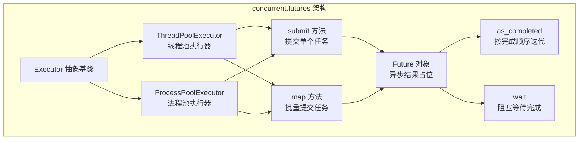
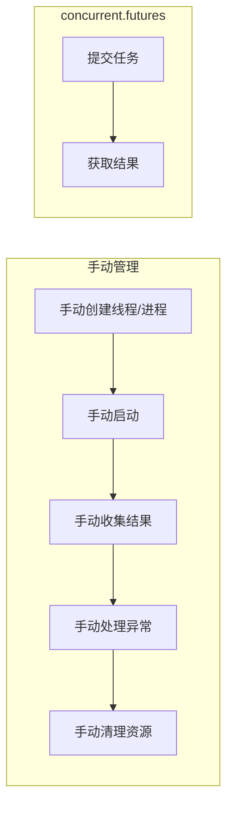
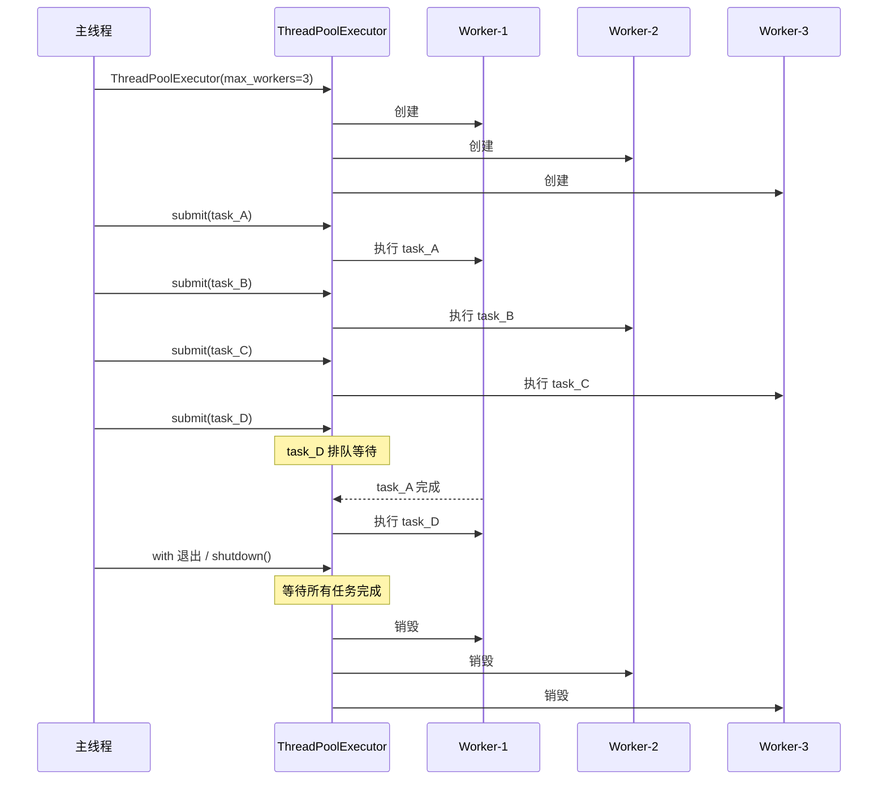
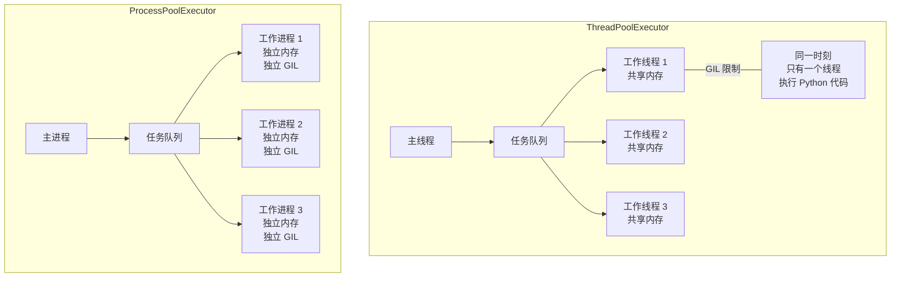
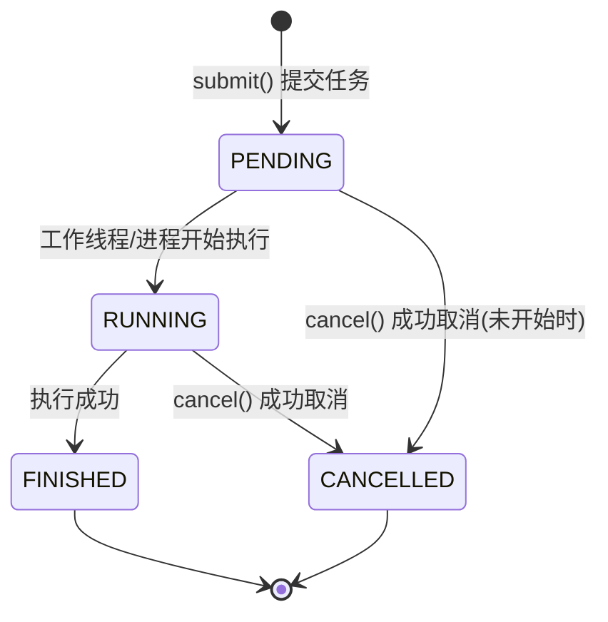
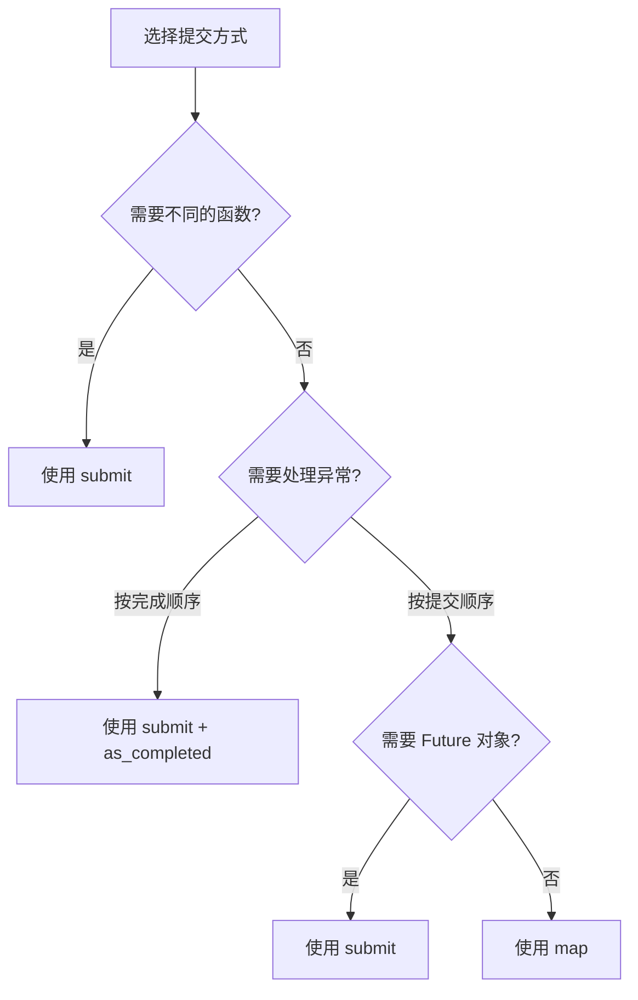
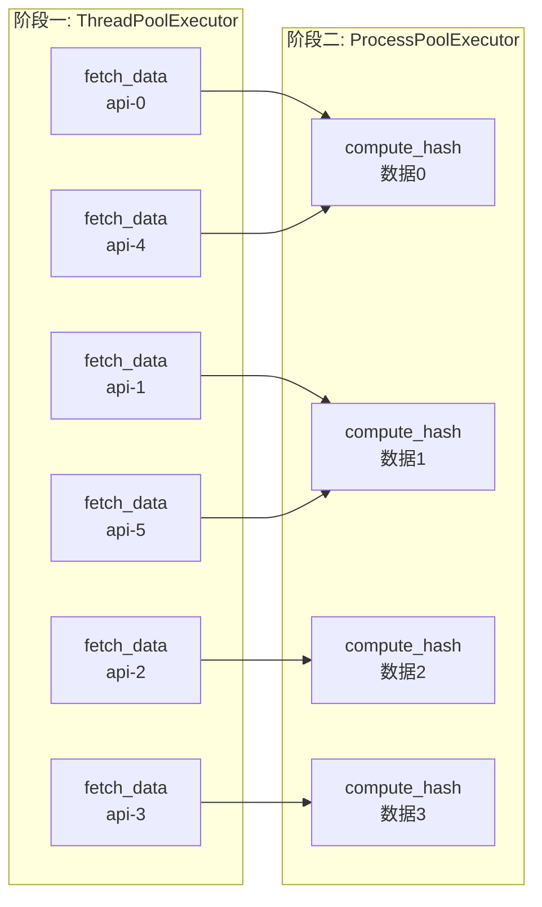
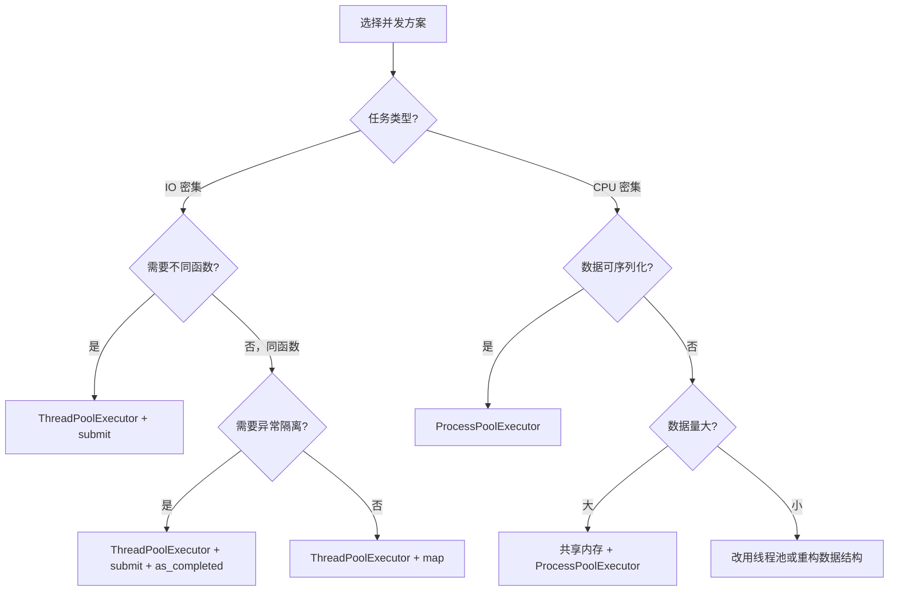

# concurrent.futures 实战指南

**concurrent.futures 是 Python 并发编程的高层抽象接口**，它将线程池和进程池统一到同一套 API 下，让你无需手动管理线程/进程的创建、销毁和结果收集，专注业务逻辑即可。

> 阅读提示

- 如果你只想快速并行跑一批任务，直接看 [submit vs map 对比](#submit-vs-map-对比)
- 如果你想深入了解 ThreadPoolExecutor，跳到 [ThreadPoolExecutor 详解](#threadpoolexecutor-详解)
- 如果你想了解 CPU 密集型任务的并行方案，看 [ProcessPoolExecutor 详解](#processpoolexecutor-详解)
- 如果你想看实战代码，直接跳到 [实战场景](#实战场景)
- 本文所有代码基于 **Python 3.10+**

## concurrent.futures 概述与架构

concurrent.futures 模块提供了两个核心执行器和一组辅助工具，构成了 Python 标准库中最简洁的并发编程接口：



### 核心组件一览

| 组件 | 类型 | 说明 |
|------|------|------|
| `Executor` | 抽象基类 | 定义 `submit()`、`map()`、`shutdown()` 接口 |
| `ThreadPoolExecutor` | 执行器 | 基于 `threading` 的线程池，适合 IO 密集型 |
| `ProcessPoolExecutor` | 执行器 | 基于 `multiprocessing` 的进程池，适合 CPU 密集型 |
| `Future` | 结果对象 | 封装异步执行的结果，支持回调与状态查询 |
| `as_completed()` | 辅助函数 | 按任务完成顺序迭代 Future |
| `wait()` | 辅助函数 | 阻塞等待 Future 集合完成 |

### 为什么选择 concurrent.futures



| 对比维度 | 手动 threading/multiprocessing | concurrent.futures |
|---------|-------------------------------|-------------------|
| 代码量 | 多（创建、启动、收集、清理） | 少（with + submit/map） |
| 结果收集 | 需手动用 Queue 或共享变量 | Future 对象自动封装 |
| 异常处理 | 需在线程/进程内捕获后传递 | Future 自动捕获，调用 `result()` 时抛出 |
| 资源管理 | 需手动 join/shutdown | `with` 语句自动管理 |
| 统一接口 | 线程和进程 API 不同 | ThreadPool/ProcessPool 共用同一套 API |

## ThreadPoolExecutor 详解

ThreadPoolExecutor 是基于线程的执行器，预创建一组工作线程，复用执行提交的任务。它 **适合 IO 密集型任务**（网络请求、文件读写、数据库查询等），因为线程在等待 IO 时会释放 GIL，允许其他线程执行。

### 基本用法

```python
from concurrent.futures import ThreadPoolExecutor
import time

def fetch_data(url: str) -> dict:
    """模拟网络请求"""
    time.sleep(1)  # 模拟 IO 等待
    return {"url": url, "status": 200, "data": f"response from {url}"}

# 推荐：使用 with 语句自动管理生命周期
with ThreadPoolExecutor(max_workers=5) as executor:
    # 提交单个任务
    future = executor.submit(fetch_data, "https://api.example.com/users")
    # 获取结果（阻塞直到任务完成）
    result = future.result()
    print(result)  # {'url': 'https://api.example.com/users', 'status': 200, ...}
```

### max_workers 的选择

```python
import os
from concurrent.futures import ThreadPoolExecutor

# 规则一：IO 密集型任务，max_workers 可以远大于 CPU 核心数
# Python 3.8+ 默认值：max_workers = min(32, CPU核心数 + 4)
io_workers = min(32, (os.cpu_count() or 1) + 4)
print(f"IO 密集型建议线程数: {io_workers}")

# 规则二：如果任务有明显的等待时间，可以更大
# 例如：每个请求耗时 2 秒，需要 100 个请求
# 1 个线程：200 秒
# 10 个线程：20 秒
# 50 个线程：4 秒（受网络带宽限制）
# 100 个线程：2 秒（理想情况）

# 规则三：注意系统限制（文件描述符、连接数等）
```

### 批量提交与结果收集

```python
from concurrent.futures import ThreadPoolExecutor, as_completed

def process_url(url: str) -> dict:
    """模拟处理 URL"""
    import time
    time.sleep(0.5)
    return {"url": url, "length": len(url)}

urls = [
    "https://api.example.com/users",
    "https://api.example.com/posts",
    "https://api.example.com/comments",
    "https://api.example.com/albums",
    "https://api.example.com/photos",
]

with ThreadPoolExecutor(max_workers=3) as executor:
    # 方式一：submit + as_completed（按完成顺序获取结果）
    future_to_url = {
        executor.submit(process_url, url): url
        for url in urls
    }

    for future in as_completed(future_to_url):
        url = future_to_url[future]
        try:
            result = future.result()
            print(f"[完成] {url} -> {result}")
        except Exception as e:
            print(f"[失败] {url} -> {e}")
```

### 线程池生命周期



### 线程池内部工作原理

```python
from concurrent.futures import ThreadPoolExecutor
import threading

def show_thread_info(task_name: str) -> str:
    """展示线程池中线程的复用"""
    thread_name = threading.current_thread().name
    return f"任务 {task_name} 在线程 {thread_name} 中执行"

# max_workers=2 表示池中只有 2 个工作线程
with ThreadPoolExecutor(max_workers=2) as executor:
    # 提交 5 个任务，但只有 2 个线程，任务会排队
    futures = [
        executor.submit(show_thread_info, f"Task-{i}")
        for i in range(5)
    ]

    for future in futures:
        print(future.result())

# 输出示例（注意线程名的复用）：
# 任务 Task-0 在线程 ThreadPoolExecutor-0_0 中执行
# 任务 Task-1 在线程 ThreadPoolExecutor-0_1 中执行
# 任务 Task-2 在线程 ThreadPoolExecutor-0_0 中执行  ← 复用
# 任务 Task-3 在线程 ThreadPoolExecutor-0_1 中执行  ← 复用
# 任务 Task-4 在线程 ThreadPoolExecutor-0_0 中执行  ← 复用
```

## ProcessPoolExecutor 详解

ProcessPoolExecutor 是基于进程的执行器，每个任务在独立进程中执行，**绕过 GIL**，适合 CPU 密集型任务（数值计算、图像处理、数据压缩等）。

### 基本用法

```python
from concurrent.futures import ProcessPoolExecutor
import math

def is_prime(n: int) -> bool:
    """判断一个数是否为素数（CPU 密集型）"""
    if n < 2:
        return False
    if n == 2:
        return True
    if n % 2 == 0:
        return False
    for i in range(3, int(math.sqrt(n)) + 1, 2):
        if n % i == 0:
            return False
    return True

if __name__ == "__main__":
    with ProcessPoolExecutor() as executor:
        # 默认 max_workers = CPU 核心数
        result = executor.submit(is_prime, 999999937).result()
        print(f"999999937 是素数: {result}")  # True
```

### 进程池 vs 线程池核心差异



### 序列化约束

ProcessPoolExecutor 中的任务函数和参数必须 **可序列化（pickle）**，这是最常见的出错点：

```python
from concurrent.futures import ProcessPoolExecutor

# ---- 可以序列化的 ----
def top_level_function(x: int) -> int:
    """模块级函数：可以序列化"""
    return x * x

class PicklableClass:
    """可序列化的类"""
    def __call__(self, x: int) -> int:
        return x * x

# ---- 不能序列化的 ----
class MyTask:
    def process(self, x: int) -> int:
        """实例方法（绑定方法可以序列化，前提是实例本身可序列化）"""
        return x * x

    @staticmethod
    def static_process(x: int) -> int:
        """静态方法：可以序列化"""
        return x * x

# 正确用法
with ProcessPoolExecutor() as executor:
    # 模块级函数：OK
    executor.submit(top_level_function, 42)

    # 可调用对象实例：OK
    executor.submit(PicklableClass(), 42)

    # 静态方法：OK
    executor.submit(MyTask.static_process, 42)

    # 绑定方法：实例可序列化时也 OK
    executor.submit(MyTask().process, 42)

# 真正不能序列化的（会抛 PicklingError）：
# - lambda 与闭包：executor.submit(lambda x: x * x, 42)
# - 嵌套/局部定义的函数
# - 持有文件、锁、socket 等不可序列化属性的实例
```

### 进程间数据传递开销

```python
from concurrent.futures import ProcessPoolExecutor
import time
import numpy as np

def process_array(arr: np.ndarray) -> float:
    """处理 NumPy 数组"""
    return arr.mean()

# 小数组：序列化开销可忽略
small_arr = np.random.rand(100)

# 大数组：序列化开销显著
big_arr = np.random.rand(10_000_000)

with ProcessPoolExecutor() as executor:
    # 小数组：快
    start = time.perf_counter()
    executor.submit(process_array, small_arr).result()
    print(f"小数组耗时: {time.perf_counter() - start:.4f}s")

    # 大数组：序列化/反序列化可能比计算本身还慢
    start = time.perf_counter()
    executor.submit(process_array, big_arr).result()
    print(f"大数组耗时: {time.perf_counter() - start:.4f}s")
```

### initializer 与 initargs

```python
from concurrent.futures import ProcessPoolExecutor
import random

# 每个工作进程初始化时执行的函数
def init_worker():
    """在工作进程中初始化随机种子，避免多进程随机数重复"""
    random.seed()

def random_task(n: int) -> float:
    """生成随机数"""
    return random.random() * n

with ProcessPoolExecutor(
    max_workers=4,
    initializer=init_worker,    # 初始化函数
    initargs=(),                # 初始化参数（元组）
) as executor:
    results = list(executor.map(random_task, [10, 20, 30, 40]))
    print(results)
```

## Future 对象

Future 是 concurrent.futures 的核心抽象，它代表一个 **异步执行的操作的最终结果**。你不能直接创建 Future，而是通过 `executor.submit()` 获得。

### Future 状态机



### Future 核心方法

```python
from concurrent.futures import ThreadPoolExecutor
import time

def slow_task(seconds: float) -> str:
    """模拟耗时任务"""
    time.sleep(seconds)
    return f"完成，耗时 {seconds} 秒"

with ThreadPoolExecutor(max_workers=1) as executor:
    future = executor.submit(slow_task, 2.0)

    # 1. 查询状态
    print(f"是否已完成: {future.done()}")      # False
    print(f"是否已取消: {future.cancelled()}")  # False

    # 2. 非阻塞检查（设置超时）
    try:
        result = future.result(timeout=1.0)  # 1 秒内没完成则抛 TimeoutError
    except TimeoutError:
        print("任务尚未完成")

    # 3. 阻塞等待结果
    result = future.result()  # 阻塞直到完成
    print(f"结果: {result}")
    print(f"是否已完成: {future.done()}")  # True
```

### result() 方法详解

```python
from concurrent.futures import ThreadPoolExecutor

def success_task() -> str:
    return "成功"

def failing_task() -> str:
    raise ValueError("任务执行失败")

with ThreadPoolExecutor(max_workers=2) as executor:
    # 成功的任务
    f1 = executor.submit(success_task)
    print(f1.result())  # 输出: "成功"

    # 失败的任务
    f2 = executor.submit(failing_task)
    try:
        f2.result()  # 抛出 ValueError
    except ValueError as e:
        print(f"捕获到任务异常: {e}")  # 捕获到任务异常: 任务执行失败

    # 带超时的 result
    f3 = executor.submit(lambda: __import__('time').sleep(10))
    try:
        f3.result(timeout=0.5)
    except TimeoutError:
        print("等待超时")
```

**关键点**：`result()` 会重新抛出任务中发生的异常，调用者可以在主线程中用 `try/except` 捕获。这是 concurrent.futures 相比手动 threading 的一大优势——异常不会静默丢失。

### add_done_callback 回调

```python
from concurrent.futures import ThreadPoolExecutor
import time

def fetch_url(url: str) -> dict:
    """模拟网络请求"""
    time.sleep(1)
    if "error" in url:
        raise ConnectionError(f"连接失败: {url}")
    return {"url": url, "status": 200}

def on_complete(future):
    """任务完成回调——无论成功或失败都会被调用"""
    try:
        result = future.result()
        print(f"  [回调-成功] {result['url']} -> {result['status']}")
    except Exception as e:
        print(f"  [回调-失败] {e}")

urls = [
    "https://api.example.com/users",
    "https://api.example.com/error",
    "https://api.example.com/posts",
]

with ThreadPoolExecutor(max_workers=3) as executor:
    for url in urls:
        future = executor.submit(fetch_url, url)
        future.add_done_callback(on_complete)

    # 回调在提交任务的工作线程中执行，不要在回调中做耗时操作

# 输出：
#   [回调-成功] https://api.example.com/users -> 200
#   [回调-失败] 连接失败: https://api.example.com/error
#   [回调-成功] https://api.example.com/posts -> 200
```

### as_completed 按完成顺序迭代

`as_completed` 是并发编程中最实用的工具之一——它让你 **按任务完成顺序获取结果**，而不是按提交顺序，从而最大化吞吐量。

```python
from concurrent.futures import ThreadPoolExecutor, as_completed
import time
import random

def variable_task(task_id: int) -> dict:
    """耗时随机的任务"""
    duration = random.uniform(0.5, 3.0)
    time.sleep(duration)
    return {"id": task_id, "duration": round(duration, 2)}

with ThreadPoolExecutor(max_workers=5) as executor:
    futures = {
        executor.submit(variable_task, i): i
        for i in range(10)
    }

    print("=== 按完成顺序 ===")
    for future in as_completed(futures):
        task_id = futures[future]
        result = future.result()
        print(f"  任务 {task_id} 完成，耗时 {result['duration']}s")
```

### wait 函数精细控制

```python
from concurrent.futures import ThreadPoolExecutor, wait, FIRST_COMPLETED, FIRST_EXCEPTION, ALL_COMPLETED
import time

def task(task_id: int, duration: float) -> dict:
    time.sleep(duration)
    if task_id == 3:
        raise RuntimeError(f"任务 {task_id} 失败")
    return {"id": task_id, "duration": duration}

with ThreadPoolExecutor(max_workers=5) as executor:
    futures = [executor.submit(task, i, i * 0.5) for i in range(1, 6)]

    # 等待所有任务完成（默认行为）
    done, not_done = wait(futures, return_when=ALL_COMPLETED)
    print(f"全部完成: {len(done)} 个任务")

    # 等待第一个完成
    # done, not_done = wait(futures, return_when=FIRST_COMPLETED)
    # print(f"首个完成，还有 {len(not_done)} 个未完成")

    # 等待第一个异常（如果没有异常，等待全部完成）
    # done, not_done = wait(futures, return_when=FIRST_EXCEPTION)

    # 设置超时
    # done, not_done = wait(futures, timeout=2.0, return_when=ALL_COMPLETED)
    # print(f"2 秒内完成: {len(done)} 个，未完成: {len(not_done)} 个")
```

### as_completed vs wait 对比

| 特性 | `as_completed` | `wait` |
|------|---------------|--------|
| 返回值 | 迭代器，逐个 yield 完成的 Future | 命名元组 `(done, not_done)` |
| 阻塞方式 | 每次迭代阻塞到下一个 Future 完成 | 一次性等待到满足条件 |
| 灵活性 | 只能按完成顺序遍历 | 支持 `FIRST_COMPLETED`、`FIRST_EXCEPTION`、`ALL_COMPLETED` |
| 超时控制 | `timeout` 参数控制整体超时 | `timeout` 参数控制等待超时 |
| 典型用途 | 遍历处理结果 | 等待特定条件后统一处理 |

## submit vs map 对比

`submit` 和 `map` 是提交任务的两种方式，选择哪个取决于你的使用场景。



### submit 用法

```python
from concurrent.futures import ThreadPoolExecutor

def task_a(x: int) -> str:
    return f"A: {x * 2}"

def task_b(x: int) -> str:
    return f"B: {x * 3}"

with ThreadPoolExecutor(max_workers=2) as executor:
    # submit 可以提交不同的函数
    f1 = executor.submit(task_a, 10)
    f2 = executor.submit(task_b, 20)
    f3 = executor.submit(task_a, 30)

    # 按需获取结果
    print(f1.result())  # A: 20
    print(f2.result())  # B: 60
    print(f3.result())  # A: 60
```

### map 用法

```python
from concurrent.futures import ThreadPoolExecutor

def process(x: int) -> str:
    return f"处理: {x * 2}"

data = [1, 2, 3, 4, 5]

with ThreadPoolExecutor(max_workers=3) as executor:
    # map 对同一函数批量提交，结果按提交顺序返回
    results = list(executor.map(process, data))
    print(results)
    # ['处理: 2', '处理: 4', '处理: 6', '处理: 8', '处理: 10']

    # map 支持多个可迭代对象（类似内置 map）
    def add(a: int, b: int) -> int:
        return a + b

    sums = list(executor.map(add, [1, 2, 3], [10, 20, 30]))
    print(sums)  # [11, 22, 33]

    # map 支持 timeout
    # results = list(executor.map(process, data, timeout=5.0))
```

### 关键差异对比

| 对比维度 | `submit` | `map` |
|---------|---------|-------|
| 函数类型 | 可提交不同函数 | 只能提交同一个函数 |
| 返回值 | `Future` 对象 | 结果值的迭代器 |
| 结果顺序 | 不保证（用 `as_completed` 按完成顺序） | 保证与输入顺序一致 |
| 异常处理 | `future.result()` 抛出异常 | 迭代到该位置时抛出异常 |
| 超时控制 | `future.result(timeout=X)` | `executor.map(..., timeout=X)` |
| 灵活性 | 高（回调、取消、状态查询） | 低（简洁但不可控） |
| 适用场景 | 需要精细控制、不同函数、按完成顺序 | 批量同质任务、简单场景 |

### map 的异常陷阱

```python
from concurrent.futures import ThreadPoolExecutor

def risky_task(x: int) -> int:
    if x == 3:
        raise ValueError(f"无效值: {x}")
    return x * 10

with ThreadPoolExecutor(max_workers=3) as executor:
    # map 的异常陷阱：异常不会在提交时抛出
    # 而是在迭代到该位置时才抛出
    results = executor.map(risky_task, [1, 2, 3, 4, 5])

    # 迭代时，到 x=3 才会抛异常，x=4 和 x=5 的结果丢失
    try:
        for r in results:
            print(r)
    except ValueError as e:
        print(f"异常: {e}")

    # 输出：
    # 10
    # 20
    # 异常: 无效值: 3
    # 4 和 5 的结果丢失！

# 更安全的做法：用 submit + as_completed
with ThreadPoolExecutor(max_workers=3) as executor:
    futures = {executor.submit(risky_task, x): x for x in [1, 2, 3, 4, 5]}

    for future in as_completed(futures):
        x = futures[future]
        try:
            result = future.result()
            print(f"  x={x} -> {result}")
        except ValueError as e:
            print(f"  x={x} 失败: {e}")

    # 输出（所有结果都能获取）：
    #   x=1 -> 10
    #   x=2 -> 20
    #   x=3 失败: 无效值: 3
    #   x=4 -> 40
    #   x=5 -> 50
```

## 实战场景

### 场景一：批量 URL 请求（ThreadPoolExecutor）

网络请求是典型的 IO 密集型任务，ThreadPoolExecutor 可以显著提升吞吐量。

```python
"""批量 URL 请求——使用 ThreadPoolExecutor 并发抓取"""
from concurrent.futures import ThreadPoolExecutor, as_completed
import urllib.request
import urllib.error
import time
from dataclasses import dataclass


@dataclass
class FetchResult:
    url: str
    status: int
    content_length: int
    elapsed: float
    error: str | None = None


def fetch_url(url: str, timeout: int = 10) -> FetchResult:
    """抓取单个 URL"""
    start = time.perf_counter()
    try:
        req = urllib.request.Request(url, headers={"User-Agent": "Mozilla/5.0"})
        with urllib.request.urlopen(req, timeout=timeout) as resp:
            content = resp.read()
            elapsed = time.perf_counter() - start
            return FetchResult(
                url=url,
                status=resp.status,
                content_length=len(content),
                elapsed=round(elapsed, 3),
            )
    except urllib.error.URLError as e:
        elapsed = time.perf_counter() - start
        return FetchResult(
            url=url, status=0, content_length=0,
            elapsed=round(elapsed, 3), error=str(e),
        )


def batch_fetch(urls: list[str], max_workers: int = 10) -> list[FetchResult]:
    """批量抓取 URL"""
    results = []

    with ThreadPoolExecutor(max_workers=max_workers) as executor:
        future_to_url = {
            executor.submit(fetch_url, url): url
            for url in urls
        }

        for future in as_completed(future_to_url):
            url = future_to_url[future]
            try:
                result = future.result()
                results.append(result)
                status = "OK" if result.error is None else "FAIL"
                print(f"  [{status}] {url} ({result.elapsed}s)")
            except Exception as e:
                results.append(FetchResult(
                    url=url, status=0, content_length=0,
                    elapsed=0, error=str(e),
                ))

    return results


# 使用示例
if __name__ == "__main__":
    urls = [
        "https://httpbin.org/get",
        "https://httpbin.org/delay/1",
        "https://httpbin.org/delay/2",
        "https://httpbin.org/status/404",
        "https://httpbin.org/status/500",
    ]

    start = time.perf_counter()
    results = batch_fetch(urls, max_workers=5)
    total = time.perf_counter() - start

    success = sum(1 for r in results if r.error is None)
    print(f"\n总计: {len(urls)} 个请求，成功 {success} 个，耗时 {total:.2f}s")
```

**性能对比**：由于是并发执行，总耗时由最慢的请求决定而非所有请求耗时之和；请求越独立、等待越长，线程池的收益越明显。

### 场景二：并行图像处理（ProcessPoolExecutor）

图像处理是典型的 CPU 密集型任务，ProcessPoolExecutor 可以利用多核并行加速。

```python
"""并行图像处理——使用 ProcessPoolExecutor 加速"""
from concurrent.futures import ProcessPoolExecutor, as_completed
import math
import time
from pathlib import Path


# 注意：必须在模块顶层定义函数，以便 pickle 序列化
def process_image(filepath: str) -> dict:
    """对单张图片执行灰度化 + 缩放（纯 Python 实现，无第三方依赖）"""
    # 模拟图像处理（实际项目中用 Pillow/OpenCV）
    # 这里用计算密集型操作模拟
    width, height = 1920, 1080
    pixels = width * height

    # 模拟灰度化计算
    gray_values = []
    for i in range(pixels):
        r = (i * 37) % 256
        g = (i * 73) % 256
        b = (i * 113) % 256
        gray = int(0.299 * r + 0.587 * g + 0.114 * b)
        gray_values.append(gray)

    # 模拟缩放（双线性插值）
    new_width, new_height = 960, 540
    resized = []
    for y in range(new_height):
        for x in range(new_width):
            src_x = int(x * width / new_width)
            src_y = int(y * height / new_height)
            idx = src_y * width + src_x
            resized.append(gray_values[idx] if idx < len(gray_values) else 0)

    return {
        "filepath": filepath,
        "original_size": (width, height),
        "resized_size": (new_width, new_height),
        "pixels_processed": pixels,
    }


def batch_process(image_paths: list[str], max_workers: int | None = None) -> list[dict]:
    """批量处理图片"""
    results = []

    with ProcessPoolExecutor(max_workers=max_workers) as executor:
        future_to_path = {
            executor.submit(process_image, path): path
            for path in image_paths
        }

        for future in as_completed(future_to_path):
            path = future_to_path[future]
            try:
                result = future.result()
                results.append(result)
                print(f"  [完成] {path}")
            except Exception as e:
                print(f"  [失败] {path}: {e}")

    return results


# 使用示例
if __name__ == "__main__":
    import os

    # 模拟 8 张图片路径
    images = [f"image_{i:03d}.jpg" for i in range(8)]

    # 串行处理
    print("=== 串行处理 ===")
    start = time.perf_counter()
    serial_results = [process_image(img) for img in images]
    serial_time = time.perf_counter() - start
    print(f"串行耗时: {serial_time:.2f}s")

    # 并行处理
    print(f"\n=== 并行处理 ({os.cpu_count()} 核) ===")
    start = time.perf_counter()
    parallel_results = batch_process(images)
    parallel_time = time.perf_counter() - start
    print(f"并行耗时: {parallel_time:.2f}s")

    # 加速比
    speedup = serial_time / parallel_time
    print(f"\n加速比: {speedup:.2f}x")
```

**性能参考**：CPU 密集型任务在进程池中的加速比通常接近 `min(max_workers, CPU 核心数)`，但会受进程启动与任务序列化开销影响；任务粒度越大、计算越重，加速比越接近理论上限。

### 场景三：混合 IO + CPU 任务

实际项目中经常遇到混合型任务：先从网络获取数据（IO 密集），再对数据做计算（CPU 密集）。最佳策略是 **先用线程池做 IO，再用进程池做计算**。

```python
"""混合 IO + CPU 任务——线程池 + 进程池协作"""
from concurrent.futures import ThreadPoolExecutor, ProcessPoolExecutor, as_completed
import time
import random
import hashlib


# ---- 第一阶段：IO 密集（线程池） ----
def fetch_data(source: str) -> dict:
    """模拟从远程获取原始数据"""
    time.sleep(random.uniform(0.5, 1.5))  # 模拟网络延迟
    # 返回一段模拟数据
    raw_data = f"data_from_{source}_" + "x" * 10000
    return {"source": source, "raw_data": raw_data}


# ---- 第二阶段：CPU 密集（进程池） ----
def compute_hash(data: dict) -> dict:
    """对数据做计算密集的哈希处理"""
    raw = data["raw_data"]
    # 模拟重计算：重复哈希 10000 次
    result = raw.encode()
    for _ in range(10000):
        result = hashlib.sha256(result).digest()
    return {
        "source": data["source"],
        "hash": result.hex()[:32],
        "data_length": len(raw),
    }


def hybrid_pipeline(sources: list[str]) -> list[dict]:
    """混合流水线：线程池获取 + 进程池计算"""
    # 阶段一：线程池并发获取数据
    print(f"[阶段一] 线程池获取 {len(sources)} 个数据源...")
    fetched_data = []
    with ThreadPoolExecutor(max_workers=10) as io_pool:
        future_to_source = {
            io_pool.submit(fetch_data, src): src
            for src in sources
        }
        for future in as_completed(future_to_source):
            src = future_to_source[future]
            try:
                data = future.result()
                fetched_data.append(data)
                print(f"  [IO完成] {src}")
            except Exception as e:
                print(f"  [IO失败] {src}: {e}")

    # 阶段二：进程池并行计算
    print(f"\n[阶段二] 进程池计算 {len(fetched_data)} 个数据...")
    results = []
    with ProcessPoolExecutor() as cpu_pool:
        future_to_source = {
            cpu_pool.submit(compute_hash, data): data["source"]
            for data in fetched_data
        }
        for future in as_completed(future_to_source):
            src = future_to_source[future]
            try:
                result = future.result()
                results.append(result)
                print(f"  [计算完成] {src} -> {result['hash'][:16]}...")
            except Exception as e:
                print(f"  [计算失败] {src}: {e}")

    return results


# 使用示例
if __name__ == "__main__":
    sources = [f"api-{i}.example.com" for i in range(6)]

    start = time.perf_counter()
    results = hybrid_pipeline(sources)
    total = time.perf_counter() - start

    print(f"\n总计处理 {len(results)} 个数据源，耗时 {total:.2f}s")
```

**流水线架构图**：



## 常见陷阱

| # | 陷阱 | 现象 | 正确做法 |
|---|------|------|---------|
| 1 | **ProcessPoolExecutor 提交 lambda/局部函数** | `PicklingError: Can't pickle <function <lambda>>` | 只使用模块级函数和可序列化的可调用对象 |
| 2 | **ProcessPoolExecutor 传递不可序列化参数** | `PicklingError: Can't pickle <object>` | 确保所有参数可 pickle；大对象用共享内存或文件传递 |
| 3 | **map 遇到异常丢失后续结果** | 迭代 `map` 结果时异常中断，后续结果无法获取 | 改用 `submit` + `as_completed`，逐个 `try/except` |
| 4 | **Future.result() 死锁** | 两个任务互相等待对方的 Future 结果 | 不要在任务中调用另一个任务的 `future.result()` |
| 5 | **with 块内提交过多任务** | 内存占用过高，任务堆积在队列中 | 分批提交或使用信号量控制并发数 |
| 6 | **ProcessPoolExecutor 在交互式环境报错** | `BrokenProcessPool` 或 pickle 失败 | 确保代码在 `if __name__ == "__main__":` 下运行 |
| 7 | **忽略 Future 的异常** | 任务异常被静默吞掉，调试困难 | 始终调用 `future.result()` 或 `future.exception()` |
| 8 | **max_workers 设置过大** | 线程/进程过多导致系统资源耗尽、上下文切换开销大 | IO 密集：`min(32, cpu_count + 4)`；CPU 密集：`cpu_count` |
| 9 | **在回调中做耗时操作** | 回调阻塞工作线程，影响其他任务执行 | 回调只做轻量操作，耗时工作提交新任务 |
| 10 | **共享可变状态不加锁** | 竞态条件导致数据不一致 | ThreadPoolExecutor 中共享状态必须用锁保护 |
| 11 | **进程池重复创建销毁** | 进程创建开销大（每次 ~100ms） | 复用进程池，避免在循环中反复创建 |
| 12 | **混淆 submit 和 map 的返回值** | 对 `map` 结果调用 `.result()` 报错 | `submit` 返回 `Future`；`map` 返回值的迭代器 |

### 陷阱示例：Future 死锁

```python
from concurrent.futures import ThreadPoolExecutor

# 错误示范（不要运行）：单个工作线程内互相等待 -> 死锁
executor = ThreadPoolExecutor(max_workers=1)

def task_b():
    return "B 的结果"

def task_a():
    # 任务 A 占用了池中唯一的工作线程，又去等待任务 B 的结果；
    # 任务 B 永远等不到空闲线程 —— 死锁
    fb = executor.submit(task_b)
    return f"A got {fb.result()}"

fa = executor.submit(task_a)
print(fa.result())  # 永久阻塞！

# 正确做法：不要在任务中等待同一个池内其他任务的结果；
# 需要编排时，先收集再汇总，或使用更大的池并保证无循环依赖
```

### 陷阱示例：分批提交控制内存

```python
from concurrent.futures import ThreadPoolExecutor, as_completed

def process(item):
    return item * 2

# 错误：一次性提交 100 万个任务，内存爆炸
# items = list(range(1_000_000))
# with ThreadPoolExecutor(max_workers=10) as executor:
#     futures = [executor.submit(process, i) for i in items]  # 内存爆炸！

# 正确：分批提交
def batch_process(items, batch_size=1000, max_workers=10):
    results = []
    for i in range(0, len(items), batch_size):
        batch = items[i:i + batch_size]
        with ThreadPoolExecutor(max_workers=max_workers) as executor:
            futures = [executor.submit(process, item) for item in batch]
            for future in as_completed(futures):
                results.append(future.result())
    return results
```

## 最佳实践速查表

| 场景 | 推荐方案 | 关键参数 |
|------|---------|---------|
| 网络请求批量抓取 | `ThreadPoolExecutor` + `as_completed` | `max_workers=min(32, cpu+4)` |
| 文件读写并发 | `ThreadPoolExecutor` + `map` | `max_workers` 根据磁盘 IO 能力调整 |
| 数据库批量查询 | `ThreadPoolExecutor` + 连接池 | `max_workers` = 连接池大小 |
| CPU 密集计算 | `ProcessPoolExecutor` | `max_workers=os.cpu_count()` |
| 图像/视频处理 | `ProcessPoolExecutor` | 大文件用共享内存传递 |
| 混合 IO + CPU | 线程池做 IO + 进程池做计算 | 分阶段执行 |
| 需要按完成顺序处理 | `submit` + `as_completed` | 带超时防止永久阻塞 |
| 简单批量同质任务 | `map` | 注意异常会中断迭代 |
| 需要回调通知 | `submit` + `add_done_callback` | 回调中不要做耗时操作 |
| 超时控制 | `wait(timeout=X)` 或 `future.result(timeout=X)` | 区分 `TimeoutError` 和任务异常 |

### 决策树



### 通用原则

1. **始终使用 `with` 语句**管理执行器生命周期，确保资源释放
2. **IO 密集用线程，CPU 密集用进程**——这是选择执行器的根本原则
3. **优先用 `as_completed`**而非 `map`，前者更灵活且不丢结果
4. **总是处理异常**——`future.result()` 或 `future.exception()` 二选一
5. **控制并发数**——不是越多越好，过多会导致资源争抢和上下文切换开销
6. **ProcessPoolExecutor 代码放在 `if __name__ == "__main__":` 下**——Windows 和 macOS 必须
7. **避免在任务间共享可变状态**——优先通过参数传入、结果返回的方式通信
8. **大对象传递用共享内存**——`multiprocessing.shared_memory` 或文件

## 术语表

| 术语 | 英文 | 定义 |
|------|------|------|
| 执行器 | Executor | 管理工作线程/进程池并调度任务执行的抽象基类 |
| 线程池 | ThreadPoolExecutor | 预创建固定数量线程的执行器，适合 IO 密集型任务 |
| 进程池 | ProcessPoolExecutor | 预创建固定数量进程的执行器，适合 CPU 密集型任务 |
| Future | Future | 表示异步操作最终结果的对象，支持状态查询和回调 |
| 提交 | submit | 向执行器提交一个可调用对象，返回 Future |
| 映射 | map | 向执行器批量提交同一函数的调用，返回结果迭代器 |
| 回调 | callback | 任务完成后自动执行的函数，通过 `add_done_callback` 注册 |
| 序列化 | pickle | 将 Python 对象转换为字节流的过程，进程池通信必须支持 |
| GIL | Global Interpreter Lock | CPython 的全局解释器锁，限制线程并行执行 Python 字节码 |
| 工作线程/进程 | Worker | 执行器池中预创建的、实际执行任务的线程或进程 |
| 完成顺序 | completion order | 任务实际完成的先后顺序，不同于提交顺序 |
| 提交顺序 | submission order | 任务被提交到执行器的先后顺序 |
| 加速比 | speedup | 串行执行时间与并行执行时间的比值 |

## 延伸阅读

- [Python concurrent.futures 官方文档](https://docs.python.org/3/library/concurrent.futures.html) — 最权威的 API 参考
- [PEP 3148 — futures](https://peps.python.org/pep-3148/) — concurrent.futures 的设计提案
- [Python threading 官方文档](https://docs.python.org/3/library/threading.html) — 线程底层实现
- [Python multiprocessing 官方文档](https://docs.python.org/3/library/multiprocessing.html) — 进程底层实现
- [并发选择指南与 GIL](04-并发选择指南与GIL) — 如何选择合适的并发模型
- [多线程基础](01-threading实战) — threading 模块详解
- [多进程基础](02-multiprocessing实战) — multiprocessing 模块详解
- [异步编程](../02-异步编程/01-asyncio基础) — asyncio 异步并发模型

## 版本差异（并发 → Python 3.13/3.14）

| 特性 | 本文编写时 | Python 3.13/3.14 |
|------|-----------|------------------|
| GIL | 全局锁 | 3.13 提供实验性 free-threaded 构建（PEP 703，`python3.13t`）；3.14 起正式支持（PEP 779），但仍非默认构建 |
| 线程池 | `ThreadPoolExecutor` | 不变；3.9+ 默认 max_workers 为 min(32, CPU+4) |
| 进程池 | `ProcessPoolExecutor` | 3.14 起 Linux 等平台默认启动方式由 `fork` 改为 `forkserver`（Windows/macOS 仍为 `spawn`）；3.14 新增 `InterpreterPoolExecutor` |
| 协程与线程混用 | `run_in_executor` | 3.9+ 推荐 `asyncio.to_thread()` |

> 本文讲解的 threading/multiprocessing 原理在 3.14 中完全成立；free-threaded 构建为 CPU 密集型多线程提供了新选项（3.14 起正式支持）。
