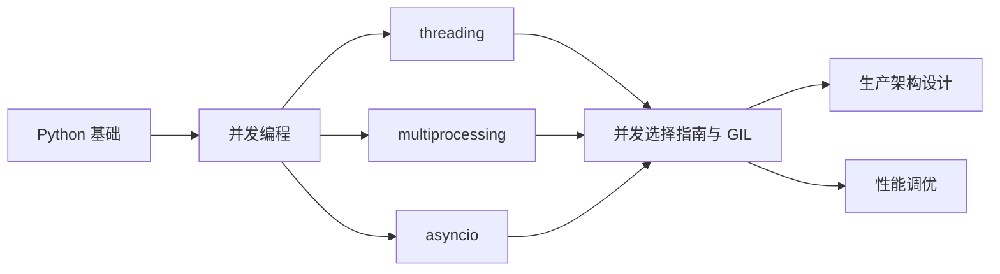
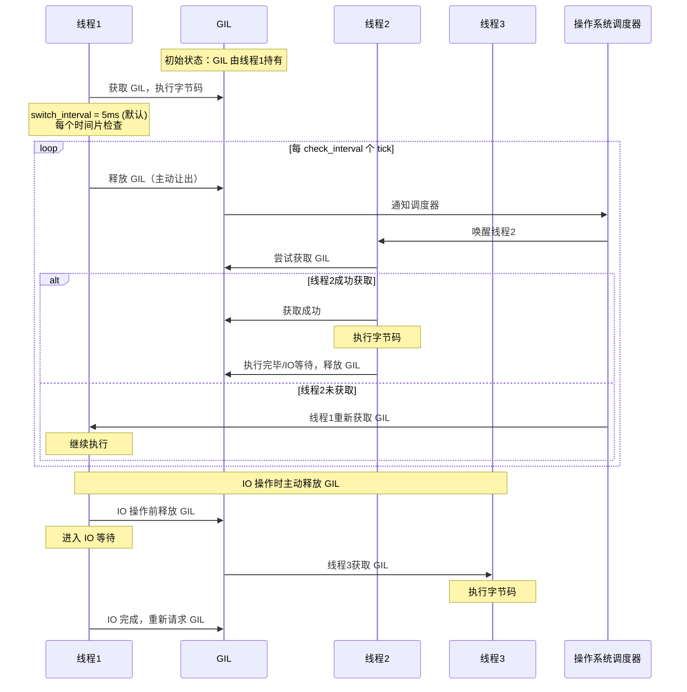
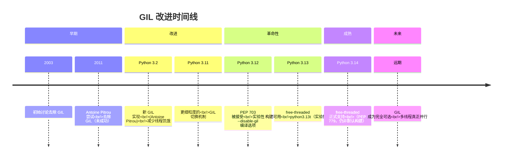
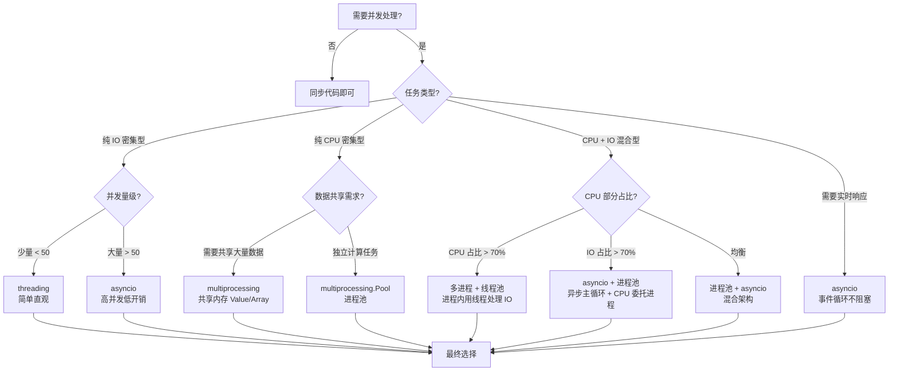
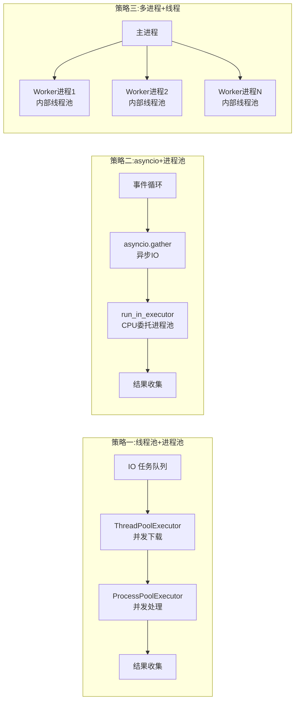
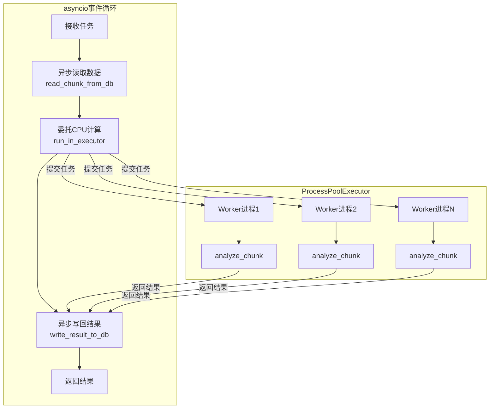

# 并发选择指南与 GIL

## 概述

### 是什么

Python 并发选择指南是一套根据任务类型、性能需求和工程约束来选择最合适并发模型的决策体系。它的核心是理解 **GIL（全局解释器锁）** 对 Python 并发行为的根本影响，以及 threading、multiprocessing、asyncio 三大并发模型各自的适用边界。

### 为什么

许多 Python 开发者在并发编程上踩过相同的坑：以为多线程能加速计算密集型任务、在 async 函数中调用同步阻塞代码、创建过多进程导致 OOM。这些问题的根源是缺乏对 GIL 和并发模型边界的系统理解。本文从 GIL 原理出发，通过决策树、性能实测和实战场景，帮你建立正确的并发选择直觉。

### 怎么做

本文先深入 GIL 的工作原理，再对比 GIL 对不同任务类型的影响，然后介绍 Python 3.12+ 的 GIL 改进方向，接着通过决策树和性能实测给出量化的选择依据，最后覆盖混合策略和实战场景。读完本文后，你应当能自信地为任何 Python 项目选择最合适的并发方案。

### 知识定位



::: info 阅读建议
本文假设你已熟悉 threading、multiprocessing、asyncio 的基本用法。如果对某一并发模型还不熟悉，建议先阅读本专题的前三篇文档再进入本文。
:::

## 核心内容

## 一、GIL 原理深入

### 什么是 GIL

GIL（Global Interpreter Lock）是 CPython 解释器中的一把全局互斥锁。它确保**在任何时刻，只有一个操作系统线程能够执行 Python 字节码**。这意味着即使你的程序创建了 10 个线程并且运行在 10 核 CPU 上，同一时刻也只有一个线程在执行 Python 代码。

### GIL 的存在原因

GIL 的存在并非设计失误，而是 CPython 内存管理模型的必然选择：

1. **引用计数的线程安全**：CPython 使用引用计数管理对象生命周期，每个对象头部有 `ob_refcnt` 字段。如果没有 GIL，每次增减引用计数都需要加细粒度锁，性能开销远大于 GIL。
2. **C 扩展兼容性**：大量 C 扩展（如 NumPy）依赖 GIL 保证线程安全，移除 GIL 需要同时修改整个生态。
3. **单线程性能**：GIL 使得单线程程序无需频繁获取/释放细粒度锁，性能更优。

### GIL 切换机制时序图

下面的时序图展示了 GIL 在多线程环境下的切换过程：



::: tip 关键理解
- **切换间隔**：自 Python 3.2 的新 GIL 起，切换基于时间片而非字节码计数，默认 5ms（`sys.getswitchinterval()` 查看，`sys.setswitchinterval()` 调整）。更早版本（2.x/3.1）的 `sys.setcheckinterval()` 已在 3.9 中移除。
- **主动释放**：线程在执行 IO 操作（如网络请求、文件读写）前会**主动释放 GIL**，这就是为什么多线程在 IO 密集型任务中仍然有效。
- **被动切换**：CPU 密集型线程不会主动释放 GIL，只能等待时间片到期后被强制切换。
:::

### GIL 的获取与释放规则

```python
import sys
import time

# 查看 GIL 切换间隔（3.2 起基于时间片，默认 5ms）
print(f"GIL 切换间隔: {sys.getswitchinterval()}s")  # 0.005 (5ms)

# 设置 GIL 切换间隔（慎用）
sys.setswitchinterval(0.01)  # 设置为 10ms

# C 扩展可以主动释放 GIL
# 在 C 代码中：
# Py_BEGIN_ALLOW_THREADS  → 释放 GIL
# ... 执行不涉及 Python 对象的 C 代码 ...
# Py_END_ALLOW_THREADS    → 重新获取 GIL
```

### 为什么纯 Python 多线程无法利用多核

```python
"""
演示：纯 Python CPU 密集型任务无法利用多核
"""
import threading
import time
import os

def cpu_bound_task(n: int) -> int:
    """CPU 密集型：纯 Python 计算"""
    total = 0
    for i in range(n):
        total += i * i
    return total

def run_single_thread():
    """单线程执行"""
    start = time.perf_counter()
    result1 = cpu_bound_task(5_000_000)
    result2 = cpu_bound_task(5_000_000)
    elapsed = time.perf_counter() - start
    print(f"单线程耗时: {elapsed:.2f}s")
    return elapsed

def run_multi_thread():
    """多线程执行"""
    results = [0, 0]

    def worker(idx, n):
        results[idx] = cpu_bound_task(n)

    start = time.perf_counter()
    t1 = threading.Thread(target=worker, args=(0, 5_000_000))
    t2 = threading.Thread(target=worker, args=(1, 5_000_000))
    t1.start()
    t2.start()
    t1.join()
    t2.join()
    elapsed = time.perf_counter() - start
    print(f"多线程耗时: {elapsed:.2f}s (由于 GIL，可能比单线程更慢)")
    return elapsed

if __name__ == "__main__":
    print(f"CPU 核心数: {os.cpu_count()}")
    t_single = run_single_thread()
    t_multi = run_multi_thread()
    print(f"多线程/单线程比率: {t_multi / t_single:.2f}x")
    # 预期结果：多线程不会更快，甚至可能更慢（GIL 切换开销）
```

## 二、GIL 对多线程的影响

### CPU 密集型 vs IO 密集型

GIL 对不同任务类型的影响截然不同：

| 任务类型 | GIL 影响 | 多线程加速效果 | 原因 |
|----------|---------|---------------|------|
| CPU 密集型（纯 Python） | 严重 | 无加速，可能更慢 | 线程无法并行执行字节码 |
| CPU 密集型（C 扩展） | 较小 | 有加速 | C 扩展可释放 GIL |
| IO 密集型 | 无 | 显著加速 | IO 等待时主动释放 GIL |
| 混合型 | 中等 | 部分加速 | IO 阶段可并行，CPU 阶段串行 |

### IO 密集型：多线程有效

```python
"""
演示：IO 密集型任务，多线程显著加速
"""
import threading
import time
from urllib.request import urlopen

URLS = [
    "https://httpbin.org/delay/1",
    "https://httpbin.org/delay/1",
    "https://httpbin.org/delay/1",
    "https://httpbin.org/delay/1",
]

def fetch_url(url: str) -> str:
    """IO 密集型：网络请求"""
    with urlopen(url, timeout=10) as resp:
        return resp.read()

def run_sync():
    """同步顺序执行"""
    start = time.perf_counter()
    for url in URLS:
        fetch_url(url)
    elapsed = time.perf_counter() - start
    print(f"同步执行耗时: {elapsed:.2f}s")
    return elapsed

def run_threaded():
    """多线程并发执行"""
    start = time.perf_counter()
    threads = []
    for url in URLS:
        t = threading.Thread(target=fetch_url, args=(url,))
        t.start()
        threads.append(t)
    for t in threads:
        t.join()
    elapsed = time.perf_counter() - start
    print(f"多线程执行耗时: {elapsed:.2f}s")
    return elapsed

if __name__ == "__main__":
    t_sync = run_sync()
    t_thread = run_threaded()
    print(f"加速比: {t_sync / t_thread:.2f}x")
    # 预期结果：多线程接近 4x 加速（4 个 IO 任务并行）
```

### CPU 密集型：多线程失效，多进程有效

```python
"""
演示：CPU 密集型任务，多进程显著加速，多线程无效
"""
import threading
import multiprocessing
import time

def cpu_heavy(n: int) -> int:
    """CPU 密集型任务"""
    total = 0
    for i in range(n):
        total += i * i
    return total

N = 5_000_000
WORKERS = 4

def benchmark_sync():
    start = time.perf_counter()
    for _ in range(WORKERS):
        cpu_heavy(N)
    return time.perf_counter() - start

def benchmark_threading():
    results = [0] * WORKERS

    def worker(idx):
        results[idx] = cpu_heavy(N)

    start = time.perf_counter()
    threads = [threading.Thread(target=worker, args=(i,)) for i in range(WORKERS)]
    for t in threads:
        t.start()
    for t in threads:
        t.join()
    return time.perf_counter() - start

def benchmark_multiprocessing():
    start = time.perf_counter()
    with multiprocessing.Pool(WORKERS) as pool:
        pool.map(cpu_heavy, [N] * WORKERS)
    return time.perf_counter() - start

if __name__ == "__main__":
    t_sync = benchmark_sync()
    t_thread = benchmark_threading()
    t_proc = benchmark_multiprocessing()

    print(f"同步:     {t_sync:.2f}s (基准)")
    print(f"多线程:   {t_thread:.2f}s ({t_thread / t_sync:.2f}x)")
    print(f"多进程:   {t_proc:.2f}s ({t_proc / t_sync:.2f}x)")
    # 预期结果：
    # 多线程 ≈ 1.0x~1.2x（GIL 限制，甚至更慢）
    # 多进程 ≈ 0.3x~0.5x（真正并行，接近核心数倍加速）
```

### C 扩展可绕过 GIL

```python
"""
演示：NumPy 等 C 扩展在执行计算时释放 GIL
"""
import numpy as np
import threading
import time

def numpy_heavy():
    """NumPy 矩阵运算，内部释放 GIL"""
    a = np.random.rand(2000, 2000)
    b = np.random.rand(2000, 2000)
    for _ in range(10):
        _ = a @ b  # 矩阵乘法，释放 GIL

def benchmark_numpy_threading():
    start = time.perf_counter()
    threads = [threading.Thread(target=numpy_heavy) for _ in range(4)]
    for t in threads:
        t.start()
    for t in threads:
        t.join()
    return time.perf_counter() - start

def benchmark_numpy_sync():
    start = time.perf_counter()
    for _ in range(4):
        numpy_heavy()
    return time.perf_counter() - start

if __name__ == "__main__":
    t_sync = benchmark_numpy_sync()
    t_thread = benchmark_numpy_threading()
    print(f"NumPy 同步:   {t_sync:.2f}s")
    print(f"NumPy 多线程: {t_thread:.2f}s ({t_thread / t_sync:.2f}x)")
    # 预期结果：多线程有显著加速（NumPy 释放了 GIL）
```

## 三、Python 3.12+ GIL 改进

### PEP 703：使 GIL 成为可选项

PEP 703（Making the Global Interpreter Lock Optional in CPython）是 Python 并发领域最重要的提案之一，目标是在 CPython 中**使 GIL 成为可选项**，允许真正的多线程并行执行。



### Python 3.13 free-threaded 模式

```python
"""
Python 3.13+ free-threaded 模式演示
构建方式: ./configure --disable-gil && make
运行: python3.13t script.py
"""
import sys
import threading
import time

# 检查是否运行在 free-threaded 模式
if sys.version_info >= (3, 13):
    # Python 3.13+ 提供 GIL 状态查询
    if hasattr(sys, '_is_gil_enabled'):
        print(f"GIL 启用: {sys._is_gil_enabled()}")
    else:
        print("当前 Python 不支持 GIL 状态查询")

def cpu_heavy(n: int) -> int:
    total = 0
    for i in range(n):
        total += i * i
    return total

def benchmark_free_threaded():
    """在 free-threaded 模式下，多线程可真正并行"""
    N = 5_000_000
    WORKERS = 4
    results = [0] * WORKERS

    def worker(idx):
        results[idx] = cpu_heavy(N)

    start = time.perf_counter()
    threads = [threading.Thread(target=worker, args=(i,)) for i in range(WORKERS)]
    for t in threads:
        t.start()
    for t in threads:
        t.join()
    elapsed = time.perf_counter() - start
    print(f"Free-threaded 多线程耗时: {elapsed:.2f}s")
    return elapsed

if __name__ == "__main__":
    benchmark_free_threaded()
```

### GIL 改进对比

| 特性 | Python 3.11 及之前 | Python 3.12 | Python 3.13 (free-threaded) |
|------|-------------------|-------------|---------------------------|
| GIL 状态 | 始终启用 | 始终启用 | 可选禁用 |
| 多线程 CPU 并行 | 不可能 | 不可能 | 可行 |
| 切换机制 | 基于时间片 (5ms，3.2 起) | 基于时间片 (5ms) | N/A (无 GIL) |
| 单线程性能 | 基准 | 基准 | 略有下降 (约 5-10%) |
| C 扩展兼容 | 完全兼容 | 完全兼容 | 需适配 |
| 生态支持 | 完全 | 完全 | 逐步跟进中 |

::: warning 生产环境注意
Python 3.13 的 free-threaded 构建仍为**实验性质**；3.14 起已正式支持（PEP 779），但仍非默认构建。即便在 3.14+ 上，生产采用前也需验证关键 C 扩展（NumPy、Pandas 等）的 free-threaded 兼容性，可参考官方兼容性指南逐步迁移。
:::

## 四、并发模型选择决策树



### 选择速查

| 场景 | 推荐模型 | 原因 |
|------|---------|------|
| 爬虫（大量 HTTP 请求） | asyncio + aiohttp | 高并发低开销，单线程即可处理数千连接 |
| 文件处理（读写大量小文件） | threading | IO 操作简单，线程开销可接受 |
| 数据计算（矩阵运算、统计） | multiprocessing | 绕过 GIL，真正并行 |
| Web 服务（API 请求处理） | asyncio (FastAPI) | 高并发连接，异步框架天然支持 |
| 图像处理（批量裁剪/滤镜） | multiprocessing | CPU 密集，进程池并行 |
| 日志分析（读文件 + 计算） | 多进程 + 线程池 | 读文件用线程，计算用进程 |
| 实时数据流（WebSocket） | asyncio | 事件循环天然适合长连接 |

## 五、性能对比实测

### 完整基准测试代码

```python
"""
并发模型性能对比基准测试
测试场景：IO 密集型、CPU 密集型、混合型
"""
import asyncio
import time
import threading
import multiprocessing
from concurrent.futures import ThreadPoolExecutor, ProcessPoolExecutor
from functools import partial

# ============================================================
# 任务定义
# ============================================================

def io_task(duration: float = 0.1) -> str:
    """模拟 IO 任务（time.sleep 模拟阻塞）"""
    time.sleep(duration)
    return f"io_done_{duration}"

async def async_io_task(duration: float = 0.1) -> str:
    """模拟异步 IO 任务"""
    await asyncio.sleep(duration)
    return f"async_io_done_{duration}"

def cpu_task(n: int = 5_000_000) -> int:
    """CPU 密集型任务"""
    total = 0
    for i in range(n):
        total += i * i
    return total

def mixed_task(n: int = 100_000, duration: float = 0.05) -> int:
    """混合型任务：先 IO 再 CPU"""
    time.sleep(duration)  # IO 部分
    total = 0
    for i in range(n):    # CPU 部分
        total += i * i
    return total

# ============================================================
# 同步基准
# ============================================================

def benchmark_sync_io(task_count: int = 8, duration: float = 0.1) -> float:
    start = time.perf_counter()
    for _ in range(task_count):
        io_task(duration)
    return time.perf_counter() - start

def benchmark_sync_cpu(task_count: int = 4, n: int = 5_000_000) -> float:
    start = time.perf_counter()
    for _ in range(task_count):
        cpu_task(n)
    return time.perf_counter() - start

# ============================================================
# 多线程
# ============================================================

def benchmark_threading_io(task_count: int = 8, duration: float = 0.1) -> float:
    start = time.perf_counter()
    with ThreadPoolExecutor(max_workers=task_count) as executor:
        list(executor.map(io_task, [duration] * task_count))
    return time.perf_counter() - start

def benchmark_threading_cpu(task_count: int = 4, n: int = 5_000_000) -> float:
    start = time.perf_counter()
    with ThreadPoolExecutor(max_workers=task_count) as executor:
        list(executor.map(cpu_task, [n] * task_count))
    return time.perf_counter() - start

# ============================================================
# 多进程
# ============================================================

def benchmark_multiprocessing_cpu(task_count: int = 4, n: int = 5_000_000) -> float:
    start = time.perf_counter()
    with ProcessPoolExecutor(max_workers=task_count) as executor:
        list(executor.map(cpu_task, [n] * task_count))
    return time.perf_counter() - start

def benchmark_multiprocessing_io(task_count: int = 8, duration: float = 0.1) -> float:
    start = time.perf_counter()
    with ProcessPoolExecutor(max_workers=task_count) as executor:
        list(executor.map(io_task, [duration] * task_count))
    return time.perf_counter() - start

# ============================================================
# asyncio
# ============================================================

async def _async_io_benchmark(task_count: int, duration: float) -> float:
    start = time.perf_counter()
    tasks = [async_io_task(duration) for _ in range(task_count)]
    await asyncio.gather(*tasks)
    return time.perf_counter() - start

def benchmark_asyncio_io(task_count: int = 8, duration: float = 0.1) -> float:
    return asyncio.run(_async_io_benchmark(task_count, duration))

# ============================================================
# 运行全部基准
# ============================================================

def run_all_benchmarks():
    print("=" * 60)
    print("并发模型性能对比基准测试")
    print("=" * 60)

    # IO 密集型
    print("\n--- IO 密集型 (8 个任务, 每个 0.1s) ---")
    t_sync_io = benchmark_sync_io()
    t_thread_io = benchmark_threading_io()
    t_process_io = benchmark_multiprocessing_io()
    t_async_io = benchmark_asyncio_io()

    print(f"同步:       {t_sync_io:.3f}s (基准)")
    print(f"多线程:     {t_thread_io:.3f}s ({t_sync_io / t_thread_io:.1f}x 加速)")
    print(f"多进程:     {t_process_io:.3f}s ({t_sync_io / t_process_io:.1f}x 加速)")
    print(f"asyncio:    {t_async_io:.3f}s ({t_sync_io / t_async_io:.1f}x 加速)")

    # CPU 密集型
    print("\n--- CPU 密集型 (4 个任务, 各 500 万次迭代) ---")
    t_sync_cpu = benchmark_sync_cpu()
    t_thread_cpu = benchmark_threading_cpu()
    t_process_cpu = benchmark_multiprocessing_cpu()

    print(f"同步:       {t_sync_cpu:.3f}s (基准)")
    print(f"多线程:     {t_thread_cpu:.3f}s ({t_sync_cpu / t_thread_cpu:.2f}x)")
    print(f"多进程:     {t_process_cpu:.3f}s ({t_sync_cpu / t_process_cpu:.1f}x 加速)")

if __name__ == "__main__":
    run_all_benchmarks()
```

### 典型基准结果

下表为审校时实测参考值（Apple Silicon 10 核，macOS，Python 3.14.6，运行上文基准代码）：

| 模型 | IO 密集型 (8x0.1s) | CPU 密集型 (4x500 万次迭代) |
|------|-------------------|-------------------|
| 同步 | 0.82s (1x) | 0.50s (1x) |
| 多线程 | 0.11s (7.8x) | 0.50s (1.0x) |
| 多进程 | 0.27s (3.0x) | 0.23s (2.2x) |
| asyncio | 0.10s (8.1x) | N/A |

::: tip 解读基准结果
- **IO 密集型**：asyncio 最优，多线程接近，多进程因进程启动与通信开销较慢。
- **CPU 密集型**：多进程最优，多线程因 GIL 完全无加速（约 1.0x）。
- **任务粒度要够大**：若把 CPU 任务降到 50 万次迭代（单次仅十几毫秒），进程池的启动与序列化开销会吞掉全部收益，甚至比同步更慢——CPU 密集型任务要足够重，多进程才划算。
- 上述数据为实测参考值，实际结果受 CPU 核心数、任务粒度、系统负载影响，请以自己环境实测为准。
:::

## 六、混合策略

当任务同时包含 CPU 和 IO 成分时，单一并发模型往往不是最优解。混合策略通过组合不同模型来发挥各自优势。

### 策略一：进程池 + 线程池

适用场景：主循环需要处理多个 IO 任务，每个 IO 任务完成后需要进行 CPU 计算。

```python
"""
混合策略：进程池处理 CPU 密集计算，线程池处理 IO 操作
场景：批量下载图片 + 图片处理
"""
import time
import os
from concurrent.futures import ThreadPoolExecutor, ProcessPoolExecutor, as_completed

def download_image(url: str) -> bytes:
    """IO 密集型：下载图片（模拟）"""
    time.sleep(0.1)  # 模拟网络延迟
    return f"data_from_{url}".encode()

def process_image(data: bytes) -> dict:
    """CPU 密集型：图片处理（模拟）"""
    total = 0
    for i in range(200_000):
        total += i * i
    return {"size": len(data), "hash": hash(data), "computed": total}

def pipeline_thread_then_process(urls: list[str]) -> list[dict]:
    """
    混合策略一：先线程池下载，再进程池处理
    适合 IO 和 CPU 阶段明显分离的任务
    """
    # 阶段1：线程池并发下载
    downloaded = []
    with ThreadPoolExecutor(max_workers=8) as thread_pool:
        future_to_url = {
            thread_pool.submit(download_image, url): url
            for url in urls
        }
        for future in as_completed(future_to_url):
            downloaded.append(future.result())

    # 阶段2：进程池并发处理
    results = []
    cpu_workers = min(os.cpu_count() or 4, len(downloaded))
    with ProcessPoolExecutor(max_workers=cpu_workers) as process_pool:
        for result in process_pool.map(process_image, downloaded):
            results.append(result)

    return results

if __name__ == "__main__":
    urls = [f"https://example.com/img{i}.jpg" for i in range(16)]
    start = time.perf_counter()
    results = pipeline_thread_then_process(urls)
    elapsed = time.perf_counter() - start
    print(f"混合策略耗时: {elapsed:.2f}s, 处理 {len(results)} 张图片")
```

### 策略二：进程池 + asyncio

适用场景：以 asyncio 事件循环为主，CPU 密集计算委托给进程池。

```python
"""
混合策略二：asyncio 主循环 + ProcessPoolExecutor 处理 CPU 任务
场景：异步 Web 服务中需要执行 CPU 密集计算
"""
import asyncio
import time
from concurrent.futures import ProcessPoolExecutor

def cpu_intensive_analysis(data: dict) -> dict:
    """CPU 密集型：数据分析"""
    total = 0
    for i in range(1_000_000):
        total += i * i
    return {"input_id": data.get("id"), "result": total}

async def fetch_data(session_id: int) -> dict:
    """IO 密集型：异步获取数据"""
    await asyncio.sleep(0.05)  # 模拟异步数据库查询
    return {"id": session_id, "raw": f"session_{session_id}"}

async def process_pipeline():
    """
    混合策略二：asyncio 主循环 + 进程池
    异步获取数据，CPU 计算委托给进程池
    """
    loop = asyncio.get_running_loop()
    cpu_workers = min(4, os.cpu_count() or 4)
    process_pool = ProcessPoolExecutor(max_workers=cpu_workers)

    try:
        # 异步并发获取数据
        fetch_tasks = [fetch_data(i) for i in range(8)]
        data_list = await asyncio.gather(*fetch_tasks)

        # CPU 密集计算委托给进程池（不阻塞事件循环）
        analysis_tasks = [
            loop.run_in_executor(process_pool, cpu_intensive_analysis, data)
            for data in data_list
        ]
        results = await asyncio.gather(*analysis_tasks)

        return results
    finally:
        process_pool.shutdown(wait=False)

import os

if __name__ == "__main__":
    start = time.perf_counter()
    results = asyncio.run(process_pipeline())
    elapsed = time.perf_counter() - start
    print(f"asyncio + 进程池耗时: {elapsed:.2f}s, 结果数: {len(results)}")
```

### 混合策略选择矩阵

| 策略 | 主循环 | CPU 处理 | 适用场景 | 优势 | 劣势 |
|------|--------|---------|---------|------|------|
| 线程池 + 进程池 | 线程池 | 进程池 | 批量 IO+CPU 流水线 | 阶段分离，简单清晰 | 两阶段无法重叠 |
| asyncio + 进程池 | asyncio | 进程池 | 异步服务中的 CPU 计算 | 事件循环不阻塞 | 需要理解 run_in_executor |
| 多进程 + 每进程线程 | 多进程 | 进程内线程 | 每个 worker 需要 IO+CPU | 进程内 IO 可并行 | 架构较复杂 |



## 七、实战场景

### 场景一：根据任务类型自动选择并发模型

```python
"""
智能并发选择器：根据任务类型自动选择最优并发模型
"""
import asyncio
import time
import os
from concurrent.futures import ThreadPoolExecutor, ProcessPoolExecutor
from enum import Enum
from dataclasses import dataclass
from typing import Callable, Any

class TaskType(Enum):
    IO_BOUND = "io_bound"
    CPU_BOUND = "cpu_bound"
    MIXED = "mixed"

@dataclass
class BenchmarkResult:
    task_type: TaskType
    task_count: int
    sync_time: float
    concurrent_time: float
    speedup: float
    model_used: str

class SmartConcurrencySelector:
    """智能并发选择器"""

    def __init__(self, cpu_workers: int | None = None):
        self.cpu_workers = cpu_workers or min(os.cpu_count() or 4, 8)
        self.io_workers = min(32, (os.cpu_count() or 4) * 4)

    def detect_task_type(
        self,
        func: Callable,
        sample_args: tuple = (),
        io_threshold: float = 0.5,
    ) -> TaskType:
        """
        自动检测任务类型：
        - 运行一次函数，测量 CPU 时间和墙钟时间
        - CPU时间 / 墙钟时间 < io_threshold → IO密集型
        - CPU时间 / 墙钟时间 > (1 - io_threshold) → CPU密集型
        - 否则 → 混合型
        """
        import resource

        start_cpu = time.process_time()
        start_wall = time.perf_counter()
        func(*sample_args)
        cpu_time = time.process_time() - start_cpu
        wall_time = time.perf_counter() - start_wall

        if wall_time == 0:
            return TaskType.CPU_BOUND

        cpu_ratio = cpu_time / wall_time

        if cpu_ratio < io_threshold:
            return TaskType.IO_BOUND
        elif cpu_ratio > (1 - io_threshold):
            return TaskType.CPU_BOUND
        else:
            return TaskType.MIXED

    def select_model(self, task_type: TaskType, task_count: int) -> str:
        """根据任务类型和数量选择并发模型"""
        if task_type == TaskType.IO_BOUND:
            if task_count <= 50:
                return "threading"
            else:
                return "asyncio"
        elif task_type == TaskType.CPU_BOUND:
            return "multiprocessing"
        else:  # MIXED
            if task_count <= 20:
                return "multiprocessing"
            else:
                return "asyncio+process_pool"

    def run(
        self,
        func: Callable,
        args_list: list[tuple],
        model: str | None = None,
    ) -> list[Any]:
        """
        执行任务，自动选择并发模型或使用指定模型
        """
        task_count = len(args_list)

        # 自动检测任务类型
        if args_list:
            task_type = self.detect_task_type(func, args_list[0])
        else:
            task_type = TaskType.IO_BOUND

        # 选择模型
        if model is None:
            model = self.select_model(task_type, task_count)

        print(f"任务类型: {task_type.value}, 任务数: {task_count}, 选择模型: {model}")

        # 执行
        if model == "threading":
            return self._run_threading(func, args_list)
        elif model == "multiprocessing":
            return self._run_multiprocessing(func, args_list)
        elif model == "asyncio":
            return asyncio.run(self._run_asyncio(func, args_list))
        elif model == "asyncio+process_pool":
            return asyncio.run(self._run_asyncio_with_process_pool(func, args_list))
        else:
            raise ValueError(f"未知模型: {model}")

    def _run_threading(self, func, args_list):
        with ThreadPoolExecutor(max_workers=self.io_workers) as pool:
            futures = [pool.submit(func, *args) for args in args_list]
            return [f.result() for f in futures]

    def _run_multiprocessing(self, func, args_list):
        with ProcessPoolExecutor(max_workers=self.cpu_workers) as pool:
            futures = [pool.submit(func, *args) for args in args_list]
            return [f.result() for f in futures]

    async def _run_asyncio(self, func, args_list):
        """对同步函数使用线程池包装为异步"""
        loop = asyncio.get_running_loop()
        with ThreadPoolExecutor(max_workers=self.io_workers) as pool:
            tasks = [
                loop.run_in_executor(pool, partial(func, *args))
                for args in args_list
            ]
            return await asyncio.gather(*tasks)

    async def _run_asyncio_with_process_pool(self, func, args_list):
        """asyncio + 进程池混合"""
        loop = asyncio.get_running_loop()
        with ProcessPoolExecutor(max_workers=self.cpu_workers) as pool:
            tasks = [
                loop.run_in_executor(pool, partial(func, *args))
                for args in args_list
            ]
            return await asyncio.gather(*tasks)

from functools import partial

# 使用示例
if __name__ == "__main__":
    selector = SmartConcurrencySelector()

    # IO 密集型任务
    def io_task(url: str):
        time.sleep(0.1)
        return f"response_from_{url}"

    urls = [f"https://api.example.com/data/{i}" for i in range(16)]
    results = selector.run(io_task, [(url,) for url in urls])

    # CPU 密集型任务
    def cpu_task(n: int):
        total = 0
        for i in range(n):
            total += i * i
        return total

    nums = [500_000] * 8
    results = selector.run(cpu_task, [(n,) for n in nums])
```

### 场景二：CPU+IO 混合型任务的最佳策略

```python
"""
CPU+IO 混合型任务的最佳策略
场景：数据分析平台 — 从数据库读取数据 + 执行统计计算 + 写回结果
"""
import asyncio
import time
import os
from concurrent.futures import ProcessPoolExecutor
from dataclasses import dataclass

@dataclass
class DataChunk:
    chunk_id: int
    size: int

@dataclass
class AnalysisResult:
    chunk_id: int
    mean: float
    variance: float
    compute_time: float

# ============================================================
# IO 操作（模拟异步数据库）
# ============================================================

async def read_chunk_from_db(chunk_id: int) -> DataChunk:
    """异步读取数据块"""
    await asyncio.sleep(0.05)  # 模拟数据库查询
    return DataChunk(chunk_id=chunk_id, size=100_000)

async def write_result_to_db(result: AnalysisResult) -> None:
    """异步写回结果"""
    await asyncio.sleep(0.02)  # 模拟数据库写入
    # 实际中: await db.execute("INSERT INTO results ...", result)

# ============================================================
# CPU 操作（在进程池中执行）
# ============================================================

def analyze_chunk(chunk: DataChunk) -> AnalysisResult:
    """CPU 密集型：统计分析"""
    start = time.perf_counter()
    total = 0
    total_sq = 0
    for i in range(chunk.size):
        val = i * 0.001
        total += val
        total_sq += val * val
    n = chunk.size
    mean = total / n
    variance = total_sq / n - mean * mean
    compute_time = time.perf_counter() - start
    return AnalysisResult(
        chunk_id=chunk.chunk_id,
        mean=mean,
        variance=variance,
        compute_time=compute_time,
    )

# ============================================================
# 混合策略实现
# ============================================================

async def process_one_chunk(
    chunk_id: int,
    process_pool: ProcessPoolExecutor,
) -> AnalysisResult:
    """
    单个数据块的处理流水线：
    异步读取 → 进程池计算 → 异步写回
    """
    # 1. 异步读取
    chunk = await read_chunk_from_db(chunk_id)

    # 2. CPU 计算委托给进程池（不阻塞事件循环）
    loop = asyncio.get_running_loop()
    result = await loop.run_in_executor(process_pool, analyze_chunk, chunk)

    # 3. 异步写回
    await write_result_to_db(result)

    return result

async def run_mixed_pipeline(chunk_count: int = 12) -> list[AnalysisResult]:
    """
    混合策略主入口：asyncio + ProcessPoolExecutor
    - asyncio 处理所有 IO 操作（读/写数据库）
    - ProcessPoolExecutor 处理 CPU 计算
    - 流水线并行：多个 chunk 可同时处于不同阶段
    """
    cpu_workers = min(os.cpu_count() or 4, chunk_count)
    process_pool = ProcessPoolExecutor(max_workers=cpu_workers)

    try:
        # 信号量控制并发数，避免数据库过载
        db_semaphore = asyncio.Semaphore(10)

        async def limited_process(chunk_id: int) -> AnalysisResult:
            async with db_semaphore:
                return await process_one_chunk(chunk_id, process_pool)

        # 并发处理所有数据块
        tasks = [limited_process(i) for i in range(chunk_count)]
        results = await asyncio.gather(*tasks)
        return results
    finally:
        process_pool.shutdown(wait=False)

# ============================================================
# 对比：纯同步方案
# ============================================================

def run_sync_pipeline(chunk_count: int = 12) -> list[AnalysisResult]:
    """纯同步方案作为对比"""
    results = []
    for i in range(chunk_count):
        # 同步 IO 读取
        time.sleep(0.05)
        chunk = DataChunk(chunk_id=i, size=100_000)
        # CPU 计算
        result = analyze_chunk(chunk)
        # 同步 IO 写回
        time.sleep(0.02)
        results.append(result)
    return results

if __name__ == "__main__":
    CHUNK_COUNT = 12

    # 同步方案
    start = time.perf_counter()
    sync_results = run_sync_pipeline(CHUNK_COUNT)
    sync_time = time.perf_counter() - start
    print(f"同步方案:   {sync_time:.2f}s, 处理 {len(sync_results)} 块")

    # 混合策略
    start = time.perf_counter()
    mixed_results = asyncio.run(run_mixed_pipeline(CHUNK_COUNT))
    mixed_time = time.perf_counter() - start
    print(f"混合策略:   {mixed_time:.2f}s, 处理 {len(mixed_results)} 块")

    print(f"加速比:     {sync_time / mixed_time:.1f}x")
    # 预期：混合策略 2-4x 加速
```

### 混合策略架构图



## 八、常见陷阱

| 陷阱 | 错误做法 | 正确做法 | 影响 |
|------|---------|---------|------|
| 以为多线程能加速 CPU 计算 | CPU 密集型用 threading | CPU 密集型用 multiprocessing | 无加速，甚至更慢 |
| 在 async 函数中调用同步阻塞代码 | `await time.sleep()` 或同步 IO | 使用 `asyncio.sleep()` 或 `run_in_executor` | 阻塞事件循环，所有协程卡住 |
| 忽略进程间序列化开销 | 进程间传大对象 | 使用共享内存或减少数据传递 | 性能急剧下降 |
| 过度创建进程 | 每个任务创建新进程 | 使用进程池 | 资源耗尽，启动开销大 |
| 忽略 fork 安全性 | multiprocessing fork 后操作文件/锁 | 使用 spawn 启动方式 | 死锁或数据损坏 |
| 混用线程和信号 | 多线程中注册 signal handler | 在主线程中处理信号 | 信号丢失或异常 |
| 守护进程中的子进程 | daemon 进程创建子进程 | 确保子进程在主进程退出前终止 | 僵尸进程或资源泄漏 |
| 进程池中修改全局状态 | 在 Pool worker 中修改模块级变量 | 使用初始化函数或传参 | 状态不一致 |
| 忽略 GIL 对 C 扩展的影响 | 假设所有 C 扩展都释放 GIL | 查阅文档确认 GIL 行为 | 意外的串行执行 |
| asyncio 与线程混用不加锁 | 多线程访问 asyncio 对象 | 使用 `loop.call_soon_threadsafe` | 竞态条件 |

### 陷阱详解：asyncio 中的阻塞调用

```python
"""
常见陷阱：在 async 函数中使用同步阻塞调用
"""
import asyncio
import time

# ❌ 错误：阻塞事件循环
async def bad_fetch():
    """这会阻塞整个事件循环！"""
    time.sleep(2)  # 同步阻塞，所有协程卡住
    return "result"

# ✅ 正确：使用异步等价物
async def good_fetch():
    """正确使用异步等待"""
    await asyncio.sleep(2)  # 异步等待，其他协程可运行
    return "result"

# ✅ 正确：用 run_in_executor 包装不可替代的同步调用
async def good_sync_wrapper():
    """将同步阻塞调用委托给线程池"""
    loop = asyncio.get_running_loop()
    result = await loop.run_in_executor(None, time.sleep, 2)
    return result

# 演示对比
async def demo():
    # 错误方式：所有请求串行执行
    start = time.perf_counter()
    await asyncio.gather(bad_fetch(), bad_fetch(), bad_fetch())
    print(f"阻塞方式: {time.perf_counter() - start:.2f}s")  # ~6s

    # 正确方式：所有请求并发执行
    start = time.perf_counter()
    await asyncio.gather(good_fetch(), good_fetch(), good_fetch())
    print(f"异步方式: {time.perf_counter() - start:.2f}s")  # ~2s
```

### 陷阱详解：multiprocessing fork 安全性

```python
"""
常见陷阱：multiprocessing fork 后的死锁
"""
import multiprocessing as mp
import threading
import time

# ❌ 危险：fork 后线程状态不一致
lock = threading.Lock()

def worker():
    """子进程中 lock 的状态可能不一致"""
    with lock:  # 可能永远阻塞（父进程中的锁状态被 fork 复制）
        return "done"

# ✅ 安全：使用 spawn 启动方式
def safe_worker():
    """spawn 方式启动全新进程，避免继承状态"""
    return "done"

if __name__ == "__main__":
    # 安全的启动方式
    mp.set_start_method("spawn", force=True)

    with mp.Pool(4) as pool:
        results = pool.map(safe_worker, range(4))
        print(results)
```

## 九、最佳实践速查表

### 并发模型选择

| 决策因素 | 推荐模型 | 关键配置 |
|----------|---------|---------|
| 纯 IO，少量并发 (<50) | threading | `ThreadPoolExecutor(max_workers=N)` |
| 纯 IO，大量并发 (>50) | asyncio | `asyncio.gather(*tasks)` |
| 纯 CPU | multiprocessing | `ProcessPoolExecutor(max_workers=cpu_count)` |
| CPU+IO，CPU 为主 | 多进程+线程池 | 进程数=核心数，每进程内线程池 |
| CPU+IO，IO 为主 | asyncio+进程池 | `loop.run_in_executor(process_pool, ...)` |
| 需要共享大量数据 | multiprocessing + 共享内存 | `multiprocessing.Value/Array/Manager` |
| 实时/长连接 | asyncio | FastAPI/WebSocket |

### Worker 数量配置

| 模型 | 推荐公式 | 说明 |
|------|---------|------|
| ThreadPoolExecutor (IO) | `min(32, (cpu_count + 4))` | Python 默认公式 |
| ProcessPoolExecutor (CPU) | `cpu_count` 或 `cpu_count + 1` | 不超过物理核心数 |
| asyncio 并发数 | 信号量控制 | `asyncio.Semaphore(N)` |

### 通用原则

```python
"""
并发编程最佳实践清单
"""

# 1. 先测量，再优化
import time

def measure(func, *args):
    start = time.perf_counter()
    result = func(*args)
    elapsed = time.perf_counter() - start
    print(f"{func.__name__}: {elapsed:.3f}s")
    return result

# 2. 用池化替代手动创建
from concurrent.futures import ThreadPoolExecutor, ProcessPoolExecutor

# ❌ 避免
# threads = [threading.Thread(target=work) for _ in range(100)]
# ✅ 推荐
with ThreadPoolExecutor(max_workers=8) as pool:
    pool.map(work, items)

# 3. 优先使用高级接口
from concurrent.futures import as_completed

# ✅ as_completed 按完成顺序获取结果
with ThreadPoolExecutor() as pool:
    futures = {pool.submit(work, item): item for item in items}
    for future in as_completed(futures):
        result = future.result()

# 4. 注意异常处理
def safe_work(item):
    try:
        return work(item)
    except Exception as e:
        print(f"处理 {item} 失败: {e}")
        return None

# 5. 合理使用上下文管理器
# ✅ 确保资源释放
with ProcessPoolExecutor() as pool:
    results = list(pool.map(cpu_work, data))

# 6. 避免在子进程中使用全局状态
# 使用初始化函数
def init_worker():
    global local_cache
    local_cache = {}  # 每个进程独立初始化

with ProcessPoolExecutor(initializer=init_worker) as pool:
    pool.map(work_with_cache, items)
```

## 术语表

| 术语 | 英文 | 定义 |
|------|------|------|
| GIL | Global Interpreter Lock | CPython 的全局解释器锁，同一时刻只允许一个线程执行 Python 字节码 |
| check interval | Check Interval | GIL 检查线程切换请求的时间片间隔，Python 3.2 起默认 5ms |
| free-threaded | Free-Threaded | Python 3.13+ 的无 GIL 构建模式，允许多线程真正并行 |
| PEP 703 | PEP 703 | 使 GIL 成为可选项的 Python 增强提案 |
| CPU 密集型 | CPU-bound | 计算量大、主要消耗 CPU 资源的任务 |
| IO 密集型 | IO-bound | 等待输入输出操作、CPU 空闲时间多的任务 |
| 线程安全 | Thread Safety | 代码在多线程环境中能正确执行而不产生数据竞争 |
| 竞态条件 | Race Condition | 多线程/进程访问共享资源时，执行顺序影响结果的错误 |
| 事件循环 | Event Loop | asyncio 的核心调度机制，管理协程的执行和 IO 事件 |
| 协程 | Coroutine | 使用 async/await 定义的异步函数，可在 IO 等待时挂起 |
| 进程池 | Process Pool | 预创建固定数量进程的池化复用机制 |
| 线程池 | Thread Pool | 预创建固定数量线程的池化复用机制 |
| Future | Future | 表示异步执行结果的占位对象 |
| run_in_executor | run_in_executor | asyncio 中将同步函数委托给线程/进程池执行的方法 |
| fork | fork | Unix 系统调用，创建子进程（复制父进程内存） |
| spawn | spawn | 创建全新子进程（不复制父进程状态，更安全） |
| 序列化 | Serialization / Pickling | 将 Python 对象转换为字节流以便进程间传输 |
| 守护进程 | Daemon Process | 主进程退出时自动终止的后台进程 |
| 信号量 | Semaphore | 限制并发访问数量的同步原语 |
| 混合策略 | Hybrid Strategy | 组合多种并发模型以优化性能的架构方案 |

## 延伸阅读

### 官方文档

- [Python threading 官方文档](https://docs.python.org/3/library/threading.html)
- [Python multiprocessing 官方文档](https://docs.python.org/3/library/multiprocessing.html)
- [Python concurrent.futures 官方文档](https://docs.python.org/3/library/concurrent.futures.html)
- [Python asyncio 官方文档](https://docs.python.org/3/library/asyncio.html)
- [PEP 703 — Making the GIL Optional](https://peps.python.org/pep-0703/)

### 深入理解 GIL

- [Python GIL 官方 FAQ](https://docs.python.org/3/faq/library.html#can-t-we-get-rid-of-the-global-interpreter-lock)
- [Understanding the Python GIL — David Beazley](https://www.dabeaz.com/python/UnderstandingGIL.pdf)
- [Python 3.2 New GIL Implementation](https://docs.python.org/3/whatsnew/3.2.html#multi-threading)

### Free-Threaded Python

- [Python 3.13 What's New — Free-Threaded Mode](https://docs.python.org/3.13/whatsnew/3.13.html#free-threaded-cpython)
- [Python Free-Threaded Compatibility Guide](https://py-free-threading.github.io/)

### 本专题相关

- [threading 实战](01-threading实战) — 多线程基础与线程安全
- [multiprocessing 实战](02-multiprocessing实战) — 多进程与进程间通信
- [concurrent.futures](03-concurrent.futures) — 统一的线程池/进程池接口
- [异步编程](../02-异步编程/01-asyncio基础) — asyncio 异步并发模型
- [网络编程](../04-进阶/07-网络编程) — 并发网络服务

## 版本差异（并发 → Python 3.13/3.14）

| 特性 | 本文编写时 | Python 3.13/3.14 |
|------|-----------|------------------|
| GIL | 全局锁 | 3.13 提供实验性 free-threaded 构建（PEP 703，`python3.13t`）；3.14 起正式支持（PEP 779），但仍非默认构建 |
| 线程池 | `ThreadPoolExecutor` | 不变；3.9+ 默认 max_workers 为 min(32, CPU+4) |
| 进程间通信 | `multiprocessing` | 3.14 起 Linux 等平台默认启动方式由 `fork` 改为 `forkserver`（Windows/macOS 仍为 `spawn`）；`queue`/`Pipe` 稳定 |
| 协程与线程混用 | `run_in_executor` | 3.9+ 推荐 `asyncio.to_thread()` |

> 本文讲解的 threading/multiprocessing 原理在 3.14 中完全成立；free-threaded 构建为 CPU 密集型多线程提供了新选项（3.14 起正式支持）。
