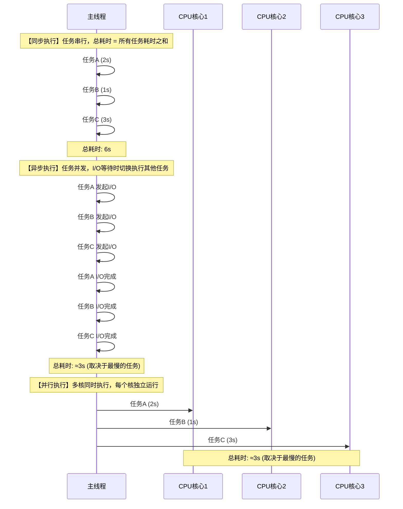
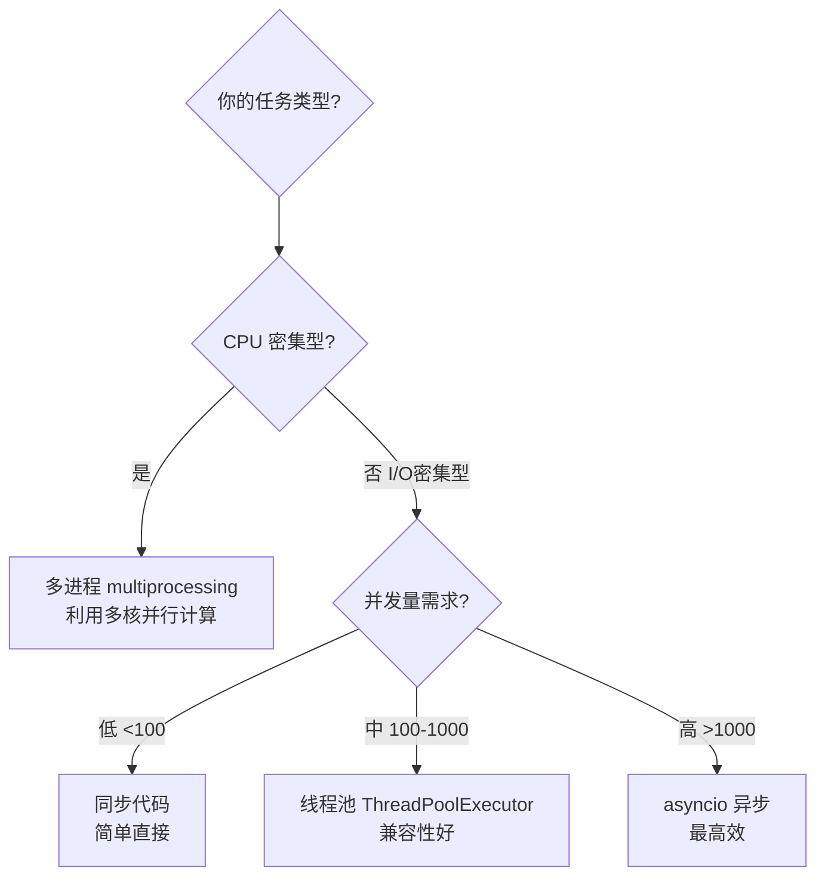
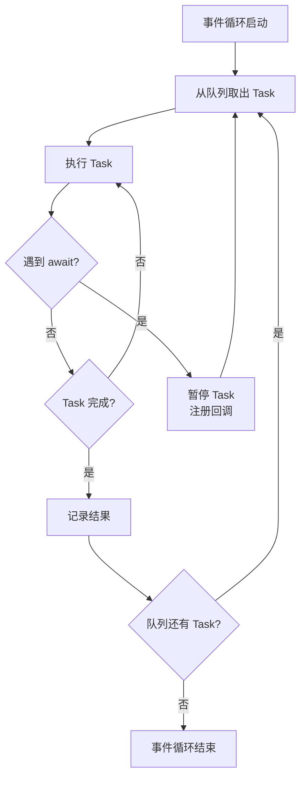
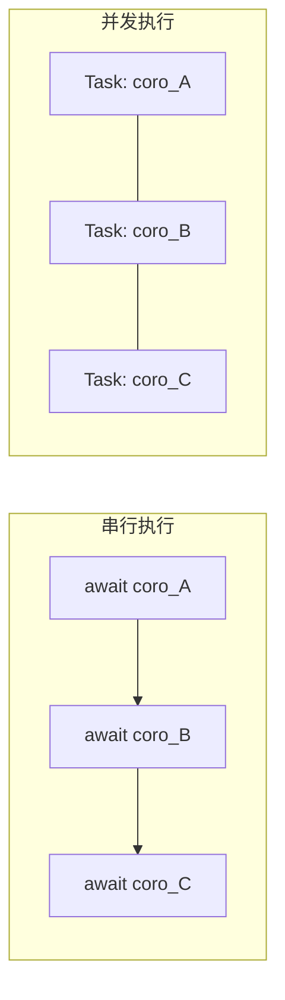
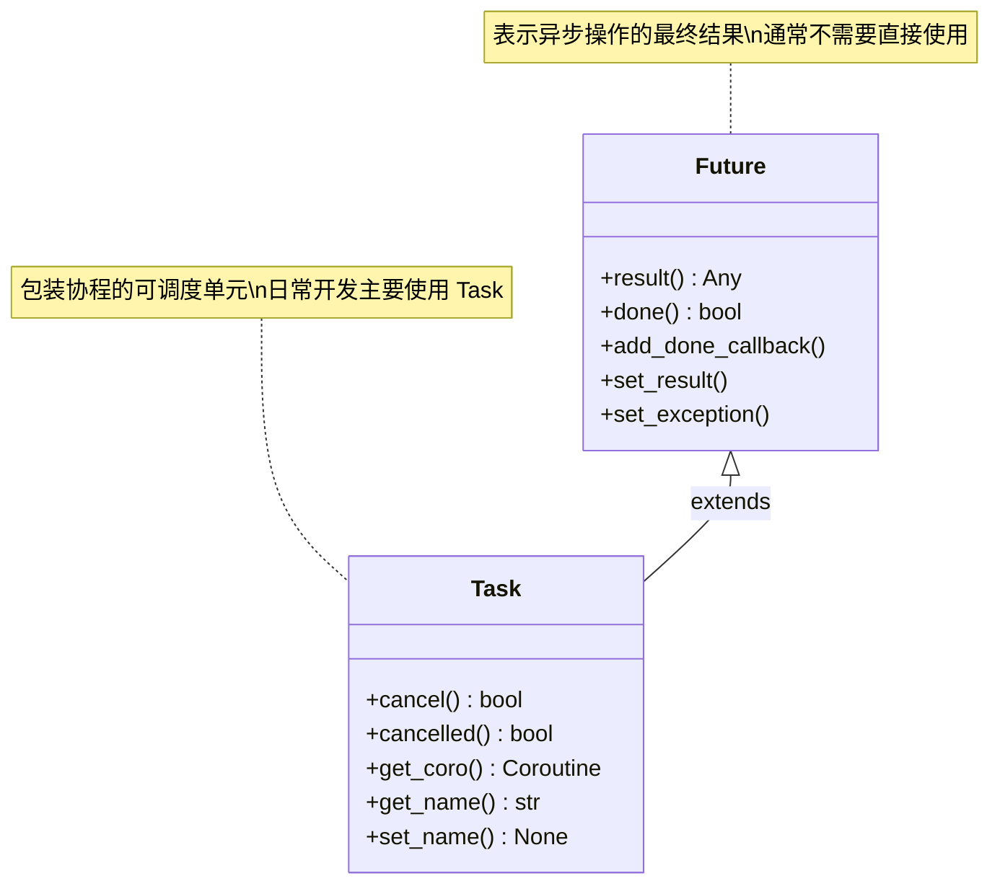
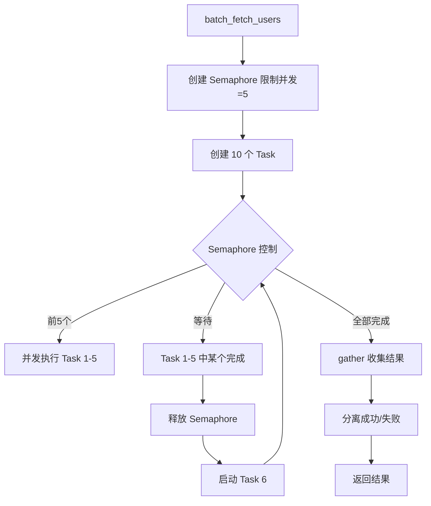
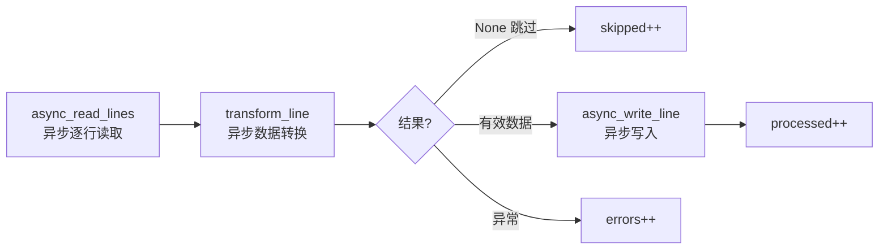

# asyncio 基础

asyncio 是 Python 标准库中用于编写**并发代码**的框架，使用 **async/await** 语法实现协程（Coroutine）调度。对于 1-3 年经验的 Python 开发者而言，掌握 asyncio 意味着你能够高效处理高并发 I/O 密集型任务——无论是同时发起数百个 HTTP 请求，还是构建实时数据管道。

> 阅读提示

- 如果你只想快速上手，可以直接跳到 [async/await 语法基础](#async-await-语法基础)和[实战场景](#实战场景)
- 如果你对"异步到底比同步快在哪"有困惑，请从[同步 vs 异步 vs 并行](#同步-vs-异步-vs-并行概念辨析)开始
- 如果你已经写过异步代码但经常踩坑，可以重点阅读[常见陷阱](#常见陷阱)和[最佳实践速查表](#最佳实践速查表)
- 本文所有代码示例基于 **Python 3.10+**，建议在阅读时同步运行实验

## 同步 vs 异步 vs 并行概念辨析

这三个概念经常被混淆，但它们描述的是完全不同的执行模型。理解它们的区别是掌握 asyncio 的前提。

### 概念定义

| 概念 | 英文 | 核心思想 | 类比 | Python 实现 |
|------|------|---------|------|-------------|
| 同步 | Synchronous | 代码按顺序逐行执行，前一步完成才执行下一步 | 排队买票，一个人买完下一个才能买 | 普通函数调用 |
| 异步 | Asynchronous | 发起操作后不等待完成，先去做别的事，完成后再回来处理 | 网购下单后继续工作，快递到了再取 | asyncio (async/await) |
| 并行 | Parallel | 多个操作在同一时刻真正同时执行（需要多核） | 多个窗口同时卖票 | multiprocessing |

### 执行模型对比图



### 关键区别：异步 ≠ 并行

异步和并行都能缩短总耗时，但原理完全不同：

- **异步**是在**单线程**内通过**任务切换**实现的——当一个任务在等待 I/O 时，CPU 去执行另一个任务。没有真正的"同时执行"，只是"交替执行"。
- **并行**需要**多核 CPU**，多个任务在物理上同时运行，每个核心独立执行一个任务。



::: warning 异步不加速 CPU 计算
asyncio 不会让 CPU 计算变快。如果你的任务是纯计算（如矩阵运算、图像处理），异步反而会增加调度开销。异步的优势仅在于**I/O 等待期间不浪费 CPU 时间**。
:::

## async/await 语法基础

### 协程函数与协程对象

`async def` 定义的函数叫做**协程函数**，调用它不会立即执行，而是返回一个**协程对象**。必须通过 `await` 或事件循环来驱动协程执行。

```python
import asyncio


async def greet(name: str) -> str:
    """协程函数：用 async def 定义"""
    await asyncio.sleep(1)  # 模拟异步 I/O 操作
    return f"Hello, {name}!"


# 调用协程函数，返回协程对象（不会执行函数体！）
coro = greet("Python")
print(type(coro))  # <class 'coroutine'>

# 必须通过 await 或 asyncio.run() 驱动执行
result = asyncio.run(greet("Python"))
print(result)  # Hello, Python!
```

::: danger 忘记 await 是最常见的新手错误
直接调用 `async def` 函数只会创建协程对象，**不会执行任何代码**。协程对象被垃圾回收时 Python 会发出 `RuntimeWarning: coroutine ... was never awaited`，但不会报错。这会导致难以察觉的 bug——函数看起来被调用了，但实际什么都没做。
:::

### await：暂停与恢复

`await` 只能在 `async def` 函数内部使用，它的作用是：

1. **暂停**当前协程的执行
2. **将控制权交还给事件循环**，让其他协程可以运行
3. 等待被 await 的异步操作完成后，**恢复**当前协程的执行

```python
async def fetch_data(url: str) -> dict:
    """模拟异步获取数据"""
    print(f"开始请求: {url}")
    await asyncio.sleep(2)  # 模拟网络延迟，暂停当前协程
    print(f"请求完成: {url}")
    return {"url": url, "status": 200}


async def main():
    # 串行执行：总耗时 ≈ 4s
    data1 = await fetch_data("https://api.example.com/users")
    data2 = await fetch_data("https://api.example.com/posts")
    print(f"获取到 {len([data1, data2])} 个结果")


asyncio.run(main())
```

### async def 的返回值

协程函数的返回值需要通过 `await` 获取：

```python
async def compute() -> int:
    await asyncio.sleep(0.5)
    return 42


async def main():
    # 正确：await 获取返回值
    result = await compute()
    print(result)  # 42

    # 错误：直接调用只得到协程对象
    coro = compute()
    print(type(coro))  # <class 'coroutine'>
    # 必须 await 这个协程对象，否则会收到 RuntimeWarning
    result2 = await coro
    print(result2)  # 42


asyncio.run(main())
```

## asyncio.run() 和事件循环入门

### 事件循环：asyncio 的心脏

事件循环（Event Loop）是 asyncio 的核心调度引擎。它的工作流程如下：

1. 将协程包装成 Task 放入待执行队列
2. 不断从队列中取出 Task 执行
3. 当 Task 遇到 `await` 暂停时，切换到下一个 Task
4. 当被 await 的操作完成时，将暂停的 Task 放回队列
5. 重复以上过程，直到所有 Task 完成



### asyncio.run()：事件循环的入口

`asyncio.run()` 是 Python 3.7+ 推荐的启动事件循环的方式。它会：

1. 创建一个新的事件循环
2. 运行传入的协程
3. 关闭事件循环

```python
import asyncio


async def main():
    print("Hello from asyncio!")
    await asyncio.sleep(1)
    print("1 second later...")


# asyncio.run() 是启动异步程序的唯一推荐方式
asyncio.run(main())
```

::: warning asyncio.run() 的使用规则
- **每个程序只调用一次** `asyncio.run()`，通常在 `if __name__ == "__main__"` 块中
- **不要在已有事件循环内**调用 `asyncio.run()`（如在协程内部），否则会抛出 `RuntimeError`
- `asyncio.run()` 会**创建新的事件循环**并关闭旧循环，不要试图复用
:::

### 获取和操作事件循环（进阶）

在某些场景下（如与现有异步框架集成），你可能需要直接操作事件循环：

```python
import asyncio


async def task(name: str, seconds: int):
    print(f"{name} 开始")
    await asyncio.sleep(seconds)
    print(f"{name} 完成 (耗时 {seconds}s)")
    return f"{name} 的结果"


async def main():
    # 推荐方式：使用 asyncio.run() 启动
    # 以下代码在协程内部获取当前运行的事件循环
    loop = asyncio.get_running_loop()
    print(f"事件循环类型: {type(loop).__name__}")

    # 在协程内部安排回调
    loop.call_soon(lambda: print("回调执行！"))

    await asyncio.sleep(0.1)  # 给回调执行的机会


asyncio.run(main())
```

::: info 不要使用 asyncio.get_event_loop()
`asyncio.get_event_loop()` 在没有运行中的事件循环时的行为逐步收紧：3.10 起发出弃用警告，3.12 起标记为弃用，3.14 起在没有当前事件循环时直接抛出 `RuntimeError`。始终使用 `asyncio.get_running_loop()` 获取当前事件循环，或使用 `asyncio.run()` 启动新循环。
:::

## Task 和 create_task

### 为什么需要 Task？

直接 `await` 协程是**串行执行**的——必须等前一个完成才能执行下一个。要让多个协程**并发执行**，需要将它们包装成 **Task**。



### asyncio.create_task()

`asyncio.create_task()` 将协程包装成 Task 并**立即将其加入事件循环的调度队列**，返回 Task 对象：

```python
import asyncio
import time


async def fetch(url: str, delay: float) -> str:
    """模拟异步 HTTP 请求"""
    print(f"[{time.strftime('%H:%M:%S')}] 开始请求: {url}")
    await asyncio.sleep(delay)  # 模拟网络延迟
    print(f"[{time.strftime('%H:%M:%S')}] 完成请求: {url}")
    return f"响应来自 {url}"


async def main():
    start = time.time()

    # 串行执行：总耗时 ≈ 6s
    # result1 = await fetch("api/users", 2)
    # result2 = await fetch("api/posts", 1)
    # result3 = await fetch("api/comments", 3)

    # 并发执行：总耗时 ≈ 3s（取决于最慢的任务）
    task1 = asyncio.create_task(fetch("api/users", 2))
    task2 = asyncio.create_task(fetch("api/posts", 1))
    task3 = asyncio.create_task(fetch("api/comments", 3))

    # 等待所有 Task 完成
    result1 = await task1
    result2 = await task2
    result3 = await task3

    elapsed = time.time() - start
    print(f"总耗时: {elapsed:.1f}s")
    print(f"结果: {result1}, {result2}, {result3}")


asyncio.run(main())
```

输出示例：

```
[14:30:01] 开始请求: api/users
[14:30:01] 开始请求: api/posts
[14:30:01] 开始请求: api/comments
[14:30:02] 完成请求: api/posts
[14:30:03] 完成请求: api/users
[14:30:04] 完成请求: api/comments
总耗时: 3.0s
```

### Task 的常用操作

```python
import asyncio


async def long_running():
    """模拟长时间运行的任务"""
    try:
        await asyncio.sleep(10)
        return "完成"
    except asyncio.CancelledError:
        print("任务被取消，执行清理...")
        raise  # 推荐重新抛出，让调用者知道任务被取消


async def main():
    # 创建 Task
    task = asyncio.create_task(long_running())

    # 检查状态
    print(f"完成? {task.done()}")   # False
    print(f"已取消? {task.cancelled()}")  # False

    # 等待一小段时间后取消
    await asyncio.sleep(1)
    task.cancel()  # 请求取消

    try:
        await task  # 等待取消完成
    except asyncio.CancelledError:
        print("主协程: 任务已被取消")

    print(f"完成? {task.done()}")   # True
    print(f"已取消? {task.cancelled()}")  # True


asyncio.run(main())
```

### Task 与 Future 的关系

Task 是 Future 的子类。Future 表示一个**异步操作的最终结果**，Task 则是将协程包装成 Future 的具体实现：



::: tip 什么时候用 Future？
日常开发中几乎不需要直接使用 Future。`asyncio.create_task()` 返回的 Task 对象已经包含了 Future 的所有功能。只有在编写底层异步库或与回调式 API 集成时，才需要直接操作 Future。
:::

## asyncio.gather 和 asyncio.wait 并发控制

### asyncio.gather()：并发执行并收集结果

`asyncio.gather()` 是最常用的并发控制工具，它同时启动多个协程，并按**传入顺序**返回结果列表：

```python
import asyncio
import time


async def fetch_api(name: str, delay: float) -> dict:
    """模拟 API 请求"""
    await asyncio.sleep(delay)
    return {"api": name, "delay": delay, "data": f"{name} 的数据"}


async def main():
    start = time.time()

    # gather 并发执行，结果按传入顺序排列
    results = await asyncio.gather(
        fetch_api("用户服务", 2),
        fetch_api("订单服务", 1),
        fetch_api("商品服务", 3),
    )

    elapsed = time.time() - start
    print(f"总耗时: {elapsed:.1f}s")  # ≈ 3s
    for r in results:
        print(f"  {r['api']}: delay={r['delay']}s")


asyncio.run(main())
```

### gather 的错误处理

`gather` 默认行为是：任何一个协程抛出异常，整个 gather 立即抛出异常。使用 `return_exceptions=True` 可以改变这个行为——异常会作为结果返回，而不是抛出：

```python
import asyncio


async def success_task():
    await asyncio.sleep(1)
    return "成功"


async def fail_task():
    await asyncio.sleep(0.5)
    raise ValueError("出错了！")


async def main():
    # 默认行为：遇到异常立即抛出
    try:
        results = await asyncio.gather(success_task(), fail_task())
    except ValueError as e:
        print(f"默认模式捕获异常: {e}")

    # return_exceptions=True：异常作为结果返回
    results = await asyncio.gather(
        success_task(), fail_task(), return_exceptions=True
    )
    for i, r in enumerate(results):
        if isinstance(r, Exception):
            print(f"任务 {i}: 异常 - {r}")
        else:
            print(f"任务 {i}: 成功 - {r}")

    # 输出:
    # 任务 0: 成功 - 成功
    # 任务 1: 异常 - 出错了！


asyncio.run(main())
```

### asyncio.wait()：更灵活的并发控制

`asyncio.wait()` 提供比 `gather` 更细粒度的控制，可以指定等待策略：

```python
import asyncio
import random


async def random_task(task_id: int):
    """随机耗时的任务"""
    delay = random.uniform(1, 5)
    await asyncio.sleep(delay)
    return f"任务 {task_id} 完成 (耗时 {delay:.1f}s)"


async def main():
    tasks = [asyncio.create_task(random_task(i)) for i in range(5)]

    # FIRST_COMPLETED: 任何一个完成就返回
    done, pending = await asyncio.wait(
        tasks, return_when=asyncio.FIRST_COMPLETED
    )
    print(f"第一个完成的: {done.pop().result()}")
    # 取消剩余任务
    for t in pending:
        t.cancel()
    await asyncio.gather(*pending, return_exceptions=True)

    # FIRST_EXCEPTION: 第一个异常或全部完成
    # ALL_COMPLETED: 等待全部完成（默认行为，等同于 gather）


asyncio.run(main())
```

### gather vs wait 对比

| 特性 | `asyncio.gather()` | `asyncio.wait()` |
|------|-------------------|-------------------|
| 返回值 | 按顺序的结果列表 | `(done, pending)` 集合 |
| 结果顺序 | 保证与传入顺序一致 | 不保证顺序 |
| 错误处理 | `return_exceptions` 参数 | 需手动检查 Task 状态 |
| 等待策略 | 只能等全部完成 | `FIRST_COMPLETED` / `FIRST_EXCEPTION` / `ALL_COMPLETED` |
| 取消任务 | 不方便单独取消 | 返回 pending 集合，方便取消 |
| 适用场景 | 需要所有结果、顺序重要 | 需要灵活控制、超时处理 |
| 超时控制 | 无内置超时 | 支持 `timeout` 参数 |

```python
import asyncio


async def main():
    # wait 的超时控制
    tasks = [asyncio.create_task(asyncio.sleep(i)) for i in range(1, 6)]

    done, pending = await asyncio.wait(tasks, timeout=2.5)
    print(f"超时前完成: {len(done)} 个")  # 2 个 (1s, 2s)
    print(f"超时未完成: {len(pending)} 个")  # 3 个 (3s, 4s, 5s)

    # 清理未完成的任务
    for t in pending:
        t.cancel()
    await asyncio.gather(*pending, return_exceptions=True)


asyncio.run(main())
```

### asyncio.TaskGroup（Python 3.11+）

Python 3.11 引入了 `TaskGroup`，提供**结构化并发**——如果任何任务抛出异常，所有其他任务会自动取消：

```python
import asyncio


async def fetch_data(name: str, delay: float):
    await asyncio.sleep(delay)
    if name == "失败服务":
        raise ConnectionError(f"{name} 连接失败")
    return f"{name} 的数据"


async def main():
    try:
        async with asyncio.TaskGroup() as tg:
            t1 = tg.create_task(fetch_data("服务A", 1))
            t2 = tg.create_task(fetch_data("失败服务", 2))
            t3 = tg.create_task(fetch_data("服务C", 3))
    except* ConnectionError as eg:  # ExceptionGroup 语法 (Python 3.11+)
        print(f"捕获到异常组: {eg.exceptions}")

    # t1 和 t3 也会被自动取消，因为 t2 抛出了异常


asyncio.run(main())
```

::: tip 推荐使用 TaskGroup
如果你使用 Python 3.11+，优先使用 `TaskGroup` 替代 `gather`。TaskGroup 的结构化并发更安全——异常不会静默丢失，任务不会泄漏。`gather` 仍然适用于需要 `return_exceptions=True` 或需要结果按顺序排列的简单场景。
:::

## 异步上下文管理器 (async with)

### 基本语法

异步上下文管理器通过 `__aenter__` 和 `__aexit__` 方法定义，使用 `async with` 语法调用。它确保异步资源的获取和释放总是成对执行，即使发生异常：

```python
import asyncio


class AsyncDatabaseConnection:
    """模拟异步数据库连接"""

    def __init__(self, db_url: str):
        self.db_url = db_url
        self._connected = False

    async def __aenter__(self):
        print(f"连接数据库: {self.db_url}")
        await asyncio.sleep(0.5)  # 模拟异步连接
        self._connected = True
        return self

    async def __aexit__(self, exc_type, exc_val, exc_tb):
        print(f"关闭数据库连接: {self.db_url}")
        await asyncio.sleep(0.2)  # 模拟异步关闭
        self._connected = False
        # 返回 False 表示不吞掉异常，True 表示吞掉异常
        return False

    async def execute(self, query: str):
        if not self._connected:
            raise RuntimeError("数据库未连接")
        await asyncio.sleep(0.1)  # 模拟异步查询
        return f"查询结果: {query}"


async def main():
    async with AsyncDatabaseConnection("postgresql://localhost/mydb") as db:
        result = await db.execute("SELECT * FROM users")
        print(result)
    # 即使发生异常，连接也会被正确关闭


asyncio.run(main())
```

### 使用 contextlib.asynccontextmanager 装饰器

与同步上下文管理器类似，`contextlib.asynccontextmanager` 可以用生成器函数简化异步上下文管理器的定义：

```python
import asyncio
from contextlib import asynccontextmanager


@asynccontextmanager
async def async_timer(name: str):
    """异步计时器：自动测量代码块执行时间"""
    start = asyncio.get_running_loop().time()
    print(f"[{name}] 开始执行")
    try:
        yield  # 在这里执行 with 块中的代码
    finally:
        elapsed = asyncio.get_running_loop().time() - start
        print(f"[{name}] 执行完成，耗时 {elapsed:.3f}s")


async def main():
    async with async_timer("数据处理"):
        await asyncio.sleep(1.5)
        print("处理中...")


asyncio.run(main())
```

### 实际应用：异步资源管理

```python
import asyncio
from contextlib import asynccontextmanager


class AsyncPool:
    """异步连接池示例"""

    def __init__(self, max_size: int = 10):
        self._max_size = max_size
        self._semaphore = asyncio.Semaphore(max_size)
        self._connections = []

    @asynccontextmanager
    async def acquire(self):
        """获取一个连接，用完自动归还"""
        await self._semaphore.acquire()
        conn = f"conn_{len(self._connections)}"
        self._connections.append(conn)
        try:
            yield conn
        finally:
            self._connections.remove(conn)
            self._semaphore.release()


async def main():
    pool = AsyncPool(max_size=3)

    async with pool.acquire() as conn:
        print(f"使用连接: {conn}")
        await asyncio.sleep(1)

    # 连接已自动归还


asyncio.run(main())
```

## 异步迭代器 (async for)

### 基本语法

异步迭代器通过 `__aiter__` 和 `__anext__` 方法定义，使用 `async for` 语法遍历。它适用于每次迭代都需要异步操作的场景（如分页获取数据、流式读取）：

```python
import asyncio


class AsyncPageFetcher:
    """异步分页数据获取器"""

    def __init__(self, total_items: int, page_size: int = 10):
        self.total_items = total_items
        self.page_size = page_size
        self._current_page = 0

    def __aiter__(self):
        return self

    async def __anext__(self) -> list[dict]:
        if self._current_page * self.page_size >= self.total_items:
            raise StopAsyncIteration

        # 模拟异步 API 请求获取一页数据
        start = self._current_page * self.page_size
        end = min(start + self.page_size, self.total_items)
        await asyncio.sleep(0.5)  # 模拟网络延迟

        page_data = [
            {"id": i, "name": f"item_{i}"} for i in range(start, end)
        ]
        self._current_page += 1
        print(f"获取第 {self._current_page} 页，共 {len(page_data)} 条")
        return page_data


async def main():
    # 异步遍历分页数据
    all_items = []
    async for page in AsyncPageFetcher(total_items=25, page_size=10):
        all_items.extend(page)

    print(f"总共获取 {len(all_items)} 条数据")


asyncio.run(main())
```

### 异步生成器

更简洁的方式是使用**异步生成器**——在 `async def` 函数中使用 `yield`：

```python
import asyncio


async def async_range(start: int, end: int, delay: float = 0.1):
    """异步生成器：每隔 delay 秒产出一个值"""
    for i in range(start, end):
        await asyncio.sleep(delay)
        yield i


async def stream_lines(file_path: str):
    """异步逐行读取文件（模拟）"""
    lines = [f"第 {i} 行内容" for i in range(1, 6)]
    for line in lines:
        await asyncio.sleep(0.2)  # 模拟异步 I/O
        yield line


async def main():
    # 使用 async for 遍历异步生成器
    print("异步范围:")
    async for num in async_range(1, 5):
        print(f"  {num}")

    print("\n异步文件流:")
    async for line in stream_lines("/tmp/data.txt"):
        print(f"  {line}")


asyncio.run(main())
```

### 异步推导式

Python 支持异步推导式——在推导式的 `for` 前加 `async`（Python 3.6+），可直接消费异步迭代器：

```python
import asyncio


async def async_range(start: int, end: int, delay: float = 0.1):
    for i in range(start, end):
        await asyncio.sleep(delay)
        yield i


async def main():
    # 异步列表推导式（Python 3.6+）
    result = [i async for i in async_range(1, 6)]
    print(result)  # [1, 2, 3, 4, 5]

    # 带条件的异步推导式
    evens = [i async for i in async_range(1, 11) if i % 2 == 0]
    print(evens)  # [2, 4, 6, 8, 10]

    # 异步集合推导式
    unique = {i % 3 async for i in async_range(1, 7)}
    print(unique)  # {0, 1, 2}

    # 异步字典推导式
    squares = {i: i**2 async for i in async_range(1, 5)}
    print(squares)  # {1: 1, 2: 4, 3: 9, 4: 16}


asyncio.run(main())
```

## 实战场景

### 场景一：并发 HTTP 请求

在实际项目中，经常需要同时请求多个 API 并汇总结果。以下示例展示如何用 asyncio 实现高效的并发请求：

```python
import asyncio
import time
from typing import Any


# 模拟异步 HTTP 请求函数（实际项目中替换为 aiohttp 或 httpx）
async def async_get(url: str, delay: float = 1.0) -> dict[str, Any]:
    """模拟异步 GET 请求"""
    await asyncio.sleep(delay)  # 模拟网络延迟
    return {"url": url, "status": 200, "data": f"来自 {url} 的响应"}


async def fetch_user(user_id: int) -> dict:
    """获取用户信息"""
    return await async_get(f"https://api.example.com/users/{user_id}", delay=0.5)


async def fetch_user_posts(user_id: int) -> list:
    """获取用户文章"""
    data = await async_get(f"https://api.example.com/users/{user_id}/posts", delay=0.8)
    return data.get("data", [])


async def fetch_user_with_posts(user_id: int) -> dict:
    """并发获取用户信息及其文章"""
    # 两个请求并发执行
    user, posts = await asyncio.gather(
        fetch_user(user_id),
        fetch_user_posts(user_id),
    )
    return {**user, "posts": posts}


async def batch_fetch_users(user_ids: list[int], max_concurrent: int = 5) -> list[dict]:
    """批量获取用户信息，控制最大并发数"""
    semaphore = asyncio.Semaphore(max_concurrent)

    async def limited_fetch(uid: int):
        async with semaphore:
            return await fetch_user_with_posts(uid)

    tasks = [limited_fetch(uid) for uid in user_ids]
    results = await asyncio.gather(*tasks, return_exceptions=True)

    # 分离成功和失败的结果
    success = []
    failures = []
    for uid, result in zip(user_ids, results):
        if isinstance(result, Exception):
            failures.append({"user_id": uid, "error": str(result)})
        else:
            success.append(result)

    print(f"成功: {len(success)}, 失败: {len(failures)}")
    return success


async def main():
    start = time.time()

    # 批量获取 10 个用户的信息，最大并发 5
    user_ids = list(range(1, 11))
    results = await batch_fetch_users(user_ids, max_concurrent=5)

    elapsed = time.time() - start
    print(f"获取 {len(results)} 个用户，总耗时: {elapsed:.1f}s")
    # 并发执行，总耗时远小于串行执行


asyncio.run(main())
```



### 场景二：异步文件处理管道

以下示例展示如何用异步生成器和 `async for` 构建一个数据处理管道——逐行读取文件、转换数据、写入结果：

```python
import asyncio
import time
from typing import AsyncIterator


# 模拟异步文件读取（实际项目中使用 aiofiles）
async def async_read_lines(file_path: str) -> AsyncIterator[str]:
    """异步逐行读取文件"""
    # 模拟文件内容
    lines = [
        "name,age,score",
        "Alice,25,92",
        "Bob,30,85",
        "Charlie,28,78",
        "Diana,22,95",
        "Eve,35,88",
    ]
    for line in lines:
        await asyncio.sleep(0.1)  # 模拟异步 I/O
        yield line


async def transform_line(line: str) -> str | None:
    """异步转换每一行数据"""
    if line.startswith("name,"):
        return None  # 跳过表头

    await asyncio.sleep(0.05)  # 模拟异步处理（如调用 API 补充数据）

    parts = line.split(",")
    name, age, score = parts[0], parts[1], parts[2]
    grade = "A" if int(score) >= 90 else "B" if int(score) >= 80 else "C"
    return f"{name}|{age}|{score}|{grade}"


async def async_write_line(file_path: str, line: str) -> None:
    """异步写入一行数据"""
    await asyncio.sleep(0.05)  # 模拟异步 I/O
    # 实际项目中: async with aiofiles.open(file_path, 'a') as f: await f.write(line)


async def process_pipeline(input_path: str, output_path: str) -> dict:
    """异步数据处理管道：读取 -> 转换 -> 写入"""
    processed = 0
    skipped = 0
    errors = 0

    async for line in async_read_lines(input_path):
        try:
            result = await transform_line(line)
            if result is None:
                skipped += 1
                continue
            await async_write_line(output_path, result)
            processed += 1
        except Exception as e:
            print(f"处理失败: {line}, 错误: {e}")
            errors += 1

    return {"processed": processed, "skipped": skipped, "errors": errors}


async def process_pipeline_concurrent(
    input_path: str, output_path: str, batch_size: int = 3
) -> dict:
    """并发版数据处理管道：批量转换，提高吞吐量"""
    processed = 0
    skipped = 0
    errors = 0

    batch = []
    async for line in async_read_lines(input_path):
        batch.append(line)
        if len(batch) >= batch_size:
            # 并发处理一批数据
            results = await asyncio.gather(
                *[transform_line(l) for l in batch],
                return_exceptions=True,
            )
            for result in results:
                if isinstance(result, Exception):
                    errors += 1
                elif result is None:
                    skipped += 1
                else:
                    await async_write_line(output_path, result)
                    processed += 1
            batch = []

    # 处理剩余数据
    if batch:
        results = await asyncio.gather(
            *[transform_line(l) for l in batch], return_exceptions=True
        )
        for result in results:
            if isinstance(result, Exception):
                errors += 1
            elif result is None:
                skipped += 1
            else:
                await async_write_line(output_path, result)
                processed += 1

    return {"processed": processed, "skipped": skipped, "errors": errors}


async def main():
    start = time.time()

    # 串行管道
    stats = await process_pipeline("input.csv", "output.csv")
    elapsed1 = time.time() - start
    print(f"串行管道: {stats}, 耗时 {elapsed1:.2f}s")

    # 并发管道
    start = time.time()
    stats = await process_pipeline_concurrent("input.csv", "output.csv")
    elapsed2 = time.time() - start
    print(f"并发管道: {stats}, 耗时 {elapsed2:.2f}s")


asyncio.run(main())
```



## 常见陷阱

| 陷阱 | 现象 | 原因 | 解决方案 |
|------|------|------|---------|
| 忘记 await | 函数"被调用"但无效果，收到 `RuntimeWarning` | `async def` 调用只返回协程对象，不执行 | 始终 `await` 协程调用，或用 `asyncio.create_task()` |
| 在异步函数中调用同步阻塞 I/O | 整个事件循环卡住，所有协程停摆 | 同步 I/O（如 `time.sleep`、`requests.get`）会阻塞线程，事件循环无法切换 | 用 `await asyncio.sleep()` 替代 `time.sleep()`；用 `aiohttp` 替代 `requests`；或用 `loop.run_in_executor()` 包装 |
| 多次调用 asyncio.run() | `RuntimeError: Event loop is closed` | `asyncio.run()` 会关闭事件循环，不能在已有循环内再次调用 | 只在程序入口调用一次 `asyncio.run()`，内部用 `await` |
| create_task 在 await 之前未保存引用 | Task 可能被垃圾回收，导致任务"消失" | 未保存的 Task 引用可能被 GC 回收，Python 3.11+ 会发出警告 | 始终保存 `task = asyncio.create_task(...)` 的返回值 |
| gather 不处理异常 | 一个任务失败导致整个 gather 抛出异常 | `gather` 默认将第一个异常向上传播 | 使用 `return_exceptions=True` 收集所有结果（含异常） |
| 过度创建 Task | 内存飙升、调度开销增大、性能下降 | 每个 Task 都有内存和调度成本，无限制创建会耗尽资源 | 用 `asyncio.Semaphore` 限制并发上限 |
| 在 async with 中忽略异常 | 资源未正确释放 | `__aexit__` 中的清理逻辑可能依赖异常信息 | 在 `__aexit__` 中正确处理 `exc_type` 参数 |
| 混用同步和异步代码 | 性能反而下降、死锁 | 同步代码阻塞事件循环，异步代码无法调度 | I/O 操作全部替换为异步版本，或用 `run_in_executor` 隔离 |
| Task 异常被静默吞掉 | Task 中的异常无人处理，程序"看起来正常" | 未 `await` 的 Task 的异常只在被 GC 时发出警告 | 始终 `await` Task，或使用 `TaskGroup`（Python 3.11+） |
| async for 中执行耗时同步操作 | 迭代速度慢，阻塞事件循环 | `async for` 的每次迭代如果包含同步阻塞，会卡住整个循环 | 将耗时同步操作放入 `run_in_executor` |

::: danger 最致命的陷阱：阻塞事件循环
在异步函数中调用任何**同步阻塞操作**（`time.sleep()`、`requests.get()`、`subprocess.run()`、CPU 密集计算）都会冻结整个事件循环。这不是"慢一点"的问题——是**所有协程全部停摆**，直到阻塞操作完成。

```python
# 错误示范：在异步函数中使用同步阻塞
async def bad_example():
    time.sleep(5)          # 阻塞整个事件循环 5 秒！
    requests.get(url)      # 阻塞整个事件循环直到请求完成！
    result = heavy_compute()  # CPU 密集计算阻塞事件循环！

# 正确做法
async def good_example():
    await asyncio.sleep(5)  # 非阻塞等待
    # 使用异步 HTTP 库
    async with aiohttp.ClientSession() as session:
        async with session.get(url) as resp:
            result = await resp.text()
    # CPU 密集任务放入线程池
    loop = asyncio.get_running_loop()
    result = await loop.run_in_executor(None, heavy_compute)
```
:::

## 最佳实践速查表

| 场景 | 推荐做法 | 避免做法 |
|------|---------|---------|
| 启动异步程序 | `asyncio.run(main())` | 手动创建事件循环 |
| 并发执行多个协程 | `asyncio.gather()` 或 `TaskGroup` (3.11+) | 逐个 `await` |
| 控制并发数量 | `asyncio.Semaphore` | 无限制创建 Task |
| 等待第一个完成 | `asyncio.wait(..., return_when=FIRST_COMPLETED)` | 手动轮询 Task 状态 |
| 超时控制 | `asyncio.wait_for(coro, timeout)` | 手动计时 + cancel |
| 取消任务 | `task.cancel()` + `await task` 捕获 `CancelledError` | 忽略取消、不 await |
| 异步资源管理 | `async with` | 手动 try/finally |
| 异步遍历 | `async for` + 异步生成器 | 将所有数据加载到内存再遍历 |
| 同步阻塞调用 | `loop.run_in_executor(None, func)` | 直接在协程中调用 |
| 异常处理 | `return_exceptions=True` 或 `try/except` | 忽略 Task 异常 |
| 调试 | `asyncio.run(main(), debug=True)` | 无调试手段 |
| 类型注解 | `async def f() -> Coroutine[Any, Any, T]` 或 `async def f() -> T` | 不写返回类型 |

### 调试技巧

```python
import asyncio


async def debug_example():
    # 1. 开启 asyncio 调试模式
    # 方式一：asyncio.run 参数
    # asyncio.run(main(), debug=True)

    # 方式二：环境变量
    # PYTHONASYNCIODEBUG=1 python script.py

    # 2. 检测未 await 的协程
    # 协程未被 await 且被垃圾回收时，会发出 RuntimeWarning

    # 3. 检测阻塞事件循环的操作
    # debug=True 时，事件循环会记录执行时间超过 100ms 的操作
    pass


# 4. 使用 asyncio 的内置日志
import logging
logging.getLogger("asyncio").setLevel(logging.DEBUG)
```

## 术语表

| 术语 | 英文 | 定义 |
|------|------|------|
| 协程 | Coroutine | 用 `async def` 定义的可暂停和恢复执行的函数，调用时返回协程对象 |
| 事件循环 | Event Loop | asyncio 的核心调度引擎，负责在协程之间切换执行 |
| Task | Task | 事件循环中包装协程的可调度单元，是 Future 的子类 |
| Future | Future | 表示异步操作最终结果的占位对象，Task 是其子类 |
| await | await | 暂停当前协程，将控制权交还事件循环，等待异步操作完成 |
| async with | Async Context Manager | 支持异步 `__aenter__`/`__aexit__` 的上下文管理器 |
| async for | Async Iterator | 支持异步 `__aiter__`/`__anext__` 的迭代器 |
| 异步生成器 | Async Generator | 使用 `async def` + `yield` 定义的生成器，可用 `async for` 遍历 |
| 信号量 | Semaphore | 限制同时访问某资源的协程数量的同步原语 |
| 结构化并发 | Structured Concurrency | TaskGroup 提供的并发模型，确保所有子任务在退出前完成或取消 |
| 非阻塞 I/O | Non-blocking I/O | 发起 I/O 操作后不等待完成，继续执行其他任务 |
| 协程调度 | Coroutine Scheduling | 事件循环决定何时执行哪个协程的过程 |
| run_in_executor | run_in_executor | 在线程池或进程池中执行同步函数，避免阻塞事件循环 |
| CancelledError | CancelledError | Task 被取消时抛出的异常，协程应捕获并执行清理 |
| ExceptionGroup | ExceptionGroup | Python 3.11+ 引入的异常组，用于收集多个并发任务的异常 |

## 延伸阅读

**站内链接**：

- [事件循环与协程深入](02-事件循环与协程) — 事件循环原理、自定义循环、协程调度、线程交互
- [异步 IO 实战](03-异步IO实战) — aiohttp/httpx 异步请求、aiofiles 异步文件、并发控制
- [异步数据库与任务队列](04-异步数据库与任务队列) — asyncpg/aiomysql、异步任务调度
- [迭代器与生成器](../04-进阶/01-迭代器与生成器) — 协程的前身，yield/send 机制
- [上下文管理器](../04-进阶/02-上下文管理器) — async with 的同步基础
- [网络编程](../04-进阶/07-网络编程) — 异步网络编程的基础

**外部链接**：

- [Python 官方 asyncio 文档](https://docs.python.org/3/library/asyncio.html) — 最权威的参考
- [PEP 492 — async/await 语法](https://peps.python.org/pep-0492/) — async/await 的设计提案
- [PEP 654 — Exception Groups and except*](https://peps.python.org/pep-0654/) — TaskGroup 的异常处理基础
- [Real Python — Async IO in Python](https://realpython.com/async-io-python/) — 优秀的英文入门教程
- [asyncio 官方示例集](https://github.com/python/cpython/tree/main/Lib/test/test_asyncio) — CPython 测试用例中的示例

## 版本差异（asyncio → Python 3.14）

| 特性 | 本文编写时 | Python 3.14 |
|------|-----------|-------------|
| 事件循环入口 | `loop.run_until_complete()` | 推荐 `asyncio.run()`（3.7+）；3.14 起 `get_event_loop()` 在没有当前事件循环时直接抛 `RuntimeError` |
| 任务组 | `create_task()` 手动管理 | 3.11+ 推荐 `asyncio.TaskGroup` 结构化并发：自动取消、聚合异常（`ExceptionGroup`） |
| 超时 | `wait_for()` | 3.11+ 推荐 `asyncio.timeout()` 上下文管理器 |
| 线程混合 | `run_in_executor()` | 3.9+ `asyncio.to_thread()` 更简洁 |
| 内省 | — | 3.14 新增 asyncio 内省能力（任务/未来状态查询） |
| 取消语义 | — | 3.8+ `CancelledError` 继承 `BaseException`，`except Exception` 捕获不到 |

> 本文讲解的协程/事件循环核心机制在 3.14 中成立；新代码建议使用 `asyncio.run()` + `TaskGroup` + `timeout()` 结构化编程。
