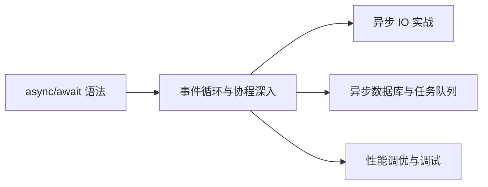
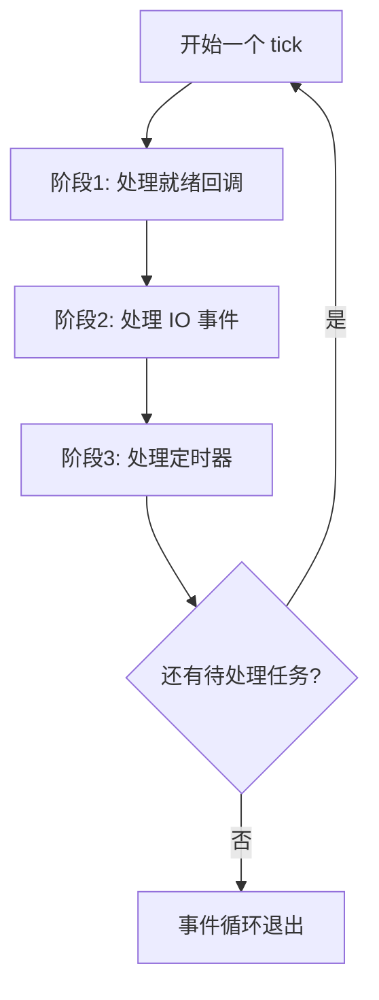
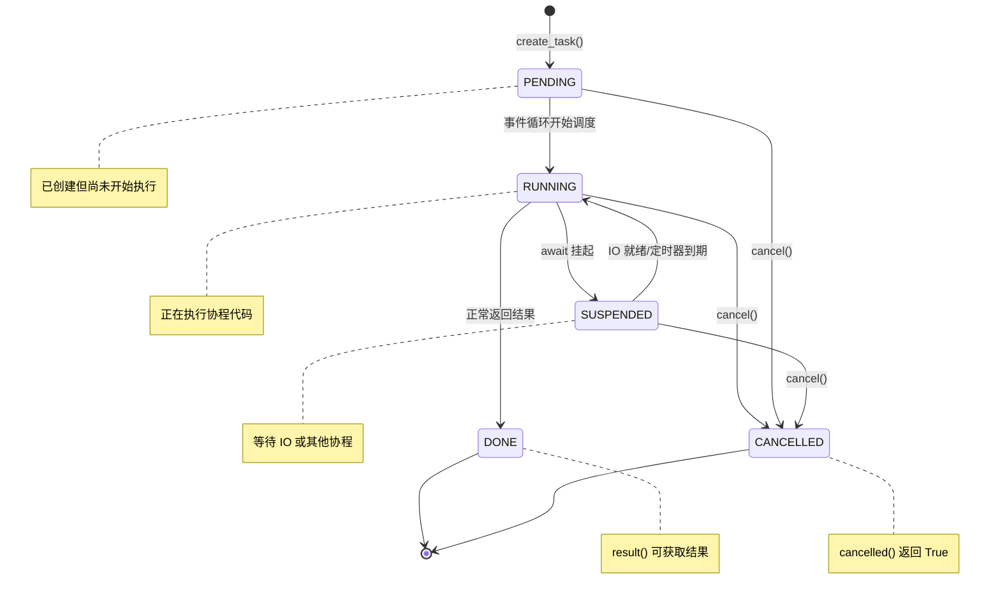
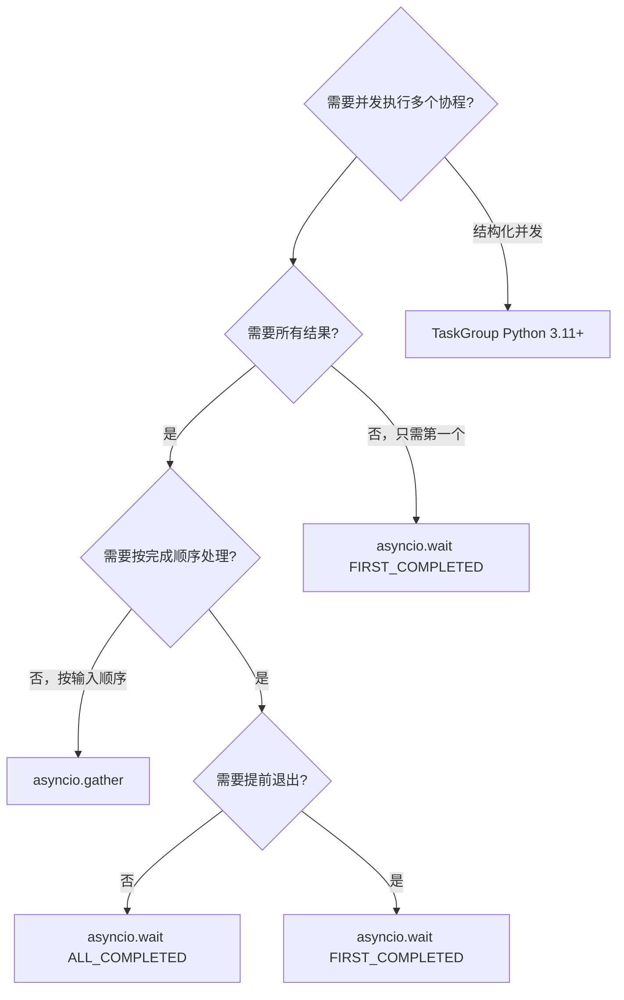

# 事件循环与协程深入

## 概述

### 是什么

事件循环（Event Loop）是 asyncio 的核心引擎，负责调度和执行协程、处理 IO 回调、管理定时器。协程（Coroutine）则是可暂停和恢复执行的函数，由事件循环驱动运行。两者共同构成了 Python 异步编程的运行时基础。

### 为什么

很多开发者会写 `async/await`，却不理解事件循环如何调度协程、Task 何时被挂起与恢复、`gather` 和 `wait` 有何本质区别。这种"知其然不知其所以然"的状态，在面对以下场景时会暴露问题：

- 异步代码中混入同步阻塞调用，导致整个服务卡死
- Task 异常被静默吞掉，排查时毫无头绪
- 手动管理事件循环时出现"no current event loop"错误
- 需要与同步库交互时不知如何正确使用 `run_in_executor`

理解事件循环与协程的底层机制，是从"会写异步代码"到"能设计异步系统"的关键跨越。

### 怎么做

本文将从事件循环的工作原理出发，逐步深入 `asyncio.run()` 内部机制、手动循环管理、Task 调度与生命周期、并发原语对比、超时处理、协程与线程交互，最后通过实战场景和常见陷阱巩固理解。

### 知识定位



::: info 阅读建议
本文假设你已掌握 `async/await` 基本语法和 `asyncio.run()` 的基本用法。如果你是异步编程初学者，建议先阅读 [asyncio 基础](01-asyncio基础)。本文所有代码基于 **Python 3.10+**，部分特性需要 **Python 3.11+**。
:::

## 事件循环工作原理

### 核心概念

事件循环本质上是一个**单线程的任务调度器**，它不断重复以下步骤：

1. 检查是否有就绪的 IO 操作（通过操作系统的多路复用机制，如 epoll/kqueue）
2. 执行就绪的回调或恢复挂起的协程
3. 处理定时器到期事件
4. 重复上述过程，直到没有待处理任务

### 事件循环处理流程

```mermaid
sequenceDiagram
    participant Main as 主协程
    participant Loop as 事件循环
    participant Selector as IO 多路复用(epoll/kqueue)
    participant Task1 as Task A
    participant Task2 as Task B
    participant OS as 操作系统

    Main->>Loop: asyncio.run(main())
    Loop->>Loop: 创建事件循环
    Loop->>Main: 开始执行 main()

    Main->>Task1: asyncio.create_task(fetch_url())
    Main->>Task2: asyncio.create_task(read_file())

    Note over Task1: 执行到 await sock.recv()
    Task1->>Loop: 挂起，注册 IO 回调
    Loop->>OS: 注册 socket 读事件
    OS->>Selector: socket 可读通知

    Note over Task2: 执行到 await f.read()
    Task2->>Loop: 挂起，注册 IO 回调
    Loop->>OS: 注册文件读事件

    Loop->>Selector: select() 检查就绪事件
    Selector-->>Loop: socket A 数据就绪

    Loop->>Task1: 恢复执行
    Note over Task1: 处理接收到的数据
    Task1->>Loop: 执行完毕，返回结果

    Loop->>Selector: select() 检查就绪事件
    Selector-->>Loop: 文件 B 数据就绪

    Loop->>Task2: 恢复执行
    Note over Task2: 处理文件数据
    Task2->>Loop: 执行完毕，返回结果

    Loop->>Main: 所有 Task 完成
    Main->>Loop: main() 执行完毕
    Loop->>Loop: 关闭事件循环
```

### 事件循环的四个阶段

每个事件循环迭代（称为一个 **tick**）包含以下阶段：



| 阶段 | 说明 | 典型操作 |
|------|------|---------|
| 处理就绪回调 | 执行上一轮 IO 完成后排队的回调 | `loop.call_soon()` 注册的回调 |
| 处理 IO 事件 | 通过 selector 检查哪些 IO 操作就绪 | socket 可读/可写、文件描述符事件 |
| 处理定时器 | 检查是否有到期的定时任务 | `loop.call_later()` 注册的定时回调 |
| 空闲等待 | 如果没有就绪事件，阻塞等待 | `selector.select(timeout)` |

### 事件循环的底层实现

Python 在不同平台上使用不同的 IO 多路复用机制：

| 平台 | IO 多路复用机制 | 说明 |
|------|---------------|------|
| Linux | epoll | 边缘触发或水平触发，性能最优 |
| macOS | kqueue | 类似 epoll，支持文件系统事件 |
| Windows | IOCP (I/O Completion Ports) | 通过 `ProactorEventLoop` 实现 |
| 通用 | select | 兼容性最好，但有文件描述符数量限制 |

::: warning Windows 注意事项
在 Windows 上，`SelectorEventLoop` 不支持 socket 以外的 IO 操作。Python 3.8+ 默认使用 `ProactorEventLoop`，它基于 IOCP 实现，支持子进程和管道操作。如果你的代码需要跨平台运行，务必注意这一差异。
:::

### 代码示例：观察事件循环行为

```python
import asyncio
import time

async def task(name: str, delay: float) -> str:
    print(f"[{time.strftime('%H:%M:%S')}] {name} 开始执行")
    await asyncio.sleep(delay)  # 模拟 IO 操作
    print(f"[{time.strftime('%H:%M:%S')}] {name} 执行完毕")
    return f"{name} 的结果"

async def main():
    # 创建多个 Task，观察事件循环如何交替调度
    t1 = asyncio.create_task(task("任务A", 2))
    t2 = asyncio.create_task(task("任务B", 1))
    t3 = asyncio.create_task(task("任务C", 3))

    # 事件循环会在 Task 挂起时切换执行其他 Task
    results = await asyncio.gather(t1, t2, t3)
    print(f"所有结果: {results}")

asyncio.run(main())
```

输出（时间线）：

```
[14:30:01] 任务A 开始执行
[14:30:01] 任务B 开始执行
[14:30:01] 任务C 开始执行
[14:30:02] 任务B 执行完毕    # 1秒后最先完成
[14:30:03] 任务A 执行完毕    # 2秒后完成
[14:30:04] 任务C 执行完毕    # 3秒后完成
所有结果: ['任务A 的结果', '任务B 的结果', '任务C 的结果']
```

## asyncio.run() 内部机制

### asyncio.run() 做了什么

`asyncio.run()` 是 Python 3.7+ 推荐的启动异步程序的入口函数。它封装了事件循环的完整生命周期管理：

```mermaid
flowchart TD
    A["asyncio.run(main())"] --> B[检查是否已有运行中的事件循环]
    B --> C{已有运行中的循环?}
    C -->|是| D[抛出 RuntimeError]
    C -->|否| E[创建新的事件循环]
    E --> F[设置为新事件循环策略的当前循环]
    F --> G[执行 loop.run_until_complete(main)]
    G --> H{main() 是否有未捕获异常?}
    H -->|是| I[取消所有待处理 Task]
    I --> J[运行循环直到所有 Task 完成/取消]
    J --> K[关闭事件循环]
    K --> L[抛出异常]
    H -->|否| M[取消所有待处理 Task]
    M --> N[运行循环直到所有 Task 完成/取消]
    N --> O[关闭事件循环]
    O --> P[返回 main() 的结果]

```

### 源码级理解

`asyncio.run()` 的核心逻辑（简化版）：

```python
# asyncio.runners 模块简化实现
def run(main, *, debug=None):
    # 1. 安全校验：确保没有已运行的事件循环
    if events._get_running_loop() is not None:
        raise RuntimeError("asyncio.run() cannot be called from a running event loop")

    # 2. 确保传入的是协程
    if not coroutines.iscoroutine(main):
        raise ValueError("a coroutine was expected, got {!r}".format(main))

    # 3. 创建新事件循环
    loop = events.new_event_loop()

    try:
        events.set_event_loop(loop)
        if debug is not None:
            loop.set_debug(debug)
        # 4. 运行主协程
        return loop.run_until_complete(main)
    finally:
        try:
            # 5. 取消所有未完成的 Task
            _cancel_all_tasks(loop)
            # 6. 运行直到所有 Task 彻底结束
            loop.run_until_complete(loop.shutdown_asyncgens())
            # Python 3.9+: 关闭延迟回调
            loop.run_until_complete(loop.shutdown_default_executor())
        finally:
            # 7. 关闭事件循环
            events.set_event_loop(None)
            loop.close()
```

### 关键行为总结

| 行为 | 说明 |
|------|------|
| 每次调用创建新循环 | `asyncio.run()` 每次调用都会创建一个全新的事件循环，运行完毕后关闭 |
| 不允许嵌套调用 | 在已运行的事件循环中再次调用会抛出 `RuntimeError` |
| 自动清理 Task | 主协程结束后，自动取消所有未完成的 Task |
| 关闭异步生成器 | 确保所有 `async for` 相关的异步生成器被正确关闭 |
| 关闭线程池 | Python 3.9+ 会等待默认 executor 的线程结束 |

::: danger 不要在 Jupyter 中使用 asyncio.run()
Jupyter Notebook 自身已经运行了一个事件循环，直接调用 `asyncio.run()` 会报错。在 Jupyter 中直接 `await` 协程即可，或使用 `nest_asyncio` 库。
:::

## 手动管理事件循环

虽然 `asyncio.run()` 是推荐的入口，但在某些场景下需要手动管理事件循环，例如：集成到已有框架、编写测试、需要精细控制循环生命周期。

### 获取事件循环

```python
import asyncio

# 方式1: 获取当前线程的事件循环（如果没有则创建）
loop = asyncio.get_event_loop()

# 方式2: 获取当前正在运行的事件循环（如果没有则抛出异常）
try:
    loop = asyncio.get_running_loop()
except RuntimeError:
    print("没有正在运行的事件循环")

# 方式3: 创建新的事件循环（不设置为当前循环）
loop = asyncio.new_event_loop()

# 方式4: 创建并设置为当前线程的事件循环
loop = asyncio.new_event_loop()
asyncio.set_event_loop(loop)
```

| API | 行为 | 适用场景 |
|-----|------|---------|
| `get_event_loop()` | 获取当前循环，无则创建 | Python 3.10 之前的旧代码 |
| `get_running_loop()` | 获取正在运行的循环，无则报错 | 在协程内部获取当前循环 |
| `new_event_loop()` | 创建新循环，不设置 | 需要独立循环时 |
| `set_event_loop()` | 设置当前线程的循环 | 手动管理循环时 |

::: warning Python 3.10+ 的行为变化
从 Python 3.10 开始，在没有运行中事件循环的上下文中调用 `asyncio.get_event_loop()` 会发出 `DeprecationWarning`；3.14 起在没有当前事件循环时直接抛出 `RuntimeError`。推荐使用 `asyncio.get_running_loop()` 或显式创建循环。
:::

### run_until_complete

`run_until_complete()` 接受一个协程或 Future，运行事件循环直到该协程完成，并返回结果：

```python
import asyncio

async def fetch_data() -> str:
    await asyncio.sleep(1)
    return "数据获取完成"

# 手动管理事件循环
loop = asyncio.new_event_loop()
asyncio.set_event_loop(loop)

try:
    result = loop.run_until_complete(fetch_data())
    print(result)  # 数据获取完成
finally:
    loop.close()
```

### run_forever

`run_forever()` 让事件循环持续运行，直到显式调用 `loop.stop()`：

```python
import asyncio

async def periodic_task():
    """每2秒执行一次的周期任务"""
    count = 0
    while True:
        count += 1
        print(f"周期任务第 {count} 次执行")
        await asyncio.sleep(2)

loop = asyncio.new_event_loop()
asyncio.set_event_loop(loop)

# 启动周期任务
task = loop.create_task(periodic_task())

# 5秒后停止循环
loop.call_later(5, loop.stop)

try:
    loop.run_forever()
finally:
    task.cancel()  # 取消未完成的任务
    loop.run_until_complete(task)  # 等待取消完成
    loop.close()
```

### 手动循环管理对比

| 方法 | 阻塞行为 | 退出条件 | 返回值 | 典型场景 |
|------|---------|---------|--------|---------|
| `run_until_complete(coro)` | 阻塞直到协程完成 | 协程返回 | 协程结果 | 运行单个协程 |
| `run_forever()` | 持续阻塞 | `loop.stop()` | 无 | 长期运行的服务 |
| `asyncio.run(coro)` | 阻塞直到协程完成 | 协程返回+清理 | 协程结果 | 标准入口（推荐） |

### 在同步代码中调用异步函数

```python
import asyncio

async def async_operation() -> str:
    await asyncio.sleep(1)
    return "异步操作完成"

def sync_caller() -> str:
    """从同步代码中调用异步函数的正确方式"""
    try:
        # 优先尝试获取已运行的循环（如在 Jupyter 中）
        loop = asyncio.get_running_loop()
    except RuntimeError:
        loop = None

    if loop and loop.is_running():
        # 已有运行中的循环，使用 nest_asyncio 或线程方案
        import concurrent.futures
        with concurrent.futures.ThreadPoolExecutor() as pool:
            future = pool.submit(asyncio.run, async_operation())
            return future.result()
    else:
        # 没有运行中的循环，直接创建
        return asyncio.run(async_operation())

result = sync_caller()
print(result)  # 异步操作完成
```

## Task 调度与生命周期

### Task 是什么

Task 是事件循环中对协程的包装，是**可调度的执行单元**。协程本身只是定义，必须被包装成 Task 后才能被事件循环调度执行。

```python
import asyncio

async def my_coroutine():
    await asyncio.sleep(1)
    return "完成"

# 协程 vs Task 的区别
coro = my_coroutine()       # 协程对象，尚未执行
task = asyncio.create_task(my_coroutine())  # Task，已被调度到事件循环
```

### Task 生命周期状态图



### 创建 Task 的方式

```python
import asyncio

async def work(name: str) -> str:
    await asyncio.sleep(1)
    return f"{name} 完成"

async def main():
    # 方式1: asyncio.create_task() — 推荐（Python 3.7+）
    task1 = asyncio.create_task(work("任务1"), name="my-task-1")

    # 方式2: loop.create_task() — 底层 API
    loop = asyncio.get_running_loop()
    task2 = loop.create_task(work("任务2"))

    # 方式3: asyncio.ensure_future() — 兼容旧代码
    task3 = asyncio.ensure_future(work("任务3"))

    # 方式4: Python 3.11+ TaskGroup — 结构化并发
    async with asyncio.TaskGroup() as tg:
        t1 = tg.create_task(work("TG任务1"))
        t2 = tg.create_task(work("TG任务2"))
    # TaskGroup 退出时自动等待所有 Task 完成

    results = await asyncio.gather(task1, task2, task3)
    print(results)
```

| 创建方式 | Python 版本 | 推荐度 | 说明 |
|---------|------------|--------|------|
| `asyncio.create_task()` | 3.7+ | 推荐 | 最常用，自动绑定当前循环 |
| `asyncio.TaskGroup` | 3.11+ | 推荐 | 结构化并发，异常处理更安全 |
| `loop.create_task()` | 全版本 | 特定场景 | 需要指定循环时使用 |
| `asyncio.ensure_future()` | 全版本 | 不推荐 | 兼容旧代码，行为不够直观 |

### Task 取消机制

```python
import asyncio

async def long_running_task():
    try:
        print("任务开始")
        await asyncio.sleep(10)  # 模拟长时间 IO
        print("任务完成")  # 这行不会执行
    except asyncio.CancelledError:
        print("任务被取消，执行清理")
        raise  # 重要：重新抛出 CancelledError
    finally:
        print("清理资源")

async def main():
    task = asyncio.create_task(long_running_task())

    # 等待一小段时间后取消
    await asyncio.sleep(1)
    task.cancel()

    try:
        await task
    except asyncio.CancelledError:
        print("主协程感知到任务被取消")

asyncio.run(main())
```

输出：

```
任务开始
任务被取消，执行清理
清理资源
主协程感知到任务被取消
```

::: warning CancelledError 处理要点
1. **Python 3.8+** 中 `CancelledError` 继承自 `BaseException` 而非 `Exception`，不会被 `except Exception` 捕获
2. 如果你在 `except CancelledError` 中不重新抛出，Task 不会被标记为已取消
3. 始终在 `finally` 块中释放资源（关闭连接、释放锁等）
:::

### TaskGroup 结构化并发（Python 3.11+）

```python
import asyncio

async def fetch(url: str) -> str:
    await asyncio.sleep(1)
    if "error" in url:
        raise ValueError(f"获取 {url} 失败")
    return f"数据来自 {url}"

async def main():
    urls = ["http://api1.com", "http://error.com", "http://api2.com"]

    try:
        async with asyncio.TaskGroup() as tg:
            tasks = [tg.create_task(fetch(url)) for url in urls]
    except* ValueError as eg:
        # ExceptionGroup 语法：只处理 ValueError 类型的异常
        print(f"部分任务失败: {eg.exceptions}")
    else:
        results = [t.result() for t in tasks]
        print(results)

asyncio.run(main())
```

`TaskGroup` 的核心优势：

| 特性 | TaskGroup | gather |
|------|-----------|--------|
| 任一 Task 失败时 | 自动取消其余所有 Task | 默认等待全部完成（`return_exceptions=False` 时抛异常但不取消其他） |
| 异常报告 | `ExceptionGroup`，保留所有异常 | 只抛出第一个异常 |
| 结构化 | 退出时保证所有 Task 已结束 | 需要手动管理 |
| 取消传播 | 父协程取消时自动取消子 Task | 需要手动处理 |

## asyncio.gather vs asyncio.wait 详细对比

### 基本用法

```python
import asyncio
import time

async def fetch(name: str, delay: float) -> str:
    await asyncio.sleep(delay)
    return f"{name} 完成"

async def demo_gather():
    """gather: 按顺序收集结果"""
    results = await asyncio.gather(
        fetch("A", 2),
        fetch("B", 1),
        fetch("C", 3),
    )
    print(f"gather 结果: {results}")
    # 输出: gather 结果: ['A 完成', 'B 完成', 'C 完成']
    # 注意：结果顺序与传入顺序一致，而非完成顺序

async def demo_wait():
    """wait: 获取完成和未完成的 Task 集合"""
    tasks = {
        asyncio.create_task(fetch("A", 2)),
        asyncio.create_task(fetch("B", 1)),
        asyncio.create_task(fetch("C", 3)),
    }
    done, pending = await asyncio.wait(tasks)
    print(f"完成: {[t.result() for t in done]}")
    # 输出顺序不确定，取决于完成顺序

asyncio.run(demo_gather())
asyncio.run(demo_wait())
```

### 完整对比表

| 特性 | `asyncio.gather()` | `asyncio.wait()` |
|------|-------------------|-----------------|
| **输入类型** | 协程或 Future | Task 或 Future（不接受裸协程） |
| **返回值** | 结果列表（按输入顺序） | `(done_set, pending_set)` 元组 |
| **结果顺序** | 与输入顺序一致 | 与完成顺序一致（无序） |
| **异常处理** | `return_exceptions=True` 时返回异常对象而非抛出 | 异常 Task 归入 `done` 集合 |
| **取消行为** | `gather` 自身被取消时取消所有子 Task | 需手动取消 `pending` 集合 |
| **完成条件** | 等待全部完成 | 支持 `FIRST_COMPLETED`、`FIRST_EXCEPTION` |
| **适用场景** | 并行请求，收集所有结果 | 需要按完成条件控制流程 |
| **Python 版本** | 3.4+ | 3.4+ |

### wait 的返回策略

```python
import asyncio

async def demo_wait_strategies():
    async def fast():
        await asyncio.sleep(0.1)
        return "fast"

    async def medium():
        await asyncio.sleep(0.5)
        return "medium"

    async def slow():
        await asyncio.sleep(2.0)
        return "slow"

    async def failing():
        await asyncio.sleep(0.3)
        raise ValueError("出错了")

    # 策略1: FIRST_COMPLETED — 任一完成即返回
    tasks = {asyncio.create_task(fast()),
             asyncio.create_task(medium()),
             asyncio.create_task(slow())}
    done, pending = await asyncio.wait(
        tasks, return_when=asyncio.FIRST_COMPLETED
    )
    print(f"FIRST_COMPLETED: 完成 {len(done)}, 待处理 {len(pending)}")
    # 输出: FIRST_COMPLETED: 完成 1, 待处理 2
    for t in pending:
        t.cancel()
    await asyncio.wait(pending)  # 等待取消完成

    # 策略2: FIRST_EXCEPTION — 第一个异常或全部完成
    tasks = {asyncio.create_task(fast()),
             asyncio.create_task(failing()),
             asyncio.create_task(slow())}
    done, pending = await asyncio.wait(
        tasks, return_when=asyncio.FIRST_EXCEPTION
    )
    print(f"FIRST_EXCEPTION: 完成 {len(done)}, 待处理 {len(pending)}")
    for t in pending:
        t.cancel()
    await asyncio.wait(pending)

    # 策略3: ALL_COMPLETED — 全部完成（默认）
    tasks = {asyncio.create_task(fast()),
             asyncio.create_task(medium())}
    done, pending = await asyncio.wait(tasks)  # 默认 ALL_COMPLETED
    print(f"ALL_COMPLETED: 完成 {len(done)}, 待处理 {len(pending)}")
    # 输出: ALL_COMPLETED: 完成 2, 待处理 0

asyncio.run(demo_wait_strategies())
```

### 异常处理对比

```python
import asyncio

async def success():
    return "成功"

async def failure():
    raise ValueError("失败")

async def demo_exception_handling():
    # gather: return_exceptions=True 捕获异常
    results = await asyncio.gather(
        success(),
        failure(),
        success(),
        return_exceptions=True,
    )
    print(f"gather 结果: {results}")
    # 输出: ['成功', ValueError('失败'), '成功']

    # gather: return_exceptions=False（默认）抛出第一个异常
    try:
        await asyncio.gather(success(), failure(), success())
    except ValueError as e:
        print(f"gather 抛出异常: {e}")

    # wait: 异常 Task 归入 done 集合
    tasks = {
        asyncio.create_task(success()),
        asyncio.create_task(failure()),
    }
    done, pending = await asyncio.wait(tasks)
    for t in done:
        if t.exception():
            print(f"wait 发现异常: {t.exception()}")
        else:
            print(f"wait 正常结果: {t.result()}")

asyncio.run(demo_exception_handling())
```

### 选择决策树



## 超时处理

### asyncio.wait_for

`wait_for()` 为协程设置超时，超时后自动取消协程：

```python
import asyncio

async def slow_operation():
    await asyncio.sleep(10)
    return "完成"

async def demo_wait_for():
    try:
        result = await asyncio.wait_for(slow_operation(), timeout=2.0)
        print(result)
    except asyncio.TimeoutError:
        print("操作超时！")

asyncio.run(demo_wait_for())
# 输出: 操作超时！
```

### asyncio.timeout（Python 3.11+）

`asyncio.timeout` 是上下文管理器形式的超时控制，更灵活：

```python
import asyncio

async def demo_timeout():
    async with asyncio.timeout(3.0):
        # 这里的所有操作共享同一个超时限制
        await asyncio.sleep(1)  # 剩余 2 秒
        await asyncio.sleep(1)  # 剩余 1 秒
        await asyncio.sleep(1)  # 超时！
    # 如果到达这里，说明所有操作在 3 秒内完成

async def demo_timeout_nested():
    """嵌套超时：内层超时先触发"""
    try:
        async with asyncio.timeout(5.0):   # 外层 5 秒
            async with asyncio.timeout(2.0):  # 内层 2 秒
                await asyncio.sleep(10)       # 内层先超时
    except asyncio.TimeoutError:
        print("内层超时触发")

asyncio.run(demo_timeout_nested())
# 输出: 内层超时触发
```

### 超时处理方式对比

| 特性 | `wait_for()` | `asyncio.timeout` |
|------|-------------|-------------------|
| Python 版本 | 3.4+ | 3.11+ |
| 形式 | 函数调用 | 上下文管理器 |
| 作用范围 | 单个协程 | 代码块内所有操作 |
| 嵌套支持 | 不支持 | 支持，内层优先 |
| 超时后行为 | 取消协程并抛出 `TimeoutError` | 取消代码块内所有 Task |
| 灵活性 | 较低 | 较高，可控制多步操作的总时间 |

### 实用超时模式

```python
import asyncio
from typing import Any

async def fetch_with_retry(
    url: str,
    timeout: float = 5.0,
    retries: int = 3,
) -> Any:
    """带重试的超时请求"""
    last_error = None

    for attempt in range(retries):
        try:
            async with asyncio.timeout(timeout):
                # 模拟 HTTP 请求
                await asyncio.sleep(2)  # 模拟网络延迟
                return f"数据来自 {url}"
        except asyncio.TimeoutError:
            last_error = TimeoutError(f"第 {attempt + 1} 次请求超时")
            print(f"第 {attempt + 1} 次请求 {url} 超时，重试中...")

    raise last_error

async def main():
    try:
        result = await fetch_with_retry("http://slow-api.com", timeout=1.0)
    except TimeoutError as e:
        print(f"所有重试失败: {e}")

asyncio.run(main())
```

## 协程与线程交互

### 为什么需要线程交互

asyncio 是单线程的，但很多场景需要与同步代码交互：

- 调用不支持异步的第三方库（如 `requests`、`subprocess`）
- 执行 CPU 密集型计算
- 集成到已有的同步框架中

### run_in_executor

`run_in_executor()` 将同步函数提交到线程池执行，避免阻塞事件循环：

```python
import asyncio
import time
from concurrent.futures import ThreadPoolExecutor

def blocking_io() -> str:
    """模拟阻塞 IO 操作"""
    time.sleep(2)  # 同步阻塞
    return "IO 完成"

def cpu_intensive(n: int) -> int:
    """模拟 CPU 密集型计算"""
    return sum(i * i for i in range(n))

async def demo_executor():
    loop = asyncio.get_running_loop()

    # 使用默认线程池执行阻塞 IO
    result = await loop.run_in_executor(None, blocking_io)
    print(f"阻塞 IO 结果: {result}")

    # 使用自定义线程池
    with ThreadPoolExecutor(max_workers=4) as pool:
        result = await loop.run_in_executor(pool, cpu_intensive, 10_000_000)
        print(f"CPU 计算结果: {result}")

asyncio.run(demo_executor())
```

### asyncio.to_thread（Python 3.9+）

`to_thread()` 是 `run_in_executor()` 的高层封装，更简洁：

```python
import asyncio
import time

def blocking_call(url: str) -> str:
    """同步阻塞函数"""
    time.sleep(1)
    return f"来自 {url} 的数据"

async def demo_to_thread():
    # to_thread: 简洁的线程调用方式
    result = await asyncio.to_thread(blocking_call, "http://api.com")
    print(result)

    # 对比 run_in_executor
    loop = asyncio.get_running_loop()
    result = await loop.run_in_executor(None, blocking_call, "http://api.com")
    print(result)

asyncio.run(demo_to_thread())
```

### run_in_executor vs to_thread 对比

| 特性 | `run_in_executor` | `to_thread` |
|------|-------------------|-------------|
| Python 版本 | 3.5+ | 3.9+ |
| 调用方式 | `loop.run_in_executor(pool, fn, *args)` | `await asyncio.to_thread(fn, *args, **kwargs)` |
| 自定义线程池 | 支持 | 不支持（使用默认线程池） |
| 关键字参数 | 不支持（需 `functools.partial`） | 支持 |
| 获取 loop | 需要先获取 loop | 自动获取 |
| 适用场景 | 需要自定义线程池或 ProcessPoolExecutor | 简单场景，快速包装同步函数 |

### 使用 ProcessPoolExecutor 处理 CPU 密集型任务

```python
import asyncio
from concurrent.futures import ProcessPoolExecutor

def heavy_computation(n: int) -> int:
    """CPU 密集型计算，适合多进程"""
    total = 0
    for i in range(n):
        total += i * i
    return total

async def demo_process_pool():
    loop = asyncio.get_running_loop()

    # 使用进程池，绕过 GIL
    with ProcessPoolExecutor() as pool:
        # 并行执行多个计算任务
        results = await asyncio.gather(
            loop.run_in_executor(pool, heavy_computation, 5_000_000),
            loop.run_in_executor(pool, heavy_computation, 5_000_000),
            loop.run_in_executor(pool, heavy_computation, 5_000_000),
        )
        print(f"计算结果: {results}")

asyncio.run(demo_process_pool())
```

### 线程安全地调度协程

从其他线程向事件循环提交协程：

```python
import asyncio
import threading

async def background_task(name: str):
    print(f"[{threading.current_thread().name}] {name} 开始")
    await asyncio.sleep(1)
    print(f"[{threading.current_thread().name}] {name} 完成")
    return f"{name} 结果"

def thread_worker(loop: asyncio.AbstractEventLoop):
    """从非事件循环线程安全地提交协程"""
    # asyncio.run_coroutine_threadsafe: 线程安全的协程提交
    future = asyncio.run_coroutine_threadsafe(
        background_task("来自线程的任务"), loop
    )
    # 可以等待结果（阻塞当前线程）
    result = future.result(timeout=5)
    print(f"线程获取结果: {result}")

async def main():
    loop = asyncio.get_running_loop()

    # 启动一个普通线程，从线程中提交协程到事件循环
    thread = threading.Thread(
        target=thread_worker, args=(loop,), daemon=True
    )
    thread.start()

    # 事件循环继续处理其他任务
    await asyncio.sleep(0.5)
    print("事件循环继续工作...")

    thread.join()

asyncio.run(main())
```

## 实战场景

### 场景一：优雅的异步任务管理器

构建一个支持并发控制、超时、重试和优雅关闭的任务管理器：

```python
import asyncio
import logging
from typing import Any, Callable, Coroutine

logging.basicConfig(level=logging.INFO)
logger = logging.getLogger(__name__)


class AsyncTaskManager:
    """异步任务管理器

    特性:
    - 并发控制（Semaphore）
    - 超时处理
    - 自动重试
    - 优雅关闭
    - 结果收集
    """

    def __init__(
        self,
        max_concurrency: int = 10,
        default_timeout: float = 30.0,
        default_retries: int = 3,
    ):
        self._semaphore = asyncio.Semaphore(max_concurrency)
        self._default_timeout = default_timeout
        self._default_retries = default_retries
        self._tasks: list[asyncio.Task] = []
        self._results: dict[str, Any] = {}
        self._errors: dict[str, Exception] = {}

    async def submit(
        self,
        name: str,
        coro_func: Callable[..., Coroutine],
        *args: Any,
        timeout: float | None = None,
        retries: int | None = None,
        **kwargs: Any,
    ) -> None:
        """提交一个任务到管理器"""
        task = asyncio.create_task(
            self._run_with_control(
                name, coro_func, *args,
                timeout=timeout or self._default_timeout,
                retries=retries if retries is not None else self._default_retries,
                **kwargs,
            )
        )
        self._tasks.append(task)

    async def _run_with_control(
        self,
        name: str,
        coro_func: Callable[..., Coroutine],
        *args: Any,
        timeout: float,
        retries: int,
        **kwargs: Any,
    ) -> Any:
        """带并发控制、超时和重试的任务执行"""
        async with self._semaphore:
            last_error: Exception | None = None

            for attempt in range(1, retries + 1):
                try:
                    async with asyncio.timeout(timeout):
                        result = await coro_func(*args, **kwargs)
                        self._results[name] = result
                        logger.info(f"任务 [{name}] 成功 (第 {attempt} 次)")
                        return result

                except asyncio.TimeoutError:
                    last_error = TimeoutError(
                        f"任务 [{name}] 第 {attempt} 次超时 ({timeout}s)"
                    )
                    logger.warning(str(last_error))

                except Exception as e:
                    last_error = e
                    logger.warning(f"任务 [{name}] 第 {attempt} 次失败: {e}")

            self._errors[name] = last_error
            raise last_error  # type: ignore

    async def wait_all(self) -> tuple[dict, dict]:
        """等待所有任务完成，返回 (结果, 错误)"""
        if not self._tasks:
            return self._results, self._errors

        results = await asyncio.gather(*self._tasks, return_exceptions=True)
        return self._results, self._errors

    async def graceful_shutdown(self, timeout: float = 10.0) -> None:
        """优雅关闭：取消所有未完成任务"""
        pending = [t for t in self._tasks if not t.done()]
        if not pending:
            return

        logger.info(f"正在取消 {len(pending)} 个未完成任务...")
        for task in pending:
            task.cancel()

        try:
            async with asyncio.timeout(timeout):
                await asyncio.gather(*pending, return_exceptions=True)
        except asyncio.TimeoutError:
            logger.warning("部分任务未能在超时内完成取消")

        logger.info("优雅关闭完成")


# 使用示例
async def fetch_api(url: str) -> str:
    """模拟 API 请求"""
    await asyncio.sleep(1)
    if "fail" in url:
        raise ConnectionError(f"连接 {url} 失败")
    return f"数据来自 {url}"


async def main():
    manager = AsyncTaskManager(max_concurrency=3, default_timeout=5.0)

    # 提交多个任务
    urls = [
        "http://api1.com/data",
        "http://api2.com/data",
        "http://fail-api.com/data",  # 这个会失败
        "http://api3.com/data",
        "http://api4.com/data",
    ]

    for i, url in enumerate(urls):
        await manager.submit(f"task-{i}", fetch_api, url)

    # 等待所有任务完成
    results, errors = await manager.wait_all()

    print(f"\n成功: {len(results)} 个")
    print(f"失败: {len(errors)} 个")
    for name, error in errors.items():
        print(f"  {name}: {error}")

asyncio.run(main())
```

### 场景二：混合同步与异步代码

在实际项目中，经常需要将异步代码集成到同步框架中，或在异步代码中调用同步库：

```python
import asyncio
import time
from typing import Any


class HybridService:
    """混合同步与异步的服务类

    场景：已有同步数据库客户端，需要集成到异步 Web 服务中
    """

    def __init__(self, db_url: str):
        self.db_url = db_url
        self._cache: dict[str, Any] = {}

    # ---- 同步方法（已有代码） ----

    def _sync_query(self, sql: str) -> list[dict]:
        """同步数据库查询（模拟已有代码）"""
        time.sleep(0.5)  # 模拟数据库 IO
        return [{"id": 1, "name": "Alice"}, {"id": 2, "name": "Bob"}]

    def _sync_cache_get(self, key: str) -> Any | None:
        """同步缓存读取"""
        return self._cache.get(key)

    def _sync_cache_set(self, key: str, value: Any) -> None:
        """同步缓存写入"""
        self._cache[key] = value

    # ---- 异步包装层 ----

    async def query(self, sql: str) -> list[dict]:
        """异步数据库查询（包装同步方法）"""
        # 先查缓存
        cache_key = f"query:{hash(sql)}"
        cached = await asyncio.to_thread(self._sync_cache_get, cache_key)
        if cached is not None:
            return cached

        # 缓存未命中，查询数据库
        result = await asyncio.to_thread(self._sync_query, sql)

        # 写入缓存
        await asyncio.to_thread(self._sync_cache_set, cache_key, result)
        return result

    async def batch_query(self, sqls: list[str]) -> list[list[dict]]:
        """批量异步查询"""
        tasks = [self.query(sql) for sql in sqls]
        return await asyncio.gather(*tasks)

    # ---- 纯异步方法 ----

    async def fetch_remote(self, url: str) -> str:
        """纯异步 HTTP 请求（使用异步库）"""
        await asyncio.sleep(0.3)  # 模拟 aiohttp 请求
        return f"远程数据来自 {url}"

    async def process(self, sql: str, api_url: str) -> dict:
        """混合处理：同时查询数据库和远程 API"""
        # 并行执行同步（线程化）和异步操作
        db_result, api_result = await asyncio.gather(
            self.query(sql),
            self.fetch_remote(api_url),
        )
        return {
            "database": db_result,
            "remote": api_result,
        }


async def main():
    service = HybridService("postgresql://localhost/mydb")

    # 单次查询
    result = await service.query("SELECT * FROM users")
    print(f"查询结果: {result}")

    # 批量查询
    results = await service.batch_query([
        "SELECT * FROM users",
        "SELECT * FROM orders",
    ])
    print(f"批量查询: {len(results)} 个结果集")

    # 混合处理
    combined = await service.process(
        "SELECT * FROM users",
        "http://api.example.com/data",
    )
    print(f"混合结果: {combined}")

asyncio.run(main())
```

## 常见陷阱

| # | 陷阱 | 错误示例 | 后果 | 正确做法 |
|---|------|---------|------|---------|
| 1 | **在异步函数中调用同步阻塞 IO** | `time.sleep()`、`requests.get()` | 阻塞整个事件循环，所有协程停摆 | 使用 `asyncio.sleep()`、`aiohttp`，或 `run_in_executor` |
| 2 | **忘记 await** | `result = async_func()` 而非 `result = await async_func()` | 协程不执行，得到协程对象而非结果 | 始终 `await` 协程调用，或用 `create_task` 调度 |
| 3 | **在 async 函数外使用 await** | 直接在模块顶层 `await coro()` | 语法错误 | 使用 `asyncio.run()` 包裹，或放在 `async def` 内 |
| 4 | **create_task 后不保存引用** | `asyncio.create_task(coro())` 不保存返回值 | Task 可能被垃圾回收导致"Task was destroyed"警告 | 保存引用：`task = asyncio.create_task(coro())` |
| 5 | **吞掉 CancelledError** | `except Exception` 捕获了 `CancelledError`（3.8-） | Task 无法被正确取消 | Python 3.9+ 中 `CancelledError` 继承 `BaseException`；始终重新抛出 |
| 6 | **嵌套 asyncio.run** | 在协程内调用 `asyncio.run()` | `RuntimeError: asyncio.run() cannot be called from a running event loop` | 使用 `create_task` 或 `gather` |
| 7 | **gather 不处理异常** | `await asyncio.gather(*tasks)` 不设 `return_exceptions` | 任一 Task 异常导致整个 gather 失败 | 设置 `return_exceptions=True` 或用 `TaskGroup` |
| 8 | **过度创建 Task** | 循环中 `create_task` 不限制数量 | 内存和调度开销激增 | 使用 `Semaphore` 控制并发上限 |
| 9 | **在 finally 中使用 await 但循环已关闭** | `loop.close()` 后 `await` 协程 | `RuntimeError: Event loop is closed` | 在 `close()` 前完成所有 `await` |
| 10 | **混用不同事件循环** | 在一个线程创建循环，在另一个线程使用 | 跨线程访问事件循环不安全 | 使用 `asyncio.run_coroutine_threadsafe()` 跨线程提交 |

### 陷阱1详解：阻塞事件循环

这是最常见也最危险的陷阱：

```python
import asyncio
import time

# 错误示范
async def bad_example():
    print("开始")
    time.sleep(3)       # 阻塞整个事件循环！
    await asyncio.sleep(1)
    print("结束")

# 正确做法
async def good_example():
    print("开始")
    await asyncio.sleep(3)  # 非阻塞等待
    await asyncio.sleep(1)
    print("结束")

# 如果必须调用同步阻塞函数
async def with_executor():
    print("开始")
    await asyncio.to_thread(time.sleep, 3)  # 在线程中执行
    await asyncio.sleep(1)
    print("结束")
```

### 陷阱4详解：Task 引用丢失

```python
import asyncio

async def important_work():
    await asyncio.sleep(1)
    return "重要结果"

async def bad():
    # Task 没有保存引用，可能被 GC 回收
    asyncio.create_task(important_work())
    await asyncio.sleep(2)
    # 可能看到 "Task was destroyed but it is pending!" 警告

async def good():
    task = asyncio.create_task(important_work())
    # 方式1: 等待完成
    result = await task
    # 方式2: 保存到集合中
    # background_tasks = set()
    # task = asyncio.create_task(important_work())
    # background_tasks.add(task)
    # task.add_done_callback(background_tasks.discard)
```

## 最佳实践速查表

| 场景 | 推荐做法 | 避免做法 |
|------|---------|---------|
| 启动异步程序 | `asyncio.run(main())` | 手动创建循环（除非有特殊需求） |
| 创建并发任务 | `asyncio.create_task()` 或 `TaskGroup` | `asyncio.ensure_future()` |
| 等待多个结果 | `asyncio.gather()` | 手动逐个 `await` |
| 按完成顺序处理 | `asyncio.wait(FIRST_COMPLETED)` | `gather` + 手动排序 |
| 超时控制 | `asyncio.timeout`（3.11+）或 `wait_for` | 手动计算时间差 |
| 调用同步阻塞函数 | `asyncio.to_thread()` | 直接在协程中调用 |
| CPU 密集型任务 | `ProcessPoolExecutor` + `run_in_executor` | 在协程中直接计算 |
| 并发控制 | `asyncio.Semaphore` | 无限制创建 Task |
| 异常处理 | `return_exceptions=True` 或 `TaskGroup` | 忽略 Task 异常 |
| 取消任务 | `task.cancel()` + `await task` | 只调用 `cancel()` 不等待 |
| 跨线程提交协程 | `run_coroutine_threadsafe()` | 直接从其他线程调用协程 |
| 资源清理 | `try/finally` 或 `async with` | 依赖 GC 清理 |
| 调试 | `asyncio.run(main(), debug=True)` | 无调试手段 |

## 术语表

| 术语 | 英文 | 定义 |
|------|------|------|
| 事件循环 | Event Loop | 调度和执行协程、处理 IO 回调的核心引擎，asyncio 的运行时基础 |
| 协程 | Coroutine | 用 `async def` 定义的函数，可在 `await` 处暂停和恢复执行 |
| Task | Task | 事件循环中对协程的包装，是可调度的执行单元 |
| Future | Future | 表示异步操作最终结果的占位对象，Task 是 Future 的子类 |
| 事件循环策略 | Event Loop Policy | 控制事件循环创建和管理的策略对象，可自定义 |
| IO 多路复用 | IO Multiplexing | 操作系统提供的机制（epoll/kqueue/IOCP），同时监控多个文件描述符的就绪状态 |
| Selector | Selector | asyncio 对 IO 多路复用的抽象层，提供统一的 `select()` 接口 |
| Proactor | Proactor | 基于 IOCP 的异步模式，由操作系统完成 IO 后通知应用 |
| Tick | Tick | 事件循环的一次完整迭代，包含回调处理、IO 检查和定时器处理 |
| 结构化并发 | Structured Concurrency | TaskGroup 代表的并发模式，保证所有子任务在退出时已完成 |
| Executor | Executor | 线程池或进程池，用于执行同步阻塞函数，避免阻塞事件循环 |
| 取消点 | Cancellation Point | 协程中检查取消状态的时机，通常是 `await` 表达式 |
| 异步上下文管理器 | Async Context Manager | 实现 `__aenter__` 和 `__aexit__` 的对象，支持 `async with` |
| 异步生成器 | Async Generator | 使用 `yield` 的 `async def` 函数，支持 `async for` 遍历 |
| 事件循环迭代 | Loop Iteration | 事件循环执行一次完整的调度周期，处理所有就绪事件 |
| 回调 | Callback | 注册到事件循环的函数，在特定条件（IO 就绪、定时器到期）时被调用 |
| 协程调度 | Coroutine Scheduling | 事件循环决定何时恢复挂起的协程执行的过程 |
| 并发原语 | Concurrency Primitive | asyncio 提供的同步工具：Lock、Event、Condition、Semaphore、Queue |

## 延伸阅读

**站内链接**：

- [asyncio 基础](01-asyncio基础) — async/await 语法、异步上下文与迭代
- [异步 IO 实战](03-异步IO实战) — aiohttp/httpx 异步请求实战
- [异步数据库与任务队列](04-异步数据库与任务队列) — asyncpg/aiomysql 实战
- [迭代器与生成器](../04-进阶/01-迭代器与生成器) — 协程的前身：生成器与 yield
- [上下文管理器](../04-进阶/02-上下文管理器) — async with 的基础
- [网络编程](../04-进阶/07-网络编程) — 异步网络编程基础
- [并发与并行编程总览](../01-并发编程/00-并发与并行编程总览) — 多线程/多进程与异步对比

**外部链接**：

- [Python 官方 asyncio 文档](https://docs.python.org/3/library/asyncio.html) — 最权威的参考
- [PEP 3156 — asyncio 核心提案](https://peps.python.org/pep-3156/) — asyncio 的设计规范
- [PEP 492 — async/await 语法](https://peps.python.org/pep-0492/) — async/await 的语法提案
- [PEP 654 — Exception Groups & except*](https://peps.python.org/pep-0654/) — TaskGroup 的异常处理基础
- [asyncio 官方源码](https://github.com/python/cpython/tree/main/Lib/asyncio) — 理解实现细节的最佳途径
- [David Beazley — Async IO](https://www.dabeaz.com/coroutines/) — 协程与异步 IO 的经典教程
- [Real Python — Async IO in Python](https://realpython.com/async-io-python/) — 优秀的入门教程

## 版本差异（asyncio → Python 3.14）

| 特性 | 本文编写时 | Python 3.14 |
|------|-----------|-------------|
| 事件循环入口 | `loop.run_until_complete()` | 推荐 `asyncio.run()`（3.7+）；3.14 起 `get_event_loop()` 在没有当前事件循环时直接抛 `RuntimeError` |
| 任务组 | `create_task()` 手动管理 | 3.11+ 推荐 `asyncio.TaskGroup` 结构化并发：自动取消、聚合异常（`ExceptionGroup`） |
| 超时 | `wait_for()` | 3.11+ 推荐 `asyncio.timeout()` 上下文管理器 |
| 线程混合 | `run_in_executor()` | 3.9+ `asyncio.to_thread()` 更简洁 |
| 内省 | — | 3.14 新增 asyncio 内省能力（任务/未来状态查询） |
| 取消语义 | — | 3.8+ `CancelledError` 继承 `BaseException`，`except Exception` 捕获不到 |

> 本文讲解的协程/事件循环核心机制在 3.14 中成立；新代码建议使用 `asyncio.run()` + `TaskGroup` + `timeout()` 结构化编程。
