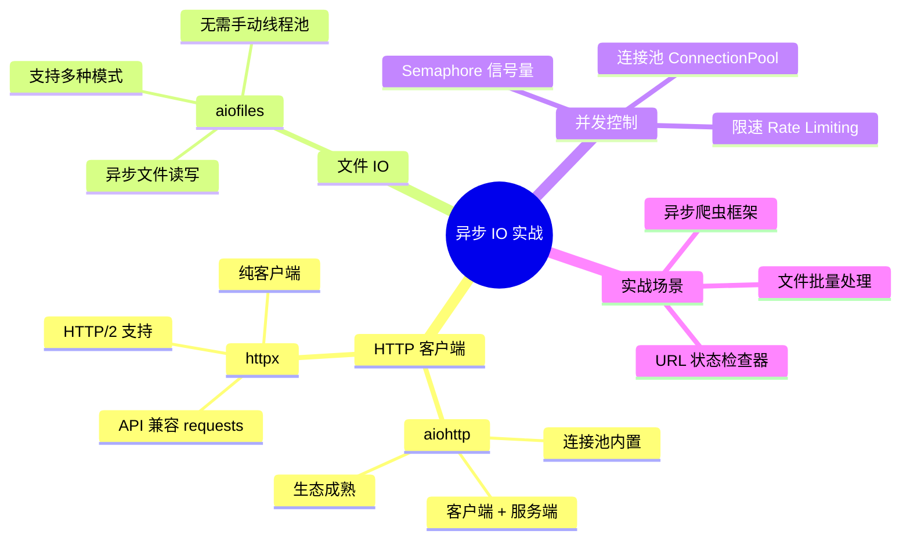
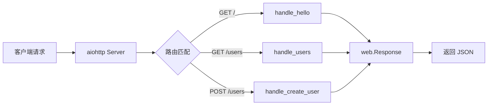
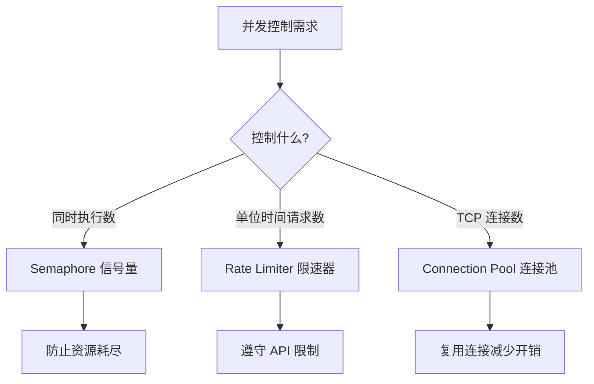
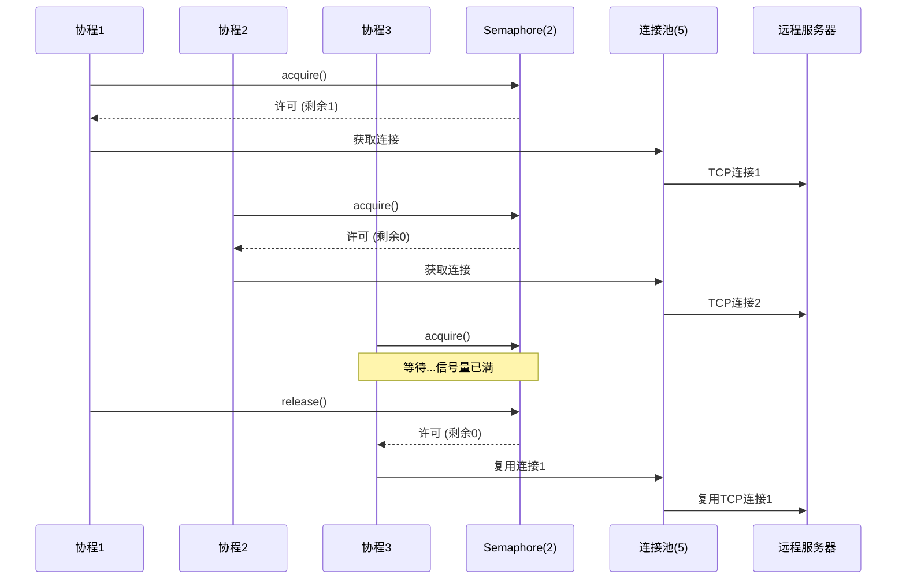
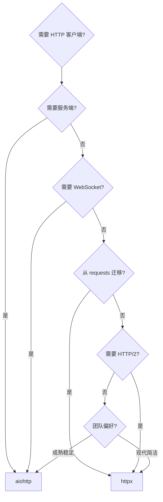
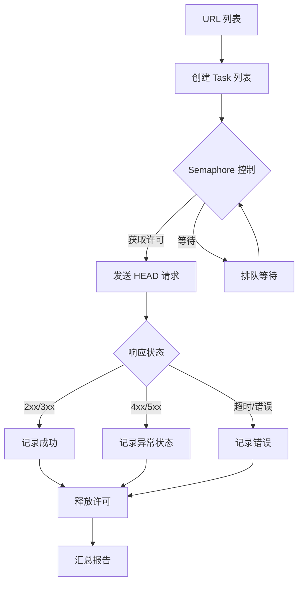
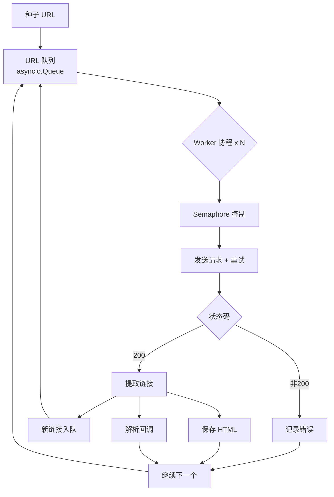
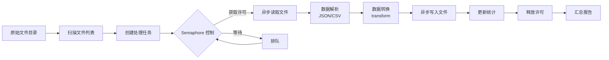

# 异步 IO 实战

在掌握了 asyncio 基础和事件循环原理之后，下一步是将异步能力应用到真实的 IO 场景中。本文聚焦三大异步 IO 库——aiohttp、httpx、aiofiles，以及并发控制的核心策略，并通过三个完整的实战场景帮助你构建生产级异步应用。

> 阅读提示

- 如果你只想快速选型，直接看 [aiohttp vs httpx 对比](#aiohttp-vs-httpx-对比)
- 如果你需要开箱即用的代码，跳到 [实战场景](#实战场景一-高并发-url-状态检查器)
- 如果你已经用过这些库但遇到问题，重点阅读 [常见陷阱](#常见陷阱) 和 [最佳实践速查表](#最佳实践速查表)
- 本文所有代码基于 **Python 3.10+**，建议配合虚拟环境同步实验

## 异步 IO 库全景



## aiohttp 异步 HTTP 客户端与服务端

aiohttp 是 Python 异步生态中最成熟的 HTTP 库，同时提供客户端和服务端功能。它是构建异步 Web 服务和高并发 HTTP 客户端的首选。

### 客户端基础

```python
import aiohttp
import asyncio


async def fetch_json(url: str) -> dict:
    """最基本的异步 HTTP GET 请求"""
    async with aiohttp.ClientSession() as session:
        async with session.get(url) as response:
            # 检查状态码
            if response.status != 200:
                raise ValueError(f"请求失败，状态码: {response.status}")
            return await response.json()


# 运行
data = await fetch_json("https://api.github.com/repos/python/cpython")
print(data["stargazers_count"])
```

::: warning 核心原则：Session 必须复用
`ClientSession` 内部维护连接池和 Cookie 存储。**每次请求都创建新 Session 是最常见的性能杀手**——每个 Session 都会新建 TCP 连接，完全丧失了异步并发的优势。正确做法是在应用生命周期内复用同一个 Session。
:::

### Session 生命周期管理

```python
import aiohttp
import asyncio
from typing import Any


class HttpClient:
    """封装 aiohttp Session，确保全局复用"""

    def __init__(self):
        self._session: aiohttp.ClientSession | None = None

    async def get_session(self) -> aiohttp.ClientSession:
        if self._session is None or self._session.closed:
            self._session = aiohttp.ClientSession(
                timeout=aiohttp.ClientTimeout(total=30),
                headers={"User-Agent": "MyApp/1.0"},
            )
        return self._session

    async def get(self, url: str, **kwargs) -> Any:
        session = await self.get_session()
        async with session.get(url, **kwargs) as resp:
            resp.raise_for_status()
            return await resp.json()

    async def post(self, url: str, data: dict | None = None, **kwargs) -> Any:
        session = await self.get_session()
        async with session.post(url, json=data, **kwargs) as resp:
            resp.raise_for_status()
            return await resp.json()

    async def close(self) -> None:
        if self._session and not self._session.closed:
            await self._session.close()


# 使用示例
client = HttpClient()
try:
    result = await client.get("https://httpbin.org/get")
    print(result)
finally:
    await client.close()
```

### 常用请求方法

| 方法 | 用途 | 典型参数 |
|------|------|----------|
| `session.get(url)` | 获取资源 | `params`, `headers`, `allow_redirects` |
| `session.post(url)` | 提交数据 | `data`, `json`, `files`, `headers` |
| `session.put(url)` | 全量更新 | `data`, `json` |
| `session.patch(url)` | 部分更新 | `data`, `json` |
| `session.delete(url)` | 删除资源 | `headers` |
| `session.head(url)` | 只获取头信息 | `allow_redirects` |
| `session.options(url)` | 获取支持的方法 | — |

### 请求参数详解

```python
import aiohttp
import asyncio


async def request_examples():
    async with aiohttp.ClientSession() as session:
        # 1. GET 带查询参数
        async with session.get(
            "https://httpbin.org/get",
            params={"key": "value", "page": "1"},
        ) as resp:
            print(await resp.json())

        # 2. POST JSON 数据
        async with session.post(
            "https://httpbin.org/post",
            json={"username": "alice", "age": 25},
        ) as resp:
            print(await resp.json())

        # 3. POST 表单数据
        async with session.post(
            "https://httpbin.org/post",
            data=aiohttp.FormData({"field": "value"}),
        ) as resp:
            print(await resp.json())

        # 4. 上传文件
        data = aiohttp.FormData()
        data.add_field("file", open("report.csv", "rb"), filename="report.csv")
        async with session.post("https://httpbin.org/post", data=data) as resp:
            print(await resp.json())

        # 5. 自定义超时和头
        async with session.get(
            "https://httpbin.org/delay/5",
            timeout=aiohttp.ClientTimeout(total=10),
            headers={"Authorization": "Bearer token123"},
        ) as resp:
            print(await resp.json())

        # 6. 禁用 SSL 验证（仅开发环境！）
        import ssl
        ssl_context = ssl.create_default_context()
        ssl_context.check_hostname = False
        ssl_context.verify_mode = ssl.CERT_NONE
        connector = aiohttp.TCPConnector(ssl=ssl_context)
        async with aiohttp.ClientSession(connector=connector) as s:
            async with s.get("https://self-signed.example.com") as resp:
                print(resp.status)
```

### 服务端基础

aiohttp 同时提供异步 Web 服务端框架，适合构建轻量级 API 服务：

```python
from aiohttp import web


async def handle_hello(request: web.Request) -> web.Response:
    """最简单的路由处理"""
    name = request.match_info.get("name", "World")
    return web.json_response({"message": f"Hello, {name}!"})


async def handle_users(request: web.Request) -> web.Response:
    """返回 JSON 数据"""
    users = [
        {"id": 1, "name": "Alice"},
        {"id": 2, "name": "Bob"},
    ]
    return web.json_response(users)


async def handle_create_user(request: web.Request) -> web.Response:
    """处理 POST 请求"""
    data = await request.json()
    # 这里可以加入数据验证和持久化逻辑
    return web.json_response(
        {"id": 3, "name": data.get("name", "Unknown")},
        status=201,
    )


def create_app() -> web.Application:
    app = web.Application()
    app.router.add_get("/", handle_hello)
    app.router.add_get("/hello/{name}", handle_hello)
    app.router.add_get("/users", handle_users)
    app.router.add_post("/users", handle_create_user)
    return app


if __name__ == "__main__":
    app = create_app()
    web.run_app(app, host="0.0.0.0", port=8080)
```



### 服务端中间件

```python
from aiohttp import web
import time


@web.middleware
async def timing_middleware(request: web.Request, handler):
    """记录每个请求的处理时间"""
    start = time.perf_counter()
    try:
        response = await handler(request)
    except web.HTTPException as exc:
        # 重新抛出 HTTP 异常
        raise
    finally:
        elapsed = time.perf_counter() - start
        print(f"{request.method} {request.path} - {elapsed:.3f}s")
    return response


@web.middleware
async def error_handler_middleware(request: web.Request, handler):
    """统一错误处理"""
    try:
        return await handler(request)
    except ValueError as e:
        return web.json_response({"error": str(e)}, status=400)
    except Exception as e:
        # 生产环境不应暴露内部错误
        return web.json_response({"error": "Internal Server Error"}, status=500)


def create_app() -> web.Application:
    app = web.Application(middlewares=[timing_middleware, error_handler_middleware])
    app.router.add_get("/", handle_hello)
    return app
```

## httpx 异步 HTTP 客户端

httpx 是新一代 HTTP 客户端库，API 设计与 requests 高度兼容，同时原生支持异步。如果你从 requests 迁移到异步，httpx 是最平滑的选择。

### 为什么选择 httpx

```python
import httpx
import asyncio


async def httpx_basic():
    # 同步用法（与 requests 几乎一致）
    resp = httpx.get("https://httpbin.org/get")
    print(resp.json())

    # 异步用法
    async with httpx.AsyncClient() as client:
        resp = await client.get("https://httpbin.org/get")
        print(resp.json())


await httpx_basic()
```

### AsyncClient 进阶

```python
import httpx
import asyncio


async def httpx_advanced():
    # 自定义客户端配置
    async with httpx.AsyncClient(
        base_url="https://api.github.com",       # 基础 URL
        timeout=httpx.Timeout(10.0, connect=5.0), # 超时设置
        headers={"Authorization": "Bearer ghp_xxx"},
        follow_redirects=True,                    # 自动跟随重定向
        http2=True,                               # 启用 HTTP/2
        limits=httpx.Limits(
            max_connections=100,                   # 最大连接数
            max_keepalive_connections=20,          # 最大保活连接数
            keepalive_expiry=30.0,                 # 保活超时（秒）
        ),
    ) as client:
        # GET 请求
        resp = await client.get("/repos/python/cpython")
        print(resp.status_code, resp.json()["full_name"])

        # POST 请求
        resp = await client.post(
            "/repos/python/cpython/issues",
            json={"title": "Bug report", "body": "Description..."},
        )

        # 流式响应（适合大文件下载）
        async with client.stream("GET", "/repos/python/cpython/tarball/main") as resp:
            with open("cpython.tar.gz", "wb") as f:
                async for chunk in resp.aiter_bytes(chunk_size=8192):
                    f.write(chunk)


await httpx_advanced()
```

### httpx 与 requests API 对照

| 功能 | requests | httpx 异步 |
|------|----------|------------|
| GET 请求 | `requests.get(url)` | `await client.get(url)` |
| POST JSON | `requests.post(url, json=data)` | `await client.post(url, json=data)` |
| 超时设置 | `requests.get(url, timeout=10)` | `client.get(url, timeout=10.0)` |
| 自定义头 | `requests.get(url, headers=h)` | `await client.get(url, headers=h)` |
| 会话管理 | `with requests.Session() as s:` | `async with httpx.AsyncClient() as c:` |
| 响应 JSON | `resp.json()` | `resp.json()` |
| 状态码 | `resp.status_code` | `resp.status_code` |
| 异常处理 | `requests.exceptions.*` | `httpx.*Error` |
| SSL 验证 | `verify=False` | `verify=False` |
| HTTP/2 | 不支持 | `http2=True` |

::: tip 从 requests 迁移到 httpx
如果你的项目已经在用 requests，迁移到 httpx 几乎只需要：
1. `import requests` → `import httpx`
2. `requests.get()` → `httpx.get()`（同步）或 `await client.get()`（异步）
3. `requests.Session()` → `httpx.AsyncClient()`
4. 异常类名略有不同，但语义一致
:::

## aiofiles 异步文件操作

在异步代码中使用内置的 `open()` 会阻塞事件循环。aiofiles 提供了与内置 `open()` 兼容的异步接口，底层通过线程池执行文件 IO。

### 基础用法

```python
import aiofiles
import asyncio


async def read_file(path: str) -> str:
    """异步读取整个文件"""
    async with aiofiles.open(path, mode="r", encoding="utf-8") as f:
        content = await f.read()
    return content


async def write_file(path: str, content: str) -> None:
    """异步写入文件"""
    async with aiofiles.open(path, mode="w", encoding="utf-8") as f:
        await f.write(content)


async def read_lines(path: str) -> list[str]:
    """异步逐行读取"""
    lines = []
    async with aiofiles.open(path, mode="r", encoding="utf-8") as f:
        async for line in f:
            lines.append(line.rstrip("\n"))
    return lines


async def append_file(path: str, content: str) -> None:
    """异步追加写入"""
    async with aiofiles.open(path, mode="a", encoding="utf-8") as f:
        await f.write(content + "\n")
```

### 批量文件处理

```python
import aiofiles
import aiofiles.os
import asyncio
from pathlib import Path


async def process_file(input_path: Path, output_path: Path) -> None:
    """读取文件、转换内容、写入新文件"""
    async with aiofiles.open(input_path, mode="r", encoding="utf-8") as fin:
        content = await fin.read()

    # 模拟数据转换
    processed = content.upper()

    async with aiofiles.open(output_path, mode="w", encoding="utf-8") as fout:
        await fout.write(processed)


async def batch_process(directory: Path, output_dir: Path, concurrency: int = 10) -> None:
    """批量处理目录下所有 .txt 文件"""
    semaphore = asyncio.Semaphore(concurrency)
    output_dir.mkdir(parents=True, exist_ok=True)

    async def limited_process(input_path: Path) -> None:
        async with semaphore:
            output_path = output_dir / f"processed_{input_path.name}"
            await process_file(input_path, output_path)
            print(f"完成: {input_path.name}")

    # 收集所有任务
    tasks = []
    for file_path in directory.glob("*.txt"):
        tasks.append(limited_process(file_path))

    # 并发执行
    await asyncio.gather(*tasks)


# 运行
await batch_process(Path("./data/input"), Path("./data/output"))
```

### aiofiles.os 异步文件系统操作

```python
import aiofiles.os
import asyncio


async def file_system_operations():
    # 创建目录
    await aiofiles.os.makedirs("output", exist_ok=True)

    # 检查文件是否存在
    exists = await aiofiles.os.path.exists("output/result.json")

    # 获取文件大小
    size = await aiofiles.os.path.getsize("output/result.json")

    # 重命名
    await aiofiles.os.rename("old_name.txt", "new_name.txt")

    # 删除文件
    await aiofiles.os.remove("temp_file.txt")

    # 列出目录内容
    entries = await aiofiles.os.listdir("output")
    print(entries)


await file_system_operations()
```

## 并发控制：Semaphore、限速与连接池

异步编程的威力在于并发，但无限制的并发会导致资源耗尽、服务拒绝和性能下降。本节介绍三种核心的并发控制策略。

### 并发控制策略对比



| 策略 | 控制维度 | 适用场景 | 实现方式 |
|------|----------|----------|----------|
| Semaphore | 同时执行的协程数 | 防止资源耗尽、控制内存 | `asyncio.Semaphore(n)` |
| Rate Limiter | 单位时间内的请求数 | API 限速、爬虫礼貌策略 | 自定义令牌桶/滑动窗口 |
| Connection Pool | TCP 连接数 | HTTP 连接复用 | aiohttp `TCPConnector` / httpx `Limits` |

### Semaphore 信号量

```python
import asyncio
import aiohttp


async def fetch_with_semaphore(
    session: aiohttp.ClientSession,
    url: str,
    semaphore: asyncio.Semaphore,
) -> dict:
    """使用信号量限制并发请求数"""
    async with semaphore:  # 获取许可，超出限制则等待
        async with session.get(url) as resp:
            return await resp.json()


async def controlled_concurrency():
    """最多同时 5 个请求"""
    semaphore = asyncio.Semaphore(5)
    urls = [f"https://httpbin.org/delay/{i % 3}" for i in range(20)]

    async with aiohttp.ClientSession() as session:
        tasks = [
            fetch_with_semaphore(session, url, semaphore)
            for url in urls
        ]
        results = await asyncio.gather(*tasks, return_exceptions=True)

    # 统计成功和失败
    successes = sum(1 for r in results if not isinstance(r, Exception))
    failures = sum(1 for r in results if isinstance(r, Exception))
    print(f"成功: {successes}, 失败: {failures}")


await controlled_concurrency()
```

### 令牌桶限速器

```python
import asyncio
import time


class TokenBucketRateLimiter:
    """令牌桶算法实现的限速器

    - rate: 每秒允许的请求数
    - capacity: 桶容量（允许的突发请求数）
    """

    def __init__(self, rate: float, capacity: int):
        self.rate = rate
        self.capacity = capacity
        self._tokens = capacity
        self._last_refill = time.monotonic()
        self._lock = asyncio.Lock()

    async def acquire(self) -> None:
        """获取一个令牌，如果没有则等待"""
        async with self._lock:
            while self._tokens < 1:
                self._refill()
                if self._tokens < 1:
                    # 计算需要等待的时间
                    wait_time = (1 - self._tokens) / self.rate
                    await asyncio.sleep(wait_time)
                    self._refill()
            self._tokens -= 1

    def _refill(self) -> None:
        now = time.monotonic()
        elapsed = now - self._last_refill
        self._tokens = min(
            self.capacity,
            self._tokens + elapsed * self.rate,
        )
        self._last_refill = now


# 使用示例
async def rate_limited_fetch():
    limiter = TokenBucketRateLimiter(rate=5, capacity=10)  # 每秒5个请求，突发10个

    async with aiohttp.ClientSession() as session:
        for i in range(30):
            await limiter.acquire()
            print(f"[{time.strftime('%H:%M:%S')}] 发送请求 #{i}")
            async with session.get("https://httpbin.org/get") as resp:
                pass


await rate_limited_fetch()
```

### 连接池配置

```python
import aiohttp
import httpx


# aiohttp 连接池配置
async def aiohttp_with_pool():
    connector = aiohttp.TCPConnector(
        limit=100,              # 总最大连接数
        limit_per_host=10,      # 每个主机最大连接数
        keepalive_timeout=30,   # 保活超时（秒）
        enable_cleanup_closed=True,
    )
    async with aiohttp.ClientSession(connector=connector) as session:
        # 所有请求共享连接池
        pass


# httpx 连接池配置
async def httpx_with_pool():
    limits = httpx.Limits(
        max_connections=100,
        max_keepalive_connections=20,
        keepalive_expiry=30.0,
    )
    async with httpx.AsyncClient(limits=limits) as client:
        # 所有请求共享连接池
        pass
```



## aiohttp vs httpx 对比

| 维度 | aiohttp | httpx |
|------|---------|-------|
| **定位** | 客户端 + 服务端全栈 | 纯客户端 |
| **API 风格** | 自有 API，需学习 | 兼容 requests，迁移零成本 |
| **HTTP/2** | 不支持 | 支持（需安装 `h2`） |
| **服务端** | 内置 Web 框架 | 无 |
| **WebSocket** | 原生支持 | 不支持 |
| **连接池** | `TCPConnector` | `Limits` |
| **超时控制** | `ClientTimeout` | `Timeout` |
| **Cookie 处理** | `CookieJar` | `Cookies` |
| **生态成熟度** | 非常成熟，社区大 | 快速增长，现代设计 |
| **依赖大小** | 较重 | 较轻 |
| **流式响应** | `resp.content.read()` | `client.stream()` |
| **中间件** | 服务端中间件 | 传输层 Dispatch |
| **Python 版本** | 3.8+ | 3.9+ |
| **维护状态** | 活跃 | 活跃 |

### 选型决策树



::: tip 简单选型建议
- **新项目 + 只需客户端** → httpx（API 更现代，requests 兼容）
- **需要服务端或 WebSocket** → aiohttp（唯一选择）
- **已有 requests 代码迁移** → httpx（几乎零改动）
- **大型项目需要全栈** → aiohttp（客户端 + 服务端统一技术栈）
:::

## 实战场景

### 场景一：高并发 URL 状态检查器

批量检查大量 URL 的 HTTP 状态码，使用 Semaphore 控制并发，避免瞬间发出过多请求。

```python
import asyncio
import aiohttp
import time
from dataclasses import dataclass
from typing import Optional


@dataclass
class CheckResult:
    """URL 检查结果"""
    url: str
    status: Optional[int] = None
    error: Optional[str] = None
    elapsed: float = 0.0

    @property
    def is_ok(self) -> bool:
        return self.status is not None and 200 <= self.status < 400


class URLChecker:
    """高并发 URL 状态检查器"""

    def __init__(
        self,
        concurrency: int = 20,
        timeout: float = 10.0,
        rate_limit: float = 0,  # 0 表示不限速
    ):
        self.concurrency = concurrency
        self.timeout = aiohttp.ClientTimeout(total=timeout)
        self.rate_limit = rate_limit
        self._semaphore = asyncio.Semaphore(concurrency)
        self._last_request_time = 0.0

    async def _check_one(
        self,
        session: aiohttp.ClientSession,
        url: str,
    ) -> CheckResult:
        """检查单个 URL"""
        async with self._semaphore:
            # 简单限速：确保请求间隔
            if self.rate_limit > 0:
                now = time.monotonic()
                wait = self.rate_limit - (now - self._last_request_time)
                if wait > 0:
                    await asyncio.sleep(wait)
                self._last_request_time = time.monotonic()

            start = time.perf_counter()
            try:
                async with session.head(url, allow_redirects=True) as resp:
                    elapsed = time.perf_counter() - start
                    return CheckResult(
                        url=url,
                        status=resp.status,
                        elapsed=elapsed,
                    )
            except asyncio.TimeoutError:
                elapsed = time.perf_counter() - start
                return CheckResult(url=url, error="超时", elapsed=elapsed)
            except aiohttp.ClientError as e:
                elapsed = time.perf_counter() - start
                return CheckResult(url=url, error=str(e), elapsed=elapsed)

    async def check_batch(self, urls: list[str]) -> list[CheckResult]:
        """批量检查 URL"""
        connector = aiohttp.TCPConnector(
            limit=self.concurrency,
            limit_per_host=5,
            enable_cleanup_closed=True,
        )
        async with aiohttp.ClientSession(
            timeout=self.timeout,
            connector=connector,
        ) as session:
            tasks = [self._check_one(session, url) for url in urls]
            results = await asyncio.gather(*tasks)
        return list(results)

    @staticmethod
    def print_report(results: list[CheckResult]) -> None:
        """打印检查报告"""
        ok = [r for r in results if r.is_ok]
        failed = [r for r in results if not r.is_ok]

        print(f"\n{'='*60}")
        print(f"检查报告: 共 {len(results)} 个 URL")
        print(f"  正常: {len(ok)}  |  异常: {len(failed)}")
        print(f"{'='*60}")

        if ok:
            print("\n--- 正常 URL ---")
            for r in ok:
                print(f"  [{r.status}] {r.url} ({r.elapsed:.2f}s)")

        if failed:
            print("\n--- 异常 URL ---")
            for r in failed:
                status = r.status or "---"
                error = r.error or ""
                print(f"  [{status}] {r.url} - {error}")


# 运行示例
async def main():
    checker = URLChecker(concurrency=10, timeout=5.0)

    urls = [
        "https://www.python.org",
        "https://github.com",
        "https://httpbin.org/status/200",
        "https://httpbin.org/status/404",
        "https://httpbin.org/status/500",
        "https://nonexistent.example.invalid",
        "https://httpbin.org/delay/3",
    ]

    results = await checker.check_batch(urls)
    checker.print_report(results)


asyncio.run(main())
```



### 场景二：异步 Web 爬虫框架

构建一个可扩展的异步爬虫框架，支持请求调度、并发控制、自动重试和结果持久化。

```python
import asyncio
import aiohttp
import aiofiles
import time
import re
from dataclasses import dataclass, field
from urllib.parse import urljoin, urlparse
from typing import Callable, Optional


@dataclass
class CrawlResult:
    """爬取结果"""
    url: str
    status: int
    html: str
    links: list[str] = field(default_factory=list)
    error: Optional[str] = None


class AsyncCrawler:
    """异步爬虫框架"""

    def __init__(
        self,
        concurrency: int = 10,
        max_retries: int = 3,
        request_delay: float = 0.5,
        timeout: float = 15.0,
        output_dir: str = "crawl_output",
    ):
        self.concurrency = concurrency
        self.max_retries = max_retries
        self.request_delay = request_delay
        self.timeout = aiohttp.ClientTimeout(total=timeout)
        self.output_dir = output_dir
        self._semaphore = asyncio.Semaphore(concurrency)
        self._visited: set[str] = set()
        self._queue: asyncio.Queue[str] = asyncio.Queue()
        self._results: list[CrawlResult] = []

    def _extract_links(self, html: str, base_url: str) -> list[str]:
        """从 HTML 中提取链接"""
        pattern = r'href=["\'](https?:/[^"\']+)["\']'
        raw_links = re.findall(pattern, html)
        # 过滤同域名链接
        base_domain = urlparse(base_url).netloc
        same_domain = []
        for link in raw_links:
            parsed = urlparse(link)
            if parsed.netloc == base_domain:
                same_domain.append(link)
            elif not parsed.netloc:
                same_domain.append(urljoin(base_url, link))
        return same_domain

    async def _fetch_with_retry(
        self,
        session: aiohttp.ClientSession,
        url: str,
    ) -> CrawlResult:
        """带重试的请求"""
        async with self._semaphore:
            for attempt in range(1, self.max_retries + 1):
                try:
                    async with session.get(url) as resp:
                        html = await resp.text()
                        links = self._extract_links(html, url)
                        return CrawlResult(
                            url=url,
                            status=resp.status,
                            html=html,
                            links=links,
                        )
                except (aiohttp.ClientError, asyncio.TimeoutError) as e:
                    if attempt == self.max_retries:
                        return CrawlResult(
                            url=url,
                            status=0,
                            html="",
                            error=f"重试 {attempt} 次后失败: {e}",
                        )
                    wait = 2 ** attempt  # 指数退避
                    print(f"  重试 {attempt}/{self.max_retries}: {url} ({wait}s)")
                    await asyncio.sleep(wait)

            return CrawlResult(url=url, status=0, html="", error="不应到达此处")

    async def _save_result(self, result: CrawlResult) -> None:
        """保存爬取结果到文件"""
        import os
        os.makedirs(self.output_dir, exist_ok=True)
        # 用 URL 路径作为文件名
        filename = urlparse(result.url).path.strip("/").replace("/", "_") or "index"
        filepath = f"{self.output_dir}/{filename}.html"
        async with aiofiles.open(filepath, "w", encoding="utf-8") as f:
            await f.write(result.html)

    async def _worker(
        self,
        session: aiohttp.ClientSession,
        parser: Optional[Callable[[CrawlResult], None]] = None,
    ) -> None:
        """工作协程：从队列取 URL 并爬取"""
        while True:
            url = await self._queue.get()
            if url is None:  # 哨兵值，退出信号
                self._queue.task_done()
                break

            if url in self._visited:
                self._queue.task_done()
                continue

            self._visited.add(url)
            print(f"爬取: {url}")

            # 请求延迟（礼貌爬虫）
            if self.request_delay > 0:
                await asyncio.sleep(self.request_delay)

            result = await self._fetch_with_retry(session, url)
            self._results.append(result)

            # 保存结果
            if result.status == 200:
                await self._save_result(result)

            # 解析回调
            if parser and result.status == 200:
                parser(result)

            # 将新链接加入队列
            for link in result.links:
                if link not in self._visited:
                    self._queue.put_nowait(link)

            self._queue.task_done()

    async def crawl(
        self,
        start_urls: list[str],
        max_pages: int = 50,
        parser: Optional[Callable[[CrawlResult], None]] = None,
    ) -> list[CrawlResult]:
        """启动爬虫"""
        # 初始化队列
        for url in start_urls:
            self._queue.put_nowait(url)

        connector = aiohttp.TCPConnector(
            limit=self.concurrency,
            limit_per_host=5,
        )
        async with aiohttp.ClientSession(
            timeout=self.timeout,
            connector=connector,
            headers={"User-Agent": "AsyncCrawler/1.0"},
        ) as session:
            # 启动工作协程
            workers = [
                asyncio.create_task(self._worker(session, parser))
                for _ in range(self.concurrency)
            ]

            # 等待队列处理或达到最大页数
            monitor_task = asyncio.create_task(
                self._monitor_progress(max_pages)
            )

            await self._queue.join()
            monitor_task.cancel()

            # 发送退出信号
            for _ in workers:
                self._queue.put_nowait(None)
            await asyncio.gather(*workers)

        return self._results

    async def _monitor_progress(self, max_pages: int) -> None:
        """监控爬取进度"""
        while True:
            await asyncio.sleep(5)
            count = len(self._visited)
            print(f"--- 进度: 已爬取 {count}/{max_pages} 页 ---")
            if count >= max_pages:
                break


# 使用示例
def my_parser(result: CrawlResult) -> None:
    """自定义解析逻辑"""
    # 提取页面标题
    match = re.search(r"<title>(.*?)</title>", result.html)
    if match:
        print(f"  标题: {match.group(1)}")


async def main():
    crawler = AsyncCrawler(
        concurrency=5,
        request_delay=1.0,
        max_retries=3,
        output_dir="crawl_output",
    )
    results = await crawler.crawl(
        start_urls=["https://example.com"],
        max_pages=20,
        parser=my_parser,
    )
    print(f"\n爬取完成，共 {len(results)} 个页面")


# asyncio.run(main())
```



### 场景三：异步文件批量处理

批量读取、转换和写入文件，适合日志处理、数据清洗等场景。

```python
import asyncio
import aiofiles
import aiofiles.os
import json
import csv
import time
from pathlib import Path
from dataclasses import dataclass
from typing import Any


@dataclass
class ProcessStats:
    """处理统计"""
    total: int = 0
    success: int = 0
    failed: int = 0
    total_bytes: int = 0
    elapsed: float = 0.0


class AsyncFileProcessor:
    """异步文件批量处理器"""

    def __init__(self, concurrency: int = 10):
        self.concurrency = concurrency
        self._semaphore = asyncio.Semaphore(concurrency)
        self._stats = ProcessStats()

    async def _process_json_file(
        self,
        input_path: Path,
        output_path: Path,
        transform: callable,
    ) -> None:
        """处理单个 JSON 文件"""
        async with self._semaphore:
            try:
                # 异步读取
                async with aiofiles.open(input_path, "r", encoding="utf-8") as f:
                    content = await f.read()

                # 解析和转换（CPU 密集部分，少量数据可接受）
                data = json.loads(content)
                result = transform(data)

                # 异步写入
                output_path.parent.mkdir(parents=True, exist_ok=True)
                async with aiofiles.open(output_path, "w", encoding="utf-8") as f:
                    await f.write(json.dumps(result, ensure_ascii=False, indent=2))

                # 更新统计
                self._stats.success += 1
                self._stats.total_bytes += len(content.encode("utf-8"))

            except Exception as e:
                self._stats.failed += 1
                print(f"处理失败 {input_path.name}: {e}")
            finally:
                self._stats.total += 1

    async def _process_csv_file(
        self,
        input_path: Path,
        output_path: Path,
        row_transform: callable,
    ) -> None:
        """处理单个 CSV 文件"""
        async with self._semaphore:
            try:
                # 读取
                async with aiofiles.open(input_path, "r", encoding="utf-8") as f:
                    content = await f.read()

                # 解析 CSV
                reader = csv.DictReader(content.splitlines())
                rows = []
                for row in reader:
                    transformed = row_transform(row)
                    if transformed:
                        rows.append(transformed)

                # 写入
                if rows:
                    output_path.parent.mkdir(parents=True, exist_ok=True)
                    fieldnames = rows[0].keys()
                    output = []
                    output.append(",".join(fieldnames))
                    for row in rows:
                        output.append(",".join(str(row[k]) for k in fieldnames))

                    async with aiofiles.open(output_path, "w", encoding="utf-8") as f:
                        await f.write("\n".join(output))

                self._stats.success += 1
                self._stats.total_bytes += len(content.encode("utf-8"))

            except Exception as e:
                self._stats.failed += 1
                print(f"处理失败 {input_path.name}: {e}")
            finally:
                self._stats.total += 1

    async def batch_process_json(
        self,
        input_dir: Path,
        output_dir: Path,
        transform: callable,
        pattern: str = "*.json",
    ) -> ProcessStats:
        """批量处理 JSON 文件"""
        start = time.perf_counter()
        self._stats = ProcessStats()

        files = list(input_dir.glob(pattern))
        if not files:
            print(f"未找到匹配 {pattern} 的文件")
            return self._stats

        print(f"找到 {len(files)} 个文件，开始处理...")

        tasks = []
        for file_path in files:
            output_path = output_dir / file_path.relative_to(input_dir)
            tasks.append(
                self._process_json_file(file_path, output_path, transform)
            )

        await asyncio.gather(*tasks)
        self._stats.elapsed = time.perf_counter() - start
        return self._stats

    async def batch_process_csv(
        self,
        input_dir: Path,
        output_dir: Path,
        row_transform: callable,
        pattern: str = "*.csv",
    ) -> ProcessStats:
        """批量处理 CSV 文件"""
        start = time.perf_counter()
        self._stats = ProcessStats()

        files = list(input_dir.glob(pattern))
        if not files:
            print(f"未找到匹配 {pattern} 的文件")
            return self._stats

        print(f"找到 {len(files)} 个文件，开始处理...")

        tasks = []
        for file_path in files:
            output_path = output_dir / file_path.relative_to(input_dir)
            tasks.append(
                self._process_csv_file(file_path, output_path, row_transform)
            )

        await asyncio.gather(*tasks)
        self._stats.elapsed = time.perf_counter() - start
        return self._stats

    @staticmethod
    def print_stats(stats: ProcessStats) -> None:
        """打印处理统计"""
        print(f"\n{'='*50}")
        print(f"处理统计")
        print(f"{'='*50}")
        print(f"  总文件数: {stats.total}")
        print(f"  成功: {stats.success}")
        print(f"  失败: {stats.failed}")
        print(f"  总数据量: {stats.total_bytes / 1024:.1f} KB")
        print(f"  耗时: {stats.elapsed:.2f}s")
        if stats.elapsed > 0:
            throughput = stats.total_bytes / 1024 / stats.elapsed
            print(f"  吞吐量: {throughput:.1f} KB/s")
        print(f"{'='*50}")


# 使用示例
def clean_user_data(data: dict) -> dict:
    """清洗用户数据：去除空值、标准化字段"""
    cleaned = {}
    for key, value in data.items():
        if value is None or value == "":
            continue
        if isinstance(key, str):
            cleaned[key.strip().lower()] = value
    return cleaned


def transform_csv_row(row: dict) -> dict | None:
    """转换 CSV 行：过滤无效行"""
    if not row.get("email"):
        return None
    return {
        "name": row.get("name", "").strip(),
        "email": row["email"].strip().lower(),
        "age": row.get("age", "N/A"),
    }


async def main():
    processor = AsyncFileProcessor(concurrency=10)

    # 处理 JSON 文件
    stats = await processor.batch_process_json(
        input_dir=Path("./data/raw_users"),
        output_dir=Path("./data/cleaned_users"),
        transform=clean_user_data,
    )
    processor.print_stats(stats)

    # 处理 CSV 文件
    stats = await processor.batch_process_csv(
        input_dir=Path("./data/raw_contacts"),
        output_dir=Path("./data/cleaned_contacts"),
        row_transform=transform_csv_row,
    )
    processor.print_stats(stats)


# asyncio.run(main())
```



## 常见陷阱

| 陷阱 | 现象 | 原因 | 解决方案 |
|------|------|------|----------|
| 每次请求创建新 Session | 性能极差，连接不复用 | 每个 Session 独立连接池 | 全局复用 `ClientSession`/`AsyncClient` |
| 在异步函数中调用 `open()` | 事件循环被阻塞，所有协程停摆 | 内置 `open()` 是同步阻塞 IO | 使用 `aiofiles.open()` |
| 在异步函数中调用 `requests.get()` | 整个事件循环卡住 | `requests` 是同步库 | 替换为 `aiohttp`/`httpx` 异步客户端 |
| 忘记 `await` | 协程不执行，返回 Coroutine 对象 | 协程必须被 await 或调度 | 始终 `await` 协程调用，开启 `asyncio` 调试模式 |
| 无限制并发 | 内存耗尽、被目标服务器封禁 | 缺少并发控制 | 使用 `Semaphore` 限制并发数 |
| 不处理异常 | Task 中的异常被静默吞掉 | 未 await 的 Task 异常不传播 | 使用 `return_exceptions=True` 或逐个 await |
| Session 未关闭 | 资源泄漏警告 | 未在 `async with` 中使用 Session | 始终用 `async with` 管理 Session 生命周期 |
| 忽略 SSL 验证 | 生产环境安全风险 | 开发时设置 `verify=False` 忘记还原 | 仅在开发环境禁用，生产环境必须验证 |
| CPU 密集操作阻塞事件循环 | 所有协程响应变慢 | CPU 计算在事件循环线程执行 | 使用 `run_in_executor` 将 CPU 任务移到线程池 |
| 连接池配置不当 | 连接超时或资源浪费 | `limit` 和 `limit_per_host` 设置不合理 | 根据目标服务器承载能力合理配置 |

::: warning 最危险的陷阱：同步阻塞调用
在异步函数中调用任何同步阻塞 IO（`open()`、`requests.get()`、`time.sleep()`、`socket.recv()` 等）都会**阻塞整个事件循环**，导致所有协程停摆。这是异步编程中最常见也最严重的错误。

```python
# 错误！阻塞事件循环
async def bad_example():
    with open("data.txt") as f:       # 阻塞！
        content = f.read()            # 阻塞！
    import requests
    resp = requests.get("https://...") # 阻塞！
    time.sleep(5)                      # 阻塞！

# 正确做法
async def good_example():
    async with aiofiles.open("data.txt") as f:
        content = await f.read()
    async with aiohttp.ClientSession() as session:
        async with session.get("https://...") as resp:
            data = await resp.json()
    await asyncio.sleep(5)             # 异步等待
```
:::

## 最佳实践速查表

| 场景 | 最佳实践 | 代码模式 |
|------|----------|----------|
| Session 管理 | 全局复用，`async with` 管理 | `async with ClientSession() as session:` |
| 并发控制 | Semaphore 限制同时执行数 | `async with Semaphore(n):` |
| 请求限速 | 令牌桶或固定间隔 | `await asyncio.sleep(interval)` |
| 异常处理 | `return_exceptions=True` 或逐个 try | `gather(*tasks, return_exceptions=True)` |
| 超时设置 | 始终设置超时 | `ClientTimeout(total=30)` |
| 重试策略 | 指数退避 + 最大重试次数 | `await asyncio.sleep(2 ** attempt)` |
| 文件 IO | 使用 aiofiles | `async with aiofiles.open() as f:` |
| CPU 密集任务 | 移到线程池 | `await loop.run_in_executor(None, func)` |
| 连接池 | 根据目标服务器配置 | `TCPConnector(limit=100, limit_per_host=10)` |
| 资源清理 | 确保关闭 Session 和连接 | `try/finally` 或 `async with` |
| 日志记录 | 记录请求 URL、状态码、耗时 | `logging` + 自定义中间件 |
| 类型注解 | 标注异步函数返回类型 | `async def fetch() -> dict:` |
| 调试 | 开启 asyncio 调试模式 | `asyncio.run(main(), debug=True)` |
| 测试 | 使用 `pytest-asyncio` | `@pytest.mark.asyncio` |
| 大文件下载 | 流式读取，分块写入 | `async for chunk in resp.content.iter_chunked(n):` |

## 术语表

| 术语 | 英文 | 定义 |
|------|------|------|
| aiohttp | Asynchronous I/O HTTP | Python 异步 HTTP 客户端/服务端库，基于 asyncio |
| httpx | HTTP X | 新一代 Python HTTP 客户端，API 兼容 requests，支持异步和 HTTP/2 |
| aiofiles | Asynchronous Files | Python 异步文件操作库，通过线程池实现非阻塞文件 IO |
| 信号量 | Semaphore | 限制同时访问某资源的协程数量的同步原语 |
| 令牌桶 | Token Bucket | 限速算法，以固定速率向桶中添加令牌，每次请求消耗一个令牌 |
| 连接池 | Connection Pool | 预先创建并复用 TCP 连接的机制，减少连接建立开销 |
| 指数退避 | Exponential Backoff | 重试策略，每次等待时间翻倍，避免雪崩 |
| 流式响应 | Streaming Response | 不一次性读取整个响应体，而是分块逐步处理 |
| 保活连接 | Keep-Alive Connection | TCP 连接在请求完成后不关闭，供后续请求复用 |
| HTTP/2 | HTTP Version 2 | HTTP 协议新版本，支持多路复用、头部压缩、服务器推送 |
| WebSocket | WebSocket | 全双工通信协议，适合实时数据推送场景 |
| 中间件 | Middleware | 请求/响应处理管道中的拦截器，用于日志、认证、错误处理等 |
| 协程调度 | Coroutine Scheduling | 事件循环决定何时恢复哪个协程执行的过程 |
| 零拷贝 | Zero Copy | 避免在内核空间和用户空间之间复制数据的技术 |

## 延伸阅读

**站内链接**：

- [asyncio 基础](01-asyncio基础) — async/await 语法、Task、gather
- [事件循环与协程深入](02-事件循环与协程) — 事件循环原理、线程交互
- [异步数据库与任务队列](04-异步数据库与任务队列) — asyncpg、aiomysql、生产者-消费者
- [迭代器与生成器](../04-进阶/01-迭代器与生成器) — 协程的前身
- [上下文管理器](../04-进阶/02-上下文管理器) — async with 的基础
- [网络编程](../04-进阶/07-网络编程) — 异步网络的基础
- [爬虫专题](/docs/python/Web与爬虫/爬虫/01-爬虫概览与HTTP基础) — 异步爬虫的应用

**外部链接**：

- [aiohttp 官方文档](https://docs.aiohttp.org/) — 最权威的 aiohttp 参考
- [httpx 官方文档](https://www.python-httpx.org/) — httpx 完整指南
- [aiofiles GitHub](https://github.com/Tinche/aiofiles) — aiofiles 源码与用法
- [Python 官方 asyncio 文档](https://docs.python.org/3/library/asyncio.html) — asyncio 标准库参考
- [Real Python — Async IO in Python](https://realpython.com/async-io-python/) — 异步 IO 入门教程
- [PEP 492 — async/await 语法](https://peps.python.org/pep-0492/) — 异步语法的官方规范
- [aiohttp vs httpx 对比](https://github.com/encode/httpx#comparison-with-aiohttp) — httpx 官方对比说明

## 版本差异（asyncio → Python 3.14）

| 特性 | 本文编写时 | Python 3.14 |
|------|-----------|-------------|
| 事件循环入口 | `loop.run_until_complete()` | 推荐 `asyncio.run()`（3.7+）；3.14 起 `get_event_loop()` 在没有当前事件循环时直接抛 `RuntimeError` |
| 任务组 | `create_task()` 手动管理 | 3.11+ 推荐 `asyncio.TaskGroup` 结构化并发：自动取消、聚合异常（`ExceptionGroup`） |
| 超时 | `wait_for()` | 3.11+ 推荐 `asyncio.timeout()` 上下文管理器 |
| 线程混合 | `run_in_executor()` | 3.9+ `asyncio.to_thread()` 更简洁 |
| 内省 | — | 3.14 新增 asyncio 内省能力（任务/未来状态查询） |
| 取消语义 | — | 3.8+ `CancelledError` 继承 `BaseException`，`except Exception` 捕获不到 |

> 本文讲解的协程/事件循环核心机制在 3.14 中成立；新代码建议使用 `asyncio.run()` + `TaskGroup` + `timeout()` 结构化编程。
