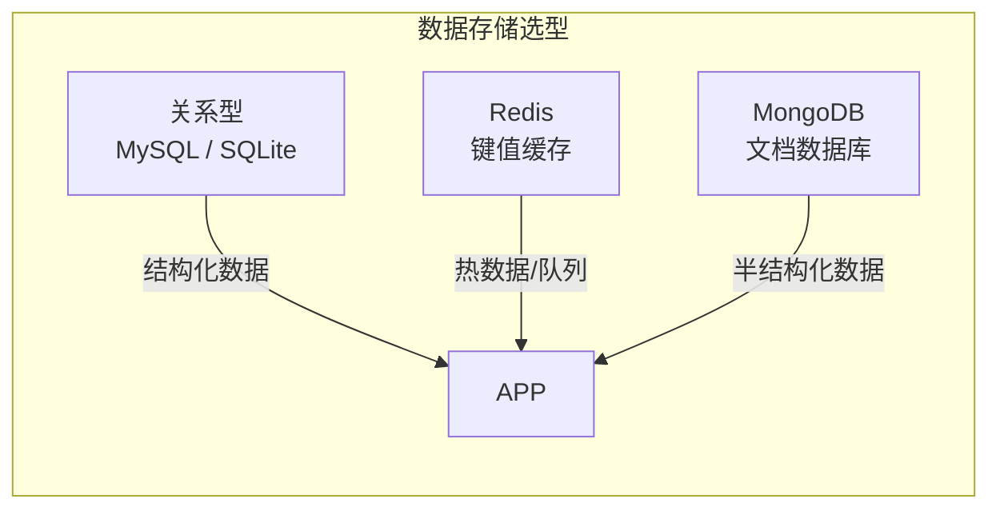
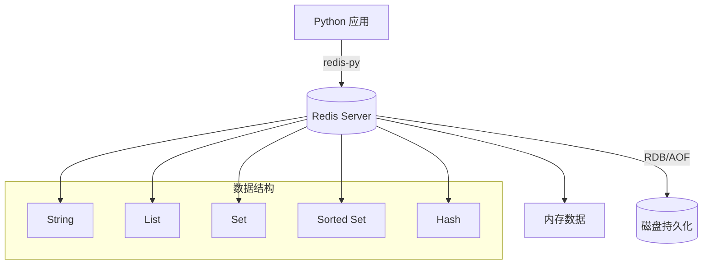
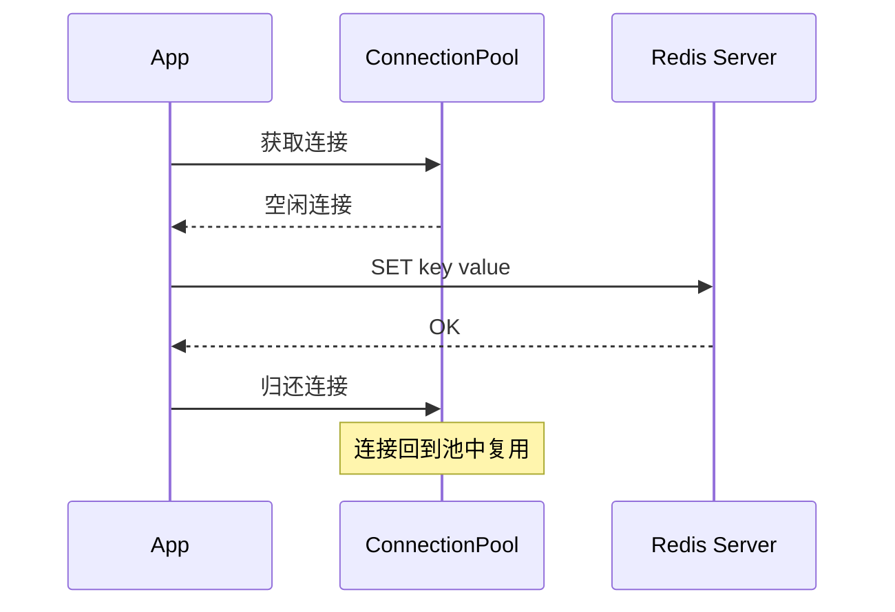
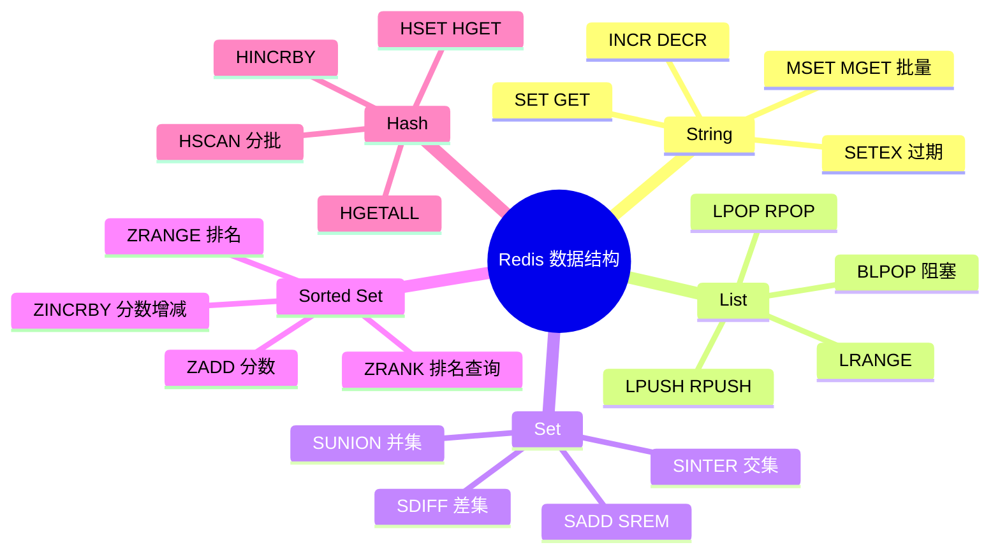
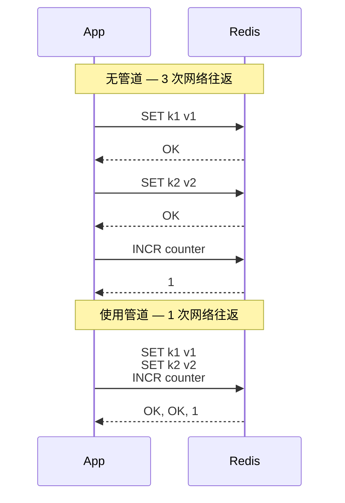
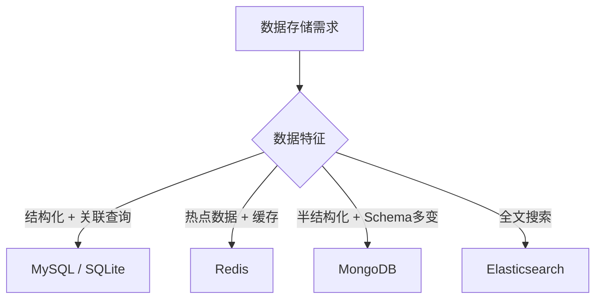

# Python 非关系型数据库操作完全指南

## 概述

MySQL 和 SQLite 都属于 **关系型数据库 (RDBMS)**，以二维表为核心。但在实际项目中，常常还需要两类非关系型存储：

| 存储类型 | 代表 | 核心数据模型 | 典型场景 |
|---------|------|------------|---------|
| 键值缓存 | **Redis** | Key-Value | 缓存、会话、消息队列、排行榜 |
| 文档数据库 | **MongoDB** | JSON Document | 日志、用户画像、非结构化数据 |



---

## 第一部分：Redis

Redis (Remote Dictionary Server) 是一个基于内存的键值存储系统，支持多种数据结构（字符串、列表、集合、有序集合、哈希），并提供了持久化、主从复制、哨兵、集群等生产级特性。



### 安装与连接

```bash
pip install redis
```

```python
import redis

# redis-py 提供两个客户端类：
#   StrictRedis — 命令与官方 Redis 命令一一对应
#   Redis       — StrictRedis 的子类，向后兼容旧版

r = redis.StrictRedis(host='127.0.0.1', port=6379, db=0)
# 默认返回 bytes；设置 decode_responses=True 返回 str
r_str = redis.StrictRedis(host='127.0.0.1', port=6379, db=0, decode_responses=True)

print(r.keys())     # [b'key1', b'key2']
print(r_str.keys()) # ['key1', 'key2']
```

### 连接池

每次执行 Redis 命令默认都会建立和断开连接。使用连接池可以复用连接，显著降低开销：

```python
import redis

pool = redis.ConnectionPool(
    host='127.0.0.1',
    port=6379,
    db=0,
    decode_responses=True,
    max_connections=50
)
r = redis.Redis(connection_pool=pool)  # 多个 Redis 实例可共享同一个池

print(r.keys())
```



### 五种核心数据结构



#### String（字符串）

最基础的数据类型，可用于缓存、计数器、分布式锁。

| 方法 | 说明 | 示例 |
|------|------|------|
| `set(name, value, ex, nx, xx)` | 设置值 | `r.set('key', 'val', ex=60)` |
| `get(name)` | 获取值 | `r.get('key')` |
| `incr(key, amount)` | 自增 | `r.incr('counter', 1)` |
| `decr(key, amount)` | 自减 | `r.decr('counter', 1)` |
| `mset(mapping)` | 批量设置 | `r.mset({'k1':'v1', 'k2':'v2'})` |
| `mget(keys)` | 批量获取 | `r.mget('k1', 'k2')` |

```python
import redis
import time

r = redis.Redis(connection_pool=pool)

# 带过期时间的设置（缓存常用）
r.set('temp_token', 'abc123', ex=10)
print(r.get('temp_token'))  # 'abc123'
time.sleep(10)
print(r.get('temp_token'))  # None — 已过期删除

# 分布式锁模式 — 仅当不存在时设置
acquired = r.set('lock:order:123', 'owner-1', nx=True, ex=30)
if acquired:
    try:
        process_order(123)
    finally:
        r.delete('lock:order:123')

# 计数器
r.incr('page:view:2024-01-01', amount=1)
r.incrbyfloat('score:player1', 3.5)

# 批量操作 — 一次网络往返完成多个命令
r.mset({'user:1:name': 'Alice', 'user:1:email': 'alice@example.com'})
values = r.mget('user:1:name', 'user:1:email')
print(values)  # ['Alice', 'alice@example.com']
```

#### List（列表）

有序、可重复的双向链表，常用于消息队列、时间线。

| 方法 | 说明 | 时间复杂度 |
|------|------|-----------|
| `lpush(name, *values)` | 左侧插入 | O(N) N=插入数量 |
| `rpush(name, *values)` | 右侧插入 | O(N) |
| `lpop(name)` / `rpop(name)` | 弹出并删除 | O(1) |
| `lrange(name, start, end)` | 范围查询 | O(S+N) |
| `blpop(keys, timeout)` | 阻塞弹出 | O(1) |
| `ltrim(name, start, end)` | 保留范围 | O(N) |

```python
# 消息队列 — 生产者-消费者模式
# 生产者
r.rpush('task_queue', 'task_1', 'task_2', 'task_3')

# 消费者 — 阻塞等待，减少空轮询的开销
while True:
    result = r.blpop('task_queue', timeout=5)
    if result:
        key, task = result
        print(f'处理任务: {task}')
    else:
        print('队列为空，等待中...')
        break
```

#### Set（集合）

无序、唯一，支持集合运算（交/并/差），常用于标签、共同好友。

| 方法 | 说明 |
|------|------|
| `sadd(name, *values)` | 添加元素 |
| `srem(name, *values)` | 删除元素 |
| `smembers(name)` | 获取全部 |
| `sinter(keys)` | 交集 |
| `sunion(keys)` | 并集 |
| `sdiff(keys)` | 差集 |
| `spop(name)` | 随机弹出 |

```python
# 共同好友
r.sadd('friends:Alice', 'Bob', 'Charlie', 'David')
r.sadd('friends:Bob', 'Alice', 'Charlie', 'Eve')

common = r.sinter('friends:Alice', 'friends:Bob')
print(f'共同好友: {common}')  # {'Charlie'}

# 推荐好友（Bob 的好友中 Alice 没加的）
suggest = r.sdiff('friends:Bob', 'friends:Alice')
print(f'推荐: {suggest}')  # {'Alice', 'Eve'}
```

#### Sorted Set（有序集合）

每个元素关联一个分数（score），按分数排序。常用于排行榜、延迟队列。

| 方法 | 说明 |
|------|------|
| `zadd(name, mapping)` | 添加元素及分数 |
| `zrange(name, start, end, withscores)` | 按分数升序获取 |
| `zrevrange(name, start, end, withscores)` | 按分数降序获取 |
| `zrank(name, value)` | 获取排名（升序） |
| `zincrby(name, amount, value)` | 增减分数 |
| `zrem(name, *values)` | 删除元素 |

```python
# 游戏排行榜
r.zadd('leaderboard', {'Alice': 9500, 'Bob': 8700, 'Charlie': 9200, 'David': 7800})

# Top 3
top3 = r.zrevrange('leaderboard', 0, 2, withscores=True)
print(f'Top 3: {top3}')  # [('Alice', 9500.0), ('Charlie', 9200.0), ('Bob', 8700.0)]

# 查排名
rank = r.zrevrank('leaderboard', 'Bob')
print(f'Bob 排名: {rank + 1}')  # 3

# 加分
r.zincrby('leaderboard', 500, 'David')
```

#### Hash（哈希）

键值对的集合，适合存储对象（用户信息、配置）。

| 方法 | 说明 |
|------|------|
| `hset(name, key, value)` | 设置字段 |
| `hget(name, key)` | 获取字段 |
| `hgetall(name)` | 获取全部字段 |
| `hdel(name, *keys)` | 删除字段 |
| `hexists(name, key)` | 判断字段存在 |
| `hlen(name)` | 字段数量 |
| `hincrby(name, key, amount)` | 字段自增 |

```python
# 用户信息存储
r.hset('user:1001', mapping={
    'name': '张三',
    'email': 'zhangsan@example.com',
    'login_count': '42'
})

user = r.hgetall('user:1001')
print(user)  # {'name': '张三', 'email': 'zhangsan@example.com', 'login_count': '42'}

# 原子递增登录次数
r.hincrby('user:1001', 'login_count', 1)

# 分批扫码大数据量 Hash
for field_batch in r.hscan_iter('large_hash', count=100):
    key, value = field_batch
    process(key, value)
```

### Pipeline（管道）

redis-py 默认每执行一条命令就进行一次网络往返。Pipeline 将多条命令缓冲后批量发送，大幅减少网络开销。



```python
pipe = r.pipeline()

# 链式调用
pipe.set('name', 'jack').set('role', 'admin').incr('counter')
results = pipe.execute()
print(results)  # [True, True, 1]

print(r.get('name'))   # 'jack'
print(r.get('counter'))  # '1'
```

### 常用管理命令

| 方法 | 说明 |
|------|------|
| `delete(*names)` | 删除任意类型的键 |
| `exists(name)` | 判断键是否存在 |
| `expire(name, time)` | 设置过期时间（秒） |
| `keys(pattern)` | 按模式查找键（**生产环境慎用**） |
| `type(name)` | 获取键的类型 |
| `dbsize()` | 当前库的键数量 |
| `flushdb()` | 清空当前库（**危险操作**） |

> **生产环境禁止使用 `keys('*')`**：它会阻塞 Redis，扫描全部键。替代方案：使用 `scan()` 增量迭代。

---

## 第二部分：MongoDB

MongoDB 是一个面向文档的 NoSQL 数据库，数据以 BSON（Binary JSON）格式存储。它不要求预定义表结构（Schema-less），特别适合灵活多变的数据模型。

```mermaid
flowchart TD
    subgraph MongoDB 层次结构
        Cluster[Cluster / Replica Set]
        Cluster --> DB1[(Database: school)]
        Cluster --> DB2[(Database: shop)]
        DB1 --> Coll1[Collection: students]
        DB1 --> Coll2[Collection: courses]
        Coll1 --> Doc1[Document: {name:..., age:...}]
        Coll1 --> Doc2[Document: {name:..., score:...}]
    end
```

| 概念 (RDBMS) | 概念 (MongoDB) | 说明 |
|---|---|---|
| Database | Database | 数据库 |
| Table | Collection | 集合（文档的容器） |
| Row | Document | 文档（BSON 对象） |
| Column | Field | 字段 |
| Primary Key | `_id` | 主键，自动生成 ObjectId |
| JOIN | `$lookup` / Reference | 关联查询 |
| Transaction | Transaction | 4.0+ 支持多文档事务 |

### 安装与连接

```bash
pip install pymongo
```

```python
from pymongo import MongoClient

# 连接 MongoDB
client = MongoClient('mongodb://127.0.0.1:27017')

# 获取数据库（不存在则自动创建）
db = client.school

# 获取集合
students = db.students
```

### CRUD 操作

#### 插入文档

```python
# 插入单个
students.insert_one({
    'stuid': '2024001',
    'name': '张三',
    'age': 20,
    'scores': {'math': 88, 'english': 92}
})

# 批量插入
students.insert_many([
    {'stuid': '2024002', 'name': '李四', 'age': 22, 'scores': {'math': 76, 'english': 85}},
    {'stuid': '2024003', 'name': '王五', 'age': 21, 'scores': {'math': 95, 'english': 90}},
])
```

#### 查询文档

```python
# 查询所有
for student in students.find():
    print(student['name'], student['age'])

# 条件查询
for s in students.find({'age': {'$gte': 21}}):
    print(s['name'])  # 年龄 >= 21

# 投影（只返回指定字段）
for s in students.find({}, {'name': 1, 'age': 1, '_id': 0}):
    print(s)

# 排序与分页
results = (
    students.find()
    .sort('age', -1)    # 按年龄降序
    .limit(10)
    .skip(20)
)
```

| 操作符 | 含义 | 示例 |
|--------|------|------|
| `$eq` | 等于 | `{'age': {'$eq': 20}}` 或 `{'age': 20}` |
| `$gt` / `$gte` | 大于 / 大于等于 | `{'age': {'$gte': 18}}` |
| `$lt` / `$lte` | 小于 / 小于等于 | `{'score': {'$lt': 60}}` |
| `$in` | 在集合中 | `{'name': {'$in': ['张三', '李四']}}` |
| `$and` / `$or` | 逻辑与/或 | `{'$or': [{'age': 20}, {'age': 22}]}` |
| `$exists` | 字段存在 | `{'email': {'$exists': True}}` |
| `$regex` | 正则匹配 | `{'name': {'$regex': '^张'}}` |

#### 更新与删除

```python
# 更新单条
students.update_one(
    {'stuid': '2024001'},
    {'$set': {'age': 21}}
)

# 更新多条
students.update_many(
    {'age': {'$lt': 22}},
    {'$inc': {'age': 1}}  # 年龄 +1
)

# 删除
students.delete_one({'stuid': '2024003'})
students.delete_many({'age': {'$gt': 25}})

# 统计
count = students.count_documents({'age': {'$gte': 20}})
print(f'符合条件的文档数: {count}')
```

### 扩展生态

| 库 | 说明 | 适用场景 |
|---|------|---------|
| [pymongo](https://pymongo.readthedocs.io/) | 官方驱动 | 通用场景 |
| [MongoEngine](https://mongoengine-odm.readthedocs.io/) | MongoDB 的 ORM 层 | 需要 ODM 抽象 |
| [motor](https://motor.readthedocs.io/) | 基于 pymongo 的异步驱动 | asyncio / Tornado 项目 |

## 对比总览



| 维度 | MySQL | Redis | MongoDB |
|------|-------|-------|---------|
| 数据模型 | 二维表 | Key-Value + 5种结构 | JSON Document |
| Schema | 严格预定义 | 无 | 灵活 |
| 持久化 | 天然持久 | RDB/AOF | 天然持久 |
| 查询能力 | SQL — 最灵活 | 按 Key 访问 | 丰富的查询语法 |
| JOIN | 支持 | 不适用 | `$lookup`（有限） |
| 事务 | ACID | 有限事务 | 4.0+ 多文档事务 |
| 典型场景 | 业务数据 | 缓存/队列/计数 | 日志/画像/内容管理 |
| 速度 | 慢（磁盘） | 极快（内存） | 中（内存映射） |

## 常见陷阱

| 陷阱 | 说明 | 正确做法 |
|------|------|---------|
| Redis `keys(*)` 阻塞 | 生产环境中 O(N) 扫描全库键 | 使用 `scan()` 增量迭代 |
| Redis 内存溢出 | 无过期时间的键永远占据内存 | 始终设置 `ex` 过期时间 |
| Redis 不设连接池 | 每条命令都建立新 TCP 连接 | 使用 `ConnectionPool` |
| MongoDB 无索引查询 | 全集合扫描，越查越慢 | 为高频查询字段创建索引 |
| MongoDB `_id` 覆盖 | ObjectId 可排序但不可预测 | 业务主键单独定义字段 |

## 延伸阅读

- [redis-py 官方文档](https://redis-py.readthedocs.io/)
- [Redis 命令参考](https://redis.io/commands/)
- [PyMongo 官方文档](https://pymongo.readthedocs.io/)
- [MongoDB 查询操作符参考](https://www.mongodb.com/docs/manual/reference/operator/)

## 版本差异（标准库 → Python 3.14）

| 模块/特性 | 本文编写时 | Python 3.14 变化 |
|-----------|-----------|------------------|
| `datetime` | `utcnow()` / `utcfromtimestamp()` | 3.12 起弃用，改用 `datetime.now(tz=datetime.UTC)` / `fromtimestamp(ts, tz=datetime.UTC)`（aware 对象） |
| `asyncio` | 基础 API | 3.14 新增内省能力（`asyncio.Task`/`Future` 状态查询）；3.11 起推荐 `TaskGroup` + `asyncio.timeout()` |
| `typing` | 旧式 `List`/`Dict` | 3.9+ 内置泛型；3.10+ 联合类型 `X \| Y`；3.12 `type` 语句；3.14 PEP 649 延迟注解 |
| `importlib` | `imp` 模块 | `imp` 于 3.12 移除，统一使用 `importlib` |
| 压缩 | zlib/gzip/bz2/lzma | 3.14 新增 `zstandard` 标准库支持（PEP 784） |
| `pathlib` | 基础路径操作 | 3.12 新增 `Path.walk()`；`is_relative_to()` 早在 3.9 即已提供 |
| 废弃模块清理 | — | 3.13 移除 `cgi`、`telnetlib`、`crypt`、`audioop` 等已废弃模块 |

> 本文讲解的模块核心 API 与使用模式在 3.14 中保持稳定；注意上述弃用/移除项，升级时优先用标准库推荐的替代方案。
