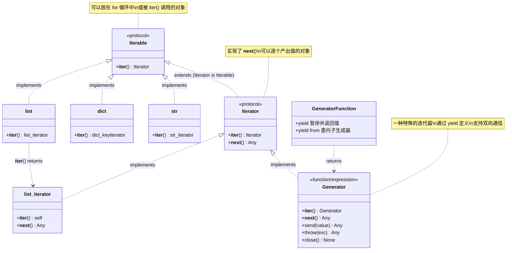
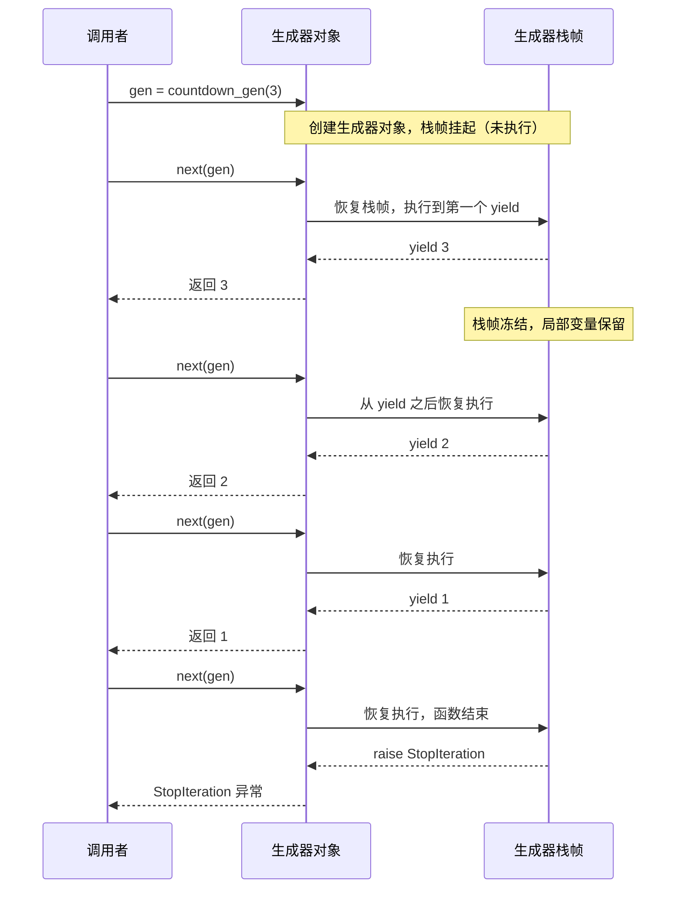

# 迭代器与生成器

迭代器与生成器是 Python 中实现**惰性求值**（Lazy Evaluation）的核心机制。它们让你能够逐个处理数据项，而不必将整个数据集一次性加载到内存中。对于 1-3 年经验的 Python 开发者而言，掌握这两者意味着你能够写出更高效、更优雅的流式数据处理代码。

> 阅读提示

- 如果你只想知道"怎么用"，可以直接跳到[生成器函数](#生成器函数)和[实际应用场景](#实际应用场景)
- 如果你想理解 `for` 循环的底层原理，请从[迭代器协议](#迭代器协议)开始
- 如果你已经熟悉基础内容，可以重点阅读[send/throw/close 协程基础](#send-throw-close-协程基础)和[常见陷阱](#常见陷阱)
- 本文所有代码示例基于 **Python 3.10+**，建议在阅读时同步运行实验

## 概念全景：可迭代对象、迭代器与生成器

在深入细节之前，先用一张类图理清三者的关系。这是理解后续所有内容的基础。



::: tip 一句话总结
**可迭代对象**是"可以被迭代的东西"（有 `__iter__`），**迭代器**是"正在迭代的东西"（有 `__next__`），**生成器**是"用函数语法写出来的迭代器"（有 `yield`）。
:::

### 快速区分表

| 概念 | 英文 | 核心方法 | 是否可被 `for` 遍历 | 是否可被 `next()` 调用 | 能否重复遍历 |
|------|------|----------|---------------------|------------------------|--------------|
| 可迭代对象 | Iterable | `__iter__` | 是 | 否 | 取决于实现 |
| 迭代器 | Iterator | `__iter__` + `__next__` | 是 | 是 | 否（一次性） |
| 生成器 | Generator | `__iter__` + `__next__` + `send` + `throw` + `close` | 是 | 是 | 否（一次性） |

## 迭代器协议

### 协议定义

迭代器协议是 Python 中最简洁的协议之一，仅包含两个方法：

- **`__iter__(self)`**：返回迭代器对象自身。这个方法的存在使得迭代器本身也是可迭代对象。
- **`__next__(self)`**：返回容器中的下一个元素。当没有更多元素时，必须抛出 `StopIteration` 异常。

`for` 循环的本质就是反复调用 `__next__()` 直到捕获 `StopIteration`。以下两段代码完全等价：

```python
# for 循环写法（你平时写的）
for item in [1, 2, 3]:
    print(item)

# 等价的手动迭代（for 循环的底层实现）
iterable = [1, 2, 3]
iterator = iter(iterable)          # 调用 __iter__()
while True:
    try:
        item = next(iterator)      # 调用 __next__()
        print(item)
    except StopIteration:
        break                       # 迭代结束
```

### 手动实现一个迭代器

```python
class Countdown:
    """一个倒计时迭代器，每次 next() 返回递减的数字"""

    def __init__(self, start: int):
        self.current = start

    def __iter__(self):
        return self  # 迭代器返回自身

    def __next__(self):
        if self.current <= 0:
            raise StopIteration
        self.current -= 1
        return self.current + 1  # 返回递减前的值


# 使用示例
cd = Countdown(3)
print(list(cd))  # [3, 2, 1]

# 可以放在 for 循环中
for num in Countdown(3):
    print(num)
# 输出: 3 2 1
```

::: warning 注意：迭代器只能遍历一次
上面的 `Countdown` 实例在第一次遍历后就已经"耗尽"了。如果再次遍历，不会得到任何结果：

```python
cd = Countdown(3)
print(list(cd))  # [3, 2, 1]
print(list(cd))  # [] —— 迭代器已经耗尽！
```

这是因为 `__iter__` 返回了 `self`，而 `self.current` 已经归零。如果需要重复遍历，应该让 `__iter__` 返回一个**新的**迭代器对象，而不是 `self`。
:::

### 可迭代对象与迭代器的分离

正确的做法是将"可迭代对象"和"迭代器"分离为两个类：

```python
class CountdownIterable:
    """可迭代对象：每次 iter() 都返回一个新的迭代器"""

    def __init__(self, start: int):
        self.start = start

    def __iter__(self):
        return CountdownIterator(self.start)


class CountdownIterator:
    """迭代器：持有遍历状态"""

    def __init__(self, start: int):
        self.current = start

    def __iter__(self):
        return self

    def __next__(self):
        if self.current <= 0:
            raise StopIteration
        self.current -= 1
        return self.current + 1


# 现在可以重复遍历了
cd = CountdownIterable(3)
print(list(cd))  # [3, 2, 1]
print(list(cd))  # [3, 2, 1] —— 每次 iter() 创建新的迭代器
```

::: tip 设计原则
**可迭代对象**的 `__iter__` 应该每次都返回一个全新的迭代器（从头开始）。**迭代器**的 `__iter__` 返回 `self`（从当前位置继续）。这就是为什么 `list` 可以多次遍历，而 `zip` 对象只能遍历一次——`list` 是可迭代对象，`zip` 返回的是迭代器。
:::

## 生成器函数

### yield：让函数变成生成器

任何包含 `yield` 关键字的函数都会变成一个**生成器函数**。调用生成器函数不会执行函数体，而是返回一个生成器对象。

```python
def countdown_gen(start: int):
    """生成器函数版本的倒计时"""
    while start > 0:
        yield start
        start -= 1


# 调用生成器函数，返回生成器对象
gen = countdown_gen(3)
print(type(gen))  # <class 'generator'>
print(list(gen))  # [3, 2, 1]
```

生成器函数的执行流程与普通函数完全不同：



::: info 生成器的栈帧不会销毁
普通函数返回时，栈帧被销毁，局部变量丢失。生成器在 `yield` 时，栈帧被"冻结"并保存——包括局部变量、指令指针、异常状态等。下次 `next()` 时，栈帧恢复并从冻结点继续执行。这就是生成器能够"记住"状态的根本原因。
:::

### yield from：委托子生成器

`yield from` 是 Python 3.3 引入的语法，用于将一个生成器的迭代委托给另一个生成器：

```python
def sub_generator():
    yield 1
    yield 2
    yield 3


def main_generator():
    yield "start"
    yield from sub_generator()  # 委托给子生成器
    yield "end"


print(list(main_generator()))
# ['start', 1, 2, 3, 'end']
```

`yield from` 不仅简化了嵌套生成器的写法，还自动处理了 `send()`、`throw()` 和 `close()` 的透传，以及 `StopIteration` 的返回值捕获。这在实现协程委托时至关重要。

```python
def accumulating_sub():
    """子生成器：接收 send 的值并累加"""
    total = 0
    while True:
        received = yield total
        if received is None:
            break
        total += received
    return total  # StopIteration 的 value


def accumulator():
    """主生成器：通过 yield from 获取子生成器的返回值"""
    result = yield from accumulating_sub()
    yield f"最终结果: {result}"


acc = accumulator()
print(next(acc))     # 0（启动子生成器，返回初始 total）
print(acc.send(10))  # 10（发送 10，累加后返回）
print(acc.send(20))  # 30（发送 20，累加后返回）
print(acc.send(None))  # "最终结果: 30"（结束子生成器，获取返回值）
```

## 生成器表达式 vs 列表推导式

### 语法对比

生成器表达式使用圆括号 `()`，列表推导式使用方括号 `[]`：

```python
# 列表推导式：立即计算，返回 list
squares_list = [x ** 2 for x in range(10)]
print(type(squares_list))  # <class 'list'>
print(squares_list)        # [0, 1, 4, 9, 16, 25, 36, 49, 64, 81]

# 生成器表达式：惰性计算，返回 generator
squares_gen = (x ** 2 for x in range(10))
print(type(squares_gen))   # <class 'generator'>
print(list(squares_gen))   # [0, 1, 4, 9, 16, 25, 36, 49, 64, 81]
```

### 内存对比

这是两者最关键的差异。对于大数据集，生成器表达式的内存优势是压倒性的：

```python
import sys

# 列表推导式：一次性在内存中创建 1000 万个元素
# 请谨慎运行，这会占用大量内存
# big_list = [x ** 2 for x in range(10_000_000)]

# 生成器表达式：仅占用生成器对象本身的内存（约 200 字节）
big_gen = (x ** 2 for x in range(10_000_000))
print(f"生成器对象大小: {sys.getsizeof(big_gen)} bytes")
# 输出约: 生成器对象大小: 200 bytes

# 而等价的列表将占用约 80 MB
# print(f"列表大小: {sys.getsizeof(big_list)} bytes")  # 约 80,000,000 bytes
```

| 特性 | 列表推导式 | 生成器表达式 |
|------|-----------|-------------|
| 返回类型 | `list` | `generator` |
| 计算时机 | 立即（急切求值） | 惰性（按需求值） |
| 内存占用 | 存储全部结果 | 仅存储生成器状态 |
| 可重复遍历 | 是 | 否（一次性） |
| 支持索引 | 是（`lst[3]`） | 否 |
| 支持 `len()` | 是 | 否 |
| 适用场景 | 结果集小、需要多次访问 | 结果集大、只需遍历一次 |

::: tip 选择指南
- 需要多次遍历、随机访问或获取长度 → 列表推导式
- 数据量大、只需遍历一次、或作为函数参数传递 → 生成器表达式
- 不确定？先用生成器表达式，需要时再转为列表
:::

### 作为函数参数的简写

当生成器表达式作为函数的唯一参数时，可以省略额外的括号：

```python
# 标准写法
total = sum((x ** 2 for x in range(100)))

# 简写（省略生成器表达式的括号）
total = sum(x ** 2 for x in range(100))

# 等价于（但更省内存）
total = sum([x ** 2 for x in range(100)])
```

## send / throw / close：协程基础

生成器不仅是数据的生产者，还可以通过 `send()`、`throw()` 和 `close()` 与外部进行双向通信。这是 Python 协程的基础——在 `async/await` 出现之前，生成器就是 Python 的协程实现。

### send()：向生成器发送值

```python
def echo_generator():
    """回显生成器：接收值并返回"""
    print("生成器已启动")
    while True:
        received = yield  # yield 在等号右边，接收 send 的值
        print(f"收到: {received}")


echo = echo_generator()
next(echo)  # 必须先启动生成器（执行到第一个 yield）
# 输出: 生成器已启动

echo.send("Hello")  # 输出: 收到: Hello
echo.send("World")  # 输出: 收到: World
echo.close()
```

::: danger 首次调用必须 send(None) 或 next()
生成器在 `yield` 处暂停，`send(value)` 会将 `value` 作为 `yield` 表达式的值，然后继续执行到下一个 `yield`。但生成器刚创建时还没有停在 `yield` 处，此时调用 `send(非None值)` 会抛出 `TypeError`。必须先用 `next()` 或 `send(None)` 将生成器推进到第一个 `yield`。
:::

### throw()：向生成器注入异常

```python
def resilient_generator():
    """能处理异常的生成器"""
    for i in range(5):
        try:
            yield i
        except ValueError as e:
            print(f"捕获到 ValueError: {e}")
            yield "error_handled"


gen = resilient_generator()
print(next(gen))  # 0
print(next(gen))  # 1
# 推荐：向暂停点抛入异常实例（单参数形式）
print(gen.throw(ValueError("测试异常")))  # 捕获到 ValueError: 测试异常
                                         # error_handled
print(next(gen))  # 2（继续正常迭代）
```

### close()：优雅关闭生成器

```python
def cleanup_generator():
    """带清理逻辑的生成器"""
    try:
        yield 1
        yield 2
    finally:
        print("清理资源：关闭数据库连接、释放文件句柄等")


gen = cleanup_generator()
print(next(gen))  # 1
gen.close()       # 在 yield 处抛出 GeneratorExit，触发 finally
# 输出: 清理资源：关闭数据库连接、释放文件句柄等
```

::: info close() 的内部机制
`generator.close()` 在生成器的暂停点抛出 `GeneratorExit` 异常。如果生成器捕获了该异常但没有重新抛出或 `return`，会引发 `RuntimeError`。正确的做法是在 `finally` 块中做清理，或捕获后重新 `raise`。
:::

## itertools 模块概览

`itertools` 是 Python 标准库中专门用于操作迭代器的模块，提供了三类核心工具。这里做一个概览，后续会有专门的 `itertools` 专题文档深入讲解。

### 无限迭代器

```python
from itertools import count, cycle, repeat

# count(start, step): 从 start 开始，无限递增
counter = count(10, 2)
print([next(counter) for _ in range(5)])  # [10, 12, 14, 16, 18]

# cycle(iterable): 无限循环一个可迭代对象
cycler = cycle("ABC")
print([next(cycler) for _ in range(6)])   # ['A', 'B', 'C', 'A', 'B', 'C']

# repeat(obj, times): 重复一个对象（times 省略则无限重复）
repeater = repeat("hello", 3)
print(list(repeater))  # ['hello', 'hello', 'hello']
```

### 有限迭代器

```python
from itertools import accumulate, chain, pairwise, groupby

# accumulate: 累加（可自定义二元函数）
print(list(accumulate([1, 2, 3, 4])))  # [1, 3, 6, 10]

# chain: 串联多个可迭代对象
print(list(chain("AB", "CD", [1, 2])))  # ['A', 'B', 'C', 'D', 1, 2]

# pairwise: 相邻元素配对（Python 3.10+）
print(list(pairwise("ABCD")))  # [('A', 'B'), ('B', 'C'), ('C', 'D')]

# groupby: 按 key 分组（注意：需要先排序）
data = [("a", 1), ("a", 2), ("b", 3), ("b", 4)]
for key, group in groupby(data, key=lambda x: x[0]):
    print(key, "->", list(group))
# a -> [('a', 1), ('a', 2)]
# b -> [('b', 3), ('b', 4)]
```

### 组合迭代器

```python
from itertools import product, permutations, combinations, combinations_with_replacement

# product: 笛卡尔积
print(list(product("AB", [1, 2])))
# [('A', 1), ('A', 2), ('B', 1), ('B', 2)]

# permutations: 排列（顺序重要）
print(list(permutations("ABC", 2)))
# [('A', 'B'), ('A', 'C'), ('B', 'A'), ('B', 'C'), ('C', 'A'), ('C', 'B')]

# combinations: 组合（顺序不重要，无重复）
print(list(combinations("ABC", 2)))
# [('A', 'B'), ('A', 'C'), ('B', 'C')]

# combinations_with_replacement: 有放回组合
print(list(combinations_with_replacement("AB", 2)))
# [('A', 'A'), ('A', 'B'), ('B', 'B')]
```

::: tip 与后续文档的呼应
`itertools` 的每个工具都值得深入探讨——包括性能特征、组合使用模式、与 `functools`/`operator` 的配合等。本文仅做概览，详细的 `itertools` 专题文档将涵盖这些内容。
:::

## 常见陷阱

以下是使用迭代器与生成器时最容易踩到的坑：

| 陷阱 | 现象 | 原因 | 解决方案 |
|------|------|------|----------|
| 生成器只能遍历一次 | 第二次遍历得到空结果 | 生成器是迭代器，状态耗尽后不可重置 | 需要多次遍历时使用列表，或重新创建生成器 |
| `send(None)` 首次调用 | `TypeError: can't send non-None value to a just-started generator` | 生成器未推进到第一个 `yield` | 首次调用使用 `next(gen)` 或 `gen.send(None)` |
| `StopIteration` 被吞掉 | `for` 循环正常结束，但生成器内部异常被隐藏 | `for` 循环自动捕获 `StopIteration` | 不要在生成器内部依赖 `StopIteration` 传递错误信息 |
| 生成器中的 `return` 值被忽略 | `return value` 在生成器中不直接返回 | `return value` 被包装在 `StopIteration.value` 中 | 使用 `yield from` 获取子生成器的返回值 |
| 在迭代中修改被迭代的容器 | 遍历 list 时增删元素导致跳过或重复 | 迭代器基于索引，修改改变了元素位置 | 遍历副本（`for x in list[:]`）或使用列表推导式创建新列表 |
| 忘记 `close()` 导致资源泄漏 | 文件未关闭、连接未释放 | 生成器在 `yield` 处暂停，`finally` 未执行 | 使用 `contextlib.closing` 或在 `try-finally` 中显式调用 `close()` |
| 生成器表达式变量泄漏 | 在列表推导式外访问循环变量 | Python 3 中列表推导式有自己的作用域，但生成器表达式延迟求值可能引用外部变量 | 注意闭包中的变量绑定时机，必要时使用默认参数捕获 |

### 陷阱详解：生成器只能遍历一次

```python
def data_generator():
    for i in range(3):
        yield i


gen = data_generator()
print(list(gen))  # [0, 1, 2]
print(list(gen))  # [] —— 陷阱！

# 正确做法：每次需要遍历时重新创建
print(list(data_generator()))  # [0, 1, 2]
print(list(data_generator()))  # [0, 1, 2]
```

### 陷阱详解：在迭代中修改容器

```python
# 错误做法
data = [1, 2, 3, 4, 5]
for item in data:
    if item % 2 == 0:
        data.remove(item)  # 危险！跳过了一些元素
print(data)  # [1, 3, 5] —— 看似正确，但内部跳过了检查

# 正确做法
data = [1, 2, 3, 4, 5]
data = [item for item in data if item % 2 != 0]
print(data)  # [1, 3, 5]
```

## 实际应用场景

### 场景一：大文件逐行读取

处理 GB 级别的日志文件时，将整个文件读入内存是不可行的。生成器让你可以逐行处理：

```python
def read_large_file(file_path: str):
    """逐行读取大文件，每次只在内存中保留一行"""
    with open(file_path, "r", encoding="utf-8") as f:
        for line in f:  # 文件对象本身就是可迭代的
            yield line.strip()


def filter_log_errors(file_path: str):
    """从日志文件中筛选包含 ERROR 的行"""
    for line in read_large_file(file_path):
        if "ERROR" in line:
            yield line


# 使用管道式处理
for error_line in filter_log_errors("/var/log/app.log"):
    print(error_line)
```

::: tip 内存效率
使用生成器处理 1GB 日志文件，内存占用仅约数 KB（单行大小 + 生成器状态），而 `f.read().splitlines()` 会占用约 1GB 内存。
:::

### 场景二：管道式数据处理

生成器可以像 Unix 管道一样串联起来，每个生成器负责一个处理步骤：

```python
def read_data(source):
    """步骤1：读取数据"""
    for item in source:
        yield item


def filter_valid(records):
    """步骤2：过滤无效记录"""
    for record in records:
        if record.get("status") == "valid":
            yield record


def transform(records):
    """步骤3：转换数据格式"""
    for record in records:
        yield {
            "id": record["id"],
            "name": record["name"].upper(),
            "score": record["score"] * 1.1,
        }


def save_results(records, threshold: float):
    """步骤4：保存高分记录"""
    for record in records:
        if record["score"] > threshold:
            yield record


# 管道串联：每一步都是惰性的
raw = [
    {"id": 1, "name": "alice", "score": 85, "status": "valid"},
    {"id": 2, "name": "bob", "score": 60, "status": "invalid"},
    {"id": 3, "name": "charlie", "score": 92, "status": "valid"},
]

pipeline = save_results(
    transform(
        filter_valid(
            read_data(raw)
        )
    ),
    threshold=90.0,
)

# 直到这里才开始实际计算
for result in pipeline:
    print(result)
# {'id': 1, 'name': 'ALICE', 'score': 93.5}
# {'id': 3, 'name': 'CHARLIE', 'score': 101.2}
```

::: info 管道模式的优势
每个步骤独立、可测试、可复用。数据按需流过管道，不会在中间步骤堆积。这种模式在处理实时数据流、ETL 任务时特别有用。
:::

### 场景三：无限序列

```python
def fibonacci():
    """生成无限斐波那契数列"""
    a, b = 0, 1
    while True:
        yield a
        a, b = b, a + b


# 取前 10 个斐波那契数
from itertools import islice

fib = fibonacci()
first_10 = list(islice(fib, 10))
print(first_10)  # [0, 1, 1, 2, 3, 5, 8, 13, 21, 34]
```

### 场景四：分页数据获取

```python
def paginated_fetch(api_client, page_size: int = 100):
    """分页获取 API 数据，对调用者透明"""
    page = 1
    while True:
        data = api_client.fetch(page=page, size=page_size)
        if not data:
            break
        yield from data  # 逐个产出记录
        page += 1


# 调用者不需要关心分页逻辑
for record in paginated_fetch(client, page_size=50):
    process(record)
```

## 最佳实践

### 1. 优先使用生成器处理大数据集

当数据量可能超过可用内存时，生成器是唯一可行的选择。即使数据量不大，生成器的惰性求值也能让代码更模块化。

### 2. 用 `yield from` 替代嵌套循环

```python
# 不推荐：嵌套循环
def flatten_bad(nested):
    for sublist in nested:
        for item in sublist:
            yield item

# 推荐：使用 yield from
def flatten_good(nested):
    for sublist in nested:
        yield from sublist
```

### 3. 使用 `iter()` 的双参数形式处理哨兵值

```python
# 读取文件直到遇到结束标记
with open("data.txt", "r") as f:
    for line in iter(lambda: f.readline().strip(), "END"):
        print(line)
```

### 4. 用 `contextlib.closing` 确保生成器资源释放

```python
from contextlib import closing


def db_query_generator(connection, query):
    cursor = connection.cursor()
    cursor.execute(query)
    try:
        for row in cursor:
            yield row
    finally:
        cursor.close()


# 使用 closing 确保即使提前退出也会清理
with closing(db_query_generator(conn, "SELECT * FROM users")) as results:
    for row in results:
        if row["id"] > 1000:
            break  # 提前退出，closing 确保 cursor.close() 被调用
```

### 5. 避免 StopIteration 从生成器内部向外传播

Python 3.7+ 中，如果 `StopIteration` 未被捕获并从生成器内部向外传播，会转换为 `RuntimeError`（PEP 479）。因此不要在生成器体内 `raise StopIteration`（如在 `next()` 的封装中）；如果需要返回值，使用 `return` 语句并通过 `yield from` 获取。

### 6. 善用 itertools 而不是重复造轮子

```python
# 不推荐：手写滑动窗口
def sliding_window_bad(seq, n):
    for i in range(len(seq) - n + 1):
        yield seq[i:i + n]

# 推荐：使用 itertools.islice 和 tee
from itertools import islice, tee


def sliding_window_good(iterable, n):
    iterators = tee(iterable, n)
    for i, it in enumerate(iterators):
        next(islice(it, i, i), None)
    return zip(*iterators)
```

## 术语表

| 术语 | 英文 | 定义 |
|------|------|------|
| 可迭代对象 | Iterable | 实现了 `__iter__` 方法、可以被 `iter()` 转换为迭代器的对象 |
| 迭代器 | Iterator | 实现了 `__iter__` 和 `__next__` 方法、维护遍历状态的对象 |
| 迭代器协议 | Iterator Protocol | `__iter__` + `__next__` 两个方法构成的协议 |
| 生成器 | Generator | 由生成器函数或生成器表达式创建的特殊迭代器，支持 `yield` 暂停 |
| 生成器函数 | Generator Function | 包含 `yield` 关键字的函数，调用后返回生成器对象 |
| 生成器表达式 | Generator Expression | 类似列表推导式但使用圆括号，返回生成器 |
| 惰性求值 | Lazy Evaluation | 仅在需要时才计算值的策略，与急切求值相对 |
| 协程 | Coroutine | 可暂停和恢复执行的通用计算组件，Python 中生成器是协程的一种形式 |
| yield | — | 暂停生成器并返回一个值的关键字 |
| yield from | — | 将迭代委托给子生成器的语法（Python 3.3+） |
| StopIteration | — | 迭代器耗尽时抛出的内置异常 |
| GeneratorExit | — | `close()` 调用时在生成器内部抛出的异常 |

## 延伸阅读

- [Python 官方文档：迭代器类型](https://docs.python.org/zh-cn/3/library/stdtypes.html#iterator-types)
- [Python 官方文档：生成器](https://docs.python.org/zh-cn/3/reference/expressions.html#generator-expressions)
- [Python 官方文档：itertools 模块](https://docs.python.org/zh-cn/3/library/itertools.html)
- [PEP 234 — 迭代器协议](https://peps.python.org/pep-0234/)
- [PEP 255 — 简单生成器](https://peps.python.org/pep-0255/)
- [PEP 342 — 通过增强生成器实现协程](https://peps.python.org/pep-0342/)
- [PEP 380 — yield from 语法](https://peps.python.org/pep-0380/)
- [PEP 479 — 修改生成器内部 StopIteration 处理](https://peps.python.org/pep-0479/)
- 本系列：[基础知识索引](/docs/python/基础与入门/00-导航总览) — 回顾函数、面向对象等前置知识
- 本系列：[Python 模块](../../07-模块/01-Python模块) — 后续 itertools 专题将深入讲解

## 版本差异（类型注解 → Python 3.13/3.14）

| 特性 | 本文编写时 | Python 3.13/3.14 |
|------|-----------|------------------|
| 注解求值 | 运行时立即求值 | PEP 649/749（3.14）：延迟求值，类型注解不再在定义时执行 |
| 类型别名 | `TypeAlias` / 赋值 | 3.12 引入 `type X = ...` 语句 |
| 联合类型 | `Union[X, Y]` | 3.10+ 使用 `X \| Y` 语法 |
| `Self` 类型 | 手动标注 | 3.11+ `typing.Self` |
| 泛型语法 | `TypeVar` 冗长语法 | 3.12 PEP 695 类型参数语法 `def f[T](...)` |

> 本文讲解的 typing 核心概念在 3.14 中成立；新项目建议使用 3.12+ 的 `type` 语句与 PEP 695 语法，注解延迟求值让前向引用更简单。
