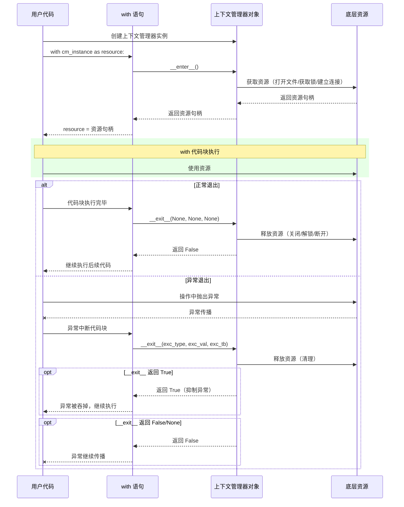
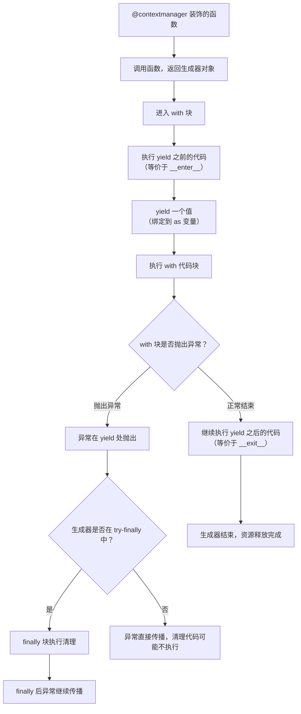
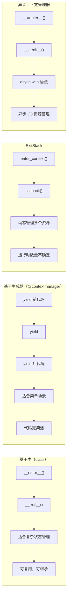

# 上下文管理器

程序运行中最常见的 bug 根源之一就是**资源泄露**——打开的文件忘了关、获取的锁忘了释放、数据库连接忘了归还。这些错误在短脚本中或许只是让进程多占几秒资源，但在长期运行的服务中，它们会像慢性的内存泄漏一样，最终耗尽文件描述符、连接池或者锁，导致服务崩溃。

Python 的上下文管理器（Context Manager）正是为解决这个问题而设计的。它提供了一种声明式的语法，确保资源的获取和释放成对发生——无论代码块是正常结束、抛出异常、还是被 `return` 提前退出。

## 为什么需要上下文管理器

### 资源管理的基本挑战

考虑一个最朴素的数据库操作：

```python
# 需要 Python 3.8+
import sqlite3

conn = sqlite3.connect("app.db")
cursor = conn.cursor()
cursor.execute("SELECT * FROM users")
data = cursor.fetchall()
conn.close()
```

这段代码看似正常，但实际上存在三个问题：

1. **如果 `execute()` 抛出异常**，`conn.close()` 永远不会执行，连接泄漏
2. **如果中间加了 `return`**，连接同样不会关闭
3. **代码重复**：每个需要资源的地方都要写 `try...finally`

传统补救方案是用 `try...finally`：

```python
conn = sqlite3.connect("app.db")
try:
    cursor = conn.cursor()
    cursor.execute("SELECT * FROM users")
    data = cursor.fetchall()
finally:
    conn.close()
```

这解决了资源泄漏问题，但引入了新的缺陷：代码冗长，且当多个资源需要同时管理时，嵌套的 `try...finally` 结构会迅速失控。

### RAII 在 Python 中的实现

C++ 程序员熟悉 RAII（Resource Acquisition Is Initialization）模式：资源在构造函数中获取，在析构函数中释放，利用对象的生命周期管理资源。但 Python 没有确定的析构时机——`__del__` 方法只有在对象被垃圾回收时才调用，而 GC 的时机是不确定的。

Python 的答案是**上下文管理器协议**：通过 `with` 语句，将资源获取与释放绑定到一个显式的代码块。`with` 语句块结束时，无论如何退出，释放代码都一定会执行。

```python
# with 语句——Python 的 RAII 实现
with sqlite3.connect("app.db") as conn:
    cursor = conn.cursor()
    cursor.execute("SELECT * FROM users")
    # 无论是否发生异常，conn 都会被关闭
```

::: info EAFP 与资源管理
上下文管理器是 Python EAFP（Easier to Ask Forgiveness than Permission）哲学的完美体现：不提前检查资源状态，而是直接使用，将清理逻辑交给协议保证。
:::

## 基于类的上下文管理器

### 协议定义

上下文管理器协议由两个方法组成：

| 方法 | 签名 | 用途 |
|------|------|------|
| `__enter__` | `__enter__(self) -> Any` | 进入 `with` 块时调用，返回值绑定到 `as` 后的变量 |
| `__exit__` | `__exit__(self, exc_type, exc_val, exc_tb) -> bool` | 退出 `with` 块时调用，接收异常信息，返回 `True` 可抑制异常 |

其中 `__exit__` 的三个参数在没有异常发生时都是 `None`，有异常时则分别携带异常类型、异常值、回溯对象。

### 执行流程时序图



### 第一个上下文管理器：文件操作

```python
# 需要 Python 3.10+
class ManagedFile:
    """一个展示上下文管理器协议的文件包装器"""

    def __init__(self, filepath: str, mode: str = "r", encoding: str = "utf-8"):
        self.filepath = filepath
        self.mode = mode
        self.encoding = encoding
        self.file = None

    def __enter__(self):
        print(f"[ManagedFile] 打开文件: {self.filepath}")
        self.file = open(self.filepath, self.mode, encoding=self.encoding)
        return self.file

    def __exit__(self, exc_type, exc_val, exc_tb):
        if self.file:
            print(f"[ManagedFile] 关闭文件: {self.filepath}")
            self.file.close()
        # 返回 False 表示不抑制异常，让异常继续传播
        return False


# 使用
with ManagedFile("test.txt", "w") as f:
    f.write("Hello, Context Manager!\n")
```

### 实战：数据库连接管理器

```python
# 需要 Python 3.10+
import sqlite3
from typing import Optional


class DatabaseConnection:
    """线程不安全的 SQLite 连接管理器"""

    def __init__(self, db_path: str):
        self.db_path = db_path
        self.connection: Optional[sqlite3.Connection] = None
        self.cursor: Optional[sqlite3.Cursor] = None

    def __enter__(self):
        self.connection = sqlite3.connect(self.db_path)
        self.connection.row_factory = sqlite3.Row  # 支持列名访问
        self.cursor = self.connection.cursor()
        return self.cursor  # 返回 cursor 给 as 变量

    def __exit__(self, exc_type, exc_val, exc_tb):
        if exc_type is None:
            # 正常退出：提交事务
            self.connection.commit()
        else:
            # 异常退出：回滚事务
            self.connection.rollback()
            print(f"[DatabaseConnection] 事务回滚，原因: {exc_type.__name__}: {exc_val}")

        if self.cursor:
            self.cursor.close()
        if self.connection:
            self.connection.close()
        return False  # 不抑制异常


# 使用
with DatabaseConnection("app.db") as cursor:
    cursor.execute("CREATE TABLE IF NOT EXISTS users (id INTEGER PRIMARY KEY, name TEXT)")
    cursor.execute("INSERT INTO users (name) VALUES (?)", ("Alice",))
    # 事务自动提交
```

## 基于生成器的上下文管理器

每次都写一个类来实现 `__enter__` 和 `__exit__` 过于繁琐。`contextlib.contextmanager` 装饰器允许你用一个生成器函数来定义上下文管理器，大幅简化代码。

### 工作原理

`@contextmanager` 将生成器函数转换为上下文管理器：

- `yield` 之前的代码等价于 `__enter__`
- `yield` 的值作为 `as` 的目标
- `yield` 之后的代码等价于 `__exit__`
- 只有 `yield` 一个值（不能像迭代器那样多次 yield）



### 实战：计时器上下文管理器

```python
# 需要 Python 3.10+
import time
from contextlib import contextmanager
from typing import Generator


@contextmanager
def timer(name: str = "代码块") -> Generator[None, None, None]:
    """测量代码块执行时间的上下文管理器"""
    start = time.perf_counter()
    try:
        yield  # 将控制权交给 with 代码块
    finally:
        elapsed = time.perf_counter() - start
        print(f"[{name}] 耗时: {elapsed:.4f} 秒")


# 使用
with timer("数据处理"):
    total = sum(range(10_000_000))
    print(f"计算结果: {total}")
```

### 实战：临时目录管理器

```python
# 需要 Python 3.10+
import shutil
import tempfile
from pathlib import Path
from contextlib import contextmanager
from typing import Generator


@contextmanager
def temporary_directory() -> Generator[Path, None, None]:
    """创建临时目录，代码块结束后自动删除"""
    tmp_dir = Path(tempfile.mkdtemp())
    try:
        print(f"[TempDir] 创建临时目录: {tmp_dir}")
        yield tmp_dir
    finally:
        print(f"[TempDir] 清理临时目录: {tmp_dir}")
        shutil.rmtree(tmp_dir, ignore_errors=True)


# 使用
with temporary_directory() as tmp:
    data_file = tmp / "data.txt"
    data_file.write_text("临时数据", encoding="utf-8")
    print(f"文件大小: {data_file.stat().st_size} 字节")
```

## contextlib 模块核心工具

`contextlib` 模块提供了比 `@contextmanager` 更丰富的工具集，覆盖了常见的上下文管理需求。

### closing：将任意对象变为上下文管理器

有些对象有 `close()` 方法但没有实现上下文管理器协议（例如一些第三方库的连接、句柄对象）。`closing` 为它们包装出 `with` 支持。

```python
# 需要 Python 3.10+
from contextlib import closing
from urllib.request import urlopen

# HTTPResponse 实际已支持 with，这里以它演示 closing 的用法；
# closing 的真正价值在于为只有 close() 的第三方对象补上 with 支持
with closing(urlopen("https://httpbin.org/get")) as response:
    data = response.read()
    print(f"响应状态: {response.status}, 数据长度: {len(data)}")
# response.close() 被自动调用
```

### suppress：优雅地忽略特定异常

当某些异常在你的场景中是可接受的（比如删除一个可能不存在的文件），`suppress` 比 `try...except...pass` 更简洁。

```python
# 需要 Python 3.10+
from contextlib import suppress
from pathlib import Path

# 删除临时文件，不存在也不报错
with suppress(FileNotFoundError):
    Path("/tmp/stale_lock.pid").unlink()

# 可以同时忽略多种异常
with suppress(FileNotFoundError, PermissionError):
    Path("/tmp/old_cache").unlink()
```

::: warning suppress vs 裸 except
`suppress` 只抑制指定类型的异常，不会像 `except: pass` 那样吞掉 `KeyboardInterrupt` 等不应被忽略的异常。始终优于裸 except。
:::

### redirect_stdout：捕获标准输出

将 `print()` 或其他写入 `sys.stdout` 的输出重定向到文件或 `io.StringIO`。

```python
# 需要 Python 3.10+
import io
from contextlib import redirect_stdout

buffer = io.StringIO()

with redirect_stdout(buffer):
    print("这行进入了缓冲区")
    print("而不是控制台")

output = buffer.getvalue()
print(f"捕获到的输出:\n{output}")
```

### ExitStack：动态管理多个上下文管理器

`ExitStack` 是 `contextlib` 中最强大的工具。当上下文管理器的数量在运行时才能确定，或者需要条件性地进入上下文时，`ExitStack` 提供了统一的清理回调机制。

```python
# 需要 Python 3.10+
from contextlib import ExitStack
from pathlib import Path


def process_files(file_list: list[Path]) -> None:
    """同时打开多个文件，统一管理"""
    with ExitStack() as stack:
        files = []
        for filepath in file_list:
            try:
                f = stack.enter_context(open(filepath, "r", encoding="utf-8"))
                files.append(f)
            except FileNotFoundError:
                print(f"警告: 文件 {filepath} 不存在，跳过")

        # 所有成功打开的文件都在这里可用
        for f in files:
            first_line = f.readline().strip()
            print(f"{f.name}: {first_line}")
    # 所有文件自动关闭，以注册的相反顺序
```

`ExitStack` 还支持注册任意回调函数：

```python
# 需要 Python 3.10+
from contextlib import ExitStack


def acquire_lock(name: str) -> str:
    print(f"获取锁: {name}")
    return f"lock_{name}"


def release_lock(lock_id: str):
    print(f"释放锁: {lock_id}")


with ExitStack() as stack:
    # 注册回调：退出时按注册的相反顺序调用
    lock_a = acquire_lock("A")
    stack.callback(release_lock, lock_a)

    lock_b = acquire_lock("B")
    stack.callback(release_lock, lock_b)

    print("持有两个锁，执行关键操作...")
# 退出时：先释放 lock_b，再释放 lock_a
```

### contextlib 工具速查表

| 工具 | 用途 | 典型场景 |
|------|------|----------|
| `contextmanager` | 将生成器函数转为上下文管理器 | 快速创建自定义上下文管理器 |
| `closing(thing)` | 为有 `close()` 的对象提供 `with` 支持 | urllib 响应、旧版库对象 |
| `suppress(*excs)` | 忽略指定异常 | 删除可能不存在的文件 |
| `redirect_stdout(target)` | 重定向标准输出 | 捕获 `print` 输出、测试 |
| `redirect_stderr(target)` | 重定向标准错误 | 捕获警告和错误日志 |
| `ExitStack` | 动态管理多个上下文管理器 | 可选资源、运行时确定的资源数量 |
| `nullcontext(value)` | 返回一个不执行任何操作的上下文管理器 | 条件性地使用或不使用上下文管理器 |
| `AbstractContextManager` | 上下文管理器的抽象基类 | 类型提示中的 `isinstance` 检查 |
| `ContextDecorator` | 让上下文管理器同时可用作装饰器 | 将上下文管理器逻辑应用到函数 |

### nullcontext：条件性使用上下文管理器

```python
# 需要 Python 3.10+
from contextlib import nullcontext


def process_data(data: list, use_lock: bool = False):
    """根据条件决定是否加锁"""
    # 如果 use_lock 为 True，使用真正的锁；否则使用空上下文
    from threading import Lock
    lock = Lock()
    ctx = lock if use_lock else nullcontext()

    with ctx:
        # 只有在 use_lock=True 时才持有锁
        data.append(42)
        print(f"处理完成，数据长度: {len(data)}")
```

## 异步上下文管理器

在异步编程中，资源的获取和释放可能涉及 I/O 操作（如建立数据库连接、打开网络流），这些操作本身需要被 `await`。Python 提供了异步上下文管理器协议来解决这个问题。

### 协议定义

异步上下文管理器使用 `__aenter__` 和 `__aexit__` 方法，两者都是异步方法，需要用 `async with` 进入。

```python
# 需要 Python 3.10+
import asyncio
from typing import Optional


class AsyncConnection:
    """模拟异步数据库连接"""

    def __init__(self, dsn: str):
        self.dsn = dsn
        self._connected = False

    async def __aenter__(self):
        # 模拟异步连接建立
        await asyncio.sleep(0.1)
        self._connected = True
        print(f"[AsyncConnection] 已连接到 {self.dsn}")
        return self

    async def __aexit__(self, exc_type, exc_val, exc_tb):
        if exc_type is not None:
            print(f"[AsyncConnection] 异常退出: {exc_type.__name__}")
        await asyncio.sleep(0.05)  # 模拟异步断开
        self._connected = False
        print(f"[AsyncConnection] 已断开 {self.dsn}")
        return False

    async def query(self, sql: str) -> str:
        if not self._connected:
            raise RuntimeError("未连接")
        await asyncio.sleep(0.05)
        return f"查询结果: {sql}"


async def main():
    async with AsyncConnection("postgresql://localhost/test") as conn:
        result = await conn.query("SELECT * FROM users")
        print(result)


asyncio.run(main())
```

### 异步上下文管理器的生成器写法

`contextlib` 提供了 `asynccontextmanager` 装饰器，语法与 `@contextmanager` 类似，但使用 `async with` 进入。

```python
# 需要 Python 3.10+
import asyncio
from contextlib import asynccontextmanager
from typing import AsyncGenerator


@asynccontextmanager
async def async_timer(name: str = "异步代码块") -> AsyncGenerator[None, None]:
    """异步计时器上下文管理器"""
    start = asyncio.get_event_loop().time()
    try:
        yield
    finally:
        elapsed = asyncio.get_event_loop().time() - start
        print(f"[{name}] 耗时: {elapsed:.4f} 秒")


async def async_workload():
    async with async_timer("网络请求"):
        await asyncio.sleep(0.5)
        print("请求完成")


asyncio.run(async_workload())
```

::: tip 异步上下文管理器实际应用
`aiohttp.ClientSession`、`asyncpg.Connection`、`redis.asyncio.Redis` 等异步库都实现了异步上下文管理器协议（早期独立的 `aioredis` 项目已停止维护，其功能并入 redis-py 的 `redis.asyncio`）。在异步代码中，始终使用 `async with` 管理这些资源。
:::

## 上下文管理器对比



| 实现方式 | 适用场景 | 复杂度 | 代码量 |
|----------|----------|--------|--------|
| 基于类的 `__enter__`/`__exit__` | 复杂状态管理、需要面向对象设计 | 较高 | 较多 |
| `@contextmanager` 生成器 | 简单资源管理、快速原型 | 低 | 较少 |
| `ExitStack` | 动态数量资源、条件性资源管理 | 中 | 中 |
| `async with` | 异步 I/O 操作（数据库、网络） | 中 | 中 |

## 常见陷阱

| 陷阱 | 问题描述 | 后果 | 正确做法 |
|------|----------|------|----------|
| 忘记在 `__exit__` 中返回 `True` 抑制异常 | `__exit__` 返回 `False` 或 `None` 时，异常会继续传播 | 异常未被正确处理，可能意外崩溃 | 如需抑制异常，显式 `return True` |
| 嵌套上下文管理器顺序错误 | 资源的获取和释放顺序不一致 | 可能导致死锁或资源依赖错误 | 使用 `ExitStack` 自动管理释放顺序 |
| 生成器上下文管理器中异常处理不当 | `yield` 不在 `try` 块中 | 异常发生时不执行清理代码 | 始终用 `try...finally` 包裹 `yield` |
| 在 `__del__` 中释放资源 | 依赖 GC 时机不确定 | 资源可能长时间不释放 | 用上下文管理器确保确定性释放 |
| 上下文管理器可重用性假象 | 对同一个实例多次调用 `with` | 第二次进入时状态可能不正确 | 每次使用前创建新实例 |
| `__exit__` 中抛出新异常 | 清理代码自身出错 | 覆盖原始异常，调试困难 | 在 `__exit__` 中捕获并记录清理异常 |

### 陷阱详解

**陷阱 1：忘记在 `__exit__` 中返回 `True` 抑制异常**

```python
# 需要 Python 3.10+
class BadSuppressor:
    """错误示范：__exit__ 没有 return True"""
    def __enter__(self):
        return self

    def __exit__(self, exc_type, exc_val, exc_tb):
        print(f"捕获到异常: {exc_type.__name__}")
        # 忘记 return True！异常会继续传播


class GoodSuppressor:
    """正确示范：显式返回 True 抑制异常"""
    def __enter__(self):
        return self

    def __exit__(self, exc_type, exc_val, exc_tb):
        print(f"捕获并抑制异常: {exc_type.__name__}")
        return True  # 异常被抑制


# 测试 BadSuppressor
try:
    with BadSuppressor():
        raise ValueError("测试异常")
    print("这行不会执行")
except ValueError:
    print("异常传播到了外部")

# 测试 GoodSuppressor
with GoodSuppressor():
    raise ValueError("测试异常")
print("异常被抑制，程序继续执行")
```

**陷阱 2：嵌套上下文管理器的顺序**

```python
# 需要 Python 3.10+
from contextlib import ExitStack
from threading import Lock


lock_a = Lock()
lock_b = Lock()

# 错误示范：手动嵌套可能导致死锁
# 如果线程1获取lock_a后线程2获取了lock_b，双方互相等待
# 正确做法：始终按相同顺序获取锁，或使用 ExitStack

# 使用 ExitStack 确保释放顺序与获取顺序相反
with ExitStack() as stack:
    stack.enter_context(lock_a)
    stack.enter_context(lock_b)
    # 关键操作...
# 退出时先释放 lock_b，再释放 lock_a，顺序正确
```

**陷阱 3：生成器上下文管理器中的异常处理**

```python
# 需要 Python 3.10+
from contextlib import contextmanager


# 错误示范：yield 不在 try 中
@contextmanager
def bad_context():
    resource = "资源已获取"
    yield resource
    # 如果 with 块中抛出异常，这行不会执行！
    print("资源清理")  # 可能永远不会执行


# 正确示范：yield 包裹在 try...finally 中
@contextmanager
def good_context():
    resource = "资源已获取"
    try:
        yield resource
    finally:
        # 无论是否发生异常，finally 都会执行
        print("资源已清理")


# 使用 good_context 时异常不会阻止清理
try:
    with good_context() as res:
        print(f"使用: {res}")
        raise RuntimeError("测试异常")
except RuntimeError:
    print("异常被外部捕获，但资源已清理")
```

**陷阱 4：上下文管理器实例的可重用性**

```python
# 需要 Python 3.10+
class NonReusableDB:
    """错误示范：同一实例不能重复使用"""
    def __init__(self):
        self.connected = False

    def __enter__(self):
        if self.connected:
            raise RuntimeError("已经连接！")
        self.connected = True
        return self

    def __exit__(self, exc_type, exc_val, exc_tb):
        self.connected = False
        return False


db = NonReusableDB()
with db:
    pass  # 正常
with db:  # 第二次使用同一个实例 —— 可能碰到残留状态！
    pass  # 此例中会触发 RuntimeError
```

## 实际应用场景

### 场景 1：文件操作

内置的 `open()` 已经是最标准的上下文管理器，无需额外封装。

```python
# 需要 Python 3.10+
# 一次打开多个文件
with open("input.txt", "r", encoding="utf-8") as fin, \
     open("output.txt", "w", encoding="utf-8") as fout:
    for line in fin:
        fout.write(line.upper())
```

### 场景 2：线程锁管理

```python
# 需要 Python 3.10+
from threading import Lock, Thread

counter = 0
lock = Lock()


def increment():
    global counter
    with lock:  # 自动获取和释放锁
        local = counter
        # 即使是复杂的操作，锁也会被正确释放
        local += 1
        counter = local


threads = [Thread(target=increment) for _ in range(100)]
for t in threads:
    t.start()
for t in threads:
    t.join()

print(f"最终计数: {counter}")  # 100
```

### 场景 3：临时目录

```python
# 需要 Python 3.10+
import tempfile
import shutil
from pathlib import Path


class TemporaryDirectory:
    """跨平台安全临时目录管理器"""

    def __init__(self, suffix: str = "", prefix: str = "tmp_"):
        self.suffix = suffix
        self.prefix = prefix
        self.path: Path | None = None

    def __enter__(self) -> Path:
        self.path = Path(tempfile.mkdtemp(suffix=self.suffix, prefix=self.prefix))
        return self.path

    def __exit__(self, exc_type, exc_val, exc_tb):
        if self.path and self.path.exists():
            shutil.rmtree(self.path, ignore_errors=True)
        return False


with TemporaryDirectory(prefix="build_") as tmp:
    # 在临时目录中执行构建操作
    (tmp / "output.txt").write_text("构建结果", encoding="utf-8")
    print(f"临时目录: {tmp}")
# 目录及所有内容已自动删除
```

### 场景 4：计时器

```python
# 需要 Python 3.10+
import time
from contextlib import contextmanager
from dataclasses import dataclass, field


@dataclass
class TimerResult:
    name: str
    elapsed: float


@contextmanager
def timer(name: str = "操作"):
    """测量代码块执行时间，支持嵌套使用"""
    start = time.perf_counter()
    try:
        yield
    finally:
        elapsed = time.perf_counter() - start
        print(f"[{name}] 执行时间: {elapsed:.6f} 秒")


# 嵌套使用
with timer("外层"):
    time.sleep(0.1)
    with timer("内层"):
        time.sleep(0.2)
```

### 场景 5：数据库事务管理

```python
# 需要 Python 3.10+
import sqlite3
from typing import Optional


class Transaction:
    """数据库事务管理器，自动提交/回滚"""

    def __init__(self, connection: sqlite3.Connection):
        self.conn = connection
        self._should_commit = False

    def __enter__(self):
        print("[Transaction] 开始事务")
        return self

    def __exit__(self, exc_type, exc_val, exc_tb):
        if exc_type is None:
            self.conn.commit()
            print("[Transaction] 事务已提交")
        else:
            self.conn.rollback()
            print(f"[Transaction] 事务已回滚: {exc_type.__name__}")
        return False


conn = sqlite3.connect(":memory:")
conn.execute("CREATE TABLE accounts (id INTEGER, balance REAL)")

try:
    with Transaction(conn):
        conn.execute("INSERT INTO accounts VALUES (1, 100.0)")
        conn.execute("INSERT INTO accounts VALUES (2, 200.0)")
        raise ValueError("模拟业务逻辑错误")
except ValueError:
    pass  # 事务已回滚，数据未写入

# 验证：表中没有数据
cursor = conn.execute("SELECT * FROM accounts")
print(f"表中行数: {len(cursor.fetchall())}")  # 0
```

### 场景 6：锁的层次化获取

```python
# 需要 Python 3.10+
from contextlib import ExitStack, contextmanager
from threading import Lock
from typing import Generator


@contextmanager
def acquire_locks(*locks: Lock) -> Generator[None, None, None]:
    """按顺序获取多个锁，退出时按相反顺序释放"""
    with ExitStack() as stack:
        for lock in locks:
            stack.enter_context(lock)
        yield


# 使用
lock1, lock2, lock3 = Lock(), Lock(), Lock()
with acquire_locks(lock1, lock2, lock3):
    print("持有三个锁，执行关键操作")
```

## 最佳实践

1. **优先使用内置上下文管理器**：`open()`、`threading.Lock`、`sqlite3.connect()` 等已经实现了协议，不要重复造轮子。

2. **简单场景用 `@contextmanager`，复杂场景用类**：当资源管理逻辑简单（获取-使用-释放）时，用生成器写法；当需要复杂的状态管理、属性访问或多个方法时，用类实现。

3. **始终在 `@contextmanager` 中使用 `try...finally`**：`yield` 之后的代码必须在 `finally` 块中，否则异常发生时不会执行清理。

4. **`__exit__` 中不要用 `return` 返回非布尔值**：`__exit__` 的返回值只用于判断是否抑制异常，返回 `True` 或 `False`，不要返回其他值。

5. **`__exit__` 中的清理代码本身不应抛异常**：如果清理代码可能失败，在内部捕获并记录，避免覆盖原始异常。

6. **动态数量资源用 `ExitStack`**：当资源数量在运行时确定，或需要条件性地获取资源时，`ExitStack` 是最佳选择。

7. **异步环境中使用 `async with`**：在 `async def` 函数中，使用 `async with` 管理异步资源，使用 `@asynccontextmanager` 创建异步上下文管理器。

8. **上下文管理器实例应一次性使用**：大多数上下文管理器设计为一次性使用，不要缓存或重复使用同一个实例。

9. **`__enter__` 中返回有用的对象**：`as` 关键字的作用是接收 `__enter__` 的返回值，确保返回的是用户真正需要的对象。

10. **编写单元测试验证清理逻辑**：使用 `pytest` 的 `raises` 或其他断言，确保上下文管理器在异常和正常两种路径下都能正确清理资源。

## 术语表

| 术语 | 英文 | 定义 |
|------|------|------|
| 上下文管理器 | Context Manager | 实现了 `__enter__` 和 `__exit__` 方法的对象，与 `with` 语句配合使用，确保资源的自动获取和释放 |
| 上下文管理器协议 | Context Manager Protocol | 由 `__enter__` 和 `__exit__` 两个方法组成的协议，任何实现了这两个方法的对象都可以作为上下文管理器 |
| with 语句 | with Statement | Python 的语法结构，用于声明一个受管理的代码块，进入时调用 `__enter__`，退出时调用 `__exit__` |
| RAII | Resource Acquisition Is Initialization | C++ 资源管理模式，在构造函数中获取资源，在析构函数中释放。Python 用上下文管理器提供类似能力 |
| ExitStack | ExitStack | `contextlib` 模块提供的工具，用于动态管理多个上下文管理器，支持注册回调函数 |
| 异步上下文管理器 | Async Context Manager | 实现了 `__aenter__` 和 `__aexit__` 方法的对象，与 `async with` 配合使用 |
| contextmanager | contextmanager | `contextlib` 模块的装饰器，将生成器函数转换为上下文管理器 |
| 抑制异常 | Suppress Exception | 在 `__exit__` 中返回 `True`，阻止异常继续传播的行为 |

## 延伸阅读

- [Python 官方文档 - contextlib](https://docs.python.org/zh-cn/3/library/contextlib.html) — contextlib 模块的完整 API 参考
- [Python 官方文档 - with 语句](https://docs.python.org/zh-cn/3/reference/compound_stmts.html#the-with-statement) — with 语句的语法规范
- [PEP 343 -- The "with" Statement](https://peps.python.org/pep-0343/) — with 语句的设计提案，了解历史背景
- [PEP 492 -- Coroutines with async and await syntax](https://peps.python.org/pep-0492/) — 异步上下文管理器的提案
- → [迭代器与生成器](01-迭代器与生成器) — 理解 `@contextmanager` 的生成器基础
- → [异常处理](/docs/python/基础与入门/15-异常处理) — 上下文管理器的 `__exit__` 与异常处理紧密相关
- → [文件操作](/docs/python/基础与入门/16-文件操作) — 文件操作是上下文管理器最常见的应用场景

## 版本差异（类型注解 → Python 3.13/3.14）

| 特性 | 本文编写时 | Python 3.13/3.14 |
|------|-----------|------------------|
| 注解求值 | 运行时立即求值 | PEP 649/749（3.14）：延迟求值，类型注解不再在定义时执行 |
| 类型别名 | `TypeAlias` / 赋值 | 3.12 引入 `type X = ...` 语句 |
| 联合类型 | `Union[X, Y]` | 3.10+ 使用 `X \| Y` 语法 |
| `Self` 类型 | 手动标注 | 3.11+ `typing.Self` |
| 泛型语法 | `TypeVar` 冗长语法 | 3.12 PEP 695 类型参数语法 `def f[T](...)` |

> 本文讲解的 typing 核心概念在 3.14 中成立；新项目建议使用 3.12+ 的 `type` 语句与 PEP 695 语法，注解延迟求值让前向引用更简单。
