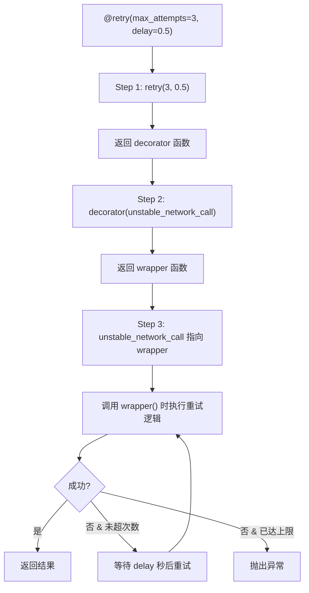
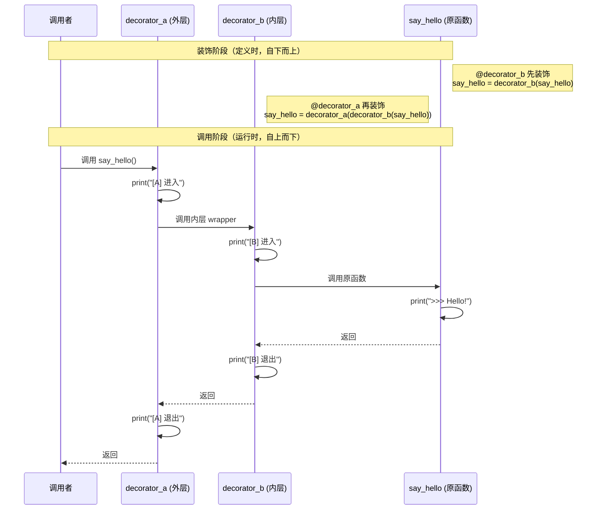

# 装饰器进阶

装饰器是 Python 中最优雅的语法特性之一。它允许你在不修改原函数代码的前提下，为函数增加额外的行为。本文将从闭包原理出发，逐步深入到带参装饰器、类装饰器、多装饰器叠加等高级话题，帮助你彻底掌握这一元编程利器。

## 1. 装饰器的本质

### 1.1 函数是一等公民

在 Python 中，函数是**一等公民**（First-Class Citizen）。这意味着函数可以像普通变量一样被赋值、作为参数传递、以及作为返回值返回。

```python
# Python 3.10+
def greet(name: str) -> str:
    return f"Hello, {name}!"

# 函数可以赋值给变量
say_hello = greet
print(say_hello("World"))  # Hello, World!

# 函数可以作为参数传递
def execute(func, arg):
    return func(arg)

print(execute(greet, "Alice"))  # Hello, Alice!

# 函数可以作为返回值
def get_greeter():
    return greet

greeter = get_greeter()
print(greeter("Bob"))  # Hello, Bob!
```

### 1.2 闭包概念回顾

**闭包**（Closure）是指一个函数记住了其外部作用域中的变量，即使外部函数已经执行完毕。这是理解装饰器的关键前提。

```python
def make_multiplier(factor: int):
    """返回一个将输入乘以 factor 的函数"""
    def multiplier(x: int) -> int:
        return x * factor  # factor 来自外部作用域
    return multiplier

double = make_multiplier(2)
triple = make_multiplier(3)

print(double(5))   # 10
print(triple(5))   # 15

# 闭包"记住"了创建时的 factor 值
print(double.__closure__)  # (<cell at ...: int object at ...>,)
```

闭包的核心机制是：内部函数持有对外部变量（自由变量）的**引用**，而非值的拷贝。这意味着如果外部变量是可变的，内部函数能看到它的变化。

```python
def counter():
    count = 0
    def increment():
        nonlocal count
        count += 1
        return count
    return increment

c = counter()
print(c())  # 1
print(c())  # 2
print(c())  # 3
```

::: tip 闭包与装饰器的关系
装饰器本质上就是一个**接收函数作为参数、返回新函数**的闭包。理解了闭包，装饰器的原理就一目了然。
:::

## 2. 简单装饰器实现

### 2.1 手写装饰器

一个最基础的装饰器是一个接受函数、返回新函数的可调用对象。

```python
import time
from typing import Callable, Any

def timer(func: Callable) -> Callable:
    """一个简单的计时装饰器"""
    def wrapper(*args: Any, **kwargs: Any) -> Any:
        start = time.perf_counter()
        result = func(*args, **kwargs)
        elapsed = time.perf_counter() - start
        print(f"[timer] {func.__name__} 执行耗时: {elapsed:.4f}s")
        return result
    return wrapper

@timer
def compute_sum(n: int) -> int:
    return sum(range(n))

result = compute_sum(10_000_000)
print(f"结果: {result}")
```

### 2.2 @ 语法糖的工作机制

`@decorator` 语法糖在**定义时**就执行了装饰逻辑，而非调用时。以下两种写法完全等价：

```python
# 写法一：使用 @ 语法糖
@timer
def slow_function():
    time.sleep(0.5)

# 写法二：手动装饰（完全等价）
def slow_function():
    time.sleep(0.5)
slow_function = timer(slow_function)
```

关键理解点：

- `@timer` 在函数**定义完成时**立即执行 `timer(slow_function)`
- 此后 `slow_function` 这个名字指向的是 `wrapper`，而非原始函数
- 每次调用 `slow_function()` 实际执行的是 `wrapper()`

::: warning 注意
装饰器在**模块加载时**就执行了，而不是在函数第一次被调用时。如果你在装饰器中做了耗时操作（如连接数据库），它会在 import 时就发生。
:::

## 3. 带参数装饰器

当装饰器本身需要参数时，需要在外面再包一层函数，形成**三层嵌套**结构。

```python
import time
import functools
from typing import Callable, Any

def retry(max_attempts: int = 3, delay: float = 1.0):
    """带参数的重试装饰器

    Args:
        max_attempts: 最大重试次数
        delay: 每次重试之间的等待秒数
    """
    def decorator(func: Callable) -> Callable:
        @functools.wraps(func)
        def wrapper(*args: Any, **kwargs: Any) -> Any:
            import time as _time
            last_exception = None
            for attempt in range(1, max_attempts + 1):
                try:
                    return func(*args, **kwargs)
                except Exception as e:
                    last_exception = e
                    if attempt < max_attempts:
                        print(
                            f"[retry] {func.__name__} 第{attempt}次失败: {e}, "
                            f"等待{delay}s后重试..."
                        )
                        _time.sleep(delay)
            raise last_exception  # type: ignore
        return wrapper
    return decorator

@retry(max_attempts=3, delay=0.5)
def unstable_network_call(url: str) -> str:
    import random
    if random.random() < 0.7:
        raise ConnectionError("网络不稳定")
    return f"成功获取 {url}"

# 调用
try:
    result = unstable_network_call("https://api.example.com/data")
    print(result)
except ConnectionError:
    print("所有重试均失败")
```

### 3.1 三层嵌套的调用链

带参数装饰器的三层结构如下：



::: tip 记忆口诀
**"带参装饰器 = 装饰器工厂"**。最外层接收装饰器参数，中间层接收被装饰函数，最内层接收调用参数。三层各司其职，缺一不可。
:::

## 4. 类装饰器

除了函数装饰器，Python 还支持使用类来实现装饰器。类装饰器依赖 `__call__` 方法。

### 4.1 无参数类装饰器

```python
import time
from typing import Callable, Any

class Timer:
    """使用类实现的计时装饰器"""
    def __init__(self, func: Callable):
        self.func = func

    def __call__(self, *args: Any, **kwargs: Any) -> Any:
        start = time.perf_counter()
        result = self.func(*args, **kwargs)
        elapsed = time.perf_counter() - start
        print(f"[Timer] {self.func.__name__} 耗时: {elapsed:.4f}s")
        return result

@Timer
def heavy_computation(n: int) -> int:
    return sum(i * i for i in range(n))

print(heavy_computation(1_000_000))
```

### 4.2 带参数类装饰器

```python
import time
from typing import Callable, Any

class Retry:
    """带参数的类装饰器 —— 重试机制"""
    def __init__(self, max_attempts: int = 3, delay: float = 1.0):
        self.max_attempts = max_attempts
        self.delay = delay

    def __call__(self, func: Callable) -> Callable:
        def wrapper(*args: Any, **kwargs: Any) -> Any:
            last_exc = None
            for attempt in range(1, self.max_attempts + 1):
                try:
                    return func(*args, **kwargs)
                except Exception as e:
                    last_exc = e
                    if attempt < self.max_attempts:
                        print(f"[Retry] 第{attempt}次失败, 等待{self.delay}s")
                        time.sleep(self.delay)
            raise last_exc  # type: ignore
        return wrapper

@Retry(max_attempts=5, delay=2.0)
def fetch_data(api_url: str) -> dict:
    import random
    if random.random() < 0.8:
        raise TimeoutError("请求超时")
    return {"status": "ok", "url": api_url}
```

::: tip 函数装饰器 vs 类装饰器
- **函数装饰器**：简洁直观，适合简单逻辑。利用闭包保存状态。
- **类装饰器**：适合复杂逻辑，可以利用类的继承、方法拆分等特性。状态保存在实例属性中，更加显式。
:::

## 5. functools.wraps 的重要性

使用装饰器后，原函数的元数据（`__name__`、`__doc__`、`__module__` 等）会丢失，被 `wrapper` 的元数据覆盖。`functools.wraps` 可以解决这个问题。

### 5.1 不加 wraps 的后果

```python
def bad_decorator(func):
    def wrapper(*args, **kwargs):
        """这是 wrapper 的文档"""
        return func(*args, **kwargs)
    return wrapper

@bad_decorator
def important_function():
    """这是重要函数的文档"""
    pass

print(important_function.__name__)  # wrapper  ❌ 丢失了原名
print(important_function.__doc__)   # 这是 wrapper 的文档  ❌ 丢失了原文档
```

### 5.2 使用 wraps 修复

```python
import functools

def good_decorator(func):
    @functools.wraps(func)
    def wrapper(*args, **kwargs):
        """这是 wrapper 的文档"""
        return func(*args, **kwargs)
    return wrapper

@good_decorator
def important_function():
    """这是重要函数的文档"""
    pass

print(important_function.__name__)  # important_function  ✅
print(important_function.__doc__)   # 这是重要函数的文档  ✅
```

### 5.3 wraps 保留的元数据

`functools.wraps` 会将以下属性从原函数复制到 wrapper：

| 属性 | 说明 |
|------|------|
| `__name__` | 函数名 |
| `__qualname__` | 限定名称 |
| `__doc__` | 文档字符串 |
| `__module__` | 所属模块 |
| `__dict__` | 属性字典 |
| `__annotations__` | 类型注解 |
| `__wrapped__` | 指向原始函数的引用 |

::: danger 永远使用 @wraps
**任何自定义装饰器都应该使用 `@functools.wraps(func)` 装饰内部 wrapper 函数。** 这不仅是为了调试友好，更是为了兼容那些依赖函数元数据的工具（如 Sphinx 文档生成器、IDE 智能提示、pytest 测试发现等）。
:::

## 6. 多装饰器叠加顺序

当多个装饰器叠加在同一个函数上时，执行顺序遵循**"洋葱模型"**：从下到上装饰，从上到下执行。

```python
import functools

def decorator_a(func):
    @functools.wraps(func)
    def wrapper(*args, **kwargs):
        print("[A] 进入")
        result = func(*args, **kwargs)
        print("[A] 退出")
        return result
    return wrapper

def decorator_b(func):
    @functools.wraps(func)
    def wrapper(*args, **kwargs):
        print("[B] 进入")
        result = func(*args, **kwargs)
        print("[B] 退出")
        return result
    return wrapper

@decorator_a
@decorator_b
def say_hello():
    print("  >>> Hello!")

say_hello()

# 输出:
# [A] 进入
# [B] 进入
#   >>> Hello!
# [B] 退出
# [A] 退出
```

### 6.1 执行顺序时序图



::: tip 记忆技巧
装饰顺序：**离函数越近，越先装饰**（从下往上读）。执行顺序：**离函数越近，越靠近原函数**（洋葱从外到内再到外）。
:::

## 7. 内置装饰器原理

Python 内置了三个与类相关的装饰器，它们通过**描述符协议**实现。

### 7.1 @staticmethod

静态方法不会自动传递 `self` 或 `cls`，本质上就是一个普通函数，只是放在了类的命名空间中。

```python
class MathUtils:
    @staticmethod
    def add(a: int, b: int) -> int:
        return a + b

# 可以通过类或实例调用
print(MathUtils.add(3, 5))       # 8
print(MathUtils().add(3, 5))     # 8
```

原理：`staticmethod` 是一个描述符，其 `__get__` 方法直接返回被包装的函数，不绑定任何对象。

### 7.2 @classmethod

类方法自动将**类本身**作为第一个参数传入（约定命名为 `cls`）。

```python
class Animal:
    species_count: dict[str, int] = {}

    def __init__(self, species: str):
        self.species = species
        Animal.species_count[species] = Animal.species_count.get(species, 0) + 1

    @classmethod
    def get_count(cls, species: str) -> int:
        return cls.species_count.get(species, 0)

    @classmethod
    def from_csv(cls, csv_line: str) -> "Animal":
        """工厂方法：从 CSV 行创建实例"""
        species = csv_line.strip().split(",")[0]
        return cls(species)

dog = Animal.from_csv("dog,4,棕色")
print(Animal.get_count("dog"))  # 1
```

原理：`classmethod` 描述符的 `__get__` 方法会将类绑定到函数的第一个参数。

### 7.3 @property

`@property` 将方法调用伪装成属性访问，配合 `@<name>.setter` 和 `@<name>.deleter` 实现完整的属性管理。

```python
class Temperature:
    def __init__(self, celsius: float):
        self._celsius = celsius

    @property
    def celsius(self) -> float:
        """获取摄氏温度"""
        return self._celsius

    @celsius.setter
    def celsius(self, value: float):
        """设置摄氏温度，带验证"""
        if value < -273.15:
            raise ValueError("温度不能低于绝对零度 (-273.15°C)")
        self._celsius = value

    @property
    def fahrenheit(self) -> float:
        """华氏温度（只读计算属性）"""
        return self._celsius * 9 / 5 + 32

t = Temperature(25)
print(t.celsius)      # 25       —— 像属性一样访问
print(t.fahrenheit)   # 77.0     —— 计算属性
t.celsius = 100       # 调用 setter
# t.fahrenheit = 200  # AttributeError: 没有 setter
```

::: tip 三个内置装饰器的选择
| 场景 | 使用 |
|------|------|
| 方法不需要访问实例或类 | `@staticmethod` |
| 方法需要访问类属性或作为工厂方法 | `@classmethod` |
| 需要属性验证、计算属性、懒加载 | `@property` |
:::

## 8. 实用装饰器模式

### 8.1 LRU 缓存

```python
from functools import lru_cache
import time

@lru_cache(maxsize=128)
def fibonacci(n: int) -> int:
    """计算斐波那契数（带缓存）"""
    if n < 2:
        return n
    return fibonacci(n - 1) + fibonacci(n - 2)

start = time.perf_counter()
print(fibonacci(200))
print(f"耗时: {time.perf_counter() - start:.6f}s")
# 没有缓存时计算 fibonacci(200) 几乎不可能完成
# 有了 LRU 缓存，瞬间完成
```

### 8.2 重试装饰器

```python
import functools
import time
from typing import Callable, Type, Any

def retry_on_exception(
    max_retries: int = 3,
    delay: float = 1.0,
    backoff: float = 2.0,
    exceptions: tuple[Type[Exception], ...] = (Exception,)
):
    """指数退避重试装饰器"""
    def decorator(func: Callable) -> Callable:
        @functools.wraps(func)
        def wrapper(*args: Any, **kwargs: Any) -> Any:
            current_delay = delay
            for attempt in range(max_retries + 1):
                try:
                    return func(*args, **kwargs)
                except exceptions as e:
                    if attempt == max_retries:
                        raise
                    print(f"[重试] {func.__name__} 失败 ({e}), "
                          f"{current_delay}s 后第 {attempt + 1} 次重试")
                    time.sleep(current_delay)
                    current_delay *= backoff
            return None
        return wrapper
    return decorator

@retry_on_exception(max_retries=3, delay=0.5, backoff=2.0,
                    exceptions=(ConnectionError, TimeoutError))
def api_call(endpoint: str) -> dict:
    import random
    if random.random() < 0.6:
        raise ConnectionError("网络错误")
    return {"data": f"来自 {endpoint} 的响应"}
```

### 8.3 计时装饰器

```python
import functools
import time
from typing import Callable, Any

def timed(logger=None):
    """可配置日志输出的计时装饰器"""
    def decorator(func: Callable) -> Callable:
        @functools.wraps(func)
        def wrapper(*args: Any, **kwargs: Any) -> Any:
            start = time.perf_counter_ns()
            result = func(*args, **kwargs)
            elapsed_ns = time.perf_counter_ns() - start
            elapsed_ms = elapsed_ns / 1_000_000
            msg = f"[计时] {func.__name__} 耗时: {elapsed_ms:.2f}ms"
            if logger:
                logger.info(msg)
            else:
                print(msg)
            return result
        return wrapper
    return decorator

@timed()
def process_data(items: list[int]) -> int:
    return sum(x * x for x in items)

process_data(range(100_000))
```

### 8.4 权限校验装饰器

```python
import functools
from typing import Callable, Any

# 模拟用户权限系统
class User:
    def __init__(self, name: str, permissions: set[str]):
        self.name = name
        self.permissions = permissions

_current_user: User | None = None

def require_permission(permission: str):
    """权限校验装饰器"""
    def decorator(func: Callable) -> Callable:
        @functools.wraps(func)
        def wrapper(*args: Any, **kwargs: Any) -> Any:
            if _current_user is None:
                raise PermissionError("未登录用户")
            if permission not in _current_user.permissions:
                raise PermissionError(
                    f"用户 {_current_user.name} 缺少权限: {permission}"
                )
            return func(*args, **kwargs)
        return wrapper
    return decorator

@require_permission("admin")
def delete_user(user_id: int):
    print(f"用户 {user_id} 已被删除")

# 测试
_current_user = User("Alice", {"read", "write"})
# delete_user(42)  # PermissionError: 用户 Alice 缺少权限: admin

_current_user = User("Bob", {"admin", "read", "write"})
delete_user(42)  # 用户 42 已被删除
```

### 8.5 单例模式装饰器

```python
import functools
from typing import Type, TypeVar

T = TypeVar("T")

def singleton(cls: Type[T]) -> Type[T]:
    """将类变为单例模式"""
    instances: dict[Type, object] = {}

    @functools.wraps(cls)
    def get_instance(*args, **kwargs):
        if cls not in instances:
            instances[cls] = cls(*args, **kwargs)
        return instances[cls]

    return get_instance  # type: ignore

@singleton
class DatabaseConnection:
    def __init__(self, host: str = "localhost"):
        self.host = host
        print(f"创建数据库连接: {host}")

db1 = DatabaseConnection("db.example.com")
db2 = DatabaseConnection("another.example.com")
print(db1 is db2)  # True —— 同一个实例
print(db1.host)    # db.example.com —— 只有第一次的参数生效
```

## 9. 常见陷阱

| 陷阱 | 问题描述 | 解决方案 |
|------|----------|----------|
| **忘记 @wraps** | 被装饰函数的 `__name__`、`__doc__` 等元数据丢失 | 始终在 wrapper 上使用 `@functools.wraps(func)` |
| **装饰器在定义时执行** | 装饰器中的初始化代码在模块加载时就运行，而非首次调用时 | 将初始化逻辑放在 wrapper 内部 |
| **多装饰器顺序混淆** | 误以为从上到下执行装饰逻辑 | 记住"洋葱模型"：从下到上装饰，从上到下执行 |
| **带参装饰器括号遗漏** | 写 `@retry` 而非 `@retry()` 导致参数传递错误 | 无参数时也需要括号（如果最外层需要零参数） |
| **闭包变量绑定延迟** | 循环中创建装饰器时，闭包捕获的是变量引用而非值 | 使用 `functools.partial` 或默认参数立即绑定 |
| **装饰器返回 None** | wrapper 中忘记 `return result`，导致被装饰函数总是返回 None | 确保 wrapper 中正确返回原函数的返回值 |
| **类型提示丢失** | 装饰后函数签名变为 `(*args, **kwargs)`，IDE 无法推断参数类型 | 使用 `ParamSpec` 和 `TypeVar` 保留类型签名（Python 3.10+） |
| **类方法装饰器顺序** | `@classmethod` / `@staticmethod` 必须在最外层（最上面） | 自定义装饰器放在内置装饰器**之下** |

::: danger 闭包变量绑定陷阱
这是最常见的隐蔽 bug。看下面的例子：

```python
def create_decorators():
    decorators = []
    for i in range(3):
        def decorator(func):
            def wrapper(*args, **kwargs):
                print(f"Decorator {i}")  # i 是闭包变量
                return func(*args, **kwargs)
            return wrapper
        decorators.append(decorator)
    return decorators

# 所有 decorator 都打印 "Decorator 2" —— 它们引用的是同一个 i
```

修复方法：使用默认参数立即绑定值。

```python
def decorator(func, i=i):  # 默认参数在定义时求值
    ...
```
:::

## 10. 最佳实践

### 10.1 始终使用 @functools.wraps

这是装饰器开发的**黄金法则**。它不仅保留元数据，还设置了 `__wrapped__` 属性，允许通过它访问原始函数。

```python
import functools

def my_decorator(func):
    @functools.wraps(func)
    def wrapper(*args, **kwargs):
        return func(*args, **kwargs)
    return wrapper

# 可以通过 __wrapped__ 访问原始函数
@my_decorator
def original():
    pass

assert original.__wrapped__ is not None  # 可以获取原始函数
```

### 10.2 使用 ParamSpec 保留类型签名

Python 3.10 引入的 `ParamSpec` 可以让装饰器完美保留被装饰函数的类型签名。

```python
from typing import TypeVar, ParamSpec, Callable

P = ParamSpec("P")
R = TypeVar("R")

def typed_decorator(func: Callable[P, R]) -> Callable[P, R]:
    @functools.wraps(func)
    def wrapper(*args: P.args, **kwargs: P.kwargs) -> R:
        print(f"调用 {func.__name__}")
        return func(*args, **kwargs)
    return wrapper

@typed_decorator
def add(a: int, b: int) -> int:
    return a + b

# IDE 可以正确推断参数类型和返回值类型
result: int = add(1, 2)
```

### 10.3 考虑使用装饰器库

对于常见需求，优先使用标准库或成熟第三方库提供的装饰器：

- `functools.lru_cache` / `functools.cache`：缓存
- `functools.singledispatch`：泛型函数
- `contextlib.contextmanager`：上下文管理器装饰器
- `dataclasses.dataclass`：数据类装饰器

### 10.4 装饰器应该是无副作用的

装饰器的初始化代码（wrapper 之外的代码）在模块加载时执行，应该只做轻量级操作。避免在装饰器中进行网络请求、文件 I/O 等耗时操作。

```python
# ❌ 不好的做法
def bad_cache_decorator(func):
    cache = load_cache_from_database()  # 模块加载时就查询数据库！
    def wrapper(*args, **kwargs):
        ...
    return wrapper

# ✅ 好的做法
def good_cache_decorator(func):
    cache = {}  # 轻量初始化
    def wrapper(*args, **kwargs):
        if not cache:
            cache.update(load_cache_from_database())  # 延迟加载
        ...
    return wrapper
```

### 10.5 为装饰器编写单元测试

装饰器也是代码，同样需要测试。测试时可以通过 `__wrapped__` 访问原始函数来验证装饰器的行为。

```python
import functools

def timer(func):
    # 前提：wrapper 使用了 @functools.wraps，__wrapped__ 才会被设置
    @functools.wraps(func)
    def wrapper(*args, **kwargs):
        return func(*args, **kwargs)
    return wrapper

def test_timer_decorator():
    @timer
    def fast_func():
        return 42

    result = fast_func()
    assert result == 42
    # 验证 __wrapped__ 指向原始函数
    assert fast_func.__wrapped__() == 42
```

## 总结

装饰器是 Python 元编程的核心工具，掌握它意味着你能够以声明式的方式为代码添加横切关注点（cross-cutting concerns）。从简单的计时、日志，到复杂的权限校验、缓存、重试机制，装饰器都能以优雅的方式实现。

关键要点回顾：

1. **装饰器本质是闭包**：接收函数，返回函数
2. **@语法糖在定义时执行**：等价于 `func = decorator(func)`
3. **带参装饰器是三层嵌套**：工厂函数 -> 装饰器 -> wrapper
4. **多装饰器遵循洋葱模型**：从下到上装饰，从上到下执行
5. **永远使用 @functools.wraps**：保留函数元数据
6. **善用 ParamSpec**：保留类型签名，提升开发体验

## 版本差异（类型注解 → Python 3.13/3.14）

| 特性 | 本文编写时 | Python 3.13/3.14 |
|------|-----------|------------------|
| 注解求值 | 运行时立即求值 | PEP 649/749（3.14）：延迟求值，类型注解不再在定义时执行 |
| 类型别名 | `TypeAlias` / 赋值 | 3.12 引入 `type X = ...` 语句 |
| 联合类型 | `Union[X, Y]` | 3.10+ 使用 `X \| Y` 语法 |
| `Self` 类型 | 手动标注 | 3.11+ `typing.Self` |
| 泛型语法 | `TypeVar` 冗长语法 | 3.12 PEP 695 类型参数语法 `def f[T](...)` |

> 本文讲解的 typing 核心概念在 3.14 中成立；新项目建议使用 3.12+ 的 `type` 语句与 PEP 695 语法，注解延迟求值让前向引用更简单。
