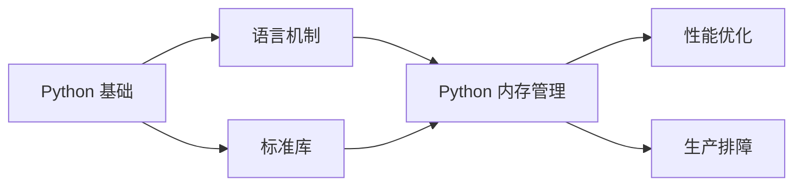
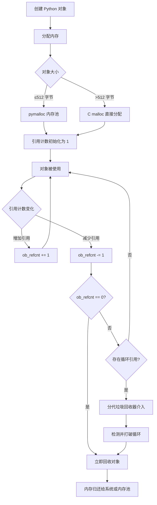
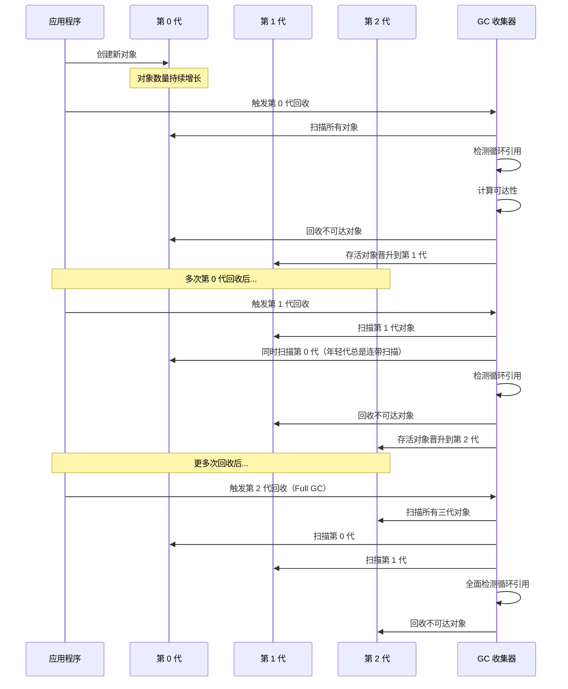

# Python 内存管理

## 概述

### 是什么

Python 内存管理是 CPython 解释器自动管理对象分配与释放的一整套机制，核心由**引用计数**和**分代垃圾回收**两部分协同工作。开发者通常无需手动 `malloc/free`，但理解这套机制是写出内存高效、无泄漏代码的前提。

### 为什么

Python 开发者日常会遇到三类内存问题：程序内存持续增长最终 OOM、循环引用导致对象无法释放、大对象占用过多内存拖慢性能。这些问题在本地小数据量测试时往往不会暴露，但一旦进入生产环境处理百万级数据或长时间运行的服务，就会集中爆发。理解内存管理机制，意味着你能够主动预防而非被动救火。

### 怎么做

本文将从引用计数的底层原理出发，逐步深入到分代垃圾回收的工作流程、对象生命周期管理、内存优化技巧、分析工具使用，最后覆盖常见泄漏场景的排查方法。读完本文后，你应当能够独立诊断和解决项目中常见的内存问题。

### 知识定位



::: info 阅读建议
本文假设你已熟悉 Python 的基本数据类型、函数与类的基础用法。如果对 Mermaid 图中的前置节点不熟悉，建议先补全相关基础再进入正文。
:::

## 核心内容

### 概念层：内存管理全景

CPython 的内存管理可以理解为三层架构：

1. **对象分配层**：通过 `pymalloc` 内存分配器管理小块内存（≤512 字节），大块内存直接交给 C 语言的 `malloc`。
2. **引用计数层**：每个 Python 对象头部存储一个 `ob_refcnt` 字段，记录当前有多少个引用指向该对象。当引用计数归零时，对象立即被销毁，内存被回收。
3. **垃圾回收层**：专门处理引用计数无法解决的**循环引用**问题，采用分代回收策略。



::: tip 关键认知
引用计数是**实时**的，垃圾回收是**周期性**的。绝大多数对象通过引用计数机制被立即清理，只有形成循环引用的对象才需要垃圾回收器介入。这意味着 Python 的内存释放行为是**确定性的**——对象在失去最后一个引用时立即销毁，这与 Java、Go 等纯 GC 语言的行为有本质区别。
:::

### 引用计数机制

#### 引用计数的增减场景

每个 Python 对象都有一个引用计数器，以下操作会改变它：

**引用计数增加的场景：**

- 赋值操作：`a = obj`
- 函数传参：`func(obj)`
- 添加到容器：`lst.append(obj)`、`dct[key] = obj`
- 属性赋值：`self.attr = obj`

**引用计数减少的场景：**

- 变量离开作用域（函数返回、`del` 语句）
- 变量被重新赋值：`a = other_obj`（原对象的引用减 1）
- 从容器中移除：`lst.remove(obj)`、`del dct[key]`
- 容器本身被销毁

#### 使用 sys.getrefcount() 观测

```python
# Python 3.10+
import sys

# 创建一个列表对象
data = [1, 2, 3]
print(sys.getrefcount(data))  # 输出: 2
# 为什么是 2？因为 getrefcount 的参数本身也是一个临时引用

# 增加引用
ref = data
print(sys.getrefcount(data))  # 输出: 3

# 放入容器
container = [data]
print(sys.getrefcount(data))  # 输出: 4

# 减少引用
del ref
print(sys.getrefcount(data))  # 输出: 3

container.clear()
print(sys.getrefcount(data))  # 输出: 2
```

::: warning 注意
`sys.getrefcount()` 的返回值总是比"直觉"多 1，因为它自身的参数传递产生了一个临时引用。在判断引用计数时，始终减去这个 1。
:::

#### 引用计数的性能代价

引用计数是高效且确定性的，但并非零开销。每次赋值、传参、容器操作都会触发引用计数的增减指令。对于数值密集型计算，这个开销可能成为瓶颈。这也是为什么 NumPy 等科学计算库使用自己的内存管理策略，而不是完全依赖 Python 原生的引用计数。

### 循环引用问题与分代垃圾回收

#### 循环引用的产生

当两个或多个对象互相持有对方的引用时，即使外部不再需要它们，各自的引用计数也永远不会归零：

```python
# Python 3.10+
class Node:
    def __init__(self, name: str) -> None:
        self.name = name
        self.next: Node | None = None
        self.prev: Node | None = None

# 创建循环引用
a = Node("A")
b = Node("B")
a.next = b
b.prev = a

# 删除外部引用
del a
del b
# 此时 a 和 b 互相引用，引用计数各为 1，不会归零
# 但分代垃圾回收器会在后续扫描中检测并回收它们
```

#### 分代回收策略

CPython 的垃圾回收器将所有对象分为三代（Generation 0、1、2），基于一个经验假设：**大多数对象都是短命的**。

- **第 0 代**：新创建的对象。被回收的频率最高。
- **第 1 代**：在第 0 代回收中存活下来的对象。
- **第 2 代**：长期存活的对象。被回收的频率最低。



#### gc 模块的使用

```python
# Python 3.10+
import gc
import sys

# 查看各代阈值
print(gc.get_threshold())  # 典型输出: (700, 10, 10)
# 含义: 第 0 代对象数超过 700 时触发 0 代回收
#       每 10 次 0 代回收触发 1 次 1 代回收
#       每 10 次 1 代回收触发 1 次 2 代回收

# 查看各代对象数量
print(gc.get_count())  # 例如: (345, 5, 1)

# 手动触发回收
collected = gc.collect()  # 默认执行第 2 代（全量）回收
print(f"回收了 {collected} 个对象")

# 查看不可达但无法释放的对象（Python 3.4+ 后通常为空列表）
print(gc.garbage)

# 调整阈值（谨慎使用）
gc.set_threshold(1000, 15, 15)

# 禁用/启用自动垃圾回收
gc.disable()
# ... 执行内存敏感操作 ...
gc.enable()
```

::: danger 特别注意
`gc.disable()` 会完全关闭自动垃圾回收，循环引用将不再被自动清理。除非你确切知道自己在做什么（例如在性能基准测试中排除 GC 干扰），否则不要在生产代码中禁用 GC。
:::

### 对象生命周期与 __del__ 方法

#### 对象的完整生命周期

一个 Python 对象的生命周期分为四个阶段：

1. **创建**：调用 `__new__` 分配内存，然后调用 `__init__` 初始化。
2. **使用**：对象被引用、修改、传递。
3. **销毁准备**：引用计数归零时，调用 `__del__`（如果定义了）。
4. **内存回收**：对象占用的内存被归还给内存池或操作系统。

```python
# Python 3.10+
import sys


class LifecycleDemo:
    def __new__(cls, name: str) -> "LifecycleDemo":
        print(f"[__new__] 为 {name} 分配内存")
        instance = super().__new__(cls)
        return instance

    def __init__(self, name: str) -> None:
        print(f"[__init__] 初始化 {name}")
        self.name = name

    def __del__(self) -> None:
        print(f"[__del__] {self.name} 被销毁")


obj = LifecycleDemo("demo")
# 输出:
# [__new__] 为 demo 分配内存
# [__init__] 初始化 demo

del obj
# 输出: [__del__] demo 被销毁
```

#### __del__ 的陷阱

`__del__` 方法看似是析构函数，但它的行为与 C++ 的析构函数有本质区别：

- **调用时机不确定**：解释器退出阶段、或对象处于复杂引用图中时，`__del__` 的调用时机难以保证（CPython 会尽量调用，但语言规范不提供保证）。
- **循环引用中的行为特殊**：自 Python 3.4（PEP 442）起，循环引用中定义了 `__del__` 的对象可以被分代 GC 正常回收并调用 `__del__`，`gc.garbage` 通常保持为空；但 `__del__` 被调用的顺序与时机不可控，清理逻辑容易踩坑。
- **异常被忽略**：`__del__` 中抛出的异常不会被传播，只会打印到 `sys.stderr`。

```python
# Python 3.10+
import gc


class BadPattern:
    def __init__(self, name: str) -> None:
        self.name = name

    def __del__(self) -> None:
        # 危险：如果 self.other 已被回收，这里可能出错
        print(f"清理 {self.name}, 关联: {self.other.name}")


a = BadPattern("A")
b = BadPattern("B")
a.other = b
b.other = a  # 循环引用

del a, b
gc.collect()
print(gc.garbage)  # Python 3.4+（PEP 442）：__del__ 会被调用，对象可被回收，此列表通常为 []
```

::: warning 最佳实践
优先使用上下文管理器（`with` 语句）和 `try/finally` 来管理资源，而不是依赖 `__del__`。`__del__` 仅适合作为最后的兜底方案。
:::

### 内存优化技巧

#### __slots__：减少实例内存开销

默认情况下，每个 Python 类的实例使用 `__dict__` 字典存储属性，这带来了灵活性但也造成了内存开销——每个实例的 `__dict__` 本身就是一个字典对象，占用额外内存。`__slots__` 通过预声明属性集合，用紧凑的 C 数组替代 `__dict__`，显著减少内存占用。

```python
# Python 3.10+
import sys


class RegularPoint:
    def __init__(self, x: float, y: float) -> None:
        self.x = x
        self.y = y


class SlottedPoint:
    __slots__ = ("x", "y")

    def __init__(self, x: float, y: float) -> None:
        self.x = x
        self.y = y


rp = RegularPoint(1.0, 2.0)
sp = SlottedPoint(1.0, 2.0)

print(sys.getsizeof(rp))           # 实例对象本身约 48–56 字节（随版本而异）
print(sys.getsizeof(rp.__dict__))  # 实例字典额外占用 104–296 字节（随版本而异）
print(sys.getsizeof(sp))           # 约 48 字节，且没有 __dict__ 开销

# 注：3.12 起实例字典惰性创建、对象头部更紧凑，具体数值请以实际运行结果为准；
# 属性越多，__slots__ 的节省幅度越大。

# 大规模创建时的差异
N = 1_000_000
regular_mem = N * (sys.getsizeof(rp) + sys.getsizeof(rp.__dict__))
slotted_mem = N * sys.getsizeof(sp)
print(f"常规类 {N} 个实例约占用: {regular_mem / 1024 / 1024:.1f} MB")
print(f"__slots__ 类 {N} 个实例约占用: {slotted_mem / 1024 / 1024:.1f} MB")
```

::: tip 使用建议
`__slots__` 最适合以下场景：需要创建大量实例（如数据类、坐标点、事件对象），且属性集合在定义时就能确定。代价是失去 `__dict__` 的动态属性能力，且继承时需要额外注意。
:::

#### 弱引用（weakref）

弱引用是一种不增加引用计数的引用方式，允许你引用一个对象但不阻止它被垃圾回收。典型应用场景包括缓存、观察者模式、双向关联中打破循环引用。

```python
# Python 3.10+
import weakref
import gc


class Cache:
    """使用弱引用的简单缓存"""
    def __init__(self) -> None:
        self._cache: weakref.WeakValueDictionary[int, object] = (
            weakref.WeakValueDictionary()
        )

    def set(self, key: int, value: object) -> None:
        self._cache[key] = value

    def get(self, key: int) -> object | None:
        return self._cache.get(key)


class ExpensiveObject:
    def __init__(self, data: str) -> None:
        self.data = data * 10000  # 模拟大对象


cache = Cache()
obj = ExpensiveObject("hello")
cache.set(1, obj)

print(cache.get(1))  # 可以获取到

del obj  # 删除唯一强引用
gc.collect()

print(cache.get(1))  # None，对象已被自动清理
```

**弱引用类型速查：**

| 类型 | 用途 |
| --- | --- |
| `weakref.ref` | 单个对象的弱引用 |
| `weakref.WeakKeyDictionary` | 键为弱引用的字典 |
| `weakref.WeakValueDictionary` | 值为弱引用的字典 |
| `weakref.WeakSet` | 元素为弱引用的集合 |
| `weakref.finalize` | 对象被回收时执行回调（比 `__del__` 更安全） |

#### 对象池模式

对于频繁创建和销毁的对象，使用对象池可以减少内存分配和 GC 压力：

```python
# Python 3.10+
from collections import deque
from typing import TypeVar

T = TypeVar("T")


class ObjectPool:
    """通用对象池"""
    def __init__(self, factory, max_size: int = 100) -> None:
        self._pool: deque = deque()
        self._factory = factory
        self._max_size = max_size

    def acquire(self):
        if self._pool:
            return self._pool.pop()
        return self._factory()

    def release(self, obj) -> None:
        if len(self._pool) < self._max_size:
            self._pool.append(obj)
        # 超过最大容量时直接丢弃，让 GC 回收


# 使用示例：复用大缓冲区
import array
pool = ObjectPool(lambda: array.array("b", [0] * 4096), max_size=50)

buf = pool.acquire()
# ... 使用 buf ...
pool.release(buf)  # 归还以便复用
```

### 内存分析工具

#### sys.getsizeof()：基础内存测量

```python
# Python 3.10+
import sys

print(sys.getsizeof(42))           # 28 字节（小整数，64 位 CPython）
print(sys.getsizeof("hello"))      # 46 字节（3.12 移除 wstr 后；3.11 及更早为 54）
print(sys.getsizeof([]))           # 56 字节（空列表）
print(sys.getsizeof([1, 2, 3]))    # 88 字节（注意：只计算容器本身，不含元素；数值随版本略有差异）
```

::: warning 局限
`sys.getsizeof()` 只计算对象本身占用的内存，不包含其引用的子对象。要获取完整的内存占用，应使用 `sys.getsizeof(obj)` 加上递归遍历子对象，或直接使用 `pympler` 等第三方库。
:::

#### tracemalloc：追踪内存分配

`tracemalloc` 是 Python 3.4+ 标准库内置的内存追踪工具，可以记录每次内存分配的调用栈，是排查内存泄漏的首选工具。

```python
# Python 3.10+
import tracemalloc


def leak_simulation() -> None:
    """模拟内存泄漏：全局列表不断增长"""
    global _leaked
    _leaked.append("x" * 1024 * 1024)  # 每次追加 1MB


_leaked: list[str] = []

tracemalloc.start()

# 模拟多次操作
for i in range(10):
    leak_simulation()

# 获取当前内存快照
snapshot = tracemalloc.take_snapshot()

# 显示内存占用最高的 5 个文件
print("=== 内存占用 Top 5 ===")
for stat in snapshot.statistics("lineno")[:5]:
    print(stat)

# 比较两个快照
tracemalloc.clear_traces()
snapshot_before = tracemalloc.take_snapshot()
for i in range(5):
    leak_simulation()
snapshot_after = tracemalloc.take_snapshot()

print("\n=== 增量对比 ===")
for stat in snapshot_after.compare_to(snapshot_before, "lineno")[:3]:
    print(stat)

tracemalloc.stop()
```

#### memory_profiler：逐行内存分析

`memory_profiler` 是第三方库，可以逐行显示函数的内存使用情况：

```python
# Python 3.10+
# pip install memory-profiler

from memory_profiler import profile


@profile
def process_data() -> list[int]:
    """处理数据，观察每行内存变化"""
    data = [i for i in range(100_000)]        # 创建列表
    squared = [x ** 2 for x in data]          # 平方计算
    filtered = [x for x in squared if x > 50]  # 过滤
    return filtered


if __name__ == "__main__":
    process_data()
```

运行方式：`python -m memory_profiler script.py`

#### objgraph：可视化对象引用关系

`objgraph` 可以展示对象的引用关系图，对排查循环引用和内存泄漏非常有用：

```python
# Python 3.10+
# pip install objgraph
import objgraph

# 显示增长最快的对象类型
objgraph.show_growth(limit=5)

# 查找特定类型的对象并显示反向引用链
leaked_objects = objgraph.by_type("MyClass")
if leaked_objects:
    objgraph.show_backrefs(leaked_objects[0], max_depth=5, filename="backrefs.png")
```

### 常见内存泄漏场景与排查

#### 场景一：全局缓存无限增长

```python
# Python 3.10+
# 反模式：无界缓存
_cache: dict[str, object] = {}

def get_data(key: str) -> object:
    if key not in _cache:
        _cache[key] = expensive_computation(key)
    return _cache[key]
# 问题：_cache 永远不会清理，内存持续增长
```

**修复方案**：使用 LRU 缓存或带 TTL 的缓存。

```python
# Python 3.10+
from functools import lru_cache


@lru_cache(maxsize=256)  # 限制最大条目数
def get_data(key: str) -> object:
    return expensive_computation(key)
```

#### 场景二：未关闭的资源

```python
# Python 3.10+
# 反模式：忘记关闭文件/连接
def read_all_files(paths: list[str]) -> list[str]:
    results = []
    for path in paths:
        f = open(path)  # 忘记关闭
        results.append(f.read())
    return results
```

**修复方案**：使用上下文管理器。

```python
# Python 3.10+
from pathlib import Path

def read_all_files(paths: list[str]) -> list[str]:
    results: list[str] = []
    for path in paths:
        with open(path) as f:
            results.append(f.read())
    return results
```

#### 场景三：异常导致引用残留

```python
# Python 3.10+
# 反模式：异常时引用未被清理
def process() -> None:
    data = load_large_dataset()  # 加载大数据
    try:
        result = transform(data)
        save(result)
    except Exception:
        # data 仍然被 traceback 引用，无法释放
        raise
```

**修复方案**：在 finally 中显式清理。

```python
# Python 3.10+
def process() -> None:
    data = None
    try:
        data = load_large_dataset()
        result = transform(data)
        save(result)
    except Exception:
        raise
    finally:
        del data  # 显式释放引用
```

#### 场景四：循环引用 + `__del__`

如前面 `__del__` 陷阱部分所述，Python 3.4+ 的分代 GC 可以回收带有 `__del__` 的循环引用对象（PEP 442），但 `__del__` 的调用时机与顺序不可控，其中的清理逻辑可能访问到状态异常的关联对象。解决方案是使用 `weakref.ref` 打破循环，或使用 `weakref.finalize` 替代 `__del__`。

## 代码示例

::: tip Python 版本要求
本文示例基于 **Python 3.10+**，部分语法（如 `X | Y` 联合类型）在更低版本中不可用。`tracemalloc` 模块从 Python 3.4 开始可用。`sys.getrefcount()` 在所有 Python 版本中均可用。
:::

### 示例 1：检测循环引用

```python
# 文件名: detect_cycle.py
"""使用 gc 模块检测和打破循环引用"""
import gc
import sys


class TreeNode:
    def __init__(self, value: int) -> None:
        self.value = value
        self.parent: TreeNode | None = None
        self.children: list[TreeNode] = []


# 创建一棵树
root = TreeNode(1)
child = TreeNode(2)
root.children.append(child)
child.parent = root  # 形成了 parent<->child 的循环引用

# 删除外部引用
del root, child

# 手动触发 GC
collected = gc.collect()
print(f"回收了 {collected} 个对象")  # 期望输出: 回收了 2 个对象

# 验证：不可达对象已被清理
print(gc.garbage)  # 期望输出: []
```

### 示例 2：使用 tracemalloc 排查内存泄漏

```python
# 文件名: find_leak.py
"""使用 tracemalloc 定位内存泄漏源头"""
import tracemalloc
import time


class LeakyCache:
    """模拟一个会泄漏的缓存"""
    def __init__(self) -> None:
        self._data: dict[str, str] = {}

    def add(self, key: str, value: str) -> None:
        self._data[key] = value
        # BUG: 没有淘汰机制，缓存无限增长


def simulate() -> None:
    cache = LeakyCache()
    for i in range(100_000):
        cache.add(f"key_{i}", "x" * 1024)  # 每次约 1KB


tracemalloc.start()
snapshot_before = tracemalloc.take_snapshot()

simulate()

snapshot_after = tracemalloc.take_snapshot()

print("=== 内存增量 Top 5 ===")
for stat in snapshot_after.compare_to(snapshot_before, "lineno")[:5]:
    print(stat)
    # 期望输出: find_leak.py 中 LeakyCache.add 的行号会排在最前面

tracemalloc.stop()
```

## 常见陷阱

| 常见错误 | 正确做法 |
| --- | --- |
| 循环引用 + `__del__`（3.4+ 可被 GC 回收，但清理时机与顺序不可控） | 使用 `weakref.ref` 打破循环，或使用 `weakref.finalize` 替代 `__del__` |
| 认为 `del obj` 会立即释放内存（`del` 只删除引用，不保证立即回收） | 理解 `del` 减少引用计数，只有计数归零才触发回收；对于循环引用，依赖 GC 周期性扫描 |
| 大对象未及时释放（函数中创建大对象，异常时引用被 traceback 持有） | 在 `finally` 块中显式 `del` 大对象；或使用 `try/finally` 确保清理 |
| 全局列表/字典无限增长（作为缓存但从不清理） | 使用 `functools.lru_cache`、带 TTL 的缓存、或手动限制容量 |
| 在 `__del__` 中访问其他对象（被访问的对象可能已被回收） | 避免在 `__del__` 中访问外部对象；使用 `weakref.finalize` 注册清理回调 |
| 禁用 GC 后忘记重新启用（`gc.disable()` 后异常退出） | 使用 `try/finally` 包裹：`gc.disable(); try: ... finally: gc.enable()` |
| 使用 `sys.getsizeof()` 判断总内存占用（它只计算对象本身，不含子对象） | 使用 `pympler.asizeof()` 或递归遍历计算完整内存占用 |
| 忽略异常时的资源清理（文件句柄、socket 连接未关闭） | 使用 `with` 语句（上下文管理器）自动管理资源生命周期 |

::: danger 特别注意
循环引用 + `__del__` 的组合是 Python 内存管理中最隐蔽的陷阱之一。虽然 Python 3.4+（PEP 442）能够回收这类对象，但 `__del__` 的调用时机与顺序不可控，清理逻辑容易出错。在生产代码中，优先使用上下文管理器和 `weakref.finalize` 来管理清理逻辑。
:::

## 最佳实践

### 要做的

::: tip
**使用上下文管理器管理资源**：文件、网络连接、锁等资源应始终通过 `with` 语句管理，确保即使发生异常也能正确释放。
:::

::: tip
**为大量实例的类启用 `__slots__`**：当需要创建数十万甚至百万级别的实例时，`__slots__` 可以节省 30%-50% 的内存，同时提升属性访问速度。
:::

::: tip
**使用 `weakref` 打破循环引用**：在缓存、观察者模式、父子双向关联等场景中，将其中一个方向的引用改为弱引用，让 GC 能够正常工作。
:::

::: tip
**定期监控内存使用**：在长时间运行的服务中，使用 `tracemalloc` 定期生成内存快照，对比增量以发现潜在泄漏。结合 `memory_profiler` 对可疑函数进行逐行分析。
:::

::: tip
**设置合理的缓存淘汰策略**：所有缓存都应设置容量上限（`maxsize`）或过期时间（TTL），避免无限增长。
:::

### 避免的

::: warning
**避免依赖 `__del__` 进行关键资源清理**：`__del__` 的调用时机不确定，且循环引用时可能永远不会被调用。关键资源清理应使用 `with` 语句或显式的 `close()` 方法。
:::

::: warning
**避免在不知道后果的情况下调用 `gc.disable()`**：禁用 GC 后，循环引用将不再被自动回收，内存泄漏风险显著增加。
:::

::: warning
**避免在循环中创建大量临时大对象**：在循环内部频繁创建大对象（如大列表、大字符串）会导致内存碎片和 GC 压力。考虑使用生成器、对象池或批量处理。
:::

::: danger
**不要在生产代码中保留 `tracemalloc` 持续运行**：`tracemalloc` 本身会消耗大量内存来存储调用栈信息。仅在排查问题时临时启用，问题解决后立即关闭。
:::

## 术语表

| 术语 | 定义 |
| --- | --- |
| **引用计数** | CPython 中每个对象维护的计数器，记录当前有多少个引用指向该对象。计数归零时对象立即被销毁。 |
| **循环引用** | 两个或多个对象互相持有对方的引用，导致各自的引用计数永远不为零。需要垃圾回收器介入处理。 |
| **分代回收** | 将对象按存活时间分为三代（0、1、2），年轻代回收频率高，年老代回收频率低，基于"大多数对象短命"的经验假设。 |
| **pymalloc** | CPython 内置的内存分配器，专门管理 ≤512 字节的小块内存，通过内存池减少 `malloc` 调用开销。 |
| **弱引用** | 不增加引用计数的引用方式。通过 `weakref` 模块实现，常用于缓存和打破循环引用。 |
| **`__slots__`** | 类属性，用紧凑的 C 数组替代默认的 `__dict__` 字典存储实例属性，显著减少内存占用。 |
| **对象池** | 预创建一组可复用的对象，通过借还机制避免频繁创建和销毁，减少内存分配和 GC 压力。 |
| **tracemalloc** | Python 标准库模块，追踪内存分配调用栈，用于定位内存泄漏源头。 |
| **`gc.garbage`** | 垃圾回收器发现但无法释放的对象列表。Python 3.4+（PEP 442）后极少非空，历史上常见于定义了 `__del__` 的循环引用对象。 |
| **内存泄漏** | 程序中已不再需要的对象未能被回收，导致内存占用持续增长的现象。 |

::: info 参考
更多通用术语定义请参见《全局术语说明》（治理文档，已移出正文区）。
:::

## Python 3.11/3.12 内存管理改进

### Python 3.11 改进

- **更省内存的对象命名空间**：实例的命名空间字典改为惰性创建，且不同实例的字典键共享更充分，对象整体内存占用下降（bpo-45340、bpo-40116）。
- **更廉价的栈帧**：普通 Python 调用不再创建栈帧对象，仅在调试器或 `sys._getframe()`、`inspect.currentframe()` 等内省时按需创建，减少了内存分配开销。

### Python 3.12 改进

- **内联列表推导式**：列表推导式现在内联执行，不再创建独立的函数作用域，减少了临时对象的创建和引用计数操作。
- ** immortal objects（不朽对象）**：PEP 683 引入了不可变且永不回收的"不朽对象"概念，`None`、`True`、`False` 等单例对象不再需要引用计数操作，减少了全局解释器锁（GIL）的竞争。
- **更小的字符串对象**：PEP 623 移除了 Unicode 对象中的 `wstr`（及 `wstr_length`）成员，64 位平台上每个字符串对象减小 8–16 字节。

::: tip 实践建议
如果你的项目运行在 Python 3.12+，可以预期内存管理有约 5%-15% 的性能提升，尤其是在大量小对象创建和销毁的场景中。但不要因此忽视良好的内存管理实践——编译器优化不能替代合理的代码设计。
:::

## 延伸阅读

### 站内相关

- [类型注解](../../03-工程化与运维/01-工程化/02-类型注解) — 了解 `__slots__` 与 `dataclass(slots=True)` 在工程中的配合使用
- [依赖管理](../../03-工程化与运维/01-工程化/04-依赖管理) — 了解 `memory_profiler` 等第三方工具的正确安装与管理方式

### 外部权威资源

- [Python 官方文档 - gc 模块](https://docs.python.org/zh-cn/3/library/gc.html)
- [Python 官方文档 - weakref 模块](https://docs.python.org/zh-cn/3/library/weakref.html)
- [Python 官方文档 - tracemalloc 模块](https://docs.python.org/zh-cn/3/library/tracemalloc.html)
- [PEP 683 - Immortal Objects, Using a Fixed Refcount](https://peps.python.org/pep-0683/)
- [CPython 源码 - Objects/obmalloc.c](https://github.com/python/cpython/blob/main/Objects/obmalloc.c) — pymalloc 内存分配器实现
- [CPython 源码 - Modules/gcmodule.c](https://github.com/python/cpython/blob/main/Modules/gcmodule.c) — 分代垃圾回收器实现
- [The Garbage Collector - Python Developer's Guide](https://devguide.python.org/internals/garbage-collector/)

## 版本差异（类型注解 → Python 3.13/3.14）

| 特性 | 本文编写时 | Python 3.13/3.14 |
|------|-----------|------------------|
| 注解求值 | 运行时立即求值 | PEP 649/749（3.14）：延迟求值，类型注解不再在定义时执行 |
| 类型别名 | `TypeAlias` / 赋值 | 3.12 引入 `type X = ...` 语句 |
| 联合类型 | `Union[X, Y]` | 3.10+ 使用 `X \| Y` 语法 |
| `Self` 类型 | 手动标注 | 3.11+ `typing.Self` |
| 泛型语法 | `TypeVar` 冗长语法 | 3.12 PEP 695 类型参数语法 `def f[T](...)` |

> 本文讲解的 typing 核心概念在 3.14 中成立；新项目建议使用 3.12+ 的 `type` 语句与 PEP 695 语法，注解延迟求值让前向引用更简单。
