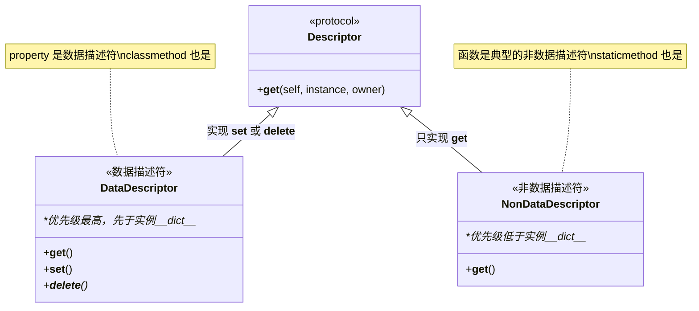
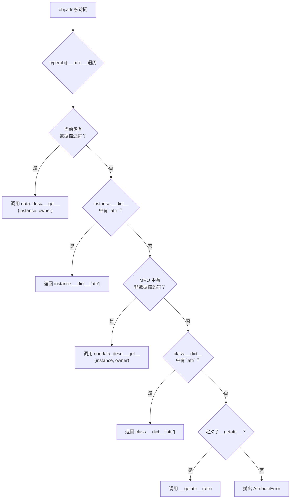
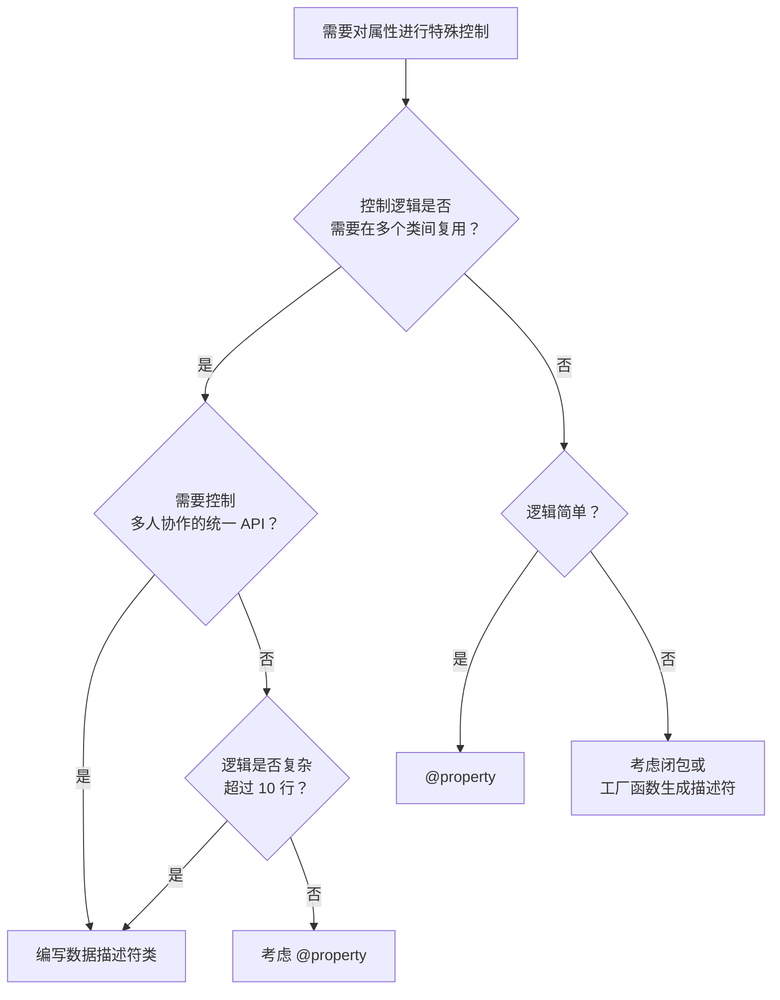

# 描述符与 property

描述符（Descriptor）是 Python 属性访问系统的基石。如果你使用过 `@property`、`@classmethod` 或 `@staticmethod`，你就已经间接使用过描述符。理解描述符不仅让你看清这些内置装饰器的工作原理，更是阅读 Django ORM、SQLAlchemy 等主流框架源码的必备知识。

::: tip 一句话概括
描述符是**实现了 `__get__`、`__set__` 或 `__delete__` 中至少一个方法的类**，它通过拦截属性访问来提供对数据与行为的精细控制。
:::

> 阅读提示
>
> - 如果你只想知道 `@property` 怎么用，请先阅读 [面向对象 - 封装小节](/docs/python/基础与入门/14-面向对象)
> - 如果你想**真正理解属性查找的优先级**、**编写可复用的类型校验逻辑**、**看懂 ORM 字段定义源码**，那么本文就是为你准备的
> - 建议阅读时间：35 分钟

## 快速导读

- **学习顺序建议**：描述符协议四方法 → 数据/非数据描述符区分 → 属性查找优先级 → property 原理 → 实战案例 → 框架应用
- **适用情景**：编写可复用的字段校验逻辑、阅读 ORM/表单框架源码、设计插件式 API
- **记忆口诀**：`__get__读取, __set__写入, __delete__删除, __set_name__自知名, 有__set__优先查, property也是描述符`
- **速查表**：

| 场景 | 推荐方案 | 复杂度 |
|------|----------|--------|
| 控制单个属性的读写 | `@property` | 低 |
| 多个类共享同一校验逻辑 | 自定义描述符类 | 中 |
| 只读属性（无 setter） | 非数据描述符或 `@property` | 低 |
| 可写且需校验的属性 | 数据描述符 | 中 |
| 惰性加载 / 缓存计算 | 非数据描述符 | 中 |
| ORM 字段定义（类型 + 约束） | 数据描述符 | 高 |

---

## 第一部分：描述符协议 —— 四个关键方法

描述符协议由以下四个特殊方法组成。一个类只要实现了其中任意一个，就是一个描述符。

| 方法 | 签名 | 调用时机 | 必须实现? |
|------|------|----------|-----------|
| `__get__` | `(self, instance, owner)` | 属性被读取 (`obj.attr`) | 否，但不实现则无法拦截读取 |
| `__set__` | `(self, instance, value)` | 属性被赋值 (`obj.attr = val`) | 否 |
| `__delete__` | `(self, instance)` | 属性被删除 (`del obj.attr`) | 否 |
| `__set_name__` | `(self, owner, name)` | 类创建时自动调用 | Python 3.6+，推荐总是实现 |

### 1.1 `__get__` —— 拦截属性读取

`__get__(self, instance, owner)` 在通过**实例**或**类**访问描述符属性时触发。

- `instance`: 调用属性的实例对象。当通过**类**访问时（如 `MyClass.attr`），该参数为 `None`
- `owner`: 拥有该描述符的类（即定义描述符的那个类）
- **返回值**：返回给调用者的值

```python
# Python 3.10+

class ReadLoggingDescriptor:
    """每次读取属性时打印日志的非数据描述符"""

    def __get__(self, instance, owner):
        attr_name = getattr(self, 'attr_name', 'unknown')
        if instance is None:
            # 通过类访问：返回描述符自身
            return self
        print(f"[LOG] 读取 {owner.__name__}.{attr_name}")
        return instance.__dict__.get(attr_name, None)

    def __set_name__(self, owner, name):
        self.attr_name = name


class User:
    username = ReadLoggingDescriptor()

    def __init__(self, username: str):
        self.username = username


u = User("alice")
print(u.username)  # [LOG] 读取 User.username  ->  alice
print(User.username)  # <__main__.ReadLoggingDescriptor object at ...>
```

::: tip `instance is None` 的意义
当 `instance is None` 时（通过类访问），绝大多数描述符应该返回描述符对象本身。这是 Python 属性查找机制的设计要求 —— 确保 `SomeClass.descriptor` 可以正常访问描述符定义。
:::

### 1.2 `__set__` —— 拦截属性赋值

`__set__(self, instance, value)` 在通过**实例**给属性赋值时触发。注意：通过类赋值（`MyClass.attr = new_descriptor`）会**直接覆盖类属性**，不会触发 `__set__`。

```python
# Python 3.10+

class NonNegativeNumber:
    """确保存储的值始终为非负数"""

    def __set_name__(self, owner, name: str):
        self.private_name = f"_{name}"

    def __get__(self, instance, owner):
        if instance is None:
            return self
        return getattr(instance, self.private_name, None)

    def __set__(self, instance, value):
        if not isinstance(value, (int, float)):
            raise TypeError(f"期望数字类型，实际为 {type(value).__name__}")
        if value < 0:
            raise ValueError(f"值不能为负数，当前为 {value}")
        instance.__dict__[self.private_name] = value


class Product:
    price = NonNegativeNumber()
    stock = NonNegativeNumber()

    def __init__(self, price: float, stock: int):
        self.price = price
        self.stock = stock


p = Product(19.99, 100)
print(p.price)   # 19.99
p.price = 29.99  # OK
# p.price = -5   # ValueError: 值不能为负数，当前为 -5
```

### 1.3 `__delete__` —— 拦截属性删除

`__delete__(self, instance)` 在 `del obj.attr` 时触发。

```python
# Python 3.10+

class ProtectedAttribute:
    """防止误删关键属性"""

    def __set_name__(self, owner, name: str):
        self.private_name = f"_{name}"

    def __get__(self, instance, owner):
        if instance is None:
            return self
        return getattr(instance, self.private_name, None)

    def __set__(self, instance, value):
        instance.__dict__[self.private_name] = value

    def __delete__(self, instance):
        raise AttributeError(f"禁止删除该属性")


class Config:
    api_key = ProtectedAttribute()

    def __init__(self, api_key: str):
        self.api_key = api_key


cfg = Config("sk-abc123")
# del cfg.api_key  # AttributeError: 禁止删除该属性
```

### 1.4 `__set_name__` —— 知道自己的名字（Python 3.6+）

在 Python 3.5 及之前，描述符需要通过构造参数显式传入字段名。Python 3.6 引入 `__set_name__`，让描述符在类创建时**自动获知自己在宿主类中的属性名**。

```python
# Python 3.10+

class TypedField:
    """Python 3.5 风格：需要手动传入字段名"""

    def __init__(self, field_type, field_name):
        self.field_type = field_type
        self.field_name = field_name
        self.private_name = f"_{field_name}"

    def __set__(self, instance, value):
        if not isinstance(value, self.field_type):
            raise TypeError(
                f"期望 {self.field_type.__name__}, 实际为 {type(value).__name__}"
            )
        instance.__dict__[self.private_name] = value

    def __get__(self, instance, owner):
        if instance is None:
            return self
        return instance.__dict__.get(self.private_name)


class OldStylePerson:
    name = TypedField(str, "name")  # 烦人！需要重复写字段名
    age = TypedField(int, "age")


# --- Python 3.6+ 风格 ---
class ModernTypedField:
    """__set_name__ 自动获知字段名"""

    def __init__(self, field_type):
        self.field_type = field_type
        # 字段名将在 __set_name__ 中自动设置

    def __set_name__(self, owner, name: str):
        self.field_name = name
        self.private_name = f"_{name}"

    def __set__(self, instance, value):
        if not isinstance(value, self.field_type):
            raise TypeError(
                f"期望 {self.field_type.__name__}, 实际为 {type(value).__name__}"
            )
        instance.__dict__[self.private_name] = value

    def __get__(self, instance, owner):
        if instance is None:
            return self
        return instance.__dict__.get(self.private_name)


class ModernPerson:
    name = ModernTypedField(str)  # 简洁！字段名自动推断
    age = ModernTypedField(int)


p = ModernPerson()
p.name = "Bob"
p.age = 30
print(p.name, p.age)  # Bob 30
```

::: danger 常见陷阱：遗漏 `__set_name__`
在 Python 3.6+ 中编写描述符而未实现 `__set_name__`，会导致：
1. 描述符不知道自己的属性名，只能用笨办法手动传入
2. 调试困难，错误消息中缺乏字段名信息
3. 与 `@property`、`@classmethod` 等内置描述符行为不一致
:::

---

## 第二部分：数据描述符 vs 非数据描述符

描述符分为两种类型，它们的核心区别直接决定了**属性查找的优先级**。



### 2.1 数据描述符（Data Descriptor）

**同时实现 `__get__` 和 `__set__`（或 `__delete__`）的描述符**。数据描述符在属性查找过程中**优先级高于实例字典 `__dict__`**。

Python 中的 `property` 就是最经典的数据描述符。

```python
# Python 3.10+

class DataDesc:
    """数据描述符：实现了 __get__ 和 __set__"""

    def __get__(self, instance, owner):
        print("  DataDesc.__get__ 被调用")
        if instance is None:
            return self
        return instance.__dict__.get('_val', 0)

    def __set__(self, instance, value):
        print("  DataDesc.__set__ 被调用")
        instance.__dict__['_val'] = value


class Demo:
    attr = DataDesc()


d = Demo()
d.attr = 42       # DataDesc.__set__ 被调用（走描述符）
print(d.attr)     # DataDesc.__get__ 被调用 -> 42（走描述符，不会读 __dict__["attr"]）

# 尝试绕过描述符，直接写入实例字典
d.__dict__['attr'] = 100
print(d.attr)     # DataDesc.__get__ 被调用 -> 42
# 仍是 42！因为数据描述符的 __get__ 优先级高于实例 __dict__
```

### 2.2 非数据描述符（Non-Data Descriptor）

**只实现 `__get__` 的描述符**。非数据描述符优先级**低于实例字典**。

Python 中的**普通函数**就是非数据描述符 —— 这就是"绑定方法"机制的基础。

```python
# Python 3.10+

class NonDataDesc:
    """非数据描述符：只实现了 __get__"""

    def __get__(self, instance, owner):
        print("  NonDataDesc.__get__ 被调用")
        if instance is None:
            return self
        return "来自非数据描述符的值"


class Demo:
    attr = NonDataDesc()


d = Demo()
print(d.attr)
# 输出：
#   NonDataDesc.__get__ 被调用
#   来自非数据描述符的值

# 实例字典中的同名属性会"遮蔽"非数据描述符
d.__dict__['attr'] = "实例字典中的值"
print(d.attr)
# 输出：实例字典中的值（不再触发 __get__）
```

---

## 第三部分：属性查找优先级

理解 Python 属性查找的完整链路是掌握描述符的关键。属性查找遵循一个严格的优先级规则，它不是简单的"查完一处再查另一处"，而是基于对 `type(obj).__mro__` 中每个类的有向遍历。



::: tip 优先级口诀
**数据描述符 > 实例字典 > 非数据描述符 > 类字典 > `__getattr__`**

一句话记忆：`__set__` 的存在让描述符获得了"插队"到实例字典前面的资格。
:::

### 3.1 完整优先级验证

```python
# Python 3.10+

class DataDesc:
    def __set_name__(self, owner, name):
        self.name = name

    def __get__(self, instance, owner):
        print(f"  -> DataDesc.__get__ (数据描述符)")
        return f"data_desc:{self.name}"

    def __set__(self, instance, value):
        print(f"  -> DataDesc.__set__: {value}")


class NonDataDesc:
    def __set_name__(self, owner, name):
        self.name = name

    def __get__(self, instance, owner):
        print(f"  -> NonDataDesc.__get__ (非数据描述符)")
        return f"nondata_desc:{self.name}"


def verify_lookup():
    """验证完整的属性查找优先级"""

    class Klass:
        data_attr = DataDesc()
        nondata_attr = NonDataDesc()
        class_attr = "我是类属性"

        def __init__(self):
            self.instance_attr = "我是实例属性"
            # 注意：这里不手动设置 data_attr 和 nondata_attr 的实例字典值

        def __getattr__(self, name):
            print(f"  -> __getattr__({name!r})")
            return f"fallback:{name}"

    obj = Klass()

    print("\n=== 1. 数据描述符（最高优先级） ===")
    print(obj.data_attr)  # DataDesc.__get__

    print("\n=== 2. 实例字典（次高优先级） ===")
    print(obj.instance_attr)

    print("\n=== 3. 非数据描述符（在实例字典之后） ===")
    print(obj.nondata_attr)  # NonDataDesc.__get__（实例字典中没有该 key）

    # 现在让实例字典 "遮蔽" 非数据描述符
    obj.__dict__['nondata_attr'] = "实例覆盖了非数据描述符"
    print(obj.nondata_attr)  # "实例覆盖了非数据描述符" —— 不再触发 __get__

    print("\n=== 4. 类属性（描述符之后的兜底） ===")
    print(obj.class_attr)

    print("\n=== 5. __getattr__（最后的钩子） ===")
    print(obj.no_such_attr)  # __getattr__

verify_lookup()
```

输出结果：

```
=== 1. 数据描述符（最高优先级） ===
  -> DataDesc.__get__ (数据描述符)
data_desc:data_attr

=== 2. 实例字典（次高优先级） ===
我是实例属性

=== 3. 非数据描述符（在实例字典之后） ===
  -> NonDataDesc.__get__ (非数据描述符)
nondata_desc:nondata_attr
实例覆盖了非数据描述符

=== 4. 类属性（描述符之后的兜底） ===
我是类属性

=== 5. __getattr__（最后的钩子） ===
  -> __getattr__('no_such_attr')
fallback:no_such_attr
```

---

## 第四部分：property 内置描述符的实现原理

`@property` 是 Python 中最常用的描述符 —— 它就是一个**数据描述符**。理解其原理能帮助我们更好地使用它，并澄清一些常见误解。

### 4.1 property 的精简实现

```python
# Python 3.10+

class MyProperty:
    """property 的精简实现（省略文档生成和 __delete__ 等细节）"""

    def __init__(self, fget=None, fset=None, fdel=None):
        self.fget = fget
        self.fset = fset
        self.fdel = fdel

    def __get__(self, instance, owner):
        if instance is None:
            return self
        if self.fget is None:
            raise AttributeError("unreadable attribute")
        return self.fget(instance)

    def __set__(self, instance, value):
        if self.fset is None:
            raise AttributeError("can't set attribute")
        self.fset(instance, value)

    def __delete__(self, instance):
        if self.fdel is None:
            raise AttributeError("can't delete attribute")
        self.fdel(instance)

    def setter(self, fset):
        """支持 @prop.setter 语法"""
        self.fset = fset
        return self

    def deleter(self, fdel):
        """支持 @prop.deleter 语法"""
        self.fdel = fdel
        return self

    def getter(self, fget):
        """支持 @prop.getter 语法"""
        self.fget = fget
        return self


# --- 使用自己的 MyProperty ---
class Rectangle:
    def __init__(self, width: float, height: float):
        self._width = width
        self._height = height

    @MyProperty
    def area(self):
        """计算面积"""
        return self._width * self._height

    @MyProperty
    def width(self):
        return self._width

    @width.setter
    def width(self, value: float):
        if value <= 0:
            raise ValueError("宽度必须为正数")
        self._width = value


rect = Rectangle(3.0, 4.0)
print(rect.area)   # 12.0
rect.width = 5.0
print(rect.area)   # 20.0
# rect.area = 100  # AttributeError: can't set attribute（只有 fget，无 fset）
```

### 4.2 property 为什么不需要 `__set_name__`

标准库的 `property` 实现了一组 C 扩展方法，包括 `tp_descr_get` 和 `tp_descr_set`。它在 `property.__init__` 中不依赖字段名信息 —— 因为 `property` 直接持有 getter/setter 函数引用，通过 `__get__` 直接调用 `fget(instance)`，不需要知道自己的字段名。这是它与自定义描述符的一个重要区别。

### 4.3 property 作为装饰器的等价写法

```python
# Python 3.10+

# 写法一：装饰器（推荐）
class User:
    def __init__(self, name: str):
        self._name = name

    @property
    def name(self):
        return self._name

    @name.setter
    def name(self, value: str):
        if not value.strip():
            raise ValueError("名称不能为空")
        self._name = value.strip()


# 写法二：函数式构造（等价于写法一）
class UserV2:
    def __init__(self, name: str):
        self._name = name

    def get_name(self):
        return self._name

    def set_name(self, value: str):
        if not value.strip():
            raise ValueError("名称不能为空")
        self._name = value.strip()

    name = property(get_name, set_name)
```

---

## 第五部分：实用描述符案例

### 5.1 类型校验描述符

这是描述符最常见的应用场景 —— 用可复用的描述符替代每个类中重复的 setter 校验逻辑。

```python
# Python 3.10+

from typing import Any, Optional


class Field:
    """通用强类型字段描述符"""

    def __init__(self, field_type: type, *, nullable: bool = False):
        self.field_type = field_type
        self.nullable = nullable

    def __set_name__(self, owner, name: str):
        self.name = name
        self.private_name = f"_{name}"

    def __get__(self, instance, owner):
        if instance is None:
            return self
        return instance.__dict__.get(self.private_name, None)

    def __set__(self, instance, value: Any):
        if value is None:
            if not self.nullable:
                raise TypeError(f"{self.name} 不允许为 None")
        elif not isinstance(value, self.field_type):
            raise TypeError(
                f"{self.name} 期望 {self.field_type.__name__}, "
                f"实际为 {type(value).__name__}"
            )
        instance.__dict__[self.private_name] = value


class Employee:
    name   = Field(str)
    age    = Field(int)
    salary = Field(float)
    email  = Field(str, nullable=True)  # 允许为空

    def __init__(self, name: str, age: int, salary: float, email: Optional[str] = None):
        self.name = name
        self.age = age
        self.salary = salary
        self.email = email


emp = Employee("Alice", 30, 80000.0)
print(emp.name, emp.age, emp.salary)  # Alice 30 80000.0
emp.email = None  # OK
# emp.age = "三十"  # TypeError: age 期望 int, 实际为 str
```

### 5.2 惰性加载（Lazy Loading）描述符

有价值的数据（如数据库查询结果、文件内容）在真正被访问前才计算 —— 这就是惰性加载。非数据描述符天然适合这个场景。

```python
# Python 3.10+

from functools import wraps
from typing import Callable

class LazyAttribute:
    """惰性计算描述符：首次访问时计算，之后缓存结果"""

    def __init__(self, calculator: Callable):
        self.calculator = calculator

    def __set_name__(self, owner, name: str):
        self.name = name

    def __get__(self, instance, owner):
        if instance is None:
            return self
        # 计算并写入实例字典，后续访问直接走实例 __dict__
        print(f"[Lazy] 正在计算 {self.name}...")
        result = self.calculator(instance)
        instance.__dict__[self.name] = result
        return result


class Report:
    def __init__(self, data: list[int]):
        self.data = data

    @LazyAttribute
    def sum(self):
        """总和 —— 延迟计算"""
        return sum(self.data)

    @LazyAttribute
    def average(self):
        """平均值 —— 延迟计算"""
        return sum(self.data) / len(self.data) if self.data else 0


r = Report([1, 2, 3, 4, 5])
print("创建 Report 实例...（还未计算）")
print(r.sum)      # [Lazy] 正在计算 sum...  -> 15
print(r.sum)      # 15（从实例字典缓存读取，不再计算）
print(r.average)  # [Lazy] 正在计算 average...  -> 3.0
print(r.average)  # 3.0（缓存）
```

::: tip 惰性加载为什么用非数据描述符
`LazyAttribute` 只实现了 `__get__`，不实现 `__set__`。首次访问时计算结果**写入实例字典**，后续访问直接从实例字典读取（优先级高于非数据描述符），从而自然实现了"一次计算、永久缓存"的效果。
:::

### 5.3 带缓存的属性

这是一个更实用的缓存属性描述符 —— 支持超时失效和手动清除缓存。

```python
# Python 3.10+

import time

class CachedProperty:
    """可过期的缓存属性描述符"""

    def __init__(self, func: Callable, ttl: float = 60.0):
        self.func = func
        self.ttl = ttl  # 缓存有效期（秒）
        self.timestamp_key: str = ""

    def __set_name__(self, owner, name: str):
        self.name = name
        self.cache_key = f"_cached_{name}"
        self.timestamp_key = f"_cached_{name}_ts"

    def __get__(self, instance, owner):
        if instance is None:
            return self
        now = time.time()
        cached_value = instance.__dict__.get(self.cache_key)
        cached_at = instance.__dict__.get(self.timestamp_key, 0)

        if cached_value is not None and (now - cached_at) < self.ttl:
            print(f"[Cache HIT] {self.name}")
            return cached_value

        print(f"[Cache MISS] 重新计算 {self.name}...")
        result = self.func(instance)
        instance.__dict__[self.cache_key] = result
        instance.__dict__[self.timestamp_key] = now
        return result


class StockQuote:
    def __init__(self, symbol: str):
        self.symbol = symbol

    @CachedProperty
    def price(self) -> float:
        """模拟从 API 获取股价（昂贵操作）"""
        import random
        return round(random.uniform(10, 200), 2)

    @CachedProperty
    def volume(self) -> int:
        """模拟获取成交量"""
        import random
        return random.randint(1000, 1000000)


sq = StockQuote("AAPL")
print(sq.price)    # [Cache MISS] 重新计算 price...  -> 157.32
print(sq.price)    # [Cache HIT] price  -> 157.32
print(sq.volume)   # [Cache MISS] 重新计算 volume...
print(sq.volume)   # [Cache HIT] volume
```

---

## 第六部分：描述符在经典框架中的应用

描述符不是独立存在的概念，而是 Python 核心基础设施。大多数主流 ORM 和表单库都在底层依赖描述符。

### 6.1 Django ORM 中的描述符

Django 模型字段是**数据描述符**的典型工程应用。当你定义 `models.CharField` 时，Django 会在模型元类创建阶段将字段实例化为描述符。

```python
# Python 3.10+
# Django ORM 字段的简化原理

class DjangoFieldMockup:
    """模拟 Django 字段的描述符行为"""

    def __init__(self, field_type, *, default=None, primary_key=False):
        self.field_type = field_type
        self.default = default
        self.primary_key = primary_key

    def __set_name__(self, owner, name: str):
        self.name = name
        self.attname = f"_{name}"

    def __get__(self, instance, owner):
        if instance is None:
            # 通过类访问：返回字段描述符本身
            # Django 中用这种方式进行 QuerySet 构建（如 User.objects.filter(username=...）
            return self
        return instance.__dict__.get(self.attname, self.default)

    def __set__(self, instance, value):
        # Django 在这里会做类型转换、验证、数据库适配等
        if value is not None and not isinstance(value, self.field_type):
            raise TypeError(
                f"字段 {self.name} 期望 {self.field_type.__name__}"
            )
        instance.__dict__[self.attname] = value


class MockModel:
    """模拟 Django Model 的元类行为"""

    def __init__(self, **kwargs):
        for name, value in kwargs.items():
            setattr(self, name, value)  # 触发描述符 __set__


class User(MockModel):
    id = DjangoFieldMockup(int, primary_key=True)
    username = DjangoFieldMockup(str)
    age = DjangoFieldMockup(int, default=18)


# 通过类访问字段（用于 QuerySet 查询）
print(User.id)        # <DjangoFieldMockup ...>
print(User.id.name)   # 'id'

# 通过实例访问字段值
u = User(username="alice", age=25)
print(u.username)     # 'alice'
print(u.age)          # 25
```

Django 在描述符的 `__get__` 中区分了"类级访问"和"实例级访问"，前者返回字段对象本身（用于构建查询），后者返回字段的 Python 值 —— 这正是描述符最精妙的设计应用。

### 6.2 SQLAlchemy 中的描述符

SQLAlchemy 的 `Column` 和 `relationship` 也基于描述符协议，但它的实现更复杂，涉及对 `__set__` 的增强以实现属性变更追踪。

```python
# Python 3.10+
# SQLAlchemy InstrumentedAttribute 简化示意

class InstrumentedAttribute:
    """模拟 SQLAlchemy 的属性描述符"""

    def __init__(self, name: str):
        self.name = name

    def __get__(self, instance, owner):
        if instance is None:
            return self  # 类级别：用于构建查询
        # 实例级别：从内部状态字典获取值
        # SQLAlchemy 实际从 instance.__dict__ 或内部的 state 对象获取
        return instance.__dict__.get(self.name)

    def __set__(self, instance, value):
        # SQLAlchemy 在这里设置值，并标记该属性为"已修改"（dirty）
        print(f"[Instrumented] 追踪属性变更: {self.name} = {value}")
        instance.__dict__[self.name] = value
        # 实际 SQLAlchemy 还会触发 session tracking 逻辑


class Base:
    pass


class Product(Base):
    name = InstrumentedAttribute("name")
    price = InstrumentedAttribute("price")


p = Product()
p.name = "Widget"   # [Instrumented] 追踪属性变更: name = Widget
p.price = 9.99      # [Instrumented] 追踪属性变更: price = 9.99
```

### 6.3 函数作为描述符 —— 绑定方法的本质

Python 中每个函数都是一个**非数据描述符**。`function.__get__` 是实现"绑定方法"的核心机制。

```python
# Python 3.10+

class Dog:
    def bark(self):
        return "Woof!"

d = Dog()

# 以下两个调用是等价的：
# 1. Python 的语法糖
print(d.bark())              # Woof!

# 2. 在底层实际发生的事
from types import MethodType
bound_method = Dog.bark.__get__(d, Dog)
print(bound_method())        # Woof!
print(type(bound_method))    # <class 'method'>

# 关键：实例字典中不会存储方法
print('bark' in d.__dict__)  # False
# 方法通过非数据描述符的 __get__ 动态生成
```

---

## 第七部分：常见陷阱

### 7.1 陷阱速查表

| 陷阱 | 现象 | 根因 | 解决方案 |
|------|------|------|----------|
| 描述符共享状态 | 多个实例访问同一个描述符属性的值相互覆盖 | 数据存储在描述符实例本身而非 `instance.__dict__` 中 | 始终将实例数据存入 `instance.__dict__` |
| 数据描述符与非数据描述符混淆 | 写入实例字典无法"覆盖"描述符值 | 数据描述符优先级高于实例字典 | 明确区分数据/非数据描述符的适用场景 |
| 遗漏 `__set_name__` | 描述符不知道自己所属的属性名 | 未实现 Python 3.6+ 的自动命名协议 | 始终实现 `__set_name__` |
| 类级访问返回错误值 | `MyClass.descriptor` 返回了实例值 | `__get__` 未处理 `instance is None` | 检查 `instance` 并返回 `self` |
| 在 `__init__` 之前访问描述符 | 描述符内部访问尚未初始化的属性导致异常 | `__get__` 中缺乏存在性检查 | 使用 `instance.__dict__.get()` 而非 `instance.__dict__[key]` |

### 7.2 陷阱一：描述符共享状态

这是描述符新手最容易犯的错误。如果数据存储在描述符实例本身（如 `self._value`），它将被**所有宿主类的实例共享**。

```python
# Python 3.10+

class SharedDescriptor:
    """错误示例：数据存储在描述符实例上"""

    def __init__(self, default=0):
        self.default = default

    def __get__(self, instance, owner):
        if instance is None:
            return self
        return self.default  # BUG: 所有实例共享同一个 self.default

    def __set__(self, instance, value):
        self.default = value  # BUG: 修改的是类级别的共享状态


class BadExample:
    x = SharedDescriptor()


a = BadExample()
b = BadExample()

a.x = 100
print(a.x)  # 100
print(b.x)  # 100  —— b 也受到了影响！
# 原因：a.x 和 b.x 操作的是同一个 SharedDescriptor 实例的 self.default

# --- 正确做法 ---
class CorrectDescriptor:
    """正确示例：数据存储在 instance.__dict__ 中"""

    def __set_name__(self, owner, name: str):
        self.private_name = f"_{name}"

    def __get__(self, instance, owner):
        if instance is None:
            return self
        return instance.__dict__.get(self.private_name, None)

    def __set__(self, instance, value):
        instance.__dict__[self.private_name] = value


class GoodExample:
    x = CorrectDescriptor()


c = GoodExample()
d = GoodExample()
c.x = 100
d.x = 200
print(c.x)  # 100
print(d.x)  # 200  —— 各自独立，完全隔离
```

### 7.3 陷阱二：数据描述符与非数据描述符混淆

关键在于：**只要实现了 `__set__` 或 `__delete__`，就都是数据描述符，优先级就高于实例字典。**

```python
# Python 3.10+

class OnlyDeleteDescriptor:
    """即使只实现了 __delete__，没有 __set__，仍是数据描述符！"""

    def __get__(self, instance, owner):
        if instance is None:
            return self
        return instance.__dict__.get('_value', 'default')

    def __delete__(self, instance):
        print("__delete__ called")
        instance.__dict__.pop('_value', None)


class Demo:
    attr = OnlyDeleteDescriptor()


d = Demo()
# 试图用实例字典"覆盖"它？行不通！
d.__dict__['attr'] = 'should I override?'
print(d.attr)  # 'default' —— 实例字典被忽略！因为这是数据描述符
```

---

## 第八部分：描述符 vs property —— 如何选择

这是许多中级开发者会遇到的决策问题。



### 对比总结

| 维度 | `@property` | 自定义描述符 |
|------|------------|-------------|
| 代码量 | 少（1-3 个方法） | 多（完整的类） |
| 复用性 | 仅限当前类 | 跨类、跨模块复用 |
| 可读性 | 高（紧邻属性定义） | 中（需要跳转到描述符类） |
| 灵活性 | 有限（fetch/get/set/delete 四个钩子） | 高（可在 `__init__` 中配置任意行为） |
| 适用场景 | 简单校验、计算属性、向后兼容 | 类型系统、ORM 字段、框架级基础设施 |
| 单元测试 | 随宿主类一起测试 | 可独立测试 |

### 选择规则

- **用 `@property`**：控制逻辑仅限于当前类的某个属性，逻辑简短，不需要跨类复用
- **用描述符**：同一套属性行为（如类型校验、惰性加载）需要在 3 个以上的类中使用
- **先 `@property` 再重构**：当同一个 `@property` 模式在多个类中出现时，将其提炼为描述符

---

## 第九部分：最佳实践

::: tip 最佳实践
1. **始终实现 `__set_name__`**：就算你的描述符逻辑不需要知道属性名，也建议实现它。它在调试和错误消息中价值巨大
2. **实例数据存入 `instance.__dict__`**：永远不要在描述符实例（`self`）上存储实例级数据，这是最常见也最严重的坑
3. **`__get__` 中检查 `instance is None`**：提供有意义的类级访问行为（通常返回 `self`）
4. **用非数据描述符做惰性加载**：利用实例字典优先级高于非数据描述符的特性，自然实现一次性缓存
5. **保持描述符职责单一**：每个描述符只做一件事 —— 类型校验、缓存管理、惰性加载 —— 不要一个描述符包揽所有
6. **避免在 `__get__` 中执行昂贵操作**：`__get__` 可能在调试器、反射等场景中被频繁调用。如有昂贵运算，使用惰性加载或缓存模式
:::

---

## 术语表

| 术语 | 英文 | 解释 |
|------|------|------|
| 描述符 | Descriptor | 实现了 `__get__`、`__set__` 或 `__delete__` 的类，用于控制属性访问 |
| 数据描述符 | Data Descriptor | 同时实现了 `__get__` 和 `__set__`（或 `__delete__`）的描述符，优先级最高 |
| 非数据描述符 | Non-Data Descriptor | 只实现了 `__get__` 的描述符，优先级低于实例字典 |
| 属性查找优先级 | Attribute Lookup Order | Python 解析 `obj.attr` 时的搜索顺序 |
| `__set_name__` | `__set_name__` | Python 3.6+ 引入的钩子，让描述符在类创建时自动获知自己的属性名 |
| `__getattr__` | `__getattr__` | 当常规属性查找失败时被调用的兜底方法，是查找链的最后一环 |
| 绑定方法 | Bound Method | 函数作为描述符时，`__get__` 返回的已绑定 `self` 的 `method` 对象 |
| 惰性加载 | Lazy Loading | 延迟到首次访问时才执行计算或加载数据的模式 |

---

## 延伸阅读

- [Python 官方文档：Descriptor HowTo Guide](https://docs.python.org/zh-cn/3/howto/descriptor.html) —— 权威的官方指南，详细解释了描述符机制背后的 C 实现
- [Python 官方文档：property](https://docs.python.org/zh-cn/3/library/functions.html#property) —— `property` 内置函数的完整 API
- [PEP 487 -- Simpler customisation of class creation](https://peps.python.org/pep-0487/) —— 引入了 `__set_name__` 协议
- [Django 源码：django.db.models.fields.Field](https://github.com/django/django/blob/main/django/db/models/fields/__init__.py) —— Django 字段如何利用描述符实现 ORM 映射
- [SQLAlchemy 源码：sqlalchemy.orm.attributes.InstrumentedAttribute](https://github.com/sqlalchemy/sqlalchemy/blob/main/lib/sqlalchemy/orm/attributes.py) —— SQLAlchemy 属性检测与追踪的描述符实现
- [面向对象基础](/docs/python/基础与入门/14-面向对象) —— 含描述符协议入门介绍
- [装饰器进阶](03-装饰器进阶) —— 装饰器与描述符的关系：`@property` 作为装饰器-描述符的复合体
- [元类与抽象基类](06-元类与抽象基类) —— 元类经常与描述符协同工作（如 Django Model 的元类注册字段描述符）

---

## 自查与练习任务

::: details 任务 1：实现一个可选字段描述符
编写一个 `OptionalField` 描述符，要求：
- 如果值为 `None` 时不报错（与 `Field` 不同）
- 支持设置默认值
- 实现 `__set_name__`
:::

::: details 任务 2：追踪属性访问
编写一个描述符，记录每个属性在实例上的读取次数（不修改属性值行为）。
提示：在 `__get__` 中累计计数，将计数存入 `instance.__dict__`。
:::

::: details 任务 3：分析查找优先级
阅读以下代码，预测输出并解释每一步的查找路径：
```python
class D:
    def __get__(self, obj, owner): return 'D.__get__'
    def __set__(self, obj, val): pass

class ND:
    def __get__(self, obj, owner): return 'ND.__get__'

class C:
    d = D()
    nd = ND()
    def __init__(self):
        self.nd = 'instance nd'
    def __getattr__(self, name):
        return f'getattr:{name}'
```
回答：`C().d`、`C().nd`、`C().unknown` 分别输出什么？
:::

## 版本差异（类型注解 → Python 3.13/3.14）

| 特性 | 本文编写时 | Python 3.13/3.14 |
|------|-----------|------------------|
| 注解求值 | 运行时立即求值 | PEP 649/749（3.14）：延迟求值，类型注解不再在定义时执行 |
| 类型别名 | `TypeAlias` / 赋值 | 3.12 引入 `type X = ...` 语句 |
| 联合类型 | `Union[X, Y]` | 3.10+ 使用 `X \| Y` 语法 |
| `Self` 类型 | 手动标注 | 3.11+ `typing.Self` |
| 泛型语法 | `TypeVar` 冗长语法 | 3.12 PEP 695 类型参数语法 `def f[T](...)` |

> 本文讲解的 typing 核心概念在 3.14 中成立；新项目建议使用 3.12+ 的 `type` 语句与 PEP 695 语法，注解延迟求值让前向引用更简单。
