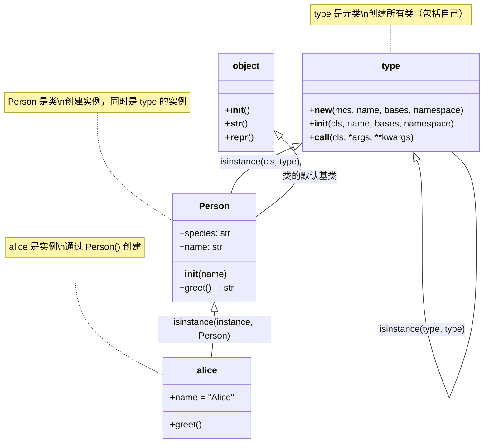
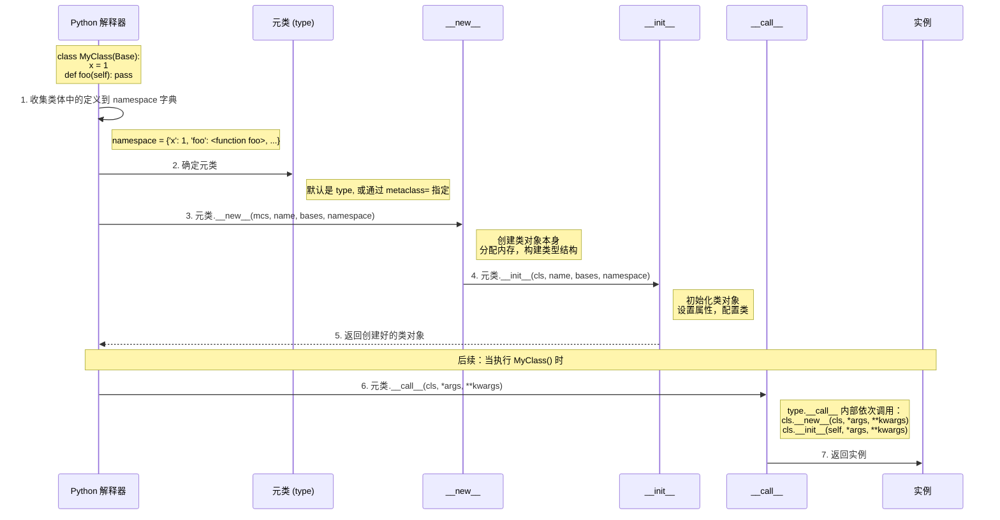
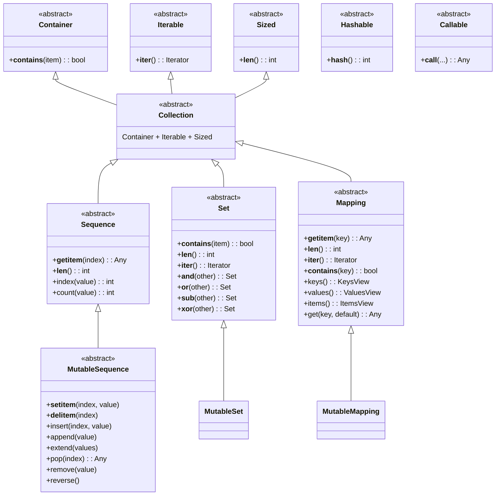
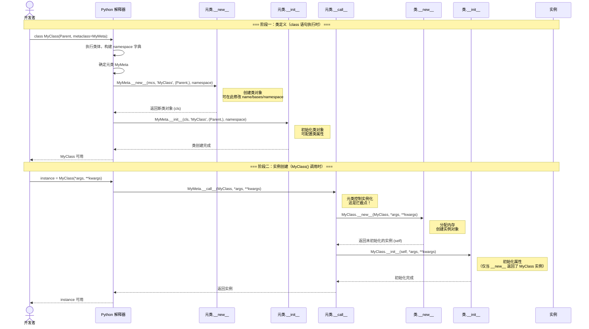
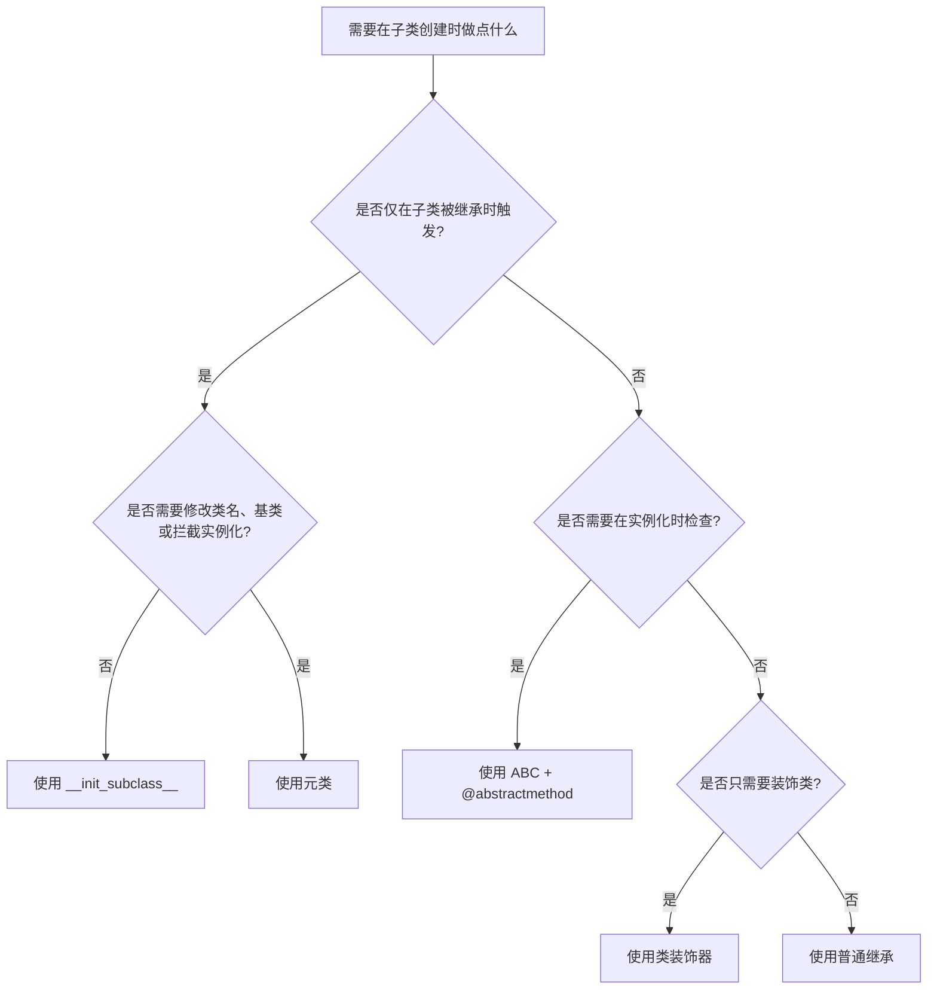

# 元类与抽象基类

Python 中，"一切皆对象"这句话有一层更深的含义：**类本身也是对象**。如果说普通的类是用来创建实例的模板，那么元类（metaclass）就是用来创建类的模板。理解元类和抽象基类，是区分"会用 Python"和"真正理解 Python"的分水岭。

::: tip 核心思想
元类解答了"类从哪来"的问题；抽象基类解答了"类应该有什么"的问题。两者合在一起，构成了 Python 面向对象体系中最底层的控制能力。
:::

> 阅读提示
>
> - 建议按顺序通读：先理解 type 是元类，再看类的创建过程，最后进入自定义元类和抽象基类的实战
> - 本文标称 Python 3.10+，大部分内容兼容 Python 3.6+
> - 只想查阅某个概念时，可配合下方目录或使用搜索定位对应小节

## 快速导读

- **学习顺序建议**：类是对象 → type 是元类 → 类创建过程 → 自定义元类实战 → ABC → `__init_subclass__` → 陷阱与最佳实践
- **适用情景**：阅读框架源码（Django ORM、SQLAlchemy）、设计插件系统、实现接口约束、编写 DSL
- **记忆口诀**：`type 生类，类生实例`、`元类管创建，ABC 管接口`、`能用 __init_subclass__ 就不用元类`
- **速查表**：

| 目标 | 快速定位 |
|------|----------|
| 理解 type 的双重身份 | 第一部分：类是对象 |
| 自定义元类 | 第三部分：自定义元类 |
| 使用 ABC 约束子类 | 第四部分：抽象基类 |
| 替代简单元类 | 第五部分：`__init_subclass__` |
| 元类冲突报错 | 第七部分：常见陷阱 |

---

## 第一部分：类是对象 —— type 是元类

### 一切皆对象的最后一层

"Python 一切皆对象"。数字是对象，函数是对象，模块也是对象。那么类本身是什么？**类也是对象**。

```python
# Python 3.10+
class Person:
    """一个简单的类"""
    species = "Homo sapiens"

    def __init__(self, name: str):
        self.name = name

    def greet(self) -> str:
        return f"Hello, I'm {self.name}"

# 类是对象，因此有类型
print(type(Person))       # <class 'type'>
print(type(int))          # <class 'type'>
print(type(str))          # <class 'type'>
print(type(type))         # <class 'type'>  —— type 自己的类型也是 type

# 类可以赋值给变量、作为参数传递
MyClass = Person
alice = MyClass("Alice")
print(alice.greet())      # Hello, I'm Alice
```

关键结论：
- **`type` 是所有类的默认元类**，就像 `object` 是所有类的默认基类一样
- `type` 自己的类型也是 `type` —— 这是 Python 对象模型自举的终点
- 元类的作用是**控制类的创建过程**

### type → class → instance 三元关系



理解这个三者关系是掌握元类的基础：

| 实体 | 类型（type() 返回） | 角色 |
|------|---------------------|------|
| `alice` | `<class 'Person'>` | 实例 |
| `Person` | `<class 'type'>` | 类（也是 type 的实例） |
| `type` | `<class 'type'>` | 元类（也是自己的实例） |
| `object` | `<class 'type'>` | 所有类的默认基类 |

### type 的两种用法

`type` 在 Python 中有两种截然不同的用途：

```python
# 用法一：查看对象类型（最常见）
print(type(42))           # <class 'int'>
print(type("hello"))      # <class 'str'>

# 用法二：动态创建类（元类用法）
# type(name, bases, namespace) -> 返回一个新类

Dog = type('Dog',                                    # 类名
           (object,),                                # 基类元组
           {'species': 'Canis',                      # 类属性和方法
            '__init__': lambda self, name: setattr(self, 'name', name),
            'bark': lambda self: f"{self.name} says woof!"})

buddy = Dog("Buddy")
print(type(buddy))         # <class 'Dog'>
print(buddy.bark())        # Buddy says woof!
print(isinstance(buddy, Dog))  # True
```

`type(name, bases, namespace)` 是 Python 动态创建类的方式。`class` 关键字本质上只是这个调用的语法糖——解释器最终会将 class 语句转换为 `type()` 调用。

---

## 第二部分：类的创建过程

### class 语句背后发生了什么

当 Python 执行 `class MyClass(Base): ...` 时，实际上发生了以下步骤：



关键点说明：

1. **类体执行**：Python 在一个新的命名空间中执行类体代码，收集所有定义
2. **确定元类**：按 `metaclass` 参数 > 基类的元类 > 默认 `type` 的顺序确定
3. **`__new__`**：元类的 `__new__` 方法**创建类对象**——这和实例的 `__new__` 不同
4. **`__init__`**：元类的 `__init__` 方法**初始化类对象**
5. **`__call__`**：当你调用 `MyClass()` 时，触发的是**元类的 `__call__`**，而不是类的 `__call__`

### 用代码验证创建过程

```python
# Python 3.10+
class InspectMeta(type):
    """打印类创建过程中每一步的元类"""

    def __new__(mcs, name: str, bases: tuple, namespace: dict):
        print(f"[__new__]  创建类 '{name}'")
        print(f"          基类: {[b.__name__ for b in bases]}")
        print(f"          属性: {[k for k in namespace if not k.startswith('__')]}")
        cls = super().__new__(mcs, name, bases, namespace)
        return cls

    def __init__(cls, name: str, bases: tuple, namespace: dict):
        print(f"[__init__] 初始化类 '{name}'")
        super().__init__(name, bases, namespace)

    def __call__(cls, *args, **kwargs):
        print(f"[__call__] 调用 {cls.__name__}({args}) 创建实例")
        instance = super().__call__(*args, **kwargs)
        return instance


class Animal(metaclass=InspectMeta):
    """使用自定义元类观察创建过程"""
    species = "Animalia"

    def __init__(self, name: str):
        self.name = name

    def speak(self) -> str:
        return f"{self.name} makes a sound"


# 输出（class 语句被执行时）：
# [__new__]  创建类 'Animal'
#           基类: ['object']
#           属性: ['species', 'speak']
# [__init__] 初始化类 'Animal'

print("--- 分割线 ---")

dog = Animal("Buddy")
# 输出：
# [__call__] 调用 Animal(('Buddy',)) 创建实例

print(type(Animal))  # <class '__main__.InspectMeta'>
```

::: warning 注意元类的 __new__ 和 __init__ 调用时机
元类的 `__new__` 和 `__init__` 在 **class 语句执行时** 就会调用，而不是在创建实例时。这就是元类和普通类方法的根本区别——它们控制的是类的创建时刻。
:::

---

### 元类的优先级：谁来决定元类

当定义一个类时，Python 如何确定使用哪个元类？遵循以下优先级规则：

1. **显式指定 `metaclass=`**：最高优先级，直接使用
2. **继承父类的元类**：如果父类的元类之间存在继承关系，选择最具体的那个
3. **默认 `type`**：如果以上都没有，使用 `type`

```python
# Python 3.10+
class MetaA(type):
    pass

class MetaB(MetaA):
    pass

class MetaC(type):
    pass

class BaseA(metaclass=MetaB):
    pass

class BaseB(metaclass=MetaA):
    pass

class Child1(BaseA):
    pass
# Child1 的元类是 MetaB（继承自 BaseA）

class Child2(BaseA, BaseB):
    pass
# Child2 的元类是 MetaB（MetaB 是 MetaA 的子类，最具体）

# class Child3(BaseA, metaclass=MetaC):
#     pass
# TypeError: metaclass conflict
# MetaC 不是 MetaB 的子类，无法兼容
```

这个优先级规则解释了为什么 Django 的 Model 类使用 `ModelBase` 元类后，所有继承自 `Model` 的子类自动获得 `ModelBase` 作为元类——因为子类会继承父类的元类，而不需要每次都显式指定。

### 对比：三种控制类创建的方式

在深入自定义元类之前，有必要理清 Python 中三种控制类创建的方式及其适用场景：

| 方式 | 触发时机 | 能做什么 | 复杂度 | 典型场景 |
|------|----------|----------|--------|----------|
| 类装饰器 `@decorator` | 类创建完成后 | 修改/替换已创建的类 | 低 | 添加属性、注册类、包装方法 |
| `__init_subclass__` | 子类创建时 | 检查和修改子类 | 中 | 接口校验、自动注册、强制规范 |
| 元类 `metaclass` | 类创建过程中 | 修改类创建的全过程 | 高 | ORM、DSL、AOP、大规模框架 |

```python
# Python 3.10+ —— 三种方式的效果对比

# 方式一：类装饰器
def add_created_at(cls):
    """添加创建时间戳"""
    import time
    original_init = cls.__init__

    def new_init(self, *args, **kwargs):
        original_init(self, *args, **kwargs)
        self._created_at = time.time()

    cls.__init__ = new_init
    return cls

@add_created_at
class DecoratedClass:
    def __init__(self, name):
        self.name = name

# 方式二：__init_subclass__
class SubclassHook:
    def __init_subclass__(cls, **kwargs):
        super().__init_subclass__(**kwargs)
        cls._created_at = "子类创建时记录"

class HookedClass(SubclassHook):
    pass

# 方式三：元类
class TimestampMeta(type):
    def __new__(mcs, name, bases, namespace):
        import time
        namespace['_created_at'] = time.time()
        return super().__new__(mcs, name, bases, namespace)

class MetaClass(metaclass=TimestampMeta):
    pass

# 关键区别：
# - 装饰器：在类创建之后修改，看不到"原始的"类
# - __init_subclass__：只能在子类创建时触发，基类定义时不会触发
# - 元类：在类创建的最底层介入，可以修改 namespace、改变类名、替换基类
```

选择原则：**从右向左移动**（从装饰器到元类），只有当更简单的方式确实无法满足需求时，才向更复杂的方式升级。

---

## 第三部分：自定义元类的实际应用

自定义元类的典型使用场景：需要在**类创建时**自动做某些事情，而这些事情无法通过简单的继承或装饰器完成。

### 模式一：注册模式 —— 自动收集子类

```python
# Python 3.10+
class PluginRegistryMeta(type):
    """元类：自动将所有子类注册到一个字典中"""
    registry: dict[str, type] = {}

    def __new__(mcs, name: str, bases: tuple, namespace: dict):
        cls = super().__new__(mcs, name, bases, namespace)
        # 跳过基类，不注册 Plugin 本身
        if name != "Plugin":
            mcs.registry[name] = cls
        return cls


class Plugin(metaclass=PluginRegistryMeta):
    """插件基类"""

    def process(self, data: str) -> str:
        raise NotImplementedError


class JSONPlugin(Plugin):
    def process(self, data: str) -> str:
        import json
        return json.dumps({"data": data})


class UpperPlugin(Plugin):
    def process(self, data: str) -> str:
        return data.upper()


class ReversePlugin(Plugin):
    def process(self, data: str) -> str:
        return data[::-1]


# 所有插件自动注册
print(PluginRegistryMeta.registry)
# {'JSONPlugin': <class '__main__.JSONPlugin'>,
#  'UpperPlugin': <class '__main__.UpperPlugin'>,
#  'ReversePlugin': <class '__main__.ReversePlugin'>}

# 使用注册的插件
for name, plugin_cls in PluginRegistryMeta.registry.items():
    plugin = plugin_cls()
    print(f"{name}: {plugin.process('Hello')}")

# JSONPlugin: {"data": "Hello"}
# UpperPlugin: HELLO
# ReversePlugin: olleH
```

**实际框架案例**：Django 的 `ModelBase` 元类就是注册模式的经典应用——当你定义 `class MyModel(models.Model)` 时，元类自动将该模型注册到 Django 的模型注册表中。

### 模式二：单例模式 —— 确保只有一个实例

```python
# Python 3.10+
class SingletonMeta(type):
    """元类实现单例模式"""
    _instances: dict[type, object] = {}

    def __call__(cls, *args, **kwargs):
        if cls not in cls._instances:
            cls._instances[cls] = super().__call__(*args, **kwargs)
        return cls._instances[cls]


class DatabaseConnection(metaclass=SingletonMeta):
    def __init__(self, host: str = "localhost"):
        self.host = host
        print(f"初始化连接 → {self.host}")

    def query(self, sql: str) -> str:
        return f"[{self.host}] 执行: {sql}"


# 多次"创建"，始终返回同一个实例
conn1 = DatabaseConnection("db1.example.com")
# 初始化连接 → db1.example.com
conn2 = DatabaseConnection("db2.example.com")  # host 参数被忽略
# 没有打印！因为 __init__ 没有被再次调用

print(conn1 is conn2)     # True
print(conn2.host)         # db1.example.com（注意不是 db2）
```

::: warning 单例元类陷阱
上述实现中，第二次调用 `DatabaseConnection("db2.example.com")` 虽然不创建新实例，但因为 `__call__` 直接返回了已有实例，`__init__` 也不会被重新调用。如果需要"更新"单例状态，需要在 `__call__` 中显式处理。
:::

### 模式三：接口校验 —— 在类定义时检查方法签名

```python
# Python 3.10+
import inspect


class InterfaceMeta(type):
    """元类：确保子类实现了指定接口的所有方法"""

    def __new__(mcs, name: str, bases: tuple, namespace: dict):
        cls = super().__new__(mcs, name, bases, namespace)
        # 只校验直接继承自 Service 的子类
        if name != "Service":
            # 注意：从新创建的 cls 上取 _required_methods（经继承得到），
            # 而不是从元类 mcs 上取——后者永远拿不到
            required = getattr(cls, '_required_methods', set())
            missing = required - set(namespace.keys())
            if missing:
                raise TypeError(
                    f"类 '{name}' 未实现以下方法: {missing}"
                )
        return cls


class Service(metaclass=InterfaceMeta):
    _required_methods = {"start", "stop", "status"}

    def start(self) -> None:
        raise NotImplementedError

    def stop(self) -> None:
        raise NotImplementedError

    def status(self) -> str:
        raise NotImplementedError


class WebService(Service):        # OK: 实现了所有方法
    def start(self) -> None:
        print("Web 服务启动")

    def stop(self) -> None:
        print("Web 服务停止")

    def status(self) -> str:
        return "running"


# class BadService(Service):      # TypeError!
#     def start(self) -> None:
#         pass
#     # 缺少 stop 和 status
```

::: tip 时效差异
元类校验在 **import / 类定义时** 就报错，而 ABC 的 `@abstractmethod` 校验延迟到**实例化时**。对于希望尽早暴露问题的场景（如框架开发），元类校验更合适；对于希望保留灵活性的场景，ABC 更合适。
:::

### 模式四：ORM 模型 —— 自动转换类属性

```python
# Python 3.10+
class ModelMeta(type):
    """简化版 ORM 元类：自动收集字段定义"""

    def __new__(mcs, name: str, bases: tuple, namespace: dict):
        # 从类命名空间中提取字段定义
        fields = {}
        for key, value in namespace.items():
            if isinstance(value, Field):
                fields[key] = value
                value.name = key  # 绑定字段名

        cls = super().__new__(mcs, name, bases, namespace)
        cls._fields = fields  # 将字段信息附加到类上
        return cls


class Field:
    """数据库字段描述符"""
    def __init__(self, field_type: type = str, required: bool = False):
        self.field_type = field_type
        self.required = required
        self.name: str = ""


class Model(metaclass=ModelMeta):
    """ORM 基类"""

    def __init__(self, **kwargs):
        for name, field in self._fields.items():
            value = kwargs.get(name)
            if value is None and field.required:
                raise ValueError(f"字段 '{name}' 是必填的")
            setattr(self, name, value)

    def __repr__(self):
        field_values = ", ".join(
            f"{name}={getattr(self, name)!r}"
            for name in self._fields
        )
        return f"{self.__class__.__name__}({field_values})"


class User(Model):
    name = Field(str, required=True)
    age = Field(int)
    email = Field(str)


# 查看自动收集的字段
print(User._fields)
# {'name': <__main__.Field object at ...>,
#  'age': <__main__.Field object at ...>,
#  'email': <__main__.Field object at ...>}

alice = User(name="Alice", age=30, email="alice@example.com")
print(alice)  # User(name='Alice', age=30, email='alice@example.com')
```

这个简化版本演示了 Django ORM、SQLAlchemy、Peewee 等 ORM 框架的核心思想：**用元类在类定义时收集字段信息，再借助描述符拦截属性访问，完成校验与状态追踪**。

---

## 第四部分：抽象基类（ABC）

### 为什么需要 ABC

继承有两种用途：

- **实现复用**：子类复用父类的代码
- **接口契约**：子类必须实现特定方法，形成统一接口

普通继承可以强制实现复用，但约束力不足。**抽象基类（Abstract Base Class）专门解决"接口契约"问题**。

```python
# Python 3.10+
from abc import ABC, abstractmethod


class DatabaseClient(ABC):
    """数据库客户端抽象基类"""

    @abstractmethod
    def connect(self, connection_string: str) -> bool:
        """建立连接，返回 True 表示成功"""
        ...

    @abstractmethod
    def execute(self, query: str) -> list[dict]:
        """执行查询，返回结果列表"""
        ...

    @abstractmethod
    def close(self) -> None:
        """关闭连接"""
        ...

    # 非抽象方法：提供默认实现，子类可覆盖
    def execute_one(self, query: str) -> dict | None:
        """执行查询，只返回第一条结果"""
        results = self.execute(query)
        return results[0] if results else None


class MySQLClient(DatabaseClient):
    def connect(self, connection_string: str) -> bool:
        print(f"连接 MySQL: {connection_string}")
        return True

    def execute(self, query: str) -> list[dict]:
        return [{"id": 1, "name": "test"}]

    def close(self) -> None:
        print("关闭 MySQL 连接")


# 可以实例化
client = MySQLClient()

# 不能实例化抽象类
# client = DatabaseClient()
# TypeError: Can't instantiate abstract class DatabaseClient
# with abstract methods close, connect, execute
```

### ABCMeta 的内部机制

`ABCMeta` 是 `type` 的子类，它做了什么？

1. 在类创建时，收集所有带 `@abstractmethod` 标记的方法
2. 将方法名存入 `cls.__abstractmethods__` 集合
3. 在实例化时，检查 `__abstractmethods__` 是否为空，非空则抛出 `TypeError`

```python
# 查看 ABC 内部机制
from abc import ABC, abstractmethod, ABCMeta


class Shape(ABC):
    @abstractmethod
    def area(self) -> float:
        ...

print(Shape.__abstractmethods__)  # frozenset({'area'})

class Circle(Shape):
    def area(self) -> float:
        return 3.14159 * 5 ** 2

print(Circle.__abstractmethods__)  # frozenset()

# 手动查看元类
print(type(Shape))    # <class 'abc.ABCMeta'>
print(type(Circle))   # <class 'abc.ABCMeta'>
```

### @abstractmethod 和 @abstractproperty

```python
# Python 3.10+
from abc import ABC, abstractmethod


class Validator(ABC):
    """数据校验器抽象基类"""

    @abstractmethod
    def validate(self, value) -> bool:
        """校验值是否合法"""
        ...

    # 抽象属性（读）
    @property
    @abstractmethod
    def error_message(self) -> str:
        """校验失败时的错误消息"""
        ...

    # 抽象类方法（Python 3.2+）
    @classmethod
    @abstractmethod
    def from_config(cls, config: dict) -> "Validator":
        """从配置字典创建校验器"""
        ...


class EmailValidator(Validator):
    def validate(self, value: str) -> bool:
        return "@" in value and "." in value

    @property
    def error_message(self) -> str:
        return "请输入有效的邮箱地址"

    @classmethod
    def from_config(cls, config: dict) -> "Validator":
        return cls()


# 使用
v = EmailValidator()
print(v.validate("test@example.com"))  # True
print(v.validate("invalid"))           # False
print(v.error_message)                 # 请输入有效的邮箱地址
```

::: warning 装饰器顺序很重要
```python
# 正确：@property 在外，@abstractmethod 在内
@property
@abstractmethod
def name(self) -> str: ...

# 错误：@abstractmethod 在外会导致属性失效
# @abstractmethod
# @property
# def name(self) -> str: ...
```
:::

### collections.abc 模块 —— 常用抽象基类

`collections.abc` 模块提供了一套定义 Python 内置协议的标准 ABC。

```python
# Python 3.10+
from collections.abc import (
    Iterable, Iterator, Generator,
    Sequence, MutableSequence,
    Mapping, MutableMapping,
    Set, MutableSet,
    Callable, Container, Sized,
    Hashable, Collection,
)

# 类型检查示例
def print_iterable_info(obj):
    match obj:
        case _ if isinstance(obj, Sequence):
            print(f"序列: 长度 {len(obj)}, 第三个元素 {obj[2]}")
        case _ if isinstance(obj, Mapping):
            print(f"映射: 键 {list(obj.keys())[:3]}")
        case _ if isinstance(obj, Set):
            print(f"集合: 大小 {len(obj)}")
        case _ if isinstance(obj, Iterable):
            print(f"可迭代对象: 类型 {type(obj).__name__}")
        case _:
            print(f"不可迭代: {type(obj).__name__}")


print_iterable_info([1, 2, 3, 4, 5])       # 序列: 长度 5, 第三个元素 3
print_iterable_info({"a": 1, "b": 2})      # 映射: 键 ['a', 'b']
print_iterable_info({1, 2, 3})             # 集合: 大小 3
print_iterable_info(range(10))             # 序列: 长度 10, 第三个元素 2
print_iterable_info(42)                    # 不可迭代: int
```

**collections.abc 层次结构**



实际应用：

```python
# Python 3.10+
from collections.abc import MutableMapping


class LRUCache(MutableMapping):
    """实现 MutableMapping 接口，自动获得 .get(), .keys(), .items() 等方法"""
    def __init__(self, maxsize: int = 128):
        self.maxsize = maxsize
        self._data: dict = {}

    def __getitem__(self, key):
        value = self._data[key]
        # 移到末尾（最近使用）
        del self._data[key]
        self._data[key] = value
        return value

    def __setitem__(self, key, value):
        if key in self._data:
            del self._data[key]
        elif len(self._data) >= self.maxsize:
            # 删除最久未使用的项（第一个）
            oldest = next(iter(self._data))
            del self._data[oldest]
        self._data[key] = value

    def __delitem__(self, key):
        del self._data[key]

    def __iter__(self):
        return iter(self._data)

    def __len__(self):
        return len(self._data)

    def __repr__(self):
        return f"LRUCache({dict(self._data)})"


cache = LRUCache(maxsize=3)
cache["a"] = 1
cache["b"] = 2
cache["c"] = 3
print(cache)              # LRUCache({'a': 1, 'b': 2, 'c': 3})

cache["d"] = 4            # 触发淘汰，移除 "a"
print(cache)              # LRUCache({'b': 2, 'c': 3, 'd': 4})

# 自动获得的方法（来自 MutableMapping 的 Mixin）
print(cache.get("b"))     # 2
print(cache.get("x", 0))  # 0
print(list(cache.keys())) # ['b', 'c', 'd']
```

::: tip 实现 collections.abc 的好处
当你实现一个自定义容器类时，继承 `collections.abc` 中的抽象基类，只需实现少数几个核心方法，就能自动获得全套容器 API。例如实现 `Sequence` 的 `__getitem__` 和 `__len__`，就自动获得 `__contains__`、`__iter__`、`__reversed__`、`index`、`count` 等方法。
:::

### 虚拟子类：不必继承也能 isinstance

ABC 有一个强大但容易被忽略的特性：**虚拟子类**。通过 `ABCMeta.register()` 方法，可以让任何类被 `isinstance` 和 `issubclass` 识别为 ABC 的子类，而不需要实际继承。

```python
# Python 3.10+
from abc import ABC, abstractmethod
from collections.abc import Sequence


# 一个没有继承 Sequence 的自定义序列类
class MyRange:
    """自定义范围类，实现了 Sequence 协议，但没有继承 Sequence"""
    def __init__(self, start: int, end: int):
        self.start = start
        self.end = end

    def __getitem__(self, index: int) -> int:
        if index >= len(self):
            raise IndexError
        return self.start + index

    def __len__(self) -> int:
        return max(0, self.end - self.start)


r = MyRange(1, 10)

# 鸭子类型：行为上它就是一个序列
print(r[3])               # 4
print(len(r))             # 9
print(list(r))            # [1, 2, 3, 4, 5, 6, 7, 8, 9]

# 但 isinstance 检测不到
print(isinstance(r, Sequence))  # False —— 因为没有继承 Sequence

# 注册为虚拟子类
Sequence.register(MyRange)

# 现在 isinstance 可以识别了
print(isinstance(r, Sequence))  # True
print(issubclass(MyRange, Sequence))  # True
```

虚拟子类的应用场景：

- **让第三方类通过协议检查**：比如 `numpy` 的数组可以通过 `Sequence.register(numpy.ndarray)` 让标准库的序列检查识别它们
- **向后兼容**：让旧代码中的类被视为符合某个 ABC 而无需修改类的继承关系
- **鸭子类型的正规化**：把"它走起来像鸭子"这个事实用 `isinstance` 表达出来

```python
# Python 3.10+ —— 自定义 ABC 的虚拟子类注册
from abc import ABC, abstractmethod


class JSONSerializable(ABC):
    """可 JSON 序列化的对象"""

    @abstractmethod
    def to_json(self) -> str:
        ...

    @classmethod
    def __subclasshook__(cls, subclass):
        """自定义 issubclass 检查逻辑"""
        # 只要类有 to_json 方法，就认为它是 JSONSerializable 的子类
        if cls is JSONSerializable:
            if hasattr(subclass, 'to_json') and callable(subclass.to_json):
                return True
        return NotImplemented


class User:
    """这个类没有继承 JSONSerializable，但有 to_json 方法"""
    def __init__(self, name: str, age: int):
        self.name = name
        self.age = age

    def to_json(self) -> str:
        import json
        return json.dumps({"name": self.name, "age": self.age})


# __subclasshook__ 让 isinstance 自动生效
print(isinstance(User("Alice", 30), JSONSerializable))  # True
print(issubclass(User, JSONSerializable))                # True


class PlainStr(str):
    """这个类没有 to_json 方法"""
    pass

print(isinstance(PlainStr("hello"), JSONSerializable))   # False
```

::: tip __subclasshook__ vs register()
| 方式 | 适用场景 | 控制粒度 |
|------|----------|----------|
| `register()` | 显式注册已知类 | 类级别，手动控制 |
| `__subclasshook__` | 基于鸭子类型自动识别 | 更灵活，按条件自动匹配 |

**核心思想**：Python 的 `isinstance` 不是绝对权威的——ABC 机制允许你重新定义"谁是子类"的规则。这就是鸭子类型在类型检查层面的实现。
:::

---

## 第五部分：`__init_subclass__` 钩子 —— 替代简单元类的现代方案

Python 3.6 引入了 `__init_subclass__` 钩子，它是 `object` 上的一个类方法。**当一个类被继承时，这个钩子会自动调用**。

### 为什么需要它

在 Python 3.6 之前，很多"在子类创建时做点什么"的需求只能通过元类实现。`__init_subclass__` 提供了一种**更简单、更不容易出错**的方式来实现同样的效果。

### 用 __init_subclass__ 改写注册模式

```python
# Python 3.10+
class PluginBase:
    """插件基类 —— 使用 __init_subclass__ 替代元类"""
    registry: dict[str, type] = {}

    def __init_subclass__(cls, **kwargs):
        super().__init_subclass__(**kwargs)
        # 自动注册子类
        PluginBase.registry[cls.__name__] = cls
        print(f"注册插件: {cls.__name__}")

    def process(self, data: str) -> str:
        raise NotImplementedError


class JSONHandler(PluginBase):
    def process(self, data: str) -> str:
        import json
        return json.dumps({"data": data})


class XMLHandler(PluginBase):
    def process(self, data: str) -> str:
        return f"<data>{data}</data>"


class CSVHandler(PluginBase):
    def process(self, data: str) -> str:
        return f"value\n{data}"


# 输出：
# 注册插件: JSONHandler
# 注册插件: XMLHandler
# 注册插件: CSVHandler

print(PluginBase.registry)
# {'JSONHandler': ..., 'XMLHandler': ..., 'CSVHandler': ...}
```

### `__init_subclass__` 的高级用法

```python
# Python 3.10+
class ORMModel:
    """使用 __init_subclass__ 实现 ORM 模式"""
    _table_name: str = ""
    _fields: dict[str, str] = {}

    def __init_subclass__(cls, *,
                          table_name: str | None = None,
                          abstract: bool = False,
                          **kwargs):
        super().__init_subclass__(**kwargs)

        if abstract:
            return  # 抽象模型不处理

        # 自动设置表名
        cls._table_name = table_name or cls.__name__.lower() + "s"

        # 收集类型注解作为字段定义
        cls._fields = {}
        for base in reversed(cls.__mro__):
            if hasattr(base, '__annotations__'):
                cls._fields.update(base.__annotations__)

        print(f"[ORM] 模型 '{cls.__name__}' → 表 '{cls._table_name}'")
        print(f"       字段: {list(cls._fields.keys())}")


class BaseModel(ORMModel, abstract=True):
    """抽象基模型，不映射到数据库表"""
    id: int
    created_at: str


class User(BaseModel, table_name="users"):
    name: str
    email: str
    age: int


class Post(BaseModel):
    title: str
    content: str
    author_id: int


# 输出：
# [ORM] 模型 'User' → 表 'users'
#        字段: ['id', 'created_at', 'name', 'email', 'age']
# [ORM] 模型 'Post' → 表 'posts'
#        字段: ['id', 'created_at', 'title', 'content', 'author_id']
```

::: tip __init_subclass__ vs 元类
| 对比维度 | `__init_subclass__` | 元类 |
|----------|---------------------|------|
| 复杂度 | 低，像一个回调函数 | 高，需要理解 `__new__`/`__init__`/`__call__` |
| 可以做的事 | 修改子类、注册、校验 | 一切（修改类名、替换基类、拦截实例化等） |
| 组合性 | 好（多个基类的 `__init_subclass__` 都会调用） | 差（元类冲突） |
| 影响范围 | 只影响子类创建 | 影响类创建 + 实例创建 |
| Python 版本 | 3.6+ | 所有版本 |

**原则：能用 `__init_subclass__` 解决的，就不要用元类。**
:::

---

## 第六部分：元类、`__new__`、`__init__` 调用时序

以下时序图汇总了从类定义到实例创建的完整调用链：



要点提炼：

| 阶段 | 触发时机 | 关键方法 | 用途 |
|------|----------|----------|------|
| 类创建 | class 语句 | `元类.__new__` + `元类.__init__` | 修改类定义、注册、校验 |
| 实例创建 | `ClassName()` | `元类.__call__` | 拦截实例化（单例、缓存、日志） |
| 实例分配 | 元类 `__call__` 内部 | `类.__new__` | 控制内存分配 |
| 实例初始化 | 元类 `__call__` 内部 | `类.__init__` | 设置实例属性 |

---

## 第七部分：常见陷阱

| 陷阱 | 现象 | 原因 | 解决方案 |
|------|------|------|----------|
| **元类冲突** | `TypeError: metaclass conflict` | 多个基类有不同元类，且不互为子类 | 创建一个同时继承所有元类的"合成元类"；或改用 `__init_subclass__` |
| **过度使用元类** | 代码难以理解和调试，团队成员看不懂 | 用元类解决其实可以用装饰器或 `__init_subclass__` 解决的问题 | 先用简单方案，确认不够用再升级到元类 |
| **忘记 `super().__init_subclass__`** | 多个基类的 `__init_subclass__` 中只有第一个被调用 | `__init_subclass__` 依赖 super() 实现链式调用 | 始终在 `__init_subclass__` 中调用 `super().__init_subclass__(**kwargs)` |
| **在元类 `__new__` 中修改 namespace 导致意外行为** | 定义的属性被覆盖或消失 | 对 namespace 的隐式修改难以预料 | 只在 `__new__` 中做明确、有文档的修改 |
| **`ABCMeta` 与非 ABC 元类混合** | `TypeError: metaclass conflict` | `ABCMeta` 和自定义元类都继承自 `type` | 让自定义元类继承 `ABCMeta`，而非 `type` |
| **将 `@abstractmethod` 用于 `__init__`** | 子类实例化时报错 | `__init__` 是特殊方法，抽象检查有特殊逻辑 | 避免让 `__init__` 成为抽象方法；改用工厂方法或类方法 |

### 陷阱一：元类冲突

```python
# Python 3.10+
class MetaA(type):
    pass

class MetaB(type):
    pass

class BaseA(metaclass=MetaA):
    pass

class BaseB(metaclass=MetaB):
    pass

# class C(BaseA, BaseB):  # TypeError!
#     pass
# TypeError: metaclass conflict:
# the metaclass of a derived class must be a (non-strict)
# subclass of the metaclasses of all its bases

# 解决方案：创建一个合成元类
class CombinedMeta(MetaA, MetaB):
    pass

class C(BaseA, BaseB, metaclass=CombinedMeta):
    pass  # OK
```

### 陷阱二：忘记调用 `super().__init_subclass__`

```python
# Python 3.10+
class LoggingMixin:
    def __init_subclass__(cls, **kwargs):
        print(f"[LoggingMixin] 子类创建: {cls.__name__}")
        # 忘记调用 super().__init_subclass__(**kwargs) ！！！

class ValidationMixin:
    def __init_subclass__(cls, **kwargs):
        print(f"[ValidationMixin] 子类创建: {cls.__name__}")
        super().__init_subclass__(**kwargs)  # 正确


class Base(LoggingMixin, ValidationMixin):
    pass

# 实际输出：
# [LoggingMixin] 子类创建: Base

# 注意：LoggingMixin 中没有调用 super().__init_subclass__(**kwargs)，
# MRO 中排在它后面的 ValidationMixin 的钩子被跳过了！
```

::: danger 多继承下的 __init_subclass__ 链式调用
当多个基类都定义了 `__init_subclass__` 时，**每个都必须调用 `super().__init_subclass__(**kwargs)`**，否则 MRO 中排在后面的基类的钩子不会被触发。这是一个极易遗漏的细节。
:::

---

## 第八部分：最佳实践

### 决策树：我该用什么？



### 核心原则

**一、能用 `__init_subclass__` 就不用元类**

```python
# Python 3.10+
# ❌ 元类版本：过度设计
class ValidateMeta(type):
    def __new__(mcs, name, bases, namespace):
        cls = super().__new__(mcs, name, bases, namespace)
        # 检查某些条件
        if name != "Base":
            for key in ("process", "validate"):
                if key not in namespace:
                    raise TypeError(f"类必须定义 '{key}' 方法")
        return cls

class Base(metaclass=ValidateMeta):
    pass

# ✅ __init_subclass__ 版本：简洁清晰
class Base:
    def __init_subclass__(cls, **kwargs):
        super().__init_subclass__(**kwargs)
        for key in ("process", "validate"):
            if key not in cls.__dict__:
                raise TypeError(f"类 '{cls.__name__}' 必须定义 '{key}' 方法")
```

**二、能用装饰器就不用元类**

```python
# Python 3.10+
import functools
from typing import TypeVar

T = TypeVar('T', bound=type)

# ✅ 类装饰器：对类做后处理
def add_repr(cls: T) -> T:
    """为类添加一个自动化 __repr__"""
    def __repr__(self):
        attrs = ", ".join(f"{k}={v!r}" for k, v in self.__dict__.items())
        return f"{cls.__name__}({attrs})"
    cls.__repr__ = __repr__
    return cls

@add_repr
class Point:
    def __init__(self, x: float, y: float):
        self.x = x
        self.y = y

p = Point(3, 4)
print(p)  # Point(x=3, y=4)
```

**三、让自定义元类继承 ABCMeta，而非 type**

```python
# Python 3.10+
from abc import ABCMeta, abstractmethod

# ✅ 自定义元类兼容 ABC
class ServiceMeta(ABCMeta):
    """服务元类：既支持 abstractmethod，又支持自动注册"""
    registry: dict[str, type] = {}

    def __new__(mcs, name, bases, namespace):
        cls = super().__new__(mcs, name, bases, namespace)
        if name != "BaseService":
            mcs.registry[name] = cls
        return cls

class BaseService(metaclass=ServiceMeta):
    @abstractmethod
    def start(self) -> None:
        ...

class UserService(BaseService):
    def start(self) -> None:
        print("用户服务启动")

# 既有自动注册
print(ServiceMeta.registry)  # {'UserService': ...}

# 又能用 abstractmethod 约束
# class BadService(BaseService):
#     pass
# TypeError: Can't instantiate abstract class BadService with abstract method start
```

**四、`@abstractmethod` 配合 `__init_subclass__` 双重保障**

```python
# Python 3.10+
from abc import ABC, abstractmethod

class Worker(ABC):
    """工作器：抽象方法约束 + 子类创建时校验"""

    @abstractmethod
    def execute(self, task: dict) -> dict:
        ...

    def __init_subclass__(cls, **kwargs):
        super().__init_subclass__(**kwargs)
        # 额外的编译时检查
        execute = cls.__dict__.get('execute')
        if execute and hasattr(execute, '__annotations__'):
            print(f"✓ Worker 子类 '{cls.__name__}' 已定义 execute，"
                  f"返回类型: {execute.__annotations__.get('return', 'Any')}")

class ImageProcessor(Worker):
    def execute(self, task: dict) -> dict:
        return {"status": "done", "image": task.get("path")}

# 输出：
# ✓ Worker 子类 'ImageProcessor' 已定义 execute，返回类型: <class 'dict'>
```

---

## 术语表

| 术语 | 英文 | 定义 |
|------|------|------|
| 元类 | Metaclass | 创建类的"类"，默认是 `type`。控制类的创建和实例化过程 |
| type | type | Python 内置的默认元类，也是元类的元类 |
| ABCMeta | ABCMeta | `abc` 模块提供的元类，在 `type` 基础上增加了抽象方法检查机制 |
| 抽象基类 | Abstract Base Class (ABC) | 不能直接实例化的类，用于定义子类必须实现的接口契约 |
| 抽象方法 | Abstract Method | 用 `@abstractmethod` 标记的方法，子类必须实现 |
| `__init_subclass__` | `__init_subclass__` | `object` 的类方法钩子，在子类创建时自动调用，用于替代简单元类 |
| `__new__` (元类) | Metaclass `__new__` | 创建类对象的方法，在 class 语句执行时调用 |
| `__init__` (元类) | Metaclass `__init__` | 初始化类对象的方法，在 `__new__` 之后调用 |
| `__call__` (元类) | Metaclass `__call__` | 控制类实例化过程的方法，在 `ClassName()` 调用时触发 |
| 注册模式 | Registry Pattern | 通过元类或 `__init_subclass__` 自动收集所有子类的设计模式 |
| 单例模式 | Singleton Pattern | 确保一个类只有一个实例，常通过元类的 `__call__` 实现 |
| 鸭子类型 | Duck Typing | 不关心对象的实际类型，只关心是否有所需的方法 |
| `collections.abc` | `collections.abc` | 标准库中预定义的抽象基类集合，如 `Iterable`、`Sequence`、`Mapping` |
| MRO | Method Resolution Order | 方法解析顺序，决定了多继承时 `super()` 的调用链 |

---

## 延伸阅读

- [面向对象](/docs/python/基础与入门/14-面向对象) —— 类、继承、多态基础，本文的前置知识
- [描述符与 property](05-描述符与property) —— 理解 `@property` 的底层实现
- [迭代器与生成器](01-迭代器与生成器) —— 理解 `collections.abc.Iterator` 的实际应用
- [类型注解](../../03-工程化与运维/01-工程化/02-类型注解) —— 配合 ABC 定义精确的类型约束
- [Python 官方文档: abc](https://docs.python.org/zh-cn/3/library/abc.html) —— 抽象基类模块
- [Python 官方文档: collections.abc](https://docs.python.org/zh-cn/3/library/collections.abc.html) —— 容器抽象基类
- [PEP 487 -- Simpler customisation of class creation](https://peps.python.org/pep-0487/) —— `__init_subclass__` 的提案
- [PEP 3119 -- Introducing Abstract Base Classes](https://peps.python.org/pep-3119/) —— ABC 的设计动机

---

## 自查与练习任务

- **关系绘制**：用纸笔画出 `type`、`ABCMeta`、`object`、你的自定义元类和你的类之间的 `isinstance` 和 `issubclass` 关系。
- **改写练习**：将上文中的"注册模式"元类实现改写为 `__init_subclass__` 版本，对比代码行数和可读性。
- **框架代码阅读**：打开 Django 的 `django/db/models/base.py`，搜索 `ModelBase`，理解 Django 如何使用元类。
- **自定义集合**：继承 `collections.abc.MutableMapping`，实现一个带有 TTL（过期时间）的字典。
- **ABC 链式校验**：设计三层抽象基类（Service → DatabaseService → MySQLService），检验 `@abstractmethod` 是否能跨层级约束。
- **面试速答**：口头解释"`type` 创建类时发生了什么"，能清晰说出 `__new__`、`__init__`、`__call__` 的调用顺序和各自职责。

完成后，将心得和关键代码片段添加到个人笔记中，形成"元编程速查卡"。

## 版本差异（类型注解 → Python 3.13/3.14）

| 特性 | 本文编写时 | Python 3.13/3.14 |
|------|-----------|------------------|
| 注解求值 | 运行时立即求值 | PEP 649/749（3.14）：延迟求值，类型注解不再在定义时执行 |
| 类型别名 | `TypeAlias` / 赋值 | 3.12 引入 `type X = ...` 语句 |
| 联合类型 | `Union[X, Y]` | 3.10+ 使用 `X \| Y` 语法 |
| `Self` 类型 | 手动标注 | 3.11+ `typing.Self` |
| 泛型语法 | `TypeVar` 冗长语法 | 3.12 PEP 695 类型参数语法 `def f[T](...)` |

> 本文讲解的 typing 核心概念在 3.14 中成立；新项目建议使用 3.12+ 的 `type` 语句与 PEP 695 语法，注解延迟求值让前向引用更简单。
