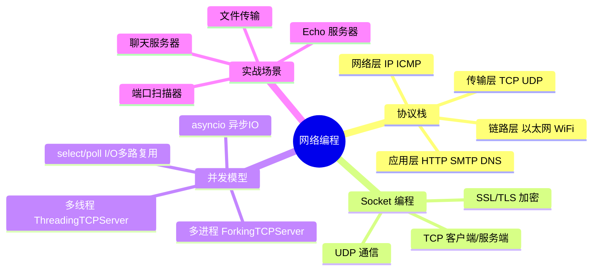
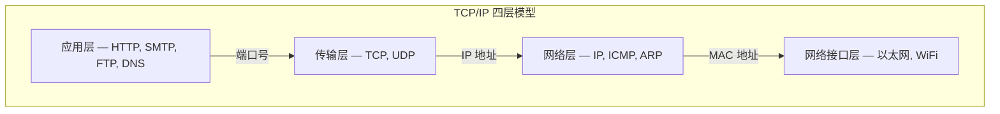
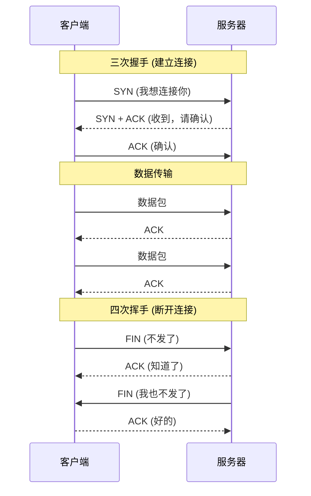
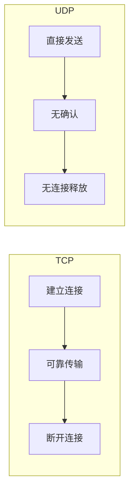
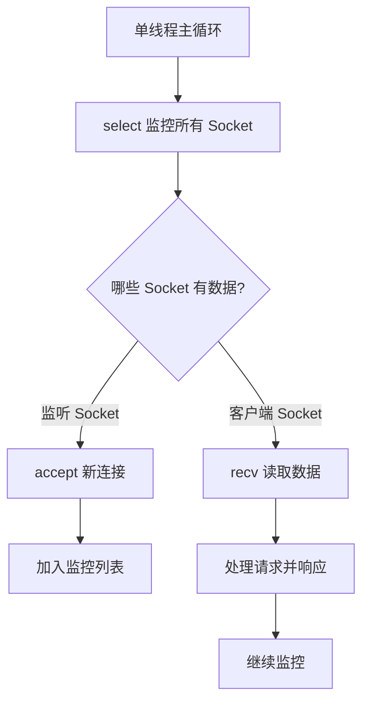
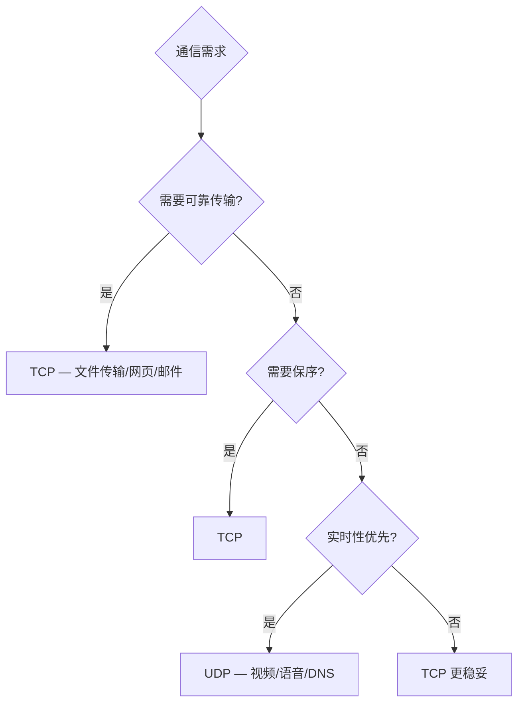

# Python 网络编程指南

**网络通信的本质是两个计算机上两个进程之间的通信。** 用 Python 进行网络编程，就是在当前 Python 进程内，连接远程服务器进程的通信端口进行通信。

> 阅读提示

- 如果你只想快速写一个 TCP 客户端/服务端，直接看 [TCP 客户端](#tcp-客户端)和[TCP 服务端](#tcp-服务端)
- 如果你想理解 TCP/UDP 选择，跳到 [TCP vs UDP 对比](#tcp-vs-udp-对比)
- 如果你想了解高并发网络服务，看 [I/O 多路复用](#io-多路复用)和[SSL/TLS 安全通信](#ssltls-安全通信)
- 本文所有代码基于 **Python 3.10+**

## 网络编程全景



## TCP/IP 协议栈

### 分层模型



### IP 协议

| 版本 | 地址长度 | 表示形式 | 地址数量 |
|------|---------|---------|---------|
| IPv4 | 32 位 | `192.168.0.1` | ~43 亿 |
| IPv6 | 128 位 | `2001:0db8:85a3::7334` | 几乎无限 |

IP 协议负责将数据分割为数据包（Packet），通过路由器逐跳转发。但 **IP 不保证送达，不保证顺序**。

### TCP 协议

TCP 建立在 IP 之上，通过以下机制提供 **可靠传输**：



**TCP 可靠性机制**：

| 机制 | 作用 |
|------|------|
| 三次握手 | 确保双方都有收发能力 |
| 序号/确认号 | 保证数据按序到达 |
| 超时重传 | 丢包时自动重发 |
| 流量控制（滑动窗口） | 防止发送方淹没接收方 |
| 拥塞控制 | 防止网络过载 |

### 端口

一台计算机上同时运行着多个网络程序。TCP 报文到达后，**端口号**决定了数据交给哪个进程。

| 端口范围 | 用途 |
|---------|------|
| 0-1023 | 知名端口（HTTP:80, HTTPS:443, SSH:22, SMTP:25） |
| 1024-49151 | 注册端口 |
| 49152-65535 | 动态/私有端口 |

**一个网络连接由四元组唯一标识：`(源IP, 源端口, 目标IP, 目标端口)`**

## Socket 编程

Socket 是网络编程的抽象概念，可以把它理解为 **"打开了一个网络连接"**。

```python
import socket

# 创建 TCP Socket
s = socket.socket(socket.AF_INET, socket.SOCK_STREAM)

# 创建 UDP Socket
s = socket.socket(socket.AF_INET, socket.SOCK_DGRAM)
```

### TCP 客户端

```python
import socket

def tcp_client(host: str, port: int, message: str) -> str:
    """TCP 客户端：连接服务器，发送消息，接收响应"""
    with socket.socket(socket.AF_INET, socket.SOCK_STREAM) as s:
        s.settimeout(10)  # 设置超时，防止永久阻塞
        s.connect((host, port))
        s.sendall(message.encode('utf-8'))  # 使用 sendall 确保完整发送

        # 接收响应
        chunks = []
        while True:
            chunk = s.recv(4096)
            if not chunk:
                break
            chunks.append(chunk)

    return b''.join(chunks).decode('utf-8')


# 使用示例
response = tcp_client('127.0.0.1', 9999, 'Hello, Server!')
print(response)
```

### TCP 服务端

```python
import socket
import threading


def handle_client(conn: socket.socket, addr: tuple[str, int]) -> None:
    """处理单个客户端连接"""
    print(f'新连接: {addr}')
    try:
        conn.settimeout(30)  # 客户端超时
        while True:
            data = conn.recv(1024)
            if not data:
                break
            print(f'收到 [{addr}]: {data.decode("utf-8").strip()}')
            conn.sendall(f'Echo: {data.decode("utf-8")}'.encode('utf-8'))
    except socket.timeout:
        print(f'客户端超时: {addr}')
    except ConnectionResetError:
        print(f'客户端断开: {addr}')
    finally:
        conn.close()


def tcp_server(host: str = '127.0.0.1', port: int = 9999) -> None:
    """多线程 TCP Echo 服务器"""
    server = socket.socket(socket.AF_INET, socket.SOCK_STREAM)
    server.setsockopt(socket.SOL_SOCKET, socket.SO_REUSEADDR, 1)  # 端口复用
    server.bind((host, port))
    server.listen(5)  # 最大等待连接数
    print(f'服务端启动: {host}:{port}')

    try:
        while True:
            conn, addr = server.accept()
            t = threading.Thread(target=handle_client, args=(conn, addr))
            t.daemon = True
            t.start()
    except KeyboardInterrupt:
        print('\n服务端关闭')
    finally:
        server.close()


if __name__ == '__main__':
    tcp_server()
```

::: tip 关键设置
- `SO_REUSEADDR`：允许服务端重启后立即复用端口，避免 `Address already in use`
- `sendall()`：确保完整发送，不要用 `send()`（可能只发送部分数据）
- `settimeout()`：设置超时，防止僵死连接永久占用资源
:::

## UDP 编程

UDP 是无连接协议，不保证送达，不保证顺序。但它 **速度快、开销小**，适合实时音视频、DNS 查询等场景。



### UDP 服务端与客户端

```python
import socket


def udp_server(host: str = '127.0.0.1', port: int = 9999) -> None:
    """UDP Echo 服务器"""
    server = socket.socket(socket.AF_INET, socket.SOCK_DGRAM)
    server.bind((host, port))
    print(f'UDP 服务端启动: {host}:{port}')

    while True:
        data, addr = server.recvfrom(1024)
        print(f'收到 [{addr}]: {data.decode("utf-8")}')
        server.sendto(f'Echo: {data.decode("utf-8")}'.encode('utf-8'), addr)


def udp_client(host: str = '127.0.0.1', port: int = 9999) -> None:
    """UDP 客户端"""
    client = socket.socket(socket.AF_INET, socket.SOCK_DGRAM)
    client.settimeout(5)

    for msg in ['Hello', 'UDP', 'World']:
        client.sendto(msg.encode('utf-8'), (host, port))
        try:
            data, addr = client.recvfrom(1024)
            print(f'服务端响应: {data.decode("utf-8")}')
        except socket.timeout:
            print('请求超时')

    client.close()
```

## socketserver 框架

Python 标准库提供了 `socketserver` 模块，封装了服务端的常见模式，避免重复造轮子。

```python
import socketserver


class EchoHandler(socketserver.BaseRequestHandler):
    """TCP Echo 处理器"""
    def handle(self) -> None:
        print(f'新连接: {self.client_address}')
        while True:
            data = self.request.recv(1024)
            if not data:
                break
            self.request.sendall(f'Echo: {data.decode()}'.encode())


class UDPHandler(socketserver.BaseRequestHandler):
    """UDP Echo 处理器"""
    def handle(self) -> None:
        data = self.request[0]  # UDP 数据在 request[0]
        socket = self.request[1]  # UDP socket 在 request[1]
        print(f'收到 [{self.client_address}]: {data.decode()}')
        socket.sendto(f'Echo: {data.decode()}'.encode(), self.client_address)


# 使用
if __name__ == '__main__':
    # 多线程 TCP 服务器
    with socketserver.ThreadingTCPServer(('127.0.0.1', 9999), EchoHandler) as server:
        print('TCP 服务器启动')
        server.serve_forever()
```

| 服务器类型 | 并发模型 | 适用场景 |
|-----------|---------|---------|
| `TCPServer` | 单线程 | 低并发、调试 |
| `ThreadingTCPServer` | 每连接一线程 | 中等并发 |
| `ForkingTCPServer` | 每连接一进程 | CPU 密集型（仅 Unix） |
| `ThreadingUDPServer` | 每请求一线程 | UDP 服务 |

## I/O 多路复用

当需要同时监控多个 Socket 的读写状态时，`select`/`selectors` 模块让你用单线程高效处理多个连接。

### select 模型



### selectors 实战：单线程高并发服务器

```python
import selectors
import socket
import types


def accept_connection(sel: selectors.DefaultSelector, sock: socket.socket) -> None:
    """接受新连接"""
    conn, addr = sock.accept()
    print(f'新连接: {addr}')
    conn.setblocking(False)

    data = types.SimpleNamespace(addr=addr, inb=b'', outb=b'')
    events = selectors.EVENT_READ | selectors.EVENT_WRITE
    sel.register(conn, events, data=data)


def service_connection(sel: selectors.DefaultSelector, key: selectors.SelectorKey, mask: int) -> None:
    """处理已有连接的读写"""
    sock = key.fileobj
    data = key.data

    if mask & selectors.EVENT_READ:
        recv_data = sock.recv(1024)
        if recv_data:
            data.outb += recv_data  # 收到的数据加入发送缓冲
        else:
            print(f'关闭连接: {data.addr}')
            sel.unregister(sock)
            sock.close()

    if mask & selectors.EVENT_WRITE and data.outb:
        sent = sock.send(data.outb)  # Echo 回去
        data.outb = data.outb[sent:]


def run_selector_server(host: str = '127.0.0.1', port: int = 9999) -> None:
    """基于 selectors 的单线程高并发 Echo 服务器"""
    sel = selectors.DefaultSelector()

    sock = socket.socket(socket.AF_INET, socket.SOCK_STREAM)
    sock.setsockopt(socket.SOL_SOCKET, socket.SO_REUSEADDR, 1)
    sock.bind((host, port))
    sock.listen()
    sock.setblocking(False)

    sel.register(sock, selectors.EVENT_READ, data=None)
    print(f'Selector 服务器启动: {host}:{port}')

    try:
        while True:
            events = sel.select(timeout=None)
            for key, mask in events:
                if key.data is None:
                    accept_connection(sel, key.fileobj)
                else:
                    service_connection(sel, key, mask)
    except KeyboardInterrupt:
        print('\n服务器关闭')
    finally:
        sel.close()
        sock.close()
```

## SSL/TLS 安全通信

当需要加密传输时，使用 Python 的 `ssl` 模块在 Socket 上包装 TLS 层。

### TLS 服务端

```python
import socket
import ssl


def tls_server(host: str = '127.0.0.1', port: int = 8443) -> None:
    """TLS 加密 Echo 服务器"""
    context = ssl.create_default_context(ssl.Purpose.CLIENT_AUTH)
    context.load_cert_chain(certfile="server.crt", keyfile="server.key")

    server = socket.socket(socket.AF_INET, socket.SOCK_STREAM)
    server.setsockopt(socket.SOL_SOCKET, socket.SO_REUSEADDR, 1)
    server.bind((host, port))
    server.listen(5)

    with context.wrap_socket(server, server_side=True) as tls_sock:
        print(f'TLS 服务器启动: {host}:{port}')
        while True:
            conn, addr = tls_sock.accept()
            try:
                data = conn.recv(1024)
                if data:
                    print(f'收到 [{addr}]: {data.decode()}')
                    conn.sendall(f'Secure Echo: {data.decode()}'.encode())
            finally:
                conn.close()
```

### TLS 客户端

```python
import socket
import ssl


def tls_client(host: str = '127.0.0.1', port: int = 8443) -> None:
    """TLS 加密客户端"""
    context = ssl.create_default_context(ssl.Purpose.SERVER_AUTH)
    # 自签名证书需要加载 CA 或禁用验证（仅测试用）
    context.check_hostname = False
    context.verify_mode = ssl.CERT_NONE

    with socket.create_connection((host, port)) as sock:
        with context.wrap_socket(sock, server_hostname=host) as tls_sock:
            tls_sock.sendall(b'Hello, TLS Server!')
            data = tls_sock.recv(1024)
            print(f'响应: {data.decode()}')
```

::: warning 生产环境 SSL 配置
生产环境中不要使用 `CERT_NONE`。应使用受信任的 CA 证书，并正确配置 `check_hostname = True`。可使用 Let's Encrypt 免费获取证书。
:::

## 实战场景

### 场景一：文件传输服务器

```python
import socket
import struct
import json
import os


def send_file(sock: socket.socket, file_path: str) -> None:
    """发送文件：先发元数据，再发内容"""
    file_size = os.path.getsize(file_path)
    file_name = os.path.basename(file_path)

    # 发送元数据（JSON 头 + 4字节长度前缀）
    metadata = json.dumps({"name": file_name, "size": file_size}).encode()
    sock.sendall(struct.pack('!I', len(metadata)))  # 元数据长度
    sock.sendall(metadata)  # 元数据内容

    # 发送文件内容
    with open(file_path, 'rb') as f:
        while True:
            chunk = f.read(65536)  # 64KB 块
            if not chunk:
                break
            sock.sendall(chunk)

    print(f'已发送: {file_name} ({file_size} bytes)')


def receive_file(sock: socket.socket, save_dir: str = '.') -> str:
    """接收文件：先收元数据，再收内容"""
    # 接收元数据长度
    raw_len = _recv_exactly(sock, 4)
    meta_len = struct.unpack('!I', raw_len)[0]

    # 接收元数据
    metadata = json.loads(_recv_exactly(sock, meta_len))
    file_name = metadata['name']
    file_size = metadata['size']

    # 接收文件内容
    save_path = os.path.join(save_dir, file_name)
    received = 0
    with open(save_path, 'wb') as f:
        while received < file_size:
            chunk = sock.recv(min(65536, file_size - received))
            if not chunk:
                break
            f.write(chunk)
            received += len(chunk)

    print(f'已接收: {file_name} ({received} bytes)')
    return save_path


def _recv_exactly(sock: socket.socket, n: int) -> bytes:
    """精确接收 n 字节"""
    data = b''
    while len(data) < n:
        chunk = sock.recv(n - len(data))
        if not chunk:
            raise ConnectionError('连接断开')
        data += chunk
    return data
```

### 场景二：多人聊天服务器

```python
import socket
import threading
from collections.abc import Callable


class ChatServer:
    """简单的多人聊天服务器"""

    def __init__(self, host: str = '127.0.0.1', port: int = 8888) -> None:
        self.host = host
        self.port = port
        self.clients: dict[socket.socket, str] = {}
        # RLock 可重入：broadcast 持锁期间可能经 remove_client 再次加锁
        self.lock = threading.RLock()

    def broadcast(self, message: str, exclude: socket.socket | None = None) -> None:
        """向所有客户端广播消息"""
        with self.lock:
            for client in list(self.clients.keys()):
                if client != exclude:
                    try:
                        client.sendall(message.encode('utf-8'))
                    except ConnectionError:
                        self.remove_client(client)

    def remove_client(self, client: socket.socket) -> None:
        """移除客户端"""
        with self.lock:
            name = self.clients.pop(client, 'Unknown')
        try:
            client.close()
        except OSError:
            pass
        self.broadcast(f'[系统] {name} 离开了聊天室\n')

    def handle_client(self, conn: socket.socket, addr: tuple[str, int]) -> None:
        """处理客户端消息"""
        try:
            # 第一个消息是用户名
            name = conn.recv(1024).decode('utf-8').strip()
            with self.lock:
                self.clients[conn] = name
            self.broadcast(f'[系统] {name} 加入了聊天室\n', exclude=conn)

            while True:
                data = conn.recv(1024)
                if not data:
                    break
                msg = data.decode('utf-8').strip()
                if msg:
                    self.broadcast(f'[{name}] {msg}\n', exclude=conn)
        except ConnectionResetError:
            pass
        finally:
            self.remove_client(conn)

    def start(self) -> None:
        """启动聊天服务器"""
        server = socket.socket(socket.AF_INET, socket.SOCK_STREAM)
        server.setsockopt(socket.SOL_SOCKET, socket.SO_REUSEADDR, 1)
        server.bind((self.host, self.port))
        server.listen(10)
        print(f'聊天服务器启动: {self.host}:{self.port}')

        try:
            while True:
                conn, addr = server.accept()
                t = threading.Thread(target=self.handle_client, args=(conn, addr))
                t.daemon = True
                t.start()
        except KeyboardInterrupt:
            print('\n服务器关闭')
        finally:
            server.close()


if __name__ == '__main__':
    ChatServer().start()
```

### 场景三：端口扫描器

```python
import socket
import concurrent.futures
from dataclasses import dataclass


@dataclass
class ScanResult:
    port: int
    is_open: bool
    service: str


# 常见端口与服务映射
COMMON_PORTS = {
    21: "FTP", 22: "SSH", 23: "Telnet", 25: "SMTP",
    53: "DNS", 80: "HTTP", 110: "POP3", 143: "IMAP",
    443: "HTTPS", 993: "IMAPS", 995: "POP3S",
    3306: "MySQL", 5432: "PostgreSQL", 6379: "Redis",
    8080: "HTTP-Alt", 8443: "HTTPS-Alt", 27017: "MongoDB",
}


def scan_port(host: str, port: int, timeout: float = 1.0) -> ScanResult:
    """扫描单个端口"""
    try:
        with socket.socket(socket.AF_INET, socket.SOCK_STREAM) as s:
            s.settimeout(timeout)
            result = s.connect_ex((host, port))
            is_open = result == 0
            service = COMMON_PORTS.get(port, "Unknown")
            return ScanResult(port=port, is_open=is_open, service=service)
    except socket.error:
        return ScanResult(port=port, is_open=False, service="")


def port_scan(host: str, ports: range | list[int], timeout: float = 1.0, workers: int = 100) -> list[ScanResult]:
    """并发端口扫描"""
    open_ports = []
    with concurrent.futures.ThreadPoolExecutor(max_workers=workers) as executor:
        futures = {executor.submit(scan_port, host, p, timeout): p for p in ports}
        for future in concurrent.futures.as_completed(futures):
            result = future.result()
            if result.is_open:
                open_ports.append(result)

    return sorted(open_ports, key=lambda r: r.port)


# 使用示例
if __name__ == '__main__':
    target = '127.0.0.1'
    print(f'扫描 {target} ...')
    results = port_scan(target, range(1, 1024), timeout=0.5)
    for r in results:
        print(f'  端口 {r.port:>5} 开放  [{r.service}]')
    print(f'共发现 {len(results)} 个开放端口')
```

## TCP vs UDP 对比



| 特性 | TCP | UDP |
|------|-----|-----|
| 连接 | 面向连接（三次握手） | 无连接 |
| 可靠性 | 保证送达、保序 | 不保证 |
| 速度 | 慢（握手、重传、流控） | 快 |
| 头部开销 | 20 字节 | 8 字节 |
| 流量控制 | 有（滑动窗口） | 无 |
| 拥塞控制 | 有 | 无 |
| 适用场景 | HTTP、FTP、SMTP、SSH | DNS、VoIP、视频直播、游戏 |
| Python API | `SOCK_STREAM` | `SOCK_DGRAM` |

## 常见陷阱

| 陷阱 | 现象 | 原因 | 解决方案 |
|------|------|------|----------|
| 不设 `SO_REUSEADDR` | 服务端重启报 `Address already in use` | 端口处于 TIME_WAIT 状态 | `setsockopt(SOL_SOCKET, SO_REUSEADDR, 1)` |
| `recv` 假定一次收完 | 数据截断或丢失 | TCP 是流式协议，数据可能分多次到达 | 循环接收直到协议定义的结束标记 |
| `send` 假定一次发完 | 数据只发送了一部分 | 发送缓冲区满时部分发送 | 使用 `sendall()` |
| 阻塞式 I/O 卡住主线程 | 一个慢客户端阻塞整个服务 | 单线程无法同时处理多连接 | 多线程/select/asyncio |
| 不设超时 | 僵死连接永久占用资源 | 默认无超时 | `socket.settimeout()` |
| 忽略 `ConnectionResetError` | 服务端崩溃 | 客户端异常断开 | try/except 捕获并清理 |
| TCP 粘包 | 多次发送的数据被合并接收 | TCP 是字节流，无消息边界 | 设计消息头（长度前缀）或分隔符 |
| UDP 丢包无感知 | 数据丢失但不知道 | UDP 不保证送达 | 应用层实现确认/重传（或改用 TCP） |

### 陷阱详解：TCP 粘包

```python
# ❌ 问题：连续发送两条消息，接收方可能一次收到 "HelloWorld"
conn.sendall(b'Hello')
conn.sendall(b'World')
# 接收方: data = conn.recv(1024) → b'HelloWorld'  # 粘在一起了！

# ✅ 解决方案1：长度前缀
import struct

def send_message(sock, data: bytes) -> None:
    """先发4字节长度，再发数据"""
    sock.sendall(struct.pack('!I', len(data)))
    sock.sendall(data)

def recv_message(sock) -> bytes:
    """先收4字节长度，再收完整数据"""
    raw_len = _recv_exactly(sock, 4)
    msg_len = struct.unpack('!I', raw_len)[0]
    return _recv_exactly(sock, msg_len)

# ✅ 解决方案2：换行分隔符（适合文本协议）
def send_line(sock, text: str) -> None:
    sock.sendall((text + '\n').encode('utf-8'))
```

## 最佳实践速查表

| 场景 | 推荐做法 | 避免 |
|------|---------|------|
| TCP 服务端 | `SO_REUSEADDR` + `sendall` + `settimeout` | 直接 `send` + 无超时 |
| 多客户端 | `selectors`（单线程高并发） | 无限创建线程 |
| 消息边界 | 长度前缀或分隔符 | 依赖 `recv` 一次收完 |
| 安全通信 | `ssl` 模块包装 TLS | 明文传输敏感数据 |
| 生产 HTTP | `requests` / `httpx` | 手写 Socket HTTP |
| 端口选择 | 1024-65535（非知名端口） | 使用 0-1023 知名端口 |
| 错误处理 | try/except 捕获所有 socket 异常 | 忽略 `ConnectionResetError` |
| 资源释放 | `with` 语句或 try/finally | 忘记 `close()` |

## 术语表

| 术语 | 英文 | 定义 |
|------|------|------|
| Socket | Socket | 网络通信的端点抽象，由 IP 地址 + 端口号 + 协议类型标识 |
| TCP | Transmission Control Protocol | 面向连接的可靠传输协议 |
| UDP | User Datagram Protocol | 无连接的不可靠传输协议 |
| 端口 | Port | 传输层用于区分不同应用进程的编号（0-65535） |
| 粘包 | Packet Concatenation | TCP 字节流中多条消息被合并接收的现象 |
| I/O 多路复用 | I/O Multiplexing | 单线程同时监控多个文件描述符读写状态的技术 |
| select | select | POSIX 标准的 I/O 多路复用系统调用 |
| selectors | selectors | Python 标准库对 select/poll/epoll 的统一封装 |
| SSL/TLS | Secure Sockets Layer / Transport Layer Security | 网络通信加密协议 |
| 三次握手 | Three-way Handshake | TCP 建立连接的三次报文交互过程 |
| 四次挥手 | Four-way Handshake | TCP 断开连接的四次报文交互过程 |
| TIME_WAIT | TIME_WAIT | TCP 主动关闭方等待 2MSL 后释放连接的状态 |

## 延伸阅读

### 官方文档

- [Python socket 模块文档](https://docs.python.org/3/library/socket.html)
- [Python socketserver 文档](https://docs.python.org/3/library/socketserver.html)
- [Python ssl 模块文档](https://docs.python.org/3/library/ssl.html)
- [Python selectors 文档](https://docs.python.org/3/library/selectors.html)
- [Python urllib 文档](https://docs.python.org/3/library/urllib.html) — HTTP 客户端请求
- [Python http 文档](https://docs.python.org/3/library/http.html) — HTTP 服务器与客户端

### 经典参考

- [Beej's Guide to Network Programming](https://beej.us/guide/bgnet/) — C 语言视角，原理通用
- [TCP/IP 详解](http://www.tcpipguide.com/)
- [Real Python — Socket Programming in Python](https://realpython.com/python-sockets/)

### 推荐阅读

- 本系列：[迭代器与生成器](01-迭代器与生成器) — 生成器在流式数据处理中的应用
- 本系列：[并发与并行编程总览](../01-并发编程/00-并发与并行编程总览) — 多线程/多进程网络服务
- 本站：[爬虫概览与HTTP基础](../../01-Web与爬虫/02-爬虫/01-爬虫概览与HTTP基础) — HTTP 协议与网络请求

## 版本差异（类型注解 → Python 3.13/3.14）

| 特性 | 本文编写时 | Python 3.13/3.14 |
|------|-----------|------------------|
| 注解求值 | 运行时立即求值 | PEP 649/749（3.14）：延迟求值，类型注解不再在定义时执行 |
| 类型别名 | `TypeAlias` / 赋值 | 3.12 引入 `type X = ...` 语句 |
| 联合类型 | `Union[X, Y]` | 3.10+ 使用 `X \| Y` 语法 |
| `Self` 类型 | 手动标注 | 3.11+ `typing.Self` |
| 泛型语法 | `TypeVar` 冗长语法 | 3.12 PEP 695 类型参数语法 `def f[T](...)` |

> 本文讲解的 typing 核心概念在 3.14 中成立；新项目建议使用 3.12+ 的 `type` 语句与 PEP 695 语法，注解延迟求值让前向引用更简单。
