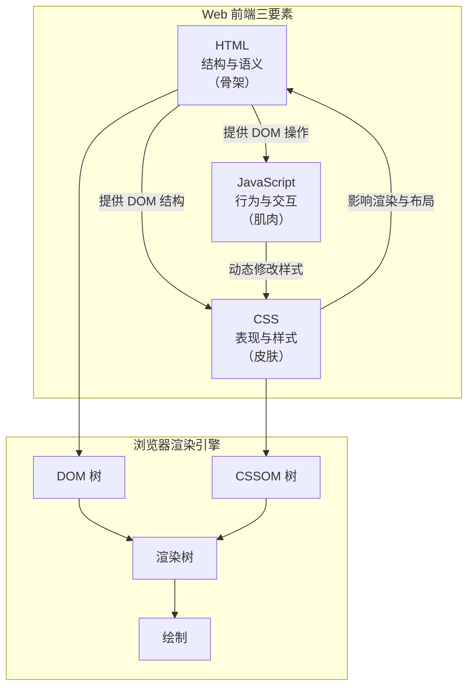
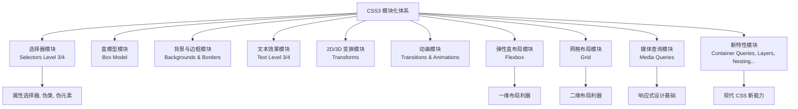
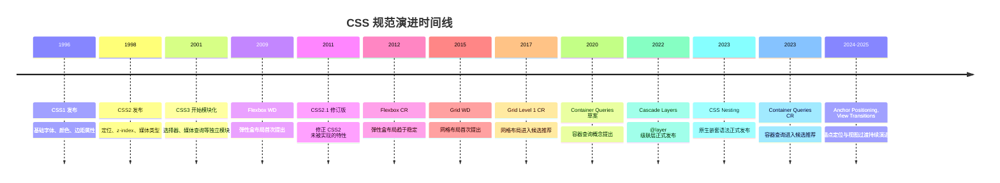
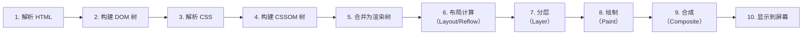
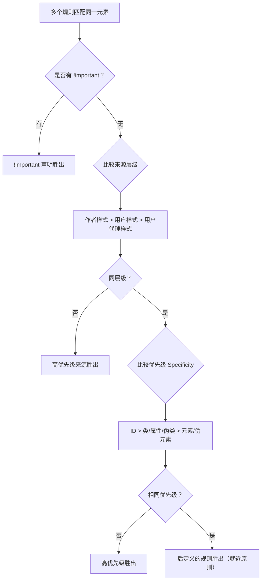
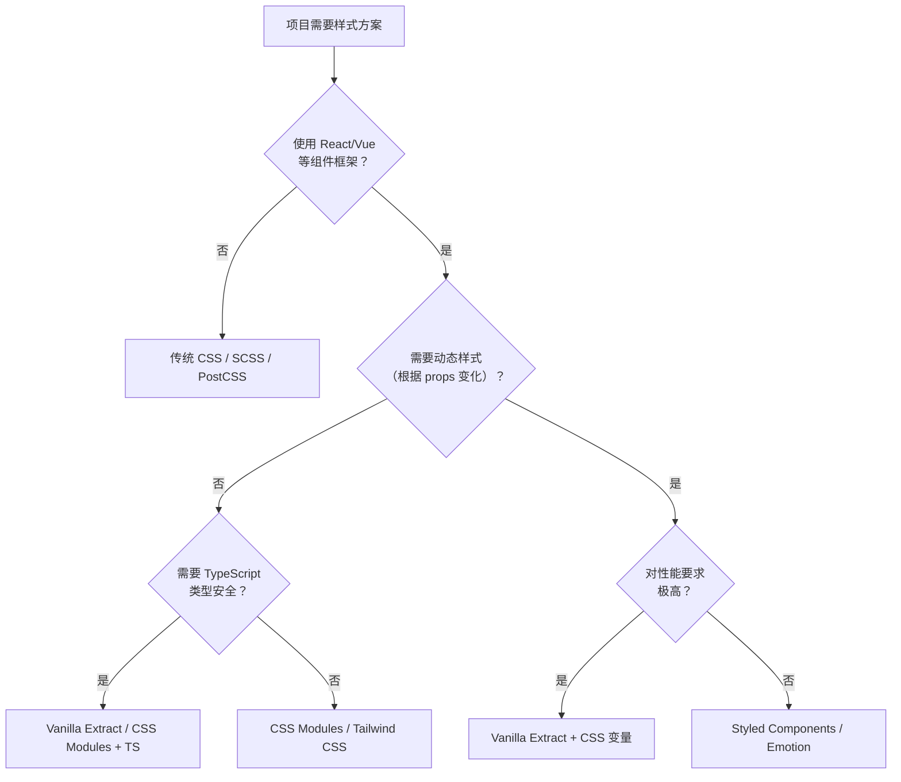

# CSS 概述

## 背景与动机

### 为什么需要 CSS？

在 Web 早期（1991-1996），HTML 同时承担着**描述内容结构**和**控制视觉表现**的双重职责。开发者不得不使用大量 `<font>`、`<center>`、`<blink>` 等标签来美化页面，导致了严重的工程问题：

- **代码冗余**：每个页面都充斥着重复的样式标签，维护成本极高
- **结构混乱**：内容与表现耦合，无法独立修改样式
- **文件膨胀**：样式代码占据大量带宽，页面加载缓慢
- **跨平台困难**：无法针对不同设备（屏幕、打印机、屏幕阅读器）提供不同表现

CSS（Cascading Style Sheets，层叠样式表）的诞生正是为了解决上述问题——**将内容的结构（HTML）与内容的表现（样式）彻底分离**。这一分离带来了：

1. **关注点分离**：HTML 专注语义结构，CSS 专注视觉表现
2. **代码复用**：一份样式表可控制多个页面
3. **可维护性**：修改样式只需改一处，全站生效
4. **性能优化**：样式表可被浏览器缓存
5. **多设备适配**：通过媒体查询为不同设备提供不同样式

### CSS 在 Web 技术栈中的位置



CSS 是连接 HTML 结构与用户视觉体验的桥梁。浏览器解析 CSS 后构建 **CSSOM（CSS Object Model）树**，与 DOM 树合并形成**渲染树**，最终经过布局（Layout）和绘制（Paint）将页面呈现给用户。

---

## 核心概念

### CSS 的三大核心机制

CSS 的设计哲学建立在三个核心机制之上，它们共同决定了样式如何应用到元素上：

| 机制 | 定义 | 作用 | 示例 |
|------|------|------|------|
| **层叠性（Cascading）** | 多条样式规则可以叠加应用到同一元素，通过优先级算法决定最终样式 | 解决样式冲突 | 多个选择器选中同一元素时，优先级高的生效 |
| **继承性（Inheritance）** | 子元素自动获得父元素的某些属性值 | 减少重复代码 | 父元素设置 `color: red`，子元素文字也变红 |
| **优先级（Specificity）** | 浏览器通过权重算法决定哪个规则生效 | 精确控制样式 | ID 选择器 > 类选择器 > 元素选择器 |

> **继承性的细节**：并非所有 CSS 属性都会继承。一般来说，控制文本外观的属性（`color`、`font-*`、`line-height`、`text-*`、`visibility`）会继承；而控制盒模型的属性（`margin`、`padding`、`border`、`width`、`height`）以及定位属性（`position`、`display`、`float`）不会继承。可以通过 `inherit`、`initial`、`unset`、`revert` 等关键字显式控制继承行为。

### CSS 的作用领域

| 作用领域 | 说明 | 典型属性/特性 |
|----------|------|---------------|
| 视觉表现 | 控制颜色、字体、间距、背景等 | `color`, `font-size`, `padding`, `background` |
| 布局系统 | 控制元素的排列方式和空间分配 | `display: flex/grid`, `position`, `float` |
| 内容分离 | 结构与表现分离，提高可维护性 | 外部样式表、CSS 变量 |
| 响应式设计 | 适配不同设备和屏幕尺寸 | `@media`, `@container`, 视口单位 |
| 交互动画 | 实现过渡、动画等交互效果 | `transition`, `animation`, `transform` |
| 打印控制 | 控制打印样式 | `@media print`, `@page` |
| 可访问性 | 辅助屏幕阅读器等辅助设备 | `:focus-visible`, `prefers-reduced-motion` |

---

## 深入原理

### CSS 的发展历程

| 版本 | 发布时间 | 主要特性 | 历史意义 |
|------|----------|----------|----------|
| CSS1 | 1996 年 | 基础样式属性（字体、颜色、边距等） | CSS 的诞生，首次实现样式与结构分离 |
| CSS2 | 1998 年 | 定位、z-index、媒体类型、绝对/相对定位 | 奠定了现代布局的基础 |
| CSS2.1 | 2011 年 | CSS2 的修订版，删除部分未被实现的特性 | 修正 CSS2 中的问题，提高浏览器一致性 |
| CSS3 | 2011 年至今 | **模块化设计**，新增动画、弹性盒、网格、变换等 | CSS 进入现代化，功能大幅增强 |
| CSS 新特性（Level 4+） | 持续演进 | 容器查询、级联层、子网格、视图过渡、嵌套语法等 | CSS 能力持续扩展，逼近预处理器 |

### CSS3 模块化设计的意义

CSS3 最重要的变革是**模块化设计**。CSS2 是一个庞大的单体规范，而 CSS3 将其拆分为独立模块，每个模块可以独立演进和实现：



模块化带来的好处：
- **独立演进**：每个模块有自己的版本号和成熟度（CR/WD/ED）
- **渐进实现**：浏览器可以逐个模块实现，不需要等整个规范完成
- **向后兼容**：新模块不影响旧模块的行为
- **特性检测**：可以使用 `@supports` 检测单个模块的支持情况

### CSS 规范制定流程与演进路线

CSS 规范由 **W3C CSS Working Group** 制定，遵循严格的成熟度阶段模型。理解这一流程有助于判断某个 CSS 特性的稳定性和生产可用性。



#### W3C 规范成熟度阶段

CSS 规范从提案到正式推荐，需要经历以下阶段：

| 阶段 | 缩写 | 含义 | 生产可用性 |
|------|------|------|------------|
| **Editor's Draft** | ED | 编辑草案，由规范编辑维护 | ❌ 不稳定，随时可能变化 |
| **Working Draft** | WD | 工作草案，工作组发布的正式初稿 | ❌ 可能大幅修改 |
| **Candidate Recommendation** | CR | 候选推荐，征求社区实现反馈 | ⚠️ 较稳定，可实验性使用 |
| **Candidate Recommendation Snapshot** | CR Snapshot | CR 的快照版本 | ⚠️ 需要至少两个独立实现 |
| **Proposed Recommendation** | PR | 提案推荐，提交给 W3C 顾问委员会审批 | ✅ 基本稳定 |
| **Recommendation** | REC | 正式推荐，W3C 正式推荐标准 | ✅ 可在生产环境使用 |

> **实践建议**：判断一个 CSS 特性是否可用于生产环境，不应只看规范阶段，更要看**浏览器实现情况**。使用 [Can I Use](https://caniuse.com/) 查询具体浏览器支持率，使用 `@supports` 做特性检测。

#### CSS Working Group 的工作方式

CSS Working Group（CSSWG）是 W3C 的核心工作组之一，其运作机制如下：

1. **议题提出**：任何人都可以通过 [GitHub Issues](https://github.com/w3c/csswg-drafts) 提出规范问题或功能建议
2. **讨论与决议**：CSSWG 成员每周举行电话会议（IRC 形式），讨论议题并投票决议
3. **规范编写**：编辑根据决议更新规范草案
4. **浏览器实现**：浏览器厂商根据 CR 阶段规范进行实验性实现（通过 `-webkit-`、`-moz-` 等前缀或 Flag 开关）
5. **互操作性测试**：通过 [Web Platform Tests (WPT)](https://web-platform-tests.org/) 确保不同浏览器实现一致
6. **正式发布**：满足退出条件后，规范从 CR 推进到 PR 再到 REC

> **关键参与者**：Apple（Safari/WebKit）、Google（Chrome/Blink）、Mozilla（Firefox/Gecko）、Microsoft（Edge/Blink）的工程师是 CSSWG 的核心力量。他们既实现引擎，也参与规范制定——这意味着 CSS 规范是"实现驱动"的，而非纯理论设计。

### 浏览器处理 CSS 的完整流程

理解浏览器如何处理 CSS 是前端性能优化的基础。以下是完整的渲染流水线：



**关键阶段详解：**

1. **DOM 构建**：浏览器逐字节解析 HTML，构建 DOM 树。遇到 `<link rel="stylesheet">` 或 `<style>` 时，**不阻塞 DOM 构建**但**阻塞渲染**。
2. **CSSOM 构建**：浏览器解析所有 CSS（外部样式表、内部样式、行内样式），构建 CSSOM 树。此过程**阻塞渲染**——因为浏览器需要完整的样式信息才能绘制。
3. **渲染树构建**：将 DOM 和 CSSOM 合并为渲染树。渲染树只包含**可见节点**（`display: none` 的节点不在渲染树中，但 `visibility: hidden` 的节点在）。
4. **布局（Layout）**：计算每个节点在视口中的精确位置和大小。这是性能瓶颈之一——**重排（Reflow）**。
5. **绘制（Paint）**：将节点转换为实际像素。
6. **合成（Composite）**：将不同图层合成为最终画面。`transform` 和 `opacity` 的变化只触发合成，不触发重排和重绘——这是性能优化的关键。

### CSS 解析引擎与样式计算流程（底层原理）

浏览器的 CSS 处理远比"解析 → CSSOM"这个简化描述复杂得多。下面深入剖析 CSS 解析引擎的内部工作机制。

#### CSS 词法分析与语法解析

CSS 解析分为两个阶段：**词法分析（Tokenization）** 和**语法解析（Parsing）**。

```mermaid
flowchart LR
    subgraph "CSS 解析引擎"
        RAW["原始 CSS 文本"] --> TOK["词法分析器<br/>Tokenizer"]
        TOK -->|"产出 Token 流"| PARSE["语法解析器<br/>Parser"]
        PARSE -->|"产出"| STYLE["CSSStyleSheet<br/>对象"]
        STYLE --> RULE["CSSRule 列表"]
        RULE --> DECL["CSSStyleDeclaration<br/>（每条规则的声明）"]
    end

    subgraph "样式计算"
        DECL --> MATCH["选择器匹配<br/>Selector Matching"]
        MATCH -->|"匹配到元素"| COMP["样式计算<br/>Style Computation"]
        COMP -->|"合并继承+层叠"| RESOLVE["计算值解析<br/>Resolved Values"]
        RESOLVE -->|"含单位转换、calc 计算"| USED["使用值<br/>Used Values"]
    end

```



**1. 词法分析（Tokenization）**

CSS 词法分析器将原始文本拆分为 Token 流。CSS 规范（CSS Syntax Module Level 3）定义了以下 Token 类型：

- **标识符 Token**（`<ident-token>`）：如 `color`、`flex`、`red`
- **函数 Token**（`<function-token>`）：如 `rgb(`、`calc(`、`var(`
- **数值 Token**（`<number-token>`、`<dimension-token>`、`<percentage-token>`）：如 `16`、`16px`、`50%`
- **字符串 Token**（`<string-token>`）：如 `"Microsoft YaHei"`
- **分隔符 Token**：`{`、`}`、`(`、`)`、`,`、`;`、`:` 等
- **选择器 Token**：`.`、`#`、`>`、`+`、`~`、`*` 等
- **注释**：`/* ... */`（在 Token 化阶段被丢弃）
- **空白符**：空格、换行、制表符（多数情况下被忽略）

> **错误恢复机制**：CSS 解析器具有强大的容错能力。遇到无效属性时，解析器会跳过该声明继续解析下一个；遇到无效选择器时，会丢弃整个规则集。这就是为什么旧浏览器能安全忽略新 CSS 特性——**CSS 的错误恢复是规范的一部分**。

**2. 语法解析（Parsing）**

语法解析器将 Token 流组织为结构化的 `CSSStyleSheet` → `CSSRule` → `CSSStyleDeclaration` 对象树。每个规则被解析为选择器和声明块，声明块中的每个声明被解析为属性名-值对。

**3. 选择器匹配（Selector Matching）**

这是性能关键环节。浏览器需要为 DOM 树中的每个元素找到所有匹配的 CSS 规则。**关键优化：浏览器从右向左匹配选择器**。

```css
/* 浏览器从右向左匹配 */
.container .nav .item a { color: red; }
/* 匹配顺序：a → .item → .nav → .container */
```

为什么从右向左？因为从右向左可以尽早排除不匹配的元素。如果从左向右，浏览器需要先找到所有 `.container`，再遍历其子元素找 `.nav`，以此类推——大量中间节点需要遍历。从右向左则先找 `a` 标签（数量远少于所有元素），再逐级向上检查祖先——效率更高。

现代浏览器还使用了多种优化策略：
- **布隆过滤器（Bloom Filter）**：Blink 引擎使用布隆过滤器快速判断一个元素是否可能匹配某个选择器
- **选择器索引**：按 ID、类名等建立索引，减少遍历范围
- **样式缓存**：对于相同标签名和属性的元素，缓存匹配结果

**4. 样式计算（Style Computation）**

对于每个元素，浏览器将所有匹配的规则按层叠算法合并，最终计算出一个"计算样式"（Computed Style）。这个过程包括：

- **层叠排序**：按 `!important` → 来源层级 → 优先级 → 顺序 排序
- **继承处理**：对可继承属性，如果没有指定值则从父元素继承
- **值解析**：将相对值（`em`、`rem`、`%`、`calc()`）解析为绝对值
- **关键字解析**：将 `inherit`、`initial`、`unset`、`revert` 解析为具体值
- **动画值合并**：如果有正在运行的动画或过渡，将动画值与基础值合并

**5. 计算值 → 使用值 → 实际值**

CSS 属性的值经历三次转换：

| 阶段 | 名称 | 说明 | 示例 |
|------|------|------|------|
| Computed Value | 计算值 | 解析 `em`/`rem` 等相对单位与不含百分比的 `calc()`（依赖布局的百分比留到使用值阶段） | `font-size: 1.5em` → `24px`（父元素 16px） |
| Used Value | 使用值 | 布局计算后确定的值，依赖上下文 | `width: auto` → `1000px`；`width: calc(100% - 20px)` → `980px`（容器 1000px） |
| Actual Value | 实际值 | 浏览器最终渲染使用的值，可能受设备限制 | `font-size: 0.5px` → 浏览器可能限制为最小 `1px` |

### CSS 的阻塞行为

| 类型 | 是否阻塞 DOM 解析 | 是否阻塞渲染 | 说明 |
|------|-------------------|--------------|------|
| 外部样式表 `<link>` | ❌ 否 | ✅ 是 | 会阻塞渲染直到加载并解析完成 |
| 内部样式表 `<style>` | ❌ 否 | ✅ 是 | 会阻塞渲染直到解析完成 |
| 行内样式 `style=""` | ❌ 否 | ❌ 否 | 不涉及网络请求，随 DOM 一起解析 |
| `@import` | ❌ 否 | ✅ 是 | 串行加载，比 `<link>` 更慢 |
| 媒体查询不匹配 | ❌ 否 | ❌ 否 | 浏览器仍然下载但不解析，不阻塞渲染 |
| `<link rel="preload" as="style">` | ❌ 否 | ❌ 否 | 预加载不阻塞，需配合 `onload` 切换 |

### CSS 层叠机制详解

当多个样式规则应用到同一元素时，CSS 通过一套精密的算法决定最终样式。这个算法称为**层叠（Cascade）算法**：



**层叠来源优先级（从高到低）：**

```
用户代理 !important > 用户 !important > 作者 !important
> 作者正常样式 > 用户正常样式 > 用户代理正常样式
```

> **注意**：CSS Cascading Level 5 引入了 `@layer`（级联层），它在「作者正常样式」内部又增加了一个优先级维度——层叠层的优先级低于无层声明的样式。

#### Specificity 优先级计算

Specificity 是一个四元组 `(a, b, c, d)`，按位比较（不进制）：

| 选择器类型 | 贡献值 | 示例 |
|------------|--------|------|
| 行内样式 `style=""` | `(1, 0, 0, 0)` | `<p style="color:red">` |
| ID 选择器 | `(0, 1, 0, 0)` | `#header` |
| 类选择器、属性选择器、伪类 | `(0, 0, 1, 0)` | `.active`、`[type="text"]`、`:hover` |
| 元素选择器、伪元素 | `(0, 0, 0, 1)` | `div`、`::before` |
| 通配符 `*`、组合器 | `(0, 0, 0, 0)` | `*`、`>`、`+`、`~` |

```css
/* 计算示例 */
div p { }              /* (0, 0, 0, 2) */
.nav .item a { }       /* (0, 0, 3, 1) */
#sidebar .link { }     /* (0, 1, 1, 0) */
#main #content p { }   /* (0, 2, 0, 1) */
```

> **`@layer` 对层叠的影响**：CSS Cascade Level 5 引入了 `@layer`，它在 Specificity 之前参与排序。声明了 `@layer` 的样式优先级低于未声明 `@layer` 的样式。多个 `@layer` 之间，**先声明的优先级更低**（与常规 CSS "后定义覆盖先定义" 相反）。

---

## CSS Houdini：扩展浏览器的渲染引擎

**CSS Houdini** 是一组底层浏览器 API 的统称，它允许开发者直接参与浏览器的 CSS 解析、盒模型计算、布局和绘制过程——相当于"打开了浏览器的渲染引擎黑箱"。

#### 为什么需要 CSS Houdini？

在 Houdini 之前，新 CSS 特性的实现完全依赖浏览器厂商，开发者只能被动等待。这导致了：

- **新特性落地慢**：一个 CSS 特性从提案到所有浏览器支持可能需要 5-10 年
- **Polyfill 困难**：CSS 的新功能（如自定义属性、`@supports`）很难用 JavaScript 完美模拟
- **性能瓶颈**：用 JS 实现的 CSS 效果（如 Masonry 布局）需要强制浏览器同步布局，性能极差
- **一致性差**：不同浏览器的 CSS 实现存在细微差异，难以统一

#### CSS Houdini 的七大 API

| API | 成熟度 | 功能 | 用途 |
|-----|--------|------|------|
| **CSS Properties and Values API** | ✅ 已广泛支持 | 注册自定义属性（带类型、继承、初始值） | 让 CSS 变量可被动画化、类型检查 |
| **CSS Typed OM** | ✅ 已广泛支持 | 将 CSS 值从字符串改为类型化对象 | 性能更好、运算更方便 |
| **Paint Worklet API** | ✅ Chrome/Edge 支持 | 自定义绘制行为（类似 `<canvas>`） | 自定义背景、装饰效果 |
| **Layout Worklet API** | ⚠️ Chrome/Edge（Flag） | 自定义布局算法 | 实现 Masonry、自定义 Grid 等 |
| **Animation Worklet API** | ⚠️ 实验性 | 自定义动画逻辑，独立于主线程 | 高性能滚动驱动动画 |
| **Parser API** | ❌ 未实现 | 扩展 CSS 语法解析 | 让浏览器理解自定义 CSS 语法 |
| **Font Metrics API** | ❌ 早期草案 | 获取字体度量信息 | 精确排版控制 |

#### CSS Properties and Values API 示例

```javascript
// 注册自定义属性，使其可被动画化
CSS.registerProperty({
  name: '--gradient-start',
  syntax: '<color>',
  inherits: false,
  initialValue: '#3498db'
});

CSS.registerProperty({
  name: '--gradient-end',
  syntax: '<color>',
  inherits: false,
  initialValue: '#2ecc71'
});
```

```css
/* 注册后，自定义属性可以被 transition/animation 平滑过渡 */
.box {
  --gradient-start: #3498db;
  --gradient-end: #2ecc71;
  background: linear-gradient(135deg, var(--gradient-start), var(--gradient-end));
  transition: --gradient-start 0.5s, --gradient-end 0.5s;
}

.box:hover {
  --gradient-start: #e74c3c;
  --gradient-end: #f39c12;
}
```

#### Paint Worklet 示例

```javascript
// checkerboard-painter.js
class CheckerboardPainter {
  static get inputProperties() {
    return ['--checker-size', '--checker-color-a', '--checker-color-b'];
  }

  paint(ctx, size, properties) {
    const sizeVal = parseInt(properties.get('--checker-size')) || 32;
    const colorA = properties.get('--checker-color-a').toString().trim() || '#fff';
    const colorB = properties.get('--checker-color-b').toString().trim() || '#000';

    const cols = Math.ceil(size.width / sizeVal);
    const rows = Math.ceil(size.height / sizeVal);

    for (let y = 0; y < rows; y++) {
      for (let x = 0; x < cols; x++) {
        ctx.fillStyle = (x + y) % 2 === 0 ? colorA : colorB;
        ctx.fillRect(x * sizeVal, y * sizeVal, sizeVal, sizeVal);
      }
    }
  }
}

registerPaint('checkerboard', CheckerboardPainter);
```

```html
<!-- 在 HTML 中注册 Worklet -->
<script>
  CSS.paintWorklet.addModule('checkerboard-painter.js');
</script>
```

```css
.element {
  --checker-size: 20px;
  --checker-color-a: #f0f0f0;
  --checker-color-b: #cccccc;
  background: paint(checkerboard);
}
```

#### CSS Houdini 的浏览器支持现状

截至 2026 年，CSS Houdini 的支持情况（以 Can I Use 实时数据为准）：

- **CSS Properties and Values API（`@property`）**：Chrome 85+、Edge 85+、Safari 16.4+、Firefox 128+
- **CSS Typed OM**：Chrome 66+、Edge 79+，Safari/Firefox 部分支持
- **Paint Worklet**：Chrome 65+、Edge 79+（Firefox 与 Safari 暂不支持）
- **Layout Worklet / Animation Worklet**：仅 Chromium 系浏览器（部分需 Flag）

> **注意**：Firefox 对 Worklet 类 API 长期持保守态度（目前仅落地 `@property`、Typed OM 等基础 API）。因此，使用 Worklet 类能力时需要做充分的降级处理。

---

## CSS-in-JS 与传统 CSS 的对比分析

随着 React、Vue 等组件化框架的兴起，**CSS-in-JS** 方案应运而生。它将 CSS 样式直接写在 JavaScript 中，与组件逻辑紧密耦合。理解 CSS-in-JS 与传统 CSS 的差异，是做出技术选型的关键。

### 主流样式方案概览

| 方案 | 代表库 | 运行时/编译时 | 特点 |
|------|--------|---------------|------|
| **CSS Modules** | CSS Modules (Webpack/Vite) | 编译时 | 类名局部作用域，零运行时开销 |
| **Styled Components** | `styled-components` | 运行时 | 模板字符串语法，动态样式方便 |
| **Emotion** | `@emotion/react` | 运行时/编译时 | API 灵活，支持 `css` prop |
| **Vanilla Extract** | `@vanilla-extract/css` | 编译时（零运行时） | TypeScript 友好，类型安全 |
| **Tailwind CSS** | `tailwindcss` | 编译时 | 原子化 CSS，工具类优先 |
| **CSS Layers** | 原生 CSS `@layer` | 原生 | 浏览器原生支持，无构建依赖 |

### 详细对比

| 维度 | 传统 CSS / CSS Modules | CSS-in-JS（运行时） | CSS-in-JS（编译时） |
|------|------------------------|---------------------|---------------------|
| **作用域** | CSS Modules 通过哈希类名实现局部作用域 | 自动生成唯一类名 | 自动生成唯一类名 |
| **动态样式** | 通过 CSS 变量或类名切换 | 直接在 JS 中根据 props 生成样式 | 通过 CSS 变量或条件类名 |
| **性能** | ✅ 最优（浏览器原生解析） | ⚠️ 有运行时开销（序列化、注入 `<style>`） | ✅ 接近原生（编译为静态 CSS 文件） |
| **包体积** | ✅ CSS 文件独立，可并行加载 | ⚠️ 需要引入运行时库（~10-15KB） | ✅ 无运行时开销 |
| **SSR 支持** | ✅ 天然支持 | ⚠️ 需要额外配置（`ServerStyleSheet`） | ✅ 编译时生成，天然支持 |
| **类型安全** | ❌ 无类型检查 | ⚠️ 部分支持 | ✅ TypeScript 完整支持 |
| **开发体验** | ⚠️ 需要切换文件 | ✅ 样式与逻辑同文件 | ✅ 样式与逻辑同文件 |
| **主题切换** | 通过 CSS 变量 | 通过 ThemeProvider | 通过 CSS 变量或编译时配置 |
| **调试体验** | ✅ 标准 DevTools | ⚠️ 类名是哈希，需要 source map | ✅ 生成可读类名 |
| **学习曲线** | ✅ 低（标准 CSS） | ⚠️ 中（需要学习库 API） | ⚠️ 中（需要构建配置） |

### 传统 CSS 方案示例

```css
/* Button.module.css */
.button {
  padding: 8px 16px;
  border-radius: 4px;
  border: none;
  cursor: pointer;
  font-size: 14px;
  transition: background-color 0.2s;
}

.primary {
  background-color: var(--primary-color, #3498db);
  color: white;
}

.primary:hover {
  background-color: var(--primary-color-hover, #2980b9);
}

.danger {
  background-color: #e74c3c;
  color: white;
}

.danger:hover {
  background-color: #c0392b;
}
```

```jsx
// Button.jsx
import styles from './Button.module.css';

function Button({ variant = 'primary', children, ...props }) {
  return (
    <button
      className={`${styles.button} ${styles[variant]}`}
      {...props}
    >
      {children}
    </button>
  );
}
```

### Styled Components 方案示例

```jsx
// Button.jsx
import styled, { css } from 'styled-components';

const variantStyles = {
  primary: css`
    background-color: #3498db;
    &:hover { background-color: #2980b9; }
  `,
  danger: css`
    background-color: #e74c3c;
    &:hover { background-color: #c0392b; }
  `,
};

const StyledButton = styled.button`
  padding: 8px 16px;
  border-radius: 4px;
  border: none;
  cursor: pointer;
  font-size: 14px;
  transition: background-color 0.2s;

  ${props => variantStyles[props.variant || 'primary']}

  ${props => props.fullWidth && css`
    width: 100%;
  `}
`;

function Button({ variant = 'primary', fullWidth, children, ...props }) {
  return (
    <StyledButton variant={variant} fullWidth={fullWidth} {...props}>
      {children}
    </StyledButton>
  );
}
```

### 技术选型建议



**核心原则**：
- **内容型网站**（博客、文档）：优先传统 CSS 或 Tailwind，性能最优
- **后台管理系统**：CSS Modules 或 Tailwind，开发效率高
- **复杂交互应用**（设计工具、仪表盘）：Styled Components / Emotion，动态样式方便
- **组件库开发**：Vanilla Extract 或 CSS Modules，零运行时、类型安全
- **性能敏感场景**：避免运行时 CSS-in-JS，选择编译时方案

---

## 代码示例

### 基本语法规则

CSS 规则集（Rule Set）由**选择器**和**声明块**组成：

```css
/* ========== 规则集结构 ========== */
选择器 {
  属性名: 属性值;
  属性名: 属性值;
}

/* ========== 单个规则集 ========== */
h1 {
  color: blue;          /* 声明1：设置文字颜色 */
  font-size: 24px;      /* 声明2：设置字体大小 */
}

/* ========== 多个选择器共享样式（分组选择器） ========== */
h1, h2, h3 {
  font-weight: bold;    /* 所有标题加粗 */
  margin-bottom: 10px;  /* 底部间距 */
}

/* ========== 后代选择器 ========== */
.article .title {
  font-size: 20px;
  color: #333;
}

/* ========== 语法规则说明 ========== */
/* 1. 属性名不区分大小写（推荐小写） */
/* 2. 属性值区分大小写（部分情况，如颜色名不区分） */
/* 3. 每个声明以分号结尾，最后一个分号可省略（不推荐） */
/* 4. 声明块中的空格和换行不影响解析 */

/* ========== 多值属性 ========== */
.example {
  font-family: "Microsoft YaHei", Arial, sans-serif;
  /* 字体回退列表：优先使用微软雅黑，不支持则用 Arial，再不支持则用系统无衬线字体 */
}
```

### CSS 的四种引入方式

```html
<!DOCTYPE html>
<html lang="zh-CN">
<head>
  <meta charset="UTF-8">
  <title>CSS 引入方式示例</title>

  <!-- ===== 方式1：内部样式表 ===== -->
  <!-- 适合首屏关键 CSS 或单页面应用 -->
  <style>
    body { font-family: Arial, sans-serif; }
    .container { width: 100%; max-width: 1200px; }
  </style>

  <!-- ===== 方式2：外部样式表 ✅ 推荐 ===== -->
  <!-- 可缓存、可复用、结构与表现分离 -->
  <link rel="stylesheet" href="styles.css" />

  <!-- 指定媒体类型（打印样式不阻塞屏幕渲染） -->
  <link rel="stylesheet" href="print.css" media="print" />

  <!-- 响应式设计 -->
  <link rel="stylesheet" href="mobile.css" media="screen and (max-width: 768px)" />

  <!-- ===== 方式3：预加载非关键 CSS ===== -->
  <link rel="preload" href="non-critical.css" as="style"
        onload="this.rel='stylesheet'">
  <noscript><link rel="stylesheet" href="non-critical.css"></noscript>
</head>
<body>
  <!-- ===== 方式4：行内样式 ===== -->
  <!-- 优先级最高，但不推荐大量使用 -->
  <p style="color: red; font-size: 16px;">文本内容</p>
</body>
</html>
```

```css
/* @import 在 CSS 文件中使用 */
/* ⚠️ 串行加载，性能差，仅用于 CSS 模块化或字体导入 */
@import url("base.css");
@import url("components/buttons.css");

/* 指定媒体查询 */
@import url("print.css") print;

/* 字体导入 */
@import url("https://fonts.googleapis.com/css2?family=Roboto&display=swap");
```

### 引入方式对比表

| 方式 | 优先级 | 可复用性 | 可缓存 | 性能 | 推荐场景 |
|------|--------|----------|--------|------|----------|
| 行内样式 | 最高（1,0,0,0） | ❌ | ❌ | 低 | JS 动态样式、邮件模板 |
| 内部样式表 | 正常 | ❌ | ❌ | 中 | 首屏关键 CSS、单页应用 |
| 外部样式表 | 正常 | ✅ | ✅ | 高 | **所有正式项目** |
| @import | 正常 | ✅ | ✅ | 低（串行） | CSS 模块拆分、字体导入 |

### 关键渲染路径优化

```html
<!DOCTYPE html>
<html lang="zh-CN">
<head>
  <meta charset="UTF-8">
  <title>关键渲染路径优化</title>

  <!-- ✅ 首屏关键 CSS 内联（避免阻塞渲染） -->
  <style>
    /* 仅包含首屏渲染必需的样式 */
    .header { height: 60px; background: #fff; border-bottom: 1px solid #eee; }
    .hero { min-height: 100vh; display: flex; align-items: center; justify-content: center; }
    .hero h1 { font-size: 48px; color: #333; }
  </style>

  <!-- ✅ 非关键 CSS 异步加载 -->
  <link rel="preload" href="styles.css" as="style"
        onload="this.rel='stylesheet'">
  <noscript><link rel="stylesheet" href="styles.css"></noscript>
</head>
<body>
  <header class="header">
    <nav>导航栏</nav>
  </header>
  <main class="hero">
    <h1>首屏内容优先渲染</h1>
  </main>
</body>
</html>
```

### CSS 变量与主题切换完整示例

```html
<!DOCTYPE html>
<html lang="zh-CN" data-theme="light">
<head>
  <meta charset="UTF-8">
  <title>CSS 变量主题切换</title>
  <style>
    /* ========== 定义全局变量（亮色主题） ========== */
    :root {
      --primary-color: #3498db;
      --primary-color-hover: #2980b9;
      --bg-color: #ffffff;
      --text-color: #333333;
      --text-color-secondary: #666666;
      --border-color: #e0e0e0;
      --card-bg: #f9f9f9;
      --spacing: 16px;
      --border-radius: 8px;
      --shadow: 0 2px 8px rgba(0, 0, 0, 0.1);
      --transition: all 0.3s ease;
    }

    /* ========== 暗色主题变量覆盖 ========== */
    [data-theme="dark"] {
      --primary-color: #5dade2;
      --primary-color-hover: #3498db;
      --bg-color: #1a1a2e;
      --text-color: #e0e0e0;
      --text-color-secondary: #aaaaaa;
      --border-color: #333355;
      --card-bg: #16213e;
      --shadow: 0 2px 8px rgba(0, 0, 0, 0.5);
    }

    /* ========== 使用变量 ========== */
    * { margin: 0; padding: 0; box-sizing: border-box; }

    body {
      font-family: -apple-system, BlinkMacSystemFont, "Segoe UI", Roboto, sans-serif;
      background-color: var(--bg-color);
      color: var(--text-color);
      transition: var(--transition);
      line-height: 1.6;
    }

    .container {
      max-width: 800px;
      margin: 0 auto;
      padding: var(--spacing);
    }

    .card {
      background: var(--card-bg);
      border: 1px solid var(--border-color);
      border-radius: var(--border-radius);
      padding: calc(var(--spacing) * 1.5);
      margin-bottom: var(--spacing);
      box-shadow: var(--shadow);
      transition: var(--transition);
    }

    .card h2 {
      color: var(--primary-color);
      margin-bottom: calc(var(--spacing) / 2);
    }

    .card p {
      color: var(--text-color-secondary);
    }

    .btn {
      display: inline-block;
      padding: calc(var(--spacing) * 0.5) var(--spacing);
      background-color: var(--primary-color);
      color: white;
      border: none;
      border-radius: calc(var(--border-radius) / 2);
      cursor: pointer;
      font-size: 14px;
      transition: var(--transition);
    }

    .btn:hover {
      background-color: var(--primary-color-hover);
      transform: translateY(-1px);
    }

    .theme-toggle {
      position: fixed;
      top: var(--spacing);
      right: var(--spacing);
    }
  </style>
</head>
<body>
  <button class="btn theme-toggle" onclick="toggleTheme()">切换主题</button>

  <div class="container">
    <div class="card">
      <h2>CSS 变量主题切换</h2>
      <p>通过 CSS 自定义属性和 <code>data-theme</code> 属性选择器，实现亮色/暗色主题的无缝切换。所有颜色、间距、阴影都通过 CSS 变量控制，切换主题只需修改一个属性。</p>
    </div>
    <div class="card">
      <h2>优势</h2>
      <p>无需 JavaScript 操作 DOM 样式，无需加载多份 CSS 文件，无需预处理器。纯 CSS 实现，性能最优。</p>
    </div>
  </div>

  <script>
    function toggleTheme() {
      const html = document.documentElement;
      const currentTheme = html.getAttribute('data-theme');
      html.setAttribute('data-theme', currentTheme === 'light' ? 'dark' : 'light');
    }
  </script>
</body>
</html>
```

---

## 最佳实践

### 代码规范

#### 1. 命名规范

```css
/* ✅ 推荐：使用有意义的语义化类名 */
.nav-menu { }
.btn-primary { }
.article-title { }

/* ❌ 避免：无意义的命名 */
.red { }
.div1 { }
.style1 { }
.big-text { }
```

#### 2. 属性书写顺序（推荐按分组排列）

```css
.element {
  /* 1. 定位 */
  position: absolute;
  top: 0;
  right: 0;
  z-index: 10;

  /* 2. 盒模型 */
  display: flex;
  width: 100px;
  padding: 10px;
  margin: 10px;

  /* 3. 排版 */
  font-size: 14px;
  line-height: 1.5;
  text-align: center;

  /* 4. 视觉效果 */
  background: #fff;
  border: 1px solid #ccc;
  color: #333;

  /* 5. 动画与其他 */
  transition: all 0.3s;
}
```

#### 3. 避免过度嵌套

```css
/* ❌ 不推荐：选择器层级过深，权重过高，难以覆盖 */
.header .nav .menu .item .link { }
/* 权重: 0,0,5,0 */

/* ✅ 推荐：扁平化选择器，使用 BEM 命名 */
.nav-link { }
/* 权重: 0,0,1,0 */
```

### 性能优化

#### 1. 减少重排重绘

```css
/* ✅ 使用 transform 代替 top/left（不触发重排） */
.element {
  transform: translateX(100px);  /* 只触发合成，GPU 加速 */
}

/* ✅ 使用 opacity 代替 visibility（只触发重绘/合成） */
.element {
  opacity: 0;  /* 可被 GPU 加速 */
}

/* ❌ 避免触发重排 */
.element {
  top: 100px;   /* 触发重排 + 重绘 */
  width: 200px; /* 触发重排 + 重绘 */
}
```

#### 2. 使用 `will-change` 提示浏览器

```css
/* 提前告知浏览器元素将发生变化，优化渲染管线 */
.animated-element {
  will-change: transform, opacity;
}

/* ⚠️ 注意：不要滥用 will-change，只在动画即将发生时添加 */
/* 动画结束后移除 */
```

#### 3. 使用简写属性

```css
/* ✅ 推荐：使用简写 */
.element {
  margin: 10px 20px;
  padding: 10px;
  border: 1px solid #ccc;
  background: #fff url('bg.png') no-repeat center/cover;
}

/* ⚠️ 注意：简写属性会重置未指定的子属性 */
/* 如果只想覆盖部分属性，使用长写形式 */
```

### CSS 变量（自定义属性）

```css
/* ========== 定义全局变量 ========== */
:root {
  --primary-color: #3498db;
  --secondary-color: #2ecc71;
  --spacing: 16px;
  --border-radius: 4px;
  --font-family: "Microsoft YaHei", sans-serif;
}

/* ========== 使用变量 ========== */
.button {
  background-color: var(--primary-color);
  padding: var(--spacing);
  border-radius: var(--border-radius);
}

/* ========== 带默认值（变量不存在时使用） ========== */
.text {
  color: var(--text-color, #333);
}

/* ========== 局部变量覆盖（实现主题切换） ========== */
.card {
  --primary-color: red;  /* 只在该组件内覆盖 */
  background: var(--primary-color);  /* red */
}

/* ========== 响应式变量 ========== */
:root {
  --container-width: 100%;
}

@media (min-width: 768px) {
  :root { --container-width: 750px; }
}

@media (min-width: 1200px) {
  :root { --container-width: 1140px; }
}

.container {
  width: var(--container-width);
  margin: 0 auto;
}
```

### CSS 组织架构

#### 推荐目录结构

```
styles/
├── base/               # 基础样式（全局重置、排版）
│   ├── reset.css       # 样式重置
│   ├── variables.css   # CSS 变量定义
│   └── typography.css  # 字体排版
├── components/         # 组件样式（可复用）
│   ├── buttons.css
│   ├── forms.css
│   └── cards.css
├── layout/             # 布局样式（页面骨架）
│   ├── header.css
│   ├── footer.css
│   └── grid.css
├── pages/              # 页面特定样式
│   ├── home.css
│   └── about.css
├── utils/              # 工具类（原子类）
│   ├── helpers.css
│   └── animations.css
└── main.css            # 主入口文件（按顺序导入）
```

#### CSS 方法论对比

| 方法论 | 核心思想 | 命名规范 | 优点 | 缺点 |
|--------|----------|----------|------|------|
| **OOCSS** | 结构与皮肤分离、容器与内容分离 | `.btn` `.btn-primary` | 高度复用 | 类名过多 |
| **SMACSS** | 五种分类：Base、Layout、Module、State、Theme | `.l-header` `.is-active` | 分类清晰 | 学习成本 |
| **BEM** | 块（Block）、元素（Element）、修饰符（Modifier） | `.block__element--modifier` | 命名唯一、无嵌套 | 类名较长 |
| **ITCSS** | 倒三角架构，从通用到具体分层管理 | 分层管理 | 可扩展性强 | 架构复杂 |
| **Tailwind** | 原子化 CSS，工具类优先 | `flex items-center p-4` | 零命名负担 | HTML 中类名冗长 |

```css
/* BEM 命名示例 */
.card { }                    /* 块 Block */
.card__header { }            /* 元素 Element */
.card__title { }             /* 元素 Element */
.card--featured { }          /* 修饰符 Modifier */
.card__title--large { }      /* 元素 + 修饰符 */
```

### 浏览器兼容性处理

```css
/* ✅ 使用特性检测 */
@supports (display: grid) {
  .container { display: grid; }
}

/* ✅ 渐进增强（先写回退方案，再写现代方案） */
.container {
  display: flex;    /* 回退方案 */
  display: grid;    /* 现代浏览器覆盖 */
}

/* ✅ 使用 @layer 管理优先级 */
@layer base, components, utilities;

@layer base {
  body { font-family: system-ui, sans-serif; }
}

@layer components {
  .btn { padding: 8px 16px; border-radius: 4px; }
}

@layer utilities {
  .text-center { text-align: center; }
  .hidden { display: none; }
}

/* ✅ 使用 PostCSS + Autoprefixer 自动添加厂商前缀 */
/* 源码 */
.box { transition: all 0.3s; }
/* 编译后 */
.box { -webkit-transition: all 0.3s; transition: all 0.3s; }
```

---

## 常见问题

### Q1: 为什么修改 CSS 后页面没有变化？

**原因**：浏览器缓存了旧的样式文件。

```html
<!-- 解决方案1：强制刷新 -->
<!-- Mac: Cmd + Shift + R / Windows: Ctrl + Shift + R -->

<!-- 解决方案2：添加版本号（生产环境推荐） -->
<link rel="stylesheet" href="styles.css?v=1.0.1" />

<!-- 解决方案3：使用构建工具自动添加 hash -->
<link rel="stylesheet" href="styles.a3f2b1c.css" />
```

### Q2: 如何调试 CSS 问题？

```css
/* 技巧1：使用边框可视化调试布局 */
* { outline: 1px solid red !important; }
/* 或使用 DevTools 的 Outline 功能 */

/* 技巧2：检查元素是否被隐藏 */
/* 逐一排查以下属性 */
.element {
  display: none;        /* 不渲染 */
  visibility: hidden;   /* 渲染但不可见，占位 */
  opacity: 0;           /* 透明，仍可交互 */
  height: 0;            /* 高度为0 */
  overflow: hidden;     /* 溢出隐藏 */
  z-index: -1;          /* 被其他元素遮挡 */
}

/* 技巧3：使用 DevTools 的 Computed 面板查看计算后样式 */
/* 技巧4：使用 DevTools 的 Layers 面板查看层叠上下文 */
```

### Q3: CSS 加载顺序对样式的影响？

```html
<head>
  <!-- 后加载的样式会覆盖先加载的（同优先级时） -->
  <link rel="stylesheet" href="base.css" />      <!-- 先加载 -->
  <link rel="stylesheet" href="override.css" />   <!-- 后加载，优先级更高 -->
</head>
```

> **关键原则**：CSS 的层叠规则中，**同优先级时后定义的覆盖先定义的**。因此，基础样式应放在前面，覆盖样式放在后面。

### Q4: 如何避免 CSS 冲突？

```css
/* 方案1：使用更具体的选择器 */
.page .section .title { }

/* 方案2：使用 BEM 命名规范（推荐） */
.card__title { }

/* 方案3：使用 CSS Modules（构建工具自动生成唯一类名） */
/* 方案4：使用 CSS-in-JS（React/Vue 生态） */
/* 方案5：使用 @layer 管理优先级层级 */
@layer base, components, utilities;
```

### Q5: CSS 注释的最佳实践？

```css
/* ====================
   区块注释 — 用于分隔大模块
   ==================== */

/* 头部导航 */
.header {
  height: 60px;
  background: #fff;
}

/* TODO: 添加响应式适配 */
.sidebar {
  width: 250px;
}

/* HACK: 修复特定浏览器兼容性问题 */
.container {
  display: flex;
}

/* FIXME: 需要优化动画性能 */
.modal {
  animation: fadeIn 0.3s;
}
```

### Q6: CSS 的 `rem`、`em`、`vw`、`vh` 有什么区别？

```css
.example {
  /* rem: 相对于根元素（html）的 font-size */
  font-size: 1.5rem;    /* = 1.5 × 16px（默认） = 24px */

  /* em: 相对于元素自身的 font-size（仅 font-size 属性用 em 时才相对父元素） */
  padding: 1em;         /* = 1 × 24px = 24px（自身 font-size 1.5rem = 24px） */

  /* vw: 视口宽度的 1% */
  width: 50vw;          /* = 视口宽度 × 50% */

  /* vh: 视口高度的 1% */
  height: 100vh;        /* = 视口高度 × 100% */

  /* dvh: 动态视口高度（解决移动端地址栏问题） */
  height: 100dvh;       /* 推荐在移动端使用 */
}
```

### Q7: 为什么 `z-index` 不生效？

```css
/* z-index 只在定位元素（position 不为 static）上生效 */
.broken {
  z-index: 9999;        /* ❌ 不生效，因为 position 默认为 static */
}

.fixed {
  position: relative;   /* ✅ 或 absolute / fixed / sticky */
  z-index: 9999;        /* ✅ 现在生效了 */
}

/* 另外，z-index 会创建新的层叠上下文 */
/* 子元素的 z-index 只在父元素的层叠上下文内比较 */
.parent-a {
  position: relative;
  z-index: 1;           /* 创建层叠上下文 */
}
.parent-a .child {
  z-index: 9999;        /* 仍然在 parent-a 的上下文内，无法超越 parent-b */
}
.parent-b {
  position: relative;
  z-index: 2;           /* 高于 parent-a，所以 parent-b 的所有子元素都在 parent-a 之上 */
}
```

---

## 参考资源

### 官方规范
- [CSS 规范（W3C）](https://www.w3.org/Style/CSS/) — CSS 工作组的官方规范
- [CSS Cascading and Inheritance Level 5](https://drafts.csswg.org/css-cascade-5/) — 层叠与继承规范
- [CSS Syntax Module Level 3](https://drafts.csswg.org/css-syntax-3/) — CSS 解析规范（词法分析、语法解析）
- [CSS Typed OM Level 1](https://drafts.csswg.org/css-typed-om-1/) — CSS 类型化对象模型
- [CSS Properties and Values API Level 1](https://drafts.css-houdini.org/css-properties-values-api-1/) — Houdini 自定义属性 API
- [CSS Paint API Level 1](https://drafts.css-houdini.org/css-paint-api-1/) — Houdini 绘制 API

### 学习文档
- [MDN CSS 文档](https://developer.mozilla.org/zh-CN/docs/Web/CSS) — 最权威的 CSS 参考
- [CSS Tricks](https://css-tricks.com/) — 高质量的 CSS 技术文章
- [CSS 禅意花园](http://www.csszengarden.com/) — 展示 CSS 设计能力的经典网站
- [CSS Houdini 实验场](https://css-houdini.rocks/) — Houdini API 的交互式示例
- [Web Platform Tests](https://web-platform-tests.org/) — CSS 规范的互操作性测试套件

### 工具
- [Can I Use](https://caniuse.com/) — CSS 特性兼容性查询
- [CSS Stats](https://cssstats.com/) — CSS 代码分析与统计
- [Stylelint](https://stylelint.io/) — CSS 代码检查工具
- [PostCSS](https://postcss.org/) — CSS 转换工具链
- [Autoprefixer](https://autoprefixer.github.io/) — 自动添加浏览器前缀
- [Lightning CSS](https://lightningcss.dev/) — 高性能 CSS 解析器、转换工具（Rust 实现）

### 性能优化
- [关键渲染路径（Google Developers）](https://developers.google.com/web/fundamentals/performance/critical-rendering-path)
- [CSS 性能最佳实践](https://developer.mozilla.org/zh-CN/docs/Learn/Performance/CSS)
- [Inside look at modern web browser（Google 官方博客）](https://developer.chrome.com/blog/inside-browser-part1) — 深入理解浏览器渲染引擎

### CSS Working Group
- [CSS Working Group GitHub](https://github.com/w3c/csswg-drafts) — CSS 规范草案的 GitHub 仓库
- [CSS Working Group wiki](https://wiki.csswg.org/) — CSSWG 内部 wiki
- [W3C CSS 规范状态](https://www.w3.org/Style/CSS/current-work) — 所有 CSS 规范的当前状态
